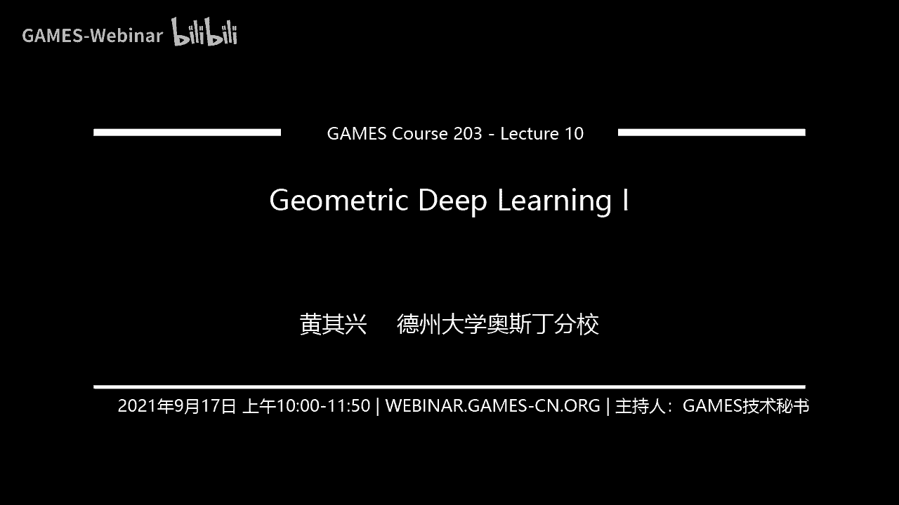

# GAMES203： 三维重建和理解 - P10：Lecture 10 Geometric Deep Learning I - GAMES-Webinar - BV1pw411d7aS

大家好啊，那我们今天接着上课啊，我下面几节课呢，我想想一想，有一个就是比较时髦的名字，叫起来这个电的你吗，嗯其实呢啊我在讲这个之前吧，我就想讲讲，就是因为这是一个提高课嘛，很多人打分很多。

听了大家都是研究生，对不对啊，就是这个我想讲一个什么观点呢，就是有时候他有一个学派的问题对吧，嗯其实说three d呢，呃大部分人啊现在都发私语片啊，你包括我像我以前导师对吧，包括我一些club的。

大家都发自语片啊，对不对，然后那个他有两个学派是吧，一个就是rm，就是既然你视觉这个方向的这个学派对吧，实际上就是说这一套人做东西呢，它会比如说呃它会从这个就是比较更多的是倾向于learning对吧。

就是比如说减轻一些具体的问题对吧，嗯你像在这个网络omatic，对不对，嗯，你包括这种image base对吧，这种three d的东西对吧，这是vision的一个学派啊。

注重注重呢就比如说data set对吧，然后就是说把一些vision的处理手法对吧，把应用到three d来啊，还有一个学派呢就是从重新学对吧，其实就是几何处理对吧，就讲the processing啊。

这这个这个学校来着，他们其实就是说这些人呢背景比说都是做做这个diredefom吧，match processing对吧，强调的是什么，强调的是我们是有一个连续的这个观点吧。

就连续的这个呃continuous max对吧，然后我们把disp哎这部分人呢啊做做做节目，就做做低能呢相对来说就比较principal一些，比较principle一些，我的我不能说princible。

其实两边你从学术的角度来说，我觉得都是有嗯很很好的一部分对吧，但是就是说从呃就是这部分他做的这个风格不一样对吧，其实我觉得就是从长远来看吧，嗯也包括我们以前在这个做这个。

在surface上面就是全面上面做这种处理对吧，现在我们来做deep learning啊，就是说啊我觉得就是说有很多东西我们可以探探讨探索，呃，我我今天我会发几发几节课，讲一下这个gmc能力啊。

这是在这里面呢，呃有一部分今天要讲的一部分东西跟那个special deposit这些bola research，让他们他们07年有一个state of brother report对吧。

就是嗯你包括像这个在重庆学院里面怎么跟像这种special的词对吧，你包括final max这些东西通通都是相关的，嗯它实际上呢呃也是牵涉到一个三维ship。

就three d shape怎么表示的问题啊，three d这个ship怎么表示的这个问题啊，这些东西通通都相关啊，我就是希望就是比如说开这门课啊，我觉得就是说你不仅仅是技术的一篇文章的吧。

你记住这个学派，其实吧我个人感觉啊，就是说你不管deep learning怎么发展，你包括能deep learning之前啊，其实这个学派也存在什么大学研究的手法不一样。

我觉得地图的你并没有改变这个学派的这个东西提升啊，那可能改变了，比如说那个performance改变了c不了的technique，但是学派我觉得并没有太大改变啊，对吧，就是你我自己的话。

我反正两边我都都有对吧啊我我我觉得就是对都有好处啊，都有好处啊，我觉得我觉得就是你包括我们上节课讲的，那肯定是计算机视觉的学派啊，啊计算机视觉的学派啊，那么今天要讲的就是计算机重新学。

就讲讲positing的学派啊，啊这是我开头要给大家谈一点自己的观点吧，好那我们下下面开始讲好吧，你们会有一些数学符号对吧，我就提一提对吧，我觉得就是说呃呃这个srt其实mc boy time对吧。

他在那个我爸那个three d tv有讲过对吧，我就是讲给个pop可以可以听听听听，那个听听听听，那个啊就是他他这个flag上面有，我还是我就拿出来讲一讲自己的一些观点对吧。

我觉得这些东西往往是最重要的啊，啊就是说分段就说几何，就三维这个东西，它最大的体量是不是就是从一个欧式空间对吧，比如说就是image或者是这个video，它比欧式空间对吧。

然后呢我们现在就是把它变成了这个非欧的这个空间，这样我们在上面并convolution，对不对，convolution对吧，就是咱们在这个three d data上来定义对吧啊。

这个东西呢往往他是很challenging对吧，因为其实我们马上要看到它最大的一个问题，你比如说keep boy，比如说dnn这些东西对吧，非常非常流行对吧，它实际上它有一些很优秀的性质嘛。

比如translation visangergy对吧，他是ability of quality，但是这些问题嘛你到了曲面的losd上面是吧，如果你在曲面上去做对吧，就是我们当时讲的point cos。

它有一些别的处理的方法对吧，包括in business service，我还有就是别的处理方法，那么那么我们把它变成一个显示的这一方面对吧，displeases这种web page上面对吧。

就比如说match对吧，比如说一个primary sy是一个全新的match，哎真正上面定义呢它就会有很多对吧，你going to nulean，对不对，那那就会出现很多challenges，对不对。

哪有clean什么的，然后有clean的，其实其实在这个visual computing嘛，就是计算机视觉，计算机是同一学这两个方面嘛，啊所以是比较比较常见的这种比较常见的这个它就是有两种表述吧。

一个是manifold啊，一个是manifold啊，还有一种就是这种graph对吧，这种graph啊啊这是两种常见的表述形式啊，就dep，其实我们在图形学里面讲的这种graph呢。

你跟那个social network里面的graph呢当然有一些不一样对吧，因为你他同一学里面这个grap它实际上它还是有一个on the surface对吧。

这个概念在这里面跟那个搜索network那种grap它的它都不一样的对吧对吧，对不对，就是说实际上就是说你那问题就是来你怎么在怎么在这个呃，就是说你怎么在fo的空间上面来定义这种competition。

比啊，这种convolution这种structure，对不对啊，就是这种，而且你要快对吧，你要快啊，这个challenges对不对，然后呢第一类方法呢。

其实我我觉得这个东西呢就sallocation graph manifold，这个东西是非常好ful啊，实际上它有这个呃，它有非常跑火的这个这个这个理论啊，呃跟machine learning很相关。

你就grapc是sm循环能力，这些东西都统统都是非常相关的啊，然后ctrl c对不对，呃，我会讲讲这方面的东西啊，我觉得跟大家补一补其实有好处对吧。

然后实际上呢你说这个东西为什么跟deep learning相关，那就是因为这个选手啊，劳拉这个东西给你种了呃，给了你一种representation啊，让你来做这个东西啊，好吧好。

那我们首先讲讲这个graph theory对吧，graph theory啊，其实就是说，呃其实你是这么想嘛，你这个graph上面也说扛不住血，首先你要给他一种代数结构是非常抽象的这种概念啊。

给他一些代数结构，那这个地方呢我就简单讲讲这个什么是这个grafs这个东西呢，啊比如说你在这个单位super learning，好吧，嗯上面再也经常出现啊，grafpsection learning啊。

graph呢实际上它也是不仅仅是表示data嘛，有时候你organize connection data，你这么qu图的表示它也是很重要的对吧，the graph theory。

它就是waited on the graph tee，what is this edges对吧，h with对吧对吧，它其实这是一种非常基本的这种图的表达形式。

然后he was very with a for that，对不对，就是说它实际上就是说你给了两个mac对吧，然后你要你要在上面定义这个就是定义一个inner product，就是两个fashion。

对不对，两个bank之间的inner product，对不对，这样你就有了距离的概念对吧，然后你就可以定义这个呃beautienergy for air对吧。

就是说实际上是呃每个每个那个图上的这个function它都有都有一个energy对吧，比如说这个的ition energy就是manager，这个这个f是都是木子啊。

就是说实际上比如说你如果一个fashion是吧，就每个国家只有一个词，如果相邻的那两个我他距离很小的，那这个东西就比较smooth对吧，哎这个单品其实很有意思。

这个sona实际上就是这个古拉普拉斯拉不拉拉布拉对吧，这个东西对吧啊，这这这个东西呢实际上就是说它有很多华为从这后面会讲到，你比如说这个德尔塔这个这是一个什么。

这是一个n乘n的symmetry mazing，对，比如说它的最小的特征跟他一定是零对吧，第二个最好是能跟大于零，单是简单，这个grave connected，对不对，然后这个mandy的决定。

你这个graph多多多对吧，呃多connected的就是就叫做代数连通性啊，这些东西，ok remain manifold in one minute对吧，就是说然后我们再讲讲这个黎曼弥漫这个流行嘛啊。

这个东西呢实际上就是给大家一种什么概念啊，就是说低音要知道就是前面我们做的这个东西啊，它是他是在从连续中来的对吧，连续中你比如说你可以定义啊，这个这个我觉得讲比赛的时候，大家可能会骗我对吧。

比如说每一个点上面有个tangent space，对不对，有个tangent space对吧，然后那个你们几个你们的曲率呢。

它实际上就debu这个就是在这个in pagrain the product对吧，然后呢你是个scale seed对吧，实际上它是就是把你连续的东西变成离散，变b站的东西变联系嘛。

然后你可以向这个你可以定义两个fashion之间的这个in the pdp，你还可以定义两个black of use对吧，这个reacuse in the pdx，对不对，然后呢。

然后这个my plant operator对吧，这是一个fashion对吧，你是一个fl去，这些符号可能很复杂，你如果没见过这个东西，我觉得没关系啊，就是说它实际上就是说实际上是表l l q。

就表示这个流程上面的一也一个一个就是严格意义上讲，就是它的二维积分它是有限的啊，但实际就是任意的fashion嘛，这是一个smooth，一个continution，就这么去理解好了对吧。

然后有个operator的概念，就是一个fashion进来对吧，acquire operate对吧，就等于负等于这个for diversion，可以gradient对吧。

然后这次we这个gradient divergence是吧，昨晚都grade上满足这些形式，对不对，这些，对吧，对然后然后然后呢你就会有一个这样的东西。

它就是一个apple填一个diversions和一个那个fashion diversions，对不对，然后他的这个l q呢对吧，然后就等于这个负的diversion of fx乘以f对吧，lpl是吧。

然后这个maples cal joint，对不对，它是这样一种，它是这样一种，对不对，就是你对他是实际上它你可以把它理解成它是一个就是只要是什么，只要是一个就是matrix表示形式，只要是一个对称的。

他就满足这个，然后呢你比如说像那个孙健是吧，现在清华的还有那个王玉书王吧，他们他们以前就是在那个他们已经证明过一些东西，比如说你这个b站这个graph对不对，你一个流行对吧。

你用你的coco function没，然后你就有graph proxy，知道吧，你可以说证明在那个在某种情况下，那个以上的那个拉普拉斯对吧，那这种情况卡不知道这种continur plus啊对吧。

哎这个东西就是你把两者结合在一起嘛，对吧啊，一般情况下呢，就是说如果大家对这个definal前提，或者甚至是基本的这种就是defense manual，这些东西也不是很了解的话呢。

一般情况下你就记一个这种be many of many这个graph，blah blah on graph，它实际上这两页实在就是讲的，他自然是有一个cradio flation。

然后呢比较interesting呢，就是啊你就是比如说你在这个比如说dllation对吧，你在这个国23d e，然后前面讲了一个扩张form对吧，你把每个扩张form把它听到一个what。

实际上他就干了一件什么事情呢，就是嗯就是你把你把所有周围的这个different，是把一个点到到相邻的一个点，它这个低分是v的l相当于围棋l相对于，那你就成了这个dire这种拉法小，可以对吧。

这个t恤呢同样情况会很有意思对吧，其实在graphics里面和大家对这个formation很感兴趣的话对吧，你比如说not function ma editing，包括周坤老师对吧，做过那个破松对吧。

你举一个命令基本可以把它用来做这个可以比如说他们有一种东西，就比如说这个左边这个德尔塔f对吧，这个东西左边这个东西啊，这个东西呢叫做实际上在在在在这个magic formation里面可以写。

这个叫做defensive coda对吧，你可以可以可以可以通过copy page defcon做it啊，这这些工作都是很inferenti啊。

然后呢你在全都mac上面有一个东西叫做contingent in啊，这个东西的话怎么说呢，就是它是一个大家公认的，特别是你全都卖，他相对来说这个配置比较好的时候呢。

这种cos er定理可以使用它来算这个拉八寸啊，好，so ematic notation呢实际上就是你要对另一个max operate是吧，他是满足一种这样的形式。

a级实在是打的那局比赛也是个打个w就和微信内就是stness strix好，到目前为止呢，我们就说我们如果有一个gram，有个match对吧，我们可以在上面第一个拉拉of bridge，对不对啊。

他有很好的这个dereal foundation to continue max对吧，比较interesting呢，其实后面就是讲的就是你这个举证啊，这个这个这个拉拉斯矩阵如果是对称啊。

他的这个leading a matter，它是非常好的啊，就是说他的leading安装mac当时的这个空间，章程的这个空间它是非常非常rich的，非常非常这个呃非常powerful的，非常pop。

很好很好的property啊，你像这个可以看大家以前你可以查一个首位吧，基本上有七七到十个vacation做code remission对吧。

有时候用这个东西还有很很好的quality和quarter remix啊，做back to future design啊，啊有很好的性质对吧啊，deep learning啊。

其实也有很多vacation啊啊然后呢实际上就是说你可以你比如说嗯，然后呢这就是一些线性代数的东西，就是说实际上就说比如说如果你给定了一个拉普拉斯矩阵的，比如说这个dota对吧，他是一个n乘n的矩阵。

然后呢你找那个比如说，发发一犯人怎么就是首先他要正交对吧，他要正交，同时呢他要尽量的实木，那也就是说相邻的我开始之间他这个这个对于每一个杯子对吧，每一个比一个杯子就是一个fashion对吧。

就是可以说max上每个我还是有一个词对吧，它就是一个fashi，然后你minimu是这个东西对吧，那你知道这个ution是什么，如果大家学过前一代懂啊。

就知道这个find实际上就是这个dla master，就是not plus，not flash mac，他的那个那个iphone b，实际上也就是说你最初的那个东西相对来说比较聪明的人。

他就相对来说跟跟那个怎么一点是吧，跟那个什么一点对吧，就是这样子对吧，就是把装备的some negative matrix。

然后就是一个egg fections of a graph of watch对吧，are you on section的graph老师，你可以看，比如说这样一个graph对吧。

第一个iphone fashion他一定是走b嘛对吧，你都你一个constant fashi，他肯定是最死木子的嘛，因为他他那个a的角色平嘛，你第二个东西呢。

实际上这个function呢你就会找一个这个gram to beat的cut对吧，你在cos一边呢基本上都差不多，靠的命运也差不多对吧，你后面的其实也类似对吧，他对吧，它其实这个ios安全的。

比如说呃你比如说在dfs里面对吧，有什么用呢，主要就是找这个不同的basics，不同的basis，这样，然后比如说你在一个mac上面拿一个faction of mankind not fashi。

这种形式对，对吧，他第一个是consoser，后面相对来说相对来说都是这种机型，这种structure，i can think of a manipulation，对吧，ok然后呢我们再讲一讲呢。

就是说那这个东西为什么跟convolution相关呢，对吧，为什么跟栗子和你相关的哎哎这个东西我觉得很interesting对吧，他为什么跟deep learning相关对吧，那我们再讲讲什么。

是就是说我们从就是deep learning从哪来的对吧，我我在那个ut讲一门课叫计算机重新学啊，讲讲一门课叫计算不计算机视觉，那我们最开始讲讲什么。

ftering filtering就image filtering就是对吧，这个这个是低不了你的基础对吧，其实你说convolution它只是有可能的一种形式对吧。

the image sec coseason，seal processing的那个condition base福利啊对吧，那我们首先研究一下the full of layers。

and you glean spaces，对吧，研究这个东西啊对吧，就是说好，那我手机，然后呢我慢慢的就发现跟他跟考的路程相关，然后我们在某几位去想想，怎么在这个这个这个这个这个曲面上面。

我该定义这种考，我录制对吧啊，这个fashion呢是比如说我这个东西大家学那个啊写这个信号处理对吧，其实我们读书的时候，当时讲的叫做，是一门电机系开的课，就是那个什么电视哎，我也那个那个那个歌名搞忘了。

有可能我也觉得不是很好啊，反正就不了了，好像不是微积分学的对吧，就是我微积分也会讲吧，讲这个弗利尔劳了水这种靠文人士啊，就是说你看啊就是说对吧，实际上就是说你你他在你这个里面对吧。

就是说但实际上就是说弗利尔lost是很简单，就是你能把一个fx对吧，把它写成这种形式对吧，就是说你首先k对吧，你首先对这个k你对这个记忆对吧，你做一个积分。

你就得到一个那个complex number对吧，就是一个复数对吧，就是这一块对吧，然后呢你再对这个东西吸回来了，你又会得到原来的感，实际上就是说你可以把一个fx呢把它表述成这种形式是吧。

e i k x这个东西就是cos啊，cos k x加上i sk k k x啊，这个东西它是一种basic，其实它是一种basic的概念啊，哎这个东西我觉得在数学上。

我觉得一个fundamental感觉比较少，特别是这种fashion logic里面，然后对吧，你就对这个机器人做做积分的问题，然后呢然后呢你但这把他可以变成一个复数对吧，然后你乘以这个东西对吧。

那实际上你把一个你可以表示成这个对吧，第一个可以ition乘以这个东西对吧，加第二个乘以这个加上后面的对吧，因为fx它是一个实数实数，对不对，嗯你你那个辅助部分你不用画出来是吧。

你把每个北子的复数和实数部分画出来，然后产业这个东西是吧，就能得到一个这样的使用，很英雄的事情就是什么，第一个就是实际上它有多它的option meme，然后你不懂的基因呢。

实际上是嗯这个口诀表示你在这个谱对吧，这个呃这个谱上面有多大的那个啊，我把系数对不对，就fully conficient对吧，好这个忽略coefficient。

full coffishbasis的这个东西非常有意思，那么one one dimension呢，其实好多时候你知道吗，就是我我插一句啊，我就给他，就是，你比如说你做工程，咱们顶上一个new newp。

对不对，咱们追求的是什么，追求的就是performal最好对吧，performance number one嘛，但其实科学啊，这不仅仅是这样的，你比如说初学好多时候他不追求的是，比如说。

比如说你证明了一个定理，对不对，你证明了一个定理，比如说呃那个哎比如说这个呃那个孪生知识之数猜想对吧，你第一次证明，那当然是，文盲普拉门那个迷城王问了我问哪发生的那杯水，拉普拉斯只要说那个graph。

它永远是sev，这是定义啊，从定义上来讲啊，对啊，你不是smetic的话，从因为我们用的是这个cos form嘛，你可以把一个加上他的那个转置对吧，再除以二就变成image，好好我接着讲，我这个小差距。

我就说你得做数学上对吧，你比如说我们做做做benchmark对吧，你这个陶瓷品，一般情况下你要是cf 2的对吧，你不然不会投，对不对，不然不会投啊，我后面会讲讲，其实也不一定对吧。

就是然后呢输血量是这样的，比如你首先证明了那个防身制作对吧，有有无穷对吧对吧，那后面别人再证明了这个东西有没有意义呢，你如果从vision的角度来说，那没有意义对吧，因为那个东西已经解决了对吧对吧。

那个performance已经到那了对吧，但实际上实际上你往深了想的其实不是那样的，你解决一个问题，你又不能方法，你可能那个方法也带来了，比如说对这个领域对吧，它它是有风发展是有贡献的对吧。

所以数学上呢好多时候啊你build你就是build这种不同的这种学习方法，不同学科之间这种connection和外insi诶，那其实有时候也是能发文章，甚至有些文章是非常fditional啊。

那实际上有时候我画，换句话说，比如说你抽一篇水平啊对吧，你做一些就是做一些深入的分析，对不对，哎你有时候你不一定是devp的一个新的方法对吧，但实际上它也是有fd贡献的啊，实际上也是反对什么贡献啊。

好好，那我们，那我们来讲这个呃fly basis，fully basis呢，对啊，他是问啊，然后呢还有一个什么什么什么有意思的东西呢，比如说福利也在一维，它是什么一维的这个llshoperate。

它实际上就是那个second order解决问题，三个老的dvd，为什么呢，就是实际上就是中间对中间那个值减去两边那个字的和对吧，再to dimension对吧。

在mac上面就是中间那个是减去周围的时候想想加，好那这个时候呢你就会发现这个拉普拉斯，i can expression，对你对这个福利basis求这个二级的这个导数对吧，有二阶的导数。

然后你就发现它等于什么呢，实际上就是说这个fly basis so funchie confession fa，对都是老婆，logicon faction对吧，哎就是拉布拉多opera对吧。

哎哎这个view很interesting对吧，你可能这个东西大家不一定知道对吧，拉interesting啊，那实际上我们这个拉普拉斯在mac上面的拉普拉斯，对不对对吧，i confession。

它当成了这个space，实际上就是实际上就是我们的忽略of alois的一个什么一个推广对吧，如果从这个没用的角度来说，对不对，那实际上我们就说你如果求在在曲面上求了一个拉普拉斯。

i跟你说fk那个fk那个，fk是那个dk的icon，vention的话就是那个平面上的哎，那你实际上对任何一个f你都可以用这个东西来表示的话。

你可以把它变成一个变成可以可以在每个基上面表示一个fashion，对不对，那个福利base就是lpsi confession是吧，就是这种东西，对不对对吧，of flash convention对吧。

就是那个pk的那个gradient，那个那个那个dvd是真的nk乘以4k对吧，然后这个东西好吧，这个是是这样一种形式对吧，ply fply face，it不sha sanction，就是这样一种对吧。

啊这个view就很重要啊，实际上就是你可以把这个选上任何一个fashion啊，都可以用它这种表示啊，ok这个b我觉得很重要，fly了三grass对吧，然后还有一个cgated的东西。

那就是这个he is the fusion of a manifold啊，这个东西呢就跟卡a路线有关啊，这个东西这个这个这个跟这个我们把这个key man啊，这个东西很重要的啊。

然后再讲讲这个这个few mandal吧，就是就the，这个应该怎么翻，我又不翻啊，我觉得还是还是不发为好，这个实际上呢它实际上干了一个什么东西，它也跟这个拉普拉斯这个东西有关系啊。

实际上也会说你说你算这个点，you fusion，你可以在这个拉普拉斯算子，就是这个背景上面去算，就是说实际上他就是说任何一个fashion对吧，他的这个沿着t对吧。

就是他是他是一个time rain your byt的这个，这个gradient对吧，实际上就是等于你在这个点的这个拉普拉斯拉普拉斯对吧，呃热扩散，那不是，这不但我觉得这个有点别扭嘛，我们还是用屁对吧。

但是就是我我个人感觉就是是我们还是国际接轨比较好啊，然后然后他就是一个这种t d e对对，就是说做一个对吧，那个t f t小t3 就是那个gradi，然后这个of the tian equation。

只要你可以，你可以表述成什么呢，可以表示fx t对吧，等于e的负t表款对吧，这个东西是什么呢，这个东西是一个match，是pf 0对吧，这个f b x c ber对不对啊。

这一人负t主要实际上就是说这is financial food对吧，一个matrix啊，这这这这这也是一个matrix啊，啊你可以用那个提示表示啊啊，然后这个东西呢你可以把它写成这个福利basic对吧。

就是说你可以把它写成这种形式，就是用复利的人basic展开，对不对，然后呢你可以把它写成那个f0 x2 x point对吧，你可以把它写成那个，形成这种形式对吧，那里面呢比如说那个那个e的负t。

咱们打开咱们的k是那个在delta的那个dk，一个i跟value，okay，因为里面这个东西呢就可以把它写成一种pel，实际上就是说fxt它是它等于什么呢。

等于integral of那个在这个曲面上对f0 对吧，求极限求积分，然后每每个f0 在x y那个点的contribution呢，就决定就等于那个h t x x方，就是它实际上是两个之间的距离嘛。

可以理解的越近的感觉变成越大嘛，它指定作等等对吧，它是一种这样的形式，然后p的坑呢我们可以看一看对吧，你中间有一个点，然后他们都不断的对吧对啊，你那里有一个点，然后又不让dp对吧，这里有个点不给配什么。

那里有个点，然后也不给，ok，对吧，然后然后那个嗯然后在那个最下面那个点有点学生对吧，好ok然后convolution given to sanctions吧，然后你就可以绕后。

我们就把这个技术完全记着，看到这个东西，然后提问这个这个是黑的kernel啊，黑的kernel对吧，就是在一个点越靠近一点，它就越越大啊，然后呢我们再讲讲convolution好。

现在我们来讲convolution，这个我们有了一些preparation以后，然后我们再讲讲cvs的conclusion，很很显然对吧，他是那个地址，你的基础对吧。

然后我们现在想想怎么把这个东西用到这个曲全上去啊，怎么把这个东西用到全面上去对吧，然后你有两个section呢，它的convolution实际上有这么低的那个fx方减x x方，把dx方都这样。

然后这个conclusion呢它有一些properties是吧，有个shift in rain，对吧，然后一个convolution seven fully transform segmas。

composition，convolution，can be computing fully，呃，弗利种类对吧，就是两个东西都convolution对吧，得到那个fashion呢实际上是什么。

实际上你就可以把他们每个fashion做忽略变换对吧，然后你在那个复列变换呢，你把他们的图存在一起之后，就连续往存在一起，然后再做一个荧幕初略传统是吧，这也可以得到这个convolution对吧。

这个convolution sir对吧，convolution con就比如说两个对吧，你可以对吧，但如果你是给定了两个vx的话，会考我数学，那就是这种形式对吧。

那个那个中间那个记忆实际上就是一个叫做srance matrix，对啊，实际上你可以把它打开官网，反复裂飞行，你可以把它打开官网啊，就是fi实际上就是那个复裂飞机的啊，那集忘记他说他的普嘛，对不对。

然后就是卡不住跟sir啊，然后呢你可以把它变成这样的形式，对不对，那第一个呢实际上你就是对这个f做普列变换对吧，乘以那个mac形式，这样这样的话就是你你首先对f go忽略变换，对不对。

然后呢乘以这个t的那个对吧，然后再用was full transform对吧，好，然后呢有了这个有了这个convolution以后呢，我们就可以想想怎么去定义这个special conviction。

special conclusion，就是你两个就是在曲面上两个gcb方案是要log对吧，就是说你可以你首先对什么，你首先用那个富力杯子晒黑，你记住啊，这个东西是在一个局面上对吧。

一个曲面上我的那个拉普拉斯和max对吧，然后你就可以对这个用fk呢，你首先算出对吧，你觉得夸张，你的复率被首先算出每一个bank的基，每个翻译是coefficient，就是复利非coefficient。

然后你把那个for coeffen在一起对吧，然后呢你再说再占用这个范畴，把他家里选择到了一个英文处理，全错是吧，乘以x x o对吧，乘以这个φ的四乘以f中间那个形对吧，他就是这就是那个东西。

但这个东西呢当然他不是shift in bon，因为他special这种convolution是吧，ok好那我们现在就现在就想想，我们就是有像我们我们有一些组合。

我们研究了这个是这个special alysis对吧，我们研究了这个his decision是吧，然后研究了special convolution，对不对，当然他不是那个shift spin。

他不跟那个传统的这个东西还是有点差别的好，那我们现在下面要讲讲，就讲讲这个东西，有了这些东西以后，大家怎么在这个graph上面或者mac上面所顶着你呢，地图内我讲了小满主题。

不是你他还是有很多不同的形式，这种东西呢它是一种它是跟这个special lol相关的啊，后面我们会讲一些这种对吧，这种这种local的那个covolution这种东西啊，我们会讲这些东西啊，然后。

然后那个我们会，然后我就会想啊，这是第一种啊，就是说那个多呢对吧，这个现在在慢慢又在外面一，你也定了一种叫special engers，special这种平a啊，实际上他干了一件什么事情呢。

就是说你首先想如果你在你他就说在grap上面做兼任，无非就是grap上面对吧，你想英语上做cn就是你每个品凑一个值对吧，然后你最后每个新手对吧，当然我们会做一些处理啊对吧。

那每个pm上面会有一个special bor，是不，实际上每个layer呢，你是把一个pixel的一个b shmap到另一个layer的demer对吧。

the convolution expressing structure，后面就是g对吧，然后你有一个fan对吧，你有个w有个fc转成cf是吧，有次跟n和n乘n的w都没举手。

n然后special pscomb对吧，对吧，那是欧平方cp对象，for input to transform是吧，on no ground tia，special special。

no patient of you是吧，所以说它实际上是是无无非呢，但是呢这地种就是早期的这种操作模式，然后他他满足是什么花呢，就是把一个比如说国际上每个点有一个value对吧。

经过这个东西转化也会变成另外一个value是吧，变成另外一个function吧，现在是一个function出去也是一个function对吧对吧，实际上这个东西呢你如果大家你如果我对吧。

我们这个这个这个nbbk什么样子，就这样啊，all right对吧，然后我们还要提的，比如fal map啊，就这样有很多研究，然后我自己研究对吧，你可以就说这把你可以把那个fashion of f。

这个fashion map我对我记得我08年吧，09年19年是吧，我前前那个max来这个game什么就给过一个那个top，你们讲过fman好吧，你可以把那个把那个那个slides翻出来再看看好吧。

把那个套餐啊，如果大家有兴趣的话，我个人感觉30卖我现在做的研究，我感觉fashima其实你可以把它用它上来，a boy太多啊，反正这个东西我觉得有点远啊，我觉得这个东西很好啊，就是只要是线性的结构。

我觉得都是很好的东西对吧，你可以把两个呃两个那个shift之间的这个这个map对吧，有facial的东西来表示，对吧，然后呢你也可以就是说当当然就是说如果你对啊。

你如果对这个用用这个东西来做做做deep learning的话，牵扯到一个问题，就是说你这个对吧，你应该怎么把它变成cc啊，把它变成cc，对吧，实际上呢就是说这个东西实际上是说呢就是说呃这这篇文章。

比如说那个117年嘛，就是这个eric avc e对吧，就是我我一个实例吧，就是上次那个他也来这个game，应该应该做过嘉宾吧，然后那个说比如说three d上面。

如果我们要做这个special的这个东西呢，比如说你首先我们要有一个basis对吧，有个basis如果要说地图那种的话，也有个杯子，可是拉布拉跟杯子nblush mit的问题在哪。

就是你把这个shift换以后啊，哎你把这个shift换了以后，你这个basic变了对吧，你不像image image，它是一个rapper on main，真的如果我们做npc basis的话。

那个rap怎么不管你那个里面的东西怎么变，对不对，他不会变的对吧，它不会变的对吧，上面呢如果我们做出来找老老粉丝了，你你两个，比如说human是吧，你这里三个human model对吧。

你不能听懂mode，你这个杯子是不一样的对吧，那这个时候就切出来一个什么东西呢，就是我们在用这个basis表示这个fashion的时候，就是我们首先要把这个base要把它做成lion吧。

或者叫做calibration对吧，把它对对齐，对不对，哎那这个时候应该怎么去对齐呢，比如说你怎么去对齐呢，比如说你special analysis，对不对，他如果是用c basis。

它实际上就是do not general costal main对吧，你比如说你可以当然你可以像这种conclusion pure special面，你看这个东西很有意思啊。

这就special loss，然后做deep learning呢，你加一个文书对吧，就是你这一这个雷也出来的时候，你加了一个人录就spc，但是他的问题就是你不同的走位。

但是但是就是说实际说你觉得ly这个东西就是因为因为他的这个，因为他的这个这个这个这个杯子它不不对齐对吧，如果你你用不对齐的杯子去学的话，你得到的实际上就是什么。

你得到的实在是热的这个basic videbasing vide，对吧，对吧，那我们怎么怎么来用这个怎么怎么改进这个问题呢，就比如说这个对吧，他们那就是我们怎么办，我们加一个transformer对吧。

我们就是加一个transformer指的就是说我们给一个shape做input的对吧，我们去学你怎么把这个怎么把这个basis给给calia在一起对吧，category在一起对吧。

就是把那个杯子给calibrate一下对吧，然后然后你做芙利尔来做这个，然后你做这个special标准对吧，哎就是你把这个时间special field就是信号处理里面的filter对吧。

哎这个special那个对吧，然后你搞完以后，你再把它怎么样，你再把它参数出来对吧，传出来，然后你在做在做，因为处理穿什么在走的路是吧，transformer现在很火对吧对吧。

他former现在是不是很火啊对吧，transformer应该是很火的对吧，哎好吧，哎那这个东西呢我就跟大家讲一讲对吧，就是这个我觉得这都是很不错的东西对吧，其实你像这个传说嘛。

上上次我们讲point net也有个传说嘛对吧，他只是他是那个是什么，那个是在那个special的懂main对吧，在那个special的走位，我们我们把那个给transform一下对吧。

诶那在这个在这个情况，它是那个special呢对吧，你去做一些transformation，那个transformation对吧，然后这就是一些一些结果吧，好吧，就是normal prediction。

using a special，这个one network ridict和这个光球很相近啊，然后你会发现有一点我就希望大家看一点啊，就是说你可以看出就实际上就是说你比如说上面跟下面对吧。

你会发现有那么几个特点吗，第一第一点就是你发现没有第三个人prediction，因为它是用那个special bation是吧，这个predict相对来说是比较沉默对吧，相对来说比较实墨子啊对吧。

对不对，跟光子true相比对吧，第二呢就是有些特别小的那种形式来，看不到他用的这个杯子有些关系是吧，你知道那个special basis在有什么好处，他就自动的给你做了一些regalization对吧。

然后你可以做shift entation对吧，专属内容好吧，我那个今天不好意思啊，我今天那个就只能讲到这好吧，因为我那个下面呢我还会就下个星期呢我会接着这个讲话，那个。

我今天主要是给大家就是我们回忆一下吧好吧，然后给那个大家讲一讲，就是我们看看我们在讲些什么东西啊，就是我们讲的就是学派的问题对吧，第二点呢我们就讲了这个batural losis对吧。

这个忽略basis对不对，就是同一学校，实际上好多时候就是说你知道了这个为什么，就是后面我们讲了这个呃fly fly fici讲了这his devision是吧，然后我们就讲了convolution。

convolution对吧，然后我们这个special上面的commotion是吧，就是利用这个poly basis，对不对，上的fly basis就是那个llash opera diao max对吧。

啊然后，我想讲一点，你就发现什么，其实其实说白了为什么我们要研究数学，就是数学，实际上它就是不让你一个抽象的做一些抽象嘛，你如果能把一个结果能把它抛到一个抽象的上面去，那就有什么好处啊。

就是你只要能把一个东西抽能抽象到那上面去对只要那那就能对吧，那你就能那个什么是吧，那你就能套用那个结果对吧，你像这个地方嗯对吧，那个拉我们知道这个卡我那个那个对吧，就是那个fly basis对吧。

那个fly basis它实际上就是那个拉拉拉布拉萨那个operators ex的，是有那个东西对，我就能把那个头像过来对吧，好，我们下节课会接着讲这个叫magic deep learning啊。

我会讲一些深入的东西，好吧好。

