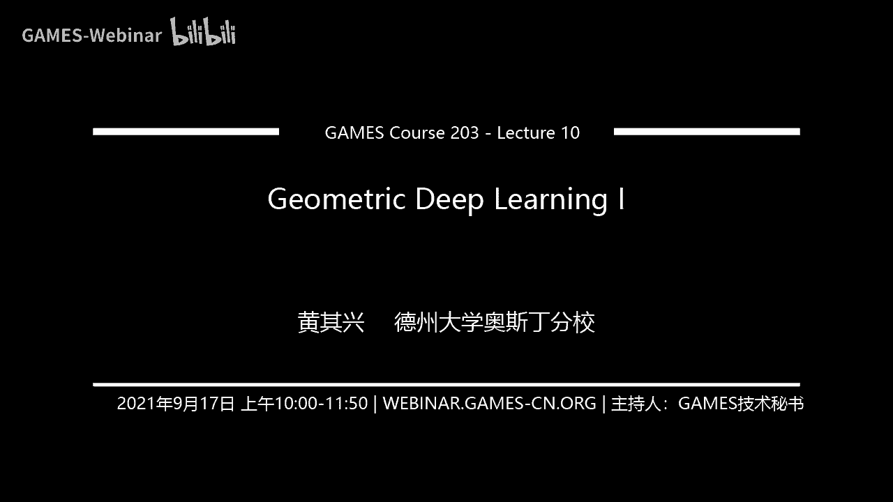
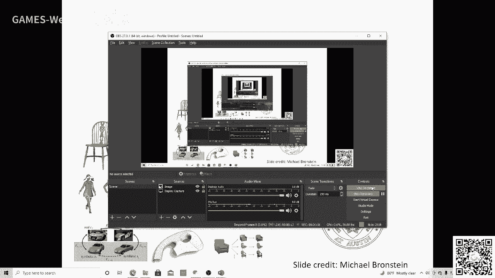
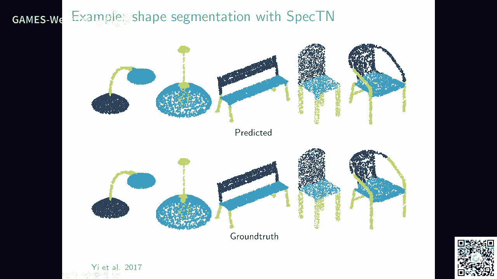

# GAMES203：三维重建和理解 - P10：几何深度学习 I 🧠

在本节课中，我们将探讨几何深度学习的核心思想。我们将从计算机视觉与几何处理两个不同学派的视角出发，理解如何在非欧几里得空间（如三维网格或图）上定义卷积等操作。课程将涵盖图论、流形上的拉普拉斯算子、傅里叶分析以及如何将这些数学工具推广到三维几何数据上，从而为深度学习提供理论基础。

---

## 学派之争与核心问题 🤔

上一节我们介绍了基于计算机视觉的三维重建方法。本节中，我们来看看几何处理学派的观点。

三维数据处理存在两个主要学派。计算机视觉学派倾向于从数据和学习出发，解决具体问题，例如基于图像的三维重建。几何处理学派则强调连续数学的观点，如微分几何和流形处理，其方法更具原理性。

从长远看，两个学派各有优势。几何深度学习旨在探索如何在三维形状上进行深度学习。这涉及到三维形状的表示问题，并与谱图理论等数学领域紧密相关。

三维数据最大的挑战在于其本质是非欧几里得空间。在图像（欧式空间）上定义的卷积具有平移不变性等优秀性质，但在曲面或图上定义类似操作则困难得多。

在视觉计算中，三维数据主要有两种表示形式：
*   **流形**：如三维网格表面。
*   **图**：表示点与点之间的连接关系。

核心问题是如何在这些非欧结构上快速定义卷积等运算结构。

---

## 理论基础：图与流形 📐

为了在图上定义运算，我们首先需要为其赋予代数结构。

### 图论基础

图由顶点和带权重的边构成。我们可以在图上定义函数，并计算两个函数的内积，从而引入距离概念。

图上的平滑性能量可以定义为相邻顶点函数值之差的平方和。最小化这个能量，就得到了图的**拉普拉斯矩阵** **L**。

**L** 是一个对称矩阵，其最小特征值为0，对应的特征函数是常数函数。第二小的特征值反映了图的连通性，称为代数连通度。

### 黎曼流形简介

流形是连续的曲面。在每个点上存在一个切空间，可以定义内积和曲率。我们可以将连续的概念离散化到网格上。

流形上的拉普拉斯-贝尔特拉米算子 **Δ** 是一个关键概念。它是一个作用在函数上的算子，定义为梯度的散度：**Δ f = - div(∇ f)**。在离散网格上，我们有对应的离散拉普拉斯算子。

离散拉普拉斯矩阵 **L** 可以看作是连续拉普拉斯算子的离散近似。当网格足够精细时，两者会收敛。

---

## 从傅里叶分析到几何卷积 🔄

上一节我们建立了图与流形上的拉普拉斯算子。本节中我们来看看它如何与卷积联系起来。

### 傅里叶基与拉普拉斯算子

在一维信号处理中，傅里叶变换将函数分解为不同频率的正弦和余弦波（基函数）的线性组合。函数 **f(x)** 可以表示为：
`f(x) = Σ (a_k cos(kx) + b_k sin(kx))`
其中系数 `a_k`, `b_k` 表示该频率成分的强度。

一个关键发现是：**拉普拉斯算子的特征函数正是傅里叶基**。对于一维拉普拉斯算子 `d²/dx²`，有：
`(d²/dx²) e^(ikx) = -k² e^(ikx)`
即，傅里叶基 `e^(ikx)` 是拉普拉斯算子的特征函数，特征值为 `-k²`。

这个观点至关重要：**我们可以将流形上的拉普拉斯算子的特征函数，视为该流形上的“傅里叶基”**。任何定义在流形上的函数，都可以用这组基展开。

### 热扩散与卷积核

热扩散方程描述了热量在曲面上的传播过程：
`∂f/∂t = Δ f`
其解可以写为 `f(t) = e^(tΔ) f(0)`，其中 `e^(tΔ)` 是一个算子。

利用拉普拉斯特征基展开，这个解对应于一个卷积操作：`f(x,t) = ∫ h_t(x, y) f(y,0) dy`。这里的核函数 `h_t(x, y)` 就是**热核**，它衡量了`y`点的初始值对`t`时刻`x`点的影响，距离越近影响越大。

### 定义几何卷积

在欧式空间中，两个函数的卷积定义为：
`(f * g)(x) = ∫ f(y) g(x-y) dy`
它具有平移不变性，且在傅里叶域中变为乘积：`F(f * g) = F(f) · F(g)`。

在流形上，由于没有全局的平移概念，我们借鉴傅里叶域的视角来定义**谱卷积**：
1.  用流形拉普拉斯算子的特征基对输入函数进行傅里叶变换（即计算其在该基下的系数）。
2.  在谱域（系数域）中与一个滤波器（一组可学习的系数）进行逐元素相乘。
3.  将结果用特征基进行逆变换，得到空间域的卷积结果。

这种卷积不是平移不变的，但它利用了流形的几何结构。

---

## 几何深度学习架构 🧱

有了谱卷积的定义，我们就可以构建用于三维几何数据的深度学习网络。

早期的图神经网络可以看作一种空间方法：每个节点的输出是其邻居节点特征的加权和。这可以写成：
`F_out = σ( L F_in W )`
其中 `F_in` 是输入特征，`W` 是可学习权重矩阵，`L` 是拉普拉斯矩阵或其变体，`σ` 是非线性激活函数。

然而，直接使用谱卷积面临一个挑战：**基函数的不一致性**。不同形状的拉普拉斯特征基是不同的。用未对齐的基进行学习，相当于在错误的坐标系下学习滤波器。

解决方案是引入**变换器**模块。网络在学习滤波器的同时，也学习如何将不同形状的谱域基进行对齐或校准。这类似于在空间域中对点云进行变换，但操作对象是谱域的基。

以下是一些基于谱卷积的网络的特点：
*   **结果更平滑**：由于拉普拉斯基函数本身是平滑的，预测结果自然具有正则化效果。
*   **捕捉全局结构**：低频率的特征基对应形状的宏观结构。
*   **需要处理基对齐**：这是谱方法的核心问题，也是当前研究的重点。

---

## 总结 📝

本节课我们一起学习了几何深度学习的基础知识。

我们首先比较了计算机视觉与几何处理两种研究三维问题的学派。然后，我们深入探讨了其数学基础：在图和流形上定义拉普拉斯算子，并理解其特征函数构成了该几何结构上的“傅里叶基”。通过热扩散方程，我们引出了几何卷积核的概念。最后，我们利用谱域视角定义了流形上的卷积，并探讨了如何将其用于构建深度学习网络，以及面临的基函数对齐等挑战。

核心在于，数学抽象使我们能够将欧式空间（如图像）上成功的概念（如卷积），通过拉普拉斯算子这一桥梁，推广到非欧的几何数据上。下节课我们将继续深入，探讨更多几何深度学习的模型与方法。