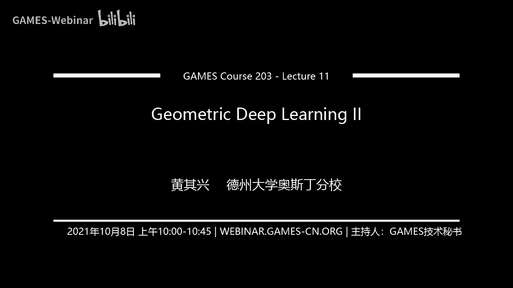
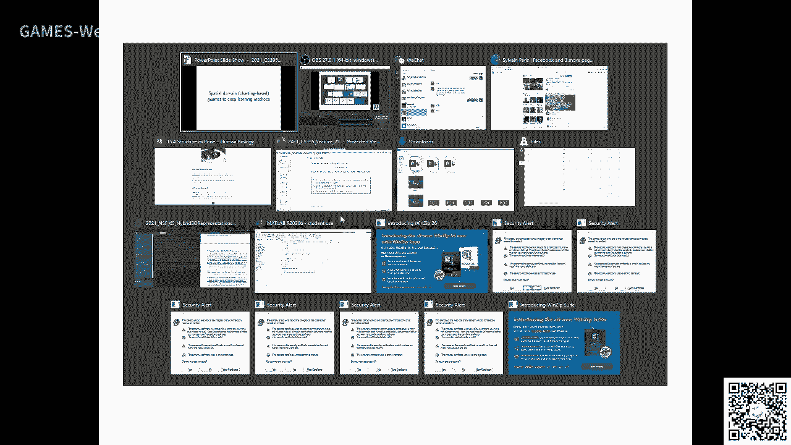
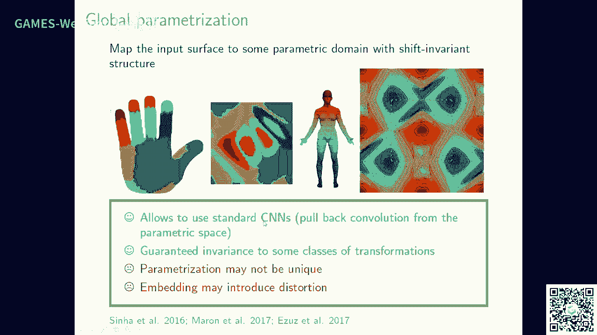

# GAMES203：三维重建和理解 - P11：几何深度学习 II 🧠

在本节课中，我们将继续探讨几何深度学习的核心概念，特别是如何在非欧几里得空间（如曲面和图）上定义卷积操作。我们将回顾拉普拉斯算子的应用，并深入讲解在流形上进行卷积、处理有向图以及解决方向性问题的多种方法。

---

## 回顾：曲面上的卷积与反卷积

上一节我们介绍了如何在曲面上对谱域进行卷积和反卷积操作。其核心思想是利用拉普拉斯算子的特征函数来定义谱域上的变换。

有了这个基础，我们可以进行诸如形状自动编码等任务。通过傅里叶变换，我们得到的是一个在谱域上的卷积操作。

**核心公式**：曲面上的卷积可以通过拉普拉斯-贝尔特拉米算子的特征函数来实现。对于一个函数 `f`，其傅里叶系数为：
`\hat{f}_k = \langle f, \phi_k \rangle`
其中 `\phi_k` 是拉普拉斯算子的第 `k` 个特征函数。

---

## 融合不同基底

在图像处理中，网格是固定的，因此不存在基底不匹配的问题。然而，对于不同的三维形状，它们的拉普拉斯特征基底各不相同。

为了解决这个问题，我们引入一个公共的形状空间。具体做法是：给定一个形状，首先将其映射（或“传送”）到这个公共空间，然后在公共的谱域上进行卷积操作。这个过程可以看作是一种归一化处理，使得不同形状的特征能够对齐。

这种方法能够实现诸如形状分类、分割等任务。你会发现，预测结果与真实形状在某些方面会非常相似。

---

## 在有向图上的推广

我们之前讨论的拉普拉斯矩阵主要针对无向图。但在许多实际应用中，例如社交网络或引用网络，图是有向的（即边 `A->B` 存在，但 `B->A` 可能不存在）。

在有向图上，邻接矩阵不再是对称矩阵。如果你对这部分感兴趣，我强烈建议你研究如何在有向图上重新定义类似于谱域卷积的框架。这是一个开放的研究方向。

一种方法是利用“图模体”的思想。图模体是指图中反复出现的小型连接模式。我们可以为每种模体定义一个邻接矩阵 `M_m`，它编码了节点之间通过该模体相连的关系。

然后，我们可以为每个模体 `m` 定义一个拉普拉斯矩阵：
`L_m = D_m - M_m`
其中 `D_m` 是 `M_m` 的度矩阵。

最终，整体的图卷积可以通过这些模体拉普拉斯的线性组合来定义：
`L = \sum_m \alpha_m L_m`
其中 `\alpha_m` 是可学习的系数。

这种思想的核心是将一个有向图通过模体分析，转化为多个（无向的）子结构进行处理，从而应用谱方法。

---

## 流形上的空间域卷积

现在，让我们看看如何将图像上经典的空间域卷积平移到流形（如曲面）上。在图像上，卷积是在规则的像素网格上滑动一个固定核。在流形上，每个点的局部邻域几何都不相同。

关键在于定义局部坐标系和方向。我们需要为流形上的每个点 `x` 建立一个局部坐标系 `(u, v)`。

**卷积操作** 在点 `x` 处可以定义为对邻域内点的加权积分：
`(f * g)(x) = \int_{M} f(y) g( \text{log}_x(y) ) dy`
其中 `\text{log}_x(y)` 是 `y` 在 `x` 点切空间上的对数映射（定义了局部坐标），`g` 是定义在切空间上的核函数（例如高斯核）。

以下是实现流形卷积的关键步骤：

1.  **建立局部坐标系**：为每个点定义切空间和一组正交基 `(e1, e2)`，这决定了局部方向。
2.  **定义核函数**：在切空间上定义一个函数（如高斯函数），作为卷积核。
3.  **映射与积分**：将邻域内的点映射到切空间，用核函数进行加权，然后积分。

主要的挑战在于如何一致地定义每个点的局部方向（即解决“方向性问题”）。目前有两种主流思路：

*   **定义全局方向场**：在曲面上定义一个连续的方向场（如主曲率方向），为每个点提供一致的方向。
*   **使用旋转等变网络**：设计网络结构，使其输出对于输入方向的旋转具有等变性。例如，`Spherical CNN` 或 `Tensor Field Network` 通过在多个方向上进行卷积并取最大响应，来避免对单一方向的依赖。

这些方法各有优劣，方向性问题目前仍未完全解决，是一个活跃的研究领域。

---

## 与各项异性扩散的联系

流形上的卷积操作与各项异性扩散过程密切相关。经典的扩散方程是各项同性的，意味着所有方向的平滑程度相同。

而各项异性扩散允许扩散速率依赖于位置和方向，这可以通过一个扩散张量 `A(x)` 来控制。其方程可以写作：
`\frac{\partial f}{\partial t} = \text{div} ( A(x) \nabla f )`

这种各项异性的平滑效果，可以通过设计特定的、方向相关的卷积核来实现。换句话说，我们可以将某些卷积操作理解为一种智能的、保持特征的平滑过程。

---

## 在图上的空间域卷积类比

将流形上空间域卷积的思想迁移到图上，核心挑战同样是如何定义“局部坐标”。在图上，节点没有天然的几何坐标。

一种思路是为图中的每个节点学习一个特征向量作为其“坐标”。然后，可以定义一个基于节点“坐标”之间距离的高斯核，来进行加权聚合。这类似于图注意力网络的思想。

另一种更结构化的方法是利用图的**对偶图**或**线图**。例如，线图的节点是原图的边，这样可以更好地捕捉边与边之间的关系，在某些任务（如分子图生成）中非常有效。

简单来说，如果你的节点编码能更精细地反映其局部结构信息，那么在此基础上定义的卷积操作效果会更好。

---

## 可参数化曲面与卷积

最后，我们简要讨论可参数化曲面（如一张映射到平面圆盘的曲面）上的卷积。在这种情况下，输入是三维曲面，但我们可以将其参数化到二维域上。

这引出了一个重要问题：参数化的选择会极大地影响后续处理。不同的切割和展平方式会导致不同的二维参数域，从而影响卷积核的定义和效果。

因此，我们需要处理参数化带来的扭曲，并研究如何使网络对此类扭曲具有不变性或鲁棒性。这一领域仍有大量工作可做，我们将在后续课程中进一步探讨。

---

## 总结

本节课我们一起学习了几何深度学习的进阶内容。我们回顾了在曲面谱域进行卷积的方法，并深入探讨了：

1.  **处理基底不匹配**：通过将形状映射到公共空间来解决。
2.  **推广到有向图**：利用图模体来定义适用于有向结构的拉普拉斯算子。
3.  **定义流形上的空间卷积**：核心在于建立局部坐标系和处理方向性问题，这是与图像卷积的本质区别。
4.  **与各项异性扩散的联系**：卷积可以看作是一种特征保持的平滑过程。
5.  **在图上的类比应用**：通过为节点赋予特征坐标或利用对偶图来定义卷积。

总而言之，在非欧几里得空间上定义卷积，其核心挑战是如何一致地定义每个点的**邻域**和**方向**。虽然已有多种方法，但这仍然是一个开放且富有挑战性的研究前沿。