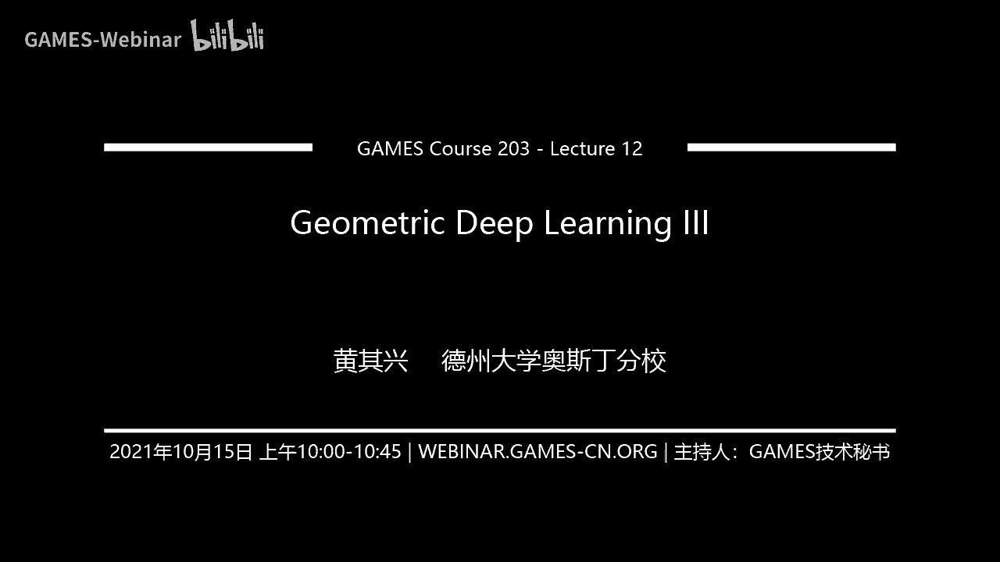
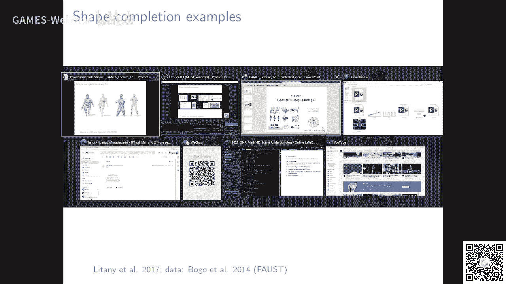

# GAMES203： 三维重建和理解 - P12：Lecture 12 Geometric Deep Learning III - GAMES-Webinar - BV1pw411d7aS

能听见能听见啊，好好我们接着上课啊，那个还有三节课啊，这节课我们把这个你想买这个这个深度学习给别人去玩啊，因为这个这个讲课的这个形式吧啊就是嗯像这种提高课，他有说有很多technical的东西对吧。

我们这种就是这种远程的这种没有什么太多c bank的这种方法，就是我不可能讲的，就是让大家一下子那么空洞，就是这这是一个款式啊，你像我们在在我们学校教学的话，那愿意学的老师。

现在我们是harry的model，英语老师学的学生，这些这些学生还是把课堂来的，你说生来讲好吧，然后我尽量呢我就起个什么作用呢，我尽量给大家讲一讲我自己的对吧。

一些音色就是能能给大家就是说你自己做笔私权啊，什么东西有一些启发对吧，哎我尽量能起到这个作用，好吧啊，下一节课呢我会讲这个hybrid three ver类，是我自己做的一些东西是吧。

这个我可以给你解呃，讲的更具体一点好吧，然后每一节课就是总结一下好吧，然后提一些未来的研究方向对吧，我觉得这个大家应该是很理性的好吧。

上节课呢我们讲这个primetric bomin的这个前面这个地图的方法啊，这些东西实际上就是说啊把一个把一个那个物体，把它拍到一个平面里面对吧，然后在平面里面做参数化，然后呢你有了一个特殊化了以后呢。

你就直接到就是有了这种就是这种to mention这种structure，你可以去做这个做这个深度学习，对吧啊，那一些比如说你像这个glogo transportation的办法啊，我自己也做过一篇啊。

就是跟那个周田老师合作的，它实际上就是说你做参数化以后呢，实际上就是把就给了他一个tomicro station吧，大家可以用这个standard cn对吧，去做这个去做这个convolution是吧。

然后然后实际上它就是environments to some classes transmission，参数化啊，但是这个参数它有时候它也存在。

就是我们第一节课讲的那个讲那个啊special的时候也存在一个问题，就是你这个参数化，比方你可能你这个shift它稍微改变一下对吧，你可能这个传说话他就他就没有了对吧，他他他可能就骗了对吧。

哎这是一个很大的问题对吧，然后这个embedding呢它也会明确就是distortion，也就是说你这个参数化哎，你要让他比如说你像如果是考多么的换的话的话，不像关老师对吧，他说过很多话没有工作。

它只有它实际上它是有一个scaling facts，scaling se，不是一对吧，有的地方很小也很大，这个时候你定义convolution的时候呢，哎它就会出现一些问题，出现一些问题。

然后你比如说然后呢这个有一些有一些比如你要做考核模式呢，它就签到一个这种translation vimeo对吧，但是呢你比如说这分明上它会出现一个什么问题呢，它会有一个这个就说对吧。

他有一个长安来hop server对吧，首先就是你只存，比如说你你只有在一个tals上面，tx就跟一张白纸一样，这个就是这个这个车er的这种ppology。

这个你可以把你可以把那个啊这个托尔斯切两刀对吧，可以把它变成一张纸对吧，它那个上面是没有single的这种东西的对吧，没有single point，你别的你看你看这个衣服。

你不管是这个c2 还是high high g的这种设备，这上面它都是有这个这上面都是有这个single point，single point，single point诶。

这个时候就会牵牵涉到牵涉到一些这个呃singularity对吧，不管是餐桌啊，还是你上上节课我们讲的用very cute，就是去定一个logo画面，基本对他都会有这个问题，就是他说话的话。

那那托斯就不存在这个问题对吧，那你怎么解决high dimension这种这个这个这个东西呢，那实际上你就做一些看，把它cut一个tt这种这种这种举报的对吧，或者就是把它做embedding。

就是一些就是说呃计算机图形学啊，这个结这个结合处理上面大家经常用的一些东西对吧，然后呢你也可以用一些conformal的这种思想对吧，就是说你可以把它cut开，这样就是你把这个surface cut开。

他就可以呃，可以变成一个就可以变成一个只能做参数，变成一个这个呃常规的这个tallest这种propology对吧，你就可以在上面定义的考个路程，然后这里面的这个例in the literature呢。

大家就是说的确就是很多非常有意思的idea啊，比如说你在这个时代是在这秀的对吧，就说你做参数化，一般情况下比如说金的zo的surface对吧，你做参数化，你需要有三个点对吧。

然后呢你选这三个点去去看的开对吧，然后把这个收卡的开，然后呢你就能得到一个传话是吧，那有时候你就会问了那个哪些点呢，去哪些点make sense呢，比如这篇文章就说那我们就多取一点点。

然后做多个参数啊对吧，做这个汤的话呢，以后呢，然后我们把这些结果呢把它给一个人在一起，就做一个这个，比如说ensemble对吧，这个时候呢当你sample很多读点的时候呢，据说他的话你换一个shift。

你也sample很多张很多triplets，哎我觉得这个id很确实，你具体怎么做这个东西，我也对这个东西可能也不是那么强嘛，但这个第二个人可以很确实对吧，我这我再讲一遍。

就是说假设你有两个shake对吧，你要把它给拍成一个平面呃，你像机的是groll的话呢，一般情况下你如果做confer station，那你一般取三个点对吧，当你去三个点具体怎么做，你可能不用那么纠呃。

就不要那么那个就是就写在那上面啊，比如说你就取这个pose for exampling是吧，那你不同的shape就shift变了以后，你可能取得这三个点也在变对吧，这就出问题了，那怎么改变这个东西呢。

你就可以取多个triple，对不对，然后你身后那个结果啊，ensemble那个结果对吧，ensemble这个结果对不对，取多个点以后，in seo这个结果，对吧。

然后这个时候呢你换你这个shift变的时候呢，你这个insulin的这个比较的呀，但第一个缺水的可能不一样，但是你三步的结果应该是我也差不多，就是这个确认是order发生改变对吧。

哎这是一个很popular的idea啊，这时我觉得基本上就是说能更efficient去解决这个，可以随性的去解决这个呃，就是说这个参数化的问题啊，参数化其实是一个很难的问题，一个很难的问题对吧。

你比如说你可以用这个可以用不同的这个参数的话去做闪退，然后把它ap也在这个，啊这是另外一个结果，哎这里面有很多很多英雄是这东西，我包天啊，这些东西。

ok就是说然后你看这个这个gmagic deep learning啊，还有很多lication在graphics for three division啊，我们应该会会touch一些对吧，就比如说。

反正他有很多很多这样的pk，比如说你除了这比如说你有老老实实谁是谁啊，你可以定个pal st对吧，你你可以把它把它p的造型重现出来，你可以找这个corona可以。

然后你可以把这个teenshift deformed profit对吧，用这个前面这个地方，你去算这个比赛地图名字啊啊这个是这个方向呢，我觉得，还是有很多可以做的，还是有很多可以做的啊。

像这里历历史的都是一些传统的是rnature对吧，他们实际上都可以被啊，都可以被那个deep count发给，就是都有一些deep learning的方法重现诶，然后。

比如说你还有这种task for this specific spa，去做respondence，去翻这些行为，这个deep learning我觉得做这些他可能都有一些常驻的进攻强度的进攻。

然后呢呃我们下节课会讲一个这个shift reputation，那个我们讲了，他们讲surface space，然后这个point cloud对吧，我们简单的提了一下。

像换nmentation这种faction，就是他只是说，嗯改进于衣服的，做一个衣服的穿孔，然后做这个mp，然后做fish选手，再把它压根连在一起，就变成一个output。

比如point i有这ation啊，然后你像那个tnt有一些expansion，就是网页对吧，就是那个m i t对吧，他做这个东西就是说我不仅仅是在这个后面上走时，我可以建议写h pture b对吧。

然后你可以做一些方面推荐rvg选手会是吧，on the neighborhood，主要你可以做edge conut，对，做edge polo啊，其实对普通你呢，我觉得在实际上已经发生很多了。

现在其实有点卷了，真的要做比这些的话，我觉得，也可以做对吧，呃我真的我介意的是什么呢，就是说你真的要做这些东西呢，你还是把我以前就是讲这些背景等等的这些东西给找的，老对吧啊。

你有一个很好的对这个整个fd有一个很好的思想，这个是这个是比较重要的啊，这个是比较重要的，基本就是有一个很很好的视角啊，这个非常重要，嗯像这种也许卡不住线，其实思想都很简单。

但是文章反射性甩在也都很高嘛，像这种vigation，你可以有各种吧，你可以not plus some吗，像是max啊，算了吧，这个你像这种g h的一费用的东西，你看你这种bmi graph。

dynamic graph的，对啊你可以用ivable是吧，那你放这些这些可能对这些rap啊，但是最开始这篇文章还说一点呢，就是好多时候啊嗯你可能一开始的时候对吧，你可能一开始的时候。

你这个在一个tx杠呃，demonstrate它的proformance不一定提高了特别多，你看这篇文章又提高了2%嘛对吧，但是对吧，你如果一个方法他比较能填入java对吧。

他就能慢慢的慢慢的提高很多对吧，你想妍妍他们做这个point cn对吧，这也是一个例子吧，比如说啊ok对吧，你可以对啊，你看这个呃像这种dimi grafdm对吧，因为它涵盖它有更多的信息嘛对吧。

直接到嗯，就是已经成为一个呃成为一个这个呃大家用的比较多的一个一个bt了，好吧，我在这里想讲什么呢，就是说你像这些rk 30，就是说我总觉得就是作为事实，不应该一个field。

不应该由一个architecture对吧，或者一个东西给定对吧，其实而是要追求它本质的东西，所以现在本质的东西对吧，其实核心的东西嗯还是点名他是一个exquisition of一个manifold对吧。

我们你不管是破案的还是这个展开为g cn对吧，它实际上它还是有一定的阿特拉分手后，这玩意没什么关nt稍微不一样，到底种更接近于这种，为什么买手机，但是有一些不一样的对吧，有些不一样的啊。

但是归根结底还是要有一些安装一个pcion，对啊，你像图形学这个领域，对不对，我说的是不管是我们做synthesis还是做a loves，还是做这个手柄上的editing这些东西，对不对。

还是说这些东西，归根结底对吧，还是就就那么几个思想对吧，就一个就是manifold的思想，对不对，在上面啊，像这个小much deep learning。

它是一种它是从maniphone这个角度来的对吧，但是你把它第四块dirt成一个match或者dirt一个point out对吧，这方面的工作相对来说对吧，它是有很多变化，简单归根结底他也把他们分成。

还有一种就是appropriation theory对吧，你比如说be supplied privational services对吧，哎a potiation theory。

那么它解决一些logo的问题对吧，哎我觉得吉普森也往在sb上面往后发展，还是离不开这两个东西，离不开这两个东西啊对吧，然后呢当然还有一些别的这个呃应用了对吧，你可以说这个，只用了kn grab。

就这个graph实际上说白了就是说，对吧，这个问题我会复述一下，就d tcn中使用了天国，还有哪些怪物，就是这个flash是什么呢，就是说其实它牵涉到一个什么。

牵涉到你哪些point的之前他必须有interaction，对线point之间它必须它会有inteaction，一般英文是ighboring the point跟neighboring point。

它有一定的pg，嗯，对吧，然后，归根结底还是那些point，还有一些口味吧，我觉得这就是一种paper city东西对吧，一个一个说你可以定一些logo fish对吧。

你可以定义一些这个你比如说这个这个太阳grab cnsa是怎么定义的，到底是specially更近还是比如说model跟进还是什么东西，这些东西都可以可以去探究的是吧，都可以去探究的。

包括你这个ten ten gram应该怎么construct，对啊，这都是可以去探求的，ok当然你像ez和一个抛出来的architect出来，它都会有很多extension是吧。

哎比如s three d d s它是另外一种参数啊，比如说你还可以用这个这个东西作为normal prediction对吧，其实这个比如说这个bgcn。

他跟这个it's a special technique对吧，也能做nor prediction，他们有什么不一样呢，他们有什么不一样呢。

你special technique它实际上它是在一种reduce basin上面做的对吧，它是一种在reduce bc上做的d j c n啊，实际上他是在一种什么被上面说的。

它实际上在一种就是tone，就tm那个level的这种上面做的对吧，做做的这种direction对吧，好你比如说这个match对我们讲过cod，我们再讲讲这个match，comesh，我们上次讲对吧。

所以说啊你在mac上呢你可以定一个ighborhood对吧，然后你可以在这个neighborhood上面做convolution对吧，然后你可以定义很多patch，每个patch他就决定了。

他都都决定一个拍手会太少不了对吧，解local with local with a with，respect gossi，ok这是我们上节课讲的对吧，你比如说你可以你可以用这个gn对吧。

这个graph当中你可以弄一些scription，比如说你可以not discript，它有个training set，比如说他有这个，你可以甚至可以在一个shift上面去呢对吧。

这个相邻点它的这个对吧，它的这个descript要更近对吧，不同的点descript要不一样对吧，可以在一个shift上面去学这个东西呃这个东西其实很对，其实说。

你讲这些东西你都可以不需要光的choose，是不需要光的choose对吧，学每一个点都进行编辑，比如说你像这种t的，可能c的选用这种w k s的这个y y y y x对吧。

然后你可以看出就是说还有一个什么特点呢，就是说你像这种传统的这种hhcl，就是说实际上是用special得到，你会发现在很大一块区域，他这个descriptor它不是那么discrimint对吧。

就是很多区域对吧，他这个变化非常非常小啊，这样的话呢你做mc的时候就不是那么啊不是那么容易对吧，你像这wk稍微好一点，但实际上呢就是黑了hk s，它好处就是基本上相对来说可以very对吧。

就是说你不能shape这个对应的点放个体数字的相近，那那个缺点就是你可能一个source cf上面一个点，那么你可能对应一个围着很多地方对吧，它不是那么几冲w k s呢。

它discriminate有一点，但是它就不能和stm，你看这个学的这个description呢，相对来说它这个变化就更大对吧，同他替考system对不对，继承sim同时呢这个变化也也也也比较大对吧。

哎我觉得这个东西呢你比如说你怎么去，你如果比如说我们要处理sweet shift，那这种比较pop popular in videspic，这是一个我觉得比较比较比较阴沉的东西，比较阴沉。

要硬解释点东西对吧，然后你看这个diaequality comparison对吧，所以才有matches for，就是跟学的这个东西啊，相对来说像那个机械学的东西，它就叫这one is ne。

但同时呢他也是一个什么，它其实它其实是一个啊，就是你可以直接在一个毛手上缺人学的东西，他也不需要那种sense correspondency，对吧，你不要包括说对吧，你可以你甚至你也可以学学一些这种。

但是它有不同training的办法对吧，你可以找一些这个呃这个dk的ground truth for respondence对吧，然后去学一个cn对吧，curing和一个reference对吧。

然后你可以把这两者可以用一个实验去说啊，这两者这两个点之间的那个对吧，这个地图都要尽量去接近对吧，还有不同的学习的办法，那核心呢还是就是说你要有一个基因的结构。

你take a shape对吧啊simple就不断的在这个shape上面做convolution，最好要得到每一个点上面的那个exclu，其实这个东西很影响水平，比如说你如果能在车上面做。

你也可以再切我搜索net work方面去做对吧，你得上每个国泰的这种区别，就这个简单，这个定并不能拧，这个东西应运用还是很广的，运用其实还是很广，啊对吧，呃核心就是你能build一个gram对吧。

那是他们地方看到过去对吧，你可以当然你可以说你可以定一些这个对吧，定一些这个distance就dition distance对吧，你可以去做一些valation，就说同样的道理。

也就是说你比如说这个东西能显著的提高，显著的提高这个比如说ponship match fly，像变不然的引擎推man对像这种这个东西。

实际上这是一种save them on super mamasage对吧，如果你给他一些gm true correspondence对吧，然后你去就是去autimize。

然后你需要training给他bm，他不需要training给他的对吧，你能显著的提高啊，这个还是很好，ok对吧，比如说你可以跟brand intrc map，你可以跟这个九dac对吧。

你看这个相对来说这quality还是要好很多，你电话很多的，但是一个challenge ka你明显看出一个什么问题没有，你们有没有看出什么问题，这个error你看繁体确实map它相似。

它的error变化是比较实木的，你看这个去年出来的对吧，因为你是去那是没个点嘛对吧，其实你没有enforce，比如说什么这个correspondence还要怎么样，他要是mooth对吧，它有光滑对吧。

没有enforce这个东西，哎这个时候呢你会发现这个结果他会有一定的跳跃性对吧，那怎么那比如说你怎么能保证这个这个nt这个descriptor对吧，你做mc的时候，你们怎么能保证它是什么分类呢。

这个需要的时候呢，你就需要在这个上面加一些structure pri，加一些spt structual pri，来handle这个问题，来handle这个问题，好吧这个东西我觉得还是值得研究啊。

觉得我是值得研究的这个shift mine，特别是我觉得你比如说你做一个方法，如果你比如说给你两个shift对吧，你能自动的把一个shift texture全锁到另外一个shift上去啊。

啊我觉得现在这个还没有特别鲁棒的方法，真的就low了，两个shift就能穿出来，还没有特别鲁棒的方法对吧，如果我们能找到特别鲁莽的方法，我们就来解决这个问题，all right对吧。

那你像这个shop cn对吧，那还是存在这个问题，对他有一些突变对吧，也还是有些问题啊，这个像像像这个地方对吧，他就是relatively，它要比别的好，但是你仔细看的话，它还是有些难模式。

像这种local对吧，但还是有些看见没有，这个地方还是有些ption啊，对一些低俗，就是我当你改变部分arc tx，它能变得更好对吧，但是啊你怎么能保证对吧，我就提这样一个问题给大家。

怎么能保证这个东西既不能给这个出来，这个correspond在线上面他们smooth对吧，这个是smooth呢，在image里面有对吧，比如说strual prediction。

但是你在shift上面这个数值它是有具体的几何含义的对吧，比如说你这个diss是要保持对吧，比如说你要保持这个这个mapping，the visu，他要考formal，他要how py对吧。

哎你怎么能对吧，其实你像在grass里面，1998年到2004年吧，呃我2005年对吧，当然这个inter surface mac这个问题大家研究了很长时间啊。

就是比如说最开始用参数化来那个最近就解决优化啊，但是，对吧，但是我说实话我说实话对吧，就是没有一个方法真的能做的，没有一个方法真的就是说到现在为止，你包括上地平线，没有一个方法真的能做的很好。

真的是真正意义上能做的非常好啊，这还是一个challenge，那地图有我敢说，实际上呃慢慢的慢慢的如果能解决这个问题，对我觉得应该是这种是就是open的那个door吧，去解决这个问题。

这个问题为什么重要呢，比如说08年的时候，很久以前那个大赛不出psp的时候去一个公司实习对吧，然后有个人就跟我讲，他说比如说我们当时他是当时做动画，我不知道现在怎么样做动画。

你要把一个这么一个一个一个安排上门，你切到另外一个凹陷上面对吧，当时就是要搞一个这个东西，他们要求就可能在在interactive的环境下，一分钟能搞定是吧，其实这个东西很昂贵的，你做movie的时候。

好多时候你需要很多这样的东西，有时候一帧一帧的去搞对吧，我觉得这是一个不错的问题，对吧对吧，这个这个我是前面这几个slide对吧啊，就是说大家可以去看对吧，就是就是开始开始就是2016年。

其实现在最好的结果也没比这好多少是吧，哎这个方向的进展并不大，对吧，实际上还是有很多问题，像这种non smooth这种东西，就是我觉得他是一个相对来说就是说还是需要解决的，然后呢当然还有一些别的方法。

比如说把cospd变成一个classification的问题对吧，甚至有时候你可以把correspondent变成一个soft correspondence是吧，就是。

呃你怎么解决这个尖锐c ation error，对不对，ok然后解决这个smoothness呢一个potential solution呢，就是用functional man对吧，就是说。

就说你你用这个reduce the basis to realize the correspondence，regularize correspondence。

然后呢你你可以哎你可以recovery correspondence对吧，你可以可以用用那个fashion man，可以去duce这个point west correspond，好那大家呢实际上就。

比如说有很多人他就研究了这个呃，在这个fushmap的这种flow下面，我怎么去怎么去那个比如说你可以实际上这个question one，这个t这个是那个这个interface的map。

不在final的这个杯子下面，实际上最automc对吧，这个f，然后你可以就是说你可以用一种在这个final map上面呢，你可以定一个也可以用于grapdn的。

然后你去match这种corresponding的这个这个这个对吧，然后呢你可以把这个function marks这个framework呢。

跟这个传统的传统的这个descriptor这个framework可能不能结合在一起对吧，就是说你首先算每个shape上的description，算上这个description。

你不直接用这个description呢来做performance对吧，如果我们直接用descriptor来做performance，我们前面讲了对吧，最好也就做到这个样子对吧。

这篇文章呢他做了一个什么事情呢，嗯实际上他是把这个french map这个friend work，把它用用成一种用来做这个strual condition对吧。

就是说我我我给这个单手fal的一些disputed，对不对，你match这个description，同时呢我加个reaccusation，就是说你对这个frap跟我下面的啊。

比如说hrequency fanction，就是那个fast for you，比如说那个就是比如cis那个emc对吧。

你不可能map到那个like a mark of love with low frequens，对吧对吧，嗯这个是不可能match，这这这这是不可能match对吧，这是不可能卖出对吧。

然后你加一个这样的regulation以后呢，你就能改变你就能改变这个这个这个overfitting或者就是nsmoothness啊，但这个问题也没有完全解决，但实际上这个思想很简单啊。

这篇文章其实我觉得这是很有名的，就是说你把它你把这两个东西，你把这两个东西啊spa match以后，然后用fashimap之后，你就spin out的soft for formance对吧。

然后你就可以在这上面加log对吧，你可以在这上面加lo啊，你可以在这上面叫老师啊，对吧，这样子也可以enter and to train，enter and train，它有一个fmp内页对吧。

这个soft correspondence之类，这个时候呢这个fal mac它实际上这个performance加上这个smoothness以后，你就会发现什么比这个是吧，这条线啊。

我们看这个线它实际上是那个conomize那个东西得到的对吧，it's just a fashion map fmap，它要求就是这两个shape。

新的样子还是相对来说比较as x metric environment，对不对，as mc environment，对吧啊对吧，但是在听类似的这种assumption的情况下，你可以看这个课。

基本上接近100%对吧，求这个mona对吧，就是你加了一些，你加了你加了这个stronger production，on the final my framework对吧，和不加这个还是有本质区别。

好吧嗯我这门课我尽量不给大家去讲network design，好吧，就是什么有100个点phone loud的point nt对吧，我我每个network我都给你讲一遍，我也不自己不太喜欢那些东西对吧。

而且我觉得那样其实他对工业界比较有用对吧，我觉得从学数学界的角度来讲，还是我们还是要讲这个framework对吧，各种tech件是怎么发展的，怎么融合啊，我想把最后介绍给大家吧，ok啊alright。

然后你比如说啊这种pop，所以我们可以做这个，比如说你就是这种方式，而这个问题这个就是个fmc，所以我们下面没有完全解决啊，我觉得这个嗯怎么把这个问题完全解决啊，还是需要花一番功夫的啊。

需要花一番功夫的啊对吧，你比如说你input can corresponse，reference shinformation of the reshape，然后，对吧，然后呢接着呢大家就抵上了一份。

在这个基础上呢，后面大家去上一些别的东西，intensive auto improdu，对不对，就比如说你可以啊，这是另外一个architect对吧，就是说比如说你在这个shift上面。

在image上面vh auto encoder怎么把它变到shift上面来，大家做了一些做了一些工作啊，做了一些工作对吧，实际上。

比如说你怎么在point cos上面做decoder encoder对吧，我觉得这个问题没有解决，那mac上也没有解决，也没有完全解决一些工作对吧，比如说decode code，有了这个东西以后呢。

也会用把那个encoder decoder拿出来，你可以做shape of ption，你可以把这个shift左shift of fashi，这个decoder coder是怎么来的，那实际上就是说啊。

比如说image上面做decoding code怎么来的，啊在英语上面做这个，那你就是对这个image simplification对吧，然后对image super resolution对吧。

然后加一些这种convolution，deconvolution是吧，这种就好，哎这个module在mac上面他统一同样的对吧，你可以对match做什么，也可以选择。

像这个地方它实际上是在把不同的layer上面，对不同的这个位置选上面做对吧，然后你再做抵抗路线的出来，对吧，这是一些结果对吧，这是一部的对吧，这是ground truth对吧。

你比如说呃我们可以分析一下吧，比如说就是input对吧，非常smart，这是ground truth对吧，如果你直接用ption service construction。

这答案就是说他自己c不c2 be construction对吧，这个它就相对来说它只能保证这个what太对吧，其他的其他的这个东西统统都没有对吧，哎你稍等一下啊，好一，对吧。

然后你比如说psi co出来对吧，然后你可以找neighbor对吧，找nsnaver对吧，你看这个nesnaver就跟这个网址区别太大了对吧，如果你做这种这种没有对吧，那一种特殊的价格的话。

就基本上还能重建的不错啊，还能重建的不错，你看上面这一排是什么，但是这里面它还会有一些培训的东西，在有些偶尔推荐的东西，就是这个human这个东西啊。

在这个graphic vision里面都相当重要的对吧，你比如说比如说这个human嘛，他直接有很多应用嘛对吧，比如说这种无耻的那条做工啊，这上面呢你比如最近有一些什么这个一些一些数据。

一些three d的这种数据啊对吧，海量的数据，比如说pi应该是在这个房价，现在是一个地震，啊那这个东西呢嗯现在我家我觉得将来会变得越来越重要啊，国内我觉得小薇啊，夜莺啊等等等等对吧。

虚荣啊对啊等等等等，有很多做，我觉得human就是约会越来越重要，你像现在这个imitation learning对吧，机器人去学人的那个performance来对吧，嗯像这种rl。

因为tx能力越来越期待也好，我觉得human在这种方面上会有一些长度的发展，但是你要问我这个human现在那就是你怎么在复杂场景下面对吧，你比如说你能戴个帽子对吧，你穿很厚的衣服对吧。

你能跟这个object有很多interaction对吧，包括你这种对吧，你你在这种很个人跟also interaction对吧，你在这种方面下面上，你怎么去，你怎么去处理这些问题。

你看这些example相对来说它是一些max max这种对吧，就是比较简单的这种remodel对吧，但是你说shape才有vation的，但是我们怎么在复杂场景下面来把这个问题做好啊。

我觉得这是很有用的对吧，你比如说imitation learning，为什么是imitation learning，实际上其实就是人跟物体嘛，人和物体的interaction对吧。

哎我们如果我们要把这个东西重建好，理解好，我觉得不是那么简单，一件事情，就是如果大家有兴趣的话，可以往这方面去看一看，这方面c的set的也不错，哎对吧，你现在都是一些这个混cos来的again。

就是说是一个single human是怎么把human跟这个物体啊，等你包括这个我选择从从从从结了，这是很重要的，对这些都是一些shift combition的那种example好。

今天这节课呢我们就讲到这好吧，然后下节课呢可能时间会稍微长一点，我会讲一些这个自己的东西啊，然后再加以后我们就停课了是吧，然后我这里再花点时间给大家总结一下吧。

我反复强调一个就是这个井买这个地图能领这个东西，我觉得是啊，这个sweet deep learning对吧，我觉得是一个给大家提供了一个思路吧，啊一个思路去思考这个问题对吧。

嗯但是呢如果大家真正感兴趣的，真正感兴趣的，我觉得还是需要打好基础对吧，你可以把我前面那些讲point cod processing，match processing这些东西，你可以再拿过来。

再再再看一看对吧啊，我觉得那些文章主要在我们在课程主页上的那些文章，你可以再读一读，哎我觉得都是很有帮助的，这个three d呢解完这个地图能力呢，我觉得呃，对也就开个头对吧，实际场景桌面也是。

这问题很复杂对吧，on top driving，这些东西啊，各方面都非常非常复杂，非常非常复杂啊，就是说嗯像我们现在研究这个东西，它跟这个实际的这个还是还是有一定的差距的，实际的东西它是有一定的差距的。

好吧就到这好吧，然后下节课你们都来听好吧，我会讲一点多讲一点东西。

