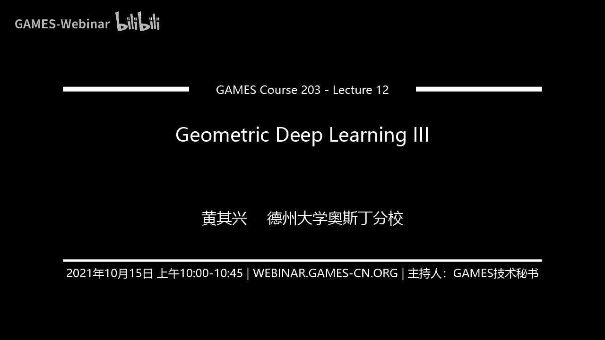
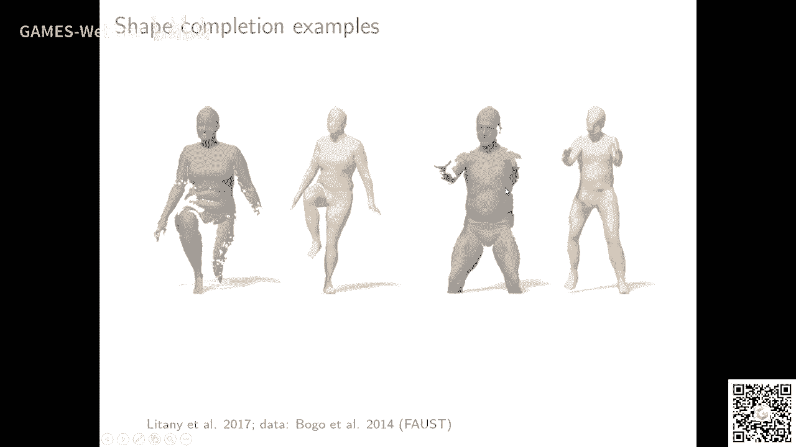
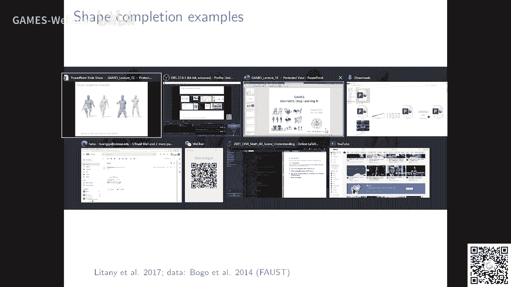

# GAMES203：三维重建和理解 - P12：几何深度学习 III 🧠

在本节课中，我们将探讨几何深度学习的核心思想及其在三维形状处理中的应用。我们将重点关注如何将深度学习技术应用于非欧几里得数据（如网格和点云），并讨论当前面临的挑战与未来的研究方向。

---

## 课程概述

上节课我们介绍了参数化映射的方法，其核心思想是将三维物体映射到二维平面进行参数化，从而获得可用于深度学习的结构化表示。本节中，我们将深入探讨几何深度学习的本质，并分析其在解决三维形状对应、重建等任务时的优势与局限。

---

## 参数化方法的挑战与改进

参数化方法，如共形映射，为三维表面提供了二维的参数域，使得标准的卷积神经网络（CNN）得以应用。其核心公式可表示为寻找一个映射 **f: S -> Ω**，其中 S 是三维表面，Ω 是二维参数域。

然而，参数化方法存在两个主要问题：
1.  **对形状变化的敏感性**：形状稍有改变，参数化结果可能失效。
2.  **嵌入失真**：参数化并非等距映射，存在缩放因子，导致卷积运算定义困难。

此外，对于拓扑结构非圆盘（如具有多个洞或奇异点的表面），直接参数化面临挑战。常见的解决方案包括将表面切割开，或使用共形思想进行处理。

以下是文献中一些有意义的改进思路：

*   **多重参数化集成**：为解决对特定基准点选择的依赖，可以选取多组不同的点对表面进行切割和参数化，生成多个参数域，然后集成（Ensemble）这些结果。当形状变化时，虽然单个参数化结果可能不同，但集成的结果能保持稳定。

*   **应用扩展**：几何深度学习在图形学和视觉中有广泛应用，例如：
    *   纹理传输与风格化。
    *   基于参数化的形状变形。
    *   非刚性形状的对应关系计算。

---

## 几何深度学习的本质与架构

几何深度学习的核心在于对**流形（Manifold）** 的表示学习。无论是点云网络（PointNet）还是图卷积网络（GCN），其本质都是在某种数据结构上定义卷积操作，以捕捉局部或全局的几何特征。

在图形学领域，许多问题（如合成、分析、表面编辑）归根结底都离不开两个核心思想：
1.  **流形理论**：将数据视为在高维空间中的低维流形。
2.  **逼近理论**：例如使用基函数（如球谐函数）进行局部逼近。

当前的研究也探索了不同的邻域构建与信息聚合方式：
*   **邻域定义**：在网格上，可以定义基于测地距离或顶点连接的邻域。
*   **图构建**：在点云上，图卷积需要定义哪些点之间存在交互（Interaction），通常基于空间邻近性、特征相似性或法向一致性来构建图（Graph）。

---

## 形状对应（Correspondence）的挑战

形状对应是三维处理中的关键问题，即找到两个不同形状上点的映射关系。基于学习局部描述符（Descriptor）的方法是主流。

**传统方法 vs. 学习方法**：
*   传统手工设计的描述符（如SHOT、WKS）在某些区域区分度不足或不具备等变性。
*   学习方法（如学习每个点上的特征）可以在不需要精确对应标签的情况下，学习出既具有判别性又具有一定等变性的描述符。

然而，当前基于描述符匹配的方法存在一个显著问题：**结果不够平滑（Smooth）**。匹配结果可能出现跳跃，缺乏空间连续性约束。

一个潜在的解决方案是引入**函数映射（Functional Map）框架**作为正则化。其核心思想是：
1.  在两个形状上分别计算描述符。
2.  不直接用描述符匹配点，而是将匹配问题在形状的基函数（如拉普拉斯-贝尔特拉米特征函数）空间下进行。
3.  加入正则项，要求对应关系映射到的函数是低频的（即平滑的）。

这种方法结合了描述符的判别能力和函数映射对结构平滑性的约束，能显著提升对应关系的质量。其优化目标可以形式化为：
```math
min_F ||Φ_X * D_X - F * Φ_Y * D_Y||^2 + λ * R(F)
```
其中，`Φ` 是基函数矩阵，`D` 是描述符，`F` 是待求的函数映射，`R(F)` 是平滑性正则项。

尽管有改进，但如何在复杂形状上实现鲁棒、平滑且精确的自动对应，仍然是一个开放的挑战。

---

## 自编码器与形状生成

将图像上的自编码器（Auto-Encoder）思想扩展到三维形状是一个自然的研究方向。

**在网格上的实现**：可以通过在网格的不同层次上进行卷积和下采样（编码），再通过反卷积和上采样（解码）来重建形状。这可以用于形状补全、超分辨率等任务。

实验表明，拥有特殊结构的网络能够较好地重建形状的整体拓扑和细节，而简单的全连接网络则只能保证大致轮廓。

---

## 人体形状处理的重要性与挑战

人体形状处理在计算机视觉和图形学中具有重要应用，如虚拟试衣、动画制作、机器人模仿学习等。

当前的研究多集中于简单、裸模状态的人体。未来的挑战在于复杂场景下的处理：
*   穿着厚重或宽松的衣物。
*   与物体进行交互。
*   在动态、拥挤的环境中进行重建和理解。

解决这些问题对于推动模仿学习、人机交互等领域的发展至关重要。

---

## 课程总结

本节课我们一起探讨了几何深度学习的核心思想。我们回顾了参数化方法的局限，分析了深度学习在三维形状对应、重建等任务中的应用与挑战，并展望了人体形状处理等重要方向。

我反复强调，几何深度学习提供了一个强大的思路，但要真正深入这个领域，需要打好基础。建议回顾之前课程中关于点云处理、网格处理的经典文献，理解流形表示和逼近理论等根本思想。三维视觉问题非常复杂，从研究到实际应用仍有距离，但正是这些挑战带来了广阔的研究空间。





下节课我将分享一些自己在该领域的研究工作，并对整个课程进行总结。