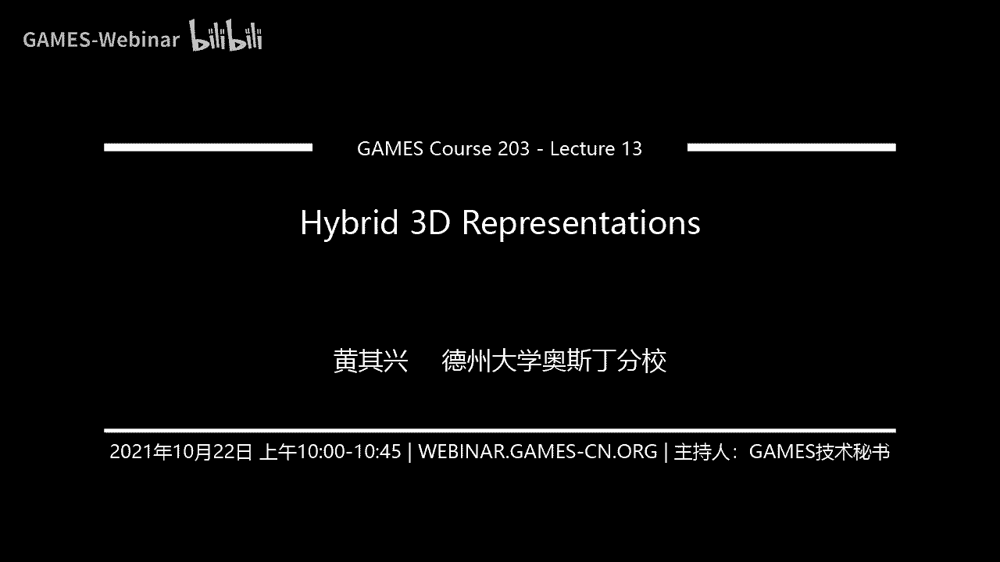
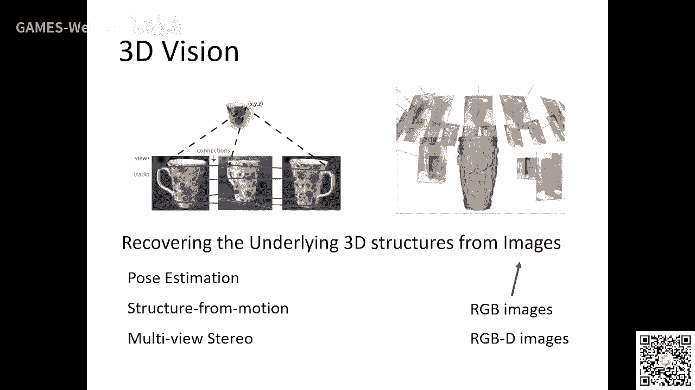
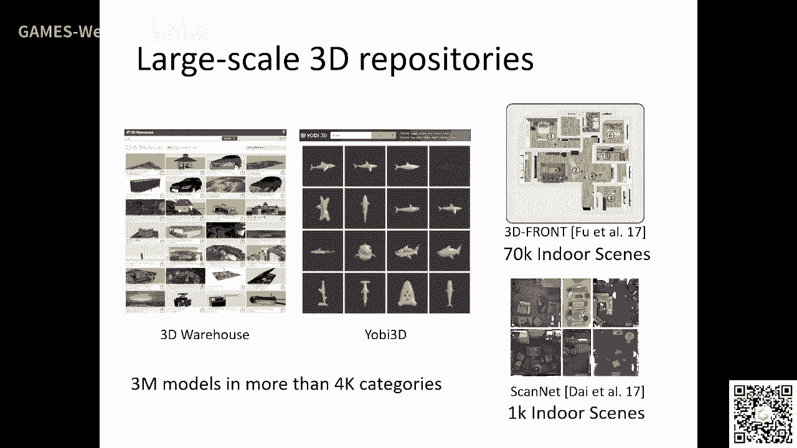
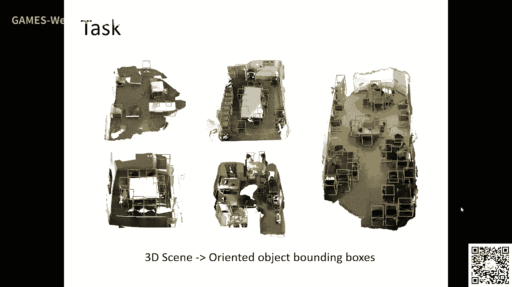
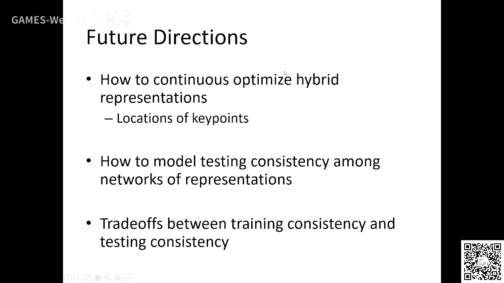
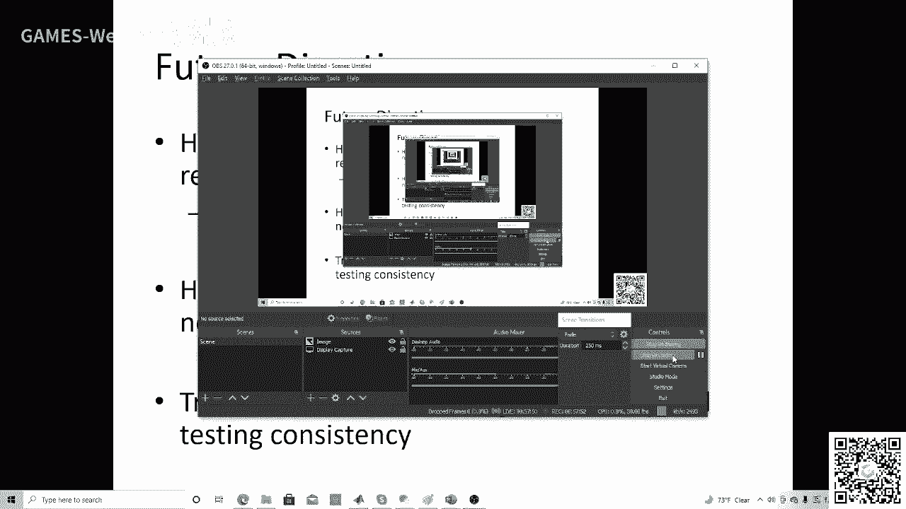

# GAMES203：三维重建和理解 - P13：Lecture 13 混合三维表示 🧩

在本节课中，我们将探讨三维机器学习中的一个核心问题：**混合三维表示**。我们将了解为什么单一的表示形式存在局限性，以及如何通过结合多种表示形式的优势来构建更强大、更鲁棒的模型。

---

## 概述

三维视觉领域最初专注于重建问题。随着数据量的增长和深度学习的发展，我们进入了三维机器学习时代。早期，三维学习模仿了二维学习的范式。如今，三维领域已发展出自己的理论架构，例如基于点云、网格和隐式表面的深度学习。

然而，任何一种三维表示形式都有其优点和缺点。**混合表示**的核心思想是，结合多种表示形式，利用它们各自的优势，弥补单一表示的不足，从而提升模型的性能和泛化能力。本节课将从多个角度解析这一思想，并通过具体的研究工作展示其应用。

---

## 三维表示的多样性

在深入混合表示之前，我们需要回顾三维数据的多种表示形式。在计算机图形学和视觉中，常见的表示包括：
*   **点云**：一组三维空间中的点。
*   **网格**：由顶点、边和面定义的表面。
*   **隐式表面**：用一个函数 `f(x, y, z) = 0` 来定义表面，内部为负，外部为正。
*   **体素**：将空间划分为规则的三维网格。
*   **多视图**：从多个二维图像中推断三维结构。

每种表示都催生了相应的深度学习架构（如PointNet处理点云，CNN处理多视图）。关键在于，没有一种表示能完美适用于所有任务。

---

## 混合表示的思想渊源

混合表示的思想并非深度学习独有。在计算机图形学和工业设计中，它早已是常见做法。

上一节我们介绍了三维表示的多样性，本节中我们来看看混合表示在传统领域中的应用。例如，在碰撞检测中，直接计算两个复杂网格的所有三角面交集效率极低。通常的解决方案是使用一种**空间数据结构**（如包围盒层次结构）作为混合表示：首先用简单的包围盒快速剔除不可能碰撞的部分，再对剩余部分进行精确的网格碰撞检测。

另一个例子是物理模拟或形状变形。有时在隐式表示下进行计算更为方便（例如，两个隐式表面的融合可以通过函数操作简单完成），然后再将结果转换回显式的网格表示进行渲染。这体现了在不同任务间切换最优表示的思想。

---

## 混合表示的理论视角

从机器学习的理论角度看，混合表示与模型复杂度和泛化能力密切相关。

在传统的模型设计中，我们通常通过增加单一模型的参数（即模型宽度或深度）来提升性能，但这可能导致过拟合，即模型在训练集上表现好，在未见数据上表现差，泛化能力下降。

混合表示提供了一种不同的思路：我们**不追求单一模型的极端复杂化**，而是**组合多个相对简单但基于不同表示的模型**。这可以看作是一种集成学习。理论上，在总参数量相同的情况下，集成多个小模型通常比使用一个大模型具有更好的泛化能力。

更重要的是，不同的表示形式可能捕捉数据中不同方面的特征。如果一个表示在某个数据子集上失效，另一种表示可能恰好能弥补。这种**表示的多样性**使得混合模型对数据分布的变化更为鲁棒。

---

## 研究案例一：混合表示用于扫描对齐

我们的第一个案例是将混合表示应用于**三维扫描对齐**任务。给定两个有重叠部分但初始位置未知的扫描片段，目标是估计它们之间的相对位姿。

传统方法依赖于特征匹配，但在特征稀少或重叠度很低时容易失败。一种深度学习方法是对不完整的扫描做**补全**，然后在更完整的形状上进行对齐。

然而，补全的质量高度依赖于所使用的表示形式。例如：
*   基于体素的补全在孔洞附近效果好，但远离边界时细节模糊。
*   基于点云或多视图的补全可能在不同情况下有不同表现。

以下是我们的解决方案思路：

我们利用多种表示形式分别对输入扫描进行补全，生成多个补全版本。然后，我们**学习一个优化器**，针对当前这一对特定的输入扫描，自动选择或融合来自不同表示的补全结果，以得到最适合做位姿估计的中间表示。公式上，这可以表示为一个选择权重 `w_i` 的优化问题，其中 `w_i` 对应于第 `i` 种表示的重要性。

实验表明，这种混合表示方法显著提高了在低重叠度情况下的扫描对齐鲁棒性和精度。

---

## 研究案例二：混合基元用于三维目标检测

第二个案例是在**三维目标检测**中引入混合几何基元。常规的检测器通常直接回归一个3D边界框的参数（中心点、尺寸、朝向）。

但直接回归一个完整的框（7个参数）在数据不完整时比较困难。我们换一种思路：一个物体可以由多种更简单的几何属性来定义。

以下是我们的方法步骤：

1.  **预测多种基元**：对于输入的点云，我们的网络不仅预测边界框，还预测一系列其他基元，例如：
    *   物体表面的**中心点**（8个角点）。
    *   每个面的**中心点**（6个面中心）。
    *   每条边的**中心点**（12个边中心）。
2.  **初始框生成**：利用预测出的这些基元点（例如，只要检测到两个对角点，就能确定一个框），我们可以生成多个初始的边界框假设。
3.  **融合与优化**：将这些来自不同基元的初始框预测进行融合与平均，并通过一个优化模块进行微调，最终得到更准确、更稳定的检测框。

分析发现，不同类别的物体（如汽车、椅子），其“好”的基元是不同的。例如，汽车用角点基元检测效果好，而椅子可能用面中心更稳定。混合多种基元允许模型自适应地利用最有效的线索。

---

## 研究案例三：混合网络用于场景合成

第三个案例是关于**室内场景合成**。目标是根据一些条件（如房间类型、大小）生成合理的物体布局。

传统方法可能使用自回归模型（如Transformer）逐个生成物体。我们探索了一种混合网络架构：

1.  **属性预测网络**：第一个网络专注于预测场景中物体的**属性**，如类别、尺寸、颜色。
2.  **布局生成网络**：第二个网络接收这些属性，并专注于生成物体的**布局**，即它们的空间位置和朝向。
3.  **混合与生成**：将两个网络的输出（属性潜在编码和布局潜在编码）结合起来，共同生成最终的场景。

这种将“属性预测”和“布局生成”解耦的混合表示，使得模型能更好地处理这两类不同性质的任务，生成的场景在多样性和合理性上都有提升。

---

## 研究案例四：混合监督用于部件分解

最后一个案例是**三维形状的部件分解**，即将一个复杂物体分解为简单的几何基元（如立方体、圆柱体）。

一种深度学习方法是为每个点预测它属于哪个基元。我们引入了**混合监督信号**来提升效果：

1.  **语义特征**：网络预测每个点的基元类别标签。
2.  **几何特征**：我们额外引入一种监督，让网络也预测每个点所在基元的**参数**（如对于一个圆柱体，预测其轴心和半径）。
3.  **图构建与优化**：利用预测的几何参数，我们可以计算点之间的几何一致性（例如，两个点如果被预测为属于同一个圆柱体，它们的几何参数应该兼容）。基于此构建一个图，进行图聚类或优化，从而得到更准确的部件分割结果。

这种将**语义分割**与**几何参数回归**相结合的混合监督方法，比单独使用任何一种都能获得更精确的分解结果。

---

## 未来方向与总结

本节课我们一起学习了**混合三维表示**的核心思想与应用。它强调通过结合多种数据表示形式的优势，来构建更强大、更鲁棒的机器学习模型。

未来的研究方向有很多：
1.  **自动化表示学习**：如何让模型自动学习或生成最优的混合表示，而非人工设计。
2.  **表示间的可转换性**：研究不同表示之间的转换关系，并利用这种关系进行联合优化。
3.  **理论分析**：建立更完善的理论框架，解释为何以及何时混合表示会优于单一表示，并指导混合策略的设计。

总而言之，混合表示是一个具有巨大潜力的方向。它鼓励我们拓宽思路，不局限于单一的模型或表示，而是通过巧妙的组合来释放三维机器学习的更大能量。在下一节课中，我们将对整个课程进行总结，并展望三维重建与理解领域的未来重要方向。