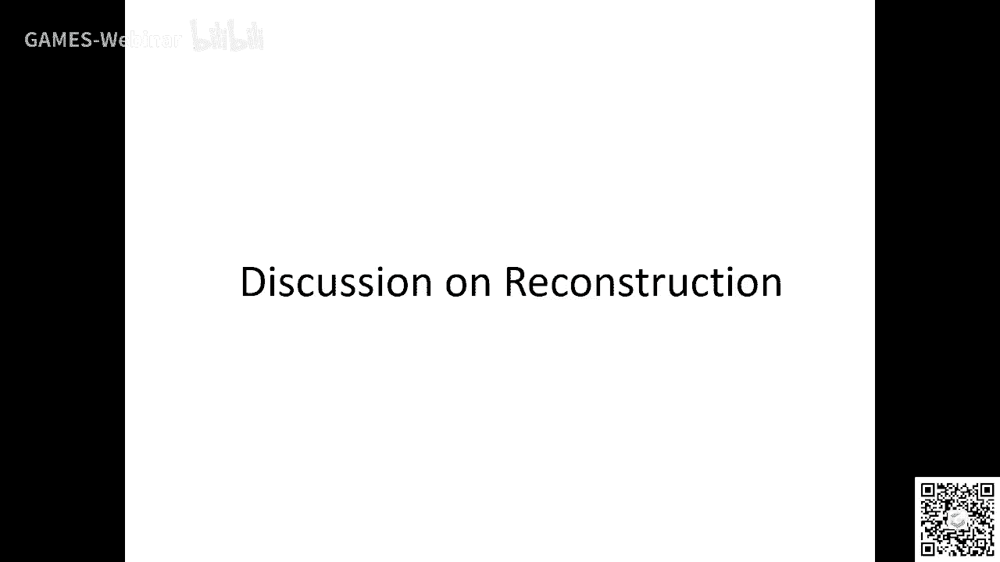

# GAMES203：三维重建和理解 - P14：课程总结与展望 🎓

在本节课中，我们将对GAMES203课程的核心内容进行回顾与总结，并探讨三维视觉与图形学领域的未来发展方向。课程主要分为三维重建、三维表示与理解三大板块，我们将逐一梳理并回答同学们提出的相关问题。

## 三维重建 🔍

上一节我们回顾了课程的整体结构，本节中我们来看看三维重建部分。三维重建旨在从图像或其他传感器数据中恢复物体的三维几何与外观。

### 重建的量化标准与应用场景

三维重建的评估标准高度依赖于其具体应用目标。以下是几种典型场景及其对重建精度的不同要求：

*   **高精度要求场景**：在医学（如牙齿重建用于手术规划、骨折复位）或工业检测（如桥梁损伤评估）中，重建的物理精度至关重要。不仅需要输出模型，还需评估其不确定性（如置信度）。
*   **中等精度要求场景**：在无人驾驶领域构建高精地图时，也要求重建尽量精确。
*   **感知质量优先场景**：在虚拟现实（VR）或增强现实（AR）等娱乐应用中，目标是为用户提供逼真的视觉体验。此时，重建的感知质量（如能否支持新视角合成）比绝对的物理精度更重要。

### 深度学习与三维重建的结合

传统重建方法（如激光扫描）在工业界已很成熟。当前研究热点更多集中于**被动式重建**（如从多张图像）与深度学习的结合。以下是几个关键研究方向：

*   **单视图深度估计与补全**：从稀疏或无重叠视图进行重建时，传统多视图几何方法失效。此时可借助单视图深度估计先得到初始几何，再进行融合。核心挑战在于如何平衡**图像间对应关系匹配**与**单视图深度先验**的利用。
    *   **对应关系匹配**：传统方法使用SIFT等特征，现在则探索用深度学习（如光流网络）寻找更鲁棒的对应关系。
    *   **深度先验**：单视图深度估计虽整体较准，但对遮挡区域（Occlusion）处理不佳。如何结合多视图信息优化是难点。
*   **外观与材质重建**：超越几何，重建物体的颜色、材质乃至物理属性，对于实现照片级真实感渲染至关重要。这需要将渲染中的光照模型（如反射、阴影、高光）与重建过程结合，属于尚未很好解决的系统工程。
*   **动态重建**：即四维（4D）重建，对运动物体进行时序上的三维重建。核心挑战在于如何建模运动并解决时域上的对应关系问题。目前研究多在几何层面，结合物理规律理解运动的工作还不多。

### 几何处理中深度学习的机遇

传统几何处理已有成熟软件（如MeshLab）。深度学习要在该领域产生颠覆性影响，需带来**质的飞跃**。可能的突破方向包括：

*   **大规模场景重建**：使用极少的测量数据和图像，鲁棒地重建整个建筑或城市级别的场景。
*   **便捷的重建工具**：让用户仅通过拍摄几张房间照片就能快速生成可靠的三维模型。
*   **智能几何编辑**：将学习能力嵌入处理流程，使编辑工具更智能。

## 三维表示 🧩

在了解了重建的目标与挑战后，我们转向三维数据的表示方法。良好的表示是进行高效处理和深度理解的基础。

### 混合表示与可学习表示

*   **混合表示（Hybrid Representation）**：结合不同表示（如体素、网格、点云、多视图）的优势，以更丰富的特征捕捉三维信息。例如，多视图表示天然融合了二维图像特征。
*   **表示与学习的结合**：表示方法并非独立，它与学习算法紧密相关。给定一种表示，何种训练方法最优？未来趋势可能是**自动生成表示**，而非人为指定。例如，研究通过程序化规则自动生成适应任务的表示。
*   **谱方法（Spectral Methods）与可学习基函数**：谱方法（如拉普拉斯谱）因其在逼近理论和多尺度特性上的优势被广泛使用。但基函数不限于谱基。一个前沿方向是**用图神经网络学习最优的基函数**，然后在此基础上学习映射。有理论猜测，对于流形数据，学得的基可能接近谱基。

### 三维可解释性

三维相比二维拥有更多可定义、可解释的属性（如几何、距离、物理可行性、运动规律）。三维可解释性研究可从两方面入手：
1.  **理解网络所学**：例如，在姿态估计中，预测关键点比直接回归旋转矩阵更可解释。
2.  **引入更多约束**：可解释的中间表示（如关键点、长度）允许我们注入先验知识（如“椅腿长度应大于1米”），从而通过额外的损失函数引导网络学习得更好。

## 三维理解 🧠

最后，我们探讨三维理解，即让机器认知三维世界的语义与功能。

### 开拓三维特有任务

当前许多三维理解任务（如分割、分类）是对二维任务的迁移。我们应思考哪些是**二维无法解决或难以解决，而三维具有天然优势的任务**，例如：
*   **物理与材质属性理解**：推断物体的材料（木、铁）、结构强度、承重能力等。这与三维几何结构密切相关。
*   **功能可供性（Affordance）分析**：分析物体如何与人交互（如椅子如何被坐、把手如何被握）。三维能更精确地建模交互的物理约束。
*   **生长与演化模拟**：研究物体（如骨骼、植物）如何在与环境交互中生长变化，这需要结合物理仿真与学习。

### 数据集的挑战与展望

推进上述研究面临**数据稀缺**的挑战。构建包含丰富物理、材质标注的三维数据集是关键。这需要社区共同努力，从小规模开始，逐步吸引更多研究者参与，形成数据生态。

### 小样本学习与归纳偏置

在三维领域，小样本学习可能有更大潜力。因为三维本身包含更多结构化信息（如对称性、物理规律），通过引入合适的**归纳偏置**，可以有效减少对大量标注数据的依赖。例如，在形状分割任务上，学习到的知识可能更容易在同类物体间迁移。

## 图形学与视觉的融合 🤝

图形学（Graphics）核心是生成与渲染，计算机视觉（Vision）核心是理解与分析。两者融合趋势日益明显：
*   **生成需理解**：要生成逼真内容，需对世界有深刻理解。
*   **理解助生成**：从真实世界数据（需通过重建获取）中学习，能提升生成质量。
*   **共同基础**：两者都需要强大的数学与几何基础。

## 给研究者的建议 ✍️

*   **写作训练**：好文章是改出来的。不断重读和修改，注重逻辑性与大局观，而非仅追求辞藻。
*   **广泛阅读**：不仅要读最新文章，更要精读领域经典工作，建立扎实的领域认知，才能产生革命性想法。
*   **夯实基础**：在追逐深度学习热点前，务必打好传统图形学、视觉、几何的基础，理解领域发展脉络。
*   **开拓新场景**：积极寻找有重大影响的新应用场景（如水下重建、高环境感知），即使初期只能使用合成数据，也能推动领域开辟新方向。

## 总结 📚

本节课我们一起回顾了GAMES203课程关于三维重建、表示与理解的核心内容。我们探讨了重建的评估标准、深度学习带来的新机遇、表示学习的前沿、三维可解释性的价值，以及如何开拓三维特有的理解任务。最后，我们展望了图形学与视觉融合的未来，并为同学们提供了研究上的建议。三维视觉与图形学是一个充满活力的领域，其终极目标是增强人类对物理与数字世界的感知与创造能力。希望本课程能为大家打开一扇门，鼓励大家夯实基础、打开脑洞，致力于解决那些真正重要且有趣的问题。

（注：本教程根据课程实录整理，保留了问答环节的精华内容，并按照要求进行了结构化、简化和格式优化。）