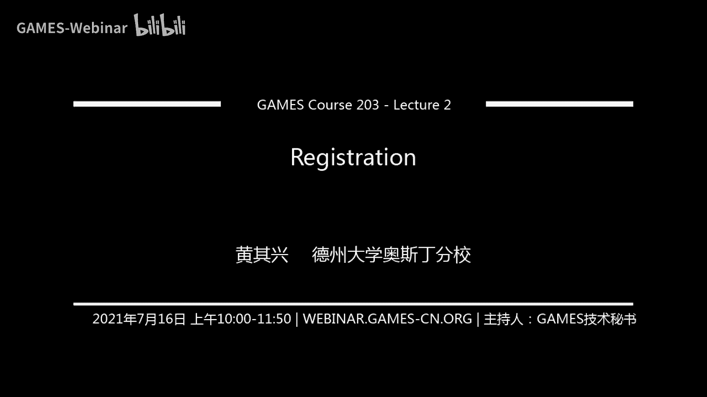

# GAMES203：三维重建和理解 - P2：Lecture 2 点云注册 📍

在本节课中，我们将要学习三维重建中的一个核心问题——点云注册。注册问题旨在将不同视角下扫描得到的点云数据对齐到同一个坐标系下，是三维重建、模型检测等任务的基础。本节课内容相对技术化，我们将从基本概念讲起，涵盖局部与全局注册算法，并简要介绍基于学习的方法。

## 什么是点云注册？🔍

上一节我们介绍了三维扫描仪。当我们在不同视角下扫描同一个三维场景时，会得到多个独立的点云。如果我们不知道这些视角之间的相对变换关系，这些点云在空间中是错位的。注册问题就是通过算法，将这些点云匹配对齐的过程。

直观地说，注册的目标是让两个点云在重叠区域内的对应点之间的距离尽可能小。这是一个非常基础且重要的问题，其算法从90年代经典的ICP算法，一直发展到如今深度学习时代的新方法。

## 注册问题的分类 📂

在深入算法之前，我们首先需要对注册任务本身进行分类。理解不同的应用场景有助于我们选择合适的算法。注册问题可以从三个维度进行划分：

以下是注册问题的三个主要分类方向：

1.  **重叠程度**：
    *   **完全重叠**：两个表面（点云）是彼此的副本，或者一个完全包含在另一个之中。例如，在工业零件检测中，将扫描得到的零件点云与CAD设计模型进行匹配。
    *   **部分重叠**：两个点云只有一部分区域是共同的。这是三维重建中最常见的情况，因为从不同视角扫描，必然存在未被观测到的区域。

2.  **初始位姿**：
    *   **局部注册**：两个点云的初始位姿已经大致对齐。例如，连续扫描的两帧点云，其相对位姿变化很小。
    *   **全局注册**：两个点云的初始位姿未知，可能相差很大。例如，在室外不同位置架设扫描仪得到的两片点云。

3.  **点云数量**：
    *   **两两注册**：处理两片点云之间的对齐。
    *   **多片同时注册**：同时处理多片点云，将它们一起对齐到一个全局坐标系中。

本节课我们将首先聚焦于**两片点云的注册问题**，涵盖完全重叠与部分重叠的情况，从局部方法讲起，最后介绍全局方法以及基于学习的方法，并简要提及多片同时注册。

## 两两注册的核心：ICP算法 🔄

两两注册中最重要的算法是**迭代最近点算法**。理解ICP是掌握点云注册的基础。

### 已知对应点的情况

假设我们有两片点云（红色和蓝色），并且已知红色点云上的一些点 `P_i` 与蓝色点云上的一些点 `Q_i` 一一对应。我们的目标是找到一个刚体变换（旋转 `R` 和平移 `T`），使得变换后的 `P_i` 与 `Q_i` 之间的距离平方和最小。

这定义了一个优化问题，其目标函数为：
`E(R, T) = Σ_i || (R * P_i + T) - Q_i ||^2`

我们需要最小化这个目标函数 `E`，变量是 `R` 和 `T`。幸运的是，这个问题存在**闭式解**。其核心思想是：先将两个点云的中心（均值）对齐，然后通过特征值分解求解最优旋转矩阵 `R`。

### ICP算法：处理未知对应点

然而在实际中，我们并不知道点之间的对应关系。ICP算法的巧妙之处在于，它通过迭代的方式同时求解对应关系和刚体变换。

以下是ICP算法的基本步骤：

1.  **最近点搜索**：对于源点云（红色）中的每一个点，在目标点云（蓝色）中寻找距离最近的点，作为临时的对应点。
2.  **求解变换**：基于上一步找到的临时对应点对，使用闭式解计算最优的旋转 `R` 和平移 `T`。
3.  **应用变换**：将计算得到的变换作用于源点云。
4.  **迭代**：重复步骤1-3，直到变换收敛（即变换参数的变化或点云间距离的变化小于某个阈值）。

ICP算法非常直观且有效，它是一个**交替最小化**过程：固定变换优化对应点（找最近点），再固定对应点优化变换。理论上可以证明，在一般情况下，ICP算法能收敛到一个局部极小值。

### 从优化视角看ICP与高斯-牛顿法

从数学上看，注册问题可以表述为最小化源点云 `X` 经过变换 `α` 后，到目标曲面 `Φ` 的平方距离函数 `f(α)`。ICP的交替最小化过程可以看作是对这个复杂问题的一种简化求解方式。

另一种更通用的求解非线性最小二乘问题的方法是**高斯-牛顿法**。它是对牛顿法的近似，避免了计算复杂的二阶海森矩阵，转而使用雅可比矩阵的乘积来近似。在点云注册的语境下，使用**点到平面的距离**作为度量，其高斯-牛顿法的迭代更新公式与一种称为“point-to-plane ICP”的变种算法等价。

**点到平面距离**的几何直觉是：当点云已经大致对齐时，优化一个点到其对应点处切平面的距离，比优化点到点的距离更为鲁棒，因为即使点移动了，到切平面的距离仍然是一个良好的近似。

**实践建议**：当初始位姿较好时，使用 `point-to-plane` 距离度量通常收敛更快；当初始位姿较差时，标准的 `point-to-point` ICP 可能更鲁棒。

## 处理部分重叠与异常值 🛡️

上一节我们介绍了基础的ICP算法，它假设点云之间完全重叠。但在实际三维重建中，点云往往是部分重叠的，这意味着为一些点找到的“最近点”实际上是错误的对应（异常值）。本节我们来看看如何处理这种情况。

核心思想是使用**鲁棒性度量**来代替平方距离（L2范数），以降低异常值的影响。常用的鲁棒函数包括L1范数、Huber损失、Geman-McClure函数等。

一种简单而有效的方法是**加权最小二乘法**。其思想是将原始的鲁棒目标函数，改写为加权平方和的形式，并通过迭代更新权重来求解。

具体算法如下：
1.  初始化所有权重 `w_i = 1`。
2.  使用当前权重，求解加权最小二乘问题，得到当前最优变换。
3.  根据当前残差（点对距离）更新权重：残差大的点对权重降低（例如，`w_i = 1 / (d_i + ε)`）。
4.  重复步骤2-3直至收敛。

**直观理解**：以一个简单的一维数据拟合为例，最小化L2损失（平方和）得到的是所有点的**均值**，容易被远处的异常值拉偏。而最小化L1损失（绝对值和）得到的是**中位数**，对异常值不敏感。加权最小二乘通过迭代调整权重，使算法行为向中位数估计靠近，从而获得鲁棒性。

另一种实用的启发式方法是**双向剪枝**：
1.  对于源点云中的点 `V`，在目标点云中找最近点 `Q`。
2.  再以 `Q` 为起点，在源点云中找最近点 `R`。
3.  如果 `R` 与原始的 `V` 是同一个点或距离非常近，则认为 `(V, Q)` 是一个可靠的对应点对；否则，将其剔除。

这种方法可以有效地过滤掉非重叠区域产生的错误匹配。

## 全局注册方法 🌐

前面几节讨论的ICP及其变种都属于**局部注册**方法，它们需要一个较好的初始位姿估计。本节我们来看看当初始位姿未知或很差时，如何解决**全局注册**问题。

全局注册的基本流程是：首先在两个点云上提取**局部特征描述子**，然后建立特征点之间的候选匹配，最后利用**几何一致性约束**从大量可能包含错误的候选匹配中筛选出正确的匹配，进而估算刚体变换。

### 1. 特征描述子

我们需要一种对旋转、平移等变换不变的描述子，以便在不同点云上计算和匹配。传统方法包括：
*   **Spin Images**：在点的邻域内，统计基于距离和角度的分布直方图。
*   **积分不变量**：计算点邻域球内曲面面积的积分，具有多尺度特性。
*   **3D SIFT**：将2D图像中的SIFT特征推广到3D。

这些特征是人工设计的。如今，基于深度学习学习特征描述子已成为主流趋势，但传统方法在模型泛化性方面仍有其价值。

### 2. 从候选匹配中筛选正确匹配

得到大量候选匹配（很多是错误的）后，核心任务是找出一个正确的匹配子集，该子集能用一个刚体变换很好地拟合。主要有三类方法：

**A. 随机采样一致性**
这是一种经典的投票策略：
1.  随机采样最小点对（3D中需3对点）来计算一个刚体变换假设。
2.  检查有多少候选匹配与该变换假设一致（即变换后距离小于阈值）。
3.  重复上述过程多次，选择支持内点数量最多的那个变换假设。

其成功概率与内点比例和采样次数有关。如果点带有法向等信息，可能只需2对点就能确定变换，从而提高效率。

**B. 霍夫变换**
这也是一种投票思想，但投票空间是变换参数空间：
1.  每采样一对匹配点，可以投票给一个可能的变换参数。
2.  在参数空间中，正确的变换会被许多正确的匹配反复投票，形成一个峰值。
3.  使用均值漂移等聚类方法找到参数空间的峰值，即为估计的变换。

**C. 谱方法**
将问题转化为图论中的**最大团搜索**问题：
1.  以候选匹配为节点，构建一个“一致性矩阵”或图。如果两对匹配在几何上相容（例如，保持点间距离），则在它们之间连一条边。
2.  正确的匹配集合会形成一个连接紧密的子图（团）。
3.  通过求解该图邻接矩阵的主特征向量，并根据向量元素的大小对匹配进行排序和筛选，可以近似地找出这个最大的团。

这些方法的核心思想都是利用刚体变换的**几何约束**（如保持距离、角度不变），从嘈杂的匹配中恢复出正确的集合。

### 3. 混合方法

我们可以将不同的思想结合起来。例如，设计一个联合优化目标函数，同时优化匹配的指示变量（哪些匹配被选中）和刚体变换参数，并使用交替最小化策略求解。这相当于将谱方法的一致性约束与加权最小二乘的优化过程融合在一起。

## 基于学习的方法与多片注册 🤖

上一节我们介绍了传统的全局注册方法。随着深度学习的发展，现在也出现了基于学习的全局匹配方法。本节我们简要了解其思路，并介绍如何将两两注册扩展到多片点云。

### 基于学习的全局匹配

基本思路是用神经网络模块替代传统流程中的某些步骤：
1.  **特征提取**：使用神经网络（如PointNet或Transformer）直接从点云中学习具有判别性的局部特征描述子。
2.  **特征匹配**：使用网络（如注意力机制）来学习如何建立特征点之间的对应关系，或直接预测匹配的置信度。
3.  **变换估计**：即使匹配仍包含错误，也可以使用网络（如回归网络）或结合传统RANSAC层，从匹配中稳健地估计变换参数。

这类方法在数据驱动的背景下，特别是在重叠率较低、噪声较大的情况下，往往能表现出比传统手工特征方法更好的性能。

### 多片同时注册

在实际重建中，我们通常有大量来自不同视角的点云需要同时对齐。最直接的方法是**联合两两注册**，即最小化所有点云对之间的对齐误差之和。

其目标函数可以写为：
`E({R_k, T_k}) = Σ_{i, j} Σ_{p in Cloud_i} distance( Transform(R_i, T_i, p), Cloud_j )^2`

其中 `{R_k, T_k}` 是所有点云的位姿（通常固定其中一个为基准）。这仍然是一个非线性最小二乘问题，可以用高斯-牛顿法等优化算法求解。然而，当点云数量很多时，计算所有点云对之间的误差会导致计算量剧增。

一种巧妙且高效的方法是**隐式同时注册与重建**：
1.  初始化一个**潜在曲面**（例如，一个由许多局部平面片组成的粗糙曲面）。
2.  **E步骤**：将每一片扫描点云与这个潜在曲面进行ICP对齐。
3.  **M步骤**：用所有对齐后的点云数据，去更新（拟合）这个潜在曲面，使其更精确。
4.  重复步骤2-3，并可以逐步提高潜在曲面的分辨率。

这种方法的好处在于，它将多片注册问题分解为一系列“扫描-模型”的注册问题，无需显式确定哪些扫描之间存在重叠，通过空间数据结构自动处理，非常高效。

## 总结 📝

本节课我们一起学习了三维点云注册的核心知识。我们从注册问题的定义和分类入手，首先深入讲解了作为局部注册基石的ICP算法及其优化原理（点到点、点到平面）。接着，我们探讨了如何处理部分重叠和异常值，引入了鲁棒损失和加权最小二乘的思想。然后，我们介绍了全局注册的挑战，并概述了RANSAC、霍夫变换和谱方法等传统解决方案，它们都依赖于几何一致性约束。最后，我们简要了解了基于学习的注册方法趋势，以及将两两注册扩展到多片同时注册的策略。

注册是三维重建中的基础环节，理解这些经典算法及其背后的思想，将为后续学习更复杂的三维视觉任务打下坚实的基础。