# GAMES203： 三维重建和理解 - P3：Lecture 3 Surface Reconstruction - GAMES-Webinar - BV1pw411d7aS

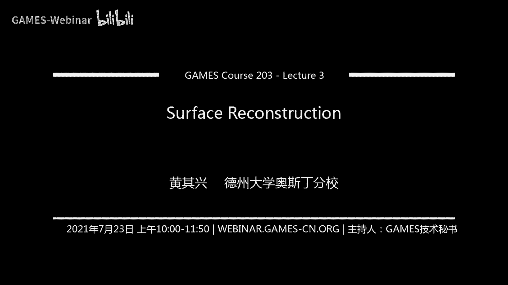

这个这周的课又开始了啊，我更新了下首页啊，这个slide你们应该是可以在我的那个那个那个主播上可以吓到了啊，然后我还更新了，就是啊你们有些那个给我发了email，直接进了我的那个垃圾邮件箱啊。

所以我就没法看到，然后啊我今天才发现，然后我更新了一些那个就是有的人有的学生问这个是哪些boss code，那些for the package，我们可以可以拿拿过来做devopment对吧。

我更新了一些link啊，你们可以看到好吧，然后呃今天的课呢嗯相对来说，因为这事情不用我说，你这次应该提高课好吧，就因为是提高课的话呢，所以就嗯相对来说这个呃你们能听到我吗，没有有学生在这吗，现在。

还好ok就是因为这是提高课，所以我我就不可能对吧，呃讲所有的都是细节对吧，我其实说白了就是我会讲一些文章，今天呃呃基本上勾勒出surface reconstruction啊。

其实这个field大部分的工作啊是，从90年代到00年以前啊，啊我今天会讲一些啊，但是呢你会发现，然后12年开始，其实说白了就是deep learning嘛对吧，呃其实大家可以可以发现一个特点啊。

就说你们现在看deep learning的文章，你等我听完我这节课以后，你会发现其实所有的东西以前都出现过啊，就是现在就是一般的学生进来以后呢，他也没有没有一门课，没有一个一本书对吧，就专门讲这些东西。

就想以前的工作呃，导致呢就是说很多东西大家都不知道的啊，我希望就是讲这个东西给大家讲一讲这个这方面的东西好吧，然后那个然后就开始啊，就是就是实际上我们上一节课讲了这个注册是注册。

实际上就是你得到了一个point cd对吧，这个point card上面点呢可以是不同的key对吧，但是你把它拼在一起了对吧，那就得到了一个在左边的这个这个shift，这样对吧。

然后然后你出来你想得到一个three model对吧，什么是这个model呢，就比如说它是比如说他是water time，或者就是比如说最好是个match对吧，那这个东西怎么做呢对吧。

首先这个问题啊它是一个非常非常fundamental problem，也没有完全解决啊，也没有完全解决啊，但是现在的研究呢啊特别我觉得就是说啊就是说在这个level啊，就是说有很多工作可以从啊，可以做。

从deep learning重新把它做一道啊，我觉得很多东西啊是用地图，你是很有价值的啊，就是对这方面的工作，目前大家刚刚开始嘛。

最近看到有一天用deep learning说就说march去补macht 5会讲到对吧啊，今天的东西很多啊，我有些东西可能就简单的跳跳跃一下啊，有我觉得就是说如果你想做研究啊。

就是说呃所以基本上这个这个这个问题我觉得他是很有潜力的，很有潜力的啊，你像那个vision里面他做的那种three of fa，那不叫reconstruction对吧。

但还是一种three and standing对吧，stand他的mc你真的做reconstruction，你这个重建出来的model是可以直接来用的对吧，你可以说比如说作词就repling对吧。

比如说你扫描了一个人体的器官对吧，嗯然后你要想想或者扫描牙齿对吧，你想把牙齿怎么什么时候拼啊，动一下对吧，对这方面的这方面的东西对吧，就是这才叫重重建，就是为a里面比如说single view对吧。

这种重建的话说白了就，ok就是说如果你是single view对吧，一个一个view的话做重建的话，那我觉得就是说呃这个问题很难对吧，这个问题很难啊，嗯我想说的就是这个你们要做做研究啊。

嗯我个人感觉啊这这个topic是很有价值的啊，现在还没有做起来啊，他有很多很多学术的价值啊，我后面会讲一些啊，后面到了这这这门课快，最后我讲，那现在我主要讲一些基础的东西啊，那这个方法呢大概有两种。

一个是就是这种increasing base的方法，就是这是我现在现在现在主流了对吧，主流还有一种方法呢就是explicit，或者扔掉一些点对吧，或者把把这些点连起来是吧。

所以这呃呃这这里有个叫做computational trash base的对吧，这些这些方法呢理论上很好，实际上呢主要的challenge我们会讲到啊，主要的challenge你会看到的啊。

各种各样的challenge啊，就是这个东西呃，怎么说呢，说白了就是给你一个呃，给你一个，比如说你像competition只要求背诵的方法呢啊，呃它是由spratio管理器。

就是说当你的input的足够好的时候，我一定能重建对吧，比如说硬币足够好，就是noise比较少，然后呢那个弯的地方你3号的点比较多对吧，就一定能重建啊，这有一系列的工作，像你lina ma这个这个。

等等人吧，呃做过很多很多非常杰出的贡献啊，然后嗯，这是这一块，但是呢这些方法呢他relatively它相对来说比较慢对吧，但是你noib高对吧，你这些方法我就不work了，noise level一高呢。

相对来说这种in pression base的方法呢，他work的稍微好一点，但是也pocruntech work对吧，就是说但是呢就是说它更efficient对吧，更efficient对吧。

它它的缺点跟这个explicit，像这种competition grp的方法来比呢，就是他没有什么gantic grantee对吧，就是说你不知道他能不能work，其实你的input的非常好的时候对吧。

也没法去证明，但是in pro你呢他他做过的work的比较好对吧，像比如说现在大家用的最多的就是包装surface reconstruction，对啊，我也会讲到啊。

好那今天呢我主要会讲这个increasing base的方法啊，你说你们稍微等一下啊。

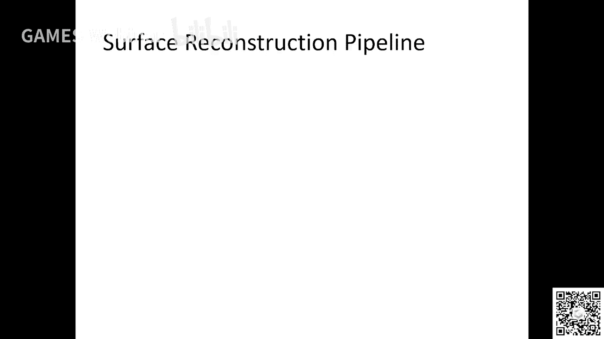

稍微等一下，我得我得换个smart啊，我这个麦好像有点有点不对啊，稍微等一下，稍微等一下啊，我得我得我得我得下一下我的slides。

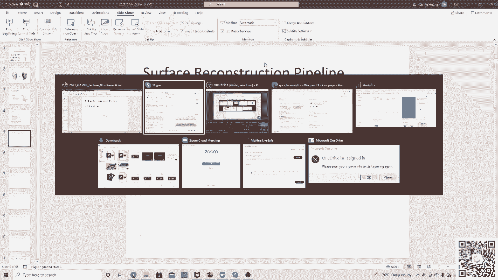

这个slides好像不对啊。

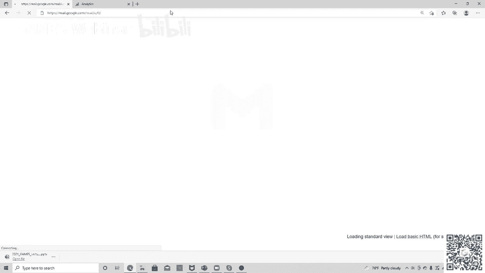

啊我把这个东西呃stop一下stop一下。

然后我，我待会再再再再看一下啊。

啊我刚才那个那个那个那个我的那个课件好像就是打开一个错的啊，一个income，我今天主要会讲一些implicit的这种东西，因为这是主流嘛对吧，我会讲很多文章啊，有些东西里面有些我会一带而过。

有些会重点讲啊，就是其实我感觉大部分文章你们可能没听说过啊，呃或者一部分没听说过吧，但是我觉得是很重要的啊，对就是第一篇文章，如果你们我们说这个radio reconstruction对吧。

第一篇文章就是就是这篇文章叫做surface reconstruction from our organized point对吧，这是一篇怎么说呢。

你也不能说他是第一天做three dimon struction呢，这篇文章很有影响力对吧，第一他就是说把这个implicit的这种base record shelter的方法呢。

它是一个complete system对吧，complete system其实后面还是或者就是说他建立了一个体系结构啊，建立了一个体系结构对吧，然后后面的文章呢大部分是在这个基础上呢，呃你不能说改进吧。

有些有些改变是非常transformative的，就是非常有影响力的对吧啊，就是说你如果读这个重建，你应该从这边往上读机啊，就是特别是想你如果想做做做做做必能赢的话对吧。

那那那我觉得这篇文章是应该读的啊，就是嗯嗯好，然后我再说一下这个重建的，我们基本上是要求这个input的基本上面对吧，就是你的point基本上把把所有的那个object都cover住了对吧。

如果是parti partial的这种东西的话，在我们后面会讲到这种data driven对吧，那个时候你就真的要上一些learning的bug对吧，你要引入这个twice对吧。

好然后max的p就是input的是cloud of points对吧，就是就是一些点是吧，我们不需要orientation，后面的很多方法，也包括包括pcr需要与orientation对吧。

但是这个方法呢它能把它能重建出这个这个点的orignormal对吧，output呢它是一个全match对吧，the possibility with boundary edges对吧。

然后他grantee就是它是一个manifold，我没讲什么是manifold啊，就是说你就是说怎么说呢，就是说你有一个match对吧啊，然后每个每每个match到每个月就收了。

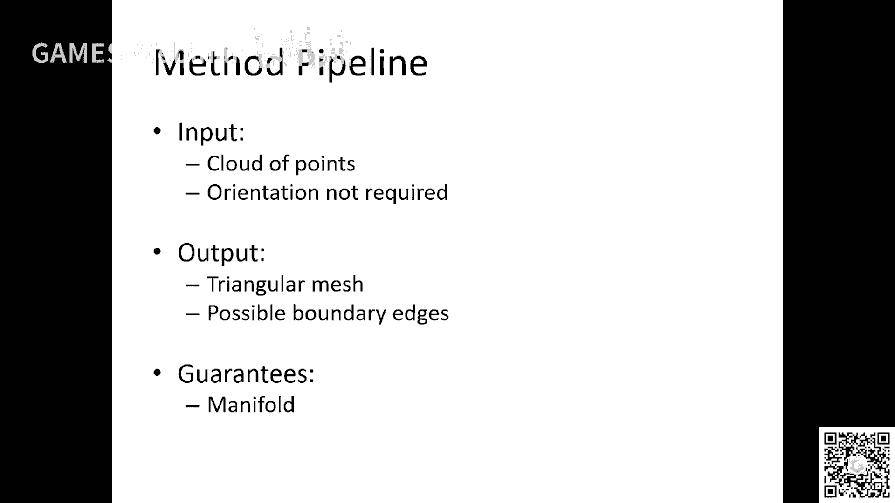

帮助里的他都是填了两个贝斯这样子啊。

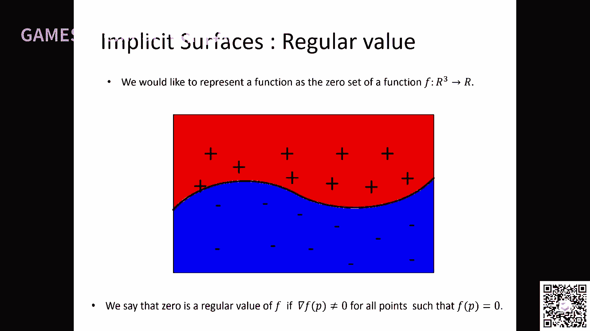

ok然后这个方法怎么来的呢。

实际上它是分为很有一个非常重要的concept，就是说prey surface啊，就是它是通过重建一个increased surface啊。

我们后面也会讲你please位到那个时候我们就会讲一下operation，这个地方我们主要是讲怎么你得到你重现属于surface啊，该不会讲到的，bob is啊，什么是lish surface呢。

对这个问题很有意思对吧，就是最简单的impolicy service是什么，你们我问一下看看谁知道呢，谁能给我举个例子，怎么be最简单的，有谁有谁知道最简单implicit surface 3维的。

啊有谁知道吗，好吧，求是最简单的，我想我想要的答案就是球啊，哎平方加y平方加b平方减1=0啊，这是这是最简单的一件事，啊这是最简单的implicit surface啊。

好然后什么是int service，就是你要做fashion对吧，首先你把空间中每个点你都对应一个词，但是你希望这个fashion连续了对吧，play的话也可以说吧，也可以说自己对收费嗯。

哦它是一个比较special的对吧啊就是好，那个这个fashion它就是对吧，你smooth function boss上面等于约定了一位对吧，对吧，然后我们说说这个。

然后就看它的b o l l set就是所有的点对吧，然后他等于零对吧，比如求就是x平方加y平方加b平方减1=0对吧，当然你要满足它，就比如说你可能有两个两个设备和相交对吧。

这个就是regular这种point，基本上你要要求这个gradient轴对吧，这个德尔塔就是求的gradient啊，就是这个东西啊，把球都是拐点的啊，这个东西确实是贵点的，然后它不等于零对吧。

如果你所有的，然后所有的披萨买了green。

那他就是个surface对吧，然后你有一个implicit function theory，这是想讲什么，就是local，对不对，如果你满足这个regularity的这种condition对吧。

那么你locally，你这个f p等于零啊，它logo里它都是一个two dimension啊，这是elies antitheory，对就是你可以找到一个参数化对吧。

使得这个logo里你能猜出那个窗口能表示对吧，然后，啊然后global里的话，那咱们就不知道了对吧，就是对吧，他他就是说你可以把它提取在一起对吧，global的参数化，那以后我们会讲啊，探索法了啊。

那怎么就是说这篇文章就是想就是你从一个点对吧，你怎么能构造出一个隐私的这个曲线呃，隐私的这个representation，然后你从一个隐私的representation。

你又怎么能构造出一个match对吧，就分两步啊，两步就是首先你怎么变成一个影视的曲面，第二步你怎么变成一个mesh啊，啊怎么变成演示曲面，也是他就是用这个sin x x方，比如说我们在空间中每个点对吧。

我对这个point cod求这个求这个距离对吧，然后我通过这个距离的正负对吧，假设我能定一个sin的这个正负，那我就可能定义什么，第一个对啊，但这篇文章呢它其实有很多问题都没有解决啊。

但是呢基本上当x build就是exception一个framework啊，大家都比较尊重那种，那你是讲那个点呢，input的时候我是没有这个normal发掉的对吧，没有normal的对吧。

那我怎么通过一种办法去计算这个normal对吧，我怎么通过，我们怎么通过一种办法就是去古今这个这个点的normal对吧，都说你这个古迹这个normal你不能说就一个就就一根棍子对吧，你还有一个方向对吧。

你没有方向的话，这个你从一个点，你比如说你找最近的点，然后计算一个计算一个距离对吧，我们做注册的时候需要这个东西对吧，the point of resistance。

那你现在的话你如果他没有orientation的话，那是不行的对吧，所以你看这就是这个framework对吧，就是首先它叫第一步，就是说你要找到一个play对吧。

第二步你要找到一个orientation对吧，其实这个算法很简单对吧，就是首先你要背着一个tan bin，第二个呢你要需要debucoherent orientation对吧。

第三个就是说你每个点要找电the close，对吧啊，好吧好，那就三步对吧，其实每一步呢你要其实我觉得都很优秀，每一步其实都很英，第一步就是比如说你怎么去fit一个对对吧，给一个点对吧。

你比如说中间有一个点对吧，然后作为你有一些别的点对吧，这都是30多点，然后呢你需要用一个play对吧，去废了它，那这个东西我们怎么做呢，就是解一个优化啊，解一个优化，就是说啊比如说我们想对吧。

这个这个play我们怎么定义人呢，它是有一个反向对吧，以及一个offset，对不对啊，那就是说我想minimize所有点到这个prt的距离对吧，平方和对吧，然后那concern就是它有一个normal。

它有一个office对吧，然后这个东西呢实际上它是有一个呃，它是有一个optimal solution的，就是这个o对吧，呃就是就是这个，就这个这个这个这就是首先怎么让你算出所有点的这个重心对吧。

然后呢，然后呢你这个法向呢实际上就是呃这个这叫converance magic，啊啊对呃的最小特征根的那个方向对吧，比如说如果所有点都在一个平面上，那你这个mac肯定有一个特征跟设定对吧。

他肯定是犯规定的对吧，然后如果所有点都在一个平面上呢，他可能他就有一个特征，就是就是就是对应的那个ix value和平，对这这是对，然后然后你如果有了这个buser呢。

那你就能得到这个平面的offset啊，这样，all right，好吧，然后呢这里面它有很多问题了，比如说你取多少个neighbor对吧，然后有的点可能是outline，你怎么把那个outlag滤掉对吧。

不让能够飞行对吧，它有很多galization对吧，这个我就不讲了啊，我后面可能做primitive feeling的话，可能是再再讲一点啊，这个东西的话，比如说你你如果奥特曼的话怎么办。

你可以用v t b rt square对吧对吧，如果是什么样的点，多少个点重要的，那你就可以说比如说我不但亏这个bor size对吧，唉然后你看看这个normal对吧，就是三个点，四个点，五个点。

六个点，七个点，八个点不断加对吧，然后看这个normal是怎么变化的对吧，你应该，然后这里面就有一个notion叫做position，position啊，这个东西嗯从哪来的。

从叫做personal homology来的啊，将来如果我们games找一个人讲这个computational topology啊，这个这个topic其实还是蛮火的，其实toology意思是很重要的啊。

在deep learning的时候也有人研究啊，那我觉得可以牵扯到这些东西啊啊啊就是这个问题有很多人研究过啊，这如果你不知道，我觉得你需要去补，不对，就是喜欢拉血症，对啊，有人说我我能不能翻译啊。

这这这这这这个我确实，嗯对好吧好就协方差矩阵啊，斜方差矩阵啊，但是我说的就是这些东西啊，你包括将来我们讲point cloud processing啊。

其实这个operation它也是他也是一个嗯协方差矩阵啊，刚才说我说了一个covious mac对吧，然后有有有同学说应该翻译成协方差矩阵啊，我我确实对这个发哈哈，这个这个好吧。

那我确确实好多东西我不知道怎么翻译啊，那个请大家原谅啊，这个嗯好，那我想讲的就是这个虽然说是一个很简单的这种操作operation，其实它里面的学问还是很深的啊，我我想讲这一点啊，你不要看你你理解了。

其实你还还有东西他是一定知道的啊，好那有了这个plan以后的第二部分就是说我怎么把它做一些orientation对吧，一个plane有两个orientation，对不对。

那那你你你可一般情况下我们可以怎么做呢，实际上就是说呃你可以写一个优化对吧，就是我姐对吧，我写这个orientation的，比如说我每个点我我我跟邻近的k个点我去做呃，相连对吧。

然后我要满足就是相邻的点，它这个尽量这个这个这个这个这个这个两个normal，它尽量比如说它是一个方向对吧，他进来是一个方向对吧，然后哎你可以写个优化，但这种东西基本上呃看完解了对吧。

实际上这篇文章呢他就是给了一个heroic啊，work还不错啊，你们有兴趣可以自己实现一下他怎么做的呢，他就是说我build一个gram对吧，然后呢我我首先固定一个normal对吧。

然后我把这个normal pop就是pop给我周围的点，我不但做propagation，对不对啊，一种情况就是我不断的抛给自己最近的那个点对吧，那这个方法呢他当然不好，比如说你你最近的这个。

比如说你有一个正好你这个normal它是角度是很大的，距离两个点距离很近对吧，那这个时候propagation就work了啊，我再说一遍，就比如说你做完etc这样你给定一个点对吧。

你不断的把你的这个normal的法向的pc周围的点对吧，pc周围的点对吧，哎不是这样子的，嗯对吧，你比如说这个东西它叫客服对吧，就是说work不太好啊，work不太好。

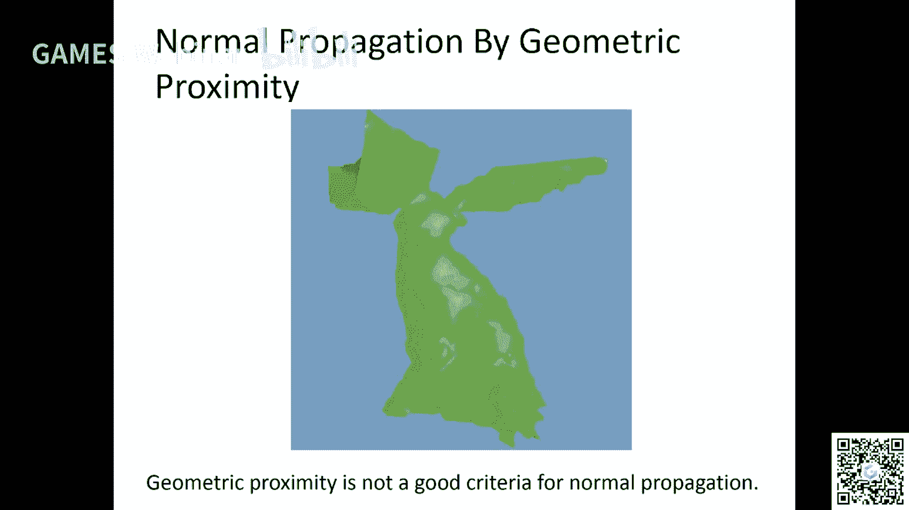

那他是怎么做呢，这篇文章很有意思啊，他实际上做了一个什么东西呢，他就是做了一个就是说首先我们build一个miibgm对吧，就是把这个所有的这个potential就是一个点对吧。

你propagation edge都拿出来。

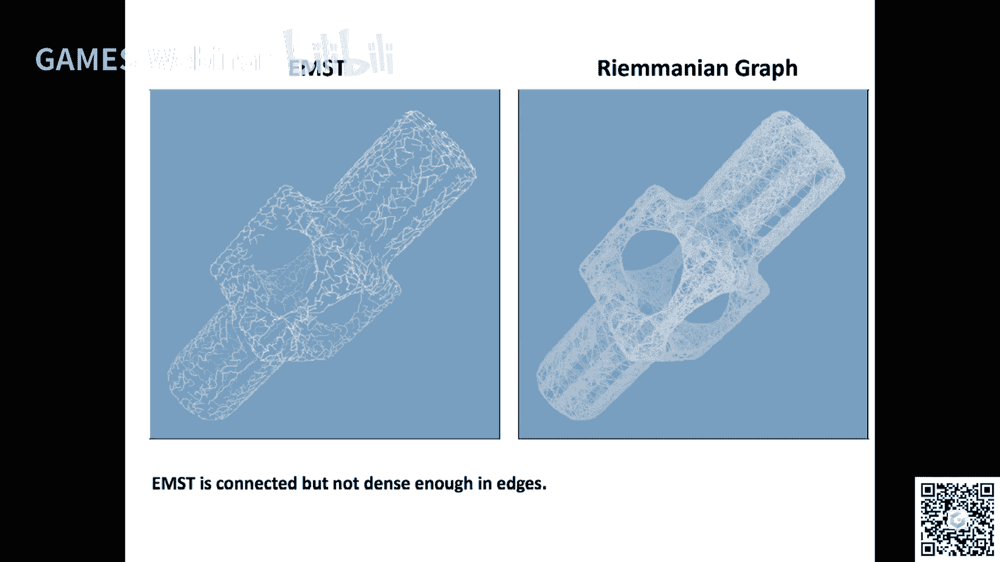

然后他的idea非常简单，它也是一个neighbor这种base recocoa managgraph of the plane centers and age wa，但是这个way它是怎么来的呢。

他就说我看这两个法相是不是就是比如说我我有一个点，我已经固定它的法向，那下面有一个临界点跟他反向，本来对吧，t的是就是0度或者180度的时候呢，这个时候我就比较trust，我就去做pk对吧。

比如说呃中间有一个点是比如说40度或者140啊，那我就会除非我硬要做这个propagation的时候对吧，一般情况下我不会做这个对吧，这是一个东西对吧。

就是propagate normal around the minimuspenge of degraph对吧。

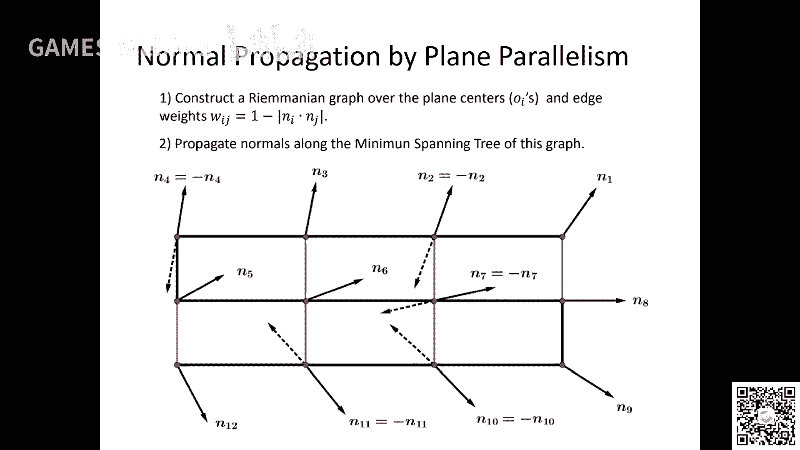

对啊，那这个东西呢它work的相对来说就比较好对吧。

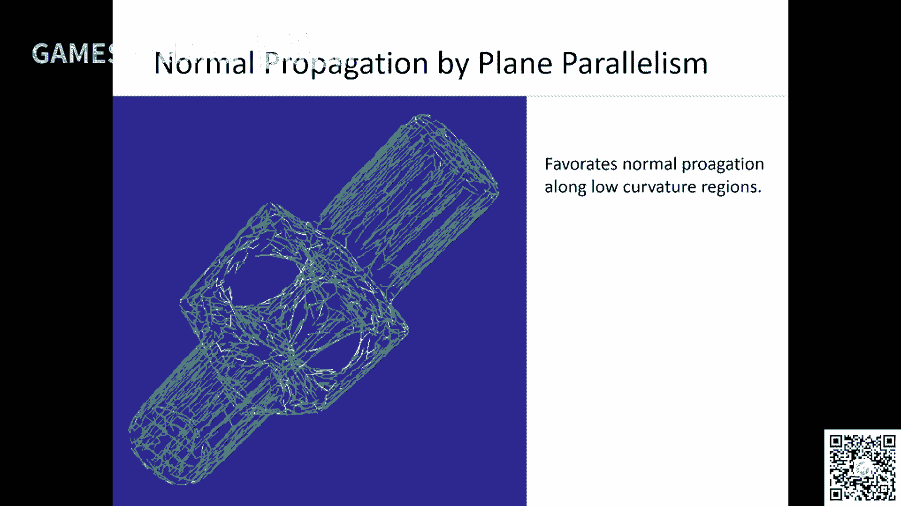

就是说你你看这就是一个一个比较典型的propagation，就是说呃啥叫propagation，就是说你给一个这个就是这个东西应该怎么翻译啊，你们学校真是，就是你中间中间你有一个点已经固定它的反向对吧。

然后你相邻的点他发现有两个选择对吧，那你到底选哪个呢，你就选那个跟这个这个点那个法杖更更好，基本比如说他他们的normal差别是0度对吧，你选这个不会选180对吧。

这个时候你就把这个点的法向的orientation了，嗯这个就传递啊，可能是传递的意思啊，传递给你旁边那个点啊，好吧哎这个应该清楚了啊，好最后一步呢实际上就是你你给定了一个3d。

就是定义那个3d和fanction对吧，实际上就是他是这个3d的东西呢，就是说比如说对吧，就比如说你如果这个sample足够dk对吧，那你找到这个最近的点。

就是你真正那个underline的那个service呢，呃呃和那个距离呢不会不会差太远啊，实际上这个东西怎么做呢，就是说你有一堆点对吧，你翻翻这closest对吧，这个我们做嗯。

你有你你已经有一些平面了对吧，就比如说p对吧，这里有很多center对吧，有可center自然就是那些点嘛，你找最近的点对吧，然后计算到最近的那个点的那个法向是吧，playing diss是吧。

这个prindex我们做注册的时候用对吧，就是嗯做这个point to play diance对吧，做做对吧，他现在现在我就用来定义这个呃，dc主要低分是不同的地方就在哪，就是说你做出色的时候。

你是不需要这个反向的对啊，你做重建的时候对吧，你做重建的时候，你是需要反向的啊，对吧就是一个remark，就比如说你有很多很多点对吧。

然后一个点一个point到c就playing the distance对吧，实际上就是说你会发现这个这个decent它不完全啊，比如说它不完全一样对吧，后面我们会解彻底解决这个问题啊。

用一个思想叫conditional unity啊，就是大家还是平时你注意啊，有些专业的术语，专业的术语你还是英文比较重要啊，就是便于交流，便于交流啊，然后然后呢你有了这个东西以后呢。

比如说那也就是说比如说你有一个独立的对啊，你你你比如说你你就要回忆你上面每个点对吧，你都可以到那个找一个最近的点对吧，然后去找加上距离，那你就会得到，比如说你空间中一个petition对吧。

你会放一个q potential of space对吧，就是说尽量的细对吧，然后然后每个上每个点都可以计算距离对吧，可以问的也可以负的对吧，然后呃，对吧，然后这个你可以计算这个呃对吧。

那那有胜有负的时候你就知道对吧，呃比如说呃这个green上面一个h对吧，一条边是这里下面是负的，那就是你要知道这中间肯定有一个框对吧，intersection是吧。

然后你就会你就查查你为interpolate，比如说这边是这个论证的地方是二对吧，那个地方是-1，那你为interpolate这个地方对吧，在1/3的这个地方对吧，你就说这个音的三成这样对吧。

就是这个算法呢叫什么呢，叫marching cu，这个东西是一个非常悲剧算法啊，啊那现在大家最近有些文章的都就sm freeze那个which is z啊，他有篇文章啊。

就是呃研究用deep learning来来做模型q啊，但是他那个其实他excel很多了对吧啊，那边玩的挺好的啊，我建议大家可以读一下这话开服三啊，然后那个呃你有了这些点以后呢。

下面就是你要重建一个mac呢，就是说这些点就是那个max what tex对吧，这个摩擦系数首先它在这个edge上面对吧，第二就是他是这个edg的满足条件，就是一个正的一个负的一个正的一个。

或者你换一个3000工业，它就会变成什么，它总有一个地方是零，对吧啊那个地方呢它就是这个mamax water对吧，那下面一个很重要的问题就是奥尼尔，what is，你怎么把它连起来变成一个mac对吧。

what is，大家很好理解，对不对，你就找一个这不变对吧，连起来呢他就有这个呃，我待会儿会讲也会提到你这个moching cues呢，他就找了，比如说你还有17种情况，就是说你十几种营销是什么。

就是当你刨除这种心理学嘛，就是orientation这些东西有17种情况对吧，实用的话就是说你你是个正常的点，有正有负对吧，有正有负，然后呃，有正有负对吧，然后一共有17种情况去构造这个match对吧。

就是把它相连对吧，呃相连你保证这个东西它是consistent啊，or two different sales啊，那其中有些方法呢还是有些ity，这个时候你可以用能力方法解决啊，这是mtv。

为什么现在的现在大家有能力做这些东西啊，嗯这个东西呢我就不讲了，这这这个东西呢嗯，它是一种就是纯纯枚举啊，纯没取啊，其实也不缺表啊，所以这篇文章他贡献很大嘛对吧。

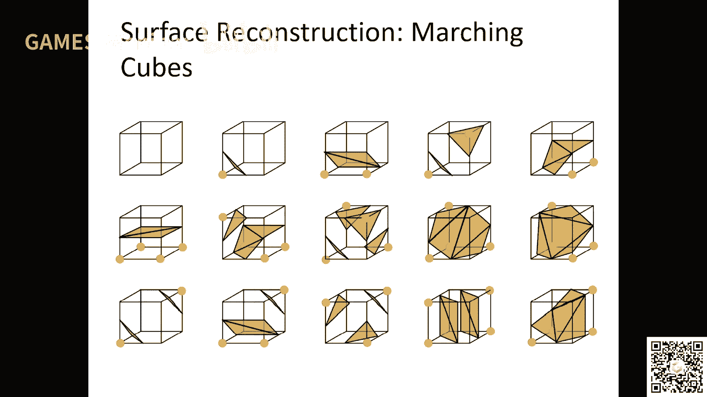

不取表啊，然后有了这个东西，比如说我给你举个例子，就比如说你看啊你有一个这种对吧，这些红的这些这些砖砖一样的，就一个个的cl它都跟那个曲面相交，对吧，都不愿意，然后呢就是那个重建出来的这个mesh啊。

重建出来的mesh就是说啊政府边它就一over tag全部连在一起啊，motion cube这个东西你可以看出，第一就是说他就这个全国它不是非常非常的这个，不能保证啊，这个你叫这个叫什么meeting。

王王对吧，你不能不能保证，我都想说这个东西不能保证，金刚老师是不是讲过remission对吧，就是怎么把这个三角面片变得更好对吧，应该有人讲过吧，没有讲过的话，我们应该看门课来讲这个东西啊。

就是讲解放性比较核心的内容吧，首先你保证是一个网格啊，就是良好的，但是这个shift没法保证后面对一个作品mine，后面有一个叫your countering啊，就是相对来说啊，我这个后面会提到一点啊。

那那个是比这个稍微好一点，但也不能完全解决问题啊。

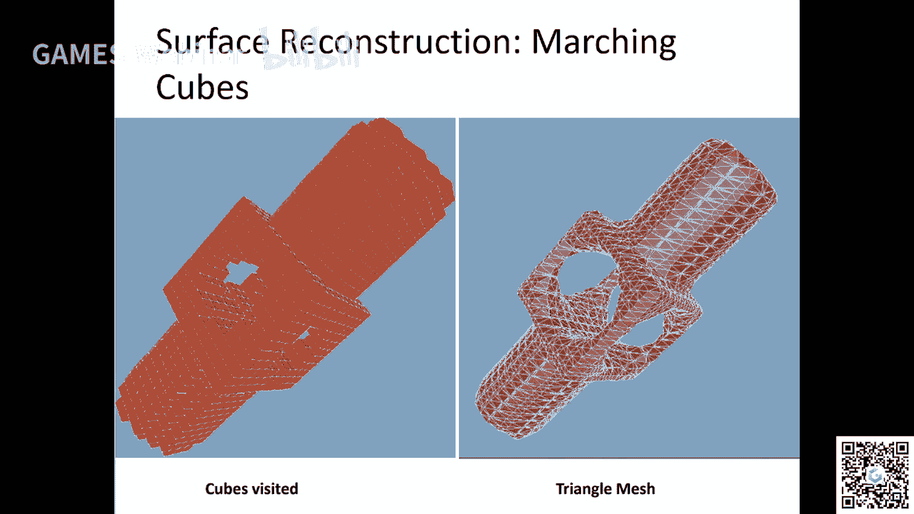

好data structure，就是说比如说你可以呃对吧，你可以有一个这种group by voxels，对吧对吧，你可以这样方便你找neighbor search对吧。

就是嗯对the complexities，这个大家可以记一下啊对吧，啊这是一些result，ok是那那是第一篇文章啊，我们后面会正面讲讲你怎么得到一个更好的，一定对吧，你现在你可以看这个问题在哪。

你比如说你一个点如果太多一点的话，会出现什么情况会出现，比如说明年你你你不是一个设计师，他们可能对吧，那可能香菱这个比如说q d是这个整个区域对吧，整个区域这个地方它都可能也跟这个东西相交对吧。

这就出问题了对吧对啊，这就出问题了对吧，都是result对吧，然后我们再讲讲这个what a mea method for building，compression。

model for range image，cd篇非常inference的文章，不认识你的啊，这个inferential的东西在哪呢，呃其实我跟大家就是我觉得这个思路挺好。

就是呃比如说jj processing啊，特别好，或者就比如说computer vision里面啊，大家都写，就是比如说这边就是大家都喜欢做一些做一些sequence的东西，就开始单。

我就说呃这这个东西大家可以做比对的，注意啊，就是包括我自己有时候经常，那后面会讲吗，如何如何上是呃，后面会讲吗，如何从电影构建移动最小啊，我后面会讲，你可以到我的主页上，到这个课程主页上。

就把slide下下来啊，你可以提前去那边看一看，如果你对这个东西不感兴趣的话啊，那个slide是在主页上的啊，然后，就是大家喜欢一步一步的去做对吧，比如说我首先得到一个点原因，得到点晕以后。

我就不管这个点是从哪来的对吧，比如说这个这个这个这个这个这个这个def jam这个这个pose在哪，我都不知道，对不对不对，然后，对这些东西都都都都没有对吧，然后那个呃，对吧。

然后这个好处就是你每一步都解决一个康复的问题，比如说将来我们我们下节课会讲这个主要从motion的时候，你会发现诶本来一个普遍常复杂的问题，我把它分成三个部分对吧，分成三个部分，每一部分都有显示解哎。

这从build就是build系统的系统的角度来说，他就非常非常好对吧，就是每一步都是显示节目不会做优化的时候搞到一个local命令嘛对吧，缺点就是什么呢，这个东西是suboptimal。

就是你比如说你前面的那算了，犯错误，后面没啥recover对吧，或者前面用的这个information你没用上对吧，他是这样一些东西对吧。

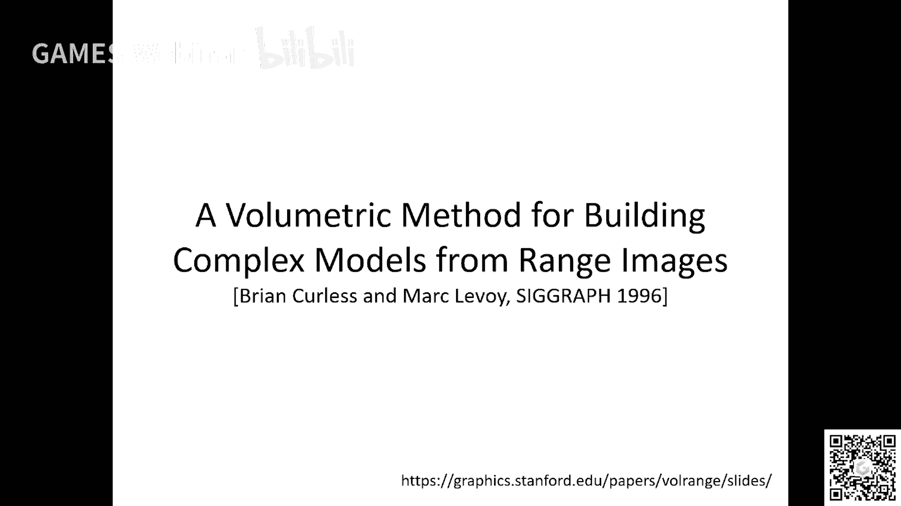

那我们现在怎么做呢，就比如说你比如说这个我的mac算法，你比如说你这么想，就说他这篇文章做了一个什么东西呢，我觉得大家记住一点，他就说我做重建的时候对吧，我算那个曲曲线的时候。

我不应该把什么把以前比如说你这个每个点他的那个camera cos给扔掉对吧，对吧，为什么come on，不能cos，不能。

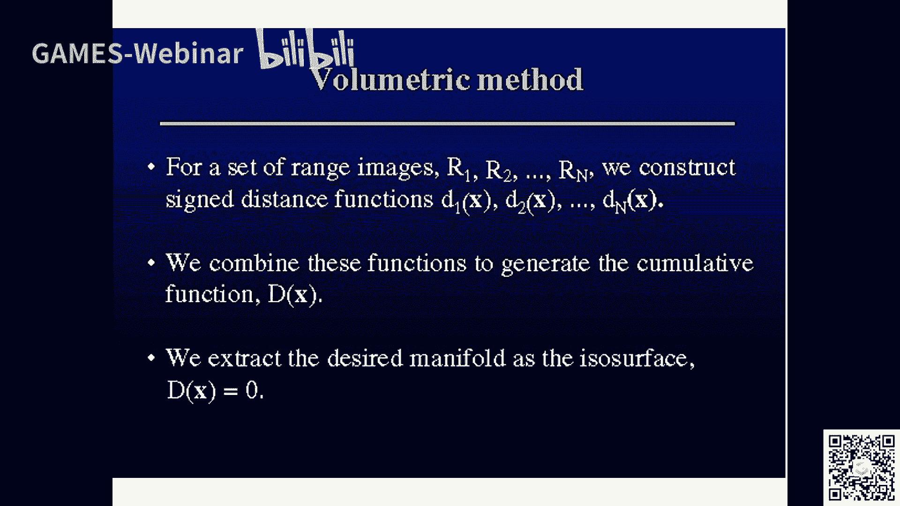

因为他嘛他会有一些with the beach的constrain，会有一些with the becom，说我举个例子，你那他这篇文章呢也是同样对吧，就是有很多scar对吧。

很多can后我会把它乘一个x就成一个这种这种distance fasion，类似difction，然后我会做一次surface。

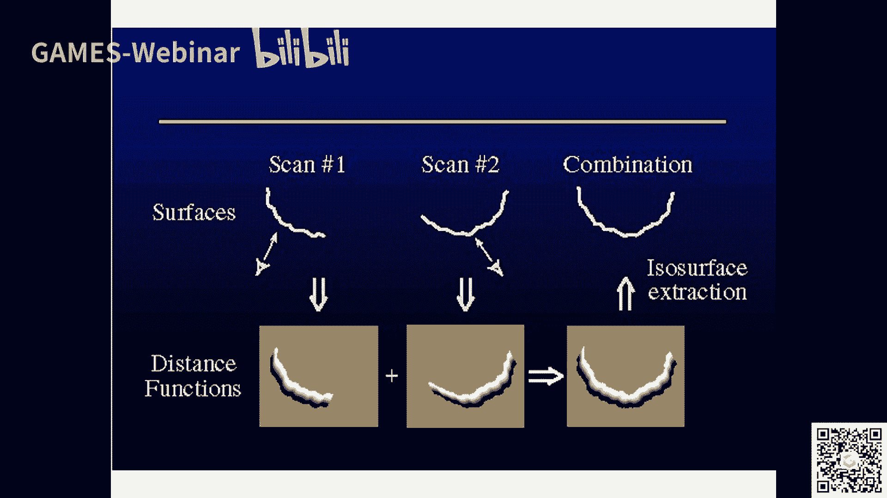

对吧，它实际上对面文章做了一个什么呢，做了一个lisquare solution对吧，做了一个lisquare solution对吧，就是啊我具体就不讲了对吧，他就是说我我是做了一个对吧。

就是说比如说你有很多skin，我不是找最近的点对吧，我不是找最近的点啊，飞进的思想呢后面非常infenti，包括你这个pcr。

你这个fplease surface regression会讲一系列的工作啊，是基于这个东西来的啊。

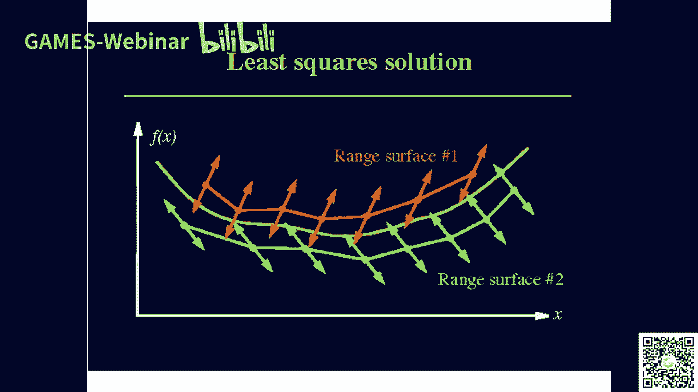

就从这里开始的对吧，它实际上就是errole point对吧，就是说我会awage对吧，我会就是说每个点对我找一个曲面，一个impression fashi，我去beat对吧，我会我去c的所有的点对吧。

这样的话比如说你点有误差的时候，比如说我找一个最近的点对吧，那就远远不如我去做fitting要好对吧啊远远，我顺便跟大家讲一句啊，就是这些工作前两天的话翻译翻译成现在的话，怎么我们怎么去。

可能你重新做一遍啊，我觉得是很有前景的，很有学问的，我觉得现在慢慢的大有大量的工作啊，我个人感觉我一个直觉，就是会有大量的人重新再把这个东西重新做一遍啊，从地不能用角度。

然后我们把performance再提高一下，嗯就是嗯怎么做，这是一门学问啊，嗯对他就做feeling对吧，做feeling的时候呢，你会注意一点对吧，就是说呃完了以后呢。

你会有一些后对一些取一些这个这个洞对吧。

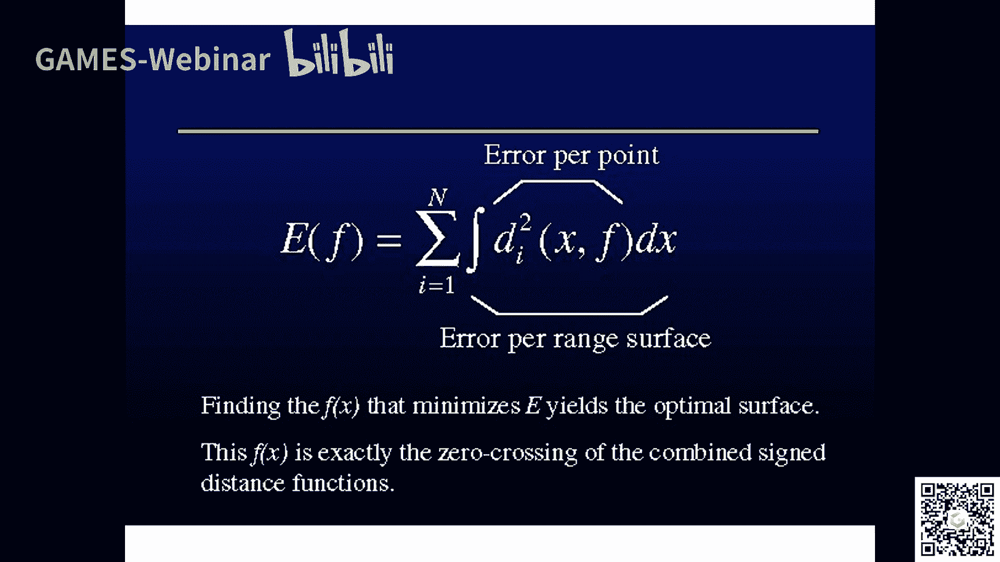

嗯要去补对吧，这个我就讲的比较粗了，不像上面有讲那么细啊。

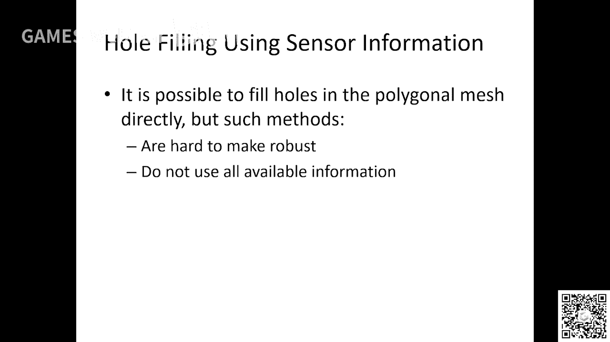

然后做好时候呢，他就用这个sense的information吧，这也是一个系统，就是说你比如说你在在在这个地方，比如说有a有b有c对吧，那你中间怎么救呢，你不能乱丢对吧。

你不能说你也搞一个这样的东西对吧。

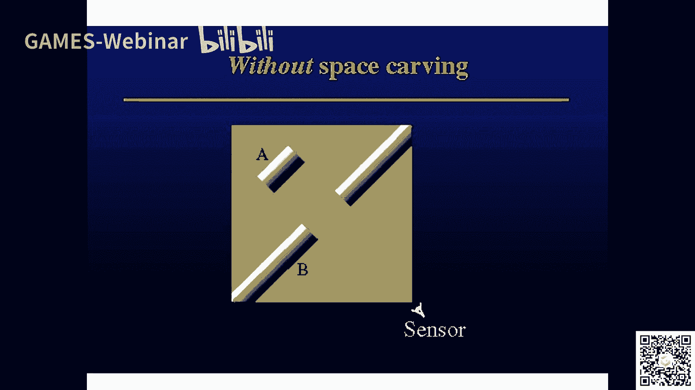

你会发现他他就会这么去对吧，to feel对吧，呃我具体具体的那个算法我不想啊，现在没有时间啊，我就不讲了，就是说他是引入了这个就是b的pd的con啊，就比如说你这个fir出来后。

你不能把你windoable的设计师给打错了，那不太可能对吧，他有时候via via cl，然后你想这种传这种，如果你在重建的时候不考虑这个东西，如果一个点燃，那你很有可能就会忘了这个商品。

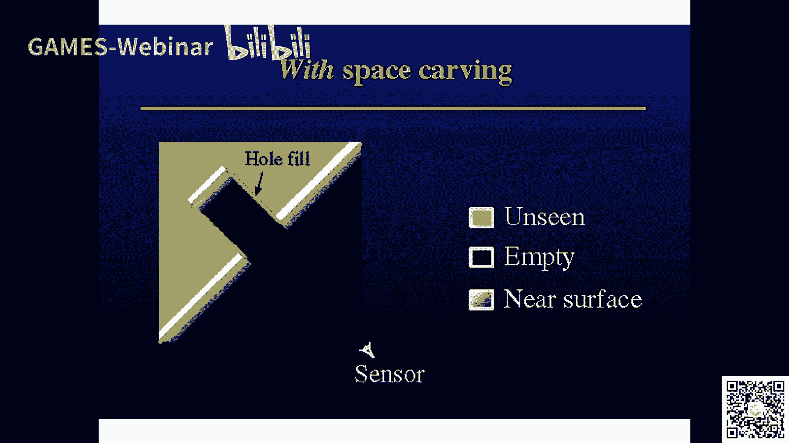

对吧。

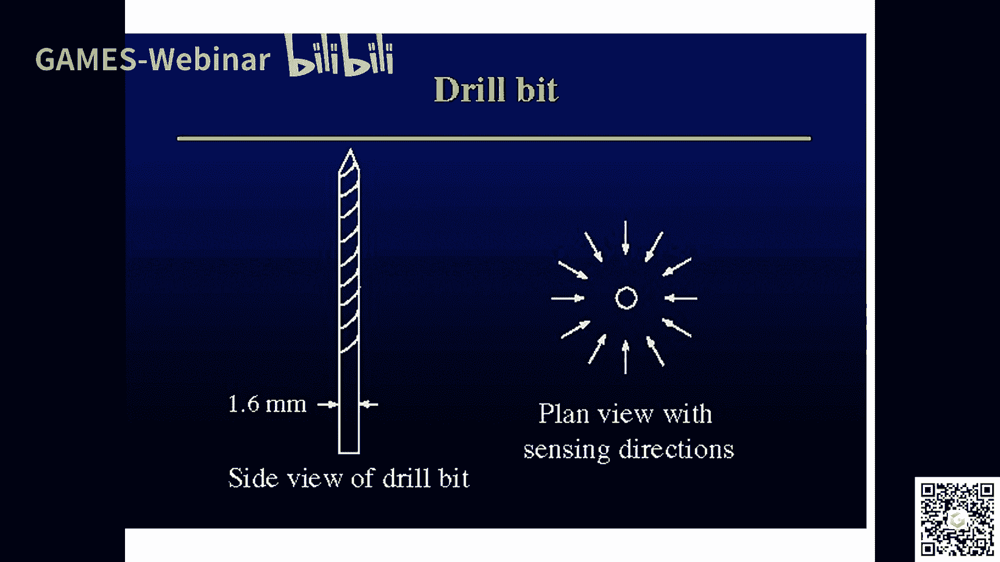

比如说它一个特点，就比如说你看啊，你比如说如果如果你不不不遵循这个with the ability constraint吧，比如说你ranch services是这样子对吧，你如果是直接去搞的话。

他就会这via这个对吧，如果你是做出规定的话。

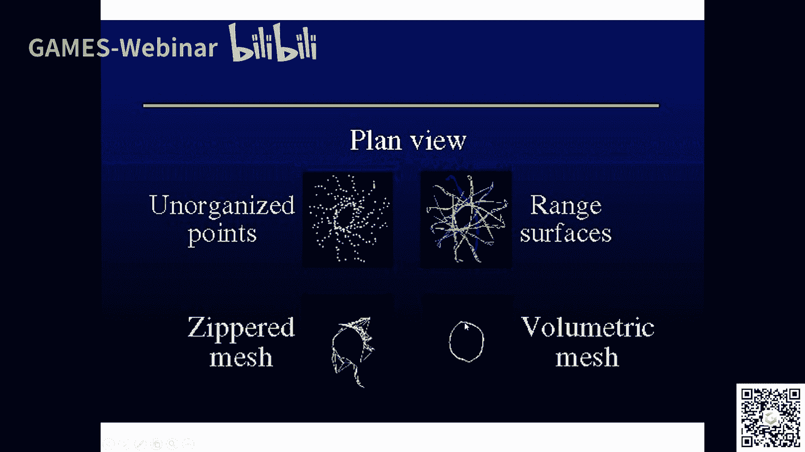

唉他就会你看这就是那个比较嘛对吧，就是说如果你有这个这是一个那个呃呃具有对吧，如果说这是前面一篇文章我没讲啊，它实际上就是把所把那个boscheme把它缝在一起对吧。

这个地方如果你首先你如果做regression对，就是碰了，this is so regression，然后你还遵循这种videbo。

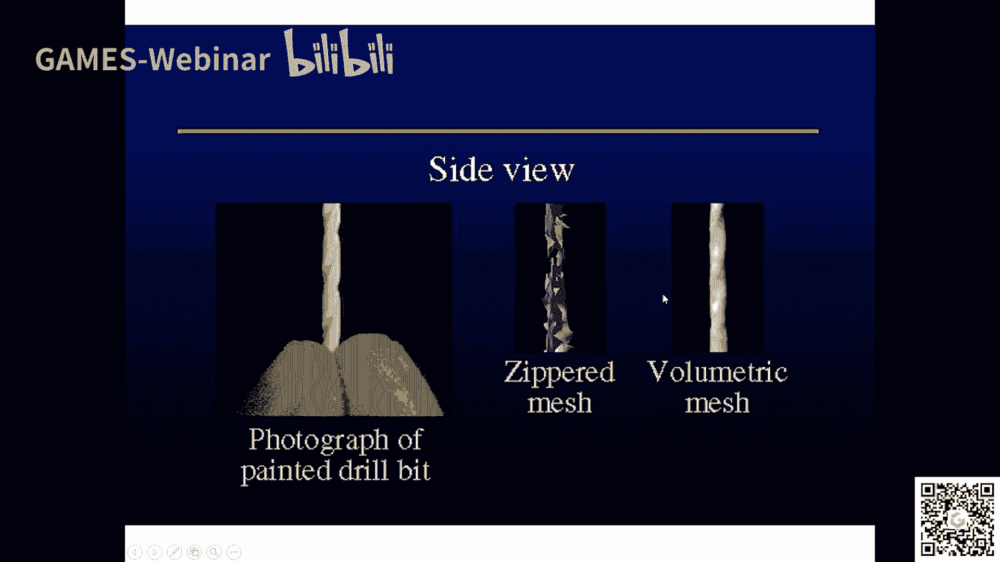

虽然也能得到一个更好的结果啊，好吧呃好好，这是这篇文章，我就简单的，因为这篇文前面的铭文章相对来说比较有简单的勾勒一下，那下面我会重点讲一下你怎么得到更好的隐私对吧，特别是你的点有noise的时候对吧。

或者incomplete的时候对吧，或者你要保持一些保保，保持一些跑的那个feature的时候，你怎么去做对吧对吧，就是非the primitive data。

minimize square distance，between perform and the primitive对吧，哎你做这个东西就是tx等于a x a加b x加4x平方对吧，对这个东西的话。

你就是做一个lisquare cing对吧，做一个lisquare cing啊对吧，就是fitting对吧，这个东西大家你们有谁知道这个这个解是什么样子吗，怎么去解这个历史规，有谁知道吗。

有谁知道怎么去解这个历史gram最小二乘对吧，应该叫做嗯，不是这个well pls v d在这个地方应该是解一个linux对吧，non system就是最小二乘啊。

你如果如果所有的那个系数大到里面去是一个ctrl，是一个list square的时候，他就解一个，我高我们不需要高斯牛顿没有那么复杂，这个地方几个人，你我你也可以说是高斯牛顿，他一步就收敛了啊。

呃一步就收敛了，很好啊，大家还是我觉得还是咱们还是有些interaction interaction啊，高速由那一步收敛对吧，因为它是一个二啊，不二次型对吧，这个地方跟你讲了对吧，就是你可以说这个对吧。

你可以写一个这个求导对吧，就是mini sim equations，这个东西是这样的啊，就是你当你做久了以后啊，你就会非常非常舒服啊，你不你如果从来没接触过对吧，那你真应该呃这应该自己推一遍啊。

这应该自己推一遍啊，好吧，就是比如说什么这这几段话就是出面解，就是说他这个c就是那个a abc就是那个cosation对吧，你这个东西等于零对吧。

然后你就会变成一个这样的这样的那个linuc equation，这个p什么东西的，这都是我们知道的对吧，然后呢很有意思，就是说每个m他是个p的这个power，然后这边就是这样子的对吧，对吧，对啊。

然后你解一个解一个linusession，你就能得到这个这个这个这个这个这个tony的常数对吧，那就这样子，这是一种fitting对吧，然后我讲了，那那你怎么咱们怎么来b的演示曲面呢。

呃这或者这个东西它是怎么发展出来的呢，呃很有意思啊，很有意思啊，有一种东西叫做radio basic banks啊，这个东西怎么翻，咱们叫或者叫r b f吧，好吧，咱们就叫r b f。

实际上他是怎么说呢，他就是说他represent partition fections的，son of radioactions are，对吧，就是说这个东西呢它是，但是怎么说呢。

它是这个呃你有些data point对不对，然后呢这个呃呃呃然后呢x到p i它的距离对吧，然后r呢它是一个basic sec的，就所有的点都需要一个basic啊，就是这里面variable是什么。

variable，实际上当你r固定当然可能是have fm的，这是wi对吧，就是你把所有的fashion对吧，你都把它给找出来呃，加一个wei对吧，这个weight呢实际上它是有一个好处。

就是linux对吧，就是f4 的linui，就跟那个pomio那个前面的系数一样对吧，啊我是一个小伙啊，镜像奇函数啊，呵呵嗯行吧，然后fx就满足这个现实对吧，然后然后你就可以解对吧。

你可以解这个这个系数对吧，就computer这个wi对吧，实际上就是说当你这个点上面有些值对，比如说你这个点是对于那个点的复议，后文会讲啊，然后呢嗯对吧。

然后你就可以写这个lina lina seof equation对吧，就是说呃假设你比如说呃你每个点都有一个词，对不对，每个点都有一个词反对吧，比如说这个点在外面呢就赠一的那个点在里面的-1对吧。

哎你可以speci一些这些constraint，然后呢你就可以把w0 w w给解出来，其实你发现没有，就是写，嗯对他那次也没事取曲线那样啊，他实际上就是或者叫做一个fal space。

把一个lina这种这种线性的对吧，组合在一起，对你要写的就是w啊，这个好处就是这也是一个linusal equations，对不对吧，也就是说你在这个点上面你定义什么值对吧，然后你就能解出一组系数。

对不对，我们比如说我们想这个点，他的那就是说你在外面对吧，你可以延长的法向方向去定义一些东西，对不对，我们待会讲啊，待会讲啊，你别急啊，你就说现在我们就知道我们这可以插值这个点上的什么。

可以就是我们在点上面都有一个就是有个function对吧，我在点上每个上面都有值，对不对，然后啊我们就能插值出来对吧，我们就能插值出来这个呃这个每个点点的weight啊，每个点的wait。

然后那个倾向进函数呢对吧，它实际上那就是有depends on the radio function对吧，他们一般用的系统，就比如说这个secret sp d等于d平方等于lod对吧。

或者就是说这个高层对吧，是一个data frameter对吧，或者就是edge，也就是说它决定了你这个fish size对吧，就是你这个卡子他要你要查查子，多多多多海水更新的东西对吧。

对吧就是他t就是本质呢它也就是一个叫final space tv，但他不是tp space，但就是fal space就是点上面它的一个fashion，然后把它结合在一起，对吧啊，结合在一起啊，嗯对吧。

但是他有很多问题了对吧，就是说这个尽量减函数这种东西啊，a large system evaluation，requires global solution对吧，但是你发现没有这个sdf。

你比如说d s d f，所以df sdf都用了新机二式的一些事情啊，这里就是减，然后ok对吧，然后我再讲一个概念，一个是radio bc，再一个概念就是potential。

这个petitive unity呢实际上就比如说呃他解决的是什么问题呢，cdpc section它是一种差值的办法对吧，poly呢实际上是把一种这种local的这种apartition对吧，把它给结。

怎么把它结合成一个整体的啊，这种proximation对吧，比如说local reflies by quetic surface是什么东西啊，你然后你怎么把它结合在一起，变成一个整体图形。

嗯这个东西这个partition unity从哪来的，你知道吗，它实际上是从这个如果你们学过vc流行的话，构造的构造那个构构造那个比如说increasy fanction series。

或者构造一个manual时候，那这个东西经常用怕对面ity对啊嗯，ok我现在还没讲算法啊，我现在讲的这些基本的这个to啊，这些工具啊对吧，radio basic section。

就是说你可以把你可以重建出一对吧对吧，这个这个这个function吧，然后他的他的他的primeter就是一些系数linux啊，然后你解求解这些系数的时候，你可以解一个linux对吧。

pdc呢是另外一个工具，它就说你怎么把这个local的这个potation的拟合在一起，把它变成一个整体的东西，但实际上还是这样对吧，就比如说你有一个fx对吧，x任意的对不对。

然后呢我会我会把这个fi x都写成这种形式对吧，然后你这个杯子是这样子的，对不对，嗯为止是这样子，然后呢，他这个好处是什么呢，就是说当你这个杯子是这样子的时候对吧，你然后这个f p i对吧。

当fpi当你把这个pi扔进去的时候，正好呢这个f的值呢就是就是f i对吧，也是一种差值，对radio basic session是写一个mini sim。

这个ipad function interpolation，插值呢他就是说直接是一个显示的表达式，直接是一个显示的表达式对吧，直接是一个显示表的啊，然后limit它就是f i，然后当你去pop对吧。

就是说会有一会会有一些限制了啊，这个东西我就不讲了啊，就是说对吧，你可以可以有一些别的方法去set对吧啊这个我就不讲这个我就不讲了，petitive unition method对吧。

potential unity，它实际上就是怎么说呢，就是说你比如说有些有一些点对吧，你有些点红的啊，然后呢我想build一个function to proximate。

就是continue function和防止红的点一种就是几个新mini session对吧，那现在我还一种什么办法呢，就是说devon的quer啊，就是说我解一些简单的问题。

然后把把这个简单的这个问题的解呢把它合在一起啊，这个思想非常非常重要啊，这个思想非常非常重要啊，怎么弄呢，那就是说第一第一种可能就是上帝，还是一些所谓对吧，我fit一下，比如说fit一些。

比如说这个地方p的那个地方是fate，有国家的surface对吧，然后飞的时候你会发现诶在这在这个班子里的这个地方，就他不是他不是混合在一起的是吧，你就会发现它有gp，对不对，有get up。

那你怎么把它合在一起呢，怎么把它合在一起呢，这个有这个时候我就就这就有问题了对吧，这个时候怎么做呢，他就说你不把这些走位把它完全的分你，你把这些走位呢，比如说每个每个vision的抖妹。

你把它分成overla olab，对olaf一下对吧，然后每个种类里面呢你废了一个faction对吧，然后这个地方它只有一个faction对吧，这个地方它只有一个f。

那这个地方它有两个fanction都可以用对吧，怎么办呢，我就把这个两我就把这个定义一些，一些是ort对吧，把这两个promission flag在一起啊，这个wait它就满足什么条件呢。

就是说你在这个抖音里面它是有直的对吧，等面外面它就是零对吧，再碰不country不contribute对吧对吧，如果学个b样条曲面曲线啊，b样条曲线是这个东西的一个特例对吧。

你b b样条的basis not compact support对吧，实际上这个思想呢呃任何本体上线，只要它是compex cod，你都可以用，对吧啊，都可以用啊，其实嗯如果选对，按道理来说。

这个地方讲的话，你们可以我不知道第二条，第二条大家学过吗，现在现在现在国内还讲第二条嘛，就做统一学的时候不讲了是吧，大家还是首先比如说做毛的领域，大家会首先讲这个bbs的区域的曲线，杨林嗷嗷。

ok杨林讲过的啊，ok那那这个思想，那那那应该会大家就很很没有什么问题啊，没有什么问题啊对吧，然后union master他就说他因为你要卡值嘛对吧，或者就是说你要不让在一起。

你要满足所有的weight的对吧，那个你上次不都就two one对吧，那比赛西法的位置，这样才会全面都满足这个东西对吧，然后你有一个locally support，对嗯对吧。

然后呢比如说你你p了点的时候呢，你可以做一个这个什么东西，你可以做这个moon miss quare，就是移动的这个最强二层对吧，你就是computer local procu一个点对吧。

然后你然后你wait那个distance data point bason，the distance to x对吧，就是你有很多no或者feat，然后每个点你都可以wait这个diss to ex对吧。

然后你就可以把它什么对吧，你就可以做这种呃移动的最小二乘，你看这个地方很有意思对吧，就是说对于每个x对吧，你可以做一个这种作为一种setting对吧，然后这个东西是一个smooth。

就变成一个smooth cv，if not if seat is smooth，ok啊我讲清楚吗，我应该没讲清楚啊，这个地方啊我就是说像这个就是说大家理解这个理解这个思想。

就是说这个movie lisquare的时候对吧，我seed是这个g对不对，然后p4 g的时候呢有很多很多点，对不对，有很多很多对吧，有很多很多点对吧，然后我飞的时候呢，就是说我尽量让这个。

比如说如果这个pi离我当前的这个x非常非常远的时候对吧，那我就让他这个位置接近零吗，就是他不去做c对不对，然后你这个solution既是一个什么，是这个smooth fection of对吧。

所以它是一个实木子克啊这样所以他就是一个实木子克，movie square，这也是一种setting的办法对吧，就是你怎么把这个logo的东西把它给结合在一起。

然后你比如说这个tpc choice of peter，对不对，然后你当你做feeding的时候对吧，你这个c塔i它是固定的对吧，当当当你x变变的时候，这个c塔也变对吧，实际上或者或者这么说吧。

就是说wait list square对吧，就是每个weight，每个点的位置是决定你当前这个对吧，首先你看啊，就是我们我们把这个东西理解一下啊，就是如果如果大家知道，那那你可以啊，所以会这样没关系啊。

首先我们的目标是什么，就是说我们有一堆解啊，我想把这个东西讲清楚，我们有一堆解对吧，我想把它呃，出一个非常smooth的客户出来，也就是我想知道每个点它的值对吧，我现在只是在一些离散的地方。

我只知道对吧，我想知道每个点值，那怎么做呢，首先我固定x是吧，我想知道这个x值对吧，就是x对吧，他relatively to other data point对吧，那这个时候怎么办呢。

把每个点到这个x的对吧，我用来weight那个点对吧，然后我做一个weight lisway，就fit说一个g是吧，出一个g对吧，然后然后我飞了出g呢，我把这个g在x的呢。

我就定义成这个当前我这个点的对吧，实际上就是说这个首先对于x对吧，这个gx就是跟那些相邻的点的直线有关对吧，tv choice for seat对吧，c d等于d的负方方对吧。

c d等于e的负t平方除以x平方对吧，所以h x对吧，standard lisquare problem对吧，lina is the question is blinusquare enia对吧。

对这些这些东西都是那个，然后我再讲讲c里我们有q了对吧，就是说有一个to ta哪几种，你看啊我们总结一下啊，这个radio basic fanction吧，听一下接函数对吧，就是说我能把一。

但我能把一些离散点上的那个fashion只给查到整个空间中去对吧，我们有这个sheep这种interpolation对吧，我们还讲了movie square这种，对不对，有三个球。

那现在就是用这些东西来什么呀，来能求，来来来来重建这些increased这个东西怎么弄呢，就是说对，首先引出曲面，我们刚才讲过了对吧。

然后我们怎么怎么怎么通过这个怎么通过这个point of samples，对不对，嗯，来来来重现这个演示曲面呢，这个东西很很interesting interesting啊。

就是说就比如说你这就是fashion should be deo in the data point对吧，就是这些点的地方怎么他都是零，对不对对，你去过所路线，就是所有所有的地方都是零对吧。

所以我们需要一些ditional concert对吧，这样是不行的，这个时候呢我们是怎么说呢，这篇文章很有意思的，就是work turk啊，jam james他们做了什么东西呢，我就是说给定一些点对吧。

我怎么说呢，我首先一个是normal information对吧，就是说我我用这个normal对吧，我就是怎么说呢，就是说上面这些点对吧，比如说这个点我沿着这个normal发现set的一。

我说这个f在这个点是正义对吧，你offset的-1是吧，但这个点的值-1对吧，这个时候呢就可以可以可以通过那个解那个faction，对不对。

可解那个解那个is the radio bfx或者the movie square对吧，你们解出一个解出一个这个啊implicit对吧，这东西这个思想其实还是很inferential啊。

其实你发现没有这个graphics都一样，那比较infer的东西他都非常简单的东西啊，就是说非常简单的东西，对我们讲过的这种什么sa这个这个normal对不对，我们讲过了，讲过了。

这个地方呢可以做一份weight对吧，seing对吧，后面有些人改进嘛对吧，用那些东西做orientation嘛对吧，kphop的文章对吧，这个东西我就不讲了，但是反复大家强调一点啊。

就是说猫猫还没完全解决，没有完全解决啊，特别是以前弄一点的，开始下面怎么去做猫猫飞脸都没完全解决，然后implicit from point samples对吧。

就computer on the angle of field is normally information direct constraints，fpi加上ni对吧，这个地那它就等于一对吧，唉，对。

对吧，这个他的核心思想是什么，核心思想就是说我上了猫猫以后毕生，然后呢我我可以出一些点对吧，然后构造出一些词对吧，用这些东西drive啊，这个implicit的东西啊，那么大家，这slash是有的。

你可以上去去去download的啊，就是然后我有很多内容不可能所有东西都讲了啊，我希望大家就是你如果有兴趣的话，你去读读文章啊，你们都是提高课，对这个思想你就记住对吧，你就说你看外面有一些点对吧。

但里面有些点里面都是正负的对吧，然后你去c的一些ctrl的，外面又是正的c的一些ctrl，然后求解求解，嗯right对吧，那实际上就是这样对吧，就是呃f p i它是等于零对吧，在这就等于是等于零。

然后fpi呢说你外面可不就是一些shot的point对吧，它就等于dr有d这个di有真有空啊，都是正都是都不行对吧，然后你是一个a b for procation，对不对。

is a seof equations，然后computing implicit对他有problem是原有很大很大的时候对吧，你还是记不到，对不对。

第一种解法就是说你能不能搞成一个spark match对吧，或者用the iterative solver对吧，但实际上这个还是还还是比较大的，还是你如果要写一个这种0。4层的话，重建的问题他都不是。

那么除就是除非是像上坡松那样对吧，你搞一个这种harratic，基本情况下它这个东西是比较慢的，比较慢，all right，对然后后面还当然有些改进了啊，有些改进，这个因为时间关系我就不讲了。

我就不讲了，你比如说你看这个rbf，他能基本上他能控制吗，你用少量的点对吧，就是少量的点他就比较实木子，他可能p得出一些这种呃，这surface fish也能做一些mooing的，做mooth。

每当我们休息两分钟好吧，休息两分钟，我接着讲一个比较重要的概念，叫mt level的这种话题，命题也是一篇很有名的西瓜分文章啊，休息两分钟再。

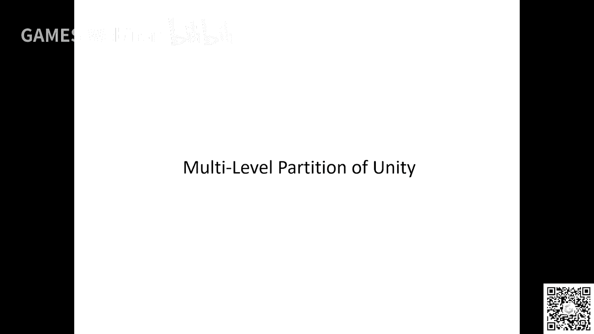

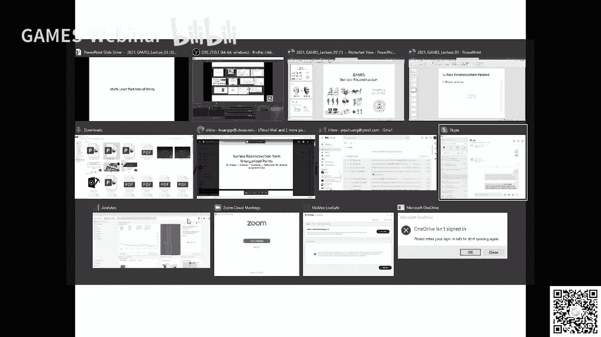

太好，有个问题啊，就是天天向上，face reconstruction，那现在大家用的比较高的一个东西，我现在回来讲就是titious unity，嗯，这个思想很好对吧，但是你比如说一个surface。

比如说一个shape，为什么interesting啊，就是或者或者说大家为什么研究这么久，就是因为这东西它有一个level of detail的东西，而且有的地方呢比较光滑的吧，那有的地方很多垂直。

对不对，你比如说就是如果比如说我们的资源有限的话，它就不能完全的表示对吧，我们就需要用一些这种这种这种traditional unity的思想对吧，硬件的思想，这multilevel对吧。

就比如说什么是multilevel，你比如说传统的变量条曲面对吧，后来后来你因为这个变量条，比如说曲曲面，你哪些地方它有些项目飞雪对吧，你需要多采一些对吧，那这个时候呢你比如说你就一个你你做做。

因为变量条比如说他是这个嘛对吧，这个时候你就会用很细的control control对吧，有问题对吧，后来为了大家为了解决这个问题，就是不把那个一样条曲面那个这个这个control point对吧。

那搞到个特别特别细，他怎么做呢，这个时候大家就做teslg对吧，t对吧，就是我只在有些地方确point就像网格一样对吧，有的地方我那个商家网面片比较大对吧，呃离那个铁那个特征比较近的地方。

我就那个比较小对吧，我们就用分享market level跑题选对吧，是什么呢，实际上就是说using motilevel for unity to concerts models对吧。

实际上就是说这个东西呃，呃这篇文章很有意思啊，就是我发现什么，我发现最近违约一些文章，就是大家对这个比杯子三层这些东西很熟悉啊，往往是对grass里面这种这个文章散太远，其实也挺高的啊。

散散运气其实挺高的啊，对这些东西不是很熟悉啊，这个东西是什么呢，就是说但是这个思想其实很重要，就是我觉得这个他这个里面的思想其实也，他有three tesset对吧，实际上就是说我有一个点云对吧。

但东网蛋糕网我把它feed出了一个这个呃，我把它seed成一个这个呃这个呃，在每一个logo里有出一个国家的section，对不对。

那那那这个地方呢就是说有的地方呢我不需要那个特别喜support vision，可以大一点，因为非常smooth，那我不需要那个很多的这种这种function对吧，如果去表示对吧。

他然后所以three kon concept对吧，第一个就是做piece one这种corrigic city是吧，你可以摸到飞起对吧，第二就是这么unity。

but the waiting functions of the blend is local shifunctions是吧，其实很重要啊，就是这个思想后面也经常有人用的。

the auto is subdivision对吧，然后他们actually respect shop fishes这种这种你是怎么去做subdivision呢，它是它是由这个决定了对吧。

就是你sting如果肺不好，那我就刷wife对吧，这种思想其实后面在graph里面还蛮多的，用的蛮多的，希望大家能理解一下，比如说那个人，然后可以做一些editing对吧。

你可以做一些editing对吧，有了implement表述的时候，就特别可以做这种c s g对吧，可以做bending，对不对啊，这种各种各样的东西对吧，sorry对吧。

它实际上嗯你看那个hop那个最开始那个文章，他是没有逃跑的对吧对算了，那么后面这些文章包括service construction，construction，它都是这个对吧对吧。

主要的思想就是说我ctively对吧，去用error control promial sign process services，dio level of the distance section。

就是这样的对吧，就是你creating fit，profarch based on lion，bbox for tonset of decel，对吧，就做一个feeling对吧，核心思想是什么。

核心思想就是一个r cubsp，核心思想是什么思想，就是在这对吧，就是我fit的不好对吧，云中云给我一点点，我fit一个function对吧，如果这个fate的l o很大，那我怎么办。

把这个分享呢就把点呢减少一点，对不对，少的时候我我对吧，你就说稍微忍，然后然后他那个神sb cell里面再去b的by sb cl里面的简单就减少了嘛，对吧，诶他就能fix的更好了啊。

这东西啊你真的要自己去实现一下，拍拍这个grap，你讲就是前二就发生这样的，很好对吧，但是真正他in practice works怎么样对吧，这个东西很重要啊，这个东西非常非常重要啊对吧，那怎么说呢。

比如说他就定义了一些这个weight faction对吧，实际上他这个weight faction depend啊，这个对吧，be spring对吧。

然后defend这个decent对每个点到这个decent这个距离对吧，然后这个radio ri就是决定你这个东西support vision有多大，对不对，然后你要保证什么呢，你要保证这个是吧。

嗯for interpolation，但你approximation的时候也是用的这个coop出来，就是说实际上就是说如果在那个cd外面的话，很多的话。

那个点就不can you bute to sell feeding对吧，interiation的时候，你要保真能用一定这个文章用了，另外一种都是通过这种实验的检验啊，这是一个choice啊。

这是一个choice，然后ok对吧，然后partition of unity，对不对，就是blend no confection，using schools。

loco was that after one对吧，然后，对吧，然后就是这这是一种思想啊，然后这个地方是一些具体的东西对吧，这是一个核心，那就是or chbase proversion啊。

你看这个东西是这样的，就是你有一个对你有足点啊，这有一个cell对吧，比如说在这个里面对吧，这个这个这个function对不对，这个function t的还不错对吧，那我就不soft di。

在这个地方如果气质不好的话对吧，我就说sop vision是吧，每个有一个support vision，就是应该就是把一些点都进来对吧，就是在这个里面诶，我对这些点做一些违体的飞艇，对吧啊。

然后呢如果这个这个这个这个vision里面点非常复杂的话，杂的话那会出现什么情况，非常复杂的话会出现什么情况，你就需要进一步的做subversion对吧，然后把他把自己的拿进来，然后再去做对吧，对吧。

对吧就是个abc对吧，然后用这种东西对吧，它是它是有一个sting的快界面对吧，就是说你的这个呃positiation error对吧，嗯但但就是说你要处理这个gradient。

为什么你这个因为你你这个，这个代数的曲线不是代表整个这个真正的error是吧，所以这个gradient啊，如果green是一的话，他就这个dition 3什么。

这个时候你的这个这个value就代表你这个disc，如果这个leo它特别大的话，你就进一步的sp就别的地方对吧，然后你看这个地方就可以了，比如说你这个地方你个对吧，你看这个地方有很多呃normal。

对不对，然后你就不让你去，然后这就是那个结果对吧，然后这个是那个嗯这个这个这个黄的就是那个是呃duo nset对吧，这个color就是你飞得出来的那个嗯就是以那个surface那个词对吧。

然后你会发现就是说你越下载的地方，切你越多的地方，你那个cell就分的越密，对不对，越平滑的地方，你这个shell怎么样，它就越粗对吧，因为你这个地方，比如说你在这个地方对吧，月初对吧啊这种思想啊。

实际上还是牵涉到什么，你就是如果如果如果你要去hit一个increases，这种表示就是表示对吧，第一就是说你这个影视的表示你这个三选在一个什么space里面对吧。

在一个什么空间里面对吧啊radio basic 3角形，那就是每个点t的一个杯子合在一起对吧，哎这个地方呢它实际上就是说嗯，他是他是他的那个他的那个basis都是so sales对吧。

就是这个一个一个的cell对吧，你越多的地方那个shell它就上，它背水就越多了，adaptive stre然，这主要是那个shot code，进去。

然后这个logo那个shape fancy怎么去做feeding啊，这个东西其实如果真的没做过，我建议你还是做一下，我后面那个我们做那个depremier也会讲啊，demit时候会讲啊，然后那个呃。

details in the paper，details in the paper，啊这个feeling这个东西你们如没做过的话啊，如果你想做题去processing，然后你没做过，说给一些点。

你对一个faction你从来没做过这个东西是不行的，这就跟你做没从来没简化过一个match一样啊，非常严重的东西啊，我们下节课第一第一次作业就出来了啊，大家可以看一看啊。

representation power对吧，就是说非常就是说你可以你决定实际上决定你这个杯子怎么样对吧，你还是能beat，这个就是你可能也就是比如说你你可以用peace wise。

这种corduality去model shh，这个还是还是很impressive啊，对还是很impressive，如boss对吧，你可以看对吧，f的一个零对吧，你可以呃可以煮面中out。

然后我再简单讲讲这个projection，main project，那要是干什么呢，就是这个东西呢，除了这个方法呢，大家还是用了一些什么东西呢，就是说这个东西怎么来，首先我要讲讲，他就说是曲线。

而你是好对吧，但是，一个一个一个缺点，就是说嗯嗯嗯给你一个点，你并不知道哪个点在这个局面上面对吧对吧，那这个时候我们怎么办呢，呃就是有就是特别是这个psy出来的时候。

大家用了也就是做了一个一系列别的工作，一系别的工作，他的核心啊，就最后他的这个drive的这个东西呢还是一个隐私的表示，只是说呢只是说这个他他不用，他不是直接存的这个隐私，这个曲线这个基因什么东西。

但是还是存了一堆点啊，只是这点呢就比如说你你给了一些红色点，对不对，然后不要再在这个再加一些点的时候，我其他的这些点呢他利用这个来决定的啊对吧，实际上比如说有一个非常有名的工作是吧。

实际上他就是说呃那怎么做呢，它实际上是做这个local of rest，你给定一个点对吧，他就说他是一个iterative的过程对吧，is iterative iterative的过程哦。

把这些点的位置把做做一些改变，不断的把做一些改变，就是说呃我给另一个点对吧，我set一个这个tonomio对吧，peace beat完了以后呃，呃我就得到了得到了一个值对吧，然后得到这个值的时候。

我在根据这个飞艇，我们把这个点移动一下，移到一个新的点，他就是在the neighborhood都变了嘛对吧，然后我就不断做迭代啊，最后你能证明呢是什么呢，就是说你看啊这个这个地方很有意思对吧。

我就是首先我嗯我飞了一个play，对不对，就是给定一个呃q对不对，我配的一个play对吧，我就用这个play呢，我作为一个corner system，我来feat一个logo的surface。

fat一个logo的surface，一个logo的surface，以后呢，基于这个logo的surface是，那么我的office这个点我来up这个点啊，我就因为时间的关系，我就不仔细讲了吧好吧。

我就不仔细讲了，你你们如果有兴趣的话，你可以呃这个东西也用了一个这种special data structure，special data structure，然后这里有一个有一个比较硬的。

如果如果你们有兴趣的话，可以读，就是说这个这个这个大家都喜欢看图啊，我觉得不管是谁都喜欢看图啊，就是说比如说你有一个a点，对不对，你有一堆点的这final spark，还有normal对吧。

然后呢我有一个good point，对不对，grade point，然后呢我就把这个鬼子的破坏不断往上面投影对吧，就不断的去投影对吧，就是统一之后呢，你就会变成一个什么。

变成一个非常dpoint cloud，是一个非常dance，非常非常呃dance point cloud，就是这就是projection basa method，ok。

我在后面讲那个tcs就是点云的处理的时候，我还会再讲一讲这个这个东西是呃，基本上我想2100 999年到2005年有很多这样的工作，在家研究做这个东西，不。

最后我再讲讲这个porn surface reconstruction，porn surface reconstruction这个东西呢，其实现在就这个东西是steve的。

但是还有很多版本有swing的这种of construction paper呢，它涵盖了其实是蛮多蛮多东西的对吧，the mission就是一个fmal区别嗯，怎么来的呢，怎么来的。

就是说呃很多感觉并用，第一呢就是说这个po这个东西就是它是pture preserving的啊，啊呃比如说在graphics时候或者是vision里面有有很多工作。

比如说papl match editing，对吧啊对吧，做空了，做过做过做过这方面工作，在更更早一点，在image space里面有通image对吧，是什么呢，它是一种更好的飞艇的办法。

就是说你给定一个点啊，给定一个破那个normal啊，一个怎么说呢，它是一个更好的setting的approach，它实际上就是说啊就就是说他不是说真的去查的那个normal，你比如说像我们刚才说的。

你沿着normal方向你offset一下carey constrain对吧，他就是说我我实际上是这样的，但是当时就说他是真正用那个那个重建出来那个impression fashion。

他的grain去fib那个normal是正好就是这个normal不一定特别effort，不一定特别精确啊，不一定特别精确对吧，所以男单呢也是solindicate fashion了对吧。

然后呢就是说我给定一堆ora这种外号，对不对啊，这个这个normal，比如说你可认可你不要求他特别进军，甚至比如说他有一部分normal是错的，哎这个其实他也是比较鲁莽的啊，就是你可以去。

你如果用用了很多的话，它是真的真的是这样对吧，就是给定一个origin point，然后你要得到一个index，对不对，然后它有一个green relationship。

a relationship between the normal files and green ftoriented the point对吧，然后你要这个indicate gradient对吧。

你的贵一点对吧啊，就是说这个可就是这个这个这个fashion的gradi要跟这个line吧，啊这就是那个constraint对吧，然后那个indicate function还要不要这个自由来说。

set还要positimate这个东西，就是说represent point by va few对对，实际上就是说你fashion eggs with green best policy对吧。

就是说嗯gradient不但要direction partment对吧，你这green发生的地方对吧，那个doolevel set的，你同时还要跟什么跟你对英国的point cloud。

这个point要进食进食啊，说我们实际上做过一些实验，就是什么呢，就是这个pal service reconstruction不是什么，它并不是the accurate real struction。

这个这一点大家要注意啊，就是比如说你重新我们我我我自己也弄过一些算法啊，就是说做重建嗯，就是你这个position surface reconstruction比啊。

它并不是就是那个numerical accurate算法，为什么，因为他要fit normal对吧，但这并不是说你真的记得这个b说point to point这种diss对吧。

但是cocb construction呢，他第一个就是首先首先就是mia它的一个非常重要的sc对吧，大家都大家用它比较鲁莽对吧，同时呢结果呢相对来说就是从visual里看啊啊他是非常好。

但配置为这个事情啊，大家要注意这个东西啊，怎么来的呢，实际上就是说呃实际上解一个division offer，你要你要干这个东西，它这个东西的解释什么呢，实际上就是说你求一个diversions对吧。

跟这个diversions的这个green division它非要一样，实际上就是拉普拉斯这个indicate fashion的拉普拉斯啊，他要跟这个normal grade要一样。

截一个linux system，这个东西其实非要解释这个东西呢，也不是mission farm，就是至少这个po的这套framework啊，它不是不是文章呃，主要的啊就是这个破松的这个boss。

前面我刚才提到了，有两个文章，他用了pslation去做别的东西，tation怎么实现这个id啊，这是这篇文章fmental的一个共性啊，fundamental的一个贡献啊，就是说啊他其实用了很多思想。

比如说alt对吧，og在前面我们知道mt level partition，unity用到了对吧，然后这个呃就是说你要defined black fd对吧。

就是说他这个f写这个indicate function，然后最后也extract iso surface是吧，实际上这个integrate function就是一个区区的对吧。

它实际上前面这部分做的一件事情，还是我们刚才所有的文章都在做一件事情，就是说给定a点以前的法向对吧，我怎么来算这个win precisection对吧，这是我们要干的。

第一个就是set up our去对吧，就是我我一定点，然后我用我用我用all去去做一些这个呃，做一些那个呃，呃对不对，就是说点那个点多的地方，我上外的比较深一点对吧，这up blog。

就是computer verfield，实际上就是说实际上说白了就是说你就是你放一个这个这个，fal space对吧。

就是你你这个pression或者或者是说你这个呃这个这个very confield对吧，你怎么把它变成变成一个连续的reaction field对吧，使得你这个implicy gradient来计算吧。

就是做一些lion的抵抗了一个faccial space对吧，这个final space它是比如说他就是说给定一些点对吧，我就可以定义出啊，这个上面我可以定义出每个cell的，比如说他这个vfd对吧。

定义出每个cl的mac field，那实际上就是说用这个去呢对对这个点做这个input的，做了一个重排样，做了一个重感样，然后就是我们max cel我就放了一个外地对吧。

computer diversions嘛对吧，computer diversions，然后我就说每个cell呢，我的你是mac的那个what time项目的定义了一个一个对吧。

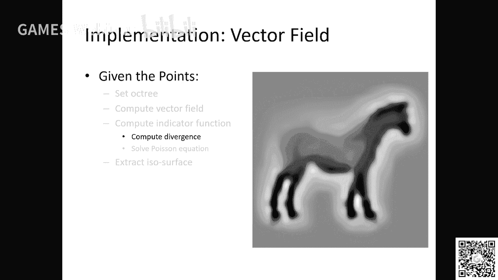

这个时候我就写一个linear system对吧，就是解一个就from post equation，解一个linux system那个post equation对吧，说白了他work的好啊。

真的跟这个on tre是怎么set up非常有关系啊，就比如说奥奇，他最近也有很多应用对吧，你比如说你可以用在这个，你可以用在这个呃呃深入的题目model上面，对深入t model上面对吧。

model for the post equation是吧，你最后一extract their iso surface对吧，有了这个东西可以extract their iso surface啊。

这个具体是怎么做的，这个东西怎么define的这个东西啊，我就不我也没时间讲啊，我也没时间讲，因为时间的关系啊，我从另外一个角度跟大家探讨一下这个问题，就是五不用out tre对吧。

那就是你每个cell对吧，你空间中的regular read，每个cell会有一个那个词，对不对，都会有一个值对吧，会有个字，那这个时候很多时期是没用的对吧，为什么all去呢。

就是说你最后还是想重建出来这个这个就是你只对那个什么，你直接这些呃input的点周围的这些点管用对吧啊，关心对吧，那这个时候呢奥区就能帮帮你，对我就是点多的地方对吧。

你这个这个这个这个increased fection，它就能越复杂对吧，比如说你有以及这个地方没有点对吧，那这个时候他是二区就非常什么，就就他他的shell就非常大对吧，这个时候你会发现什么啊。

如果比如说我我比这个sc位当然在网上了，你就说你有有一个点语音对吧，你你可以找一个你想个办法把点云的一些点给扣掉，然后你去装那个sos，你会发现什么，他他会把那个中间的那位他被mooth。

这是mooth这样哈，原因就是原因就是那个地方效果会非常大非常大，就是这个东西为什么握手好，跟这个all去的data structure非常非常有关系是吧。

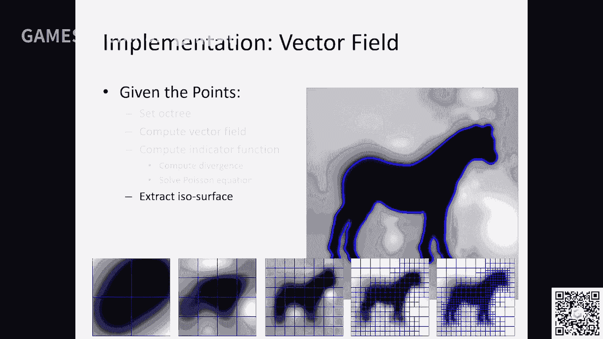

有关系啊，就是说对吧，就是，对吧，他是非常非常非常那个对吧，trintro reconstruction对吧，就是它是一种harris的东西啊，他那个算法那个写那个颇松的那个东西也非常鲁莽啊。

也非常搞了一些adapted的算法去填那个破松嘛对吧，好多时候呢你也不能说那个东西一定收敛了，但是就是说他这个他这个functional的这种表示啊。

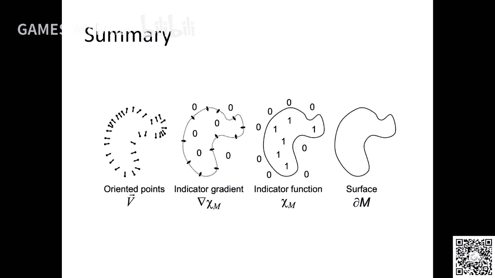

相对来说他有带一点卡池的意思在里面，就是说你即使那个linux system对吧，因为它是一种itering ser嘛。

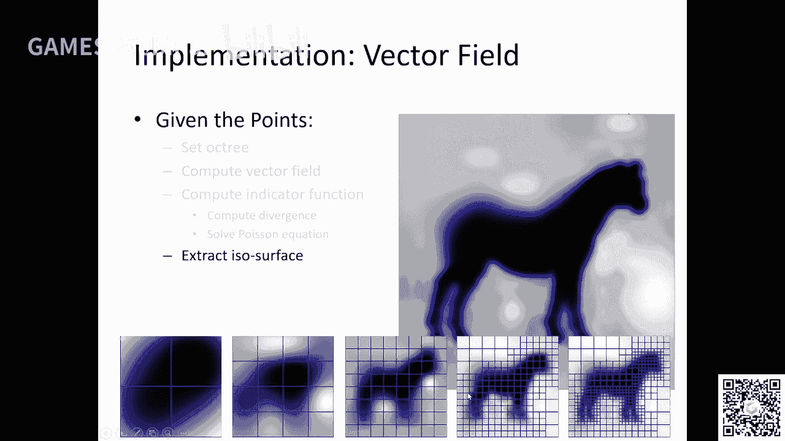

没有完全收敛，解出来的结果也是非常好的啊，也是非常好的，就是这个这个非常非常very very good的呃，引擎面，而且实际上他normal如果不是那么精确的话，这个work也挺好的啊。

基本上你可以对吧，你可以有这些东西非常非常好的对吧，也也比较scalable，来他后面这个工作，后面他也做了很多非常非常多的extensions，非常非常多的expansions，comparison。

你看power quest，我没时间想这种competition的小米的办法，但是你会发现就是当你noise的时候，然后非常的什么就是重建，非常noisy对，然后psv卡12小时基本上是是最。

就是因为你因为其实就是visually是最好的，visually实际上是最好的结果，这是我们前面讲的那个vn metric reconstruction，就是因为你fit normal。

它的出来的这个结果非常实木啊，这就是那个颇松的东西啊，颇松与考核心的思想，就是说写一个去feat那个那个那implicit representation对吧。

然后我还有一些neural e这些东西我没时间讲啊，然后我们后面做那个就讲那个increment representation的时候，我们会cover这些东西，呃再简单的跟大家提一提好吧。

就是刚才刚才有个学生提到了对吧，这个marching cube这个算法啊，就是说因为你的所有的那个我太边上了，他说效果不是很很好对吧，然后有一些有一类算法叫do method对吧，他能。

帮助我们解解决这个问题啊，就是这个do much duping water in this s，and what is in great s，实际上他就说我不让这些点对吧，在那个edge上面。

我让他在每个cell里面，这样的话就能更好的去什么更好去moto shop edge，也能也能让让让东西更regular啊，这是巨涛啊，嗯那个washington flow也是提出一个东西。

这个还是很pop的啊，啊最近也有那个呃其实怎么做deep learning嘛，就是或者或者说白了其实说白了就是呃在这一步我首先声明一下，不是做那个呃implicit record structure。

我是说给定了那个给定，比如说给定的cell上面的这些这些呃，我怎么得到一个更好的mesh，做的是这个东西，简单的讲一讲，简单的讲一讲，就是说呃我这个我tx的呃，弄到这个edge上面。

把它弄到那个笑的里面对吧，在里面对吧，然后这样的话呢它就能更更那个呃好的去control那个呃the shape，对不对。

然后同时你这个点也也也能play到什么place sharp edge shop shop上面，对不对，当然它不如那个mochi q5 ，相对来说呃，那么就是那么simple吧对吧。

但有一些buddy的我们需要去去啊，to handle啊，你记住一个核心的思想，就是要那啊就是这个这个我太子在shell里面啊，对，ok，然后然后我简单讲它实际上也基本上是这个呃。

它有一种duality在里面对吧，就是说你比如说motion q cube的思想对吧，然后那个dual countering呢最好是一种dual的关系对吧，但是，duo的关系。

duo的关系的话相对来说就是有了duo的以后，你可以更好的去对吧，你可以去optimize那个what tex position，我想想啊，这个东西我没时间讲，但是我就想给大家讲。

做第一你要知道就是我觉得第一比较重要的啊，你要知道他存在啊，就dual countering对吧，就是mesh reconstruction，不仅仅只有这个mochi tie一个思想对吧。

嗯还有dual country里另外一种很重要的思想啊，这是非常重要的啊，就是呃第二呢其实就是各有优势吧对吧，就是marching cube，就是always manifold，对不对。

就是required，但是他是record look up table right，就是说它的这个face quality不是很好对吧，do me，就是你没法green tea的many home。

说能签为自better sha，better shift polly感对吧，better shift polly感，对不对哈哈，比如说比较interesting，就是你怎么把两者结合在一起对吧。

哎就比如说首先就counter对吧，千瑞，然后看看那些地方不是manio，对不对，把那些地方用motion cube的时间补一下对吧，哎这都是ble solution啊，今天我就讲到这好吧。

然后呃下一节课我们会有一些这个作业出来啊，会有一些作业出来啊，这节课呢我讲了很多很多的东西，有的东西我重点讲了一下，有的东西我就一笔带过了啊，但是flash我是有的啊。

简单解释一下这个算的具体实际上嗯是什么东西，比如说dual啊，就是说dity是什么东西呢，就是说就一个点，那是duo是什么，在平面里面duo是一个nn，这个九是哪来的呢，就比如说或者说什么999点呢。

比如说，全国的match对不对，然后你把全国的match的每个face里面呢都变成一个what太，然后这个我太不用我太相连，但就紧张，这两个废纸是相交的对吧，你就会得到另外一个dual match对吧。

就是说你每个点就变成了对比，就是的点就变成一个face edge edge对吧，face就是，那个one motion的时候，我们也会牵涉到一些这个呃，牵涉到一些自动解压力的东西出现，就讲到这好吧。

然后下节课再再见啊。

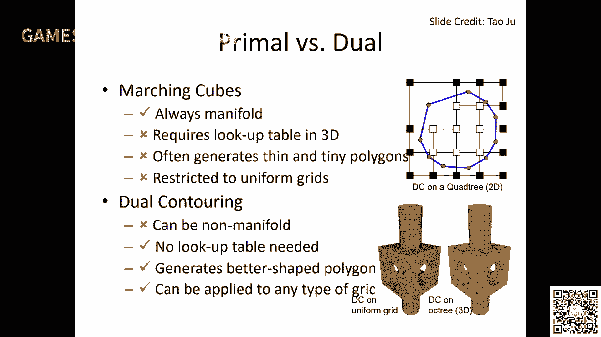

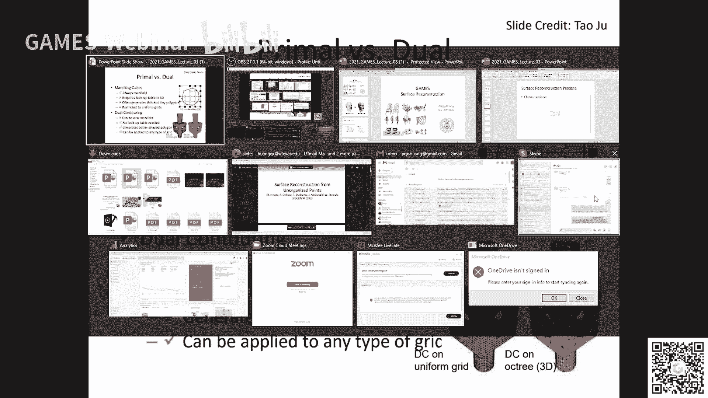