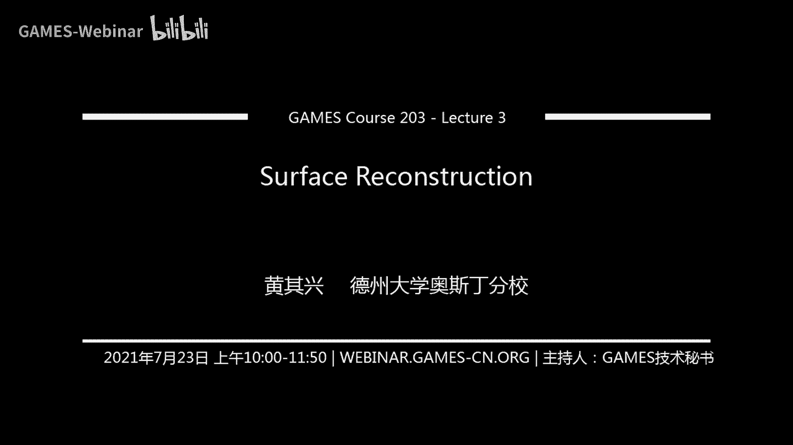

# GAMES203：三维重建和理解 - P3：Lecture 3 曲面重建 🧩

在本节课中，我们将学习三维曲面重建的核心概念与方法。曲面重建旨在从离散的三维点云数据中，恢复出连续、可用的表面模型（如网格）。这是一个基础且尚未完全解决的问题，尤其在深度学习时代，重新审视这些经典方法具有重要价值。

上一节我们介绍了点云配准，得到了一个完整的点云。本节中，我们来看看如何从这个点云出发，重建出连续的曲面模型。

---

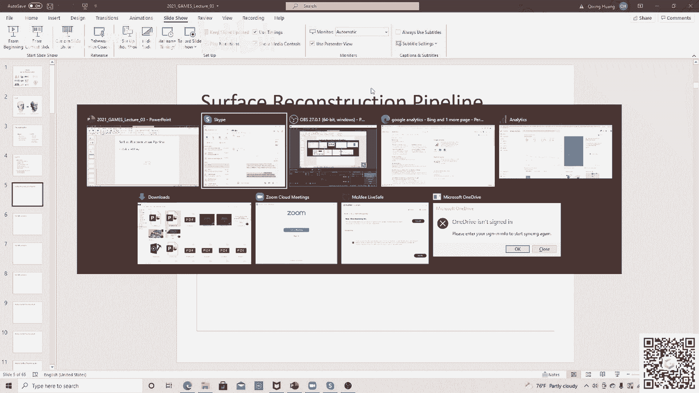

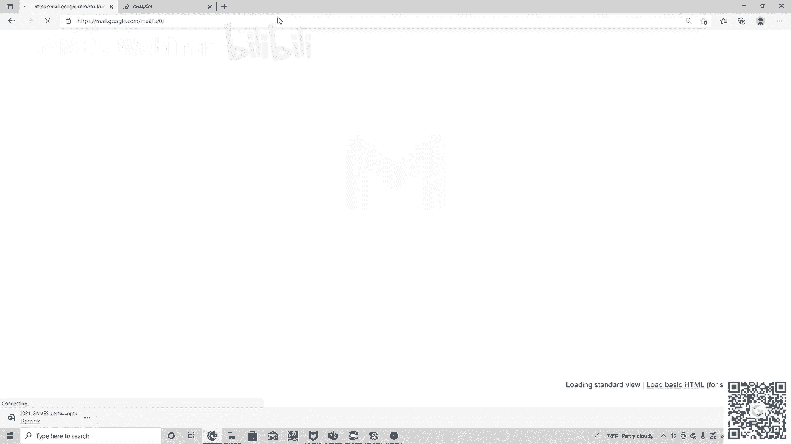

## 概述：曲面重建的两种主要范式

曲面重建方法主要分为两大类：
1.  **显式方法**：直接处理点云，通过连接点或丢弃点来构建表面（如计算几何方法）。理论上完备，但对噪声敏感且计算较慢。
2.  **隐式方法**：主流方法。首先构造一个隐式函数 \( f(x, y, z) \)，其零等值面 \( f(x, y, z) = 0 \) 即为目标曲面，然后再从中提取网格。这种方法更高效，对噪声更鲁棒，但缺乏严格的理论保证。

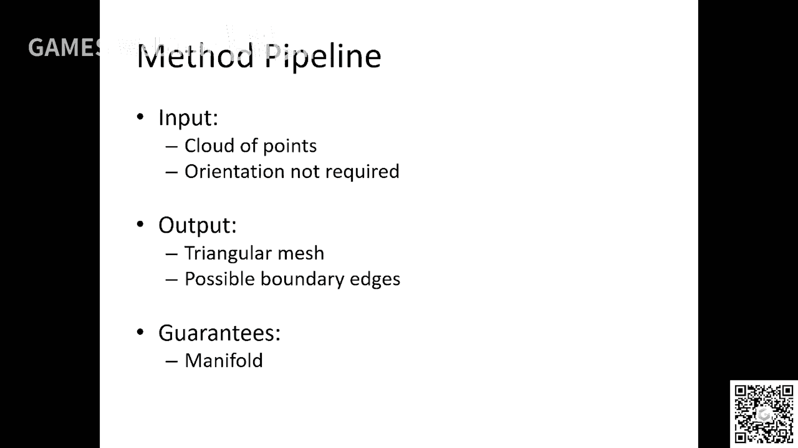

本节课将重点介绍隐式方法的发展脉络和核心思想。

---

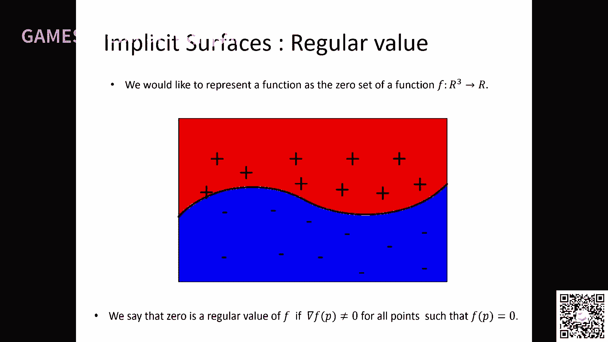

## 隐式曲面重建的开创性工作

一篇极具影响力的开创性工作是《Surface Reconstruction from Unorganized Points》。它建立了一个完整的隐式重建系统框架，后续许多工作都基于此发展。

该方法的输入是无序点云，输出是一个流形网格。其核心思想是重建一个隐式曲面，分为三步：

以下是实现该框架的三个关键步骤：
1.  **局部平面拟合**：对于每个点，利用其邻近点拟合一个局部切平面。这通过求解一个最小二乘优化问题完成，其法向量是点协方差矩阵最小特征值对应的特征向量。
2.  **法向一致性传播**：为每个点的法向确定统一的朝向（里/外）。文章采用了一种启发式方法：构建一个图，边的权重取决于两个点法向的夹角，然后从种子点开始传播法向。
3.  **定义符号距离函数与网格提取**：基于点和其法向，定义空间中的符号距离函数 \( f(p) \)。对于空间中的点 \( q \)，找到点云中最近的点 \( p \)，计算 \( f(q) = (q - p) \cdot n_p \)，其中 \( n_p \) 是点 \( p \) 的法向。最后，使用 **行进立方体算法** 从 \( f(x, y, z) = 0 \) 的等值面提取三角网格。

**行进立方体算法** 是一种经典算法，它枚举体素棱边上符号变化的多种情况，通过查表方式连接出三角面片。其优点是总能产生流形网格，但网格质量（如三角形形状）可能不佳。

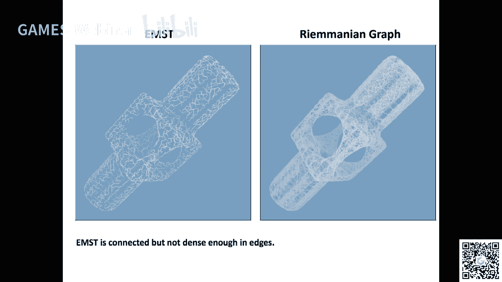

---

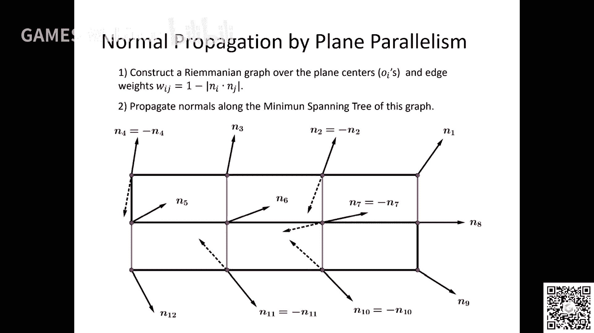

## 改进：引入观测约束

上一节介绍的方法完全忽略了点云的来源信息。接下来我们看一篇改进文章《A Volumetric Method for Building Complex Models from Range Images》。

其核心思想是：在重建时，不应丢弃每个深度扫描视图的相机位姿和可视性约束。例如，一个点不可能出现在相机与观测点之间的连线上（遮挡关系）。

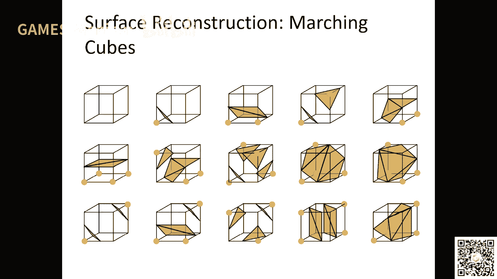

以下是该方法的主要改进点：
*   它通过最小二乘拟合一个隐式函数，而不是简单地寻找最近点计算距离。
*   在拟合时，引入了基于相机视角的可见性约束，这有助于正确填补空洞并避免在遮挡边界产生错误表面。

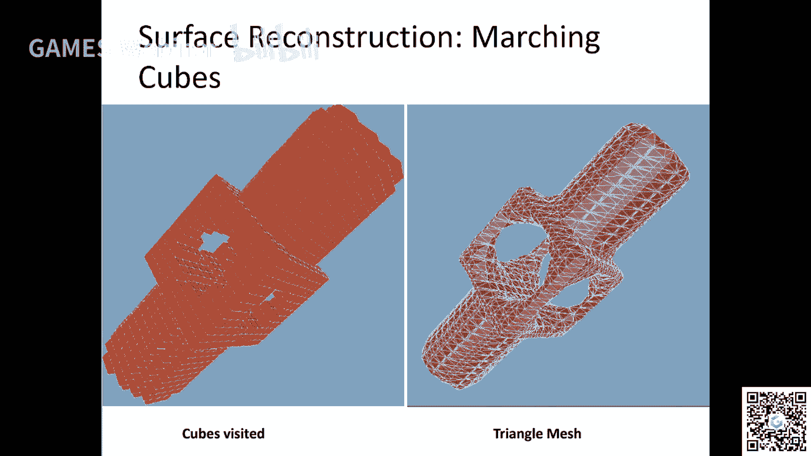

---

## 核心数学工具

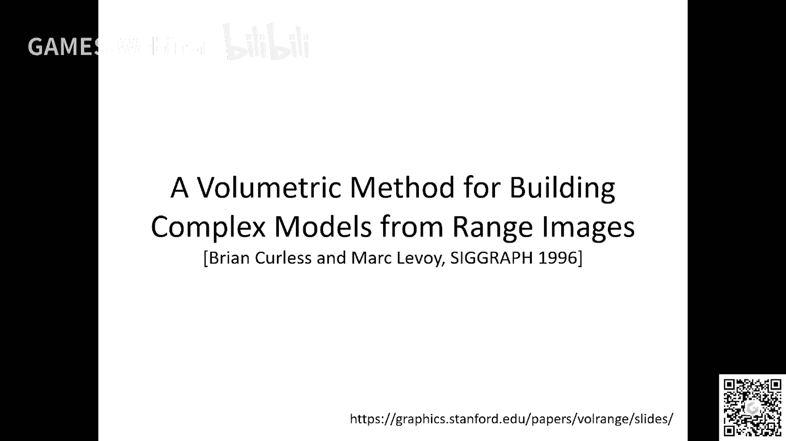

为了构建更鲁棒、高质量的隐式函数，我们需要一些数学工具。上一节我们看到了最小二乘拟合，本节中我们来看看更强大的工具。

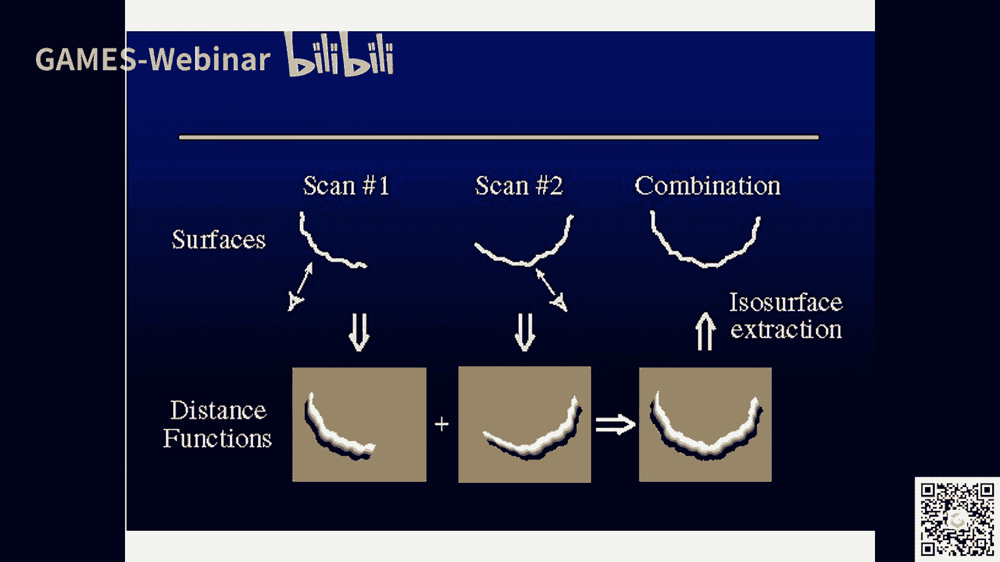

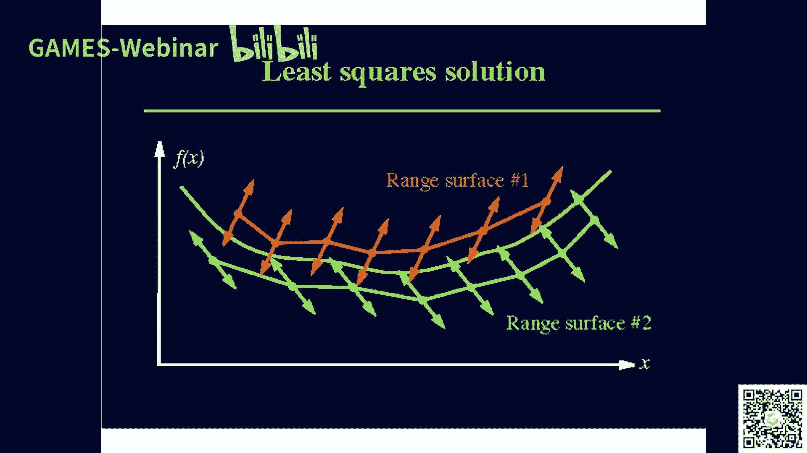

### 径向基函数

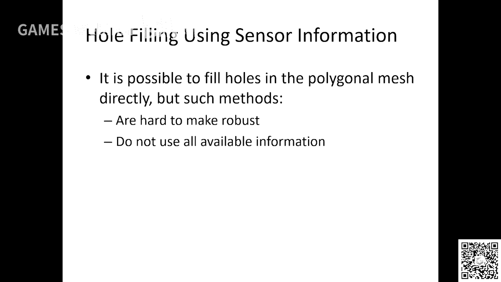

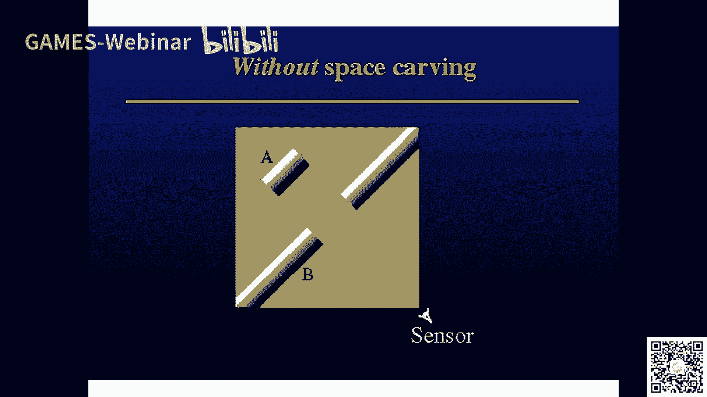

**径向基函数** 提供了一种从离散点插值出连续函数的方法。其形式为：
\[
f(x) = \sum_i w_i \phi(\|x - c_i\|)
\]
其中 \( \phi \) 是径向基函数（如高斯函数 \( e^{-r^2/h^2} \)），\( c_i \) 是中心点，\( w_i \) 是待求权重。通过在所有数据点上建立线性方程组并求解 \( w_i \)，可以得到一个全局光滑的函数。缺点是求解全局系统计算量大。

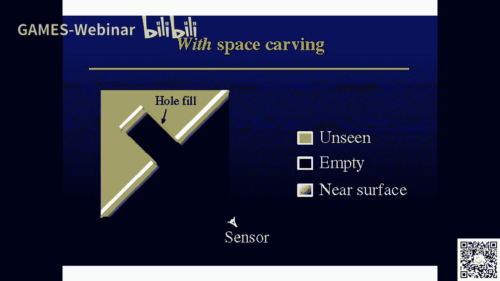

### 单位分解法

**单位分解法** 是一种将局部拟合结果融合成全局光滑函数的强大工具。其核心思想是：
1.  将定义域划分为许多局部区域，这些区域可以重叠。
2.  在每个局部区域上，用一个简单的函数 \( g_i(x) \) 去拟合数据。
3.  定义一组权重函数 \( w_i(x) \)，每个 \( w_i(x) \) 只在第 \( i \) 个区域及其附近非零，且所有区域的权重函数之和处处为 1，即 \( \sum_i w_i(x) = 1 \)。
4.  最终的全局函数是局部函数的加权和：\( f(x) = \sum_i w_i(x) g_i(x) \)。

这种方法结合了局部拟合的灵活性和全局的光滑性。

### 移动最小二乘法

**移动最小二乘法** 是单位分解思想的一个具体实现。对于空间中任意一点 \( x \)，拟合一个局部函数 \( g_x(p) \) 时，数据点 \( p_i \) 的权重取决于它到 \( x \) 的距离。这样，对于每个 \( x \)，我们都能得到一个拟合值 \( f(x) = g_x(x) \)，最终 \( f(x) \) 就是一个定义在整个空间上的光滑函数。

---

## 利用法向约束构建隐式函数

有了上述工具，我们来看如何利用点云和法向信息构建隐式函数。一篇重要文章《Interactive Inspection of Solids》提出了关键思想。

其核心是：不仅要求隐式函数在数据点处为零值，还要求其梯度方向与点的法向一致。这可以构造更合理的约束：
*   对于每个数据点 \( p_i \)，约束 \( f(p_i) = 0 \)。
*   对于每个数据点 \( p_i \) 及其法向 \( n_i \)，在点 \( p_i \) 沿法向稍微内外偏移的位置 \( p_i \pm \epsilon n_i \) 处，约束 \( f(p_i \pm \epsilon n_i) = \pm \epsilon \)。
*   将这些约束代入 RBF 或 MLS 等框架，求解线性方程组，即可得到隐式函数 \( f \)。

---

## 多分辨率与自适应重建

现实物体表面有的地方平坦，有的地方复杂。为了高效表示，需要多分辨率技术。文章《Multi-level Partition of Unity Implicits》提出了自适应隐式重建方法。

以下是该方法的自适应流程：
1.  初始用一个大的包围盒和简单的函数去拟合所有点。
2.  计算拟合误差。如果某个局部区域误差过大，则将该区域细分。
3.  在细分后的子区域上，用更复杂的局部函数重新拟合。
4.  使用单位分解法将所有局部函数光滑地融合起来。
5.  重复步骤 2-4，直到满足误差要求。

这样，在平坦区域用大块和简单函数表示，在复杂区域则自动细分并使用更复杂的函数，实现了细节层次自适应。

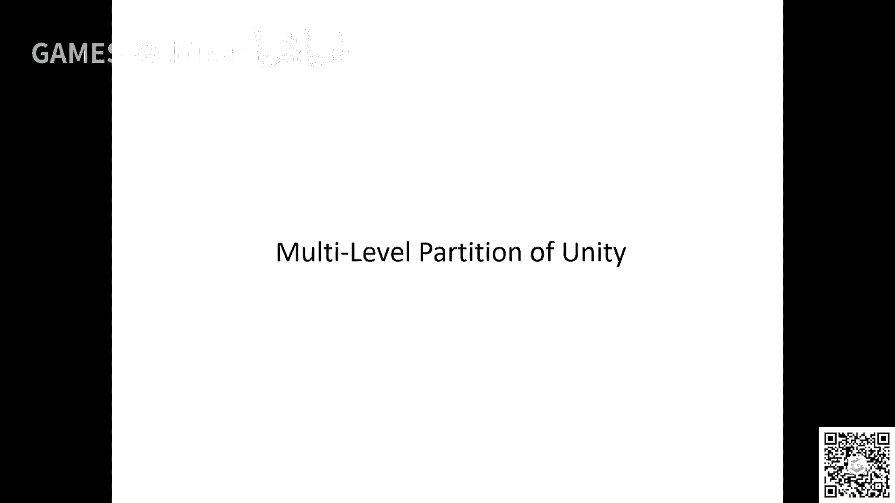

---

## 点投影法

另一类重要的方法是 **点投影法**，其代表是《Point Set Surfaces》。它不显式构造全局隐式函数，而是定义了一个“投影”操作。

对于空间中任意一点 \( q \)，迭代地将其投影到局部拟合的曲面上：
1.  以 \( q \) 的邻域点拟合一个局部平面或二次曲面。
2.  将 \( q \) 移动（投影）到该局部曲面上。
3.  更新 \( q \) 的位置，重复上述步骤直至收敛。

通过这个投影算子，可以将一个稀疏点云“收缩”成一个致密的、代表表面的点云，后续再做网格化。这种方法本质也是基于局部拟合和迭代优化。

---

## 泊松曲面重建

目前实践中非常流行且鲁棒的方法是 **泊松曲面重建**。其核心思想非常巧妙：将重建问题转化为求解泊松方程。

它不直接拟合隐式函数 \( f \) 的值，而是拟合其梯度场 \( \nabla f \)。理想情况下，隐式函数的梯度在表面处应等于该点的法向 \( n \)。因此，我们可以从带有法向的点云中，估计一个向量场 \( V \)，使其在数据点处接近 \( n \)。

然后，寻找一个隐式函数 \( f \)，使得其梯度 \( \nabla f \) 尽可能接近估计的向量场 \( V \)。这等价于最小化 \( \|\nabla f - V\|^2 \)，其最优解满足泊松方程 \( \Delta f = \nabla \cdot V \)。其中 \( \Delta \) 是拉普拉斯算子，\( \nabla \cdot \) 是散度算子。

以下是泊松重建的关键步骤：
1.  建立八叉树空间划分，以适应不同区域的细节密度。
2.  在八叉树节点上定义基函数，将点云法向“涂抹”到节点上，形成向量场 \( V \) 并计算其散度 \( \nabla \cdot V \)。
3.  求解大型稀疏线性系统 \( \Delta f = \nabla \cdot V \)，得到每个节点的隐式函数值 \( f \)。
4.  使用行进立方体算法从 \( f \) 的等值面提取网格。

泊松重建的结果视觉上非常光滑，即使法向有噪声也能工作良好，并且有成熟的库实现。

---

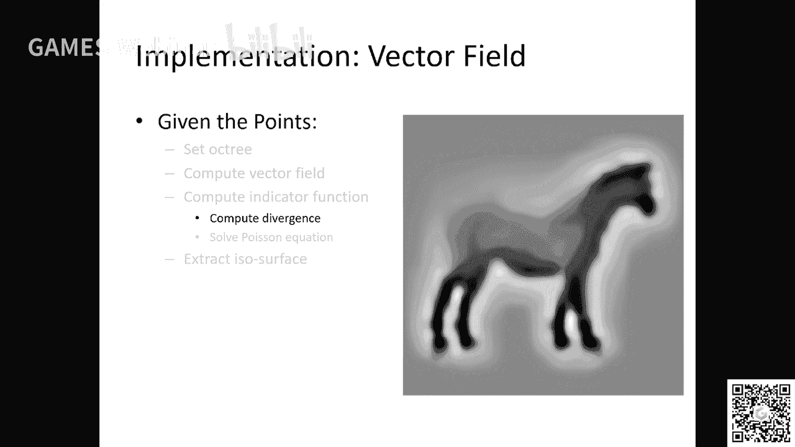

## 对偶轮廓法与网格提取优化

最后，我们简要提一下网格提取的另一种方法：**对偶轮廓法**。行进立方体法将顶点放在体素的棱边上，而对偶轮廓法将顶点放在体素内部。

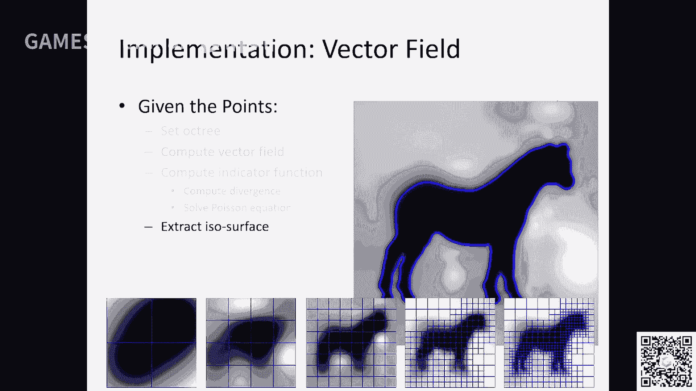

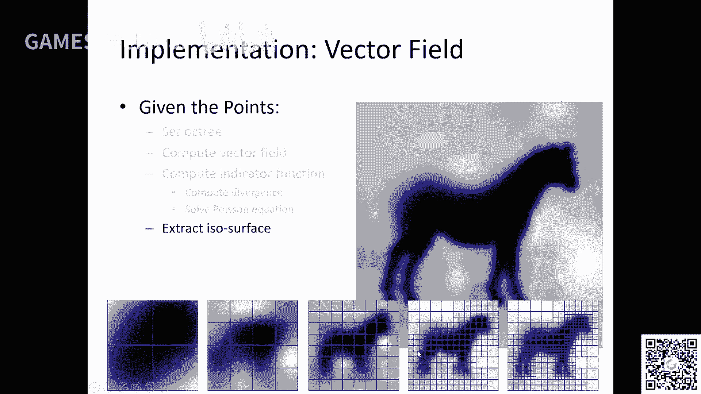

以下是两种方法的简单对比：
*   **行进立方体法**：总能保证输出是流形网格，但三角形质量可能较差，且难以捕捉尖锐特征。
*   **对偶轮廓法**：生成的网格质量更好，顶点位置更灵活（可优化以贴近特征边），但不能保证总是流形。

一种混合思路是：先使用对偶轮廓法生成高质量网格，再检测并修复其中非流形的部分。这体现了在实用中结合不同方法优点的思想。

---

## 总结

本节课我们一起学习了三维曲面重建的经典隐式方法。我们从开创性的框架出发，探讨了如何利用径向基函数、单位分解、移动最小二乘等工具构建隐式函数，并介绍了引入法向约束、多分辨率自适应、点投影以及强大的泊松重建等方法。最后，我们了解了从隐式函数提取网格的不同策略。这些经典思想为理解现代基于深度学习的三维重建工作奠定了坚实的基础。