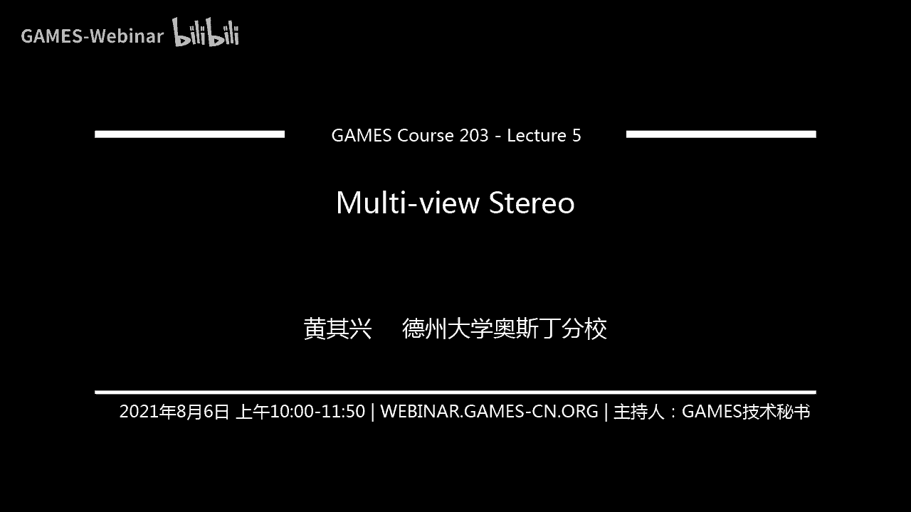

# GAMES203：三维重建和理解 - P5：Lecture 5 多视角立体视觉 👁️

在本节课中，我们将要学习多视角立体视觉。这是三维重建系列课程的最后一讲，我们将探讨如何利用已知的相机姿态和参数，从多张图像中恢复出高质量、稠密的场景三维结构，即估计每个像素的深度值。

## 概述：从稀疏到稠密重建

上一节我们介绍了运动恢复结构，得到了稀疏的点云和相机参数。本节中，我们来看看如何利用这些信息进行稠密重建。

概念上，三维重建分为两步：
1.  从图像中恢复相机姿态和稀疏点云。
2.  基于第一步的结果，进行稠密重建，估计每个像素的深度。

今天我们聚焦于第二步——稠密重建。

## 核心思想：立体匹配与视差

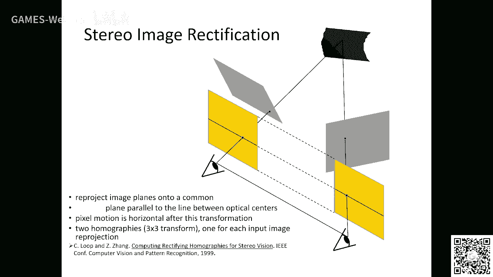

立体视觉的基本原理很简单：如果知道两张图像中像素点的对应关系，就能计算出深度。初中数学知识告诉我们，通过相似三角形关系，视差与深度成反比。

**公式**：`视差 (disparity) = x_left - x_right = (B * f) / Z`
其中，`B` 是基线长度，`f` 是焦距，`Z` 是深度。

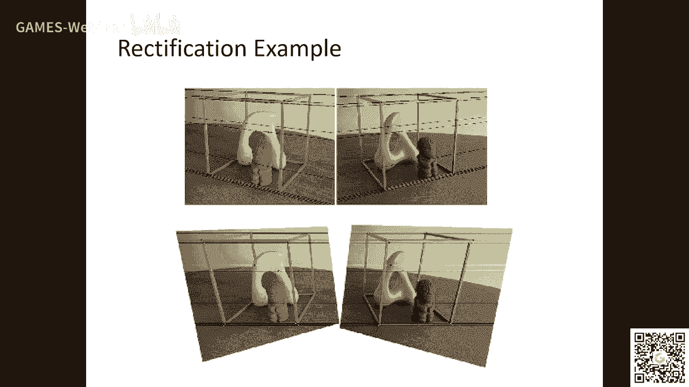

立体匹配与传统图像匹配的关键区别在于**搜索空间**。在立体视觉中，我们是在**极线**上寻找对应点，这大大缩小了搜索范围，是立体算法高效的基础。

## 基础：双视角立体匹配

首先，我们讲解如何利用两张图像进行立体匹配。

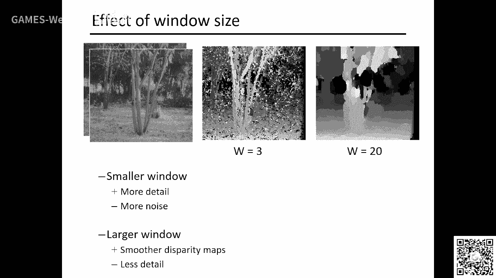

### 问题定义与假设

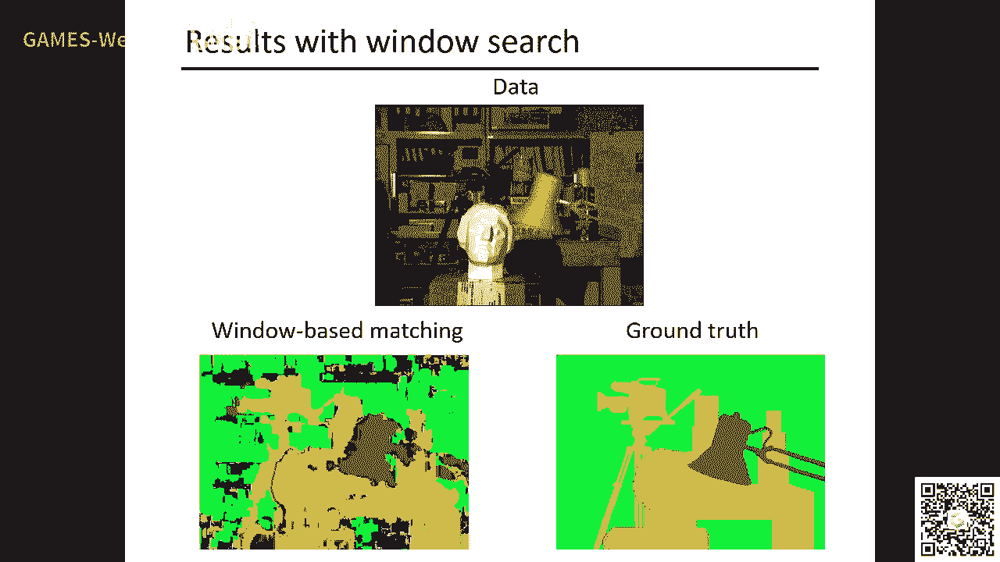

给定两张拍摄同一静态场景的图像，已知它们之间的相对位姿变换，目标是得到第一张视角下的深度图。

需要注意，我们无法恢复绝对的深度尺度，但只要能找到对应点，就能得到相对的深度关系。

### 基础匹配算法

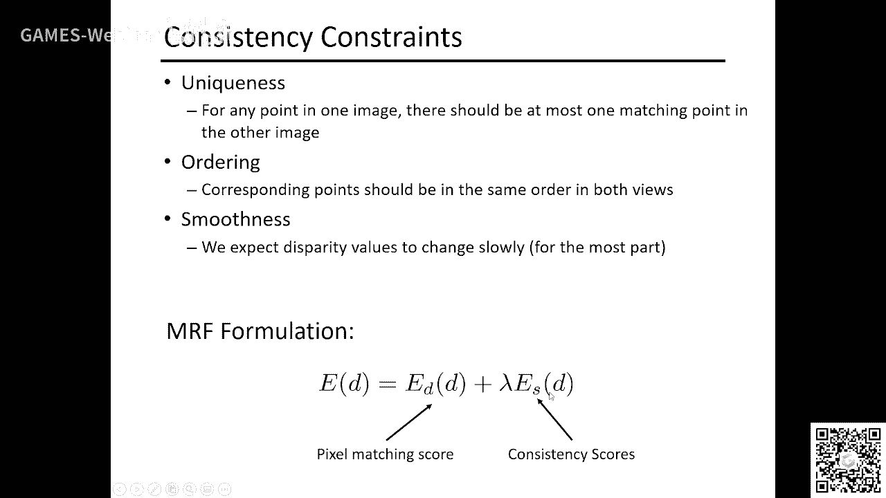

以下是基本的立体匹配算法流程：

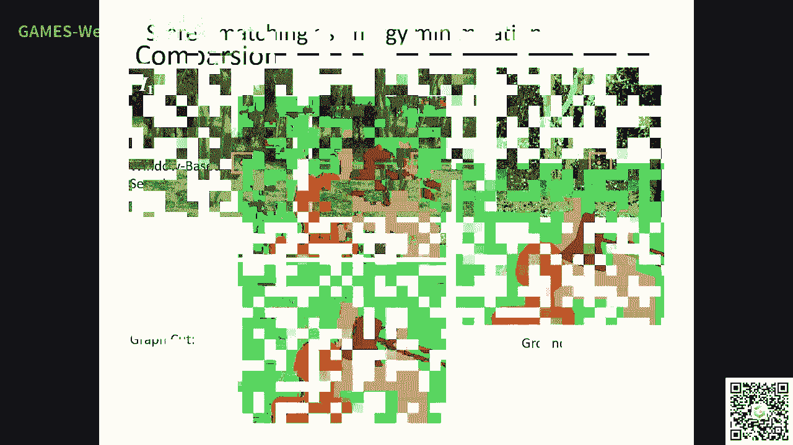

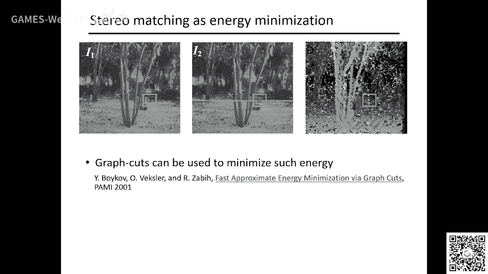

1.  **极线校正**：首先，通过算法将两张图像变换，使得对应点位于同一水平扫描线上。这简化了搜索过程。这个变换是一个3x3的单应性矩阵。
2.  **逐像素匹配**：对于左图的每个像素，在右图的对应极线（水平线）上搜索最相似的像素。
3.  **相似度计算**：通常取一个矩形图像块进行比较。相似度度量可以是像素差平方和、归一化互相关等。
4.  **选择最佳匹配**：选择相似度最高（或代价最低）的点作为对应点。
5.  **计算深度**：根据对应点的水平坐标差（视差）和相机参数，利用上述公式计算深度。

### 窗口大小的影响

在匹配时，窗口大小的选择是一个关键的超参数：
*   **小窗口**：包含局部信息，匹配结果噪声大，但边缘相对清晰。
*   **大窗口**：包含更多信息，匹配结果更平滑，噪声小，但可能模糊细节。

基础窗口匹配算法的结果通常比较有限，与真实值存在差距。

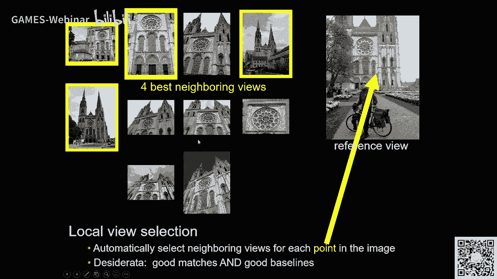

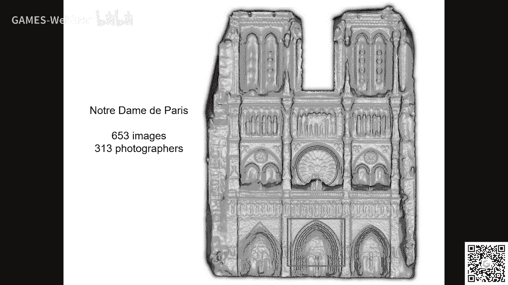

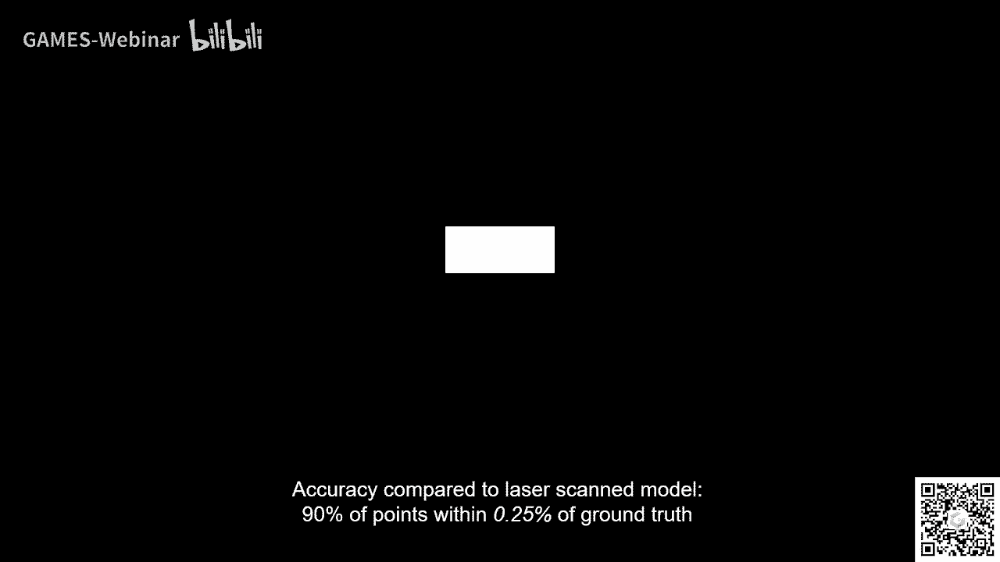

## 进阶：引入全局优化与约束

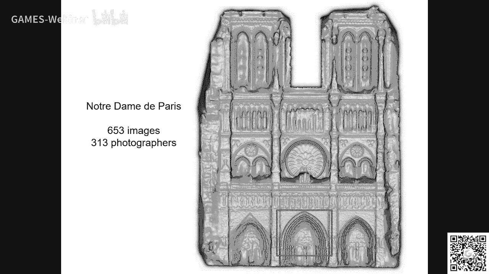

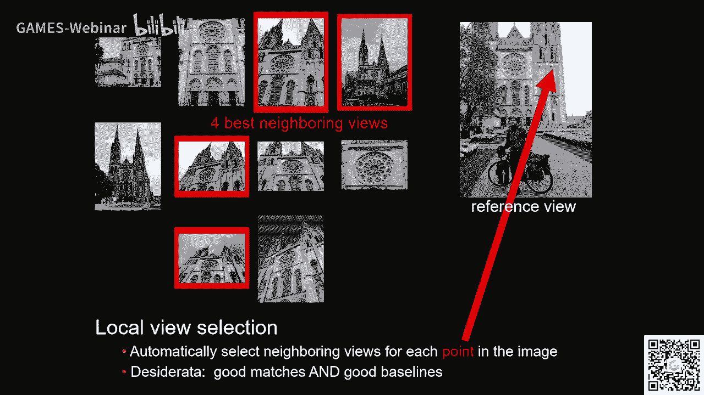

为了解决基础算法的噪声问题，我们可以为深度图引入一些合理的先验约束，并通过全局优化来求解。

### 常用的约束条件

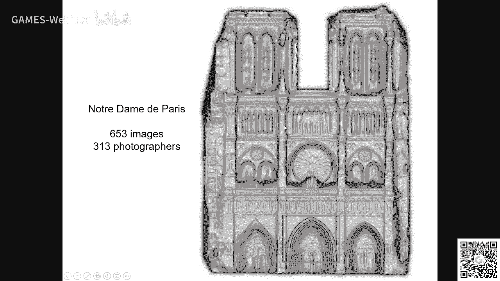

1.  **唯一性约束**：左图的一个点最多匹配右图的一个点。
2.  **顺序约束**：匹配点之间的左右顺序在大多数情况下应保持一致。
3.  **平滑性约束**：深度值在大部分区域应缓慢变化，除非在物体边界处。

### 马尔可夫随机场建模

我们可以将立体匹配问题建模为一个马尔可夫随机场的能量最小化问题。

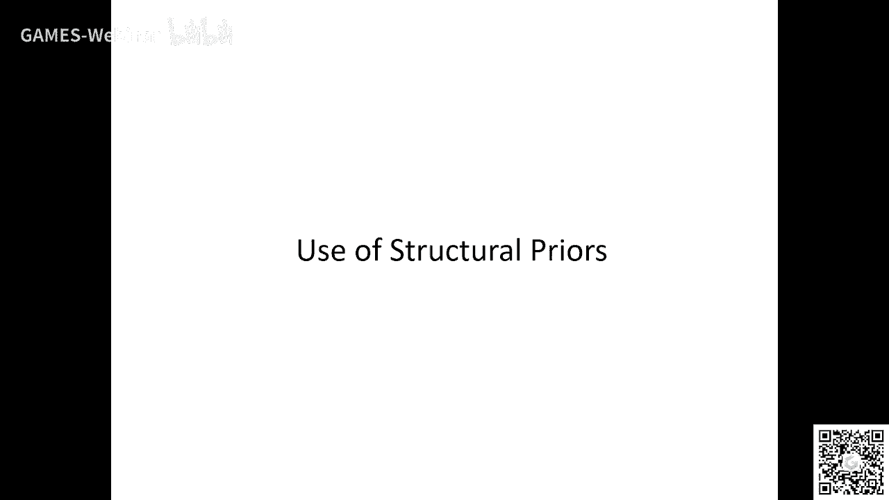

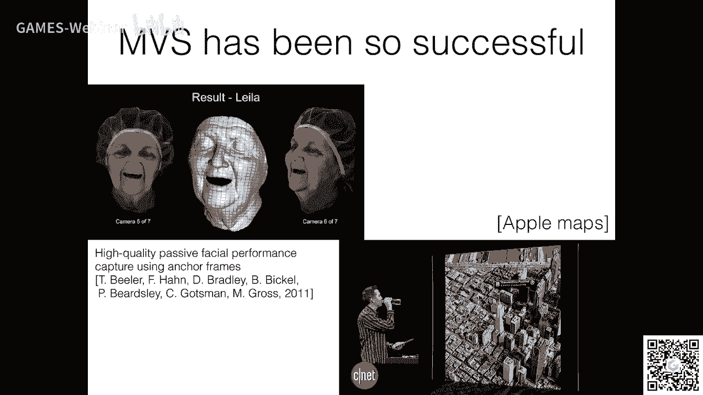

**能量函数公式**：
`E(D) = Σ E_data(p, Dp) + λ * Σ E_smooth(p, q, Dp, Dq)`
*   `E_data`：数据项，衡量像素`p`取深度`Dp`时的匹配代价（即窗口相似度的负值）。
*   `E_smooth`：平滑项，鼓励相邻像素`p`和`q`的深度`Dp`和`Dq`相似。
*   `λ`：平衡两项的权重系数。

通过优化这个能量函数（例如使用图割或置信传播算法），可以得到比基础窗口匹配更平滑、更准确的结果。

## 扩展：多视角立体视觉

双视角立体利用了极线约束。多视角立体核心思想类似，但能利用更多图像的信息，通常更鲁棒。

### 核心流程

1.  **选择参考图像**：选定一张需要计算深度的图像作为参考视图。
2.  **选择邻域视图**：从所有图像中，选取与参考视图有足够重叠且视角合适的图像。
3.  **深度假设检验**：对于参考图像的每个像素，假设一系列可能的深度值。
    *   对于每个假设深度，将该像素反向投影到三维空间，再投影到其他邻域视图上，得到一组对应的像素点。
    *   计算这些对应像素块与参考像素块的相似度（如光度一致性）。
4.  **选择最佳深度**：对于该像素，选择能使多视图光度一致性代价最小的深度假设作为其深度值。

这种方法本质上是将“在一条线上找对应点”扩展为“为每个深度假设检验其在所有视图中的一致性”。

## 利用场景结构先验

在纹理缺失或重复的区域，基于光度一致性的方法会失效。许多场景（尤其是室内和城市）具有明显的平面结构，我们可以利用这一先验来改进重建。

### 平面模型集成

思路是假设场景可以由少量平面来近似表示，而不是为每个像素独立估计深度。

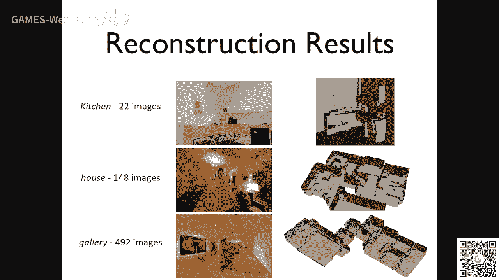

**方法一：三元组平滑项**
在MRF能量函数中，不仅考虑相邻像素对的平滑约束，还考虑三个共线像素。如果它们位于同一平面，则中间点的深度应近似等于两端点深度的平均值。通过加入这种高阶约束，可以促使结果呈现分段平面的特性。

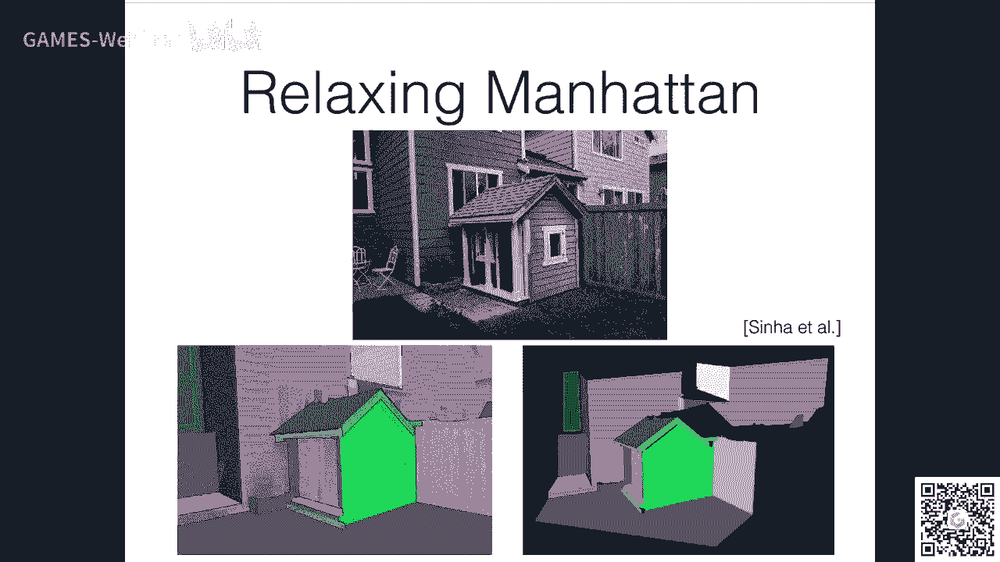

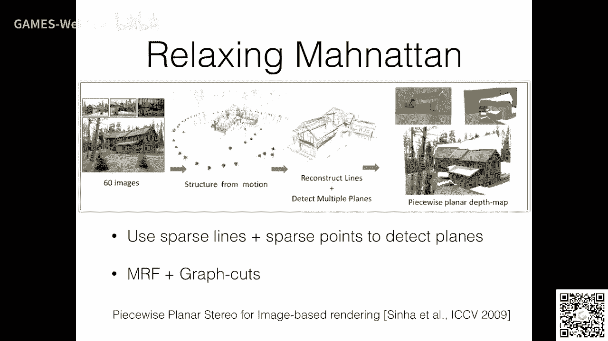

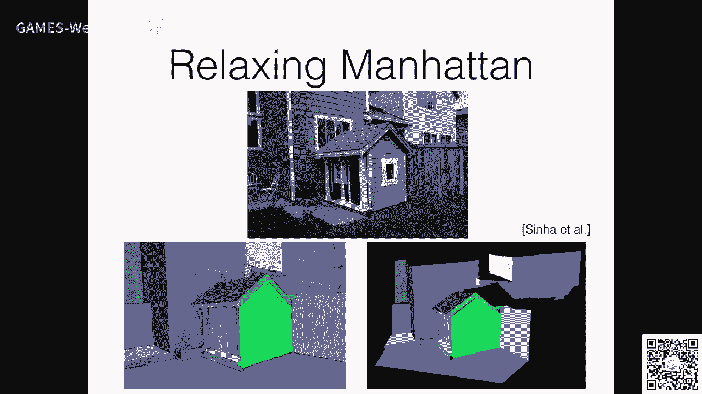

**方法二：平面标签优化**
1.  提取场景中可能的主导平面方向（如曼哈顿世界假设下的三个垂直方向）。
2.  为每个像素分配一个平面标签（属于哪个平面），每个平面由其法向和偏移定义。
3.  构建能量函数，包含：
    *   **数据项**：像素被赋予某个平面标签后，根据该平面计算出的深度，在所有视图中的光度一致性代价。
    *   **平滑项**：相邻像素倾向于属于同一平面。
    *   **非局部约束**：不同平面之间可能存在的几何关系（如垂直、平行）。
4.  优化求解每个像素的平面标签，进而得到稠密深度图。

这种方法通过让大量像素共同“投票”决定一个平面的好坏，比基于像素的局部决策更为鲁棒，特别适用于结构化场景。

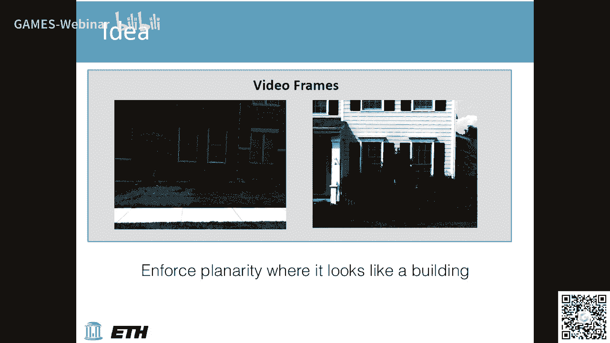

## 大规模场景处理

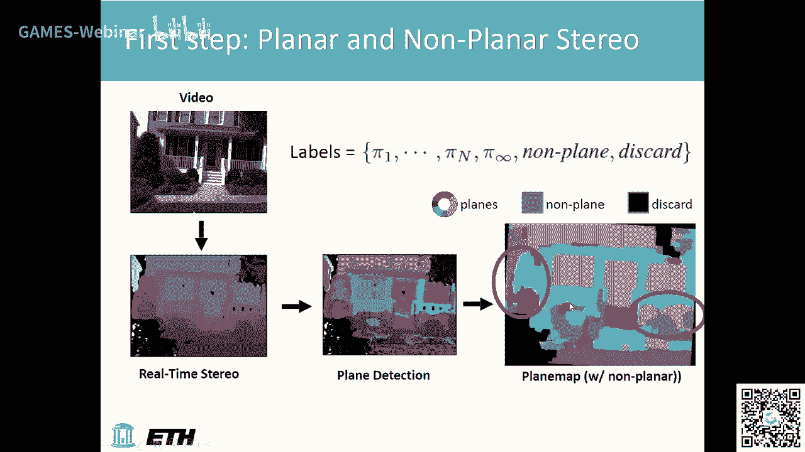

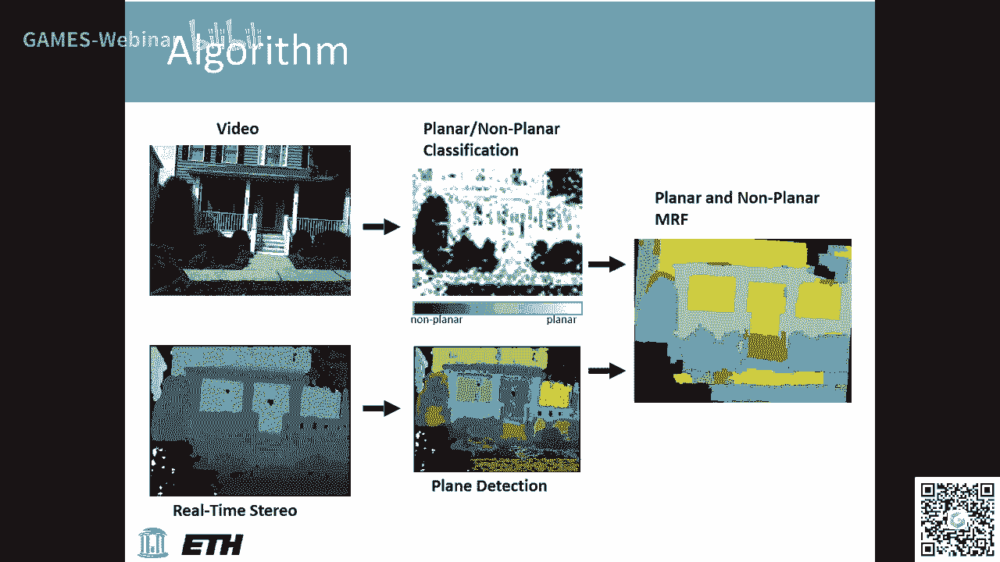

对于互联网照片集等大规模场景，直接进行全局的多视角立体计算非常耗时。常用的策略是**分而治之**：
1.  **图像聚类**：将大量图像根据可视内容的重叠程度和相机位置聚合成多个较小的集合。
2.  **子集重建**：在每个图像子集内独立进行运动恢复结构和稠密重建。
3.  **全局融合**：将各个子集的重建结果统一到全局坐标系下，并进行融合和优化，得到完整的大规模场景模型。

## 总结

本节课我们一起学习了从双视角到多视角的稠密立体视觉方法。

我们首先回顾了立体视觉的核心是利用极线约束在降维空间中进行匹配。然后，从基础的窗口匹配算法出发，针对其噪声大的问题，引入了基于马尔可夫随机场的全局优化方法，通过加入平滑性等约束来获得更好的结果。

接着，我们将双视角扩展到了多视角，通过检验深度假设在多视图下的光度一致性来利用更多信息。最后，针对纹理缺失的挑战，我们探讨了如何利用场景的结构化先验（特别是平面结构）来约束和改善重建结果，并简要介绍了处理大规模场景的分治策略。

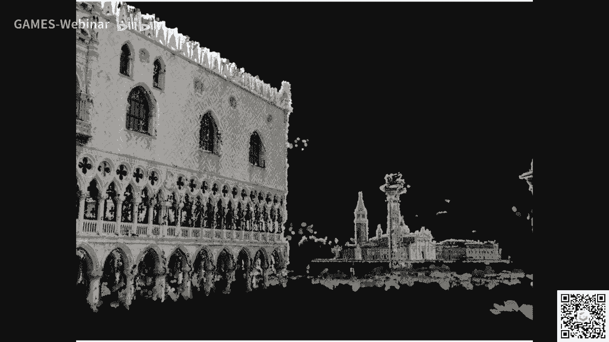

理解这些经典算法的核心思想，对于掌握三维重建的基础和探索基于深度学习的新方法都至关重要。