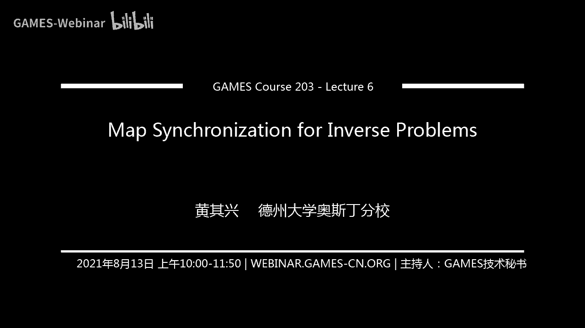
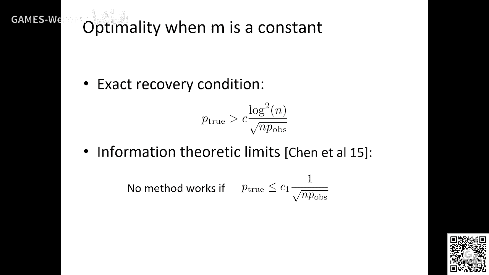
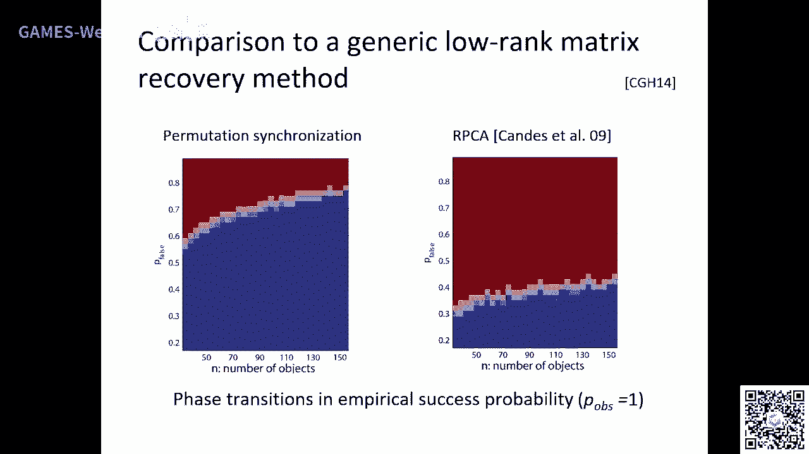
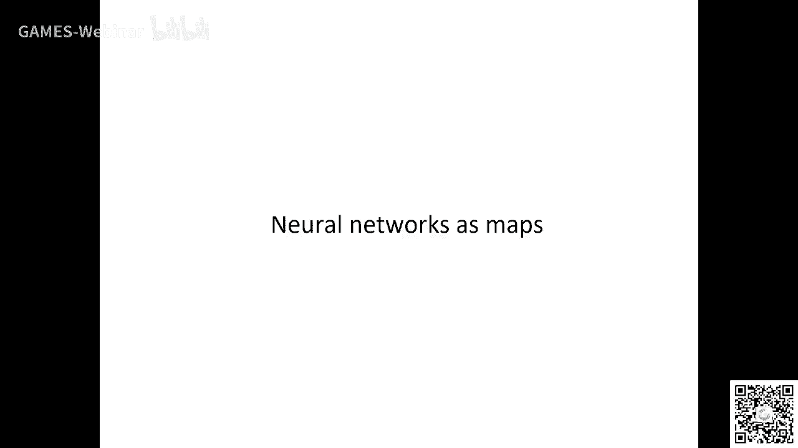
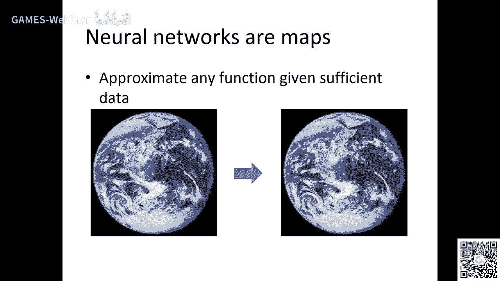
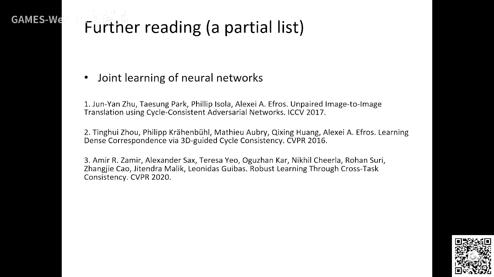

# GAMES203： 三维重建和理解 - P6：Lecture 6 Map Synchronization for Inverse Problems - GAMES-Webinar - BV1pw411d7aS

好吧。

我从头开始讲好吧，没有问题吧，啊，我今天讲的我今天我刚开始说，我就是今天讲这个topic呢，相对来说，这个名词大家可能没听说过，哎，像现在这个名词可能没听说过好吧，但是这个很重要啊，很重要，哎。

很重要好吧，就是他首先要解决一个什么问题呢，就是我们其实在前面两天课里面已经遇到过了，对吧，就是你给定一个比如说一个image connection，对吧。

我们要build这个就是consistent map嘛，对吧，input呢，就是两两去做matching，对吧，这两个image我们讲了这个算法，对吧，但是两个image，你有些是错的嘛，对吧。

那我们的想法想问的问题就是说，你怎么在多个物体中间对吧，在build这种consistent的东西对吧，这个topic我一直在研究啊，但是我觉得大家往往其实好多时候怎么说呢，这不重不重视这个问题啊。

不重视对吧，哎，他其实这个问题里面还是很很interesting，比如说他他比如说application对吧，就是说比如说我们前面讲的multi-scan matching。

multi-view structural motion，比如说你solving这个puzzle，比如说一个一个一个茶壶对吧，一个打碎了，你怎么拼在一起对吧，哎，解决这个问题对吧，但没会讲一些别的东西。

比如说那个，new network，对很interesting，这个课呢，呃，这节课呢会比较technical啊，你们在网上download那个slides下下载那个slides，其实你可以看到他。

他会非常的这个呃technical啊，没关系啊，就是适合适合你们对吧，就是如果你觉得自己一点技术都没有啊，那我希望前面这些multi-vision的东西你能听懂对吧。

以及一些简单的formulation对吧，如果你数学技术比较好，那我希望希望你能听懂一些跟优化相关的东西对吧，哎，如果你觉得这这这看对吧，如果你也对这理论比较感兴趣对吧，那我希望您听懂更多的东西啊。

大概是这样一个expectation对吧，这样一个期望，好，那我首先讲一些比较interesting的例子好吧，就是说，这singularization简单的就是说你要把所有的东西合在一起去弄对吧。

你要把所有的东西合在一起，那为什么要这样对吧，这个东西，所以在这个飞的飞飞飞飞在那个对吧，对吧，那其实呢，我们想说的呢，他实际上就是有些就是说，就说就说你做这个matching的时候啊。

他是有很多ambiguity对吧，我们就像讲两个images，就能match对吧，我们的我们一个假设就是这两个东西应该被match到对吧，但是好多时候呢，你会出现什么呢，就这两个images。

比如说你map一个白的images跟一个白的images，没有东西可以match嘛，对吧，没有东西可以match嘛，你比如说这两个piece对吧，你去做matching的时候，实际上，哎。

他你就会发现他没有东西可以去做matching，没有什么东西可以去做matching，哎，他没有feature对吧，哎，你有很多种可能对不对，你不知道，哪种是好的对吧，那这个时候我们怎么弄呢。

你们我想要同学们回答一下，你们你们会怎么弄，别看slice，slice上面有解答，啊，这个应该怎么弄，你们能不能type一下怎么解决这个问题，对吧，哎，这个东西很重要啊，这个例子很重要。

你怎么怎么解决这个问题啊，你们有谁有想法吗，对，这有很多种可能对吧，你们能哪哪哪哪一种是是是可能的match的，我看cc的现在还没有吧，这个是我们需要consistency，但问题是现在还没来吗。

你你就我不要consistency的回答吗，我就说你们平时如果比如说你到一个考古队去对吧，哎，你可以遇到这样，这是个真实的例子，这是大概是一个希腊那个地方一个地化，大概有几千个碎片啊。

不同学挑两个问你们这个问题对吧，那这个时候你们会怎么办，如果这两个碎片，你你知道他可能拼在一起，但你又不知道怎么拼对吧，怎么办，这个时候，绕圈旋转去是问题是你再怎么试的话，他没有选，你不知道他是不是啊。

是不是match的，对吧，好，我给我给大家答案啊，这个东西你对这个时候一般情况你会找别的piece对吧，比如说这儿这儿有另外一个piece，哦，你知道对吧，这个地方有一个那个，那个那个text对吧。

这两个text应该是match，你把这两个match在以后，你发现这个p就能跟他们match上，对吧，哎，对吧，也就是说你做这个matching的时候啊。

你不能只看两个images的information，但不能只看两个scan的information，有时候你还会有一个别的scan，对吧，他能提供一些辅助，对吧，就是说你这个matching要一起来搞。

对吧，哎，我希望大家理解这个东西，好吧，就是你你你做两个scan，你做matching，你写个software，他可能没有足够多的feature，对啊，没有足够多的feature去match，对吧，哎。

这个这个是很，很那个的对吧，然后，哎，好，我再给你们一个例子好吧，这个例子就跟算法有些关系，比如，你现在你现在有两个物体，对吧，我举三三个模型，因为这是graphics的课嘛，对吧。

其实你做vision这个这个例子对做vision也存在，对吧，嗯，我给你两个model，然后然后你上网去下载一个software，对吧，然后这个software呢，你可以输入两个object。

然后你press一个button，然后就会给你一些correspondence，对吧，对不对，那如果在这个时候出来的这个东西，他有一些correspondence是对的。

有些correspondence错了，怎么办，一般情况下你们会怎么做啊，一般情况下你们去啊，我是不是调料餐，对吧，对不对，你包括你自己写了一个software，也会调餐嘛，对吧，对吧。

neonetwork的这个deep learning这个阶段就是调那个网络架构，对不对，对吧，但是问题是你调餐，你需要理解这个paper不然去瞎调对吧，但问题是有时候很多时候你这个paper你都看不懂。

或者就是很难看，那，我可以告诉你有一种更好的办法，你怎么做呢，你就比如说你找一个intermediate object，你们现在是大数据时代，对吧，你可以找到很多电脑，我们就说他就是他，他相对来说。

他跟这个p个的那个号呢，他他这个shape的difference都没那么大，对吧，哎，这个时候呢，你根本不需要调餐，你就用什么，你就用相同的software，对吧，你就漏了两次两个pair。

press the button，因为这个问题就变简单了吧，就是每一个你解解两步，每一步变简单了，所以那个software的话就给你good correspondence，对吧，他这个时候怎么办，哎。

这个时候你就把它怎么把这两个compose在一起，对吧，就得到一个更好的东西，你看对吧，就是这个东西很neat，对吧，就是说你也不需要调餐，对吧，你甚至不需要这个知道这个software干了什么，对吧。

你只需要去找data，对哎，我希望大家记住这样的例子啊，这样的例子，我觉得好，这这很容易理解，我觉得你不需要任何基础，你也能理解，对吧，是吧，好，那现在呢，我们就是想要把这个principle的例子。

把它变成一个算法，对吧，你不能说人物，你不用上网的时候，你给这个两个，你都能为去找找intermediate object，有时候是你有些少两个吗，对吧，一个可能还不够，对吧，哎。

我们需要变一个算法去想一想，对吧，就说，那真的我现在就是想了，就是说比如说你可以想，比如说你假设你愿你希望去map两个object对吧，然后呢，你有一堆一个一个collection of object。

但但比如说你说我们做重建的时候，这次自然就有这个东西对吧，好，然后呢，你有一，然后呢，你能build your graph，graph就是他的这个景点啊。

是individual object edge呢，就是说这两个object之间有个map，对吧，对吧，哎，然后就是说但你这个map呢，你如果用一个software对吧，你到下载一个software。

他有些人好有些是好的，有些是坏的，对吧，啊，但是我想说的是什么，他就说，如果你能把坏的去掉了，剩下这个好的呢，已经足够了，对吧，他还是一个就是说，小你connected graph对吧，就是说。

如果这个三水不成，让你就淹死了更多的水对吧，直到他知道他这个这个三是满足对吧，直到这个三是满足对吧，哎，好，那你那那那那那如果是这个情况的话，那我们我们要做的是什么，我们就说呃，那个其次还有个问题。

就是说我给你一堆小的，然后你在网络上当了一个双倍对吧，然后你就press一个button对吧，然后，呃，比拼我陪了一起陪着，那你就得到一个怪，但是这个怪物里面有的是错的有不好的对吧，但我问你。

你能不能把错的给扔掉，把好的留下来，如果你能干这一步对吧，那实际上就是说你就得到了all pay，注意这一步我要讲清楚，第一就是说你从一个算法的角度来说，你算了一个man。

你是没法check他是不是好的对吧，他可能有些是错的，correspondent，对不对，有些correspondent是错的，你没法很好地去check嘛，对不对，你没法去evaluate。

因为你不知道光去是吗，对吧，啊，哎好吧，大家想想这个问题啊，我想问你们就是说这个问题，当然你需要一些additional information，对吧。

那但additional information是什么呢，大家可以简单的想想，给你们一分钟时间啊，嗯，嗯，我们下个节目再见，下个节目再见，下个节目再见，下个节目再见，下个节目再见，下个节目再见。

下个节目再见，下个节目再见，下个节目再见，请问是否能够看到并海上地铁站的位置，我们大多数人都在电脑上看着。在你和我之间的观察，我得知了地铁站在哪里，它在哪个区域。这是一个非常重要的问题。

你们必须尽量了解。请问能不能看到地铁站的位置，我们大多数人都在电脑上看着。请问能不能看到地铁站的位置，我们大多数人都在电脑上看着。请问能不能看到地铁站的位置，我们大多数人都在电脑上看着。

请问能不能看到地铁站的位置，我们大多数人都在电脑上看着。请问能不能看到地铁站的位置，我们大多数人都在电脑上看着。请问能不能看到地铁站的位置，我们大多数人都在电脑上看着。请问能不能看到地铁站的位置。

我们大多数人都在电脑上看着。请问能不能看到地铁站的位置，我们大多数人都在电脑上看着。请问能不能看到地铁站的位置，我们大多数人都在电脑上看着。请问能不能看到地铁站的位置，我们大多数人都在电脑上看着。

请问能不能看到地铁站的位置，我们大多数人都在电脑上看着。请问能不能看到地铁站的位置，我们大多数人都在电脑上看着。请问能不能看到地铁站的位置，我们大多数人都在电脑上看着。请问能不能看到地铁站的位置。

我们大多数人都在电脑上看着。请问能不能看到地铁站的位置，我们大多数人都在电脑上看着。请问能不能看到地铁站的位置，我们大多数人都在电脑上看着。请问能不能看到地铁站的位置，我们大多数人都在电脑上看着。

请问能不能看到地铁站的位置，我们大多数人都在电脑上看着。请问能不能看到地铁站的位置，我们大多数人都在电脑上看着。请问能不能看到地铁站的位置，我们大多数人都在电脑上看着。请问能不能看到地铁站的位置。

我们大多数人都在电脑上看着。请问能不能看到地铁站的位置，我们大多数人都在电脑上看着。请问能不能看到地铁站的位置，我们大多数人都在电脑上看着。请问能不能看到地铁站的位置，我们大多数人都在电脑上看着。

请问能不能看到地铁站的位置，我们大多数人都在电脑上看着。请问能不能看到地铁站的位置，我们大多数人都在电脑上看着。请问能不能看到地铁站的位置，我们大多数人都在电脑上看着。请问能不能看到地铁站的位置。

我们大多数人都在电脑上看着。请问能不能看到地铁站的位置，我们大多数人都在电脑上看着。请问能不能看到地铁站的位置，我们大多数人都在电脑上看着。请问能不能看到地铁站的位置，我们大多数人都在电脑上看着。

请问能不能看到地铁站的位置，我们大多数人都在电脑上看着。请问能不能看到地铁站的位置，我们大多数人都在电脑上看着。请问能不能看到地铁站的位置，我们大多数人都在电脑上看着。请问能不能看到地铁站的位置。

我们大多数人都在电脑上看着。请问能不能看到地铁站的位置，我们大多数人都在电脑上看着。请问能不能看到地铁站的位置，我们大多数人都在电脑上看着。请问能不能看到地铁站的位置，我们大多数人都在电脑上看着。

请问能不能看到地铁站的位置，我们大多数人都在电脑上看着。请问能不能看到地铁站的位置，我们大多数人都在电脑上看着。请问能不能看到地铁站的位置，我们大多数人都在电脑上看着。请问能不能看到地铁站的位置。

我们大多数人都在电脑上看着。请问能不能看到地铁站的位置，我们大多数人都在电脑上看着。请问能不能看到地铁站的位置，我们大多数人都在电脑上看着。请问能不能看到地铁站的位置，我们大多数人都在电脑上看着。

请问能不能看到地铁站的位置，我们大多数人都在电脑上看着。请问能不能看到地铁站的位置，我们大多数人都在电脑上看着。请问能不能看到地铁站的位置，我们大多数人都在电脑上看着。请问能不能看到地铁站的位置。

我们大多数人都在电脑上看着。请问能不能看到地铁站的位置，我们大多数人都在电脑上看着。请问能不能看到地铁站的位置，我们大多数人都在电脑上看着。请问能不能看到地铁站的位置，我们大多数人都在电脑上看着。

请问能不能看到地铁站的位置，我们大多数人都在电脑上看着。请问能不能看到地铁站的位置，我们大多数人都在电脑上看着。请问能不能看到地铁站的位置，我们大多数人都在电脑上看着。请问能不能看到地铁站的位置。

我们大多数人都在电脑上看着。请问能不能看到地铁站的位置，我们大多数人都在电脑上看着。请问能不能看到地铁站的位置，我们大多数人都在电脑上看着。请问能不能看到地铁站的位置，我们大多数人都在电脑上看着。

请问能不能看到地铁站的位置，我们大多数人都在电脑上看着。请问能不能看到地铁站的位置，我们大多数人都在电脑上看着。请问能不能看到地铁站的位置，我们大多数人都在电脑上看着。请问能不能看到地铁站的位置。

我们大多数人都在电脑上看着。请问能不能看到地铁站的位置，我们大多数人都在电脑上看着。请问能不能看到地铁站的位置，我们大多数人都在电脑上看着。请问能不能看到地铁站的位置，我们大多数人都在电脑上看着。

请问能不能看到地铁站的位置，我们大多数人都在电脑上看着。请问能不能看到地铁站的位置，我们大多数人都在电脑上看着。请问能不能看到地铁站的位置，我们大多数人都在电脑上看着。请问能不能看到地铁站的位置。

我们大多数人都在电脑上看着。请问能不能看到地铁站的位置，我们大多数人都在电脑上看着。请问能不能看到地铁站的位置，我们大多数人都在电脑上看着。请问能不能看到地铁站的位置，我们大多数人都在电脑上看着。

请问能不能看到地铁站的位置，我们大多数人都在电脑上看着。请问能不能看到地铁站的位置，我们大多数人都在电脑上看着。请问能不能看到地铁站的位置，我们大多数人都在电脑上看着。请问能不能看到地铁站的位置。

我们大多数人都在电脑上看着。请问能不能看到地铁站的位置，我们大多数人都在电脑上看着。请问能不能看到地铁站的位置，我们大多数人都在电脑上看着。请问能不能看到地铁站的位置，我们大多数人都在电脑上看着。

请问能不能看到地铁站的位置，我们大多数人都在电脑上看着。请问能不能看到地铁站的位置，我们大多数人都在电脑上看着。请问能不能看到地铁站的位置，我们大多数人都在电脑上看着。请问能不能看到地铁站的位置。

我们大多数人都在电脑上看着。请问能不能看到地铁站的位置，我们大多数人都在电脑上看着。请问能不能看到地铁站的位置，我们大多数人都在电脑上看着。请问能不能看到地铁站的位置，我们大多数人都在电脑上看着。

请问能不能看到地铁站的位置，我们大多数人都在电脑上看着。请问能不能看到地铁站的位置，我们大多数人都在电脑上看着。请问能不能看到地铁站的位置，我们大多数人都在电脑上看着。请问能不能看到地铁站的位置。

我们大多数人都在电脑上看着。请问能不能看到地铁站的位置，我们大多数人都在电脑上看着。请问能不能看到地铁站的位置，我们大多数人都在电脑上看着。请问能不能看到地铁站的位置，我们大多数人都在电脑上看着。

请问能不能看到地铁站的位置，我们大多数人都在电脑上看着。请问能不能看到地铁站的位置，我们大多数人都在电脑上看着。请问能不能看到地铁站的位置，我们大多数人都在电脑上看着。请问能不能看到地铁站的位置。

我们大多数人都在电脑上看着。请问能不能看到地铁站的位置，我们大多数人都在电脑上看着。请问能不能看到地铁站的位置，我们大多数人都在电脑上看着。请问能不能看到地铁站的位置，我们大多数人都在电脑上看着。

请问能不能看到地铁站的位置，我们大多数人都在电脑上看着。请问能不能看到地铁站的位置，我们大多数人都在电脑上看着。请问能不能看到地铁站的位置，我们大多数人都在电脑上看着。请问能不能看到地铁站的位置。

我们大多数人都在电脑上看着。请问能不能看到地铁站的位置，我们大多数人都在电脑上看着。请问能不能看到地铁站的位置，我们大多数人都在电脑上看着。请问能不能看到地铁站的位置，我们大多数人都在电脑上看着。

请问能不能看到地铁站的位置，我们大多数人都在电脑上看着。请问能不能看到地铁站的位置，我们大多数人都在电脑上看着。请问能不能看到地铁站的位置，我们大多数人都在电脑上看着。请问能不能看到地铁站的位置。

我们大多数人都在电脑上看着。请问能不能看到地铁站的位置，我们大多数人都在电脑上看着。请问能不能看到地铁站的位置，我们大多数人都在电脑上看着。请问能不能看到地铁站的位置，我们大多数人都在电脑上看着。

请问能不能看到地铁站的位置，我们大多数人都在电脑上看着。请问能不能看到地铁站的位置，我们大多数人都在电脑上看着。请问能不能看到地铁站的位置，我们大多数人都在电脑上看着。请问能不能看到地铁站的位置。

我们大多数人都在电脑上看着。请问能不能看到地铁站的位置，我们大多数人都在电脑上看着。请问能不能看到地铁站的位置，我们大多数人都在电脑上看着。请问能不能看到地铁站的位置，我们大多数人都在电脑上看着。

请问能不能看到地铁站的位置，我们大多数人都在电脑上看着。请问能不能看到地铁站的位置，我们大多数人都在电脑上看着。请问能不能看到地铁站的位置，我们大多数人都在电脑上看着。请问能不能看到地铁站的位置。

我们大多数人都在电脑上看着。请问能不能看到地铁站的位置，我们大多数人都在电脑上看着。请问能不能看到地铁站的位置，我们大多数人都在电脑上看着。请问能不能看到地铁站的位置，我们大多数人都在电脑上看着。

请问能不能看到地铁站的位置，我们大多数人都在电脑上看着。请问能不能看到地铁站的位置，我们大多数人都在电脑上看着。请问能不能看到地铁站的位置，我们大多数人都在电脑上看着。请问能不能看到地铁站的位置。

我们大多数人都在电脑上看着。请问能不能看到地铁站的位置，我们大多数人都在电脑上看着。请问能不能看到地铁站的位置，我们大多数人都在电脑上看着。请问能不能看到地铁站的位置，我们大多数人都在电脑上看着。

请问能不能看到地铁站的位置，我们大多数人都在电脑上看着。请问能不能看到地铁站的位置，我们大多数人都在电脑上看着。请问能不能看到地铁站的位置，我们大多数人都在电脑上看着。请问能不能看到地铁站的位置。

我们大多数人都在电脑上看着。请问能不能看到地铁站的位置，我们大多数人都在电脑上看着。请问能不能看到地铁站的位置，我们大多数人都在电脑上看着。请问能不能看到地铁站的位置，我们大多数人都在电脑上看着。

请问能不能看到地铁站的位置，我们大多数人都在电脑上看着。请问能不能看到地铁站的位置，我们大多数人都在电脑上看着。请问能不能看到地铁站的位置，我们大多数人都在电脑上看着。请问能不能看到地铁站的位置。

我们大多数人都在电脑上看着。请问能不能看到地铁站的位置，我们大多数人都在电脑上看着。请问能不能看到地铁站的位置，我们大多数人都在电脑上看着。请问能不能看到地铁站的位置，我们大多数人都在电脑上看着。

请问能不能看到地铁站的位置，我们大多数人都在电脑上看着。请问能不能看到地铁站的位置，我们大多数人都在电脑上看着。请问能不能看到地铁站的位置，我们大多数人都在电脑上看着。请问能不能看到地铁站的位置。

我们大多数人都在电脑上看着。请问能不能看到地铁站的位置，我们大多数人都在电脑上看着。请问能不能看到地铁站的位置，我们大多数人都在电脑上看着。请问能不能看到地铁站的位置，我们大多数人都在电脑上看着。

请问能不能看到地铁站的位置，我们大多数人都在电脑上看着。请问能不能看到地铁站的位置，我们大多数人都在电脑上看着。请问能不能看到地铁站的位置，我们大多数人都在电脑上看着。如果是一个随机的设置。

你就可以感觉到一些。因为实际上，它不可能所有的声音都一样。你可以感觉到这种随机的模式，就是两个物体的可能性，如果是一个随机的模式，就会感觉到这种可能性。如果是一个随机的模式，就会感觉到这种可能性。

如果是一个随机的模式，就会感觉到这种可能性。如果是一个随机的模式，就会感觉到这种可能性。假设是这样，那你就能证出一个东西，就是说你这个MAP对的概率。

它实际上只要把一些non-factorial的能量化在需要更好的利益。对吧？刚刚不是一这种，只需要这个比例，对不对？Exact recovery condition是这样的。

然后你会有一些information theoretical limit，不可能当你这个observation的个子小于这个的时候，对吧？小于高的目的的时候，没有MAP会work嘛。

这个东西你如果没有这个background，你就可以预料，你不小心。但是我为了让这个东西完善，毕竟有这样的理论嘛，我简单的提一下。然后还有一点就是说，你这个MAP synchronization。

跟传统的low-rank matrix recovery有什么关系，对吧？那我为什么不能用RPCA，这是非常好的方法，对吧？为什么不能用它？你直接去用的话，因为MAP是有些constraint的嘛。

你直接把这些constraint的滤掉的话，它就不行了。这个时候你的recovery rate就不是optimal。

原因是什么呢？原因我们可以简单的解释一下，这个地方我反而想的比较technical，你如果对这个东西不是很了解，你可以skip掉，就是一分钟。如果你了解的话，你就知道RPCA的handle。

data collection， if the observation is inhibited，就有这种random find，对吧？但是MAPing constraint实际上它是。

比如说你这个random find，但是如果你对这个permutation做expectation，它不是random，对吧？因为为什么？它所有的enemy都是正的嘛，它不可能是正负，对不对？

它不是random的。但是你这个MAPing constraint，比如说行核链的时候B，它就是有一个quotient space，如果你在这个expectation。

在这个quotient space去做，它就会B，对吧？如果你已经force这个MAPing constraint，我们就能跑得更加dense，然后呢，我们现在讲的是permutation。

所以说实际上好多时候，这个object-object的MAP相对来说，它是partial的，对吧？就是一部分点MAP到那边的一部分点，对吧？那这个时候怎么做呢？你就可以解两步，对吧？

第一步你可以用special technique去解除，就是说，这个matrix rank，然后第二步呢，你再写一个revised STP。

去recover这个consistent correspondence，同时我们也可以build一些noise model，然后在这个noise model下面。

我们可以研究它的recovery rate，好，这是那个STP，我讲的是这个point-to-point correspondence，实际上呢，这一系列。

就是说对于rotation synchronization呢，也有一系列的结果，好吧，这个也是比较重要的，好吧，这个也是比较重要的，好，然后我们讲讲这个special technique。

STP相对来说解起来比较复杂，那special呢，它实际上就是干什么呢？我直接把那个observation，我把它输入到，就是那个input输入到一个observation，这个matrix，对吧？

然后呢，我把它分解成一个ground truth，ground truth就是说它是cycle consistent的呀，什么东西，对吧？然后加一个noise，对吧？

就是如果我能知道一个ground truth，我直接做那个special，然后我只要做一个low rank decomposition，我就能得到那个好的东西，对吧？我实际上observe的呢。

是这个ground truth加了一个noise，一个perturbation，对不对？但是呢，有一个Davis-Khan新闻就说呢，你虽然加了perturbation。

只要你这个ground truth它的spectral gap比较大，足够大的话，就是说，那么你这个x-observation的spectral呢。

跟x-ground truth的spectral还是很接近的，对吧？比如说这个是0。1，这个是0。2，0。8，对吧？这样子的，那就是说，这个motivated我那个special太低。

因为它的这个underlying principle就是说，这个spectral decomposition相对来说，就是你在x-noise，如果它不足够大的话。

x-observation的spectral跟x-ground truth的spectral，它是比较近的，这个时候呢，你就可以用在x-observation上面做decomposition。

x-ground truth，对吧？那就是说，你实际上第一步就是做这个leading algorithmic computation，对吧？然后第二步就是rounding，做一些把它，比如说。

你从得到的是0。2，0。8，对吧？你可以把它做一个，写一个linear assignment，对吧？你可以得到这个理序取证，好，然后，这个就是比较快，缺点就是说相对来说，它没有那个，没有那个，没有那个。

那个东西比较快，对不对？这个randomized setting实际上就是说，你也可以有一个optimal recovery rate，但是实际上的话，它就是说，还是没有SCP好，但是比较快，比较快。

ok，然后，我们先来休息5分钟吧，我们休息5分钟，然后我接下来会讲一些，这个地方就是，你记住它有SCP，有SPEC就可以了，如果你没有这个background的话，这一下子也讲不清楚，对，然后这个，对。

你可以，这个，这个我刚刚讲了，这个，这个我的主页上是有那个PDF，就是这个slice，你必须下载，好，我们5分钟以后再见，5分钟以后再见，好，再见，好，好，好，再见，再见，再见，好，再见，再见。

如果有人看到這個項目，如果有人找到這個項目，會有很多人反映說，為什麼你要用這個項目，為什麼要做這個項目，我才會跟他同聲，你不聽我的話，我才會跟他同聲，這是必須的，所以我把它起訴，我還好意思跟他同聲。

因為我真的覺得，有人在問我，我本來希望這一項目，能夠在不論什麼時間，在不同的空間，活在不同的地方，但是我還是覺得，如果有人看我的影片，我會跟他同聲，所以我才會跟他同聲，所以我才會跟他同聲。

所以我才會跟他同聲，所以我才會跟他同聲，所以我才會跟他同聲，所以我才會跟他同聲，所以我才會跟他同聲，所以我才會跟他同聲，所以我才會跟他同聲，所以我才會跟他同聲，所以我才會跟他同聲，所以我才會跟他同聲。

所以我才會跟他同聲，所以我才會跟他同聲，所以我才會跟他同聲，所以我才會跟他同聲，所以我才會跟他同聲，所以我才會跟他同聲，所以我才會跟他同聲，所以我才會跟他同聲，所以我才會跟他同聲，所以我才會跟他同聲。

所以我才會跟他同聲，所以我才會跟他同聲，所以我才會跟他同聲，所以我才會跟他同聲，所以我才會跟他同聲，所以我才會跟他同聲，所以我才會跟他同聲，所以我才會跟他同聲，所以我才會跟他同聲，所以我才會跟他同聲。

所以我才會跟他同聲，所以我才會跟他同聲，所以我才會跟他同聲，所以我才會跟他同聲，所以我才會跟他同聲，所以我才會跟他同聲，所以我才會跟他同聲，所以我才會跟他同聲，所以我才會跟他同聲，所以我才會跟他同聲。

所以我才會跟他同聲，所以我才會跟他同聲，所以我才會跟他同聲，所以我才會跟他同聲，所以我才會跟他同聲，所以我才會跟他同聲，所以我才會跟他同聲，所以我才會跟他同聲，所以我才會跟他同聲，所以我才會跟他同聲。

所以我才會跟他同聲，所以我才會跟他同聲，所以我才會跟他同聲，所以我才會跟他同聲，所以我才會跟他同聲，所以我才會跟他同聲，所以我才會跟他同聲，所以我才會跟他同聲，所以我才會跟他同聲，所以我才會跟他同聲。

所以我才會跟他同聲，所以我才會跟他同聲，所以我才會跟他同聲，所以我才會跟他同聲，所以我才會跟他同聲，所以我才會跟他同聲，所以我才會跟他同聲，所以我才會跟他同聲，所以我才會跟他同聲，所以我才會跟他同聲。

所以我才會跟他同聲，所以我才會跟他同聲，所以我才會跟他同聲，所以我才會跟他同聲，所以我才會跟他同聲，所以我才會跟他同聲，所以我才會跟他同聲，所以我才會跟他同聲，所以我才會跟他同聲，所以我才會跟他同聲。

所以我才會跟他同聲，所以我才會跟他同聲，所以我才會跟他同聲，所以我才會跟他同聲，所以我才會跟他同聲，所以我才會跟他同聲，所以我才會跟他同聲，所以我才會跟他同聲，所以我才會跟他同聲，所以我才會跟他同聲。

所以我才會跟他同聲，所以我才會跟他同聲，所以我才會跟他同聲，所以我才會跟他同聲，所以我才會跟他同聲，所以我才會跟他同聲，所以我才會跟他同聲，所以我才會跟他同聲，所以我才會跟他同聲，所以我才會跟他同聲。

所以我才會跟他同聲，所以我才會跟他同聲，所以我才會跟他同聲，所以我才會跟他同聲，所以我才會跟他同聲，所以我才會跟他同聲，所以我才會跟他同聲，所以我才會跟他同聲，所以我才會跟他同聲，所以我才會跟他同聲。

所以我才會跟他同聲，所以我才會跟他同聲，所以我才會跟他同聲，所以我才會跟他同聲，所以我才會跟他同聲，所以我才會跟他同聲，所以我才會跟他同聲，所以我才會跟他同聲，所以我才會跟他同聲，所以我才會跟他同聲。

所以我才會跟他同聲，所以我才會跟他同聲，所以我才會跟他同聲，所以我才會跟他同聲，所以我才會跟他同聲，所以我才會跟他同聲，所以我才會跟他同聲，所以我才會跟他同聲，所以我才會跟他同聲，所以我才會跟他同聲。

所以我才會跟他同聲，所以我才會跟他同聲，所以我才會跟他同聲，所以我才會跟他同聲，所以我才會跟他同聲，所以我才會跟他同聲，所以我才會跟他同聲，所以我才會跟他同聲，所以我才會跟他同聲，所以我才會跟他同聲。

所以我才會跟他同聲，所以我才會跟他同聲，所以我才會跟他同聲，所以我才會跟他同聲，所以我才會跟他同聲，所以我才會跟他同聲，所以我才會跟他同聲，所以我才會跟他同聲，所以我才會跟他同聲，所以我才會跟他同聲。

所以我才會跟他同聲，所以我才會跟他同聲，所以我才會跟他同聲，所以我才會跟他同聲，所以我才會跟他同聲，所以我才會跟他同聲，所以我才會跟他同聲，所以我才會跟他同聲，所以我才會跟他同聲，所以我才會跟他同聲。

所以我才會跟他同聲，所以我才會跟他同聲，所以我才會跟他同聲，所以我才會跟他同聲，所以我才會跟他同聲，所以我才會跟他同聲，所以我才會跟他同聲，所以我才會跟他同聲，所以我才會跟他同聲，所以我才會跟他同聲。

所以我才會跟他同聲，所以我才會跟他同聲，所以我才會跟他同聲，所以我才會跟他同聲，所以我才會跟他同聲，所以我才會跟他同聲，所以我才會跟他同聲，所以我才會跟他同聲，所以我才會跟他同聲，所以我才會跟他同聲。

所以我才會跟他同聲，所以我才會跟他同聲，所以我才會跟他同聲，所以我才會跟他同聲，所以我才會跟他同聲，所以我才會跟他同聲，所以我才會跟他同聲，所以我才會跟他同聲，所以我才會跟他同聲，所以我才會跟他同聲。

所以我才會跟他同聲，所以我才會跟他同聲，所以我才會跟他同聲，所以我才會跟他同聲，所以我才會跟他同聲，所以我才會跟他同聲，所以我才會跟他同聲，所以我才會跟他同聲，所以我才會跟他同聲，所以我才會跟他同聲。

所以我才會跟他同聲，所以我才會跟他同聲，所以我才會跟他同聲，所以我才會跟他同聲，所以我才會跟他同聲，所以我才會跟他同聲，所以我才會跟他同聲，所以我才會跟他同聲，所以我才會跟他同聲，所以我才會跟他同聲。

所以我才會跟他同聲，所以我才會跟他同聲，所以我才會跟他同聲，所以我才會跟他同聲，所以我才會跟他同聲，所以我才會跟他同聲，所以我才會跟他同聲，所以我才會跟他同聲，所以我才會跟他同聲，所以我才會跟他同聲。

所以我才會跟他同聲，所以我才會跟他同聲，所以我才會跟他同聲，所以我才會跟他同聲，所以我才會跟他同聲，所以我才會跟他同聲，所以我才會跟他同聲，所以我才會跟他同聲，所以我才會跟他同聲，所以我才會跟他同聲。

所以我才會跟他同聲，所以我才會跟他同聲，所以我才會跟他同聲，所以我才會跟他同聲，所以我才會跟他同聲，所以我才會跟他同聲，所以我才會跟他同聲，所以我才會跟他同聲，所以我才會跟他同聲，所以我才會跟他同聲。

所以我才會跟他同聲，所以我才會跟他同聲，所以我才會跟他同聲，所以我才會跟他同聲，所以我才會跟他同聲，所以我才會跟他同聲，所以我才會跟他同聲，所以我才會跟他同聲，所以我才會跟他同聲，所以我才會跟他同聲。

所以我才會跟他同聲，所以我才會跟他同聲，所以我才會跟他同聲，所以我才會跟他同聲，所以我才會跟他同聲，所以我才會跟他同聲，所以我才會跟他同聲，所以我才會跟他同聲，所以我才會跟他同聲，所以我才會跟他同聲。

所以我才會跟他同聲，所以我才會跟他同聲，所以我才會跟他同聲，所以我才會跟他同聲，所以我才會跟他同聲，所以我才會跟他同聲，所以我才會跟他同聲，所以我才會跟他同聲，所以我才會跟他同聲，所以我才會跟他同聲。

所以我才會跟他同聲，所以我才會跟他同聲，所以我才會跟他同聲，所以我才會跟他同聲，所以我才會跟他同聲，所以我才會跟他同聲，所以我才會跟他同聲，所以我才會跟他同聲，所以我才會跟他同聲，所以我才會跟他同聲。

所以我才會跟他同聲，所以我才會跟他同聲，所以我才會跟他同聲，所以我才會跟他同聲，所以我才會跟他同聲，所以我才會跟他同聲，所以我才會跟他同聲，所以我才會跟他同聲，所以我才會跟他同聲，所以我才會跟他同聲。

所以我才會跟他同聲，所以我才會跟他同聲，所以我才會跟他同聲，所以我才會跟他同聲，所以我才會跟他同聲，所以我才會跟他同聲，所以我才會跟他同聲，所以我才會跟他同聲，所以我才會跟他同聲，所以我才會跟他同聲。

所以我才會跟他同聲，所以我才會跟他同聲，所以我才會跟他同聲，所以我才會跟他同聲，所以我才會跟他同聲，所以我才會跟他同聲，所以我才會跟他同聲，所以我才會跟他同聲，所以我才會跟他同聲，所以我才會跟他同聲。

所以我才會跟他同聲，所以我才會跟他同聲，所以我才會跟他同聲，所以我才會跟他同聲，所以我才會跟他同聲，所以我才會跟他同聲，所以我才會跟他同聲，所以我才會跟他同聲，所以我才會跟他同聲，所以我才會跟他同聲。

所以我才會跟他同聲，所以我才會跟他同聲，所以我才會跟他同聲，所以我才會跟他同聲，所以我才會跟他同聲，所以我才會跟他同聲，所以我才會跟他同聲，所以我才會跟他同聲，所以我才會跟他同聲，所以我才會跟他同聲。

所以我才會跟他同聲，所以我才會跟他同聲，所以我才會跟他同聲，所以我才會跟他同聲，所以我才會跟他同聲，所以我才會跟他同聲，所以我才會跟他同聲，所以我才會跟他同聲，所以我才會跟他同聲，所以我才會跟他同聲。

所以我才會跟他同聲，所以我才會跟他同聲，所以我才會跟他同聲，所以我才會跟他同聲，所以我才會跟他同聲，所以我才會跟他同聲，所以我才會跟他同聲，所以我才會跟他同聲，所以我才會跟他同聲，所以我才會跟他同聲。

所以我才會跟他同聲，所以我才會跟他同聲，所以我才會跟他同聲，所以我才會跟他同聲，所以我才會跟他同聲，所以我才會跟他同聲，所以我才會跟他同聲，所以我才會跟他同聲，所以我才會跟他同聲，所以我才會跟他同聲。

所以我才會跟他同聲，所以我才會跟他同聲，所以我才會跟他同聲，所以我才會跟他同聲，所以我才會跟他同聲，所以我才會跟他同聲，所以我才會跟他同聲，所以我才會跟他同聲，所以我才會跟他同聲，所以我才會跟他同聲。

所以我才會跟他同聲，所以我才會跟他同聲，所以我才會跟他同聲，所以我才會跟他同聲，所以我才會跟他同聲，所以我才會跟他同聲，所以我才會跟他同聲，所以我才會跟他同聲，所以我才會跟他同聲，所以我才會跟他同聲。

所以我才會跟他同聲，所以我才會跟他同聲，所以我才會跟他同聲，所以我才會跟他同聲，所以我才會跟他同聲，所以我才會跟他同聲，所以我才會跟他同聲，所以我才會跟他同聲，所以我才會跟他同聲，所以我才會跟他同聲。

所以我才會跟他同聲，所以我才會跟他同聲，所以我才會跟他同聲，所以我才會跟他同聲，所以我才會跟他同聲，所以我才會跟他同聲，所以我才會跟他同聲，所以我才會跟他同聲，所以我才會跟他同聲，所以我才會跟他同聲。

所以我才會跟他同聲，所以我才會跟他同聲，所以我才會跟他同聲，所以我才會跟他同聲，所以我才會跟他同聲，所以我才會跟他同聲，所以我才會跟他同聲，所以我才會跟他同聲，所以我才會跟他同聲，所以我才會跟他同聲。

所以我才會跟他同聲，所以我才會跟他同聲，所以我才會跟他同聲，所以我才會跟他同聲，所以我才會跟他同聲，所以我才會跟他同聲，所以我才會跟他同聲，所以我才會跟他同聲，所以我才會跟他同聲，所以我才會跟他同聲。

所以我才會跟他同聲，所以我才會跟他同聲，所以我才會跟他同聲，所以我才會跟他同聲，所以我才會跟他同聲，所以我才會跟他同聲，所以我才會跟他同聲，所以我才會跟他同聲，所以我才會跟他同聲，所以我才會跟他同聲。

所以我才會跟他同聲，所以我才會跟他同聲，所以我才會跟他同聲，所以我才會跟他同聲，所以我才會跟他同聲，所以我才會跟他同聲，所以我才會跟他同聲，所以我才會跟他同聲，所以我才會跟他同聲，所以我才會跟他同聲。

所以我才會跟他同聲，所以我才會跟他同聲，所以我才會跟他同聲，所以我才會跟他同聲，所以我才會跟他同聲，所以我才會跟他同聲，所以我才會跟他同聲，所以我才會跟他同聲，所以我才會跟他同聲，所以我才會跟他同聲。

所以我才會跟他同聲，所以我才會跟他同聲，所以我才會跟他同聲，所以我才會跟他同聲，所以我才會跟他同聲，所以我才會跟他同聲，所以我才會跟他同聲，所以我才會跟他同聲，所以我才會跟他同聲，所以我才會跟他同聲。

所以我才會跟他同聲，所以我才會跟他同聲，所以我才會跟他同聲，所以我才會跟他同聲，所以我才會跟他同聲，所以我才會跟他同聲，所以我才會跟他同聲，所以我才會跟他同聲，所以我才會跟他同聲，所以我才會跟他同聲。

所以我才會跟他同聲，所以我才會跟他同聲，所以我才會跟他同聲，所以我才會跟他同聲，所以我才會跟他同聲，所以我才會跟他同聲，所以我才會跟他同聲，所以我才會跟他同聲，所以我才會跟他同聲，所以我才會跟他同聲。

所以我才會跟他同聲，所以我才會跟他同聲，所以我才會跟他同聲，所以我才會跟他同聲，所以我才會跟他同聲，所以我才會跟他同聲，所以我才會跟他同聲，所以我才會跟他同聲，所以我才會跟他同聲，所以我才會跟他同聲。

所以我才會跟他同聲，所以我才會跟他同聲，所以我才會跟他同聲，所以我才會跟他同聲，所以我才會跟他同聲，所以我才會跟他同聲，所以我才會跟他同聲，所以我才會跟他同聲，所以我才會跟他同聲，所以我才會跟他同聲。

所以我才會跟他同聲，所以我才會跟他同聲，所以我才會跟他同聲，所以我才會跟他同聲，所以我才會跟他同聲，所以我才會跟他同聲，所以我才會跟他同聲，所以我才會跟他同聲，所以我才會跟他同聲，所以我才會跟他同聲。

所以我才會跟他同聲，所以我才會跟他同聲，所以我才會跟他同聲，所以我才會跟他同聲，所以我才會跟他同聲，所以我才會跟他同聲，所以我才會跟他同聲，所以我才會跟他同聲，所以我才會跟他同聲，所以我才會跟他同聲。

所以我才會跟他同聲，所以我才會跟他同聲，所以我才會跟他同聲，所以我才會跟他同聲，所以我才會跟他同聲，所以我才會跟他同聲，所以我才會跟他同聲，所以我才會跟他同聲，所以我才會跟他同聲，所以我才會跟他同聲。

所以我才會跟他同聲，所以我才會跟他同聲，所以我才會跟他同聲，所以我才會跟他同聲，所以我才會跟他同聲，所以我才會跟他同聲，所以我才會跟他同聲，所以我才會跟他同聲，所以我才會跟他同聲，所以我才會跟他同聲。

所以我才會跟他同聲，所以我才會跟他同聲，所以我才會跟他同聲，所以我才會跟他同聲，所以我才會跟他同聲，所以我才會跟他同聲，所以我才會跟他同聲，所以我才會跟他同聲，所以我才會跟他同聲，所以我才會跟他同聲。

所以我才會跟他同聲，所以我才會跟他同聲，所以我才會跟他同聲，所以我才會跟他同聲，所以我才會跟他同聲，所以我才會跟他同聲，所以我才會跟他同聲，所以我才會跟他同聲，所以我才會跟他同聲，所以我才會跟他同聲。

所以我才會跟他同聲，所以我才會跟他同聲，所以我才會跟他同聲，所以我才會跟他同聲，所以我才會跟他同聲，所以我才會跟他同聲，所以我才會跟他同聲，所以我才會跟他同聲，所以我才會跟他同聲，所以我才會跟他同聲。

所以我才會跟他同聲，所以我才會跟他同聲，所以我才會跟他同聲，所以我才會跟他同聲，所以我才會跟他同聲，所以我才會跟他同聲，所以我才會跟他同聲，所以我才會跟他同聲，所以我才會跟他同聲，所以我才會跟他同聲。

所以我才會跟他同聲，所以我才會跟他同聲，所以我才會跟他同聲，所以我才會跟他同聲，所以我才會跟他同聲，所以我才會跟他同聲，所以我才會跟他同聲，所以我才會跟他同聲，所以我才會跟他同聲，所以我才會跟他同聲。

所以我才會跟他同聲，所以我才會跟他同聲，所以我才會跟他同聲，所以我才會跟他同聲，所以我才會跟他同聲，所以我才會跟他同聲，所以我才會跟他同聲，所以我才會跟他同聲，所以我才會跟他同聲，所以我才會跟他同聲。

所以我才會跟他同聲，所以我才會跟他同聲，所以我才會跟他同聲，所以我才會跟他同聲，所以我才會跟他同聲，所以我才會跟他同聲，所以我才會跟他同聲，所以我才會跟他同聲，所以我才會跟他同聲，所以我才會跟他同聲。

所以我才會跟他同聲，所以我才會跟他同聲，所以我才會跟他同聲，所以我才會跟他同聲，所以我才會跟他同聲，所以我才會跟他同聲，所以我才會跟他同聲，所以我才會跟他同聲，所以我才會跟他同聲，所以我才會跟他同聲。

所以我才會跟他同聲，所以我才會跟他同聲，所以我才會跟他同聲，所以我才會跟他同聲，所以我才會跟他同聲，所以我才會跟他同聲，所以我才會跟他同聲，所以我才會跟他同聲，所以我才會跟他同聲，所以我才會跟他同聲。

所以我才會跟他同聲，所以我才會跟他同聲，所以我才會跟他同聲，所以我才會跟他同聲，所以我才會跟他同聲，所以我才會跟他同聲，所以我才會跟他同聲，所以我才會跟他同聲，所以我才會跟他同聲，所以我才會跟他同聲。

所以我才會跟他同聲，所以我才會跟他同聲，所以我才會跟他同聲，所以我才會跟他同聲，所以我才會跟他同聲，所以我才會跟他同聲，所以我才會跟他同聲，所以我才會跟他同聲，所以我才會跟他同聲，所以我才會跟他同聲。

所以我才會跟他同聲，所以我才會跟他同聲，所以我才會跟他同聲，所以我才會跟他同聲，所以我才會跟他同聲，所以我才會跟他同聲，所以我才會跟他同聲，所以我才會跟他同聲，所以我才會跟他同聲，所以我才會跟他同聲。

所以我才會跟他同聲，所以我才會跟他同聲，所以我才會跟他同聲，所以我才會跟他同聲，所以我才會跟他同聲，所以我才會跟他同聲，所以我才會跟他同聲，所以我才會跟他同聲，所以我才會跟他同聲，所以我才會跟他同聲。

所以我才會跟他同聲，所以我才會跟他同聲，所以我才會跟他同聲，所以我才會跟他同聲，所以我才會跟他同聲，所以我才會跟他同聲，所以我才會跟他同聲，所以我才會跟他同聲，所以我才會跟他同聲，所以我才會跟他同聲。

所以我才會跟他同聲，所以我才會跟他同聲，所以我才會跟他同聲，所以我才會跟他同聲，所以我才會跟他同聲，所以我才會跟他同聲，所以我才會跟他同聲，所以我才會跟他同聲，所以我才會跟他同聲，所以我才會跟他同聲。

所以我才會跟他同聲，所以我才會跟他同聲，所以我才會跟他同聲，所以我才會跟他同聲，所以我才會跟他同聲，所以我才會跟他同聲，所以我才會跟他同聲，所以我才會跟他同聲，所以我才會跟他同聲，所以我才會跟他同聲。

所以我才會跟他同聲，所以我才會跟他同聲，所以我才會跟他同聲，所以我才會跟他同聲，所以我才會跟他同聲，所以我才會跟他同聲，所以我才會跟他同聲，所以我才會跟他同聲，所以我才會跟他同聲，所以我才會跟他同聲。

所以我才會跟他同聲，所以我才會跟他同聲，所以我才會跟他同聲，所以我才會跟他同聲，所以我才會跟他同聲，所以我才會跟他同聲，所以我才會跟他同聲，所以我才會跟他同聲，所以我才會跟他同聲，所以我才會跟他同聲。

所以我才會跟他同聲，所以我才會跟他同聲，所以我才會跟他同聲，所以我才會跟他同聲，所以我才會跟他同聲，所以我才會跟他同聲，所以我才會跟他同聲，所以我才會跟他同聲，所以我才會跟他同聲，所以我才會跟他同聲。

所以我才會跟他同聲，所以我才會跟他同聲，所以我才會跟他同聲，所以我才會跟他同聲，所以我才會跟他同聲，所以我才會跟他同聲，所以我才會跟他同聲，所以我才會跟他同聲，所以我才會跟他同聲，所以我才會跟他同聲。

所以我才會跟他同聲，所以我才會跟他同聲，所以我才會跟他同聲，所以我才會跟他同聲，所以我才會跟他同聲，所以我才會跟他同聲，所以我才會跟他同聲，所以我才會跟他同聲，所以我才會跟他同聲，所以我才會跟他同聲。

所以我才會跟他同聲，所以我才會跟他同聲，所以我才會跟他同聲，所以我才會跟他同聲，所以我才會跟他同聲，所以我才會跟他同聲，所以我才會跟他同聲，所以我才會跟他同聲，所以我才會跟他同聲，所以我才會跟他同聲。

所以我才會跟他同聲，所以我才會跟他同聲，所以我才會跟他同聲，所以我才會跟他同聲，所以我才會跟他同聲，所以我才會跟他同聲，所以我才會跟他同聲，所以我才會跟他同聲，所以我才會跟他同聲，所以我才會跟他同聲。

所以我才會跟他同聲，所以我才會跟他同聲，所以我才會跟他同聲，所以我才會跟他同聲，所以我才會跟他同聲，所以我才會跟他同聲，所以我才會跟他同聲，所以我才會跟他同聲，所以我才會跟他同聲，所以我才會跟他同聲。

所以我才會跟他同聲，所以我才會跟他同聲，所以我才會跟他同聲，所以我才會跟他同聲，所以我才會跟他同聲，所以我才會跟他同聲，所以我才會跟他同聲，所以我才會跟他同聲，所以我才會跟他同聲，所以我才會跟他同聲。

所以我才會跟他同聲，所以我才會跟他同聲，所以我才會跟他同聲，所以我才會跟他同聲，所以我才會跟他同聲，所以我才會跟他同聲，所以我才會跟他同聲，所以我才會跟他同聲，所以我才會跟他同聲，所以我才會跟他同聲。

所以我才會跟他同聲，所以我才會跟他同聲，所以我才會跟他同聲，所以我才會跟他同聲，所以我才會跟他同聲，所以我才會跟他同聲，所以我才會跟他同聲，所以我才會跟他同聲，所以我才會跟他同聲，所以我才會跟他同聲。

所以我才會跟他同聲，所以我才會跟他同聲，所以我才會跟他同聲，所以我才會跟他同聲，所以我才會跟他同聲。

所以我才會跟他同聲，所以我才會跟他同聲，所以我才會跟他同聲，所以我才會跟他同聲，所以我才會跟他同聲，所以我才會跟他同聲，所以我才會跟他同聲，所以我才會跟他同聲，所以我才會跟他同聲，所以我才會跟他同聲。

所以我才會跟他同聲，所以我才會跟他同聲，所以我才會跟他同聲，所以我才會跟他同聲，所以我才會跟他同聲，所以我才會跟他同聲，所以我才會跟他同聲，所以我才會跟他同聲，(音樂)，(音樂)，(音樂)，(音樂)。

(音樂)，(音樂)，(音樂)，(音樂)，呼，呼，呼，转一下这个方向，好，我们接下来啊，就是Neon Networks，对吧？然后他也是这个东西，他也是一个map，啊，这也是一个map，嗯。哎。

这个思想很重要，就是说你比如说比如说我们，呃，这个大学就熟悉了，对吧？我一修这个东西，我当然喜欢的，我一讲数学估计大家爱，对吧？啊，你别说在国内啊，在美国也一样，对吧？我的学生，包括我的学生，对吧？

一谈到这种什么一个固定的vision task，啊，大家开心了，对吧？对吧？就是说，但实际上我想讲讲的是什么东西呢？就比如说这个molecular construction，对吧？

就是说你从一个从一个一个一个partial scan得到一个complete的东西，对吧？你实际上可以理解成就是说，对吧？Space of images， space of 3D model。

中间他也是一个map，对吧？哎，比如说image captioning，啊，你马上我们会讲这个东西为什么跟maps进步，你先别急啊，我们先慢慢的build up这个东西，啊。

就说这个image captioning呢，你可以怎么去看呢？它实际上是space of images to space of natural language descriptions，对吧？好。

这个joining neural network实际上是，我就说我现在的，我其实现在我改变一个思路啊，它实际上就是说，我们首先给一些简单的例子啊，就是说讲讲这个东西是怎么玩的啊。

然后我们来讲这个为什么他跟这个abstract，跟这个maps inquisition，对吧？什么是joining neural network呢？比如说我们简给大家一个toy的example。

就是你有哪个language，对吧？然后你，你这个有spot pair的data，对不对？就between，对吧？呃，这个时候呢。

你就没有sufficient data去build一个neural network，就是train一个neural network，那这个时候怎么办呢？哎。

这个时候你就可以找一个那个mother language，mother language，对吧？然后他们之间呢，有which pair of data，对吧？

你注意这个which pair of data，你不是说你有一个korean，他有个translation，在english，那个particular sentence。

他有个translation in portuguese，对吧？你我们我们build这个翻译库的话，他他他不是这么来的，他不consistent，对吧？但是这个时候你可以干什么？

你可以train两个neural network，对吧？就machine translation network，就是你从，对吧？你那个时候呢，你你如果neural network的话。

你就能compose，对吧？你就能解决这个问题，对吧？哎，这个例子呢，实际上你就会发现他跟这个传统的这个maps ingredient相关了，对吧？实际上是什么？你发现这个每个energy。

它是个map，对吧？这传统的那个前面讲，前面部分讲的那个，它是什么？它是这个correspondence transformation，现在就是一个neural network，对吧？然后每个框呢。

它是一个object，现在就是space of a domain，对不对？space of images， space of 3D models， space of triangular meshes。

 space of point clouds，对吧？这就是那个domain，好，这是一块，对吧？然后另外一块呢，他可以leverage，unlabeled data，对吧？怎么做呢？

你可以一个一个input，对吧？然后你有一个representation，然后通过一个neural network呢，你得到一个output，对吧？standard setting呢，就是说这个东西。

你用enabled的办法来搞，对吧？你用enabled的东西来搞，对吧？然后呢，如果这个joined setting呢，你就是说，你用两个representation，对吧？

你能够build两个neural network，对不对？然后你给一个unlabeled的东西as input，对吧？然后呢，你这个时候呢，你虽然不知道output是什么。

但是你到这个两个representation下面，得到的这个output，它是consistent，对吧？这个时候呢，他就有一个unsupervised loss来train，对不对？

这个东西很interesting，然后呢，实际上neural network呢，你可以比如说我们单会讲到，对吧？你可以说build一个graph，也可以build一个graph，那个edge呢。

就是或者是一个可以trainable neural network，或者是一个deterministic procedure，对吧？然后呢，nodes呢，就是这个domains，对不对？

然后你build一个这个东西的话呢，它实际上也会回到我们原来的synchronization的问题，对吧？你会发现这个里面还是有consistency的概念，对吧？或者invariance的概念，对吧？

呃，就是不同的，如果有cycle，或者就是说，呃，我们，我们单会讲这个constraint的啊，对吧？然后我们如果在传统的那个setting下面。

我们是通过这个matrix representation来解决的，但是，呃，在neural network上面，我们没法通过matrix来解决，对吧？对吧？

因为你没法把neural network表示是matrix，但是这是个很interesting的研究问题啊，但是至少我们传统意义上，我们没法这么去弄，对吧？那这个时候呢，我们就怎么办呢？我们就。

我们想想一些别的方法来引迫出这些，呃，这种这种cycle，cycling，或者passing，我们会讲啊，就是这种constraint，对吧？研究这个东西，然后我回到原来这个东西，对吧？原来这个东西。

we就可以用一个graph来表示，对不对？就是说，呃，你有三个node，对吧？然后每一个node是一个language，对吧？然后你有三个edge。

每个edge是一个translation network，对吧？然后，然后我们刚开始讲的那个例子呢，实际上就是一个single equation，就是f3，对吧？它没法change，但是你知道呢。

它等于f2和f1的composition，并且f1和f2都有足够的data去change，对吧？哎，就是，哎，这个东西其实我就希望大家就是，呃，了解，对吧？了解这些东西。

对我们叫做passive variance，对吧？它跟这个cycle consistency，它还是有一定的这个区别的，对吧？cycle consistency是along the cycle，对吧？

就是f3，compose f2，compose f1等于identity，对吧？对不对？是这样子的，然后，好，但不等于了，不等于，然后我们想，就是想问这样一个问题，那既然是这样。

就是你沿着就是一个graph，对吧？你任何两个点之间，如果你把这两个之间所有的path把它collapse在一起，对不对？把它的收集在一起。对吧？然后，沿每个path呢。

你可以定义一个composition neural network，对吧？那那也就是说，这个collapse of neural network，passive variance，f2，对吧？

它对所有的path都满足，那我们就讲它是passive variance，就是每个path的pair呢，它都给了一个这种regularization。

或者self-supervision的constraint，对吧？好，那这个地方呢，就有一个notion叫做passive variance basis，对吧？就是说，你有这么多paths。

是不是所有都需要，对吧？有没有重复的，对吧？对，有没有重复的，啊，它是不是，它就是说，你，我们，或者能不能说我们能不能找到一个small connection。

它能induce all the other paths，对吧？你有了这个small connection呢，你就可以真的去formulate这个training learning，对吧？就说。

每个edge的neural network，我们要一起去学它，对吧？然后有两个term，第一个term就是说，啊，如果有training data，那我们就把它enforce一下，对吧？

第二个term呢，就是说，它要，它要invariant along path pair，对吧？第一个是superfluous，第二个是unsuperfluous，对吧？对吧？就是这样子，对吧？那现在好。

那简单就是说，你如果要efficient的话，你要尽量让这个pair，对吧？这个basis比较少，对吧？越多的话，嗯，它有implementation的问题，它有这个什么，对吧？

它implementation的问题，它不是一个instance，直接往里面塞，对吧？你要build一些data structure在里面，对吧？好，那这个时候怎么办呢？我就是说，我能那个，呃，就是我。

我首先要定义怎么去induce，对吧？induce实际上就是说，它有三种这种induction operations，对吧？就是merge， stitch和cut，对吧？嗯。

实际上就是primitive observation that preserves the path invariance property，对吧？然后在这种情况下呢，你就会证明了就是说。

give a directive graph with n vertices and edges that exist on the path invariant basis with size at most O(n*n)。

对吧？嗯，就这样子，对吧？这个很interesting，你就是说，你这个，你不管，你这样一个directive graph，对吧？你虽然path pairs可以有explanation，对吧？

但实际上你能找到一个size就是至少是n*m的，对吧？这是一个passive random basis with size at most o n time， 对吧？对吧？好，这个正名我就不讲了啊。

然后大家如果有兴趣呢，大家可以参一下，有一个东西啊，就是叫做cycle basis，就是说。这是，这是有一个theory啊，如果你对这个东西感兴趣，呃，你可以去翻一下啊，你就查cycle basis。

查这个人的那个，呃，名字，你就能收到这个东西啊。就是我总感觉现在就是我，我讲完这个课，我会提一点啊，提一点，然后然后当然你也可以notion of cycle。

cycle consistency basis，对吧？就是地方的underwise graph，对吧？然后他跟这个passive random basis不一样啊，就是说那个的话相对来说也简单一些啊。

就是cycle consistency basis又简单一些。这就是为什么我们要把passive random和cycle consistency分开的原因啊，因为他的theory都不一样啊。

他的这个结果也不一样啊，但是有很多conjecture，testing是那个，computing也是NPR的conjecture。当然你说为什么我们不能做像stock，还是鬼你现在去做random。

sampling对吧？因为你implement每个pair，他都有个cost的吗？你要load一个data structure，对吧？他不像你一个instance，也不像一个instance，你都可以。

你可以直接去那个，直接去做bad propagate就可以，对吧？哎，ok，然后他有conversions的问题啊，好，然后这个东西work吗？in practice就是说。

就是说如果比如说你用一个这样的neural network，graph a neural network，对吧？那么note也能不同的这个，呃。

watermetric或者是那种point號在不同的表述中去下面，对吧？然后，那我们就可以证明就是说，8%的label，就是叫9%的unlabeled data就等于30%的labeled data。

哎，这就说明你用unlabeled data还是有用的啊，然后呢，呃，在特别sparser的情况下，呃，直接直接inforce这种passive random或sample random。

他要比用这种low rank的technique要好啊。好，这还有一些，这是这个这个videos啊，好，这种课呢，这节课我今天我们就到这，呃，然后我想讲的是什么呢？就是说，呃。

这个东西你如果对这个东西一点了解都没有，有点听后面一部分，前面的例子我希望大家都明白了，你后面的这个东西稍微有一点点就是比较technical啊，我可以去读书，读读这些文章，我想讲的是什么？那就是说。

呃，特别是这个deep learning的时代，包括我自己学生有这个问题啊，我非常坦坦坦坦，我就是说，你如果想在这个方向做的比较深，做的比较远的话，我觉得你还是要多读一些基础的东西，把基础打牢，对吧？

就跟大家做体育，你把体能对吧？练一下自己的体能，对吧？能力对吧？呃，就是多读一读这种优化graph theory啊，优化这种东西啊，probability啊，这些东西，我觉得你虽然即使是做重新学对吧？

嗯，还是有好处的，对吧？还是有好处的，嗯，至少让你能站得高，看得远一些，好吧，那我今天就讲。

