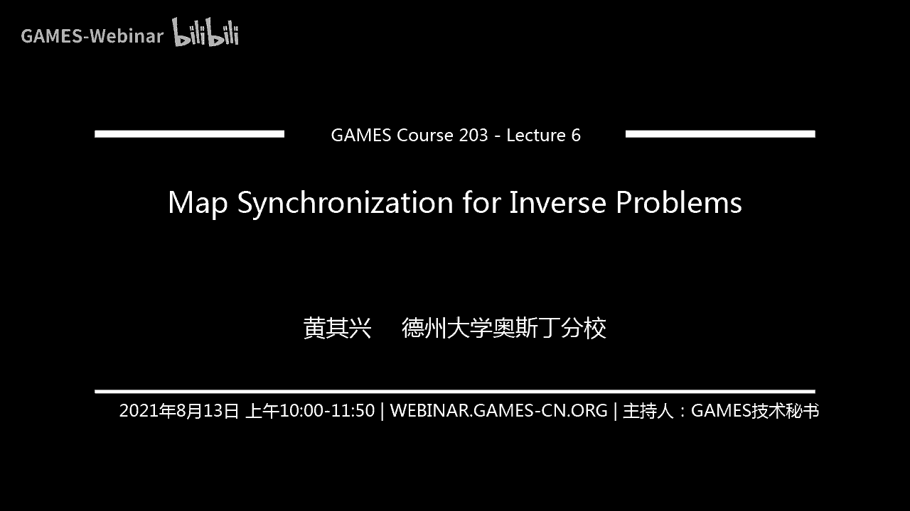
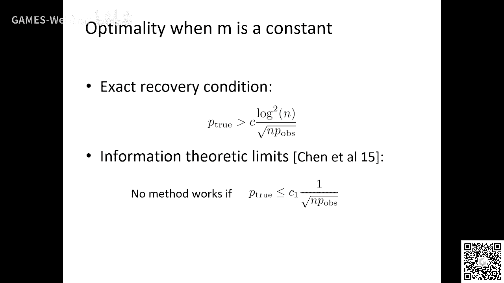
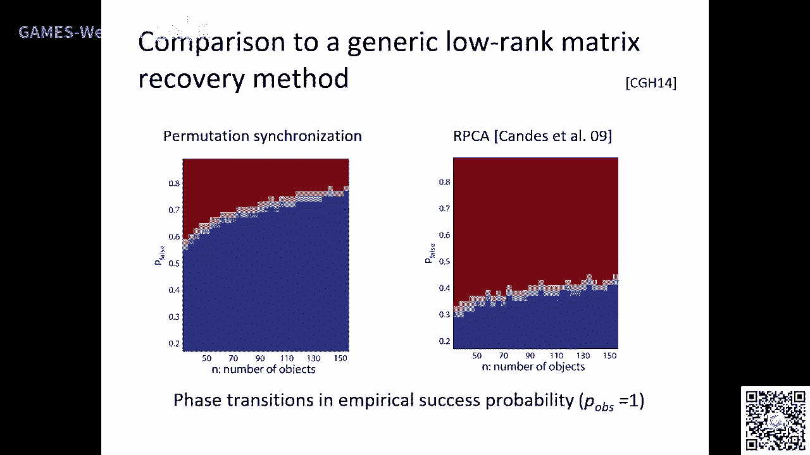
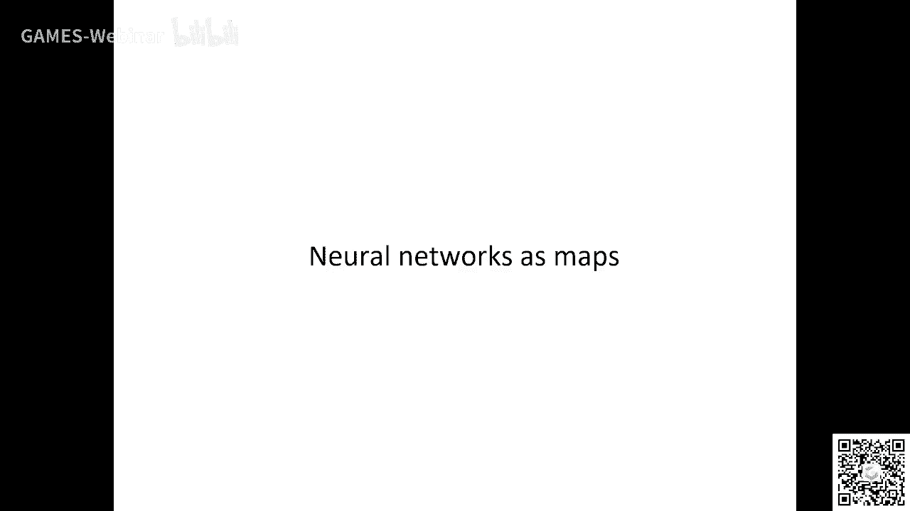
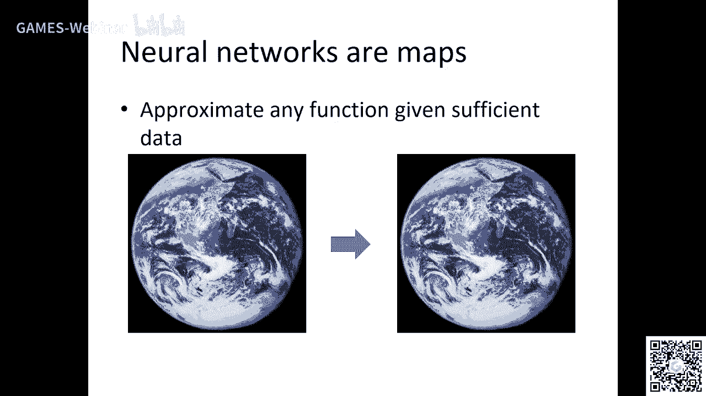
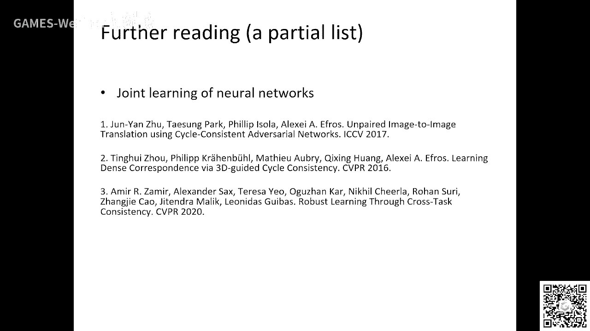

# GAMES203：三维重建和理解 - P6：Lecture 6 逆问题中的图同步 🧩

在本节课中，我们将要学习一个名为“图同步”的重要概念。虽然这个名词可能听起来有些陌生，但它对于解决多视图匹配、三维重建等实际问题至关重要。我们将从直观的例子入手，逐步理解其核心思想，并探讨如何将其转化为算法。

## 概述与动机 🎯

在之前的课程中，我们已经遇到过这样的问题：给定一组图像或扫描数据，我们需要构建它们之间一致的对应关系。输入通常是两两之间的匹配结果，但这些匹配结果中可能包含错误。

图同步要解决的核心问题是：如何在多个物体之间，利用所有两两匹配的信息，构建一个全局一致的对应关系网络？这个问题在许多应用中都非常重要，例如多视角扫描匹配、运动结构恢复、以及拼图复原等。

## 从直观例子理解同步思想 🧩

### 例子一：拼图碎片匹配

假设你面对两个纯白色的拼图碎片，它们之间没有明显的纹理或特征可以进行匹配。此时，仅凭这两个碎片，你无法确定它们是否应该拼合在一起，以及如何拼合。

**解决方案**：引入第三个碎片。如果第三个碎片上带有纹理，并且你能确定它分别与前两个碎片中的某一个部分匹配，那么通过这个“桥梁”，你就能推断出前两个碎片之间的正确相对位置。这说明，匹配不能孤立地只看两个对象的信息，有时需要借助其他对象提供的辅助信息来共同确定。

### 例子二：使用中间模型优化匹配

假设你有一个软件，可以输入两个三维模型并输出它们之间的对应关系，但结果时好时坏。与其费力调整软件参数，一个更聪明的办法是：找到一个与这两个模型都较为相似的中间模型。

**操作步骤**：
1.  用相同的软件分别计算 **模型A ↔ 中间模型** 和 **中间模型 ↔ 模型B** 的对应关系。由于每一步的匹配任务变得更简单，软件更可能给出正确的结果。
2.  将这两组正确的对应关系组合起来，就能得到 **模型A ↔ 模型B** 之间高质量的对应关系。

这个例子表明，通过引入中间节点并组合简单的匹配步骤，可以绕过复杂调参，获得更好的全局结果。

## 将思想转化为算法：图表示与问题定义 📊

上一节我们通过例子理解了同步的核心思想，本节中我们来看看如何用数学和计算的语言来形式化这个问题。



我们可以将整个问题建模成一个图：
*   **节点**：代表每个独立的物体（或图像、扫描数据）。
*   **边**：代表两个物体之间通过某个算法计算得到的映射（对应关系）。这些映射有些是正确的，有些可能是错误的。



我们的目标是：从这些可能包含错误的两两映射中，筛选出正确的部分，使得剩下的正确映射能够构成一个全局一致的网络。所谓“全局一致”，指的是对于图中任意一个闭合环路，沿着环路将所有映射组合起来，应该得到一个恒等映射（即回到起点）。

然而，挑战在于：对于一个算法计算出的单个映射，我们很难直接评估其好坏，因为我们没有真实的标准答案（Ground Truth）。

**那么，我们如何判断一个映射是否正确呢？**

我们需要利用**一致性**这一附加信息。即使不知道绝对的正确对应，我们也可以要求图中所有映射在组合起来时是逻辑自洽的。例如，如果 `物体A -> 物体B` 的映射是 `X`，`物体B -> 物体C` 的映射是 `Y`，那么 `物体A -> 物体C` 的映射应该近似等于 `Y(X)`。如果实际计算出的 `物体A -> 物体C` 的映射与 `Y(X)` 相差甚远，那么 `X`、`Y` 和/或 `A->C` 的映射中至少有一个可能是错误的。

## 同步算法：两种主要方法 ⚙️

基于一致性的思想，学术界发展出了两种主要的同步算法。

### 1. 半定规划法

这是一种非常强大且理论完备的方法。它将寻找一致映射的问题形式化为一个凸优化问题。

**核心思想**：将每个映射表示为一个矩阵（例如，置换矩阵）。全局一致性条件可以转化为一个低秩矩阵分解问题：所有正确的映射矩阵应该能组合成一个低秩的矩阵。而错误的映射会破坏这种低秩结构。

**数学模型**：
我们定义目标函数，旨在找到一个低秩的矩阵 `L`（代表一致的全局结构）和一个稀疏的矩阵 `S`（代表错误或噪声），使得它们的和尽可能接近观测到的映射矩阵 `M`。同时，`L` 需要满足映射矩阵特有的约束（如置换矩阵约束）。

```
minimize ||L||* + λ||S||1
subject to M = L + S, 且 L 满足特定约束（如置换约束）
```
其中 `||.||*` 表示核范数（用于促进低秩），`||.||1` 表示 L1 范数（用于促进稀疏性）。

这种方法在理论上可以证明，在一定的观测密度和错误率下，能够以高概率完全恢复出正确的映射，并且其恢复率是最优的。

### 2. 谱方法

这是一种更快速、更实用的启发式方法。

**核心思想**：利用谱图理论。如果我们将所有映射矩阵构造成一个大的块矩阵，那么全局一致的“真值”部分会在这个矩阵的谱（特征值和特征向量）上留下强烈的信号。即使存在一些错误扰动，只要扰动不大，观测矩阵的主要特征向量仍然与真实一致矩阵的特征向量非常接近。

**算法步骤**：
1.  **特征分解**：对观测到的映射矩阵进行特征分解，取出主导的特征向量。
2.  **取整**：将这些连续值的特征向量通过一个步骤（例如求解一个线性分配问题）转化为离散的映射矩阵（如置换矩阵）。

谱方法的优点是速度快，易于实现。虽然在最坏情况下的理论保证不如半定规划法强，但在许多实际应用中效果很好。

## 与神经网络的结合 🤖



前面我们讨论的映射主要是点对点的对应或刚体变换。图同步的思想同样可以应用于更复杂的映射，例如由神经网络表示的映射。这引出了“联合神经网络”或“循环一致性学习”的概念。



### 神经网络作为映射

考虑以下场景：
*   **机器翻译**：我们希望训练韩语到葡萄牙语的翻译模型，但缺乏直接的平行语料。然而，我们拥有丰富的韩语-英语和英语-葡萄牙语的平行语料。我们可以训练两个神经网络：`f1: 韩语 -> 英语` 和 `f2: 英语 -> 葡萄牙语`。那么，韩语到葡萄牙语的映射可以表示为 `f2 ◦ f1`。
*   **跨域转换**：如图像到三维模型、图像描述生成等任务，都可以视为从一个域（如图像空间）到另一个域（如文本空间）的映射。

在这些场景中，每个神经网络就是一个“映射”，每个数据域（语言、图像域、三维模型域）就是图中的一个“节点”。

### 路径不变性与自监督学习

我们可以构建一个图，节点是不同领域，边是连接它们的神经网络。一致性条件在这里表现为**路径不变性**：对于图中连接相同两个节点的任意两条路径，由路径上神经网络组合而成的复合函数应该给出相同（或相似）的输出。

这为我们提供了强大的自监督信号：
*   **有监督损失**：对于有标签数据对的边，我们使用标准的监督损失（如交叉熵、L2损失）。
*   **无监督（自监督）损失**：对于没有直接标签的节点对，我们可以要求通过不同路径转换得到的结果保持一致。例如，对于一个无标签的图像，通过 `图像->文本->图像` 的循环应该能近似重建原图像。

通过联合优化图中所有神经网络的参数，同时最小化有监督损失和路径不变性损失，我们可以有效地利用未标注数据，提升模型性能，特别是在某些领域标注数据稀缺的情况下。

## 总结 📝

本节课我们一起学习了“图同步”这一重要概念。
1.  **核心问题**：如何从可能包含错误的大量两两匹配中，恢复出全局一致的对应关系网络。
2.  **直观理解**：通过引入中间节点，利用多对象间的一致性约束来解决模糊或困难的匹配问题。
3.  **形式化**：将问题建模为图，节点是对象，边是映射，目标是找到满足循环一致性的正确边集。
4.  **经典算法**：介绍了理论强大的**半定规划法**和快速实用的**谱方法**。
5.  **现代扩展**：探讨了将同步思想应用于**神经网络**的方法，通过**路径不变性**实现跨域任务的自监督学习，从而更高效地利用数据。



理解图同步不仅有助于解决三维重建中的匹配问题，其背后关于利用一致性、组合简单步骤解决复杂问题的思想，在机器学习和计算机视觉的许多领域都有广泛的应用。