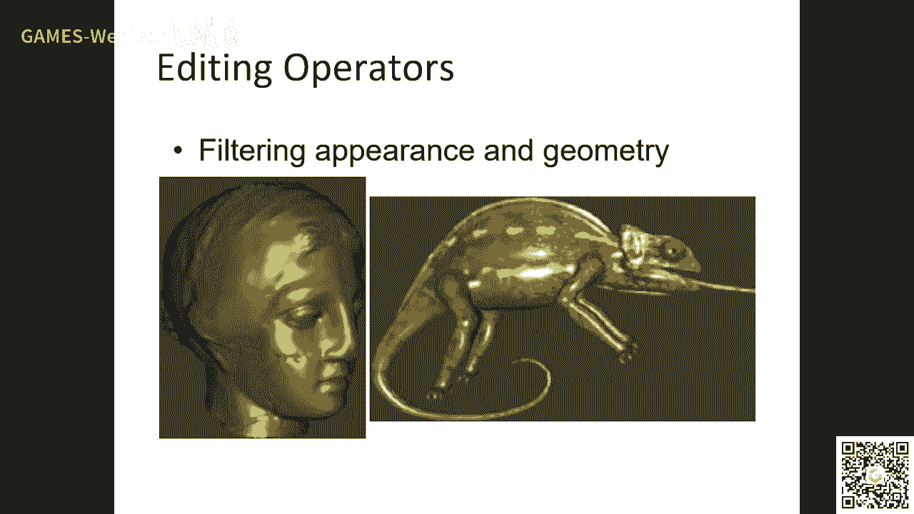

# GAMES203： 三维重建和理解 - P7：Lecture 7 Point Cloud Processing - GAMES-Webinar - BV1pw411d7aS

有声音吗，有声音了，百分，我们我们接着讲课，这节课这个有声音了啊，好了啊，我们我们接着讲课，那节课现在这样啊，就是就是就是我们接着来讲啊，那现在有声音啊，就是有声音啊。

就这节课啊啊我我想讲的是什么东西呢，就是说现在大家都想做deep learning对吧，都想做deep learning，没图像，有图像啊，我这看有图像啊，你们再刷新一下，对吧，就是。

就是你需要学这个traditional of，which will be useful for developing，point best new network对吧。

就是就是我们现在学的这我就读三篇文章啊，这三篇文章都有20年那个了，但是你发现就是其实你的如果就是你没仔细，如果你们还是有很多你不知道的啊，第二个是我觉得你把这三篇文章读读懂了。

基本上这个point firepresentation，一些一些传统的东西能够就有一个good foundation对吧，to give up new that。

其实你看现在的比如说foreign convolution啊，dnm这些东西大部分的这种crimitive都在这三篇文章里面出现了啊，我们不算第一篇文章叫做point shop three d啊。

这个是那个西瓜2002年的一篇文章啊，其实我2002年也是我最开始大概是那个时候不近嘛，我开始做笔设计了，我当时就是读这份上，我觉得就是说第一我不知道，我就是想知道他这个是干什么对吧，你现在回过头来。

当然就是好多时候你随着人的这个知识积累，在所有有头来看这些文章，你可能有一种啊，可能有一种那个不同的看法啊，我同事因为这是个提高课吧对吧，我也想讲一些这个，就怎么说呢，就是你怎么去做你事情。

比如说你将来你将来如果我知道这里面的学生有多少个，将来会去做这个会去做笔字去啊，我我我并不知道这个东西，但是我想你如果要真正做设计的话，我也会提一些。

就是说比如说我们那个graphic那个build怎么往前发展对吧，怎么往前发的啊，这个是这个是比较重要的啊，说这个是比较重要的啊，怎么往前发展啊，然后那个我也想讲一讲这方面的东西啊。

就是说你你你首先啊就是说一个build的，比如说你说point base graphic对吧，你说这个point的base是一个good representation，首先你要你如果从长远来看。

你要能支撑这个东西，你具备具体需要具备具备三个条件啊，这个我我会把这个课讲的稍微随意点啊，这样大家有有点希望有点听相声的感觉啊，我尽量尽量把这这这节课的technical不是很那么壮了是吧。

我我就会给讲讲一些这种假如说大家大家大家愿意听的东西，你比如说这个py的base graphic对吧，他为什么是个raptor，就是你要有这个学科啊，他第一他就是说第一一般情况下像这种图形学和教低视觉。

它是这种应用学科对吧，他这种应用学科对吧，应用学科是什么东西啊，应用学科就是说你必须有比如说几个要素，第一你必须有一个data set对吧，现在做模型的你没有个data set，你比如说神秘地对吧。

有shape net，什么pop net这些东西对吧，什么啊，那个什么sc啊，现在咱没有了什么three d france这些data fat对吧。

第二个呢就是你要有一个open source software对吧，让大家都能用的，当时还没有get up对吧，你看bd它就是一个software对吧，然后然后让大家来用，对不对。

就是说你有一个fbi呢，就是说你真的能experimentally去bil些算法对吧，第三呢就是要有一些opening，就是skeleton对吧，就open the futhe work。

就是skeleton这种的这种work，唉这几点是缺缺缺缺都缺不了的，都缺不了的，呃所以所以我想point three d呃，我们首先要怎么去看啊，b就是要觉得他就是要看到一点。

他是真的推动这个学科发展的一个很重要的方式，对这是很重要的好吧，就比如说你们将来做旅社群，你不管是说把grapp应用到一个比如说石油勘探啊，呃比如说这个做做这个商人地图啊。

啊他好多时候都是要有一个双子来推动这个东西的，这个你有时候你这个双子不是一个人，搞不懂现在几个up上面对吧对吧，你比如说我学生的嘛，歇歇一些，soda对吧，有时候一个大的sd他往往是很多人一起看去对吧。

这个东西我希望大家注意啊，特别是呃我反复强调graphics of vision对吧，这这这这这个东西这个东西很重要啊，这个东西很重要，好point three d呢，但是现在他2007年他就不可以了。

2007年他就不不那个了，他就不不support了对吧，这个维护它是需要成本的嘛，但是我觉得就是从学科的发展角度来说是吧，它起到了一个很严很重要的作用的对吧，他其实就是说他是干什么的。

他是他是有一些一个系统对吧，然后呢他support一些basic的这种这种这种component的，比如说他说话对吧，因为这是个挑课，我觉得力刚老师肯定给你们讲过。

这个肯定给你们讲过这个参数化等等这些东西啊，对吧对吧，它可以做resembling对吧，可以做对吧，这叫operation对吧，就是在这个我会简单的介绍一下对吧，就是说你build一个系统。

比如说你做一个reputation的角度来说对吧，当然你说比如pvp就可以做几百个，几千个那个，不同的不同应用对吧，但是嗯你从从从从学科的学术发展的角度来说，他总有一些应用对吧。

总有一些应用是最基本的对吧，我们需要把这些最基本的哎做好，然后呢复杂的呢往往是这些最基本的排列组合，那么就是compose在一起啊，这个我希望大家那个注意对吧。

你比如说做我们讲这个representation对吧，比如说像pcd是这种ea bleed repetition，那比如说参数化对吧，the max对吧，其实还有朋友呢，我今天没法讲啊，就是你可以做做。

可以在那个可以在这个破被这这这个service上面做special special的那个single processing，比如说resampling对吧。

比如说editing对吧啊我今天会讲一下这些东西，然后你会注意呢，就是有几点你会注意，就是呃我中心会提嘛，有一些东西是需要大家注意啊。

就是这是一个extended interactive system for cobain是吧，它实际上就是把这个photoshop对吧，把photoshop提高了这个到three three d上面去。

就是you swedish service pixels对吧，the circles或者叫normal was also desplay and modern对吧，其实pn倍数很重要的一点。

它一个东西或random对吧，这个我也没法讲对吧，可以去看那个cos rose啊啊ryin其实也是很interesting对吧，就是说对，就是说你比如说他这个拍出来就是这样，可能你有一个input对吧。

very recoser model对吧，然后你就说这个sec对吧，output呢是一个point seven model是吧。

the door require intermediate tegration是吧，就是这样子的这样子这样子的对吧，啊它是一个这样的东西啊，啊就是你说这个东西现在可能大家不一定用了对吧。

这个但是我们要学的是很多东西是怎么弄的对吧，其实怎么就manifate的point对吧，以前大家做过什么样的工作，我觉得你把这些东西也会了解，你真的去就open一个反复强调，就是真的你后面几万的。

你牛奶的我有什么用的啊，好concept，就是比如说preposition，其实比如说你看啊这是一个什么呢，这都是point base啊，它是rader出来，是这样一个东西吧。

比如说比赛里有一个patch对吧，然后呢我可以我可以在这个上面，比如说做一些resampling对吧，就是resampling把它做成参数化对吧，传说化了以后呢，你就可以贴纹理嘛对吧，就是可以贴纹理嘛。

但是就是这有一个问题，就是说我们没有一个选手的mac，我想问一下你们对这个mesh的参数化有没有网格的参数化有没有了解，就是力刚老师应该讲过对吧，这个东西应该是很重要的啊。

我觉得就是科大力刚老师那边传说的话做过做过，就是他们组做过，应该最近做过很多这样的工作啊，这这个很好理解了对吧，你如果学过open gl的话对吧，你还是给一个tech corner，他说话嘛对吧。

然后你们贴贴纹理啊，好那t corner实际上就是说你去我们需要有一个这种point cod对吧，呃就是bring service brush，your common referring。

然后然后然后要你要做这个dynamic resembling，然后你做对吧，实际上就是说你有一个anything operator对吧，然后你有一个pose，然后你有一个brush。

然后然后你就可以可以可以做的，但这个其实很好理解啊，关键就是参数化啊，关键就是参数化对吧，他说话怎么做呢对吧，其实就是说这个东西啊啊我不知道嗯，现在来讲这个东西的话。

其实嗯首先3号这个问题有没有完全解决，没有对吧啊，现在是不是热点了，这个东西很那现在还是一个大家非常关心的问题啊，其实从98年啊，也包括我们的顾晓峰老师对吧，嗯等等等等，这个很多人研究过这个问题啊。

还没有完全解决啊，数据上也没有完全解决呃，现在在这个deep learning的这个趋势下面呢，啊还没有人真正用deep learning去查询这个东西很少啊，这个东西啊，对吧，但是没有完全解决啊。

但是我我现在就是觉得就是说至少一些基本的方法，大家要知道啊，当比较复杂，他用了很深的数学工具是吧，看包括启航学啊，这些东西一直用的很多对吧，没有完全解决啊，一般情况下我推荐是什么。

就是如果你学一个东西啊，就是说你不可能你像我也不可能知道所有的东西，我知道一些啊，我不可能知道所有东西，但是我会知道一些基本的对吧，然后知道了基本以后，我就会去这个，我就会去那个弄那个更更复杂的啊。

就是说可以通过阅读吧，我今天讲一点最基本的东西啊，但是这个参数画一个写本书啊，呃这个写文写了本书啊，好吧，ok然后呢它实际上呢就是说这个这个算法呢是2001年，svip有一个做mesh吧。

或者you graphics to match的这个算法是吧，c管和2002年我们就把它用到那个群算法啊，反正就是瘫痪，你就记住它在几个优化对吧，实际上就是说比如说你有一个优优，就是那个preme对吧。

就是说你要你要求解，就是每个点我要给他一个promise对吧，对吧就是比如说是这样的，这大概就是说实际上就比如说用户比你有个mod对吧，你写point对不对。

mod一些point跟那个跟个啊这个tt对吧，因为color这个image对吧，然后这个kiphone都是对应的，那我如果有keen声音呢，你就可以得到一个这样的参数化。

参数化就是就发现这个iphone了呀，他就是对应的那个ub是吧，那上面实际上你可以理解就是说我知道这些key point的那个参数对吧，我想把它卡出extrapolate到所有的点，没什么，对吧。

他的话就是说你find find the magiex that minimua，minimuof jection section是吧，就是说啊实际上就是说你优化的实际上是呃，是实际上每个点的参数嘛。

每个点的参数对不对，然后呢你要然后呢你的你要满满足这些点呢，它的参数是要对应的对吧，然后你还会有一个就是说你还会有一个reacez什么，因为第一个turn对吧，第一个称左边。

比如说你在这个音频上面有三四个点，那么只有30个ctrl对吧啊不够对吧，还需要加一些additional constraint对吧，叫regalization对吧对吧，那那怎么说呢，就是说。

就是说你做参数化嘛，那就是说你要买一些这种discortion对吧，比如说一种传统的方法，就是说那个要让这个东西添上了mooth对吧，smooth对吧，就scared qq群。

you can local polar recondition吧，就是说你要这个参数啊对吧，它实际上是一个meme，你要这个餐的话，要smooth对吧，你要你要你要尽量smooth对吧。

呃实际上就是说你可以呃可以可以把这个参数化对吧，呃用这个logo的proxation对吧，就是给你一个点，给您周围几个点对吧，那我就可以啊，就是用这种离散的办法去approximate。

就去逼近这个连续的东西对吧，你就会得到一个离散的formulation，对吧啊，实际上写的就是每一个点的那个每个点的参数对吧，然后同时邀你这个这个鬼一点的尽量的不对吧，唉是这样子的对吧啊。

它是这样一个东西好吧，map wii，那下面就是说你怎么计算这个derivative在一point of上面对吧，就假设你有一些点哪个上面有，就是你怎么就是下面就是这个问题了对吧，就是说你有这个方面。

但在这个方面的一些不是不是不是那种最r的最终的，所以有很多别的方面类型的方法对吧，比如说你还要让他cfo啊，这些东西我们就不讲啊，我希望唉我希望谁啊。

比如说黄金老师来给你奶奶讲一个这个边上的那个传说话对吧，vx只有顶端对吧，我也可以想啊，但是他可黄磊老师做这个的啊，他应该觉得来讲我觉得这些东西都很重要啊，我我个人感觉或者我们要写峰老师来讲一下。

我个人感觉这方面的人还是还是很很有意思的，能学到很多东西啊，好那我们现在就这里就搞一个，那不那么就是这个像什么，就是那个l two mic是吧，其实他也这个核心的就是说你怎么在点云上面去算这个东西。

去formulate对吧，至于是什么样的potential，不是这篇文章嗯，重要的对吧，我们要讲的封印的loud，它是离散的对吧啊，那你怎么在零三上面算嘛对吧。

那也就是说在每个点上面我有个fashion valley，我怎么去计算dervity of demand order对吧，那这个时候呢你就build一个no cocodex对吧。

direction extensions，diy different based on taneous neighbors对吧，就是说你有一个点对吧，然后你基于周围的点对吧，然后你算一下这个呃。

算一下这个normal section，就是放一个这个cosystem对吧，就是一个corner system，有了这个coding system以后呢，你就可以在这个呃点云上面做这个做这个离散计算啊。

最简单的一个算法就是你把它你把你你把它给参数化嘛对吧，他说话啊，还有就是比如说你可以可以假设这个呃可以做一个logo的这种b对吧，做一个logo的b，然后那个呃然后，然后然后然后把这个东西再带进去。

所以我就不讲了，我就讲这个我跟你我跟大家列出这个问题对吧，就是你怎么在点击上面哎去做interpoation对吧，做ation啊，然后呢你说了这个以后呢，它就会变成一个这种display的这种问题啊。

display的问题检查说话啊，然后你可以求解对吧，哎参数化，这是参数化的问题，然后还有一个重建的问题啊，这个谈话我因为今天东西很多啊，你这个地方你没听懂，那没关系，你就知道啊。

我就希望你知道有这么一个问题，就是怎么在电源上面做做做点题啊，你记住这个问题就好了啊，自己去看一下啊，然后今天东西有点多，我主要是也是一个这种highlight这种东西啊，就是然后你可以再点。

然后你就可以有了这个bug做这个fm进行集优化嘛，啊接换一个就是做一个历史规律的批评啊，好你猜不化，那么生生下来就是你怎么从连续的对吧，呃怎么从离散到连续对吧，就是extrapolation对吧。

就是说你给了一些钱，对不对啊对吧，然后这个东西呢我就不讲了，因为我们在讲那个invited section和我们讲这个东西啊，实际上它核心思想就是什么，你怎么得到从理想得到连续。

那你就是做一个basis对吧，就是你有一个这个iu对吧，我们我们我们讲过radio basis b对吧，其实就是说你把这个连续的对吧，把离散的把把它把它变成连续的，加一个basic啊，然后就可以对吧。

然后reconstruction with a feeding sections对吧，就waiting section for the space，对吧就是嗯哦好吧，这个我就不讲了啊。

这个我就不讲了对好，然后就是重建吧，重建其实就是点名你没法避免的一个东西，因为你是离散的吧对吧，你需要把这个离散的做一些interpolation嘛，对吧啊，这个point这个我刚才强调了对吧。

我们在做影视曲面的时候接触到这个东西，接触到，然后这个sc还提供什么东西呢，比如说ing operation对吧，比如说做painting对吧，就是如果你有了这个以后，你可以在上面加一些纹理对吧。

你可以做一些这种，可以在上面做一些这种displacement对吧，有了参数化以后。

有了点击参数化以后，这些东西都可以做对吧，这个rendering我没讲ring，其实说白了我不知道诶，呃那个那奇老师应该讲过对吧，比如说rendering最重要的就是什么，你就是一个ready。

你怎么跟这个surface去算那个焦点对吧，哎你这破破的靠怎么做呢，呃一种情况下就是我们待会会提到，就是说一种就是我们把它变成一个隐形曲面，对吧对吧，我们那个做呃前两节课讲过对吧。

呃呃然后你可以用一个瑞跟隐私曲面积相交对吧，还有一种就是你把你找到找到那个最近的吧，就是这个跟这个瑞最近的那个pixel，然后用那个pixel那个quin对吧，做repaint section对吧对。

然后我想说的是什么呢，就是如果你真正做的好的话，你看这个rs效果啊，你看不出这是一个点，你知道吧，你看不出这真是一个point cloud对吧。

你还是有很多这种呃这种rendering的exce出来的啊，啊这就是为什么point in the base graph，07年大概就从99年到07年8年的时间啊，是一个非常active的比赛去。

就那现在肯定用active对吧，供应链的解决了这个呃machine learning的问题，那我一回来了对吧。

啊对吧，ing operation是吧，tering appearance and geometry对吧，你比如说你可以在上面可以detect的那种feature，feature对吧，这是优酷app。

也是2003年的一点配合可以做这种模式好，这是我简单的讲了这个sc对吧，呃我没讲这个technical details对吧，我们总结一下就是有几点我们需要的叙事学到的对吧，第一就是说一个学科你要发展好。

你必须有一个大家都公认的，甚至是几个大家都公认的刷回来啊，我觉得或者data set对吧，或者是那个比较有名的算法对吧，大家能去cp，我觉得这个逃不出这个这个东西是离不开离不掉的啊。

第二呢就是一个氛围呢，它会有一些最基本的东西，比如说他说话对吧，你给一个patch，我能做参数化对吧，这样我就能贴文理对吧，我能做这个上面的点，我就能在point cos上去做对吧。

第三个就是说你怎么把零散的把它重建对吧，就是重建成连续的对吧，基本上对吧，你通信靠基本上都是这这就是一些北体的东西，那剩下的东西就是在它上面，好那下面我讲两篇文章吧，啊都是那个mark fly。

也是这个tutorial的那个一个，呃呃一个一个一个那个organized吧对吧，就是两篇文章啊，你鞋是什么东西呢，比如说啊这个比如说我们要做mesh对吧，如果你跟那个谁或者说跟周鹏老师说。

他就会告诉你对吧，你首先一定要自己实现一下这个magic vacation是吧，就是pcd，你如果说的好啊，我建议您也要去实现一下point cosliation simplification。

为什么呢，这是通过之后这个东西啊，你对这个data它就了解了，那第二就是说你做这个过程中间，你进了你就慢慢了解了一下这个pc最基本的一些operation，这个东西是是最重要的啊。

我现在其实觉得比如说我们d wave这个呃，point of base the new network对吧，嗯我觉得大部分学生啊，他他是不知道你们不知道这个对。

以前那个比如说创新号vacation sevication，我觉得你很多学生是不知道的对吧，怎么做的，我觉得这就这就出现了什么东西呢，就出现了最近对吧，最近的这个一些现象啊。

其实我个人觉得有有有有抓到的，那其实很多大家都是没有抓到对吧，但是抓到他性质比较严重了，太太明显了，但是实际上我想强调强调一个什么观点，比如说你问我的是什么观点。

我就觉得现在啊这个整个这个deep learning这一块，这近亲繁殖太严重了，什么近亲繁殖呢，就那么几个最简单的东西对吧，然后大家用来用去用来用去对吧，就是就会出现什么。

就是说你第一篇文章跟上面文章很相信对吧，你图呃那个图差不多对吧，那个图要干什么都差不多对吧，形成了一种模式对吧，就很容易进行繁殖对吧，你查出来了是吧，有的是可能很多还没查出来的对吧，你自己去除对吧。

大家都有这种感觉是吧，我觉得这样是不好的啊，这就是我这门课为什么跟你讲20年前的文章对吧，哎我觉得这些东西往往是最重要的对吧，呃你比如说point cos上面有有点像或者选大家怎么做的对吧。

诶你把这些东西了解了，你就是嘛，你就听样子，就这就是从从从遗传学的角度来说对吧，我有说看整个学学科它会怎么发展，最开始比如说你老虎吧，东北虎明园最爱巴斯老虎对吧，你如果把这些to学好以后。

你可能最开始就几十字，对不对，这样的话他就我那个金钱房子相对来说就能改善对吧，懂我的意思吧，好吧哎所以我跟你讲两篇文章，20年前的啊，这是对这是roduction对吧，这是干什么呢。

承担这次motivation，就是说你你是个podcast现出来的对吧，它是用for sampling嘛对吧，uniform samply对吧，那其实这个非常nice，family。

那many application require coopoxation对吧，这种cost这种approxation对吧。

ebb and storage special processing ring对吧，就是我们需要这个same producation，map，reduce complex deo对吧。

好比如说这是一个与三毛对吧，就是十个10k20 k60 k222 200k那2000k是吧，好那我怎么来做simplification呢，这是这篇文章就讲了三个方法对吧。

就是说嗯heroic hierarchical classroom对吧，其实你要说这些东西从哪来，从vision里来的对吧，intro intro ducpk是从mesh来的对吧。

the party of similation，我觉得这是一个啊也会靠的比较独有的东西，然后后面呢很interesting，就是有时候也看这个学科怎么发展。

比如说他们最后在这个文章的基础上又做了什么逻辑呢，在这个文章的基础上，他们又做了，比如说point of base information simulation，ok好，那么一个一个来讲吧。

首先我们就是这是一个to local serviclc吧，这是我们需要掌握的一个to对吧，就是就是我们这个point sample describe the one in manipulation对吧。

我们就是说我们需要就是说啊，我们能不能从这个point得到一些logo的surface property对吧，比如说啊我们如果想做approximation的话，就是movidispler对吧。

我们两个之前讲过的这个东西，然后还有fast assuming pansion，plan college是吧，这个pc啊啊这个我们讲一下啊，就是这些东西呢呃是tv repetition最主要的东西啊。

最主要的东西啊，最主要的东西，然后呢你build on top of this，比如说我们要算这个，比如说算一个tension plane对吧。

the man上面那就是每个点的one renewable，我可以做一个测评视频，对不对对吧，然后那个name replace to tida，forgive me special for。

你在point com上面，哎你的name是什么啊，这个东西我觉得它就比较比较interesting啊，这个东西就是比较interesting对吧，实际上就是说呃像point of或者说约定。

包括后面任何一个做简约的东西，包括现在做第2年对吧对吧，你都需要什么，就是一个点周围的navel，我们需要知道，对不对，哎，就是computer nel queclean di。

incompleted pi，就比如说这个东西怎么算呢，就是怎么算呢啊就是说你一point cos上面就给你一个点对吧，你需要很快的找到他的kneighbors，kneighbors这个东西啊。

其实比如说point shop three，它有一个自己的input dation，它自己写一个kd train啊啊你包括matlab，其实它它有这种data structure是吧。

就是不同的data structure，他有他有poon count，那决定了就是他的那个performance，在于你这个呃，在于你这个呃东西有，就是你这个点的distribution啊。

in the distribution啊，如果你是像一个service uniform distribution的话，你可on to比较好的，非常好啊，如果是以very的话，kd去。

就比如说有的地方非常赞啊，要非常快，这个是用什么去比较好，kd去比较好对，还有b sb啊，群这个啊，ok canyneighbor，对不对啊，然后呢这是一个东西对吧，你cany's neighbor呃。

这个东西它你说好不好呢，决定也决定啊，你如果做这个angular，如果这个地区是regular的时候啊，你这个nahood你需要什么，你就需要每个方向都有，对不对，哎所以这是安卓creria对吧。

既然这个东西怎么做呢，实际上就是说，你可以就是sneighbor based on angle对吧，就是说你首先找一个大的candidate对吧，然后在里面选一个小好吧，这样然后当然还有一些别的算法。

就是logo提供ation啊，我这我这个课好像没讲对吧，没讲就是说有一个就是computation的简要去背的那种充电啊，从从学术的角度来说，他还是在呃还是占有很重要的地位的，其实就是内系列文章。

比如说nina mana对吧，现在davi啊做过很多很多反对小的工作啊，就是什么呢，就是说给定一个surface，包括time a day啊，现在在辅助啊，就是，你上头一些点对吧。

如果你这个三文说的好的话，我只能cover，我们就能收回，performation of your maj，这几个上top top的都是become，然后下面就是一个这种covier老了。

covier老了对，就是confirm啊，这个东西是干嘛的呢，就算那个normal对吧，就算科v准就名科北准啊，这个东西啊就是我们前面我们前面也讲过吧，就是这个就我前面讲过一次啊，其实怎么做呢。

就是说就feat your brain to set a point是吧，这个地方呢就是你给力一点，找t0 对吧，然后你就做这个pcl，老老实对吧，你这个比如说点云，它就是一个3x3的矩阵，对不对。

然后还有三个特征跟，然后因为c是因为c是半分，你知道吗，半分离的，所以他但实际上这个这个东西mini edge吧，现在说大家要清楚所有的一个value都比较value，对吧，你找到精灵。

然后你c的一个这个b c a就能得到他的口算的i跟max，然后这个地方很interesting，就是说啊是吧，就比如说total by vision，就是所有点对吧，照你这个到你这个ser的情况对吧。

它实际上就是所有的车能跟相加对吧，然后你比方那个sp版本就是最小的那个男的，名字是最小的那个圣人根对吧，这个实际上是mor fc，就拿作品猫猫对吧，实际上这个东西等价于什么呢。

实际上它是等价于这个名词名词啊，就是你在电源上面做pc对吧，你不仅仅是i can make a管用，agon vue给你很多东西对吧，就是说那您以外就摆这个东西对吧，然后你可以做个实验。

这块就是original link vision的，然后你会发现当然当然就是说呃这个viviation呃，就是说bance viviation就是这个公司啊。

让你去tiness neighbor或者diy的时候对吧，得到这个词，你发现还是一个非常good proation，非常good proximation，这是covery analysis。

后面我们做过那个integral various，实际上也就是说呃简单来说就是mc vision是两个pencil crash像相加对吧，嗯，然后还有一个高频科学学吧，高兴科技学实际上就是他跟什么相关。

他跟这个debu可展曲面相关对吧，可可展曲面相关啊，就是说如果高科位就是零，就是有一个科学学，他是零对吧，哎然后这个，对吧，inclusion variation对吧。

vivation the origation，好ok然后我们后面说的那个in tegral就是怎么取名呢，就是积分不变性的这种descript啊，就是就是helmetman啊啊收到了。

然后那个也可以证明，就是说基本上得到这个debution，得到mc是比较容易得到，高科学有点难度啊，有点难度啊，这个这个需要的工作要更多啊，而且高兴，可是往往我记得不是那么懂的，毒霸你要在曲面上。

你要估计这种高性qq群非常难，mean couvature比较重啊，这个估计的比较准啊，其实这种mk vision，ok对吧，这就是这就是我们前面讲的这个covim和牢牢整齐的点。

上面这个q我刚才讲这个to是希望大家记住这个to，我是希望大家记住，好吧好，我们下面就讲一些machine learning的东西，data mining的东西啊，相关的对吧，就是怎么你用用了这个东西。

为什么要坐牢了呢，就是因为就是我希望希望保持这个频率比较高一点对吧，我尽量让那个地方三步的dh一点对吧，这这是这是这是这个go对吧，那怎么做silication，它这个东西有些东西不是pcl的固有的啊。

有些东西是point cos固有的会我会强调一下是吧，它实际上是一个top down po对吧，就是说我不断的把这些呃，把把那个不断的把这几点公布在一起对吧，就top down approach。

就是不断的区分区分对吧，to the positioning，然后呢，我每一个petitions就得到一个class吗，在class里面找一个webentity，是不。

就speed paint方把time roid的action对，就说你如果这里面的点它是有variation足够大，那就说明这个地方很很，这个曲面很复杂嘛对吧，非常简单的一个princible对吧。

那我就怎么样，那我就需要在这个里面怎么样，我需要在这个对吧，对吧，然后你不断的提醒，当你这个revision缩小的时候，他就能背什么，背一个plan b的好吧，那这个时候呢我就对吧。

这是这是一个人这个东西，这个投稿表他们做的很好啊，就是说比如说你有一个to d的东西对吧，这有个有一个play，他们都会怎么怎么做呢，就是基本上是，对吧，就是说呃你首先算所有的点都删除对吧。

然后沿着什么东西处理的，也肯定沿着那个就是那个男的，就是最大的那个方向，因为这个地方的ban最大嘛对吧，沿着那个方向去做媒体对吧，沿着那个最大的话要做sli，得到两个以后对吧。

然后你就不断做switch，对吧啊每个对吧，然后哎这个东西我建议大家写一写，其实还是很有意思，对吧，那最后的话呢就在每个历史的里面呢，这个你做一个这种做一个做一个这个歌词很细节对吧。

红的就是那个所有的那个list里面对应的那些黑点，把它算出一对吧，非常简单对吧，这是一个那个呃对吧，就是就是那个petition对吧，然后不断的partition负担，petition这个结对啊。

你还可以说这种adaptive对吧，就是说呃你可以在那个举高的地方，让它在这个shopping的那个快递员对吧，所以说这个w是class对吧，唉这个算法很简单啊，这个算法很简单。

啊你在mac上面可以做这个东西啊，在mac上面的那个做这个东西，其实我觉得这个东西你比如说最近大家有没有看一篇pv，就是在合作的both knet facebook上对吧。

其实他就是不断的对这个point去做什么，去去做contraction，其实这些东西我讲这些东西都我都相关的啊，后面具体讲一些探索的时候，我会我会想我现在提提提提提就是讲这些东西就是给大家一个bo对吧。

将来我们去看那些文章的时候，眼光就不一样了对吧，就比ok对吧，是然后第二个算法这个东西是从max来的对吧，就是match preligation时候用这个东西对吧，它实际上就是说这个是bup。

我不但上面那个字，我不断的把所有点分类分不肯定对吧，你看上面这个东西非常明显的就是不断的肯定ition，对吧，这个地方就是esilication，就是，这个东西是从哪来的。

就是说q都是match上一个非常经典的文章啊，算飞行1000多吧，好像5000了吧，我记不太清楚了，就97年的文章，1997年的文章啊啊，非常simple非常简单啊。

那么他们看到这个放在cos上面怎么做对吧，实际上就是说，这个东西怎么来，就是你不断找两个点，把它默认成一个点对吧，那也就是说我们要定义一个mac，这就是为什么找这两个配合点是吧，我不找别的对吧。

就是说实际上就是说什么呢，就是说你simplify以后，你把两个点默认成一个点以后，你这个新的点他要跟原来的那个东西怎么样，原来那个service怎么样怎么样，要要尽量的信对吧。

就比如说你这个mod是在planet reach是吧，就是flash vision上，它实际上也就是说实际上代代是什么呢，就是说就是每个点呢，就是在中间的时候我都带了一个，我全是form。

就是说你给你任何一个点，我知道这个点，比如说这个点是前面100个点improvise出来的对吧，我就到前面100个就是他的那个呃周旋这100个点的那个啊，加这个的这个decent平方和对吧。

就是plain plain by max，什么意义的p r g b是吧，然后就算一下啊，这个这个这个我再讲一遍，如果大家不理解，就是说我不断的找对吧，但是我每次呢我找的时候呢。

第一我要知道哪个连两个pad能更好的被finished对吧，能把它cp在一起，我要知道新的点我放在哪对吧，新的点我放在那，那怎么做呢，就是每个点呢我就define一个，好像那个缝对吧。

那如果最开始点就是这个点对吧，这个屏这个normal对吧，point的话，normal这个回答是或后面当你把两个点位置在一起的时候呢，你就把两个点的火车去boss那样把它加在一，这样一个东西啊。

这个东西是这个color half 9706文章去搜一下，搜到电影名来的啊，那个文章就是打印机的声音，就是说为什么影响力大了就非常简单一个id对吧，同时可以简单在简历上面用，同时也是在检验上用对吧。

那就是说你computer initial point fairs，the candidate对吧，你就computer就是fmental protesting对吧，然后呢你就sympa以后。

然后看看就是说就是说找那个最好的那个点，看到的比例就是多少对吧，你把两个点移成一个点，我保不下来，就你就把那两个反的慢走和标准加在一起，然后你就会对吧，就是比如说有些edge每个有个cos。

这个cos就是那个cosy的最小值对吧，然后你就不断的首先把这两个点对吧，扔掉吧，扔掉以后呢，然后你就会然后继续update as，就变了以后就叫update跟这个点相邻的这些edge对吧。

你要把那口袋里报名重新算一下啊，然后你再找再找每个最后你就找到这，啊啊核心的东西呢是那个q那个那个match superfication的那个算法，这个地方你发现点名上面特有什么关键。

你还是要找一些没准，对不对，就是每个点都为那几点对吧，诶，那kenneighbor对吧，我做contraction，对不对，好吧啊，所以这个neighbor做点源的processing是非常重要的。

其实反正mac lab现在那个库应该不错了，应该a kn 40，max lam kn 4是很好的，这是intrusive simplication对吧，我们in the model。

increment model对吧，然后还有一些就是剩下remain point，there contraction candidates对吧，对就你发现就是基本上就是这种科学的地方。

你发现地还是比较多对吧，flag的地方啊，就就就那个就点就车比较多啊，这说明什么，这说明那个match acation上来了，然后对就是有很多啊，你不要小看这些plication啊。

这不是这不是你这不是低空两点，我不学的，我是绝对不行啊，这些我说白了就是讲女方哥在里面反metal的东西，最反metal的一些算法，完了其实我想呢你可能觉得黄老师也没讲特别多，我其实说白了我看这种课吧。

我就跟你讲吧，其实说白了你就是我会讲一些东西也不对，但我是更重要的，我就跟你讲这个学科对吧，就是哪些东西是最重要的，哪些文章你应该去读对吧，第三个那个东西呢它是一个postulation。

实际上就是说我怎么用一小部分的这个point，那个点去那个更dance的东西对吧，moon service quality对吧，就是说你会定义一些这个这个pose对吧。

就是同时也能呃可同时也可以用来做upset对吧，就是这个simillion是irendering pread pole对吧，计算一些boss对boss就是这些点对吧。

就是所有其他的点去把这些particle去拉他吧，如果一个地方如果一个地方没有点的话，那他就需要把一些点给拉过去，现在，然后呢你拉过去以后呢，这些点它当然它就不拉过了。

update一些点他就不在那个分明的ji，我在这里给一个excel对吧，就是enzation rendering spread对吧，然后呢会有一些力把它去拉，对不对，把这些人拉拉完以后。

他就不在这个设备上面了对吧，然后你做一个projection再回去吧，就这样不断的update啊，这个东西从哪来，这个东西是从那个ping出来的对吧，就是最后呢你你会出现什么，最后就是这些点啊。

它都是1000对吧，如果你是以reaction或者就是有些地方没有抛不掉，那那那他周围的那些点会怎么样，他会有一个那个非常大的force把它往那个地方去拉对吧。

最后呢就是说实际上形成一种equilibri平衡对吧，就形成一种平衡啊，对吧就是partition对吧，这就是那个一个结果啊，可以说就是你可以就是可以把这个力的这个定义啊。

就是这个service的那个这个科学好吧，magic这个error对mac diss必须替换上自己的三个flash出来，melo对吧，就是说做一些做一些这个问题。

然后mrero就是说你sirfid的up sample对吧，然后你可以比较两个字的区，然后你会发现就是说嗯海go crap肯定是最快的，但是他的这个positiation它就不那么不那么flag。

然后这个什么最慢呢，对interactive这种crification是最慢的，但是它最accurate啊，就最accurate，啊然后一些比较对吧，就是说aero classroom。

那肯定是最efficientation，也是最简单的，对不对，simplification就是他这个effici是吧，但是控制控制这个service control error对吧。

但是你这个control相对来说就不那么reaction，一直在想ok了对吧，simulation就是esia，还有比较efficieno也比较不错吧，很臭对吧，我比较flexible对吧。

可以定义那个力嘛对吧，那个力可以体现呢各种hp对吧，你不a等相对来说复杂一点好吧，那我们就休息三分钟五分钟好吧，然后我们接着回来接过头来讲，下半年没配合好吧，谢谢mozing啊。

啊这我这个里面我们也会学一些别的东西啊，学一些别的东西，这个文章啊就是efficient to savor of point of psimple，j，大规模混了，还有一种做up sey是。

就说说up family啊啊我我那个谁，我明天明天我去学校啊，我把那个都update，你可以在网页上找到了，我今天忘记up了，up主我是那个pdf那个s，小虎牙大规模混靠fbs采样率低。

做一些up sely啊，其实，嗯这个比如说lia的这种v人那个破cd被采样，那个老师这个801里面有没有到，可以去，你可以去那个参考一下，现在用既不能做到的怎么做是吧，你可以做up 300。

detail贴上去对吧，如果有个参数化是可以可以可以在这个logo的这个point cod，其实现在没有解决什么问题都没有，那我可就说鼻子破烂的啊，我我我在讲这篇文章。

我跟大家大家一个在这里有个互动对吧，这个呃，抗的你如果问我对吧，deep learning，那破号最主要解决是什么，就解决了一个and stan，看point point net上面对吧。

你做的是做这个and standing，而且detection这些东西做得非常好对吧，状态都standing是吧，three division做的很好，麻烦你现在对吧。

你趋势上我觉得大家不会用bug卡对吧，比如说第一你推荐sc是吧，我会选对吧，a s d f对吧对吧，啊对，pricy解决矛盾的问题，我觉得还是要有一些是logo里的参数啊对吧，而且实际还是要跟什么。

还是要跟这个ing的结合对吧，你比如说你ining the day，可以可以可以可以可以可以结合在一起对吧，所以我们后面会讲就是modern的角度来说。

现在deep呢你比如说你用pcb去c的一个model，这个效果目前来看它不会比不会比这个shift的那个d vs d f要好，但但是不能绝对这么说啊，因为我觉得，就看你就看你怎么去怎么去弄他了对吧。

如果加一些这个，如果加一些个别的revation ingredients，这还是可以的，叫那个shift modern啊，那个就是实际上就是说motivation，这是计划和2013年的问题啊。

这个sweety common coviation，python和magic model对吧，quite对吧，然后做重建，然后你做processing，最后你就做rendering啊对吧，对。

这个这个派放这是20年前就有的，现在其实说白了也没有，也没有什么太大的改进嘛，还是这样子对吧啊，好的收处理设计啊，减云的场景重现有哪些前前沿研究方向，是是室内场景室外场景啊，室外场景的话。

我觉得就是说multimodel对吧，就是说你一个model y你是不可能看到，怎么这个东西其实很有意思啊，就是说maddy你是看不全的对吧，比如说你买了你高的点找不到，对不对，他他他是有一个那个。

都有个physical mutation的对吧，然后嗯，比如说你还有那个那个那个鸟鸟，那个什么就是空中拍的对吧，那你就能拍到比较高的对吧，moi model对吧，你怎么把moi model集合在一起。

再一个呢，就是说，怎么能把你搞一个系统，大家能搞得非常拥抱，那个就我觉得也是很很那个的，再一个就是说你怎么解决这些有的点，但是找不到的对吧对吧，你不对吧，你怎么做一些补全对吧。

composition对吧，这个室外场景就是说你真正要解决的，就比如他不是企鹅的重建都没开始对吧，你怎么把颜色也重现出来，你怎么把shallow给去掉，对吧，对不对，场景重现还有数嘛对吧。

这些都可以研究对吧，重建动态的物体对吧，怎么把outline，比如说人啊，production那个这个这个这个东西对吧，你扫描的过程中肯定有自己的东西，怎么把那个很好去掉，如果你不想要这些东西对吧。

哎都可以研究对吧，其实有时候你们有时候自己感觉自己研究不出什么东西，我觉得大家都很聪明吧对吧，你就几百篇文章对吧，特别是我讲的这些东西，让你回去把这些文章都读一读，自然就有想法，你读的东西越多。

你就越有想法，而且好多时候做比特权，我也是说嘛，就是说我个人的，包括我自己带学生，你不能急对吧，你得打基础，这篇文章这篇文章不帮我解决，基本上你的问题不是这样的话，你还是得去读啊好吧。

那我接着讲这个东西啊，对的，特别是f对吧，这个的话就牵涉到两种representation，然后我们还会讲了。

比如说有两种representation移动的explicit services in expression是吧，就是说，就是limitation这些东西就是以fficient rendering啊。

上分的角色就对，然后increasing services呢，就是说，有never said radio basic sessions，还有这种archbservices对吧。

invitation就是bully operation，the operation changes of technology for extreme information是吧。

那就是for the count呢，就这就是我们提出一种hyperretation这种hiit representation，就是要把要么搬什么，就是实际上是要把这个不同的这种想要把它合在一起。

就是press card point in sample，president emodel是吧，就是说实际上就是说他就是minimise requirement for extreme deformation对吧。

就是说fast inside outside classification for blooperation，也就是说每个representation呢就是说比如说呃国内做这个软件嘛对吧。

cad的软件对吧，我是一个小鬼，要我我那个把这个课讲完，我再回答你这个问题啊，好吧，就是说你有一些有一些基本的要求对吧。

一种就是说这个mini minimal confident deequirement对吧，就是这个inside这个outside producation对吧。

就是这个express modering shopping hip对吧，就说build一个representation对吧，你要support的一些最基本的结构对吧，哎这种呢就是处理这些东西对。

就是说比如说一个go就是这个sp的model，这边就是说你有一个reset point simple对吧，然后你的地方有continue service对吧，这个东西呢啊，比如说你是point cd。

这个就像我们前面讲过的，然后他有一些帮我解说ml foration是吧，喜欢the stational research projection，可以。

这是wake的lisquare optimization的高ing color faction都会pose对吧，bully operation对吧，在考场上面做解决这个问题对吧。

boing operations了，就是说什么什么东西是比较好容易搞混联，我觉得你是一个比较容易对吧，你又不能说我没，我就把这个point cos把转成这个presentation是吧，那个太太太麻烦。

太太太，cospl，一般你讲这个做讲漫是毛囊的地方啊，比如说说对吧，就是就实际上就是说这个当那怎么呢，就是说我要，制造这个新的shape对吧。

然后呢我把把in shift呢呃然后呢用一些union intercession of different operators，operating，operation，把它组合在一起对吧，是比较重要的。

c a d c a是吧，你任何一个auto cad对吧，solid work对吧，如果你买这些刷出来的话，这些东西都在评论上看啊，你非要比较难的。

他就是做这个permantic surface surface tension是吧，好，这样就基本思想就是说你做你要做inside outside test的装。

就是用那个就是using science section in use by ml projection是吧，我们才会讲啊，然后呢然后呢再怎么说fly对吧。

你如果如果如果有那个设备设备的在can go对吧，嗯，我就怎么怎么怎么做这个m配的公寓，意思为设备再到这三位是就是这个rendering是吧，就说你做rendering时候。

我们需要就是说真正有意义上去model这个项目框架是，pication是吧，come on smooth，closed，circuit point对吧，p是inside outside是吧。

那怎么回答这个问题呢，那你就你找个正经点对吧，哎然后你算一下这个三distance，然后就cos mp f inside的比就是b小于零吧，outside的比值d大于零，这样。

这是一个classification的问题，如果这个东西怎么在在在在这个封号上面做呢，就是你发的coc point具有t对吧，class是p对吧，就cos point对吧。

如果你这个点是小于零的凹陷是吧，这是一种最简单的办法，对不对，但是这个这个问问题就来了对吧，你如果在这个如果你是这种p算话没选，就是说你会有一些这种不好的分类对吧，就是当你这个点cos的时候对吧。

这样一个区域内对吧，它就会有不好的分类，就是第一次很轻吧，跳来跳去的这种分类对吧，这时候就出问题了对吧，那怎么来做呢，分类就会有一种这样的情况，那就非常非常低的对吧，什么时候送呢，主要就是说怎么说呢。

我就是用一个use那个就是movie script projection p就是for correct，可以说这是我们前两节课讲的东西，那么就是呃可以可以从一个点出发对吧。

可以可以可以找那个就fit一个locally是吧，locally fit一个那个，可是吧这个fing的时候呢，这个fing的位他那个权重对吧，这个权重就做做做拟合的权重啊，它是depend on。

这个每个点到周围的这些点，严重啊，嗯嗯这是三分的intersection课对吧，就是你给力两个，他那个求对吧，你做一个excession对吧，说的30以后呢。

呃你现在就发现如果你不去sample这个这个这个shop的这个哎，他就会出现什么就会出现这个他就会出现这个啊就是走样嘛，t a a对不对，这个地方它相对来说不那么实木的对吧。

如果不足够好的去ctrl它的话，那下面呢就是sely对吧，就是我们怎么来做这个东西对吧，怎么说呢，他虽然是用一种牛顿牛顿的这种法则，也就是说，service，每个service是一个port com。

对不对，就是就是那边是还有一个那边是红的这些点吧，然后你的找一些这个找一些最近的点啊，其实graphics我现在想到这，比如说ri他我操aciation，它一下，paiation。

series in在后面是什么，解决一些实际的问题啊，它它是有一些功能性的东西在在工程性的东西在比如point out对吧，我觉得讲实际上是告诉你有一些类似的问题，你怎么去处理它，对吧啊。

总觉得就是包括我自己，我仿佛强，那我就说了解这个东西，你后面这个这个这个这个做这个东西，它就相对来说还是跟那个，然后你找了你就找这些，找这些那个close for the c，这些投资或者py以后呢。

呃然后呢你做什么东西呢，然后你的identiment the cost for ta，对不对，那你就要找这个什么computer for our intention，face对吧。

他们他们他们这个相交的这个点出来，就process for the section of fa，然后你就把这个什么两个点呢，就是你首先交这个r是这两个点对吧，现在写，比如说红的对吧对吧。

然后呢你再再再再把这两个点让我加入到我们这种设定上对吧，哦v这种设定上，哈哈哈，然后你再iterate是吧，这样你你就怎么样，你就能把这个同采样一些点了，使得这些点呢跟这个excel的这个课文呢。

呃对啊，跟这个intersection的会有更新吧，做空一个completion对吧，或者做这个做这个是of family一下吧，有些点对吧，你有些消费也需要有些点对吧，这时候呢就可以用这种方法对吧。

做一些重采样啊，解决的东西我觉得都是很英气啊，这个非常非常非常非常非常非常有意思的啊，软的那个上次那个就是这个东西呢，这个时候呢你就是实际上就是你rap dance这个东西比two tiful对吧。

就是同一个点，但它normal不一样对吧，哎这个时候呢你就可以render这个东西，就是做point of complain section，so对吧，我们得到不同的反向，他就有效果。

这个嘴剪的周围对吧对，得到一些得到一些这样的结果，sers也写过，简单对吧，那是非常简单，然后他就说呃工程性的东西啊，有这种功能性的东西，核心就是你教出来一个错误对吧，因为你是离散的吗。

对客户如果不删不好的话，那是不行的吧，他他就给了一种办法对吧，能能在这个课这个周围撒谎的跟bs，这也是一些采样的方法，在下，creeche shake it compress。

我估计啊大家很多很多同学可能连这个bing operations都快接受太多了，其实，去年那个best就是pa vos c v p啊，那就不领回去吧，账号做的对吧，看这些东西好多id了对吧。

啥时候都多少出现过，但你怎么用对吧，唉那就非常非常非常不错，你用平面相交对吧，就cut cut cut，最后cut出来能看的出来非常复杂的东西，还有一还有一些呃，这文章也提出提出一些别的方法。

有cardigdi对吧，这个位子不让你说啊，我就不讲了，你看看那个文章好吧，然后下面讲一讲这个啊，formation对吧，就是说其实modering对吧，最重要的一个东西。

我们选择c rv 9800 pm celebrt yu的一个老师做非常fml的贡献，对吧啊，这graphy对吧，点一个shape，你怎么把它deform就可以，你deform以后呃，处理对吧。

怎么来处理这个方面，还有shift的问题，这是我们要解决的对吧，smooth deformation field f，从232333，one one three d对。

它实际上也可以apply to pan example，对吧，哎这个东西fm比movie，我问一下你们有谁听说过吗，s b，听说不等于这个东西了，所以for deformation，没有人听说过吧。

所以你们没准是这样的，就是说诶一个就是你你把一个model在一个three dispace是吧，点呢它你把这个space比如说拍成十分十的十的网格对吧。

1000比如说11的三次方这么多个control point的一个deformation re，每个点它都有一个参数嘛对吧，然后你deform deformation规则的时候呢。

同时你对shift就会发生一些感觉，也会发生一些改变对吧，然后你就得到了这个，有点像它实际上是一个b样条曲面的一个曲线的一个，deformation相关的啊。

就是说这个东西有人用ab或deformation去做wage的deformation啊，这是一种nvideformation b样条曲面啊，前面的那个一个一个推广吧，啊养成全面推广啊。

文章你既然大家我看到的不是很了解我，我明天会会把那个这个文章已经发到那上上发到我的微信，就啊，方案的deformation系统，这些东西呢就做做surface deformation的时候啊。

啊这算是比较重要的一点，就是information啊，任何一种information它比较难的，就比如说包括做这个杯子的体面，ation最难的就是做做an detection对吧。

the handle strong san resembling，啊啊这些都是问题对吧，我们来讲一下，to对吧，就怎么你现在讲的是怎么去抵抗这个deformation，对不对。

for handle using combination，transition tation，就是这篇文章呢我要强调一点，就是他实际上他发出来的时候啊啊啊这个field还没有information。

那个field还没有发展起来啊，information field还没发展起来，实际上他这个deformation对，所以他就是用的freeform deformation嘛。

但是后面其实我我们包括在点评上面做这个方面上，我们都是用not reach的地方，为什么来做对吧，用nvisual deformation来做的对吧，然后这个。

比如说那个呃switch positive对吧，这些东西这些概念在这篇文章里面都没有那种我们后面的话说话啊，啊是最重要的对吧啊，现在就是先讲一讲。

比如说这个东西就是怎么来处理一些啊deformation团队的问题，特别是在点评上面什么来处理好吧，其实很简单，就是比如说你有一个比较必须就这关是真的，华为的那部分是女form对吧。

然后你有一个文件service deform service就变这样了，怎么来说呢，其实也是一个plending的思想对吧，就是你有一个就是每个点对吧，每个点你都有一个，一个呃区间是吧。

就是不动的和这个红的是一区间，这个定的对吧，然后这个b比如说d0 b1 ，然后那个p呢实际上就决定了你，是有多大程度被这个红的这块东西给干扰对吧，这个点在男的里面就是t t h就是零嘛对吧。

如果是红的t h就是一嘛对吧，只有一个bending french对吧，一个blending french fa对吧，就是就是白老在零里面一个一直在中间的话，你可以做一个卡子，对不对。

然后呢你就发forming field的，直接两步，他就一个c选一个rotation，对不对，然后这个translation它就是决定了你这个x就是tx对z对吧，v就是你的那个direement对吧。

然后这个dispacement呢它加一个全对，这个全是tx，就这个点权重对吧，然后就是有一个rotation rotation，它rotate多少呢，也有一个权重对吧。

比如说他有个angle in an access，最简单的information啊，但是跟后面我们也就是大概有那么10年左右的工作吧，大家谨慎，我一起考什么这些东西，对不对。

呃然后那个工作他是非常他说那个什么的对吧，然后，对吧，然后，第一种就是说你可以认为是一种hand clap it人为指定的啊，deformation的方式啊，这个不重要啊。

就是说你可以做一些deformation，然后这个planning faction可以长这样是吧，你可别有不同的这种from service的结构对吧。

哎可以在这个这种东西来做一个deformation，你发了，那现在也一样对吧，你得找一些比较酷的地，大家cing这么说有点功利啊，但没办法，确实是这样子的，好formation是这样对吧。

然后deformation你要解决的问题，就是说，不能检测对吧，你比如说你给后面两个人的手对吧，你要保你要保证这个deformed两个手对吧，我求word，他不能瞎交对吧啊，那怎么办呢。

就是a fly bully inside outside，procreation exc，那这篇文章当做的比较简单了。

就mistrict connection between the deformed via，只有一就是efficient condition，解决解决，你们从做研究的角度来说。

你包括后面发展这些avicial，possible，这些方法也没有解决这个ition开始的问题，就是你要be sevsession re动静怎么不是那么好解决啊。

呃希望在new network这个阶段能在这方面的突破吧，好吧，就是用new network pose，你如果对information感兴趣，你可以试一试这个方向啊，啊怎么做呢。

实际上就是说它实际上就是用这种bal data structure，对不对，就是你丢的一个是increase the fit对吧，你feel的一个increased fit以后呢，然后呢你就。

他是水以后呢，那你就用这个也是用的这个increment and planning的事情对吧，把里面的这些东西都给扔掉啊，把你的东西都给扔掉啊，对不ing，operation去做detection。

他说不定交往对，然后，就是dynamic ely，dynamic emply，就是说你几方面有一些对吧。

如果large more information net strong surface discortion，就有地方stretch非常非常严重对吧。

request station of sembly dancing吧，就是有的地方你就在3号的dance里面就叫做just吧，你要调整吗，就是这个这个东西呢。

也就是这篇文章和support diab型号的3号operation，当然你可以说他是有点invitation，但他怎么做这个东西，我觉得大家比较熟的吧。

因为这怎么你change这个point cos dimand dynamic，对吧啊，可能我们做new network的时候也可以用到对吧，如果你看到这个的话，你可以搬过去吧对吧，就比如说。

这样的东西吧是吧，就是宅男没有比赛是吧，就是说你如果是color出来，就是说你如果直接比如说你把一个平面做一个这样的对吧，这个时候这个point in sam它就相当于对你做什么东西呢。

你就需要做一些重采样对吧，做一些重采样对，怎么说呢，就是说嗯，可以买买这个这个走对，stretch for final modepose是吧，就是其实就是那个假口变对吧。

就是假口变它的那个最大特征根最小三分分对吧，对选c对吧，如果你这个这个stretch ratio呢答应某个东西的时候呢，就跟那个海real crossing吧，你把一个sample给你整两个对吧。

独立了以后呢，你要重新让这些腮红相对来说logo它比较uniform对吧，福利的时候呢，你还做一些做一些这种说，如果pture的时候，那你就做一些pation啊，做一些pination。

一个to的一个stration对吧，就是formation以后这个你发现这个东西了，这个deformation对吧，他这个special deformation嘛，你可以算一个在三维空间中的导数嘛。

so spring spring完了以后，你可以做一些这种vr station，就是，就是这就是那个interactive modern session，对，啊你看就是说你做你那个做的这些东西啊。

只要做一些重来一样嘛对吧，这样你就保证比如说这个surface相对来说还是比较相对来说比较，希望你这节课呢那个大家勾勒一下，大家知道那个托尼卡上面大家做什么东西对吧，核心我跟你讲，就两个核心的东西。

其实就两个三个吧，第一个就是你要能找到你那本对吧，第二就是你要能算是个pg，然后我拿的水是反复用的，第三类做一些菜的参数化，做参数化这个logo里对吧，要你要能把他们有个参数化是吧。

别的我把他们都拍到一个平面上进行ab面的东西的啊，这个还是很impressive，其实这个porn coha最大的区别，比如说在cad的软件里面，就是它是介于一种imprey到expect之间嘛对吧。

就是比如说那个ml构造组很复杂的那个呃，而且很很detail的那个influence设备啊，psg是下面一个吧，你删掉的就是1926781个surface的，非常简单的，类似这种东西啊。

你看这这些结果要看的话，其实就是说啊啊就这篇文章我觉得比较information，就是他们支持一些bing非常复杂的物体之间的这种bully operation啊，先试试这个。

那下面下一步就是做b c semination啊，做pscombation啊，operation of scanddata对吧，就是evement and novation models啊，这些东西。

选择就是pa works shift modefy，就是说它实际上，就是这么advantage是有的，但是呢他的ution呢又不是那么那么的可定啊，比如说ml的这种东西，这个东西大家研究的很多啊。

但实际上它的真正的这种包就不是well understood啊，啊这是我们要解决一个参化的问题啊，他又能引引以为这个bing operation都很重要对吧。

然后就form deformation啊啊我问up主几篇文章，让大家去读读是吧，因为它是这种point配置呢，就是说它有这种dnly beach，那他不跟mac它相对来说要比较bk的话。

比如说mac上面有个洞对吧，你要去补一个洞，然后你出来还是要还是要比个lash，哎这个东西的话你觉得很好对吧，你点云怎么存在这个问题对吧，点云的话你就在那些地方多谈一些点是吧，嗯这点对吧。

rendering的时候，你搞一些smoothing是吧，不过也累了，结果image的话相对来说不动这些东西，我没讲不动啊，但是不动这个东西点名我觉得是相对来说它是比较比较flexible一些。

mac的话就比较难，就是说我个人的观点是什么，我讲了这个就是说就是我就是说这个啊，你如果说逼不得已的话，我觉得现在大家做了很多了，什么什么bot net或cn在mc n嘛是吧。

但是嗯我觉得就是说这个点源的power还没有真正利用起来，就做更复杂的那个东西，这些东西啊我觉得典型还没有完全做起来啊，我觉得，现在有d和tf单u的多，但是这个东西没有没有福利的福利。

对今天的课就讲到这吧，然后下面我给你回答一个问题，是吧内的呃，室内的话我觉得就是说你需要你看到的毛子领吧，其实我觉得好多时候大家做重建，他就是focus在将局上面，你重建出来这个东西。

还有rua过去别人一定要有菜吃，做做做lm的时候，你要让你讲出去，你能不能保证这个tech让我玩的很好，哎这些东西是很重要的啊。

