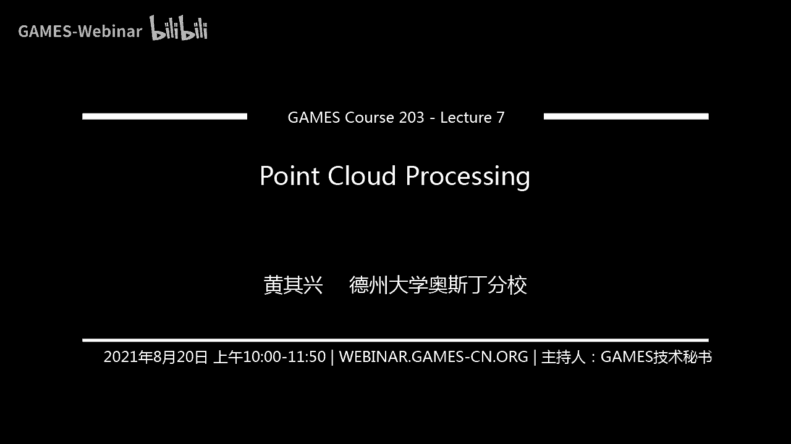
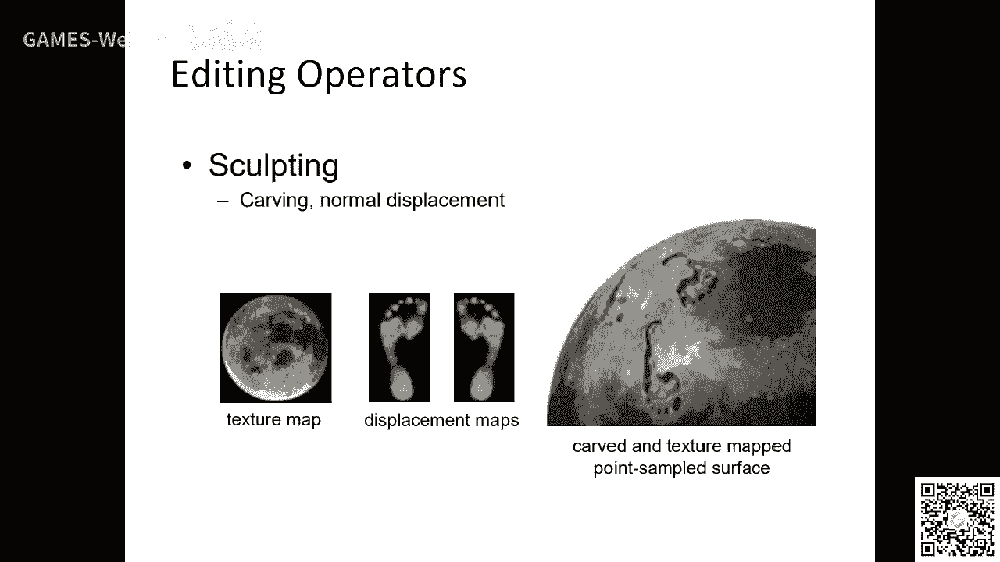
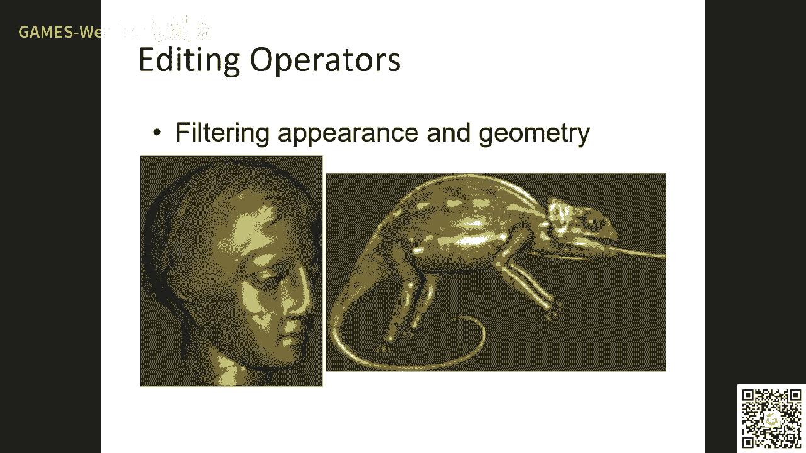
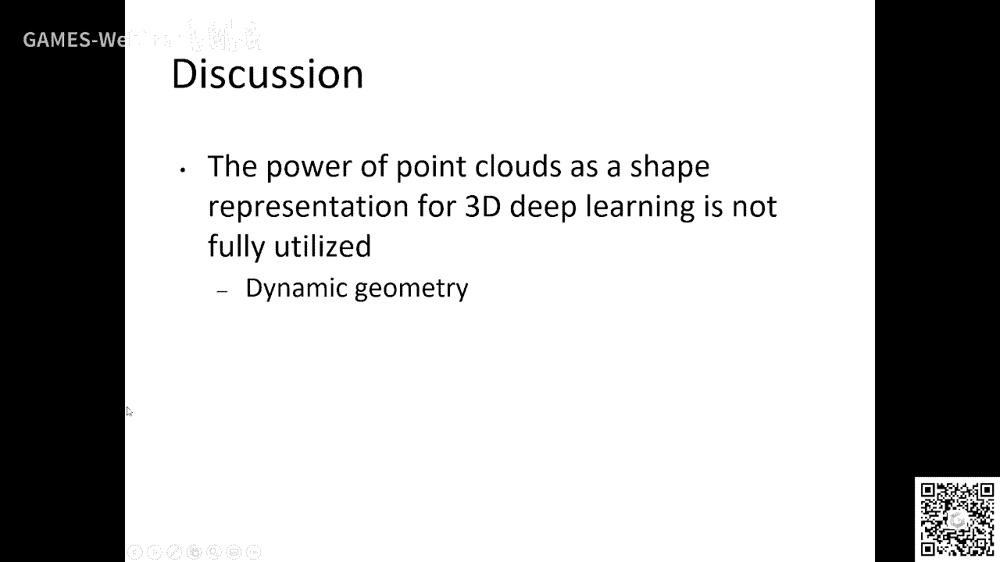

# GAMES203：三维重建和理解 - P7：点云处理基础 🧩

在本节课中，我们将学习点云处理的基础知识。点云作为一种重要的三维数据表示形式，在计算机图形学和计算机视觉中有着广泛的应用。我们将回顾几篇经典文献，了解点云处理的核心概念、基本操作以及学科发展的关键要素。

---

## 学科发展的关键要素 🏗️

上一节我们介绍了点云的基本概念，本节中我们来看看推动一个应用学科发展的关键要素。一个学科要健康发展，通常需要具备几个公认的基础设施。

以下是三个关键要素：

1.  **数据集**：需要有公开、标准的数据集供研究者使用和比较算法性能，例如 ShapeNet、ModelNet 等。
2.  **开源软件**：需要有易于获取和使用的开源软件平台，让研究者能够快速实验和验证算法。
3.  **开放性问题**：需要有明确的、开放的、可供持续探索的研究方向（Skeleton Work），以推动领域不断前进。

PointShop 3D 系统在早期就扮演了这样的角色，它提供了一个支持点云基本操作的系统，对推动点云图形学的发展起到了重要作用。

---

## 点云的基本操作与参数化 🛠️

了解了学科发展的背景后，我们来看看点云处理中一些最基本和核心的操作。其中，参数化是一个基础且重要的问题。

参数化的目标是为离散的点云表面上的每个点分配一个二维参数坐标（如 UV 坐标），从而可以像处理二维图像一样在三维表面上进行纹理贴图、绘制等操作。这通常通过求解一个优化问题来实现。

其核心公式可以表示为寻找一个映射函数 **f**，最小化映射带来的畸变：
`min Σ || L(f(p_i)) - b_i ||²`
其中，`p_i` 是三维空间中的点，`b_i` 是其对应的二维参数坐标，`L` 是拉普拉斯算子之类的平滑约束项，用于保证参数化的光滑性。

在点云上进行此类计算，需要为每个点建立局部坐标系和邻域关系。通常的步骤是：

1.  为每个点 **p** 找到其 **k 个最近邻点**。
2.  基于这些邻域点，通过主成分分析（PCA）等方法拟合一个局部切平面，并建立局部坐标系。
3.  在这个局部坐标系下，可以进行梯度的离散近似计算，从而将连续的优化问题离散化求解。

有了参数化之后，就可以在点云表面进行纹理绘制、几何编辑等高级操作。

---

## 点云的重建与重采样 🔄

当我们对点云进行编辑或变形后，点的分布可能变得不均匀，这时就需要进行重建或重采样，以恢复其表示的表面质量。

从离散点重建连续表面的核心思想是使用一组基函数进行插值或逼近。例如，使用径向基函数（RBF）：
`F(x) = Σ w_i * φ(||x - p_i||)`
其中，`φ` 是径向基函数，`w_i` 是权重，通过已知的点约束来求解。

重采样的目的是使点分布更均匀或更符合某种要求。主要有三类经典方法：

以下是三种经典的重采样方法：

*   **层次化聚类法**：自顶向下不断将点集分割成簇，直到每个簇内的点可以用一个平面很好地近似，然后用每个簇的中心点代表该簇。
*   **迭代收缩法**：自底向上不断合并距离最近的点对，用一个新的点替代它们，新点的位置和属性由被合并点的误差二次型决定，以最小化表面误差。
*   **粒子系统法**：将点视为粒子，在表面定义斥力，让粒子在斥力作用下移动直至平衡，从而得到均匀分布的点集。

这些方法各有特点：层次化聚类速度快但控制精度一般；迭代收缩法精度高但速度慢；粒子系统灵活但实现相对复杂。

---

## 点云的布尔运算与变形操作 ⚙️

点云处理的更高级应用包括布尔运算（如交、并、差）和自由变形。这些操作在三维建模中至关重要。

布尔运算的难点在于对两个点云表示的物体进行精确的分类（判断点在物体内部还是外部）以及生成高质量的交集线。一种方法是结合隐式表示（如符号距离函数 SDF）：
`classify(p) = sign(SDF_A(p)) and sign(SDF_B(p))`
通过计算点 `p` 在两个物体 SDF 上的符号，来判断其布尔运算后的归属。对于交集区域，需要在交界处进行密集的重采样以保证视觉质量。

自由变形（FFD）则是通过操纵包围物体的控制网格来间接地、平滑地变形物体。点云上的点随着其所在控制网格单元格的变形而移动。其关键是计算变形函数 **T**：
`p' = T(p) = Σ B_i(u, v, w) * q_i`
其中，`(u, v, w)` 是点 `p` 在控制网格中的局部坐标，`B_i` 是基函数（如 B-样条），`q_i` 是变形后的控制点位置。

在变形过程中，还需要处理自交检测、局部采样不足导致模型破裂等问题。动态重采样策略可以根据局部拉伸程度，在过度稀疏的区域插入新点，在过度密集的区域删除点，以维持点云的表征质量。

---

## 总结与展望 📚

本节课我们一起学习了点云处理的基础知识。我们首先探讨了推动学科发展的关键要素。接着，深入学习了点云的几个核心操作：参数化、重建与重采样、布尔运算以及自由变形。我们了解到，这些操作的核心基础在于**邻域查询**、**局部几何属性估计**（如法向、曲率）以及**将离散问题连续化/优化求解**的思维。

尽管这些技术很多来自一二十年前的经典工作，但它们构成了点云处理的基石。理解这些传统方法，不仅能帮助我们更好地理解现代点云深度网络（如 PointNet++ 中的采样、分组操作）的设计思想，也能为探索更前沿、更复杂的点云处理任务打下坚实的基础。点云处理的潜力，尤其是在复杂编辑、与深度学习结合等方面，仍有巨大的探索空间。