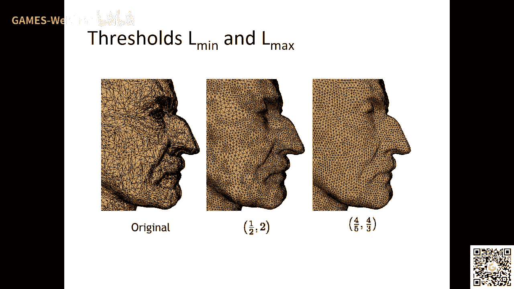
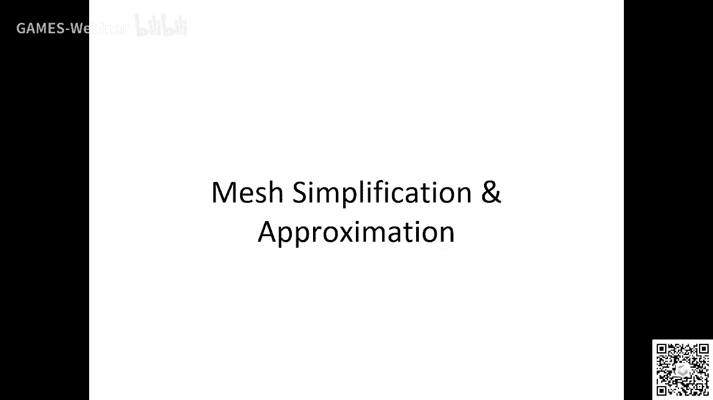
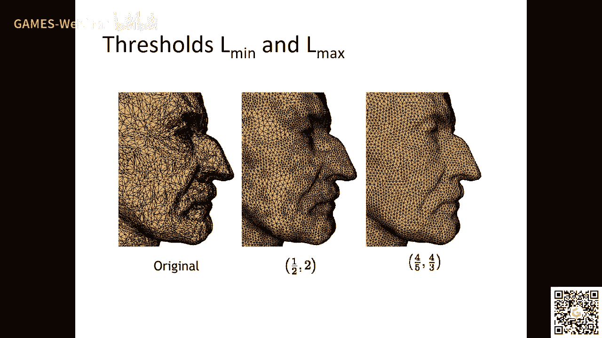
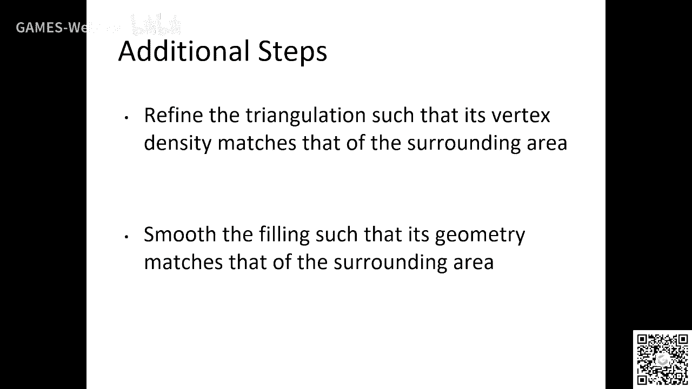
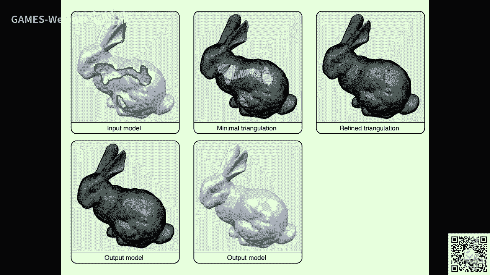

# GAMES203： 三维重建和理解 - P8：Lecture 8 Mesh Processing - GAMES-Webinar - BV1pw411d7aS

可以听到我说话是吧，大家好啊啊可可可以可以可以可以，我自走，听到了好好，那我们今天接着上课啊，那今天讲一个比较多的pov max profe，首先首先我想说一点，就是那个，我们应该怎么去学这个东西对吧。

因为立刚老师他自己讲过几个故事对吧，啊在做呢我们想强调的就是说我们想重温一下啊，当然我们会讲一些它它没有power是吧，就是说我想讲一点啊，就是说我们通过学这个东西。

其实是拓展大家的这个一个叫roy对吧，就是说拓展他的思维，就是说帮助大家将来比如说如果我们我new it was a mason对吧，呃提供一个这样的帮助对吧，其实我们后面我们学完这些东西以后。

然后我们看那个最近的这些啊，deep learning的文章是在mac上面，你会发现诶这些东西其实说白了都是一些传统的方法，给点cad过来啊，啊我只想强强调这个东西好吧，但我今天不会讲地图理啊。

我们会在第三部分去讲地图learning，我们现在要讲的就是这种传统的match boy，这种东西，对就说对啊，就是说这本书对吧，我觉得他的那个这本书写的很好，大家可以到网上找一下好了。

然后他的那个neural flies其实写的很好，这基本是从哪来的，但我会掺杂一点自己的思路给大家勾勾勾勾勾一下啊，啊你可以到网上去找这本书啊，嗯就是说这个match representation。

我们前面讲了这个for a co对吧，marepresentation，它是一个就是说它是一个就是说被广泛使用的啊，他其实就是说为什么呢。

就比如说你这个他们这个rap ban这个up your apology对吧，就是说或者就是他能就是说他能很好的去准备refine对吧，当然比较du这方面的这个这个这个poverty是是很好的啊。

就是我们今天会讲一些这方面的一些processing东西好吧，就是说你看这个地方它有flash bility对吧，就是有h的地方，你可以用大的大的那个全呃，小的圈口是没h的地方，你可以用大的拳头对吧。

他就比较flexiftable对吧，你这个东西你比如说做deep learning的时候，它就会相对来说对这方面会比较好对吧，然后然后呢同时这个影影视曲面呢它就能识破这个一倍x或者对吧。

就是说呃它是一种highway reaction，就是说如果大家要找这个，你要你找找neighbor是吧，那那你卖你编辑部mac上面的美国太平了对吧，所以用一些k进去l具体的东西对吧啊。

这是我想讲的好吧，然后那我们下面就讲一些这种皮肤的，就是给大家简单的勾勒一下对吧，就是说你比如说，这个match representation啊，它是一种，这个不好意思啊，观音下火啊。

这个match版本pation对吧，其实比如说它是什么东西，像呢啊，它首先是一种影视的表示方式对吧，ingrees对吧，coin house也是一种ingressive match呢。

他跟其实跟这个primatic surface是很像的啊，我们我们后面会简单的提一下对吧，我觉得这个东西很重要啊，那个smooth的重力对吧，他有position，有normal，还有科学性。

然后还有一种叫zen to translate message对吧，像position的话，他就做这种by centric这种incipation对吧，做这种bbc incipation对不对。

然后normal的话你可以可以对吧，你可以在那个杯子上面算normal对吧，然后做一些做一些c也可，然后normal你可以做，你可以在那个呃vertex上面放normal，做一件integration。

唉这些东西大家学random的时候都学过吧，学学rnn的时候都都学过啊，嗯对吧啊这些东西大家都会对吧，那那还有就是比如说还有一些比较重要的东西，比如distance对吧，为什么要算算diance对吧。

那你比如说你做注册的时候对吧，你比如说一个典型的一个全部的match上联网页面片，你注册的时候你需要算decent嘛对吧，你要写个decent对吧啊，有时候你做做做投影对不对。

做投影做projection对吧，你都会放list对吧，就smooth的surface呢，那你就是写这样一个franction是吧，解这样一个呃这个prime参数曲面了。

你就写一个这样的equation对吧，全都message，那就用k d c e r d d r by the rosetgg对吧，然后你在做，然后用father base bby。

就说你找一个最近的对吧，找一个那个创造全都是投影嘛对吧，找一个最近，这些东西我觉得大家我希望大家那个我我没在烧饭啊，我我我在这三点开始，那个我也不知道了啊，我们大家都是都是骗人，这个好。

然后呢还有一些东西要注意的呢，就是说比如说你作为一个体面的自动graphic角度来说，就是编辑对吧，我想讲的比如说这个b样条曲面是编起来就是帅帅这个这个那个control point，对吧，嗯对啊。

只要the control point match呢，实际上呢他赚的是什么呢，它实际上它是这个东西，我们就没法讲啊，他这样转圈，我们讲那个match的，比如说呃这个ing的时候。

我们会讲一些diss learning的方法，还是然后那个对吧，我们那个我们这边也有一些这种下水，因为下个月就这些东西，就是看直播，就是追风方面，ation要帮助chrome。

还有就是这种mesh data structures对吧，然后就是说这个这方面呢以后我们会讲，然后就是这种match data structure，how to spend duty。

是用compact stories这些东西呢，我想简单讲一下，为什么呢，就说，对吧，大家大家都是喜欢点名对吧，为什么点一点呢。

这个class point和这个point这个这个这个是很那个什么东西的对吧，然后这个match呢，这个structures呢它实际的话叫做它有它有一定的这个拓扑的那个concertop了。

这个conce对吧，他有这种top logic contrain，对不对，然后，比如说你看他对吧，他他这个第二啊那个点啊，这个是怎么连的，它要满足下cc对吧对吧，诶然后呢你有了这些考性的话。

你还要你还有一个c叫你要做成这种definition的这种呃，这种这上面这种navigation这种这些东西对吧，对不对，对不对，对吧，那那就是说这个怎么去处理这个dh c的标准。

所以这个怎么选这个这个就很重要了对吧，说我们将来想简化同in简化，把一些要点扔掉就可以了对吧，不用管它是怎么相连的，你mac的话，你不能随便说，我把这个我猜肯定扔掉对吧，你还要对吧。

所以最后你先出来以后还要这个match对吧，哎这个东西我觉得就就就比较对吧，比如说啊我我我个人想想这些东西，就是说比如说你现在大家如果抵抗一个牛奶work去做cpation，去做dba的话对吧。

唉这个的话那就就比较那个什么了，对吧对吧，这个地方就比较比较小了对吧对吧，就需要保持这个mac的这种那march一般怎么传呢，你随便no的话，他们也只能上个s gl，它就是这么黑色对吧啊。

他没有含在具体对吧，你要不进来的话，需要把这些点进去点缀去对对，去去去那个去去那个real站对，去点赞，去抽取这种match的连接关系对吧，你像c罗在下o b g o f f这些东西对吧。

what time what time is it on base water english，这些东西的话相对来说它就呃他就比较复杂了对吧，就相对来说比较复杂啊，啊他一个人跟conce对吧。

就是你点它就是坐标都挤给你了，对吧，但是呢这个它东西它是没有这个啊，没有这个点对吧，就是点的navel对吧，它是这个每个圈口，它是给了一个点in dex，这个相对来说这是用的最多的一种。

用的最多的一种存储方式对吧，但有时存一般在o p g和那个oa f f都给你的是那个呃那个阿斯玛的，我们对吧，你像p层层p o y的话能更狠一点啊，层层真的繁荣也行，好然后然后下面就是讲一些这个标的。

就说你比如说我们首先想想要支持什么样的运算，这个啊，比如说我举个例子，比如说你可以去看一下，比如说max 0 n对吧，那可能是h队，对不对啊。

这种这种这种结构对吧啊啊那那the interesting question，就是你怎么能能不能搞成face或者what tex这个face connect对吧，哎这个是比较阴沉的对吧，就是说你要对吧。

做simplification的时候，能不能能不能这个data structure，能不能去保持这个，对吧，那那比如说facebook pvp就是你有我在还有position对吧。

然后那个negrand zip对吧，然后每个face呢它有三个vis，它有三个face neighbor，对不对，就是说对吧，这证有了这些东西的话呢，呃你就会发现呃你就能比如说给定一个face。

你能你能给定一个点，对不对，你能找到什么，你能找到他的那个negr对吧，他的黄米news对吧，其实啊比如说大家如果做match，但我现在是可能从不立刚老师讲过的一些东西。

但是就是说我我感觉你你熟悉这个max c的需要选对吧，你第一件事要做的就是写一个算法对吧，把你这个每个点周围的这个完美neighbourhood给变一点，对吧，哎能把这个东西做好。

我觉得基本上你对这个呃dao上谁会有一个初步的了解，初步的了解，edge分级分析呢它相对来说它不是那么，已知省的啊，这就是就是说你需要存一些呃很多东西对吧。

比如说那个我tx它一个ition有一个一个对吧，就是初始那个每个h呢它有两个我在对他有两个相邻的飞行，还有四个那个什么还有四个对吧，你看看这个图，还有四个像你们这对吧。

每个face的话相对来说它有它有一个第一个，用的比较常见的啊，用的比较常见的是一个，对吧，实际上它是一个就是说他是一个那个用的最多的话，就是说用的最多的一种一种数据结构啊。

啊它实际上呢就是说它不是最efficient啊，不是最effici，但是呢呃但是呢它有一个trade，就是说你你你做便秘的时候对吧，做便秘的时候，比如找妈妈那个我他就是说你要快，对不对。

那你这个c 12 c compact对不对，你要看你这个data的时间就考考反派对吧，你如果如果如果那个哦你要换你这个data的资料相对来说就不卡带，你就传的东西更多嘛。

如果你要这个data只要有compact的话，那你下不来说，那你的给你的速度就会减加起来对吧，下载啊，对这个half edge tf h c是他的case，它它的结构是这样的。

有个我在他有个position，然后有一个哈佛h出来对吧，每个huh呢它有个初始的我才对吧，它的它的这个half为是orange的，它的这个哈佛h左边会有一个背对吧。

然后呢呃这个half edge呢还会有一个dual对吧，就是一个half edge是从比如同在这个红的对不对，红的这个耗费，然后呢回过头来对吧，他有个train是吧，一般情况下是吧。

哎就存一个这样的东西对吧，这样的话呢你就能建立，比如说比如说我们这个讲这个亡灵的小伙手都要用哈佛来做对吧，你杀了我这个活塞对吧，你首先找一个how show edge，对不对，对不对，对吧。

然后你怎么做呢，然后你就找到那个object hob对吧，对不对，所以odd half呢，然后呢你就再找一个，比如说net hobby，对不对，nt就是nt对吧。

就是这个东西一个half在左边这个tl的那个next habit，对不对，然后你再找到这个呃这个opti，你找到就找找找到这个object，然后你就能找到这个火柴对吧，就找人找到他的火柴对吧。

它就是一种这样的电力结构啊，这个东西我最开始做这个，b o b b就是那个beat和wifi对吧，就是这个这个这个存存储有多大啊，我需要多大的存储，对这个半边结构啊。

就是这样不断的那个那个那个那个房对吧，就是这样不断的弄对吧，然后how far is hama splibrary的机构对吧，of mesh，对这些东西都都是有意义，都是有用的。

这个这个hoge的这种struction嗯，我看看，哈弗h的话就是说如果你要编你一个外面那个的话，它可以基本上是这款size的，同时能帮你做这个便利的一种内struction，嗯，我说这件事情吧。

就是说现在你这个存储这么这么大，实际上好多时候就是真的，就比如说你像gpu的processing，它不仅不是为了呃这种呃compressive的这种方式去存储，就是说像是gpu。

就是说我我就需要有这种vadvice structure对吧，你真的很快的学生，你像这种match啊，为什么会有half edge出来，就是因为这都是34年前开始，大家开始研究过，那个时候计算机。

就比如我开始读书的时候对吧，那个时候的那个计算机的那个mary是很limited对吧，你把一个mac能减那个30%，50%，那都是很了不起对吧，就能多漏的一些那个东西对吧。

现在的话我感觉你就拿我个人来说吧，我最开始写c加加程序的时候，那什么东西都要写得简单edition对吧，那那就看功夫对吧，你现在作品设计大师都用mac up，对不对，相对来说就不那么讲究了对吧。

不那么讲究了，但是对吧，但是就是这种哈弗h杯的rap当然很有用，很有用，你说啊，对我知道力刚老师的面面面写话作业用了这个东西，哎这个我知道力刚老师给你讲过，但是我还是想作为一个完善的东西。

大家呃简单讲讲立刻老师讲过的未婚几何吗，不知道是吧，好那我简单跟大家再讲讲微分几何，微分几何，首先我要讲两点啊，没有讲过，这里有点奇怪吗，那我简单的给大家，那那我觉得我讲的这个东西。

那就简单给大家呃勾画一下，就是微分几何呢实际上是什么呢，是就是说算曲面上的一些一些简单的power啊，对这个match processing它是很有用的啊，微分几何。

你像这种principal directions，对这些东西其实在那个mac上面做那个deep learning的时候，他也是我们也是用的很多的啊，最近的一些工作，对吧，一般就只要去收费水对吧。

我就是说实际上是这个对吧，u v对吧，就是说你从一个一个一个primer primal main到一个到一个设备上面，对吧对吧，诶他是研究一种这种参数曲面，对不对。

参数曲面的话它就有很多quality对吧，比如说像这种猫猫对不对，还有这种猫猫对吧，你比如说像这种这个啊这个这个这个normal嘛对吧，嗯我们讲过这个point pro上面怎么算normal对吧。

然后实际上这个呃严格意义上来说呢，就是嗯那个东西呢是一个就是一个近视吧，就是如果你有一个连续曲面，那么连续曲面呢说这个x等于x y等于y，z等于21x y加y等于吧对吧，这是一个二次曲面对吧。

normal呢实际上就是说我们首先要定义这个tension direction对吧，就是说他有一个有有一个plane，对不对，他刚好在这个点呢跟这个service touch，讲了是吧。

那我跟大家复习一下也没关系，他这就是猫猫啊，那讲的更好对吧，你是不是想让大家都忘了对吧，我觉得对，然后那个这是这是momo对吧，他就实际上呢你注意点，我们讲那个motion的时候想过对吧，就是说。

一个normal，一个normal跟一个平面有两个vip，这个平面垂直怎么说呢，是把这两个tension direction做一个cost for就得了。

这个motion啊啊然后呢你这个notion就是normal curvature对吧，什么是normal curvature呢，就是你给定了一个normal，然后你找一个平面，对不对对。

跟这个normal含在这个logo，然后这个平面跟这个service相交出一条线，对不对，相交相交出一条线，然后这条线的话如果跟这个呃，那我们就可以在这个线这个点上面算这个算这个qq群对吧。

算这个qq群对吧，像这个科学群，这个曲面上的收费群对吧，曲面这个点的收费群就是你找一个一个球，对不对，一个琴一个c口对吧，你这个c口跟这个曲线是相交，然后它是它是吻合的，很好对吧。

他就三个毛的领域也是一样的话，那他的courage就是这个这个circle的半径的invert啊，这就是courage啊对吧，所以你如果如果你越那个曲线越弯曲，那你这个球的raid越小都会选就越大啊。

就是这个东西这都是很重要的啊，就是说然后呢service provision呢它有它有一个mac cof，什么covision，就是沿着这个你这个平面，沿着这个平面转的时候对吧，这个科学有发生改变。

那有两个最大值，有两个最小的对吧，然后还有一个东西就是courage对吧，minerature对吧，还有一个就是高in qq群对吧，ging qq群就这两个兵的非常那个那个非主qq群的相乘对吧。

啊这个service servation对吧，然后princial servation呢它有一个公司，就是说就是那个minimal和mathematcher，它是像它是垂直的啊。

就是这个direction它是垂直的，然后你转的时候呢，实际上这个这个这个没关系，所有钱他会呃他会这个变了变的话，它是满足一个这样的公式，就扩散形，记得叫暂停，然后b对吧。

现在就是angle名词k k k one对吧，那就这样一个条件啊，啊这样一个条件，然后啊为什么要上principal quality，good question对吧。

比如说你在一个下颌edge的地方对吧，然后你the principle direction，那你去跟那个下面age of mind啊，非常好啊，非常好那个，然后非常好啊，好这就是一点点简单的那个知识。

其中这个curse这个东西啊对吧，你可以看看这个这个就是那个iso对吧，就是所有的线上面的各位都一样对吧，可以算得平均算两个相乘对吧，然后你看这个作用就大于2x traffic的，你够用。

order action对吧，还有x shy哎，对吧，你像这种princible direction，你注意一点，就是principal direction，你像那种那种东西对吧，就是说那个。

就是这个啊，这就是有ation就沿着细的发展到一个地方，去年的一个大的方向，就是你做design的时候，比如我们做mc的时候，最后做qumc，做这期我肯定是希望这些the reaction什么东西呢。

他都跟这个跟这个fish要要很好吧，这样的话我们这样的话这个这个对吧，比较美观好，然后不管是数学系的学这个微分几何啊，还是我们计算机系的啊，本人也是计算机系的，但本人懂一点顺序。

不管是数学系的还是计算机的学员，微分几何最重要的一个东西就是这个搞混nga啊，嗯当然如果你学的跟那个系以后呢，分很多了，怎么说，只要是学了各种东西的，这个这个喜欢magic flow啊。

就是你最开始入门写的话，其实数学系跟这个计算机都一样是吧，只是对这个高速博那些人的理解不一样对吧，理解不一样啊，反正怎么说呢，就是高斯和那个新闻，他就说这个，就是这个高斯曲率对吧，就比如说你这个球对吧。

球上面所谓的高斯那个curry是吧，如果你的radio是第一的话，高科学都是对吧，那你求积分，那就是球面的面积是四派对吧，这个cosport nc说的是什么意思呢，他是说啊就是说你不管这个曲面怎么变化。

deform对不对，你这个integration of the government courage，它永远是，诶这个比较重要，诶这个比较重要啊，这个是比较重要的。

对啊哎这个东西呢呃其实他有很深刻的道理，很深刻的道理就是可是我这里当然不讲，但是我我比如说告诉我，那feel了他跟什么东西可以建立等价关系呢，哎这个东西跟这比同一学就有关系。

就是他跟这个欧拉公式清理等价关系，就是number british techno mah，加上number basic，这个东西呢这个东西，它是什么东西，这个东西它实际上就是它是一个top变量啊。

也就是说一个曲面那个那个全部max，你不管怎么做简化对吧，大家待会儿会讲，不管怎么做简化，不管怎么样对吧，你怎么去做对吧，你这个东西这个量是不变的啊，而这个东西呢其实就引入了一个什么呢。

就是discrete sign of geometry啊，就是说calculus这些东西，那我们就可以用一种在高速曲率曲率，这个是联系的情况下定义的对吧。

我们也可以在离散的情况下去离散的情况下去定义的啊，定义这个东西啊，我看看，高斯博那个新闻的定理在在b g上面有哪些应用重建不，高斯博内cen就是它是用来去定义，就是隐身定义，就叫做离散的备份几何。

就比如说我在网格上面怎么算那个那个曲率，同时呢使得这个曲率呢他还满足这个这个高斯博内fm对吧，实际上那个选项就是欧拉定理嘛，就v7 t加f我是这个意思啊，就实际上就是说这有什么好处呢。

就是说比如说我们现在做在网格上面做这个visio simulation，就比如说你这个fc station equation，他是在连续的情况下定义好的，你在网络上怎么去理想化。

使得你这个polily是要满足的话，哎你就从这个就是说你需要定义重新的网格上去定一些量对吧，他要满足这些properties对吧，嗯嗯我觉得这个是比较重要的，你在网格上算曲率对吧，有多种算法。

只用一种算法，比如说你做b具有什么ation的时候，它它整体它能保持一些那个在连续上的一些结构啊，这个东西怎么来，你就从这个离散啊，我先来啊，他是引入了一个一个学科一个体系啊，他引入了一个体系啊。

这个东西呢我是没法讲的，我希望谁，比如说黄静老师，到时候你可以给他发一秒，用来讲这个东西，第一个老师我不知道讲没讲了，一个，然后我们休息两分钟好吧，然后我们接着讲那个smoothing好吧。

我们今天在两次休息啊，那个鹦鹉今天稍微有点那个好吧，那我们过两分钟我们再接着讲啊，嗯嗯，哈哈哈，啊，好我们接着讲smoothing啊，那个就是就是光滑的吧，实际上就是这是一种大家如果学过信号处理的话啊。

这肯定是对这个词比较熟悉的，那mac上面smoking对吧，他肯定跟deep new net相关对吧，你像他是为什么相关呢，你们知道这个，为什么相关你们知道这个为什么这个跟那个。

这个deep learning相关有谁能回答吗，没错非常好，convolution啊，非常好，the moon就是convolution啊，那如果我们能在mac上面把这个头部给搞错了对吧。

方便大家在mac上面举的举报不及使用那种好了，非常好啊，这个嗯我对这个回答非常满意啊，那smoothly呢它有很多种方式对吧，比如说有一点注意，就比如说你在麦上面做跑车，那嗯其实其实很多东西他考研。

因为几十年来的就是idea嘛，这些idea音mage，那你看看对吧，比如说音mage里面怎么做smoothing呢，有很多种方式对吧，我这个地方简单给大家提两种吧，一种是拉普拉斯的这种，对不对。

那实际上就是说呃对吧，这个这个s它它随着自己就是不断的，它是个苍蝇吧，然后这个x对t求偏导对吧，它是等于这个六乘以这个拉拉of的是拉普拉星奥会的对吧，呃那个就这样子对吧。

can mulation of the meal，它是一个确定con对吧，然后这样的话呢对吧，你就随着时间变化的测试东西会变成什么，变得越来越不对吧，最后只要这个什么知道这个是德尔塔x他是零八对吧。

他是拉出现，我会的，他是零八，这是一种smoothing的方式对吧，就这就引入了这个mflush morning是吧，它是这种就是每一个pi对吧，每个我type pi。

我现在每个点周围算这个这个这个这个这个像这个得到pi的这个东西，很有意思啊，这个东西就是说就是每个点减去周围的那个one negrp对吧，的平均对吧，这就得上p啊，当然你怎么做平均。

你如果是mmc是100g的话，我们还需要就是有一些别的病对吧，实际上怎么在mac上面放拉普拉斯，我希望立刚老师应该讲过这个东西，这个东西的话嗯，用的最多的一种叫做cotgc啊啊就是供贴纸面的大哥啊。

共切法则吧，好吧哎然后呢你就算这个基准，然后呢你就把这个点的点的这个基本一下是吧，但是他就得到了一个新口的outplay room对吧，就可这是一个simple example对吧。

但是这有很多那个上下上下的这些东西是那个simple是吧，然后，对吧，然后你就是在每个每个点上面算一个depress对吧，然后，对吧，对吧，然后然后就是简单的ctrl就行，然后他就变一下。

这就是一个这样的东西对吧，然后你算上一个display是吧，再再变一下，再上一个电影，最后他就变得官网了，就变得官网还这个拉拉，真是我说在这个看上面这个对黄的时间。

就表示这个很to vision ma对啊，最后就变成这样子，这是一种模拟的方式啊对吧，你可以想想这个东西怎么去用，用这个东西来做这个啊，deep new network对吧，就是说怎么用。

所以想想就是说现在这个一个很简单的东西，我平时都在想，就是说这个拉胯选好推吧，可以可以把这个拉布拉自我with这个这个调查对吧，变成trainable，这样的话你就可以翻一个，可能我原来我去做什么。

去做这个别的computation好吧，啊我我非常同意啊，这个这个这个这个学学那个回到考古ution啊，所以说我觉得这方面的工作你可以看看，9m这个地方也相相相对来说不多啊，相对来说不多。

特别是怎么在这个irregular的网格上面，咱们把这个convolution啊这些东西做好，哎，这不是那么一个简单的事情，我觉得这方面的工作很少啊，我觉得做好了以后。

至少这个match上面的anything的这个这个东西我觉得会有一个飞跃啊，反正这个东西录像我有通话说对吧，我个人的感觉就是大家应该做这个东西啊，那发生什么事。

下面一个东西就是curvature flow对，就是commercial independent of transition对吧，就是啊这个东西很有意思对吧。

那flow information就是说哪个点呢，我沿着法线方向，我根据这个科学对吧，就mk对吧，就是根据这个科学对吧，就h是什么东西，叫做mcrash，就两个东西的平均对吧，对吧，实际上就是说呃。

在这里flow equation就是这样的，ingredient就是拉普拉斯是吧，他那个那最后他的一个ument实际上就是一个没什么设备啊，没什么设备，就是说他你可以通过这个方方式去做什么型啊。

做什么事，这叫cocflow啊，对啊，就是cvt的话，那我们就需要mean curvature flow macrage fc，这样对吧，use this to a flush operator。

就算我们courage就是这种display defense，这样这个东西最后呢实际上它也起到一种墨子的效果，下午你说你病了对吧，这个嗯然后你做这个这个是吧，或者这边对，就做这种风景的话。

就能得到一些啊不错的这个曲面啊，呃不同skin得到的结果当然不一样对吧，不同skin这个结果不一样，但同时他们都很默契啊，另外一方面就是说这个skin差的不是那么大啊，他的不是想象中的那么差，对啊。

当然还有一些别的方法对吧，做什么事对吧，你可以做这种各种各样的人的需求，还有各种喷的，体会过这，这些都是做ping的方法方法啊，啊我个人感觉啊，你们如果谁想在那个mac上面把这个地图能做好啊。

你把这个smoothing搞明白啊，我觉得帮助是很大的啊，我这个地方只能给你开个头啊，只能给你简单的简单的开个头啊，我不是嗯，我希望大家注意这个东西，抛砖引玉吧，好吧，我后面要讲的东西很多啊，就是。

再讲一遍嘛，就是如果大家想在mac上面做这个顶，等你的话，把smoothing的东西啊，这些方法，特别是这个smooth这个扇子是怎么在mac上面定义的，咱们把它搞清楚。

我觉得对大家就是正好在曲面上编辑啊，做一些editing啊，deformation啊，用deep learning来做，我觉得应该有很多东西可以做的，有很多东西可以做的，讲了the movie啊。

呃你们有什么问题吗，扇子的话你需要去看书啊，我希望立刚老师讲过啊，具体是怎么定义的，什么cosine定义这些东西，没有，那我就接着往前讲，那第三个我要讲的那个time remash这个东西呢。

上节课我们讲了那个point cod这种30对吧，就是我们如比如说我们如果一个东西到底deformation比较大了，那么我们就需要把这个点给重新的点去选择一下，对不对对吧。

比如说网格上就是做reaction对吧，要remax做是吧，那就是，replay actually starman by strones，这个立刚老师讲过没有讲过这个reaction。

现在大家不提这个东西啊，不提这个东西啊，这remac呢有很多种结构呢，什么regular或者stra的，比如说每个点对吧，比如说你看左边这个match，他的问题就是很多点。

他比如说他有多少个neighbor的，有没有五个，有七个，平均下来应该是六个对吧，那右边那个match就是平均下来每个点周围的内部都是六对吧，少部分有五个，少部分有七个对吧，这样，对吧，be mine。

还有很多很多东西，现在还是在研究啊，总之呢就是要有一个这么will shift the element，will shift element，这个东西呢它是做比如说我们做做设计啊，做rror的时候。

特别是做simulation的时候啊，有时候比如说你做这个，比如说你是就是微分算子对吧，比如说在mac上面算算算这个qq群，这个will charge match，相对来说它的这个误差就要小很多啊。

will sharch它的误差就小很多啊，所以remax大概提到一个就是说对这里讲for posers and secretation，有没有ical stability里就是对吧。

哎这方面这是很重要的啊，然后就是etmoptimization，对，这是做这个reaction一种最最常见的这种这种方法，啊啊啊这个那个微软的浏阳老师对他做过很多这方面的工作啊，文明老师做过很多啊。

其实有时呃一种情况就是说我总之呢就是这个mmage它也比较复杂啊，就是说从优化的角度来说，你不断的你首先你要improve这个what tech ribution对吧，就是说你要让这个这个全国的大小的。

因为是what ribution就决定了这个全国的这种对吧，你同时还有这个offset这种match可能低于t对吧对吧，这都是很很很难的问题，一般情况下怎么做呢，他就是说就是optimate对吧。

就是说你首先优化这个match的，what is ribution，看看能不能我们能做一些这种这个口头log的对吧，你比如说你把这个flip一下，就能改变这个就regularity，对不对。

对不就是one of bance edge，please，对吧，嗯，然后呢你能不能我们能不能uniform，这个我看比如说每个点都是他周围的那个点，跟周围那些点的那个呃irish的地方，他要尽量进对吧。

这样它的那个地形就选择这种就叫叫做and your smoothing not not break吧，好吧对吧，比如说local reaction opera operators吧。

只有一个你可以做一个edge plus，你可以做一个我们edge sleep对吧，你可以做这个edge sleep是吧，看这个地方要ley一下它，它它就更regular吧。

可以做一个modex的这个sheet，对相对来说它它它的那个他don't graduate，对不过才，这样的工作呢像not coffee对吧，他们早期的一些工作跟这个很相关对吧，这是一种相对来说。

所以你纠结的方式，对你纠结的方式。

比如说你还可以考虑一下，比如说我们可以有些小的lv max，就比如说你最长那边跟队长那边那个比值对不对，你要满足满足一定的条件对吧，你可以看出就是说你越来越fensible。

它相对来说它就越来越来越矛盾，上你越regular的话，相对来说就比较有个sofm，有个solid叫做to your magic bur，有麦你现在可能是sos的，也不慢啊，那以前那个扫帚做的非常好。

我觉得这方面特别在这种，现在现在如果大家用，大家如果对这个东西想亲身体验一下，我建议大家当了一个match model，有个有个操作叫match la。

你可以把那个可以把这个东西弄到mac app里面去做一些processing。

这是reaction，reaction的话，我没多讲这方面的工作嗯，还有很多别的吧，嗯但是我觉得这个跟d不能理，我是不是特别相关，就不好说了啊，但是说从max的这个角度来说，这是一个很重要的东西啊。

你比如说嗯嗯一点比较重的，比如说我们如果做这个match呃，做这个这个这个match base牛奶的话对吧，你像mac对不怎么保持这个match reguarity。

我们在这个变形的过程中真是很重要的很重要的这个很重要的。

然后呢就是这个match simplification of potation，这个我要多讲讲啊，我知道力刚老师讲过啊，我知道力刚老师讲过，但是我还是要强调的，就是说什么呢。

就是这个东西是这个metric processing的核心的东西，简化prostation啊，这是核心的东西，你看那个math型，那个deep deep architor对吧，你仔细去读的话对吧。

我觉得应该是现在match应该是做的比较好吧，mad你会发现它其实跟cc cccation相关的，ccc相关的，就是这样对吧，就是你给另一个mesh，对不对，然后你要找一个呃另外一个match对吧。

他们两个之间的距离要很近，对不对，同时呢你那个新字很match呢，他的那个那个减的热度可能又少对吧，当然你还会有一些别的考string对吧，嗯别的场券的我这样会讲对吧，这不是fm呢。

非常非常难对非常非常难，但一般情况现在怎么不行，那就是我找一个神话就弄我这个抓捕就有可能选，对吧，look for example of timal solution，对吧，嗯然后呢。

我们还有respect，additional fans和电源，是综合解决，选选个sh，这不对吧，这些东西也可以，对吧，这些东西都是很重要的啊，这些东西都是很重要的啊，那一般情况下呢就是说有两种算法。

第一种算法呢啊当然还有别的，还有更多的主要就两种算法，第二章法就是motet crossing，这个东西呢从哪来的呢，他首先是从match里面来的啊，然后呢我们上节课讲那个风和我讲对吧，哎这个东西呢。

于是其实如果大家做神秘地进什么，你做的多的话，你会发现这个东西其实大家也可以做到那个什么用到这个deep learning，你用在这个地方一点。

你可以做这种这这这你说狂卡顿其实就跟那个max风有很相关对吧，你是在所有的点里面找右边三对吧，唉，对这种我讲这个东西虽然最终肯定是会进不得你服务的啊对吧，跟金刚老师那个课程那个go是不一样的，对吧。

但是我对任何一个operation对吧，这就是我为什么要大家学以前这个问题，要大家学以前的东西，就是这个原因啊，就是我觉得这些东西很重要对吧，你把它稍微稍微看一下，我觉得这对相关。

那这个其实你做sification对吧，实际上是什么，就是conution嘛，你看not in对吧，他就在上面做simpication，做这做sification对吧，同时还做了一个什么。

他这个nt恤做了一些变化对吧，就说这些东西这都是很有意思啊，就是说显示微信你怎么做cro水呢，你就对吧，你就是找一个那个registration，对不对，然后呢你把这个所有的对吧。

就比如说一个unit three green，然后你max what time to cross the sales对吧，然后就compurebred mesh，然后做错了就清楚对吧啊。

这些东西这都是多少了对吧，然后我们上上节课讲这个东西对吧，就是说你可以说有有这种ratic的课，上节课讲这个，我说大家记得的话，就是说不让说pc对不对，如果这个pp a的那个哦，它大于某个东西。

那我们就继续做细分对吧，那就是这个top down，我们也可以做官方二，对不对，就是不断的默契点是吧，如果他们能被一个平面对吧，然后你就做cc以后呢，然后下面你就做了这个representing对吧。

你就做了cos以后，你要找一个三九对吧，这就是麦克风也很像吧，但是就喜欢那这些，这个怎么computer呢，它就有average mediyour，apoge，就是你要去去算对吧对吧。

你看你可以有一个orange mother tradition对吧，你可以用no pauid是吧，你可以用medium tx tradition of se，还可以用那个ao ji js对吧对吧。

像这些东西，对啊就是so refly啊，我简单讲一下这个哎呦，我觉我上大学课没讲mc jin，实际上呢我就是我们传达一个就是gradiance v对吧。

就是说比如我们金库的每个cho它都有一个gradient fession是吧，这个东西用的很多了，不用做就做注册的时候用对吧，现在做简化也用对吧，嗯做简化，因为我发现我个人感觉我看这玩这个看20年了。

我感觉就跟vision一样啊，我带的这个ut我是叫cg视觉啊，真的是那个我不相信不能演啊，教教了，这视觉，今天第一节课，下午刚上完课，对，是真正在graphic的原因分手这个id这么几个啊，不多啊。

注册用对吧，那个算那个sification也用对吧，有时候做vision of saoration吧，还用对吧，这就很硬，确实，实际上就是说对吧对gredients to play对吧。

就是说有一个啊你可以说给定一个平面，给定一个平面，你可以算一个点到这个平面的距离平方对吧，哎这个可以表示成一个那种fashion对四的时候对对吧。

然后呢然后呢然后就说你可以上这个dance to water play，就很多个play，对不对，很多个play，然后，比如说你你有很多play是吧，你要把它刷摩尔和移动play对吧。

那这个怎么办呢对吧，比如说一个点要summer一个surface pen，一个mac和pad怎么办呢，这个点到所有的这个费，这个city don最小的那个东西，对你找个中文，那你就需要一个这个。

因为你这个第四层来去，如果这是一个可加分的话，他有这个他要加入这个事情，所以都求和在一起的，还是可加就放，所以就是说你做mod的时候，只要tx就是你对应的这个c它的一个国家这个form就可以了，对不对。

不需要把每个被子的国家里后再重启一下，就没有必要知道不断的update这个东西就可以对吧，然后你有了这个东西，你就写一个那个应该的对吧，对吧，然后你就可以算了是吧，平面对吧。

你所有的点废纸的平面都一样嘛，那你这个最后你简化以后的这个点就一定什么，一定是在原来那个平面上的对吧，这样你就能保持保持这个，你用meeting，用allergy，你会有一些走样就走样对吧。

为什么这个errock和drag还是相对来说比较popy的，最后到4000多的fpx啊，那你computer一个reactive对吧，我再再强调一下，首先就是你决定哪些点应该可以吃吧，对对吧。

那些免费卡手的时候呢，我会算那些到对应那几点相关的那些废那个square system对吧，就是point to play this，我去找求一个解一个4x4的这个linuber啊。

我去得到那个点的那个线的坐标是好，有了图拉斯以后，那我们现在就决定哪些卡组相连对吧，那这个时候呢就看哪些东西是原来那些那个也是他们建的项目的，那你就把他们在一起，这个water classing。

它是非常efficient，其实我觉得就是做and understanding的这种new network，你不需要保，最后你不需要保持这个mesh的ppology对吧，你只需要最后得到一个level。

对不对，对吧嗯，然后那个，这个时候呢这个国太要是算了就比较好啊，这就比较，不能不能保住这个manifo，复杂一点的呢，怎么说你也能保持一个medical infermemory。

就是你在这里简化的过程中，我永远保持mani，每一步呢我做一个小的改动啊对吧，这个东西呢现在来说你在cosprmsi的全麦，这个就用的比较多对吧，可能比较多。

其实我set up就这样to repeat peking in the mesh，vision of a quality to make sure that kill no problem。

we are f对啊，the gredient of认什么就for each vision是吧，very quality of mission对吧，然后就是找那个最，是啊。

还有还有就是要做一些格罗布l control对吧，convention operators对吧，首先要保证在哪个位置是吧，我这个地方可能稍微讲的快一点，因为我刚刚上。

然后就说我们还有就是呃那一般情况下就是说我们怎么办呢，比如说嗯我们从最简单来对吧，然后看看哪种东西，哪种方法都叫不动给另一个网格对吧，你首先实在是玩，那就不是吧，那那你就。

lily这个这个文太平洋把他的所有相关的东西分解，然后呢你在b后这种办法对吧，那这种办法相对来说也不那么flash是吧，flab flash是吧，但实际上就是说，eration对吧。

他就是说他说他他就是我这个号对吧，但是他们的toyal degree of me是吧，哎这种东西不是用的最多的，这种东西呢你就是把这作为edge club对吧。

你就是把这个merge to js chang new world exhibition，准备就是用的最多的，就是说你把两个我再把它磨成了一个，然后同时呢把你determinal location啊。

这种东西是最多的，还有一种就是呃这是一个extreme，可是对这个class one and point，它是一个special vocal，special edge club。

没有degree of freedom对吧，the one of the operate for haledge，这种相对来说用的就比较多。

这个这个max呢它的logo和max是这就是computer energy thing，no，comparison of no，这样的这种呢，就比如说你像这种呃。

simple fication eminal对吧，就是说你要不就是给定一个初始的n，然后你会定一个一个区间才能走向开始，还有这种to thank you的时候。

house of business none of，要是d a b等于，一般情况下我们现在的softw不会用gloo global的，相对来说你们知道为什么要用global的吗，操作我才福利的。

我们必须存对吧，必须存这个什么东西，是是我们必须存取这个history，否则没法做，可以嘛对吧，就是你把如果它推成两个对吧，但是你要determine，如果如果我们不存那个奥运的话，再说是没法做的。

大家知道为什么要做global error magic，我问下一个问题，就是为什么会有一个什么什么这个这个概念对吧，应该选emo，我们为什么要做这个事情，大家想一想，回回你们有谁能回答吗。

不是spa partnation是有一个自销的问题，就是说本来比如说你原来有个mac对吧，有两个区域离得非常近是吧，他不不想交，但是离得非常近，如果没有global air contcontrol的话。

你不ation的时候，你include的那个match啊，很有可能是直销的，你懂我意思吧，有可能是直销的，要解决这个问题，就需要这种slover era control这个东西，大家是要，注意的啊。

比如说做做牛奶work，你在mac上面做commodation，你不是说不希望改变逃跑的结，他就是说你比如说两个两个两个区间，他他自交了对吧，鼻子左边这个手跟右边那个手对吧。

你比如说一个max的model，两个手离得很近对吧，做simplication做完以后，他很有可能就死掉了，如果不做这个global air control的话。

你包括做match convolution，不解决好这个问题，不，然后他有一个对吧，有个这个这个这个问题，现在我30号说对吧，它就容易容易出这个东西对吧，它就容易出这个东西，我就希望大家注意啊。

我就希望大家注意这个东西好吧，让大家注意这个东西，这个这个我就跳好吧，我觉得这个这个高冷的harward这个文章的非常有名的french，非常有名的游戏啊，对吧，那我们还有这个fate界面。

比如说画majl对吧，比如说这个圈子shift这个这个这个这个大的这种angles是吧，说这个对吧，比如说这个spence是吧，你需要这个所有的那个，这就是比mc相关了啊。

根据mc相关的这些东西有一些办法对吧，你要解决这些问题，那你在做seventation的时候，你同时去做reaction啊，这方面的工作的话，个人感觉啊就是说这些东西啊。

最后大家我们坐在mac上面做deep learning的时候，会触及到都会涉及到啊，我为什么分开讲，我就希望大家把以前的这些东西，我翻那个bgv的那个东西，我会请一些senior的老师来对吧。

专门讲一个基础的东西，history的东西，我觉得我这门课也是对吧，我最后我会讲c不了啊，你不能练那些东西自己的，我不把前面把这些东西跟大家提一提的话，不知道那东西从哪来的对吧，你不知道那东西从哪来的。

你觉得就是蒙出来的吧，这样的话你自己就不能去做这些事情对吧，讲完这些东西再回过头去看那个最近的定论的东西，哎大家觉得很容易，那个这这还有这种finance cortana对吧。

well balance base对吧，比如说这种color base对吧，对这些东西啊，这都是比较特别的，one的东西也没有完全解决啊，有一些简单的comparison对吧，就是说这个。

what is space coin with the fans对吧，但是呢它就是缺点，就是就是不能不能保证投pology对，不能保证那manifod，rc卡车买什么cos对吧。

最后再简单的讲讲mesh repair啊，这东西呃怎么说呢，算法这个问题啊是一直存在的一直存在的啊，呃，因为那个算法mod的实在太好了，就是你想的动画直接帮你补了，但是属于是一个我们batch算法。

它有一种它有两种算法，这个topic呢现在，人不多了啊，因为那个东西你有些小说我直接他给你补了嘛对吧，这个东西比较相关的一个东西，实际上是，有个叫做completion对吧。

surface completion in completion，这个pad就是你meeting消啊，东西你怎么不回啊，我个人感觉啊，如果想做一篇新的文章。

你可以试尝试在mac上面把这个completion重新做一下啊，就真正自己出来一个match对吧，出来一个match，你用deep learning去做mash c，虽然他们秀了一下结果吧。

但是真的要把这个我觉得还是可以做一些文章的，作为文章的可信，为什么这么max retur就扫描做鼻子有些动，有的地方没找到，对嘛对，那这个时候呢你就需要把这呃把这个match上面hold，把股权嘛对吧。

两种算法，一种叫做surface of vip等m对吧，他就是说实际上是一种我待会想一个上网，但是呃have y对吧，那么缺点实际上就是不算很鲁迅啊，但同时他他对这个宋对吧，就是你要补的那个动。

他要求是蛮高的，要求是蛮高的，他这样也能not qualia control对吧，比如说我举个这样的例子对吧，他就是比如说你有一个这样的动对吧，这边呢就要把这个洞给补起来吧，把这个洞补起来。

你想想要要如果要做地图，你应该怎么做啊，低层的你能帮助什么啊，怎么做呢，实际上这个地方我想讲的一个东西，它就是这个就是这个feel，这个厚，对不对，就是你有一个three d的这个direpola。

对不对，你要uno on the t，你要把这个号补全呢，你需要多少个全功能，需要n减二个对吧，你还需要有一个sony fashion对吧，因为你把一个这个后补全，它有多种方法对吧。

那不仅仅是一个方法对吧，多种方法对不对，方法啊，那怎么去补呢，他就是说实际上这个地方呢它就会定义，比如说首先定义一个错误，对不对，就是说你假设你和好，你怎么去。

eva是个translation college对吧，但实际上有几种，一个就是这个，aa对吧，就是你既然要这个av要小对吧，同时你这个呃这个masm在黑人ang要小，这是一种方法对吧，那怎么去补呢。

很硬就行了，这个地方，你想打架，当然有没有学过dynamic，dynamic program，知道那个姓康这篇文章吗，做那个哦，ok图书馆，那怎么去做呢，其实你可以用散弹m program做对吧。

就是说你比如说w，比如说那个我们首先确定你说把二和九连成一条边对吧，可能它在它是一个圈ation对吧，你们然后这个store呢可以erative，就是用那种递归的话，你算什么，39就比外面的窗口吗。

二和九给一连对吧，你就把它break两个polg了对吧，你可以在不同的py里面去做，接了细分对吧，可以再接着细分，然后你就是239，这个大家要加三九对吧，然后就是2424949对吧，来了是吧，这不来了。

就被w c b的mini bobcat 7分全部跑一个a a加1等11吧，这样，然后他就有个reaction的画面，reaction这种方面推荐这种方面就是a a到c对吧，你就可以选一个b对吧。

a到b对吧，然后全部a b c到这个这样子的啊，所以就用这种，你可别去做那个先那个后对吧，像这种比because i的资源，那就对应的是比克牛仔的梦对吧，当你补完以后，你还需要一些gt care啊。

这个东西如果大家觉得不理解，那就是说你说算做数据结构的时候对吧，你你会学到这些东西，没有什么东西啊，嘻嘻，好你补完以后，你会发现这个这个这个这个网格有的很多三角形太大了吧。

那这个时候你就需要做一些什么呢，要做一个回放安全的问题对吧，可以做一些这种呃做smoothing啊，做一些reaction啊对吧，就是添加一些全口啊对吧，把一个拳头会分成两个对，做一些这样的东西对吧。

你会发现这个in是吧，实际上是非常奇怪的对吧，非常奇怪的对吧，肯定咱们肯定要用b服的，你去解决这个问题吧对吧，但是，这方面这方面的工作还不是很多，不是很多对吧，我觉得大家可以去考虑一下这样子啊。

然后呢还有一些我还有一种方法就是want meat算法吧，所以说这个我就简单讲一下对吧，其实呃播送surface because，实际上选其实这个东西就很简单了。

实际上就是说你把缺interminable meter这三个有时候你会丢掉一些洗衣机，但然后呢你在这个网络mentation上面，你就可以做那个这个宝宝。

logical operation morning，啊对吧，你可以把它从影视曲面的角度对吧，就是每个点我都可以给称为它，是不是inside或者outside，对不对，你搞完以后呢。

你就用这个nacht在里面重建出一个nati，相对来说它就是把以前的这个东西给lost mos掉了都掉了，fully on the magic，对吧，那缺点就是你以前也是那个前的那个feature对吧。

转成这个呃，这个saber match representation的时候全都扔掉了，有一个方法那就很很很有意思的，比如说你有一个mac对吧，那这个时候我干什么了，就是你会发现就是你读以前的这些文章啊。

你经纪人你会发现有很多很新奇的视频idea，非常你能读到，都是能流传下来的id，我觉得这些id真的非常宝贵啊，啊设计师你真的应该去读一读啊，反正对吧，读这些东西很饱很硬，很一致，很饱和的i d。

这个东西我真是建议大家去读一个，那就是说比如说你有一个一个mac对吧，你可以一个方向投影仪，就得到了一个这个这个呃就造一个defaimage对吧，你可以用这个deft image。

我们通常把它叫做layer deft image对吧，recorn is that image是吧，这个你可以jquery或into each deem，你会比上面这个东西在里面，the one对吧。

啊好那我最后这个slide我觉得是最重要的啊，呃我刚才讲了那么多对吧，你我这12个晚上大家你可以呃，你可以下载下来再看一看，但是你记住一点啊，我觉得这个东西很重要。

就是第一这些传统的mac processing的东西啊，有本书我推荐了，我真的建议大家真的去读一读，里面有很多interesting idea。

我觉得对deep learning相比在mac上面做deep learning都很有帮助啊，嗯，实际上就是一些我们要学的就是一些没提高分析，还有就是我要讲的怎么把别的rap，那是转换的match对吧。

这个match cube对吧，这种重建的重建的时候，这种是很重要呃，那我还有几节课拿本书，就最开头的那个，这个书，去读一读啊，这样这么说，我我讲了里面的一部分东西啊，大家去读一读啊。

今天的这节课我就讲到这好吧。

然后我们下周再见吧。