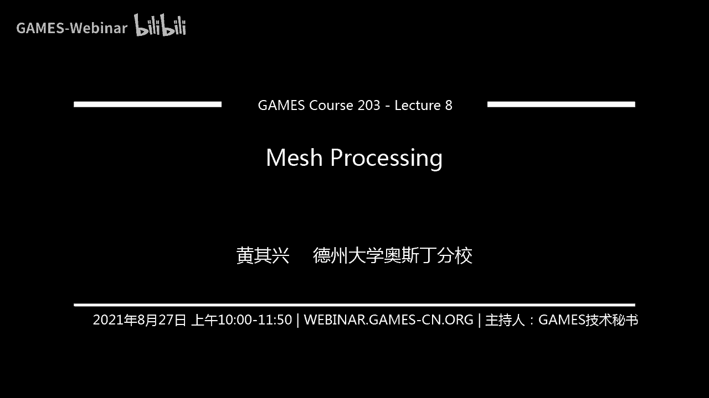
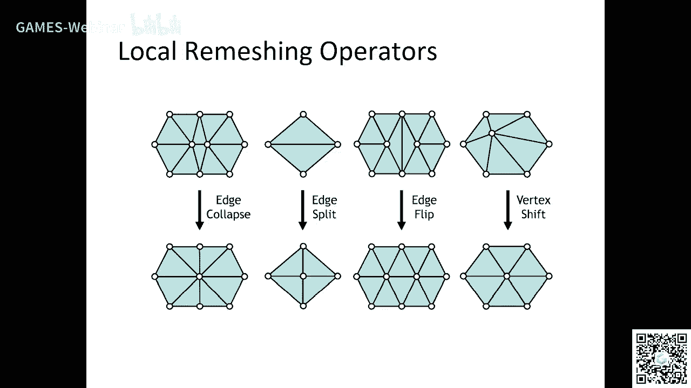
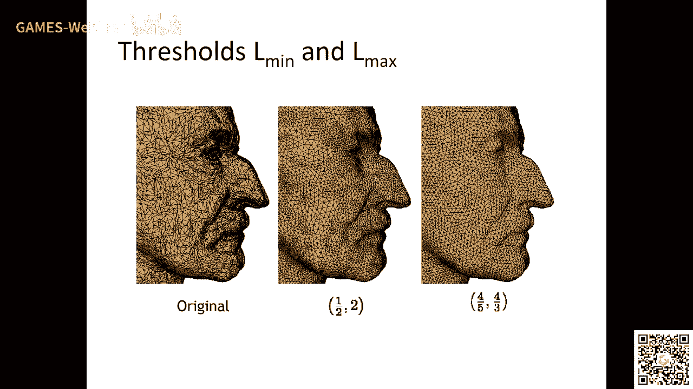
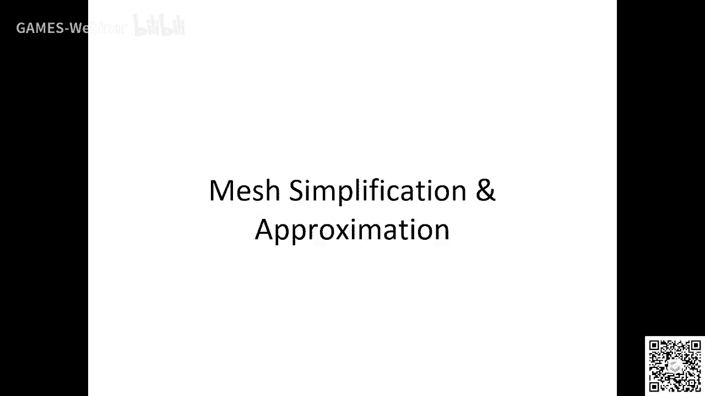
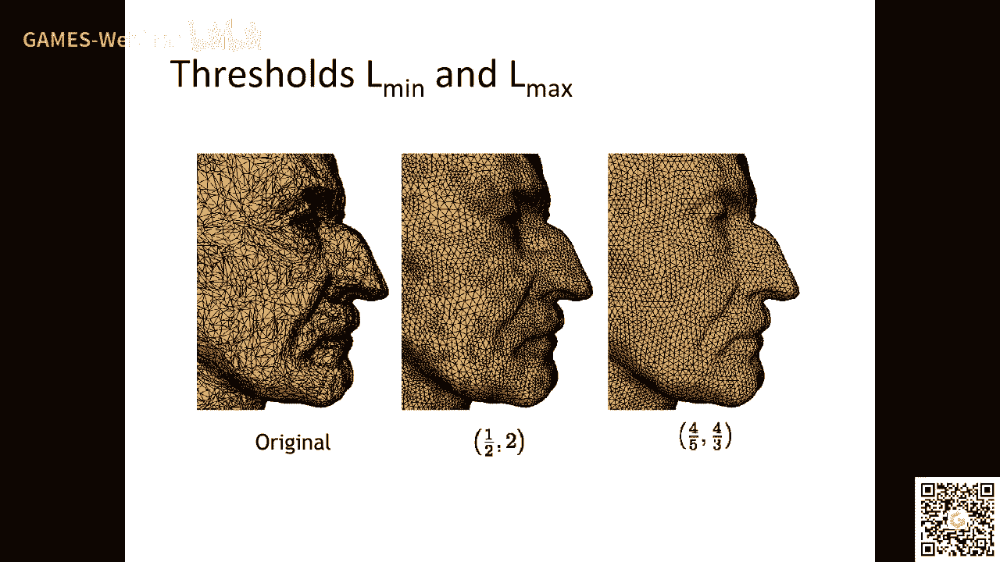
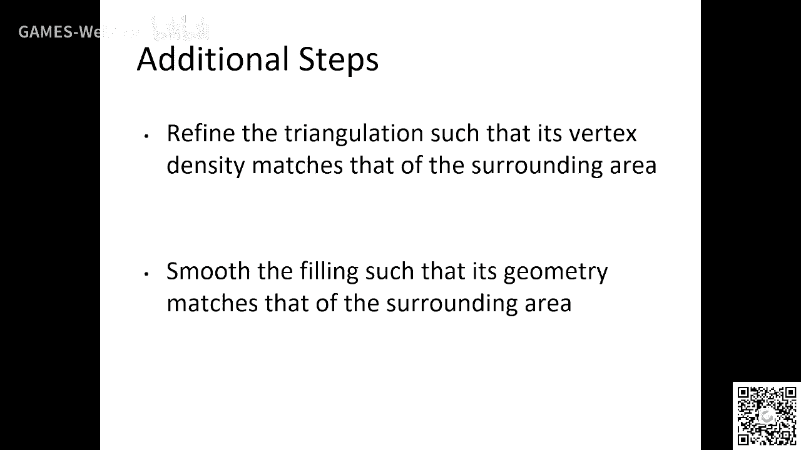
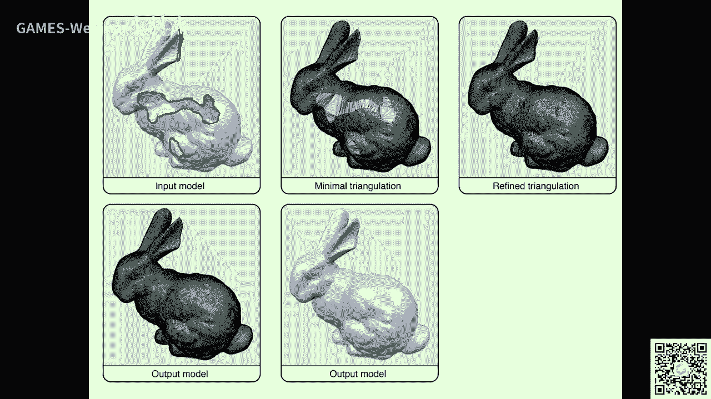
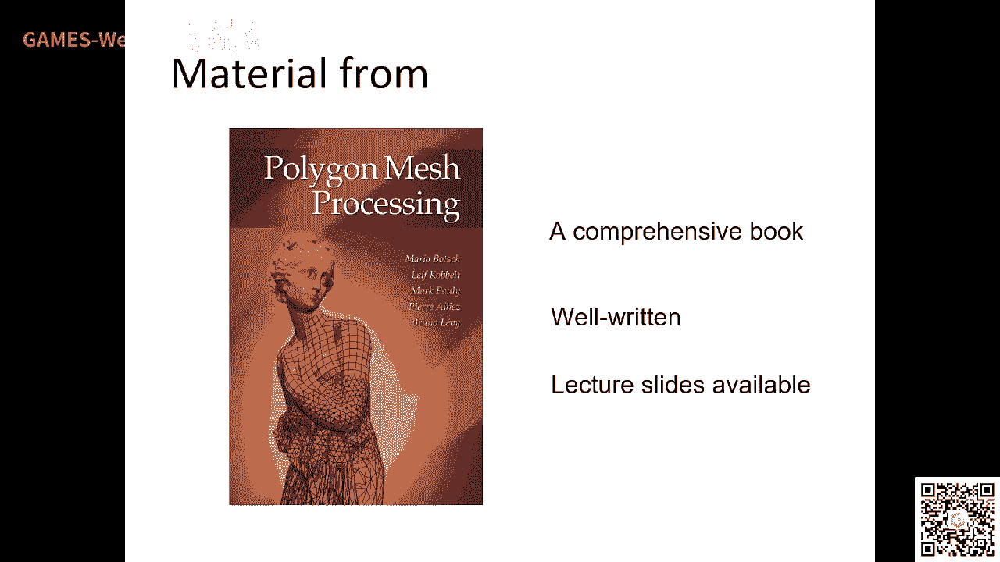

# GAMES203：三维重建和理解 - P8：Lecture 8 网格处理 🧠

在本节课中，我们将要学习网格处理的基础知识。网格是三维几何的一种核心表示方式，广泛应用于计算机图形学、几何处理和深度学习等领域。我们将探讨网格的表示、数据结构、微分几何基础以及几种关键的网格处理操作，如平滑、重网格化和简化。

---

## 概述 📋

网格处理是三维几何计算中的基础。本节课将介绍网格的基本概念、数据结构，并深入讲解几种核心的网格处理算法。理解这些传统方法，对于后续学习基于网格的深度学习技术至关重要。

---

## 网格表示与数据结构 🗂️

上一节我们概述了课程内容，本节中我们来看看网格是如何被表示和存储的。

网格是一种隐式的曲面表示方式。它与参数化曲面类似，由顶点、边和面组成。一个平滑的曲面具有位置、法线和曲率等信息。

*   **顶点位置**：可用于进行重心插值。
*   **顶点法线**：可以在面上计算法线，或利用顶点法线进行积分等操作。
*   **距离计算**：在配准或投影等操作中，需要计算点到网格的距离。
*   **参数曲面**：对于平滑曲面，可以将其视为一个函数 `f(x, y)` 来求解。
*   **投影操作**：通常使用 `k-d` 树等数据结构来加速寻找最近点的过程。

从编程和图形学的角度来看，编辑网格是一个重要课题。例如，B样条曲面通过移动控制点来编辑，而网格编辑则涉及更底层的操作。

### 网格数据结构

以下是关于网格数据结构需要考虑的几个方面：

网格数据结构具有一定的拓扑约束。例如，它需要满足流形条件。有了这些约束，还需要定义如何在网格上进行导航遍历。

处理这些约束的标准方法很重要。例如，在点云简化时，可以随意丢弃一些点，但在网格简化时，不能随意删除一个顶点，还需要考虑如何重新连接剩余的几何元素，以保持网格的完整性。

网格通常如何存储？简单的格式如 `OBJ` 或 `OFF` 只提供每个面的顶点索引列表，这是一种最常用的存储方式。而 `PLY` 等格式可以包含更丰富的属性信息。

### 支持的操作与数据结构选择

我们首先需要考虑数据结构需要支持哪些运算。

例如，`MeshLab` 软件可能使用半边数据结构。一个关键问题是，数据结构能否高效地维护面或顶点之间的连接关系。这在简化等操作中至关重要。

一种常见的设计是，每个顶点存储其位置，每个面存储其三个顶点和三个相邻面的索引。有了这些信息，给定一个面，就能找到它的所有邻接面；给定一个顶点，也能找到它周围的所有面。

对于熟悉网格处理的开发者来说，第一项任务通常是编写算法，构建每个顶点的一环邻域。做好这一点，就对数据结构有了初步了解。

半边数据结构虽然不是最高效的，但在编辑操作中速度很快。它需要在存储紧凑性和查询速度之间做出权衡。

半边数据结构的基本单元是“半边”。每个顶点有一个位置和一条出射半边。每条半边有一个起始顶点、一个相邻面、一条下一条半边、一条对边半边。通过这种链接关系，可以遍历网格的所有元素。

这种数据结构在几十年前计算机内存有限时非常重要，能显著减少存储。如今硬件资源丰富，但半边结构在需要复杂拓扑操作的场景中依然非常有用。

---

## 微分几何基础 📐

上一节我们介绍了网格的数据结构，本节中我们来看看处理网格所需的一些基础数学知识——微分几何。

微分几何用于计算曲面上的基本属性，这些属性在网格处理和深度学习中都有广泛应用。

参数曲面研究从参数域 `(u, v)` 到曲面的映射。它有许多重要的量，例如法线。在连续曲面上，法线方向与曲面在该点处相切的两个方向都垂直。

**法曲率**是指：给定一个法线方向和一个包含该法线的平面，该平面与曲面相交得到一条曲线，这条曲线在该点处的曲率就是法曲率。

曲面上每个点有无数个法曲率，其中有两个极值：**主曲率**（最大和最小曲率）。两个主曲率的乘积称为**高斯曲率**，平均值称为**平均曲率**。

主曲率方向通常是相互垂直的。计算主曲率在特征识别（如下颌边缘）等方面非常有用。

高斯曲率有一个非常重要的性质，即**高斯-博内定理**。该定理指出，无论曲面如何变形，其高斯曲率的积分总是一个常数。这个常数与曲面的拓扑（欧拉示性数）有等价关系：`χ = V - E + F`，其中 `V` 是顶点数，`E` 是边数，`F` 是面数。这是一个拓扑不变量。

这引出了**离散微分几何**：我们可以在离散的网格上定义曲率等量，并让它们满足高斯-博内定理。这在物理模拟等领域非常重要，可以保证离散化后的方程仍保持连续情况下的某些性质。

---

## 网格平滑 🌀

上一节我们回顾了微分几何，本节中我们来看看网格处理的一个基本操作——平滑。

平滑与深度学习中的卷积操作密切相关。如果在网格上能定义好卷积，就能方便地应用许多深度学习技术。

图像中有多种平滑方式。在网格上，一种常见的方法是**拉普拉斯平滑**。其核心思想是，每个顶点的新位置向其邻域顶点的平均位置移动。

在网格上实现拉普拉斯算子，最常用的一种权重是**余切权重**。通过迭代应用 `新位置 = 原位置 + λ * 拉普拉斯位移`，网格会逐渐变得光滑。

另一种方法是**曲率流**。例如，平均曲率流让顶点沿着法线方向移动，移动速度与该点的平均曲率成正比。其流动方程是 `∂x/∂t = -H * n`，其中 `H` 是平均曲率，`n` 是法线。这种方法也能达到平滑的效果，并且能产生更均匀的网格。

理解平滑的原理，特别是如何在网格上定义这些算子，对于在曲面上进行编辑、变形以及应用深度学习都很有帮助。

---

## 网格重网格化与优化 ⚙️

上一节我们介绍了平滑，本节中我们来看看当网格质量不佳时，如何通过重网格化来改善。

如果网格变形很大，或者三角形质量很差（如过于狭长），就需要进行重网格化，即重新采样和连接顶点，以获得更均匀、规则的网格。

质量好的网格（如每条边的邻接面数接近6）在计算微分算子（如曲率）时误差更小，数值稳定性更好。

最常见的重网格化方法是基于局部操作的优化。例如：
*   **边翻转**：改变边的连接方式，可以改善三角形的形状。
*   **边分裂**：将一条边从中间分开，插入一个新顶点。
*   **边坍缩**：将一条边的两个顶点合并为一个。

通过迭代应用这些局部操作，并优化顶点的分布，可以使网格变得更加规则。这在基于网格的神经网络训练中很重要，因为变形的过程中需要保持网格的良好质量。

---

## 网格简化 🗜️

上一节我们讨论了重网格化，本节中我们来看看网格处理的核心任务之一——简化。

网格简化是指，给定一个复杂的网格，找到一个顶点数更少的新网格，使得两者尽可能相似。这是一个非常具有挑战性的问题。

目前的主流算法是**二次误差度量简化**。其基本思想是：将网格的每个平面表示为一个二次误差函数。当合并两个顶点时，计算新顶点位置，使得它对所有相关平面的距离平方和最小。通过不断合并误差最小的顶点对，实现网格简化。

简化过程中需要特别注意**全局误差控制**。如果不加以控制，简化后的网格不同部分可能发生自交。因此，需要跟踪和约束简化操作带来的全局几何误差。

此外，简化还需要考虑其他属性，如颜色、纹理等，并尽量保持模型的拓扑结构（流形性质）。

---

## 网格修复 🩹

上一节我们介绍了网格简化，本节中我们来看看如何处理不完整的网格，即网格修复。

三维扫描得到的模型常常有缺失或破洞。网格修复的目标是填补这些空洞，生成完整、合理的几何。

一种经典方法是**基于三角剖分的修复**。首先识别空洞的边界，然后在这个边界环内进行三角剖分。这可以转化为一个动态规划问题，寻找使新增三角形面积和或某种形状度量最优的三角剖分方案。修补后，通常还需要对新增区域进行平滑和重网格化，以融入整体。

另一种方法是**基于体素的方法**。将网格转换为体素表示，在体素空间中进行修补操作（如形态学闭运算），然后从修补后的体素中重新提取网格表面。这种方法更鲁棒，但会丢失原始网格的细节特征。

网格修复，特别是结合深度学习进行智能补全，仍然是一个有价值的研究方向。

---

## 总结与推荐 📚

本节课我们一起学习了网格处理的基础知识。我们涵盖了网格的表示与数据结构、微分几何基础、以及平滑、重网格化、简化和修复等核心算法。

最重要的是，这些传统的网格处理技术中包含了大量精巧的思想。深入理解这些内容，对于在网格上开展深度学习研究非常有帮助。强烈建议大家阅读相关的经典书籍（如课程开头推荐的教材），从中汲取灵感，将传统智慧与前沿技术相结合。

我们下周再见。