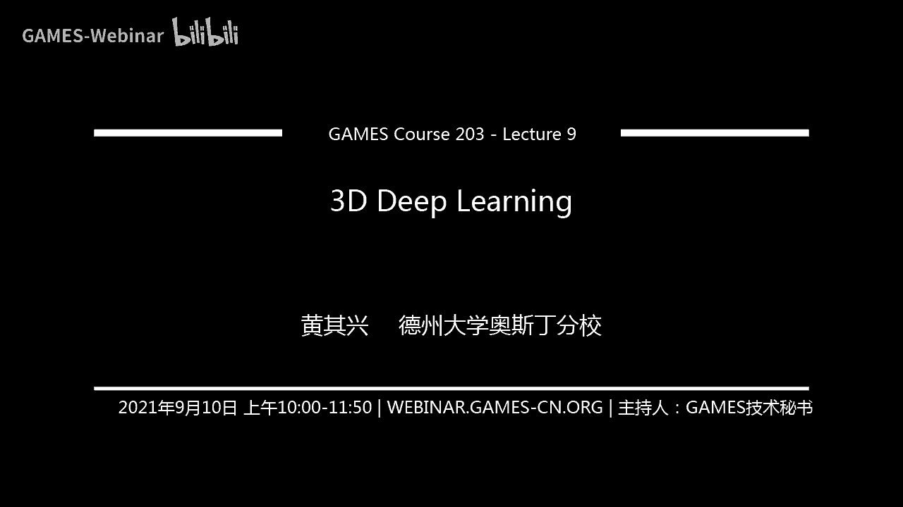
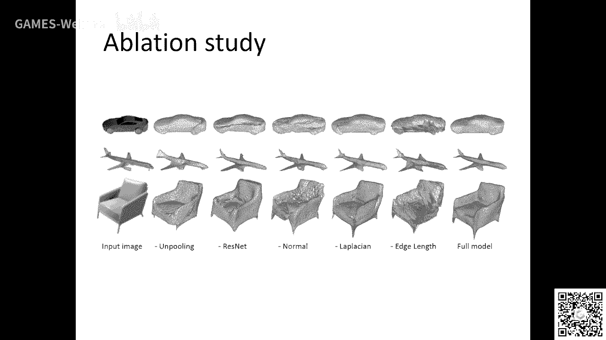

# GAMES203：三维重建和理解 - P9：Lecture 9 三维深度学习 🧠

在本节课中，我们将探讨三维深度学习领域。我们将回顾几种核心的三维数据表示方法，并分析基于这些表示构建的经典深度学习模型。课程将涵盖体素、多视图、点云、隐式曲面（如SDF）以及网格等表示形式，并讨论它们各自的优势、挑战以及如何将传统几何处理的智慧融入现代深度学习架构中。

---

## 三维深度学习的兴起与发展 🚀

上一节我们概述了课程内容，本节中我们来看看三维深度学习是如何发展起来的。深度学习在计算机视觉领域的真正兴起，源于AlexNet的出现，它为整个领域带来了突变。许多机器学习方法，特别是架构设计和训练技巧，回头看其实都很简单。关键在于谁能率先提出并应用这些简单而有效的想法。

在三维领域进行深度学习，首先面临的核心问题是如何表示三维物体。这与二维图像处理有本质区别。

以下是几种主要的三维表示方法：
*   **网格**：由顶点和面片构成。
*   **点云**：一组三维空间中的点。
*   **体素**：将空间划分为规则的三维网格。
*   **隐式曲面**：例如有符号距离函数。
*   **高阶表示**：如球谐函数等。

基于这些表示，我们可以进行诸如分类、分割等任务。深度学习模型需要将这些表示转换为向量或图等结构化数据，以便进行处理。

---

## 体素表示与三维卷积 📦

从最直接的推广开始，我们首先看看体素表示。将三维物体表示为体素网格，是一种最直观的将规则结构从二维推广到三维的方式。这种表示将物体离散化为一个三维张量。

**核心操作**是三维卷积。在二维卷积 `Conv2D` 的基础上，我们将其扩展到三维：
```python
# 伪代码示例：三维卷积
output = Conv3D(input_voxel_grid, kernel)
```
通过堆叠三维卷积层，可以构建用于分类等任务的网络。

2015年的工作《3D ShapeNets》是开创性的，它首次在体素表示上定义了卷积操作。尽管其后续的生成模型部分较为复杂且如今较少使用，但它奠定了三维卷积的基础。

体素表示的主要挑战是**计算量和内存消耗巨大**。早期的网络只能在 `32x32x32` 的分辨率上运行。为了解决这个问题，研究者引入了**八叉树**等稀疏结构，只在物体表面附近使用高分辨率，远处则用低分辨率。但这会使得卷积操作的定义和实现变得复杂，且不易在GPU上高效运行。

体素表示的优点是规则、硬件友好，但缺点是如果不是稀疏结构，则计算开销大，且难以捕获精细结构。

---

## 多视图表示 🖼️

另一种思路是将三维问题转化为二维问题，即多视图表示。其核心思想是：不直接处理三维模型，而是从一个三维模型渲染出多个二维视图图像。

**流程**是：给定一个三维模型，通过虚拟相机渲染出多张图像。然后，我们可以利用成熟的二维卷积神经网络来处理这些图像，例如进行分类。最后，可以通过聚合多个视图的结果（例如使用视图池化或图神经网络）来得到最终的三维物体分类结果。

这种方法的好处是能够充分利用强大的、预训练的二维CNN模型和海量的二维图像数据。但其挑战也很明显：
1.  **视图选择**：如何选择最具代表性的渲染视图？
2.  **域差距**：渲染的图像（通常无纹理）与真实图像之间存在差异。
3.  **信息损失**：将三维降维到二维，必然会丢失一部分信息。

多视图表示是连接二维与三维视觉的重要桥梁，仍有很大的研究空间。

---

## 点云表示与PointNet ☁️

点云是一种直接从扫描设备获得的、非常高效的三维表示。它对于高维数据是一种紧凑的表示形式。

点云处理的核心挑战在于其**无序性**。一个点云是一组点的集合，其输入顺序不应影响输出结果。因此，处理点云的神经网络必须是一个**对称函数**。

PointNet 的核心思想正是基于此。它利用一个共享的多层感知机独立处理每个点，然后通过一个全局池化操作（如最大池化）来聚合所有点的信息，形成一个全局特征。这保证了置换不变性。

**网络核心结构**可以简化为：
```
输入点云 (n x 3) -> 共享MLP -> 逐点特征 -> 最大池化 -> 全局特征 -> 全连接层 -> 输出
```
PointNet 还引入了输入/特征变换网络来对齐点云，提升了性能。它的设计简单高效，性能不俗，更重要的是，它开创了一种全新的、非传统的神经网络设计思路，即直接处理无序点集。

后续的工作（如PointNet++， DGCNN）进一步考虑了点的局部邻域信息，但点云表示如何更好地结合几何结构（如连通性）仍是开放问题。

---

## 隐式表示：DeepSDF 🌀

隐式表示，特别是有符号距离函数，是近年来非常热门的方向。SDF 定义了一个函数，对于空间中的任何一点，给出其到物体表面的最近距离，符号表示点在内部（负）还是外部（正）。

DeepSDF 的核心思想是用一个神经网络来学习这个 SDF 函数。对于单个形状，网络 `f` 的输入是坐标点 `(x, y, z)`，输出是该点的 SDF 值：
```
sdf_value = f(x, y, z)
```
对于学习一个形状类别（生成模型），网络还会输入一个潜码 `z`：
```
sdf_value = f(x, y, z, latent_code)
```
网络通常是一个全连接网络，使用 ReLU 等激活函数。训练好后，可以通过 Marching Cubes 算法将零等值面提取出来，得到网格模型。

**为什么DeepSDF效果惊人？** 关键之一在于**激活函数**（如ReLU）。ReLU是分段线性函数，具有强大的函数逼近能力，使得神经网络能够表示出非常复杂、尖锐的形状特征。它学习到的是一种复杂的插值，能够平滑地在形状之间过渡。

DeepSDF 展示了将传统几何表示（SDF）与深度学习结合的巨大潜力，但它也有局限性，例如无法严格保证某些几何属性（如完美的圆形）。这为后续研究留下了空间。

---

## 网格表示与Pixel2Mesh 🕸️

最后，我们看看直接在网格上进行深度学习的工作，以 Pixel2Mesh 为例。其目标是从单张彩色图像生成三维网格。

这项工作的重要贡献在于，它将许多**传统的网格处理操作**融入了深度学习框架。网络主体是一个图卷积网络，在网格的顶点上进行操作。

**关键操作包括**：
1.  **图卷积**：定义在网格图结构上，聚合邻域顶点信息来更新当前顶点特征。这类似于网格上的拉普拉斯平滑等传统迭代算法。
2.  **上采样**：使用**细分**操作来增加网格分辨率。这可以看作是一种“反卷积”，在网格上引入新的顶点和面片。
3.  **从图像特征到网格的投影**：如何将二维图像特征“附着”到三维网格顶点上，是一个重要设计。文中通过将顶点投影到图像平面来获取对应像素的特征。

此外，训练中常会加入**几何约束损失**，如拉普拉斯正则化，鼓励网格保持平滑，但这有时会过度平滑细节。

Pixel2Mesh 展示了将深度学习与经典几何处理工具结合的思路。如何更完美地将网格的显式连接性与深度学习的表示能力结合，仍然是一个重要的研究方向。

---

## 总结与展望 🎯

本节课我们一起学习了三维深度学习的几种核心数据表示及对应模型：
*   **体素**：规则，易推广，但计算代价高。
*   **多视图**：利用二维CNN优势，但存在域差距和信息损失。
*   **点云**：紧凑、直接，PointNet 开创了处理无序集合的新范式。
*   **隐式曲面**：如DeepSDF，用神经网络表示连续场，灵活且质量高。
*   **网格**：显式表示，Pixel2Mesh 等尝试将传统网格操作与深度学习结合。



贯穿始终的核心启示是：三维深度学习的研究，应当注重吸收**计算机图形学与几何处理领域数十年来积累的智慧**。将那些经典的算法、表示和洞察与现代深度学习框架相结合，是推动这个领域向前发展的关键。未来的研究可以在如何更高效、更精确、更物理可信地表示和处理三维几何数据上继续深入探索。