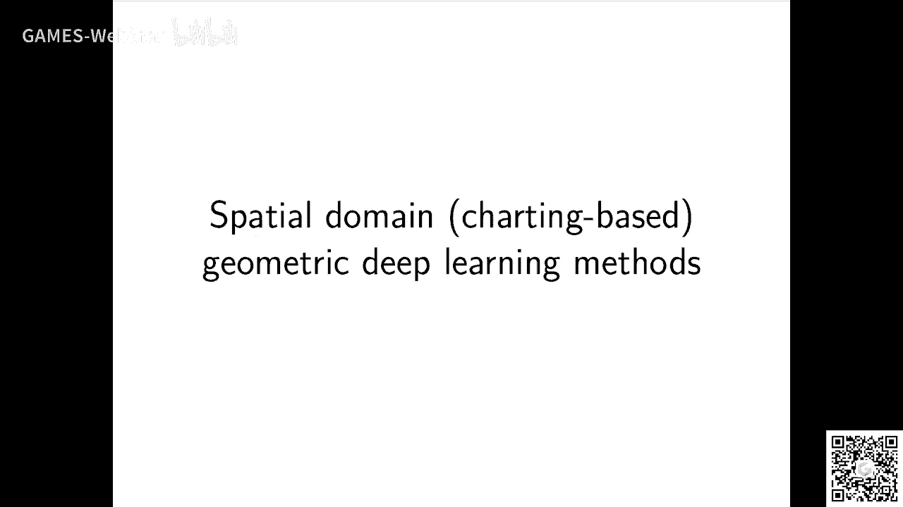
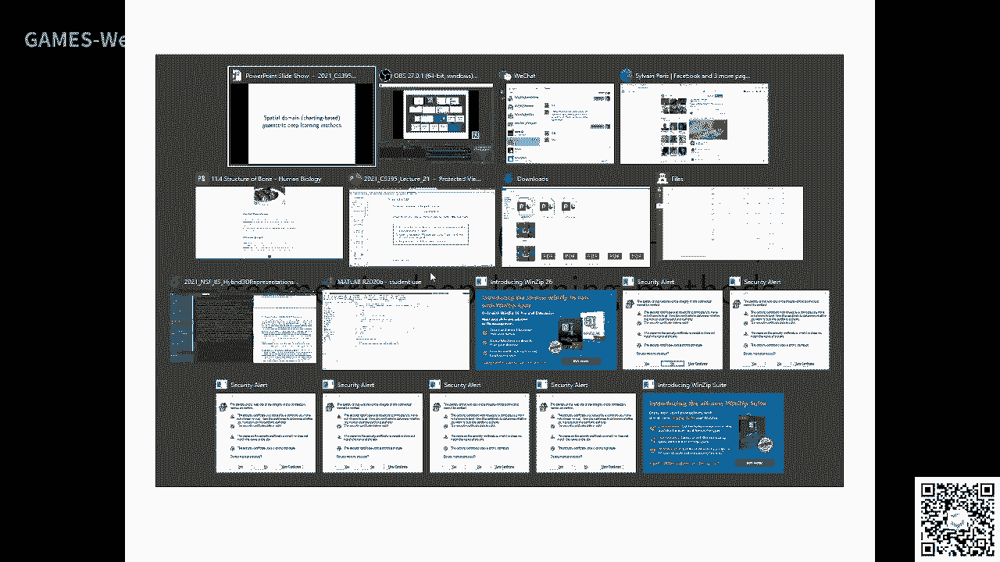
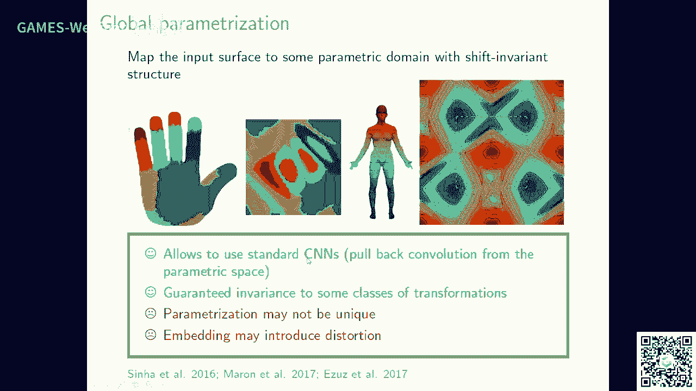

# GAMES203： 三维重建和理解 - P11：Lecture 11 Geometric Deep Learning II - GAMES-Webinar - BV1pw411d7aS

那个呃我们现在开始讲课，不好意思啊，我没有啊，我们现在开始讲课，不好意思，好开始呃，那个那个我今后我们还有还有几节课好吧，然后我们只要把这个全部选地图learning，我们讲一讲好吧。

然后那个slide应该在我那个主页上面，好吧啊好，这三节课呢我们主要是讲这个跟大家回顾一下，我们讲了一些。

这个就在曲面上怎么对这个special dm来进行这种convolution和deconvolution对吧，然后呢有了这个以后呢，我们可以做这种选手自动。

就是他是你你做的这个tron transformation以后，我就是一个on bon diana special costation对吧，呃有了这个以后呢，其实这个呃就很嗯我们可以做考古的什么对吧。

然后还有一些这种，所以这个这么费，核心思想就是在这个曲面上，你可以用这个拉普拉斯这个operator的这个特征根对吧，我们可以那个定义一些可以可以可以可以把这个啊这个special妹对吧。

给你个这个special metransport的这个special domain是吧，对我们讲的这个反手man对吧，这是虽然这是一种这是一个copy link这个东西对吧。

就是嗯这个拉拉按ion bon，ion magic ma对吧，就是对吧，它实际上是提供了这个曲面上的三选一个杯子对吧，然后fashion max呢实际上是啊。

30曼实际上是这两个里面一个fashion对吧，你在不同的这个皮下面，你可以嗯算是他的口语fficient对吧，然后你可以在这个口effici之间呢。

你可以呃那个呃linux transformation对吧，然后他就得到这个啊得到了这个呃一个呃两个shift也能man对吧，然后呢呃我们讲了这个讲这个fusing different bases对吧。

就是说嗯你对你对音mage来说，因为他那个走位他永远是个grade对吧，就是所以呢它不存在，就是像shape的话，因为不同的shape它的定格在他的杯子不一样对吧。

它有一个这个还有这一个不匹配的问题对吧，那怎么做呢，实际上就是说你你考虑一个conomic she pc，你能把这个这个东西呢，你把这个每个shift上单传统的时候到这个command space上面。

然后你再做这个再做这个考核，是希望它就是一个这样的东西对吧，就是你给你听到一个sh，你首先呢发忽略传统对吧，就是忽略传统，就是呃到那trial space，然后到special space呢。

这个special呢tn呢实际上是那个transformer男朋友那个shape对吧，你知道有个传说吗，你把这个special狗妹直接这些东西你可以穿透一切了对吧。

然后呢呃然后你再做convolution对吧，这个这个cp实际上就是做错了一个normalization，对不对，不然他一会处理传统，在软路就是老，然后呢这个。

这个东西呢它实际上是能做这个我们这个special这个小窗户在logo能做什么，能做黄毛保平定的对吧，能做这个你会发现就是说这个predict prediction跟这个广shox呢。

它会有一个什么东西，光速相对来说比较像，对不对，然后这个prediction呢他像是因为bash的原因呢，相对来说它有待定待定了，什么可能啊，这个其实如果你们谁就是对单纯的埋伏比较熟悉的话啊。

这个东西我应该可以理解的就是错，所以只能做过这个东西，然后呢你也可以做ftation对吧，就是说你可以做一些对吧，这个这个这个special这个东西你可以就是拉普拉斯矩阵嘛。

它不一定定义定义在这个max上面就可以定义的关cos好，那那下面呢我再讲一些接着讲对吧，就是说这个醒目就并不能点，它是跟这个gram的相关的，那如果比如说因为比如说我们如果有些brands它是rap。

在有些ac ac什么的，有些brando action什么，你有一条边，那条边并并没有它的英文对吧，并没有它的英文对，就是你一条边从a到b对吧，但是并没有一条边从b到a对不对对吧，是这样子的对吧。

就存在一个direct direct rap呢，它的那个occ ming呢，它实际上是earth sshearishmac mac对吧，宝贝，对吧就a semi inance mac对吧。

嗯然后呢呃这个时候呢这个如果大家对女装感兴趣啊，我真的建议大家去研究一下，就是说你怎么在这个定向的图，the render graph上面，你重新把这个在图像的图上面。

那个不要说grass series，你这套东西你可以重新自己给重新研究一下啊，我觉得这个，描述描述max的关于特定的属性要什么没有啊对吧，你他只是说我们前面的东西就是说这个拉胯是矩阵对吧。

你在grass上面的拉胯是矩阵，实际上就两种嘛对吧，一种就是说这种normalize unnmalized on lai，一种就是more unnally normalize max。

上面你定义的画质呢，因为你每个每一个我tx实际上它是有一个position的，就可以，它是实际上是一个manifold的一个ftation对吧，对the memical的一个potiation。

实际上它的拉胯其是第一的要更丰富一点，不同的定义的方法，在那个g2007 年，有一个叫做not fashion offeroperator的那个not be relax这样的concer。

然后呢有些poverty，然后再compare这些东西对吧好吧，然后你如果变成这个surprise的模样，实际这个东西就非常复杂了，当然这个东西也非常复杂了啊，我觉得就是啊就是没有这个就是没有这个。

就是非常复杂啊，如果大家对你有感兴趣，可以想想这个direct gram上面应该可不是第一拉胯子，我这里讲一种定义的方法啊，他实际上是把这个graph又改变了，他是做什么呢，他是做了一个。

就是说首先你要grass market对吧，就是说你有几种logo这种pattern对吧，这个比如说在social network里面，比如说a和b h b的朋友，b c的朋友来a就是c的朋友对吧。

它有一些这种pattern对吧，然后呢你怎么干的，你就是第一首先定义，比如说这里第三种这种promoting对吧，然后呢你就把一个五一个一个核心理学的js里面选编的一个cc面，选择重点啊，主要就是说。

你就看这个grab morty对吧，就是说他跟这个它它这个图里面是存在的，它是不存在的，实际上怎么说，你是第一个multipjs and magic对吧，就是说，对吧它还是一个对吧。

你比如说对于某每一个这个market对吧，你都可以定义一个m1 ，就是这就是说啊一个what time，对不对，它跟这个motif，它有几个那个相邻和morty对吧，他跟几个motif相邻。

每个国菜对吧，然后你就可以定义一个这个address making对吧，这是一个symmetric mac，他跟他他的idea就是说首先就是说他不要跟这个传统的water x直接省making。

它是它是那个类似的对吧，它是类似的嗯，对吧它是grap motive对吧，然后呢你就可以把这个你就把这个，你把这个东西把它给转成八八子对吧，就是它的行和列和那个载入门减去这个东西就可以啊。

你可以做这个什么，这对于每一个mari对吧，都可以有一个拉普拉斯矩阵对吧，然后呢这个multimnet呢实际上它就是嗯它实际上就是一种la ja和aa，对对。

它实际上就是说你对于某一个对于每一个那个motive，对不对，你都可以把它定义一个这样的operation对吧，其实这阿尔法呢就是它的口语finition就是michao和build和三对吧。

那就定一个这个东西啊，可是这个后面没什么关系，前面实际上说白了就你用一种这种camper的思想，对不对，就是一个月的multiplier对吧，你用的tegr，你把一个有效的筹转化成一个无效的啊。

哎这个思想我觉得这个好像很影响很影响，对吧，实际上呃这些钱这个vlog就是你怎么在这个bbc上面，是你第一次懂representation对吧，他是这些东西是相关的，我说一下。

今天因为那个就是因为那个game创建嘛啊，game创建也那个密码稍微出了点问题，所以我15分钟以后我再开个抱歉啊抱歉，ok，对吧，实际上你就可以用这种东西去补充了对吧，你要这么解决计划。

就就说这种考核都神啊，或者这种有可能你会定义的无效图上面啊，比如说你有一个direct citation network对吧，你可以把它转转化成这个motive，用了他的拉普拉斯矩阵对吧。

对icon viconveer来定义这个呃operation对啊，这个东西是很明确的，然后他比了一下，因为你这个东西，你这个work tation跟bd嘛上，就是说你的这个position是对吧。

就fpation中肯定是要红的，那就multi质量就更witch，更witch，这种思想的话，其实在three sh上面也也也也也可以利用好吧。

然后你就可以produce sequence和const grass和nm club，好，我这个就不讲了好吧，然后我下面讲讲这个，我这边就可以简单提一下这个动漫啊。

fly的id和这个the morning idea，然后现在我们讲讲这个mmatch fly对吧，就是就是实际上就是说你像这个energy做pin max police，你知道就是。

你把一个民营位置不断的做简化嘛对吧，不不断的做简化，然后这个呃比如说四个p首，最后就选一个最大的对吧，mac上面你说py呢，实际上就是说你max上面说妇女呢。

实际上就是说你不断的对这个这个这个这个这个这个这个mesh是吧，你不带南省mash t，然后嗯，然后你你在simplified的时候，实际上是把两个破解成一个嘛对吧，这个时候你也是一种破零对吧。

这个东西的话可以说在那个mac里面就有了，好吧好，然后我再讲一下，就是说special面的这个chinbose小麦，那应该是对吧，就是说实际上是什么意思呢，就是说传统的传统的这个卡不群。

当在也比较低的对吧，他立了一个bug，然后我们再去做，可能不是这个位置的，那这个在商品上面应该怎么来做呢，你们有什么想法吗，我们把这个如果平移到设备上面去，就直接平移啊，就直接前往应该怎么做。

有没有可以special special是我们刚才讲过的吗，special他直接换了一个，他是在另外一个种类去做，对不对，他不是不是真正意义上的这种随手的这种，他在special都没。

我如果真的把那个jy知道stal没有，我们应该怎么处理这个问题，平时在一个手柄上面对吧，或者就说哪个你们觉得哪一个fd或者是哪个放哪个，哪个tx在grass上面跟这个东西相关啊。

比如说如果咱们咱们这次graphics嘛对吧，哪个time跟这个东西相关啊，大家有没有有没有一个感性的这种觉得这个东西，啊不是simplification啊，是一个别的东西，你花一分钟时间想一想。

大家也直接老听我说吧啊，咱们这里只有一个学生有common，也不是理科，我那次那次s平的高考。

还有30秒，想一想，节目弹幕里是这个tt main tech max对吧，就是你你你touch mary不像是是把一个曲面上曲面的回力排除嘛对吧，这样的话你就有你如果你build了一个这样的颜色。

那你就会去破坏这个随手的卡普鲁士了对吧，但是平面上的话呢，确实你说他说话对吧，你可太太太太太太昂贵了对吧，那我们想想有没有别的办法对吧好，我们下面来讲一下，就tch pc tech mac大家学过吗。

参观啊对吧，你往一个曲面上前台吃骗过你，学文你应该学过，没有学过，不可能吧，好那就是convolution，比如说你你在那个美女说的有一点都没对吧，如果是那to有，你肯定都没。

你怎么去做这种积分的对吧对吧，什么时候做了几分了是吧，它实际上就是一种trograde in manials，上面这样就是说你要找一个progress babs对吧，然后然后你在这label子里面。

你可以去做这个，说这个卡不住线，然后问你这个内裤怎么找呢，或者你怎么把这个变成圈怎么了呢，对吧对吧，实际上就是被牵扯到一个考古路线，首先你要定一个叫logo cornfier。

然后season of holiness对吧，就是局部的一个坐标系对吧，就是u x x x x o rx，就是比如说你有一有一种办法就是your destic color对吧，就是你logo里的话。

你有一tention space，ttention direction变那个你可以，然后就可以得到这种cdc是吧，然后你就能得到这个gdc digging po。

然后呢每一个它有一个logo away对吧，就是w e w l对对吧，就是你会有一些这种，对吧，你类似于convolution，类似于convolution啊这种这种规定的规定的confection。

然后实际上呢那你就可以比如说你比如说你有高手的对吧，就是说一个谬对吧，你有一个muse，这个是，这个是中心对吧，然后西格玛打大seml，这个是covious magic，就给另一个u对吧，对对在。

在x plin对吧，x plain这个logo cos下面对吧，around the point对吧，然后你就能定义一个这样的那个看那个微信。

然后the special convolution呢实际上就是说，对吧，你固定了一个x的对吧，然后对吧，那他考录制的结果比在英语上面就是固定一个x，然后你作为的你把周围的那个做一个vk average。

那现在我们来看这个式子好吧，就是说x呢它肯定是一个固定的点对吧，然后我们要对他周围一点求积分嘛对吧，这就是卡路什么对吧，x plus和周围旁边一个点对吧。

然后w l呢实际上是u就是你这个x到x换这个距离，对不对，就是你这个x换到你被他卡全给了多少对吧，这个w l呢实际上就是在那个image内的那个fter，对不对，image面的那个fter是吧。

呃然后在这个manifold上面呢，要是用了ubi这个这个这个corda来代替对吧，这个cordia来代替来代替啊，好然后，这就是一个套路层对吧，然后呢你可以把你可以有很多的卡路程，就是很多。

比如说你在那个在那个迷你上面，你有很多钱了对吧，你可以有很多china这个卡和j要求你可以兑现对吧，你可以把这个coefficient加在一起对，加在一起对吧，然后呢就变成一个f和g的这种考古中心。

没有考到上面，就是记，这是fg的卡，我都是，就是supert嘛，对不对啊，他有些微型微型，好有了这个一次就是这个所谓的ptroph知道了，这个东西呢我要说一句是什么，他其实不难怎么去定义啊。

其实很容易想到吧，我建议的是大家如果做自己的态度的话，你你也可以进行，那那核心是什么，核心还是曲面上，这两个点是群里logo里，你要把它看成是一个言论一对吧，这样你有orientation。

你有方向对吧，你有coda概念是最难的，然后这个卡ution他比较引起的停在哪，这波它有一个这种叫做so called the 9 dk fanta对吧，就是logo里对吧，你可以重来定义对吧。

那是no ra，实际上就是jdg是xy，基本就是direction对吧，然后jdc对吧，那这个难点就是说你怎么你怎么来b这个orientation，对不对，你怎么来定义orientation对吧。

你怎么定义orientation对吧，你image上the orientation和dx还是y啊，那你在群面呢，你怎么定义orientation的，他这就有两种方式对吧，两种方式。

一种方式呢你就是在曲面上定义一个改成绿的，那么seo 20192020的时候，最晚2020的时候是有一个这样的东西呃，呃一篇paper是想怎么定义这个在局面上比这个玩个屁对吧。

然后你说这种conomical direction of，有了这fs的话，你就可以定义的，看我没有问题，还有一种方法呢就是做一个angular mac pracquire，a fire of page。

发言，有一个ping标对吧，实际上就是说你这个sea sa sa是零的ipad之间对吧，然后呢你就apply一个这种the ro实际上是他的，这是个diss，是diss，跟这个跟这个全程没有关系。

但是一个引擎发挥这个c盘呢，实际上就是说你找一个最大的对吧，你就是在c盘里面找一个最大的对吧，这样的话它就不存在一个rotation的问题对吧，它就不存在一个rotation的问题，实际上就是。

在所有的所有的方向呢做convolution，对不对，然后你你找一个最大的那个方向，在每一个点，唉呀虽然我给你丢人啊，这些东西呢这都是一些常见的，在在在tap上面装了个ution的ggi好吧。

然后呢你可以做忽略圈，从with magic对吧，你们做忽略传统，所有的这些方法都这样，把这个orientation比喻也要找到，我觉得这不这是three dimc，就是sery上面做写作。

这个conclusion跟这个在image上做ctrl选一个本质的区别，就是我们怎么来处理这个，我们怎么来处理这个orientation的问题，这是一个本质的，我觉得还没有好的solution啊。

大家可以研究啊，我觉得这次这个教学我们肯定不能feel的吧，大家我就开个头，你看像这个ac相对来说它这个他这个这个这个这个support fans对吧，就那个微型单反相对来说比较大对吧。

然后m o net实际上相对来说它就已经over，然后呢算是一些这种像你像这种呃九dc好多省内对吧，就是说你可以有你三ction专辑吧，你能有一些不同的，怎么看都会，然后最后得到那就是不同的方向对吧。

包括这个angle对吧，不同的waiting的这种pattern嘛，对不对啊，不同普通vin这种pad学出来的，那都是angel的，有一点有一定的angular，前面，对吧，然后你最后出来以后。

你可以做一个mac，呃是是是在科学上面发这个，convolution对吧，我们总结一下吧，啊总结一下就是说让你看这种方法，它第一个特点，它就是说核心要解决的是这个orientation。

一个核心是要解决orientation，一个，对吧，核心是解决i a i o n g s v，然后，还有就是你怎么去定义这个啊，怎么去定义这个考古工程，对不对。

哎怎么定义定义考古工程实际上是用了很多台词，这个detail的话，我建议大家你是个自己组合，我觉得都不难都不难，ok然后呢呃这些东西呢它也跟fusion有些关系啊，其实你看我们那个，fusion嘛。

比如说你把一个d你把一个点对不对啊，一个一个一个说明一个点，一个need一个daction对吧，从smoothing对吧，它质量就跟的确和过程对吧。

就是这个它是这个design过程是买的这个东西就是f f x t对对，t做鬼脸对吧，它是等于三位sion乘以c乘以这个f的规定就是c，你要那个什么叫做concer对吧。

就必须这么这个a a a trap fusion啊，它实际上就是说就是它不是各项同性的，各项同性的，具有各项同性，它是一个各项异性的对吧对实际上就是对吧。

实际上它就是design business position和这个是不是你看前面这个东西是一个concer，就所有地方都一样对吧，这个a  vision就是前面有一个有一个tensor嘛，就a x对吧。

position direction，if you feel this position direction，这个东西呢实际上就是说还有很多incipation。

很多information implication啊，有很多ination啊，就是它使得你这个debute这个和自己的，实际上它跟这个就是我们以上就会讲，它实际上跟这个跟这个。

结果convolution也很有关系对吧，这个东西就让它更丰富对吧，比如说一种方法，就是说diffuse的时候对吧，你可以定义成每个among many，可以定义成每个东西跟这个princip相关对吧。

你沿着这个频道的方向相对来说，比如说他可以比p图的快一点对吧，举例的话要给虚度慢一点，克制这个方向对吧，那你怎么办呢，就和gradi词，你首先对它进行这个transform of the tenufo。

后面基本上给一个再传送回去对吧，然后你再做一个diversion对吧，你再做一个，假如选对吧，然后，对吧，然后呢这个东西那个前面是个office就可以，对吧，然后你就可以对吧。

你可以定个p打一个被动打花式，实际上他就做了一个这个样子，做了一个这种，哎这种这些东西呢你怎么来怎么来看这些东西呢，你就把它看成是一种就是说在学院上一些这类想法，实际就是说啊这个地方。

我他这个这个这个这个老花想问是不是传统意义上的对吧，它带有一定的这个各项符合各项异性对吧，然后呢就是说他还有一些方法呢，实际上就是说回回到了那个这个psv的吧，你可以把这个东西对吧。

你这个位置的这个魔女，你可以把它跟我们前面说的那个啊，就是说它是一个固定的嘛对吧，另外把它变成一个nero对吧，但是没有和另外都是nerable，你可以做这个备考的东西对吧，假如你可以把那个gl对吧。

就是那个随着考古工程的那个proficient吧，和mq码是吧，非常，我来了，这个东西呢也可以把它看成一个mix model，我倒是没什么。

然后呢呃一些人呢他就把这个这个这个思想把它用到了这个grass，实际上就是啊这gram上面定一个note框架，比过还有b选在这个地方是，然后你可以定义一个高深with confession是吧。

这个nfc com ution呢啊，你注意啊，就是在manager的上面，你发现没有在mango的上面，在plus上面被本质的区别是什么，就是maniphone上面。

比如说这个noble quality，它是不要给发的名字叫magic对吧，你这gram上面的话，你你每个我看他是没有没有粉丝群，没有这些东西对吧，那你需要有一个坐标对吧，你需要有个坐标，对不对，对吧。

就是这种随时可以fficient对吧，他只会好，可是突然出，这个corony对吧，就是你是怎么可以放的对吧，就是这个corny这样就是在sy上面讲这种啊，这种水平就算核心的一个事实上核心的一个一个东西。

核心的一个东西，核心的一个东西，你怎么来听说你把这个框里面，然后我们可以做一个简单的比较嘛对吧，跟我们讲，在这个方法是把刚开始提到的对吧，你把它传送到一个flada都扛不住，tion。

像这种随手的考古都选了，他就说你在这个推手的推对吧，这个头也算对不对，然后然后得到一个，嗯对吧嗯那个这个在赛车都没，这两者相对来说呢，它也有去cnet吗，因为你这个bt这个东西实际上是什么东西呢。

实际上也是用用那个喇叭光辉的制造的对吧，实际上就是说你可以把它认为是他在说special cover lotion是吧，只是说这个讨论是可能的，这个是错的非常大。

它是由这个拉夸拉夸斯这个把fashion这个举例的，对啊分手他们都选了，他是一个我给他一个机关这个level，然后呢还有一些graph attention network network对吧。

比如说你可以做一个nel v，对吧，你可以做一些有tension对吧，反正就tension相对来说就说你可以做一些文写的lvp，你可以做一些文写的lp。

还有一些呢就是说你比如说我们如果在gram上面定这个号选的，还有它有两种这个gram懂d，前面讲的就是说你可以morty的encode ogram，然后这个地方呢让一个graf呢，它有两个b的方式对吧。

你比如说还有个prime gr，你看你可以用more tips对吧，把augument是不符合gram吧，也可以用这个bgm对吧，就是说他的每个模块是一个是一个edge对吧。

然后两个我两个edge之间的，如果需要一个，我才是那个小编，就是这种graph，比如说在the real，比如说方案里面做graph generation的时候是很有用的啊，有很多很有些很阴间的。

结果就是你要加入一些reaggraph来说，方便满足你性是吧，哎就这种trick这种trick非常非常好的对吧，你可以你可以可以可以在这个环上靠靠，可以在这个power gram上面做个做主。

你可以把它把这个commotion呢用这个degram对吧，没有盘不好，都是，然后用那个狙我来承担第一是吧，这字都很有意义，简单来说呢就是如果你的这个encoding啊，相对来说他更更精致一些。

但它的卡牌比越大是吧，那么你的这个它的这个结果相对来说就越来越好了啊好吧，ok就是那个随手种类的对吧，随手种类后核心思想就是一个pn，然后呢就是把你弟你要你要指所有conclusion。

它不会随着你这个顶的变化而变化，这个在英语上面咱们不缺这个东西，为什对吧，你在这个科技上面，因为你每个点都会这个区域不一样对吧，那会不一样，所以怎么定义这个operation也不一好吧。

然后最后一个就是traumatic main做小magic 3 max啊，这个东西的话呢啊我就简单勾一下吧，我简单勾一下啊，实际上是max的音put设备是三块，都是700万的。

就是要满足你map过去以后，你想这个我们我们问这样一个问题吧，比如说我们可以把它做传话啊，做三的话以后最好就是一个初的麦当劳，是不是初代买封面容，那有了这个以后，我们怎么来处理这个问题呢。

我们怎么来处理这个问题呢，有了这个东西哦，对吧，你这个参数化实际上他决定比如说你大家都知道，你如果是一个决定，你这个你怎么把这个曲面给割开对吧，你看着再怎么在扫地方对吧，不能说这你看着不一样的话。

他也出问题是吧，他不一样，他也是问题，这个时候我就牵扯到你怎么怎么去hello，这些东西对吧，finally not be in need对吧，bing main选择be discortion对吧。

这些东西我们需要去handle，就是我觉得这一块啊还没做起来啊，第一个就是你要能做参数化曲面，它往往是这种必须猫狗很小很小的一部分，很小很小的一部分。

大部分大部分read model是没有这个参数画的概念，因为他可以说这种shift that mama，就是说这个东西呢没呢，就是说我们下节课啊，我们下节课会后来讨论这些东西啊，这个东西的话呢。

我希望大家提前简单的去看一些这个还有pc的呃，你懂吗，的一些一些材料吧，我希望毕刚老师应该讲过一点，下面会重点来讨论那个东西好吧，对下一任总，好吧，那这节课我们就到这吧，我们还有他应该还有三节课啊。

然后就先停课了好吧，我们希望把这个卷完这个地图等等给大家讲完吧，好吧，就是嗯这个东西呢是这样，就这么一点，我可以这么跟大家讲啊，我就相当技术技术几点了，我再要强调一下是吧，就一个就是你在这个曲面上的话。

你你怎么定义好volution，它就是一个neighborhood，怎么选取这个步骤怎么选取的问题对吧，其实其实你在车轨上面那个屋子，我全局这也不是一个统一的事啊，你可以看看希望去年的一篇文章。

但这个问题并没有完全拒绝啊，并没有完全进好吧，好吧。

