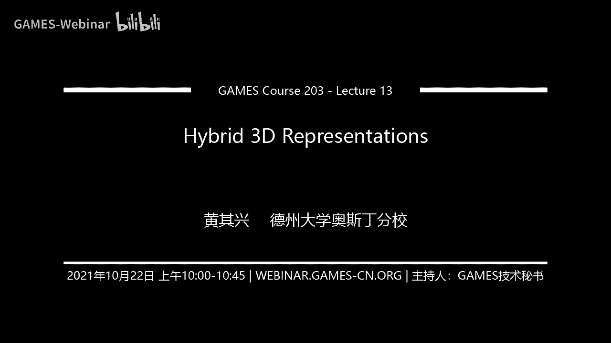
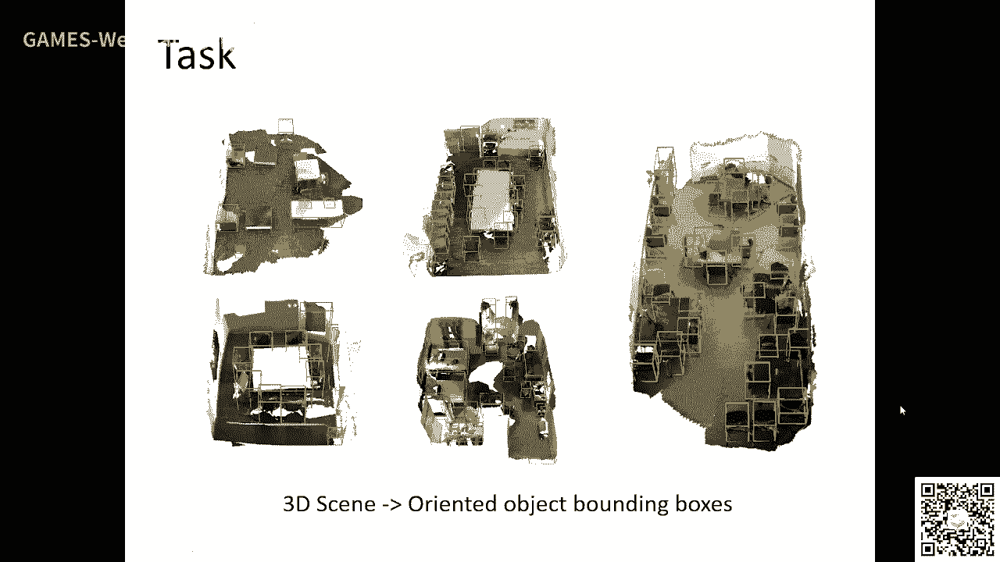
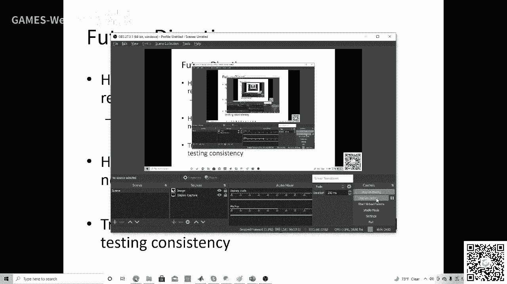

# GAMES203： 三维重建和理解 - P13：Lecture 13 Hybrid 3D Representations - GAMES-Webinar - BV1pw411d7aS

hello，hello，好我们开始上课啊，啊主要讲一些我自己做的东西，但是这个歌舞非常广啊，其实我发现有很多文章，虽然大家实际不这么叫，但是呃这个思想基本上第四好吧，嗯我个人觉得呢这是一个三维物体。

三维那个，学习里面一个很重要的问题啊，很重要的问题，我个人觉得这里面有很多en po，然后呢呃我也会想为什么这个东西他的追根溯源吧，这个追根溯源啊，其实这个东西从哪来的，我待会想到从同一学对吧。

包括工业制造对吧，其中和很多工业设计的软件，他肯定都是用各种各种representation来表示的，这个东西，然后呢这个东西呢你diss能力的角度来说。

他也跟一些就eral理论深度学习的一些东西它是相关的好吧，哎然后当我们回顾一下三维视觉对吧，三维视觉实际上就是说最开始我们研究的就是充电对吧，重建这个问题它是非常重要的对吧。

我们有一些基本的problem啊，然后呢这个data来了以后呢，data来了以后呢，这个就改变了对吧。

以前我们现在实际上就是three d的一个machine learning a three d machine learning era，我们这么讲了，着重讲了这个东西对吧。

呃其实最开始我们一定the learning这样子学to d对吧，就是说to d怎么用吗，选learning呢，我们three d就怎么用对吧，最开始任何一个学科嘛。

你想最开始启蒙的阶段肯定都是这样的对吧，都是抄码，也不能，我们不能说是抄模仿对吧，哎这是任何一个东西都是避免不了的，好慢慢的呢，现在three d我们有自己的理论架构了对吧。

比如说小magic deep learning point that系列，对吧啊我觉得这个hybrid这个东西，它实际上慢慢的他也会一些这个理论的体现出来啊，我今天会给大家勾一些对吧。

但实际上这个东西刚刚起来对吧，我觉得啊这个sd这一块是非常非常非常影响啊，呃原因就是首先ser来了。

ser来了对吧，然后我们呃你可以看这个switch，实际上这个sd 15年以后嘛，我们大量的做and standing啊，比较interesting呢，就是在这个呃我自己讲点比较阴沉沉的东西。

就是比较硬，就2015年以前啊，其实它有两个病毒吧对吧，一个revision，一个是jping对吧，大家都做重建对吧，都做重建，但是revidivision呢他说image重建对吧。

这个理论体就是不一样的对吧，你这个chara motion motiv stereo对吧，这个理论体系对吧，这个整个这个学科的体系，他们都是三维的重建对吧，它完全不一样对吧。

从天上来的都做registration对吧，你做什么都会加权，也必须收费对吧，各种各种这种呃representation之间的转换对吧，哎这是两个不同的学科对吧，我们有钱要学boing啊。

vidivision on大一点吧，该同时选择更多嘛，the gas processing graph，一个一个bu，然后不理解到了，and penny以后只要跨three data。

你首先发现就是这两拨人啊，他同时都开始他有融合对吧，有对吧，然后发发多发那个vision conference对吧，然后the post尽量的慢的接近了对吧，对比data了对吧。

当然当然一个主要的贡献我觉得是在第4年对吧，他这个这个framework上面啊，把把这些东西融合在一起了好吧，然后这个数字呢我觉得以发展的不错对吧，然后但是我觉得还是很多问题都没有。

我并不认为呃他是一个啊bato对吧，但是还有很多问题啊，我觉得呃从同业学的角度来说，就是呃怎么大家怎么把这个以前是我们同一学里面，大家用到的这些东西对吧，我们把它把它我靠这个音音轨道。

这个learning这个在你这个里面来啊，我觉得这是很重要的，好and standing，但是有一点很重要的，就是你这个qd vision的regiment的这两个东西相对吧，你到底区别在哪对吧。

区别在哪对吧，可以说你从一个task的角度来说，这两个队友基本上是没有什么区别对吧，都做了分类是吧，都做cc的，都做几下室对吧，区别在哪。

区别其实你可以从一个machine learning的角度来讲对吧，就是machine learning角度来讲，比如说像不管是直接讲rap对吧，这个robotic大家处理模型的这个问题的话。

它都有一个so called data representation对吧，就是你input的对吧，你这个页面都是一个label，或者你首先牵涉的就是你只好把它表现成你所表述的bwise。

real pieos对吧，然后output也是一个vex不一，然后中间呢你就会build一个ml对吧，它只有我们只有几种不几种那种表示形式对吧，你现在看下面一个就是graph graph的话。

实际上最后大家也把它表示以后，大家可以b成员知道，那这样的稍微不一样一点对吧，唉但是归根结底呢就是你应付的data output，the data，它有很多种表示形式对吧。

但是你这种tramati的这种data representation就没有那么系统，对吧啊这个问题呢其实在秋季是比较好解决的对吧，因为比如说因为进来它就是一种可能会表示对吧。

但是如果你看这个three d啊，实际上相对来说它就会非常非常复杂对吧，你觉得你可以看他说对吧，我们有很多种这种表述的形式对我们都讲了。

然后呢呃每一种形式呢大家都develop这个diss diss mnel对吧，dio那种去handle这些东西，对每一种形式我们都都develop，最开始的是vn match对吧。

这里面下一个就是multiview对吧，我前面讲过对吧，因为这个东西是跟那个vision最相关的，所以这两个b这两个rap vision是最先起来的，然后后来呢一个突破就是point cloud。

对吧对吧，the parametric surface，当然也有一些，也有一些那个那个那个那个结果，对吧好，然后拖进到突破以后，能慢慢的我们就有权利的man对吧。

我们要看concept for young，对不对，这是representation的形，但是实际上呢就是任何一种representation啊，它都是有优势对吧，同时也有一些缺陷的，同时有些缺陷的啊。

所以呢我们想法呢比如说你甚至当你这个东西你也牵扯到，比如说你这个output的对吧，是怎么去ecode，比如说你arc帮你挂，哎你把这个东西已经扣成成一个那个bank的形式。

让was the deep learning output，这也是什么，这也是其实有多种表示的形式的对吧，多种表示形式的啊，哎就是说这个这个representation呢。

实际上就是说一个观点就是什么呢，就是任何一种表现形式，它会有优点也有缺点啊，啊我会从啊，我会从不同的角度去看这个问题啊，我觉得这个蛮重要的，首先呢就是说你比如说我们我们知道这个graphics里面呃。

其实这个representation在deep learning出来之前呢，这个rap可以研究的最多的就是mi rap，这就是graphic。

the graphics也需要representation对吧，你比如说graphics my client，我们都要做重建，然后又说要做rendering，对不对。

然后你就需要把一个三维的物体表示表示在一个virtual environment，然后最开始大家比如说那国家队里面就讲，那么既然我们这类有一种统一的这种representation。

能handle所有的事情对吧，然后大家插了这个，首先出了这个inclusion surface，然后发现这个random是很难的啊，random是很难的。

然后我们try try了这个point cloud，对不对，就要唱tanga mesh对吧，它不编辑很重要，对不对，但是你有重建的问题，对不对，你有propology的问题，对吧啊对吧。

这个东西其实mac处理处理起来特别是在2000年初的时候，这个99年的时候，这个计算机还不是很快嘛对吧，你这个match相对来说它的这个over over over here是很大的。

然后呢2001年到07年99年吧，2000年开始对我讲了一个phone loud representation对吧，然后，因为这个关卡直接从scandal来嘛。

那个时候scandal慢慢的就进入进入就是小型化嘛，就大家慢慢能买得起的对吧，但是chara是个ram pcr，那么关卡呢第一个呢就是你怎么把它重建成一个burberry对吧。

唉这个问题就不是那么好解决，对不对，当然你还有一些别的问题对吧，但就是非婚结底呢啊它还是有一些局限性的，对不对啊，其实graphics呢后来呢从包括从2003年开始，大家就慢慢提出了一个hy的概念啊。

我用一个东西来解释这个东西对吧，它有很多种形式对吧，比如说我们是要做碰撞检测对吧，大家如果学这个robot的话对吧，这个碰撞检测应该是一个非常重要的派对吧，你两个东西能不能相撞对吧。

你做motion planning啊，坐姿更motion，这都需要做的对吧，那比如说如果我们的object是买表，可能match的这种representation，我们怎么来做碰撞检测呢，我们怎么来做。

通常检测了那一个情况就是你把所有的changl对吧，这个intersection都都都做一遍对吧，全国in the section都都都那这个东西就复杂度太高了太高了啊，太太慢了对吧。

那这个时候怎么做呢，你就用一种special data structure对吧，就是一种highly representation对吧，你就是把这个每一个每一个呃match呢，你用一种out来讲对吧。

你首先用这种bc主要可以去把那个你不需要算的这些全部pares，把它给你把这个去掉对吧，不需要算的全部pa把它给去掉，那剩下的内心呢你在做这个碰撞检测，在做这个碰撞检测，对不对。

它是一个它是一个这样的人，这样的东西对吧，哎这就是一种hybrid形式，这个hy的表示形式啊，其实这种东西呢在graphic里面是很常见的，web，特别在那工业制造的时候。

设计软件里面我有个计算在英雄rap推荐下面，同一首先把它转到那种rap推荐下面，算完了再找回来啊，经常出现这种情况，你比如说做非sical simulation，对不对啊。

你对这个simon你到底是用这种explicit这种还是infraser去做，或who who is simulation是吧，但要研究对吧，我们能不能用y retation对吧，来来研究这个。

你会去读这个文章，好吧啊对吧，呃其实呃你比如说隐隐私局面对吧，你两个隐私局面做ation的话，我举个再举个例子，比如说你做这个moring对吧，应该把两个两个隐私全面，对不对。

这个inclues representation，你可以做一个information对吧，这个时候呢你就不需要build这个两个shift，这样correspondence你可以做对吧。

你如果是mac的话，那你就得build correspondence，然后再去interpl，对吧好吧，但是match the beautiful respond就可以ctrl对吧。

ctrl中间的更于gdp啊，这些东西啊，我觉得这个东西呢呃现在如果大人一上来就接触这个传统的这种啊，就接触这种皮肤真源啊，你不容易感觉到就是我们上一个潜入选的，大家真的做cad的。

做grass这些人吧啊啊这些东西我们都是这这都是common sense，common sense，我觉得希望大家能如果是如果你刚接触这个fid版，容易容易被一些对吧，各种net给被你给迷住了对吧。

不容易去touch到这个fundamental的东西好，那three d呢，当然我们如果做hardstation for anta，当这个这个inside肯定是不一样的啊。

跟这个我刚才讲的这个东西肯定是不一样的啊，但是呢就是说他有个common thing呢，我们就是想干什么呢，我们是想把这个把这个representation，我们把它变成一个孔啊，免费。

然后就是说啊我前面讲了seo和seal station passing vion吧，你这个地方实际上就是说啊你可以有一个公案呢，你能把这个information power给对吧，power g啊。

我会讲一些具体的东西啊，但是common sense，这就是说有了一个network好吧，我今天会讲讲几个work，好吧，我会讲几个东西，一个我我会讲这个就是。

叫做这个testing consequence吧，其实就是说我们你做做这个three prediction的时候。

我们可以把这个prediction of the different representation对吧，然后我把average在对吧，嗯这个呃，然后呢我有一款一切的东西。

它就是这个resoditization那个一个结果，就是说你这个prediction吧，至少他他他有一些coviation的方案是避免不了，但是。

然后我们就把export这个东西其实一个一个interesting aspect，就是说比如说我们做hybrid representation对吧，在一个representation下面。

你这个network和side是不是固定的，对不对，然后你有多个版本可选，很显然你这个network对不对，就变复杂了嘛对吧，肯定变复杂了，那那有很多人对吧，就他那有一些笑话就是这样。

哎你这个neo的这个machine learning配置，为什么发出来的这个火爆，为什么不但不断在提高，原因就是这个是吗，原因就是这个network越来越复杂了对吧，对你复杂的好吗，对不对啊。

其实这个东西要你要怎么来看呢，是这样的，就说你这个还没用完，representation呢，它跟这个over paration它是很相关的对吧，它或者说是一种jao cao castration。

大家很熟了对吧，就是all cash network jav理论计算机的一些结果啊，你hundred representation实际上是一种translation。

就是我不把每一个representation下面的那我变得更complex，对不对，而是我我fix每一个上下面的这个这个complicity，对不对，have you ren那个。

但是呢我是加赣州的representation对吧，虽然top medical company也变复杂了，但是对吧，这也是一种or otra，这个interest in的xy就是什么呢。

就是说你这个他有说打狗比赛对吧，就是说你你在传统的培训下面modern这个ml对不对，他是你你把这个mod变得更复杂，它就all beat对吧，包括b它generalization就差嘛，对不对。

你比如说be的一个b的一个那个一个polynomial to the sea point对吧，这file point对吧，然后如果如果是在这over proposition的情况下。

我个人做一些这方面的理论研究，他虽然就是说如果你用规定design去配的话，怎么说呢，就是它会有一种double比赛，就是你model的cos比越大，你反而降了zation越小，呃那个降ation越小。

原因是什么呢，就是说你这个手wait他的举动保在移动一定的情况下，你这个model compress越大，你这个营销wait和那个final的这个位置这个距离就会越来越小对吧，你走的不远。

你说如果你这个model这个位置小啊，他就偏向于这件好对吧，如果就好比什么你一个口语，你如果有pdomo对吧，have order对吧，或者你的那个口语b上的对吧。

特别是那个比如说x 10次方前面那个口语p成对吧，如果还有很大的话，它就不容易将来well对吧，他就不容易将来well对吧，相相相反，如果你这些口语变相相对来说它比较小的话，它就容易偏了。

xwell对吧，它就容易填了这个，对吧，这个就是这样，model complex越大，你看他走的距离就行，他的口语变成小，相对来它就能将来这个intuitive就是这样子啊。

所以它有个double desk对吧，那那还没完成，你就是这样来的，我们可以在一种很简单的情况下对吧，就比如说呃一种最简单的形式就是ensemble method，对吧对吧。

incel max就是说你欠n个劝p算子为n个network，还缺一个sf为n乘以p的netl哪个好对吧，那么理论上分析呢，就是说只要你这个小姑娘的话，可能会翻出来缺n个。

应该如果再把它in 3合在一起对吧，要比k一个大的要好，要比缺一个大的要好，懂我意思吗，这个东西呢实际上就是一个一个servort，说你不用太大，其实这个跟跟b boot也是有一定关系的。

还是summer，但是three d呢，你你这个hybrid呢，它其实比这个in sumi跟那个什么东西对吧，就是说你到底是比如说你到底是ensemble两个同样的representation。

还是ensemble对吧，你合成和两个不同的representation对吧，spring呢实际上就是软件不同呢，它实际上就是说每一个每一个representation，它都有一个这种。

比如说一个vue比较大的substrate，对不对，如果你这种不同的representation间呢，你可能这个大背它就不la不a lap，它是好处，就是啊你可能一个版本推荐以某个方向。

你这个cp非常大，你可能换一个representation就能把这个sd给kill掉对吧，好吧，这就是为什么还we were fantation，它能what好吧。

呃从从从我给了一些这种简单的inside啊，如果在这里有大家对这个对这个呃呃理论计算机比较感兴趣的，理论深度确定你会去思考一下，好吧，我觉得很interesting啊，然后我会讲几个work吧，好吧。

讲几个work，然后第一个work就是can redumay啊，这个这个task实际上呢呃我们也对这个resurrection做了一个非常呃，做了一个改，做了一个引入门吧。

就是说呃这个pass呢实际上是这样子，就是你给定两个can对不对啊，然后呢我们matt他们现在very good cost对吧，他们自动very good pose啊，我我我讲过一次啊。

但是这里我讲过那个讲happy represent的一个extension啊，这个part当然也很重要的对吧，你就说这种motivsmotion啊，重庆啊，the lugger听见啊。

这些东西很重要很重要很重要很重要对吧，ok那一种解法呢实际上就是说比如说我们回去或spondence对吧，然后我们去找一些constant东西对吧，然后你的低能力意外呢。

那就是大家就用牛奶work for fishare，so match，对不对，然后呢它有一个问题，就是说你怎么怎么把这个return over aning can，然后弄到这个nbing scp。

这个东西是很难的对吧，实际上就是说你如果两个片之间没有feature，那你怎么办去吧，也很难的啊，当然这个差距还是很重要的对吧，比如说你可以说这个你可以做he will construction。

理解才是soler是吧，for ext pl对吧，唉你可以做这些东西对吧，那那我们一种解法呢，实际上就是说怎么办呢，那现在地图门你来了对吧，实际上就是说我们如果有了一个片对吧。

实际上我们不仅仅是知道这个片，还不知道这个片周围的东西对吧，才知道这个图片周围的东西，那我们怎么做呢，我们就可以呃，给定电量，我们可以做condition对吧，做了compression以后呢。

我们可以match到concrete图片，match compete是因为你做了completion以后，这个scheme就over了对吧。

然后你会做reactive post information是吧，但是就是说这就来了是吧，你如果做condition对吧，你到底什么样的reentation是好的，什么样的reputation是好的。

对不对啊，你比如说你比如说我们如果做这种dx prediction的话，它相对来说它就chlvl，也就是在那个平附近，它jios比较好对吧，但是你只要离离开那个盖子很远，而且java就不好对吧。

因为它是一种，但是肯定对不对，那我们想法就是什么呢，我们就讲就说哎你做这个reative positiation对吧，relative postation，你不需要所有的skin of life。

你不需要所有的那个配置对吧，你是需要一些方式的培训，只要需要一些profici，对不对，那我们这个时候就可以什么呢，就可以我们用多个representation去做做，去做condition对吧。

但投资哪种wifi配件好呢，这个东西其实是不知道的对吧，你可能有个实验对啊，你甚至这两个哪哪种wifk线好，跟你这个两个边缘之间的距离也有关系对吧，如果这两个can all over lap。

那么这种单词prediction相对来说它就怎么样，他就讲对吧，它甚至不跟你这个一个individual scans决定你individual game。

你两个一个这个input是两个can件的距离对吧，你如果两个实验的这个距离很远的话，那比如说这种cube map啊，或者这种这种nb对吧，他就会减2s比较好对吧。

他就会比这种呃当时的北京城他要鲁棒性是吧，所以这个东西就很气对吧，就是说我们那怎么做呢，我们就是把这些feature我们也也训练它做做考quation对吧，然后我们写一个优化对不对。

然后解决解一个优化对吧，我们解一个优化去选对吧，就给定两个pad去选什么样的feature是make sense啊，选什么样的features make sense对吧。

就是说实际上就是说你每个can exception了，你对于不同的这个party can对吧，你做做mc的时候，它它它这个b选都不样，最好也选择这个b选对吧，这个东西呢是简约优化对吧啊。

你可以去读这篇文章对吧，然后我们做了一些呃这种呃这种evaluation对吧，就是我们的sc d mod mod scanner上面做了一些emailation，是我们的message，就是这样。

就是说首先你做conversion啊，做conversion这个test嗯，如果大家就提示你over lap，即使你overline啊，他会也会有显著的方式的。

这alignment实际上是写了一个special match啊，嗯你可以去做这个文章啊，我今天因为我要讲的东西很多啊，我回复的少一点啊，然后就是说这个东西呢我可以给大家讲一个麦，比如说你这个干扰男粉。

这是一个经典的问题是吧，你这是经典的问题啊，你即使两个变欧了对吧，你比如咱们做一些考虑ition，然后在这个neo cos里面啊，对这个alignment的这个鲁班前会有显著的帮助啊。

不仅仅是说这两个东西不合我来啊，这个表彰你可以看出来啊，显著的提高话就说话，但是同时你用hundred representation的话呢，你在这种呃在这种这个上面的人进步的提高，好吧。

实际上这个是一个pa，就是说我们去用不同representation去考d对吧啊，然后呢呃然后呢，你刚才说的这个line它既有必须有这个衣服的毛衣的c c u对吧，最后是解决优化对吧，哪些哪个发布。

so ba medical msconfident好吧，我下面再讲一个work，这个htv音乐是for video object detection，video object detection呃。

detection这个tp是非常非常重要非常非常重要的detection，这个cut非常重要，比如说在sd里面你可take offset，比如说一个很重要的vacation。

就是说body or top driving吧，这些这些东西对吧，这就是给定一个体性的出来的是orion is object fbx是吧，order by the market对吧。

哎这个task呢注意。

但在具体ation里面在广泛的研究，对现在我觉得大家还是一个pc的东西做的非常非常多啊，那你比如说啊，比如说这个，那个那个那个呃传统的一个方法对吧，是做object和toto是吧。

那你们最近的工作呢就把它变成regression，我也是这个on the fboxster是吧，还有这个boss这个extreme是吧，还有一个sease 3的倍数，然后然后呢。

当然这个东西在three d大家也经常work对吧，你要是比如说你就说大家怎么说呢，一般是做一个比如说三下offset对吧，但three d呢哎大家做这个东西就是就king fp，呃。

但是有一个问题呢就签署了，你如果是做in的话，咱们设计是把你这出来的，而且当年报应该怎么去表示它应该怎么去表示他那一种东西呢，也就是说一个单词加一个φ，你这个时候呢就会发现。

就是说如果你和ta或者cd出错，你没办法去替补，那我们换一种思想怎么做呢，换一种思想是这样子，就是说我们推进的时候呢，我们不仅仅是这个box ser是吧，但是我推荐一些别的朋友说非比如说这些东西呢。

实际上它是有些mc对吧，你比如说构成了这他是个face center或者这种s center啊，但是很tuity，比如说你有的凹陷，它它就有一些非对吧，它是有the mac mini对吧。

比如说有些东西它就有些edges，比说明像这东西它有semantic mei对吧，这个时候呢你可低于c选三个的啊，如果他一般情况下就是脱离这个东西，它是它是一个will体方案的东西，对不对。

相对来说呢它就比那个who will define东西了，a dition这样一类型要好啊，later later，我会修选persisting，好multiple，这个呢我们就怎么做呢。

我们就给一个input的thing，对不对，那我们没有point对吧，然后呢我们用your magistry，毛是那种object based edge center对吧，这样这样对，都有很多点很多点。

对吧，每日这些center以后呢，那我们就来给定一些fbx，那我们就用这个center，那我们来pret这个fbx degress这些方面不对，然后呢呃就是通过一个对吧。

然后就会得到一些initial的那种对吧，呃initial permit呃，得到一些引进小的方面for哎，这个地方呢我们要注意有几点了，就是说实际上就是说我们不需要对任何一个r的fbx对吧。

我们只需要一这个office center或者被center than center，他肯定是正确的，我们就能得到这个office box，因为这个这个东西这个hard to reconsider啊。

这个地方是overcome fat taccomplete set，我得到这个英雄ult finding pose以后呢，那我们就可以同时我想把这个office reformation变形的变形。

我们也来做这个，我们也来这个average，最后我们可以把这些比起ava在一起后，就be fine，我们得到we find find find find对吧，你方案的嘴巴里放水对吧。

那最后最后就得到了那个放的不，好吧，然后我们对，然后有一些细节了啊，当然我会修一些统计啊，是那个相对来说比较严重，那你比如说我们seed这个other money box。

就这个做出这个这个这个determination的时候呢，我们可以用这个object action可以做一些transi，这个这个这个l就是版权从outline版可以做一些ref。

待会用input section需要你去做dcoration，然后你你这种像这种trim，他要得到更多的这种不同的这种b水吧，这个也能帮助我们去啊做这个做这个呃，这个这个box ref好。

然后呢这个结果当然不错了，我觉得现在这个结果就是你过了1年多啊，过了1年多以后，这个结果还是不错的啊对啊，scout vu上面对吧，那个mp打到6000啊，现在我不知道高多少了。

反正这个结果应该是很不错的，不错的，然后rgb d上面演技还可以吧，可以吧，然后这个increment这种可能好，然后我就想做一些分享下你几个词来做的，一般我也推荐大家去深圳有这种做题方式，特别奇遇。

这个问题是做题罢了，这个时候呢你稍微去做一些分析啊，比如说这个很重要，对第一呢就是，比如说我们有19个primitive是吧，一个box ser 6和这个12个center对吧。

我们对于每一个class对吧，我们可以看这些center的这种前面zation erro，那就和jy不好的对吧，小的就是general好，然后你又发现吗，这个每个东西它的这个形式非常的大小，没什么大小。

它是不同的cut对吧，它不一样的对吧，只要你比如说这个综合是carry，但是它是rp比相对来说有一些类似，网上也不完全一样对吧，但是你看就是如果你到了这个chair和table的时候。

你这个心理学我是什么样的，春节才比较好啊，这个操作different对吧，这也就是说这真的好，harry harry的，也就是说你每个东西都要开始对吧。

所以这就是为什么这个东西啊这这这这个不同的gmp king，但能够挺高啊，特别是那种浮于地址offset上面，提高自己还比较明显的一个重要原因，但这个东西呢我觉得这个id你可以在q d做。

我没有做这个啊啊啊，但是但是我觉得应该也是安排个工，第二个东西呢我们就是想说说什么呢，就是说你这个l对吧，你不但每个promise只要你可以看这个这个l做coverance magic对吧。

tradition error这种covious mazing，然后你就会发现这个covious mazing，对吧，它是接近于哪一个都没学，接近打的都没谁，接近载的mac对吧，这就说明什么。

说明这个不同的prediction of uncovid，但是按口味类型对不上口味类型，这个实验中我们验证第三个东西呢，就是说你这个方它相对来说它要小于这个vi fans呢。

你说everything的时候呢，是很难去把它给消掉了吧，vim可以对吧，如果你的vien反而是小于vian，那你如果做average的状态，才能比你那个，所以所以我觉得这这这就是我们做了一些分析。

这就是这个钱我为什么毫无意，结果为什么后面好，那我们下面我在想这个呃，另外一个另外一个那个tap in synsin synthesis，这个东西当然大家做的也挺多的对吧。

那新c的事当然有很多种做法对吧，我们的实际上就是说我们想做的是什么呢，实际上就是把这个就是这样表示一个arrangement of object对吧，就是说你比较object arrangement。

它就变成一个c对吧，它就变成一个c对吧，怎么了，synthesis呢，首先我们要对你这个做一种in coding，所以等于coding，那比如说我们怎么encoding object呢。

我们就第一它是什么cand，然后还有就是object这个model c wink color pression，同一个人类跟内存的code表，我们还可以object location对吧。

我们可以object fx这个object orientation对吧，我们可以这些东西对吧，那这个时候有了这个东西以后呢，如果把每一个art f把它扣成一个battle以后呢，和一个via以后呢。

那我们就可以用一个matic来引诱的一个，那么就是每一个corner将它encode organ，每一个color code是一个二转，你这个这个东西它这个是如果你朋友是那个color的话。

只要他不改变这个性对吧，呃呃特别是所谓的那个rp派，属于一个一个一个改是吧，它有点像cod，cod再也不完全一样对吧，因为你每个point每个可能它是有一个那个cgm leo的。

当你有了这个math表示形式呢，你可以放一个这个return这个beautiful and work for me对吧，那这个方法呢实际上它就跟这个become formulation。

我觉得reconformulation它是这个做这struction model比较forming啊啊，但是我个人觉得特别是我们最近在研究发现啊，就是说这种peter former这种这种这种研究啊。

啊这种在我们他是非常非常的还是非常非常多的，非常非常多，那比如说我们我们在这方面做了两个一个工作，实在是说一个这个兴趣的，我们做一个alt code，就是用一个福利卡。

那个福利呢福利就是初二for sense对吧，这种connection对吧啊，我们总结出了这个sense connection，它是非常容易over be啊，非常容易be。

我们就重新把一个smart dance for dance，no connection，特别是做这种塑料的关键，将来也挺要好的，然后再变成一个类似的cos对吧，然后内存code再把那个mur过来是吧。

回应可以多开的问题，ok然后呢这个结果呢实际上就是怎么说呢，首先就是我们发现这个结果还不错，应该不错，但是就是说你当你是病较复杂的时候啊，他其实就是说呃model是一个东西呢。

呃model就是相对来说呃，看的我们可能会有一些照片和section，然后我们有一些办法去handle对对，我们最近一个工作呢，我们就是想做什么，就是用这种汉语的表情，就是说。

就是我们区的一个seen as a graph，这个harvard在哪，这体现了两种啊，我这个地方两种harvard的表现啊，他们的这个东西它不仅仅就是说一个3o对吧，其实啊我最近看到一些文章对吧啊。

有一些不同的做法啊，那这个地方呢harder它就不一样了对吧，首先就是说我们有两个network是吧，第一个network是prediction action。

就是阿禄自己刚才那个前面那个最开始就跟工作一样，另外一种我是这个rap，因为这个这个这个对吧，这个reactivation这个model和copulation。

model和cpulation model pulation啊，这是一种hiit的表情是吧，然后呢你有了这个the attributes，这个very attributes呢就会increate。

然后给他就是说你可以做这个题，musician对吧，实际上就是你有一个av对吧，你这个东西进来对吧，你过了过了一个later space就能得到一个object attribu。

然后呢你又alt sb你toritize这个as a tribute，然后你过了一个内存work以后呢，然后你就能得到，你就能，得到一个这个对吧，alin code得到h h。

然后你把q3 就是这个a键加在一起做，这是一只3~5好，这是一种harder的形式对吧，就是有两种不同的position，那你把average在一，这个东西为什么who为什么work呢。

就是因为你是个over prization，它实际上是飞吻，uncle relation，uncle relax，然后如果你做这种singlization的选择，review vi。

另外一种东西呢就是harvard的形式呢，实际上就是我们要引体会的这个data分区非常值得品啊，就说传统的方法，比如说now deep learning之前我们怎么做，就是实际上就是我们model那个。

然后这种bution呢，然后我们可以就是可以和全n的bution，我们可以sumprocess to get那个东西对吧，deep learning完全把这个去掉了对吧。

就这个名单我们out sletion对吧，但是呢这个东西他们之间实际上是互补的，为什么你这么想，我觉得这个id其实还是不错的啊，就是说你那个不是你是很难打车啊，车的对吧，clear你这个有bat那种。

我可以举报的那个，但是那个车的题相对来说他跟他跟这个不是，首先不是所有人类的网都那么搞对吧，再一个就是这种声音不是很准确吧，传统的方法呢啊没有这个deep learning的方法呢。

the lol这个have interaction对吧，没有那么反过市场的provoy的一个地区，比如说你可以看，比如说我了你的东西very very attribute，我不知道这个东西对吧。

我虽然如果我去看这个地图呢，你这个单子我不知道，不知道它好坏是吧，如果你有一个perfecto version的时候就能清楚哦，这个东西它的这个在这个infer出来这个提取。

bution里面on比较好对吧，out比较差，对不对，你如果把这个东西怎么把这个东西给调整out掉，所以说可以可以做那个啊，呃可以做这个new这种东西对吧。

可以做一种可以去determinnetwork prediction，就是好，哪些是坏对吧，那就是nt真的是verty对吧，这是传统的方法对吧，这是传统的方法，有很多人做过这方面的研究对吧。

然后呢你就可以用这个stribution去当what netitime local ma，当with that，如果可以选择with not for me，这个时候呢你直接让我们干了一种。

就是用这个uncate东西，是between the police for fire，所以这篇文字呢就是它是两种这种represent和合在合在一起啊，合在一起，我觉得这是一种思想啊。

就是hybrid这个东西啊，其实它是一种非常广泛的思想啊，但是如果要形成一个理论体系的，形成一个体系的话，还是需要一些理论方面的工作啊，这方面相对来说是比较欠缺啊，我最后会讲一讲，最后会讲一讲啊。

然后你可以可以可以做一些比较对吧，你可以做一些比较，比如说你像这种，这这是仅仅用object c b这个事呢，就是你simple zation，but no onery对吧，就是不用按生去碰对吧。

你问input，但是你不会完全具有js这个问题，然后你如果加上这个身子进去之后呢，你可以对吧，你会得到非常肯定的名字啊，就是说你不仅仅是打车。

你可以发到这个可以选择可以去model这个ribution of how many object对吧，这些东西我们都可以去model，但是缺点就是这不是一个安全的mua的我啊。

但是也不也不是说完全不可能做，也不完全可能做，然后你可以选择一些procession stu，就是当时有些背诵了，他是用了一些ditional constraint对吧。

所以我们这个b的这个程度不是那么高啊，所以特别是那个对很多不是那么高啊，相对来说这个，但是总体来说我觉得还是不错的，总体来说我觉得不错对吧，然后你可以做一些vs那个事情对吧，让这个婆婆是提高。

相对来说就，好我最后再讲一个这个promise deposition，这个我这也是一种hab，实际上就是对这个传统的work了，就说传统的fer是吧，就是说你给定一些啊，有point cos对吧。

它还有很多primitive shape in the corn和s，你要把它找出来，那最近呢有一些工作呢，实际上就是说我们可以用地图等你来做吧，实际上就是说核心思想是什么呢。

思想就是你predict美国一每一个点一个一个回去，对不对，然后你做了什对吧，但是这个feature呢就很重要对吧，就很重要对吧，比如说一种情况下，我们就是这种semantic可选对吧，就是一句两个点。

他就用ctrl能选择两个点对，那我们这个地方呢我们就用一种叫做mage your method是吧，就是说我们怎么做呢，这个这个东西在哪。

就是说我我在improper additional offer的公司呢，我也加了什么，我也加了additional super vision对吧，就是说比如说这个东西它的它的它的解释，它的qu。

他的这个呃呃比如说他他的呃都是your metro funity对吧，它是长什么样子的对吧，如果你弄什么那个feature，就是每个点都一个feature吧，每个pk的一个pc的话，就没有这个信息。

然后这个东西相对来说它的底妆也是比较巧妙的，就是说这个prefeature我们做一些什么之前呢，我们就说我们在每个点啊，我们predict它的这个他的associate。

这个primitive的那个那个cod，然后呢primitive这种pta就是说比如说有人也没有cn的，有空对吧，给了这个position以后呢，我们就可以原两个点。

这群里呢我们可以用这个另外一个点是不是great啊，这个点是predict这种the familia，如果归呢，你就是这两个点相对来说它就应该应该在一起对。

然后呢如果如果就是应该在一个primitive是吧，如果如果如果不一样的就不算对不对，那这时候我们就build一个gram，然后我们可以算是个grapleaning like a vain。

like a recor，然后呢就就可以那个，然后有了这个东西以后呢，我们就可以用他的leading egg max做做class，就可以去做class对吧，对吧就可以入口水。

我们有些分析就是说如果用这种special feature的话，我们提高对吧，就是说当你如果你的这个，如果你的这个这个这个这个primitive的这种prediction。

相对来说他如果他的error比较早的时候啊，你可以用这个special techin去把这些erropout掉，就挂掉，对吧，然后我们还同时combine和bation对吧。

就是说实际上就是说你两个地方的猫猫如果不一样，这个地方就有一个edge是吧，你有了这个edge的话，它实际上是可以做做这个decomposition separation。

我们就沿用flego techni，这个这个结果对吧，edge的话相对来说还是比较高一些的话相对来说比较，呃ok对吧，然后最后呢还有一个东西呢，实际上就是做这种adjustice wake，对不对。

就是说你每个beat的话，你可以搜下不同的weight对吧，就是high hiv相对来说这个weight要比较大对吧，but no entrob的地方相对来说这个位置就比较小对吧。

也就是说这个位置呢对于你不同的tasting，你比如说换一个shift，不同的shape，你这个位置都不一样啊，这个位置是不一样啊，和wait是不一样的啊，你会做这种adopted的这种东西对吧。

结果呢就是写你可以跟这个cdr，就是这个刷完刷完就基本上能显著提高的，就是这种，就跟光驱的更近吧，你不会有一些on the setation，这也是一种就是harvard的思想对吧，heavy的思想。

当然你这个哈佛的思想，目前呢我后面会讲究，目前还停留在一种他的class阶段啊，我们自己也在做这种automatic generation。

那就是说我们要提供一种方法去magic generally representation，而不是因为现在vision对吧，为什么大家还是这种哦，omatic这种就是hardcorreputation。

我们如果应该提供一种automatic这种generation of my regeneration，我们现在正在做这方面的工作，但是你这这个这个普通粉才是很好嘛，就跟你跟那个x2 。

然后呢我觉得就是说那下面有哪些future directi，direction还是蛮多的，所以说第一个就是说，怎么去optimize这个representation对吧，现在都是我们的会defined。

对不对，我们怎么去optimize这个representation是一种情况下，我们可以用procedure generate representation，现在做正在做的工作。

就是说这个representative representation之间它是有很多因素，connection对吧，你可以把一种变化成另外一种运动中对吧，另一个peter direction。

我觉得就是理论上对吧，我们该怎么解释对吧，怎么来分析a representation更好对吧，哎这方面的工作我觉得都是都是比较严重的，好吧我今天就讲到这啊，我就是给大家抛砖抛一个砖吧。

啊我希望大家呃这个representation的东西，特别是那种harvard的东西啊，我回复他了，我觉得有一点很重要，这个理论证明就是说也就是说你把你的lol搞得更宽。

compress在以后版本定下面，你不如让你的recitation是吧，number rep nation更多，对不对，至少从这个理论上啊，这是正确的，而且实际上在余地上面。

representation你还可以互补嘛对吧，所以我个人觉得这种hayy representation thes有很大的潜力，很大的潜力很大的潜力，对吧，我希望大家重视这个东西好吧。

当然这是我个人的观点是吧，那今天我们就到这好吧，然后我们下节课我们就会整个这一节课我们做一个总结，然后我会提一些我个人感觉比较重要的，或者比较ining future direction啊。

这个field啊，包括robot对吧，这个炮台这个medicine啊，就是理论上和实际中啊，给个人商主要需要说这些东西，好吧好，今天我们就到此了好吧，下节课如果大家觉得自己没有什么好的框架idea的话。

我建议下一首大家来听我的那个好。

