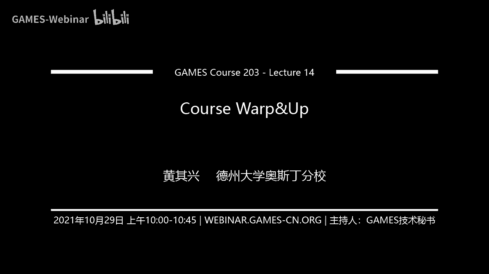
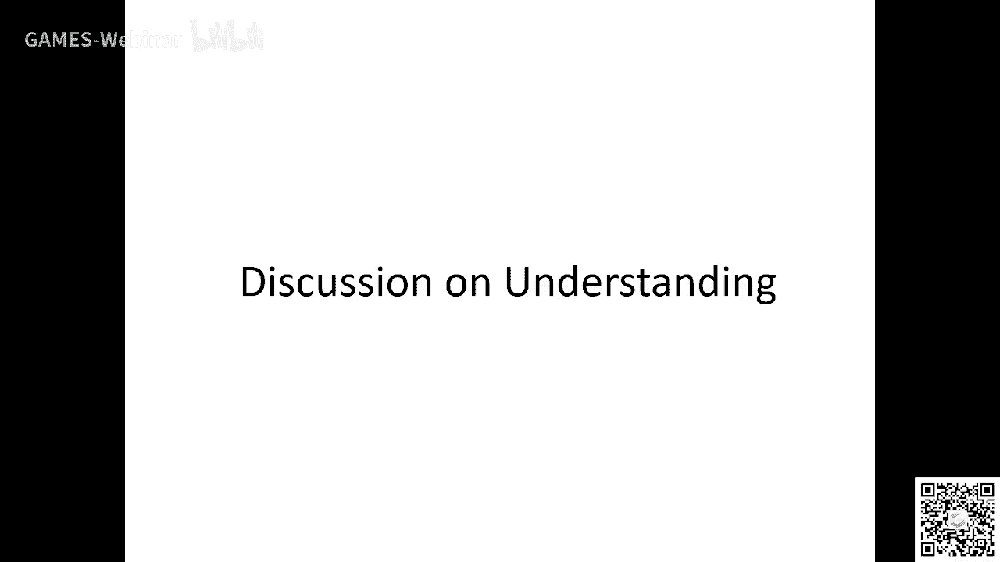
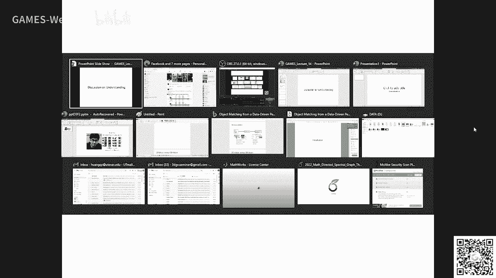
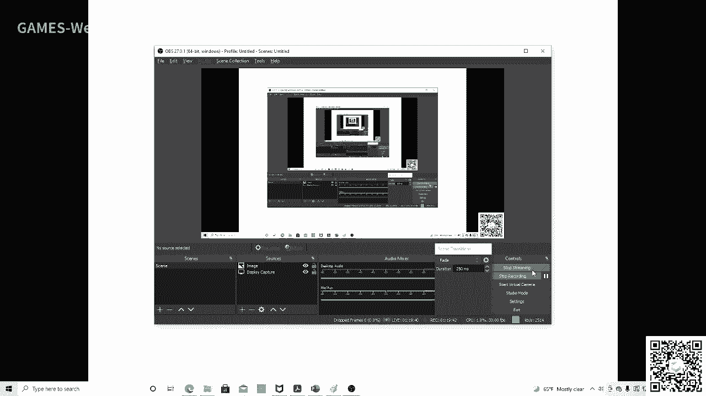

# GAMES203： 三维重建和理解 - P14：Lecture 14 Course Warp&Up - GAMES-Webinar - BV1pw411d7aS

大家好，那个这样吧，咱们这节课呢我们就把它搞成一个这个喂，咱们把它搞成一个这个期望的a吧对吧，就是最后一节课呢，你们想提什么啊，你们提什么问题，这个我都可以回答好吧，然后啊我首先回顾一下吧。

其实我们这节课呢这门课呢呃其实讲了两个东西对吧，一个就是party for cher quity对吧，其实分为三大块对吧，一大块是这个重建对吧，重建我们讲了蛮多东西的对吧。

呃重建呢我们不仅讲讲讲了这个店对吧，这个dn的基础我们讲了这个从注册对吧，重建对吧，我们讲了这个processing，就是然后后面我们讲了这个reentation对吧。

来做understanding这些东西对吧，就请关注reputation呃，我们讲这个呃，然后讲了这个and understanding对吧，然后三维视觉呢呃我们也常常在这里面讲了。

我们重点强调的其实就是重建，当然这两个就是从geoge processing和从这个嗯，呃geomeprocessing和从这个three division的角度当然是不一样的嘛。

它只有两个不同的framework，对不对，嗯，然后啊但是呢呃从representation的角度，同样的sin角度来说，这两个剧组慢慢的就融合在一起了对吧，这样吧。

这节课呢我们就基本上花有三个部分是吧，一个是重建一个entation and standing啊，and sa主要是这个deep learning对吧，我们我想就是跟大家有一些互动啊，跟大家有一些互动。

就是啊如果大家想就是说对这个重建有什么问题的话对吧，就是three dio加，或者觉得你们觉觉得哪些研究方向对吧，或者叫我叫我啊讨论一下哪些方向比较感兴趣，好那我们现在第一个问题来了啊。

就是这个三维重建的这个量化标准是什么，对吧，哎这个问题非常非常非常interesting啊，其实重建这个东西啊，啊，他具体看什么application对吧，就是比如说你在你医学重建对吧。

医学重建呢实际上呃有一些呢就比如说你看啊，就比如说你做医学成绩，你重建一个牙齿对吧，你要做这种suging planning对吧，这个时候呢你就会非常physically accurate对吧。

比如说你在上面跳一套牙膏的，你比如说我们做骨折过，就来做做这个这个这个医医学的这个vacation，这个时候呢accuracy对吧，就是你重建的这个accuracy就非常重要对吧。

因为你如果重建的都不准，那你就不能谈下面的application对吧，所以所以这是这个这个这个精度对吧，对于这一类的重点，你比如说你桥梁对吧，你去检查这个桥梁他们有没有这个damage。

这个时候重建的这个actress就非常重要了对吧，不仅有xy，你还要知道这个暗色的对吧，就是你重建了这个东西对吧啊，因为你不知道黄to是吗，你不仅仅你只out put的一个重建。

你要说是你这个东西大概有多多不准对吧，这些东西就比较重要，另一类重建呢是做这种呃，比如说在无人驾驶里面对吧，你做一个三维的地图啊，你也尽量要求这个重建它尽量的精确对吧。

哎另外一种重建呢是virtual reality，对不对，就比如说你你重建了一个three model嗯，然后你想得到normal view是吧。

这个时候呢你的服务的目标其实是这种entertainment，那个娱乐啊，what your argument via，这个时候重建要求就不高了对吧。

主要就是看你这个这个东西能不能帮你去csnow vs对吧，所以所以我不知道我这样回答可以吗，就是基本上在看你的这个目标是什么对吧，好吧，还有别的问题吗，这个问题很好啊，我看看啊，我这个直播。

我今天是拿着这个手机，我不知道怎么看这个，你们提的问题，我刚才抽到了一个问题，啊这个问题应该怎么办啊，啊，有别的问题吗，还有，哎我谢谢好，你们还有别的问题吗，这里应该不止就一个人，什么问题都会提好吧。

我都尽量去回答好吧，尽我能力这样的话能够给你一些反馈好吧，其实我个人感觉啊说到这个重建，我个人感觉就是就是就是有一个domin的这种干，就好多时候一个fd里面。

我们得到的结果往往并不被另外一个field所知道，比如说我最早的时候做了很多注册的这些工作，然后我跑去开一个robotic confi，发现我们那些结果那些robot他本人都看不到，看不到对吧。

他们自己还在那自娱自乐对吧，所以我觉得就是说嗯哦我开这门课，第一个就是让希望让更多的人了解这种意义，以前一些前任的工作嘛对吧，这这是很重要的对吧，这就是这个field怎么往前发展，哎这也是很重要的。

这个field怎么往前发展，大家还有什么问题吗，重建，这里应该不止就一个人了，什么问题都可以问好吧，什么问题都会问好吧，你们只要只要我能回答，尽量帮你们来解决这些问题好吧。

你像我们课上讲的这个这个重建的这个问题对吧，就有两个派对吧，其实以前现在比较传，以前比较传统的，所以现在工业界工业制造影用的都，但这种激光扫描的就比较精确对吧，像现在慢慢的这个region大家做的多啊。

其实就是从从这种passive的重建对吧，加deep learning对吧，这种从几张image squats view对吧，你能build correspond出来重建，现在这种研究上还是比较多的。

行就是刚才这个学生呃，我先说这个三维重建，像deep learning with the n对吧，就是这种new real traction，这是一个很好的研究方向对吧。

其实嗯其实现在一个fundamental问题并没有解决的，就是比如说，你到底是counter所有的东西，还是有一部分东西，你通过这个通过这个pa就能折就能就能就能解决对吧，其实唉这个问题呢其实很广啊。

解解决的办法，解决的办法也有也有很多，对不对啊，一般情况下分为几种吧对吧，第一种就是你重建了一个东西，补不动对吧，把没有的东西补出来，哎这个东西呢呃有很多人研究对吧，有很多人研究。

但我个人感觉就是呃也没有什么那种特别特别好的吧，无非就是你这个日本为什么就copy对吧，你说哪去对吧，这个这个东西这是这是一块，另外一块呢就是直接呃我个人感觉吧就是比如说。

对你比比如说这种new的new的这种这种这种呃重建，就是还没有一个办法，没有一个方法真正就有一个georetical framework对吧，其实说白了你比如说现在一般两种办法。

一种一种就是你每个view去重建，对不对，特别sparse the view，没有那个没有那个overlap，这个时候你传统的division就没了没有了对吧。

你就可以用那个你可以可以用那个呃从single view做做出重建，然后把它field在一起，那这个时候主要用的就是一些single view对吧。

其实就是说你怎么给个mac mac image dots的depth，这这这是一个方法对吧，呃比较interesting，就是你怎么在这两者之间找一个balance，对不对，找一个balance啊。

就是有两块对吧，第一块就是说你怎么更好的去得到这个image to image这种corresponders对吧，其实有很多人研究的就是啊传统呢我们就是找这种对吧，就是摄取对吧。

现在有人研究就是用deep learning对吧，这个cowarning对吧，去找更好的correspondence对吧，诶这个能得到更好的重建对吧。

啊其实就是在原有的这个three three d呈现的这个基础上加了这个东西对吧，另外一种呢就是你你从那这个这个就是image q to depth这种prior，对不对啊，这种这种prior啊。

其实其实我我们发现什么就single view，它它其实就是说这个dex这个方案，single view这个depp这个这个东西啊，呃他的这个up lute这个东西啊，往往忽计的不好。

但是有时候你如果把这个up ute deaf给bout掉，那个single view，现在其实这个depth sation还是比较准的啊，比较准的，然后重建呢还有一点我没讲啊，就说你怎么重建这个卡的。

对吧，怎么重建这个color material，对吧，不仅仅是geometry对吧，怎么甚至怎么去predict the physical property，这一块东西呢我觉得将来是应该有很多。

特别是做rendering photorealistic这种东西，我觉得这款现在随着这个neuron a nerf这种起来吧，这一块的话啊，研究的会越来越多啊，但是我个人感觉你在image里面对吧。

你有shadow，你有那个high，你有那个highlight，你这个lighting lighting effects，你怎么把这些东西都移除，然后变成变成一个photo relic这种重建。

哎我觉得这个现在还没有解决的很好对吧，但是这个东西呢你不解决好，其实你也得不到好的结局，对不对，你比如说这些东西。

对他也fect你的correspondence不也fe你的这个这个deft imation对吧，这个prediction对吧，嗯所以我觉得就是说如果真的要打通这个充电的话。

还是要把呃以前rendering对吧，就是这种nt的这种模型跟猫都好，给mod好对吧，真正要做的这种非常high quality重建的话好吧，呃这一块的话啊，对这一块呢它是一个系统工程，等一步一步来啊。

得一步一步来，哎刚才这个问题我们就稍微延伸了一下好吧，稍微延伸了一下，就是呃我觉得首先deep learning嘛啊它提供了一个桥梁，把region和graphics联系在一起，对吧。

嗯以前是这次这个不太可能的，那么现在我觉得至少有一个这样做也可以，有一个桥梁把两者联系在一起对吧，好吧，这个问题问的很好啊，还有什么别的问题吗，什么都可以问对吧嗯。

就我个人感觉这个games平台啊将来会往往外涨对吧，我们会有更多传统vision的理解的东西进来对吧，会有传统很多更多更多的english problem，我们需要去解决对吧。

因为graphics走向data driven，这是一个趋势对吧，呃graphics走向data driven，这是一个趋势，无论是呃重建and standing还是还是这个什么design对吧。

但是你data塔从哪来呢对吧，data从哪来，我觉得对吧，很大一个是从上，我还是需要重建对吧，你重建的话，以前是你重建，甚至有时候你是重建出一个model，对不对。

你现在的话你直接可以把new和up或者搭在那个and standing后面用，那我直接做and to end对吧，你可以直接从image来做graphics，对吧啊，这人工作当然已经有很多了对吧。

那我觉得就是说这这这都是可以的对吧，是吧，好还有什么问题，重建对吧，你们谁什么问题都可以问好吧，这样的人人慢慢多起来了对吧，我觉得应该也不少能看对吧，什么问题都可以问对吧，还有什么问题对吧。

我们这个十点半我们转到这个reputation，对吧好吧，我们现在还有13分钟可以聊这个reconstruction，什么问题都可以问对吧，你可以问一些，别的对吧，不一定是比四ch对不对。

什么问题都可以问好吧，这个机会难得好吧，对我们也可以想想重建对吧，这个我们这个三维重建还有哪些同学们可以去，新的同学们可以去解决对吧，比如说我这门课没讲的，就dynamic，dynamic。

dynamic reconstruction，the four dimensional reconstruction，我没有讲对吧，对吧，这个dynamic重建也是很重要的对吧。

dynamic这种东西的重建对吧，非常非常重要的对吧，等年密子重现无非也是解决一个考方式的问题对吧，解决一个correspondence的问题对吧，怎么去mo再去再就是怎么去model。

怎么去怎么去model这个呃这个这个这个motion对吧，对吧对这些东西都是很重要的，对吧啊，但重建的话其实嗯它有几种重建，像dnm重建的话，一个就是你可以用elise reftation去做重建。

然后再想办法去解决correspondence的问题对吧，然后开始，然后这里面其实打namix的重建，我觉得现在大家研究的比较多的还是在几何的层面对吧，你怎么去利用physics对吧。

你用physics to understand with这个motion对吧，这这方面的工作还不多啊，不多，好吧，还有什么问题吗，对啊，不要不要，大家不要那个，几何处理方面呃，那个问题没看到啊。

几何处理方面能能再给记录下那个问题吗，第二个，等一下我把那个问题找出来了，诶我怎么看不到了，这个，对刚才这个问题我没看到，你们能不能再复述一下，就是这两个问题好像，他就一划而过了对吧，我现在是用的。

我给几何处理方式为什么好，现在目前好像很少有能力的方法来做啊，唉这个问题呢这个问题我觉得就比较interesting了啊，就是有两个原因啊，就是说，就是几何处理这个重建这一块，传统的方法呢其实已经不错。

它有软件出来了对吧，你有软件出来了对吧，嗯你要软件主义说叫我10年前20年前的这个叫magic对吧，小magic对吧，对吧，选magic，如果已经有软件出出来了，出来了以后，你要再改变这个feel的呀。

就不那么容易对吧，你得你得真正是革命性的对吧，比如说以前也有这个以前也有这个three revision是吧，seed等等等等等，and standing对吧，那个你非得要地址，等你出来以后。

就真正整个行业一直哇新的技术，新的技术革命来了，我前面的都不能要了对吧，哎这个时候呢你这个learning的办法才能真正找到最新的这种ground，我举个例，我举个别的例子。

比如说be flying对吧，b c one它有很多缺点，但是你知道所有的工业软件它都是b c one，肯定是一个standard对吧，因为这个原因。

你后面a段b段各种各样的方案以后不就会出现什么东西啊，各种spin以后，他就不会被这些软件上去用了对吧，因为别称是define对吧，很好的工作，因为你你一个软件，你一个真正被大家广泛用了以后。

你要改变这个软件的核心的东西，那你那你这个成本也太高了对吧，对他们，所以就是当一个东西方法出来了以后，对对方法出来的厚厚的这种东西以后，你做你这个东西做研究，你是需要有这个驱动力的嘛对吧。

我个人感觉就是这个learning这个东西在讲讲processing啊，你得非得有一个质的飞跃，就是以前的方法你根本就做不到的，次的飞跃对吧，质的飞跃的时候，我觉得这才能产生硬盘。

还会有更多的人去follow他，那我个人感觉呢，你觉得哪些方面能有些智慧，我觉得大规模场景的重建对吧，你重建一个楼，一个city对吧，我们能不能用很少的这种mament加上一些images对吧。

做成真正一个scala，我的roa east对吧，它不是一点一点对吧，一个东西它是整个一个有了这个东西以后对吧，你还要找到一些好的办法，你比如说每个人做重建对吧，我我在一个房间里面。

我就拍几张image，我就能重建一个three dimension的东西对吧，真正把这些东西做到非常鲁莽的时候，哎这个几何处理对吧，你比如说那个不动对吧，你说个重建对吧。

你你你把一个一个变成一个开的model对吧，真正真正的这个做非常鲁班的时候对吧，就是比以前的方法要好太多的时候，这个时候我觉得慢慢人发的人就会越来越多的对吧，发的人就会越来越多的。

and understanding就会发现cvp啊，这个西瓜做的很多很多，为什么，因为以前这个但他的确做的不怎么样嘛对吧，你现在的方法做一个出来都比以前的方法有值得提高对吧。

而且and understanding现在他有一个很好的ground嘛，就比如说logo的learning是吧，你robert你这个这个机器人，你查了这个周围场景，你需要写stand。

然后and stand清楚以后，然后学更多的fs对吧，imitation learning对吧，这些东西对吧，它它就是有一个好的桥梁，对不对，你像传统的几何处理这个，ok那我先把这个问题讲完啊。

这这个我觉得很好对吧，嗯啊就是这个这个，所以所以说我就觉得嘛就是说如果你你只要处理上面，你已经有一个传统的判断了，你要真真正去改变这个python，你需要质的飞跃，就是大家觉得就是真正大家愿意投这个钱。

把这个python给重新改掉对吧，否则的话我觉得呃很难，但是呢把能力嵌入到这个geomg processing里面，这是个大的趋势啊，现在有很多人在做，慢慢的我觉得就会会改变它对吧。

特别是后面的这个editing部分，怎么把它变成个smart对啊，怎么把它变得更smart，我觉得这都是可以的好，然后我再讲讲讲这个三维的这个和弦之间的问题啊。

三位的这个可解释性的问题。

三位的这个可解释性的问题，我觉得挺有意思的啊，因为你本来三维他就是要比这个就是要比这个呃。

就是比要比这个东西更更更鲁棒嘛对吧，范围就是要比这个呃上面就是要比这个东西更鲁棒嘛对吧，呃比to d对吧，它它有更更好的解magic的这种这种这种这种representation在这对吧。

有更好的这种前面的representation在这对吧，嗯可解释性的问题啊，我觉得这三维你至少就是说他是一个真正意义上的。

catch the vial的这种这种capture of of这个这个这个这个呃呃呃，three dienvironment对吧，真正的这个意义上，cat sweeeenvironment。

这个可解释的问题，我个人感觉他应该有一个更comment ground physical property对吧，your distance嗯，对吧，我同意另外一个观点。

就是说可解这些网络实际上真正意义上能将来更好的网络啊，这个我同意啊，我个人觉得是哦，我觉得是同意的啊，我个人觉得是同意的啊，最最后最妖的一定是可解释性的，可解释性的往往这个我同意对吧。

那三维上的可解释性，应该做哪些研究呢，第一就是我们怎么去定义可解释性对吧，我们到底要解释什么东西嗯，我觉得三维比two d呢，至少它的这个attributes是要更多的，比如说geometry对吧。

这个distance，比如说这个feasibility，feasibility，比如说这个motion对吧，在三维空间中，它它就是可定义就能被解释的东西或者解释的手段。

它要比这个two dimensions对吧，他要多得多得多得多，对不对，所以从这个角度来讲对吧，从这个角度来讲，我觉得，对这方面的研究是是很应该会很interesting啊，应该会很好吧。

哎我不知道这样回答可不可以好吧嗯，他就是可解释性的，我还讲一点嘛，就是比如说你也有牵涉这个marketask对吧，就比如说我们做这个post prediction对吧。

我们做post prediction，传统的方法就是安全and对吧，pose network，对不对，pose network传统的是entrance对吧对吧。

那现在好多方法都是predict key point，你知道的有关，这就是正向的解释性嘛对吧，所以我我我有机会讲这个one learning对吧。

就是把那个把a graph of new networks对吧，哎这有增强的解释性对吧，其实就是你怎么可变的对吧，你像intermediate representation。

比如说呢就是一个intermittal representation for post regression对吧，你不仅仅是你不仅仅就是让它更可解释，你可解释，还有一个什么东西啊。

别别说一个东西我都不知道它是什么，那我怎么去ctrl t了，没法去ctrl t对吧，如果一个东西可解释了，他不是说我们understand这个中不仅仅说我们understand学了什么东西。

其实意味着什么，意味着你能inquery更多的信息对吧，比如说这个东西哦，那我就可以找些keep bel对吧，比如说predict是长度对吧，那我跟你说，你这个这个不管是什么呃，那个音符的技能。

你这个长度都要大一米对吧，哎你这种就能提高，你懂我意思吧，就能引入更多的信息对吧，去学更好的东西好吧，就是可解释性文件夹一点是我们m3 对吧，这个东西到底学了什么东西对吧。

另外一点就是它open一个space enforce，更多的loss，对不对，去学这个东西好吧，哎我这样讲可以吧好吧，可解释性好吗，从这两个角度去想好吧，还有什么问题吗，对大家欢迎大家提问啊。

欢迎大家提问，好那我们下面就到这个representation这一块，好吧，诶呃就是这个representation 3位representation，当然这个话题很多了对吧。

我个人最喜欢happy representation对吧，问人质疑的，但是我欢迎大家提这个问题，好吧嗯，这个harry当然可以接触接触这个确定嘛对吧，这个harry实际上。

就是我觉得一个fundamental problem，实际上就是说呃我们现在的理论上能知道什么呢，我稍微给你们讲讲对吧，第一就是说啊，太贵了吧。

它实际上是incement learning的一种推广对吧，你可以你可以这么去说，但是你这个引sam到底隐藏了什么对吧，实际上他就牵扯到这个，你到底怎么去wifi对吧，这个object对吧。

而且呢你怎么去rap，什么是representation，representation，就是一种它就它跟这个可解释性啊很相关对吧，就是说你一个如果你有一个版本，那个你就必须一成不成功对吧。

不然你怎么叫它和解释呢对吧，你给我for recover，当然是你全部都放一个representation对吧，所以child呢我觉得next next is now。

就是说它有多少颗减性的rapper，那肯定是d要更多嘛对吧，好怕呀，各种reftation，这个three weety要更多嘛，在一个physical space里面对吧，所以所以从这个角度来讲。

就是从这个角度，从这个角度来讲，就嗯，从这个角度来讲就嗯对吧，就是这个sb为什么hybrid我们的sweet的就是user呢，可能更丰富嘛对吧，当然可以improfit cod对吧。

incorporate这个to d的图像对吧，multiview就是一种权利的东西，好吧，我不知道这么想可不会啊，还有什么问题吗，就是这个representations不会就一个人问问题吧。

我我希望不是这样啊，这个，不是我的ipad啊，政府要么政府要么就换个ctrl啊，嗯嗯就是要分分分分分清楚两种对吧，representation它是没有能力对吧，它只是一种什么表示的data，对吧啊。

top of representations，还有一还有一种就是你怎么去学对吧，其实比较殷勤，就比如说你像我们做这个做做这个standing对吧。

你到底是你把这个美国repetition that will change好，然后testing time的时候再去做seo呢，还是你喜欢你去train对吧，这些东西我觉得都要分析清楚对吧。

对这些东西都要分析清楚对吧，对吧嗯我个人觉得就是说representation这个东西，它跟这个learning的手法是分不开的啊，就是就是说或者就是说你给了你一组标准配置以后。

什么是最好的training方法对吧，你如果有有多种representation的时候，他当然不能权衡的信嘛对吧，你会做各种rap，但也只有他c4 d对吧对吧，它它实际上带来的各种可能性是吧。

就是我觉得reputation它是跟你的学习手法和不开的对吧，这不仅仅是怎么表达对吧，但是更重要的一点呢，我想提一点，就是这个rap配角比的话，主要看一下将来不应该是人为来指指定对吧。

你比如说我们最近在研究这个procedual rules，generate representation对吧，就是利用这种自动的话，自动的话我去generate vfication对吧。

哎这是我们的我们在研究的啊，我们在研究的对，好吧，我这么回答可以吗，我确定一下不是一个人，只有一个人问问题啊，那我觉得这样不太好对吧，又来一个fmc，除了special fav哇，这是一个很好的问题啊。

faa mei除了special方法，还有还有没有别的好的方法，首先我要讲讲为什么special这个东西好啊，那实际上是呃从从给有一种复利液的那种复利的这种东西。

对他他是从a poliation theory来的对吧，从ap proximation theory来的，你可以可以这么想嘛，就是，fast map。

它实际上它只是一种一种表示representation，对不对，你至于怎么去找一个basic是吧，这个basic不一定是special对吧，当然用special比较多。

主要是他有好的这种moi moi skill吧，但不一定是对，不一定是special的东西提供的这个东西啊啊好吧，为什么用special，主要是它的这个它的bass是一个新的联系对吧，有利润连续连续性。

它是一个很好的踏实的办法，所以他在用这个东西，好吧，对吧，fashimap最近有一篇对吧，就是我一个同事啊，d d ptfanction的mad，这应该是最不要的，但是可以去读一读对吧，然后看上面。

对吧，其实，对吧，你可dress address pus，我觉得python man上面就是没有没有完全解决的，就是怎么去学这个base，就是不仅仅是你不仅仅是这个special的方法对吧。

你可以用deep牛奶给自动选一个basis对吧，我觉得，这是有可能的对吧，其实你是这么想对吧，如果大家感兴趣对吧，你比如说这个bleading espace什么什么。

就是java power method是吧，你如果是一个java是pom是能算的东西，你就可以用一个graph new network来算对吧，这样你就可以学一个basis是吧。

你可以用graph new network学一个basis，然后top of that对吧，然后你再去学mamapping啊，我最近在ut里面讲那个计算机视觉是吧，其实这个问题很阴沉啊。

你比如说比如说传统方法在image上上面detect对吧，传统方法detaimage point，那你其实比如说你啊。

你这个what psa point return这个比如说这个呃csfeatures对吧，其实see the features，你做detection的时候对吧。

你是不知道别的english长什么样的对吧，但six feature和没电的功能，就是你其实不知道别的feature这个english长什么样子对吧。

你也知道detect point very likely，在别的地方都会做对吧，所以所以shift是这样子对吧，你这个算30mm，比如说用special的方法，其实那类似的问题对吧。

就是说你不知道别的shift长什么样对吧，别的那个lei个ma长什么样，但是呢对吧，我们现在用special对不对，我们可以铺一些boy sper，就是说你在别的地方。

如果这是iphy deformation对吧，这个special people good choice对吧，但现在我们在想对吧，就是说你能不能把这个音乐b detection tsd又回来对吧。

你怎么去学在一个shift上面对吧，你怎么去学这个imbalance space对吧，这个leading face和别的shift对吧，你去meshes的话。

你的这个excessive outcomes maximize，我个人一种感觉啊，就是你至少可以证明这个special technique，它应该是一个比较接近于这个最优的这个东西。

就假设你用一个呃这个这个graph new net去算这个东西的话，他应该是一个最优的，我个人感觉我个人感觉是这样的，就是你不可能也铺太多啊，bridge你们发现了，我不能感觉你可能甚至可以证出来啊。

但是这个你如果对对理论感兴趣的话啊，就是你我再强调一遍，就是说你给一个shape new graph，new network去算一个npd，i can replace对吧。

然后你然后你把这个理解这个graph news，是去提取这个leading acex space的东西，跟那个deep meframework结合在一起，在一个data在没人去学。

我个人感觉你不会比special做的好很多啊，我自己我说的是我自己也会考虑这个问题，我如果很有兴趣有兴趣啊，所以给我发一个音mail，我们可以一起研究啊，这是我感兴趣的一个问题。

我一我我2年前我就想做这个东西啊，等一直没有机会好吧，啊好下一个问题啊，这个问题很interesting啊，我觉得这个东西它有很多很match connection，对吧嗯。

它跟传统vision里面很fomc的问题是相关的，好吧，这个问题我觉得很有意思好吧，然后还有什么新问题吗，我们可以一起探讨对吧，这个很有很有这个问题很阴沉的时间，下一个问题，什么问题都可以问。

我们怎么怎么怎么入门啊，打开回啊，当然你问我这个我我会有一些大家不愿意听的东西是吧，我觉得现在大家发财，我发的太多了对吧，发高质量的陪我很少对吧，个人在我组里，我都是建议他们把paper降下来吧。

发的这个速度对吧，把配合搞得长一点对吧，搞得地图一点对吧，还有什么问题啊，representation对吧，对吧，他至少跟lia跟这把pp 10外面一样的，很好啊，其实就是rett。

我觉得可以研究的一个是就是怎么跟物体交互对吧，怎么能做更好的这种interaction，来说这种repetition对吧，我觉得这种行业全是这样，还有什么呢，可以可以可以，我们可以可以聊的对吧。

一个是我觉得这个reputation，比如说，even affordability of fd，这我没写对吧，就是说你你比如说任何一个oor就是mamao，对不对，任何一个东西对吧。

它的form其实它都不是单一的物理，他都是你想，比如说动物对吧，比如说植物对吧，人物为什么会长一个样子，会会长一个样子，为什么会开花，结果它都是跟这个资源自然界的这个环境有关系对吧。

比如说有一条信号跑的水土，空气中的养分，这个阳光除了他就决定了，比如说一个植物，它是它的样子对吧，那你有的出场比较高，对不对，人也是这样的，那你换一个环境，你可能更productive对吧。

你可能生活的更舒适对吧，你从这个角度来讲，你做出representation对吧，我们现在只是elephant single object对吧，我觉得大家是在做这个东西。

有没有想过就是怎么把这个这个reaction做成太空自然界相互对吧，不仅仅是logo小伙，这怎么去这个世界的这个交互的这个问题，你怎么比如说我举个例子，比如说在metal，因为这里面我看一个东西。

你怎么就猫了，比如说看骨头是怎么伸长的，比方你合着手对吧，哎你这个断句面对吧，他是怎么复也不合成，这个植物是怎么生长的对吧，我觉得这方面的东西对吧，以前是costimulation对吧。

以前是costimulation对吧，我等会讲如何看到那看到这个via的关系，我等我一下对吧，我讲这个就是我希望大家去多多看一看，就是把这个脑洞打开嘛，就多看看这个deep呢。

你怎么解决一些以前根本解决不了的问题，那么你研究整个这个叫lifelong learning什么，你研究这个东西是怎么生长的对吧，这个人是怎么变化的，哎他跟这个自然界的环境是怎么交互的啊。

研究这些问题对吧，我们很多的这个农作物，对不对，我觉得我我觉得可以用graph main方法去研究对吧，从这个角度去想想，这这就能真正解决一些重大的问题对吧，从人类重大的问题对吧好吧。

我希望大家希望将来看能看到你们这个有有往这方面的研究好吧，有往这方面研究好，那我现在来讲这个vision和gris的这个我connection对吧，a visor graphics。

首先我觉得将来这两这两个东西核心问题还还是有一些同样的graphic，那核心问题是做fsc对吧，image generation对吧，a型前四到毛等人选的话。

它核心问题现在核心问题主要是做i'm standing对吧，就是理解对吧，对吧，那么graphics呢，比如说我觉得这两者他现在就是你干嘛，就说。

就是我觉得这两者的交interaction会越来越多对吧，比如说你尖锐的东西你都不理解那个东西，你怎么去generate的新的东西对吧对吧啊，做semination也是对不对。

做semination也是你不去理解对吧，你怎么得到data对吧，怎么得到data对吧，你需要自从manager里面去做个spanning对吧。

就是我觉得接下来肯定就是graph这个python vier那个python结合在一起对吧，会结合在一起就解决一些问重重要的问题，更重要的问题啊，还有就是呃他是basic对吧，就是我觉得也是很相关的。

比如说grap也需要比较比较好的是mamagic foundation，你你把vision做好，你也需要比较重要，比较那个比较foundation的。

my good mamagic foundation，这两者都需要，这两者都需要，这都是这都是很重要的好吧，这都是很重要的啊，所以我现在记住我红夫肯定是gramc，反正我同学也是对准对吧。

为什么发的文章也不早了对吧，但是我主要是three d这一块，主要是three d这一块，好吧，我觉得这个graphic vision他将来肯定有更多的人对吧。

他对这个intersection这个ava是吧，我发在这个还有更多的人对吧，更多人来来来接触这些东西，好吧，然后你们还还还还有，小组配合写写作效率啊，我觉得写作这个东西其实我跟你讲啊。

就是我在美国读书之前，我的我的rp是一塌糊涂的，做writing，就是这个中文就是这样的，第一呢你不断的写，你不断的洗啊，不断的洗，他不是一遍就好的，我跟你讲不是一遍就好了。

哪怕我现在比如我写个proposal，写个proposal对吧，你你你你比如说你一个好的配合，它是怎么出来的，它不是一遍写成的，它是改出来的啊，这个我可以语句的写，你就不断地写，不断的写对吧。

但是呢你也不要一天都当着写，你过一天你你换一个，你对吧，你把配置写好，你换的那你过两天再去看一看哎要发新的问题对吧，你会发现新的问题，然后你再去改的话呢，你就会提高自己，就会提高自己，对不对。

paper writing，我个人感觉就是你们用中文能写清楚吗，很多时候其实它不是一个一个language的问题，你懂我意思吧，我看过很多中文写的好稿子，那也是他他是一个逻辑性对吧，逻辑你懂我意思吧。

paper实际上说白了infer paper它不是词藻用的很漂亮，它的整个配合它很有严谨，很有逻辑性，懂我意思吧，你要一个paper要commiss。

你要你要你要需要一个good big picture对吧，你要真的要高瞻远瞩啊，同时你要一句log，对不对，你要吸引人的，吸引人病人，管理我觉得没有没有什么好好那个那个就是第一。

就是你需要这个脑子学生在线的学生对吧，你需要脑子学生在新的学生，对吧，我觉得就是说要建立一个好的运作方式对吧，就是你要有一个核心的思想对吧，希望这个比第一次写长的怎么样。

第二我觉得很重要一点就是大家要多阅读对吧，多读好的东西，脑的东西啊，其实好的，你能一穿了，对不对，你像我现在就是说我个人单，我也不是吹嘘嘛对吧，我有自己对整个build的一个办法对吧。

这个看法我觉得过2年过3年也不会过时，对不对，但我还是会读一些新的赔本，对不对，读一些新的paper，但是你要对这个field大的了解对吧，我觉得我就比如说我想这个recall，其他什么mc。

我觉得这个东西它不会变的嘛，过2年过3年，过5年还是只是每个上面都会有一些镜子啊，对不对，比较错误的观点就是你只读最近的文章啊，读那个六个月的文章对吧，这是不行的，懂我意思吧，这是不行的啊。

你要读一些class的文章对吧，这就是我这门课为什么跟你讲classical的东西，我讲了以后，我就发现我有很多idea的可以越class的东西对吧，往往你做出自己。

他就他这个delta就是跟你这个save的东西，他就更能更能revolutionary对吧对吧，而不是移动危险对吧对，这个很重要啊，这个很重要，我觉得现在有点不好，就是你那个东西对吧。

当然所有东西你改改我改改对吧，发个配置对吧，你要有一定要狼吞的够啊，要一个长期的这种go在这，我觉得这这这才是真正驱动这个field往前走啊，驱动这个fid往前走啊，对你你改一改，我改一改。

就容易出现这种抄袭，对吧啊现象对吧，对我也而且就是你如果一个学生刚开始的时候，你不要急于让他去发配粉是吧，我觉得这种这这这是呃，这是很，你要把基础打好对吧，学的该学的课要学好，好吧，还有什么东西。

四分钟我们就到那个3d那一块好吧，还有什么问题，好吧，什么问题都可以提对吧，那我们就到这个and understanding and sending这一块就理解对吧，这是三维理解对吧，我首先开个头。

我就是讲这个三维理解，这是嗯其实就是三位理解，我觉得就是说大家大家现在研究的很多的是这个怎么用，怎么去解决一些传统的问题对吧，其实same tation confication对吧。

我们其实说白了我觉得这一点没做好，就是我们做什么three division，我们就也做什么，对他们做and standing，他们做这个我们也做，但是我觉得咱们能不能抵抗一些。

在三维就是抵抗一些特技做不了的东西，当然有没有想过去研究这个对吧，比如说这个physical properties，the material propertic这个property对吧。

你比如说你这个这个物体，它是它的各个part的时间，他是怎么联系连接在一起的对吧，怎么去用那个join，比如三维我们能不能我我就想知道就是我们能不能确定是一个vision，没有的task。

这就是根本做不了的test，就是拿我们的三位来做对吧，因为三维啊，你其实就是是对整个这个csgo性，你有一个very，就是有一个ap的in coding对吧，你能思考一些受不了的东西对吧。

但我现在感觉就是这方面的他可没有对吧，或者很少，或者就是他popular，对不对，不那么popular对吧，对吧，所以这是我想我想希望大家去思考好吧，大家去思考好吧，affordance可以算一个啊。

就是人比如说你这个pymatic怎么跟跟这个物体去交互，但是to d呢也有人类存做，但是但是做的比如说你three d对吧，你怎么去给你一个人对吧，给你一个人的这种。

你怎么去抵上一个chair design，一个bicycle对吧，去去去去跟去呃，那你可对，我觉得我希望看到更多的这方面的工作，对吧，然后下面下面大家有什么问题以及对吧，我刚才隐喻对吧，我讲完了对吧。

然后我再重复一下，我就希望看到一些当年的task to d是没法做的对吧，这样的话你就能把这个field gros了对吧，就是isolate对吧，你否则什么他们to d做什么水做什么对吧。

data这不是对吧，我觉得不是长久之计对吧，别人笑话我们对吧，哎好吧，来半个小时对吧，我们看看看看你们有有什么问题问对吧，我都可以回答好吧啊，不限原的，什么东西都可以对吧。

就是怎么把physics material poverty，对不对，弄进去对吧，你比如说你一个椅子对吧，或者重建一个椅子，and send一个椅子对吧。

你不是说这个怕有没有想过understand这个这个part是用什么做的，他是个铁木头对吧，显然这个东西它有对你很显然你如果这么精确搞错了，你说你能你能坐上去会垮嘛对吧，比如说如果是paper做的。

那你人坐上去不就垮了嘛对吧，他肯定肯定他在这个我就是给大家写对吧对吧，或者这么抵抗的话，如果这个东西不是铁的这个木头的话，它看你能碰一下，它可能就顺了，对不对，就这些东西的话。

我觉得在td他就不好stand了对吧，也不仅仅是一个对吧，他跟你这个跟你这个三维结构对吧，它很有关系对吧，这方面的名字就我觉得还是太少了对吧，也没有data对吧，所以从这来一个问题啊，如果交一些材质。

嗯，是一个good good point对吧，用什么数据集来train对吧，个人感觉的呢就是说three d的圈里呢，应该是一部分lbl这种东西重建的东西对吧，还有就是这些东西嘛，他你可以折。

我这么说吧，就是说你比如说厂家生产一个东西对吧，这个sweet model的对不对，各种东西的对吧，我们就是没有这个data对吧，如果谁能帮我搞一个这样的dataset，我觉得这是很好的对吧。

也不需要大大的，其实好多时候你不用一次，就是这样的，不仅仅是说啊你一个人去搞对吧，你比如说你你首先这个bd只有一个人对吧，你过了2年这个p的有五个人对，过了3年有十个人，20个人对吧。

你这个骗子越来越多，大家如果有人感兴趣的多了对吧，慢慢的他们就会有一个人来，那可能别人就有资源嘛，对吧对吧，然后慢慢你就有更大的dataset，关键是怎么就没有这个东西对吧，对吧对这是很重要的对吧。

它是一个能称的东西，它是一个囊撑的东西，但是还是太少数据能获取，这么说，比如说你能check每个人有一个比赛，他a上去，不过数据数据对吧，他这个东西也是对吧。

我觉得我个人觉得有时候你可不是一个这样的数据集对吧，办法就是实际上好多时候它不是解跟减一个数学题对吧，它是一个活动，能摸更多的人进来对吧，慢慢这个处理器就大了对吧，有这样一个东西也能引入更多的进来对吧。

还有什么问题我希望大家多提问啊，我觉得这些问题都很好，哎我也想一些对，作为一个finity对吧，就是mid career对吧，我也不是不像那个刚才坐下后对吧，别去毕业很多年了对吧。

秘书谈一些对自己对这个feel这种这个见解吧对吧，也不一定都对对吧，但是我希望大家就是希望大家对大家有一些启发嘛对吧，其实国内嘛我个人觉得就是，大家去开发啊，就是实际上果然粉丝的人。

特别是果然粉丝都是你能做，就是引诱更多的人进来，就知更就是让他更每个老百姓的生活对吧，去想一些点子对吧，其实很容易其实是很容易投入这个feel对吧，因为现在大家生活以后。

你慢慢的对对这个数数字这个需求那个的对吧，我觉得就是不仅仅是我就是就这么国家层面来投投钱对吧，也可以开发一些渠道对吧，去去promote这个field啊，从caa从各方面对吧，有问题吗，随便问都可以啊。

随便问啊，我觉得今天聊得很开心啊，是true method，其实在vd会有更大的能信对吧，因为嗯that's really d嘛，嗯你你lose information更能更少的话。

实际上就跟你用一些这种你就这么hand classy的话，这个路这种空间就更大了对吧，空间就更大对吧，这种空间就更大，对不对，我从这个角度来讲，就是说呃对吧，interesting嘛，对不对。

所以从samsuper weekly sui，实际上就是说你要做成的话，实际上就是你要加入一些inductive bus svd的话，你比如说你snh啊，permit啊。

这个这个是ioc information对吧，这种各种东西都我们都会model，这个电影没法做嘛对吧，这样的话有了这些东西以后，你就能死的，你可以减少这个three d的数据量，对吧对吧。

比如说做shisetation，你如果能在能在很早的category上面把这个shape semitation做好对吧，个人感个人感觉a对吧，你比如说你1000个category of mamad。

56开这个v就能把什么东西都cover住对吧，啊，从这个角度来说，大家可以想一想，对吧好吧，问题，随便问啊，不要拘束对吧。

二，大家希望希望希望大家也刚才我我会再多讲两句，这个weekly对吧，或者下面说话对吧，不仅是你看这个三虚化和mini虚化的，它不仅是说呃你这个呃，这个这个这个data的个数对吧。

同时也决定你有什么representation对吧，你data咋了，那你就加representation是吧，three d的话，比如说计算机这个object之间的distance对吧。

你比如说不同的representation去怎么怎么去made这个representation compressing，对吧啊，从这个这这几个角度对吧，想一想对吧，你可以去想一下啊，还有什么问题对吧。

咱们那个欢迎大家那个留言是吧，没有问题了吗，我再等几分钟吧，好吧，都可以问嘛对吧，我希望大家关注一些这种不同应用场景对吧，三位视觉autom driving，对不对对吧。

或者就是understanding or tom striving，你没有想过这个，你们想过一些别的场景音作二作什么城市里面对吧，你们想过一些别的产品对吧。

这种这种比如说这种水箱water的这种随机的重建对吧，水象你其实你比如最近大家研究别人有流行，研究这个从上从这个从这个声音，这个声音加上这个，呃这个这个这个image你可以做重建对吧。

水箱你没想过声纳对吧，你可以跟vigil对吧对吧，做重建对吧，其实你想哪个的这种，你想哪个impact的要大，俨然那个水下的那个impact要更大一些吧。

哈我希望我个人觉得就是你你你其实所有人都做一个什么一个lnt，我希望就是说比如说你从一些管理，我们能开辟一些新的东西来做对吧，来做对不对，我希望就是其实其实很多data他的获取吧，他就是。

smart idea对吧就对吧，但是你最开始promote一个feel的时候，可完全可以用synthetic data开始，对不对。

我希望就是那个conference organize能tolerate这些文章对吧，没有一个view data set对吧。

但是我可以从similar data来解这个verse the problem对吧，比如说水下对吧，对similar这个water对吧，这个这个东西，所以任务我对你包括这种呃这种这种。

这种高海拔的地方对吧，海拔的地方的这个这个对吧，随着这个这个这个这个空气不一样对吧，你这个外部环境对对这个生物对吧啊，这是影响对吧啊，这都是很好的问题。

怎么我我觉得我就是说怎么用grace vision去改变我们，就是我们就是真正就是augment人的这个which rehability，对不对，我觉得这都是一些很好的问题对吧。

这些东西我都希望大家认真去想一想，认真去想一想，什么问题，希望大家踊跃发发言对吧，我觉得今天问的问题其实都比较好嘛对吧，提问吗，就是呃你们那个，有什么问题吧好吧，你上了课以后，下了课以后，我刚才说了。

你如果对这个30mp感兴趣，你可以跟我联系对吧，然后你也可这个发email给我，好吧啊，有些我后来才看到你很多email，听到我那个拿邮箱了，我也不知道为什么啊好吧。

是我们可以通过这种方式去那个聊天对吧，反正我我就做一个坦白吧，只是说就是说呃有一点反复强调，就是说我觉得大家不要忘了这个这个stars stars好吧，traditional就是这种很早以前的东西好吧。

我我希望大家千万不要忘了这个东西对吧，特别是deep learning的时候，不要太急对吧，你先把基础打好，就是我觉得是这样，当然就我个人感觉就是你如果要真正做好的米设计，你要你要是把这个q的话。

怎么发展到这一步的，你要可以认识清楚，你认识清楚，懂我意思吧，哎你要把它认识清楚，这个基础以后呢，你才做更好的东西好吧，有了技术的基础以后才能做更好的东西好吧，我这门课主要给我没讲多少，这个你的求你了。

我我自己也不是那个呃不很喜欢这个东西啊，我讲的大部分都是这种传统的东西对吧，呃怎么他以及他们怎么在地图的那里面通氧化的好吧，那呃我们这这节课就到这好吧，然后你们有什么问题啊。

你可以随时跟我那个白衣乐好吧，我愿意回答愿意回答呢好吧，然后，你们可以呃，我我只要只要只要你们就是我，我我有微信啊，我有微信是吧，我但我不会在这公布对吧，但是你能你要了我的微信，你想加我对吧。

你上了这门课，我一般都会接受好吧，哎可以可以通过这个方式去聊吧。

那今天就这样好吧。

