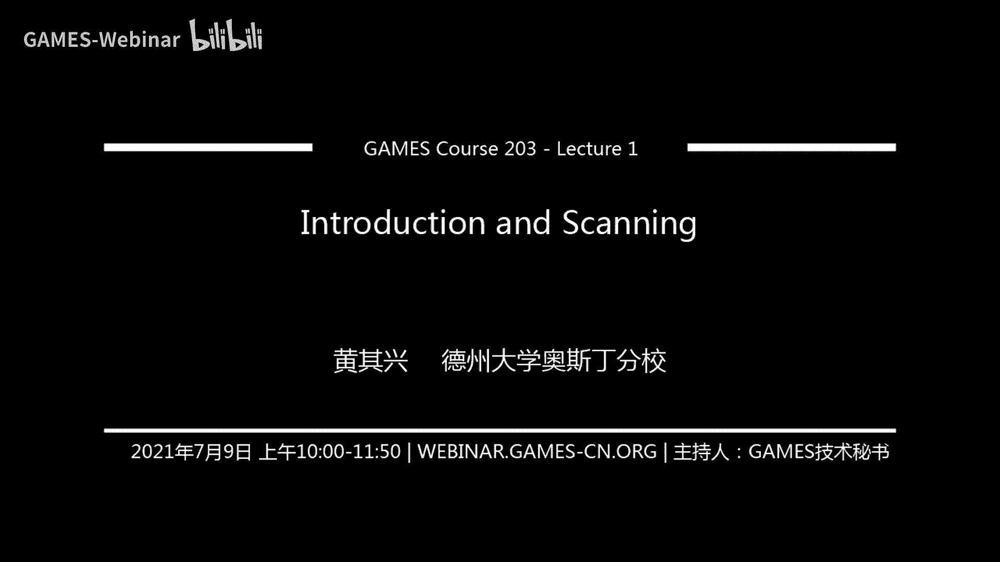
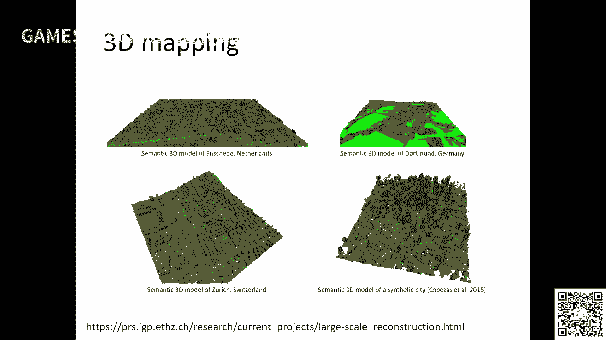
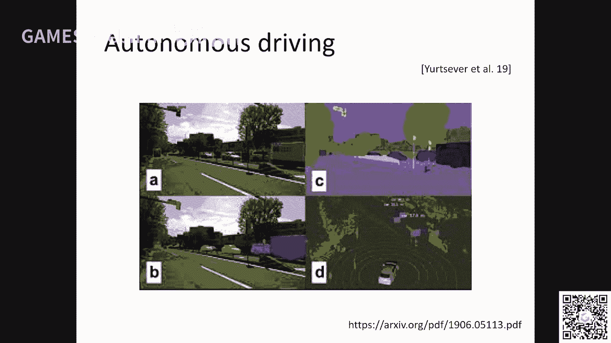
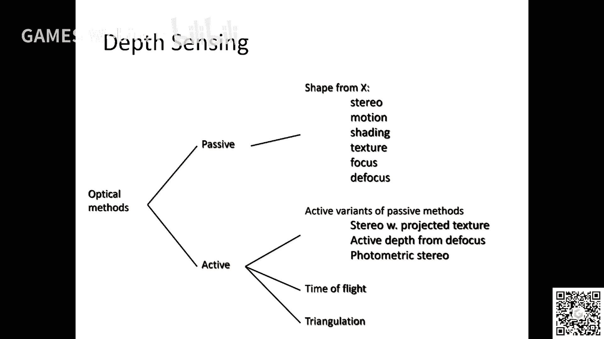
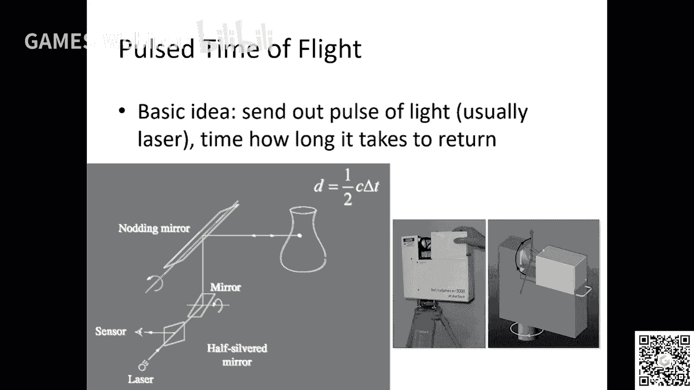
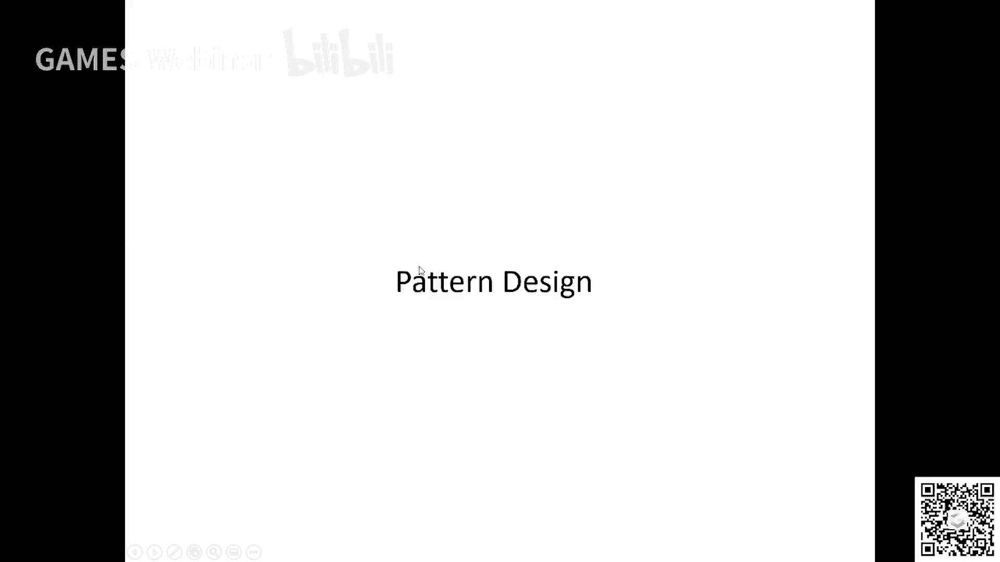
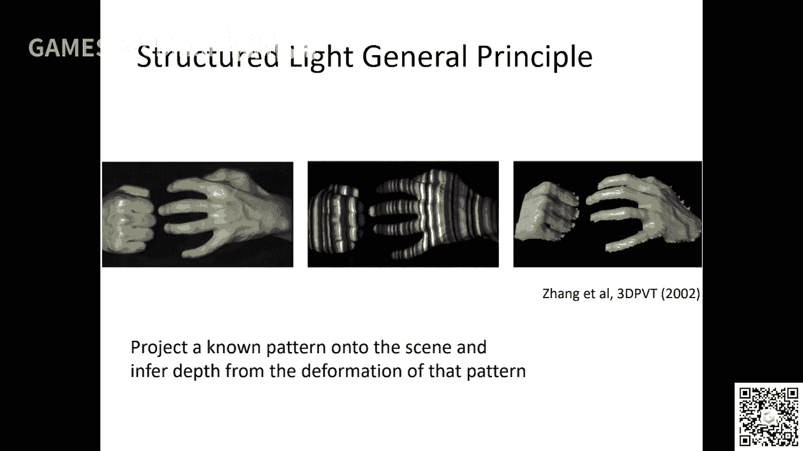
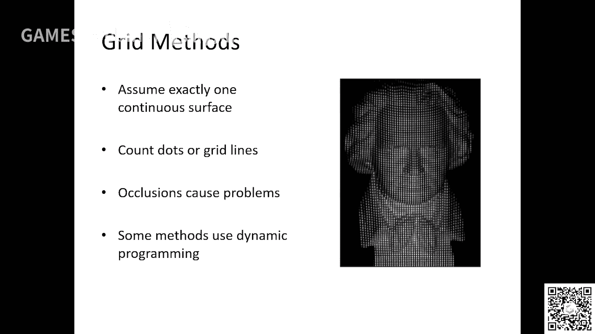
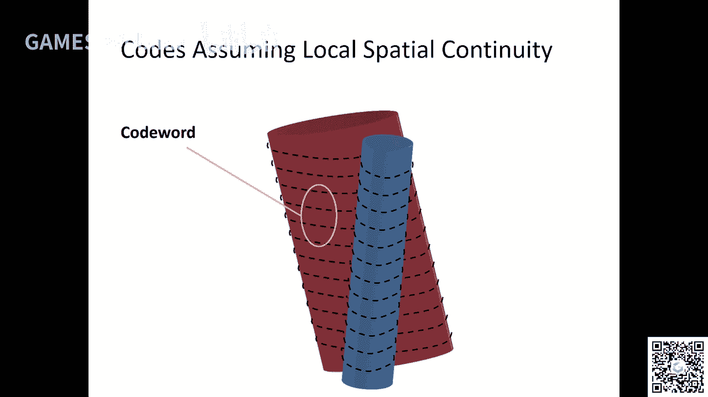
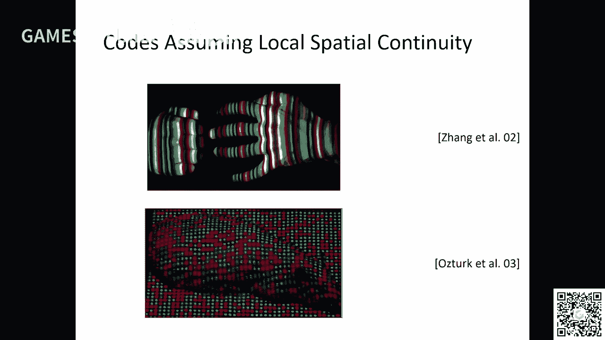

# GAMES203： 三维重建和理解 - P1：Lecture 1 Introduction and Scanning - GAMES-Webinar - BV1pw411d7aS

好吧那我们就开始吧，好吧啊，欢迎大家来到那个我开了这门课啊，实际上啊这个title呢首先声明一下，就是这个讲课是肯定是用中文啊，因为方便大家，但是这个flash呢因为呃就是一个是方便嘛。

再一个就是学术术语上面呃更精确一些啊，我们都是用英文的啊，这个希望大家能够谅解啊，啊然后这门课呢啊我首先想想为什么要开这门课，这门课实际上就是说。

这个title相对来说它比较的technical就当为重建和这个理解对吧，但实际上呢我们把它可以可以看成是就是这个motivation这样的，就是说呃其实有两个field嘛对吧。

一个就是像我自己是做做做graph，做vision的东西对吧，在graph里面呢有一个field叫几何处理对吧，其实也有一个会叫simple chargeothy对吧，这个是研究这个三维物体的。

怎么表示啊，重建啊，理解对吧，在这个三维视觉里面呢，就三位数学就是计算机视觉嘛，里面有个bd就是三维视觉对吧，那现在呢大家研究的这个主要的问题呢，也也是这个表示理解什么东西的对吧，然后开这课呢。

就是希望就是说呃，就是我们我们把这两个这两个这两个这个build合起来看对吧，我们看看能不能找到一些共同的东西对吧，就是说啊因为现在这两个fs相对来说这个融汇贯通非常非常多对吧，非常非常多啊。

然后我自己也搞了一个叫做three d cv，three d jp vision的一个series对吧，大家可能有一些呃一些呃啊朋友知道这个事情对吧。

啊啊这个课呢实际上就是说呃我们就是说呃就是这样可以这么来说呢，就是说几几何处理呃，其实他也分很多方面对吧，有些人做微分几何地的这方面的东西对吧。

就是嗯我们这门课呢主要是把它从这个就是in vers pro视觉这个方向啊，方面来看，这个geoning process对吧啊我们也有时候有把它叫做sweet ching process对吧。

这是一个方面啊，然后还有一个就是三维视觉，什么三维视觉里面现在所理解的离不开其他的，就包括自己的东西对吧，就是就是特别现现在这个三维物体这种表示嘛，啊那我们就希望通过这门课呢。

我们把这两个东西呢把把把这打通对吧，我们用一个用一个这个嗯共同的视角来看这个这个东西，好吧，嗯然后这门课呢我重新介绍一下自己的数据，我是在现在又调兵对吧，来了好几年了，现在是做助理教授啊。

这门课的时间是北京时间的，这个就是周五啊，每周五啊早上的十点钟对吧，嗯我们现在还在赛道，不一定infrastructure，如果你有学术问题啊，学术问题你可以直接给我发email啊。

我争取所有的email都回好吧，然后你你如果想了解我的research呢，你可以到我的主页上去看一看啊，然后这门课呢会有两两次作业对吧，两次作业。

然后还有一些呢就是optional的这种啊这种这种这种大作业对吧，这个嗯你可以，你如果如果不管，如果没时间，你不用做对吧，但是我会提供一些包括这门课，我会给你提供一些这个。

呃一些potential profe对吧，让你去选看一看啊，然后呢我刚才提到了嘛，就是说我首先来源营销单纯是吧，就是比如说gg processing对吧，其实就是说这是一个怎么说呢。

这个pu大概也存在了呃，至少30~40年吧，有优惠叫simple george boing，今年应该也是，快20年了吧，2003年开始的啊，快20了，快20年了啊，就是这个东西实际上它是一个什么呢。

它是用一种呃计算的办法啊，计算的办法来研究这个这个physical object对吧，那计算的方法的话，也就是说第一步第一个很重要的问题就重建了对吧，比如说我们看到很多这种b这块的这种物体对吧。

呃这个这个这个自然世界里面对吧，我们在生活中很多非洲object，然后呢我们要把它变成一个三维模型对吧，首先那那首先要通过这种硬件扫描对吧，那我会讲这个东西，然后把它变成三维模型，变成三维模型以后呢。

就做这种处理和分析嘛，比如说我们我们怎么怎么让这个表示形式比较好对吧，比如说首先是怎么表示他对吧，那又怎么样表述它的话，那每一种表述里面怎么去凹陷，表示它对吧，然后有一些处理的话。

比如说我们要做参数化对吧，贴文理，然后我们那你作为做做就把把这种federal变成这种three d的这种object对吧，我们会具体讲这个东西啊，就是说你可以如果你对这个bd的不熟悉的话。

你就理解成就是这么feel your object，我们在计算机里面make了一个copy，好吧啊，这这个其实就是这个事情会牵扯到一系列一系列的问题，是很多人就是有问题去研究。

但是make a physical house的时候呢，我们就可以用计算的办法去做一些分析，比如说啊这个这个东西，比如说它它它的这个part对吧，比如说这个物体跟那个物体哪些地方是对应的。

对吧啊比如说我们怎么怎么把物体组合起来，变成更更更更更多的物体对吧，很多很多这样的问题对吧，然后这个是在说我们也可以可以说有个fc object fsc这个世界对吧。

我们也可以有一个这种这种这种这种虚拟的世界对吧，虚拟的世界收音感觉有点难受啊，现在好一点吗，我对着这个讲吧，唉那那现在这个processing和analysis呢，他就是在这个虚拟的世界里面。

虚拟的世界里面啊，就是这个virtual对吧，然后你你在这个虚拟的世界里面把这个物体编辑好了，你又可以回到这个，你就可以回到这个物理世界，这叫three printing啊。

我们争取讲一点点three printing啊，但我希望将来啊在这给你james这个平台，有人专门来讲这门一门课啊，我觉得这是一个很有意思的东西啊，好好都是gg propeline对吧。

你可以看这里面有两个部分，一个是重建对吧，还有一个就是这种and standing processing对吧，这是graphics对吧。

graphics这个community怎么看这个three d mode，但是three graphics有很多别的topic对吧，animation on the rendering，对啊好。

然后我在讲sd 33维视觉对吧，其实这个肯定ity相对来说他比bp这个肯定更大更大对吧，它其实这个也很interesting对吧，其实三维视觉传统的就是就是非常狭义的去看三维视觉是干什么。

就说我们去recall the underline three destructure for image对吧，就是嗯这个image实际上也是capture这个thesical world对吧。

但是呃呃george poser里面这个重建的他从desc来的sky来的对吧，呃它不牵涉到这个呃，基本基本上不清楚image是吧，v视觉里面就是说啊因为人嘛对吧。

就你这个大部分的camera capture这种q d image对吧，然后我们又问问的一个问题，就是说我能我们能不能呃。

recover就是重建这个on the line in的这种three monstructure对吧，这是三维数学里面一个啊一个fundamental problem，或者就是基本终终止了对吧。

然后这里面有很多问题，比如说stration和motion，motive stereo对吧，这基本上可以说是稍微视觉里面做sd重建两个最重要的问题啊，两个最重要的问题，当然三维视觉里面还有一些别的问题。

比如说processation对吧啊啊这是三维视觉啊，这个是传统的啊，传统的三维视觉，所以这个framework呢跟这个起processing里面，比如说大家研究的这个重建嗯。

嗯他这个他这个framework是不一样的啊，但有一些共同的问题啊，比如说syndication我会讲啊，但是他的framework和是不一样的啊，好这就是三位数学。

那最近呢如果你你去就是比如说或者e c d v i c t v，这些就是我们叫做flash对吧，这种呃conference的话呃你会发现这个呃这个研究啊，就是大量的研究它转向了什么。

转向standing，这原因是为什么呢，就比如说这个这个是因为有海量的这个three model款式了，就是比如说image net对吧，有真正push了这个我觉得是push了这个啊这个计算机视觉对吧。

从从一种真正push to machine learning对吧，就是这种啊或者是低层呢，你就是你需要有大的这种数据集对吧，那个three d这个抖妹呢妈妈有大的数据集以后呢。

大家慢慢开始呢就开始做什么呢，就是说我们不仅是重建这个three monstructure对吧，嗯为什么这个非常interesting，为什么这个three division里面。

它最开始我不不不不不说我们重建sweet model是重重重建swedistruction的，因为从英文来的，相对来说啊，你你做这个重建是非常非常难的啊，所以我们有时候比如说我们重建。

比如说flag对吧，它不像这个其他process里面起点就比较高对吧，是一个一个那种比较比较high，一般情况下比较high，quality deskin对吧，实际上他起点比较高。

呃有些英文词听不清楚啊，有些那那我尽量少讲英文词吧好吧，我如果要讲的话，我就讲得慢一点啊，就是这种three dimensional structures对吧。

我又不是three d surfaces对吧，因为这个vision里面的问题比较难啊，啊对吧，但是现在有了这个three distructure以后呢，你看现在你去这个这个这个这个，下次直播哦。

好像我我可以我可以去换一个麦啊，没有问题啊，然后，啊那我接着讲吧，那个叫做standing和synthesis是吧，就现现现在就是大家研究出这种问题对吧，这就跟那个process里面你做这个呃。

呃processing和劳损失就已经是共性了嘛对吧，比如说研究的问题，大家比如说基本的问题啊，就是classic classification segmentation detection对吧。

就是这些问题啊，对这个麦是我一个我一个那个音箱类似的，可能是可能是这个问题，可能有点这个问题啊对吧，这就啊ok classification semitation detection好吧。

然后这这这里面有一个东西我要讲的是呢，就是说这三位视觉跟二维视觉啊，他到底区别在哪，区别在哪，你比如说你可以说哎他没什么区别对吧，因为我们研究的问题都一样对吧，我们都要比如说我们都要对。

不管是图片还是三维物体进行分分类对吧，我要做分割对吧，我们做检测对吧，没有什么区别对吧，但实际上真的区别大了对吧，区别大在哪，那就是说你如果你考虑，比如说我们学了做做做机器学习啊，机器学习这门课对吧。

你怎么做机器学习呢，比如说你学一门课，肯定你首先会学，比如说这个啊regression啊，我不知道对吧，你你就是一个vex到另外一个vex对吧，你有一个有一个变换对吧，你要你要去你要去优化这个变化对吧。

但是你如果解你如果从这个思想来看这个计算机视觉呢，那就会牵扯到光，那我怎么把我的data对吧，我的数据表示成这种vex y就是这种向量对吧，像x和y对吧，这就牵涉到一个表述的问题对吧，然后三维数据在哪。

那就是它有各种表示对吧，比如说你可以把三维物体表示成一个word magic这个体术对吧，你可以把它表示成一个三角面片对吧，你可以表示成一个点云对吧，你还可以表示成一个嗯嗯light pi吧。

就是很多很多图片组在一起是吧，你还以为有这种sram的这种表示对吧，就是这种啊这这种这种场景的这种图的表示对吧，哎这个东西呢实际上就跟george processing了。

嗯就就是三维处就几何处理呢就就关系很紧密了对吧，关系很紧密了对吧啊好那那这就是一个motivation对吧，然后我们这门课呢就想把这两个东西呢两个build呢，呃用一个一个一个framework对吧。

一个猜出来讲啊，当然重建的时候肯定会不一样对吧，但后面会一样对吧，就是啊我们想做一个这样的这样这样的场景啊，这门课啊，我在我的学校交了有2~33次了吧，啊房价还是不错的啊，评分也还是不错的啊。

好然后现在来了对吧，我讲了这么多抽象的东西，然后你会问，比如说这个东西为什么跟我相关对吧，其实这是sweety这个问题吧，就是说第一呢我觉得是就是他有太多的问题对吧，呃太多的这个领域啊。

跟这个跟这个这个这个几几何处理和和计算机三维视觉相关了啊，再就是呢我觉得就是这个东西做好以后，还会有一些新的啊新的这种应用场景出来啊，就比如说你看啊这种mac对吧，大家做这种呃，将来做这种。

比如说无人驾驶汽车对吧，或者做这种virtual reality对吧，比如说这种augmentor virtual reality，我们队需要对整个地球做这种非常精致的建模对吧，这是一个重建的问题啊。

哎这是一个lication对吧，现在这个并不并没有做的特别好啊，嗯当我们make就是我们有很很啊已经有很不错的进展啊。

比如说我们需要采集，比如说呃这个这个人对吧，采集这个人的这个呃performance对吧，这也是一个vision呃呃呃也也有一些其他的boss的东西在里面对吧。

比如说你我们做robotics对吧，你是不robotics的话，你你牵涉到这个很多时候你是牵涉到这个robert的，这个就是这个机器人跟这个自然界它要做交互对吧，你既然要做交互。

那基本上你要做三维的建模对吧啊还要做三维的理解对吧，to d基本上是不够的啊，嗯唉这个field发展很快。

我待会会讲一点，讲一讲讲一下，如果大家对这个东西感兴趣的话，啊啊就刚才说的是无人驾驶对吧，那他不仅他他也需要一种swedistanding对吧，你这个distance对吧，这个距离非常重要啊。

距离非常重要对吧。

还有就是传统的对吧啊这种反向工程对吧，就比如说你你你制造了一个模型，你制造了一个模型对吧，你你你能不能做一些分析啊，这个东西制造的是不是跟实际的有偏差对吧啊，所以包括包括你少了一个模型。

你能不能就是说你能不能知道这个模型是怎么构成的对吧，你做分割啊什么东西的对吧，哎这个东西嗯呃纯的就是嗯嗯它它实际上它跟这个一个field叫计算辅助，几个设计，计算机辅助设计对吧，相关对吧。

这在呃机械工程那边有很多应用，我只是点一下啊，就是说实际上你像这种比如说在生物对吧，生物对吧，对三维的这种生物的这个数据进行一些分析对吧啊，在医学里面那三三维医学影像分析对吧。

哎多多少少都牵扯的都牵扯对吧，都牵扯对好嗯，然后我就想说的就是刚才我想强调一点，就是这个gei vision它是一个就是说一个交叉学科啊，这是啊，这实际上是非常非常的啊，嗯你可以说他模糊哈。

同时也说他这个非常广对吧啊，它其实跟很多东西都相关，是计算机图形学视觉的biology对吧，生物呃建筑对吧，这个呃医学和机器人相关啊，这是啊，所以我怎么说呢，我嗯嗯对吧，这个我们要学的是什么呢。

就是说不是学一些非常fancy对吧，我们学的这些基本功对吧，我我我我作为一个就是也培养学生嘛，我我自己嗯，我想知道你们这边这个这个听众里面是大部分是研究生还是本科生啊，你们能不能简单的，对吧我不知道啊。

就是你们可以那个就是我强调的就是说研究生是吧，哦大部分是研究生，也就是说实际上就是至少编程这一块，你们应该是对吧啊，还有一些p h d有本科啊，就是大部分情况下就是至少这个编程是没问题的啊，就是。

对就编程是没问题的啊，所以我我想我我就想这个东西它实际上是一个一个交叉学科，一个交叉学科啊，就是说再再一个我想讲的就是还是要强调基本功对吧，基本功。

实际上我知道学生就是说往往现在特别是在这个深度学习的这个阶段，我发现这个很危险啊，一个一一篇文章的，没有一个数学公式对吧，只要你就是就是做一个刷子的，对不对，其实是software。

他他有时候真的要做好了，他有很多测试嘛对吧，你看咱们做的这个demon sof嗯，很多时候测试都不够，你就把文章发出来了对吧，你也不管他这个东西将来会有多大的伤害对吧。

你真的如果是做刷出来命运的话对还有选择测试对吧，真正的这种基本功啊，我觉得是缺失的啊，这个是啊非常不幸的啊，包括我自己带的学生，也多多少少也会发现这种问题啊。

在这门课呢我就是想就是说至少如果你做这个方向的话，我想把这个基本功对吧，给大家好好打一打，你看我推荐的文章大部分都是很老的对啊，当然我有我我那个历史啊，那个主页上的历史不不全啊，我这两天会把它搞全啊。

包括还有一些后面的这个嗯lex这种reaccommodation，对啊啊，就是对这个东西是很重要的，我想我想那个然后我讲讲我们到底到底呃呃cover什么东西好吧，就是我们到底讲什么东西。

我们有三个tp对吧，第一个tp就是重建对吧，就重建对吧，这个当然我们会讲两个pipeline对吧，一个pipeline就是说我们今天会签到一点叫做ky对吧，那就是这个扫描对吧，硬件是什么。

这个三维扫描是怎么做的，然后就是注册对吧，因为因为你扫描只能扫描一部分嘛对吧，你怎么把这个不同的这个不同的这个东西给给合在一起对吧，这是一个很重要的问题，然后还有就是重建对吧，怎么得到这种三维的曲面。

然后还有另外一个一个pass，就是说我们首先做structural motion，multive serial，对吧，three main的话肯定是三维重建了是吧，scary stration对吧。

这两两者都有啊，然后这是这是几何处理对吧，这个反正我就前三个对吧，后三个呢后两个呢一个就是说你如果从image做重建了一个叫做motion对吧，嗯就是得到这个camera的pos啊。

然后一些少量的点对吧，然后motive serious是做那种非常dh的对吧，大大地图的数据结构呢是呃大地图的数据结构我会讲吗，如果你们有这个要求，我肯定会讲，然后会简单的讲一讲啊。

我会在那个surface reconstruction那个地方讲一下啊，然后那个motiv stereo，multiview，stereo那个啊，这是做dance的reconstruction。

然后我还会讲一个问题，就是怎么解决这个multiple object这种这种pose，对我们这我们这个地方地方叫做这个schization slization对吧。

我觉得这里面有一些比较比较比较有意思的东西，请问有slam相关的专题的话啊，分别reconstruction里面有一部分会会跟sm有点关系啊，就def spf 3 slization，它是跟graph。

bassm，graph就是图相关的图，基于图的这种sm会会会挂钩啊，对吧，这是motiv stereo，然后一个textbook呢就是满意这本书对吧，就是你可以啊，明明这个书比较数学，比较数学。

但是演好吧，啊有回放，我们这个这个是在录的对吧，这个是在录的啊，这个是在录的，对这个是在录的，然后，然后这本书啊这本书这个我们会就是我们我们的nature self content对吧。

并不需要你啊啊知道这里面所有的内容啊，但是我觉得如果比如说你是博士生，我觉得还是推荐你看一看啊，第二个部分就是怎么去表示这个东西是吧，data那我们觉得就是说特别是vision出来以后。

真的就是把把这个representation这个全部mesh对吧，范围面片，三角面片或者这种power base对吧，建议就是power base这种model对吧，就是或者影视曲面。

the night field对吧，或者这种呃呃点云对吧，呃我们把它就是，把它从而通过这种物物体表示的角度去看对吧，你传统的传统的那个呃graphics的话，它会一个一个讲嘛对吧，每个都有不同的应用。

对吧啊，但是我们这里真正把它当成一种data representation来看啊，然后呢还有一个很重要的就是data representation呢，我们就牵扯到对吧，比如说你这个不同的data。

这之间是怎么转换的诶这是一个很肥的非常引起的问题啊，在graphic和这个几何处理里面是重新学和几何处理里面啊，大家是研究很多的，比如说一个比较经典的东西，就是你怎么把一个影视曲面。

我会讲什么是影视曲面啊，比如说你如果如果特别curious的话，特别好奇的话，那比如说x平方加y平方加b平方等于一是吧，哎他就是一个球面是吧，这就是也是曲面啊。

嗯你怎么把一个影视全面把它变变换成一个三三角网格对吧，你比如说像这样子的对吧，诶这个这个这个是我们要研究的对吧，啊哎啊包括怎么把点云对吧，你把它变成一个演示曲面对吧，扫描的时候扫描一些点嘛对吧。

哎这这也是非常非常非常有意思的研究问题啊，但有一则研究问题，然后，ok然后我我有两本推荐的书对吧，一个是point base的这种graphics啊，一个是polymath processing对吧。

这两本书我还是很推荐的啊，就是呃也不当然你不需要读制造权所有东西，我觉得这里面讲的大部分东西啊，现在做deep learning的，做做deep learning的，你特别做spring。

你不一定都知道啊，有很多东西就是不知道的，这门课我希望补一补啊，我会讲一些啊啊这门课不可能讲所有的东西啊，我我要讲的，其实你你你也是听一个，我会侧重一些特别重要的算法对吧，但大部分情况下的话。

我会给你一个目录对吧，你自己有兴趣的话，你应该自己看啊，这个这个东西，而且嗯很多时候特别像这种东西，它不是说你听听一个leon你就懂了啊，听一门课你真的要自己去动手实验啊。

实践你懂我意思吧啊这样你才能掌握的很清楚啊，所以这个是要注意的东西对吧，那第三个部分就理解了，比如说这个sensation maching。

the heal class classification classroom啊，这些东西的话就是要要那个呃我们我们我们会讲这个东西对吧，特别我们会讲一些跟deep learning相关的。

还有就是囊deep learning种，其实都很很对吧，嗯对吧，好就是我我我想强调一点，就是说我们会for some basic对吧，基本上比如说我们有时候讲一门课。

我们就说我们把最近的这方面的文章拿过来读一读吧，唉我我不是很喜欢这个方式啊，因为我觉得其实精华的东西往往都是一些比较早期的东西对吧，就是而且也就是说你既要读这种早期的文章，也要读最近的对吧。

你这样你才能了解一个学科对吧，它是怎么变化，怎么发展的啊，就是特别如果如果我们做做守卫的话对吧，做这个嗯这两者都要找不到对吧，这两者都要照顾到啊，就是嗯就是说而且我想想。

比如说你可以也可以做这个recent train ai对吧，大家都对，现在你做的啊，我还讲这种三维视觉里面对吧，对我这种注册啊，重建啊，这种po嗯，感觉就是有点outdated对吧。

现在大家都喜欢这些fancy的东西对吧，比如说deep for learning ro宝，ning manipulation，有个什么automas driving对吧，对吧。

automdriving visual revigation对吧，finite in machine learning，对吧啊，其实就是说现在大学就是学术前沿嘛，学术前沿的话肯定大家你要做这个。

但是你真正要做的东西，你真正做了以后，你发现其实还是回到一些basic的东西，比如说你怎么做classification对吧，怎么做充电对啊，三个物体是怎么表示的对吧，最后还是回到一个东西吧。

你一些很复杂的论文，他最后还是一些基本的东西对吧，如果基本的东西我们掌握不好对吧，底子打得不好，你就很难去做这些呃，比较advance的东西对吧啊，经常我我讲这个东西啊，经常会听到有人跟我说。

他们说哎这个提醒啊，怎么还对吧，你还是做这种好，有点对吧对吧，social distancing对吧，这这这比较fancy对吧，但是我要想说的就是说你真的要把这些复杂的东西，特别像现在做机器人嘛。

很复杂的一个系统对吧，其实你要把那个系统做好，还是这个最基本的东西，基础你要搞好，知道吧，这这是我想强调的一点啊，嗯这个东西大家经常不注意，然后然后比如说嗯比如说他在这些东西。

我们讲的东西它都是一些bob building，block building blog对吧，就是注册啊，重建啊，这种做做分类啊，分类其实做比如说做recognition protection。

最基础的东西啊，对我们要学的，实际上其实我们性能力的机器学习，也不是说机器学习最大的问题在哪，就是你真的要把它实用啊，他对这个data的要求还是比较高的啊，这就是为什么vision大家觉得实用性很强。

因为他的data他是real date嘛对吧，就是你真正的这种natural image，比如说你标注的很好的话，你缺一个deep model，它真的就能用用上对吧。

但很多时候你并不是没有好的data对吧，这个时候机器学习，他就他甚至有时候还比不过这种拿飞机器学习的办法，就是啊这一点我也会讲对吧啊我也会讲，就是说他有时候就是差一点，我要强调的就是说什么时候呢。

你要把一个东西理解透对吧，哎把把东西理解透，这是很重要的啊，然后我在想呢，就是说这个东西大家很不愿意听的，现在你比如说摆拍最高的是吧，很多高的文章上一个他可能一个数学公式都没有对吧。

就是但是实际上呢你要真的把一个东西理解透啊，其实你看比如说做做这种speech mp什么东西是重要的，比如说lini线性代数对吧，那是比较重要的对吧，这种嗯这种这种非欧几何对吧。

或者这种摄影几何这个很重要的，一共大概多少个16个16节课，每节课一个半小时到一个小时，50分钟之内吧，好吧，今天可能会结束的早一点啊，这里面还是有很多干货的啊，就是我不知道。

我不知道你们如果学重新学啊，就是会学什么东西，真是对你们还是会想到很多干货的，一周一次要持续四个月嘛，啊差不多嘛对吧，我觉得这个对啊，我还是很愿意想的。

因为我觉得就是说因为我我我觉得这个这个这个基础很重要啊，其实我觉得基础是非常重要啊，就是线性代数对吧，大家都学过对吧对吧，如果你学过这种机械制图的话，你第二个也没有什么问题对吧。

然后有些东西呢会有一些defense想要什么，就是呃topology的东西在里面啊，这个我也会尽量的去讲啊，尽量的去讲，然后我另外想讲的就是做这一类东西，不管是三维重建啊，包括理解，不是一周一次。

我觉得挺好的呀，就是你可以有时间去读这个，读读文章嘛对吧，而且我觉得周五，有两次作业对吧，行行我我我换一个麦克风，我我我我换换一个推荐文章，在我那个主页上有就是这个课程的主页上。

但是那个现在推荐文章不是很全啊，我会慢慢的把它搞全好吧，呃我争取明天去阿部队的一下主页，我会讲homework to project是哪些py，马上就有，ok，好然后我再想想一下。

就是这个numerical musician important对吧，就是说这个就是优化对吧，这个优化这个东西呢我也会我也会花专门的时间去讲对吧，就是就是优化问题对吧。

你解重建写in worm这个优化问题，就是这个非常重要的对吧，我们会会讲的就是我们会有一定的自由度嘛，就是我会讲讲怎么怎么拿一些performance quanta对吧，稍微重建啊，这这里面对吧。

嗯就是说这个优化呢，嗯其实现在也有很多cosper，有很多软件了，对吧啊但是为什么我们还是强调就是说嗯这个大家自己写这个优化呢，嗯就是特别是有些这种emooring啊，就是但是现在比较抽象。

我待会给我会给几个具体的例子啊，就是说他就说你这个优化的这个算法啊，就是说呃但是这个就是数据相关的对吧，你可能对吧，肯定对，对于不同的这个data不同的环境对吧，不同的问题嗯对吧。

它的这个performance对吧，它是不一样的啊，就是说没关系啊，这个东西我们讲具体的问题的时候，多多少少肯定会缺少这种东西，待会我会讲讲这种优化一些背这个东西对吧对吧。

就是说然后优化的话你要知道一点对吧，就是说你要知道什么是nya或者nnya对吧，你要知道什么是凸的啊，和这种非凸的，你要知道什么是连续的和这个不连续的对吧，你有一些是这种呃，底层文件就是确定的。

和这种所开的就是带一点带一定的不确定性的这种优化对吧，比如是深度神经网络对吧，嗯梯度下降对吧，so city green design对吧，这就是soccer算法对吧，然后优化呢它牵涉很多。

比如说你看就比如说你有些mh，有些图片对吧，然后你有一些点，然后点的对应关系你知道，然后你要重现出他们三三维的这个这个这个这个位置对吧，那这个时候你就解解解解释了一个要解一个优化对吧，写一个优化啊。

我们会讲什么formulate对吧，就是比如说对吧，优化问题呢它实际上就是你有一个目标函数对吧，然后呢你会有一些变量对吧，你想去优化的对吧，然后嗯，对吧，然后这个时候呢呃对啊。

然后我们就想找一个最优的变量对吧，那比如说一最最最小的这个词的这个u2 ，这个目标函数的值是最小的对吧，比如说就是这个so cutreating对吧啊，这也是一个呃，这也是一个优化的问题对吧。

比如说这种马可夫的这种influence是吧，就在做分割对吧啊，做这个对应啊，这用的是很多的对吧，但实际上这就是一个呃，这跟前面不一样呢，它是一个dire，是不是因为它是一个这种离散的这种优化问题啊。

对然后一个优化问题它会有不同的算法，不同算法去解，我们会学一些常用的啊，但是这个这个这个优化这个fid是非常非常广的啊，实际上就对吧，非常非常广的对吧，然后grapcr defend对吧。

非常非常广的啊，所以我们会讲一些对吧，然后比如说这种你说一个趋势对吧，优化趋势以前大家不喜欢大家做这种啊，nonlinear对吧，非要是做做这种logo，比如说高斯牛顿啊啊这些算法对吧。

然后我们做图优化，现在现在大家做的非图优化啊，大家做了很多，对吧，然后趋势比作二二级的方法，一阶的方法，或者说这种distribute的方法，就是我可以这么说吧。

就是如果你想做几几个处理或者做三维视觉啊，想做一些深度学习不一样的地方对吧，或者就哪怕是学优化，它是一个基本功啊，它是一个基本功啊，我我可以做，如果你优化做得很好的话，嗯你没设计应该会做。

你研究会做得不错啊，啊那个课程主页上面有本书啊，我爱你可以去找一找那个pdf对吧，你可以读一读，那本书写的很好啊，你不要什么基础，你也能读懂啊，好然后我再讲讲homework。

homework呢就有两个，一个是bb大作业吧，所以就是第一个大作业就是说我们做这个深度的重建对吧，就是三三维重建啊对吧，这个会过几周再比利时出来啊。

然后呢另外一个创作作业就是做这个primitive extraction吧，你如果是你比如说我们把那个一个一个的mitive对吧，然后啊给给给给重建出来对吧，呃就是给excel出来，对吧。

这个是这个都不难啊，都不难，然后你让大家熟悉一下这种处理的处理的方法啊，然后呢我会讲一讲，就是你如果真的想做一个大会，这个我会讲讲，就是下一节课吧，我会讲讲，对就是下节课我讲讲这个东西到底怎么来弄。

我我现在会给一些potential topic对吧，嗯比如说你你你你第一个第一个就是你可以想想怎么，比如说你是你在那个啊google image search bin，然后百度图片搜索对吧。

你得到了很多这种how der image对吧，就是产品的这种图片对吧，然后你怎么来做这种svd的三维的重建啊，优化是这本书啊啊这个东西呢很呃对吧，我觉得很有海量的数据对吧。

其实里面有很多它有很多details对吧，我们怎么来做这种啊，重新对吧啊，这里面有很多很多问题对吧，你可以比如说哪些image相关对吧，比如说它是同一个物，同一个物体的image，但从不同视角对吧。

很多很多相关的问题，对吧，第二个问题就是实际上就是说我们比如说，对啊，我们给给了一个给了一个一个image对吧，我们怎么来做这个三维的，and standing对吧。

就是recover three dimensional structure对吧，对吧，network tea对吧，它有很多很多的问题对吧，这个就是以前做重建，包括我们这门课里面怎么讲的嗯。

大部分都是做mt，就多个视角的重建，多个视角重建就是实际上就是说每个object每个点我们都看到对吧，都卡不住啊，这是传统的，现在有了海量数据的时候呢，你就不需要observe所有的东西。

然后作为一部分对吧，嗯那种重建对吧，这里面很明确的，就比如说你你可以用deep learning encode方案，但是但是从从计算机视觉这角度来说，比如说他会有一些比如说有些ture对吧。

比如说planet structure line，就是这个线啊，这些东西对吧对吧，这方面的话，三个图片有没有可能很有可能的对吧，就是只要不是你们是一个物体，我觉得还是可以的对吧，比如说抛在imagen。

关键是要有很高的pm对吧，ok第二第三个就是说你你就说我们我们有这么多三维数学的表示对吧，你怎么怎么来debuff new network对吧，我给你讲一个很重要的问题，你比如说你这个三角面片。

比如说现在大家用的用来慢慢的用的人越来越多了对吧，那三角面片你怎么保证，比如说你生嗯先生成的这种三角三网格，我自己对吧，诶这个问题很明确对吧，就是说你这不自交这个东西，你比如说做碰撞检测的时候。

他也需要补强是吧，哎你可以考虑一下这方面，我是比如说，你可以做可以可以可以做起gstanding对吧，你你算算normal啊，traction啊对吧，你怎么把你的算法真的像像1米内那样尖锐的。

非常非常多的这种呃cgis对吧，这都是很对吧，你就包括这种重建，从heavy cs对吧，其实在无人驾驶汽车里面不仅仅有这种找深度扫描仪对吧，还有这种in mage这种30对吧。

你怎么把这把这这这些不同的三个合在一起做重建啊，这也是很重要的，对吧，你比如说你想如果想做机器人的vidivision对吧，比如说san就是说看一个物体从哪个v的哪些视角去看比较好。

就是下一个最好的view对吧，human option interaction对吧，这个是planning对吧，哎这都是不错的问题，如果你对优化比较感兴趣的话，你可以想想。

比如说呃刚才大家说这个弹幕的这个重建有没有可能，这个其实你可以考虑一下这个他从这个呃可以从这个，一个图片里面你可以啊提取这个人的这个呃pose对吧，哎这也牵涉到一些怎么去解这个优化对吧。

有一些东西我想强调的就是比如说一个一个一个比较重要的东西，就比如说deep learning对吧，深度学习来了以后，几何处理和赵云视觉到底会往哪个方向去走，肯定赢，但是就是想取它是不变的对吧。

这种减去考train这些东西它是完全不变的，然后哎呀no和global conver呃，呃这种convergence expect对吧，就是呃你怎么去enforce对吧。

就是怎么去enforce这种几何的这种约束对吧对吧对吧，然后这是一个问题了，就是说你可以singlization对吧，你有很多很多图片以后对吧，你怎么把他们提取的信息啊，这涵盖的信息给融合在一起。

这是一个很fundamental的问题对吧，重建只是一个lication对吧，还有一点就是我想说的就是uncertainty啊，就是说不确定性对吧，就是说你比如说你一个deep learning。

你有个on put对吧，model还有多uncertain对吧，还有他还有说这个不确定对，这是一个很重要的问题，对这是一个很重要的问题，对，这里面就是任何一个vision的问题。

我们都可以包括这几何处理的问题对吧，我最近写了一个写了写写了一篇文章对吧，这个这个做这个配准对吧，怎么去研究它打分问题，就是阿瑟，也就是说我不仅仅要知道有一个out。

还要知道这个output就是这个这个结果对吧，比如说不管是我一个deep neon network，它的output还是什么output，我要知道他有不多不确定对，很重要啊，这个东西是很重要的，好了。

intro我就讲到这啊，然后我们可以休息五分钟吧好吧，然后我们再回来好吧，然后我接着讲这个scanny，好吧啊，我休息五分钟啊，大家有什么问题可以提好吧，那咱们有休息吗。

你你连着讲一个半个一个小时半小时，那，对吧，那谁受得了，没有人受得了对吧，咳咳咳，我也可以通过这个机会回答一下这个这个直播间的一些问题啊，啊我看看，会给人，我会给一些reference对吧。

我我我要想想这个大作业应该怎么做对吧，你这个，我会每节课会查我，我会因为每节课前我会把这个卖的，今年是这第一节课是个特殊情况啊，因为我记得我以前在国内读书的时候对吧，基本上还是中间还是有一个休息的对吧。

留个五分钟对吧，这样会比较好吧，大家有什么问题还可以提啊，因为我后面这个部分我估计讲不到，讲不了这个40分钟，45分钟啊，你们有什么问题可以，我可以通过这个休息机会机会也回答好吧。

可以有一些小练习来帮助理解课内容吗，可以啊，我可以有一些quiz，三维数据面简化优化是在那个三就是全部max在pc里面，会讲到的啊，传统的这种三维建模不落伍啊，因为我觉得三维建模肯定是传统的方法。

深度学习的方法结合在一起对吧，深度学习它不能完全替代这个传统的方法，可以肯定会介绍最新会议的一些成果对吧，但是我的意思就是说，基本的东西对吧，还是要知道的，还是要知道的，这是一门提高的课吗。

他会有有希望做到做成那个比赛去，然后，动态重建，动态重建它它是重建的一部分嘛，对吧啊，这门课将来最后几节课，比如说我会请一些做这方面做的好多人来讲啊，我前面还是讲一些基础的东西。

因为动态重建说白了我以前也做嘛，我10年前也写过一篇文章对吧，然后呃我想说的就是说我想还是强调一个观点嘛，就是说大家肯定是想做时髦的东西对吧对吧，这些东西才能发表，但是，时髦的东西做好。

你就必须把基础打好，而且你你把基础打好了，或者这么说，你想你的这个思考的空间对吧，你知道这个范围它会完全不一样对吧，如果现在一上来就deep learning对吧。

你思考的范围永远就是比如说近23年来发的paper对吧，你看一下，如果你不把你如果对一个学科怎么发展过来的对吧，怎么从最基本的东西发展到现在这个程度，你如果不是很了解的话，你是很难做出那种突破性的贡献。

我们接着讲好吧，然后我在这个地方呢，呃给你的这一块偏硬件对吧，有些东西我们后面也会提到呃，我在这里呢我就想开个头，好吧啊，这些内容呢，它是属于一种就是你了解就可以了对吧，我不建议大家去做这方面的研究啊。

这是是不是表面呈现动态表动态表面呈现会讲对吧，那个我会专门简单来讲，专门请人来讲注册跟surface recontraction我会提到一点对吧，动态的好吧，扫描扫描就是说比如说我有一个fly对吧。

我怎么能得到一个名字三的点云对吧，我给固定视角对吧，把所有看到的那些这种visions我呢重建成，我把它的三维的这个信息给重现出来啊啊这叫sky，我反复强调，这里面我会强调几点你需要知道的啊。

其实这个地方呢我个人觉得呢就是说你知道一些基本的东西啊，就可以了啊，我不要求呃大家把这个东西理解的很深啊，至少这这不是我这门课呃所强调的对吧，因为呃一节课今天有约半小时嘛，我就来做，这个这个英雄。

但是我觉得有点浪费对吧，我在这里啊开个头啊，ky说白了就是你就是第一步对吧，你怎么把这个pc object把它给lift的，就是说就是做一些三维的这种扫描对吧，一个一个的点名对吧，牵涉到很多对吧。

你总报表点云多个视角的点点，把它合在一起对吧，然后把它变成一个曲面，这是几几何处理的问题好吧，sky这个topic你要说从研究的角度放放风呢，它实际上属于属于视觉的范畴，属于视觉的范畴。

其实现在在视觉里面，大家也还是还是有不少不少研究的啊，跟我们后面讲的这个modest struction motion嗯，它是有一点点不一样啊，有一些不一样的，我们再回我重温一下对吧。

什么是georg reconstruction对吧，就是processing是吧，这个field怎么怎么来讲对吧，是不是，首先我们有个非洲object对吧，然后我们有那个multiple camera。

然后我们来进行采样对吧，然后实际上你就会得到一个一个的这种can对吧，对待会我们要讲的对吧，你这种cs它是怎么怎么怎么构造的对吧，你得到了一个时间以后呢。

你然后下面就是我们下节课要讲的就是restration这个问题对吧，你能把怎么把它合成合在一起，然后最后呢你怎么重建一个这种刷绿的这么surface是吧。

对这就是mac surface reconstruction，今天这门课呢我讲讲第一部分对吧，就是说你怎么把它得到一个skin这个东西，你们可以想一想对吧，比如说如果让你做，你会怎么做。

讲一讲讲几个方法吧好吧，然后比如说呃大家是不是都知道有个叫做knight对吧，这种东西大家都知道吗，soft的那个那个scanner，这三位扫描的，对吧嗯我们会简单的讲一讲啊，啊我讲的慢一点啊。

讲得慢一点，然后，反复强调，就是我讲一遍以后，你可能50%的东西你记不住，或者70%都记不住，没关系啊，就是里面呃，太多太多的这个细节啊，你需要自己去阅读。

但是我觉得就是希望你基本上你能能对剩下的30%有一个印象，这就不错啊啊啊，就是原理嘛，就是hello，就是怎么去实现的，可能这个非常非常engineering啊。

是它的这个angeling principle是什么对吧，我们希望希望大家对这个有一个了解好吧，然后这个death session呢它是一个，管啊这个这个这个你比如说有分类，比如说最早的。

比如说甚至不是视觉的这种散热，它是那种contact base，就是用这种一个机械机械手臂对吧，这个物体对吧，那你就知道这个触摸这个点的三位的位置嘛，因为机械臂你是知道比如说他的那个转角是什么的。

contact，就是这种这种这种transmissive对吧，mi啊啊这种我们会讲还有一种就是这种visual的这种东西对吧，就是optimal的这种分子啊，我们会提到啊。

cs它其实这个是非常非常广的啊，就是非常非常广的，那不不是不仅计算机，计算机科学对吧，你比如说这种雷达，这个这种这种这种这种海洋啊，我们要研究海洋，你要做三星对吧，嗯非常非常广啊。

实际上我觉得现在其实很多时候大家直接把地图哪里对吧，跟这个单手键在抛出这门课的范围了，但是你如果有兴趣，你可别你可以给我发email啊，我我我尽量去回好吧，然后我我我简单讲一下。

比如说这种touch base，我刚才讲了对吧，就是说什么东西呢，就是你比如说你有一个呃，你看到我的这个鼠标看的啊，就是比如说你有一个机械臂对吧，然后他有他他有这个jin，然后呢比如说你这个探头插起来。

比如说这个设计是某个点，那实际上你就知道那个点的坐标对吧，这样你就能扫描这个东西，最早的时候，比如说扫描这种，比如说嗯，在工厂里面对吧，还是有一些用的啊，这个能做到非常非常精确啊，能做到非常非常精确。

但是缺点就是慢对吧，你一次只能找到一个点对吧啊，第一个计算机计算机的model对吧，这是一个head对吧，大概是pixt，大概50年前对吧，那其实就是用的这个technology对吧。

你首先得到了这个一堆三维点的坐标，然后你手动去指对吧，就是哪些点和哪些点连在一起，最后变成一个三角面片啊，大家如果你到网上搜能搜到这个东西，就是这个technology。

但是现在这个东西大家一般不做这个对吧，这个东西很笨重很贵，对吧他他只你比如说在室内场景，对于某一类物体对吧，你可以做这个东西是大部分呢，其实是就是这个optical method对吧。

article就是视觉的对吧，就是或者就是光学的这种啊，分为两种吧，一种是passive，passive，就是我到了图片对吧，我用计算的办法或者它的深度信息对吧。

这些人就是或者或者比如说你如果投稿到这个或者c c b c c b的话，有topic就是shape from ex，那么x就是steremotion，shaking tt。

focus focus这些东西对吧，这种东西就是active sensing，什么active sensing，active sensing，就是说我们这门课不会讲啊，单位会讲的。

就是说改变这个input对吧，使得这个重建对吧啊更更好对吧，就是或者就是说我用那种主动这方法对吧，去去去去去啊，主导这个重建的这个或者就是def sin，这个过程是这里面会有一点点其他的群。

会有一点点其他的群啊，会有一点点这种集合的东西在里面。

这个passive我们不会讲啊，就是会在那个主要是motion theory的时候，我会讲一下对吧对对吧，就是说它是给定image去除重建，然后呃这个主要是个什么情况呢。

比如说你在网上download的一些下载了一些这种图片对吧，你可以用这个passage方法对吧，我们有两节课会讲这个东西，今天我们主要会讲一下这个i p i p v有两种嘛。

一个就是pg of a flag对吧，实际上就是说你send out的一个那个light对吧，ulaser对吧，你你可以对吧，你你然后这个杯子适当的那个物体对吧，然后再反反射回来对吧。

然后你matter这个time对吧，这个实际上就d就等于1/2 c就是那个光速对吧，乘以那个得到t t t就是这个时间的时间呢很短了，你需要一个很好的这种这种我这么中对吧，去控制这个东西啊。

这个东西呢就是适合做这种非常距离的这种扫描对吧，远距离的扫描，就比如说你一个building啊，或者就是这种比如说你一个一个一个一个city的mascape，你可以顺应这种方法，但精度不是很高啊。

精等于有办法提高精度啊，嗯一般情况下这种精度不会很高对吧，因为你你是这么想的，关注这么快对吧，不可能有对吧，它它实际上是翻到那mental limitation，就是你这个时钟对吧。

一个第一个sam到底是frequency是多少对吧，决定你的精度对吧，就是扫描远距离的东西可以对吧，因为你这个光光那个是它的这个时间比较长嘛对吧，它相对来说它就比较好对吧，laser cannon对吧。

你看这种要做，有时候在那工地对吧，你经常可以看到一些这些东西对吧，大概就是你把一个呃building，就是一个一个建筑建好了以后对吧，你去捡好啊啊有有对，是用相位差的。

对你你去检查对吧啊啊那个这个这个这个building是不是非常精确，这个只是一个呃你用相位差，我那我我有几个slash给删掉了，我没有讲那个东西啊啊对啊，实际上它它它它也有也有做做相位。

它它实际上是相位差的那种东西，它实际上是啊嗯实际上是给一个这种呃精度跟这个跟这个时间嘛对吧，就是说这个呃第一个trade off啊，是，思路是这样的，其实你说相位差其实也是一个时间嘛对吧。

这是一种间接的这种啊measurement。

然后我重点想讲一下这种trigulation，tangulation，实际上这个就牵涉到一点及格了对吧，实际上就是说你是这么想，你有俩你，你比如说你在这就是这就是视觉的几个问题，比如说这这个物体对吧。

然后你这边你有两个锐对吧，两个线是他正好相交到这个物体上面的一个某个点，你要两个方向吧，你要两个方向，然后你知道这两个方向的vc对吧，实际上那你就知道，然后你就知道他们这两个vex相交到一个点。

你就比如说你就能知道这个点的dio cation对吧，比如说这是一个在二维对吧，我们去我一个一个一个illustration对吧，比如说你有你有一个big fly对吧，你有两个锐对吧，相交的x对吧。

这个时候呢你就能通过说这两个呃他之间的这个这个叫base嘛啊，这个东西就是说这个所以就是说比如说它的def对吧，这是我们想知道的，你是你如果有两个锐才相交对吧。

然后呢你知道这个x和x方他们之前做的offset对吧，实际上这个然后你知道这个f对吧，就是image这种play，然后你就知道这个deft z对吧，z是比上等于比如说x减去x方就除以b嘛对吧。

这是这是这这这个是非常简单的，这种几何的关系对吧，我再说一遍啊，就是嗯，f和z它的这个ratio与xx相减除以这个b对吧，就是非常的简单的几何关系，就是说如果我或者换句话说，如果比如说我们呃有两个。

我们能制造两个锐对吧，它正好相交到capital x这两个red的这个方向呢，它的这个它的这个direction我们是知道的，我们就能知道depth，后面stereo也是同样一个东西对吧。

但是我想说的是这个这个translation，实际上它有一种你可以想想这个东西，这个东西我是希望大家理解的啊，就是怎么利用这个原理，这种death sense啊，可以我们可以想想这个东西。

啊实际上就是说其基本上我们想想我们能能能怎么来造呢，这个地方讲得慢一点，希望大家如果你如果你知道这个东西是trivial，非常非常简单，如果你知道这个东西是什么呢，你如果不知道呢，我们希望大家想一想。

这个得花一点时间，就想清楚他是怎么怎么怎么怎么怎么work的，实际上就是说我们会有两个东西对吧，我们会有一个lis，我们就是project对吧，就是说实际上就是说我们做一些project对吧。

做一些project就是我们project一些light在那个physical的surface上面对吧，然后呢这个light的这个project呢我们是是可以控制的吗，你可以知道它沿什么方向去做。

去project the life对吧，之后呢我们可以在另外一个跟这个lisource projection不同的方向对吧，这个lisource实际上就对应了，比如说这个是一个lisource对吧。

左边这个对吧，你project的一个东西对吧，右边呢我们一个一个caa去看这个lisource projection对吧，比如说你看这个地方就是这样子，对你你的projection看的时候呢。

如果你能发现这个boss这个pattern，这时候呢你就实际上就如果你能计算出这个，比如说呃能recover出对吧，比如说拍一张图片，唉你发现非常亮对吧，它是这个camera这种projection。

如果你能把这个这个量的这些p所得到的，实际上你就得到了是吧，你就得到了另外一个类对吧，而且你知道这个redirection吗，因为你知道这个它是哪哪几个pixel对吧，如果如果你知道这个pk和转换对吧。

就是说你知道这个intersex camera frances的话，你就知道诶另外一个瑞对吧，然后如果你这个开了跟这个lisource base on是固定的对吧，你一般一般一个scanner对吧。

这个东西它是csgo里它是固定的，那实际上你就那你就知道b对吧，b也知道这个cp的，你知道这个焦距嘛对吧，这个这个image这个这个也是从什么地方captured对吧，你做到郊区对吧。

这个时候你就能知道depth，这个原理非常简单，但是实际上它代表了一系列啊，你不会k net，它也是这样啊，那现在这个问题来了对吧，这个这个这个里面最重要的问题是什么。

就是for the projection对吧，我是可以可以可以那个什么的对吧，嗯，你这个camera能拍图片对吧，拍图片你要做成一个automatic panda的话，你要知道什么。

你要知道这个比如说这个street对吧，这个rap它的这个image里面px是多少，我们要比cover出来对吧，或者就是自动的recover出来，啊唉这个怎么做呢，大家可以想一想对吧。

我如果recover出来了，比如说因为这个东西对吧，这个projection我是知道的对吧，是可以控制的，可以拍张图片对吧，那比如说这个pixel，它是比如说，坐标是500对吧，坐标是100对吧。

那我就能知道这个点，我就能知道这个点的三维坐标对吧，因为我知道这个东西对吧，我知道这个是另外另外一个东西对吧，原理清楚吗，不会说这原理清楚吗，很简单对吧，讲的实际上是元年，你说比如说你是一个硬件厂商。

这个东西到底怎么去做对吧，哎这你还是有很多很多学问的对吧，你比如说你你这个像素参数我估计偏差了对吧，对吧，还是有很多学问的，但是我希望大家了解这个基础啊。

所以说最难的问题实际上就是说我怎么能知道自pixel对吧，或者就是说这边的每一个对应的这个pix对应的这个pattern对吧，这个这个life我们能在右边我能把它识别出来对吧，你把它识别清除出来诶。

这这这个怎么办对吧，或者这么说，你是这么去想吗，我们这个地方我们就会有一个space对吧，就会有个就是说我们怎么来design这个projection pattern，后面我造了一张image以后呢。

我一眼就能知道啊，这个pixel对应了这个雷泽，这个这这这这这这他的是哪一个对吧，那我一下子就能recover出来对吧，所以呢就牵涉到一个很重要的问题，叫做python design。

里面呢就是说你希望大家去想想每个python它后面的idea啊，其实每个python都是都是一个pattern patent，就是一个专利啊，其实这个我觉得呃特别比如说动态物体，你怎么来抵抗对吧。

只能你这个扫描的更精确的这些问题没完全解决啊，亲爱的，非常有意思啊，tnt非常有意思啊，听到非常有意思啊。

我给大家简单的看一下这种cp对吧，这个手对吧，就protect一个这种vertical pattern，为什么vertiful呢，因为其实就是说你稍微扫描了，你是两个瑞相交对吧。

一个r一个什么跟一个一个一个plane对吧，就是这里每一个rip实际上是一个三维的plan对吧，你如果对一个rain跟一个play相交，一个play相较之下是一个点嘛。

一个蟹跟那当然你就可以得到dex对吧，所以你不需要就是说你python就可以对吧，无理的python就可以，你可以看，比如说这篇文章对吧，嗯我到时候那个啊明天吧。

明天那个我会把那个文章另一个放到那个主页上面对吧，你会看到，比如说你如果如果你能在image里面，你把每一个re一个p手对吧，每个p手它都有一个不同的color color就是每一个rip是吧。

它有一个不同的color，你如果把能把所有pixel在一个rip上都recover出来呢，你就能得到de就能得到depth啊，就能得到depth，很interesting啊。

这个我我想你们要记住的是什么呢，记住就是一种主动的思想对吧，就比如说你比如说从第一张图片啊，你看你以后他是没有dsq的对吧，不知道哪个peter在很难的这个你拍了你本来比如说你如果你这么想，就说。

这个object它是一个平面，比如说对比一个强对吧，丞相要求很高，但是很高的，对这个强，那你这个stream会怎么样，他就是直的，对不对，他没有他没有这个deft的变化对吧，他就是直的。

你这个单子你别说这个手指啊，这个q从哪来的，你看这个shift他都弯了对吧，关了他都是他都是克服他，这是拿它它它它都不是直线了对吧，为什么不是直线，因为你这个袋子是在发生变化嘛，对不对。

变变化嘛对吧对吧，然后你你你如果能把每一个这种streets，你都能从这个image里面抠出来对吧，能碰到depth对吧，用刚才我们讲的translation，对不对。

就全呃就就应该是translation，那你怎么考出来呢，牵扯到你对每个rip是不是有一个unique id对吧，因为有link的id，你比如说这个东西，它它做的这个呃，分颜色对吧，不同颜色的引扣对吧。

唉你就recover recover，从每一个你可以从这个图成像的这个这个这个存在，这个这个image里面对吧，你能recover出不同的不同的rap出来啊。

然后这个当然当然就是说问题就是你能不能保证每个rip，它都有一个unique的i d对吧，哎这就是你怎么去顶上这个python的问题对吧。

比如说有一种idea就是你有三rip的unique uniqu，你有没有called over time对吧，比如说你给我找，比如说早期的问题就是比如说我只能是这个头打这个白的和黑的对吧。

那如果如果如果我们不能打这种彩色的对吧，但到后面大家可以抵抗这种牌子了，如果这开始的话，我们不能不能把这个彩黑白的这种拍照的话啊。

彩色拍的话怎么办呢，那这是提出了一个思想对吧，那我就是可以说啊，我们用这个time cody的npat对吧，就是说啊我他可不是踩一个图片对吧，我不是一个图片对吧，我就是说我们把那个image对吧。

就是配image和这个pattern，把它给siri对吧，就比如说对于同样的一个pattern一张图片对吧，换一个拍的，我又找一张图片对吧，然后我把这个图片啊全文在一起对吧。

就是说比如说呃第一个他t等于一的时候对吧，我黑白黑白对吧，但是我不能区分，比如说所有黑的和所有白的对吧，没法区分，对不对，第二个时间点呢我就把这个黑白的这个电影对吧。

就变了一下这个python这个时候呢就是说你一个p时候，第一个t等于零是白的，t t等于二，t等于一是黑的，这样子一手他就只有那么几个了对吧，然后你随着时间的变化的话对吧，你可以啊。

你可以再加不同的python，到了最后呢就是每一个pixel呢，就是每个pixel对吧，你是采了很多种图片嘛，那边也是打同样的pattern，不同的pattern，但都是黑白的对吧，这个时候你。

这这这个时候你就能给这个每个pixel一个code对吧，每个pixel一个need code对吧，就说明上每一个点一个code，你就能identify对吧，也能the sociate。

就是说我看了一个pixel对吧，我它有一些黑白黑白这一个code是吧，那我就知道它对应的是哪个瑞吧，然后transition我就知道那是depth思想，我希望大家知道，但是如果你已经学过啊。

这东西都是垂柳的，没有什么难的东西啊，作为作为作为一门课来讲的话，用课来讲的话啊。

这个这个还是要讲到的啊，这就是我刚才说的这个，比如说你有一个投影仪对吧，这有这这这边有一个camera对吧，不但打不同的pattern对吧，这边踩了不同的pattern。

然后我把over time把它合在一起，我就cold world of diseo对吧，如果identifier corresponding。

corresponding pattern street对吧，这样的话你就能得到得到那个det，如果就是这种这种是can scanning device的话，其实你如果你真的有兴趣的话。

你有多少能力强的话，你是可自己去可以自己去做的啊，但是你真的要做得好，跟你做成一个还可以的，这个这这个差别还是很大的，差别是很大，这个思想呢其实它还是有一定的局限性的，就是说对吧。

就是比如说你这个这个since static对吧，就是说你你你打不动拍的时候，你这个这个这个这个物体它是不能动的对吧，一动的话，那你就不能用那个扣的了对吧。

还有一种就是那种special continuity assumption，对吧，就是one object对吧，就是嗯对后面啊啊我还有一这种东西，就比如说你可以project一个grade，对不对。

其实跟跟刚他的这个这个这个思想也一样，就是你不在一个，看得到是吧，然后然后你可以用reason的方法去解除，比如说每个dot它跟周围的一个dot，那四个neighborhood是什么对吧。

就是你证明一个observation对吧，同样的就是你project物理上面，你你可以这么想，就这个这个物体它是一个强的话对吧，那你看到的实际上也是一个regular对吧。

就是一个长一个regular regular dobreed of do，那如果他有曲面了，然后你这个dos它的分布它就不那么规则了对对，因为你有这个death这种variation对吧。

你可以用一些比如说dnm pro画面的方法啊，你可以去做把这个每个pixel对吧，你可以把这个x和y对吧，它它是怎么这个淘宝上去是怎么样的，把它给连起来对吧，你连起来以后呢。

你就知道每个品种它与ex的id对吧，比如说在那个original规则上面，它是第54行，第26列对吧，然后你知道那个你也可以用translation的办法对吧。

把这把这个把这个dex给recover出来啊，有兴趣的话，你可以自己写一个simulate对吧，可以去做一下这个事情啊，这还是很interesting interesting的。

所以的问题呢其实还是有人研究的吧，现在比如说computational photograb，包括vision里面还是能见到这样的文章的，包括你可以想想怎么啊用deep learning对吧，嗯对吧。

你可以去想怎么去mod这个问题，只能解决一下ity的问题吧，用这个prior，啊，就是，怎么做呢，呃你不一定清楚我说过了吗，你不一定记得住啊，也不要求啊，我因为我上过很多课啊，我觉得这个东西要细讲的话。

你得花很长时间啊，我得把硬件都给你切，怎么解决缺点的问题，非常好对吧，怎么解决缺点的问题，他有allusion嘛对吧，pollution，这个时候实际上就是怎么去model，哪些点是看不见的，对。

这个非常好对吧，这是一个研究的问题对吧，我刚才说什么，我就是就是我我想做个思想，就是说你怎么python去做projection对吧，然后从从image一看呢。

每个点对应的那个你都能uniquely identifi，这就是这就是这就是这这这这个id对吧，我希望大家能掌握对吧，然后下节课一开始我会出一个quit对吧。

哎，然后他扣的呢，他还会还有一些这种生命，比如说你这种故意的python，他这个随al continuity对吧，如果你在discontinuous的话，你怎么我保证这个怎么怎怎么能保证这个这个东西。

它它是它谁对应谁对吧，唉这个东西的话，它还是这这也是比较困难啊。

它还是有一定局限性的对吧，对吧，比如说这些方法它实际上都是嗯都是这个这个code还是有意见的，diss community，no cosplit，包括connect这种scanner这种skin。

它也是基于这个下面会讲这个tnt啊。

实际上是对吧，它有一个它有这个rgb com对吧，但是你看左边这个对吧，和右边这个这两个东西，它实际上是组成了一个three def cs是吧，command structure。

the light to classic computer，vision technique steps on focus steps on seo，对我就讲讲这个defx的stereo吧，好吧嗯。

经常用这个东西，我相信大部分人还是看到过啊。

对这个us sparkle啊，is sparkle啊，呃呃python ok他这种python的话相对来说啊，它是这个东西，它是有一个pattern，ok啊，那怎么算出来是非常复杂非常复杂。

但是能保证的那个uniqueness对，就是uniqueness对嗯，就是它是它是它是一种呃，他也他也是通过，播啊有录播的啊，那个，嗯具体我怎么我就不讲了好吧，这门课呢主要我我给大家太多压力吧好吧。

就是我简单讲讲讲了这个深度，简单就是讲了这个深度相机里面，比如说这个translation对吧，triangulation这个idea，以及就是说啊我去那个做这个呃。

python比上来自recover death对吧，哦。

这节课呢我讲就是讲最最重要的问题，比较重要的问题就是restration，就是因为你你一个视角，你只能得到一部分对吧，你怎么把它给融合在一起啊，这是一个非常反对mental的问题啊。

水神其实就不管科科学怎么发展，不管scandal你怎么提高对吧，唉你是避免不了的啊，我们会讲讲两两类算法吧，对啊，我希望这个，不开源他啊好吧，然后今天这门课我们就到这好不好啊。

我这节课呢下下周自己的一之前呢，我会把那个主页啊，就下周我想就明天这个时候吧，你们起床好吧，然后你应该可以可以看到一个updated这种呃，呃主页好吧，然后我会多放一些文章上去，然后应该也会有录播好吧。

然后下节课的话我就会讲得慢一点，重点讲两个算法，一个i c p对吧，还有一个就是这种把这跟一种重建的算法结合在一起的啊，啊做the morning castration的算法好吧。

然后我们会讲得慢一点啊，讲得非常慢一点，我会换一个麦啊，你们不要着急好吧。

