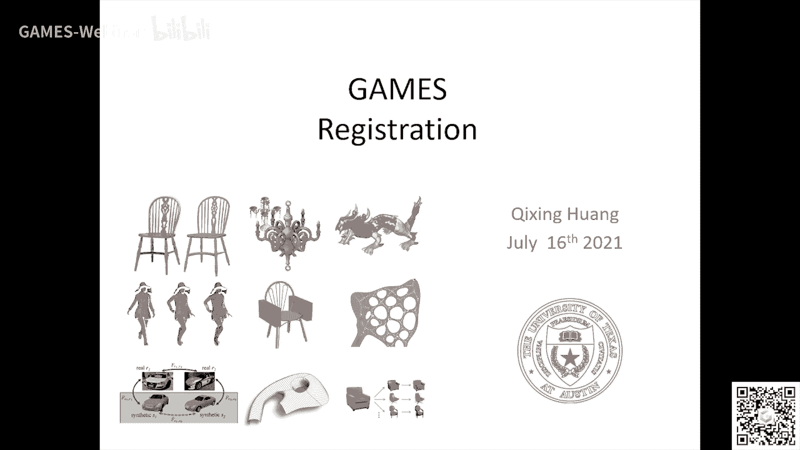
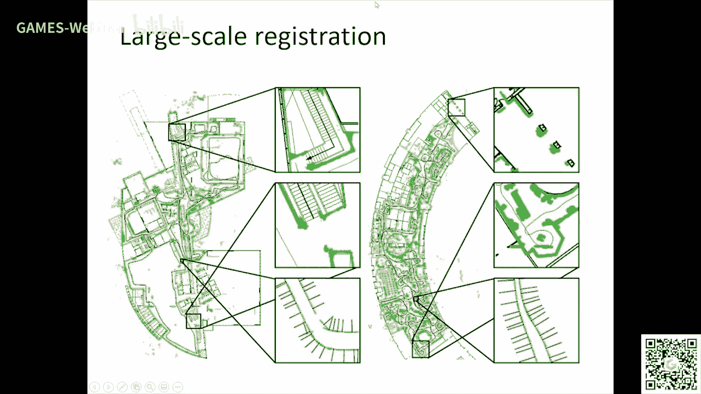
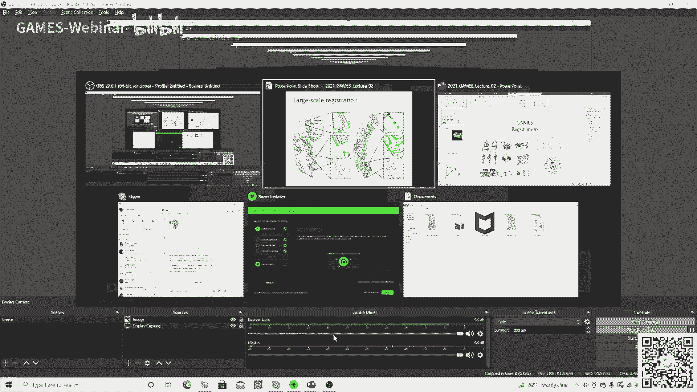
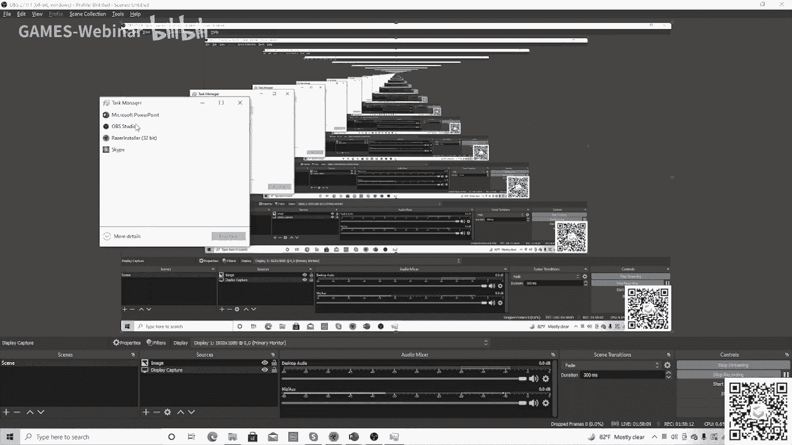

# GAMES203： 三维重建和理解 - P2：Lecture 2 Registration - GAMES-Webinar - BV1pw411d7aS

好。

我们今天开始那个第二节课啊，那个这一个我们讲这个注册问题啊，就是这个点云的注册啊，注册问题就是这个这个东西啊，在，三维重建啊，类似的问题里面有广泛的应用啊。

这么这节课呢会相对来说比较technical一点啊，嗯，这个，嗯，这个东西呢，如果要把所有东西都讲全了啊，一节课是不够的啊。

嗯，我希望在这里就是做一些，那个抛砖引玉的这个工作啊，我我讲一讲啊，什么注册呢，注册实际上就是说，比如说我们在有一个扫描仪，上一课我们讲了扫描仪啊，然后，然后呢，你你在不同的视角，如果扫描这个三维场景。

我们就会得到那个不同的这个点云，对吧，三维的这个点云这个点云呢，他显然就是说，如果我们不知道这个视角对吧，就不知道这个，相对的这个，这个变换的话对吧，那那注册这个问题呢，实际上就是通过我们把这个啊。

这里这里有个动画，我们就通过把这个两个scan呢，我们把它给匹配上对吧，匹配上也就是说啊，intuitively对吧，就是说啊，他的这个在他们那个相对overlapping的这个vision对吧。

他们这个距离是很很小的对吧，他是这样一个motivation，好那注册这个问题呢，呃非常非常，呃fundamental啊，嗯，这节课呢，我们主要是讲一讲就是这个，呃一些基本的一些基本的算法啊。

一些基本的算法这个topic呢，非常非常的老啊，就是说从九十年代对吧，那个最著名的那个算法，比如说那个ICP这些东西东西对吧，呃一直到现在现在就是说在机器deep learning的时代呢。

也有一些人用这个机器学习的办法对吧，实际上也是把这个scope就是他这个给extend对吧，啊然后我首先讲讲呢，就是怎么把这个task呢，做些就分类对吧，就是这个注册这个问题啊。

我们怎么就是他他是一个大的问题对吧，他有很多呃特定的这种setting对吧，比如说我们实际上他有就是有三个方向和方面吧，我希望大家注意一下对吧，就是比如说你在什么场景用什么样的算法对吧，一个axis呢。

就是说呃有时候呢，是呃就是我们叫这个fully overlap对吧，就是说两个surface呢，他是或者就是两个surface呢，他是就是一个是另外一个copy对吧。

或者是另一个是在旁边在另外一个里面对吧，这就是fully overlap对吧，那这个应用场景是什么呢，啊，你们有谁知道什么是应用场景，这个应用场景是什么对吧，这个应用场景就比如说你做你做模型检测对吧。

你得到了一个对吧，你得到了一个你制造了一个三文模型对吧，如果对吧，你扫描一个skin对吧，对吧，扫描了一个skin，比如说你造了一个零件对吧，然后你你用这个扫描一扫描，skin，然后你把这个skin呢。

跟这个model里面的这个这个东西去做匹配对吧，一个database里面的东西去做匹配对吧，就是你的光出示model，你看看这个误差制造的误差是多少，对吧，哎，这就是fully overlap。

更常见的一种呢，是partially overlap，比如说你做三维重建对吧，你在不同的视角扫描的这个那个点云呢，肯定不会是fully overlap对吧，他是肯定是他有一定的overlap。

但是因为你4点不一样，显然他有一部分他是不overlap对吧，哎，这这这这这这是一个axis对吧，大家一定要注意啊，就是首先咱们讲一个一个topic，首先就是比较重要的就是分类对吧。

分类其实也牵涉到你的task是什么东西对吧，但fully overlap肯定是最基本的对吧，哎，第二个axis呢，就是global和local的问题，什么是local呢，local就是说。

这两个点云基本上我已经roughly匹配好了，对吧，你比如说这是比如说你扫描的时候，你你扫完第一帧和下一帧之间，他有这个连续性的问题对吧，他有这个连续性的问题对吧，哎。

这个是这个时候你这两个他就他就接的很紧了，对吧，他有连续性的问题对吧，啊，这个时候他就是一个local的问题，因为你下一帧跟这一帧，其实你那个verity pose不会比identity差很远，对吧。

哎，这是一个local的问题对吧，呃，global的问题就比如说你你在室外你扫描的时候，你比如说你你架设了一个camera在这个地方扫了几帧，然后呢，你然后我们把这个camera对吧。

移到了另外一个地方在扫描，这个时候你就不知道这两个scan之间的verity pose，你并没有对吧，他可能差别很大，对吧，这个时候你就解决一个global的问题对吧，global的问题。

但是相对来说他是比较难的对吧，哎这门课呃这节课我也会讲到还有一个东西呢，他就是说pairwise对吧，就是你两片点云对吧，两两片点云去做注册对吧，和你多片点云一起去做注册对吧。

显然做重建的话肯定是多片点云对吧，两片点云是不够的啊，好，啊，我们都会讲到啊，那这这奥特曼我们首先是focus on这种两片的注册问题对吧，我们会cover很多东西就是fully overlap对啊。

哦，partial overlap对吧，我们会然后这首先想到一些local的办法，然后会最后会讲这个global的办法对吧，然后我们会cover这个learning base对吧。

就是说机器学习那么是最近的这些东西对吧，最近的这些东西啊，啊，然后我们会简单讲一讲这个multiple registration对吧，就joined pairwise registration。

或simultaneous registration with construction这种东西，哎，好，好，我们首先讲这个pairwise registration对吧。

实际上pairwise registration呢，最重要一个算法呢，实际上就是这个ICP啊ICP对吧，就ICP它实际上是基于什么呢，基于以前一个很重要的方法，就是说你比如说有两片点云对吧。

你比如说这个一个红的跟一个蓝的对吧，然后我们要去做注册啊，然后这个时候呢，我们假设我们知道一些correspondence对吧，就是红的上面一些点跟蓝的上面一些点。

我们有这个correspondence对吧，对吧，然后有了correspondence呢，我们就会找啊，然后呢，请注意一点很重要一点就是优化在这个地方是很重要的，就比如说，嗯。

比如说我们会define一个energy对吧，energy就说我要找一个rotation，这个PI比如说它是一个一个点对吧，一个vertex，我也找一个rotation一个translation。

使得你比如说你把这个算了以后减去QI，他们这个square的none对吧，他们distance要minimize对吧，这是一个优化问题，这个地方优化问题呢，一般情况下他会注意一点。

他就有一个objective function，他有一个objective function对吧，然后他还有一个variable，variable是R和T，就是rotation。

translation对吧，对吧，然后我们就是要minimize这个objective function，with respect to rotation translation对吧，啊。

这个东西呢很有意思，就是说有一个closed form solution，啊，closed form solution啊，这个地方我就不讲了啊，就是说你可以查对吧，这个home87啊。

有一个closed form solution，closed form solution呢，就是说啊，有几点你可不可以记住啊，就比如说你那个第一个点云对吧，比如说这个PI，他会把他的重心呢。

就是他的mean对吧，呃，跟那个第二个点云的meanalign在一起对吧，然后rotation的话是解一个eigen decomposition，ok。

这是这是一个closed form solution，然后这种东西呢，嗯，比如说大家如果做这个什么as rigid as possible deformation啊，也会用到啊，ok，然后ICP呢。

但就是说你做注册的时候你是不可能知道correspondence的对吧，你是不可能做的这做的知道correspondence，那这个时候怎么做呢，我们还是要想一个办法，比如说你怎么去找。

比如说那个红的上面是每一个点到对应的栏上面这个对应是怎么找对吧，ICP呢，他就是说呢，其实很简单对吧，我们不需要那个很复杂的那个办法，我们就找那个closed point，对吧。

比如说你红的红的是在这对吧，你找closed point，但也就是说你你这个correspondence呃在这个红的跟蓝的他距离比较远的时候，他肯定这个correspondence不是那么精确的对吧。

但是没关系对吧，你不精确的话，就是说你的solution也不是太精确，但是他会make make一个progress对吧，那这个时候怎么办呢，你你然后呢，你再怎么做呢，那你就iterate对吧。

实际上就是说我不断的找找最近点对吧，找到最近点以后呢，我会解一个rotation translation对吧，解一个rotation translation对吧。

但是这个最近点因为他如果最开始的时候他不是很精确，这个rotation translation也不会很精确对吧，哎，然后你就这么iterateiterate，最后就能得到这个那个有解对吧。

就是说你这个correspondence，比如说你你你你两个是跟距离越近的时候对吧，他可能越好，就慢慢的慢慢的变好，同时你的pose也会不断变好，哎，这就是一个简单的icp对吧，icp啊。

这个这个这个算法呢非常inferential啊，再对，对，这个这个非非非非常inferential啊，呃对迭代就那个这这有个谁，我是一分小虎牙是吧，对就迭代就完事非常简单啊，非常简单，啊，然后呢。

我想讲的什么我们还需要一些理解理解，就是说实际上就是说为什么为什么这个能work对吧，就是说实际上我们可以这么看吧，就是mathematically呢，就实际上就是说你比如说你的surface。

那个红的上面有一些点对吧，是x i 0对吧，alpha呢实际上是你的一个visual body transformation，对吧，然后fine呢是我们那个男的那个surface啊。

就是前面这个slide对吧，然后实际上我们是the distance，d2呢是那个一个点到一个surface的这个，square的distance，对吧，然后呢我们实际上是想minimize这个f。

alpha对吧，呃这alpha呢实际上是个visual transformation，对吧，f呢是一个objective function，这是一个什么。

这是一个这个objective function对吧，嗯，对这也是一个minimization problem，对吧，只是说只是说这个比较复杂一点，那icp实际上就是说呢。

你不管是optimized alpha对吧，就是给给定correspondence，还是你算这个correspondence，实际上也是minimize这个distance，把一个点到一个曲面的距离。

最近的那个点就是close to the point对吧，所以就是说icp这个这个算法呢，它是一个首先它是alternative minimization对。

就是我alternative就是我我首先优化这个transformation，然后再优化这个嗯，嗯这个这个close to the point对吧，然后呢有一个argument就是说，他首先会收敛对吧。

首先会收敛，为什么呢，因为你的energy function是在不断下降，对吧，然后呢另外一个东西呢，就是说不是那么容易去证明呢，它实际上它是有一个linear convergence。

那convergence的rate当然不是，还是比较慢，linear convergence啊，linear convergence啊，就一般情况下。

如果你说你有一个objective function，然后你有一个优化的过程，对吧，这个优化的过程是不断的reduce，它的那个。

呃这个这个value of the objective function的话，那呃，一般情况下你是它是有一个linear convergence，啊，但实际上我要我要跟大家讲的一点。

就是说实际上它也不一定对吧，就是说你比如说你有个fx等于x乘以x对吧，然后你这个iteration假设你这iterate，是xi等于3加上e over i对吧。

那你每一步都reduce这个objective value对吧，但是它不它converge，但它不converge到一个local minimum，对不对。

它不converge到一个local minimum，啊，所以这个地方你还是要注意的啊，这个地方你还是要注意的啊，啊，就是说你没你我经常看一下，我经常review一些，文章对吧。

你看了我们这个amg一定下降，所以它一定converge，没错，它一定converge，但不一定converge到to a local minimum，啊icp它这个你是可以证明在一般的情况下啊。

它是converge to一个local minimum，啊，这一点大家需要注意啊，平时写文章的时候需要注意一点啊，好，当你在icp它从优化的角度来说。

你这种alternating minimization，它不一定是一个最优的东西对吧，实际上比如说你如果有一个像这种least square problem对吧，这个fr等于这个东西对吧。

这个这个least square problem，一般情况下现在大家都怎么解呢，大家都用这种高斯牛顿的啊，就是呃我们叫做这种non-linear least square对吧。

比如说什么是这个least square，比如说那个那个distance fraction的square对吧，加在一起对吧，哎，这些东西，对吧，对这这些算法呢啊，这个东西呢。

呃现在一般情况下大家怎么写叫做高斯牛顿啊，高斯牛顿是怎么来的呢，首先你首先有个牛顿的办法，牛顿的办法就是说，啊我每一步呢我首先算这个这个这个这个objective function的hash，对吧。

然后还要算它的gradient，然后我们呢我们基于这个hash的因果式乘以这个gradient，做做这个step size，对吧，我们我们来做这个，来做这个东西对吧，然后。

啊那高斯牛顿呢实际上是用一种比较呃比较传统的办法，就是efficient的办法来算这个hash对吧，就不是我们不是把二阶这个他就算出来，我们算成算他甲铐饼对吧。

甲铐饼的转制乘以甲铐饼就是就是他的那个那个hash的一个approximation，对吧，就是一个hash的approximation，对吧，哎这个就是高斯牛顿啊高斯牛顿。

啊这个东西呢啊我建议大家看一下这个高斯牛顿的wikipedia page啊，比较难点就是说实际上这就是说怎么做呢，就是说啊如果你对这个东西不是很熟悉的话，那我们怎么办。

就是说我们假设有个beta的就是common solution，对不对，然后呢，我们会把那个这个visidio对吧，就比如说这个distance对吧。

我们在这个这个每个就是每一个correspondence和local里呢，我们做一个这种pilot展开啊，然后呢这个地方delta就是我们要optimize对吧。

jr这个beta s他实际上就是啊他的linear approximation对吧，然后我们就会minimize这个delta对吧。

然后呢the south square of the right hand side对吧，他是一个linear linear least square problem。

which can be solved explicitly对吧，就是一定的normal equations in the algorithm对吧，就是他他实际上就是一种啊这个东西对吧。

就是这个就是这这个地方实际上他是一个least square，啊，least square，啊，这个算法呢实际上它是iterative对吧，就是当然我要讲一下就是讲一下这个高斯牛顿他的这个迭代对吧，嗯。

就是牛顿算法我们知道他是quadratic，quadratic convergence，但是呢，呃他的cos如果你要做呢，你不能你这个地方你省去了一些项对吧，省去了一些比较复杂的这种求导对吧，啊。

那高斯牛顿他是相对来说比较简单的对吧，每个term我做一个linear linear linear的这种，啊，approximation可以对吧。

然后有一种quasi quasi quadratic convergence对吧，这样就是呃，就是这个L as the next iteration对吧。

实际上等于L as the current iteration对吧，然后呢这个高斯牛顿他的这个迭代他这个呃呃他这个convergence呢就非常有意思啊，非常非常有意思。

就是我们知道ICPICP是用的最管理一种算法的，非常非常简单对吧，就找最近点，然后解找最近点再解对吧，呃，高斯牛顿算法呢，嗯，就是相对来说复杂一点对吧。

我们要做这个linear approximation啊，但是其实啊也不是那么复杂，但是convergence很有意思，就是说你这个问题如果容易记对吧。

就是比如说你你这个最优的那个解他这个residue对吧，就是你解完了以后，比如说一个在另外的里面或者就是说你这两个scan他的基本上是匹配上的，没有什么noise对吧，这个时候呢。

他的这个高斯牛顿的convergence是非常快的，就几乎接近于这个second order convergence，ICP是这个linear的啊，但是如果你这个residue非常非常的大。

比如说啊一个scan跟另外一个scan比如说的不不不fully overlap，当然我们后面会讲怎么处理啊这种情况，对吧，另外一个就是说比如说你这个有noise对吧，就是他这个点他不能完全匹配上对吧。

不能完全匹配上，哎，这个时候呢，你的convergence呢就跟ICP差不多，可能一般情况下比ICP稍稍稍稍好一点，但是他是一个linear convergence。

甚至有时候你如果这个accord特别大啊，你需要加些，你需要需要对在这个地方，你对这个hashing啊，就是这个这个地方对吧？你要做一些做一些处理啊，做一些处理啊，就DFGS对吧？

And number of markers is a regularization，做这样的处理对吧？啊，这是这是这是需要需要需要注意的啊。然后这个Gauss-Newton呢。

也等同于一个这个就是说在这个point to plane distance metric下面做注册对吧？

就是就是Gauss-Newton needs to the falling of this problem对吧？就是说，嗯，实际上呢，就是说我优化的时候呢，啊。

当然这个C实际上就是说他是这个rotation univision啊，就是说优化的时候呢，我实际上是，呃，就是说我不是，比如说我们ICP的时候对吧？啊，我们是算一个点到他给的point的这个距离对吧？

啊，我要minimize这个，但这个东西为什么不好呢？就比如说你是P动了以后，你optimize以后对吧？你这个对吧？他不对吧？你你你这他给的point的不是你的最经典了对不对？哎，对吧？

你找你优化之前是对吧？你优化之后就不是了对吧？哎，这个distance就不好了吗？啊，那高速牛顿实际上是说什么呢？就是说如果就是说这个这个这么这个这个这个这个这个优化造法在这个注册的这个问题中啊，啊。

他是什么意思？他说，哎，我不优化每个点对吧？我不优化每个点到一个点的距离，我优化一个点到这个平面的这个距离对吧？当你当你这个点动了以后对吧？你可能到这个点的距离对吧？他就歪了嘛对吧？

但是你掉这个平面的距离，比如说你到了红的这个点对吧？你红的这个点到这原来这个点，他还是有距离嘛对吧？但是如果你用你manager的是对吧？你到你到这个。到到这个红的这个点。

他是这个plane的这个距离对吧？这个时候你这个p在不断动的时候，你到这个plane的这个距离的平方啊，他还是一个good approximation。对吧？

他还是一个good approximation。哎，这就是point plane的这个geometric intuition，当然就是说高斯牛的这些都是inside的，我们是后面才发现的啊。

就是这个算法，哎，它是91年对吧？就是这是一个很有名的文章，也是一个很有名的文章。至于那个ICP那个文章啊，对吧？这个算法其实也很简单对吧？你你把那个rotation translation。

你把它给linearize一下，实际上他就也是一个解一个什么解一个那个linear system对吧？你解出来以后，然后你再update这个rotation translation。哎。

这个算法其实也是，呃，很简单的啊。这个今天上课有什么问题吗？这个pp的啊，scan应该是今天上课对吧？9点钟。啊，我就是每周每周五的早上啊，北京时间4点钟啊。OK，然后你要如果你想对这个东西要要有。对。

然后如果你对这个东西要一定的了解的话，你可以去看这个有一个东西叫square distance function，对吧？实际上就是每个点到一个surface的square distance，哎。

这个东西。呃，它是一个square distance function，我们可以看看这个东西，它是它是跟这个，呃。它跟这个，实际上这个square distance function是什么。

就是你空间中一个点对吧？到一个曲面的距离，它的平方对吧？它能被这个二次二次性给逼近对吧？这个d呢就是一个点到单到那个surface的距离啊。对。

如果一座罗安实际上是那个curvature的inverse对吧？实际上就比如说你如果如果这个曲面特别flat，特别的平。呃，那那你这个罗伊和罗安都非常非常大对吧？实际上也就是说你前面两下消掉了。

也就是说，呃，它是什么？就是你到那个点的那个plane的distance平方，它就是一个good approximation啊。啊，这个我这是可以看到画面的啊。啊。啊，所以就是说，比如说，那就是说的。

特别是你当你这个d，比如说你这个d，它本来就很小的时候，对吧？就是当你这个，嗯，当你这个，嗯，嗯，你这个单纯点到这个service的距离很小的时候就很好，对吧？好吧。嗯。OK。对吧。

这个时候就可以用point to plane distance，所以说这个ICP呢，就是说我刚才讲的呢，它实际上第一种就是你这个，呃，它有一个最基本的算法，对吧？最基本的那个算法，然后呢？呃。

point to plane呢，实际上就是它是一个variant对吧？就是说它这个efficient variant。嗯，然后他从哪来的呢？他是从这个高斯牛顿这个算法来的啊，告诉你，我问这个算法来的啊。

大家有兴趣可以看看这篇文章啊。好，呃，然后那一般情况下怎么说呢？就是说一般情况是这样，对吧？就是当你这个你的初始的这个pose非常好的时候，那那你就用point to plane distance。

对吧？当你这个如果出事，这个距离跟那个很远的时候，你不好说，那你就用point to plane，对吧？那个时候相对来说，他相对来说，他比这个呃，就是相对来说，他鲁邦一点，对吧？相对来说，鲁邦一点啊。

但这些东西呢，实际上你要通过做实验啊，我们会有一个作业啊，我们会有一个programming assignment基于这个基于这个东西啊。好，嗯，然后呢，那他当然还有很多很多的问题了。

你比如说你怎么算你的snap对吧？这个我觉得，呃，大家要注意一下啊，但是现在这些东西他都有很好的这种software package，对吧？如果你用message变成的话，你可以给你一个点语音，对吧？

呃，然后你输入一个输入一堆点，对吧？他算你的snap，他有很好的算法，现在现在有很好的算法来算这些东西啊。嗯，提前放slide，嗯，今天那个暂时没有啊，暂时没有啊，但是没有。下次啊，下次一定提前放啊。

然后这是一些practical的，呃。嗯，我就说你算你的snap，你现在当然有很好的，那你以前怎么做呢？你会有些kd tree，对吧？

你就可以build一些这种hierarchical的data structure，对吧？hierarchical的data structure，对吧？比如kd tree来算你的snap，对吧？嗯，啊。

啊，这个slide我尽量讲完课以后，我放上去啊，因为我们这边现在就是放slide的话，就是我尽量讲完课，换了去啊，这样讲完。然后next level computation，啊，这个这个东西算最近点啊。

就是说现在有很多好的货，对吧？但是你要说，这个东西具体怎么去算，对吧？具体怎么去算？会比较好？呃，这个，呃，有一种data structure叫kd tree，啊。

让它是一种海外hierarchical的这种organization，OK？hierarchical的organization，啊，这个大家有兴趣可以去看一看啊。当然，比如说甚至有一些算法。

他们直接build一个data structure，就是说我直接用这个distance function，对吧？直接用一个这种hierarchical的东西。

我build一个distance function，对吧？我不用找next level，我直接找，直接直接对任何一个点，我就会知道，对吧？我就可以直接得到这个，呃。

这个这个这个这个一个distance function的square的approximation，是吧？这个也可以用来做输出，嗯。对，嗯，这也是一种一种办法啊，OK，然后呢，还有一点呢，就是说。

比如说你红的跟，呃，那个蓝注射对吧？你build，define那个distance function，你需要，呃，你需要有一些需要进行一些采样，对吧？需要进行一些采样，呃。

那一种采样就是你说uniform sampling，对吧？就是均匀的采样。还一种采样呢，你就是说这个stable sampling，对吧？就是说你会在这个fisher这个地方采的更多一点。对吧。

在fisher的地方采的更多一点，对吧？嗯，因为这些就比如说你如果一个surface非常flat的话，那你只有在fisher的地方你采的更多，你才能align的很好嘛，对吧？嗯。

你否则你采样都采在那平的地方，他就没有这种constraint那么的给呃，lock在一起，对吧？这个stable sampling，对吧？你看这个有uniform sampling。

有stable sampling，对吧？就是说你如果是uniform sampling，你就会发现，对吧？就是说如果你这个取呃，这个surface或者这个东西，它会非常非常平的话。

你如果用uniform sampling，你会发现这些fisher，他align的不是很好啊。如果你用一种stable sampling，就是说我听，当然这个算法呢不是那么简单。

就是说但是intuitive，就是说你尽量比如说你让这个点，他比如说他的normal，对吧？尽量的uniform，对吧？啊，这个时候呢，你就会在这些，比如说这这种这种fisher的地方采更多的点，对吧？

这样就能把它align在一起。OK。哎。All right。OK，有什么问题吗？如果两个扫描点云很多，其实其实这个复杂度的话，呃，他是跟你，比如说你在一个点云上面三跑多少个点，对吧？然后呢。

如果你的点云的数目非常非常多的话，这个找最近点啊相对来说要困难一点啊，相对来说要困难一点，但是呢，就是说如果你能一次性的build一个这种nearest neighbor的这种beta structure。

这也没关系。啊，这也没关系。啊，嗯。就是说，就是说，你说对吧，比如说我们你build一个这种，呃。对吧，你不对吧，你build一个这种nearest neighbor的beta structure。

是吧？这个时候他的complexity就是找那个最近点的complexity是node n吧，n是人的number of points，对吧？这个时候还好啊。嗯。然后采样对吧。

你注册的时候不是用所有的点，好，这是然后我再讲讲partial overlap怎么处理，那么现在的话其实就是说我找最近年我，我是要求这个最近点一定一定是就是你优化好了以后，对吧？

他一定是一个correspondence，对吧？但是如果是partial overlap的话，这这这不一定对吧？那这个时候呢，我会怎么来做呢，对吧？

那我会我会找这个restriction on the robustness是吧，我就说这个时候呢，我不是用这个什么，我不是用这个这个l2，对吧？我是用一种robustness。

但是这个robustness为什么好？哎，我会我会给大家待会我会给一个例子啊，我讲一讲。嗯。对，我会讲globalization的办法，这个是我是假设的是。

你会有一个不错的initial solution啊，我当，待会我们会有大量的篇幅，像这个global的算法啊，嗯，你不要着急啊，对，合理的初始位置很重要啊，所以这一点说的很对啊。嗯。

但是比如说你有一个合理数字位置，它还是牵涉一个什么问题，牵涉了一个，比如说比如说它只有50%的点是有有有对应的，对吧？你这个时候，如果你把那些不对应的点也找了，你也让他去，那的话，这不就出问题了，对吧？

那怎么来handle这个问题呢？啊，怎么来handle问题呢？一种principle的话吧，就是你用一个robust norm，对吧？就是说我，比如说我这个，对吧？我就是这个是我让他就。

然后是一个robust function，robust function是几种，对吧？比如说有这个，那个，那个，这个，对吧？这个是t平方除以，除以sigma平方加t平方，对吧？哎，这是一。

这是一种非常robust的function，对吧？然后容易t实际上是这个t的这个绝对值，对吧？哎，这叫l1，对吧？然后我们现在用的呢，实际上是l2，对吧？这个当然不好，对吧？实际上就是说啊，嗯。

这是一种呢，就是说，嗯，这这种这个统计里面robust statistics这些东西是用的很多的啊，用的很多的啊。啊，然后然后一般情况下我们会怎么弄呢？我就说实际，对，就就是说我们，我们。

我们实际上的还是就是说，还是做这个，嗯，优化，对吧？只是说我们用一个robust norm，对吧？一种情况下还是可以用高速牛顿，因为他还是一个什么？他还是一个这个，一个一个nonlinearly，对吧？

你可以把它看成是这个东西啊，一种大家用的比较简单，对吧？一种大家用的比较多的呢，实际上就是更更interpreter的东西呢，实际上有一种东西叫we wait，就是这个东西呢，很简单啊，很简单。

实际上就是说我原来是要优化这个role，对不对？这个role呢，他不是这种我们常见的这种least square的形式，对吧？嗯，那我怎么样呢？我就把它变成这种形式，对吧？

我就除一个square的这个distance，对吧？然后再乘一个square的distance，那个wi呢，他实际上就是这个ratio，对不对？wi就是这个ratio，对吧？嗯，你会发现呢。

就是优化好了以后呢，啊，就是说，呃。比如说比如说law等于t吧，对吧？等于t，对吧？然后实际上这个wi就是一解一除以t，对吧？一就是你，实际上就是也就是说你最后优化好了以后呢，为什么没带死呢？

就是说你优化好以后，你的一个点跟最近点的距离越远，对吧？一个点跟一个最近点的距离越远，那他对应的位置就小，对吧？对应的位置就小，对不对？这个时候呢，他就不会去怎么样？

他不会去contribute to那个那个determination，对吧？哎，好，实际上非常非常简单，对吧？也就是我们这个算法就是这样的，对吧？就是说你还是做这个L2的优化，对吧？

只是你把每个这个correspondence呢，加一个位置。对吧？然后为的比如说最那个那个前面我们讲的那个算法位置都是一嘛，对吧？这个时候呢，这个位置我就要让他呢不断的变化，对吧？就是我优化完了以后。

对吧？我也把这个位置设成一除以这个比滴流这样，对吧？对吧？哎，这，这，这是这样子，对吧？哎，这，他，他，他就是一种这种alternating的这种形式，对吧？然后大家如果还不理解，他说这东西为什么没干。

我用一个最简单的东西，跟大家把这个东西讲清楚，好吧？就是说其实就是一个王，就是说一条直线上有些点，对吧？我们考虑两个问题，对吧？一个是比如说，就是说这有些点呢是outline，有些点是那个inner。

对吧？比如说这里这边有两个outline，在这边有两个outline，在这边中间有四个点，对吧？啊，这没outline就是对应的，你可以就是他对应的是什么？就是那些不在overlap。

那些那些near neighbor，对吧？不在overlap，对吧？然后中间这个inner呢，他就是overlap，对吧？然后这，这就有两个算法，对吧？一个算法就是说我不用robust，弄。

我就直接说我找一个x，对不对？然后去minimize，比如说他到所有点的平方和，哎，这个东西。嗯。嗯。第二个呢，我就是找这个东西呢，你说我这个优化的x，他就是对应的是什么呢？他就是对应的是x的值吗？

他的一个命对吧？一个平均。对吧，x的一个平均啊，然后呢，另外一种算法呢，我就是可以去找这个。对吧，这样的话，当然他不好了，比如说就是说如果你有outline对吧，比如说在那里，这个命就会被拉掉，对吧？

被拉掉，对不对？就不在不是我们想要的，对吧？如果有outline，就是不在那个overlap的。好，另外一个算法呢，就是怎么样？我就用这个robust，弄的，我就说我不是minimize。

这个square的distance，我是minimize，这个l1的distance，x减去x，对吧？哎，这个时候呢，你说第二个optimization problem，给给说这个优化最优的解释。

实际上就是什么？实际上就是x的median啊，什么是median呢？median就是你把一堆点从左边到右边，对不对？你排排一个序，对吧？然后我找那个中间那个点，就这就叫median啊。

这个median呢？很有意思，就比如说啊，在意味的情况下，他正好是这个minimize of this，对吧？就是l1了啊。你很容易理解吗？就是你当时在中间的时候，你你变化x。

他的gradient是不会发生改变吗？左边跟右边怎么样？他的他有他的这个他的这个个数，对吧？就是那个点的个数是一样的，这样他的gradient，对吧？他就是0，对吧？他就会有一个平衡，对吧？好。

我一会儿讲，所以所以就是说这个robustness为什么好呢？就是说当你这个，比如说你是outlier，比如说你少于50%的时候，对吧？或者就是说你两边有一个balance的时候，对吧？

你这个median是一个非常好的什么estimation of the ground truth，对吧？嗯，mean就不是，mean就会被这些outlier怎么样给带走，对吧？对，没错。

就是说这个这个l2的话，这个outlier这个影响的这个这个这个东西太大了啊，这个。好，那个median computation呢，呃。你一种情况叫sorting，对吧？就sort，对吧？

其实你也可以变成一种这种这种weighted的这种average，对吧？就是你minimized of x，对吧？你就是sum of这个1从n的wix到x^2，对吧？就是说你waiting的时候呢。

你还是写一个mean，对吧？就是waited mean，对吧？这个wait呢是1，就是这个点，对吧？到这个每个点，就是那个你optimal solution，到每个点距离的什么？inverse，嗯。

你就可以说啊，我每一次呢，我首先解x，对不对？我解的说x，它是一个weighted average，然后我会update这个位置再回去解，对吧？对吧？

这这也有时候也他他综上也就是geometric median，对吧？这个时候呢，你就不你可以你可以证明了，就是说他他会说你老什么，在平面上他有这个性质，这个东西实际上是什么？

这个实际上就是这种be waited least square的这种思想，好吧？这就是be waited least square的这种思想，啊。啊，我就是用一个非常简单的例子。

跟你跟跟跟大家就是介绍一下这种东西为什么会work，啊，为什么会为我，哎，在这个算术题大家都会做，对吧？但是将来是以后呢，没有可送的solution，你还是要写一个这种point plane的icp啊。

但是这种这种basic的这种算的思想，这个地方是有的，嗯，然后你会问这个东西为什么会converge啊？这个其实不是那么容易，是啊，但是你可以，自己写一个code，你可以试一下，好吧？那不是那么容易。

正但是还是比较比较比较比较有意思的啊。好，这是一种这是一种思想，然后我们可以再可以看看这个什么，比如说bite rational，对吧？就是说，嗯。嗯，这是一个非常非常用的。

我觉得就是非常非常effective的，但实际上用的不太多啊，你们可以读一读，这是一篇sgp的05年的文章啊，那个sgp那个会刚开完啊，怎么做呢？就比如说你找了next neighbor，对吧？

那我能不能用一。哦，可以啊，就是，呃，这个算法是这样，就是你首先从。从第一个点对吧，到第二个点，从从从r1，你找那个next neighbor，是吧，找完了以后。啊，现在又回来了，我我好像有一点问题啊。

我希望这个录像没有问题。嗯。大家刷新一下啊，刷新一下。嗯。大家现在能听到吗？可以听到对吧。可以听到吗？

哎，我这边直播应该是好的，对吧？

我没有掉完啊。啊，OK，啊，我讲讲这个这个东西非常非常简单啊，非常非常简单，就是说你有一个点，对吧？你在另外一个搜索找最近点，对吧？找最近点。找完那个最近点呢，你再把那个最近点再回个头来。

再找这个最近点啊。嗯。再回过头来找最近，你看这个镜头就V，我首先找了Q1，对吧？Q1以后呢，再回过头来找最近找了r1，对吧？如果这个r1和V，他距离比较近。哎。

这就是一个好的correspondence啊，这就是一个好的correspondence。啊。如果如果这个比如说你你你看这个点，对吧？他实际上是在这边是没有最近点的，对吧？

就这个或者就是说这个最近点他不太好，对吧？那这个时候会出现什么情况呢？就是说你V2找了一个最近点，对吧？然后你在Q2Q2再找，再在回过头来找这个最近点啊，如果在啊，跟V2这个距离比较远。哎。

这个correspondence他就不好了，对吧？哎，就是这是一个我们叫做bidirectional pruning啊，实际上你比如说你看，比如说你这里有两个surface，对不对？

你把第二个surface这边wamp的model跟这个input data你去做做做做做做做匹配的时候，对吧？哎，这个地方实际上就是说他有很多地方，他这个他的这个correspondence，对吧？

这个，呃，对吧？他就会有一些不overlap的地方，对吧？你可以从这个方法去把那个tues出来。对吧？啊，这种方法呢，实际上呢，就是说他跟这个，呃，we waited这种思想啊。呃。

他跟这个we waited这种思想啊，就是，呃，相对来说，这是他是互补的啊，互补的。然后呢，我我要推荐一篇文章啊。

推荐文章就是efficient variance of ICP of ICP registration，就是simon，simon，啊，写的写的写的这篇文章啊，这篇文章也很有名啊。

它实际上它是从在ICP不同的角度，对吧？就是sampling，对吧？就是怎么去找这个对应锅对应点，对吧？除了near neighbor，比如说你真的做一个scanner的时候。

你还可以用那个projection，对吧？那个东西去找啊，那个找的更快啊，然后怎么去把autotrack给扔掉，对不对？然后怎么去，呃，或者就是把一些，呃，啊，一些点给reject掉，对吧？

然后还有arrow metric，对吧？就是特别是这种point of plain distance，它是一个很好的metric啊，啊，这篇文章，你们如果将来真的想。就是做一个scanner啊。

就是比如说connect这种东西的话，我建议去读读这篇文章啊，呃，现在我觉得这篇文章还是还是蛮蛮有帮助的，蛮有帮助的，嗯。啊，你可以去到网上找一找，然后读一读，也有些slides啊。

这个slides做的还是蛮好的啊，嗯，ok，然后呢，呃，我们休息5分钟，然后我讲global matching啊，global method，我最开始讲的是这种local的method，我休息5分钟。

我们接着讲global的method啊，嗯。今天的课会稍微长一点啊，可能到啊11点44，11点50啊。好，我们接着讲global matching，global matching就是说，呃。

我们需要一讲一进来算法，就是说，嗯，我们不需要这个好，这个初始的这种这种pose，对吧？啊，这个东西很广啊，实际上我这个问题也没有完全解决啊，呃，我相对来说会讲的比较high level一点。

但是有一有一些这种重点的思想啊，我希望大家那个能能能理解好吧，重点的思想啊，那基本上怎么做呢？实际上说白了，就是说我们首先啊，就是在这个这个时候我们就需要什么？需要这种inversion。

这种decision，对吧？就是我们在这个去两个surface上面，我们，呃，找这种inversion，这种descriptor，然后build一些correspondences，对吧？然后呢。

我们就能，然后呢，我们，然后呢，就是再把这个，呃，用这个rigidity constraint，对吧？去找一些这种，呃，找这个consistent的这种feature correspondences。

对吧，啊，他是是这样一种搞法啊。这个时候，呃，当然这是一种传统上吧，那现在大家说deep learning的时候我们怎么干呢？哎，deep learning的时候说白了，就是说实际上他就是说，嗯，呃。

现在的传统的做法，现在传统做法就是说，啊，我用我把这个feature extraction用这个neural network来代替啊，然后呢，这个matching这一部分呢，呃，我会用一个这个。呃。

用一个这个这个cooperation的这种module来代替啊，这个这就是一个大大致的思路，对吧？但是我我，呃，最后会讲一点，然后后面啊，我们具体讲到这个，比如说各种比如说点缘的表示的时候。

我们会再再提一提啊，怎么来解决这个这个这个global matching的问题。好，那其实也，那其实有几点呢？就是说，第一我们就是要找这个，比如说我们从首先从传统的方法讲起。

就是说我能不能不能找一些descriptor，对吧？使得比如说你在一个service上面算，在另外一个service上面算，这个descriptor，它是invariant，对吧？

它是invariant，对吧？这个descriptor是invariant，哎，这，这个时候呢，嗯。这个时候呢就是说那这样的descriptor有哪些呢对吧。

我简单地跟大家介绍一下这个东西对我这里有个link对吧我这，有link对吧你到时候这个是有录像的啊slides也会上传啊然后你可以去你如果有感兴趣你可以去找一找啊。

就第一个呢就是用的比较多的比如说screen image对吧怎么做呢比如说你每个点对吧我在算它的descriptor。

如果你上了它的descriptor比如说你再换一个service那个点你也算一个descriptor对吧。

当你他们的descriptormatch的时候你才会build your correspondence对吧。

如果所有的correspondence都build好了那其实对吧你会解那个那个用那个home87那个算法对吧来来来来做match对吧。

好那那descriptor怎么算呢其实这个东西呢就是说它跟这个传统的比如说image computer vision，精神及视觉里面的这些东西啊它也是对应的它也是它也是这个呃相对应的比如说。

呃比如说你再找一个点对吧你找个neighborhood对不对然后你你就会有一个direction和一个这个angle嘛对吧一个distance。

一个angle对吧这个时候我就会我就算比如说那个点对吧到这个这个东西的距离对我就对吧实际上实际上这个image呢实际上就是说，嗯对吧。

它实际上就是算了一个就是做了我们这么简单来说吧啊我说的不是那么精确啊就是说，就是给了每个点周围的这个patch对吧我们做一个encoding对吧使得这个encoding呢。

相对来说呢它是这个environment这个比如说你的这个frame的这个orientation的normal我还需要的啊这个orientation我们不需要。

好这叫spin images对吧就实际上就是说你你统计一下比如说到这个点都是radius的radius都是这个都是比如说距离都是0。5对吧你看一下这些点。

比如说你做一个这个fourier transform的coefficient对吧你就会把它把它来变用它来把它来变的用作这种spin image对不对，哎，嗯。

然后这里给了三个例子对吧就是说实际上这种encoding呢就是相对来说它是它是一个local description对吧啊，嗯，哎。

这个我没有讲的特别特别透啊啊因为我这个东西怎么说呢啊现在其实大部分情况下大家是用neonetwork嘛啊但是就是说核心的思想就是找一个这种environment的descriptor啊。

好然后第二种就是比如说integral environment这是我自己用的比较多的就是说实际上就是给一个点对吧我找一个球对吧我算一下就比如说这个球里面有多少的就是说有多少的area它在这个surface里面的这个integral environment对吧。

这个这个东西呢它是相对来说它比较鲁棒啊就是说你可以change同时呢它有个scale对吧它之前有个scale parameter对吧你可以change这个scale去。

嗯啊去去去得到这个不同尺度的这个descriptor对吧尺度越大肯定越鲁棒对吧然后它它实际上是related to这个mean coverage啊就是啊它有一个这个geometrical property。

还有other features就是3D sift啊对吧包括这种patch feature对吧啊这些东西呢啊有一点你要注意它都是handcrafted对吧handcrafted它不是学出来的。

但另外一点呢我觉得就是说这些东西还是很很interesting啊特别特别是我觉得在一些就是说嗯真正如果你要把一个东西搞的鲁棒你不能用noney对吧noney的话它它它它有在某些scenario的时候它存在generalization error对吧。

对吧，它存在这个generalization error对吧，在这个时候呢，它实际上就就会出现这个，出了这个，这个时候如果没有能力的话，相当于它也不存在这个问题啊，所以就说，现在另外一个角度来说。

我想说什么，就说现在大家都关心deep learning对吧，就说什么东西都是deep learning啊，但我觉得从做研究的角度来说，这是一个大的趋势啊，但是。

你怎么能保证你train the model，真正能generalize to，这个out of distribution sample的时候，这是非常大的问题啊，这是一个非常大的问题，好，好。

有了这些feature的时候呢，feature以后呢，那我们需要就是说，就mesh feature对不对，然后我们需要做这个，什么做，然后把需要把那个好的mesh给拿出来对吧，哎这一步的话。

这一步的话其实就是说啊，很有学问啊，很有学问啊，然后呢，我会讲几种其实这个这个东西最早就说这个问题呢，呃，在很多在计算机视觉里面它都存在啊，计算机视觉里面存在。

比如说我们讲那个有时候给给本科生上课有一个有一个fashion叫做fitting和regression，呃，这个，对实际上它它是一个2d对吧，啊这个东西呢，嗯，在视觉里面研究很多实际上在3d呢。

它会有一些不一样的东西在里面，它会有一些geometry在里面啊，但是核心的思想从2d来的，对吧，比如说你有很多correspondences对吧，你你首先extract这些point。

然后去做这个match，然后有很多correspondences，有些是好的，有些是坏的，那这个时候我怎么能把好的找出来呢。

哎这个时候就牵涉到一种呃就是有一种叫做random sampling consensus，呃这个核心思想是怎么呢，就是我找一找部分点对吧，然后我去feed一个region transform。

然后然后我看有多少个correspondences跟这个region transform consistent，对吧，然后呢呃我就找这个最多的那个对吧。

找那个我就sample出来的这个呃transform里面，它的inert的个数最多的那个，对吧，哎，然后第一个问题就是how many point pair specify a region transform对吧。

比如说呃，比如说在二维的时候，比如说你有你你需要多少个点，多少这个correspondence pair来specify一个这个这个region transform，大家知道吗，嗯。

这个2D需要多少个vision correspondence，我们来specify一个region transform，嗯，两个对吧，很好，两个就可以啊，两个就可以三维呢，嗯，三维的话就需要三个啊。

三个对吧，然后如果比如说如果你有additional constraint对吧，distance preserving这些东西对吧，就是你你找了三个correspondence，同时你还要满足什么。

你这个distance要preserve对吧，如果distance preserve你就知道这肯定不能得到一个什么，得到一个region transform对吧，这些东西这都是三维里面特有的东西对吧。

还有一些stability的问题，对吧，你比如说早期我不知道大家见没见过，我以前的时候我是用比较多的一个叫geometric对吧，然后我在这边点三个点，在那边点三个点。

然后我就能得到一个region transform对吧，嗯，哎，对，然后这个算法我跟大家讲一下啊，就是比如说你的sample each object对吧，sample 3 2 pairs。

check distance constraint对吧，就然后你就feed一个region transform，用homematch的一个算法对吧。

然后你check how many point pair agree对吧，if above threshold terminate，otherwise goes to step 1对吧，嗯。

或者这样子的这样子来的对吧，啊，对吧，如果他对啊，然后你看看他有多少对吧，这个时候他实际上这样的话就不那个什么对吧，然后这样的话你就看他就是很好对吧，这样就不行对吧，哎。

就是这是2d的一个illustration啊，非常简单，这个算法非常简单啊，非常简单，嗯，然后，然后我简单讲一下这个算法呢，就是，但用了很多了，对吧，这样他就是第一他就也就是说，嗯。

那个如果怎么做sampling实际上是extract feature point对吧，这个东西我们刚才讲了，对吧。

然后correspondence就是use feature correspondence对吧，啊，如果你有每个service你有n个，点呢，然后你的那个candidate correspondence。

goes他就远远小于on平方对吧，对吧，然后他的那个successor rate呢，如果p是这个inline ratio，就是candidate correspondence ratio呢。

successor rate就是这个东西对吧，就是说，呃，比如说你你如果你这个，successor rate对吧，他是p对吧。

那你那你如果是randomly sample三个correspondence，他的那个这个value的这个这个这个triplet的个数，是这个probability是多少呢，他实际上是p的30万对吧。

这每个点都要对对吧，然后呢你你sample n trials对吧，n trials，对吧，然后如果就有一个是对的，他的概率是多少呢，实际上是1-1-p的30万的n次方对吧，就是说。

1-p的30万的n次方这个东西是怎么是每一个都错对吧，每一个都错，每一个都第一个错的概率是1-p的30万对吧，呃，每一个都错的概率就是1-p的30万的n次方对吧，那中间有一个对的概率就是1-这个东西。

嗯，对吧，哎，也就是说你如果p比较大的时候对吧，你这个或者说p比较小的时候对吧，这个时候你就可以通过什么通过多sample这个triplet来改变这个概率对吧，这个分析啊。

我跟你讲这个分析就是软在那篇文章啊，呃，提出来的啊，这个东西的话，如果你你学这个计算机视觉啊，按道理来说，其实现在一般开课，我不知道国内怎么样，国外的话一般会有两门课，一门课是计算机视觉啊。

计算机视觉基本上是不讲different，还一门课是深度学习啊，这门课的话的话就会讲different，好，然后呢，这是一个最最最最最最最最嗯，这基本的run back对吧，那比如说那3d的问题的话。

我们可以有很多variant啊，这个其实在2d也有对吧，比如说你可以用这个d可以可以啊，如果每个点他有normal的话，对吧，基本上现在所有的扫描仪对吧。

你都多多少少你可以得到一个还不错的normal对吧，你可以做一个local fitting对不对啊，这个扫描的用这个viewing direction可以决定这个normal的方向，对吧。

还有这个时候呢，你就可以我们不需要三个点，那我们只需要两个点对不对啊，就是说你可以啊，这边找两个点，那边找两个点对吧，我可以用normal和这个点我们来估计这个rotation translation。

对吧，对他的这个时候呢，他的这个success rate就是1-1-p平方的n值，对吧，这个success rate，OK对吧，比如说如果有些有些算法呢，甚至可以达到这个1-1-p对吧。

一个点如果我们用curvature对吧，principle direction的时候，对吧，可以更有效的那个把这个这个这个这个这个这个算法的这个这个补答都给降下来，好。

然后我再讲讲这个half transform对吧，for non fitting实际上他是什么概念，就是说实际上我们可以用这个思想呢，去去也是可以去做这个啊，做这个global matching啊。

我待会会讲一下啊，这个大家可能都知道了，对吧，实际上就比如说你有个image对吧，我要找line对不对啊，我们这也是个simplified problem，对吧，但是这个idea我们可以用来做这个呃。

global matching啊，for registration，OK就是比如说你在image里面找个line，那你怎么做呢，对吧。

就是how transform is the voting technique，对吧，就是说我怎么做呢，就是，对吧，就是我在image里面三破两个点对吧，然后得到一个line对吧，然后呢。

我就会在那个比如说你有两个点，对吧，voting就是找两个点对吧，这边就得到了一个line对吧，我可以不断的找点，这边得到不同的这种东西对吧，其实比如说你，你有一堆点对吧，你两个点之间。

你可以比如说你可以vote一个这个line的parameter对不对，然后呢，就是说真正的一个line呢会被很多的这个pairs给vote掉，哎。

这个时候我们就可以把这个line这个line的parameter给vote出来，对吧，对吧，这个地方就会有一个cluster，对吧，嗯，这个idea呢，呃，其实呃很简单，对吧。

那vision matching怎么做呢，实际上我就说我找两个点对吧，找两个点，如果他满足条件呢，我就在右边的cast一个vote，就有一个sample对吧。

这是一个visual transform对吧，然后可以不断的找点对吧，我可以不断的把这个什么把这个vote把把这个东西出来对吧，哎，然后会出现什么呢，就是说你看这个东西呢，这这在3d比如说。

这是一个special case of global matching，就比如说你要detect symmetry对吧，就是一个symmetry transform对吧，然后你就sample很多点。

那然后用点来那cast一个vote对不对，实际上这个vote呢，你会发现什么，就是说，哎，这也是一篇很有名的文章啊，就是说，嗯，这个这个这个这个，这个。

真正transformation他被会被很多这种point pair给vote掉啊，被很多point pair给vote掉啊，然后那个比较不不那么same的structure。

他都被一些少的点给vote掉啊，那是一种这种事情，哎，哎，还是这种思想啊，就是说你可以呃你可以通过vote对不对，啊，就是说呃不same的structure，他他得到的vote就相对来说比较少对吧。

那怎么得到这些cast cluster，你可以用meanshift cluster对吧，你可以用meanshift cluster啊来得到这些cluster，ok，这是第二种approach。

我一大就过了啊，这是一种voting based啊，voting based，voting based的相对来说，呃，呃他跟run deck还是比较关联性比较强的吧，啊。

这种东西相对来说他不是一个真正意义上的这种啊，代数的方法，比如说你你现在的话如果不是代数的办法，你要把它啊跟deep learning的东西结合在一起去去学，这就比较难了。

还有一种就是structure approach，对吧，structure approach就是说实际上是说什么呢，就是说我通过我把这个distance preservation。

我把这个rigidity啊把它变成这个，呃distance preservation，就是说，如果如果我这边找一些点，在那边找一点点，他的这个两两的这个距离这个distance，他是吗。

他是他的保保持的话，呃，那，就存在一个visual transformation，或者这个vision transformation，他的这个或者就是03对吧。

这种transformation使得他们之间这个，呃使得他们之间的这个东西，他是呃他是保持的，好吧，就是所以所以就是说什么呢。

我可以把global matching的问题把它变成一个correspondence的问题，对吧，我就找correspondence保持一点啊，哎，那这个时候呢，呃有一个比较有名的工作对吧。

我可以怎么办呢，我就我我我把它转换成一个correspondence的问题，对吧，那我这个时候呢，我就可以build一个什么呢，一个这种叫consistence matrix啊。

啊我强调一点什么是correspondence，如果你们现在搞混的话，correspondence就是首先你注意我们首先在每个scan上面，我们detect了一些feature point，对不对，呃。

嗯，嗯，嗯，嗯，好，我讲讲这个special approach啊，就说special approach实际上就是这样的，就说，首先它是一个模式能力的算法，对吧，我在这个每个surface上面。

我sample了一些点啊，sample了一些点，对吧，然后呢，我通过它的feature descriptor，对吧，就是我可以build一些correspondence，对吧。

然后然后我们的task是这样的，就是，有些correspondence是好的，对吧，有些correspondence是不好的啊，我们想把这个好的找出来啊，比如说correspondence是好的，对吧。

有些correspondence是不好的啊，我们想把这个好的找出来啊，比如说呃，对对吧，135这是好的，对吧，比如说2和4它是不好的，我们想把这个135给找出来，把2和4给扔掉，对吧。

这是我们想做的这个事情，好吧，那这个时候怎么办呢，我们就build一个这个consistency，对吧，就是它的dimension呢，就是5乘5，对吧，就是说你有多少correspondence。

它的dimension就是多少，好吧，然后呢，每个entry呢，就是决定了你对应的这两个correspondence，它是不是consistency，对吧，consistency是怎么说。

就是说比如说它是不是保距，对吧，这两个这两个correspondence的距离，它是不是保持对吧，是不是保距，对不对，哎保距呢，你就在这个地方填1对不对，不保距呢，你就填0对吧，啊。

那这个时候你发现135它互相之间都是保距的，那2和4它也保距，怎么这个时候你会发现什么，啊这个东西实际上就是说我需要把这个保距的，这个呃，the correspondence对应的这个什么。

对应的这个sub matrix给找出来，对吧，啊那么2和4呢，当然它也是一个sub matrix，但它没有这个135这个strong对不对，对这是我的，我我想我想我我们想做这个事情，然后呢。

这个东西呢可以怎么来找呢，其实这个东西就跟这个special matching这个东西很有关系，对吧，实际上他想我们想做的是什么呢，实际上我们想做的就是extract一个clip，对吧。

extract这个clip就是这个完全图对吧，完全图就是所有的这个enemy都是1对吧，这个啊这是一个sub matrix对吧，对吧，你如果permute了一下，实际上你会得到一个这样的东西，对吧。

如果是这种情况你会发现什么呢，就是这个这个135这个block对吧，它实际上对应的是什么，是整个matrix的一个leading eigenvector，哎。

这对应的是是一个整整个整个这个matrix一个呃，这他的一个leading eigenvector对吧，leading eigenvector，而这下面这个当然他说对应另外一个外公外公。

但是一个value没有这个大对吧，你就可以从我们可以通过什么，就是通过这个呃这个matrix对吧，找这个leading eigenvector。

然后呢通过这个leading eigenvector这个element，的那个对吧，的大小对吧，我们可以把这个东西找出来啊，这个叫做这个叫做special technique，对吧。

我我简单的把这个algorithm，呃，给大家讲一下对吧，就是说，呃，我们首先form一个这个consistent matrix对吧，呃，matrix c对吧。

three dimensions number of correspondences，change number of correspondences对吧。

然后我们compute the maximum eigenvector对吧，对吧，然后通过这个eigenvector呢，我们把这个把这个就是basic magnitude of v对吧。

我们可以把这个呃，我们可以通过这个东西呢，呃，iterate iteratively对吧，把这个把这个lead给extract出来，对吧，就是实际过程中，他不可能呃。

因为你这个consistent matrix，他不可能完全这个separation对吧，这个时候我们就可以通过这个iterate的办法，对吧，grid的办法对吧。

就是说我们我们可以把这个correspondence对吧，通过v来sort一把，啊，通过v来sort一把对吧，然后，然后呢。

我们可以不断的往这个cluster里面加入vortex的这个magnitude对吧，然后来check这个是不是有这种consistency的constraint存在对吧。

最后我们可以得到一个vision matrix对吧，啊，啊，这里有反应，就是说有技术的不用听，啊，没技术听不懂啊，我，嗯，而这个是这样啊，就是说。

如果大家对这个软desk或者hub呃hub transform这个东西不是很熟的话，嗯，我建议我的建议是啊，就是说你可以可以可以可以可以可以去网上搜一下这两个aggregate，就是，嗯，啊。

我这里没有时间再回过头来跟大家再补了，你们如果确实，呃，有问题的话，您要不发信给我，好吧，我可以回答啊，就是说，嗯，软desk的思想就是，我简单讲一下软desk的思想就是它也是一种voting对不对。

就是说，嗯，比如说你你的correspondence你的correspondence有好的有坏的对吧，但是，我三不断的sample我总存在一个sample使得我都sample的都是好对不对。

这个时候我就能得到那个correct的那种post对不对，这是软desk的思想啊，就是，啊，hub transform的就是说我不断的sample对不对，我不断的sample，嗯。

好的这个这个这个这个这个correspondence啊，就是就是或者就是说你比如说你有个subset of correspondences对吧，你能你能被一个register transform给θ。

那他就会不断的被sample到对吧，哎，他就是一个这样的思想啊，其实都是非常非常简单的，非常非常简单的，非常非常简单，ok，对吧，然后呢，呃，我们也可以什么呢。

我们可以把这个把这个东西的结合在一起啊结合在一起对吧，比如说其实说就是3d里面呢，比如说如果有两个correspondence啊，我们有很多这种尤其是有哪几种呢，consistency呢。

比如说我们他的descriptor要要consistent对吧，然后然后呢，这个地方比如说你这个distance要保保保持对吧，你的这个这个这个angle要preserve对不对。

angle要preserve对吧，angle要preserve对吧，distance要保持angle要preserve啊，然后呢，比如说我们sample了两个correspondence呢。

我们可以用这些constraint呢，去把这个什么去把这个呃，嗯，去决定对吧，我们是不是这两个correspondence能feed出来一个register transform对吧，嗯，我想强调一点呢。

这个地方呢，还是要讲一下，就是说，如果大家平时做这个就是现在特别现在d不能这么火吗，就是说啊，但是还还是有点就是这么几何的这种constraint啊几何的这种constraint啊是永远有用的啊。

它是不完全是这个future correspondence给给给人解决的啊，就是呃，这个东西大家要注意啊，然后我简单的讲一下这个hybrid method，对吧，hybrid method是怎么做呢。

我可以呃可以解个优化对吧，我可以把刚才我说的这个be weighted non-linearly square对吧，大家如果还记得的话，就是说我们用一个robust norm对不对。

去inforce这个rigidity constraint，然后我们有一个special method的办法呢，对吧，就是可以你可以把这个啊，可以把它解对吧。

你可以解这个每个那个嗯这个correspondence的indicator对吧，然后我们有个consistent score对吧，我们可以把这两种东西合在一起对吧，合在一起去解就是加在一起。

对我们去做这个special matching也做这种be weighted least square对不对，呃这有个correspondence。

我们可以用alternate method的办法去解这个问题啊解这个问题，嗯，这个地方就有点跳啊，有点跳，实际上就是说什么呢，就是说呃如果大家对大家做research有什么启发呢，就是说，嗯。

就是说如果如果如果如果有不同的办法对吧，我们可以通过design这个objective function，对吧，design这个objective function。

啊我们来把它把它把这个东西合在一起啊啊合在一起去做去去解优化对吧，啊我们我们刚才讲了，呃讲了这个be weighted least square，就是robust regression对吧。

如果大家有印象的就是mean和median那个地方对吧，然后我们讲了这个voting base的就是run back跟这个half transform这两种东西对吧。

呃我们讲了这个special matching对吧，所以special matching实际上是求那个最大的iconvector，ok最大的iconvector，ok，嗯，ok。

然后我们可以把比如说这个地方我们可以把这个special matching跟这种be weighted least square把它合在一起啊，啊，我可以简单跟大家讲一下吧，比如说，嗯。

这个地方就是说呃，我们要找这个sc呃就是这两个是indicator嘛，indicator对吧，然后这个地方呢。

实际上是说呃你我们同时也优化一个rotation translation使得这个reduce特别小，对吧，好，然后我们就可以通过这种alternative minimization来解。

然后这个地方我可以跟就是简单的跟大家看一下对吧，比如说这是这是我们的type是这是有一个source这种skin对吧，这个有一个target这种skin对吧，我们有就是光的shoes对吧。

然后这是special matching对吧，的结果啊，难点就是这个地方你发现了吗，他们的这个overlapping微小是比较小的，对，然后对吧。

你就是光的shoes special matching对吧，然后be weighted non-least square对吧，然后你把它合在一起啊。

就是说能能能能能把这两种算法的和呃这种呃优势的结合在一起啊，其实我刚才想讲讲的这些东西说说说白了都是都是解决一个问题，就是说你有一些feature correspondence对不对。

有好的也有坏的对吧，然后你怎么我们想把就是说我们想找一个subset对吧，他能够一个visual transform去fit，对吧，我们讲了几种方法，我们讲了软代对吧。

讲了how transform对吧，讲了这个special matching对吧，前面做restriction的时候我们讲了一个be weighted least square的算法对吧，啊。

这是几种不同的东西对吧，他们的核心思想都是怎么样，都是怎么把这个vgd这个constraint对吧，把它用不同的方法去enforce对吧，来来来做这个事情，好，有什么疑问吗，大家就是软代法啊。

那个软代这个东西啊，还有how transform啊，其实非常简单非常简单啊，非常简单分析稍微难一点分析稍微难一点啊，然后，呃大家可以看一下大家可以看一下，对。

啊我我这这个地方我还是想塞入更多的东西在这啊，是global的方法啊，global方法，但还是尽量的多讲一点东西，对吧，嗯，有了这个，实际上会在网上大家平时你要是，你有一点印象的话。

具体这个detail你可以去可以去啊，翻一下啊，我也可以，呃，把一些东西给漏掉，那么把一些东西然后讲这个具体的东西啊，讲具体的东西啊，嗯，registration呢，这个globalmeshing呢。

嗯，呃，registration这个东西核心的东西还是ICP啊，就是你听完这这这节课，你要你你不管你以前见没接触过ICP，那个东西你是要掌握的，啊，别的东西我觉得相对来说它都是一些呃一些提高的东西啊。

提高的东西，嗯，好，然后我再简单的讲一讲这个learning based method，给learning based method，软件的话，它是一个传统的啊，这个地方我讲软件它是一个传统的，啊。

就是说，你把里面的阴啊，对不对，好的和坏的给区分出来的一个算法，对吧，它可以解决它是一个实际上只是它的一个应用啊，只是它的一个应用，那为什么它是应用呢。

我刚才讲了就是它有的correspondence是好的，有的correspondence是坏的，对吧，我们要把这两个东西给给给区分出来，啊，区分出来，啊，Hot transform也是对吧。

你把好的跟坏的给区分出来，对吧，对吧，好的就world比较多嘛，对吧，啊，嗯，好的，我再讲讲讲这个能力贝斯的message来解决global matching对吧，现在机器学习时代对吧。

对这是一篇呃我推推荐大家读一读对吧，这是MIT的一篇文章啊，非常简单啊，呃实际上这里面体现了，几种思想吧，一个是transformer对吧。

transformer现在就是比如说你要两个point cloud对吧，哎，这个时候呢实际上他会怎么怎么做呢，首先execute这个feature对吧，然后他就会把这个什么会把这两个scan，好。

最后我还占用10分钟的时间，我简单讲讲这个multiple的method，对啊，刚才这个global matching，ok，然后回答几个问题啊，假如这个overlap足够传统会跟我boss的吗，不会。

呃其实就是，嗯因为completion只是给了更多的feature对吧，给了更多的feature，就是统计上来说啊这个learning的方法，能力的话。

我如果找correspondence传统你你complete以后对吧，你就在那个complete surface上面找correspondence对吧，用用那个我们前面讲过的方法啊，呃。

能力的办法我们在统计上啊发现他一直是比传统的方法要好的啊，即使是50%以上的overlap啊，那个最大的提升是在10%到50%这个比例啊，嗯，为什么为什么是这样呢。

就是因为这个completion只是给了更多的feature对吧，他并没有把传统的那个就是原来surface的feature给扔掉对吧。

啊他说是completion实际实际上他就提供了更多的呃surface更多的feature对吧，好，然后我再简简单讲讲这个，completion是什么意思呢。

就是说你你你给定一个一个一个呃一个vision，比如说你扫描了一些点，对吧，我问你没扫描那些地方在哪里，对吧，这就是completion这个test，或者就比如说你看到了，比如说这个桌子你看到了一半。

对吧，你能不能推断那个没看到那部分的桌子长什么样子对吧，哎，这就是completion，嗯，好吧，还有还有别的问题吗，嗯，然后我就讲这个multiple method。

ok multiple method啊，其实multiple method他无非就是把这个实际上他也是如果从优化的角度来说，他跟这个pairwise没有特别，呃从一个方面来讲，他没有特别大的区别。

实际上就是我们要icp是optimize一个scan的这个pose对吧，那如果有多个scan呢，我就优化多个scan的这种pose对吧，那那怎么办呢，我就说我就实际上是minimize。

比如说all pairs of这个scan之间的这个距离对吧，completion的话，他是一个learning啊，就是你如果需要知道原始模型不需要啊，你是学出来的啊。

他是一个learning base，就是机器学出来的，就是说我总是学，比如说你比如说人为什么能做completion对吧，因为我们看到了很多很多，这种complete object对吧。

就是completion这个东西很有意思在哪，就是说，你总是从partial去info这种complete对吧，对吧，ok，对吧，它实际上是一个学习的过程对吧。

当我们看多了这个partial跟complete的这种对应关系以后，你看到一个新的partial对吧，你也可以info新的那种那种那种那种那种那种他的对吧，info那种没有看到过的这种东西吧。

你可以做一些info，ok，so join pairwise registration对吧，我可以either iteration 1，就1 2对吧，我们可以不断的这种迭代啊，这个这个东西呢。

实际上我就不讲啊，这个东西它实际上就是说，我需要optimize这个process对吧，你可以把那个pairwise的那个energy啊，对吧，这个地方就这样。

你就是说你可以把这个pairwise的这个energy啊，把它引入进来对吧，就是说我minimize all pairs对吧，如果只有两个scan呢，它就退化成那个icp对吧，多个scan呢。

他就是minimize这个all pairs对吧，然后这个distance呢还是point to plane distance对吧，嗯，他其实从优化的角度来说完全一样对吧，就是用高速流动的方法。

你也可以用那种方法对吧，如果你理解了pairwise怎么做啊，那推广到这种join的这种setting，它是很容易的啊，它是很容易的啊，ok，嗯，ok对吧，这个地方我就不讲啊，我就不讲了，对吧。

他还是你还是写一个高速牛顿对吧，他的variable就是啊，除了一个scan，他是不动对吧，你必须固定一个scan嘛。

不然整个scan你可以一起用一个那个reach transformation来运动对吧，然后我们可以优化所有的这个就是剩下的scan的pose对吧。

那minimize这个pairwise distance距离对吧，对吧，对吧，然后有些application对吧，这个东西呢，这个东西呢啊，不仅仅是做重建啊，multiple scan对吧。

其实很多时候比如说如果你对slime感兴趣的话，对吧，如果我们扫那个那个robot不但扫描这个场景中点云对吧。

我们可以可以通过这个align这些场景中的东西来得到这个来得到这个这个scan来得到这个那个robot的pose啊，嗯，好，最后呢，呃，但他有很多limitations了。

就比如说如果你这个scan的pose足够多的话，对吧，他会有一个他会有一个一个比较expensive对吧。

如果你就是你会有potentially a quadratic number of scans对吧，然后如果几优化会有一个convergence的问题啊，好，嗯，好，最后我讲一个非常简单的算法啊。

这个东西大家其实知道的不多，但是呢，实际上他是呃运用的运用的比较多的啊，因为就是说他比较比较比较比较非常简单一个算法啊，就是说其实是就是说你可以把这个什么registration跟这个。

比如说重建这个重建呢，我没讲啊，但是呃我们叫重建吧，实际上你可以说是就是说啊，我们可以怎么这么怎么来做呢，就比如说你有一些比如说你有一些rocket alliance，这些scan很多很多对吧。

这个时候我会怎么做呢，我可以比如说我可以找一个nation的surface，也是一个point cloud，对吧，我我去feat这些scan对吧，feat这些scan以后呢，那这个scan呢。

你就不用做panewise的这种呃注册了，registration对吧，你可以把这些scan呢都跟这个nation的surface去做这个registration对吧。

哎这个东西你一个iterate对吧，然后你再再然后你可以increase这个resolution，你可以iterate对吧，最后你就得到了一个呃得到一个final reconstruction。

然后这些scans呢也有在一起啊，啊这样子，好哎这是一个算法啊，然后这个nation surface provision呢实际上它怎么做呢。

feat planes to point of surfaces with each cell对吧，它实际上是一个呃是是是是一个surface fitting的问题，对吧，就是说你给定了一些点对吧。

这些点呢我这么讲吧，他就是说他可能是什么呢，他可能是这个点是第一个scan的，另外一个点是第二个scan的对吧，他真的在空间中呢组成一个点云对吧，这个时候呢。

我可以把这个什么把整个的用一个这种off tree啊，或者什么规则呢，我把它拍成很多cell对吧，然后我，然后我在每一个cell里面呢feat一个plane对吧，或者feat多个plane对吧。

如果他的normal是不同方向的话，我可以feat多个plane，这个idea是什么呢，就是说我把所有的点对吧，就在这个cell里面点，我都跟一个plane去做alignment。

就是minimize to一个的plane的这个距离对吧，feat这个plane，这个实际时候呢，我虽然是feat一个plane，实际上呢，我也把这个点在不同surface这个地方。

他也做了一些alignment对吧，就是一种implicit alignment对吧，ok，哎这个算法其实就非常简单对吧，就比如说我这里有个例子对吧，就是我首先有有这些scan。

我feat一个latent surface对吧，然后呢，然后我再把这个scan去跟他们去做alignment对吧，啊，非常简单啊，这个算法的好处是什么呢，你不需要determine。

比如说overlapping对不对，他是通过这个spatial的这种data structure去automatically去去去决定哪些东西是是应该匹配的对吧，对吧。

然后这个东西实际上就是他他他the，alternating算法，feat the scan to optimize the latent surface。

那feat the latent surface to optimize the scan process对吧，他就做这种alternating的这种呃这种这种minimization对吧。

啊好处就是你看啊，有有很多好处，第一我不需要determine哪些scan做overlapping的对吧，automatically解决了对吧，他是说把所有的这个scan呃点云对吧。

我把他allocate到不同的cell里面，然后做registration对吧，第二呢就是说这个scan和这个surface alignment，他是linear的对吧。

就是一个scan和那种surface不同的去做align对吧，他们中之中间之间是不存在的对吧，哎，some intense registration reconstruction。

然后我给你简单的再给大家show一些结果对吧，你比如说这是一个小的case对吧，你不需要对吧，比如说你你这对这种点云的表示的我们不需要他underline的这个object。

他是一个complete surface对吧，比如说你这上面是这个scan对吧，你首先create的这个later surface对不对，然后你再再有你再再align对吧。

你最后你看就是说这个surface这所有的点云align在一起了，然后这个surface也更加articulate对吧，啊这个算法相对来说，嗯，其实有两步对吧，如果如果如果这个surface决定好的话。

实际上是每个scan和这个surface做ICT对吧，哎，那个surface fitting就是在每个cell里面做一个fit一个plane对吧啊，fit一个plane，嗯，ok，啊。

然后就说他比较efficient对吧，嗯，然后可以给一个简单的给大家看一些结果对吧，简单给大家看一些结果，嗯，对吧，就是说他非常multiscale对吧。

然后你可以可以可以去moderate这个这个这个later surface是怎么做的对吧，怎么重建的对吧，啊，来来决定来来那个来来决定这个，嗯，嗯。

这个这个这个怎么做reconstruction和registration对吧，但我可以做not just go reconstruction，好，最后我再讲一下就是topic，呃。

that are not covered对吧，就是第一个我没讲non-rigid registration对吧，我们最后一阶段会有一个guest section，嗯，嗯，不知道谁啊。

我会找一个人专门来讲这个东西啊，嗯，最近做这个dynamic reconstruction很火的，然后呢，ICT呢呃，当然是dominant就是工业界用的比较多的算法ICT啊，嗯，还有一类方法呢。

实际上是通过这种probabilistic modeling对吧，就是Gauss mixture model啊，嗯，这些东西对吧，这个比如说在医疗图像里面啊，最近这个反正国内也有一些。

我看国内我也读过国内一些文章啊，呃，人做的呃研究员做的这这种文章啊，你通过这种做probabilistic modeling啊，啊。

实际上就是把把scan把他看的probabilistic distribution对吧，你通过align这个distribution来做注册啊，啊，这里一类方法特别在医疗图像里面用的也比较多，我没讲啊。

然后呢，还有一些nulling based method，在后面我再会会讲啊，最近出还是出了一些特别是在典型啊，这上面这个做deep learning的人做这么多啊，啊，还是出了一些别的方法。

这个我也没讲啊，最后的话，我讲point cloud representation的时候啊，希望能能讲这个东西，然后呢，这有个save对吧，啊，就是我觉得个个人觉得写的还是不错的啊，大家可以读一读好吧。

好，那今天你们还有什么问题，好吧，我们可以问一下，不然的话，今天我们就到这好吧，嗯，就是这个东西特别多，我还是讲基本上把就是说这十几十年吧，就是十几年几十年这个比较重要的东西，我给大家都勾了一下啊，嗯。

有些东西不会讲的特别细啊，那我刚才我看有那个评语说知道了，听着不用听啊，不懂的听过对那个地方的的确是这样啊，那个啊，这个软件和和这个hub transform，它是传统vision的东西啊。

传统vision的东西啊，在这个地方，它是用一下用一下，好吧，那还大家还有什么问题，我可以回答一下，不然的话，我们就下周再见好吧，slime用什么方法做restriction。

slime它是一个完全不同的问题啊，就是restriction可以帮助你来做slime对吧，比如说graph slime对吧，就是说它是它是它是它是能它是能帮助大家来做slime，有个东西叫graph。

就graph slime，这是一个，嗯，简单来说吧，就比如说你一个robot，你扫了不同很多skin对吧，比如说我回过头来，你看这个东西对吧，这个红的就是这个robot这个trajectory。

看现在看这个东西对吧，我是通过align它扫描得到的点云，我来怎么样，我能能重建出这个单位的这个roadmap，同时我也得到一个pose对吧，它是一种做slime的方法，相对来说比较精确啊。

你像这种无人驾驶汽车，你包括google早期的那些这种东西对吧，这个这个工作是我我以前在google research，google earth做的，google street view做的啊。

他他能帮我们解读解决这个slime的方法问题啊，就是你两个两个两个两个两个那个skin，你做research，你就能得到他们的relative pose对吧。

你把这个relative pose给integrate在一起，对吧，你解决了这个注册的问题对吧，你就能解决，你就能得到pose，好吧，好那要不今天我们就到这好吧，你们有什么问题。

你可以给我发email好吧，好，那就这样，(安裝安裝過程中)，(安裝安裝過程中)。

那用包里的时候，再見。

