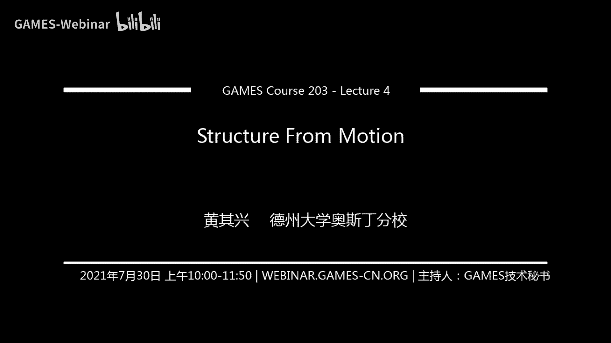
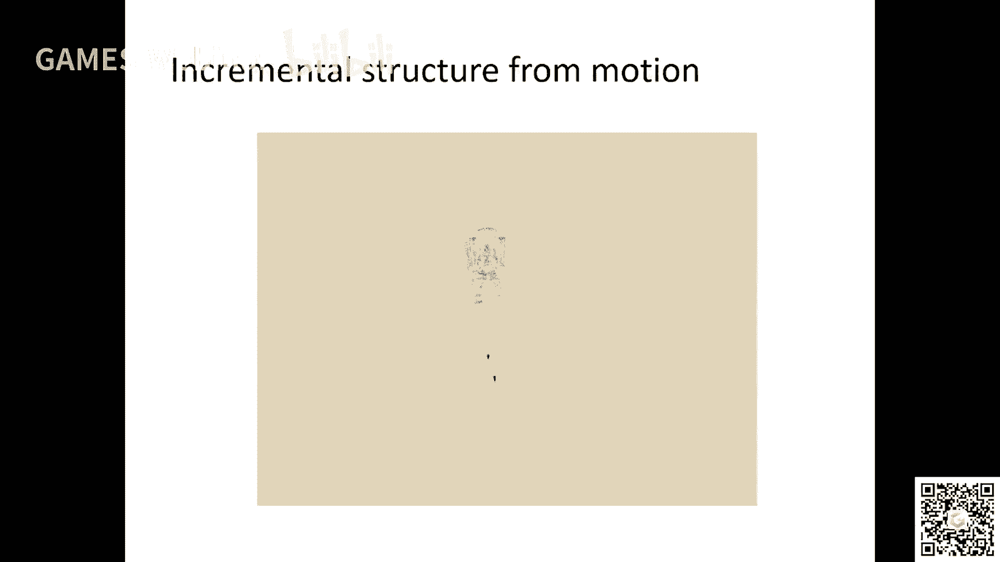

# GAMES203： 三维重建和理解 - P4：Lecture 4 Structure From Motion - GAMES-Webinar - BV1pw411d7aS

hello，大家好啊，那个我们开始上课啊，那个啊今天我们讲那个motion啊，这是什么，是strong one motion呢，就是说呃就说呃前两节课我们讲了这个从这个rgb d。

就是在这个呃深度信息的这个cam的重建对吧，这节课呢我们和下节课呢我们讲从直接从image就是你开始，比如说啊这节课后面会讲，就说你从那个网上到下载了一些图片对吧。

然后我们想从这些图片里面重建一个sm这个sweet magi对吧，我们想做这个事情对吧，嗯今天我们当然这个东西呢，它一般现在情况下就是说一般分为两个步骤对吧，第一个步骤就是说我们先估计呢。

就是说这个caa的或者是image怎么pose，比如说你两个image之间，我能不能知道这个image从哪拍的对吧，你看这个图实际上就是说啊中间是有一个物体对吧。

然后之前我们要知道这个image大概在哪些地方对吧，同时呢我们也会得到一个比较writing，比较sport，就是说这个point cos会用的对吧。

就是说帮助我们去formula这个这个image caa costation这个problem啊啊，那这个问题怎么解决呢，我们今天会讲一点他的这个奥特曼pls好吧，就是从头到尾讲一下啊。

首先呢我们要了解就是说这个image是什么怎么生成的对吧，或者就是说这个image它跟这个就是这个image里面的这个物体的三维结构，它是什么关系，哎这一部分东西呢就是如果你学过计算机视觉。

这个这个或者就学过这种呃，这个声音好小，听不到现在呢可以了吗，啊就是这方面的东西啊，就是啊，这个怎么会听不到呢，这个应该是可以听到啊，就是我们要了解这个几何对吧，那个那第一呢就是说就是说首先要建模对吧。

就是我们这个image是怎么通过这个three d的这个这个这个three dimon ject对吧，就是三维的物体上，然后变成image哎这个东西很重要对吧，那现在一般情况下呢，我们现在做的什么。

一般情况演讲时间到婚后看嘛对吧，就是它是一种就是一种多面，才是image方面的inform声音，加个降级视觉啊，这个人很简单对吧，它就是一个相似变换对吧，简单的projective tearing对吧。

就是说呃你有一个你有一个three dimensional的这个三维的物体对吧，然后呢你有一个那个春后对吧，实际上就是当物体的每个点都投影到什么，你个play是吧。

三个物体中每个点都对应到image print上面的，没一个pixel对吧，这种对应关系对吧，对吧，啊他就是说实际上这就是一个创意，诶，这个投影呢很很显然就是说你把深度信信息信息给丢掉了对吧。

把深度信息丢掉了对吧啊ok嗯然后呢怎么去model这个东西呢，啊就是说实际上就是说呃这个地方就有一点及格嘛对吧，这个东西大学中学应该学过啊，就是说很简单的这种呃相似变换对吧啊，很简单的相似变换。

但是呢你如果引入dog image的话，我们会发现它有一些建议代做的东西在里面有些很影响的东西啊，就是说你比如说你有一个三维的这个corona project的原因，mage codn对吧。

然后这个image quality跟三这个三维的它是ation sx等于x对吧，乘以这个大x跟z对z就是那个def是吧，就是这个y x对，那这个rh的x等于f等于x1 y1 y z y等于f。

就是y z y y z是吧，f呢实际上就是一个fpx对吧，所以他就是一个for和n嗯，哎这个东西是可以控制的对吧，因为你cos了f这样就控制了这个什么，控制了这个x和y是一直codx d对吧。

就是说你通过控制f实际上就是控制了，比如说你这个image框住的这个obj大小，对不对，这个f是知道的对吧，f我们一般情况叫做intring啊。

我们会后面会讲dx和y z我们都不知道他们的ratio对吧，我们是知道的吧，就是如果recover z就是这个depth对吧，你看这个图，那实际上大x大y你就知道了对吧。

所以为为什么那个这个三维视觉里面好像很重要的一个问题，就是depth estimation对吧，因为你知道dex你就知道x y对吧，因为平时给了你另外cod啊，坐标啊好然后呢实际上很确定的一点呢。

就实际上就是说从一个角度来讲，实际上比如说一个gmage point，实际上对应的三维空间中呢，它实际上是一条线对吧，就是说你把这个image point跟这个原点相连对吧，跟那个看。

然后你就得到一条线是吧，这个线上面所有的点对吧，都有可能是什么，都有可能是那个object对吧，但是你不知道对不对，那这个时候呢因为这个原因呢。

大家就明确就是一种叫做how much genus cod，嗯，就是你对于另外一个x y对吧，你把一个image变成一个three dimension，是一个codm。

就number乘以x number one等number是吧，对一对一的这两个东西都都被吓死，就how much genifyou coding vior，point line。

line is there is a projection，对吧，这是一个很interesting pover，哎这些东西都很很很有意思啊，稍微抽象一点对吧。

实际上这个地方呢你可以说我们我们什么也没干对吧，我们只能确定是一个notation而已对吧，但是呢这四个location呢就是帮助你将来做计算的时候。

因为你就是他说不是就是就变成了一种intermediate这种东西，对帮助你去思考，也帮助你去推导，哎帮助你去方便这个lv的啊，它主要是这个这个东西，point at infinity对吧。

就就就比如说这个号码今年是高地的，跟这个传统的方面有什么不一样呢，那就是说你这个传统的方面，你是没法隐透着这个point at infinity对吧。

那个这个how much genius cospace呢，它比较就是说比如说你最后一个东西难不难，你看这里有个难的对吧，如果这个男的是零对吧，就x y0 ，实际上它就表示这个point and fin。

对吧，这个东西为什么重要呢，就比如说呃什么point as the infinity怎么来的，那必胜尼尔两个平行线对吧，你两个平行线，你如果两个线不平行，它肯定相交在一个人，就是一个有限的点对吧。

你两个两个线和平行对吧，那相交你没法表示了对吧，你这个他想要，那那如果用home gi就很好表示啊，就是对吧，这个x和y其实就是那个两个平行线的那个那个那个叫什么，这个有多多写对吧，这个的方向对吧。

诶他们就相交了这个沿这个方向的那个point finity是吧，这就比较好表示了是吧，诶这个这个因为为什么这个重要的，就是因为image里面这个nb的很很很重要对吧，不为了。

然后我们看看这就是考虑两条line对吧，l want a对吧，l q等于a two b c t对吧，这是两个line给我买这个东西吧，就是两个line对吧，那，就是这a1 b c是什么。

就a1 x加b1 y加上c等于零对吧，这实际上是那个true dimension的一个一个line对吧，就是比如说x加y加1=0对吧，或者x减x减y等于零对吧，诶那那那就表示成那个三个框架。

你所以就是说你把任何一个a c那个a2 b2 c2 乘以任何一个卡组，他表示第一个nn对吧，所以这就是对吧，他只是表示这个n，然后你这个如果要跟做inteaction，你怎么做呢，也很简单。

就是你把这两个veer吧做一个差距对吧，就是就是cost product啊，英英文名字叫啊，这样你就得到了另外一个三维的坐标是吧，那那这个三维坐标呢它刻画的就是那个相交的那个点的话，就是考研人对吧。

它包含了这个，那就包含point一下infinity对吧，就比如说你如果l y和l q如果两个东西它是平行的，哎你相交出来这个框架的肯定是零对吧对吧。

那你比如说我们举个举举个例子叫intersect your parawes吧，就是有，对吧就是说你l l一对a b c对吧，one price is就是a b对吧，因为他的这个方向是一样的，对对对。

c c和c8 不一样，就表示内容l拉不一样对吧，然后他intraction就是你把两个合在一起，对不对，就b c c b对吧，a c减a主要是最后两个东西，因为是a乘以b减去a乘以b它就是零嘛，对不对。

然后你把它变变化一下，就是b-0对吧，这就是他的那个什么他的intersection for the finish，哎就是这实际上是给大家一种重新思考问题的方式。

就是说然后呢因为你这个是com jp corner的这个point line，它有它有一个非常非常就是我们上次看到这个produo对吧。

这个marching cube和这个dual contro倒是有一个gr的比赛里面是这个地方，这个这个这个这个线段跟这个点啊，它也有一个九比赛对，就是说你要换他们的吧对吧。

两个点他们他们的cos code上就是那个下次来个m对吧，同时呢你给定两个点对吧，infinity对吧，然后他的这个nppoin根本把这个东西就是，就变成冰啊啊ok就是说我们说了两个line啊。

这里这里要记住的一点，就是说两个ln相，这样实际上它就是cosport就变成一个点，然后同时两个点是你这个ln cc是两个点，实际上就变成那个line对吧，他是这样一种关系。

ok它还有一种model就for pp in austring，实际上就是说这个先生和，就是这种东西呢我们就是我们就这样子，我们马上会看到，就是说实际上就是说它通过一种好吗。

今天内他把每一个pixel对吧，他就跟这个三维空间做了一个对应啊，做了一个对应好，然后呢这是一个很重要的thri，呃，我大概解释一下，实际上就是说实际上这个词也没干别的东西。

那就是formerly define对吧，就是说这个三维坐标跟这个image coda，它的这个这个relation，它的这个这个这个关系啊，就是说你单位有个坐标对吧，呃一个物体对不对。

然后呢你这个看比如说这个物体呢它有一个no或者cornb等着一栋房，一个object，还有还有那个up向上和那个前面这个方向对吧，还有一个框system。

然后你这个caa呢肯定是在有一个local的方面，基本就比如说我我我我换了一个往哪个方向看它的upright，这个caa它有一个方向对吧，那这个时候那个camera的方向呢，它就被这个r和t code。

对不对，就是你把那个物体框架下面那个和那个那个坐标系下面的框架，那个你用这个cover cos transform in码了。

就变成那个什么common这个corn是c c选下面这个three dimensional coron对吧，哎你就转过来了对吧，你再看看可能这个物体是斜的对吧，哎可能物体是斜的啊，好问题是闲着的。

然后你你就做projection production，说白了实际上就是呃对吧，我把自呃我把这个最后一个quality给扔掉对吧，然后我把这个地方呢我做一个就是xyz，我做一个什么。

实际就是我我把xyz它变成什么，变成这个它对应的那个pixel，对任何一个点对应那个pixel的homechor对吧，这个地方过了以后呢，你注意一下这个地方，你过了以后呢。

这就是说再比如说是以米计算的对吧，它的它的长度是什么东西呢，这是一个什么，这是一个就是也不说1米了，就是说这是一个跟这个english，这就比如说你的socnt无关的东西对吧。

这一块呢叫做我们一般叫做把它叫做image quality啊，就是在这个呃派two过了以后，然后ui框架呢你这个caa有focus，他有他有他有他有这个focal那样等等等等等各种东西，对不对。

这个时候呢我们就可以把可以对它做一个什么呢，可以对它做一个哈哈哈，我们可以来对对它做一个transformation对吧，就是a放的那种transformation或者f这些。

比如说它有时候它有些image，它不是完全对吧，比如说完全这个就是垂直的是吧，它会有一些，比如说ima是大小o x o y对吧，就是那个center在什么地方对吧。

以及那个for和nt决定这个英语有多大啊，这些东西称之为这种intrinsic frameters，然后呢这个地方它就是变了，这个以后呢就变成品色框下面的那个什么home jp。

就是这个equation是非常非常重要的啊，它它包含了很多很多东西，就是说它包含首先它有这个有coma的pose，有caa里面这些东西，对不对啊，这些东西呢一般情况下我们要去s m的，然后他就可以固定。

还有一个canonical projecti，alright，ok好，这就是我们简单的做了一些介绍啊，那么下面我们要讲的就是说这个qq genome对不对，就是说啊现在我们我们前面学了一点理论。

学了一点点理论，学了一个notation，那现在的问题是哪呢，就是说我假设有两个image对吧，然后呢我知道一些对应点，比如说这个点p和这个点它是对应的对吧，两个地方对应的对不对，诶。

然后呢我要mm这个camera depressions，就比如说这个image跟这个image对吧，他的这个relative translation of campos。

以及以及这些点这两个点的坐标对吧，当然这个问题能不能解，这是一个问题对吧，好那我们现在呢先假设什么呢，先假设就是说the training camera prima，他是知道的啊。

一般我们后面会讲怎么去估计他对吧，实际上也就是说如果我们知道这个k，实际上我们可以把x方呢用k的in worse去代替对吧，这个时候就是实际上就是非常简单的，我们就会得到一个这样的东西，比如说在低的。

因为啊这个地方稍微有点绕啊，就是说这个x方它不是peter框架，比如100 200的可以，这个东西反应是0。20。5啊，他就是说假设你知道cover intr，然后你把它求一个inverse对吧。

这个时候你就得到了这个x y是吧，然后这个大开的x y的，就大的那个x one的实际上是这个三维坐这个点的三维坐标对吧，呃在这个第一个energy下面的这个什么这个这个coda，当然你你你对吧。

你知道这x8 开不了x one，它是有一个我们不知道的def比number one是吧，乘以x2 x2 我们是知道的，但这个看着比如说这个是吧，如果这个点我们可以知道，比如说100 200对吧。

然后我们如果知道k的话，我们可以用emos k就得到这个one对吧，好number one是不知道的对吧，但是x one知道的caa x y我不知道对吧，这第一个image，然后我们用两个view对吧。

两个view不要第二个image，就说我把把第一个东西呢乘以一个location translation，这是这是r和t我们也是不知道的对吧，因为你造了两张图片，你当然不知道嘛对吧。

number two对吧，我们也是不知道的，对不对，就是然后这个是在那个第二空间下面给你对吧，就是number one x y y加对吧啊对吧，那么多tx two这两个东西我也是不知道的，对不对。

然后这两个之间呢啊我们有一个这个relation，对不对，relation对吧，就是这样子的，好这有两个哦，那现在就是问题，就是说呃我们首先要普及r和t对吧，如果你知道r和t啊，如果我们知道了r和t。

你看啊，equation，它有几个variable，它有两个variable，number one，number two对吧，它有几个constraint，还有三场券，就是如果你知道r和t对吧。

那也就是说你有三个cc，你有两个variable对吧，这个时候你可以写一个linux system对吧，就是去recover number two和number one对吧，那关键就是我们能不能对吧。

能不能从从，比如说一堆spondence是吧，很显然你这个地方有两个variable对吧，实际上那也就是说你三个考试线去掉两个variable的话，你还有一个考试线的r r和t对不对啊。

那这个时候比如说你至少比如说如果比如说你如果这个translation，我们不能cover这个up so number对吧，因为我们这个absolute这个size我们是不知道的对吧。

你可以同时scale number two number one，scale number two number one和t对吧，不会change这个equation，对不对，哎对吧。

那这个时候也就是说实际上我们有多少个东西需要去recover，我们需要recover那个三个rotation和两个全飞行，对不对啊，我们就最少你需要五个constraint对吧。

五个这个point wise correspondence，那么今天我会讲一个eight point max，相对来说比较比较比较simple formulation，好那我们想那我们的目的是什么呢。

我们的目的实际上就是说我们对于任何一个，就是我最开始看任何两个code correspondence这个东西，如果你知道一个区别啊，但是我觉得就是我估计有一部分同学都不知道啊，就是我稍微想一想是吧。

就说这个地方呢我们想做的事情是什么呢，就是首先不写r和t，那么这个时候我们需要把这个number one number two给消掉对吧，然后呢这有一个非常非常beautiful的名字。

就是说你可以可以把可以把那个x one x two和t和r的关系啊，用一个非常简单的这种nya的这种形式表示啊，这个t has实际上就是t transer这个cost product。

它是个330x3的，这个就是ska savage metri啊，这就是对角线都是零对吧，呃那个对应的那个东西呢是是是负号对吧，of dementry，然后是这样的话呢。

你就已经确定是一个essential matri，所以我们这个地方假设这个camera trance是知道的，所以我们已经把这个什么k给扔掉了啊，如果用t ht这个圈子cos的sr对吧。

你把把写成excession magic项，然后呢你就recovery excite magic，方x y x，因为x y x u都数嘛对吧，但是也是我们要recover runing对吧。

这个东西是怎么来的，我们我们简单看一下啊，非常有的，这是我们的equation对吧，我们目目标是什么，目标管他们的官号，那么就可以扔掉对吧，然后剩下就是一个考试的r t那我们首先是干什么的。

首先我就是说这两边呢都用t的cospot是一个什么，是three dimensional，一个veer是吧，cosport这两个东西对不对，你cos for lo以后呢，你会得到什么呢。

就是number two乘以t cos cos product x two，对不对，等于number one t cofdr c x对吧，然后对面t cofpx是零对吧，这个东西就消掉了对吧。

然后你就得到了对吧，t乘以cos x6 和t cos lt r i x这两个东西是什么，是同一个方向的对吧，number number two，number one不一样。

但是这两个东西这两个vex是同一个方向对吧，也就是t cos cox two对吧，他跟这个东西是也就是说这个后面这个mad是吧，它既垂直于t对吧，也垂直于x和x q对吧。

因为两个vex的cost扩大得到一个vx，实际上是跟这两个vc都垂直的对吧，所以后面这个t cos on alt x t这个vc它既垂直于t也垂直于x2 对吧，那你如果它垂直于x2 ，对不对。

那我们就都知道对吧，他从来就是x2 ，所以就得到了这个东西，这个t cost product这个东西它实际上就比我们写的king heat了，这三位是这三位数学里面比较经典的一个dation啊。

就是说你看他用到了这个用到了很多简单的几何的特性啊，用到了很多几个很简单的几何特性啊，然后呢我们就知道对吧，就是如果我们把这个定义成筛选，没选x就传播成一乘以x，二就等于零对吧，那就是一个这样的呃。

这样的操作对吧，然后ok，ok，all right，然后然后呢基于这个东西呢，它有很多几何的特性过来了啊，比较interesting的东西，我就给大家讲一下，就是说他就是一个摄影组合嘛。

就比如说你这个比如说你把这两个hama 3的连条线对吧，它有两个交点，1u1 e和eq，你注意啊，这些东西它相对来说有点绕你这个焦点。

实际上这些所有里面所有的bla大多是用好的ga corner表示的啊，就是说啊比如说这个点啊，你讲这个点对吧，x y对不对，比如说你你知道x y l two对吧。

比如说l two homogenius corate，对不对，他就跟vil one l two，它就跟什么它在dependulation可以x one有关系对吧。

也就是说比如这个东西implication是什么，将来computation最重要的是什么东西，就比如说你假设你你拍了一张图片，这个拍了一个three dimension object。

从两个部分位置对吧，然后对于任何的图片中，第一个p在一个图片中，你对应的那个correspond技术，在第二个图片中，它它在一个什么上面，他一定在一个线上面啊，就比如说你做做mc的时候。

做shaming的一个点都明白是到别的地方任何一个点对吧，对不对啊，你在大部分音mage reconstruction的时候，它居然是个first space，它非常小，就是如果我们知道r和t对吧。

假设我们be cover出来了，我们就知道以分成marex对吧，然后在那边的对应点实际上就在一条线上，这个设计space叫什么呀，就小很多了，我们后面做multi stereo的时候。

首先就会利用这个东西，后面讲啊，这个是你让我记住了，但我们后面会提到的，然后包括现在做deep learning的这些这些方法啊，就是说实际上就是呃呃这方面的这方面的那个它用的很多啊。

这是一个反mc的公司，非常反对mc的东西，ok然后我跟大家讲一下，你需要知道single videcoration啊，你需要知道single be，需要知道这个东西啊，啊实际上就是给任何一个矩阵。

它都一个single vide，ok呃如果你single videcomposition呢，呃我们下面讲讲什么，比如说你怎么通过这个image correspondence对吧。

就是x y x一个image respondence to recover essential matrix，哎这个东西就很interesting啊，就是说实际上就是说第一它的思维是指什么，对不对啊。

这一三就make it满足什么boecmmit，满足一些非常非常interesting for poverty对吧，比如说a nono matrix e的意思，essential matrix 3。

if i had a singularity position对吧，它这三个对吧，他这个三个东西叫特征值，对特征值啊，它都是不同的啊，但它同时都非零啊，essential major。

如果你是存在一个e，它存在一个随ation cost放到一个rotation，rr是一个rotation啊，那这个时候以三项mah是single value，它就是它前两个必须一样，最后一个必须是吧。

也就是说这个以三项mac它不是满次的，这个证明我们就不不正啊，那我们怎么来通过image correspon呢，你可以可以对这个证明，你可以看那个网页的书啊。

那我们怎么通过这个这个image correspondence的recovery，这个是mach啊啊这分为两步，第一步呢我们首先就是说如果你有一个excel ming他他的他的s b d对吧。

就using my v对吧，他正好满足这个sigma sigma，sigma，sigma sigma 0对吧，正好满足这种特性，那么对吧，你就可以通过这个变化对吧，这个注意这个rd这个东西。

这都是一个concert阵，所以所以说这个这个rt啊，它只跟比如说他呃，比如说你把sigma提出来的话啊，他只跟比如说这个trition的跟新闻有关系。

但是这个意思这个这个这个notation component，它就跟什么啊，他就只跟这个u和v相关的，就是如果你有以上就没去做，这个东西呢你也你你呃，你也去看那本书啊，呃这个这个推导我就不推了啊。

对吧就是说你那就是说呃，我就不退了啊，好那就是现在我们就是s mate essentimec是吧，那就首先第一我们怎么通过这个，image called a correspondency对吧。

得到这个e对吧，而这个地方你要注意一下，就是b x one是一个啊，就比如我前面看的那个show的那个example，一个correspondence对吧，就是这边一个那边一个就是你把它写成一个啊。

你比如说你这个x我one它造成e的tx就等于零对吧，你把它稍微比shift一下，就会变成一个这样的linux，st就是a就是这个跟这个piece quality相关的这些codm对吧。

spe就是那个什么就是这个ecentimetribe shift出来的对吧，你把这两个cosplat在一起等于零啊，这就是什么，这a是一个常数对吧，这个e是一个我们要5g的东西对吧。

有多少constrain的呀，有一个constraint对吧，每个image respondence是吧，有多少variable呢，呃有九个，但是我们不开发的那个unico给你实际上有八个是吧。

实际上我们需要多少个image for respondents，我们需要aa对吧，就是说这个我们叫formula nation a对吧，呃每一行对应的是一个image correspondence啊。

每一行对吧，然后呢我就是有一个这样的东西，就是a乘以e等于零对吧，我们就是我们，然后我们要通过这个东西呢，recover这个e对不对，recover这个e对吧，就是a那怎么做呢，我们就做一个这样的东西。

a乘以e他的这个平方对吧，除以这个e的平方吧，我们做一个这样的东西对吧，对吧，就是说这是一个trick啊，实际上这种东西啊啊这个chat the，比如说你如果做其他检方式，你做做一些参数化啊。

写一些优化啊，我们写的后面都会经常看到对吧，就是说因为如果你不这么做的话对吧，你直接解这个东西e的一个零，那就是一个区域的东西，你不想让e等于等于零对吧，那怎么办呢，你就把e对吧。

把这个mo变成一个就出一个racial a乘以e的平方对吧，所以这个e的平方啊就是a乘e这个这个符号就是一个norm的形式，实际上就是所有的element的平方和平方等于a诶，为什么这么做呢。

第一就是说第一你就能避免e他的一个零对吗，你这个tribution，第二这也有一个close to solution啊，就这a的s啊，这个东西的话，那我嗯希望大家都知道这个东西。

你就是把a乘以a a转置是吧，a转置乘以a转置乘以a对吧，这个矩阵的最小的特征根提出来，他就是那个一好，你得到那得到了这个e以后对吧，一个问题就是说你然后你回来以后，你不能保证对吧。

他正好能满足这个形式对吧，你因为它会有误差嘛对吧，你的那个image cod correspondence都可能有误差嘛对吧，那这个时候怎么办呢，哎这个时候呢你就可以对吧，你实际上说白了很简单对吧。

你就是对那个e做的那个没水座椅三上面的s v d对吧，然后你就直接用u和v好了对吧，你剩下的就sigma sigming对吧，你就可以对吧，你就可以把钱把最后一个这个东西呢变成零。

number three变成零对吧，你把前两个做一个average对吧，实际上就是说呃呃对，然后呢你就得到一三成为你得到这个东西以后，你可以用这个对吧，我们前面讲到这个东西去recover这个r和t。

好那我们总结一下这个eight point method啊，总结一下啊，呃其实非常简单啊，当然我会讲一点这里面的inside啊，主要就是说你有你比如说give me a settle in sin。

对吧，你首先当这些东西我们都假设它是你不知道time a ching，你都用这个东西，这对吗，对吧，然后呃然后呢你就你就说，然后你就想提这个东西对吧。

你是第一步就是看computer first ftation，depenciation，就是aj对吧对吧，就是这都是constant，这都是cospl，对吧，a这是一个concept。

然后呢你就放一个max a，对不对，然后呢你就得到这个mrc对吧，他的那个必定的这种i跟mea对不对啊，icon mac对吧，然后呢你做projection对吧。

就是说让让让这个snaps closest对吧，这个essentiation是吧，pointing the essentiation space就是你recover这个东西recall了以后呢。

呃还有一点我我这个实在是没讲，就是说其实呢你有四个solution对吧，就是说你的emaker可以是真的也是负的对吧，如果意思意思的mac复议bo max是吧，实际上就有四个可能的，他非跟小r和t对吧。

最后呢你就你就回到这个地方对吧，回到这个地方，对回到这个地方对吧，然后你就去解这个number one number two对吧，然后就是你可以证明如果你是image fdx的话，只有一组解对吧。

他所有的number number two，对于所有的image cof，他都是正常，如果如果你relax constraint的话，就是说你这个number one number two可以负的话。

从几何的角度来说的话，嗯他是fable的，physical率不行对吧，你照一张图片，怎么可能是deft或者呢对吧，我们今天的任务很多啊，我看看我们能讲多少啊。

下面我们就讲这个camera calibration啊，就是我首先比如说我买了一个cam，我怎么知道那个那个cam对吧，我怎么知道这个k matrix对吧，哎这个东西很重要对吧，这个东西怎么弄呢。

就是说你有一个x y对x y y y y y y对吧，这个肯定三等于k x对不对，然后你就变成一种这样的形式对吧，就是说对吧，就是说这个x是这个image quality对吧。

然后它是有个k mage是对吧，这个k我们比如说最开始我们是不知道的对吧，那我怎么去估计他呢，这个时候呢你就需要想办法用一些别的辅助的工具是吧，辅助工具嗯，辅助的工具对吧，就是说怎么说呢。

这个时候我们就用一个这种叫做v就是对，就是这个v的好处是什么呢，就是说你比如说你你如果固定了一个这个这个image上面一个点，这个跳的有点快，实际上就是说我们想做的东西是什么呢。

就是说我们现在不知道那个开trc，我不知道那个焦距对吧，也不知道那个动人的东西是吧，但是我想用这个看法，那前面我们讲的以30为水，实际上是什么，前面讲这个essentimesx。

实际上就是把这个呃把这个，把这个k给固定了对吧，那怎么得到k呢，那就用一个这样的v啊，这样的mix是它有什么好，当然还有别的方法，就是说，就是这个wink上每一个corner对吧。

我都可以detect照对吧，它都有corona image corner，这些corner position呢，他满足什么条件，connect physician吗，这是什么条件。

他满足就是说如果你明白，你固定了一个这个pk的一个一个一个corner对吧，定义一个这个vega的一个note corner等局部坐标系对吧，然后你定义了每个green size。

那实际上每个点的remon哪个方面都知道对吧，对吧，他就是一个这样的东西对吧，那怎么办呢，实际上我就是对我有实际上我们一般的做法，但是我不知道那个up scale是吧，但是那个东西不重要对吧。

就是找一个那个cording system对吧，就比如说这对你任意定义对吧，比如说这个点这是什么，这是对吧，然后三个x后面的x y z对吧，然后对吧，然后我们还知道什么。

知道每一个那个那个是一个一个的问题，它的长度加成这个是一对吧，那实际上任何一个这个黑白相间的这个这个corner的那个three minufo，我们都是知道的对吧，然后你要问对不对啊。

那我不取这个地方是只有0009，换一个地方，000没关系对吧，就是说你解出来以后，就是说你这个局部坐标系的这个rotation translation会变，但你解说那个k不会变对吧。

好那这个东西怎么说呢，就是说你比如说那实际上我们有了这个东西以后呢，就是说实际上它会有一个这样的东西，就是x y这是那个什么，这是那个piece of coordin。

就是那个那个corner point，而大x呢是你人为定义的对吧，那个three dimensional coordinate，中间呢它就是一个这样的矩阵，就是一个派局阵是吧。

第他第一列是d前面三列是k这个intrinsic可以这个rotation对吧，后面一列呢是330x3的矩阵，乘一个translation对吧，那就是说我们把这个max好像那个派对吧，如果我们知道派的话。

你想做什么，因为k它是一个上三角矩阵，所以你可以做一个叫做q r级ation对吧，线性代数里面很重要的一个东西对吧，你可以知道派实际上你就能比power cake啊对吧，然后同时你知道知道配的话。

你就能比pop t对不对，所以就是说比如说呃这个x方x等于sm的cos是大x是一个，你说每一个这样的，比如说你前面这个每一个这样的这个框框给了你多少个cos，给你三个cospring对吧。

然后你有一个男的，你是不知道的对吧，你需要把这个东西消掉，哎这个东西大家都知道怎么消对吧，你比如说你把它写成这种形式对吧，就是说它写成一个呃三个wp这种形式对吧，然后呢你把这个东西展开对吧。

展开是这样对吧，这个这个x方x i y z i你造的对吧，你是你自定的x y呢，小x y l y那也是你自定的对吧，然后你可以通过一个什么通过高斯消元法这种说法对吧，你可以把难的给去掉，对不对。

就是除以第二个对吧，你就能得到所有信息对吧，高速相应法是类似的东西，对吧啊，注意这个地方，你能你你想recovered variable什么的，拍一拍二，拍三个variable对吧。

大x和小x y这些东西都是cos的，都是知道的，好好有了这个东西，你就得到两concert是吧，from这个方向可以起来求解这个concern of musation form对吧，你用同样的手法对吧。

同样的说法对吧，m就是每一列对吧，你注意这个地方我稍微跳了一下，就是说这样的constring，对不对不对，你都可以把它写成一个呃，一个就是一个常数，是一个常数乘以这个什么pvc对吧。

这个x x y y10000 对吧，这样显示对吧，然后呢这有多少个variable，那有12个variable，所以你需要多少个阵容，the corner point。

那为什么k一下或者去pk需要六个对吧，需要六个同样的方法，你可以解除派对不对，减速怕以后呢，然后你可以做这个qr decomposition，对就是你有看，因为因为什么，因为这个地方k它这个大三角形的。

还有六个二狗r呢，三个加起来是九个对吧，你正好一个33的矩阵也是九个，玩九个那个element，他给九个constraint嘛，所以你有一个unix solution对吧。

有了这个你可以recover to ok嗯，all right，然后我想想我们休息五分钟好吧，行五分钟以后我回来讲一个insight，然后我们就简单的向前走啊，这个slide应该是课程主页上有啊。

休息五分钟好吧，他，好我们接着来啊，就是不管是我们做这个motion还是camelibration，你们发现没有，就是说都没有一步到头的对吧，一步到头的啊，我没有说一步对吧，就是得到k合啊对吧。

我们都是把它分解成很多步对吧，cnm celebration，我首先估计一个中间的那个pmc，然后我做kr d com类型的三维视觉里面啊，他就是为什么要这么做呢，就是因为如果我们直接一步去搞的话。

会出现什么会出现，就是说你没有显示解对吧，没有显示器没有显示解的话，那就出问题了，你做一个系统没有显示解的话，你怎么有一个有初始，怎么另外一个初始节对吧，然后你再怎么基于这个初字写去refine。

对不对，这方面的工作是很重要对吧，你分成很多步以后呢，每一步都我都有个显示器对吧，从系统讲来的话就比较放嘛对吧，同时他们现在讲这种比较有有可解释性嘛对吧，当然你会说那我能从投资做这个intense。

这个看法可能会选择这个这个这个这个这个虽然说模型也可以吧对吧，比如说诶你可以把k扔进去，对不对，这个时候呢你就会有出现一个叫做fmental matrix对吧，他这是什么。

实际上就是说他是这个k inverse transpose对吧，乘以这个essentiation可以k inverse对吧，如果你直接有pieces of correspondence呢。

你就可以估计什么，估计fmentone minal match，fundamental match，同样有这些设计，对不对，同样有这些特性对吧，你这个估计反正mal magic可以有这个。

他他首先他还是一个不满射的东西对吧，但是因为开的原因，他前两个特征更值啊，这个新的这个啊不一样了对吧，哎你还是可以去估计他对吧，就是用同样的方法去估计他，这个我就不讲了。

这个东西其实跟那个跟那个那个以三球美女4k是很相像的啊，对你可以有tv对吧，你说你写这个东西对吧，然后然后你做这个suv的分析，对不对，project projection对吧。

然后你最后就可以得到一个pf fm magic，简单啊，这一部分你如果了解了前面的这个东西，那就没有什么问题啊，没有什么问题，那问题在哪呢，问题就是你你有了这个fundamental magic对吧。

你怎么去，比如说我们想得到r和t同时都可以，哎这个东西就难了对吧对吧，但是同时呢如果你但同时呢因为你是想f只有八个variable是吧，你k有六个点和七对吧，有两个吧，至少还有三个。

你加起来肯定concert比vable要少嘛，你肯定不能与你去国企的extract嘛对吧，哎这个时候呢就是说要加一些什么，需要加一些加一些别的东西。

比如说两个两个两个一个additional constrain，这两个东西垂直啊，这些东西啊，这个东西相对来说它就比较复杂了啊啊啊。

现在一般的python就是说我们首先估计这个开发celebration，怎么把intrinsic去掉，这样的话问题就变简单，今天的课可能稍微短一点，可能稍微短一点啊，啊这个东西我就不讲了啊。

那下面呢我们现在讲的是两个月，等我下面讲讲少于八个点来求解，有个five point method的那个东西非常非常复杂啊，就是数学上非常难区别啊，脸相对来说它是比较鲁棒的啊。

相对来说他比较鲁邦的一种方法也比较简单对吧，你看那个实际用用八个点的要远远比用五个点的光点，preciable，你要你当然你只需要五个correspondence，这个就很很，那有时候你比如说。

从学术的角度来说，你当然觉得五个点好吗，因为他只需要五个点，我为什么要八个点对吧，对吧，从应用的角度来说，它往往是这些简单的算法是最后项目最后知道吧，反推线也高一些，做东西啊，简单好吧。

一个s v d对吧，就是不要就是做一个东西往上面搭一个非常复杂的系统啊，不提倡的啊，知道了对吧，特别像的地图，你有了以后，你没有必要这样啊，那多个东西怎么做多个dogo dogo mage。

实际上呃没有什么难的东西在这啊，就是说它分为两步嘛，就比如说我比如说你如果有了这个corresponse的话，然后你会得到一个什么，得到一个一些concern的那个projection p对吧。

就是那个与那个pose有关的project mission对吧，这这这东西当然他也是他也是我们也是不知道的啊，呃不知道的哦，f i j次我们知道的对吧，z这个词也是不知道的啊，它实际上就是说，对吧。

slide是在那个网上，你可以下载，在课程主页上，在我主页上，就是说你需要你需要有一个这样的，就是让他有些cc什么这东西呢，实际上就是说就是你要写个优化问题对吧。

就是说比如说你写个lisvp formulation，对不对，解一个list square formulation，然后呃但问题是在这个时候to view的时候显示解嘛对吧。

你分类包括multiview了，它没有显示器对吧，或者就是说你还是需要做一些relaxation对吧，relaxation，这时候呢一般情况下丢了一个bo c神，怎么build呢，呃你就。

得到一个初始键对吧，你首先得到一个初始键，然后再再再再refine对吧，是吧，那是我们我们这个叫什么叫sequential emotion，对吧。

就itional motion for two images，using fundamental matrix，然后然后呢initial structure by transition对吧。

不断的把那个新的image加进去，对不对，然后这个东西就比较粗了对吧，就比如说你有一些point的，你要看嘛，然后你你给新的view对吧，你把这个你把这个你就得到，就是说你固定前面的。

你已经估计好的这个three dimension point，three point从哪来的，就是number one，number two对吧，这些东西对吧，咳给了一个新的view com来以后呢。

你就把新的那个把把前面这些东西呢，把新的那个那个那个那个那个那个image跟前面的image售卖，这个时候呢你还是可以用这个trivial的这种solution对吧啊，去去去做这些东西啊。

缺点就是说你这个普通决定了你怎么去选这些个order对吧，好处就是说你还是可以用那个已有的算法，已有的算法去做这些事情啊，做完了以后呢，你做一个我这个这个东西非常非常重要，这个这个叫做bt加什么。

some minimize for refinance and emotion of minimize，minimizing projection，error对吧。

就是给定一个这个p是一个projection对吧，然后projection可以这个x j对吧，然后你跟这个x i j去做这个zation对吧，就是说你优化的是这个project，这是x对吧，b没了。

也就是说project以后对吧，你去evin mage这个东西对吧，这个就piece of difference对吧，但是但是这个东西呢需要你有一个good lization。

p i p i和x j对吧，这个东西拿来从新手到motion了对吧，对，就是multiview呢，你注意这个我们专门会有一节课来讲怎么做multiview这个问题，我们把它叫做inization。

把它叫做synclization，我们专门会有一节课，只是去讲那个东西，这个地方你就发现就是说啊包括后面讲的这个photo tourism对吧。

这个这个这个东西它实际上也是一个这种这种sequential，然后再做binder shman这种这种东西，vision的东西，就是说你这个系统work的好很重要啊，非常重要的啊。

就是说理论上漂亮重要啊，the division还是强调这个，至少那些梅西小学这个东西还是很重要的，就是做学术的话，大家是看这个东西的啊，那work的好也重要，简单讲一下这个photo tsm对吧。

你们有谁知道这个东西吗，这是一个cpf cpf 06年的文章，我觉得这个这个文章它好在哪啊，不知道，ok这个这个这个文章好在哪，他就说首先这个思想很重要啊，很重要啊，思想很重要。

就是说你首先这个问题是什么啊，这个问题，但是后面他们也做了一系列的工作，做了一系列的工作，这样的就是说它首先给定一些image对吧，给定一些image，这里有很多images，然后呢是从哪来的。

从网上搬的，比如说你设置一个是那个很像对吧，或者时代关卡，因为得到很多很多image，很多images，对不对，你得到这些，因为这以后呢怎么办呢，所以对吧。

你就会想想我们怎么能用这strual motion官网的得到这个image post，一些重建一个点，就是那些correspondent，这个思想其实很小，因为因为internet出来以后。

你有很多这种问题对吧，没有这些音乐剧去干这些事情，这其实是非常非常非常非常beautiful的东西对吧，字幕图片以后对吧，然后你就怎么样，你就可以对吧，match这个fish point你会得到什么。

这个你就可以得到这个campos以及一个spark point your call，但最后你还可以做motiv stavo对吧，如果如果我们有足够的信息，下一会我们会讲啊。

这么大规模的一个image flash，你怎么来做呢，哎这个东西啊其实说白了自己做过啊，你是说不清楚的，你需要自己亲身去体会一下，那我们首先讲一讲一讲怎么做呢。

这就是说你首先做这个要做这个feature mac，我们前面讲的理论就是已知的feature correspond，我们怎么去recover rep jp这个地方我们下载就是图片对吧，怎么也没有。

这个时候呢，我们首先要做feature detection对吧，那有什么东西呢，实际上就用this features对吧，一张image里面这个shift c这个这个你们学计算机视觉，你们应该学过啊。

我不讲这个东西，它是一种比较dance的这种体型，每个音乐就大概有2000多个点，然后呢你see the fish呢，不但有这个fish，还有这个，description对吧。

你可以通过match fish description，你可以得到这个image和image叫做correspondence，你可以等到image和image叫做correspondence对吧。

然后呢你就refine mine using redex，所以我们讲过对吧，render some of consensus对吧，也就是说我找八个点，你可以s没，反正没什么举措的，你如果有。

因为觉得你是个自带的这个隐身这个信息我们是有的，你可以什么这个centration in sement that eight point matter，这个这个这个这个这个东西，它是用了这个东西啊。

用了这个eight point method，这个ptsans这篇文章啊，有了这个东西以后怎么做呢，然后你就可以做这个课程，对。

你就可以可以那个link up promise match for connect，conformal match of course，server images对吧，你就可以你可以就是link这个点。

acromotile images，就是所有这些点对吧，但是这个东西怎么做比较鲁班，我们下下节课会讲啊，就syndation的问题。

lina以后呢可以得到这个一个一个large这种connectivity是吧，就是哪些image，哪些image match对吧，有了这个东西以后呢，你就做structure emotion对吧。

实际上就是minimize那个，首先你要，minimize这个这个这个这个对吧，minimize the reprojection error对吧，这个raper jio对不对。

实际上这个地方就是说你project predict，insual notation和optive image location对吧，这个difference平衡和对吧，然后你有一个这样的东西对吧。

解一个是质量，就是一个bundle justment对吧，justment我们前面讲过的，完了以后呢，你就得到了这个呃location translation和和这个。

那个那个那每个点的cody里面对吧，按照教授们，你有很多问题就minimu怎么去，非常非常非常efficient去记忆对吧，就是非常非常困难的东西啊，很多很多variables对吧。

这个东西efficially the robots me，这其实是一个nerc老教材，数字分析解优化解什么去解释优化问题，这样的东西，对，东西呢嗯，我那个课程主页上有本书啊。

叫做numerical optimization，你可以nerical optimization啊，你们可以看一下啊，很有意思的啊，你要怎么减呢，你就是用这个怎么initialize呢。

你就是用什么incremental stra motion to猝死节去弄一个猝死结，然后然后你就可以呃对吧，对你就可以解这个优化得到一个烦恼的这种出现，那下一节下一节课呢我们会讲这个stereo。

stereo这种reconstruction啊，stereo reconstruction，这节课呢稍微短一点啊，这个tp很重要啊，加上motion，实际上，那一块我们会多讲一些c不得的东西啊。

c不掉的东西，包括一些呃最近的一些有一些基本能力的方法来解serial，哎，那是一个发展的，相对来说比较还是发展的比较快吧，嗯很string a motion。

这个问题我们分一部分东西到这个slization那个那那那节课去啊，前面我们讲了很多这个他的重点讲的camera connegration。

以及怎么做这个two years starter motion啊，这些东西我希望大家就是有课件对吧，你可以看看那个网页那本书就是我觉得比较难理解的，就是这个线这个线性代数很重要。

这个是相对来说比较难理解，应该做很重要啊啊这些东西，然后，那今天这节课我们就到这好吧，然后大家有什么问题啊，给我发email啊，我搜到了几分email啊。

