# GAMES203： 三维重建和理解 - P5：Lecture 5 Multi-View Stereo - GAMES-Webinar - BV1pw411d7aS

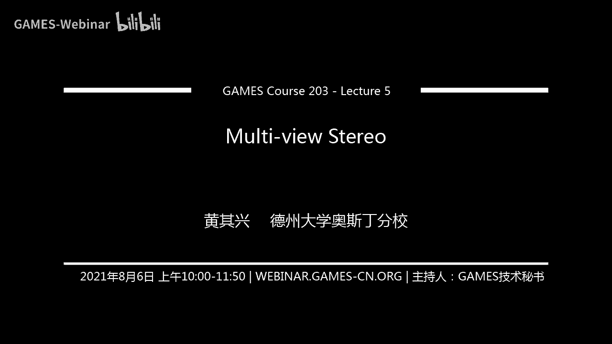

好的那我们开始讲，今天我们讲那个重建的最后一节课叫multiview stereo，就是说啊三节课呢我们讲了这个motion motion以后呢，实际上大家做了一件得到了什么东西呢。

就是说你得到了很多天赋，其实在我个pose以及呃intrinsic camera rameter，那我们今天呢讲的是怎么把这利用这个东西得到那种非常dance对吧。

就非常非常非常呃就是这种high quality的重现对吧，实际上也就是说我们想估计呢每一个pixel的一个depth value对吧，那首先我要讲一点，就是说概念上大家不能混淆对吧。

其实这个重建它是分为两步的，对不对，就是第一步实际上是说这个，第一第一步实际上就是说我们从这个嗯image，我们得到了得到他的那个image的pose，一些spark，spark的这种稀疏的充电对吧。

那第二步我们要得到那种非常dance对吧，就是重建对吧，它是两步，那今天我们讲非常nice的重建啊，这个东西呢很有意思在哪，第一呢就是说实际上我们知道就是高中高中的这个数学学过对吧。

甚至初中就是说你如果知道了这个correspondence，就是这个image，每每一个pixel跟另外一个pixel对吧，我们有correspond，那这个时候我们就能得到def对吧。

这个stereo我会讲起来会很复杂对吧，会会讲很多东西，你就记住一点对吧，就是说stereo跟这个传统的这种image之间做匹配有什么区别，那就是stereo它是在一条线上面，我们上节课讲了是吧。

这叫power line对吧，在一条线上面去找correspondence对吧，那你这个搜索空间对吧，我们通常讲这个search space，它就会比什么在整个image上早呢要小得多，对不对。

哎这一点是你要记住的好吧，这一点是你要记住的啊，ok啊那你上完这门课你应该记住，但是我们还会打，还有一些别的东西啊，还有一些别的东西我们要去讲啊，但是这一点你是一定要记住的啊。

其实我觉得现在算法基本上都离不开这些东西啊，你包括我我我我当我不能告诉你比谁的文章，包括省一些文章对吧，别的文章其实说白了我就发现吧，嗯就是现在的很好的工作，他基本上也离不开自己。

反着馒头东西就是说spimac应该怎么做，这是第一点，第二点就是说当然我觉得这个这个这个基础还是打的不牢啊，这一点这一点我是真的要呃我要强调的啊，所以这个就虽然虽然现在是机器学习，深度学习的时代对吧。

那怎么办，这个东西做的最好更好诶，这个这个是我那个什么的，那么首先讲就是两张image啊，其实两张image的做法跟多上image的做法啊，还是有一些不同的啊，但是原理是一样的，做法上不同。

原理上是一样的，好那什么是两张图片的stereo呢，就是说你比如说我们上节课讲了嘛，就是你给这两张图对吧，首先你要注意注意一点，就是说我们有很多假设的这个啊，我们有很多假设的这个就是说这两张图片对吧。

他拍的都是同一个什么拍的都是同一个这个同一个场景对吧，假设它是静止的啊对吧，你沿着两个不同的方向去拍对吧，然后呢你知道他的这个relatives transformation对吧，就是啊。

然后呢你就希望通过这两张图片呢能得到一个dem对吧，就比如说在第一个视角下面，就是每个pex of the depth就得了个depp m啊，我们想怎么做好吧，哎这个东西其实还是很很很有意思的啊。

你们谁啊，呃谁接触过这个东西吗，我想我想问一下，你说没接接触过这个东西吗，对吧，我假设大家也还多多少少有一点接触吧，好吧，有点了解啊，那，那这个东西怎么来做，首先首先我们要强调一点。

就是说什么东西是不能做的，比如说你这个这个这个这个这个r o这个deft r solute skill，我们是recover不出来的啊，这个东西大家要要了解，但是呢除了这个以后呢。

如果我们能找到corresponse，还是能做的啊，然后那个有一个basic stereo match agrant对吧。

就是说实际上就是for each pixel in the first damage对吧，你find the corresponding flower in the red image对吧。

就是因为你这个点嘛，实际上你就得应对对应了一个什么，你这个点你就对应了一个呃，对应了一个线，对不对，然后你把这个线带在第二张image去做投影，就得到了一个a ba line对吧。

就是for each pic in the first time，i find the corresponding in the right image对吧。

然后然后呢你就examine all pixels on the flipk best match吧，你就在这张呃，你觉得这这这这这这个那个呃上面对吧，你你去找那个最最好的那个match，哎。

这个东西呢很有意思，在哪呢，就是说，对我刚才讲的就是他的search space要小很多啊，search space要小很多，ok对吧，你就去找对吧，然后你找到了以后呢。

因为你是因为你是calibrate这个英语配对吧，然后你就可以求这两个字性的相交对吧，然后你就能得到那个深度系啊，当然对ap polar line呢，你如果对image对于z的image来说呢。

它这个a p ploon它不一定是这个水平的对吧，那如果是水平的更好对吧，你写一个for loop的话，你每个对吧，你只需要找他的那个corn index对吧。

这样相对来说呃这样做起来他就相对来说就比较effici了对吧，呃做做起来就比较efficient，对不对，哎对，然后你就是我们就是说什么时候开始对吧，实际上这个东西那是什么时候呢。

实际上就是什么时候都会有这个东西呢，它就是说这个parallel应该哎这个地方，我就相对来说你就是在这个lodge base啊，就是说怎么去做的话，你真正要学的，因为是三维视觉的问题啊。

嗯我这里稍微给你带一下，就是一个knowledge的这种东西，就是说，就是说就是说什么情况下会发生呢，实际上这个很好理解，就是in the play of the camera。

the pio对象的对吧，就是说这个image print they are camercer has been hei对吧，total eth of the same对吧，就是他要满足这些特性对吧。

唉这些特性呢它也不是说那么任意两个硬币就配了对吧，其实你开了就不好了对吧，你比如说照相机可以照相的时候可以弯一点对吧，那那那那就不满足这个东西了对吧，诶他就不满足这个东西。

那这个时候呢我们就如果你有这个情况，那很好办对吧，就是说你这个dex你就可以直接从这个简单的这个相似变换对吧，得到对吧，就是disparity就是x减去x方对吧。

实际上是等于b乘以give y对y z对吧，你就能得到这个disparity对吧，呃然后呃，然后这个东西大家应该很清楚了，对不对对吧，实际上就是说你对吧，这只是一个相似变换，非常简单啊。

我觉得应该初中吧，初中大家应该学过，那难点就是说你怎么能得到对吧，比如说你上两张图片，现在是这个样子对吧，这是一个这个绿的是undermine的那个three object对吧。

然后这个灰的是两个ping对吧，也就是你造的时候这个imagine plan对吧，那这个时候呢你就不会得到这种horidental line，实际上的话你就对吧，那怎么做呢。

实际上它就有一个sal image actification的算法啊，这个我就不讲了，我就告诉你其实很好理解嘛对吧，因为你你你如果carry位的好的话。

你是知道这个image这个orientation啊什么东西的对吧，然后呢你可以可以可以须佐率create两个image play，它是自我pipo的，对不对，然后呢你就把这个灰的跟这个黄的对吧。

然后呢你是知道他们之间的相似变换的，这个相似变换呢实际上是一个什么东西呢，实际上就是说它是一个3x3的那个呃叫做homographics，对，就是说实际上它是这个一个三，为什么三个三四。

就是说我们那个要丢了那个号，genesports ne，哎你可以看看这篇文章啊，这个我觉得是一个非常非常inferinferential的工作啊，嗯嗯嗯这个我就不讲了啊。

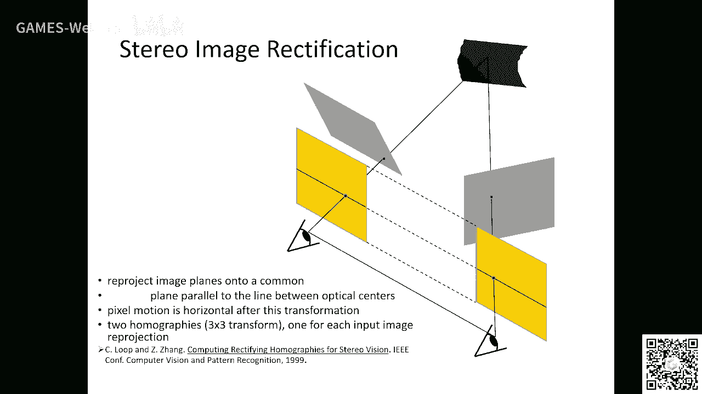

就是说然后我给你一个大概的visually啊，让大家加上这个呃去加上这个理解好吧，呃去加深这个理解，呃，这个的理解就是比如说你上面这两张图片对吧，这是on就是说没有requify对吧。

你可以发现就是说实际上我上次讲了，就是说实际上是第一个image里面的一个line对吧，对应成第二个image的一个line吧，这就是说实际上你第一个image line就对应了那个空间中的。

你跟那个camera center就对应了空间中的一个平面嘛，然后那个平面跟第二个英文相交，就变成一个line对吧，就像这里面的，比如说我们任何一个line对应的都是第二个image，最后一个了对吧。

然后你就发现了这两个line通通都不是水平的对吧，统统都不是水平的，而这个时候呢我们就可以怎么呢，就可以通过一种算法，就是刚才我show的那个对吧，就讲那个文章里面对吧。

你可以把第一个image把它做一个三次方的变换对吧，变换以后你注意它就不是一个什么，不是一个正方形了对吧，它是一个斜的啊，实际上就是因为他首先是个linutransformation in the。

就是在那个home gi corner下面对吧，然后你搞完了以后，你就变成什么，你就会变成这个斜的对吧，image都变形了，但是他能保证一点，就是说啊就是啊你你这个这个是水平的。

但是这个水平的对应是原来的页面里面的，他不是什么，它不是水平的对吧，所以也就是说你变换以后，这个image有些有些p手，它是全白的，它是这个的外面对吧，然后呢这边呢也同样，你就把这个页面写的就变弯了嘛。

然后有些是平衡在外面的，但是你保证什么呢，就是说你找的时候呢，你所有的对应对应的点它都是在这一条那个水平线上面，哎这样就比较好算对吧，这样就比较好算啊，这样就比较好算。

啊这都是三维视觉里面很很经典的结果啊，很经典的结果，这都是有很好的实现啊，open cp这些东西啊。

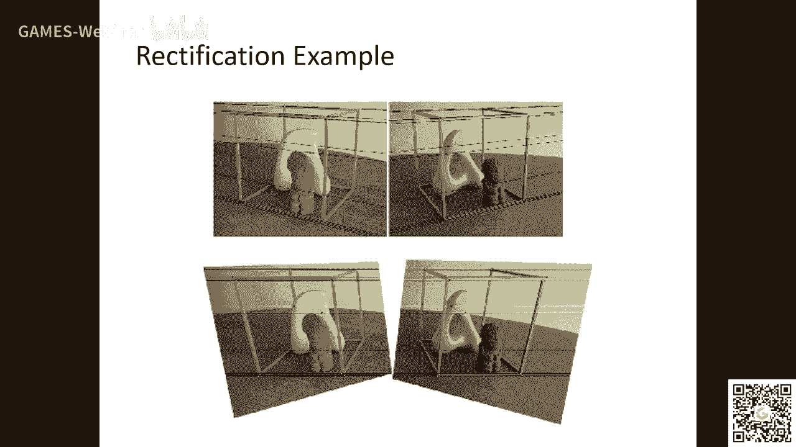

然后下面我就想要怎么去找correspondence对吧，也就是说你对于您左边那个image里面任何一个pixel对吧，你要在右边找那个corresponders对吧，在右边找火respondence。

对不对对吧，然后呢你要找一个这种找一个，那那怎么办呢，实际上呢你就是说左边，比如说你你找一个点对应点，你肯定要看它都会在这个neo，对不对对，你肯定要看他的neighborhood。

你不可能随随便乱找对吧，随便乱找啊，然后这个时候呢你就取一个neighbourhood size，size通常是一个这个rectangular的字母patch对吧，然后右边呢你对于这个线上面对吧。

任何一个点你取一个patch，然后你就比较这两个patch是不是相似对吧，那怎么比较，你可以说他们对应的pixel的difference对吧，你可以用new network对吧。

最近的大家呃比较常用的就算一个用用net过去算对吧，然后呢你给一两个pad，假设你能得到一个词呢，你就可以画一个这样的曲线对吧，这边就是说那个pixel index，我们通常叫做depar，对不对。

就是你到底offset了多少对吧，y ax is呢就是你的matching cart对吧对吧，就是过过给定了一个pixel对吧，我他们的ighborhood有多相似对吧，对吧，是这样子的啊，然后。

你注意呢这个curve呢他肯定很有意义，但是确实就是他可能有多个的local minimum，对不对，诶，他也不一定很smooth对吧，哎但是就是说我们在这个地方呢就想找一个最好的对吧，那对吧。

你可以用不同的方法去算对吧，然后你就找一个最好的对，你可以有有的时候你找最小的对吧，有时候找最大depending on，就是你有什么样的match去做comparison对吧。

然后呢这个地方很显然有一个很重要的这个这个这个hyperparameter，就是你这个windows选多大对吧对吧，你如果window显得特别小的时候呢，因为你你只包含了一些局部的信息对吧。

你这个match就非常非常的noisy对吧，你就会非常非常的noisy对吧，因为你会有很多false positive，就是你找错了嘛对吧，但是呢因为你们都选择小呢。

基本上你这个map呢相对来说还是比较还是比较shop，就是有些ash对吧，然后你只要你把windows找大，因为你两个因为不一样对吧，你你把这个如果这个windows size搞大的时候呢。

相对来说呢它就会有一种什么东西啊，它会有一些smooing的这种模式在里面，smooing的东西在里面，而这个时候呢你这个结果就比较smooth，但不会像这个windows size比较小的时候。

那么的noisy啊对吧，这是大家要注意的。

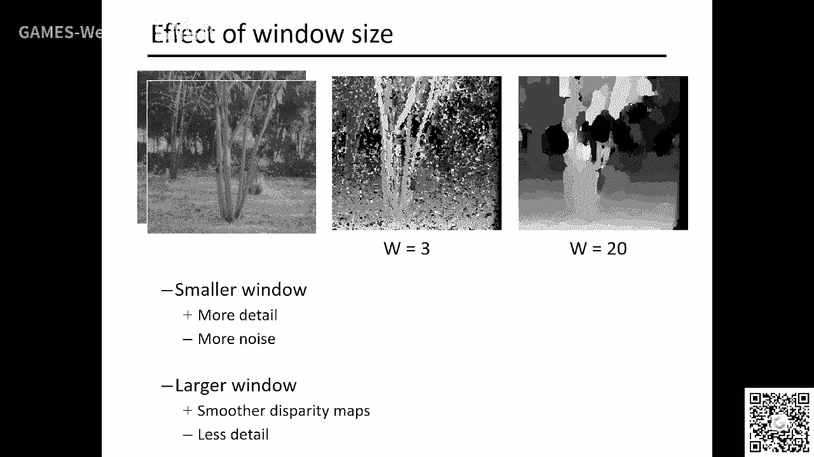

对这是一个比如说这是一个结果对吧，就是说你有一个data对吧，然后the window base mesh对吧，这是光子出的。

你会发现window base mesh它相对来说还是li that's limited啊，没有光的truth对吧好，那怎么圈子这些问题呢。

然后你看这个gm choose跟这个window base mesh对吧，大家作为研究的时候，其实很多时候很interesting，你比如说你你基本上会从最简单的算法开始对吧，从最简单的上网开始以后呢。

你就得到了这个windows machine是吧，然后你会发现诶这个windows mac怎么跟这个方式差别在哪对吧，然后我怎么能加一些recognization，加pride去解决这个问题啊。

去解决这个问题，那怎么办，你首先会发现哦这个ground truth对吧，一般情况下对吧，他还是很smooth对吧，它会在某些pixel有一些跳跃跳跃对吧对吧，就是说你你这个对。

但是就比如说你从一个object的boundary到另外一个object会跳片，它基本上还是很，然后你会发现这个windows vmc非常不适，墨子对吧，那这个时候我们就可以怎么样。

我们就可以说我能不能enforce一些smoothness，就是说这个这个depp对吧，来来解决这个问题，哎这个思想呢现在其实说白了就是以前大家做审批审时候很常用，我们现在用的相对来说少一点少一点。

但是在第五层的时候，大家也是用的啊对吧。

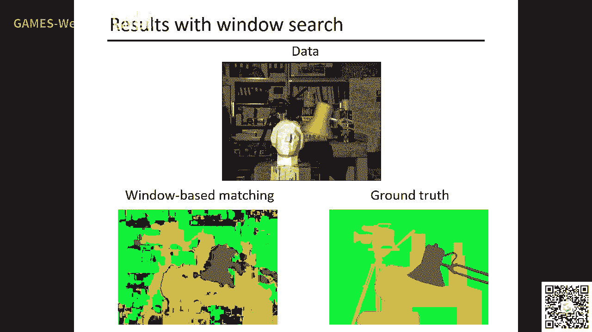

那我们怎么来做呢，它就是会我们就会enforce很多这种concert对对，就是就是有哪些nno或者concert就对吧，for any point one image。

there should be the most one match point in音调的image对吧，你你比如说呃你这条线上面对吧。

比如说source image有三个点都match了target image的一个pk，那就出问题了嘛对吧，你不可能出现这种情况嘛对吧，但是你单个单个做的时候呢，你不能避免这种东西对吧。

其实有时候讲这个research要讲一些，比如说一个一个lication固有的东西，但很多时候啊你会发现什么，你会发现其实好多时候大家用的某些能力，或者说安特拉这个安德拉这种机制基本上都是相通的啊。

这个地方实际上就是用的nono或者constrainb，什么时候有啊，比如说你做啊，你找correspondence的时候会用上对吧，比如说你这个，对吧，你做这个sementation的时候。

我也会用咱们这个地方我们用来做找这个steremachine，but stercorpd好吧，the unique，另外is ordering对吧，比如说里面有两个点对吧，走在一对于另外一个评测的左边。

那你的correspondence呢基本上也要保持这种all，怎么主要在横对啊，除了在某些情况下，你是order会稍微跳一下对吧，对吧，好吧就稍微会跳一下嗯，但在大部分情况下。

这个ordering是要保持的对吧，还有一种就是smoothness对吧，就是说你这个despite value slowly对吧，或者most part对吧，那怎么做呢。

实际上这就是一种在计算机视觉对吧，包括graph里面对吧，你只要牵涉到这种峰哥啊，dance prediction啊，这个都用得上啊，比如比如说你把你做做model的时候。

你把一个point cod分割成很多primitive patches，诶，这个也是用得上的，那这个怎么用呢，就是说你就加两个特征对吧，就是说t实际上就是每个pixel的depth value对吧。

每个pixel的depth value对吧，就是异地对吧，就是它有两个turn对吧，一个turn这个matching class对吧，还有一个turn。

实际上就是这种consistence expose，就是说对啊，什么是consistency mansion，cos，就是windows search对吧，我只是说如果我没有第二个turn。

那这个这个解这个东西它就是那个window base设计的结果对吧，那加了第二个呢，实际上就是enforce这些uniqueness ordering a mo，就是在做这些东西对吧。

这个时候呢我就是在这个地方呢就会involve这两个pixel的这样了。

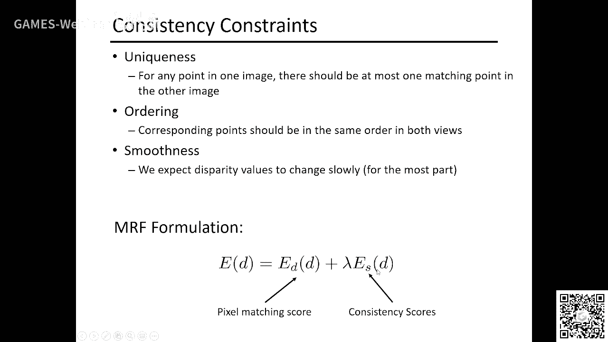

然后你就为我做一个comparison对吧。

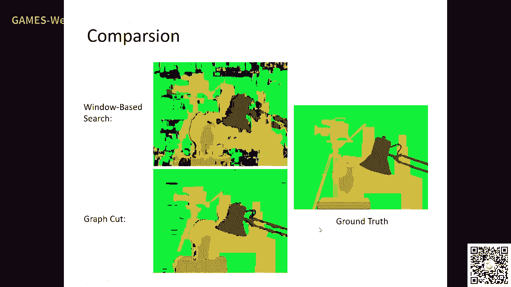

这个mf我就不讲啊，大家如果有兴趣，你们可以自己搜一下好吧，就是这个mf怎么写啊，嗯有两种办法对吧，一种办法就是说你可以用这种grapcr对吧，嗯就是从康纳那边出来的对吧，大家也嗯还有一种办法。

最近呢就是做这个linear program relaxation对吧，唉这两种办法啊对吧，就是piece of nation school sim pio，你们可以截个优化。

能够得到optimized的那个吧。

然后你会做个对比吧，就是windows search对吧，然后这是下面是gravcgm truth，好，然后你就会发现gravcd得到的梗，对不对，但是他还不完全跟这个跟这个呃光shows一样对吧。

但是要好很多。

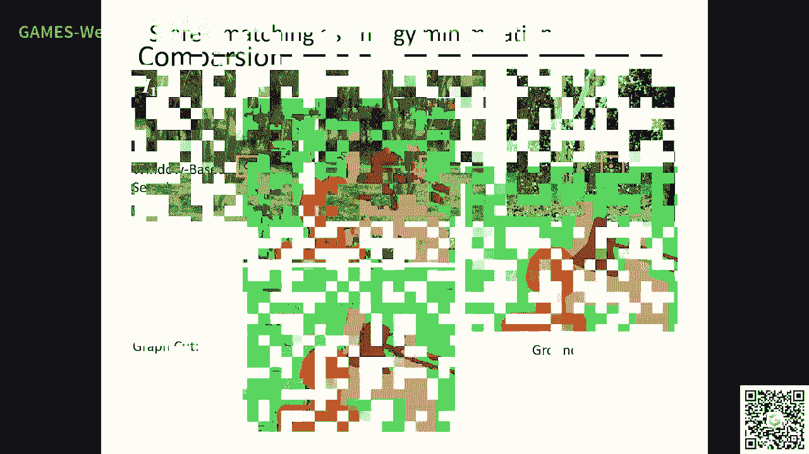

对吧对吧，这篇文章对吧，你可以读一下，就是fast acosment and indication，输入graph cos对吧，就是py的篇文章啊，然后。

对然后然后这个东西怎么用deep learning来做啊，现在比较对，还是有一些那个还是有一些这个研究的啊，有一些研究的，有什么问题吗，你们有在听吗，我没有看到很多回复啊，ok好的对好。

那这就是一个简单的这个stereo matching的解pipeline啊，我觉得嗯其实哎这个东西还是很有意思的啊，还是很有意思啊，这个，大家有兴趣的话可以读读那篇文章好吧。

那下面我要讲的就是multiview stereo啊。

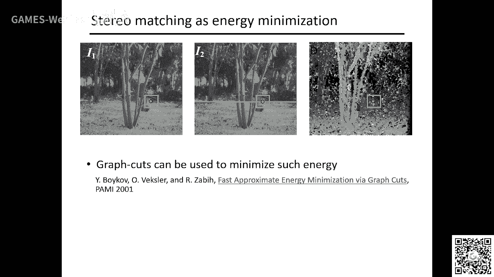

这个我开头讲的对吧，就是说有一点大家一定要记住的对吧，就是说stereo为什么是to stereo match，那么他他是找的什么。

找一个one dimension of the correspondence，对吧啊，好modic stereo呢其实他也是dal spondence，但他呢他不这么难干啊。

我待会来讲其实是一个就是思想是一样的啊，但是就是formulation对吧，就是怎么去怎么去去去去去做这个东西，稍微有一点点变化啊，稍微有一点点变化啊。

嗯就是motive serial from internet connection，对吧，challenge就是比如说appear pearance，variation，reservation。

massive connection对吧，就是你可以设置那个internet得到很多很多这种很多很多images，对不对嗯对吧。

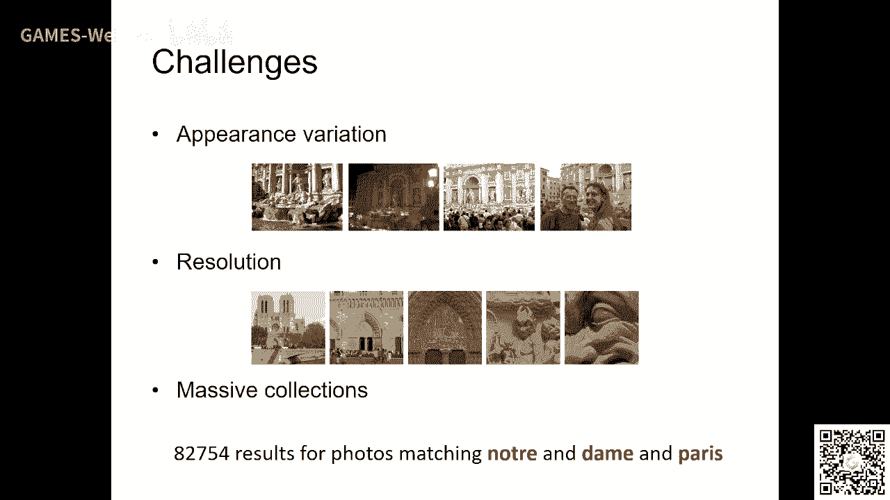

然后你怎么来做呢，就是说你不是两个image对吧，比如说我们上次讲这个啊，the street view对吧，就是这个photoya当然了很多image对吧。

你现在我们假设已经得到了这个每个image的一个camera post对吧，包括它的ring camera parameters，在这个时候。

然后我比如说我要把一个image每个pixx去s m的depth，在这个时候对吧，你两个两个去搞他，他就第一个慢，再一个你没有用到更多的信息嘛对吧，这个时候呢怎么说呢，实际上就是这样对吧。

你比如说就是你实际上就是说首先带给一部分这种呃images啊，一部分这种images对吧，首先你要把这个revenant relevant images给找出来，就是你注意有两点，就是说，有两点啊。

就是说首先呢我会讲这个formulation会有不一样，实际上呢它会比如说他会去test，他不是去找鬼，respondence，因为你找过response的话，你是这么想的啊，我们首先想这个问题啊。

就是说你可以对这个reference view对，然后是假设对对和这些image假设找到了，这个就是它会有一些overlain vision对吧，假设找到了这个的这些东西。

那你可以把每个image去跟这个每个那个name is a image做对，因为我们刚才的算法对吧，你可以得到一个depth对吧，但是显然这个dex怎么样，他是不consistent对吧。

因为你是independence去做的对吧，他不会consistent对吧，那怎么来做呢，实际上就是说我会通过什么，我首先要改变一个思想啊，这个东西我待会讲。

就你对于每个pixel我假设做一些death hypothesis对吧，比如说deft是1。01。01，1。021。03，对不对，然后你把你把这个你把这个带子，然后你再在那个什么，你站在这个。

你站在这个target image，so projection对吧，然后你就找到你，你有deft，你就会对应点对吧，然后你再去value，比如说这个大induce correspondence。

在所有的那个image里面，它有多它有多好对吧，哎这个时候就能利用所有的信息对吧，哎to view和motiv它相对来说它是不一样的，所以说好。

那当然就是说你说这个的时候取决于你你怎么去找这种view嘛，然后这边这个就是比如说你像这个photosho，包括做做这种multic series的东西。

他会说哎呀你每个拼凑你对应的那个iimage差不多不样对吧，你这个patch那个人对吧，你你一个patch你可以找到啊，就是news neighbors，它会不一样啊。

local uselection对吧对吧。

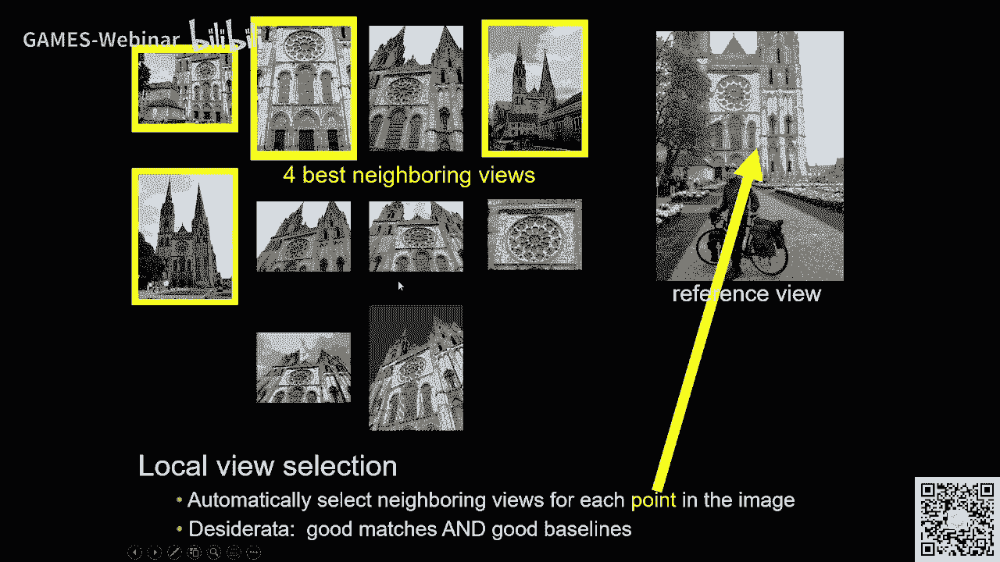

就比如说任何为人呢相对来说都不一样对吧。

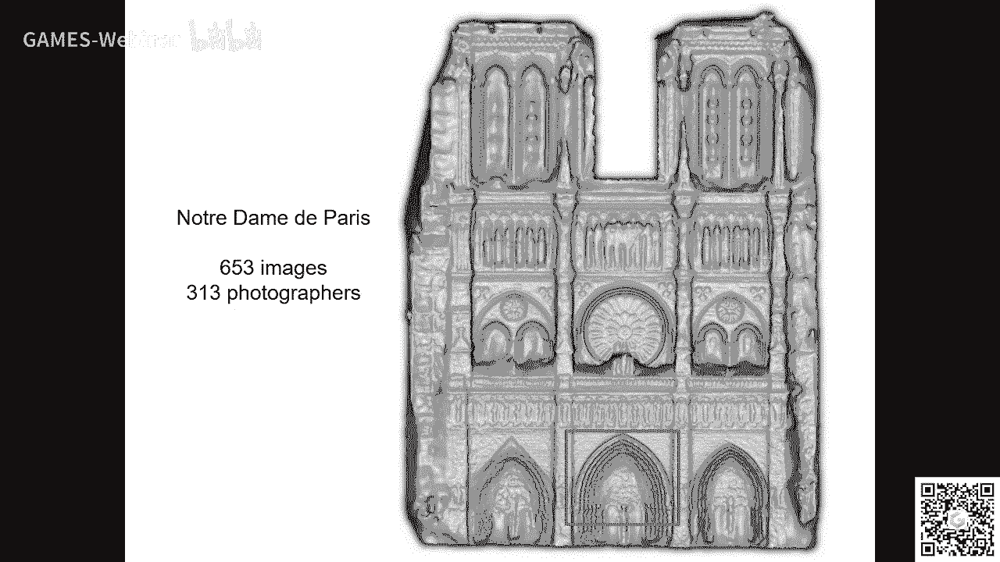

ok啊。

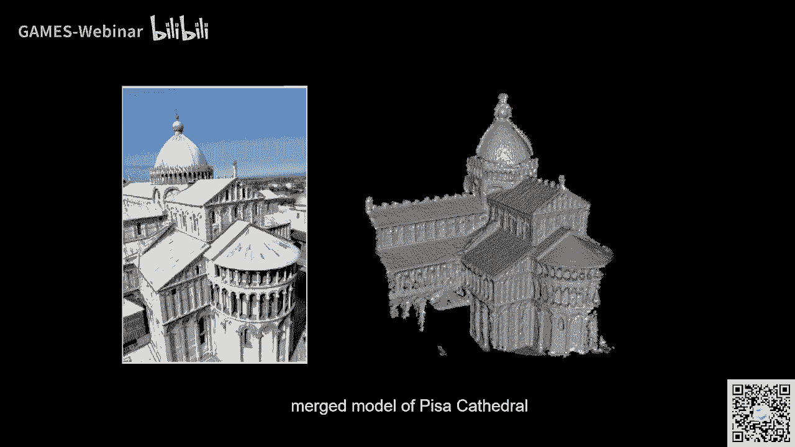

等一下这个地方。

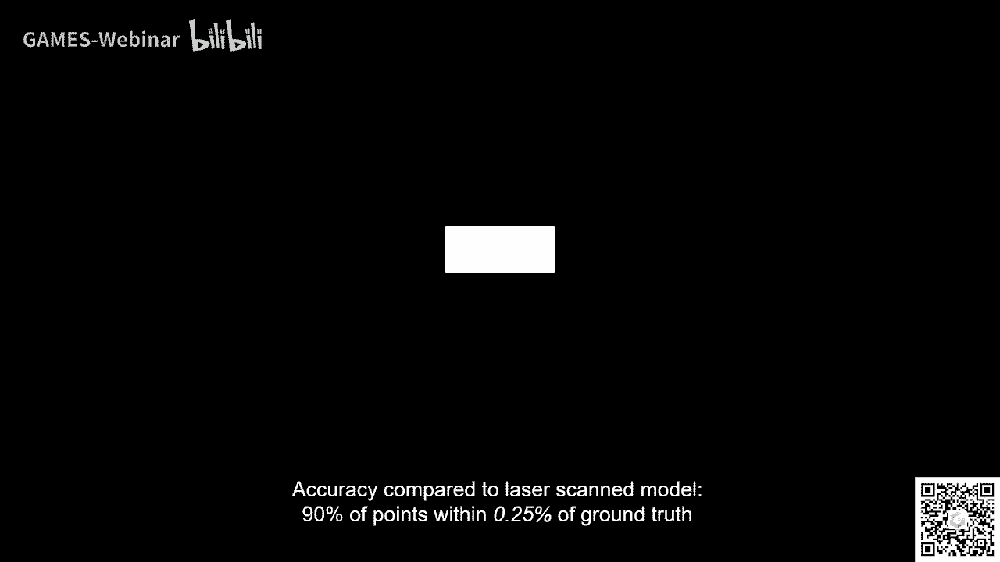

呃这个地方我好像漏掉了一个slice啊，我看看怎么，这个地方好像漏掉了一个slide。

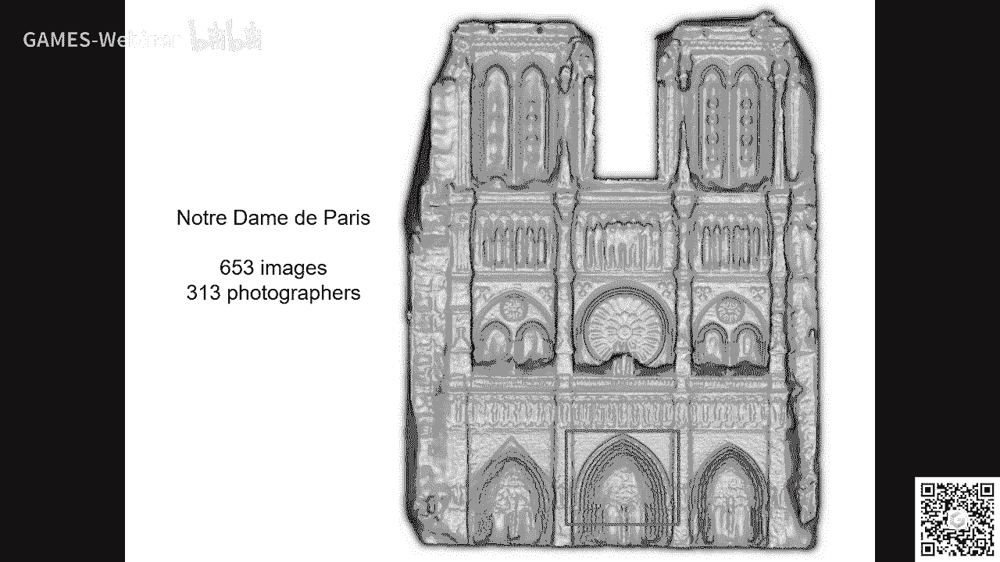

这样我就讲吧，大家去理解好不好啊。

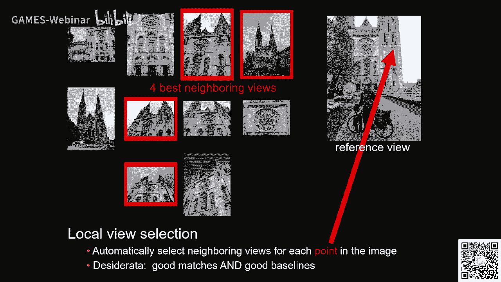

我这个地方漏掉了一个slice，还挺关键的，我看看啊，what do you stereo对吧，这个呃大家可能不会理解这个啊。

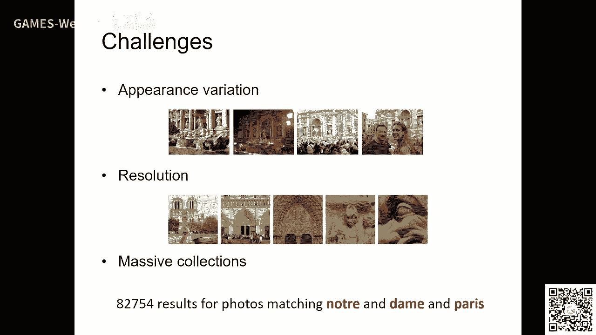

我在这里再讲一遍吧，好吧，我觉得就是用口述的办法啊，因为现在就是我们知道to view对吧，to view它是怎么做的呢，to you做的这个办法。

实际上就是说我去在那个app port line上面去找correspondent对吧，找到了我就可以做相似变换，那么初中学的对吧，得到dex，它不一样对吧，同它是稍微变一下。

就是我首先去找那个corresponding dp对吧，to be就是说我有很多hypothesis of corresponders对吧。

他给的任何一个pixel带来正面a p p line上面都是corresponding，correspondent，那这个地方呢就是depth对吧，multiple它都是prop。

然后我把这个dh呢做一个projection对吧，做一个projection对，做一个projection，然后你就能找到那个correspondence对吧，你就能找到那个correspond对吧。

然后，你然后你掌握考方式，就是这个时候呢你给定一个de在那个就是左边的这些image里面对吧，你都能找到一个对应的pixel对吧，然后你就可以用to evaluate这个pixel的这个patch。

就是跟这个他一个source image这个patch有多像对吧，你有100个呃，那本也没，你就一你要以value 100个值，然后你取一个mini media对吧。

看看看看看看这个是不是很match对吧，然后就是每个depth都有一个value对吧，那边是每个correspondence，有to也是每个correspondence有一个value对吧。

这个地方是每个depth对有一个value，然后你选那个depth value最小，那时候demate depth对吧。

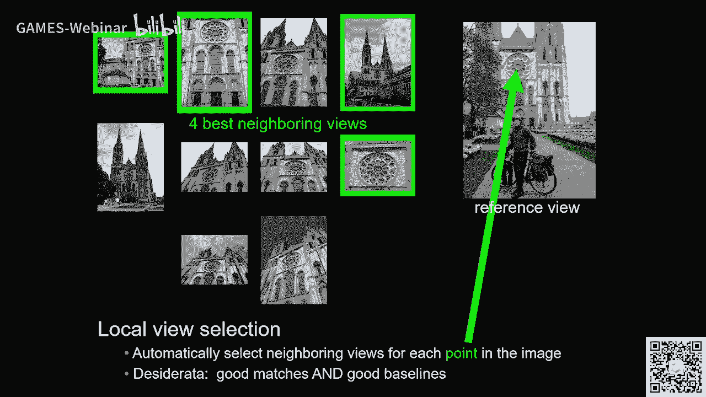

这就是结果啊，思想一样，那么稍微变了一遍啊，稍微变了一遍啊，然后你就可以发现啊对吧。

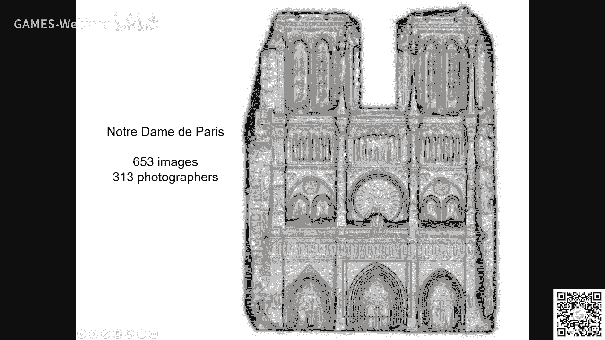

就是你当你看到这些结果的时候，还是蛮shopping的对吧，因为这都是internet image，然后你如果用于扫描仪去扫，也不过如此嘛对吧，这些detail的地方当你发现还是有一些。

比如说有一些这种clusion啊，内容有问题对吧对啊，这是motive view，motiv stereo，what give you stm的这个算法，这个是10年是十多年前的工作。

但是还是很多amazing对吧，实际上就是通过image也能得到这种非常detail的教训啊。

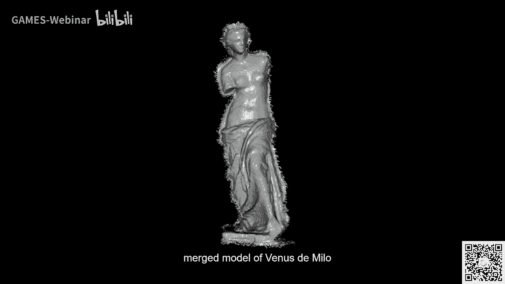

啊这是一个系统工程，系统工程是一个工程性的东西，是一个工程性的东西啊对吧，你其实你看这里有很多张图片啊，然后呢你如果用multi server，比如说你你这个这是你的这个image对吧。

然后你把这个然后你做一个这个multi spa的话，你能得到这个结果，就是每个pixel取得sm的dex，然后你会发现什么嗯，然后你会发现这个，然后你会发现这个呃，啊这个depp还是有非常多的diss。

肯定非常多的diss it好吧，非常多的discontinuity啊，就是这个这个这个这个这个这个里面的后，它其实呃处理的呃，他处理的不是很好啊。

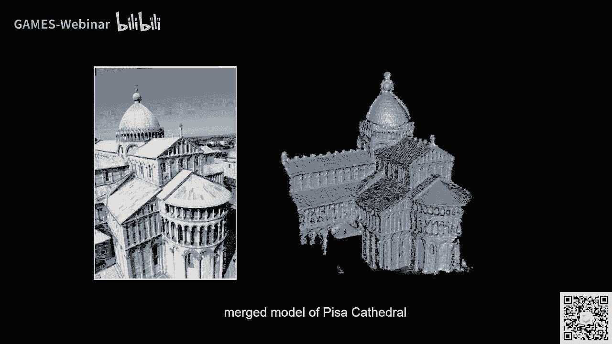

ok然后你看就说这是上面上面就是来拉的吧，我们一起讲过的拉的这种得到的结果。

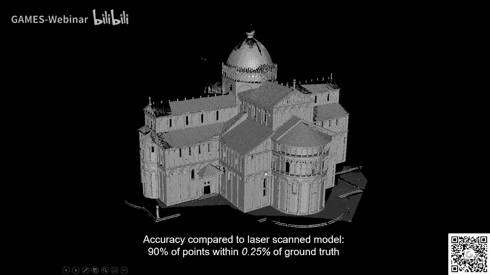

你发现还是有一点差别，但是从image如果你能得到这种结果。

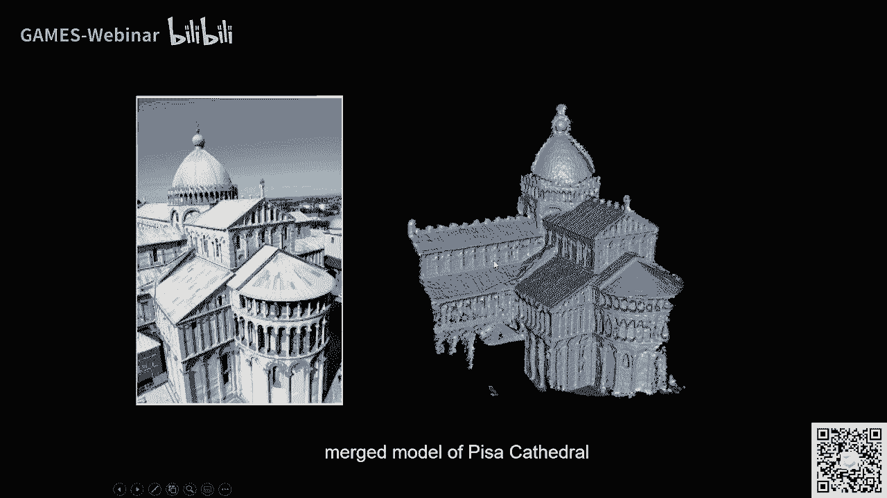

这已经很好了对吧，已经很好了，当然你跟这个还是没法比了对吧，但是你发现呢这个其实这个image呢它其实还是什么，就是说如果你的response能找到很准的话，在没有没有blution的情况下。

相对来说它还是应该非常精确的对吧，实际上还是correspondence的问题是吧，fd是难在哪呢，就是说像这种passive method的难在哪，男的就是说你有很多偏白的对吧，有很多很多白的地方。

你比如说你对两个墙去做这种spiration，你是不可能有好的那种correspondents的对吧，因为你白的地方，任何一个pixel都可以被match对吧，所以对这是一个问题，对不对，好的啊。

那怎么去解决这个问题呢。

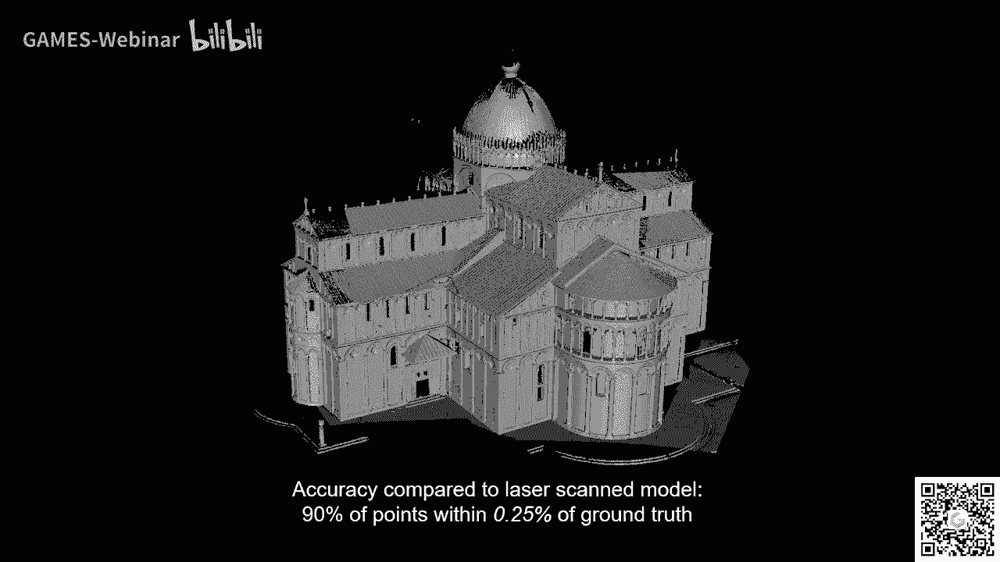

那下面我们要讲的就是说用这个就是加addition fire。

你比如说像这个图图片，你会发现什么，你会发现很多地方他都是p出来，sla有很多平面的信息对吧。

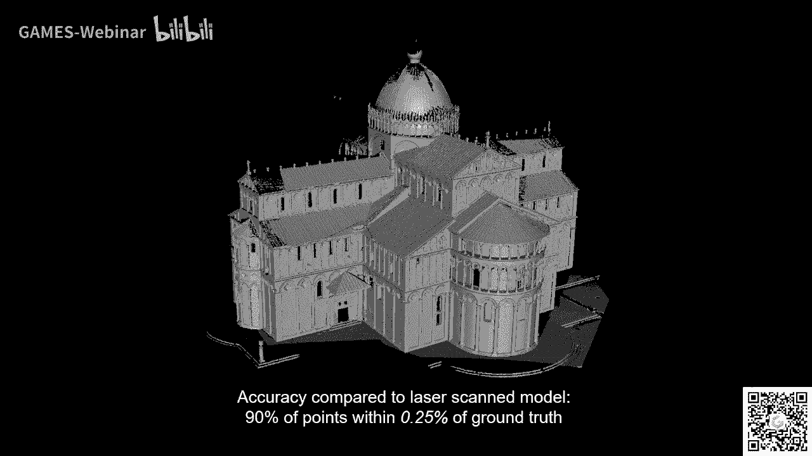

对吧，那就是用use of structural parts of prise，对吧。

对啊，刚才我说的就是说你mod有stereo还是比如说你什么时候最成功啊，就什么时候最牛牛啊，比如说你有这种结构光的时候对吧，因为结果你如果打上去了，结果光，那基本上还是还是这个很好的对吧。

你如果打不到极果光对吗。

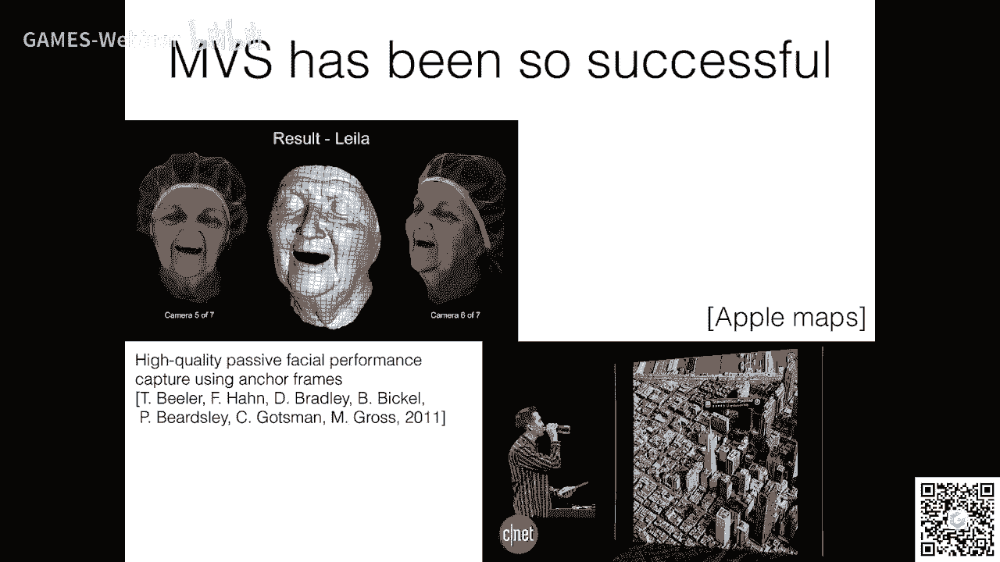

这个会出现，比如说你there's no text是吧，这个时候你就很难去解决这个问题了，那这个时候呢比如雅肃啊，这个现在在山上了，friser他就做了很一系列工作。

就是说嗯要让我们能不能换一个思考问题的方式对吧，我们怎么能嗯就不是每个p都去做决定，因为因为你比如说你这个音做的这种场景里面，它有什么，它有很多这种playing的结构，对不对。

还有很多这种playing的结构啊，这个时候呢我看看我们能不能用这种plying的结构去重新define，这个serious mine flower，对不对，对，你如果比如说在这个时候。

你看比如说你有一张这样的image对吧，你如果没有结过光的话，你会发现这个image还是有一些可选的，但大部分情况下它这个tt对吧，但color vation非常小，color version非常小。

那就说明什么，就是你没有match吧，哎你不是你就是会有很大的这种身体对吧，诶这个时候就会出问题对吧。

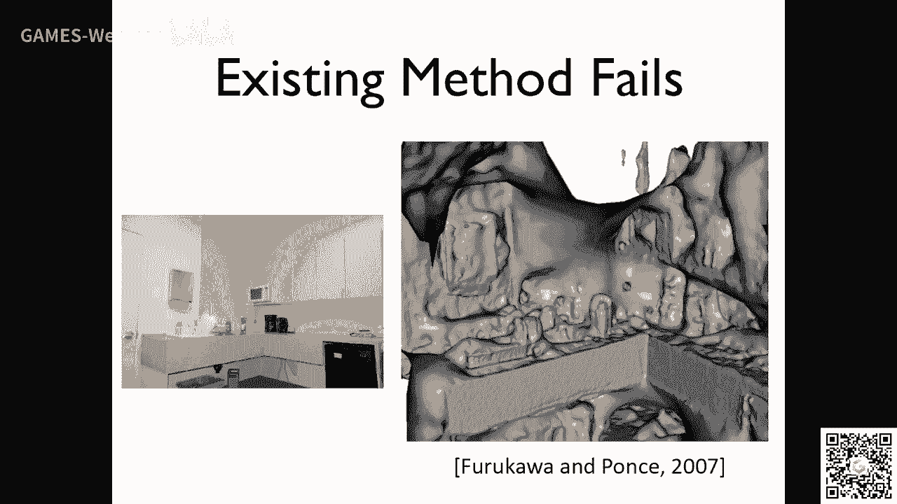

那怎么做呢，那那就找一些这种有一种东西，我觉得大家是要理解就是漫画动对吧，mod sup，特别是比如说如果你从点云对吧，来来来这种点云对吧，你对整个场景建模就是城市建模对吧。

哎这个em来说很特别像中国对吧啊这种商品是很好的对吧，就是说它会有很多plan对吧，它会有很多这种垂直的结构，哎这个东西是非常好的对吧，比如说你做deft imation的时候对吧。

你比如说一个image c对吧，然后你有这些词对不对，那怎么做呢，实际上就是你你在stand的这种呃mf的时候呢，比如说你会写什么东西呢对吧，大家去可以去读读这篇文章，我觉得还是对这个东西感兴趣的话。

你可以去读一读，就是说你对每个piece of一个depth，然后neighbour neighbor的话，你要买这种smoothness constrength对吧，但是这个时候呢你会发现什么。

就是说实际上就是说对吧，就是说这种这种东西它相对来说的话对吧，相对来说的话，他就是你不能保证对吧，你不能保证这种不能保证这种是moothness啊，就是说对吧，这是我们刚才复习一下，对吧啊对吧。

然后你现在想做的是我们现在想做的是什么，我知道这个场景它是必出对吧，就是number of plants相对来说啊，要远远的小于小于number of pixels对吧。

主要是我们现在想做的就是我们呃对吧，我们我们想用以以少部分的这种plane去去model这个online in的场景对吧，那怎么做呢，就是说对啊，就是大家可以想一想啊。

这这有一系列的工作都是10年10年比较相对来说他比较欧的啊对吧，那怎么做呢，实际上就是说你有个reference，也有光truth对吧，这边paper相对来说我觉得还是很巧妙的。

就是就是global stereo ctrl，选用三个note requires对吧，stmf呢它用的是什么呢，就是说用的是两个pixel对吧，他有什mooth对吧，它有smooth对吧。

smooth的话，你想一个平面，它也是smooth，对不对，一个曲面，只要你没有那种很大的跳跃，它也是实木子对吧，那这个时候你怎么来in boss它它这个pin呢，其实其实你发现没有。

我想说的一个观点是什么，就是说你不管是grace，为什么我自己做的工作，就是说越简单的东西，它往往有时候他影响力啊，相对来说它越大啊，就是说，比如说我们怎么能看这种sm，不就是两个b口对吧。

它距离要相近吧，呃那个depth怎么把它稍微变一下，就变成这个你重建的这个结果，deft它会飞了，这种play呢大家可以想一分钟啊，我建议大家去想一分钟啊，可以想一分钟，然后我公布答案。

大家不要小看这个东西，你可能觉得跟graph没写相关，但我跟你讲，这个dance tradiction非常非常有用非常有用的，还有30秒啊，大家再想想啊，对吧，可以想一想，那这个时候呢怎么做呢。

对吧这是传统的对吧，传统的就是这个对吧，右边呢他怎么说呢，就是考虑三个json的pixel对吧，就p q r对吧，然后呢你会in inforce什么呢，就是说诶这个很聪明对吧。

就是说如果你真的是一个play的话，那p加3d啊，因为它在一个平面上嘛对吧，然后你如果那就必须除以二，就必须等于dq对吧，你就尽量飞吧，这种东西对吧，就是说基本上所有的基本上所有的pixel对吧。

除了在那个plan boundary的地方，否则在别的pixel这个东西都要满足对吧，这个东西都要满足对吧，这个东西都要满足诶，通过这种方式对吧，通过这种方式你就能这样。

你就能得到一个得到就inforce rin对吧，实际上你看这个m f和mf with a triple k对吧，你就通过优化这个东西对吧，你就能得到这个呃，你就能得到这个。

你加了这个triplet loss，你就能得到这个play，对吧，那怎么解呢对吧，它实际上它还是有一些对吧，有一些这个如果只有这种事，如果只是这种standard mf的话。

你可以用bf cs或者bpulation这个beef plication，同时它还是applicable to cherlost。

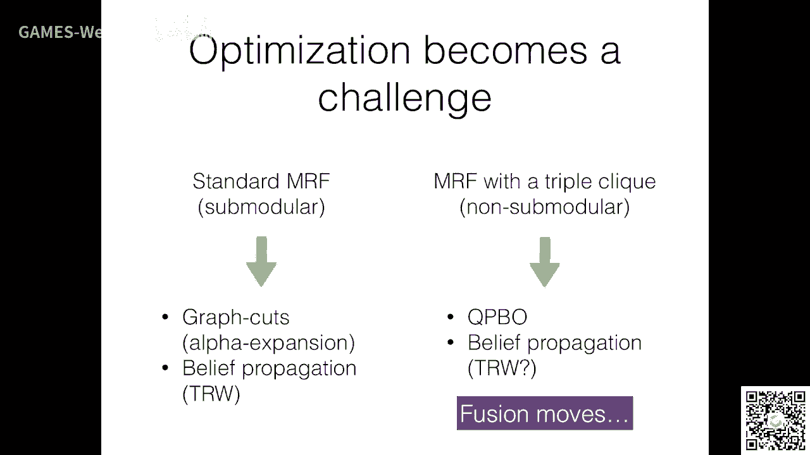

然后再有些experimental result对吧，比如说那个reference image image对吧，你这个output def map对吧，这相对来说就会好很多。

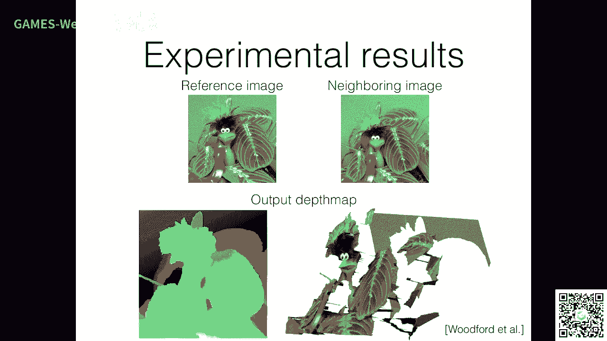

然后这是一个comparison，对不对，就是说这是广the truth对吧，你会发现啊这个嗯就stmf它会非常buy对吧，非常棒y然后如果用这种trifate这种东西。

你会发现它的recovery smooth啊，就是你明显能感觉到他有这种peace mini的结果在等啊。

就是这种formulation其实在写这个在graph上面写inverse problem and spending，你包括解一些，比如说在呃你没选就解优化的时候，怎么去formly这种energy。

这都是很重要的，这都是很重要的哦，ok。

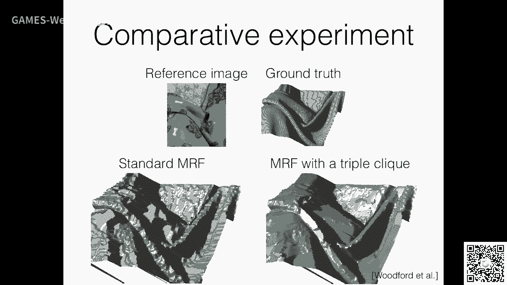

然后然后下面就是怎么去integrate with the top down，primitive approach，对吧，哎这个时候就是说嗯对吧好吧，我们要休息五分钟好吧，休息五分钟，我们再接着讲啊。

啊，好我们接着讲啊，就是说嗯比如说我们再讲讲，就是说一些别的方法来formula这种structure，这种por，就说比如说你在standard的时候。

standard这个那个mx里面我们是估计的是每个pio的一个dx对吧，那我们也可以怎么样，因为我们知道就是说你这个plan对吧，如果如果如果这个thing对吧，能被一一部分plain给表示的时候。

那我会怎么样，假设如果比如说有这个曼哈顿的这种direction，曼哈顿从哪儿去曼哈顿对吧，纽约你会发现这个所有建筑对吧，他那个fs都是演的几个少数几个direction对吧，我们就可以可以可以对吧。

extract这种manian direction，然后在extract ples对吧，那怎么来说呢，我们就可以有这种有这种possible price，这是possible print。

各种的都会比较少对吧，个数会比较少，对不对，然后我们就会什么，首先extract这种possible这种direction对吧，然后我们可以去，我们可以去古迹，比如说这种possible prince。

对不对，给定一个plane对吧，给定一个plan，我们可以去valu，给定一个plan，就怎么样给定了一个play，首先它有些possible direction。

有些possible这个什么possible这个offset对吧，给定一个plane对吧，就跟deft一样对吧，给定了一个plane对吧，我们就能得到什么，我们就能evaluate。

就就就我们就得到了什么，就得到了一部分新手，每个pixel基于这个play我们都能得到一个dep对吧，这种这种矛盾很有意思的对吧，这是给另一个play，我们就在每个pic都有个def。

然后对每个pixel如果有个depth的话，你实际上就有什么就有correspondence了对吧，然后你就会去evaluate，比如说这个plan induce the pixel depth。

有多少pixel pixel depth是好的，有多少pixel deft是好的，对不对，对吧，那这个时候呢你就可以得人对吧，你这个这对吧，你会得到一个这种这种这种depth的这种map。

这种play map，就是说我想我首先有一个hypothesis对吧，就是固定direction offset，对不对，几个direction，然后呢我就可以对每一个固定的play呢。

我可以用那个chaos吧，就我推广那个也that s的那种算法，我会evaluate这些plane，他的每一个score，对不对，有了这些score以后，我就可以解放这个什么unit对吧。

这个地方也是你看上面对吧，上面这个地方我们是这个就是就是def是每个pixel depth为一个score，对吧，地方是每一个playmap，我有有有一个错误，对不对。

你注意这个pain的这个score跟这个bb的pixel score它有什么不一样的地方，你不是说你这个damap这个说他是local的对吧，非常的不鲁棒对吧。

你你这个地方呢一个play你是让所有的pixel都去vote，对不对，word这个play好不好对吧，这个时候这个过程相对来说就会比较鲁莽对吧，相对于上面对吧，当然你还可以加一些这个什么。

还可以加一些这种play和plane之间的这种这种similar这种什么对吧，比如说两个plan他的垂直，那它就比较好对吧，或者明星对吧，哎这个时候你可以问你可以把这些prior对吧。

就是比如说在那个这个step map，这个case就是nonlocal constraint对吧，这个order不是那啥啊，这个地方就是这种东西对吧，然后你把这两个东西合在一起呢。

你就能得到就能得到这个就能得到这个death map对吧对，那但是你估计出来以后呢，呃你解出来这个pin以后呢，你每个plane有哪些品种，这个print equation是吻合的吗，你对吧。

因为就是那些战士他们是好的对吧，你可以可以可以从这个东西里面直接出来对吧，哎对吧，比如说两个pil是playing对吧。

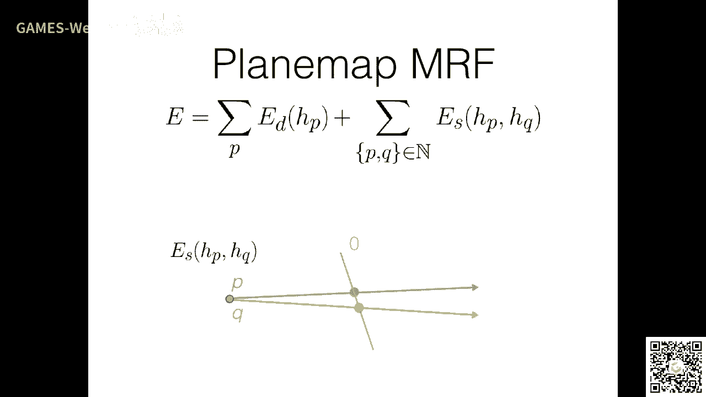

他要尽量尽量compatible对吧，哎这个时候你就会发现这个comparison啊，这个我知道大家喜欢看图对吧，讲了半天对吧，那到底结果怎么样，你会发现这个区别对吧。

这个是standard master，就是每个people去攻击对吧，你会飞发现它会容易飞对吧，然后你加了非常strong的pride的话，你会发现什么，这是一个tv上的result对吧。

哎他就是有垂直关系对吧，然后哎这个这个这个这个就完全不一样了对吧，相对来说要好好很多对吧对吧。

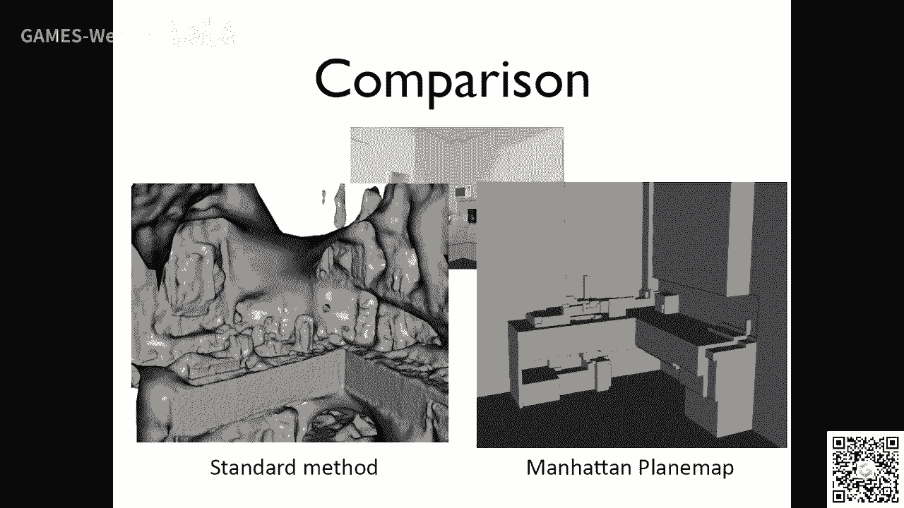

这是一些结果啊啊。

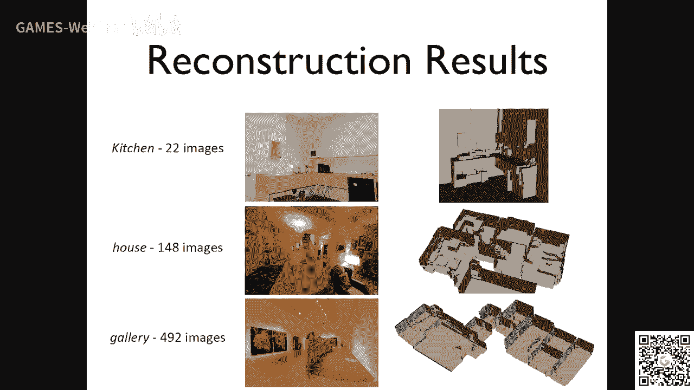

这是刚才一个方法啊，我再讲几个方法，让大家就是其实这个你你们可能觉得做做做笔设计，我可能不用这些对吧，但我觉得我想讲的就是说啊，他的这个就是他这种毛这种思路对吧，这种毛这里的思路，是很重要的。

是这种思路是很重要的，实际上比如说这个东西它怎么做呢，就是说sponse对吧，and pose pose detect place对吧，就是说首先要比如说这个对吧，这里有60张图对吧。

你可以做raft motion，你也可以reconstruct这些nn对吧，然后你可以通过这个non detect a plan，然后用mf叫graph cut对吧。

去去把这个plane跟这个peace association给给弄出来。

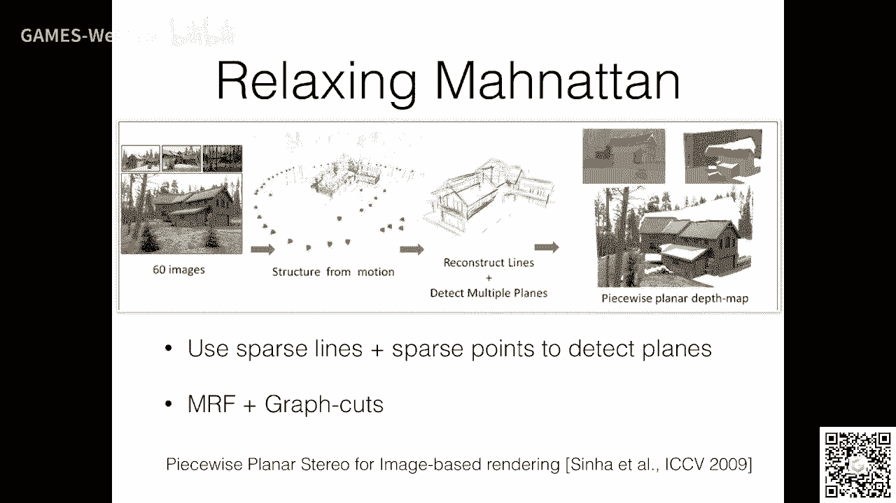

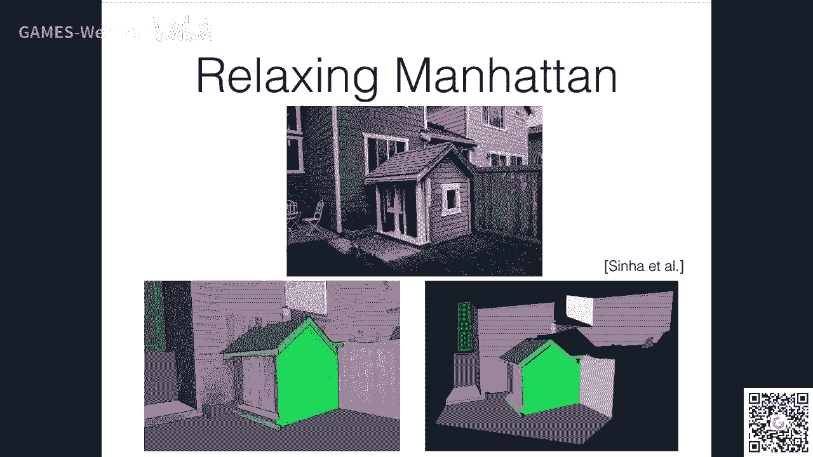

啊啊这个地方呢就是说你不需要这些flag那个少数几个方向对吧。

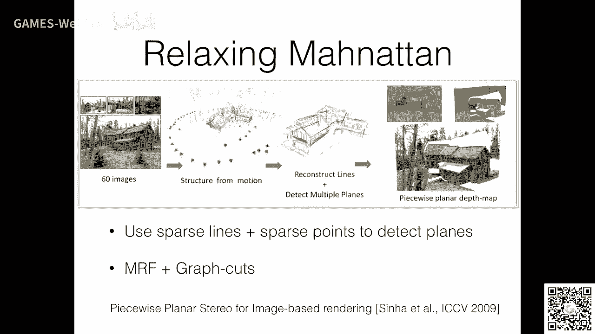

你这个地方你可以发现这个这个这个这个音mage，它还是有这种批次，this one这种structure对吧，只是只是这个pin它的equation就会完全不一样。

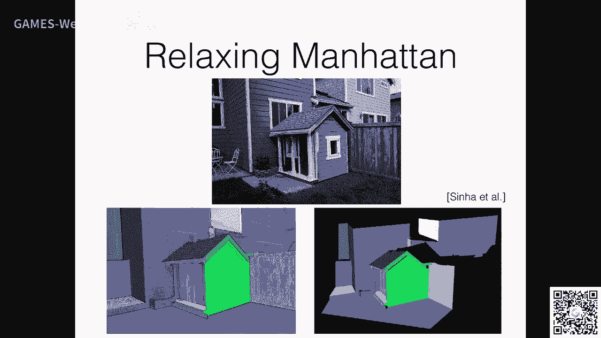

relax吗，哈登对吧，我觉得这些方法在做building model的时候，outdoor这种building model的时候是很有用的啊，就发现你发现没有思想就一个对吧。

思想就比如说你有了depth对吧，你就有corespondent，有了correspondent，就有depth对吧，然后你可以你可以在两者之间切换对吧，然后去value的这种cc对吧。

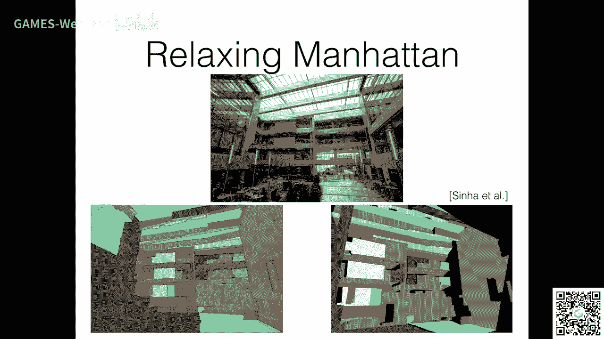

然后你可以enable curve的对吧，就是说可能发发top with a curve surface对吧，啊，我再讲一个东西嘛。

就peace white plana nana theory for open threconstruction，我觉得要记住一点，然后我就刚才讲讲最开始强调的那个对吧。

就是说这个cereal他跟这个这个这个形容cover image correspond，它是有本质区别，它是在一条线上去做match。

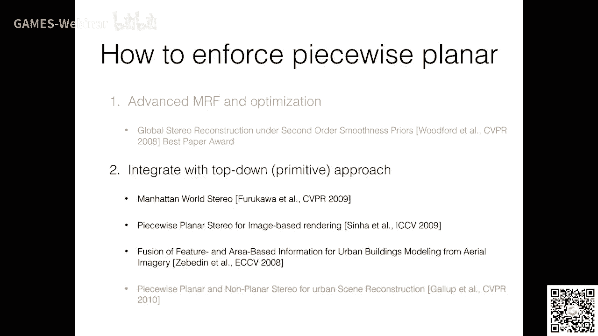

也带来了很多好处，带来很多好处，这个这个面板e t h的做什么东西，他是从这个时候是v圈发video对吧，street size这种video对吧。

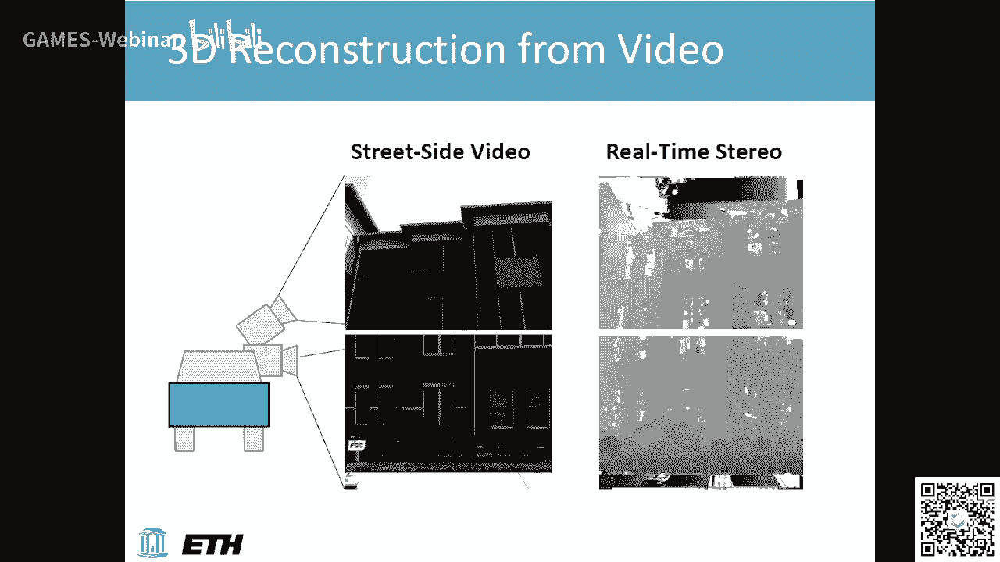

然后你可以做这种没有讨厌的这种stereo对吧，比如说你有一些video friends，对不对对吧。

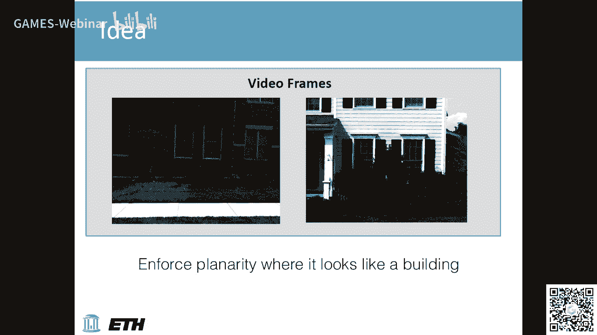

那你怎么做呢，就是说你给一个video，对不对，你首先做一个real time，这stereo对不对，看stereo就是比如说我们用我们那个qq的那个算法对吧，然后呢你就做什么。

你说什么你就做这种play detection对吧，你就可以看看哪个地方对吧，会有plane对吧，那哪个地方不是play，对不对，做一种plain的detection，就是semitation嘛。

就是哎就是semantic semitation，是哪些地方是对，哪些地方是，no plane，或者就是有些病人我就干他不要了对吧，哎你就做这种detection是吧。

我们前面说的是就是对前面那种就是我有一些海报对吧，我要去label对吧，变成一个labeling problem，这个地方实际上就是说你首先有一个一定是solution，对不对。

然后基于你现在solution还有一些非常你做这种plan detection是吧。

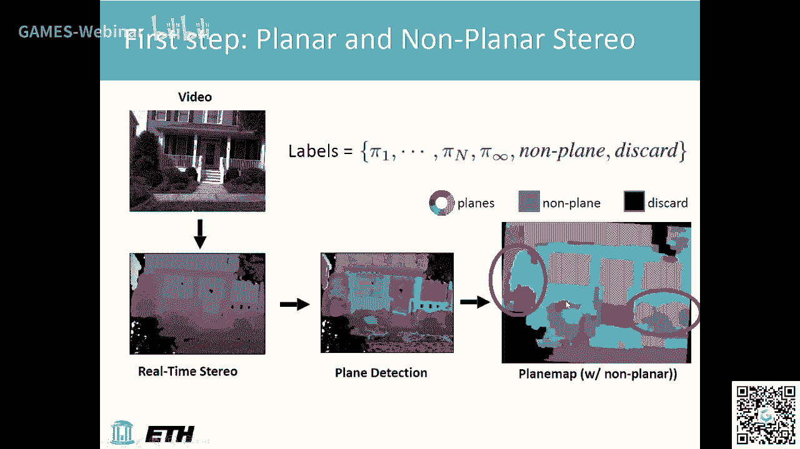

你做完plain detection就可以怎么样，你就可以去refine，对不对。

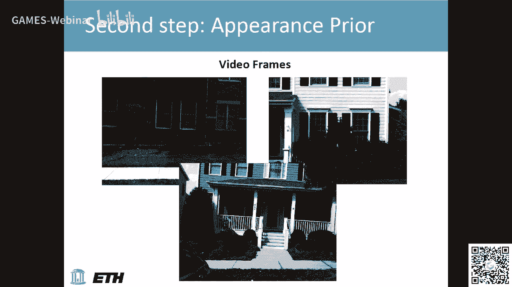

你可以去refine对吧，对你可以去be fine对吧，然后对吧，就用那种preme map的方法去去放一下对吧。

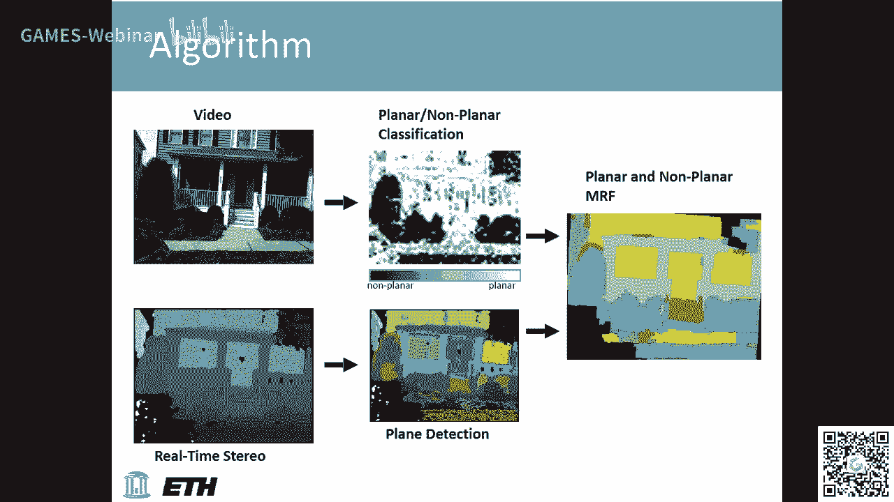

就能得到更好的play。

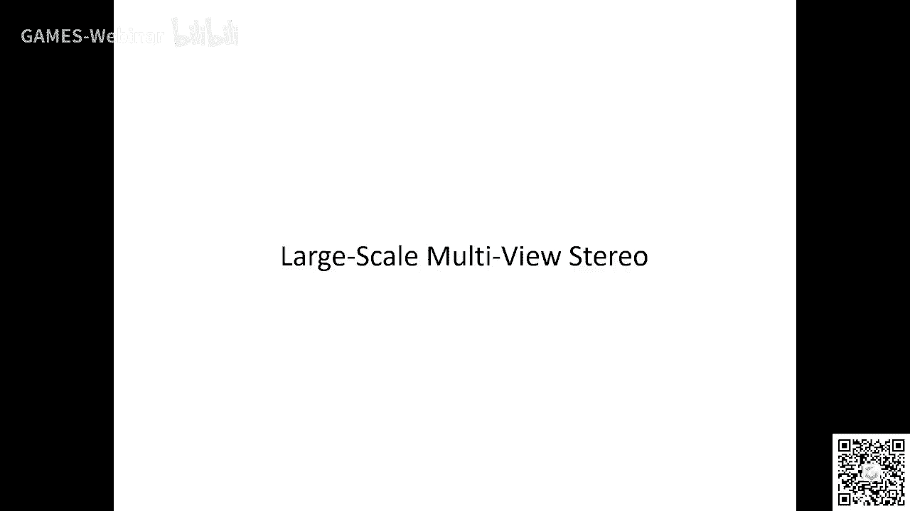

这是我讲的这种play对吧，呃这个地方就一笔带过了啊，我觉得比较容易就是比较容易去理解的，就是那个planet map，planet map对吧。

他是他就是把平时label neighbor变成playing ighbling啊。

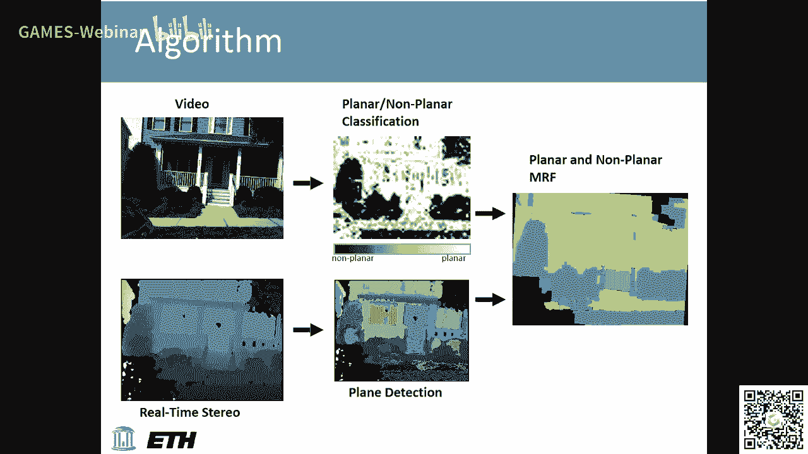

简单讲一下这个not skill这个motivo这个就是非常大场景的对吧，比如说image对吧，你怎么去做对吧，因为对吧，这是一个大的场景对吧。

你比如说你有这这这这个每个每个propl的这个就是你拍了一张图片吗，你在这么大的场景情况下，你要怎么去做对吧，唉我觉得这个地方比如说如果你是读ph d啊或者什么东西的，我觉得就是说不仅仅是解决问题对吧。

你要propose一些事都选出来，propose一些solution出来啊，这个时候你就会问怎么做呢，你就把它抵外很多这种，很多很多微信对吧，然后呃然后那个，对外层很多女生以后。

然后在这个区间里面去做吧，每个区间里面去做，但是每个区间里面去做的时候呢，你还要把它拼在一起，对不对啊对吧，这是一篇文章是吧，building文明啊，day，这是篇很有名的文章对吧。

就是哎你怎么去diy的，其实是一个很大的change啊，就是对吧，或者就是说你devin model space，english space对吧，这也是雅思的一篇文章对吧。

towards the internet multi serial，这个时候呢他就找了一个算法对吧，就是说尽量其实这个东西很有意思啊，就是说啊那个photott那边paper它它它强调的一个观点。

就是说这个这，个这个image这个这个camera post它是from class对吧，因为你去旅游对吧，比如说这个叫这个很著名的，比如明确旅游呢大家拍图片基本都是在一些固定的点附近牌啊。

固定点附近牌对吧，你得到这个东西，它就是有机构，啊那怎么说呢，它实际上就是说你你去你去把它变成一个这种because the problem对，就是你从你你希望把这些class给找出来对吧。

就是说这个我就简单的讲一讲，简单的讲一讲，简单的讲一讲啊，就说stretch emotion的这种point对吧，fm就strucmotion对吧，然后你看一看，比如说你重建的这个东西对吧。

你这protection这些点对吧，如果这些点，你如果因为在一个image class里面呢，那么会出现什么情况呢，就是这些点啊，它尽量都同时appear在这些image里面。

这就是一个好的class对吧，第一个点对吧，比如说你有两个image，它的这个这个motion这种point呀，o f不大对吧，那这个时候呢这两个因为其实不应该在一个什么不应该在一个，在一个里面对吧。

因为你这个point在一个class里面实际上就是overlap之比较大嘛对吧，这个东西以后呢，哎这就抵抗了一个那个，我们就可以通过这个东西去做image class对吧。

这个也它实际上是做了一个用了一个规律的算法对吧，用了一个规律的算法去去找这个呃clusters对吧，这个image class which is on the images in the cost对吧。

all my compenewill keep or keeping courage对吧，如果如果如果如果这个卡死的size不会转弯太大了呢，那你就是class对吧。

但同时你要满足就是说那个就是满足cover就costraint对吧，对这个东西啊，我觉得是这样，就是这个这个solution它不一定特别interesting对吧。

但是就是当你遇到一个呃我想讲的是什么呢，就特别是国内跟国外啊，我个人感觉就是大家解决问题的能力很强，能能到更好更好的算法啊，但是就是说能不能propose一点啊，就是新的问题新的问题出来哎。

是要去思考的对吧，比如说这这篇文章就是说要讲的是就是想要做的，就是说我们怎么能把一个much skt problem break down the small skills对吧，然后呢还能把它合在一起。

对吧你看这是这个一些结果对吧。

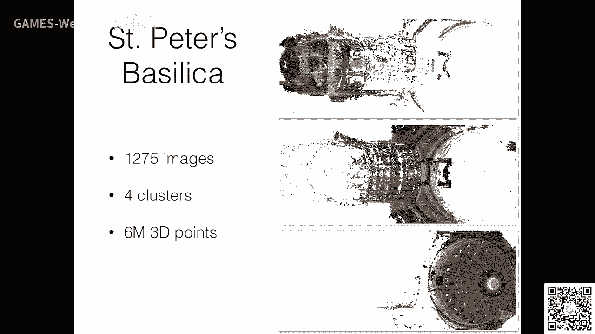

嗯我今天的课就讲到这啊那个，然后，这节课我们就开始讲讲一些比较graphic，也包括一些deep learning的东西啊，就姐妹是个deep learning，重点就是讲representation。

我image session，我相对来说我讲的时间要短一点啊，因为我觉得这门课并不是这不是在这个这个这个上面啊，但是因为嗯怎么说呢，就是说这毕竟他也是重建嘛啊一个这思路嘛，一个pipeline嘛对吧。

就是从image based来来解决这个重建的问题，我想说的就是你真正没有写过这个算法的话啊，啊你是搞不懂的，你必须自己真的去做做spa motion。

你必须自己真正去做过这个motive stereo啊，你才能呃真的理解这个东西啊，它的fundamental principles是非常非常简单的啊。

哦对下节课我要讲一个叫max schization的东西啊，就是说解解解这种毛线啊，ject的motion view，我觉得是一个很重要的东西啊，大家可能送死啊，理解那是什么东西啊。

我觉得特别在这个特别现在地图能拧出来了嘛对吧，我觉得那个东西跟deep learning相关的很好的东西啊。

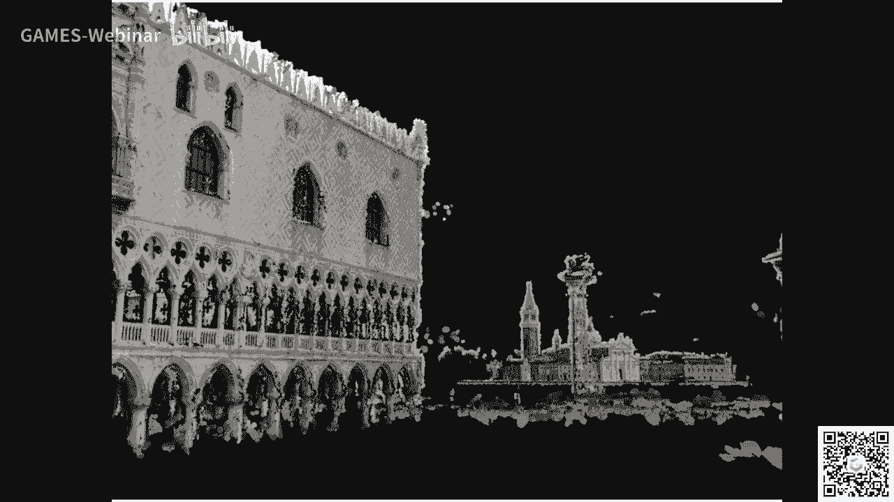

好吧，那就今天就这样啊。