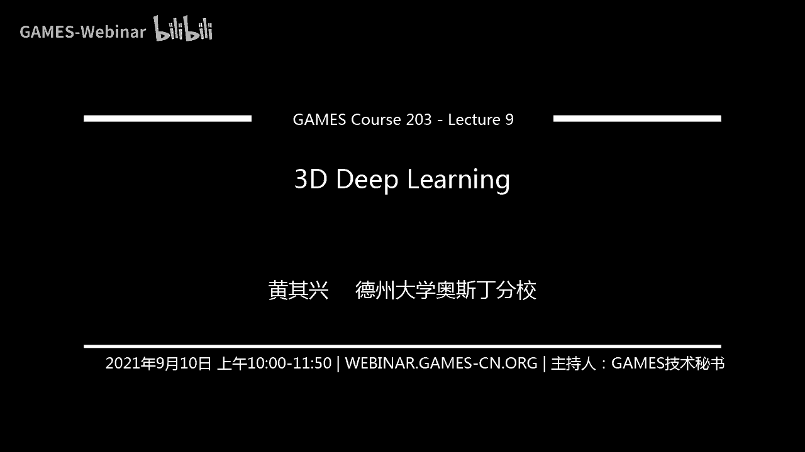
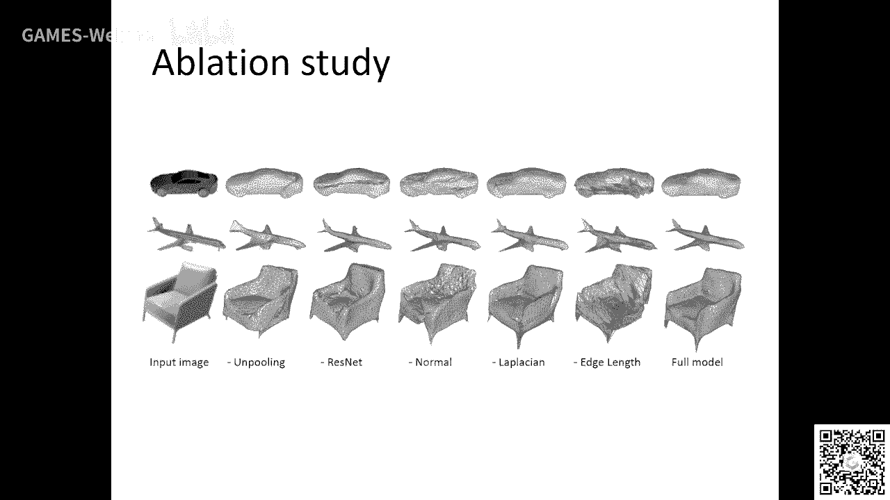

# GAMES203： 三维重建和理解 - P9：Lecture 9 3D Deep Learning - GAMES-Webinar - BV1pw411d7aS

好我们看三次了，那上上一节课是那个因为我有一些那个中断了一次啊，就是我们这一次还加了这节课，还有两节课好吧，然后我们准备把这个就是深度学习啊。

就是我们前面讲到的这些这个geomege processing python对吧，我们深度学习这一块我们给认真的啊，就是把一些谈一些我的感受吧啊呃大部分文章大家都读过啊。

但是我我希望就是呃就是谈一些我自己的感受吧，啊希望大家有帮助好吧，然后深度学习其实在特别在这个计算机视觉这一块呢啊真正起来的吧，其实就是因为有这个alex net啊，这个真的是就是给大家带来了一个。

特别是对计算机视觉这个领域带来一个突变啊，其实好多时候啊就是机器学习这些东西啊，啊特别像这个就是就是特别是这个architecture design以及一些training max呃，其实回过头来看呢。

就是大部分的东西他都很简单啊，但是它的这个架构设计什么东西都很简单啊，就是实际上现在就是一看就是谁啊，基本上是谁谁，就是他是一个一个一个一个时间赛跑吧，谁谁占先啊，那就谁谁得到的亏的比较大啊。

然后设计项目呢其实就那么几种啊，其实我个人感觉呢就是说呃如果大家对这个计算机重新学什么东西，就是说了解的深入的话，我觉得还是就是对这个地方的机器学习吧，他还就是深度学习很有帮助的啊，这个东西实际上。

实际上就是说对于我个人来讲，我个人感觉就是为什么前面我们讲了那么多非常基础的东西，很多东西都是20年前吧，20年前那个什么东西，但是实际上回过头来看呢，其实这些东西它都是更有帮助嘛。

你如果如果仅仅我们从架构的角度来讲，呃，如果就是仅仅是我看你的文章，你看我的文章对吧，这样我觉得效果不会太好，我这节课呢我要讲一些比较经典的东西，有一些甚至是国内一些老师做的对吧。

我觉得就是说通过对这些东西讨论的结果，学的东西我需要提供一些新的思路来看待这些文章，好吧，比如说你看这个对吧，image generation对吧啊这个这个这是干啊，这是很pl的这个test对吧。

就是说图片对吧，跟这个三维的物体它最大的区别在哪，这个区别就是商务，你怎么表示他对吧，这是这是这是这是那个最重要的，比如说三维物体，我们讲了很多种表示对吧，它有这个网格面片对吧，有这种partnice。

有implicit这个演出曲面对吧，还有这种high cular representation，还有这种还有这种这种这种电影对吧，哎这种representation对不对。

就是说唉这个这个我从从以前管理里面研究的，就是怎么让他们来做做这些建模这些东西对吧，建模啊，这个呃以及这个，对吧，渲染对吧，就是做这方面的工作，好吧嗯，那，怎么在这上面做学习呢对吧，做机器学习。

比如说机器学习呢，当然就是说最重要的一个探索，就比如说做做做做做做分类对吧，就比如说你扫描了很多，就是或者你有很多从three model对吧，你要对它进行分类对吧。

你要剩下的剩下的就是对它进行分割对吧，还有这个，对吧，比如说你有一个全能的mac，你怎么来做对他解决那个，分类对吧，用deep deep learning来说，你如果这个表示一个换的号，怎么来说对吧。

那你分类的话很写，很重要的一点就是说你要把它表示成一个veer对吧，那现在有了那个graph new network，你可以把它表成一个graph呃，甚至有一些是set，就是这个点击上面的这种分类方式。

你可以把它表达成一个点击对吧对吧，然后那从这个角度来讲对吧，那就是说怎么怎么对吧，你怎么表达表示一种某种就是形势对吧，能使得我们能来呃，能很好的来做这个呃深度学习对吧。

哎这个是我觉得是这个比较重要的东西对吧，其实我们前面学的这些东西呢，实际上就是打了一些基础对吧，那我今天要讲的主要是几种，就是point count对吧。

比如bey surface like a live，我等会也会讲一点mac对吧，就是就是就是会会加一点这个全文max的东西啊，然后，稍等啊，我回一个东西，二，那我现在就开始吧。

那我首先要讲的是就是这个深度学习对吧，就是三维上面的是最先发展来是怎么来的，就最开始一个q有发展的时候，其实你会发现没有，就是大家都会比较保守，或者就是说大家都说最先发展起来的往往是什么。

往往是最容易的东西对吧，比如说烧物体怎么表示，那么骚物体怎么表示呢，其实比如说有一个最简单的方式，就是一个word max表示是因为最开始机器学习它是在什么，他是在这种音乐起风了。

这种或者vivo上面这种regular那种非常graduate这种规则上面来做对吧，对不对，这种regular这种诡异的上面来做对吧，就是就是在这个面片上面对吧。

就是说那你推广到spring的永远是那种最追着forward的这种推广对吧，是最简单的对吧，最简单的那比如说最开始大家要做的就是说我把一个曲面嘛，把它把它表示成什么。

就是表示一个one match representation，就是一个就是我用一个vocal对吧，就是三维和vocal去表示这个东西呢，其实你严格意义上来讲分类的话。

那你应该把它分分变成是一种ted representation，就是说其实one meal representation，它是一种impression rap，一种表示形式对吧。

那你就呃把它walter white，所以这个时候呢他就你就把它变成一个bt对吧对吧，它变成一个vector，他是一个体术嘛，这就是这种范围，这种提出的这种表示对吧，那你有了这种体式的表达形式以后呢。

你就得会把它变成一个bo，这个时候呢你就可以在这个呃，在这个这个这个这个one match representation上面的来use the new network对吧，你比如说to d。

如果是做做做这种呃convolution的话，那到了到了11d嗯，那就到了three d，它实际上就是，到three d的话，那就是，呃就会就会是three convolution对吧。

ping都是一样的对吧，然后你可以找three decovolution好吧，就最开始这篇文章呢是一个就是15年，就不是他们做的对吧，就是叫three dishness啊。

呃这个东西呢我想讲一点个人的观点吧，就是说我觉得p他是第一篇，就是把这个dvd把它推广到three d对吧，他就是呃做了这个体术上的考volution，对不对，最后能就能变成一个label对吧。

最后就能变成一个label，哎这点我觉得是很好的啊，就是但是就是他没有做的很简单啊，他没有，其实后面的话有有些别的rapper，他演大家做了一些spired forward的那种extension。

我觉得会比较好，他这篇文章他没有，他他是做了一个就是convolution dc，也比ef network对吧，他是用了这种posic对吧，他就做generality model嘛对吧。

那个时候ga和v a e这些东西还没有出来嘛对吧，就是其实这也是一个学科方面很有意思的东西，就是说实际上就是说他的这个方法会非常复杂，其实大家记住的我觉得并不是真正的后面这个方法。

这个方法我觉得后面大家用的相对来说比较少，但是他的确是开创性的，就是第一篇把这个是或者就是第一篇值就是大家不要弄的对吧，就是把在这个提出上面定义了一些convolution，operation。

就要来做这种东西对吧，就convolution，而别人付了一个connected，这个东西我就我就不讲了好吧，就是我觉得这个东西从从network的角度来说，我觉得现在大家用的不多了啊啊。

然后深圳第一篇，你比如说还有一篇就是佳俊对吧，在三分对吧，他们是把这个嗯gg对gr是从to d定义的对吧，你你把它给看到这个three d上面去对吧，这个工作做的比较早的话，相对来说影响也比较大。

那就是他做了就是cd上这种必考不都是对吧，除了three d上d抛物线就是qd，他是这个嗯这个这个这个这个这个这个这个conclusion operate对吧。

那three d就是three d deution operate是吧，就是从一个net net的这种code对吧。

你能得到这个最后能得到这个three works of space里面的一个shape对吧，对但是对吧，这是一些结果了对吧，就是说你每一个每一个那个class都对，缺一个这样的model对吧。

你可以得到这个当对吧，就是枪的这种这种兼容性model，你可以得到cheers的jl型mod，可以得到car sofa table对吧，这种各种各样的形容挺mod对吧，对各种各样的情人挺好的对吧。

就是啊这个这个我觉得就是现在当然这已经过了，但是我觉得还是要强调一点，就是一个学科发展的时候，往往是最受的这种最容易的，一开始啊我觉得是应用的应用的最广的啊。

其实这个体术的representation后面也有很多发展对吧，你比如说啊大家怎么，比如说比如说你提出一个最重要的问题，很重要的问题，那就是太太计算量太大了，太复杂了对吧，计算量太复杂了啊。

这个这个这个你比如说最开始最开始做的话，你像那个gpu，你做能做到32x30x32已经很不错了，对啊，已经很不错了对吧，呃你如果如果比如说像这篇文章。

它是用这个pose的那种sweet commotion mework对吧，就是就是把那个convolution como版变成spar裂，只能做到这个四层四层40对吧，做不到对吧。

那怎么怎么怎么处理呢对吧，那你想这个比如说比如说这个最直接的问题呃，呃就是在对一个物体算这个叫dience to对吧，就是说我给一个物体对吧，然后我每个点我要看到这个这个前面的区域里对吧。

嗯或者就比如说我们以前讲过这个important service at的那个construction对吧，you那前面那部分呢是在这个mmatch grade上面做的是uniform grade上面。

那最后最重要你就是做了256256256真实了对吧，那一种解决方法就是用什么就用auto，对不对，out去的话，实际上就是说它是一种就是说只有当你这个设计附近的点对吧，我才用最细的那种规则。

那个远的地方我都是用那个用那个比较粗的主意去做对吧，远的我都是用比较粗的规则去做对吧，然后那如果是这样的话，嗯，我们就可以把这个or three，对不对，你可以把它推广到这是重庆老师组对吧。

就是18年那篇文章，就是说你可以把这个不用这个moon matter的东西来做对吧，你可以用这个archer arch对吧，那out去的话，它有一个很重要的问题，就是说如果你用orch。

你你想这个uniform这个green它有什么好处，比如说gpu friendly对吧，你处理这种啊，vvise这种就是这种限量型的东西对吧，你虽然就是说受不了现实，他很快嘛对吧。

gp you hardware friendly，然后你弄一弄成动而去的话，你就得重新去定义，对不对，那我考我不生对吧，重新去定义这些东西对吧，就是说in petition上面会复杂很多啊。

implementation上面会复杂很多对吧，而且特别是就是说你在那种比较粗的那个cell里面啊，你在那个比较粗的那个cell里面定义的这种convolution，你怎么存存，存下来，对不对。

存下来呃，沉下来，这就是我觉得是很很那个什么的对吧，这我觉得是很那个什么的对吧，对吧这这我觉得就是很那个什么的啊，所以就是说这篇文章我觉得就是闪退现象当然很高了，然后我觉得这也是一个趋势嘛，只能2g啊。

相对来说，但是就是说特别在硬件上面，怎么把这个弄得很好，这也是一个challenge啊，这也是个challenge啊，tpu上面其实以前大家做这个the orch，比如说像live cover。

像去tt对吧，最开始做的这个呃，用orch来做做普通这些东西对吧，包括那个做收费重建这些东西，包括psy construction对吧，在二区上面诶，我觉得呃这都是制作很好对吧。

但是怎么在二区上面对定义convolution，我觉得还是就是说怎么把它变得就是让广大观众去接受对吧，我觉得这是一个呃这也是一个open challenge，好对吧，这总的来说呢。

就是说实际上起诉呢呃是一种最直接了当的这种推广的方式对吧，嗯但是从他说easy，这就是如果不是二区的话，那easily increment对吧，就是hardly friendly对吧。

但是呢就是如果不用all去的话，他就是robert motion是吧，同时你也不能害到这种structure formation是吧，然后还有一种就是说最开始这个同一学就是这个三维出来的时候啊。

啊大家有一种感觉就是说必须要用那个to be的training data对吧，to be training data，它是很好的。

你比如说呃这个in internet上面这种这种label data对吧，你three d的话，如果如果直接做word max的话，你就不能用这个tvb这种training类的，对吧啊。

最开始这个东西呢对吧，这是一个需要考量的对吧，那第二种那个representation呢，就是这种呃like field的这种representation。

lifield representation啊，这个东西呢这也是一种从就是image given嘛，就是在计算机视觉里面对吧，大家做的最多的像image文这种representation对吧，就是呃。

对吧，就是说我因为上面我做微考虑，你想做考拉，你可以向我解决啊，我能不能把这个思维的问题把它变成qd的问题，变成cp的问题啊，其实现在这个发展呢，你比如说现在就是做这种recognition，对不对。

然后经常大家会把这个什么sweet shift把project tod对吧，其实我觉得啊这这个东西就是你build这个sd跟two day这种connection啊，啊我觉得这是一个长远的发展啊。

我觉得现在这个东西还没有完，远远没有结束对吧，还有很多很多东西可以做的，还有很多很多东西可以做的对吧，那就是like firefantation对吧，那什么时候来个fs reference。

就是有个sweet model对吧，然后rm rtual camera就是你把一个sweet model，把它变成很多这种image对吧，然后那怎么你有了image以后。

你就变成一个彻底的recognition的问题，比如说你看那个音频内还有很多有1000内的一个每个类有1200类，1000 1000位对吧，1000内每个每个每个每个那里有几千个人类对吧。

然后你可以用那个dn去classic玩，这个也没什么东西，对不对，你可以，然后呢，然后如果我是这个render的形式呢，那你就可以想你可以选择像这个这个东西，你可以做这个事。

你可以用cn去做classification对吧，classification的时候呢，你就可以用你得到的结果，你可以做一个py嘛对吧，就是一个graph，对不对，那就是做一个pin。

然后你再接一个sn对吧，然后就是，也可以做classification，对不对，这个好处是什么呢，就是前面那个cm里的，你可以用1米7的那个对吧，然后那个东西可以匹配很多位置都是很好的，对不对。

然后你你class法后呢，你可以看到整个class a classification，accuracy，就是跟这个three d的比，跟这个three d的比的话。

你可以看到那个不管是这个ation and accuracy，还是这个还是这个，对吧，还是这个什么对吧，那个去过的mp，他都是要比这个都是要比这个这个这个switch，这种卡不如神要强很多的对吧。

这种卡不如选它要强很多的对吧，是不是得考完陆逊还要强很多的对吧，就是这个like you的啊，我觉得现在大家就是，对吧就是真正我觉得这里面如果如果你要问我对吧，有什么open prom需要去解决的话。

如果你要问我有什么open prom需要去解决的话，我觉得就是说你怎么close这个bs对吧，你看这个render english，它是没有tx对吧，因为three one没有tt。

而你这个real images have your text对吧，怎么怎么close这个gp，对不对，那就跟这个ren那当然是有关系的嘛对吧，那当然是有关系的嘛，就是来field，其实它只是取个名称嘛。

来了之后就是说我们一个场景对不对，我们不用把那个smile model重点对吧，我们只需要ctr，就这个场景在很真实的这个view view下面的，很dice view箱的这个english。

有了这个东西以后，我们就可以我们就可以那个，对吧，我们就可以这个呃就可以对这个场景表示对吧，然后可以做些探子什么东西，好吧，那这个地方实际上就是取了这个名称对吧。

就是我不表示他的这个spring model，我表示这个the view，对不对，就rap出来的时，对有一些问题那么几个问题，比如说你你到底怎么样，什么样的view对吧，最重要对不对。

就是一个model对吧，你怎么去run的这个view对吧，你后面当然还有这个view，你怎么把它合在一起对吧，这也是很重要的对吧，对吧哎这个东西我觉得就就就对吧。

还有一点就是什么close game对吧，就是这个啊这个render image跟bo image对吧，在之间是不同的啊，这个cp其实很大是很大对吧，你比如说你from train the new。

难道我对吧，那能close the ga，嗯那第三点就是说你像这个ntr本身它就能运进来qq群里面的对吧，然后呢呃其实你也能benefit，就是说其实做qd问题嘛，就这deep learning啊。

它很有意思啊，那就是说做的人越多对吧，你往往在一个representation上面，他这个普通的其越高，他好的时候他也是有很多就是工程性的东西对吧，你做人越多，你这performance就高对吧。

实际上就是做qd的远远还是要超过做sp d对吧对吧，那你如果把它表述来的fs会利用这个东西啊，但是缺点就是说实际上它就比单了嘛对吧，还有就是view对吧，你怎么去生成对吧。

我今年有篇cp i c本就是学习这个怎么去3号这个位置，对吧啊啊但是我觉得这个问题远没有解决啊，然后tcl对吧，这个符号他们做这个东西对吧，那我觉得这个相对来说从technically来讲对吧。

我觉得这个gp有很大对吧，从这个这种这种大家传统的这种东西到一种新的reaction啊，我觉得嗯后面我会以我下两节课会讲一些小麦，这个d可能给东西啊，就是我感觉这方面的话。

就是说你怎么怎么都是从一种体格的角度去去去思考这个问题，对这point centation其实跟ko还是很有关系的，跟connev sr很有关系，然后对吧。

他实际上他过去为什么就说你这个三维的东西嘛对吧，你从这个扫描仪器里面来，它就是一个点对吧，而且这个点云呢实际上它有一个什么好处呢，就是说它是一种非常经济的表示对吧。

你比如说你high dimensional data，你你这个点对吧，你如果用我的magic这种表述，因为因为像那个音乐它也是一种文完全表情是吧，比如说这个d对吧。

你这个data它有时候比如说像我们做这个b data里面，它有这种hamon data对吧，孩子们真的你可以试对吧，你可以是个d23456 对吧，往上走对吧，你像这个这个这个partisan的话。

实际上它是一种就是诶你如果用这种点云的表示形式的话，它的这个complex对吧，嗯你至少就比如说你用100个点，1000个点对吧，具体表示的话，他他实际上他的任务complexity，嗯。

实际上它是它是呃跟他intro这个dimension，它是比如说它是熟悉的对吧，就是n的引擎是一个单身对吧，然后这exhibition它是linux对吧，就1000个点对吧。

the conditi是对吧，你的东西，那你放出来就几位对吧，我们是表示形式，它就是extremely，那时候他是formation对吧，这我觉得就相对来说他就非常复杂了，所以我觉得在点评上面做的话。

那他有很多优势对吧，不管是从这个工程对吧，就工业应用的角度对吧，还有从我们从这个很简单的微分几何的角度去看这个问题的话，实际上这个点评都是很好的，那点上他并没有完全把这个open的这个fid对吧。

我觉得这个field啊还有很大的发展的潜力，很大的发展的潜力啊，然后对吧，就是说实际上的go就是我们想做首先做classification，对不对，然后你还要做一些分割对吧，这个up做分割对吧。

还有比如说你做这种semantic semitation for english是吧，出来这样b对吧，但做出这种分割对吧，这种很重要的。

那pk呢net呢它是一种就是我觉得是一个open的一个东西去思考问题对吧，就是说把大家从一种传统的思路中给给给给拉出来啊，我觉得这是这是这是那个对吧，你给一堆建议。

你做一个困难就能得到这个object cotation，polication manation，或者是the confession对这方面的东西对吧，对吧，好它的核心是什么呢。

它的核心就是说你这个point呢啊实际上它就是说啊，就是说你这个network的话对吧，我没有这个point in order，对不对，那也就是说你把一个pcd作为输入的输出。

它肯定是你希望这个fmc symmetric section对吧对吧，我们或者叫把它叫做这种set section对吧，就是说你的这个network肯定是要一个set action，对不对。

然后这个bation它就有一个很inter定理，它实际上就是说我觉得这是一个这是一个很重要的东西，就是说大家第三network的时候对吧，有没有考虑从从这个30多的角度去考虑这个问题对吧。

就是说你一个cption对吧，然后这个它一定能被一个什么fashion表示呢，能被一个h对吧，就是说h是一个，continuous tention对吧。

就是说他能力一定能被一个continue function，它在这个这个里面的max和和一个呃那个gma对吧，肯定是section去approach me对吧，他一定能被这个faction却pom对吧。

但是他没有说啊，这篇文章他没有说这个东西怎么样是吧，对吧好，那既然是这样的话，就是说那那既然是这样的话，mobile放这个它就抵上一个network tech对吧。

这个detach最后他肯定是就是说就是从design的角度来说，就是你看到的任何一个architech，对不对，它复杂对不对啊，他肯定是design的时候。

就是说因为你要在那个data set上或者解决实际问题，你要解决一些问些问题对吧，他做了很多extension对吧，但是你首先看就是这里面就是有时候看这个东西啊，就是说你看一个东西啊。

你要习惯就说你看一个architecture的时候啊，呃你不仅仅是看到最后对不对，最后是长什么样，你还应该看看他是怎么发展过来的对吧，他肯定最开始的话，你比如说他肯定是你看啊，这个地方肯定是这个毛病。

对不对，就是你有一个n乘三的那个cocd对吧，m l p对吧，这个是share对吧，就跟这个里面的这个h这个bank一样对吧，但是sh对吧，你得到了这个东西以后呢。

你再拿一个fly connected这种东西对吧，就就就能得到就能得到一个这种得到一个那个output的，对不对，就在每个点上搞ml p对吧，然后你在呃再再再再再把它开在一起，对不对。

然后你做一个max pooling对吧，你看这个模组好吧，你看这个猫女，然后呢他又做了哪些改进呢，首先它抄了一下，他抄了对吧，就是他做了一个字recovery module对吧。

像那个什么oracg这些东西都是做相似是吧，前面的他用了一个ort transform对吧，也做了一个，也做了一个transformation，也做了一个transformation。

就是ort form，他能把什么弄这个东西，就是比如说你很多创的cd对吧，他可能有这个orientation的问题对吧，唉他把这个东西就是用这个transformation吧，做了一个做了一个改进对吧。

做做了一个那个orientation这种calibration对吧，哎然后就合到了一个这样的东西，最后他一个负lip mac的那个是吧，对吧就是当然核心的底端也就是实际上你就在每个点上处理对吧。

然后你再把它合在一起，对不对，就是实际上他的就是说学的实际上就是呃呃哪些点就是给定了，这是哪些点，哪些空间中哪些点对吧，哪些点的位置比较重要，大家给处理了一些对吧，哎这是一个要注意的东西对吧。

然后model t shift forty class classification对吧，你看哎就是非常非常efficient啊，非常非常efficient，但是就是performance也不差啊。

但是后面比如说这个point light加加，比如说pcnn对吧，这些东西我觉得都都有长足的进步啊，都有长足的进步，对吧，然后我想说的就是什么呢，就是说，这对吧，这只是一种思考问题的方式。

就是一种思考问题的方式，就是说比如说呃后面比如说胆namic n在这块单块不对吧，这个有就是你像这个破站里面，他没有利用那个，虽然你这个点的ordering它是不一样。

但是你这个每个点跟哪个点的那个connectivity对吧，neighboring的information我觉得是很重要的，nebling的information我觉得很重要的对吧，这也是很那个。

就是我觉得村号上面还没有把这个问题完全解决啊，但是我觉得就是破站的，至少open这个field，我觉得这个很重要的一些工作啊，嗯也是oppo的一个就是非传统的方式去迪拜六network。

非传统的方式去抵抗用那种牛奶的word，其实我觉得就是说我个人感觉吧，就是我别人我就不管那个啊别的学科，我就说计算机图形学，特别是几何处理对吧，我们有30年的基础对吧，你去看最早那些工作。

比如说包括我那个讲点名的时候，我讲了什么，我讲了这个点评上面这个simplification modern啊，自己直接放弃了对吧，我觉得那里面还是有很多东西可以借鉴的，很多东西可以借鉴的对嗯，我觉得。

为什么开这门课呢，就是我总觉得就是最开始的这些东西给大家讲讲有好处啊，就是然后我再讲解这种new network的defy什么东西，但是我个人感觉还是有很多东西还是可以挖掘的，很多东西可以挖掘的。

ok这个点云对吧，我就讲到讲到这，然后我下面再讲两个我认为是非常好的工作吧，就是说一个是d和s d f啊，当然我就是说我只讲一篇work，比如说像bh他们都有work，嗯这个也很好啊。

我觉得d和sd f我觉得将来他的这个就这一系列的东西，它的潜力还很大，特别我觉得如果你喜欢做这个啊，这个比如说喜欢做点redeep learning的话。

你喜欢做si这个deep learning的话呃，那我觉得这个你然后你想再去把这种力机器提升经济学习，应用到这个remodel 3呢，我觉得进步s d f第一个非常好的非常好的开开始的东西，非常好的。

开始的东西，嗯我觉得这是很重要的，你可以可以从这个角度去看一看，好吧，就是如果比如说我们希望把呃在其实deep learning的这个理论，把我们做mming对吧，your measumi。

它的这个数学基础叫做oppositiation theory，gmal modern，它的祖先是要收费对吧，我希望我们应该学过这个东西，就是参数局面对吧。

这个东西它是从这个paration theory来的，deep learning，他有一些ko对吧，ko的东西对吧，还有一些这种operation啊，我觉得就是如果把这两者结合在一起的话。

我个人感觉做研究这个d f s d f啊，这个是嗯很好啊，然后s db和d f呢，你看这他的那个基德对吧，它是这样，就是说啊就是那个science fanction of shapes对。

然后他就说还有两种对吧，给给了两种架构对吧，一种架构就是说呃我给一点给给给现实的一些点对吧，然后我对这些点进行插进行插值对吧，呃进行探索对吧，嗯这个结果我觉得是非常striking的。

看这个你从左边最左，比如说椅子，你从最左边那个椅子，你查到最右边那个对吧，然后你可以查出来这个，所以说你可以看这个shift，它这个边没有没有没有被不漏掉，你发现没有，这边没有被不漏掉对吧。

这个边没有被不漏掉对吧，然后呃这个这个东西是很很那个对吧，那边没有被剥落掉对吧，然后你看他的他这个model的这个aergy都非常的像对吧，待会我会问你们为什么哎其实这也是值得去思考的对吧。

就是有时候你读文章嘛，就是说假设这个文章的result we produke，你你你是仔细去揣摩的，就直接想对吧，你看下面也是对吧，你看这个点它都非常像，你发现没有变回了sp对吧，然后呢ok对吧。

它是比如说如果你弄了一个jing model的话，我假设大家知道galing model，你们这一高课我不会讲这个东西，jr是jony mode，就是给定一个雷同的code对吧。

你呢就是我刚才我刚才剩那个我能满血的那种，generally给另一个nation code，对不对，我能直接得到这个，我能直接得到这个得到这个family的models，对吧对吧，然后对吧。

我可以做通过这个code做一些差距吧，然后呢这个东西怎么来的呢，它实际上是从这个3b43 d fection，它不是不是像我们一般3d session后呢，这个东西怎么来的呢。

它实际上是从这个3d3 d筛选，它不是不是像我们一般3d筛选做的活动mc那种形式，它真的是一个又science ence sation，它是有一个new network得到的，他不是不是啊，虽然是这样。

就是说啊你他首先是一种隐私的表示形式对吧，哎演示的表示形式，然后呢你给一个这个给一个空间中的一个点对吧，他用一个new look去determine这个点到底是它的值是多少，他是零还是大于零对吧。

它是小于零还是大于零对吧，然后呢然后呢你就可以用这个流量，我去这个非常简单，因为我觉得这是一种非常简单的方式啊，然后呢你可以用一个点去做毛囊也很好对吧，你可以用一个点去，然后有了这个东西的话。

可能就是d f s d f对吧，然后就有了这个东西，那你就可以用什么用毛巾q5 的方法把它转化成一个mesh for visualization，对不对，诶，这个思路非常简单啊，非常非常简单。

然后呢他这个design就是fully connection，new network对吧，比如说你这个新single shape这种d s d f，它就是说给定一个点对吧，我就能想得到的值对吧。

然后呢我用一个八个layer这个fully connec，但是我loop对吧，然后你就能得到这个output对吧，然后如果做jing model的话呢，我就不断的给给了一个就是每个点的坐标。

你还给给了一个雷神的cos，对不对，然后你用一个fully connec这种network，你就能得到一个sdf对吧对吧，哎这方面的东西我觉得很有意思对吧，就非常非常简单非常非常简单啊。

然后呢比如说你如果要train这个order in code，order decoder的话呢，对不对，就是它就是它有两种network对吧，就是说你有一个input对吧。

你有一个fully connected的东西，把它变成一个code，对不对，然后你然后你再把它变成一个output对吧，变成output，然后还有一种auto decoder的形式，对吧啊。

auto decoder的形式啊，这个我就不讲了，这个这个东西它就是一个地址单位，然后我们简单看一下结果吧，啊简单看一下结果对不对，就是比如说你如果有了这个东西呢，你如果有这种。

你也有这种cod cod这种形式吧，那你就可以做什么，你可以做重建对吧，你可以圈一个network，把一个input call的对吧，你可以把它变成什么。

把它变成一个那个变成一个later后再再出来对吧，你缺一个这个jn auto，就是java model，你可以ultimate，比如说给你一个point card。

the automa那个nt那个code对吧，这个出来这个shape就是fate那个input call the best对吧，你可以做这种sex，对不对对吧，对吧，这都是可以可以可以弄的对吧。

然后他也可以做这个noisy这种input cod对吧，你可以做这个shift complication对吧，你就可以把那个generation就ultimate那个内存的code在best feat。

然后我想有些问题呢，就是就是我首先你可以看就是为什么这个deep sdf还能model这个shedge对吧，大家有没有想过想过这个问题，就是其实你看最开始这个这个图片的话，开始说看这个图片。

你可以看看这个这个这个这个这个你看这些效果怎么都非常好对吧，就是一个network能做成这种形式，我觉得非常striking的，为什么能做，为什么能做到做到这种形式呢。

为什么d f s d f能做到这种，大家有没有想过，为什么能做到这种情况，你们谁谁能给一个答案，有谁能给一个答案吗，这个这个这个这个回答就是因为有有软弱，你知道吗，那不是你说的能力啊，他是这个rrot。

知道吗，rrose它是一种什么东西，它是一种peace white，他就是下次你知道吗，就是小于它，就是你这个大于它就是linur是吧，它是一种ky木质的这种，什么路子这种行，对吧。

因为你p出来的mood它就能摸到这个香粉，如果你比如说你这用的是这种地方demoy的各种翻身是吧，他这种瞎掰也觉得黄的这种能力就怕很多嘛对吧，上面也写这个model，因为软路对吧。

所以你的model这种p非常沉默，非常像的东西，然后他他到底学到了什么对吧，他到底学到了什么东西对吧，它实际上学到的就是一种插值的东西对吧。

就是一种lining interpolining interpretation，学到的是一种产值对吧，就是把你这个把你这个input model对吧，他用一种就是passive的东西对吧。

他就是用一种其实你像他这种福利connected工业，让他只学的各种那种puter嘛，但model skill是吧，他能去他们去能能能重新put the ship tract这种东西。

但是这个这个df df你肯定需要所谓的shift，它都是is l train点，还要满足这个条件，否则的话，否则的话就会出问题对吧啊。

然后我觉得还是大家还可以考虑有没有别的increased repetition，也可以做这个东西，好这个东西呢它产值是一方面，但是你如果你看啊，比如说你看这个东西对吧，就会发现什么。

比如说比如说你看这这些这是什么这个机械零件，什么东西对吧，你发现就是，它它它是一个圆的，对不对，但是你没有保，没法保证它是一个圆的，就是说就是说他他有一些就是还有一些ob，对对吧，对吧，对吧。

所以我觉得就是低分sf它也是一个开端对吧，你怎么把这个呃后面的呢，我觉得还有一些别的东西对吧，还有一些这种低级这个这种这个这个呃，这个space partitioning对吧，这种东西，对吧。

但是后面最后我再讲讲pigs to mesh啊，这个是复旦的一篇一个工作，我觉得这也是怎么说呢，嗯我觉得这个工作现在国内有很多工作做得很好。

我觉得这个工作他其实就是说嗯把这个match上面的一些poverty，就是说一些东西它用上了用上了，我觉得这个呃其实大家读东西的时候，你去看这些东西，当然我就说你最后你在这上面还是可以做一些简简化的啊。

首先用了一个什么东西呢，用了一个graph convolution在做的思想对吧，什么是gravcmotion呢，就是说你，这个思想他这是18年的18年的工作，其实18年出现这个思想。

我觉得还是非常不错啊，特别是最早的时候也能有这种想法，就是非常好的，就是其实像那个mac上面对吧，比如说你写你在mac上面写解波动方程对吧，我觉得就是这一系列的工作，他那个，对吧，这一切的工作你，对吧。

你可以对吧，那那实际上得到一个什么启示呢，就是说给定个match对吧，如果你在mac上面对吧，比如说match moving your max flow的话对吧，你可以把它变成什么呢。

你可以把它变成这个for cation对吧，你像moon这种东西对吧，就是就是lafast smooth这些东西我们讲过这个东西对吧，就是说你在mac上面做这个东西的时候，实际上是什么。

是一种insert procedure，insert procedure，就是不对吧，你都是什么，你都说把周围这些一一个ne或者周围这些点的这个这个这个值对吧，linux combination。

然后再加上加上一个点赞，就做一个offset对吧，对然后呢他做一个什么东西呢，你去看这个图，我就看了，看不清楚，但他做的这个pass我一直解决的，就是说task实际上相对来说这次大家都做过很多的嘛。

其实我觉得这篇文章完全可以直接在mac上面定义这个，定义这个级别的东西，我觉得也是可能也可能影响那个更大，我这是个人观点啊，就是说嗯他做的这个探索是首先就是说你还是要在于给定一个。

因为最后能呈现出一个three d model对吧，呃这个model是match表示的，然后这个model是tx zero，对就是这个network呢很复杂的一部分。

是怎么把这个image的这个把这个传到mac上面去啊，传到这个mac上去，当然这个很重要的，但是我觉得最重要的贡献啊，本来就是说他把一些上面最传统的一些operation来给给用上了对吧。

把它就把它破解到这个deep learning的那个呃era对吧，比如说一个东西很重要的，就是说你用你用的如果决定对吧，每每个那个water他的offset对不对，第二个东西呢就是说它有个细分差。

别人这是很重要的，对对吧，它实际上是这个subversion，你可以把它看成是什么呢，可以把它看成是一种低convolution对吧，就是说你在mac上面，你把他的revolution提高了对吧。

你马上the resolution也提高了对吧，你把他的resolution给提高了对吧，对吧，你把resolution给提高了对吧，然后，然后呢你把resolution提高以后。

你还可以做一些modation对吧，还可以做一些特别对ation对吧啊，我觉得这就是这个文章最大的贡献啊，当然前面这波我讲他这个tp我觉得就是说这个visual这个fish对吧，那现在比如说有一些工作。

他是直接做这个pixel dependent对吧，嗯对吧，他是然后可以把这个fish呢用pixel来弄对吧对吧，每个pixel对吧，你跟那个remodel你可以做起来一个，然后可以做一些。

然后继续看对吧，你比如说一个mamagic formation对吧，它自然就多了，给你一个corny对吧，corony给xu d i z，这是在i前一个这个类的对吧，这个这个level对吧。

f和i i减一这个level对吧，这个section，然后呢它有一些他把image feature弄过来，然后做一个这种对吧，然后得到的是这个在a下一个来layer的这个呃cornfish对吧对嗯。

这个mainformation block对吧，这实际上是这个graph convolutional network，是这样的，我觉得最开始就match上面就是最最开始出现这个东西。

其实是一个genetic the magic flow对吧，1999年大家用这个东西去做那个顶流云，甚至最早的时候，比如说95年那个top在mac上面做这个的，出现这些东西诶。

那现在的话你们可以把它推广对吧，这时候这些东西比牛奶的我来说，可，对吧，然后你这个但是这个potential fishing对吧，它实际上是有这种，它是它是用这种project recordate。

然后你去到这个two d对吧，然后你可以用这个to d这种fish对吧，你对吧，去铺这个这个fish，这都是一些很先进的思想，很先进的思想，ok，然后你像to relax的这个开心还是黑车。

它实际上就是说他是一个非的风格的太多做的这个事情，然后这个东西从哪来的呢，是国家fping的，也对，它实际上是做了这个subdivision，就是全狗。

你可以把它py breaker这个increase the number tx对吧，hip这次cos你30，我再试试，这种这种形式对吧，这种形式，train loss能够扛不了很多吧。

我觉得大部分其实都是在这个时候，你像那种champion对吧，这个是换成量才有用，包括那个so point to point set，那个全是危险的，因为normal是吧。

它实际上这个东西呢它实际上是seed这些shedge，seed这种shuh，就这个了啊，然后，还有一些recognization对吧，就是make a very good location。

那就是lafarequisition，我最近也做一些工作对吧，就是怎么用这种reputation reputation对吧，来那个来来解决这个all over fee的问题是吧。

他要h nulation，然后呢你就会看一些结果对吧，其实它有一个input image，如果你把安徽去掉，它就只能在非常cos那个来我去d对吧，然后你如果把right left去掉了。

就是这个这个东西他就非要他就那就是不能飞的details对吧，就不能飞的detail，如果把normal去掉了对吧，他就非常的不是物质，非常不错，其实normal也就是给了一种rap的那plus。

去掉的话会hachen noise对吧，h nt的话就这个问题非常像后面的reaccusation都是对对，因为因为这个问题很难哈，实际上它是improve generalization。

是最后还是这个东西是一个mode，这，就是呃当然你说这个这个就是像这种cao猫的话，你如果如果从这个建议是b类的角度来说，我觉得更慢一些，后面特别是后面那部分你还是很难。

当然这个东西它也从一个音乐就进来了对吧，但是我觉得就是很难，有时很难跟那个东西去考p的，是不是就是说我觉得如果一个重要的研究方向，就是你怎么把match跟着increased完美的结合在一起。

有一些工作，比如说mac对吧，我后面会讲啊，我后面会讲一些别的东西诶我觉得都是在这方面开了一些头发，但是怎么把这个mesh这种implicit。

包括一些high level representation，对吧啊，把它结合在一起啊，我觉得这方面的工作还是很重要的，多少啊，是指这个nflush motion啊，它实际上是指就是说他加了一个lot。

就是说就是你出了这个mac每个点啊，你必须在周围那些点的平面是附近，这是一个remization，其实这个revenation是不好的对吧，真的也就是说你下载edge。

其实你是尽量让它尽量让他补取报纸对吧，像这种就是有两种recoration，一种recoration就是见证内容，它都是好的，因为那本身都是好的一种representation。

就是他真的跟别的turn，他是computer啊，这种的话其实他会对你这些东西它会有一个损伤吧，总会有损伤好吧，今天就我想到这好吧，因为我自己确实嗓子也不行啊，我今天少讲一点。

我后面两节课我争取再给大家给我多讲点东西好吧，我主要是谈一谈我自己的一些感受吧，啊呃核心的东西我跟你讲，就是说大家如果做比设计应该注意什么，注意的就是你怎么把这个比作计算机。

重新学这个企鹅处理30年发展这个结晶啊，用到什么，30年发展时间，把它用到这个，这个现在的这些东西对吧，哎这个是最重要的好吧。

