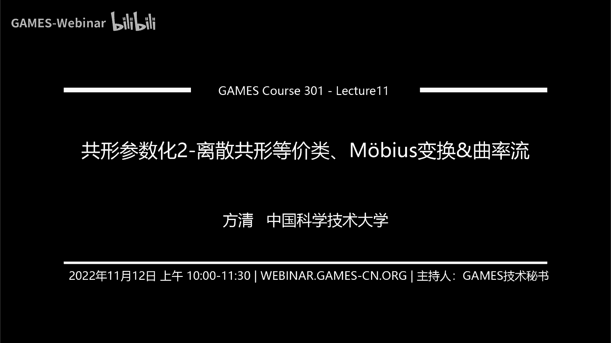
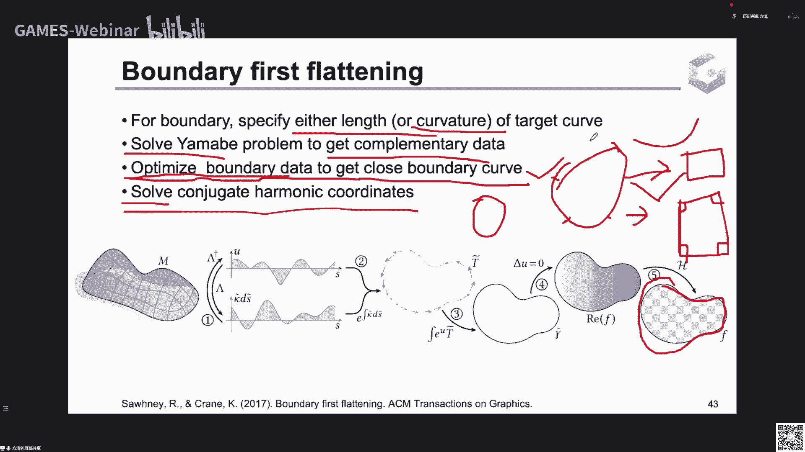

# GAMES301-曲面参数化 - P11：Lecture 11 共形参数化2-离散共形等价类、Möbius变换&曲率流 - GAMES-Webinar - BV18T411P7hT

啊那现在时间到十点了，那我们开始今天的这个曲面参数化专题的这个第11讲，过程参数化，第二第二部分，然后我们在第十讲里面讲了惯性参数化，它在映射微分方面的一些性质和离散化的算法，然后再这一讲里面。

我们会介绍共性映射它在曲面的黎曼度量上面的一些性质和研究工作，这个曲面度量它其实是一个类运的一种表示，就是如果你在映射微分上面去看，你需要有一个旋转轴，你需要就它涉及到在空间中的那个切向量的旋转。

它需要有一个旋转轴，那这样他就必须涉及曲面的在空间中的嵌入，而度量的话它是不需要的，它其实是曲面本身的性质，这个我们后面还会详细介绍，然后这里面的算法主要是逆散共性等价类以及群内流的一些工作。

然后莫比乌斯变换，它其实是也涉及到前面微分的性质，但是他在这里面也涉及到度量方面的性质，所以我就放在这里介绍了。

然后首先我们来看一下今天要讲的内容，结果就我们在第一部分就是介绍光滑曲面上，用黎曼度量表示的这个共形变换，我们将强调这个表示是内运的，然后它主要在这里面，我们要揭示曲面的一个类运的高斯曲率。

和这个黎曼度量在共性变化下的一个关系，然后我们今天的核心内容其实就是这个关系，用这一个高斯曲率和你们度量的这个方程来做一些算法，然后在第二部分我们就会用这个把这个黎曼度量在三角网格上离散化。

它其实就是这可以表示成网格的边长变化，就是在共形映射下这个网格三角形，但每条边的边长应该怎么变化，然后在这里面涉及两个就是重要的一个共形等价类的就是定义，第一个是在每个顶点上面去定义一个对数过去因子。

第二个就是说你每一条边它还有一个相邻的两个三角形，相邻的两个三角形，它会有一个就是如果是内部点，它会有相邻的两个三角形面，然后在三角形面上面，它有另外的两条边，就是每个三角形又有另外的两条边。

不是这条边，然后用这另外的两条边，两个三角形就组成四条边，这四条边的一个长，度的交叉比去定义这个共性等价类，就是说它要满足一个什么样的关系，才能是之后的就是满足那个关系的三角形。

那个三角网格跟原先的三角网格是彼此共形等价的，就是相差一个共性变换，然后第三部分就是面源上的莫比乌斯变换，面源上的五比五斯变换，它就是如果在单个复平面上看他一个莫比乌斯变换，它就是一个整体的一个同步的。

但是你在面板上，你也可以定义每条每个三角面上面的各自有一个莫比乌斯变换，然后那这样的话他们彼此三角面片之间它是要满足一，个约束才能达到一个整体的共性变换，在后面我们会详细介绍。

第四部分就是曲率流的方法来依据曲率来求解你们的度量，就是我们要用到第一部分主要讲的那个高斯曲率，和你们多用点的那个方程去解那个方程，来求解我们想要的给定曲率的这个里面的度量，然后来做一个参数啊。

然后我们来看一下第一部分，啊第一部分在第十讲，我们已经讲过它的那个映射，微分上面的一个最关键的就是它每一个局部都是一个相似变换，就是共形映射，在每一个局部可以看成一个旋旋转和一个伸缩的一个负荷。

然后如果如何去表示旋转的话，在平面上我们就用负数去表示，就是你一个向量方向向量你可以用负数表示，然后它乘以一个负数，就是对它进行一个旋转和伸缩，然后在空间中我们是用四元数去表示，就是这个方向向量。

你把它变成一个四元数的一个虚部，然后它绕某一个轴，是某一个方向轴旋转c塔角就可以对它乘上一个四元数，组成一个四元数的和右乘一个四元数来表示它的一个空间中的旋转，那这些就是需要一个旋转轴。

它需要考虑到曲面在空间中具体是什么样子的，它的切平面和它的法向是什么样，它就跟曲面跟空间的一个关系是必必必须要借助的，然后那有没有其他的方法，就是不需要看曲面和这个空间的关系，有就是从黎曼度量。

就是指从曲面本身的一个性质，我们来解释一下什么叫从曲面本身的这个性质来看这个贡献印刷，首先我们需要解释一下什么是黎曼度量，然后你慢度量，你可以把它它是一个在定义在曲面上面的一个对称。

正定的一个双线性函数，他的那个定义是它的切平面上面的两个切向量，你可以把它看成这个切向量的内积，你就可以把这个黎曼度量看成切向量的内积，然后它满足它对一个任意的部位零的切向量。

然后任意就是切平面中任意部稳定的切向量，它的黎曼度量就是gp x x是大于零的，然后那这样的话我们这个长度其实就是对gp x x进行开更换吗，如果是累积的话，就是简单的这个gp x就是x和x的累积。

就是它的模长的平方，然后如果对于任意的切向量xy，这个gp xy是的平方，是小于等于这个g就是你慢度量的xx和成你慢度量y y就是gp x y，它除上x的模长和除上乘上y就是除上x和y的g的这个地方。

它是在-1~1之间的，这是由那个不等式来决定的，就是那这样的话我们就累积对应于内积，就是这个夹角，你对它求阿cos，你就是这个切向量之间的夹角，那为什么要就是以用这个里曼度量来表示这种类型。

就是你可以把它衍生成一，个双线性的一个你就理解成一个双线性的一个函数，那这样我们对x和y对切向量做一个线性变换，我们就可以把它看成我们来找一下比啊，我们对x和y做一个线性变换。

我们就可以看成它这个线性变换是反作用于在这个你慢度量上的，因为它你慢度量是双线期，你给它复合还是一个双线基函数，那这个新的里面度量就是在xy上面去定义的。

然后它还是是映射到那这个新的你慢度量和原先的那个双向行进的，原先的那个里面度量双线性函数它是满足在共性映射下，它是满足这个关系，它也是他理解成这个映射之后的这个向量之间的这个累积啊。

映射之后的向量内积在这个共性变换下，因为共性变化是一个相似变换，它是一个旋转加伸缩，再加一个旋转，df y也是对y这个向量进行了一个伸缩架旋转，而c它的这个d f x和df y这个夹角内基的这个夹角。

它在这个共性变化下，夹角是不变的，所以它这个变换后的度量跟原先的度量就差了一个s的平方，就是对这个每一个向量进行，每这个局部进行一个伸缩的这个s的这个平方的这个量级，然后那依据黎曼度量的这种表示。

我们就是说我们对xy做共性变换就可以表示成对，这个度量本身去做一个变换，那这个它的等价形式，就是这边我们是用这个共性变换去推这个里曼度量，就是如果你这个它是一个共性变换。

那这个里面度量就肯定满足一个新的灵敏度量，等于旧的这个灵敏度量乘上e的二拉姆达，这里面我们用e的阿拉姆达去表示s8 ，用这个指数的形式，因为s81 定是正的嘛，伸缩它基本上都伸缩，它这里都是大于零的。

我们不考虑退化的情况，那这里面我们用e的啊拉姆达，这个二就是对应的这个啊这边的平方，所以拉姆达其实就是log，然后，这里的拉姆达我们称为对数共性因子，这样的话拉姆达就是从负无穷到无穷的一个空间。

就是就是一个区间，你就可以从负无穷取到无穷，就没有那个大于零的那个限制，我们去取对数，这个如果是你满足共形映射它的这个你慢度量的变化是这样的形式，你满足这样的形式，它其实也可以推出它是固体形式。

这里我们就不去推它的反方向，所以就是在里曼度量表示下，你要表示一个共性因素，就是说它原先的这个你们班多长，他对每一个点乘上一个对数构成因子的e的r那么大次，幂，然后就乘乘上这个倍数。

然后就是新的灵敏度量，然后他们两个是彼此是共性的，然后那黎曼度量它主要衡量的是一个曲面内蕴的性质，它是在与曲面在空间中的嵌入式无关的，这个怎么解释呢。

我们就考虑我们在这边给了一些曲面在空间中的一些等距变换的机子，就你考虑一个足球，你把它它如果是别的就是气，你把他的气放掉，然后给它做一个压缩的话，它其实是在曲面的每一个点处。

它的相对在曲面上的距离还是保持逐渐的，但是它在空间中的这个嵌入就是空间中的具体的形状是发生改变，这个易拉罐也是一样的，你对它进行一个压扁的话，它你在上面选任意两个点去找它的这个距离。

跟它原先的这个上面的这个距离它是一样的，也就是说这样的距离一样，就意味着他们这两个曲面的这个每一点的距离一样，就意味着这么两个曲面的这个里面度量是一样的，但是它们在空间中的具体形状是可以变换的。

然后下面的这个环带也是这样，你可以对还贷进行一个翻转，在空间中进行一个翻转，它在空间中的具体关系它是变化的，但是在这些的变化下面，你慢度量都是一致的，也就是说你他的共情，如果你考虑的是共形变换。

你会对它乘上一个e的每个地方乘上一个e的阿拉姆达四方，它我们不需考虑它在空间中在具体的形状，我们只用考虑它点曲面上的任意两个点之间的这个距离，它是一个什么样的形状，我们在参数化里面，如果我们错参数化。

把它的这个去求到一个平直的平坦的那种度量，我们就可以继续这个度量，直接把它放到平面上，后面会解释怎么去做，我们只关心度娘，不关心它在空间中的位置，那我们现在就要解释，就介绍一下曲率，曲率的话。

曲率的这个概念就是我们先介绍一下法曲曲面上的曲线，它的曲率在曲面法向上的投影，那就是法曲它只跟曲面的这个切换相切，就是切平面，比方说这个点上有个切平面，然后你在上面去选一个切方向呀。

我们这个法曲率衡量的就是这个切方向的这个弯曲程度，这是在微分几何里面的概念，然后你在这个切平面上面，这个平面上面会有两个互相垂直的方向，其实它是表示它的主曲率方向就是互相垂直。

它们分别是法取你的最大和最小值，就是最大的这个法取名和最小的法区域表示两个主曲的方向，然后高斯曲率就可以表示成这两个主曲率的攻击，而平均曲率表示成这两个我取名的求和，然后高斯曲率跟黎曼度量也是一样的。

它是一个类运的量，它是只跟数量有关，只跟曲面上面任意一点点的距离有关，它跟曲面在空间中的形状没关系，比方说我们以这个圆柱为距离，那还有一个就是如果是平面，就是我们对这个圆柱进行一个剪开。

你可以很自然地无扭曲的给它直接摊成一个平面上的一个局，我们比完之后，它是一个开局面，我们在这剪开，我们就可以很自然地给它摊成平台上的句型，也就是说你做参数化，其实就是想让这个曲面上面的这个曲率。

让他在除了边界上内部都是你，除了边界上内部都是你，如果他边界的曲率它是可以不是零，内部都是零的话，那我们就可以很自然地把它放在平面上，没有任何扭曲，不关心它在空间中的前，所以大概含起奶皮，这就是参数化。

就是用圆柱和平面的矩形的这一个例子来解释参数化，那在关于用黎曼度量和那个黎曼度量下的这个共性变换，表示的共性变换，它有一个很重要的这个定理叫曲面归一化定，单指划定曲面单值化定理，讲的就是。

我任何一个曲面都可以共情的等价到，它拥有一个长指的高斯曲率的一个曲面上，怎么解释呢，就比方说我对于一个拓扑同胚于球面的一个模型，就亏格为零的一个兔子，然后我们就可以存在一个共性变化。

就可以找到一个共性变化，把它变成这个曲率，高斯曲率为常值长值，如果这个球它的半径是，那它的高斯曲率就是r方分，之一高斯曲率就是r方分之一，就是它在整个曲面上都是长指，这样你大方分之一乘上它的总面积。

在上面的积分就是斯派，就是这个群体和，那我们就可以它的这个单值化定理，就说明我们这个曲面它是存在一个共性变换，能够把它共享到球，对于拓扑同归于圆盘的例子也是一样的，就比方说对于这个人脸，它有一个边界。

然后内部是联通的，断联通的，那我们可以把它拓扑同归于平面上的半径为小二的一个圆盘，这是可以做到的，这不就是相当于做参数化吗，就是你找到一个新的这，个找到一个共性映射。

然后这个共性映射又诱导的这个新的里面重量，它的高斯群里就等于这个圆盘的这个高斯群里分布，然后对于这个torres的话是一样的，你可以把它沿着这个地方绕一圈给它剪开，沿着这边去绕一圈给它剪开。

然后你就可以给它平铺到平面上面的一个矩形区域，然后对于更高的话，它需要用到这个双曲双曲度，这个我这里面我就不解释了，感兴趣的可以去看看，但这个就比较复杂，也需要一定的想象力，就是赚取足量。

就是他跟体面的这种平直的动量不一样，它是用，这种双曲的进行来定义的，它的这个值在这上面的测地线直线就是最短的距离，它其实是一条曲线，这个我就不做详细的解释，然后曲面单值化定理。

它的作用就是它描述了共性映射空间的空间有多大，任意一个曲面我们都可以给它共行映射到一个点范域上，它的核心作用，第一个就是我们可以把它参数化到点环境，比方说给了一个平面上面。

给了一个空间中拓扑同归于圆盘的一个曲面，我们就可以存在一个过程里面映射，可以把它映射到这个啊单位圆盘上面，单位圆盘下面那个，那我们只要找到这个共性，一生我们就做了一个共同参数，比方说我给了你两个形状。

给了你两个形状，然后我们可以把它同时都各自找一个共性面试，去把它映射到曲面的这个半径为r的一个圆盘上，那这两个共性映射的复合，你就把它可以把它这个共性是复合成这个共性映射的逆。

就是从这个映射到这个映射这个右边这个形状的一个过去式，就做这个交叉的一个共性参数化和取名对应，这边给的是一个球面的例子，就是它是以它，的具体应用是一个以你去研究人脑功能区，就是人老他的大脑不同人的大佬。

他的沟壑深浅是不一样的，然后它的对应的形状也不一样，如果你要去研究整个群体的那个大脑的这个功能区的对应，那我们肯定要建立人脑之间的区域之间的一一对应，建立区域之间的一一对应的话。

我们就可以把它用共性映射，把它映射到一个球面上，下面的也映射到全面上，然后把这两个全面上上面去做匹配，然后让他们的扭曲尽可能小，也就是说看上去尽可能一致，也就是说我们会把这边的沟壑。

跟这边的沟壑尽可能的对应上去做一个功能区的对应，去做人脑的msn的研究，这是一个应用，那如果用这个就是用这个曲面单值化定理来求这个共形映射，它最关键的就是求一个到点范域的一个参数化的算法。

我们这里面拿拓扑同胚与圆盘的人脸来举例，它就是我们要求一个啊到半径为r的这个圆盘，它的一个共性参数化，这个的算法的核心观点就是说我们可以去，如果我们要把它供您参数化到半径为r的圆盘上。

它的这个半径维尔的这个圆盘的区域分布我们是迟到的，它的内部的高斯曲率应是零，它是二分之，一也就是说我们要求一个共形映射，就是共性变换e的二拉姆达方作用。

在这个原先的里面度量上形成一个新的里面指的在这个里面度量下，他的这个高斯曲面是满足这个原版的高斯曲面分布的，然后一旦我们求出来的这个对数公平因子的拉姆达，知道了这个新的黎曼度量记一品。

尽管我们可能不确定它在空间中的形状，它可能是这样的一个弯曲的，很弯曲的形状，我们不需要这种分的情况，我们也可以很无扭曲的把它摊平到圆盘上，这个在对于你三大广告上就是去做一个三。

角网格的那种广度优先的那种便利，把它摊到这个网络上，就每个三角形确定一个三角形，然后按照它的一领域去一个个去往外扩，然后把这个三角网格直接摊平到这个平面上就行了，那么后面会讲具体的算法。

也就是说我们要做这个工参数化到点搬运的算法的这个流程，就是我们去求一个这个核心的这个number，主要求得拉姆达，我们就知道了目标的这个动态，知道了目标的度量，我们就可以用平摊的算法给到他们到平台上。

那为了介绍这个从这个曲率去求这个拉姆达，我们就要介绍一下这个高斯曲率和这个在共情变化下面的这个关系，就是在这个随着这个拉姆达的变化或高斯群里会有一个什么样的变化，我们首先要介绍一下这个局部等于坐标。

局部等文坐标是一个什么样的概念，就是对于流行上面的，你就是黎曼流形，黎曼流形上面的任何一个点p我们都可以找到它的一个领域，然后去找到一个他的一个局部参数对标。

使得它的这个领域下面的这个你慢动点满足一个这样的形式，这这样的写字我们就称它是一个局部等分坐标，为什么要用一个这样的形式来介绍，就是为什么要特殊的这样的形式很特殊。

后面会说明就是这样的形式来计算高斯曲面的话会很方便，就是我们知道对于就是微分几何的话，你对于曲面上的一个点，它的这个你慢度量都可以写成e d x方加2f d x d y加g d y的。

这就是曲面的这个呃第一基本型吗，然后但是我们要把这个dx d y消掉，其实就是对这个xy去做一个参数变换，然后使得它等于dsp和dt是等于dx di的一个线性组合，然后把这个i f的这一项消掉。

然后使得e和g又是相等的，就会变成这样的一个形式，就是通过这个这个引领，我们就知道一定是存在一个这样的参数变化，就是我扔给你一个空间中的曲目，它的第一基本形式是这样的。

我们都可以选择一个跟e f g有关的一个xy到sp的一个参数变化，那它最后变成一个这样的一个形式，就第一基本性变成这样的一个形式，打回来了，这样的，一个形式的这个参数的st我们就叫做等文做标。

然后在这个短文坐标下，高斯曲率就可以有非常简洁的表达形式，就是他用到的是正交坐标下正交坐标网的这个高级群计算公式，然后这里面e就是e在r一塔次方，g也是一在二一塔次方，我们直接带进去就行。

有带进去就可以把这边要化简，就是负的e的r一塔分之一，然后乘上e它关于t的二阶导，它就是在平面率上面的这个一塔的拉普拉斯，乘上e的方案一就可以写成这样的形式，然后如果我们有一个共性变换。

就是在这个曲面上，我们定义了一个新的共性变换，它每个点处会对它进行一个对数过程因子，就是对数过程因子乘上一个一打二拉姆达方，就会把它变成一个新的问题，新的曲面，然后这个新的曲面的这个高斯曲率。

我们也可以把这个一达拉姆达乘到这个e的r一塔上面去，他在新的高斯曲率就是把你一塔等于一的一塔加拉姆达带进去就行，就是e的负的2e大加拉姆达，然后e打加拉姆达这个函数的拉普拉斯，相机作用。

然后呢这个新的高斯曲率跟原先的高斯曲率的关系，就可以对它进行一个拆开，提一个e的负阿拉姆达次方出来，因为这个阿达纳负e的阿拉姆达是我们作用的一个新的过程变换嘛，然后这里面的这个负的e的r一塔。

拉普拉斯一塔，它就是原始取名，沿这个曲面上面的取名叫k，然后这边的这个负的r一塔作用拉普拉斯拉姆达就是你的这个拉姆达，然后再乘上e的括号，一发四往上伸缩，然而它这个作用就是在这个原始曲面上。

就是在这个曲面上的哪款4g这个点还是曲面的，这个度量是一般重量是几，就是在这个曲面上的拉普拉斯作用在中，所以这一个关系就是我们就很容易的就计算出来，在就是你慢度量在这个共情变化下作用力的阿兰达四方。

然后他的新的高速群k一品和原始的高速群k满足一个这样的单词，这个就是养马比方程是一个非线性的评分方程，然后对于在边界上面的这个曲线，因为它带边界，它的测地曲率也是有一个类似的关系。

它的边界就是对于曲面上面的这个边界的这个曲线的测距距离，它的计算公式是由纽约公式给出的，然后我们这个e和g还是在这边的这个一塔，然后dc td啊，c它表示的是这个你把它映射到这个平面镜上。

在平面这个参数化上面，这个曲线这个边界曲线它随着这个s和t的这个变化的这个夹角，那其实就是这个平面曲线上面的取，你代入计算就是负的一一乘上这个平面曲线的这个区。

然后减去这个一塔在这个平面曲线上面的这个法向上面的导数，然后如果我们对这个曲面带边界的曲面作用一个共性变换，就是对他的权利，对他的啊黎曼度量作用一个新的那个特殊公平，因此e的兰姆达四方。

那它新算出来的这个边界上面的高，那个测定距离要满足这样的一个形式，就是把一塔换成一大家拉不拉就行，然后这样我们就可以跟之前的高斯取名一样，得到它的这个侧立群变化和变化前的这个关系，就是变化后的测地区。

每天一撇是等于e的负拉姆达乘上，括号里面是变化前的群减去这个拉姆达，在这个流行上编于这个关于这个n的这个法向，我们就可以得到这个描述这个曲面这个群率和这个他在共形变换下面，这个的对数共性因子。

拉姆达对应的这个共情变化下的这个新的曲子和原始群，以及它的这个对数因子的这个关系，它是一个，嗯偏微分方程就是拉姆达的拉普拉斯，然后这边会有一个一的阿拉姆达斯，它是一个非线性的一个微分方程。

然后那我们去求解一个参数化，去求解一个参数化，就是需要我们比方说把这边的一个拓扑同胚于一个圆盘的一个局面，我们想把它参数化到半径为二的圆上，那我们就是给了一个这个半径为r的这个群，给了这边的k一撇。

把策略群小开局就k一撇，他家内部就是你在半径为r的话，小k一撇就是1/2，给了这个，我们要去求他的这个共形变换，也就是去求这个单位的，也就是去求解一个这个评分方程。

这样的话我们怎么去求解这个非线性的平衡等等，后面会介绍局域名的方法，在这里面我们就是先理论部分就到这，就是他的这个主要先到这儿就讲一下它的这个非线性的这个微分方程。

描述高斯曲率和测力取决在公屏变化下的这个关系的方程，然后我们会介绍一下黎曼度量在三角网格上面以上化，因为曲逆流在后面也会用到这个，我们把这个放到前面来，对于光滑的曲面的。

它的黎曼度量就是它表示的是切平面上面的切向量，两个切向量之间的内积，所以你在你给了他的一个切向量，你去算它的一个长度，就可以用它在里面度量啊，x x然后给他开一个根号，就是它的长度。

那你的这个光滑映射下的这个你们就是共形映射，对这个曲面的这个黎曼度量乘上一个e的阿拉姆达次方作用的话，那它的新的这个切切向量的模长就是原始的这个模长乘上去的啊，那是直接把这个带到上面的式子就可以得到。

就是说我们对原始的这个向量的这个模式进行了缩放的1。2，兰姆达x方便就得到新的这个新能源，那在三角网格上离散，我们就可以把这个切向量的这个离散看成这个边的边长的一个关系。

就是我们对每一条边它都有一个编程在共形映射下，就是说我们对这个编程对它作用的一个e22 拉姆达i加，拉姆达g的平均就是二分之拉姆达尔，那就是我们把对数构成因子作用在定义在每个顶点上。

那这个边长的这个变换，它既与这个点这个点的这个放缩有关，也与这个点的放缩有关，所以我们就这个编程，我们就定义成它的平均，就可以这样的简单理解，但是通过这样的离散的度量之间的这个啊固定变换。

然后另一种通过那个刚刚的，我们可以在顶点上面定义这个对数模型因子，也可以通过这个叫边长的这个交叉比，来定义这个两个网格是不是满足共性映射，就是存在共性映射。

它和上面的这个在每个顶点去定义对数更新因子是等价的，就如果我们的这个新的网格，它跟原始的网格是满足存在一个网格顶点上定义的对数，共形因子的这个边长关系，我们可以去算它的交叉比，就是di键的这个交叉比。

我们就可以选取它的这个k i这条边，这是第一个边，然后乘上mg，这是第二个图，然后除上mi，这是第三条边，然后涂上这个jk，第四章，也就是说你第一条边的边长乘上第二条边的边长。

除上第三条边和第四条边的边长的这个嗯延长的机，然后这个交叉比在共形映射下是不变的，就是如果我们有任意的一个共性，就是离散的这个过程是那这个交叉比它在过年时前后也是不变的，和他和上面的这个等价。

其实很好证明，就是我们如果把上面的这个式子带进去，如果存在一个每个顶点有一个那么大那么大p，然后新的边长满足这个关系，那c i g新的交叉组带进去。

我们就可以把这个上面的这个旨意的这个指数幂就可以把它加起来，就是那么大，k加那么大，a加那么大，也m加那么大，c下面也是一样的，就正好消掉，然后就等于原先的就行了啊，从下面去推上面。

他们两个等着下面推上面，它也很简单，就是我们可以去定义对每个三角面片，我们去定义它的这个拉姆达i j k，比方说我们对于三角形i j k来说，我们对它的这个在a点的这个对数工艺的因子。

我们可以定义成这样的形式，就是我们可以定义它在几个新的编程i l l i j一品乘上l i k e p，然后除上，然后j k一撇就是这条边乘上这条边，除上这条边，然后新的边长的这个主张。

旧的边长的这个曲和logo就是这个三角形，这是上面的这个在这一点的这个对数名词，然后对于im g而言，也会有一个这样定义的这个对数因子，对数的共性名词。

就是这条这条边乘上这条边除以这条边口上这个顶点的对比，它的两个邻边除上它在这边，然后在这个新的编程，然后除上原原式的编程，取log就是它这个三角形就可如果他对于i界满足这个交叉比不变。

我们就可以证明这个三角形的这个这样定义的，这个对数共性因子和这个三角形在这个顶点这样定义的，最初混进一次，他们两个是相等的，就这两个值是相等的，也就是说如果我们这边还有一个三角形，通过这条边的交叉比。

是在这个映射价保持不变，我们也可以证明这个三角，形定义的对数共形因素，这一个点在这个点和这个三角形在这个点的这个过程，因子的计算是三等，比如说它一领域我们都这个对数更新因子是一致的。

也就是说自然而然就可以推出它的最后的这个是满足一个这样的形式，比如我们现在说的这个离散三角网格上面，它定义了两种共性等价，第一种就是通过对每个经验去定义一个对出工程进行解。

也就是说每个顶点它的一个放缩程度的那个对数，然后也可以定义这个对于边来说，他的这条边这里面我是用的是一第一条边，比方说i j是1x2除上单3x4，你也可以用3x4÷1x2都行，因为它的导数也是长指。

它的导数在变化，相应数不变，你只要是它的相对的点，然后除上另一边相对的点就行了，然后呢我们去优化一个共性映射，就可以去表示成优化，如果我们就是第一种方法，就是直接去优化这个罪行对数共性因素。

第二种方法就是去约束那个交叉比，在公映射前后之间，我们先看一下，第一种方法就是优优化这个对数问题，因此我们可以把对数公性因子下面作用的这个新的这个边长，看成这个对数工性因子的函数。

然后它的每一个角的话就是新的边长，用这个余弦定理就可以求出来这个新的三角形的内角，然后如果我们要把一个三角形网格，把它参数化到一个平面区域上，就是说对于内部的顶点，它的这个角度一圈的这个求和要等于二派。

然而对于边界的顶点，它的求和要是等于边界上面我们给定的一个角度，就是我们可以指定边界上面的一个形状，它的角度是多少，然后那我们就是把这个角度看成这个拉姆达的一个函数，我们优化一个如下的一个能量。

它这个能量是一个凸的能量，一，这个能量是一个凸的能量，这边的这个f t f是一个比较复杂的函数，我在这里面就没有写呃，大家感兴趣的话可以去看这篇文章，它里面的推导比较复杂。

我在这里面就缩料缩写的就是对于这样的一个定义的一个通常量，这个ti键就是这条边的边长的取对数，定义成t i j j i j也是关于这个对数攻击因子的函数，因为这边的边长是关于最初的因子。

这个就是整个伊拉姆达就是关于拉姆达的一个函数，对应的一个这个能量，然后这个能量是一个凸能量，它关于拉姆达的导数，就是下面的这个形式是可以用那个链式法则去验证，具在几何上面去求梯度。

有关于兰姆达去求梯度啊，等于这个形式，然后这个图能量的全局最优解，那就意味着这个导数这个梯度等于关于拉姆达的梯度，等于也就意味着这里面的这个求和的这个形式，要等于我们给定的这个r8 a参数。

这里面如果fa就是对于内部点，我们就肯定如果要求它映射到这个平面区域的话，它内部点的这个r8 我们就设成二派，对于边界点的话，就是我们给定的这个决定的这个，表态i。

那我们只要去优化这个能量的这个找它的全局最小值，那我们就找到了这个拉姆达i，使得它满足这个平面参数域的这个角度的限制，也就是说我们找到了这样的一个离散化的一个对数共形变换。

使得它我们产生的这个内部的每个点都是up拍边界的点，都是我们要求的角度，就把它参数化到一个平面的形状等级来，然而这里面有一个问题，就是它会有一个可行域的问题，就是你对于一个。

边长比方说我给了你三角形的边长，然后我们对它作用一个对数共形变换，但它的新的三角形的变成必须要满足这个三角不等式，如果他还不满足这个三角不等式，它就会这个三角形就会极端的退化。

比方说右边这个你的i如果你的l i k一撇加上l k j一撇，正好等于l l g一撇，那这样的话如果正好等于，那这个就是这个角i k j这个角就是派，然后他就接近破坏了嘛。

然后这个i这个点的这个角和借这个点的这个角就是零，那如果我们要避免这种，就是你在优化中这个区域它是一个这个约束，其实是一个推出的一个结构，它主要的一个形状是这样的一个形状，如果我们在这上面优化。

就很容易去碰到这个这个边界上，我们就可以把它这个区域给它进行一个延伸，就如果我们的这个边不满足三角不等式，我们就用这一个退化的这个情况的这个角度给它限定词。

我们接上c它这个它的这个k就是i角i kg这个地方就让他给你拍，然后让这两个角等于就对它做成一个延伸，对这个定义域进行一个整个平面上面，然后在这个上。

面去优化就可以考虑不考虑把这个三角不等式这个约束去掉，然后我们优化这个算法的话，我们就可以用这个梯度下降，第一种方法是用梯度变化去优化这个充能的，就是你选择一个下降方向，是得到爱是这个-7度管的。

然后你需要用细一个线性搜索去搜索一个步长啊，一个小的过程，然后沿着这个去改变这个难不难i，然后使得能量是单调下降的，这样的话用梯度下降法一定是能够找到这个同等量的乘积最小值，当然你也可以用二级方法。

就是用牛顿方法就是去求这个能量，的这个hension，然后对它进行一个对它负梯度这个方向进行一个校正，然后沿着这个方向加强，用r解方法用到了它的恒生信息，下降的话可以更快一些，当然之前也说了。

我们是在这个整个我们把这个区域进行了一个延拓，然后在这个区域上面去求解我们想要的这个拉姆达，然后我们求解的拉姆达可能是会跑到外面去的，就是它会违背这个三角不等式，每个人的三角不等式的话。

我们如果用这个拉姆达去算出来新的这个ok，它就会出现这样的很极端突发的情况，就组成不了一个三角形，那在这样的情况下，我们就要对它进行一个边翻转，就如果你原先的一个四边，原先的那个四边形是这样的。

这边是k这是ig，然后原先这边你会有一条边l i g，然后这个三角形是退化了，如果三角元要退化，然后我们要在退化后的那个三角网格上，如果要避免这种情形，一个符号的方法，我们就是把这条边给它进行一个翻转。

这样翻转后的这个三角形它就又不是退化的，人，就会把这个原先从这个它的可行域，它在这里，原先的这个点在这，你做一个翻转，它就又走到了可行运算的内容，然后我们就可以对最后求出来的这个嗯最优解的这个拉姆达。

然后他算出来的边长如果不满，我们就对它进行一个翻转，翻转后的边长，我们就要算这个新的l k m就是在原始的这个tm上面编程，我们在城上它两边的这个对数公平因素就是新的编程。

它是满足这个三角不等式的这种关系的，就是如果不满足，我们再去找他的那个转转，就是违背的那个反转，当然对于这边我画的是一个平面的情形，但要考虑到这个曲面它是嵌入在空间中的，比方说我这边给了个例子。

就是这个啊这个正方体网格上面分别有这样的一个三角形面片构成，右边的这个三角形的这样构成，如果我们要对它进行一个h f一吧，其实我们是要去找他的这个在空间中去做它的这个分析，我们对ab边。

比方说我它这边是已经旋转了很多，如果这边它原先是这样的一个形状，就是这个三角形是先是这样的三角形和这个三角形，我们要把ab边进行一个翻转的话，就是把它要翻转到在这个曲面上去找它的测定值。

就是你要把它摊平，然后去连接这个c的这个直线，才是我们求的这个l k m就是如果你把这个这边就是lc，就是它原始的这个曲面上的这个c到e的距离是在曲面，上的距离在这个三角形网格上面的距离。

而不是c点到b点的这个空间中的距离，那这个就是你要对这个所有的三角网格上面，对这个c点到一点去求一下它的测定定理，这不是可以用波形的，或者用其他的方法来求的，然后这样你把这个距离求出来之后。

你再对这个用这个拿不拿，然后作用上去，如果是出现退化的情况，你要对编剧行反转，翻转完做一些有限规的这个操作，你就可以得到一个不退化的一个三角，这个三角网格跟原先的三角网格。

它在数量上面是相差一个共形变换，的，但是它在拓扑上面的，我们是要对它进行一个翻，有一些翻转的一个操作，就是他们的连接关系，因为我们这个局部翻转导致的不一致，但是它的这个重量基本上还是满足。

这个在这个顶点上面去定义这个对数均值，对数关系因素，那诱导就是公平的，就是他们在动量上，每档中量上很难做一个公平的标，然后上面我们讲的就是去直接优化那个对数共性因子。

就离散网格顶点上面定义的对数性共性因子来做曲面参数化，参数化掉屏幕，当然我们也可以去直接约束这个边长的交叉比，去这里面我们举的例子是一个曲面变形的，这篇文章做的是曲面变形。

就如果我们这里面就是你如果一个网格它在离散的这个共性变化前后，它的这个交叉组是一个长值，我们在这里对这个交叉体取了一个对数，也就是说log ci键是等于这个tk i就是它的边长的取log啊。

去满足这个线性约束，然后在这，个长制约束，那么它的这个变换后的这个网格等变换前的网格就是一个关心变换，那我们就是对如果对网格做一个共性形变的话，我们就是去优化网格的顶点位置，然后使得它满足这个线性约束。

优化顶点位置，使得它们满足这个线性约束，取logo的这个对数，把它当成顶点位置的这个函数，我们就可以把这个t的这个增量可能写成这个甲壳，比一个全上v的这个增量的一个形式。

然后你minimize这个uv的这个最小值，你就是就是，minimize这个能量在这个映射家里买的话，就是去求一个他的这个点，然后这个就是最小值的这个点。

使得这个点的梯度是跟我们想要的这个v满足的这个约束的，这个梯度是垂直的，就是如果你满足这个梯度跟它是垂直的关系，那么你算出来的这个你在这个空间下你就找不到下降方向。

所以这里面我们就可以用这个投影的这个qq下降，然后去优化这个能量e，这是用直接约束交叉比的方式来求这个最小化怎么样，然后这篇文章给的这个例子就是他去优化一个最小化一个will mod。

然后使得这个形形状只能在贡献情况下变成一个球面，然后它的能量显示是这样，加了刚刚的那个嗯交交叉比的这个约束，它会产生一个跟这个原先的网格是一个共形映射，共形等。

价的一个网格如果不加约束去优化这个把它变成穷面，它的网格的这个角度扭曲就会很大非常大，然后讲了离散化的这个度娘，就是通过那个对数购物性因子和电源厂的这个交叉比去定义的。

这个对数就是网格的这个理想的过程映射，我们接下来就讲一下这个分片莫名次变化，里面的sql p就是保持夹角，然后以及我们刚刚讲的这个保持交叉比，它都可以做到，所以我们再把它放到正价。

然后什么样的是一个莫比乌斯变换呢，就是它是定义在一个扩充复平面到扩充复平面上的一个映射，它是一个分式映射，我们把它当成一个复数负数表示的话，就是a乘a加b除上c乘c加d。

然后这里的a d b c都是一个负场数，它首先要不等于零，为什么要求大，不等于就是如果我们的a乘b等于bc的话，那这个映射我们可以对它上下同乘一个c，然后做一下调换的话。

就可以得到它是把f对于任意的一个扩充复平面上的点，都会把它印到c分之a，所以我们不考虑这样的影响，因为它把整个平面映射到一个点上面去了，然后这样的一个变换我们就称之为莫比乌斯变换，它是一个线性游戏。

就是一阶线性的这个除就是分式变换，然后它可以分解成下面几个变换的复合，就是任意的莫名如斯变换都可以分成一成，下面这个变换的第一个变化是平移，第二个变换式伸缩就是对z进行一个旋转以及伸缩。

然后第三个变化是一个反应，前面两个变换都是把语言映射到圆的，它而言对它圆圆上面的点进行一个旋转和伸缩，它还是有点这个变化，也是可以证明它是把圆圆周编制到圆周的，它其实是把嗯，大家可以去查一下。

也可以查一下，这里面我就不讲，就是不细讲，他是把不过原点的这个圆，它映射到其他的圆，就是如果复平面上面这圆它不过原点，那它就映射到另一个圆上去，如果这个圆它是过原点的圆，那它会把它映射到一个直线。

就是映射到复平面上的过原点的一套图形，不是过敏，就是一条直线，然后直线当然我，们也可以看成它是一个无穷远的那个圆，就是你如果对一个圆的半径让它趋向于无穷，然后它是一个广义的盐就行。

所以莫比乌斯变换它是保持任意的圆的，就是如果我们把直线看成一个半径为无穷的一个元宝，然而对于一个三角形的话，我们就可以在每个三角片源上面去定义这个mobios变化，然后如果我们取一个三角网格。

我们取他的片源i j k，然后他的在这里面我们先用复平面上面的这个来表示，然后它的这个每个点的坐标，我们就用它的复数坐标就是对应的复数来表示，然后对它最后一个莫比乌斯变换。

就是把它从这个副本里面上映射到另一个另一个三角形，当然它这个莫比乌斯变换它不一定把这个边就是它不是把保持直线的，它把这边的边它会映射到一个弧，因为它这个边你，可以理解为半径为无穷的那个圆嘛。

你把这个圆映射到一个新的圆，它可能是一个圆周的一个圆弧，然后这边也是一样，应该知道一个月后这边也是一样一样，然后我们考虑这种分配的不明物质变化，我们都是在离散三角形网格上面做的啊。

那映射过去我们还是连接它的零点之间，在这个直接直线点去考虑这个直线点，那这样的话对于一个三角网格，他的所有的在每个三角面片上面去定义一个莫比乌斯变换，那样我们就是他一定要满足这个三角形。

它把cr v界定义的这个莫比乌斯变换，跟他在一领域的这个三角形定义的这个莫比乌斯变换，一定是要在这两个点上面是互相安，就是共和的，就是他们两个最好是能够拼上。

那在这里面我们就是直接用ai变换后的vi减v j1 p，它直接就可以带到这个莫名优斯变换里面，变换后的这个边的向量就可以带进去，就算算一下，就是变换前的这个变态向量乘上一个对应的这个负数分子。

如果我们把这个复数分子cz i加d分之一继承di j k，那在这个边上它就是di j k乘上dj ki，就是这个三角形上面的是d i j k就是i这个顶点c n z i加。

然后cc c加d就是借这个顶点在i j k上面的这个表示，然后它这个乘上的这个值就是这边的值，他一定要等于我考虑它的领域的这个三角形z3 角形i m j，然后这个点在这个领域上面的这个分片不比四变换下。

它会作用到这个三角形上，然后这个z接一撇，在这个三角形上面的这个z接一撇，减vi一撇，一定要等于这个三角形有它相邻，它是个三角形的直接p减i p，所以这个成绩一定要等于这边的这个成绩。

就是三角形i m j在i上面的这个顶点的这个，取得这个c加d的这个导数，乘上这个j在这个z键这个里面出的这个大，就是如果要满足这个分辨目比乌斯变换，你要满足这两个三角形，下面三角形能拼起来。

就这样满足一个这样的事，就是你这样才会把一个三角网格映射到另一个三角，我们能听清，离散的共性变换，那我们可以把这个定义一个负的交叉点，交叉比的之前的定义就是如果对于lg的话，就是它的第一条边。

这条边你是第二条边乘上第二条边，也是按第三条边乘积四条边对吧，就1x2÷3x4，那我们用负数负交叉比，就是zk减vi乘上gm减vz，然后除上z m减z i，然后这个z j减dk，就这个就是负数。

它的模长就是交叉比这样定义的，它的模长是交叉，也就是如果我们这个要保持交叉比，就是说它的这个负交叉比的模长作用后之后，它是等于原先的交叉比的方法，然后我们把它带进去。

用之前的那个线性约束定义的这个意d的这个因子带进去，我们就可以得到一个这样的方式，比如这个等式，这个复数的这个模长是等于一的，然后我们再结合刚刚的，如果一个三角形，它们相邻的这个三角形是可以拼接。

就是拼接性条件，然后和这个条件我们就可以得出它在每一个点，就是这个相邻三角形在a点的这个di j k，然后和这个三角形在第一个点的dmg，它们的模长是相等的，也就是说我们要满足这个它满足这个保持交叉比。

我们就要求这个每个分片莫比乌斯变换，他除了要满足这个能够拼接的约束，还要满足一个这个每个零点出的这个模长的这个约束是相等，如果是保持sql安全，就保持这个r8 e的这个角。

它也可以表示成类似于这个负交叉里的一个形式，就是可以表示转折，把wi j的这个交叉打比的十部手上，按w i j的模特去取负号，再取一个就是他的这个发音的cos。

然后在cfg里面我们要保证这个f e是夹角是保持不变的，然后结合这个分p洛比优斯变换，它的拼接保持一致的条件，我们就可以得出不是这个三角形上面在i0 点定义的这个d i j k。

然后和这个三角形在这个顶点上定义的d i m j乘上它的功率，那是一个实数，就可以推出来，如果满足这个实数条件，它就是保持这个circle insecution unless，就保持这个翻译这个加点。

那通过这个分配不比四变换在这个嗯上面，就是在每个片面上面的movies变化上面去加这些限制，就是加一些模仿这个约束，以及加上一些成绩，这个承上公开的这个成绩是属于实部的这个约束。

他就可以导致我就是可以推出来，我们之前的就是定义的这个保持交叉比的这个离散的这个共性变换，以及从这个sol ping推出来的这个共性变化，保持这个交叉这个啊外接圆的这个切线的这个角角的这个工程量。

那我们就可以加上对这个分片进行变换，加上各种各样的约束，我们加上这个保持交叉比的约束，就是这个模式约束，我们就可以定义成这个负数的这个负数乘上它的功率等，于右边的这个负数乘上它的功能，它是一个二阶约束。

然后保持一个交叉比的结束，就是它的复数乘上另一个三角形上面的功能，它是一个食指，就是他们的负，就是腹部是等于零的，就是复数的虚部，这个乘积的虚部等于它也是一个相当于一个二阶的一个约数。

然后如果我们想要既保持这个嗯边长的交叉比，也要保持这个外接三角形，就是三角形外接圆这个切线的这个角角，就是它的模长等于它的模式长，然后它成长它的共轭是等于一个，而实数的话，那其。

实就是他们两个的这个在一处是相等的，就是d i j k等于d i m j，那对于的任意三角形正片莫比乌斯变换，在正面的这个三角形就是分片莫比乌斯变换和这边的三角形的分片，莫比乌斯变换。

在这个顶点定义的这个值，那个c cc加d我不太会去cd加d的导数是相等的，其实我们就可以推出来，它是一个整体的莫比斯表，就是说它整个在所有的三角网格上面。

它的a b cd对应的这个莫比乌斯变换的这个参数它都是一致的，它就是是一个整体的莫比乌斯变换，然后这边就是如果我们要保持整体的话，基本上因为整体的目的公司变化，大家刚性强度还是比较大的。

它会把它当成一个软别墅，就让它减去它的这个模长的平方，优化这个的最小这个软约束的能力，然后那这样的话这边就给了一下这篇文章，它就给了一下这三种约束产生的定义的，产生了这个共性映射的一个情况。

对于这个这边就是a mobile as possible，就是尽可能加软约束的这个整体是一个mobile表，这边就是metrical composer，meter，combo。

就是它的定义就是保持这个lscosprite就保持这个边长的交叉比，这个就是保持这个circle的这个intersection，uncle和intersection pre，它的形状是这样。

他这篇文章就是我在这里面介绍这个跟片或比如四变换的这个情况，就是因为他记它是一个相当于他把这个整个映射给它放缩了，就是把这个也不叫放缩给这个映射的空间给他增大了，把它增大到每个三角形上面去。

定义一个mod游戏变去定义一个映射，然后这些每个三角形上面的映射要满足一定的性质的组合，满足这个性质满足这个约束，它就是保持交叉比，我们现在定义的这个离散共情，就是第二部分定义的这个离散共情的这个屏。

如果保持这个就是满足这个约束，就是我们上一讲微分，就是微分里面的这个sql端点，保持这个外接圆的这个夹角的那个定义的那个共性，如果就是两个都保持的话，就是一个整体的莫比乌斯的，所以他要用一个最强二成。

就是这里面它是一个第二，就是这一这一讲的第二部分的内容和上一讲的sql，版本的内容的结果，所以我在这里讲一下，然后第四部分就是我们讲一下怎么去求解亚麻比方程的，他的曲面流的一个算法介绍。

然后曲率流就是说我们刚刚说了亚麻比方程是一个非线性方程，就是我们如果要把这边的这个模型给它参数化到圆盘上，我们给了这个圆盘的高速群，我们要求这个共性参数化的这个拉姆达的这个因子。

然后我们要求解这个非线性的微分方程，我们怎么做，就是去用群逆流，就是说它有一个曲面的，它有对应的一个能量，它的能量是对于米奇流，就是rrich flow的话，它这个能量很复杂。

这边就是我就不做太多详细的介绍，它其实是优化一个很复杂的能量，然后对于这个能量去求它的梯度，求它的梯度，就是对这个它是基于度量对对这个度量关于时间去求导，就是这个能量沿着这个梯度下降，负梯度方向去演变。

然后就变成这个，然后这个能量再把共形映射这个带进去的情况下，它是关于这个对数共形因子，它是一个充能的，它有个全局最小值，然后这个全局最小值，全局最小值，然后它关于这个拉姆达的导数。

正好就是他们的曲率是相当的，这里面我就把特定区域跟那个快速取名，我就在这就写在一块，就是他如果测定取名在边界上还要再写一个那个测定取名的小k a p，这就是如果你达到一个最小值的。

也就是说它的这个梯度是等于，也就是说他的这个群率是达到我们就是对应的这个对数共形因子，拉姆达出的这个区域是达到我们比例的这个区域，它你群逆流的方法就是思想就是这样，就是连续的话可能不够直观。

我们直接在每个顶点上面去对比对手稳定因素，还是跟之前的那个离散的那个嗯，三角网格等价类是一样的，定义就是在每个顶点上定义一个对数共同因子，难不难。

i然后我们就去演变这个number ni就是使得它的这个高斯群，每个顶点处的高斯群，这个ki是等于我们想要的这个目标的保税区去演变它就行了，这个高斯曲率的计算公式就是他二派减去这个内容。

就是如果对于一个平面上面的一个内部的顶点，它的内角和这个角度和是ipad，所以判断高度距离可能性别，然后我们更新方式就是更新这个，然后我们需要做的就是我们给，了你一个拉姆达。

我们就要去计算它现在的在这个拉姆达情况下的这个高斯取率是多少，然后高斯曲率多少，它是二派减去那个角度和，然后角度就可以写成那个边长的这个嗯，根据余弦定理给它写成这个边长的一个表示形式。

然后边长又可以用那个对数公式，因此那个变换l i j是等于倍数，共形因子一的二分之拉姆达i加拉姆达g然后乘上原先的那个边长，然后这样带进去，这个角度就是跟拉姆达有关。

然后群里就可以表示成跟拉姆达有关的一个形式，然后我们在这里面求，就是更新了一个拉姆达，然后去更新它的编程，然后根据三角网格去求一个c打，然后根据c塔去求出一个新的k新的考试题目。

然后让我们下一步更新的拉姆达，就是用这个方式它减它，然后求一个步长，然后使得这个是曲面流，就是这样使得它这个能量预期能量是下降的，当然这里面也是跟之前讲的那个依据角度的那种低语一样的，它也会出现。

我们给了一个拉姆达，他会违背这个三角不等式，就是它这个如果你用那么大，它沿着一个平均流下降的这个方向走，就是更新这个拉姆，达不长的话，它可能会出现一个三角形，会出现退化的情况。

这时候我们就需要用到边翻转，它这里面当然我们这里面会额外讲一个另外的一个变化，这是当它退化的时候，我们再进行变翻转，然后产生退退化的情况，就是他到达那个三角网格的这个定义域，组成三角形的这个定律的边界。

我们对它进行一个班长开始造内，另一种就是我只要违背了dlna 3角形，就是如果一个三角网格，它是dla的，就是空源性，就是这个三角形的外接圆的内部没有其他三小组件，就是如果你满足了一个dele网。

格三就是就是dele条件的话，那这个三角形的质量一般不会很差，然后在这个情况下，如果他违背了他进来了，我们就对它进行一个边翻转，这样它这个边长再进来的话，它还是一个dla的，然后这样的一个好处。

后面我会讲，就是他跟这个他们两个的这个情况就是违背电脑，也就进行翻转和退化，再进行翻转，他们在整个群里流中的表现，我在后面会有对比，然后整个算法就是右边我们给的这个算法，就是我给了你初始的这个三角网格。

它的上面定义的对数更新，意思就是你然后它的边长就是初始边长，然后根据这个用去l i j就是根据l i g去算它的每个三角形的夹角，然后和曲率，然后如果这个群里跟我们要求的目标区域，它两个误差足够小。

那我们就不算，如果他们误差没有足够小，那我们就要更新这个南普达，沿着这个负梯度方向，使得这个拟器能量是下降的，这个这个你骑牛的一个问题，就是它不太好计算，那个能量就是连续的时候还行。

你算的话连续的时候不好计算，你算的话这个能量也还行，也可以计算，就是我们要保证去选这个步长t的话是那这个你其实能量是下降的，去选一个不长，然后我们就更新这个新的这个边长，就选了拉姆达之后。

我们更新新的变量，如果新的边长违背了那个三角不等式，对于任意的三角形为被三角不等式的话，某一个三角形我们就要对它进行一个边翻转，这个边发展可以用这个退化情况，也可以用对方的情况。

然后就是这样去更新这个用梯度下降方法来求解的清楚，就重复2~5，这样直接就是你每次去下降这个女性能量，然后直到女性能量达到一个最小值，最小值的话就是这边的这个梯度等于就是kk一撇减k，它的误差小于等于。

我们可以想象另一个意思有接近你刚刚我们说的是梯度下降法，当然我们也可以用流动方法，就是二阶方法，梯度下降的方法直接解方法，然后我们获得梯度下降是它的梯度是这个，然后我们有理论方法。

就是要对这个梯度对它去求很认真，通认证的话就是对ki关于这个拉姆达去求婚的，其实就对应于这个网格的拉普拉斯矩阵，然后那这样的话用牛顿法就是我们要去算一个新的下载方法。

用这个梯度方法要和和合约认证去求一个新的方向，下降方向就是拉普拉斯矩阵的逆乘，上一个特别的这里拉普拉斯矩阵它不一定满足，就是特别是对于那种封闭网格，懂了他都是质是缺一的。

所以我们这时候去求解这个下降方向要固定一个，就是它对所有的拉姆达它是相差一个平移常数的，我们要固定一个向量，就是固定一个分量，对剩下的n减一个分量去求求求你去求出来这个下降方向之后。

我们也去去更新这个步长t用那个去搜线性搜索，使得这个能量是下降的，然后右边的这个区别就是我在每一步我要去更新一个这个网格，都拿不到算计，因为你的这个拉普拉斯算子它是跟你的l网格是网格边长是相关的。

他在拉普拉斯算机人，如果就是cos界的拉普拉斯，他，是cos界c ti，它是跟你的c大是相关的，所以你每次变换这个边长，你的这个c大改变你能拿多少计算机软件，然后更新拉普拉斯算子，然后在这里面的话。

用拉普拉斯算子和梯度，用黑饪方法化解方法去校正它的这个下降方向，然后用qq用那个线性搜索决定一个，这就是你还是在这边还定了动态的这个三角化，如果违背增加，不能说就是这个就是用扭蛋方法本期的方法来进。

然后他我们在这边也就出在这篇文章，也对比了一下他们两个的区别，就是说我在，如果他这里面我们用的是没办法嘛，因为一般二阶方法都是比一些方法要快很多的，他的那个下降方向是比梯度下降的那个方向。

在那个用到了二阶信息，它的下角方向选择更好，然后如果我们是知道到退化的时候才flip，就快退化的时候才分离和，只要一违背dlging就很离谱，他们两个区别就是你如果违背了你能力就普及了。

它的flip的这个次数就会比以下降级处理的次数会高很多，但是它的计算时间却比这个时间要快很多，这是不便宜的，原因就是你如果违背的底楼与三角化，就是你，有一个很差的三角网格。

你在上面去计算你想的这个拉普拉斯算子，就相当于你去要求一个那个下降方向，这个拉普拉斯算子的这个条件数就会很差，然后你去算它的下降方向，就是拉普拉斯的e乘上那个负的梯度，去找那个新的下降方向。

你算出来这个下降方向就不一定准，那你那个就是走的那个步数就会很多，你每次要解的这个方程就会很多，你解方程的次数越多，你时间就上去，因为你只对它进行一个局部的负离子的话，它的时间是很快，那你。

每次要解一个n乘n的一个稀疏矩阵的定义的解方程，它的这个次数就会它的时间就会消耗很多，所以对于一般种牛顿方法的话，就是在顶楼顶楼违背底捞y的时候，就对大家进行一个班长是一个比较好的选择。

这样的话你得用网格的条件，就是对应的拉普拉斯算子的这个场均数据会很好，你算出的下降方向就会比较准，对于年轻的成分的资金就会很准，那你就能达到一个快速的这个慢慢下降。

然后我们刚刚讲的就是我们根据我们想要的，比方说把这个拓扑等于圆盘的这个猫脸的这个模型给它变成一个圆盘，然后我们已经求出来了，我们根据群逆流，你清流算出来的话，在每个顶点的这个放缩因子你就知道了。

我们新的边长，反正根据现在边长，我们要把它参数化到圆盘上面，就是把它放置到这个平面上，他可能是在就是现在只知道边长，就不知道它的uv坐标吧，我们怎么去算，很简单，就是说我们去一个方法。

就是把它用管理优先变量，它具体怎么做呢，就是我们先去选取其中的一个三角形，把他的这个一个点放在零里，另一个点放在l0 ，零就是这个边长我们知道的是l0 ，然后我们要确定它的新的里面它是有两个，对不对。

就是因为这个新的顶点要满足到这两个点的距离分别是l2 和l1 ，因为我们知道这个三角怎么变的，它可能是上面这个点，也可能是下面这个点，当然我们按照定向，如果这个三角形网格要保持定向的话。

它是一个逆时针的顺序，那这样的话它只能在上面上面是按照这个嗯这个点到这个点，到这个点它是一个历史问题，下面的话它正好把他就不保持进行，那我们就确定了一个新的顶点，就是这个三角形顶点的位置我们就确定了。

然后对于它相邻的三角形，我们就可以接着放，因为我们知道的这个型号3。3角形的三个边长，我们知道了这两个顶点的位置，然后新的顶点也是到它的编程，就是到他的这个距离是一个半径为这个的语言。

然后到他的距离也是一个半径为这个表，求这个两个原来这个焦点是上面一个点和这边对称的一个点，然后保持三角形的定向，也可以不直接求出这个点，然后我们对这个三角网格上面。

直接去对这个固定的三角形进行一个广州有线电路，就是往往外扩散，就可以把这个所有的这个三角网格，在这个平面上的这个uv坐标给确定下来，这样的话我们就成功做到了，把这个算出来的这个编程摊平到平台上面去做呃。

上一节课不是有人问上一讲，就是有人问到了这个对于这种封闭网格我们怎么切开的问题吗，我们就可以其实不用切开，你算出来的这个编程，你直接对它进行一个广度遍历，你只要碰到没有便利过的面，你就接着往前走。

然后你肯定会碰到一个边界的，就是一个边界的情况，然后使得这边都是编辑过的，这边也是编辑过的，这两个刚好碰上，然后碰上的这个地方，它就是我们切开的那个线，你想着你，你你想一下，如果你是猫粮的话。

你从内部你沿着广度优先遍历，你最后肯定是都到边界上对吧，如果你在这边的话，你在这边去滚流便秘，你就相当于去找一个类似于拓扑圆盘，然后慢慢扩张扩张这个圆盘，机会碰上的这个线。

碰上的这个边组成的这个pass，它其实就是我们切开的这个陆地，所以这就是你对这个tories或者高规格的拓扑，你就不用去切开，你算出这个度量之后，你直接用这个便利，直接在网格上面直接算那个啊。

直接走找未走过的面管路优先的话，然后你最后算出来的这个top圆盘的这个形状，它就是把它切开之后弹到平台上面那行，最后就自然而然的形成一个参数了，大概就是平面上面的这个怎么样，我们给了这个度量。

然后给它嵌到平面上去，算他的一个素来证明一下，然后刚刚讲的那个米其林跟他还有一个类似的，就是卡拉比，他们两个都是根据这个等你去算这个题目啊，这边是卡拉比啊，你没忘改，就是可联网改，就是卡拉比亚打哪里。

卡拉比牛，它跟你骑牛一样，它也是一个能量的这个负梯度，这边就是卡拉比的卡拉比能量相对于李清流的那个李青，那样的话，它的显示就很好听，它就是我们的这个当前网格的这个曲面。

跟我就是我们当前网格的区域跟我们的目标区域部分之间的这个距离，在整个面积上面去做积分，这就是它的这个能量，它比以前有的能量更好定义一点，然后对于这个能量，我们去找它的负梯度方向去下降，然后呢就是这样。

然后我们代入conformal的话，你看就是连续情况下，就是对手选上就是共同因素，这个能量也是一个充能量，然后他关于这个梯度下降的话，它就是这样的一个形式，也就是说相比于你停留。

我们在这里面对它产生一个拉普拉斯算，然后我们这边算出来的这个更新，这个也是一样的，梯度下降法的话跟大家也去留的算法一模一样，就是我们在离散的时候，就路径每个顶点上面分配一个对数户型因子。

然后这个对数更新因子的这个图下降，这个方向就是那算一下他的拉普拉斯，然后乘上他们的曲面的差距，然后沿着这个方向上去走，那进行一个线的搜索，然后这是梯度下降方法，然后二阶方法就是有点不一样。

就是如果我们求这个能量的黑色，我们就要求这个梯度的这个这是负梯度，这个它的负号是梯度梯度关联那么大的导数，你会发现这里面你还要对这个拉普拉斯算子，它跟那个拉姆达也是相关的。

你要算这个拉普拉斯算子关于拉姆达的这个矩阵张量，它是一个三阶的矩阵张量，然后这篇文章的一个想法就是当我这个k和k1 p比较接近，就是我们直接把这个它就直接把这一项给忽略掉了，就这一项直接忽略。

我们直接用拉普拉斯的平方来近似代替他，这篇文章叫近似，有的就是我们毕竟你把他的好像是，然而如果用这个的话，你会发现他就是那个米禽，流的那个很深的那个化解方法，因为它的近似就是拉普拉斯的平方。

然后乘上一个下调方向等于它的-7度，然后你把拉普拉斯一消的话，其实就是拉普拉斯和米奇米的那个是一样的，只不过这里面运用的是它的是近，就是对于卡拉比，有的话，它是一个近似流程方法，然后也是要每次这样叠加。

然后过来干扰，只是能量和t6 这个冰冰有点不一样，然后根据卡拉比流也可以做那个平面域的产品化，也可以做个曲面积，在这里面讲一下曲面域的参数，因为我们刚刚讲的怎么去把它参数，化到平面的这个圆盘上。

然后算出来一个度量之后把它算uv坐标，就是用广度优先遍历，然后top然后给他嗯算出uv坐标平面，然后你金牛也可以做全面的，我在这里面讲一下全面的问题，因为他这个文章提出来的全面的前面怎么做，就是很简单。

你还是一样跟平面类似，我们去选择一个网格上面的一个三角形，然后他知道三条边0l0 l1 l2 ，我们把这条边现在曲面上放到他的或者随便换就行，你放到一个边长上面，那个是回归，然后他的新的这个零点。

他首先是在半径为r的球面，上因为我们对他参数化的话，他告诉请你这个实验来划分之一吧，然后他在半径为二的曲面的，然而它同时也要到这个x轴到x这个点上面的这个距离是l。

二到y点的这个距离是l也就是说它是这三个角，这三个球的这个交它也是交出来两个点，然后根据这个定向，然后保值当的反向跟这个我们要对全面的法向这一致的，然后这个球面的交你就可以把它转换成。

因为你的x和y也是在球面上，他x的二模的平方是等于二的平方，关爱达摩平方也是二的平方，你把它就变成这个，最上面进行一个拆开的话，你就可以把它变成那个z和y的位置，是等于那和耳机的魅力，这就是一个平面。

这也是一个平面，也就是说这两个平面会交出来一条直线，然后这个直线跟z到90，z在这个球面上面的这个叫做直线，问题是那曲面会交两个点，然后选择其中保持定向的名，其实就是求解的，然后给了一个三角形。

固定两个点和边长，我们就可以求出另一个点的坐标，保持定向，然后再用广度优先遍历，然后就是在去删除命名的，当然这种广东优先便秘都会有一个问题，就是它，可能会有误差的累积，就是你根据这边去算出来的这个坐标。

它有一定的误差，然后你根据这两个坐标，再根据这个边塔再去算这个坐标，它还会有一个误差啊，你这样上完之后，他这样绕一圈回来，就是对于球面上更明显，他这样绕了一圈过来，然后到达他交界的那个地方。

就是这边是从这个三角形这边算过去的，这边是从这边绕过去算是出去的，在这个交界的地方，它的误差累积会导致这边的这个三角网格会出现，这有可能就对于如果对于面数比较高，它就不可避免就出现这边的三。

角形的这个纹理啊，这都对不上，这不是对不上，因为没了这个坐标，它就对不了这种依据这种便利，然后去计算它都会出现，当然这文章它也提供一个那个应用对象。

就是每次去选择一个看上去就是选择一个去处理的三角形式的，它这个误差的积最小的一个三角形，但这样还是会导致对于网格面特别多的吧，反正也是会导致那个最后交界的地方会有那个模拟的力气不行。

那么后面如果你们去实验的话，会发现发现这个好像也不会不是很专业，就是当然那种就是我们也可以依据以，前的方法就是给了它的编程，直接去对整个uv纹理去做一个作为一个就是相当于能量优化。

直接优化全局的uv问题，然后使得他每一个跟他的那个我们想要的这个点塔是保持一致的，就最后再对它进行一个优化校正，就不会在这个边界上产生很大的性感形，当然这是就是全局的一个优化的方法，嗯。

就是我们现在来讲一下那个作业，就是上讲我我以为你们的那个第三讲的那个作业布置过的应该还没有，就是反正这两天应该会布置，就是，就这几天还会布置第三次的作用，第三次作业是陈老师那边的那个内容。

然后我这边其实已经是第四次的作业了，但是他现在我会讲一下这个算法，就是现在宣布实现，等第三讲作业时，看完了这个第四组作业，然后实践完了，那再过两三周就是第40岁，但我在这里面介绍一下这个错。

就是我们在第十讲里面讲的那个呃共性映射在那个平面域上面，它是一个共轭的一个调和调和函数，就是它的气度互相攻二的调换，他的问题就是我们怎么样去选择一个边界，它的这个边界是满足这。

个共轭的这个几率的这个条件就是你愿意给的这个边界，你去算它的这个调和函数，它可能不是共情，那你选一个我们铁定共同编辑的话，就像一个巧克函数，它的记录就是功耗，然后呢它就是一个共同意识。

它的关键点就是怎么去选择这个编辑，那就是根据我们这一讲里面的这个氧化铝方程可以去攻击它的边界，就亚马b方程，它不是描述了这个我们目标网格的这个高速曲率与策略群体，以及对和它的对数共性因子的这个关系嘛。

我们把这个方程在离散网格上面，就是对它的每，个顶点去进行一个积分，它就是可以表示成离散网格的这个拉普拉斯，然后等于它的这个cos曲率的这个哈，然后就可以，如果我们给定了我们想要的一个边界。

就是什么样的标记，是满足这个共性约束，就是它给边界上面的这个区域和它的这个拉姆达分布，但是这里面有一个问题，就是我们在这里面你算化的时候，它是用分片线性，就是三角网格上面的分片线性函数来给三个。

他这个兰姆达其实并不是真正的兰姆达，就跟你在群绿流里面去计算的时候，你每次，你这个拉普拉斯算子还在变呢，这里面如果我们在三角网格上面，直接你在画这个拉普拉斯算子，就是原始的那个拉普拉斯算。

那这样的话你这个拉姆达也不是真正的拉姆达，就会导致你用这个拉姆达直接算出来的那个编程，你按照这个编程，按照这个区域每个夹角去积分，它不不能形成一个b的边界，就如果你算出来的是正的正的那个切向呢。

就是正确的感冒的话，你这样积分一圈，他如果是个b曲线，他关于弧长参数的一般都是一个单位的切向量，你这样一圈接过来，它是这个点，减去这个点还是零嘛，但是你在每一步你就用这个理散化的时候，你去算。

就是你把它这个亚麻比方程用分量现金去弥散的，你算出来的这个这个拉姆达对应的这个边长，你会算出来那个系列向量，这个切向量它会有一个误差，然后这个误差累积就会导致你这样积分过来，它就不是一个b的边界。

那我们就要去求解一个就是去把这个问题避免掉，我们就是保证这个区域是一样的，我们要优化一个新的变化，使得这个边框下面，然后他按照这个取名，就是按照这个夹角走一圈，这个切向，量走一圈，它正好是一个b的边界。

就是解一个这样的一个建模问题，就是说我们定义它每个地方，我们因为你给了曲率边界的形状啊，和它的曲名与边界是可以进行一个旋转和平移的，他这个不感觉它的曲面，或许我们就可以让它的最后一条边。

这水平那边是x轴重合，那么他这个点的这个测定距离，它就是这边跟这个x轴的一个夹角，这个c塔就是新的一个夹角，那我们就定义它的人这时发这边用的范，然后这个夹角就是对于这条边的这个夹角，它就是k1 。

然后对于这条边的夹，角它跟水平左右的夹角其实就是k一加k2 ，应该是k一嘛，然后再往上走，它的累积，这个夹角每一次算出来的都是这个向量，这边和这个水平轴之间的这个大点，就是这般美极求和。

然后呢这样的话我们对这个边边的这个每条边的这个单位向量，我们是可以算出来，它就是这个夹角的这个口单位存在或单位向量，然后我们再约束就是让这个要求一个新的编程，然后这个新的编程乘上这个单位向量。

就是这个这个编的这个向量，这个边的向量求和一圈，它正好是封闭的，就是求和一，圈可以，然后这个新的编程我们是希望它尽可能与原始的这个编程，尽可能理智的就是我们离散化的那个增加信息量逼近。

就可以去优化一个这个问题，这个就是tj是给定的，就是一个线性约束，这是一个二次能直接解一个图形化就出来了，其实是有显示点，然后算出来新的i g就满足我们这样的一个，那么取名这个边界积分是在里面里面列出。

然后呢我们就根据这个边长和这个切线方向，我们就可以算出它的这个坐标，你比方说我们让第一个点的坐标是迷你，然后每次下一个点，的坐标就是这个名字加上一个这个边长，产上单位向量就是这个向量。

然后就是下一个点的uv，然后再下一个点就是这个球和每集过去，然后边界的这个uv就算出来了，边界的uv算出来，然后内部的uv就是通过直接解这个供货调好的这个嗯调和方程，首先解拉普拉斯。

然后就可以算出来它的部分内部的，所以这个就要找巴菲尼克斯的beng这个算法的一个流程，就是我先去给定这个我们边界曲线上的，要么是放缩因子，要不是边界曲线上的区域，就是它每一个的那个夹角，就是你这两个。

夹子，然后我们去解亚麻米方程，以下化的亚麻米方程就解一个线性方程，我们就算它的价格给您讲讲，我们就算它的变化，然后我们就优化这个连接，使得它形成一个闭曲线，这样去解的，它是一个线性的一个逼近。

它不一定是个b区啊，优化它是一个闭区间，然后把它的边界的uv坐标算出来，然后就直接算一个解一个调和函数就行啊，就获得一个那个整个曲面的这个坐标，但这个就是它这边算出来的就是一个共性映射。

它其实也是一个弥散一下的，供给就是我们在这里面它算这个优化这个边界的时候是尽可能离的嘛，他可能还是有一些角度扭曲的，因为我们也知道用分片线性去别进那个，那你去的共情他肯定是有角度扭曲的。

他不可能做到每一个地方都可以，所以它还是会有一些叫什么，然后问题就就在这一步，这一步会有一些交通，然后这就是第四次作业的算法，其实就是要解一个两个拉普拉斯矩阵，这一步是解一个方程，这一步是解一个方程。

然后这边是解一个图，优化图优化，获得一个b取值，然后就可以获得我们想要，的一个连接的要求，比方说我们想要把一个人脸的一个模型，我们想把它映射到一个正方形上，一个矩形的。

我们就可以去在人脸的边界上去选四个角点，然后大家设了四个点的这个取名也是好策略，并列取名是阿派，然后其他的点的取名是一个，其他点的这个曲面都是零，就是链接上的曲面都是你。

然后内部区域都是大量高速群里的人，然后解这个亚麻比方面解完之后，然后获得这个互补的条件，然后去求解一个边界优化，就把它变成一个封闭的一个句子，然后再去捡一个球啊，我们就把这个嗯这个人脸这个模型。

并按照这个图形记，然后这就是第四次作业的这个判断呢，那大概应该是在你们这做完第三次作为大概三周之后再布置，然后我在这讲一下啊。

这就是今天这一讲的内容，大家有没有什么问题吗，我今年这一讲主要讲的就是基于度量，你慢动两下来一点就能过去，然后它主要是一个内部的表示，然后介绍了在度娘上面共性映射的这个曲面和度量的这个关系。

然后根据两把比方程的话，然后后面用介绍曲率旅游的方法来解这个2万的分子啊，我看直播间有人说分片那个什么意思。

分片原来那个地方哦，我看一下，那边主要是因为我们是介绍你要介绍完离散度量才能去讲这个，所以我就把这个分片的莫比乌斯变换放在这，它其实既跟那个前面的那个sofpx有关。

也跟那个也跟这边的这个保持nex和skt的那个，它其实是把共享音是放到一个更大的一个空间里，然后给他加一些约束，是的它可以产生一些各种隔音意义上面的那个你酸的那种共性，所以我就把它放在这里。

因为得讲的这个弥散的这个网文的等压力才能讲，对它是分别要满足两个约束吗，你如果满足这个约束，满足这个保持边长比的约束，才就等价于刚刚的那个前面这一讲讲的这个约束，边长比和约束那个对数共性因子的对。

在一定约束，在一定约束下，是等价于前面的两个算法的，如果你只加下面的这个约束，它其实跟那个sql pk的那个效果是一样的，只加下面的这个约束，它是跟前面的这个cpa保持这个交叉比是一样的。

当然你也可以两个都加，两个都加，就是它是一个软的，你只能把它制成软的一个能量，因为是硬约束的话，它就是一个曲面上的一个整体的mobil 4面环，那他可他可能就是前面两个它的一个结合吧。

他可以把他们两个统一起来，就这个意思，当然这种就是你会解的分变量就会很多，你有的时候你去优化一个映射，你当然可以把这个映射放缩到空间放缩的很大，然后给他加各种各样的约束，然后满足一定的性能。

但这样不一定是好的，就是你这样你就会解一个很多变量的这个优化问题，如果你我们只想描述一个确切的问题，只要求它有一些性质的话，那可能你直接去优化那些性质下空间的一个映射，可能效果更好，它的速度更快。

然后达到的这个解答是解的那个你精度也会更高，因为你在这里面你加约束，你解你还会有一些其他约束的误差吗，哦非线性约束的优化，它一般是用那个嗯等式的话，它这里面它是掉的那个他等式的话。

你一般可以用一些不等式，我知道是用力点发，这个等式的话，我还没看，他可能是加一些惩罚项，就是用我我的猜测啊，我我我不记得他这个不记得具体他是怎么做的，你可以把它平时变成一个能量。

用那个增广拉格朗日给它加上一个那个一他的惩罚项，使得它那个因此在一直增大，当你那个能量的那个因子一直增大的话，你这个能量软能量就使得它尽可能接近你，就变成了一个应用应用，就这个意思，当然你也可以调用。

我估计还是用针管那个老师的那些文字法的那些方法来做，就把它这个约束转化成氧能量，然后拿那个因子在优化的过程中增大，就是，啊那没有别的问题，我们今天的这个直播就到这里了，今天这一讲的内容就到这。

明天还有最后一个，明天就没有这么复杂的这种东西了，你那天就是一个主要是一个写那个优化共性映射面积扭曲的，一个小的一个那个报告吧，就是没有什么太理论的东西，没这么理论的东西。

明天可能会轻松很多好那今天的内容就到这里啊，明天还有最后一项关于共新的经济制度。

