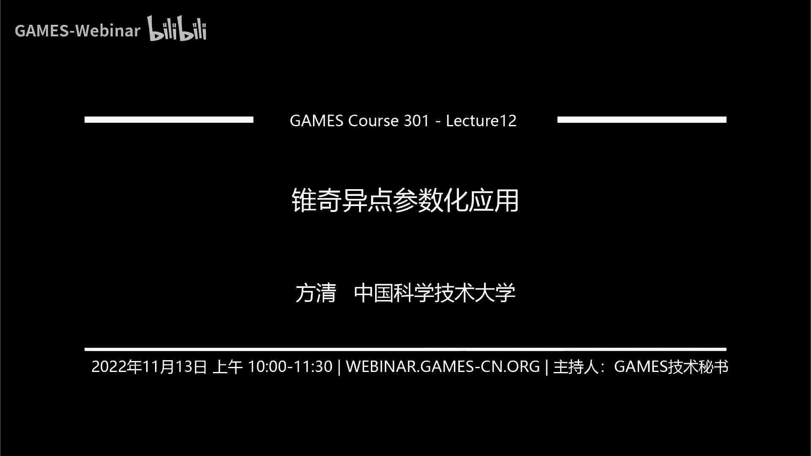
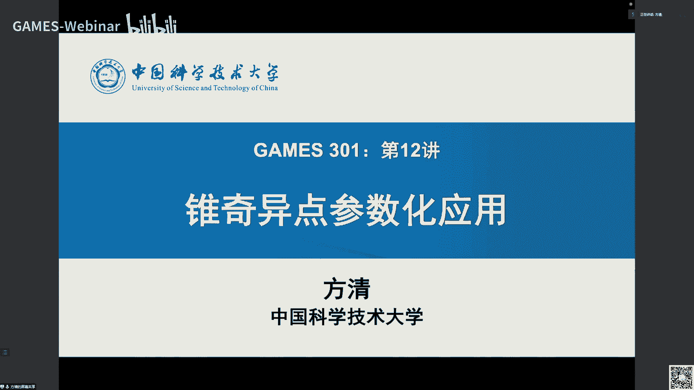
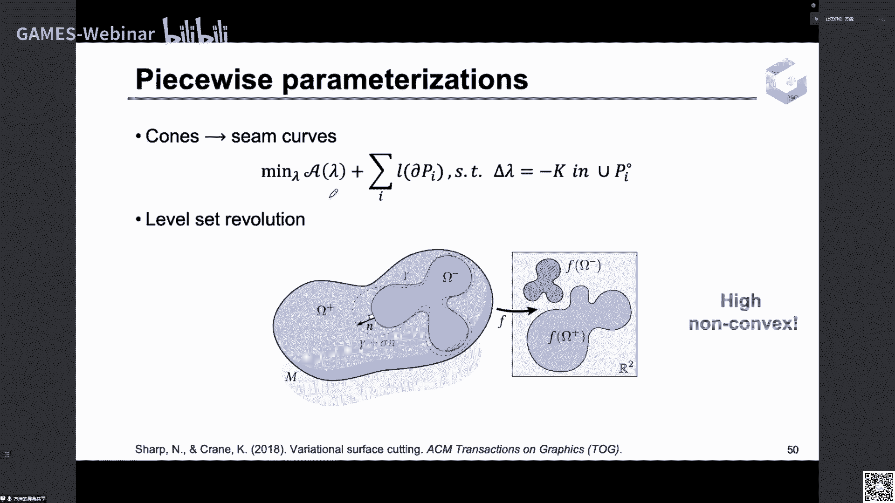

# GAMES301-曲面参数化 - P12：Lecture 12 锥奇异点参数化应用 - GAMES-Webinar - BV18T411P7hT

嗯大家上午好，然后今天我们是game，三零游戏曲面参数化专题，共行参数化的第12讲，然后今天我们主要讲的是共性，参数化的一个应用叫追齐一点参数化。

然后是我们今天要讲的主要内容，分为四部分，首先就是我要介绍一下什么是追起点，参数化，为什么要在参数化中去引入追求一点，然后接着我会讲回顾一下这十几年，追求一点相关的一些研究工作。

那第二部分就是研究工作中，一些启发式的算法，然后第三部分是研究工作，中期优化的一些算法，然后最后我们会讲一下，这个跟这一期一点算法相关的，一些其他应用，那我们来看一下什么是追起点参数。

就是如果我们考虑将流行m映射到平面率，的一个共性映射，g n等于e的二大次方减m，然后由于拉姆达描述的是，多数量在变化前后的缩放程度，就是度量会比在平面上的会大，度量会比在平面上小。

然后我们就可以用这个拉姆达来衡量，共性阴性社的这个面积扭曲，如果你拉姆达小于零的很小，就有很负的值，或者有很大的政治，那么平面上面的这个纹理贴到模型上，就会产生很严重的这个面积扭曲，在纹理贴图中。

最直接的问题就是，然后给相应的这个纹理绘制，就会增加很多的工作量，然后为了解决这个问题，也就产生了一类堆起一点参数万方法，就通过在模型表面的合理的一个位置，放置锥齐一点。

能够显著地降低共性映射的这个面积扭曲，一个最简单直接的例子，就是我们考虑一个圆锥，他除了在这个追点处高斯曲率，不是你在其他的地区曲面的其他地方，它高斯曲率都是零，然后如果直接将圆锥摊平到平面上。

我们就要把这个节点处的高速群域也变成，然后再在追点这个地方，它的那个嗯就是度娘就会缩到一起，就是有一个很很富的那个对数共性因子，然后，在这个点就会产生一个比较大的面积扭曲，但如果我们把这个圆锥。

沿着边界和锥点的这个，连线的母线给它剪开，那么剪开之后它就是一个扇形，我们就可以完全把它无扭曲的产品，到平面上，然后曲面上的锥点就是追齐一点，指的就是这样的一个个处点。

就我们不把这个曲面直接映射到平面上，就是它的边界就是平面上的边界，然后所有的内部的点都是高速，曲率为零的点，这样会产生一些比较大的面积扭曲，那我们就允许他在一些曲面上的一些点上，它的高斯曲率不为零。

就把它，聚集在一些孤立的追点上，然后除了边界和这些弱点，其他地方高斯曲率都是零，然后你选择和合适的这个节点的位置，就能够有效的降低这个面积上去，我们从一种极端的情况来看看。

这个面积里有去和追起一点的这个关系，如果我们把曲面上取率都不为零的点，当成追求一点，那么此时这个共性映射它就是恒等映射，我们直接就是把这个曲率不为零，就是的点所有顶点连成一个那个曲线。

然后把这个曲线全剪开，是的它变成一个拓扑同胚于圆盘的面，然后这样的话就可以无理取在放在平面上，对总体上这个追齐一点的这个数目，和共性映射的这个面积扭曲，中间它是一个互相是一个平衡的关系，就互相制约的。

当你使用越少的追齐一点，你的共性映射，就不可避免地产生一个比较大的面积扭曲，然而当你希望你的面积扭曲低的话，你在这个模型上，你觉得放置更多的一个热气一点，然后在实际应用中。

我们就需要在低扭区和追求一点手，之间做出取舍，因为纹理绘制肯定是需要金牛区的，文理绘制和编辑，希望金牛区，然后但是你追求一点多的话，你就第一个就是，你需要沿着这个追起点的连线剪开，把曲面剪开。

你才能摊平到平面，因为这些注点在群里不为零，你给它剪开，让它成为边界方面的焦点，它才能弹到平面上，这样就会导致你这个剪开的地方，它左右两边这个纹理它在贴过来，它就会导致它不一致。

你在文理编辑或者绘制的时候，就要注意这些地方的线，所以你希望这些线越少越好，然后另一个就是你的这个这边是那个，以这个压这个压这个为例，就是他画了一下，这个追齐一点点开的这个线，你沿着这些线。

你就能很明显地看出来这些地方呢，它的这个纹理走向它是不一致的，然后当你这个追起点越多的话，你的这个，展开的这个线也就越长，然后剪开的这个线越长的话，剪开的这个炫乐场的话。

你就能会导致一个这个参数化的这个区域，就比较狭长，然后它的边界也会绕来绕去，然后你在这上面去进行纹理，绘制和编辑的时候就会增大难度，然后第二个就是追齐一点，它除了应用在纹理贴图上。

它也可以用来建立曲面之间映射的一个，对应的一个特征点，就如果有一组追起点，它使得曲面可以产生很小的面积扭曲，印到平面上，那我们就可以视作该追齐一点的，这个所对应的过性变换，产生的这个离散度量。

和原始曲面的这个度量之间，基本上是近似一致的，然后过年变换后的这个离散度量上的，这个追齐一点，就是曲面上唯唯一的那些特高斯，曲率不为零的那些点，它就可以作为这个曲面上的一些特征点，用来建立这个形。

状之间的这个映射，如果追齐一点越少，我们去人工选择这个应对应的话，就会工作量，人工选择的这个工作量就会少，所以也希望这个背景点更少，然后第三个应用就是，当你这个追起点，取率限制为二分之派的整数倍的时候。

然后你就是参数化，就对应于一种特殊的参数，叫旋转分参数化，就你如果去追起点的这个曲率，它不是按分之派的整数倍，它就会导致这个割缝地方的这个纹理，走向是不一致的，之前的那个图，然后这边。

如果限制成二分之派的整数倍的时候，你就会发现这个棋盘，格的这个纹理，在这个割缝的地方，上下的这个走向是正好对齐的，就是走向是对齐的，那这种这类参数化学就叫旋转无缝，参数化走向。

对其它也提供了一个很好的一个模拟，那种一致的保持的那种特殊状况，然后那这些曲率为二分之派的整数倍的，追齐一点，还可以用在其他的方面的运用，比方说用在曲面上的这个向量，场交叉的方向。

厂商以及用在四边形网格的这个生成一个，这时候追齐一点的数量，就决定了场和四边形网格的这个，起一点的数量，然后你对于带分之派的整数，除非，约束的这个追起点，我们也希望它产生更少的起点。

然后我们在上一讲讲的这个共性映射下，描述高斯曲率和对数，并讲了运用群聚流的方法，来做点范域上面的一个参数化，事实上这个亚麻比方程就用可以用来建模，这个对齐一点分布问题分析一点，就是高斯曲率不为零的点。

然后我们用一些data ti表示，流行在某个点vi上面的一个事情，就是在该点它不为零，在其他地方都是你，然后在整个曲面上面的积分是你，你就可以把它这个德尔塔v，就试成这个这个的大ip区域。

领取极限的一个情况，因为这样的话，你这样选取在一个距离v曲面上，距离v的这个距离的这个excel的这个圆盘中，它的这个值是派方分之一，然后其他外面是零的话，你沿着整个曲面上面去积分。

就是这个圆盘的面积乘上它上面的值，它的这个积分就是一，然后当你这个excel趋于零，就是它这个点这个圆盘会去一个小点，然后这个点上面的这个值，会去一个无穷大的那种，然后其他地方都是零。

但是这个这个积分都是你的啊，高斯曲率在这种追起点下的分布，就可以写成这些函数的一个线性组合，然后在2008年的一个论文里面，他证明了，当高斯群玉为这种目标告诉群众，为这种追齐一点的。

这种功率点的分布的情形下，直接线，就是说我们直接把e的发拉姆达次方给省，省区就行，这个等式还是成立的，然后他现在就是一个线性的微分方程，然后08年奔驰等人就利用这个结论。

并利用三角网格上的分片线性有限元，来对这个线性微分方程进行理财，使得其变成一个稀疏线性方程组，然后这里面这个拉姆达，就是顶点上面的那个离散的那个对数，共形因子上1+1加，然后k一撇啊。

这里应该是大的k一撇，大的k一撇和k就是三角网格上面的，顶点的高度群，开始也是变化后的，k是这个变化，前面就是原始的高速群，这个拉普拉斯矩阵，但是他就是这个拉普拉斯矩阵，然后一般常用的是这个口单。

极权的拉普拉斯矩阵，用有限元离散，就变成这个线性方程组的这个形式，它是一种逼近，然后因此这个作为起点的主要问题就变成，我们在满足这样的一个线性方程条件下，那尽可能达到这个追齐一点分布的数量。

和这个面积扭曲之间的平衡，我们分为这个普通的这个追起点的参数化，以及在整数约束，就是要求目标的这个对齐点，12分之派的整数倍的这个约束，的两个方面会介绍，然后因为这个整数约束，它是一个很难去求解的。

他在求解dmp版的，所以它里面会有一些技巧，那我们先看一下这个求解，这个的启发式算法对齐一点生成问题，启发性七八个算法的一个出发点，就是基于一个经验，就是参数化里面，经验就是你光点参数化原始曲面内部。

高斯曲率的极值点啊，在参数化后具有很高的流曲，因此一个就是它的启发式的策略，就是我直接在原始曲面，高斯曲面的这个极大值和极小值，这些区域去放置对齐一点啊，这边的这个color map。

显示的就是这个网格原始的高斯群，黑色的点，就是说我放置其一点的这种位置，这是一种根据曲面去发这个这个对齐点，位置的方法及发射的第二种，就是我们可以直接就是先练这个曲面，它没有起点，这是手的话没有起点。

然后这样的话它的目标的这个k一撇，就除了这个边界上的曲率不为零，内部的曲率都是零，然后解这个线性的这个方程，得到一个那个对数共性因子的分布，然后你就会发现这些拉姆达的一些有，会有一些极小值点。

他会把这些手指的这些尖的地方引到这边，聚集在一块的地方，这个地方就是面积就会很大了点，因此就是我们可以在这个那么大，对数过性因子的这些极小值，极值或，者，其他值就是对于其他女性模型的其他。

起始点去放置一些追求一点，然后这是另一种策略，然后当我们这种，确定了这个追齐一点的装置在这个位置后，我们还需要确定追齐一点的这个曲率值，就是我们知道的位置，但还不知道这个k p的值是多少。

然后由于除了追求一点曲面上面的，其他的群里都变成了你值，就是剩下的群里都在这个给企业点上，而且这些曲面的这个高斯曲率总和，是必须要满足高斯bleeding的，就是求和是等于二派乘上，体面的莫娜式情书。

因此就可以看成k一撇中曲率为零的点，它的曲率都转移到这个起点上面去，然后我们就可以把这个群里的转移模拟，成这种在群里这这个三角网格上面去，边上面去随机行走，如果第一个点是这个飞机，就是不是追求一点。

那么这个曲率在一领域上面，我们就按这个pi j概率去随机行动，这个w i z是那个行走的这个概率，你可以是直接使用这种3d网格的，这个口袋选也行，然后他们的这个从这个点往周围去行走的。

这个概率求和就是零，一加起来是一，然后如果这个区域是起一点，那这个曲率只会走进来，不会走出去，所以我们就让这个i到j，到其他的这个地方的这个概率都是零，然后它本身就，是i都是走向它自身的。

然后利用这种随机随机行走，然后随着时间变化，它就会逐渐的把所有的这个群体，从这些阴影的，这，从这些其他地方聚集，到这些奇一点的这个地方，然后最后就求解一下那个平衡状态，达到平衡状态的这些起点处的。

这个曲面的指令，就获得了最后的这个k1 p的值是多少，然后还有一其他的那个选择策略，另一篇文章选择的这个追求一点，启发式的策略，就是它也是一个相应的另一个角度，就是我们把它曲面上曲率低的区域。

它的曲率逐渐变成，就是初始的时候，然后我们去给定一个excel小的一个阈值，我们去算这个k一撇，小于excel的这些顶点的集合是哪些，就比方说是这么一些白色的这个区域，然后我们让这些白色的区域。

直接让这些区域把它变成零，然后把剩下的这些区域都集中到这些，黄色和蓝色的这些区，域上，然后随着你这个excel再去提增加ex，然后你这个区域就会逐渐增加，然后你变成你的这些区域就会逐渐增大。

增大到之后的话，你这些分就是最后产生的那些非拧的那种，群面的区域就会逐渐收缩到一些人攻击点，当你这些所有的非零的这个取一点，它都变成孤立点的时候，我们就停止这个ex的增加，然后就这个算法就停止了。

这是和这些孤立的这种群体分离的点，它就是当成那个追起点等分布，它的值这边这个右边就是这个图，就是显示了这个随着excel增加，然后这些点逐渐的聚，集到一起，然后这个算法里面需要确定的就是。

当你这个曲率绝对值小于excel的这个区域，它这个曲率变成零的时候，剩下的顶点上面，就是剩下的那些点上面的群应该怎么更新，因为你满足曲率在这个f excel k一撇，这个上面等于零的这个向量有很多。

就是对应的这个追齐一点的，这个取值是对，对应的这个目标曲面的，这个分布的取值是不唯一的，因此我们需要选取某种意义，下面的这个最优的这个共同名称，对应的这个k p国标区域，这种最优性。

我们就可以用这个映射的这个面积，扭曲损面积扭曲来表示它就是可以，我们可以用这个对数共性因子，拉姆达的加权啊，面积按摩这个加权面积按摩等于零的话，就说明你的这个lama都是你所有的这个，这如果一一直都是。

你就是这个网格，它本身共性映射它没有面积的去，然后如果它这个值很大的话，就是那么大，i会有很大的正值以及很小的负值，它这个面积有区别会很大，然后此时我们去更新这个k一撇的话。

就是求解一个关于拉姆达的一个，线性约束的最小程序，最小化它的这个面积加权面积第二模，使得它满足这个在这些摊平的这个集合，零点上面，他的拉玛塔的拉普拉斯，是要等于原始的这个群，因为他名在顶点上面的。

他的目标的这个群是你减去目标群，目标群体就省掉，就解这个线性约束的一个嗯最小二乘问题，然后就可以解除最优的这个拉姆达，把这个拉姆达带入这个亚麻比方程里面，就可以求出这个新的那个目标的这个群，kp。

然后就这样又按照这个右边的这个算法，不对应的解答，你更新了，开一品之后，你去检查他有没有这个，就是还有没有联通的点，就是如果他所有的点都是攻击点的话，那他就终止阶段，否则你就是增加这个一次嘛。

再去算这个它的这个小于伊森的这个集合，的这个群里的这个集合顶点的集合，这个顶点的结合就会在不停的增大，直至它这个结果的收敛，就只剩下一些孤立的这期一两分钟，然后对于呃，当我们如果要约束这个追起点。

为二分之派的时候，这个文章也提供了一些一个，后面的一个策略，怎么让我们生成的最后的这个追起点分布，它为二分之派的整数倍，这边是，此时就是我们刚刚是算出来一些固定的，最起一点。

他的群体值不一定是二分之派的整数倍，然后我们要选要使得它对它进行一个取整，就是每次让它最靠近二分之派的整，数倍的点，把它变成二分之派的整数的，比方说他这个是0。48派，我们就把它变成二分之派。

那我们就选取这个最靠近程度的，顶点的这个坐标，然后为什么不能一次性把所有的都变成，二分之派的整数边呢，因为他这个高斯曲率值，它要满足求和是等于二派乘欧拉式进数嘛，你每个都去靠近对进的。

他这个求和它可能就不会等优拉式进数，所以你每次只去取整，就就选最最近的一个靠近8/2整，除非最近的一个，然后这样的话我们让这个rk一撇，就是表示追齐一点，是二分之派的这个整数倍的顶点级。

它是最近的那个顶点面积，然后tk一点，就是说我们表示了对应的格式，取名为整数倍的这个值，然后对于，剩下的这个追齐一点，我们就要更新它的新的群，使得这个一样，我们使得对应的这个对数共性因子。

加权面积模最小，然后优化出来的拉姆达，他们满足在那些非追求一点的位置，就在那些非追起点的位置，他是曲率是零，就是满足这个未知数，然后在我们选的这个取整的这个位置，它是二分之派的整数倍。

就是我们选择了t t1 p，然后求解这个最小的mama，然后更新其他的那个对齐一点值，然后这个时候，我们在剩下的那些追求一点钟，再去选取最靠近二分之pai的整数倍的点，然后再进，行，这个阶段。

只要更新这些非起点的次数的这些个迭代，就可以把所有的顶点都run到，二分之pad的帧数字，最后形成一个旋转，我们分的一个参数化，然后我们讲一下这个启发式的策略，它有个很明显的问题。

就是它是根据那个过程参数化里面的经验，就是原始曲面内部高斯曲面的极值点，往往在参数化后，又有比较高的这个面积内区域，但是这样根据这个经验去生成的，追求一点分布，它并不能保证一定是最优的。

比方说对于这个图里面给的模型，我们去选取它，这题就是高级曲面最大的这个点，放一个点去优化优化它的面积扭曲，它会产生一个比较大的，以及它在这个你直接去解那个，线性的亚麻比方程。

让它的这个所有的这个除了边界上面，内部的这个高斯曲率都是零，然后解出来一个拉姆达，然后你在这个拉姆达的极值点，去放一个对齐点，他最后再去算它的面积扭曲也是比较大的，但是你如果在这个平台的位置上放一个点。

你产生的面积扭曲，反而会比上面的这个两个都会小，下面是对于放四个点和六个点，这几个反正就是放放这些点的时候，会产生的一个公布，你在平坦的地方，有时候加点，反而会改变整个地方的这个扭曲，所以一个问题就是。

我们能不能直接从优化的角度来，计算出一个更好的这个周期一点分布，然后考虑到亚麻比方程线性化，让它提供了这个对数共情因子，和这个高斯曲率的这个约束关系，然后追起点的参数化中问题，这个地面进入手机。

就可以表示成这个对数共性因子，那么a的加权面积的我表示，那我们只需要为这个更少的这个追起点，设计一个目标的一个能拿下，这样我们就可以直接优化这种这起点能量，和这个面积扭曲能量。

然后使得他们之间达到一个更好的平衡，在这个约束下达到一个更好的平衡，由于我们希望产生一个吸，就是更少的一个对齐点，因为就是这就是对应于稀疏能力，惩罚它其实是一个阴谋，就是用这个群里的这个一模来算。

但是针对这个追起点问题，你用一模优化，它并不能产生稀疏的点，并不一定会产生稀疏的结，比方说你对于一个球面而言，它的高斯曲率它每一点处它都是大于零的，那你对它取一模，就是它本身的cos去。

他求和就是等于二派x，也就是说你对这个模型，曲面这个模型去优化它的一模，它始终都是长直，他都是李某的，这个求和都是按排乘上欧拉实体书，那你最后产生的时候追起点分布，就是所有的景点都是这样。

不可能把它聚到一些固定的追起点，因此这个基于优化的方法，就是对于这些追起点能量会用哪些，就是表示它更稀疏的这种能量形式，采用的形式，然后我们先讲一下，18年的这个区域化的算法的这个文章。

他就是把索尼买这个等人，就把这个追稀疏的，追起点的高斯群里的这个分布函数，把它看成一些迪拉克侧面的一个线性组合，这里我们就做一些粗略的介绍，但这个思想就是用到办法更新里面的，这个队伍空间。

就是函数和测度是关于积分，是互为现金对比，然后我们把曲面函数的能量像，就他在这里面就变成，变成这个测度的这个测度模，然后建模就把它变成优化，这个共形映射的面积，扭曲和这个侧镀膜的加权，满足它的。

这个线性化的这个亚麻比方程，然后求解这一个就是用一个队形，队形式给它转化一下，就转换成了一个具体的函数，空间的一个优化问题，在三角面片上用分片线性有限元，毕竟这个最终的这个求解问题，是一个图问题。

就可以用脚气下降法，a d m m这种那个方法，第二次ftt是i d m的一种变种，也可以来求解这个优化问题，它本身是一个退化，就能找到一个最优解，然而他们实验测试发现，这种测度模。

能够比一模带来一些更强的切除性，在相同的这个阿尔法的这个权重就是阿八，是，那个测度模你如果是一模对比的话，哪怕就是也是阴谋的权能，加上那个面积扭曲，总能量在相同的这个r8 ，将能够将曲率从一片去积累到。

一些少数的功利点的存储区域，这就是18年的就不能了，然后相比于108年的这个短的，这个文章的建模，我们实验室在21年的这个建模，就把它做了两个改变，首先我们就是直接用更直接的。

就是直接用临摹来当这起点的能量，我们发现这个比侧镀膜的这个吸收，惩罚性要更强，因为你在离散情况下临摹，就直接就等价于高斯曲率不为零，的这个点的个数，点的个数就细数追起点的数码，我们直接优化临摹。

就是直接优化数码，其次我们将这个追齐一点和面积扭曲的，这个加权能量给它，转变为在给定的面积扭曲下，优化总共的这个吸追起点，这个数量也就是它的名，我为什么要把这个加群，改成这个有界的这种约束。

反法改成这个有界的这个表达，因为这么做的原因有两个，第一个原因就是扭曲，在参数化应用里面是更强调控制的量，然后通过我们把这个把它这个加权的，这种形式，把它变成这种有界的形式，我们就更容。

易调节这个白塔来控制我们想要达到的，这种扭曲的结，然后另一种就是我们可以在更换这种面积，扭曲的这个表达形式，因为你除了用对数共性因子的这个arm，来表示，如果我们要控制这个共性。

映射在这个曲面上的这个最大的面积扭曲，它其实就有点，相当于这个对数波形因子的无穷，但这里面我们不能直接用无穷，我们需要用一个p p趋向于无穷，就是p比较高来逼近，这个原因。

是因为在追袭一点这种丰富的情况下，这种连续上这个对数共形因子的这个分布，它其实在追起点处，的取值是趋于无穷的，你直接取无穷模，他这个能量无穷魔合的这个能量，它就是无穷，你去优化就没法优化。

然后你如果用pm，它是nn的这个乘的趋向于无穷的，这个量级是这个nn的这个次方的量级，那你对它求p某p大于一的话，你对任意的p，它这个能量都是是一个正正实数，它是一个有限制。

所以我们用这个pm来逼近这个无穷，然后你如果用这种加权来形式，你去优化这个p模，它就不太好优化，但如果你把这个p m这个能量，把它表示成一个有界约束，我们在这里面就可以用一个，近似投影的方法。

每次去去很好的，就可以把它当成这个有界元素，就很有很好的迭代去求，就简化这个优化的这个难度，所以我们把这个放到这个界面，是第二个，然后针对我们这个建立的这个临摹的，这个优化模型。

我们测试了现有的这个对临摹逼近的，一些常见的方法，对年末逼近的常见方，就是我们之前也说了，l e b g它不能产生一个固定的点设计，它会产生一些横向的，很大的一种区域的分布。

然后第二个就是用smooth导引，就是光滑的模拟函数，它其实是一种by的那个分布，通过调节一个参数，调节这个分布的这个开口，当然这个开口越小的时候，他就可以接近一个这种事件函数，就是在复位点上。

都是已经在到你那种地方体，现在变成你用这个连续函数来逼近这个模，然后它产生一个比较稀疏的一个追求一点，但是我们发现这样的稀疏追求一点，它还不是嗯他他还可以改进，就是我们可以用一些叫重新加群的。

这个l e d g来进行求解，就是它跟原先的l e d g不一样，就是我们对它的每个分量，乘上了一个新的权重，通过调节这个权重的分布，我们可以使得那些其他的一些对起点，使得它就是其他一些很多的那个。

曲面值的点，都变成你只剩下少部分的这，个堆起点上面取名值不为，那我们来看一下重新加选的这个l e，毕竟他的也带着这个框架，它其实就是说我们把这个黏膜，把它用于系列的加权，然后一模来逼近。

然后每一个一模子问题，它是这样的一个迭代形式，然后它的这个加权的这个权重，是跟他上一步的这个子问题求出来的，这个最优值是由他决定的，我们用上一步迭代里面求出来的是最优的，这个k p m。

然后根据这个加上一个ex m的，这个无穷小量，就是它这是一个小的小量，分之5000的就是小量，然后分之一就是你的这个w i m加一，是跟这个k，上一次迭代的这个km乘以一个负相关关系。

这样的话你就可以这样设计的这个权重，意图，就是增大对这个高斯曲面，靠近你的这个分量的乘法，使得这些分量最终是不断的区域，然后就变成，然后剩下的这个群局部为零的分量，就他就我们就不管它。

然后它的这个权重就会比较大，然后它就会慢慢的形成一个个孤立的点，也就是追齐一点，我们初始的这个分布，就是让他的所有的这个w全部都是一，就是我们初始对所有的这种分量，乘法都是一样的。

也就是初始它就是一个阴谋优化，然，后随着这个m的迭代的增加，然后时代慢慢的去惩罚更多的那个靠近，你，取决于靠近于零的那些零件，使得它们最终变成零，然后就会收敛到一个个工具，判断生产的条件。

就是我们上一次上一次迭代的，这个算出来的最优点，和这一次迭代的最优点的这个误差，在一个比较小的范围内，我这里面写的是等号，其实是判断一下误差，他们的误差的模型一个一层。

然后它就判断是跟你一他随着这个迭代，它是一个逐渐减少的趋势，意思就是他是跟他乘一个负相关，逐渐减少是能增加他的权，重然后这个问题它对每一个子问题的话，它也是一个加权余某的问题。

然后它也是一个to you化，我们也可以用一个交替交替下降，就来点m内方法来求解这个每一个子问题，然后实验中我们就发现，我们的算法可以很好的这个控制这个面积，扭曲的这个界，就我们对我们同样的这个模型。

手的模型去设置它不同的键，然后追求点数目就会随着这个界的嗯，减小而增加，但是我们最后产生的这个起点，也是很稀疏的，一个对齐一点，虽然这个算法我们是对李某的逼近，然后李某是一个np的问题没有。

就是目前还是没有办法，有效地找到一个全局最优质的，但我们那个结果还是产生了一个很好的，一个技术性，自己一点的数目也是比较少，然后我们刚刚说的，我们可以用这个p抹去p增加，去替代这个无穷嘛。

去优化那个最大的这个面积扭曲，我们也做了一个实验，就是对于相同的这个扭曲界的话，我们如果是把某p某p从二增加到五，我们会发现它的这个最大的这个面积扭曲，是被逐渐减小的，对于二的话，这个点，这个两只耳朵。

这个地方的这个面积扭曲是很大的，当你达到一个当你p逐渐增加，增大五的时候，这种面积扭矩很大的那种区域，就会就会消失，它就会更倾向于一个一致的一个扭曲，然后右边的这个呃图，这个分布图也显示了。

当你的这个模增加的时候，你把它的极值，极大值和极小值的极值分布，会压缩到一个比较小和区域分区间里，能够有效的这个增加p，能够有效地整个惩罚这个面积扭曲的，这个机制点，然后刚刚也说了。

这个柠檬优化它是一个非凸优化问题，我们的算法就只能用一系列的这个出问题，去逼近球，就你系列加成的i l e问题去逼近球体，不能百分之百成，获得一个最优的这个联系点分，因此我们就把我们的这个优化。

跟18年的那个文章的那个测度模式优化，在这个整个找了一个非常大的一个，数据集上面去跑，测试自己的一个对，就可以看出，我们这个算法在69%的模型上，都能产生比他们的结果产生很稀，更稀疏的一些点。

他们也会产生在相同的扭曲下，我们因为他们是一个加权的形式，他们的结果会算出来一个面积扭曲，而我们的这个结果它的面积扭曲是一个g，我们直接把他们的这个面积扭曲，当成我们的算法输入的，任何g给它输入进去。

然后产生一个新的对齐点，我们的数目会在69%，70%的左右的模型上都会比他们少，而且还少的比较多，然后会在剩下百分之将近30的总额上面，跟他的追求一点数目是一样的，只有1%的不到1%的模型上面。

我们会比他多，但其实多的也不多，就基本上只会比他们多一个点或者两个点，就是在面积扭曲移植的情况，可能会多一个点或能量原因，也是刚刚的那个临摹，我们去在优化的时候，它并不一定能保证。

它一定是就是最优的那个级别，他是一个近似，它可能会比最优也会多一两个点，是有可能的，所以占1%不到1%的模型上，还是有可能会出现一些啊，就是增加了一点最起点的情况，然后如果我们考虑这种待整数约束的。

这个追求一点生成问题，我们实验室就在22年的这个文章，就在21年这个建模的基础上，给它加了一个整数因数，就是优化这个目标取名的临摹，使得它面积扭曲小于一个给定的键，然后咱们满足这个线性的这个亚马给方程。

且它的这个目标的高斯取名，要是二分之派的整数倍，增加了一个这个整数一数，但这样的话，这个求解的这个问题就变成一个混合整数，1万问题，混合整数优化问题，它相比于单纯的这个，临摹优化它就更加难求解。

整数问题，也是一个非常难n就是np难的问题，然后我们怎么去求解这个问题，我们就提出，将这个整数约束转成这个二进制约束，就是零一的这个约束，我们可以假设这种生成的锥洗脸，他在除以二分之派。

他是落在这个-2的tos方，动二的tx方减一的这个区间里，这个是合理的，因为对于所有的基本的输入模型而言，它每个点的高斯曲率不可能就有无，就无限大，就是我们选择的一个合适的图。

怎么都把它在我们想要的这个高斯取名的，就是，那这样的话我们就通过引入一个辅助变量，x它是一个零一变量，使得它乘上一个c一个向量常量，这个产量从第一个分量的第n个分量，一套加一个分量，它分别是r的影子。

曼德阿德托斯曼的这个密啊，c乘上它减去一个r的操作方，乘以e是这个对应维度的一个嗯，长指向量就是都是单位都是一，就是每一个分量其实都是一，然后这个乘上一个二分之派，他在高四取值指的是二分之派的整数倍。

就得属于这个里面，这个x就是你就决定了这个tk一平的这，个取值是在哪，然后我们优化这个问题，就把它变成了优化了一个零一的一个分布，就是我们要求优化一个x很难不难，是的，x是属于你，要不是你要不是d。

然后他们之间的这个优化，这个c t乘上x减去r的cos，方乘e的这个名模，它表示这个群体的名模，然后以及他们的一个亚巴，里含的线性化的一些就优化这个优化问题，然后我们再将这个影一的这个约束。

把它转成一个嗯区间约束，一个正方形区间约束和一个球面的约束，这个交的形式，这里我们给了一个例子，比方说是当to是一的情况下，它就是一个零一的，就是说我在这个空间中有，它是一个二维的一个象征。

它这个每个向量值分别可能取名，也有可能取值，所以它就是一个交点，这个正方形区间的这个四个角点，要不是零零，不是100，要不是一不是零零，它就可以表示这个正方形区间，这个约束零一的这个正方形区间约束。

和这个以这个正方形中心，以它的这个对角线为直径的这个区，这个圆周交这个交易，这个圆周的交集，他交的这种情况，就是这个色调对一套等于更套大于一，就是更高位的这个情况，这个情况也是成立的。

只不过这里不太好画，就只画了这个二维的信息，它就可以表示为更高维的一个空间，中的一个立方体，0~1这个区间的一个，就这个区间的一个b区间的这个体上面，然后和他这个从这个你大一这个区间的，这个1/2。

所有的1/2的这个充电为圆心，然后这个直径这就体，的这个嗯对角线为直径，然后去设立一个曲面，去求教，就教出来这些角，这些焦点就是这些年约数量，然后我们就通过这样的变化，就把这个它变成了引力约束。

就变成一个集合的两个集合的一个交，集的约束，我们就引入新的辅助变量y和z，然后上面是x等于y，x等于一定，就是他们之间的一个这个辅助变量之间的，一个线性的，下一个就是y是属于零一区间的。

这个b区间的一个约数，z就是属于零一的这个球面的一个因数，然后这个约束问题就变成了一个非凸的，一个集合的一个优化问题，这样我们就可以用idm这种交替简单算法，来求解这个非to的这个优，化问题也可以用。

第二次影响都一样，当然值得注意的是，对于这种带整数约束的这种建模，有两个它是可以冲突的这个因素，第一个约束是它的这个曲率，是二分之派的这个整数倍，它这个约束它可能跟第二个约束面积扭曲。

小于给定的这个阈值，它之间是互相冲突的，就是说我们要从这两，就是你的这个曲率和你的这个扭曲之间，同时还得满足这个线性的这个亚麻比方程，如果我们把这个阈值把它设得非常小，那你这边的插的拉普拉斯。

拉姆达对数共性因子，它的拉普拉斯的这个值就会非常小，这个值非常小，你就不可能把招人前模型上面的曲面给他，找到，在这个小的这个区间的这个值里面，去找到二分之派的整数倍的个数。

这边这个图下面这个图是也给了这个例子，就是说我们当时把这个约束条件，把它设为0。2，然后我们算出来的面积扭曲，就是零点算出来的，满足二分之派整数倍的，这个追忆起点的个数是15个。

然后当我们桥小零点小小白差的时候，我们算出来的这个面积有区，它会变成小于这个白塔的面积有区域，然后这个它的顶点个数是88个，让我们把这个白塔更小，他如果想到0。001，这个时候，其实我们是找不到一个。

那个等于二分之派扭曲的，这个对齐一点的，那二分之派整数倍的这个追齐一点，然后我们只能还是只能找到他原先的那个，上一个在0。05的这个这些年个数，然后男的扭曲还是这么的。

因此就是当我们这个你去给的太低的时候，我们就是把这个扭曲约束给它松弛掉，我们就选择一个保持这个区域的这个，整数约束的，因为在做那个旋转，无缝参数化和厂的生成问题中，这个整数的这个约束明显是更重要的。

我们就松弛掉，这个扭曲约束，然后在所有的整数据里面去选择，面积扭曲最小的那个输出，他可能会比这个界会大，但是他一定满足这个转数，也去当成这个最后的输出，然后拿我们的这个算法的这个结果。

和120的这种12年的那个取整，就是你把它慢慢地聚到一些功利点，然后最后对功利点进行一个取整，的一个算法，然后去在数据上面去做了一个对比，然后我们的模型结果是，在80%的模型上都要就是他们。

然后在17%左右的模型上面，是跟他们的结果差不多，因为整数混合整数优化嘛，我们现在把它变成一个非凸的，一个优化问题，它还是一个非凸的，就是我们只能找到一个局部最优解，找不到一个全局最优解。

然后我们会在百，分之22。7的模型上，是弱于12年的那个上班的结果，第2。7的模型后面就是下一张p p t，会说明它到底是一个什么情况，我这边就给了一些他们数据集里面比较密，集，在大多数的情况下。

我们的结果都是能够跟他有一个比，他们就是表现的好或者相当的，在2。7%的情况下，为什么我们的结果会比他们多了，就是对于一些cad的模型，他们那种取整的方法，就是直接把它的面积扭曲。

就是从高斯曲率很小的区域，直接把它变成零，它其实就是把这一块平面，它本身就是，杀就很容易就去找到这些啊，cad模型的这个角点，它就是我们实际的那种近似最优的那些词，但我们优化的话。

我们是从一个嗯所to非凸约束，这种非凸集和约束的这种非凸优化开始，我们去直接去找那些可能的解，他可能会陷入一些局部极值，就不一定就是全是他的角，可能会在其他地方会多一些点，多几个点会产生一些。

这个对于大部分都是对于cad的情况，会比你cad模型的情况，会比那个12年的这种，直接把这种平坦的地方，变成你们这种区域的，这个结果会要多一多几个点，就这，种情况，然后最后我们讲一下，跟对其1。

38的算法相关的，一些其他应用，没结婚，然后首先对于空格为零的曲面，我们限制了这个对齐一点，然后等对pd的配备，能够得到一个旋转五分参数化，它其实这个旋转五分参数化，因为我们在这个各缝两边。

它的对数公式，因此它是已知的，所以它的深度程度也是相当的，这个时候这个旋转泵参数化，它有个特殊命中，除了就是说在这个上面它不仅走向一致，它这个格子的这种放缩的这个大小，它也是一致的。

它之间只差了一个错位平移，这个我们可以通过在这个，参数平面上对这个uv做一个平移，使得它这边的这个这个线，跟这边的这个线是对齐的，那在这个时候这样的话，它左边的这个贴的纹理。

它就是严格的这个走向都是对齐的，只要对他uv纹理作为一个平，我这边换，我没有对它做评价，那就是它虽然格子的大小是一致的，然后走向也是一致的，但其实他差了一个平移相，那这就是上面的这个文件。

跟下面的文件差了一个左右的一个拼音响，其实是可以通过平移使得它严格对齐的，但是对于高规格的曲面，我们的这个共性映射是没办法做，到一个全局就是全局部分的只能做到选项，因为高科技的曲面，我们之前也说过。

我们需要这样曲面，沿着一些环境圈和隧道群给大家剪开，才能延伸到屏幕，此时共性映射的这个自由度，就是每个顶点上面设置一个最初共性因子，它不能再保证在这个环境圈和隧道圈两边，只能保证它的走向一致。

这边就给了一个很好的例子，映射的这个拉姆达对应的这个量级，它不是一个量级，上面会更密一点，下面会更稀，疏一点，这样你就是不可能通过一个平移，使得它的这个纹理完全对齐，这样产生的参数化结果。

你需要进行一个后处理，就是它不一定就是保缴了，你需要对它允许一定的后处理，它每个地方它有一些扭曲，然后使得它上面的这个，跟下面的割缝处是对齐，这就需要一个会出隐藏的，使得它变成一个全局无缝的一个情况。

但一种可能性就是，我们能不能就是直接对我们的这个优化，就对这个共形映射进行一个松弛，我们可以给它改成，一个允许一定的角度扭曲的，这种利益共性映射，就是他每个角度扭曲在一定范围内。

给它角度去进去加一个限制，然后进而在这个优化里面，直接继续优化这个追起点的，这个等于二分之派的这个追起点的个数量，和这个扭曲，这是为6g，面积扭曲和角度扭曲，然后去优化。

直接生成一个全局无缝的这个参数化，而不需要这个后续处理工程，因为后续处理过程这个算法，它是一个根据这个case去做处理的算法，它没办法嵌入到这个优化里面，就是我们没办法通。

过控制这个优化这个最起点的位置，能够控制最后的这个新的，你们这个后处理我们没法预料，所以就是能不能通过直接调整这个共性映，射给它松弛一下，直接去优化这个整个追起点的分布，使得最后的这个扭曲最小。

和他的数目达到一个平衡，也不是分享，就是跟他的数目达到运行，这是一个就是一个可能性，但是目前还没有什么人来做，而且这个问题也比较难，因为你需要把这个过去热搜吃掉，它的那个亚麻比方程，它就不满足。

还需要有一个亚马背方程，最大解密要有一个修改，反，正这个问题目前还没有一个解决方法，然后第二个相关的应用就是这分片共性，参数化，就是我们在追求一点参数化里面，他把一个群体对聚集到少数的追齐一点。

但除了追求一点外，我们对它做参数化，我们需要把这个追起一点，沿着这个歌缝就是眼眼线去剪开，你把它剪开之后，参数化之后，播放处它还是有这个纹理不对齐的情况，除非你是英雄，这个人最起点是二分之派的整数倍。

那才能可能是走向一致，然后对于qq为零的话，那我们就不要求这个他仅在这些追求演出，曲名不文明，我们也可以让他的在这些歌放上面，群众不明，我们只要沿着这些个混剪开之后，它在这个z部它取名是零。

那边这些剪开的地方边界上去，你都可以不用，那这个时候我们去优化的这个模型，就变成了分片的这个共性参数了，就我们优化一个这个共享，它是化的面积扭曲，以及它每个片上面的这个边界的这个长度，的一个加权平衡。

然后使得它对于每个现在这个内部，它的高速目标加高斯曲率都是零，它的边界上面的高斯曲率，其实是可以随时取的，所以我们这个约束，只对于每一片的这个内部点，然后它的这个满足这个线性的这个。

研发力方程的这个月束，然后关于这个方面就有一个研究工作，它使用的就是类似于拓扑优化里面，never said水平极端的方法来演变这个分曲线，就是我们在这个局面上可以设置一个啊啊，函数值的一个厂。

然后它大于零的区域和小于零的区域，会形成一个线曲线，水平线就是这个就是lec的线，然后这个线它就表示，我们这个分片参数化的这个那个缝，这个剪开的这个歌缝的这个轨，迹，然后我们就要优化这个线的这个边长。

然后同时也要优化这个共同参数化的，这个面积的区域，然后这里面就是根据那个，你对这个轨迹进行演变的话，你就可以设成对于这个在曲面上，是这个分布的这个函数值进行改变，函数值改变。

就会导致它等于零的这个水平集，会发生变化，然后这个优化，它是一个高度飞出的一个优化，它非常容易陷入局部，就这样子这篇文章的重，因此关于这种分片共性的这种才是坏的，没有更高效的一个求解优化模型。

就是说不用这种never say表示有没有一，些其他表示，使得它优化，不会很容易地陷入一个局部极值，然后能够达到一个比较理想的一个结果，这是一个也是一个值得研究的一个公司。

然后这一部分今天要讲的这一部分，就是对于共享参数化里面去优化这个面积，扭曲，引用堆起一点的这个专辑，他在最近十几年的这个工作里面的，这些一个工作的一个回顾吧。

总结，啊后面连讲应该就是更更直接的一些。

其他参数化的其他应用，我这里面把这个共性参数化的，这个特别针对这个面积扭曲的这个问题。

