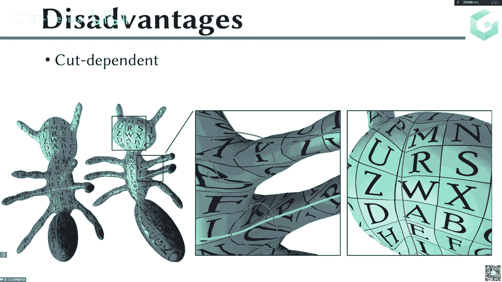
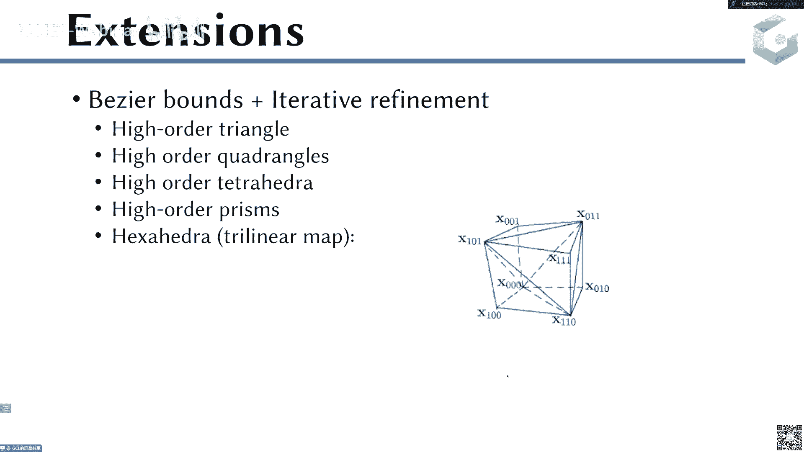

# GAMES301-曲面参数化 - P13：Lecture 13 参数化应用3-曲面对应与高阶多项式映射 - GAMES-Webinar - BV18T411P7hT

好那个各位同学各位各位老师啊，这个现在时间我们已经到了，我们今天开始这个呃games 301的第13讲的内容，今天呃也是关于这个但弱化的应用啊，是这个前面因为介绍了很多这个参数化的技术。

然后中间也介绍了应用，然后我们最后的几讲呢也是继续围绕这个应用进行进一步的介绍呃，主要介绍的这个应用是这个曲面对应与高阶多项式映射啊。

那么首先我们的第一个目的，第一个是第一个那部分内容是啊曲面之间的这个对应，那么首先来我们来看一下这个定义，那么对于这个曲面之间的定义的话，我们希望它是啊，我们我们一般情况下名叫的名词比较多啊。

这个叫service mapping或者into service mapping或者cross parameterization，那这个映射的目的呢其实是希望去建立一个one two one的。

就是一个一对一的这个映射啊，这两个在两个曲面上啊，m和mt上，那么呃这个地方是希望是建立这样的一个one two one的运势啊，大家注意这个one two one其实是因为三角形网格。

或者说我们平常见到的网格都是一些离散的网格，那么它其实是会有点边面对吧，那么这里面的这个one two one是指的是不光是这个顶点要对应过来，我们还希望是面要对应过来，边要对应过来。

就是相当于你可以你要把这个东西看成是一个pizs linear的一个分片，线性的一个呃一个曲面，你其实是两个分片线性曲面之间的这个一一映射，而不是而不是而不是只是这个顶点之间的这个对应。

比如说这个地方稍微要注意一下这个地方的概念啊，那这个就三角形面片内部也要去跟这个另外一个，另外一个三角形上的点去进行对应啊，那么呃这个刚才那个叫做service mesh。

service mapping，那么我们如果把这个概念变成一个list，更加离散化一点的概念，那这个地方有另外一个概念叫做compatible meshes。

那这俩compatible meshes的这个概念是指什么，是指这个两个网格，它的这个连接关系是一样的，比如说在我们这个，啊在我们这个这个这这个p p t里的话。

我们主要是这个左边的这个骆驼跟这边这个呃动物，它们两个之间的这个连接关系呃，三角形的这个连接关系是一样的，那么也就是说你其实可以用点呃，顶点之间的这个对应，然后呢面三角形之间对应。

你直接可以用这个三角形直接去啊去把它匹配起来，啊那这个这种网格的话就是这个m和这个mt，那这两个网格我们就叫做相容性网格啊，就其实就是指的是他们两个之间的连接关系是一样的，那中间这个mmt呢。

它其实是你可以认为是这个右边这个网格的一个初始啊，但是一开始就是在一般做算法的时候就去生成这个combo match的时候，这个可能是一开始初始，它其实跟右边这个网格的连接关系其实是不一样的。

好这个是compatible matches，那么应该是service mapping，一个是compatible meshes。

那么service mapping的话是还是一个就是数学上的一个一应试的概念，那么compile match其实指的是两个网格，这两个网格的连接关系是一样的。

就是identity的那个connectivity，就是它的这个连接关系啊，那么既然如果有这样的一个competition matches，它其实可以用来做很多的这样的应用对吧。

比如说这个morning啊，比如说这个啊这种app的transform，就是你可以做一些这种属性的船属性的这种传递传播对吧，因为你有这个连接关系呀，呃比如这个属性的传传递传播。

其实不光是在我们图形学圈子，比如说呃你可能在图形学圈子里面，可能你见得比较多的是一些呃纹理啊，normal啊，这个颜色啊等等这些常见的属性，其实在有一些更加special的一些应用里面。

其实也可以这个app的这个概念啊，就这个属性的概念其实很很多，不一定是基于这种很很表观的概念，你也可以是有一些物理性质啊什么，其实这地方都可以去做一些啊这样的一个transer。

然后使得你的这个应用或者说你这个计算更加的简单，或者说你你就反正可以简化一些事情，那么我们来看一个简单的例子，假如说我已经有了这个compactical message以后，我怎么去。

比如说这个地方这个小视频啊，这个视频展示的其实就是这个呃从一个呃woman啊，这个morning到一个，我们再来把这个视频播一下，这个我们我们move到，就是把它一个变形到一个这样的一个星星。

或者一个狒狒的这样一个形状啊，这是一个缓慢的一个morin的一个过程，那当然morin的话其实你可以认为是这个或者说这个形状差值的话，呃这个其实是这个动画制作里面一个比较重要的一个步啊。

那比如说这个地方还有一个另外一个比较长一点的视频，我们可以看一下，这个其实是一个呃人体，它在这个整个的这个运动过程，整个人在这个过程中他做了一系列的动作，然后这个动作其实其实我们只有一些离散的针啊。

就是这个我们上上上一页ppt里面，其实我们只给了这个人体在一些呃离这个人体，比如说这个啊这个姿态，这个姿态，这个姿态，这个姿态啊，这个姿态这个姿态，这个姿态，这个七个姿态其实是我们的输入啊。

那中间这些姿态呢其实是我们的这个差，用这个形状插值的算法给它插值插出来的啊，这样的话我们最后可以得到一个这样的一个呃，整个的一个变化的过程啊，就相当于是从呃从这个形状变形到这个形状啊。

那么所以说这个是一个视频就展示了整个的这样一个变化的过程，其实中间那些针都是通过这个形状插值插出来的，那么它的它的基础是我们其实是拥有了这些呃网格之间，它其实是有这样的一个一一对应的关系啊。

就是它其实是这个compatible meshes，那么接下来我们的目的就是要去讨论怎么去生成这样的compatible mesh，或者说我们就要去怎么去讨论这个呃怎么去生成这样的嗯。

呃service mapping对吧，那么呃我们呃这个service mapping呢其实在这个初一学领域也好，或者说在这个cv领域也好啊，这个其实是一个带有一点模式识别。

模式识别的这种概念的这种topic，那么所以说呢他们这个这个问题其实被研究的很广泛，然后呃方法也非常非常多啊，就是这个方法有各种各各种各种类型的方法啊，然后之前还有function map的对吧啊。

还有基于这个最优传输的，那么等等，还有基于这更多的一些问，更多的一些这个呃呃方法的类型，那么今天的话我们因为是这个是在这个参数化的这个背景下，那么所以我们主要是还是介绍的是这个基于参数化的这个呃。

基于参数化的曲面对应生成和基于参数化的这个combatible matches的生成，我们主要是因为我们还是要跟我们的这个主主题给贴合上，那么所以接下来我们来介绍一下这个基于参数化的这个曲面对应。

和这个compendal matches的这样一个生成方法啊，对于我们的这个问题而言，我们这个问题的输入一般情况下是有两个这样的模型，m一和这个模型m2 啊，这是我们的两个输入。

然后呢并且我们还会有一些这种叫做corresponding的这个landmarks，其实就是这些画出来的这些圆啊，这些原则这个对应关系呢其实呃一般情况下是由这个用户来指定的。

当然你有一些赠送的算法也是可以的，当然这个东西不是很万能的，但是呢我们现在在对我们这个问题而言，我们现在假设它是这个这些lmarks的这个对对应的这些lmarks啊，是输入啊。

嗯那么所以说呢对于我们的这个输入而言，我们是有两部分内容，一部分是这个两个网格啊，这两个网格的连接关系是不一样的啊，比如这个这个长颈鹿和字体嘛，它们之间的这个原本的这个三角形的连接关系是不一样的啊。

这是第一个输入，然后第二个输入呢是我们还在这个马和这个呃长颈鹿身上，我们会有一些呃这个对应的这些呃landmark，就是一些其实就是一些点缀一些啊。

a pair of a point of the pair of landmark啊，就是一直点的对，然后呢有的有了这两份输入以后呢，我们接下来的目的是要去建立。

就是这两个就是这个现在画上纹理的这两个呃模型，比如说这个这个马和这个长颈鹿这两个模型之间的这个一一对应关系，或者说建立这两个这两个模型之间的这个compatible match。

就是使得呃这个马跟这个长颈鹿的这个连接关系是一样的啊，这个这个是我们的输出，所以我们的目的是要去建立这个这个码和这个长颈鹿之间的，这个一个摆jective的双摄。

或者说呃一个摆jective and low distortion的一个双摄和一个smap，就是一个one two one的map，呃。

或者呢就是我们要去建立这个马哥这个长颈鹿之间的这个compatible，meshes，就是要去建立他们这两个之间的这个呃相容性网格，就是连两个使得这个马哥这个长颈鹿之间有具有相同的连接关系。

就大概是这是我们的目的，基于这个csmart和呃，就是要去建立这样的一个呃y11 对应的这个曲面对应和，当然我们还希望是这个低扭曲的，那么低扭曲最容易看的是什么呢。

就是这个这个比如这个三这个左边这匹马上的，比如这样的一个呃正方形的这样的一个纹理，然后映射过来的话，他到这个地方借一到这个地方，它的这个纹理呢其实还是相对这个正方形，跟左边这个正方形还是比较接近的啊。

那我们希望是最后是产生这样的一个低扭曲的啊，呃这个变形，而不希望说这个变形变得很大对吧，就比如这个有一些很大的剪切角啊之类的，那么对于这个基于参数化的方法的话，一般情况下会分为这个如下的这个三步啊。

首先是我们要去建立一个叫common best man in，就是一个公共的基础域，这个要去建立一个这样的common best man，那么这个common base dman呢。

这个domain是要对这个输入的两个网格都是一样的啊，这个common base dman in，然后呢有了这个common pass man以后呢。

然后我们接下来需要去算一个low distortion的参数化，这个这个董妹呢你可以认为是比如说呃这个是m1 ，这个是m2 ，这个是这个best dman，然后呢你要去算一个m一到b的这个映射f1 。

你要去再去算一个映射f2 到m2 到这个b的映射f2 ，然后呢你再去建立，比如说哎这个m一到这个m2 的这个映射，这个映射的话，其实你就可以是什么呢，其实可以是f符合上就f2 的逆对吧。

就f一符合上f2 的幂，那这样的话你给一个m一上的点，那么你首先会通过f一映射到这个b上，然后再通过这个f2 的e从b运回到这个m2 ，那么所以说这个第二步呢，其实我们的这个这个算法的这个第二步呢。

其实就是去算这个f一和这个f2 ，然后呢呃当然你也可以有了f1 f2 ，你其实就可以去做f2 ，等你跟这个f一的这个组合对吧。

那其实你就可以建立m一到这个m2 的这样的一个呃cross puration，或者说这个service mapping，然后有了这个service mapping以后呢。

我其实就可以去对这个两个网格m一和m2 去做一个呃，相容性的rematch对吧，这个也是可以做的，那么所以说呢我们最后整个的这个算法就是首先去构造这个b，构造完b以后去计算这个f1 f2 。

有lif a f2 以后，你可以去使得这个m一和m2 具有相同的连接关系，去做一个相容性网格的这个生成过程啊，大概整个的算法就分为这样三步，那么接下来我们来简单的举个看一个例子啊，那么比如说像这个例子。

他们这个地方的这个best man，他选的是这样的一个这样的一个定义，呃，当然这个地方呢它这个best dm跟我上一个上面上一页ppt里，这个best dman还不大一样啊。

它这个其实是一个m m s应收到一个b1 mt呢，映射到一个b2 ，看有没有，他其实是也应收到一个从这个m x映射到一个b1 m啊，m t映射到一个b2 ，然后这个b一和b2 是什么关系呢。

这个b一和这个b2 ，啊这个b一和b2 它的关系是他们他们俩具有的相同的连接关系啊，就他们俩是个computer matches，就是这个b一和b2 ，是这个，compatible meshes。

那么有个completo meshes，那其实是比如说这一块它其实跟这一块它就可以一一对应起来对吧，那所以这两块它你可以认为它是一个competition matches，就competm。

所以说呢你最后你会算的是这个ms到这这一块的这个距离，就是这一块的这个映射啊，注意啊，它这个地方这个每一个映射呃，这个b上面的这个每一个都是一个三角形啊，都是一个三角形，所以你是从比如说这一块映射到这。

映射到这个下面这一块的话，那这个地方其实啊其实是把这个三角形网格上的一片三角形域，映射到这样的一个三角形域，那么对于这边也是一样，其实也是从这个上面的一块这样一块区域，映射到这个三角形下面的一个三角域。

那么因为三角鹬是一个to的对吧，那么三角域是to的，那么其实我我们完全可以使用之前的那个to test bing，去得到一个摆getive的参数化，对不对，我呃并且三角域肯定是一个平面，是不是。

那么所以说呢我就可以把这个曲面上的，把这个取取这个service网格上的这样一块平面区域，映射到这样的一个三角域上，然后把这边也映射到这个三角域上，那么这是两个三角形之间。

就这两个三角形之间我其实可以很容易去建立一个对应，对不对，因为三角形之间的对应其实是很容易的，因为三角形的我只要三个顶点给定，然后三条边的话，我其实只要去做就完全可以去建立一个一一映射。

那么这样的话我就可以建立一个从，就是我可以把这个这个是m s t表示的是两个三角形之间的意思，那么两个三角形这意思就是一个仿射变换对吧，这个是一个很很显然的事情，因为这个都是一个直播的情况下。

那么这是一个m s，有了mt，有了m m m f m s有了，那么这样的话从这个m s到这个m t，那这个距离其实就是fs符合上f s t再符合上f t的逆对吧，那这样的话我就可以去建立一个。

从这个m s到这个mt的这样的一个映射，那么有了这样一个映射以后呢，其实我只要去我就可以去做rematch了，那么比如remax的话，我只要去比如修改这边的这个三角形，那么这里面的这个核心对于这个算法。

它的核心的问题是这个b一和b2 的构造是不平凡的，这其实是相对的比较麻烦，因为你实际看一下，一开始输入，这是一个犀牛，这是一个牛，它前面这个角上面有两个点，就信牛只有一个点对吧，呃这还有这个耳朵啊。

什么这个构造其实是相对复杂的啊，不对啊，这个犀牛的这个角对应的是这个这个这个角，然后这两个是对应的是这两个耳朵，那这个构造其实是相对是复杂的，就这个不从这个构造。

这个两个b1 b2 其实是一个不平凡的事情，那么所以说呢我们接下来呃，现在这个地方用上的参数化啊，就是这个曲面上的这一块映射到这个三角域上，就是一个to this bedding。

当然你也可以做一下这个扭曲的优化，但是它本质它啊这个地方用到了这个，对，然后这个所以我们接下来就是这个，很显然这个b一和b2 的构造是很困难的，那么所以说我们接下来的目的。

或者说我们接下来想想去讨论的问题是这个m啊，b一和b2 的构造有没有可能变得简单一点对吧，那么接下来就是呃在14年的时候，有人写了一篇新冠服pv对吧，那当然就说哎我这个不需要去构造那么复杂。

那我能不能去直接用这个平面的参照，平面的这个参数语对吧，就我把这个两个比如这两个蚂蚁的形状都映射到一个平面参数语，然后呢再去把它lift起来，那么这个他们是怎么做的呢，这个算法也比较简单啊。

首先是这个cut to disk disk tpologi，那么首先是这个地方有两个有一些这样的一些landmark对吧，这些landmark是给定的，就事先给定的这些landmark。

然后呢我在这个lmark上去构造一条一一对应的第一呃，一一对应的这个呃曲线，就这这个线，比如你是这个lmark和这个lmark相连，那么这边是这个landmark和这个男的mark相连。

那么你可以构造这两条landmark间的一条连线对吧，然后呢你让这条连线跟这条连线它是建立一个一一对应的，那这个事情其实是相对比较容易的，因为比如说你在这个黄色的这个蚂蚁上，你可以去构造出来。

把构造出来一条路径，把这些所有的这些点连起来，那么连起来以后呢，这条路径你右边也去把这个对应的这个蚂蚁给它连起来，那你其实这个这个地方这个地方怎么去，你可以去选择这两条这两个点连起来。

这边右边也是连起来，就是你要让这个graph就是这个连接landmarx的这个graph，这个拓扑也是一样的，这个其实很容易做到，这个很容易对的，因为你你这个左边是要连成的，右边我也要给它连起来对吧。

这个形式很容易做到的，然后连起来以后呢，这一条cut pass这条跟这条这个切割路径，那你就让它这个相等，就是让它去建立一个一一对应，而建立这个一一对应也是比较容易的，因为这个东西可以用这个弧长参数化。

啊就可以直接用弧长参数化对吧，那比如说你你这一段和蚂蚁的这一段，那你其实就是可以用一个简单的弧长或参数化去建立一个一一对应，那么建立完这个这个cut pass这个一一对应以后啊。

就是说这一步它其实是呃构造这个cut pass，其实是这个cut pass也是有这个一个一一对应的，啊one two one对吧，这个cut pass也是有一个一一对应的。

有了这个cut pass以后呢，那么接下来我需要去生成一个2d参数化域里面的一个共同，就是common bus dman，对不对，就是平面域里面的common base ma，但如果你要去建立这个平面。

拆除于里面的common best man，那你这个时候呢最简单的方式是什么，就是你因为你这个cut pose不是已经有了一个一一对应吗，那么你在做这个参数化的时候，你可以去做一个共同。

共同边界的参数化，对吧，你做完这个共同边界的参数化，那么这个这个参数化的玉对于这个黄色的蚂蚁和这个蓝色的蚂蚁，这个参数域是不是就是一样的了对吧，那你当然你期望这个你当然是这个参数化。

你当然还是要是没有翻转的，那么by jt的话，那么也就是说这个参数域在平面上而言，在平面上，这个参数与它其实对于这个蓝色的蚂蚁和这个黄色的蚂蚁而言，这这一片区域其实就是一样的了，对不对。

那么这样的话你这个不就是相当于你可以把这个2d平面的这个参数，你可以当做你的这个啊，common bass dom，有了这个common biss dman。

那么这个地方的这个映射从这个common pdma里面，这个映射这个fire和这个和c，那它其实这个地方也就直接就是顺理成章的成立了，对不对。

那么所以说你可以认为这个common best domain在这个地方构造的过程，其实就是这个fine和这个perc之间，这个过两个映射的这个生成的过程啊，那么这个地方的话，因为比如说一般情况下。

我们这个lmark就是点的时候一般都会点赞那些就是曲率比较高了点，或者说它会引起这个扭曲，引火引起扭曲比较大的点，那么这样的话一般情况下做完这个参数化的时候，这个参数域的这个扭曲一般都是比较低的。

那么这个时候呢你可以认为这个发一发和这个perce，它都是一个低有区的参数化，那么丁有出三句话，然后你最后去可以去把这个f给组合出来对吧，f组合出来就是要从这个比如黄色的蚂蚁到这个右边这个蚂蚁。

那其实就是要是这个发，然后呢符合上这个proceed对吧，符合上proceed ne，那这样的话我就可以把这个左边这个蚂蚁映射到这个，又把这个黄色的蚂蚁映射到这个呃六呃或蓝色的蚂蚁上面啊。

那么所以说呢在这个地方，比如这个地方可能呃就是说所以从这个整个算法来介绍一下，首先第一步是去啊输入一个两个蚂蚁，并且有一些landmark，然后再使用这个landmark。

我可以去得到一个一一对应的这个cut pass啊，一对应的这个cut pass，就这个这个cut pass，然后有了这个cut pass以后，我就做一个共同边界的参数化，那么做这个过程编辑参数化以后呢。

其实就是相当于去申请了一个common best man，并且生成了两个映射，就是从这个黄色的蚂蚁和这个蓝色的蚂蚁映射到这个combs dm上啊，然后接下来呢我可以把这个映射的复合。

可以把这个构造出来一个一一对应啊，那么这个声，那么这边可能同学会问了一下，这个common这个共同边界参数化是怎么做的对吧，那么原来的这个参数化，我们经常比如之前讲过的时候。

其实呃在这个三角形的参数化里面，一般情况下是一个distortion项，然后呢就是目标函数对吧，对于一个参考性而言，一般情况下是minimize一个distortion项。

使得比如说这个行列式要大于零对吧，所有的行列式要大于零，一般情况下是这样，那么现在的话你无非就是如果你要做这个共同编辑三句话，那么你其实无非就是这个你要做的是这个在这个函数的扭曲。

要尽量想这个proceed，这个扭曲要尽量想distortion，然后还有一项啊，当然这个是这个是目标函数，对目标函数，你可能是希望两个的这个扭曲要尽量小，那么呃这个约束的话。

当然第一部分还是这个就是这个要没有翻转对吧，那第二部分的约束可能是这个边界，比如这个地方这个边界点，一个是这个c啊，m c m i一个边界点，这边可能是一个c所以说要ci m上的这个边界点。

等于c i n n上的这个边界点对吧，n这个蚂蚁和m这个蚂蚁，那么这样的话其实你是一个带一个线性约束啊，这个当然还是那个翻转，其实就是嵌入到这两个目标函数里面，这是个扭曲带线性约束的这样一个扭曲优化。

那这个东西其实本质上其实没有什么难度，就是其实简简简这个优化问题解起来跟之前是完全totally，totally是一样的，所以说这个地方的这个共同边界参数化的计算，其实也是相对比较比较简单的啊。

就没有什么额外的计算的啊，技巧在这，那么对于我们这个共同编译参数化呢，其实从这个文章里面，其实我们当这个文章当时给出来证明这个啊，这个只有这个没有翻转这一条条件是不够的。

他需要做到的是这个locally l o c a l o y locally injection是什么意思呢，就是它除了这个所有的内部的三角形的呃，它没有翻转以外，它还要求的是边界点的边界点的。

one rain的这个三角形的内角和加起来是要小于二派的啊，它不能够超过二派，那如果更进一步，当然他这个文章的要求是这个locally jective。

但如果你做一个globally injection的，就是做一个就是不自交的这样一个定而定义出来，那这个其实也是非常好的，那这样的话你整个的这个记后面的计算就会变得非常简单啊。

其实这个地方已经大概介绍了一下整个算法流程，那我们接下来具体来看一下第一步啊，那么第一步我现在我要去计算的是这两个呃，这个cut pass，这个cut pass呢我们希望它是一个尽量短的。

然后呢这个cut boss要尽量做一个最呃一一对应，然后呢最后我们希望它是做一个最小生成树对吧，那么这个地方的做法呢其实就是啊最通常的做法在图上，我先把这个lmarks之间一lin max。

比如说任何两个lmarks之间，我先去建立一个建立一个最短路径出来，然后呢呃我去把这两个landmarx之间，这个最短路径的这个cost付给这条边长，那么这样的话我其实可以用这些所有的landmark。

我其实可以去构造一个，因为它是一一匹配的嘛，那我其实可以去构造一个完全图，那么在这个完全图上呢，我就再去说生成一棵最小生成树，那么这个树上的每一个每一条边上的这个全的话。

其实是呃这条边的长度加上这条边的长度，这是它的权，然后最后呢我就可以去构造出来这样一个compatible，这样一个bgative的这个pass的这个路径，那么有了这个以后。

那这个地方是需要这个locally injective，那么这个地方当然我也可以直接去做一个by getiac啊，那么接下来就是我这个当然可以直接用，刚才已经讲过了，你可以直接套前面的方法。

这个地方没有什么额外的呃技巧，要处理的就是加一个呃等式约束的这样一个扭曲的优化啊，啊等加等式约束，其实你如果从这因为你其实是两个点一样，你在实际写代码的时候，其实只要其实把这个边界这个地方的这个。

你这个约束其实都可以不加的，你可以把这个人为的把一一部分变量给去除掉，就相当于什么呢，就相当于是你在m上的那个边界的这个变量，其实在n这个边界里也就直接用了，就你相当于把这个变量直接t掉了啊。

所以这个地方根本就没有什么难度，就是就是求导和求胜的时候稍微注意一点就行了，然后接下来我们是希望去要去把这个啊映射给lift起来，对吧啊，这个lift起来也是啊，这个还是算这个参数化的过程啊。

这个三参数化的过程也比较简单，那么接下来你是要去把这个f给构造出来，这个f呢其实就是这个f符合上呃，proceed ne对吧，就是要符合上它的这个力。

那么也就是说你实际需要要把这个左边这个点映射到这个右边，这个点上去，那么注意这个地方呢，因为有这个地方啊，它是有一些这个相互的自交的，就是它没有是完全把它避免掉。

那么所以说呢呃因为它是只做到local接的，那这个整个的这个参数也有可能会存在一些自交，那么存在一些自交的话，你怎么去把左边的点映射到这个右边这个区域上去呢，那么这个时候呢因为你有自交的话。

你比如说这个点对吧，你通过这个f你意识到这个地方这个they那这个z其实是有上下两份，那其实印到这边啊，右边呢其实你也会呃有两份对吧，就是说他其实会有一个ambiguity。

就是它会有一个这种呃歧异性的点在这儿，所以如果你只考虑这个局部的话，那么所以说这个做法呢就是去啊从这个x这个点，你去构造出来到一个边界上的一条连线，那么这样的话你从这个边界点。

你其实可以慢慢慢慢的映射到这个想要你想要的这个点，那么也就是说从这个z0 ，就这个这个x0 对应到的是这个z0 ，那么你这样慢慢慢的把这个b给生成到这，那么这样的话。

你这个时候你这你这个对应的这个也可以从这个左边生成到这边啊，那这样的话就不会有这个ambiguity了啊，啊就是大概意思就是说我我要去做的是一个啊，我现在要做处理的问题是。

对于这个地方这个x我要去这边算出来一个fx对不对，那么最最给定一个x的话，你首先是通过这个函数的复合的话，你首先要把这个x映射到这边的，比如说这个地方的z就你比如把这个x放到这里。

所以说你要首先要算的是fx fx有可能是到这个地方z这个点，那这个z这个点对于这个proceed，就右边这个应试而言，它其实会有比如它这个地方发生了重叠，它其实会有上下两个两个位置对吧。

所以因果印到这个右边去的话，可能会有两个位置，那这个时候就会存在一个ambiguity，就是它会存在一个歧异性，那所以说呢一般情况下你要去做这个z的映射的话，你还需要把这个x0 到，你要去构造一个路径。

从一个边界点到这个x的这样的一个路径，那么这样的话你去做这个z的这个意思的时候，你也需要去把这个路径上所有的点都去做一下，那这样的话你就不会有guity了啊，因为对啊。

这个做法也比较的相对比较容易啊，就是这个呃啊那就是这个之前的这些结果，这个结果呢相对来说其实也还可以啊。

就是没有什么太大的啊，呃当然它会有一个很大的缺点，我们来讲一下，因为现在整个的这个计算啊，现在整个的计算，现在整个计算它其实都是与友谊开始的这条路径决定的，所以这条路径决定的是什么。

你看这个路径的计算其实跟后面的这个common best man in的构造，还有这个扭曲的构，common best的构造，还有这个呃参数化的那个计算都是这个分割开的。

那么也就是说你这个cut构造的好坏，其实会影响后面整个啊整个这个呃参数化的这个扭曲啊，一般情况下这个呃通常情况下，这个cut pass会很大的程度上影响这个局部的这个扭曲啊，啊。

所以说后面呢他们又开发了一些方法，去怎么去让这个跟跟跟跟跟这个cut没有关系的一些算法啊。

这个我们在这个课里我们就不介绍了啊，那么当然了，这个service mapping它会有很多很多的其他的方法，那我们就呃对于我们这个课而言，我们可能就介绍了刚才这种基于参数化的比较简单的这种思想啊。

就其他的内容我们就不展开了，这里边的文章非常非常多，这个地方的水也非常非常的深啊，就是建议如果有志向做这个问题的同学们啊，还是要全面的对各个方法的呃，稳定性，鲁棒性，实用性呃。

效率等等要去做一个全面的分析和了解啊，呃什么这句话什么意思呢，就是说如果有代码的，你们就要去跑一跑代码，看看它的效果真的是不是跟他的文章一样，宣传的好和坏啊，啊这个圈子的水极深无比啊。

这这个这个方向的这个圈子的水非常非常深，就是说里面有很多很多的，很多很多的很微妙的技巧啊，呃如果有同学想进这个圈子的，我建议是把能跑的代码都去跑一跑，不管是matlab的c加加的都去跑一跑。

多试试不同的参数，多试试不同的例子，看看是不是呃对整个方法，或者说对所有的方法有一个相对全面的了解啊，特别是要去看一下他，这个你是你实验出来的这个结果，跟他文章里的宣称的这个结果是不是一致啊。

特别是这个这个圈子里面，因为它会涉及到比较呃，如果是传统方法的话，他们会涉及到比较高深的一点的这种呃比较复杂一点的数学啊，就是说你会看到他文章是比较的申奥或者说比较的复杂的啊。

结果呢他们在文章里可能也写的会比较好，但是它的这个结果真正的好和坏啊，建议大家还是要去跑一下他们代代码，给一个给自己一个比较清醒的认识啊，啊这个我就不能说太多啊，我就大概说一下这个事情啊啊好我们就这样。

这个那就service mapping这边我们就讲完了，那么接下来我们还是呃沿着前面两次课，前面两次课，这个前面几次课讲到了这个高阶的，这个呃就是一个连续的这个映射对吧，那么今天我们进入我们今天讲一个。

讲一个也是在这个c g d，或者说整个计算机辅助设计和计算机图形学里用的比较多的，这个高阶的多项式映射啊，北泽尔啊等等这样的，啊这样的一个那个就是，呃这样的一个多项式映射啊。

这个其实在这个整个的这个专情理学里面，那么我们主要是要去讲的是呃在啊高阶网格生成里面啊，去使用这些呃高阶的多项式映射啊，那么首先我们来看一下这个高阶网格，那么比如说像这个左边上面这些。

那比如说像上面这些这个线性网格的话，其实现在已经呃呃发展的很成熟了，而线性网格指的设计是什么呢，就是说它这里面的所有的这边都是一个线性的函数啊，但是呢这个为了随着随着对这个因为你原始的这个呃。

模1y c a d模型都是这样的呃曲编网格，然后呢，呃并且这个因为你为了让你这个生成的网格，跟你的这个曲面网格更加贴近的话，你其实你也会生成一些这样的一些带曲边的这样的一个呃。

你你也有需求去生成这些带这种曲编的这个四面体啊，三角形网格，或者说这边的四面体网格啊，那么对于这个曲线啊曲面网格而言呢，一般情况下我们都会使用这样的啊，高阶的这样的多项式去定义这样的一个平面的三角形。

或者说去定义一个呃四面体啊，那么为什么要去做这样的，比如说为什么要让这个每个三角形变成一个多项式的表示呢，那它的目的呢其实是这样的，首先呢为什么要去使用这个高阶的这个网格呢。

首先这个高阶因为这个一般cad模型我刚才说了，它本身也是一个弯曲的，那么对于弯曲的边界，你要去让它的逼近误差尽量小的话，那你使用这个弯曲的这个多项式，就是高阶的多项式。

肯定会一般情况下会比这个线性的多项式，线性的这个三角形或线性多项式会呃效果更好对吧，就是呃比较显然的这个事情，那么然后呢啊其次就是你使用这个高阶机，就是你使用这个刚才说的这个高阶多项式的基。

如果你要去做这个有限元分析的话，那么一般情况下在这个呃在这个一些相应的条件下，它会得到一些更好的数值的耗散型和色散型，就是说相当于是这个数值误差可能会更好，那么第三个是这个高阶方法。

一般情况下啊计算起来也是相对还是可以的，因为一般你使用这个高阶的这个精度的时候，你的那个网格的这个稀疏性会比较高，那这时候呢你去求解这个线性方程组，求解这个有有呃。

这个有些人的时候他这个那这个就是效率其实也是可以的啊，主要是这个精度和这个对曲面的逼近程度，第一条和第二条比较关键啊，那么当然了，这个你做高阶网格的话，这个高阶网格也有很多不同的类型啊。

四边形不是四面体的六面体啊，这也是比较常见的，当然还有一些棱柱啊什么的啊，那么在这个你既然要去做这个高阶网格，或者说你要去做个做这个高阶多项式的映射对吧，那么接下来一般情况下。

我们还是会用这个多项式的基函数去表示一个呃多项式的基函数，去表示一个多项式对吧，那么对于这个多项式的基函数，我们来看一下今最常用的这个最常用的，最常见的这个多项式机有哪些啊，首先是这个一个北大的机。

那么北噪耳机的话呃，可能大部分同学都比较熟悉啊，北大耳机其实是基于这个boys time这个函数呃来定义的，那么右侧的话是这个这个地方，这个图给了一个给了一个九四北大耳机的这样一个图像啊。

啊他们把这个北道尔基呢它会满足这个呃非负性啊，归一性，然后还有这个地方它是一个迭代的定义的方式啊，那么呃北戴耳机章程的这个函数呢，这个恢复性和这个规律性呢。

使得它这个具有这个突发性和这个端点差值的性质啊，这个应该是c g d那个课程里都有的，我这边简单的说一说啊，那么北大函数的这个迭代定义呢，也也定义了这个它的这个整个细分求解的过程啊。

他这些性质呢是北大是具有非常好的良好的性质，我们在后面可能会用到这些性质啊，那么第二个g呢就是这个拉格朗日基加个拉格朗日积函数呢，它其实是呃接下来数在相应的这个节点上啊，就是这个差值节点上。

它其实是这个数字是一的，然后在其他的节点上是雷啊，那么对于高维的情况下呢，就是把这个一维的拉格朗的基函数相乘，得到这个高位的基，那么拉格尔的g函数呢还是具有这个差值节点的性质。

然后并且主要是它的形式比较简单啊，然后呢呃对于其他这种一个拉格朗日记，那么还有一些其他的机器，比如说这个密集密集就是这个x的零次方，x的一次方，x的二次方，等等到x的n次方啊，那这个还有一个正交机对吧。

这个正交多项式机，那么正交多项式机的话呃，就是相当于它是它比如说一个n次的正交多项式，它其实跟前面的这个任何一个不超过n n次的，这个任何一个不超过n减一次多项式都是正交的对吧，还有一些更加方式。

那么这个多单机的话，它会有一些这样的一个正交性质，那么正交近视的话，其实是在这个数字逼近和这个啊数据毕竟和这个数的积分里面会呃，用用的稍微多一点啊，那么这正交正交正交的这个积的，你可以通过对这个密集啊。

或者对其他机你去做一个呃smt正交化啊，思密达正交化你就可以去得到这样的一个正交基啊，当然也有一些常见的g啊，常见的正交基，那么这些机的话呃这些不管是拉格朗日机，北戴耳机密集，还有这个地方的这个正交机。

它其实都是章程的，是多项式的空间啊，都是这个多项式表示的一个空间，那么它们之间的话其实呃它是一个线性空间，那这个限定空间，所以说他们这个基因不同的g之间，它其实可以通过一个呃线性变换区。

或者说其实就可以通过一个矩阵的乘法去做这些机的一个相互转化啊，有了这些机以后呢，我们就可以就是我们现在有了这些北戴耳机或者拉满耳机，或者这些的多项式机以后呢。

我们就可以去定义一个高阶多项式的这个元素了啊，其实就是用一个多项式去表示一个多项式去是一个三角形啊，那比如说我们来看一下这个例子，这个例子是一个四面体啊，那就是右边这是一个四面体啊，这是一个四面体。

那么这个四面体的话，其实呃这个l i啊，这个地方这个b i这是一个北大的基函数，那这个可ci呢是这个，你可以认为就是原来比如说你要去定义这个这个多项式的话，你需要去对这个多项式，你有一个呃呃变量对吧。

那变量的话这个地方就是比如原来的这个xy啊，什么这个变量，那只不过这个地方的这个变量呢是这个，啊这个地方这个变量是这个cos 1 cos 2 cos 0 cos 1 cos 2，那么。

呃所以说呢这个地方对这个呃cac cac 0，cac cac 2，其实你可以认为是这个参考的这个四面体里面的这个重心坐标，对于这样一个四面体而言，如果你要去定义它的这个重心坐标的话。

其实是呃比如说对每个点里面的每个点而言，它其实是有这个呃，就是比如说对于这个四个四个顶点而言，对于这个顶点这个对立啊，你要定它的这个重心坐标，它其实会有四个数对吧，但是呢因为这四个数加起来是等于一的。

所以说你要去表示这个点的话，其实你只要去用cos 0 cos 1 cos 2，然后再加上一减去cos 0 cos 1 cos 2就可以去表示这个点，对不对，那这个其实就是一个重心坐标的这个表示。

所以这个这个地方的这个向量呢，其实你可以认为是这样一个表示方式，那这是一个呃北大耳机，然后这个p pi呢就是这个控制点，就是这这些这些点啊，然后呢接下来你就是控制点乘上这个基函数。

就可以得到得到最后的这个多项式啊，其实这个你可以认为这个控制点其实就是这个，就这个机前面的这个系数对吧，然后呢这个肥皂呢是这个地方的这个机。

然后这个casino是这个地方的这个整个的这个映射的这个自变量啊，就就很简单嘛，就是李四其实是一个从这个cc，然后cac，然后呢去定义这样的f x y，所以这个是它的这个变量变量。

其实就是来自于这样的一个重心坐标的域，然后乘上这个基函数，然后再乘上这个p i p i控制点，就是这个它的这个位置啊，这是一个北大的基，那么呃有了这样的一个积极的定义，我们再来看一下它的这个假货币矩阵。

那如果是对于一个线性的矩阵的话啊，对于一个线性的变化，比如说从一个三角形一直到另外一个三角形，那这个线有色变化，我们之前讲过它的这个啊映射是一个分片线性的映射。

然后他的这个行列式它其实是一个呃他的这个甲方被矩阵啊，这个地方写的不对啊，这个假货币矩阵是一个假货币矩阵，是一个长值啊，甲亢病真是一个长指，那么对于这样的一个北造应试而言。

或者说对于这样一个北造四面体而言，它的这个它的这个它的这个定义是这样的，f k y是这样的一个基函数的这个定义形式，那你要去对这个基函数据，你要对这个呃，你要对这个函数去求它的这个甲壳币矩阵的话。

其实就是要去求这个求这些啊，求这些函数对吧，那么求完函数以后，因为它是一个多项式，那你这个地方求完以后，求完以后，这个地方求完以后，这个地方它其实还是关于这个cc的这个一个函数，对不对。

就是这个每一个分量，这个甲方比矩阵里面的每一个分量，它其实是关于cc的一个多项式，它而不是说是在整个三角形或者整个四面体上，它是一个分片长直的，那么这样的话将会被矩阵的行列式。

但肯定也是关于cc的一个多项式，也就是说它在整个的这个三角，整个的这个三角形，一整个四面体上或者整个三角形上，每一点上它都是不一样的，那么这样的这个时候如果我们再去关心这个元素有没有发生翻转。

其实我们要考虑的是这个多项式啊，就这个多项式在这个域里面，就是刚才那个cos cc的那个取值里面，它的预值域里面，它的这个它的这个域里面，它的最小值是不是大于零，如果最小值大于零啊，如果最小值大于零。

那就说明这个区元素是没有翻转的，如果最小值是小于零的，那说明这个地方其实是存在翻转的对吧，因为它但是那个点它是在这个四面体里面某一个点，但这个点是在哪里，它是由这个多项式定义的。

就是由多项式你要去求它的最小值，所以这个问题就变得比原来这个问题要复杂很多，原来这个问题的话，这个行列式啊，这个地方这个行列式，这个房列式呢它在整个这个三角形上都是一样的，主点都是一样的。

它跟这个里面这个坐标其实是他和这个里面这个重心坐标其实是没有，这个跟这个可惜是没有关系的，它这跟这在每个三角形上都是一样的，所以说呢它你只需要对于一个三角形而言，你只需要去考虑这一个值就行了。

但是对于这个下面这个映射的话，它其实跟这个里面这个肯定是有关系的，这个多项式行列，这个假货币矩阵的行列式的多项式呃，呃甲克比矩阵的行列式，它其实是一个多项式。

这个多项式它其实是跟这个里面的这个可惜是有关系的啊，注意这个地方一个比较大的区别，因为它是有关系的，所以说他在这个它这个多行列式，甲克比矩阵的行列式本身就是一个连续函数啊。

那么接下来我们来以一个高阶参数化的这样作为一个例子，来简单的讲一下啊，那么之前的参数化呢都是将将这个空间中的三角形网格映射到一个啊，有一个线性的三角形网格，参数化到这个参数域里面的一个线性三角形啊。

那么现在呢我们希望是什么呢，就是左边这个情况啊，左边这个就是这个还是这个普通的参数化，就是我们之前讲的参数化，那右边这边是什么呢，就是它实际是把这个空间中的一个三角形，应收到平面里面的一个高阶三角形。

然后这样的做法是因为高阶三角形它其实会加一些控制点对吧，那它其实它的自由度会更高，那么这样的这个扭曲可能会更小，那么所以说呢我们这个地方呃，我们这个地方就是呃，所以说这是他的这个出发点来。

我们再来看一下这个定义啊，那么对于这样的高阶参数化，那其实这个t呢就是这个这个小t呢，就是这个网格上的这个三角形，大t呢其实是这个参数域里面的高阶三角形，那么对于这个三角形而言。

如果你是一个n阶的三角形的话，就是你的这个呃多项式的基数是呃，那个那个是n阶的三角形，它就有1/22 n乘上n加一个控制点啊，就是有这么多控制点，那么每个控制点的话，我都可以继承这个接k啊。

那么这里其实展示了一个二次的三角形，二次三角形的话就是2x3÷2，总共有这个2x3÷2，啊对于一个这样的一个呃参数化的应试而言，可以写成一个关于cc的形式，啊对啊，这地方，n是三是二，二的话。

2x3÷2，怎么只有三个控制点啊，对就这就这就只有这三个控制点啊，然后对呀，应该是六个控制点，可能这地方写错了啊，不好意思啊，然后不管怎么样啊。

这个地方就是你会有这样的一个i j k cn 2 cn 2的话应该是n乘，哎对了c n2 啊，应该是这样的一个形式啊，啊对啊，是这样一个形式，那么最后的话就是你关于这个多项式，你是它是这个函数。

它是一个这样的一个多项式的形式，那么如果你去给他去做一个求导，那么求导的话，你这个地方就会就会得到的是一个呃一个高阶的一个形式啊，那么呃对于这个这个是一个这个是一个这个地方，还要再说一下啊。

这个地方应试的定义，这个地方他们一般情况下在这个参考文献里，他们一般会把这个呃问题的定义稍微简化一下啊，就原来的问题呢，我们是其实是要去构造的是一个这个t是一个原始三角形上的，就是这个空间中呃。

网格上的这个三角形，你要映射到一个比如说这个地方一个曲边的三角形啊，就是这个后面这个曲边的三角形，那么他们情况一般是不直接去构造这个t到这个曲边三角形的。

他们一般情况下会在这个中间引入一个等边等腰直角三角形，这个等腰直角三角形的这个边长它是这个地方是一啊，这是个腰长为一的，就是它的一个两个腰等于腰的长度是一的，这个等腰直角三角形啊，那么等腰直角形。

它所以它所以它首先构造一个从这个空间中的这个三角形，就是这个原来的这个三角形到这个等腰直角三角形的这样的一个映射，然后再从这个等腰直角三角映射，再去映射到这样的一个呃被一个高阶的这个网格。

那么最后的话它这个地方的这个映射的话就可以写成这两个符合啊，就是就你从这个到这个的意思，就跟我们之前讲那个曲面对应那个那个呃公共浴室一个道理啊，那么也就是说你要从这个左边到这边的话。

你是其实是构造了这个映射和这个映射的一个符合啊，那符合以后呢，它的这个假号比矩阵也就变成了这个符合，那么对于左边这个而言的话，它其实是两个直边三角形之间的这个映射对吧，那么所以这个甲方被矩阵的话。

其实呃呃其实呃我不用去太care他，那么主要是这个右边这个，所以我其实接下来主要是关心的是这个腰长为一的，这个等腰直角三角形到这个曲面三角形之间的这个呃行列式的值，因为这因为这个可惜在改变的情况下。

那其实这个地方的这个等腰直角三角形的啊，不就是这个可惜在变化的时候，这个甲靠b f就是这个这个假货币，这个这个甲壳币其实是在变化的对吧，就是它其实每一点都不像他是个多项式吧，每一点就它是个多项式。

那所以说最后整个的这个，它还是一个多项式啊，那么接下来我们要去考虑它的行列式的话，那么行列式甲扣b f的话，其实应该是等于行列式甲扣bφ乘上甲扣行列式jcb cc的呃，逆对吧。

那么也就是说呃对于这个行列式而言，他其实这个啊这这这对于这个行列式而言，它其实是两个行列式的乘积，那么这个行列式的话，假如说这个三角形都给定的情况下，这个行业是其实是是已知的。

那么对于我现在要去判断这个地方的一个点，比如说这个点它的它的行列式是不是大于零，小于零的话，那么其实我只要去看这个的行列式，对不对，因为这个行列式的这个符号我其实是已知的，所以现在假设啊。

假设这个三角形这个三角形，这个三角形都已知的情况下，我要去判断这个地方的这个三角形，它的行列式是不是大于零啊，就是接下来是这个问题啊，啊所以说我们现在讨论的问题是什么呢。

我们现在讨论的问题是这三个三角形都已知的情况下啊，我要去判断这个三角形中存不存在，存不存在翻转，存不存在翻转，那么所以对于所以说对于这个这个现在这个符合的应试而言的话，这一部分的行列式是已知的。

那么所以说呢就只要去考虑这部分行列式，那所以说我只要去考虑这个腰长为一的等腰直角三角形，等腰长为一的等腰直角三角形，跟这个曲面网格之间这个映射的这个行业是大于零，小于零就行了啊。

那么所以接下来我们要去讨论这个问题啊，也是这个高阶高阶多项式映射里面的这个核心问题呃，因为优化的话其实整个还是跟前面的优化方法是一样的，所以我们就不过多介绍了。

我们这里面只介绍我们接下来这个课程内容只介绍什么呢，就是说当这些三角形都已知的情况下啊，这个t r大t啊，这个三角形都已知的情况下，我们怎么去判断这个直曲边三角形这个网格里面是不是存在翻转。

这是我们需要去呃判断的问题啊，那么现在我们要去呃啊这个当然这个我们再来看一下啊，这个这个这个多项式啊，就是这个我们现在看一下多项式的这个构成，这构成的话你是要去对他去求一个导对吧。

那么所以说呢这个带的这个雅克比矩阵的第一列其实是这个映射，对这个呃cac 0去求偏导，由boy散机的这个性质的话，我们其实它可以写成这个呃控制点向量的，就是这个这个控制点向量。

这个控制点向量的一个正线性组合，就是后面这部分是大于零的，那么这个下面这个同理啊，也是可以写成这样的一个呃控制向量的一个正啊正线性组合，那么所以说对于这样的一个行列式的话。

我们现在要去判断这个行列式他是不是在这个定义域里面，或者说在这个里面处处都是大于零的啊，我们现在要判断它是不是处处大于零啊，是不是相当于是不是在这个定义域里面恒大于零，这这是我们接下来要考虑的问题啊。

所以说呃整个的这个优化其实是反而是简单的，接下来这个因为优化的话，你可以去做一些采样啊什么的，就把这个问题可以简化掉，但是对于这样的一个高阶的网格，你要去判断它主点是不是都大于零对吧。

前面应该这个陈文杰老师讲这个共呃呃harmonica的时候，其实也介绍了这个事情，那么接下来对于这个多项式而言，我也许也希望去做这个事情啊，那么接下来我们来看一下这个问题怎么去啊，求解啊。

就是怎么去判断一下这个呃呃行列式是不是处处都是大于零啊，那么接下来这个行列式初数大于零呢，其实就是要去讨论的是这个呃有效性的这个条件啊，就是对这这个高阶网格。

或者说高阶这个多项式映射它的这个有效性条件啊，啊现在讲讲到这里，我们简单的回顾一下啊，我们首先是介绍了一下这个用机，还用这个呃多项式的机去表示一个呃，就首先介绍了这个多项式的积。

然后呢有了这个多项式的g，我可以去定义一个映射对吧，比如北大映射，有了这个北大映射以后呢，我们接下来呃有了这个映射，我就需要我就需要去判断它是不是你存在翻转，那么所以我可以把它的假货币矩阵给写出来。

甲和币矩阵写出来以后呢，我可以把它的行列式求出来，那么行列式在整个的这个定义域上，它其实是一个多项式，那么我现在就要去判断这个多项式在这个定义上，是不是每个点都是大于零的啊，我们现在就要去考虑这个问题。

那么首先我们来看一下这个问题啊，那么为了去讨论这个问题呢，我们需要去想一个办法对吧，怎么去说，怎么去判断这个事情，那么对于去对于这个方法，对于这个问题呢，我们一般情况下就是会把这个呃多项式。

因为多项式的话，我们刚才讲过多项式在不同的这个基函数下面，它其实可以去做一个相互的这样的一个转化，对不对，就是我不一定要是写在这个，比如北戴耳机，我也可以写在拉格朗日机，也可以写在密集。

也可以写在其他机下面啊，那么接下来我们来看一下啊，那么首先我们来看一下这个呃拉格朗日基的这个情况啊，呃我们接下来来看看一下这个拉格朗日基的情况就是什么呢，就是我们刚刚讲过现在的假copy矩阵的行列式。

它其实现在就是一个多项式，那么现在呢我可以把这个多项式呢，写成在这个不同的基函数下面去表示，比如拉格朗日基本在耳机密集正交多项式等，对不对，我可以在这些机下面去表示这个多项式。

那么我们接下来在这个不同的表示下面，它可能对于这个多项式是不是大于零的判断，可能会相互会有一些简化的过程啊，所以在不同的g下面，虽然虽然他只是做了一个线性变换，但是他对这个行列式大不大于零。

小不小于大不大于零的判断，可能会把这个问题给简化啊，我们来看一下，比如说我首先把这个行列式啊，这个这个这个就代表是这个行列式啊，注意啊啊这个地方是这个甲亢病cac呃，一塔啊。

这个cai呢呃你可以认为这个地方的这个cos呃，和一塔对于这个2d的情况呢，就是本来是这个cos这个它这个是一个向量对吧，那这个向量呢就你现在就可以看成是这个呃cac和ea啊。

就这个向量是这个这个大写这个初写的这个可惜它其实就是两个变量，可c和就是这个地方的这个一个点啊，就代表了这个里面一个点啊，这个这个符号，那么它现在是一个多项式对吧，那么可惜现在在一个二次。

如果是一个平面二次的情况下，如果这是一个二次啊，二次的情况下，那么它这个矩阵的性质行列式呢还是一个二元二次的多项式，那么这个地方的这个cci啊，cac i我把它记成是什么呢。

在这些node x1 x24 x2 x5 x3 x6 上的这个点啊，那么我把这个cos i继承是这些点，那这个是很容易计算的，直接把这个参数代入就可以计算出来。

那么这样的话我们可以把这个这个拉格朗日基函数啊，不我可以把这个原来这个呃甲壳币矩阵的行列式啊，这个地方代表的是甲壳币矩阵的行列式啊，啊这个行业是这个data嗯，第一题没写啊。

代表的是这个甲方b矩阵的这个行列式，那这个矩阵的行列式呢，我可以在这个拉格朗日机下面给展开啊，这是拉格朗日机，这是拉格朗日机，这是拉格朗日机，这是拉格朗日机，这是拉格朗日机，这是二次拉格朗日记啊。

然后最后呢这个前面这个系数呢，就是就是这个就是这个我就可以把它去做一个这样的一个呃展开啊，展开以后呢，这个满足节点上是一其他的节点上是零啊，就是我可以把这个展开想开完以后呢，接下来我就要去判断对吧。

我要去判断这个行列式啊，这个这个这个多项式，这个多项式在整个域上它是不是大于零，小于零对吧，接下来我因为我已经有了，这个是这个是这些是拉的，这些是基函数啊，就这个这些是这些是基函数。

那么相当于我用这个基函数去表示了这个呃一个多项式，这个多项式的意思是甲亢被矩阵的行列式啊，那么现在我要去判断这个行业是在这个呃，cac和ea就是两个两个变量在变化的时候，它是不是恒大于零的啊。

那么这样去你要去劝判断它是不是恒大于零，那也就是你要去求它的最小点对吧，那所以说最小点的话，一般情况下你就要去求它的这个重点对吧，那么重点的话，这样的话如果行列式的最小值在这个，你求这个驻点。

你其实是可以去相当于是解右边这样的一个线性方程组，如果你解出来这个cos 1 cos 2，它是在内部，也就是说它都是大于零，小于大于等于零，小于等于一的话，那么如果你求出来这个行列式最小值在元素的内部。

就是在这个三三角形的内部渠道的话，那么啊你就可以直接去求得，那你就可以去判断这个最小值是不是大于零，小于零对吧，那但如果这个你求出来这个cc和ea如果是在外部的话。

那这个时候你就会因为这个你有可能这个可惜一呃，这个可c和ea这个方程解出来，它有可能是不满足大于等于一啊，零小于等于一的，因为它的这个如果是这个三角形内部的话，它要大于等于零，小于等于一。

那么这个时候如果是在外部的话，也就是说它的这个最小值会在边界上去掉，那边界上去掉的话，它其实整个方程就会退化成一个这个甲货币矩阵的行列式，它就会退化成一个一元二次多项式，那这个重点也可以求导。

那么对于这样的，所以说对于这样的一个呃，当然现在这个这个问题还是一个二次的问题啊，就是说我们还是考虑的这是一个二次的二次的多项式啊，这还没有考虑这个更复杂的平面，而且是一个平面的。

那么对于这样的一个情况的话，他现在还是在一个二次的情况下，那整个算法它这个流程是可以做的，那但是如果对于接触比较高的三角形，比如说呃四次的，那这个时候要解一个五次的方程，那这个系数的矩阵。

而且这个系数矩阵是一个变化的矩阵，那这个五次方程其实是很不容易求解的，你再去判断他的这个是不是正则，就和你是不是也有没有翻转，就比较麻烦了啊，那么所以说呢。

这个时候对于一般对于这种拉格朗日基函数的情况下的话，它其实整个的这个呃你要去判断它是用这种求导的方式去把它最小值，最大值求出来，这个事情是不满足的，那他这个本质的问题是什么呢。

本质的问题是这个拉格朗日基函数在这个定义域上它不是非负的，那么也就是说你其实不是非负的，也就是说这个g函数本身有可能是负的，那也就是你不能通过，不能很简单的通过前面这些系数的正负号去判断它是不是翻转。

那比如说啊比如说这个你你你你得到了一个奇函数，这个g函数在这个定义域上它都是大于零的，那这个时候呢你其实你只需要去判断前面这些系数它是不是大于零，如果前面这些数都大于零。

那这个甲方比矩阵的行业是肯定都大于零，对不对，就是说但是呢这个拉格朗日机呢，它其实没有这样的一个性质，所以说你没法直接去用这个性质，那么所以接下来我们去看看，把这个拉格朗日记函数。

要把这个假货币矩阵的行列式啊，甲号比矩阵的行列式，这个多项式就他现在这个多项式我们在其他的g下面去展开看看啊，是不是没有更好的判断条件，那么首先接下来是一个密集啊，密集就是这个x的零次方，x一次方。

x2 次方这种平最最平凡的记，那么在这个密集上呢，呃在这个密集上我同样可以去展开对吧，没有变成这样的形式，这是那个密集对吧，就是x的零次方，就这个是c这是一次一项啊，一次项，这是二次项对吧。

这是一个这是一个多项式吧，很肉眼可见就是一个多项式，那么前面这个多项式前面就有一堆的这样的一个系数啊，啊这这个这个有一堆系数，那么首先呢就因为这个跟这个可c的取值是大于等于零，小于等于一一。

它呢也是大于等于零，小于等于一，所以说这些g呢它都是正的，对不对，就因为它是它要满足这两个取值，因为它因为是重心坐标嘛，所以坐标它是要是在这个大于等于零，小于等于一这个情况下。

所以说这个所以说这个可c呢它是大于连接呃，这个正积函数都是正的，那么展开成幂级的这个形式呢，它这个所以说我们只需要去判断这个呃，如果我要去判断它这个是大于零的，那其实我很简单，我就只要去什么。

只要去让他的这些所有的这些前面的这个系数大于零，如果这些前面的这些系数都大于零的情况下，假如说前面这些系数都大于零的情况下，那么它这个多项式肯定都是大于零的对吧，当然这只是一个充分条件。

并且这个充分条件其实是一个很强的充分条件，就是说它其实跟这个充要条件就是跟这个距离很大啊，它其实不能够去做一个啊，它只是一个充分的条件，他并不是，然后呢并且行列式具有，但是呢这个问题是这样呃。

现在它其实是一个充分条件对吧，但是这个行列式啊它其实具有反射不变性，那么因此这个表达式应该也具有一定的对称性，但是呢这个充分条件它其实没有这样的一个性质，那么所以说呢如果你把这个三角形做一个简单的旋转。

那个式子里面的这些条件，就这个视频里面的这些都全部变掉啊，那当然这个东西就不是并不是我没有想要的啊，那么所以说在这个密集下面去展开，它会有这样的一个呃不好的东西啊，那么所以说我们更想要的是什么呢。

我们更想要的是有两个j啊，对于这个这对于这个多项式判断而言，我们有两个键，一个是什么呢，一个是上界，一个是下界，如果下界大于雷，那我这个三角形就一定没有翻转啊。

就相当于我对这个多项式我去推出来一个上解和一个下界，如果下界大于零，这个在这个行业是一定大于零，如果是上届小于零，这个行列式一定是小于零啊，所以我们希望有这样的一个界，那么这样的一个界的好处是什么呢。

就是我只要去看这两个界，如果这个界大于，比如这个下界大于零了，那看肯定一定一定没问题对吧，那如果是上届小于零了，那他肯定是有问题啊，那所以说就是我只需要去做，我所以我希望得到这两个键。

那么所以说呢我们还是希望在这个北大这个鸡下面去对它去做展开啊，那么北戴耳机呢其实展开的时候呢，就是首先呢还是这个北大这个鸡啊，大家可以看看，这是北大的机。

首先呢这个北戴耳机呢肯定是在这个定义域里面它是非负的啊，那么恢复的话，那么我们就得到了这个我们现在就要让他去这个，我们要让它这个行列式大于零，那么其实我们只需要也是还是跟之前一样。

我只需要这个前面这个系数大于零就行了对吧，前面这个系数大于零，那么前面这个系数大于零，也就是说这里面这个系数这个系数这个系数啊，这个系数呃，这个系数和这个系数我要让这个五个系六个系数都大于零。

那么六个系数都大于零的情况下，那么其实最后的这个呃六系数都大于零的情况下，那其实这个多项式就肯定是大于零的对吧，那么所以说呢对于我就可以把这个六个系数的最小值当做下界，那么对于这个北大三角形的而言的话。

比如我们来看这个这个三个点，它其实可以构成的是什么呢，就是这个地方j1 j2 ，j1 j2 j3 ，其实是在这个x1 x2 ，就是那个三个角点上的这个最大，这个其实是一个上界。

那么也就是说如果这个下界它大于零了，如果这个下界大于零了，那么说明这个行列式这个甲壳币矩阵的行列式肯定是大于零的，那么肯定没有翻转，如果是这个上限小于零了，那么说明这个假货币矩阵的行列式肯定是小于零的。

肯定会存在翻转啊，那么这是这个基于这个假货币，基于这个北戴尔的展开的好处啊，那么北日耳机展开呢，其实这些地方的这些系数啊，就这些系数，这就这就这个地方下界里面的这些系数其实是什么呢。

其实是这个北大机的那个构造的，就那个北大的三角形的，那么所以说呢我只需要去就是有这样的一个转化，它是不是大于零，那就说明这个三角形就就就这个下界大于零，就肯定就没有翻转啊。

那么所以说呢我只需要去判断什么呢，我只需要去判断每个在这个甲壳币矩阵的这个行列式，它是一个多项式对吧，我在这个北戴耳机下面去构造，然后呢就会得到一堆的这个控制点。

然后呢用这个控制点组成了一个突破的最小值，我就是把它看成是下界，如果这个下界大于零，那就是说明这个三角形肯定是没有翻转的，把三角三个边界点的角点看成是甲壳币矩阵的行列式的最小值的上限。

如果这个项界小于零，那这个三角形肯定是翻转的，但是呢这种判断方式呢还会有一个简单的问题，比如说我们来看一下这个问题啊，因为看到这个蓝色的点对吧，这个点其实是在这个红色的这个区域的下方。

它其实是判断出来是小于零的，就是什么呢，就是现在出会出现一个问题是什么呢，就是上届都大于零，下界小于零的情况啊，我们这里注意啊，下界大于零肯定没有翻转，上届小于零肯定有翻转，现在说。

但是现在会出现一个问题，怎么下界小于零，相界大于零，就会出现出现一个这样的一个概念，就是这个地方你其实没法去，这个地方就没法判断了啊，但是呢我们其实我会有一个很好的性质是什么呢，它其实是在细分情况下。

它其实会细分几次以后，它会在去接近原始曲面对吧，而且会收敛到原始曲面上去，那么因此我们在这个比如说我在这个地方这个点对吧，局部这个图标，局部几个三角形，我其实就可以给他去细分，细分完以后。

我在细分完以后那个三角形上再去判断，细分完以后的那个图标上再去判断它是不是大于零，小于零，它的下跌是不是大于零，它的上限是不是大于零，那么这也就是说你其实只要去做这样的一个就是局部的细分啊。

但是呢到最后其实可能还会到最最后后，比如你细分了很多很多次，比如说细分了四五次以后，它还是判断不出来，就是说还是会有一些下界小于零，上届大于零的情况，那说明什么呢，说明这个假货币矩阵的行列式啊。

它的最小值已经是接近歧义了，那这个时候你就可以认为它是歧义，你也可以认为它就是这个这个贝塔三角形就是会存在一些翻转，或者说存在一些歧义啊，就判断它是一个无效的啊，所以说整个的这个算法大家可以想一下。

它就是一个细分加一个这个这个bd的一个判断的一个条件啊，那这个这种方式呢，它这个运行出来的效率还是比较好的，呃所以说在这个我们来看一下这个，这是一个例子啊，这是一个算法的结果，对于这个测试集。

我们可以看到做这个七次细分，做这个七次细分以后，他这个可以呃，所有的元素的正则性都能够配上啊，那他这个就比较简单了啊，就这个还是这个效率，其实说实话是其实是比较高的，啊当然了。

这个方法可以推广到很多的地方，就是很多的，比如三，因为我们刚才主要是讲三角形，其实你无所谓，为什么呢，因为其实很简单，因为你最后北大的呃不呃无所谓。

就是为什么吃这个映射的映射的行列式和映射的甲亢b矩阵的行列式，它是一个多项式对吧，我不管这个多项式是什么，我都可以把它转成这个北戴尔的这个g的表示形式，然后呢，然后上届其实是那个三个角点。

就是这个三角形，就这个这个这个北大三角形就没有翻转，如果上限小于零，就北大三角形有翻转，那么如果存在下界小于零，上界大于零没法判断的情况，那这个时候我就去做局部细分，然后去判断局部细分情况下。

是不是还有出现下界小于等于上限大于零的情况，直到比如做了四五次积分以后，它还没法判断，那说明这个三角形就接近退化了，那这时候我就不要它了啊，就是认为它也是无效的，就或者说认为这个映射是无差的。

那所以说这个地方本身还是是其实是对这个多项式去做在做呃判断，他其实没有对这个呃本身的这个元素的类型去做一些要求，比如说你它是三角形，它是四面，提到其他类型其实都是无所谓的啊。

那所以说这个地方呢其实它还是相当于是在处理一个多项式，把这个多项式转成这个北戴耳机，然后用北耳机的这样的性质啊，所以这个方法是是是比较好的。

