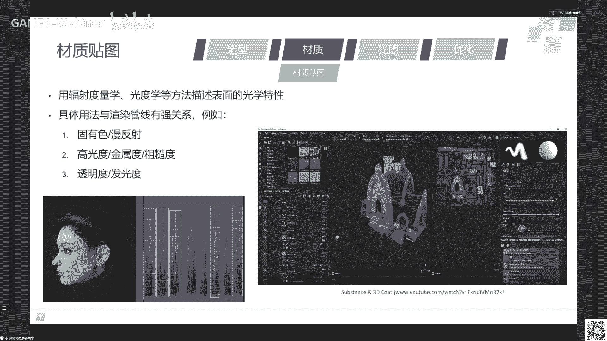
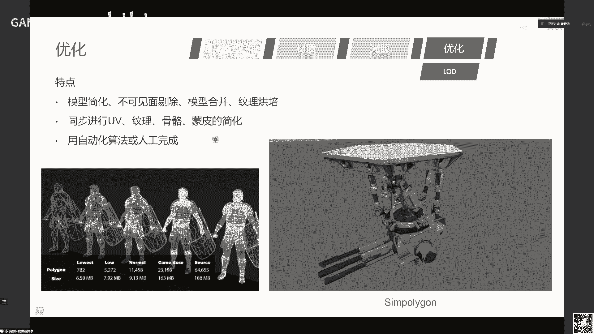
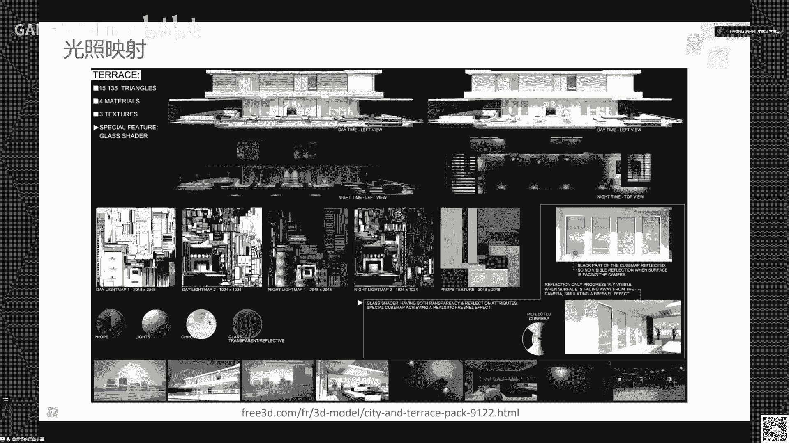

# GAMES301-曲面参数化 - P14：Lecture 14 参数化在产业中的应用(1) - GAMES-Webinar - BV18T411P7hT

亲爱的game是呃同学啊以及业界同仁啊，非常高兴，今天啊有我在啊给大家同学们讲一下菜的话在产业中的应用啊，这个我们暂停要课程，不知不觉已经过了六周。

课程已经接近尾声啊，在前面的课程里面啊，三位老师啊呃都从不同方面介绍了曲面上的话，在几何处理中的一些呃应用可以看到啊，我们再重温一下前面看的话这个问题啊，这个随着这个课的深入。

大家都对这个问题非常啊啊理解了，就是怎么把一个啊位于一个空间中的这个曲面曲面，本质上它这个二维流形曲面，所以它能够拓扑同胚于一个平面，所以呢我们怎么把这个这个这个同步同配的这个硬影射，这个函数找到啊。

就是交叉的话，所以很直观的来讲，如果一个区域一个这个曲流行把它离散成三角网格以后呢，这个问题就等价于怎么去找这个三角网课的这个一对应好顶点，一对应好三角形一一对应，当然我们我们也希望保持这个流行。

就是这个曲面的一些这个几何特性，比如说角度边长面积，还有其他度量的等等，所以我们又要去保持这个形变扭曲小，所以这个这节课是自始至终都是在围绕着怎么样建立这个一一对应，怎么来极小化这个扭曲。

还有保持一些特性啊，比如说不能翻转等等，不能自交啊，所以从这个课上面，相信同学同学们啊，从这课上能够了解这个曲面产能化的一个基本的方法理论，以及它的一些求解啊，技技术。

当然在第一节课中我也提到了这个思想呢，就是用降维，所以如果对高危曲面来讲，也同样有这样一些思想在在背后啊，然后在水面上的话，它是一个基本的一个问题，所以啊在很多几何处理的一些应用中。

都背后是有才能化的这样一些啊啊这个基础在支撑着啊，我这里就不一个一个列在我们这里，课上呢可以看到从啊前面的很多讲呃，在课程中可以看到他的话在呃不同的应用中，我们各位老师啊讲的非常深刻啊。

也非常啊做的内容啊，这个我就不一个一个介绍大家啊，我们的课程都是在b站上是有录屏，可以大家如果啊如果对他希望进一步更多的一些理解，可以去看这个回放好。

那么今天呢开始呢我想想就是刚才只是在几何处理中的一些应用，那么事实上是菜单化来处理几何处理在产业中得到大量应用，你要让我很自然，曲面上的话呢，就在产业中有着很大的应用啊。

那么我们我会在今天下午的课跟明天上午的课呢啊，介绍几个在一些产业中的一些非常典型的应用啊，其中第一个就是游戏啊。

这个很多同学都喜欢玩这个游戏，特别是这种3a级游戏啊，像这个左上角那个就是古墓丽影丽影的一个最新版啊，u15 做的u一是韩u5 做的一个啊，那么下面这一排啊就是由于我的一个新特性啊。

这个rom跟nana啊，这个权益光照以及这个虚拟结合体的一些技术啊，后面有时间我们可以再稍微聊一下好，那么这个三维游戏中的这个存在大量的这种几何模型啊。

这个模型呢就是上面的这个啊，这个贴图就是一个常态化一个技术的一个核心啊，就是怎么把一个曲面用一张图来近似的这个表达他的一些属性，比如说纹理实际上是这个上面不仅存储纹理，而且曲面上的是任何的信息。

比如说它的材质，它的法向他的一些各个一些别的属性都可以以这种方式存，因为啊曲面上的一个点可以在这个平面这个uv空间中找到一个点对应，所以曲面上你要去找到它，存储它的信息。

完全就是可以在这个二维的参数化平面上去找，纵坐标叫v，所以在这个工业界也叫uv图啊，这个学术界更多的交流，tatr纹理地图啊，这两个概念是呃类似或者几乎等价的。

那么对一些复杂图啊等等，就最终复杂图，那么它可能更多的这种分片啊，这个你可以看到这个建筑有很多很多这种不同的这个部件，那么同样我们把部件分别的常态化，然后把它平摊到一个这样的一个啊uv空间中。

这时候呢你就对这个模型的任何处理，它的渲染，它的一些光照，这个处理都可以在参数空间上去做对应啊，所以这个uv图的展开是游戏啊，这个工业界实际上还有别的任何的跟三维模型相关的。

工业界是一个非常基础的一个啊这个啊技术。

所以呢今天呢我们很高兴啊，就邀请到了啊腾讯互娱cross这个计算机和啊技术团队的负责人啊，黄旭华啊先生，来详细的介绍一下在这个游戏工业中的3d建模的参数化，背后的一些故事，一些应用以及未来的发展好。

嗯，好的好的嗯，那谢谢刘老师啊，呃很很荣幸能够在呃game 301啊，给大家讲一下这个曲面参数化技术在游戏工业里面的应用啊，然后呃我那么我是来自呃腾讯i e g啊，就腾讯互娱就是腾讯的游戏bg。

然后the cross团队啊，cross体系，然后在计算机和团队，然后我们cross体系呢是主要呃进行游戏的公共技术的研发，公共技术的研发，比如说嗯呃大家玩的这种游戏啊，他底层用到的，比如说引擎技术啊。

嗯服务器技术啊，或者说是美术生产技术等等，那么这些技术是在我们的cross团队里面进行去研究的，那么我们对游戏工业里面的底层技术是非常了解的啊，那么今天我就会呃在趁着这个机会来讲一讲。

就是参数化的这个算法，在游戏的工业工业里面，它的是这种工业级的应用。

以及我们对它的那个创新，那么呃呃我这个内容会大概分成三部分。

首先我会呃讲一下这个游戏工业的一个三维建模的一个工具，就让大家对这个游戏商业建模有一个大的一个了解，然后第二部分呢就会谈里面的一个重点案例，祝你案例会谈这个参数化的一个非常非常深入。

非常非常深入的一个应用，然后还会再介绍一些呃一些呃，再介绍几个辅助的案例来让大家理解，就是参数化的这个应用也是非常广泛的，不仅仅是在一些特定的地方可以使用，那么呃呃游戏的这个建模啊。

就是就是任何一个三维建模一个模型，它是需要首先它有造型的部分啊，有造型，那么造型就是呃勾勒出这个模型的一个三维的一个结构，然后呢接下来它有材质啊，材质呢就是指这个造型它的表面上的一些东西啊。

那么呃因为我们建模的时候只是需要渲染给用户看对吧，就是我的游戏里面只有表面就行，它里面有什么东西不重要对吧，那么所以它表面的东西是一种以一种二维的流行的方式，是去存储信息的，那么这个就是呃这是第二部分。

那么另外一部分呢呃有了表面之后呢，就可以在上面还要继续打下光啊，打个光，然后嗯然后呢最后呢就是说要对这个模型进行很多种优化等等，那么呃那么造型部分呢啊那么游戏的造型造型在制作这里面呢。

其实它是分的比较细致的，呃这里首先看这里是我这里左边列到这里分的是粗模，高模和低模式三类啊，那么呃这个这个是根据这个造型的制作的工序而言的，就是他从大家看到的这个游戏模型，它实际上在美术的电脑上面。

它是经过很多步骤一步步给做出来的，那么我我我会把这个过程稍微跟大家讲一讲。

那么首先啊首先第一步呢就是我要谈的是这个粗模出模是什么意思呢，粗模就是指我们就是建呃进行一个精细化的那个建模之前，我们先要美术，要先找到一个快速的一个原型。

然后我们可以快速的从这个圆形里面去进行这个上面的模型的一个，细节的雕刻，或者说是一些制作，那么这个是能够极大地提升我们的那个这个建模的速度呢，那么这里其中非常重要的一个触摸就是模型库了。

那么在游戏公司里面的美术团队，基本上它是有非常庞大的一个模型库的，就是啊左边啊就是一些物件的模型啊，然后还有右边的有一些基本的一些角色的模型，那么他这些角色的模型的造型呢是非常好的。

然后他布线也是非常经典的，然后呢美啊美术在进行某一个角色的制作或者某些物件制作的时候，他是直接根据这个标准的一种设计的，呃，非常规范，非常严格的布线，那么这个这种叫做叫出模啊，这是我们建模的第一步啊。

那么触摸的制作来源。

还有其他的一些方式，那就呃像这种呢就是一种叫仿真建模的方式，那么它是使用一些呃物理的物理仿真的软件，来对啊模型的衣物进行一个大体的一个造型的一个勾勒啊，那么大家可以看一下啊，那么这这种这种造型的特点呢。

它是呃大概他它需要的面数是大概是10万级别这个样子啊，然后呃全是三角形，然后再进行这个制作的时候呢，基本上是就是使用这种模拟的布料的缝合啊，拉拉动这样子。

那么所以它只要右边的一个简单的面片就可以缝到左边的裸体上，然后就形成一个裤子这样的一个样式了，那么但是这种模型它是不能直接在游戏里面直接使用的，因为它其实的质量相对也是得不到啊。

那个也是不够高的，那么还有一种呃建模的方式呢，就是你出国的建模的方式就是用三维重建的方式，就是用呃一个是左侧的这种专门的三维扫描设备，手持的三维扫描，或者是这种激光阵的相机阵的阵列的一种设备。

然后呢或者是用这种嗯在户外户外用这种设备来进行一个拍摄，那么呃那么这种这种三维重建这种模型的特点呢，就是它真实度会非常高，非常非常高啊，但是呢他的这个也是他的限制，就是说如果你要进行的一个游戏项目。

不是这种写实类型的项目，那么他就没有办法用这种方法啊，那么并且用这种方法来进行的一个建模，它得到的那个模型其实要进行后处理也会比较多啊，因为你在现实中拍照的时候。

你拍到这个物件的这个光影效果其实是与你拍摄当天的一个呃光照，天气等环境是有很大的关系的，那比如说呃太阳它在呃某个方向照下来，那么可能这个方向就会亮度比较高，但背光的面就会比较暗。

那么这种这种相当于是光照的信息，它是已经被呃附着在这个模型表面的这个上面，那么所以它放到游戏里面呢，在游戏里面的那个光照的，实际上呢它不是你在现实采样的时候那个光照，那么它在进行处理的时候。

就要呃就需要就需要我们美术去把这种光照信息给抹掉啊。

那么现在呃那么当我们有出门了以后，那么我们接下来就会进行到一个高精度模型的一个构建的一个过程啊，那么呃这里高清的模型，这里这是其中一种高模的一个制作方法，这种叫做啊雕刻建模。

雕刻建模呢就是呃往往会用在角色模型的上面啊，角色模型因为我们的游戏里面对给玩家带来的一个感受，就是说呃最最出彩的效果其实就角色角色模型，那么呃那么这种模型的特点呢，就是它在进行生产过程中。

它的那个模型的三角形的网格数是非常非常多的啊，就是达到百万级的三角的三角网格，那所以从这个视频上可以看到，就是说其实它的那个三角形的稠密的程度，已经让你感觉不到它有三角形存在，你已经感觉到有上限存在。

所以它是一种嗯嗯那么就是现在的3a级的产品。

或者说是一些呃呃质量对质量追求比较高的团队呢。

就会使用这种工序啊，那么它的操作是一种啊，可以看到就有点为什么叫雕刻建模呢，它是用手写笔，然后直接在这个模型的表面进行一个按压，或者说是一个提拉的动作啊，那么它就可以把模型的表面就像一个橡皮泥一样。

来不停的去弄出这样的一个你想要的细节啊。

然后呢呃除了这个呃交互建模之外呢，那在别的另外一些模型，比如说是载具啊。

比如说是飞行啊，呃飞机啊，汽车等等这种载具，那么在行业中也是有的。

就会利用另外一种方式来进行高模的的一个建模啊，那么这个这个就是呃用的是曲面的曲面的方式建模，样条的方式建模，那么在这种建模软件呢，它里面的编辑的基本的操作对象就是呃曲面和曲线啊。

那么它的特点就在于说它在建模的过程中，它不是不需要太多的扇形，但是它是利用呃像nerves曲线这种工业标准的一种曲线，这种光滑曲线的建模，那么它呃所以它的精度可以说是是一个无限高的。

并且呢它呃呃它是可以变成也是可以变成上新模型的。

也就是说你放到游戏里面渲染，它是没有办法去渲染一个曲线这样的一个表达的一个模型的，所以最终它也要变成三角形模型来给到游戏里面去使用啊，那么在呃那么这种像一些3a级的赛车游戏啊。

那么他呃那或者说是飞行游戏啊等等，那么这种建模方式就会是比较常见的啊，那么呃这种方式在国内用的不是很多啊，国内用的，因为国内我们知道国内的是网络比较多嘛，那么网络的话其实做赛车类的还是比较少一点。

虽然赛车类的用的可能更多的也是q版的，那么他们有时候赛车也会直接还是用多边形的方式来建。

那么呃那么这种呢这是另外一种呃呃模型了，那么这种呃前面我查到两种是高模对吧，一个是雕刻的一个生物的一个一个几百万面的高模，还有一个曲面的建模，那么现在我谈到这个叫低模啊。

那么低模呢是一种呃大家在游戏里面实际看到的模型就是低模啊，那么它的面数是在呃呃几万几百元到几万面这样的一个范围左右啊，那么呃它其中的那么低模的一个建模方法呢，就是也有好几种。

那么这种呢就这我现在叶子给大家看的这种叫拓扑建模，拓扑建模，那么你可以看到这个top建模它是怎么怎么操作呢，它是直接把这个模型进行一个点线面的一个操作，就是你是鼠标去选择一个点，选择一个线。

然后把这个点进行剖分啊，或者增加一个点啊，挪位置啊，合并啊等等，然后逐渐把一个模型啊，从一个简单的一个几何体变成你想要的一个人形的一个样子啊，那么这种建模方式在呃过去吧。

可能在呃5年前或者10年前左右的范围，这种建模方式是一种比较非常常见的方式啊，但现在的话就会用的稍微相对少一些啊，也有不少项目也还是会用这种项目，一取决于你这个游戏对这个模型的表现力的一个要求啊。

仅是需要很高度的一个真实还原，还是说有一个大体的一个效果就可以了，那么不同的项目就会用不同的方式建模，那么这种就是这种叫做top建模。

然后呢呃那么另外这种呢也是另一种拓扑建模，那么这种这种拓扑建模是进行一个叫做高模的冲突啊，那么它它是这个差别在哪呢，这个呢就是接着刚才刚才啊前面制作高模的时候的一个流程。

就高模我用雕刻的方式把一个上百万面的一个模型制作出来，但是这个上百万的面是没有办法的，一个模型是没有办法放到游戏的引擎里渲染，因为呃上百万面它本的一个模型，它本身自己一个模型的体积可能有上百兆的数据啊。

那么你这个一个模型可能就比都已经有游戏的体积的一个1/10，这么大的一个体积，所以这个是不能用在游戏里面，那么这个时候美术呢就需要把前面的工序做出来的，一个非常精细的高模来进行一个拓扑的一个降维啊。

或者是叫降采样，然后在这个高模的表面生成一些啊三呃呃四边形，网格三角形来逼近这个模型，那么这个过程在表面进行一个呃重拓口的过程啊，我们就就在行业内，你就就叫高模重拓口啊。

那么它的面数也是到几万到十几万面的这样的一个一个一个一个规模，然后也是采用的是点线面啊。

合并的操作的方式啊，那么另外呢还有一些呃，那那么前面的两种方法，那个建模起来看到效率是会比较低的，一个模型可能要做上个一两天了，这样子，那高模的话甚至可能要做上一个星期到两个星期。

这样的一个一个一个一个时间，那么呃那么所以呢我们也不是总是每个每个模型都用这种很基础的，这种方法，一笔一笔一画的这样去建模，那么我们也会呃比如说一些特定的造型，我们就会用数学模型。

它如果本身能够表达的啊，比如说右上角的这个叫做啊speech的这样一个插件，它是专门用来生成树木的，那么树木的，因为造型其实它是可以根据一些生一些生物学的原理来去模仿它，那么我可以调整这些参数。

就可以快速的生成一些数啊，那么那么所以啊那那这种建模方式呢就可以用在树木啊，植被啊，还有一些怪物呀，还有一些特定的建筑啊，左下角的一些建筑，一些呃造型比较嗯呃固定的系列化的这样的东西。

那么我们就会用这种方式来来进行建模，特别是像一些特别大的世界，比如说是一些呃开放世界的游戏，那里面的模型呢我们呃因为很多大量的一些重复的数啊啊，建筑啊等等一些怪物，那么那如果用这种方式来建。

我们就能够极大的提升我们的工作效率啊，但是它的限制就在于说它只能制作特定类型的模型啊，因为我们很难去把所有东西的建模的那个数学模型都可以归纳出来，那所以这个它也是啊，它是不能不是很普适的一个方法啊。

那么呃讲完建模，那么这个是呃就要讲到我们今天的这个主角了，那么所有的模型啊，都需要进行一个材质的一个一个表面的一个映射，就是说我需要把模型的表面里面去存储一些信息对吧。

那么我们怎么把一个任意造型的一个表面来进行存储信息呢对吧，那他怎么定位到我们哪个地方要存什么信息呢对吧。

那么这里首先要进行的就是一个空间的一个转换，就我我们首先需要把一个任意造型的一个模型的表面。

然后把它给映射到一个长方形，或者说是矩形或者正方形这样一个地方，那么它呃模型表面上的每一个一个点，那么对应到了就是以这张截图上面的每个像素对吧，那我们就可以把这个信息存储在这个举这个正方形的上面啊。

那么呃那么呃那这个方法就是呃呃这个首先这里，那这里谈到了这个现在这个结构到材质映射，材质映射是干什么的，材质映射就是。

材质映射是专门给这种叫做材质贴图来使用的啊，就是啊可以看一下右下角这个房子，那么我们把这个模型拆成很多块，映射到右边这个正方形之后，那么我们就可以利用这个表面的那个绘画软件。

在直接在模型表面进行一个涂抹，就是一个绘画，那么这些信息就会同步的去传到了右边的这个这个管理上面来啊，那么呃那么这种这种这个映射的这个过程用到的就是参数化的技术啊。

那么并且这种参数化呢它是对这个呃进行这个映射，它是有非常多的要求的，那么这个要求如果如果如果你的制作不满足这些要求的话。

你这个模型的质量会比较差，那么这里我看看它，我们看看它有哪些要求啊，首先就是你的这个你这个造型啊，就造型不能够啊啊我我弄一下笔出来，就那个激光笔，就你这个造型你放在这个这个矩形空间里呢，你不能斜着放啊。

因为因为引擎在进行渲染的时候，他会进行一个光栅化，那么它在纹理上进行采样的时候，它其实在uv空间仅采采样的，也就是它是横着和竖的采样，横着差值和竖的进行差值，那么如果你的这个造型你是斜着。

那么你就会导致导致它采样的时候经常会很容易会跨像素进行差值。

就是你没有你在同一行，你在同一排的像素。

那么你在像素之前去进行差值，那你相邻就往是两个像素来进行差值对吧，但如果你斜着走的话，你很容易会在一些三四个四个像素的交界的地方，你在很短的距离会跨越好几个像素，那么这时候的采用效果就会变差。

就很容易会造成这个纹理在模型表面上会产生一种锯齿状啊，那么因此呢这里的呃游戏里面进行参数化的话，就是会要求这个一定要做得非常的横屏竖直啊，那么它基本要求是你的图案的对称轴要与u左后臂轴平行或垂直。

另外呢你这个也在保持横平竖直的情况下，你要尽量低的扭曲，你不能形变太大啊，那么另外呢材质映射呢它还有一个特点。

就是它会共用纹理，共用纹理就是说有些相同的图案，相同的图案它会映射到模型的同一个区域，比如说一些木头的位置，它可能会不同的地方都会映射到同一个木头的地方啊，然后比如说这个头发左下角这个头发。

那它这里头发其实总共只有五六根七八根，但实际上他满头可能有四五十个头发，它其实就被重叠的映射到了这个这个呃纹理上面啊，那么呃那材质贴图的话，它材质贴图本身呢又是又是另外一类问题了啊。

那它这里是涉及到一个引擎的一个渲染的一个方法，就是这里面的材质纹理，它保存什么信息对吧，它用的是辐射度度量学的或者光禄学的，或者是一些几何光学等等这种方法来进行一个材质信息的一个编码。

那么它就和像管线强相关，比如说一些呃固有色，固有色和漫粉色的一种存储法，或者说是高光度，金属度和粗糙度这种p br的光照模型，或者经典的一个镜面反射模型啊，还有透明度，发光度等等。

那么这些不同这种叫做呃辐射度量学和光度学等等，这些信息都会用在材质贴图上，就会共用啊，共用材质映射啊，这个叫材质映射啊。

那么呃另外呢另外一种呢叫做凹凸贴图，凹凸贴图呢它也是共用材质映射的一种一种贴图，那么它呢主要是它就不是表示的是，它并不是表达物体的表面的材质信息，而是表达物体表面的微观起伏啊，微观起伏。

那么呃那么凹凸贴图就有很多种做法啊，就是bp bp mapping，normal map，displacement map等等，那么这种这些这个做法呢它是一种行业比较标准的用法啊。

我们可以看到就是说像这个模型，这个是模型的一个原样，它没有使用法线贴图的情况下，你会看到它的这个是比较光滑和圆润的，在你使用了反向贴图之后，看到物体表面的细节会产生一种就会一下子就他宁可会牺牲。

宁可牺牲你这个模型表面的一些造型的一个一些细节，就是说你自把它扭曲会比较大一点，但是一定要保证保证这个u映射的线条要非常的横平竖直啊，那么这个原因就是在于说啊光照映射是一个什么东西呢。

就光照映射它不是这个呃美术创作的的内容，它实际上是我这个模型放到引擎里面以后。

放到引擎里面以后，通过引擎的这个光照的算法，这个灯光，太阳光等信息打到物体表面的这个辐射度，存储到这个光照映射对应的这个纹理上面，存储到上面。

那么这样的话就使得这个物件看起来有这种啊很很真实的光照效果啊，那么这个是由引力产生的，那么那那也就是说每个物件的表面都整个场景，假设你是一个非常大的事件，那么这个整个整个世界。

你看到的所有地方都会有对应的光照信息存储，那么所以它会使用大量的消耗大量的一个存储的一个量啊，那所以所以光照映射的话，一般在游戏中会使用非常非常低的分辨率啊。

就是如果你材质映射用的是比如说是512352的分辨率，那光照映射可能对应只有128甚至64x64的一个分辨率，那么所以光照映射对横屏数据和要求会非常高，否则的话你在这么低分辨率的情况下。

你的这个呃采样的差值。

那个锯齿会非常非常严重啊，好那这个映射的讲完了，最后就谈到就是优化，那么我们前面有了模型，有了材质，有了纹理之后，那么呃这些模型呢最终我们还要对它进行一个简化，就是我们在游戏里面看到的模型。

有些是在我们画面很远的位置出现，有些是在很近的位置出现，那么这个时候其实引擎是给到你不同的精度的一个模型，去渲染他们那近景的时候，你看到的那个模型其实已经渲染是这个非常高密度的模型。

但是如果当这个角色走到很远的位置，那么其实隐形渲染其实是这个模型啊，那么这个机其实就叫做the l d啊，level of detail，那么在进行l d的时候呢。

也是需要进行对应的像ue 2文理混合蒙皮等等的一个同步的简化，那么这里面也是要用到参数化的技术的啊。

好，那么我到现在我就把这个游戏建模的这这个这个方法，和里面用到的一些技术大体讲一遍啊，那么呃后面呢我接下来我就会开始谈啊，在里面的参数化部分的内容啊，那么参数化在这个呃建模里面。

它其实是首先一点就是其中一点就很容易理解的，就是它的主要的应用啊，主要应用就是把这个模型的表面映射到这个，刚才讲的那个正方形区域对吧，那这个是很好理解，特效的映射，造型映射光照映射对吧。

我刚才举了好几种例子对吧，那么这些就是主应用，但实际上它使用的地方远不止主应用看起来那么多啊，那么它还有很多嵌入式应用，嵌入式应用就是它有呃模型之间的信息的迁移的迁移，配准的一个手段啊。

然后还有呢就是呃纹理装配中啊，这个图案的这个原画的设计稿与模型的一个内容的，模型的内容表面映射，还有就是进行纹理的几何压缩啊，还有进行一些造型识别，我合度评判等等，后面我会都会举个例子来跟大家讲明白啊。

那么先来谈一个是主应用的案例，主应用案例啊。

那么主义案例这里就是啊还是才讲到这个光照映射啊，那光照映射光照映射就是这个呢就是材质映射啊，我们在行业里面会叫e u v啊，就是第一套uv，一般这么叫，这个就叫光照映射。

就是2u v2 位就是把光照信息映射到这个纹理上啊，财经映射是把这个材质信息映射到这个物理上。

那么这个就是基本的uv的一个原理，那么这是一个实际会用到的一个光照图啊，但这个不是我们游戏中的光照图啊，光照映射，那么我们来看一下这个建筑啊，这个建筑它的材质映射是这张图啊，材质映射问题是这张图。

那么它里面的材质种类就比较稀少的，比如说木板啊，墙壁，然后一些柜子，屋顶等等，那么它的内容是是很少了，它大量的，比如说这些区域它可能都共用的是同一个墙壁，那么它就会映射到同一个地方啊。

那么这个叫财经映射，但是光照映射呢，你是没有办法这样共用的，因为在这个物件的任何一个位置，它的光照信息都是不一样，就每个地方都不一样，你你你你是不能够确保说哎这个地方关的话，这个非常完全不可能的。

那么所以光照映射就得完全毫无重叠的去平铺，把物片的表面的每一寸给平铺到这个空间里面啊，那么这里看到了，这里是有四张光照映射图啊，分别是白天的白天的高精度的2048x2048的光照映射啊。

白天的低精度的1024x1024映射，以及两张晚上，那么它对应出来的渲染效果啊，就是白天的两个效果，晚上的两个效果啊。

那么这个就是光照映射的一个原理，然后呃光照映射啊，刚才提到这个光照映射叫r u v嘛对吧，2v制作要求就有这些要求啊，第一个你uv展开之后，你拉伸拉伸不能太严重对吧。

那那否则会导致这个呃光照的那个那个密度啊，过度不够光滑啊，那还有呢就不能用斜斜的边啊，你看这个斜边就会导致这里的光照就会产生句式啊，但是如果你把这个u v导变成这样一平直的。

那么这个这里就不会有这个句式出现啊，那么并且他一定是不允许任何重叠的啊，这和它材质映射不一样，这个这也是一个材质映射的一个uv，它是可以重叠的，但是光照映射都不允许的，那这个是光照映射啊。

那么另外呢对称性要可以保留，因为如果你如果你的这个对称性与这个uv空间的那个轴向，不不水平或者垂直的话，也是容易出现这种斜边的，也是会永远出现这种采样的不好的效果，那么呃还有呢就是切割。

就切割位置就有一些光在这个模型表面是光滑的区域，这个地方如果把这个切成两个u v导的话，那么在引擎渲染中很容易这里会产生漏光啊，就一个过度不自然啊，因为引擎的分辨率，引擎那个因为那个光泽纹理分辨率很低。

所以就很容易出现这种情况，那么另外你又你又不能切太碎啊，因为你切的太碎，每个三角形一个uv导，那么你就会导致这个纹理中间的间隙要留很多，那也会导致空间浪费是吧，那么那最后呢还有一个要求。

就是说你这个装箱，你这个切好一个uv导，你要很紧密地排布在这个空间里面，那么避免这种纹理空间的浪费，导致那个游戏的体积也变大啊，那么这些就是2v的制造要求，那么所以呢有这种要求的情况下呢。

实际上行业里面进行这种光照映射的制作呢，实际上是没有很好的自动化软件可以做得到，就是他这个要求太复杂了啊，就像这么一个模型这么一个模型，那么他现在其实是在行业里面大部分是人工制作了。

他大概需要花30~40分钟时间把这个模型变成这样的一个映射，一个一个一个一个2v的一个映射，然后对应的这些就是一些自动软件产生的效果，这个是real效果，在unit的效果。

那我们会看到unreal和unity，它对比人工这个东西的这个质量是要差很多的，从首先这空间利用率就差的比较多啊，你看这有很多的空隙啊，很多的空隙啊，然后另外呢这个unreal这个呢它就是切的太碎了。

这个切的太碎后，导致旋在在渲染的时候会产生很多的这个呃那个黑边啊，就刚才提到的，就这个黑边就会出现这种情况，那么所以实际上行业里面进行二维展开，就用人工来进行的。

那么所以呢为此呢我今天讲的这个案例就是提到的是，我们我们做了一个叫做全自动的啊，这个是我们研发的，那么看一下这个效果啊。

我们我们是可以做到嗯，替代人工，可以啊。

这个播放一下这个效果，那么这是一个输入的一个模型啊，这是一个模型。

然后它是有人工做好的uv啊，就材质uv，那现在这部分呢就是一个自动化的一个uv生成的一个过程，然后再次拉直啊，就确保线条与uv线条垂直。

然后呢缩放确保密度合适啊，然后对它进行一个装箱来保证那个空间给啊完全利用了。

那这个是2v就做好了一个啊。

那现在是他底下下面那个模型的2v制作，啊拉直啊，缩放。

装箱。

然后进行烘焙，有了这个2u正在进行烘焙好，大家看到左边的这个模型，它有了这个光照纹理之后，它的那个立体感一下就强了很多了。

那么呃那么我们这个ru v的制作流程啊，就是大概我会做一个大概的一个说明，然后来说明参数化在这里面是怎么使用的，怎么使用，那么它大体上的步骤是分为啊一个叫有切割展屏的过程，然后还有芯片拉直的过程。

前面拉直，然后是尺寸调整啊，确保这个uv的密度合理，然后最后做个紧致装箱，然后确保空间不会浪费，那么在前面切割展平以及形变拉直，这两个步骤是大量的使用参数化的算法，大量的使用方一就是大量使用。

而且是开发已经定制了我们专用的为这个工具专门开发的参考算法啊，那么首先我们来看一下啊，就这个第一步我们在进行参数展开的时候，我为了确保它的扭曲不要太大对吧，我们首先第一步要先进行一个切割对吧好。

那我们看一下我们怎么切割的啊，那么切割呢我们会用的是一种以啊一种呃，其中有切割方法就是过量切割加拼接的一个方法，就是切割，切割方法就是我先把东西切的特别碎切碎，比如我先把这个模型切得这么碎啊。

其实啊切这么碎，或者说我我把这个小零部件我切成这样子啊，切成这样的一个三个部分对吧，然后呢我们对它进行一个拼接啊，就是说这个这个这个切割肯定是过量的啊，就肯定他肯定是肯定是不满足我们要求的。

那我们就把它拼接一下，拼接之后呢，我们就对它进行把这个模型拼一下，然后对它进行一个参数化的展开，展开以后我们来看一下诶，这个拼接完了之后，这个效果是不是我们能接受的啊，啊就这个过程。

所以所以实际上就把这个切割过程变成了一个过量切割，再拼接的一个过程，那么我们在切割的模块呢就可以判断出哦，那么这种这个模型的这六种拼接方式，我们可以判断出来这个拼接方式是比这另外这几种拼接方式要优的啊。

那那么呃那为什么比这个u呢，因为你这个拼接完之后，这个这个造型其实是它已经丢失了对称性，丢失了对称性，对称性就是你看这个模型这个原模型它是这样子的一个造型对吧，但你你展开之后。

你变成这样对称性就丢失了对吧，你对称性丢失，那你这个实际上你放在这个呃，因为呃那个uv空间里面也很容易就是就出现斜线采样，斜线采样对吧，那么这两个造型呢它的它的对称性是没有丢失的对吧，但相比之下呢。

这个这个切割呢就比这个切割形变要小一些，那么那我们就认为ok那我们就选用这种拼接方式啊，那么这个就是我们切割算法的基本原理，那么这个切割的整个过程中是要进行非常多次参数化的，非常多的参数化。

那么我们用了哪些参数化呢啊那么就是首先就是非常经典的，就是我们使用的是一个参数化的一个组合啊，就是经典的参数化，这里有two参数化，还有l型参数化啊，那么然后呢还有a i a i a p啊。

琉璃刚老师的a r a p参数化，还有呢就是呃还有一些改进的一些无翻转的a p参数化，还有呢这个演c shell的三句话，c shell 3句话也是我们中科大的老师和同学的一个研究。

然后还有一些增量参数化，那么这里面也有的有一些也是我们自己的一些呃创新的一个方法啊，那么to的参数化啊，那to的参数化就是to的参数化，它其实呃把这个模型它就能变成右边这个样子，那形变非常大对吧。

你所有东西它都能变成这个这个这个样子，那么他好像看起来没什么用啊，但是但是实际上他的也是很有用的，因为它能够保证很多意识数学特性，那基本的数学特性就是它一定是没有翻转的，也没有重叠对吧，他一定没有算了。

没有重叠，那么但是它就会扭曲会大一些对吧，那所以它不适合直接用来最终使用它，但是它适合作为别的参数化的初值啊，因为你初值是一个绝对好的过程，那么你在后面进行参数化的那个优化的过程。

你如果能一直维持这个数学特性，那么它从一个好的初始一直到最后它这个都是无翻转无重叠的，那么图纸参数化它主要起到就是一个初始化的作用，那么另外就是经典的lsm参数化了啊，lsm 3块。

那它的优势优点就在于说它速度很快，速度很快，并且呢在呃有一些你切割的情况，比较在某些切法的情况下，它的这个扭曲还是比较小的啊，就你跟造型有关啊，那么比如说这个房子的这个外轮廓，它a它长成这个样子。

其实扭曲是比较小的，但是呢它在很多情况下它扭曲又会非常大啊，就比如说这个造型，这个造型它进行r c m参数化变成这个样子，那实际上这个扭曲就已经过大了，就是你下面这个这个圆柱就变成这么大一个东西啊。

它因为它是一个conformal保角的一个造型，那么所以靠ml cn方法这个经典的方法是不行的啊，这个是不行的，那并且呢它也是不能保证没有翻转不重叠啊，对那么l c它也是可以作为一个什么情况呢。

它可以作为一个我们的整个参数化这个复合流程中的一个，其中一个中间步骤，就是说如果我这一步这个模型用lcm展开之后，它的那个形变我们判断它是不大的，那么其实那么这个结果我们就可以采用啊，我们就可以采用。

但是如果它出现形成比较大的时候呢，我们就会从ac的这个值又会接到这个ai p的参数化上面啊，这个也是ai ai ai ap参数化本身的一个标准的用法，这里面的一个用法就是拿l先作为一个初值啊。

那么a i d参数化这个就是我们刘立刚老师的老刘立刚老师的研究啊，那么那么呃我们可以对比一下，就是说呃lsn参数化它的这个参数化，它的形变这个形变就比啊这个啊这个是i cm的参数化。

这个是a i p参数化，那么这个它是更好的保持了它这个形状，它是优点是扭矩小，那么但是呢i p参数化呢，本身呢它又不能够在某些情况下又不能完全保持无反转或者无重叠，它有时候也会产生一些副微小的重叠啊。

这个是标准的i p的算法，是不是也会有这种情况，那么我们也就做了一点点的修改啊，那么在迭代的过程中，当它发现它有呃出现了形变的时候，我们就停止迭代，做一些记录等等。

或者是说我们在最后发现这种微小迭代的时候，我们对它进行一个解重叠等等啊，那么这个这些无反转的片段就是我们自己做了一些改良啊，做做了一些改进，很微小的改进，然后它的可能速度就会慢一些啊。

哦对他是解决的是无反转的问题，但是并不能保证重叠啊，因为因为因为重叠是一个全局的一个一个问题，那么那么那么为了解决这个无重点无重叠的问题呢，那我们也还用到另外一个c shell的参数化。

那么这个参数也是我们中科大的老师学生啊来啊的一个研究啊，那么那么cc参数化，那么呃cc参数化的特点是它的优点是既能保证无反转，又能保证无重点，那么我们可以看到他给一个非常复杂的一个奇奇怪怪的造型。

它它也能长出来，而且是啊扭曲平均下来也不大，但是也而且还完全没有重叠，也没有交点，也没有看准啊，那这个是需要参数化的一个东西对吧啊，那么但是呢其实有这么一个强大的能力呢，其实也不见得是好事啊。

因为因为呃你c c c32 ，如果他出来了这么一个效果对吧，他他其实是不利于后面进行一个边界的横平竖直处理的啊，不利于后面也不利于后面装箱，在这个把这个uv空间完全装满啊，所以虽然他在参数化的这一步。

它做到特性非常强，但是实际上对整个自动uv展开，它是效果是不行的啊，效果是不好的，所以所以所以呢啊这里也是个例子，那比如说用c项参数化，那它就会出现放在我们的那个呃切割那个里面，它那个那个循环里面。

它就会a以这个结果出现，那么这个结构是不利于装箱，如果是ap 3的话，它反而会就是因为发现a中间产生交叠等等，它就会进一步会把这个东西切切开切开，所以反而这种结果是我们想要的，那所以c需要参数化呢。

就是会用在什么地方呢，就是就他就不能直接用在我们的主循环里面啊，像啊这个a i p3 句话，这里会有一定的焦点，实际上是没有，这些也是更多的例子啊，就是一些轻微的焦点。

那么这种轻微的焦点我们人可能看不到，但是你放到游戏里面去渲染的话，那这种焦点地方的渲染的效果是错的啊，那么这也是为什么人工要细致花很多时间展开的原因啊，那么所以c项参数我们往往是在什么时候处理呢。

就是往往是在而ab ab 32之后用来处理狭小的重叠问题的时候，我们才会把i p的结果啊进行一个重置，然后重新进行c项参数化的参考，那么这样子因为前面a p已经保证了参数化。

结果那个切割的造型在这个切割框架下，它的造型已经不错了，那么c shell只是解开一些微小的重叠，它一定不会导致整个造型座椅对导致一个巨大的扭曲啊，那么这种情况我们就会调用c下发。

那么最后最后呢还有就是一个增量参数化啊，增量参数化增量方式也是一些，那么在呃也是一个特定的需求，就比如说像这种造型，像这种造型，那么我们有如果你为了扭曲小。

而把中间的这个这个立起来的这个柱形的这个东西切开，跟这个平面切开，那么实际上你是导致这个uv的展开的那个uv导的数量更多，切割缝更多，那就违反了这个二uv的那个制作的一个要求。

所以呢美术往往会把这个东西就拍平，就把这个四个立起来，这个柱面就强行压平，就变就不压到里面去了，你知道，那这样的话就优于导数量，就从五个变成了一个对吧。

那么如果说我们直接对这个模型进行一个lcm参数化或者a p3 数化，它就会出现它就会均摊这个形变，就会产生这种效果，分三种效果，那因此呢我们就不能这么做。

我们得先用一个ai k3 数化对这个平面进行一个参数化结果，然后呢再把这个呃四个柱面拼到这个上面，然后对这些拼上去的路面进行一个增量的参数化来得到这样一个结果。

那这样子我就可以保证外面的这一圈它是严格保持这个造型的里面，那也就是它形变就集中在里面这个位置啊，那么在经过后面的处理的话，那这个展开的效果就会非常好，那么这个就要增量的参数化啊，好那这个这讲到这儿呢。

就是我们的这个切割展开的一个步骤啊，那现在要讲的第二个后面的一个步骤，那么前面的步骤把这个uv导的展开已经处理好了以后，那我们就可以那个啊就是嗯，对它进行一个拉直了，就是说你前面展开。

你为了让他呃得到一个非常好的一个呃形变，就形变比较少一个造型对吧，那么它是有可能会出现这种造型，就这种造型它其实每个三角形它形变其实不大啊，他可能每个你每个一看诶，他也没有特别扭曲的很厉害。

但是他那种造型他就逐渐的那个扭曲叠加，最终你形成了这么一个弯曲的一个造型啊，那么这种造型啊就前面提到了，就是说你你但凡有这种斜线，那么在烘培的时候就会容易出现这种锯齿啊。

那么特别是如果你的那个呃光照纹理分辨率越低啊，那么这个具体就会越大，我们看这里的具体大小，它其实和这个这个光照纹理背后那个三格的大小是一样的啊，我们可以看到这里，这里看这里一个三格，一个格子，一个格子。

一个格子对应一个像素，那么你你这里的句式就和和他在这样跳变的时候，它就会容易发生，很容易发生去死，但如果你拉平的话，它就不容易啊不容易，那么所以呢我们就要对前面切割展开的那个效果，进行一个拉直的效果啊。

那么这这里进行的其实就是一种从平面到平面的一个，参数化的一个计算，那么我们我们那么我们用到了这里的一些参数的方法，就是平面和平面的我们做了一个二分类啊。

就首先就是说对于一些呃相对的内部边线条的规律比较明显的，就比如说你看这个造型，它其实有很多整整齐齐的一些边造型对吧，那么规整的内部边，规整的uv导，就这里的标出来是红线。

就是我们认为这些红线我们经过检测，那么我们就呃，金我们就对它进行一个拉直，那么另外呢还有这种u v导，那这种u v导它内部其实都没有这种很规律的线条，那么我们呢就只对它的外轮廓进行一个垃圾处理啊。

那么呃那么这种因为导它，那那那这种斜面会导致采样问题呢，那实际上是不会的，因为如果美术它在制作一个模型，他如果内部的线条是这种凌乱的线条的话，那说明他这个模型其实表达的是一个曲面。

表达的是一个石块或者是一个三体等一个造型，那如果他表达是一个非常规则的光线，很柔和的东西，它其实不会用这种内部线条的，他会用这种线条，那么所以这种这种模型我们只要保证它外边界拉直。

那外边界的部分没有锯齿就行了，那那水质基本上分成两类，那么这个也是我们啊这个这个是我们呃根据呃我们创新的一些呃，根据也是根据现有的学术研究做改进创新的我们自己的方法。

那么呃那么这里我们会用到呃厂的方法啊，这场的方法啊，之前的老师们上课应该也提到了，就是标价厂不view的方法来把这个计算计算这个呃每个三角形的一个厂，然后呢把把这个厂呢对齐到这个呃u轴和y轴啊。

然后呢又通过呃优化每个扇形与他自己对应的场来对齐，这样一个几个两个步骤来使得这样的一个造型变成这个样子啊，啊以及这个造型变成这样子啊，那么它的好处就是内部的边可以规整啊，那么另外一个就是杂乱。

内部边杂乱的意味呢，外边一拉扯，那么这个啊是啊，叫做我们的就首先会对它的外轮廓计算一个嗯一些角点，然后把这个角点算出一个多方形的轮廓啊啊，然后呢对它进行一个固定外边界的一个一个内部的一个参数化啊。

内部的参数化啊，那么这个这个也是呃用到了中科大的老师傅老师傅向明老师，还有啊还有啊刘浩宇同学的一个一个一个研究啊，然后呃像前面的这个这些呃，像c需要参数啊，这里用的也是呃付老师刘老师。

还有呃数建平同学的医学研究啊，然后另外呢还有一些呃更更加细节的一些参数化啊，那么这个呃这些狭长的区域参数化，那就是比如说我这个uv导我进行a i b a p参数化，或者说是lsn参数化。

我得到这么一个结果了对吧，那么这里其实看起来形变是很少的啊，还原度很好，但实际上游戏里他是不能用的，为什么呢，因为这个区域啊，这个这就是这个这个柱面，这个外面这一圈这个区域。

这个区对应的这个这个多边形的这个狭长区域，它太窄，它窄到就是它比一个像素还要小，它比一个像素还要小，那么那么它的光照呢就会和旁边的上面这些光照就融在同一个像素里，所以它的光照就会产生这种叫漏光的现象啊。

弱光下你看就是这种阴影就踩过界，踩过键跑到上面去了啊，那么所以碰到这种情况呢，尤其在没有游戏美术里面，就会把这种位置给拉大，就使得它不要太小，那么使得它的光照这个位置的光照是存在这儿的。

就是这两侧的不会共用同一个像素，那么你看看到这个光照效果就有明显的改善，就是边界会变得更加锐利和清晰，那么这种叫狭长区扩大，那么这种就进行一个一个局部的一个参数化形变，那就保持这些位置不变。

然后我破定了小仓区域以及小商区域的那个啊拉扩大方向之后，扩出去啊，那么这个这个狭长区的一个参数化啊。

那么呃，呃然后呢呃那么参参数化，刚才这个这个是就是我们提到的参数化的这个用法，那么呃参数化算法本身了，那么最后呢你你做餐的话就免不了一定要做这个装箱嘛，啊一定要免不了做这个装箱。

那么装箱呢我们这边也是啊也是要做了，也做了不少功能的，那么就是说装箱就是要把这样的一个一个东西很紧致的装到，变成了这个样子对吧，然后把这个装到这儿，那么呃嗯但这个可能就不是我们今天讲的重点了。

因为我们主要谈的是参数化的方法，那么这里可能要用到一些呃呃解决一些呃组合优化问题啊，一些np np完全的问题啊，那么对u v导进行一些拉伸上说话啊等等，然后再把这个东西装满。

那么我们这个效果它也是我们的专项效果，那么像这么这么密集这个模型这么密集的一个装箱，如果进行人工的一个装箱呢，它只要消耗四个小时的时间啊。

ok那么呃前面我谈完了，就是这个叫做呃主应用案例啊，主应用案例，现在我们再来谈一下，就是一些嵌入性的案例啊，嵌入性案例啊。

那么呃那么呃这个首先一点就是模型的布线，模型布线，那么模型布线呢，他的这个需求表面上看起来就不是说我要进行一个参数化对吧，他是要把这个一个模型表面，这个上百万面的这样一个非常精细的一个模型。

它的表面要把它给降维离散化道，降产量到这么一个稀疏的一个网格对吧，那么这个过程那这个过程看起来跟参数化好像没什么关系对吧，但实际上它里面就用到了参数化的算法对吧，那么呃前面啊老师们上课应该也提。

就也提到了，就四边形化，那么那么这个模型的布线，它其实是和四边形画是有点类似的啊，但是呢它的应用，但是在游戏里面进行模型布线的目的并不是为了四边形化，就是它产生的这个结果，它不是严格的四边形。

并且它的走线好，就是他是遵循着这个角色的一些呃运动的规则。

就是它它的布线要求，不单纯说你只要是四边形就可以了啊，还有哪些要求呢。

就是说啊他是满足运动的需求啊，就是说比如说你在这里布线，我知道这个位置这里是有个关节的啊，有个关节，那么并且呢我知道这个关节是要朝这个方向弯曲，那么呢我这个固线呢。

首先一点我要保证的是我整体的这个东西的布线，要沿着这样的一个呃经线和纬线这样一个两个方向的布，也就是大体上它呈现这样一个环向环境环向的一个结果啊，其次呢我要知道他的这个呃这个这个在弯折的背面这个位置。

我要给它，因为这里形变会更多，我为了让它形变的时候，这个光滑性能够得到保持，所以这边要给到更密集的一个线，一个线的一个一个一个点，那么这里呢那么这个地方呢呃就可以给少一点，内测就可以少一点。

那么这个就一种满足运动要求，那么其实你目前一定要满足对称性啊，要满足很严格的对称性，就是说呃啊不然就是你做的动作造型人产生不对称，就效果不好看，那么还有呢你的这个线不仅仅向四边形。

而且是要严格的环形线啊，严格的环形线，就是说你不能说我从这里转一圈回来，从背面哎这个线条跑到这儿来，再转一圈跑到这儿，这样不行的，因为就是如果你如果是环，如果是螺旋线啊，就像这种螺旋线从这出去。

从这进来，在螺旋线，那你会导致美术在进行一个修改这个模型的时候，他是很难操作的，因为在一些比如说30838呀，它会有一个选线的操作对吧，那个他就他就延长线，1111选，他就把这么多条线一起都全选上了。

但是如果你是一个严格的环境，你你选择它就刚好把这个环境给选上，那么美术如果想去把这个环形线进行一个编辑，拉大或者缩小，那么它就比较好操作，但如果你是个螺旋线，它就没有办法，那就没办法。

那它是所以螺旋线是一种编辑不友好的一个线条啊，那么另外呢就是说呃还有一个保证一个起点对齐起一点呢，就是呃就是这呃就是从头火的一个概念，就是说你这个点的度是不是四啊。

那么就这些点的连线要呃这些起点的位置要对的比较整齐啊，要对得比较整齐，就是那么放的位置要符合人对这个手掌这个理解，你要刚好整整齐齐方式，但如果我们如果我们不按照这个手掌了，这样去理解。

就对其线网络完全按照模型表面的曲率来计算这个起点呢，那这个起点的位置其实它是会歪歪扭扭的，它可能大体都在这个位置，但可能一会在这，一会在这就是，而且可能这里两个起点，这三个起点它会有一个轻微的不整齐。

那么这时候产生的这个布线的效果就会很差，就是很差啊啊那么这个是叫自动布线与四边形化的一个差别啊。

那它也是脱胎于四边形化。

然后比四边形要求更高，那么啊那么在进行这种示范下需求，那么它其实就是要用到参数化啊，那么参数化的原理就是说我们来界定这个东西的整齐性，我们其实在模型的表面是很难界定的，以及我们界定它的环境。

现在模型表面非常难界定，那么我们的做法就是说，我们通过一个切割的方法来把这个和和四边形画画的做法是一样的，我们通过切割的方法来把这个手掌模型给参数化，到某一种二维的流形上，就可能是个平面。

它也不一定是个平面，它可能就是一种二维流形，二维流形，那么呃举个例子，我们这个手我需要对这个起点连接到这个点，我画一条横纺线，那么我就把这个点到这个点的路径旁边的一个小片给割下来啊。

我随便用一个图的一个搜索算法找到一个路径，然后把这个割下来，然后把这个表面进行一个参数化，它就变成这个样子啊，变成这个样子，那进行参数化之后呢，我就在这个参数化的上面进行画一条严格的直线，严格的直线。

然后最后呢再把这条严格的直线啊映射回这个模型上，那么这时候我们就在这个模型表面上得到一套非常非常完美的线条，没线条，然后打格子也是同样一个道理，就是说我们也同样把这个区域。

我我这里的区域的拓扑是比较凌乱的对吧，那我把它映射到这么一个区域，然后在这个区域上画这种网格，整整齐齐，网格再把这个网格运回去，然后再把这个模型的网格变成这个样子。

那么我们就可以把这个凌乱的网格的这个拓扑给变成布线，就会变得非常整齐啊，那么那么这是一个呃这个呃无缝参数化在模型布线上的应用，这个应用就是这种就嵌入式应用，那么还有其他更多的应用啊。

那这里我就呃大体上的去概括的描述一下了啊，就是那么其实啊这种嵌入性，因为我可以我们其实可以理解为就是其实一种信息迁移，就是我们把参数化作为一种信息编码的方式。

就是我把模型表面的信息编码到参数化的一个空间，然后又把这个空间又映射到另外一个模型上，然后把这个信息就通过这个参数化做一个载体，就转移到另外一个模型上了，那么比如说这个右右上角这个动图就是个案例。

那么它实际上是一个呃呃三维扫描的一个一个一个模型啊，三维扫描一个模型，那么它是通过呃一种呃映射的方法，把一个模板，把一个模板这个蓝色的模板给映射到了这个三维扫描这个人上啊。

就是这个肉色的这个就是人把映射到它上面，然后呢这个模板模板身上是有那个呃骨骼和蒙皮，以及对应的动画的这个信息了，但是你至少照片扫描出来，三维扫描这个角色是没有这个信息，那么但是我建立好是他俩映射之后。

那么我一我驱动这个模板的进行运动，它就可以啊实现这个照片扫描这个模型的运动啊，所以我就不需要对这个照片扫描，得到这个模型来进行重新的蒙皮以及这个动作调整，那么这个那么这就是一个很好的一种信息迁移啊。

那么但是但是这里这个例子啊，这个例子我我我这个举的不是很恰当，因为这个例子他用的可能不一定是参数，它有可能参数，但但跟叉叉同类的技术，就比如说非刚性配准啊等等，这个形变技术它也是很差。

除外也都差差不多啊，那么呃这样的一个映射的技术啊，然后呃他就可以把啊top结构蒙皮权重骨骼等动画信息啊先移，那用到比如说大家在玩游戏看到了一些什么捏脸系统啊，或者是角色定制系统呢。

它背后就会用到这种技术啊，那实际上这么多的角色，他其实可能调的都是同一套动作和同一套脱口，但是我就需要有一个迁移，可以迁移到玩家调整的各种各样的角色啊，不同的造型角色啊，然后呢啊还有一些案例啊。

那么这种案例可能就大家比较不容易想到的就是造型识别啊，造型识别，那么造型识别它可能它不会作为一个呃，一个一个肯定不可能是作为说艾文，就是在游戏里生产中要进行一个上去识别它。

不会它是作为你整个计算流程中的一个止步，作一个字不错，那我识别一下你的造型，然后我根据你是不同的造型，我决定干什么，那么这里也是可以用参数化的，就比如说我们可以找到两条固定的边界线啊。

然后啊把这个边界线，把这个内边界线和外边线啊分别映射到呃这个矩形的啊，上面这个边和下边这个边，然后这里再找一条最短路径，然后映射到这两边，然后对这个造型进行一个固定边界的参数化啊。

然后我们来观察参数化后里面的每个三角形的扭曲的情况，来进行一个统计，那么其实我们就可以判断出这个造型是不是一个近似的啊，圆圈啊，或者是一个近似的一个别的什么造型，我们可以通过这个来界定。

那么我们在这个映射后的这个空间来进行一个设计，一个判断函数就会比在这样一个任意的一个空间里设计一个判断函数，要容易得多，容易得多，那么所以这个就是一种呃呃造型识别，或者说叫近视造型识别一个方法。

这一个方法啊，好那么啊那么呃这个案例介绍我我倒在那介绍完了，所以呢我就来做一个总结啊，做一个总结啊，就是啊就是啊首先一点就是说啊，三维模型是由造型信息和表面信息组成的，那么呃但是一定一定有这两个东西。

那只要有模型，就一定有这个因素，那所以呢啊那参数化系方法是进行这个模型表面性设编辑啊，编辑和识别啊必不可少的必不可少的基础技术啊，它是很多技术的一个支撑啊。

然后呢呃另外呢它不仅仅作为对物件表面进行整体映射的功能啊对吧，它还作为嵌入式的应用啊，映射到在国民表面的编辑和理解里面啊，就是那么啊那么另外呢就是在游戏的在工业生产中吧，就在游戏美术工业中。

以及在工业生产中，那么制作效果性能的制作的效果和性能要求都很严格对吧，那所以你仅仅是使用一些经典的参数化算法，比如说经典的lcm或者经典的i p，那么其实往往都是不能满足工业要求的。

你可能能满足72%等于80%啊，但是你进行工业生产，你这个百分之七八十的这种正确率肯定是不行的，中工业生产中，你至少要95%以上，甚至要99%的正确率，那么所以呢所以在工业生产中。

对参数化方法就一定要根据每一种不同的生产应用，我们都需要进行深度定制，都需要进行深度定制，就每做一个不同的项目啊，就要设计一个新的参数化算法啊，那么因此呢在呃比如说在cad团队里面。

我们是一定需要专精于参数化方向的研究人员的，所以呢所以呢所以这这而且呢如果你在这方面做的很好的话，那也会也是一个就是在团队中也是会很重要的一个人啊。

就就这个这个需求是很很就因为这个方面也是比较难的嘛对吧，所以呢啊所以这一点呢就是说啊，所以啊即便你在这个你你在某一次的开发里面用不到这个技术，但你掌握这种技术，你那你你你总是会在哪个地方运动到。

所以所以参数化我认为它是一个非常非常重要的，这个这个这这三维model领域非常重要的一个技术，好的那我的这个分享就完毕了，感谢大家啊，好诶，谢谢那个收回的非常精彩的分享哈，那个让我们了解这个曲面上的话。

如何从学术研究走向我们实际那个游戏工业中的各种应用啊，啊从三三个大方面来介绍啊，看看同学们有没有什么问题可以在b站上输出你们的问题啊，啊我听完以后也受益匪浅，这个我我这边有几个问题想。

首先那个跟呃收回交流一下啊，就第一那个第三个应用很有意思啊，就是形状识别就是一个圆，一个环呃说吧你能换到那一张吗，哎对你你这个思路是说把圆和环分别差能化到一个矩形是吧。

然后根据这个扭曲来判断这两个形状的相似性，那你这两个参的话是不是要保持一致，否则的话呢一个是采用呃减少扭曲的，一个是采用另外一种，这样的话就扭曲度量就不是一个很好的度量，这个相似性的度量了是吧。

所以这个应用中这个参数化是怎么选，还是有什么样的其他的特殊处理方法呢，能不能展开再讲一讲，嗯，ok哦哦那这个地方就其实呃就是一种统一的固定化插法，就是固定边界的参考方法啊，就是呃就是哦参数化就同一种。

然后因为它呃你你参数化到这个地方之后，那么它你判断扭曲就可以用行列的方式来判断，就基本上啊就是啊呃呃所以它其实呃也就一种方法，那么这个造型识别的目的就是为了呃为了实现一个什么效果呢。

就是说左边这个严格的圆以及这个近似的圆，实际上我们在进行一些自动布线的时候，我们其实希望它也是呈现一个呃我把这个光笔拿出来，也是希望他，也是希望它呈现一个环状线啊，也是希望它一个环状线。

那么所以我们要看它是否是一个近似的一个圆环啊，但如果这里采用的我们不用这种方法去判断的话，那么我们采用一般的呃无缝参数化方法，或者说别的方法，然后在上面进行一个呃根据曲率来进行线条的trace。

那么这个造型它很容易会产生四个齐一点，他他会他会他会就是进行布线的时候，它很容易会产生这样的横横线，横竖线横竖线，但是我们希望它的布线是这样一个环境啊，我们希望它是一个环境。

所以所以实际上我们要先判定它是否这样一个环，那么如果你你你这个这个东西参数化到这个地方，那么它的扭曲是集中在你上面，这一圈扭曲小一点，下面这一圈扭曲都比较大啊，它的方差也符合某种特征。

那么我们就认为它没有超过我们设定的阈值，我们就认为ok那你这个是一个近似的环形线，近视的一个环状物，这样子，那么它它的好处就在说，那你这个造型如果更没有那么对称的啊，就比如说你中间是个圆。

你外面是个方的，或者说你中间是个椭圆，外面是一个造型偏的别的一点的椭圆，那么它也会能够被识别成是一个近似的环，就它其实用来表达某种近似，嗯对好诶，这个是不是需要这两个啊。

前面两个输入形状的内部是内部三角网格是要一致性的，就是要可以这个地方可以当场给的三角化都可以哦，可以可以不一样，你是靠三角形的扭曲来那个对对对进行测量，好好挺好挺好嗯，嗯好，那个202呃也有一个问题。

就是你呃表面像比如说做动画迁移那个表面上的餐点呢，做餐的话是可以通过插画这个中间来做其对应哈，它有一些绑定的骨骼，骨骼是看不见的，是抽象存在的是吧，那么这个迁移是有特殊方法吗。

因为这个在做这个你说的模板，模板是已经给定的动画，这个是可以很很好，但是扫描的话你只扫到表面点啊，表面点对应关系相对来说啊，至少可做对吧，那么内部点的话，这个也是可以借用他的话吗，还是有别的一些技术。

反正呃稍微解释一下好了，ok ok那么这个地方就是实际上它呃有两种做法，一种是全自动做法，一种是半自动的做法啊，半自动做法，那么这这里面这里首先其实它迁移是说你找到了表面的点，一个对应关系嘛。

把它表达表达对应关系，那么其实啊模板上的那个每一个点，它其实已经是经过蒙皮处理，也就每个点它已经有与每个骨骼的一个线性绑定的一个关系，这个权重它已经有了，那么所以你如果建立了典型的对应关系之后。

你直接就把这个这个权重就复制到这个目标模型上对吧，那然后再进行一个差值，这样就可以蒙皮就迁移过来对吧，那么但是骨骼有可能与你的这个目标模型不完全吻合对吧，那么但是但但是呃我们应用到人脸这种情况下。

就他这个骨骼呢，就是说一种方法呢是我们用别的机制来调整这个骨骼的造型，另外一种呢就是人工来把这个骨骼稍微调一调，就这样子说说股啊，就是刘老师你说的这个骨骼的迁移。

这个确实这里是呃参数化并不不是解决骨骼这个问题，骨骼是别的方法啊，但是你一旦这个映射关系做好了以后，那你这个骨骼运动的话，它其实就可以驱动整套，他是这个意思啊，就是这里是要有一个外力的去辅助啊。

诶这个蒙蒙皮权重是也也是可以全部搬过来嘛，还是要调整的嗯，要搬过来啊，基本上就搬过来，然后就就是直接复制过来做个差值啊，对但是这个效果也是需要的，多多少少都是需要一点点调整的，多少都需要验证。

又不是做不到完美对啊，但是我们现在也在不停的改善，就是说会会未来会把它做到好完美的样子啊，对对对，工业界好像有很多工具来做这个事儿是吧，这个像rap rap four d啊。

这种就是当然它的骨骼迁移我觉得更难一点，因为你是在内部嘛是吧，是是建立表面跟骨骼之间的一个对应关系，如果骨骼迁移比较好，全系数就可以通用，这动画就可以迁移得非常好是吧。

所以你刚才说谷歌迁移的时候是还需要手微调，自动化程度不算高是吧对对现在还没有很高啊，嗯嗯这方面如果建立起这个人脸内部的一个题材的话呢，因为啊这谷歌在人脸内部嘛可不可以通过提升的话，我觉得我觉得是可以的。

就是这些方法都是可以的啊，就这这一块，因为我我我是把它作为一个呃就是一个非主要的应用案例来谈，就是就这块我们现在也还没有特别深入去开发，但是这些是我们未来的这个开发的一个也是重点之一啊。

啊所以所以提倡化绝对就是三维的体操也是绝对也是个办法啊，对因为其他的话构建了那个表面跟体之间的一个对应关系嘛是吧，所以这是有可有可有可能对这个这个反正不展开好嗯，对看到有些同学还问这样一个问题。

就是前面那个分片啊。

分片那个你刚才说拉直拉成水平啊，这个只是是为了呃让这个装箱更紧致吗。

还是有其他的一些应用考虑啊，啊它是个综合的考虑，就是说呃像这种拉直，它一方面就是说你所有线条呃，u就是与u周密周平行，会解决这个采样锯齿的问题，这是一个原因啊，就是在纹理分辨率非常低的情况下。

这种斜线采样呃，其实你不管管理分辨率高低，都会容易产生锯齿，但是如果你文笔你分辨率很低的话，这个锯齿就会很大啊，所以啊uv导的线条，首先就外边界和内部线条尽量都是与u轴和b轴平行，这是第一个考量。

第二个考量就是如果你这个造型比较水平，横平竖直的话，装箱也会比较有力，比较有利，所以这是综合两个因素考虑的，我可以理解，所以说呃我我们前2年一篇这个拉把它拉平。

实际上是为了装箱的这个紧致性哈，上次除了这个还有这个质量的考量是吧，所以这样是非常合理的一个方法是吧，对对对对，非常合理，就在那个就是就是呃对对对，就中科大的有好几个研究都都直接都能用得上啊。

嗯嗯嗯嗯好好，我们的我们的成果很多都都在你们这里得到了很大的应用哈，是是所以这些研究也鼓励这些同学啊，这个这个能够更深入的往这个方向多做一点啊，行，这是一呃同学一个问题。

还有一个问题是就是在参数化的时候呢，有很多看到你这边有些用出的方法。

有些就a i p，有些a s m啊，就在你们刚才也提到所不同的应用有不同的算法选择，这个这个考量程度是什么呢，是美工呢还是啊程序员，还是呃这个游戏的需求是由哪些维度。

能不能谈一谈o k那就是呃其实基本上分两类嘛，就一个是呃应用的需求本身嘛，就是啊就比如说呃我们为了满足这个刚才这个斜线条这个问题，所以我们要设计专门的这种拉直的参数化嘛对吧。

我们要设计专门的拉伸手拉拉扯的参数化，然后呃比如说这个就是一个典型的例子嘛，就是说嗯像这种就典型的工业级的要求，就是说我与其把这个柱面切下来，展成四个长条，不如我牺牲这个柱面的一个扭扭曲，让它扭曲。

让它挤在这里面，让它产生一定的扭曲，但是呢我优鱼岛的数量从123455个变成了一个啊，那么就减少了这个u v导之间的切线，减少了切割线，那么就使得这些地方就不容易出现那个漏光漏光。

并且呢呃也增加少了七个线，就会少了接缝，所以利用率也会增加嘛对吧，所以这种就其实就是一种专门的要求，那么如果我们的参数化不涉及这种需求，就会导致我们展出来的效果会比人工智能化算法。

转出来会比人工的算法要差很多，就这样的，这是一个这个是一个面向需求的一个情况的一个一个要求，那另外呢就是说就是这种嵌入式应用了对吧，嵌入式应用，那就是看呃呃像这个也是这个也是专门定制的嘛。

就是就是狭长区扩大的参数化，这种也是工业的需求，就是他会为了解决这个像素的那个就是我这个区域，如果比像素要小，那它这个效果就会出现这种效果，那么因此我专门设计一个算法来把这个东西扩大，就是狭长区域。

这个参数化方法，这个狭长区域会专门拉大一点，它会给一个放松的方向。

对那这种就典型的就是指这种情况。

那你这种看起来好像改动不多的山东话，但你如果不做的话，工业就会用不了，嗯好嗯，b站啊反馈啊，这个干货满满啊，说明同学们还是学到好多东西啊。

就还有一个同学问，就是做的很好啊，那他说是不是和微总差不多，r i c o m是是这个你知道吗，是一个软件还是什么r i s c o r r r i c o n region。

哦，诶好像是诶好像是哦那个哦对对，是那个region是一个也是一个又一展开的一个软件，专门ok嗯对对对，他他他他想知道你这个做的跟他有什么区别，ok那个最大的区别就是目前你在市面上。

任何人就在市面上能找得到的任何软件。

它都是人工介入的，交互式的参数发展开就是你需要需要鼠标去选择呀。

就是你如果完全加入那个软件。

它自动化厂商，它展开的效果是不能用的，不能用的就是那么region呢也好，rx 3 d啊等等，你市面上能找到的都是需要人工去选择一些切割线，然后以及你切好之后，你大概放置的位置，你需要进行人工调整。

但是我们现在做的这个算法是百分之百不用人工干预的，不用人工干预，就你模型给掉进来，我出来的效果直接就可以用了，所以它是一个全自动能，最大的差别就在于我们是全自动的，那么它是完全无人干预的啊。

也就是说你的效果已经超过超越了那个商业化的瑞总啊。

像on rap呃，ford版是哦，那个是俄罗斯的吧，呃就目前所有呃对呃，应该来说我们跟他们都不太一样了，因为他们是半自动工具，我们是全自动工具，诶，你这个是不是呃他说这个能不能完全全自动。

还是说这个需要少量江湖。

然后不是比如说美工做了个高模或者机膜，你能够全自动从网格简化到长城化到展开到这个装箱。

全是全流程都不呃，呃我们是2u u一展开这一部分全自动啊。

就是光照纹理展开这一步，就是就这个视频这里面就这个过程就是一个全自动的过程。

嗯嗯ok其他的其他的全自动环节，我们也能在你看在努力中软件啊行诶这样一个把半人工也好，人工的做法变成全自动啊，在整个比如说游戏制作过程中，没对美工来讲提供了什么意义，比如说节省了多少效率啊。

这个大概有个估啊，不值了这个顾虑吗，那么现在在游戏行业里，这个需求还是蛮呃是很很旺盛的，就是说呃我看看怎么说哈，就是说呃比如说这个r u v光照纹理这一项啊，光照纹理这一项我们做成全自动力以后。

大约我我说个大概的说法，不能说太精准了，大概可能能够节省啊，整个三维建模的工序的百分之就接近两位数的一个工作，工作成本的一个降低啊，就是那么那么这里影响的一个人员。

那你想想就是比如说呃在我们拿深圳的深圳或者说是国内啊，就全国吧，或者深圳就全国的游戏团队非常多了，就是让你每个团队就我觉得影响到的从业人员可能有10万人吧，就是做uv展开的人，可能这些本来很枯燥的工作。

他都完全不削弱了啊，就是可能啊就举个例子吧，比如说我们内部有些项目它有有一些参数展开，需要十十几个人做1年的工作，十几人做1年的工作，那么我们用这个算法可能就一跑大概两几天就已经全部跑完了啊。

就是那那这个效果就大概是这么一个效果，大家可以自己看看这个嗯好是有没有啊，哈哈是是这个是非常可观的是吧，所以所以这个这也体现了这个啊科研的那些成果啊，如果能够把它工作的话。

用到这些工业还是产生很大的效益是吧，这个节省节省能力嘛。

节省成本嘛是吧，然后又提高了自动化，这个前景非常非常呃，就是这里的需求非常旺盛，就我这里面列出来这些应用几乎都有自动化的要求。

非常旺盛，嗯嗯是是，然后刺上那个呃，我们有很多学生也在你那里是吧，在这方面做了很多贡献是吧，然后他们从工业中又可以挖掘更多的问题是吧，然后做更深入的一些这种研究和方法啊，工业需求啊。

跟那个科研的一些成果是是挺好，对对对对对对对，就我们中科大的这个中科大的这个差啊，这是数字几何处理啊，参数化方面这个有有就是刘老师和付老师，还有陈洁老师的学生啊，就就一些博士生啊，硕士生啊。

就有在我们团队里都有很多人，就是呃好几个啊，就是呃五六个的样子啊，就在我们这个团队就给我们的这个算法有很大的一个支撑的，这个这个就是一个基石啊，就这这方面的这个科研能力真的很强，嗯嗯哈哈哈。

b站同学们问这个听起来很兴奋，然后这个工工具里面会啊，比如怎么用，会开源吗，还是说现在只是在当然从商业上来讲，可能还是内部用是吧，未来有没有进行更多的推广或开源啊，或者商业化呀。

这方面呃未来我觉得是有可能会商业化的啊，就是啊但是目前我们呃就是仍然在打磨，仍然在打磨，就是说打磨一方面是说呃像这种uv展开的，其实自动化的应用还是挺多的，我们我刚才只列出了其中一种。

但是其实uv展开有好多种，1u2 u3 u4 u又很多，所以我们可能会在在这个产品线上面进一步丰富，比如说模型简化啊等等，还有自动布线等等，这方面我们都还会再进一步去进行研发啊。

然后可能呃等到我们认为呃这个呃比较成熟了以后啊，就就会是会会考虑商业化这个问题的啊，要像腾讯的话，其实有不少我们的研发软件，一开始也是内部使用，然后做得比较成熟以后，我们也会向社会开放。

就这一点我觉得是未来是很有可能的，嗯嗯好期待对嗯，还有一个问题就是现在这个unreal 5啊，今年发布啊，引起业界轰动，说可以啊，解放美工的那个约束是吧。

可以制造很高的高模啊，不用担心这个这个引擎的开销对吧。

它里面可能关键有几个nt这种技术啊，那么这里面插的话，在这里面我会对nt这种技术会有进一步的提升和改进吗，可是那night的话，那night的话我觉得那night应该影响的是还有呃模型简化的那一部分。

然后对参数有关系的，应该主要是撸lm，就是它的那个动态光光照，这个系统就主要是阿瑞，我就出了两个嘛，一个lm，一个是you sunlight，那么呃呃实际上是这样子的，就是说这个月是往3a级的要求。

那个参数化的工作量就越大啊，就是因为呃比如说呃如果你用nn，那么你其实这个模型精度是非常非常高的，那么这种这么高精度的模型，其实就会倾向于采用一个现实捕捉的一个方法，这个工具来来进行一个一个一个制作。

那么现实捕捉回来的模型面数就非常非常高，那么这时候进行参数化展开的工作量就更大，就会更大啊，那么呃当然当然如果你用露脸的话，露面的话，它是自己是标榜，是说是呃是完全动态光了，他可可能不需要r u v。

它不需要limp的u v，但是它仍然需要1u比啊，u v它仍然需要，那所以u参数化在uv里面仍然要用啊，那并且呢呃呃这个是呃这个影响就是反正现在我们内部也会啊，这这就是反正就这方面有这方面研究吧。

就是说这个需求仍然有啊，就就仍然会有进一步的需求的新的变化，就是它展开的要求是会变调不一样啊，嗯嗯嗯好，就是这不仅是几何处理，而且是渲染光照啊，鲁门那边也会有这个几何处理的帮助对吧。

所以渲染虽然跟几个是应该耦合在一块儿，相互解决啊，相互促进对吧，这个观念嗯好是是嗯好，可时间可能有限啊，我可能这边我我自己有一个问题，就是现在几何表达我们表达这种manifold用surface也好。

用mesh也好，只是离散和连续的关系是吧，前面我们课也解释，就是但是现在呢有一种新的表达基于体啊，这个长就像代表就是nerf，我不知道这个在这方面有没有关注。

然后再在这里面有没有一些类似的几何的深层次的问题，比如山的话在里面对体这种表达有没有一些这个问题啊，是不是有一些这方向可以值得探讨，或者是关注一下好看的想法，嗯嗯对那部分我们也是呃。

就是我们内部也是呃就是也挺多呃，挺多同事都在关注这nf，有些也有一些团队也在做这方面的研究啊，那么就我个人而言的话，我比较关注的是说呃这个可编辑性就可编辑性以及运动性，就是说到那个神经辐射场。

他如果呃如果是静态的，这个他现在是解决的比较好对吧，但是如果我希望它动起来，那实际上你仍然是需要有一个你要编辑它的运动，那你实际上你还是要通过几何的方法来进行编辑。

就比如说他把这个神经辐射场附附着在某种几何体上面，然后去去进行一个修改，那么我认为就几何这个东西就只要涉及到你要输入用户意图，就是输入某种运动目录，这种变化，某种形变好像你就跑不掉。

你就必须要用几何来描述这种运动和变化啊，你很难去描述一个神经辐射场这样一个这么高维的一个，信息的一个变化，所以所以我感觉呃这一部分会啊，这个几何肯定是他是会用另外一种形式被应用到这个ip上面的啊。

但是目前的话我们呃在这方面就是呃，我认为他可能还没有那么快的到应用到游戏里面，因为因为因为一个问题就是nerf的，就是说呃性能它相或者说它的这个制作流水线以及它的性能等等，他还没有达到非常成熟啊。

这也不是说它性能不行，但是他有时候他有些优化的也挺好的，但是就是呃相关的工具也好啊，制作的方法，还有与引擎的整合等等，现在都还在发展的初期啊，所以现在我们也是持续关注以及做相关的研究也是会有的啊。

嗯好你理解是这是一个是他的表达能力，就因为这个一直游戏，它更多的是玩的b c c工具啊，来帮助啊这个美工啊与车厘子来做完成游戏嘛，所以那么这种信息是可能工具链可能慢慢成熟之后，也有可能在那个游戏中啊。

另外一个就算染管线是吧，因为它的渲染呃也会有一些不一样啊，是不是能兼容现有的限量管线，是可能在你们那里可能会有一些同事在进行深入一些探讨是吧，那为了我们这次对对对，我们未来值得关注，好的行。

那个请问也蛮多了哈，这个你看这个引起大家还是信息点蛮多的是吧，那大家还是呃呃那个那个关注你的工具能不能够尽快让大家去是吧，这个受益这个我们有后面来这个在啊利用以后的机会啊，这个深入我们在探讨好吧行。

玩就到这里，好吧好，那我们再次感谢黄少华先生的这个精彩分享，好，那么对，然后从这次分享到同学们也可以看到啊，就是我们前面讲的呃很多传统化的方法呃，在至少在游戏界，在腾讯这个啊工业界里面已经得到大量应用。

在前面课里面都讲到了啊，所以你看到如果把这个这样的话的技术学到手是吧。

如果把它理解透，即使可能现阶段没用啊，没有用啊，这个词时用，但是呢未来可能在后面这个一些处理方法处理的这些任务啊，我的需求里面可以得到很大的发挥，所以这个啊几何的这些东西知识面啊。

可能啊需要更多的一些深入哈，这样打好基础，为以后同学们无论是网工业界还是网页设计，这是有很好的帮助行，那就今天的这个课程就到这里结束啊，明天是301课程的最后一节课啊，在明天的课上呢。

一个呢就是三维扫描啊，就是如何通过结构光扫描点云点云重建网格啊，中间就会有好多这种网格重建啊，就是跟唱的话非常相关啊，另外一个应用呢就是这个工业cad cae这个一体化啊。

就是怎么样这个让cad和sc e这个一体化呢，中间有一个网格化，那么如何规避网化呢，一些一个参量化就是提倡化的一个应用啊，所以明天会继续再展开两个方面的应用啊，之后呢我会做个课程总结好行。

那就今天的课程到这里结束好。

那明天上午十点准时相见。