# GAMES301-曲面参数化 - P15：Lecture 15 参数化在产业中的应用(2) - GAMES-Webinar - BV18T411P7hT

好啊，时间到了啊，各位games啊，同学啊啊今天是我们game 301这个课程的最后一节课啊，这个时间过得很快啊，七周我们在今天呢把这课最后一部分内容讲完啊。

今天呢仍然会继续讲一下参数化啊在产业中的应用啊，昨天啊腾讯这同事啊讲一下这个在游戏建模中的应用哈，得到大家非常广泛的一些反响。

好那么今天我们仍然会在另外两个工业中的应用啊，第一个是三维扫描啊，大家知道这个怎么重构一个三维场景，有很多方式是吧，这个啊三维视觉啊领域和同性学领域呢，呃在对这个从多试点图片啊重建做了很多研究啊。

就是人们希望呢这个啊从对一个物体啊，从不同的角度去对他拍照啊，通过这个照片呢，然后得到这个三维的这个信息啊，这个点名跟那个纹理的信息啊，那么这个呃这背后呢这个原理呢就是有一个小学科叫多试点几何啊。

这个啊它的原理实际上是呃图形学里面一个投影变换啊，以及这个特征点匹配，就是说如果你知道两呃，这这是两个相机拍一个呃场景是吧，如果我知道了这两个图片中间的某个对应点关系，那么通过这个对应点关系呢。

以及这个相机的外参跟内参呢，就能求出这个对应点，这上面对应点跟二维像素之间的一个啊矩阵变换啊，所以如果你有很多这种对应点呢，就能构造出一个啊非常多的这个方程啊，通过这个这个求解这个最小二乘。

你和这个方程的求解呢，就能够缓解出这个x啊，这个我就不详细介绍，在电视102啊有非常详细的这个介绍，那么还有另外一种方式呢，就是这个在业界呢叫结构光扫描，那么它是通过一个相机拍一个场景。

另外呢我通过一个投影仪主动的打一些这种光斑或者叫pattern啊，这个光可以横一条一条的，有些女的死的时候，这个这个间隔呢也有变化，这样的话呢就通过这个这个打着光的这种啊光的一些特征呢。

以及这个图片呢就能够主动去找的特征点，以及重构出这个三维中的这个点的坐标信息，所以由于跟前面那个不一样，前面那个是两个两个相机拍，这是一个相机加一个这个这个主动式打光。

所以这个在业绩呢也要主动是这个三维扫描好，那么今天很荣幸呢就邀请到了啊仙林三维科技股份有限公司啊，这个做了非常好的产品跟很多算法，那么今天邀请到了这个他们啊解除处理与网络处理的一个算法主管啊。

加严明先生来跟大家分享一下这个在三维扫描中啊，这个参数化者的一些应用，好呃严明也可以开始了嗯。

ok那感谢刘老师的介绍，也非常荣幸有机会能在电子平台分享一些自己的经验，那么下面呢由我来给大家介绍一下参数化在三维扫描工业中的应用。

这是本次报告的内容，那么我首先来给大家介绍一下三维扫描仪，这个可能有很多同学是第一次听说3v321 。

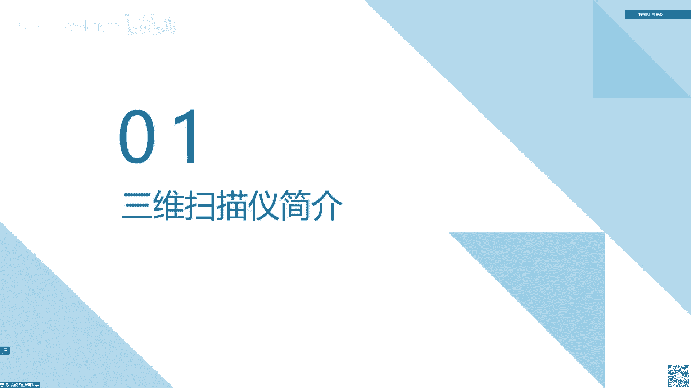

那我们首先来看两张图，这个左边这个图呢是一个人拿着一个手持式三维扫描仪，然后再扫一个小姐姐，然后这边呢是我们的软件看到它实时扫描的画面，然后右边这个图这个蓝色的是扫描得到的网格数据，然后贴上纹理之后。

就是这个大的数据，那么我们可以来概括一下三维扫描仪，它的功能就是通过不同的视角扫描物体，来获取一个完整高精度的物体表面信息，那么他是怎么样做到这件事儿的，它的基本逻辑。

首先是由二维图像获取一些深度信息来重建这个三维点云，然后接下来呢由这个三维点云来获取一些这个点云的未知信息，将不同视角的点云对齐到同一个坐标系，借此来重建这个完整的物体表面，那我们稍微展开讲一讲。

就是如何获取深度信息，这个是通过多相机加结构光来实现，那么刚刚刘老师也讲的，那我们来稍微详细一下讲讲。

那首先来看这样，有一张图，一张照片就一个人坐在这个房间对面的椅子上，那么这样看就没没有什么问题，那么我们让这张图动起来。

ok我们会发现，最初我们在图片中感知到的这个场景和实际场景其实是有很大差异的，这个原因呢就是因为这是一个视频视频，它是由单个相机录制的，就类似于我们人眼的话，闭上一只眼睛，单眼来看。

那么我们大脑的基于经验判定出了一些深度信息，这些深度信息是不够准确的，导致我们出现了这样的错觉，ok那么我们已经看到了，如果只靠单眼是无法准确的判断深度的，那么我们人是怎么解决这个问题呢。

我们人类进化出了两只眼睛，两只眼睛由于有不同的视角，刚刚刘老师的那个图也大家也能看到，由于在不同的视角观察，大脑处理不同视角的图，那么就获取了这个深度信息，那么两只眼睛的人相比于一只眼睛的人。

他在这个现实生活中生存就有非常大的优势，那么经过进化，我们可以看到不支持人类，大部分大家能见到的动物都是两只眼睛，那么所以说这个多项机，就我们就是通过这样能够获取多视角的方式来重建物体的深度信息。

然后另外另一点就是结构光，节目光就是说我们大脑在获取到两只眼睛的途中，之所以能够恢复出深度信息，是因为它能够在两张图中找到对应的，我这个看到的是同一个物体，那么对于计算机而言，这个事情不是那么好做。

所以说我们通过主动向物体表面投射一些带编码信息的结构光，来创造一些特征，来辅助计算机在不同的相机的图像中找到对应的点，然后这样通过这个简单的几何计算就可以恢复出深度信息。

那么接下来我们拿到了这个三维点云之后，由于我们电源是根据图像加深度恢复出来，所以说这个三维坐标它是在图像的坐标系中的，那么我们要重建一个完整的物体表面，那么我们肯定需要把不同视角的图都拼到同一个坐标系。

那么也就是说我们需要获取每一个扫描视角三维点云的未知信息，那怎么样来获取呢，就是通过特征加一些辅助信息特征，这个就是说我们临近的两个视角的扫描数据中会有一定的重叠区域。

那我们在这个重叠区域的这个三维点中，我们可以识别出一些几何特征，那么重叠区域它自然就有相近或者相同的几何特征，那么我们通过这个重叠信息，就可以获取这两个视角的三维点云的相对位置关系。

那么通过这样连续的计算，那么可以把整个场景扫描的所有的三维点云之间的位置关系都获取到，那么这个时候我们就可以把这个所有三维点云拼到同一个坐标系去了，那么有的情况它只靠特征是不够的。

三位自己比如说我们想要一个强，那么我们就会手动增加一些辅助信息，就和这个头节目光是有点类似的，我们会贴一些编码点，这种在物体表面来辅助我们做这个位置的跟踪。

ok这个刚刚再回顾一下我们这个多相机加节目光的这种形式，就是我们在设计三维扫描仪的时候，会针对不同的适用场景来选择合适的结构光，就不同类型的结构光来选择合适的相机个数，那么基于不同的结构光和相机个数。

那么就会产生很多适用不同场景的三维小玩意。

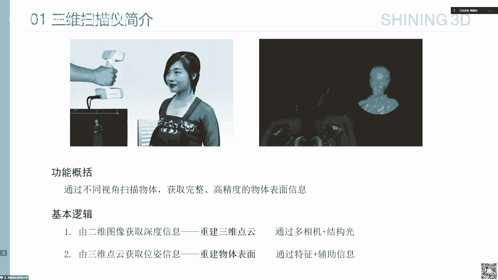

那我们这里来简单看一下，左边这个是一个手持的彩色三维三一，它头的结构光是散弹结构光嗯，这个具体的信息我在这里不展开讲了，然后投射这个散弹激光之后，他还这里有一个激光投射器，然后这里呢是两个相机。

下面有一个纹理相机，那么这个31000就可以同时获取深度信息加纹理信息，然后它比较适用于这种追求扫描效率，然后又需要物体表面颜色的这种使用场景，然后呢这个这个是一个手持激光散白蚁，它投射的结构光是激光。

这个有什么样的特点呢，它是精度特别高，那么适用于这种工业检测等等这种需要高精度的场景，那我们看到这张图，这张图是一个，这个是一个手机的背板，就是说我们手机一些很多很精密的小零件。

这种都是镶嵌在这个背板上面的，那么对这个背板就有很高的精度要求，那么手机厂商在拿到这个背板之后，就可以通过扫描仪来扫描这个背板，获取这个背板的深度信息，这个整个的三维表面信息，然后呢拿到这个信息之后。

就可以和设计的时候那个标准的cad数据去做对比，那么现在这个图大家看到有不同的颜色，那么这个其实就是这个数据和标准数据的这种偏差，几何偏差，那么这种不同的颜色，比如说这种红色就代表的偏差比较大。

那这个标签儿大家可以看到这个单位是毫米，这个其实精度已经达到10微米的级别了，然后另外这个是一个口内扫描仪，就是牙科诊所的医生，他在给患者诊疗的时候，用于获取患者口内信息的这样一款扫描仪。

这个现在在这个牙科诊所已经越来越普及了。

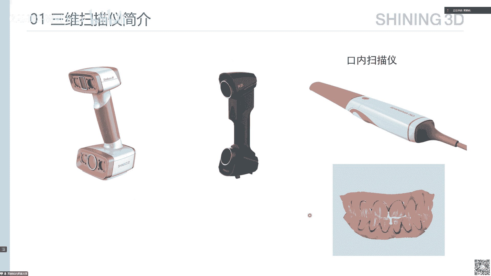

好的，那我们来通过这个简单的看一下呃，三维扫描仪在日常使用中，它是如何使用，这个是刚刚我们看到的手持彩色扫描仪。

我们拿这个扫描仪在不同的角度来拍摄这个模特。

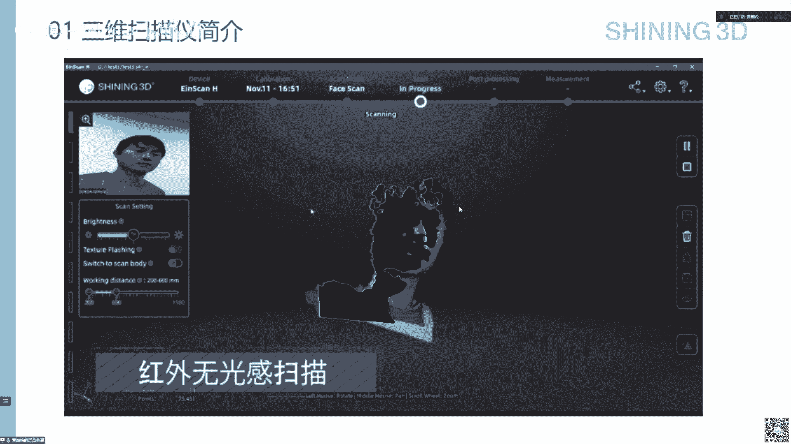

那我们可以看到这个我们在可以通过计算机屏幕看到我们在扫哪里，然后完整的扫描一圈之后，就可以生成这样一个带纹理的完整的人体模型，这是扫描的使用，那我们更关注算法嘛。

那我们来看一下计算机中这个它的形态是什么样的，那么这个现在给大家展示的界面是这个牙科诊所的那个医生，他们用的口内扫描仪的配套软件，这个左上角这里是相机拍到的图像。

那我们可以看这个随着这个口内31000在患者的口内移动，那么患者的口内数据被一点点的恢复出来了，就这个获取过程是非常快的，ok这样扫完一圈之后，那么这个患者的这个整个牙和信息就有了，那我们再来看一遍。

我们可以看到就是当前扫描的针是一直停留在屏幕中间的，然后呢同时这个牙和会拼到一个合适的位置，让医生知道诶，我现在在扫这个牙齿的能力，以便他自己能够知道，我接下来这个扫描仪在患者口内要向哪个方向扫描。

ok那么通过上面的视频呢，我们就看到了三维扫描仪软件呈现给我们的这个三维扫描的工作流程，那就是其实说白了就是我们随着这个三维扫描仪，在物体表面上逐渐的移动，那么物体表面的信息就逐渐变得完整。

那么移动完了也就扫描完了，那么接下来呢我就给大家介绍一下这背后的算法逻辑，回顾一下刚刚讲的基本逻辑，我们是通过这个多相机和结构光来重建三维点云，然后通过这个三维点云的特征和一些辅助信息。

来获取这个典型的未知信息，然后进而重建出整个表面的，那么后面这个对应的算法流程呢，首先要做标定，这个标定是什么意思呢，就是我们是多相机加一个结构光的投影机，那么这种情况下。

这个相对位置关系就是我们重建深度的关键，那么这个相对位置关系怎么来的呢，其实就是标定来的，我们通过相机拍摄一些预设好的一些一些图像，来计算这个相对位的关系，然后拿到这个相对位置关系之后。

我们其实在辅助结构光就可以做结构光重建，那么就可以获取到相对电源，然后拿到三维点零之后，就要做位置跟踪，这个位置跟踪呢，其实就是刚刚大家看在那个口内扫描仪的软件界面上看到的。

我们要知道这个单帧点云在全局它处于一个什么样的位置，这个也是根据这个前后的前后帧之间的这个重叠区域，来计算它的这个相对位置的，然后如果未未自跟踪，这里没有什么误差，那么其实当我们扫完之后。

跟踪出所有电源的位置之后，就可以直接进行点击网化，但是这个往往是不够的，为什么呢，因为我们刚刚看到讲了v字跟踪，它是根据两针之间的重叠区域来计算一些三维的特征，然后根据这个特征来计算相对位置的。

那么这里就会存在误差，那么假设想象一下这样一个画面，我们去北京扫一个四合院，我们去扫这个东南西北这这个顺序去扫这个墙，那我们从东墙开始一帧一帧，根据这个相对位置一点点恢复这个电源的位置。

那么我们扫到难东南西北，等我们再扫回到东墙的时候，我们会发现这个根据位置跟踪算出来的这个这个位置，你这个心扫到了东墙和最开始扫的东墙已经差得很远，那么这个时候就就这个就是说所谓的累积误差。

那么这个累计误差就让我们无法准确地获取这个完整的网格信息了，那么我们怎么样来解决这个问题，就是通过这样一个点云全局注册，这个相信大家对同学的了解应该有听过。

这个就是我们把所有的这种扫描战争统一放在一起来，一起建立一个方程，来一起优化这个东西，然后获取一个相对准确一些的位置，然后这个时候拿到所有的单针点的位置之后，那么他们在同一做标系，我们就可以进行文化。

ok至此，那我们刚刚基本逻辑提到的第二点，这个重建物体表面就完成了一半，为什么呢，因为物体表面除了有几何信息，还有纹理信息，那么还有后续的处理，那么我们拿到这个网格之后，要对网格做一定的处理。

比如说做一些光顺，优化一下网格的拓扑结构，然后做一些简化等等，让这个网格所表示的几何信息能够更好地适配管理信息，然后接下来呢我们要恢复这个网格表面的纹理，这个我们管它叫纹理融合，然后是视情况。

我们可能会对这个纹理融合的结果做纹理的参考，这个我们后面会讲，然后对参数化得到的这个结果呢，我们有一些特定的产业应用，会会以这个参数化的结果作为输入，ok那我们接下来主要来讲这一部分内容。

首先看文理融合，这个其实就是我们怎么样给这个三维扫描得到的这个网格表面，来给它贴上正确的纹理信息，那么首先呢我们刚刚扫描得到了一个网格，同时我们还会得到一个带位资的多个角度的纹理图像。

这个那么这个纹理图的位置是哪里来的呢，刚刚我们说了，我们点云通过位置跟踪能够有这个点云的位置信息，那么我们的设备上有负责扫描电源的相机，也有负责扫描纹理的相机，那么这两个相机我们刚才也讲过。

有我们有个标定步骤，我们标定是获取了这两个相机之间的相对位置关系，就是其实是一个旋转平移矩阵，那么这里我们有了点圆的位置，加上这个相机之间的关系，我们就有了这个纹理图的位置。

那当然现在业界也有直接根据纹理特征来做v字跟踪了，这里就不展开讲了，然后呢有了这两个信息之后，我们对网格上的每个面片，根据这个面片的位置和法向信息。

还有各个纹理图刚刚的位置信息来选择这个面片的最佳纹理图，这里选择最佳纹理图不只是选择某一张图，它可能还涉及到这个多张图之间的这个亮暗平衡，它的零件信息也可以用来辅助计算这个纹理。

那么这里不展开讲这部分内容，然后得到这个最佳纹理图块之后，我们把这个图块排布到最终的纹理图中，那我们就得到了这样一个信息。

有一个带纹理坐标的网格，这个纹理坐标其实就是这个这个面片或者点在纹理图层的位置，然后有一个刚刚我们说的图块排布的这样一个纹理图，我们管这个纹理图叫分块纹理图，自此呢这个扫描的纹理信息就已经恢复出来了。

那么这个时候就已经可以在一些三维场景中做显示了。

ok那我们刚刚提到的这个分块纹理图，它以它在后续的应用中会有一些问题，那么首先看到的优点，优点其实就是速度快，因为我们在文理融合的过程已经把这个图计算完了，那么我们在不做额外处理的情况下。

就没有什么额外计算量，所以说就那么速度其实是在工业界非常非常重要的一个指标，我们可以看到大部分的这种三维扫描厂，他们产生的这个纹理的网格的纹理图基本都是这种形式，那么它也有它的缺点。

首先就是纹理图是碎片化的，就是看这是一块一块的，做一些语义分割啊这种类型的东西，那么这个分块的纹理图它就会破坏这个语音，那么会导致这部分算法就不能不是那么好用，然后另外呢就存在一些冗余信息。

那么可以看到这个耳朵区域，这里不光这里就能看到三个，然后另外呢就是这个网格分片，这个这个相接的纹理坐标不唯一，就是我们不同的图块，它在网格上的一个交界的地方，这个纹理坐标部位一。

那么会导致诸如这种纹理编辑啊等等这个场景，这种算法的复杂度会提升，那么也是不方便的。

所以呢这里就涉及到参数化，我们会尝试对这个网格上面，这个已经恢复出来纹理信息做这个参数化展开，那么使这个网格上的纹理信息，能够建立一个与二维纹理图上的一一对应关系。

那么这里之前在这个傅老师在第六讲的这里已经讲过这部分内容了，有兴趣的同学可以去关注一下，ok那我们来介绍一下这个纹理三文化在这个工业界的这个应用，我这里准备了三个三三部分内容，来。

希望借助这样的这样三个场景来给大家介绍一下，这个让大家对三维扫描工业对策化的应用有一些了解，那么首先是艾特的生成，阿s的生成，这个付老师刚才已经讲了，这两其实之前已经讲了非常详细了，就是做at的生成。

是为了获取一个这个从模型空间到这个纹理空间的一个映射，然后呢在这个过程中我们可能会做非常多的事情，比如说我们对这个网格要做切割，然后对这个切割下来的这个部分要做这个分片的参数化。

然后最后呢我们还要对这个策划的结果做一个packing，就是我们会排布这个一些，那么对于这种就是在分割的时候呢，我们可能分割的目的就是说希望这个网格在展开的时候。

能够消除这种像这样的overlap这种重叠的问题，然后peking的时候呢，我希望提高这个排布效率，这些都是一些比如说类似游戏场景，它非常常见的这种需求，就是对于这种游戏场景。

他们需要大存储大量的纹理图，那么你的这个纹理图占排布的比较好，那么它占用的空间就比较小，那么就会提升你这个场景加载效率，诸如此类，那么这部分回顾完，那我们来看一下对于三维扫描这个产业而言。

它的对二次生成这里有什么样的需求，那么相比于游戏产业呢，这个我们对p就是这个peking efficient的要求就没有那么强了，因为相比于纹理图，就是三维工业扫描扫到了那个几何数据都是非常大的。

它动辄就会有几百上千万的面片，那么这个是它的存储是远大于纹理信息的，那么同时呢由于数据量大，所以说我们对这个计算效率有着非常非常严苛的要求，但是呢计算追求计算效率。

同时呢也不能够就是摒弃掉这种基本的要求，就是我们要求整体的扭曲小啊，这些在付老师在之前课程也都讲过。

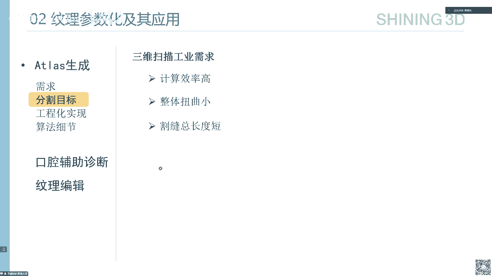

这里有诗，为什么，ok那这是一个简单的例子，就是我们这样一个这个蜘蛛侠的模型，然后它扫出来的纹理图的展开。

ok那我们来看一下，就是具体的工程化细节，就我刚才也强调过了，这个工业界对这个处理效率有非常高的要求，那么我们在除了选择更快的这个网格分割参数化方法外，就比如说我们可以先通过网格简化。

把这个网格先简化到一定的面片，减少它的输入数据的数量，然后呢对这个简化后的网格做这个网格分割，然后分割之后呢映射回原网格之后，再做这个分辨参数化，那我们来看一些简单的细节，首先就是网格简化。

大家可以看到这个左图，这里是一个就是原石刚刚扫描出来的数据，这个是通过这种提速的这种影视影视场的方式生成的这个网格曲面，然后加了一个这种各项异性的崇文化，来突出这个二楼区域的细节。

那么这里为什么这么密呢，是因为这里需要这个表面尽可能的光顺，所以说你需要足够的点才能够表示这个光顺的局面，然后那么我们会把它简化成一个非非常就面片非常少的状态。

然后这里其实用的是qq m简化这个q简化呃，相信可能有些同学有了解，其实他就是通过在网格上做这个边塌缩，然后通过这个点到距离，点到平面的距离这样一个度量来控制这个探索的过程，然后来对网格进行简化。

就是q m它是每次选哪条边境，他说他是选择这个对点到平面距离影响最小的这样一个边，来做做压缩了，做这个他做了，那么我们这里去除了这个排气过程，我们给给定了一个点到平面距离的度量。

来作为一个阈值来快速的做简化，然后同时呢在简化过程中，我们也记录了这个这个简化中这个细网格到这个粗网格的错格，到细网格的这个应试关系，然后用于导致我们简化分片之后，将这个分就是分割的结果映射和原格。

接下来是网络分割，就是在简化后，我们对这个简化后的网格做分割，用于作为参数化的输入，那么主要流程呢就是选择这个一些种子面，然后对他们进行这个l lol的这个迭代分割，那么在迭代过程中。

我们定义这么几个迭代的目标，首先是这个分片内的可燃度要高，那么我们对于每一个分片，比如说我们希望这个分片它是可展曲面，那么我们定义这样一个圆锥面去，比如说这样一个圆锥来，你和这个当前的这个分片。

那么当我们拿到一个新的面片之后，我们新的面片这个法向和这个圆锥的这个这个转线的这个夹角，作为这个一个约束，如果你大于这个值，那么我就不把你纳入到这个分屏来了，然后同时呢我们希望分片进行的规整规整。

其实就是为了减小这个割线的长度，然后呢这个规整这里也放了一个非常好计算的这样一个量，就是说我们通过这个新来的面片到这个种子面片的距离，然后和这个当前分片的面积的比值来做约束。

然后另外呢我们就希望这个边界也尽可能的平缓，这个公式中这个还alter是这指的是分片这个边界的这个边的长度，然后这个inner呢是这个内部这些方方面面的这个边的长度，然后通过这样带约束的一个迭代。

那么我们最后就可以把这个网格分割开。

然后呢就可以做这个分片单化了，这个具体参数化方法就是我们的课程已经讲的非常多了，我们在这里不详细展开，其实核心还是一个需求，就是说工业界对速度要求非常高，所以我们会选一些速度非常快的这种分别采访的方法。

然后除了选择方法之外，这个有参数化方法之外，这里我们其实对分割也做了一些要求，就是呃其实是一个并行的要求，就是我们希望这个分割出来的这个块能够大小尽可能的接近，为什么有这样一个需求呢。

就是说我们在计算的时候，一般是会做并行的，会把这个分片之后的参数化分配到不同的cpu核心去计算，那么当这些块的大小比较接近，那么它的定义效率就会比较高，那么像下面这张图，它有一块比较大，有一块比较小。

那么当你这些小块已经计算完了，那你这些大块，那么你就只能在做这个片内的并行，那么这个片内的并行效率肯定是低于偏见进行的效率，ok，那么到这里呢就完全介绍了这个x生成工业界对它的这个速度的要求。

以及我们对这个速度优化的一些一天努力了，然后接下来呢给大家介绍一下，有了这个参数化结果之后，我们这个可以做哪些应用，我们来介绍一下口腔辅助诊断这样一个先介绍一下产业背景。

就是我们之前大家都去可能会去牙科诊所做过这个牙齿的检查，就即使没去过诊所，体检的时候也做过，那么传统方法其实就是医生拿一个这种口腔镜直接伸到你的口内，然后通过这个镜面来看一下你的牙齿哪里有没有问题。

那它存在一些问题，比如说这种特定的角度比较难观察，比如说你的这个牙齿，这个这个后后面这个就指它的这个外侧，这个和牙龈和这个你这个贴在一起的，很很很难看到，然后另外呢就是你如果做一些治疗。

那么前面和现在就是你上次治疗和现在治疗你到底有什么变化，这个是很难直观的记录，只有一个病例上的一些文字信息，然后那么现在呢很多牙科诊所已经开始用这种数字化的方法，就是用这种三维模型来辅助治疗。

那么就是通过这个三维口内扫描仪，刚刚我们视频也看到了，能够快速的获取这个上下患者口内的信息，然后呢拿到这个三维模型之后，医生就可以去观察，这个其实是没有什么死角，只要你扫到了，他就可以观察到。

然后另外呢就是你在治疗过程中，这个是全记录了，比如说我们要去做一个正畸，就是要把这个排一下这个牙齿的排骨，那么你的每一个疗程，你的牙齿到底是什么形态。

你都可以看到医生也可以根据这个变化来及时的调整这个治疗方向，ok那这个传那这个口腔辅助诊断了，我们就会检查一些口腔的问题，那这个检查过程呢其实就是先来扫描口腔数据。

然后医生对这个三维模型进行观察来做出诊断，然后给出这样一个诊断报告，那么我们这里参考应用其实主要针对这两方面的，那传统的这种观察方式就是医生扫描模型之后，他在这个三维场景中拖动这个模型，然后做观察。

然后在不同的角度去截图，说你这里有什么样的病变，那里有什么样的病变来生成这样一个报告，那么这个过程其实是比较比较耗时的，那么我们希望做的事情呢，就是说通过将网格表面做参数化展开。

拿到这个参数化展开的纹理，在这个二维的纹理图中，来提供一个初始的判断结果，这样可以加快这个医生的这个效率，让医生能够看更多的患者，ok那我们为什么要在这个参数化的这个纹理图中做呢，它有一定的优势。

目前还不够成熟，这还没有达到这个业界应用的这个要求，那么另外呢就是医生是通过多角度来看的，那我们也想过用多角度投影这种方式，那么这种方式的问题就是会有一些遮挡，因为牙齿和牙齿之间这个牙缝。

有的时候你需要一个比较合适的角度才能看到，那么对于自动化来做，你就需要更多的角度，那么就会带来冗余问题，然后呢所以参数化展开到平面就不会有这个问题，那么同时参数化展开之后，它还有一些额外的优势。

比如说我们可以通过这个调整参数化的方法来突出一些重点区域，好的，那我们来看一下这个我们的参考目标，首先就是不会进行分片，我们希望这个映射下来是一个完整的这样一个那个区域联通玉。

那么原因呢刚刚我们讲那个分块纹理图的时候也说过了，这个其实是为了不破坏语音信息，因为你这里做分割之后，你很有可能这个区域就就被破坏掉了，这个寓意，然后另外呢我们希望有一个需求，就是控制不同区域。

就是网格上的不同区域在这个参数空间的面积，就是因为我们比如说检查病症，有的时候你可能需要去看一下我牙齿上有没有什么问题，有的时候呢可能要去检查牙龈有没有什么溃疡啊之类的，那么这个时候不同的目标区域。

那么我们希望它能够就是我们要检测的目标，它能够在这个纹理图上有更大的面积，然后我们也能够得到更快的结果，然后另外就是不变的追求，就是计算速度快，那么其实因为我们一个算法开发出来之后。

要给成千上万的用户使用，你这里优化节省一些时间，那么整个对于整个这个社会产生的效益非常巨大的，ok那么我们来简单的因为时间关系，我们简单介绍一下这个这个应用，就是说其实引入一些控制点约束。

就是通过这个控制点来重新调整这个参数化的结果，让这个我们目标区域的面积更大。

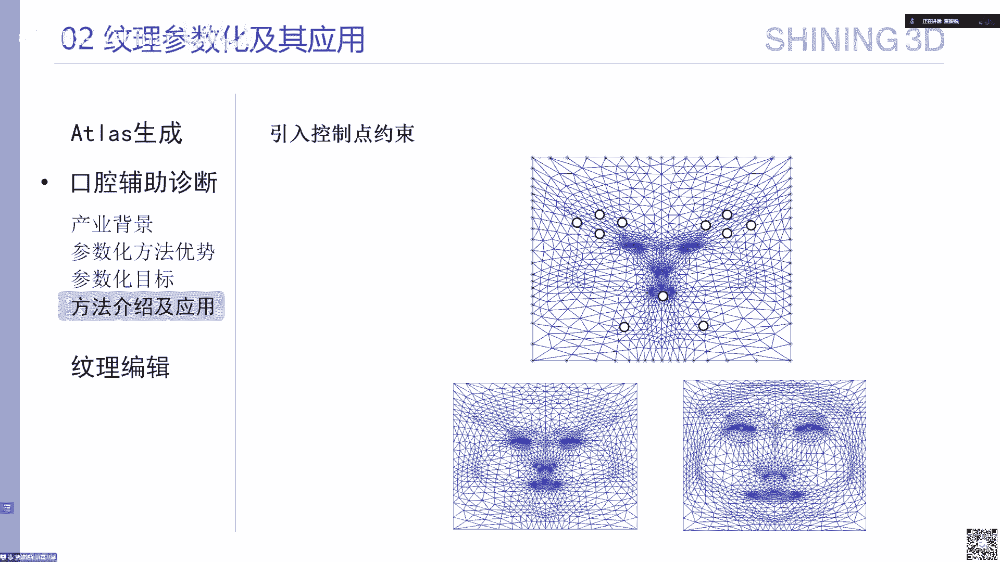

这个方法我们就不展开讲了，然后类似这种我们可以让这个人脸展开的时候。

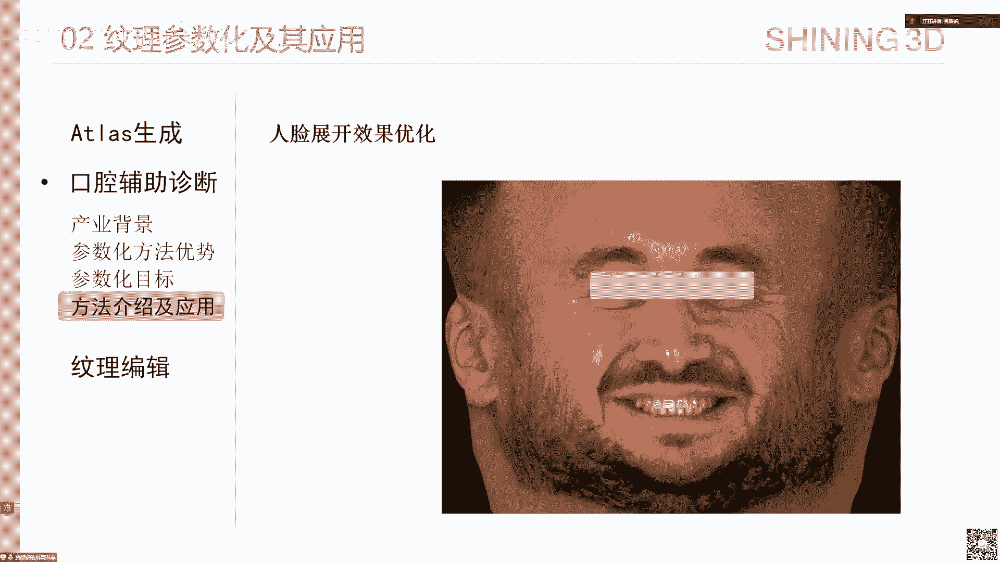

它的这个人脸的扭曲尽可能小，ok最后最后就是这个纹理编辑，纹理编辑呢这个其实还是一个未未完全解决的问题，就是我们希望这个有的时候牙医会在这个牙齿上做一些标记标记。

然后那么我们希望这个这些标记在展开的过程中扭曲尽可能小，比如对比下面这张图，这个边界可能扭曲比较大的，但是中间标记这个区域扭曲还是很小的，那么这个我们也尝试了一些方法。

但是现在这在这个无压盒上能够取得这样的效果，但是有牙齿这种复杂的情况可能就不太好处理，那么后续呢我们也会继续深入的去研究这样的问题。

我给他总结一下，我们今天先简单的介绍一下这个三维扫描仪基本逻辑，然后呢又展开讲了一下这个三维扫描流程设计的算法，这个纹理信息是如何获取和存储的，然后呢我们又介绍了一下x生成这个在工业界。

在有追求效率的情况下，是如何对它进行优化的，然后另外呢我们又结合这个口腔医疗领域的应用，给大家介绍了不同参数化方法的这种使用价值。

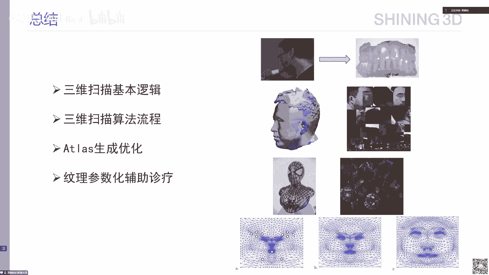

ok我的介绍就到这里了，谢谢大家好，谢谢严明的啊，现在分享哈。

行看看呃，同学们有没有什么好，这里有个问题诶，那个呃在做重建过程中是通过标题来找到点的坐标，那时候还没有网格，是先做餐的话呢，是点云做餐的话呢，还是呃还是先有网格在做长的话，它的顺序是一般是什么样。

这个顺序其实是先做标定的时候，其实不涉及到三的话，就是我们标定其实只是为了获取不同相机之间的位置关系，然后这个是用来重建深度的，那么这个重建深度获取点云，然后把所有的点云拼接到同一坐标系之后生成了网格。

然后我们会在这个网对网格做参数化展开，ok就这点，于是先不是给你上的话，是网格成型后再去做那个菜的话，然后再做纹理是吧，嗯嗯好，这是一个，还有一个有个网友挺挺有意思，他说开始你介绍很多生物是两个眼睛。

因为具有时差嘛，就有人定为三定位深度来感知三维空间信息，嗯他的问题是很多动物这眼睛只能看一测，比如啊就比如一些禽类，老鹰啊，马是不是也这样啊，我不知道，就是他这个眼睛只能看一边。

就他们两个如果视角没有重叠的话，没有重叠的话，其实就像我刚刚最开始展示的那个图一样，就是那个小视频一样，就是你只能用大脑靠一些经验性的信息，因为这个从原理上我们是知道的，你只有一张二维图的话。

你是从原理上就无法获取深度信息的，但是我们大脑其实是会有一些积累的，这些信息可以给我们大概估一个深度，就是对，但是如果你没有重叠区域，那肯定是不能获得准确的深度，ok嗯对行。

这个这个是一个这个挺有意思的，就是不知道生物它那个两个眼睛虽然长在长在两边，那是不是那真的是没有重叠的思域啊。

这个还未知对吧，是只不过我们看他的眼睛是因为他的像老鹰的话，这个眼睛是一个鹰眼鹰眼，他那个这个apple v非常大是吧，可能会有重叠，这个不知道啊，假设没有重叠的话，这边左眼看一边，右眼看一边。

它的三维感知是个什么原理，当然也不是我们这个课来解决事情啊，这个你问到这个事情挺挺有意思啊，还有b站还有一个问题，扫描中遮挡区域如何处理的，就是遮挡区域。

遮挡区域其实就是我们通主要还是通过移动扫描仪的位置，因为我们刚刚看到了这个扫描仪其实都是手持式的，你可以调到一个没有遮挡的区域，如果有遮挡，那么只有弹幕的情况下，其实也是有一些方法来做。

但是这个方法它的精度相比于双目就没有那么大的优势，就我们会有有些时候会尝试用弹幕来做嗯，ok好，还有一个问题，这个扫描牙齿的模型啊，这个如果top不等价于圆盘的话，该如何处理呢，可能是个复杂拓扑。

像这种呃带动啊，带带带这种秉着这种物体这个流程里面，刚刚我们也说过了，就是我们在做这种纹理相关的东西之前，会对网格先做一步处理，就是网格化之后，它那个网格可能会有一些问题，那么这个呃另外拓扑不等不不同。

配圆盘，这里可能还要做一些切割，如果如果是正常来说，我们会先对网格做处理，把这里的一些洞先补掉，然后一些这种类似高配合这种情况，我们会先预先处理掉，一般来说比如说拿牙齿来说。

我们扫描是不太会扫除这种高规格的东西的，嗯好行，那个b站没其他问题呃，我这里有一个问题，也是探讨型或开放式的，就现在三维重建走那个传统的mv s这个多吃点啊，这个是传统的这个3d视觉图形的这种啊。

基于流行结构来重建呃，这2年呢比如另外一条线，这个上次在县里也探讨过，就是那个基于这啊影视题表达的懦夫为代表的是吧，就这种来重建呢，它们背后是不是呃同样都需要有个标定的坐标啊。

标定的那个相机正确才能做好，否则的话是不是都会有问题，这个你们是经验是什么，或者能给一些建议吗，啊这个是的，勒夫现在它是需要就现在就能理解它是需要这个你给定图片，它的有位置信息的。

就是有相机标定信息对吧，就是对，因为他输入的不同图片嘛，然后后或者视频流，那么它是有这个信息，要不然的话他会用一些可买不起，如果如果这个这个相机标定或者是外外参是不准确，你重现出来就是模糊嘛。

就它它不对嘛，应该是会的，因为我们在扫描的时候，其实就会遇到这样的问题，当你这个标题不够准，那么你呈现出来的东西它的精度就会有问题，有问题哈，嗯好好行好，那个时间有限，我就不展开了哈。

这个呃今天严明也给了一个非常好的呃全面的介绍啊，介绍了三维就是参数化的三维工业啊，三维扫描工业中的应用啊，特别是在牙科这样一个具体的应用过程中，好那我们就呃再次谢谢闫明，好吧好，那我们课程好好，谢谢好。

那么我们就继续课程啊，时间过得很快，然后呃呃刚才呢这个呃人民介绍了一下这个参数化，在这个三维扫描工业市场上的参数化呢，在只要涉及到几何的一些问题中都会有啊应用。

就像我们在第一节课开始就指出商业化是几何处理的一个根基数，因为它是所有支撑重建啊，传统化啊，那个还有不动啊，修复啊，去造啊等等的一些基本的技术，所以呢它不仅是在这些我们看得见的这样一些这个产品中。

而且在一些软件产品中应用非常广泛，好我下面再介绍一个这个一个非常重要的就是在工业软件中，工业产品制造呢同学们在如果听过102，应该有一个初步的认识，就是一个工业工业软件为什么很重啊，很重要哈。

这个工业产品比如一燃气车车身怎么出来的，它中间是一个非常复杂的一个流程啊，从这个车身的形状啊，这个外形用什么样的数学函数去描述啊，这设计师是怎么来设计这个汽车的外形，这个产品的外形。

所以它有概念涉及到几何设计，几个设计就是这个叫计算机辅助几何设计，来表达这种精确的这种曲面，当然你把它离散就可参加网格了是吧，然后之后还有分析，还有制造到后面装备好，所以它的流程这个整个工业。

那么其中这个虽然流程很多哈，但实际上是现在随着计算机发展就很多，就把它电子化了啊，就很多都是用计算机辅助来做，所以就出现了很多计算机辅助啊，什么东西啊，比如我们这个设计历史上都是在七八十年前啊。

你可以看到这是波音公司，当时啊波音公司早年这设计都靠人啊，这个这个人在纸上去画这种飞机的外形啊，可以看到这个工作量特别大啊，最难的就是协调好吧，这么多人涉及到几十甚至上百上千人的这个协调。

这个这个每个人只能画飞机的这个一部分啊，那么那么怎么把它拼起来啊等等，那么随着这个计算机发展，就这些东西就慢慢慢慢用计算机辅助来做啊，可以看到工业软件这么庞大一个体系好。

我们cad cae和cm也就占占这么一小块啊，当然还有好多什么管理软件啊，还有这个啊全生命周期管理这个工具啊等等啊，那我们呃今天呢是不可能有详细展开这个。

看未来有没有可能再开一门3t的课来专门介绍cad，那么今天我就呃稍微稍微稍微过一下啊，cad就是怎么去啊，把这个外形给它表达出来是吧，虽然我们啊102在讲过那个nov啊啊更多是离散的。

但是那不是作为一个工业标准，他这个表达一些这种光滑曲面啊，像这种啊高阶连续的光学面，实际上是叫做现在是成成为工业标准，可以看到怎么表达，还有这这种复杂的这种发动机呀，这种设计啊都是有很多方法啊。

所以作为一个cad软件这个内核啊，有一个造型引擎，还有个计算引擎，当然除了这些之外，还有这个用户界面，你可以看到一个这么复杂的一个工业产品的汽车为代表，里面有数万甚至几10万的一个构件啊，每构建之间啊。

这个什么表达怎么样一个配合都是一个非常复杂的过程，这呢仅仅仅是只有外形啊，还有呢功能功能什么呢，这种器件运动起来以后呢，哎你能不能满足力学温啊，这个热血这个做要求啊，所以需要去做分析。

那分析的过程呢就是一个产品设计好以后，我拿拿这个例子来说，做拉伸物体来做例子啊，就这个是一个啊衡衡量啊，那中间如果这里放个重物，那么这里这个这个力跟旁边的力就会受力是不一样的，这个叫应力是吧。

那么这个东西怎么来算呢，背后实际上就是这个这个叫力学对力学的告诉我们诶，这个物质在受力情况下里面的这个应变应力会发生什么变化，那他做的过程中呢，是要把这个这个实体啊进行一个跑分。

因为它本质是在求解一个pd叫偏微分方程，因为所有力学到最后的数学表达都是一些这种啊偏分方程来表达，所以你就对这个啊体来做这个平方的求解啊，这个力呢就作为一个外界条件好，那么这个实体呢就作为一个求解域。

那么你出去意思是一个连续的不好求，所以它就要把它离散成网格，所以你去看到这个网格剖分就怎么把一个这个这个体啊，婆分成四面体啊，是一个非常重要的一个工作，有了这个以后，就把这个空间离散成了一些呃点线面。

这时候就在点上去求解那个pd就可以得到它的c d的分析啊，这个啊这个主要方法就叫有限元好，那么你可以看到那个一个这样的体啊，给定它的物理参数，物理参数是由这个弹性模量还有普通比来描述以后呢。

你就可以对它进行操作，它这个变形就可以很很支持的把它刻画出来，像这个材料啊，赋予一个橡胶这样类型的这个物理参数的话，你这样一直拖着的话，它就会这样变形，它就变形。

就非常像我们真实的这个物质的这样一个变形啊，就力学就这样慢慢描述真实物体如何变形的这样一个学科啊。

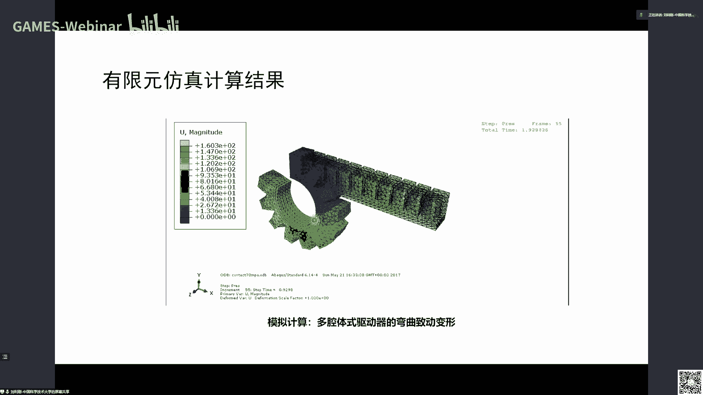

好那么你可以看到这个呃一个呃汽车有那么多部件，每个部件都要去做这个仿真，反正刚才我是举这个例子是例，但那只是d这仿真还有呢还有温度啊，热量啊，仿真像比如发动机在高速旋转，他要发热发热的过程中。

它的热量是怎么传播是吧，会不会导致这个部件啊，会物理特性也会发生变化等等，所以背后的热啊力啊，甚至持啊电啊等等，多一些仿真，你仿真之后才知道这个汽车正常运行起来之后的性能。

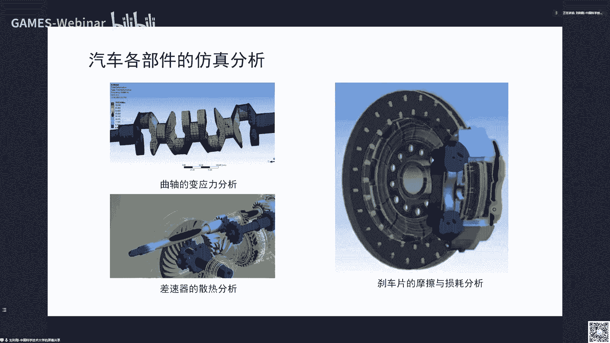

那么信任完了以后呢，就是啊分析完以后就可以做这种啊虚拟的碰撞实验啊，比如这两辆汽车啊，各给定边界条件，比如速度撞击的位置和方向，那么就可以模拟出这个撞击后的这个各个地方的一些变形量啊，还有这个应力。

特别是对驾驶员乘客的一些冲撞的这个损害程度等等啊，到到这一步呢，基本上这个设计呢就呃c e就就分析完了，如果这个不满足这个这个功能要求，又得返回去修改，cad就是模型，这个模型可能形状不够好。

这个厚度不够厚啊，需要反馈给cd人员，所以cd员根据这个反馈呢又得去修改，修改完以后呢，他又这个c e的人员呢又得去做这个分析，又得去做模拟仿真，再看这个结果好，这个两边就要经常的迭代啊。

因为因为做设计的一批人都说做c e工程，一批人呢是两批人啊，就这个沟通成本非常高啊。

最后啊这个验证成功以后，那么制造出来以后啊，就要做征集实验，因为毕竟这个无论力学，到底真实情况是不是像你仿真的那个样子，还造成一个整车之后，还要把这个真车做真实碰撞。

来来验证你这个啊它的安全性是不是满足了这个这个商业化的要求啊。

所以啊这里面就整个流程是非常复杂好，那么我们再看前面啊，我们这个整个背景有了好，其中有一部呢就是刚才我提到就cad的这个形状跟那个pd求解c e啊，中间呢是要不断的去迭代，为什么呢。

这个不满足我就去修改形状外形啊，那么这个外形送到这个求解之之间呢，要什么要把它离散成网格好，那么他不满足要求，要求你修改，修改完以后，我要去网格网格化啊。

然后才才能去求解那个有限元的pd这个这个这个求解，而这个量呢是80%啊，中中统一就是这个怎么生成一个三角网格啊，就称别是体网格，这个这个计算量非常大啊，所以在传统的话就这两两个迭代是非常非常慢的啊。

造成这个可能工薪延时啊，这个这个这个成本剧增啊，那么在20005年啊，这个呃美国的三个院士啊，hills tom hughes啊，就就诶他就提出一个想法，这个外形并不是离散的。

也就是说我后面的pd呢以前是离散成很多小单元，把那个就像我们参数化这个课上讲的前面两个方法，一个是离散型，一个是连续性，一旦竞争的意思就是我用很多小的单元去逼近一个复杂的函数，那么我在求解pd呢。

就在这些小单元上去求解，因为每个小单元上是一个线性函数，所以用分类线形来逼近一个复杂函数，我只要知道这个这个解在这个小单元上的一个现金的这个性质，我整个拼起来就得到一个复杂函数了。

当然还有另外一种方法对吧，就陈文杰老师讲的，就是诶我直接用这个连续性表达达我的这个求解空间啊，我能不能就直接拿拿这个啊基函数啊啊，来表达这个啊边条基函数能表达后面的解。

而这样的话呢就不至于去要做离散化了，上次这个思想上早年很就有了啊，只不过他把这个思想用到了这个c6 和c变成了一体化，同样用来求解背后c e这个p d e啊，物理物理特性的求解。

这时候呢我只要在这里去做一个迭代，就就不要去涉及啊这个啊这边cad的这个呃这个从网络化啊，所以这个迭代起来就比较快，所以这个提出来这个概念叫做等几何分析i ga啊，就是只想把cad跟c一体化。

那么从我们这个课的观点来看，这个是呃如果这个呃背景有了，马上就可以定义出啊，嗯这个它的一个问题是吧，就是也就是说我我是在这上面去求解一个p d e，我只要有一个定义域，在地域上定义它的一个基函数。

计函数可能是个连续性函数是吧，在成立基老师在前面讲过，有r b f函数，有变量条，有更多调和函数，你就用这个连续函数作为表达去去求解这个预算的那个啊，这个p d e对吧，这个平分方程。

那么这里就有个有个重要问题，你对一个复杂的形状怎么样把它变成一个规整域，这个因为我们变量条是定义在这个张量级形式啊，二维中是矩形，三维中是这种长方体是吧，所以这里就有问题。

怎么把这种复杂形状把它参能化到一个规整形状啊，像比如说这样一个我们拿一个这个鸭子形状啊，是个体，怎么把它参数化到一个这样一个这个立方体或者长方体上面啊，有了这个以后的话。

然后在在这里呢就可以去求解它的那个pv方程啊，或者有些圆好，所以这里就提出一个叫做区域参数化的一个问题啊，就参数化的问题跟我们前面参数化的问题是一样一样的问题啊，就是足够表达方式上面有点差异啊。

那么我们啊我这我重复解释一下，就是给另一个二维的这样一个形状，我们这里拿了一个任意的这样一个形状，一个蝴蝶，怎么样把这个蝴蝶的这样一个区域啊，这个内部区域把它穿透化到一个矩形区域。

这时候在语音区域上面就可以定义定义标一下函数来求解，忽略内部的这个物理场啊，同样对这个体，我们把它参数化到一个张量积的这种立方体或者长方体上面啊，这就是一个参数化问题啊，那么这个两个问题呢。

呃从我们这个课前面，如果同学们啊能够了解到这些基本思想上那些方法都可以用用过来啊，啊这个领域这个做这个事情的二维和三维这个参数化基本上也是啊啊，平行的跟参的化解方法是平行的，好等一下我稍微快速介绍一下。

同样性质也一样啊，那你要做好餐的话，我希望这些里面的这个内部到这个呃蝴蝶这个内部到这个正方形内，内部也需要保持一些性质，这性质有什么诶，要双摄对吧啊，太大扭矩太大太太小。

你你的角度来面积和那个这个这个这个体积要保持是吧，就这些度量跟我们以前都全都学过了是吧啊，只不过它表达方式像哦sogno什么什么，表示我这个等拆线我希望保持垂直，垂直不就是保角吗。

啊保角就是方欣老师讲的那个conformal，就是有保保角性的uniform，进一步就是low redisttion嘛对吧，所以无论怎么表达，自然这个在参化领域里面都有对应的这样一个表达啊。

只不过就是这里强调的是一种变样条，这种连续性的啊，这种表达方式来作战的话啊，这个这个是一个特殊要求，实际上就是跟那个陈振杰老师应该是第一节课讲各种各样的这个啊。

好那么我这里啊这个领域呢呃我请了那个南南航的潘茂东啊，这个博士啊，就呃你已经向其主要方法，我这里不详细介绍好吧，时间有限啊，这个后面还有其他的内容，所以我就大概讲一讲。

就如果我前面那些课程同学们都这个听着啊，这个基本思想有了这些方法，我只要告诉大家对应哪一块，马上就知道哦，原来做i g a中的碳的话，这个基本上就是前面课的内容啊，好我们讲第一个就这个叫控制局面。

控制局面实际上是非常非常简单的概念，这个控制是这个重新学或者计算几何里面一个这个先驱啊，那个西瓜每年的控制讲就以他命名，它实际上是第一次定义了叫超差呃，超限差值就是给定是四条曲线啊。

这个四条曲线啊如何定义上光滑曲面啊，就叫控制曲面啊，有有有有有一些双一阶，双双双三阶等等啊，那么他这个这篇文章比较早啊，99年，所以他说我给你一个区域，我就人为的把这个区域变成四段。

每一段区域不就一个边界出来了吗对吧，然后就这个边界控制就是构造四条边界来构造一个曲面，就用它去构造就行了对吧，就非常简单啊，这就是一个非常简单的一个思想，但是呢这个呃因为简单嘛，所以它的特性不好。

那什么扭曲啊，这个这个根本就没有考虑内部的一些特性，它只考虑边界啊，所以方法简单，但是比较早啊，那么还有一种呢就是用调和函数啊，这个我一说调和大家马上就想到了陈仁杰老师第二节课是吧。

用调和函数来来做这个啊，这这个这样的话也是变形是吧，怎么把一个复杂到的外形，把它变形到这样一个区域里面啊，最后的这个数据表达就是用调和函数来表达，因为调函数是无穷阶光滑啊。

它是这个满足这个拉巴斯方程啊啊但是呢它因为是求解这个方程组，所以它也没法严格保证是吧，所以前面大家也听过严格保证的那个这样的话只能是什么，开始初值是一个没有这个翻转，然后慢慢优化过来是吧。

如果是要求一些复杂系统喜欢的方程组，基本上都没法保证好好，那么这个咱们还有还有一大类呢，就是这个叫非线性优化啊，中非线性优化一听啊，就是付老师前面讲的一些一些东西啊，就是你就把那个扭曲什么翻转啊。

亚科比这种东西拿来严格做过一些不等式约束啊，那么你就可以去求解这个系统啊，那么你开始如果有个初值是无无反转的，那么在优化过程中保证它不翻转，那么就结果一定不翻转。

如果你这个初值这个有翻转到后面去想办法把它把它纠正过来是吧，这个这些方法是一样的，可以看到，只不过在这个i g a中呢，它有一些这个函数用的比较特殊啊，我再介绍两个啊。

一个呢就是那个啊方兴老师介绍叫孔博，某叫薄叫共情啊，那么呢还有一种比共情弱一点的这个这个一些函数呢，叫啊这个cos叫拟共性啊，就是比共性上面弱一点，它怎么了。

共性是它它的一个嗯就它是一个共性的一个特特殊，特殊在哪呢，它这个值密码它的这个上学记小于一啊，所以他就本质上呢你如果你满足这个条件呢，它就是一定是局部是单四的，它不会不会翻了翻转。

所以呢你不用雅克比来判断这个局部单色条件是用这个值来判断，所以这种函数呢这个你更心寒，这个印映射呢就天然的就保证了这个locally injective，就是局部啊，单色只要满足这个条件。

所以我们还把可以把那个以前那个亚科比大于零，那个条件换成这个这个这个条件了啊，好没看到我们的确是一样的啊，这个值越小越好，这个是光滑，这个名次越光滑越好，还有这个要小于一把那个边界给定是吧。

所以可以可以马上，如果这种函数啊有有这种特性，你就对它能量进行一个约束啊，这一个一个描述加上条件就变成一个优化问题啊，所以很容易理解，只不过他用了一个非常特殊的一个理控型映射。

这样的东西好比你公司还要那个特殊一点，就是又一个子集叫jack ma啊，映射md意思是什么，是这个值啊，小于一啊，就是小于一，所以说这个是小于一的话呢，它的这个扭曲呢就会比较小啊。

所以哎我采用这样一个啊这个这个这个特殊的影射手呢，唉我能够但是能控制住他的它的扭曲程度，没看到女程度就能够很好控制啊，当然这个这个映射的二维中有三分钟没有啊，所以也有有一批这个做参照化的。

做预算的话的这个人在研究用这个map啊，这个tema简称t map来做这个i g a的参数化啊，这参数化实际上是本质上这个流程跟那个前面我们讲的参数化，是流程是几乎一致啊，首先构造一个初始上初始上的话。

然后呢不断去优化你刚才的目标，要么就是无反转，要么就是那个话以及那个扭曲极小啊，就变成优化问题啊，只不过背后这个参数呢变量是那些基函数的系数而已，并不是离散型的那个网格顶点啊。

所以啊中间就可以做不断的迭代优化啊，这整个过程是一样的好，那么那么这里呃呃我就我不去讲这个更多的这个这个细节啊，这个当然啊跟前面一样，我们那个嗯这这这些年大家一直在求解的优化啊。

优化这个求解都非常耗时是吧，怎么样去减少这个时间，还有另外一个就是如果是对一些复杂物体啊，那么效果呢因为因为这个参数域太复杂了，可能效果不好，所以需要需要需要做更多的一些处理。

比如分解后面后面会停一下好，那么呃在i g a中呢，还有一类就是因为样条它是个张量级形式，就是它战略机形式呢有个问题，就是你你一个方向如果细分一次，它所有的这个另外一个方向都要从事细分。

所以呢这样的话就导致这个网络很多，那么天量调整呢，它允许这种t节点可以看到有它跟张量级不一样啊，有有有有这种节点，所以有些地方吸，有些地方密啊，所以他能做到这种自适应啊，这叫气量条。

因为它有t junction t节点啊，所以啊那个在ig里面或者叫c基地里面，这样调也是一个非常重要的一个这个表达形式啊，因为它啊突破了张亮机这种这种啊约束或者说限制的情况下，能够表达非常复杂的形体啊。

好那么第二条这个啊呃t hb叫t量条，那个hierarchical dispring，这个啊这种框架呢整个逻辑都是类似的，特性这里写的没有看，就是具有局部啊这个这个更新性，因为它可以只会加密啊。

我这里定性解释一下，我这边呢要加加密，我只加密这一部分，别的地方可以不动，所以它能够自适应的这个加密，并且它具有一个层次性啊，所以到最后我们认识也是一样啊，我需要雅克比啊，这个follower呃最小。

那么还有属于一个这个这个一个啊扭曲在一个界之内是吧，这个k bg在前面也提到过，只不过这是用了另外一套表达或者另外一套语言来描述，这里基本思想前面全都有好，这就在这个用用线条啊。

好还有一个呢就是刚才我提了一下，就是最复杂形体，你一个这么复杂的一个形体，要把它参数化的一个简单的啊，这个体块挺难的是吧，那怎么办，我们就想到分割嘛，哎你你你把它翻转化到一个矩形不行，那我就分块啊。

每一个小块是一个矩形，这时候呢这个就是多快啊，就是刚才那个啊严明也讲到，就是怎么把这个分成多个小片，每个小片呢就容易去做做做一些参数化啊，然后呢我们把它后面把它拼起来啊，那么这个拼的过程中呢。

在在在这个学科在这个小领域呢就发展了一些这种比较比较特殊的啊，当然我个人认为它是启发式的一些方法啊，一个形体如果它有骨架，唉，我我原来我原来骨架来做一片一片一片分解是吧啊，这种这种还是比较特殊。

因为有很多形状是美股价他也做不了啊，所以他这个有有有一些这个论文呢，就通过这种特殊的形状，特殊的这种鲜艳啊，来来做这种四面体四边形分解啊，因为这个把一个形状分成四边形区域本身就是个很难的问题啊。

所以股价只是提供了一种这种这种高危性啊，定位的信息，能够更好的去做这个分解的工作，还有用这个pop的cube啊，pp我们这个课前面可能提到过啊。

就是这种啊这种平面面平行于坐标轴的这样一个形状叫poly cube啊，因为它不是一个呃立方体，它是一个多个立方体拼起来的啊，就这种形状呢呃因为它比较简单，它这个每个面都平行坐标轴或者平行做的总队。

所以所以我们也可以把它看作是一个比较好的参数化域，这时候呢我们还要把一个复杂物体呢把它印到这里来，这里是一个前提，也要也要做分片啊，好那么也也是一分片的话，就这种连续性就保持不了，就是c0 连续是吧啊。

当然这个昨天早上午那个付老师在他的课里面，也可以定义高阶的这种啊，这个分片的映射能保证一定的连续性能达到c甚至c2 ，所以大家可以想，如果你这个有有有有些不足，那怎么办，我可以从g函数。

可以来可以来达到这个目标啊，好那个i j这个这个领域呢这个做的也十几年哈，这个呃从从刚才我所过的这些方法，这些方法都是啊这个分类有不同分类啊，但是我们采用采用了一种啊，刚才那个分类方式。

实际上从从这里可以看到啊，里面采用的不管是能量模型还是它里面的一些描述啊，反转啊，扭曲啊等等，都跟我们前面讲的讲的都是一模一样啊，啊只不过它背后的这个变量呢是连续型的，这个系数就是一样条啊。

特别是跟成人接老师讲的那两节课是非常相关的，好大家如果感兴趣去切入到ig去看去做的话，非常快啊，就只要你对他的话是有很深刻的理解的话去做啊，没什么大问题啊，好那么刚才讲的那个ig呢，因为它是张亮机形式。

为什么坐标变量条有两个方向，变样条乘积就定义了二维空间的变量条啊，对三维中就是三个方向啊，所以他这这个g函数随着维数啊扩大又一下子膨胀很大啊，这是第一点，就是张量机的一个不足。

第二个呢它就它的参数欲求必须是个矩形域的，但这个矩形不是个严格矩形，如果是个四边形，你把它把它扭曲到此矩形啊，所以所以这个约束呢就限制它对很多玉啊，就很难够去去做很好的这个参数化啊。

那么呃那么呃这个叫t c b t c b叫啊全狗configuration be spring啊，就是它呢就在一个三角形上面去定义变量条，然后三角形之间的变量条呢有一定的光滑性。

所以呢它可以定义在任何的多边形上面，可以定义变量条啊，但是理论上是可以定义在任何的多边形上面，它是一个方法变量条，就可以构造非常灵活的这种玉，比如说这样一个玉以前用那个传统来截。

你必须把它分开成四块啊啊每一块分分别做，然后呃参数化，然后再拼起来，现在呢唉我不需要我就一个这样的啊，四边形中间这个口是一个洞，你看这是个啊带动的一个多边形啊。

这时候就就避免了要把这个域啊又分解成多个张量级，这个四边形的玉形式啊，所以它具有一定的灵活性啊，所以他这个就避免了这个参数化那个难题啊，把一个啊流行变成大量级的这种四边形啊，跑分啊，体的话。

要是六面体是吧，好这种餐的话呢是最近12年吧，23年看到的一种新的表达啊，这个厦门大学曹娟成都会团队啊，就在这上面做了一些非常好的前期工作，也这也证明了他一些好的应用哦。

我建议同学们如果想啊找找新方向的话，这是非常不错的一个方向啊，可以看到这是一些例子啊，这是一个呃任意构造的一个非常有挑战的一个预啊，那么这是简单的这个参数语啊，然后你注意参数化以后。

用这个方法就可以看到这个扭曲啊，能控制非常小，那么下一页有个对比啊，啊这是一个呃呃用用个鱼来做例子啊，中间差的化，里面扭曲极小啊，你可以看到这个这个这个深颜色几乎几乎没有啊。

因为它中间啊不需要去做这种剖分了啊，它是直接定义在这个啊多边形域上的一个变量条啊，当然这个呃最近我们在探讨时候呢，也只知道它的好处，它避免了这个张量机的这个域的分解，但天下可能还是我啊。

应该没有免费的午餐啊，中间它还有一些什么样的一些问题，我们还在探索啊，比如现在可能看到的就是它的计算量会比较大啊，它计算量啊，因为它不如啊，以前张亮机形式马上就可以做出一个写出片头这个形式。

但它们呢就要通过满足光滑性，拼接光滑性等等啊，所以计算量去要要需要有一些这个这个这个成本啊，当然这个随着这个发展呢，可能也会逐渐被解决啊，为抛抛砖引玉啊，这个值得关注啊。

最近我看到这个东西以后觉得还是蛮有潜力的好啊，实际有限我就不展开啊，还有后面还有一些内容，所以我尽快过一下市场参数化呢，除了那个啊这种平面上的话，你可以看到啊，全部寻觅去，就是把一个封闭网格啊。

封闭网格，因为它拓扑同名圆盘哦，哦圆球啊啊不不同的，同为圆盘，所以他没法直接参数化到原来这个表面平面对吧，所以你要生成割缝啊，割缝的历史上有好多论文方法去研究怎么样去割缝啊，实参考结果好是吧。

全凭一mage提供了一种这种这种奇葩式的购物方法，在付老师的课你应该提到过好，那么实际上是对一些特殊的啊，就是这种封闭曲面，比如说封闭曲面，它它它不带环啊，不不带，不像圆环一样的，它只是个封闭的。

亏格为零，我们把它归为零，它是不是就是个脱皮，同配一球面，因为他你往里面充气，它们就可以假设啊里面充气到一定量，它就变成一个球是吧，所以没必要把它割开啊，变成矩形式上的差的话是吧。

我我我上面定义什么信息，不用在uv空间上定义，我在球面上定义，如果我能构建出这个封闭曲面跟球面的意义对应，那么我是这个球是一个非常规整的，因为球的话我用极坐标也相当于就一个矩形出来了是吧。

就像啊那个叫做啊全景图啊，我我我在一个点看世界720度，那么我身上是存储的是一张全景图，所以说你球面中心信息有了后，全景图那个举行域也也也是可以出来是吧，所以我把它的信息呢存储在球面上也是可以的。

也是能够啊，这个很好的这个存储是吧，所以对这种物体呢我就不用割线把它割开，我直接把它参数化成球面，那么这个问题呢叫做球面参数化，当然我这里限制住啊，封是封闭的啊，这个是啊，这个是条件啊，但是亏格为零。

因为如果是个环，从中间带一个洞，就像我们这个手手柄一样的，它就不能够变成球，知道吧，它变成一个圆环好，那么是不是圆环差的话也可以提呢，当然也可以是吧，但是这个呃这个价值和意义不是特别大。

所以做球门差的话呢还是值得做好好，那么全面上的话，这里就就引出一些问题是吧，比如说我在这上面是个三角形，在球面上呢是个曲面三角形，那么是不是球面这个几何的一些东西就可以引进来是吧。

当然这个是是确实是是吧，因为在球面上，我们地球啊这个本本来就是进行一个球，然后呢在上面实际上是这个上面的边啊，就是一些大国的边就变成一个曲线是吧，所以这个叫曲边三角形，也叫球面三三角形啊。

所以这里呢就是啊会有这样一些球面三角形的一些知识啊，那么全面参与转型，全面参数的话呢，做的啊这个因为这个物体太特殊了，所以做的啊文章或者工作呢不是特别多，但是也大概也follow了这么三大类啊。

第一类叫直接把这早年的啊就直接啊，嗯最简单就是假设这个物体是个凸的，然后呢每个点沿半径求半径，跟这个点相交，跟球面碰撞啊，求交就得到求分化是吧，但这个物体简单可以啊，那个突兀的当然没问题啊。

还有新型物体也没问题，但是呢如果是复杂物体不行好吧，还有这篇文章呢比较早哈，他呢就叫叫shwaking reacking，让物体膨胀，膨胀到一定程度就变成一个球啊，这个这中间也是不断在做迭代优化啊。

还有这个你看弗洛特flow就是那个啊q的那个方法啊，就是每个点分作为重心坐标是吧，这个一个等式在球面上沿也可以这样定义啊，就是这个点跟相邻的几个点啊，这个平均啊，这个平均呢可能不是欧式空间。

是贴在球面上表达成一个方程组啊，那么也可以采用这个图图的理论图论啊来进行做，这篇呢就是osman这个103年吃过物，就把这个啊q的方法啊，就是那个float方法把它推广到球面上去了。

它变成一个非线性非非出的一个优化问题啊，因为做的比较早啊，当时这个方法虽然比较简单啊，理论上你这个也比较漂亮啊，但但是还是一个里程碑的工作啊，至少在前面差分化这里一块。

第二块呢就是呃跟平面三生化一样的这样思路优化啊，怎么优化呢，哎我可以优化角，那么那里a b f可以追到球面上，就是在球面的这个极坐标啊，不取消标记。

球面坐标也同样有这些这个这个这个正弦定理所诱导出的这些不等式，还有这个流量同样有啊，这些这些不等式同样可以推广推广过来，所以呢拿了cf啊，现在在，嗯在在加拿大对吧。

然后他就把这个呃a b f a b f也是他提的对吧，然后把它推到球面上，就变成这样优化问题，第一话问题是不是跟前面那个a b f实际上形式是一模一样的是吧，非常类似，你看这个是正正弦定理是吧。

这个只不过是体现在球面上复杂一点而已好，那么还有另外的一些这种呃这个基于优化的方法啊，你优化它的一些这个狄利克雷能量啊，能量迪迪克能量也可以用它的这个这个这个变换的这个机机，来来度量是吧。

以前我们是用那个两个奇异值来西格玛一接口嘛，二是吧，这里也同样有有球面上的这些值好，那么这个值有了以后，你可以定义不同的能量啊，迪卢克雷啊，还有这个面积扭曲啊，啊把它捆绑在一起啊等等。

反正就变成了一个优化问题，只不过这优化问题过程中，每个点必须约束在球面上，就加了个这个约束啊，这个点不能是平面啊，自由的啊，要是必须约束在球面上这个坐标啊，同样那个我们在前呃，14年也大概78年前啊。

啊这个我们我这个学生王春雪就把那个平面的啊，那个ai ap把它推回到球面，ap大家应该非常熟啊，这个很多同学都做过作业，就是啊尽可能刚性的这个思想，就是把这个三角形啊，尽可能刚性的把它一直到穷人。

然后这里分怎么办呢，再去求解一个全局的一个方程组啊，不断去迭代就可以去做这个全面战争化啊，当时当时效果还还还不错啊，这是这是第一次把这个平面的这个参数化啊，这个推广到了全面，那么it mips啊。

那个在付老师课也讲过是吧，就是啊most chic吧，i i i i so mi还是什么啊，常态化proation这个方法把它推广到这个球面，也就是它的能量形式是一样的。

只不过是变成了球面上的一些这个量来进行优化啊，好另外一种呢就是球面上看的话，那个在平面中也有这种形式，叫cost to find，就是由简单的咱们不断不断加息啊，这个过程很容易理解啊。

04年啊这个啊就是progressimatch叫间接网格，就是叫刚才q m就是来实现这个pm的一种技术啊，它把又复杂的几何呢不断的简化简化啊，简化到啊最狠啊，就是一个生命体是吧。

生命体呢把它把它进行一些操作展开啊，变形啊或者参数化呢比较简单，然后再把这个操作过程中的一些细节再把它把它修饰，细节，再把它加回来啊，因为这个中心有了这这个变换，把它细节把它加到这里来。

那么这个细节把它加到这儿来啊，就可以生成这个这个呃精细网格的一个结果啊，我我们这里是拿这个参数化来做例子啊，所以它这个叫cos fine，就是我在简单的地方先做，做完以后再把它加回来。

加载过程中我当然要保持它的一些特性啊，不能翻转呀，扭曲尽量小啊等等一个个加，但这种方法大家可想而知，因为你是一个个起家是吧，你不是每一步都能够保证你是没反转是吧，所以他呀啊方法呢实际上是有效。

但是呢就是严格要保证那些性质可能不一定理论上能做得到啊，但作为方法啊没有问题啊，17年我们的学生呢也把这个方法呢就到球面，我把一个物体把它变成一个四面体啊，然后球面上画。

那不断在球面上去做各种各样的这样一些这个啊加顶点，但是在过程中保持这个在扭曲和变形，还有一个整体上是一个优化问题，好啊，这是当年的结果啊，这这结果我们我们也发布这个数据啊，这个大家大家可以用啊。

在我们主页上都可以找到，那么我这里做个小的总结，可以看它的参量化，一个物体上的话，我们讲的最多的最早的就是平面参的话，对吧好，那么对于特殊物体也可以求面，刚才刚才讲的那个cos fine。

本质上就把它放到一个它的简化版本啊，那么也可以叫做代理啊，它的代理上代理好做啊，这个参数化好做，那么就把这个细节和它对应加上来啊，或者是还有这个双曲轨道嵌入啊，最近几年水管也有提及啊，我们这里就不介绍。

那还有一些比较特殊类型的，比如说高规格啊，刚才零亏格的话，可以有个规则的定义叫球面，但是对于这种那个三个洞亏格为三，就你很难找到一个这种这种大家通用的这样一个规整形状是吧，那怎么办呢。

我们就定一个叫polo cube，就是这种这种啊比较特殊的这种啊多面体，每个面呢是平行于某个坐标啊，平面，这时候呢这时候呢这个这个表达很简单，只要你把这个形状的点跟这个规整的这种玻璃shop对应起来。

哎我这个把它打开也是一个平面的参数化形式，所以呢这个pq长的话啊，在这个川化领域也是有不少文章啊，还有一个呢就是刚才跟那个呃谢林严明他见就在探讨的，就是还有一种呢就是我点名可能有某种方法破解到。

但呃一种方法呢就把点构成面，就连着mac在做超量化，就转化成我们以前的那个超能化讲过的一些方法，还有一种呢就是我不不去连面，我直接把这个点先把它展开，然后再在二维中就有一些点点云是吧。

那我在上面去做这个做mesh啊，做处理也是可以的是吧，那么等运算的话，因为没有点跟点之间的联系关系就相对来说难一点，但它基本思路呢也是每个点跟它的领域之间的点找到一些关系。

这关系可以是用刚才说的中心坐标啊，这个描述啊等等，所以这个点云处理的大部分技术都是启发于或来源于啊，这个nh这个或网格的一些技术啊，所以这方面这个早年有不少个人做，那么这最近做的比较少。

因为现在这个网格这个参呃构建现在已经越来越约好了，好好最后那个我我再提一下这个高位数据上的话，因为我收到几封邮件，就说在第一节课的时候，我在介绍参数化的时候，也介绍过高位数据是吧。

实际上三三参数化是什么呢，现在大家应该都理解了是吧，那我们啊能够直接看到的三维空间的曲面本质上是一个二维流形，它本身就是个二维流形，是二维流形，反义词本质是一个二维的，虽然它嵌入到一个三维空间啊。

像这个图刚好就是一个我们因为人类只能想象三维啊，大部分啊我们很难想象四维和五维高维是在三维中，我们看到这样一个球面，虽然它的点是呈现在三维，这个这个叫做啊观察空间啊，这个点是三维中一个坐标x y z。

但这些点集合啊是为一个球面，这个球面本质上是一个二维子空间啊，我们把它叫流行，流行概念，就是每个点周围任何领域都通通不同胚于低维空间的一个小圆盘啊，那我们这里是每个点球面上每个点的周围的一个小领域。

都是突破同归于二维的圆盘，所以这个叫二维流形啊，所以它本质上看起来是三维中心的一个数据啊，每个人点就和三维坐标属性，但是它本质是252维，所以我们有理由可以把它压到二维，所以这就是参数化。

参数化就在做啥，就是在做降维，大家理解这个本质以后，你就清楚啊，这个高位数据你要去做降维啊，只不过pca是比较简单的一种线性降维是吧，还有好多其他的一些这个降维基本上都是这个需要遵循这个啊。

就是你怎么样找到这个高维数据的一个低维嵌入的一个本征维度，一旦你嵌入到结尾，你信息损失不大，顶多是损失一些扭曲对吧，点跟点之间的扭曲，但它的这个位数是保持住了啊。

如果你把这个球面啊啊你这个假设球面你估计不好把它切到一尾，一个一个一条直线，那就信息就是太多，你想回来就回不来是吧，但是你现在二维像这些结果都是二维，只不过是嵌入的这个算法不一样是吧。

那你这个它的特征呢大部分还是能保留，它不会丢失，因为它本身维度保持住了，他的它它那个这个点在那个低位中的特征特征，就是那个那个迹象量就能够体现它的一些性质，当然性质有好有坏而已啊。

这个就看你这个数据的结构啊，所以所以本质上我们讲的差的话，这个思想里面的很多方法啊，同样可以去推广到高维数据的这个只不过高维数据呢没有那么多啊，直观的啊这个这个三角形啊。

顺便体啊这种解这种这种啊我们可以很容易想象的这种结构是吧，因为到高位中肯定是超平面超三角形超速问题啊，甚至如果你要嵌入到一个五维，要用五维的这种单元去描述那个点名，或者是描述那个啊流行结构，你才能去做。

所以啊虽然可以往上推，但是呢你要去做的话呢，你还是蛮难啊，好那么那难嘛，就大家就想到一些啊这种趋向于这种经验性或暴力性的这种方法啊，我就强行把它降维啊，降维过程中对这个降维后的这个认证扣的啊。

这个就是叫叫影编码，影编码是什么，是真实维度啊，那么这个叫观察维度啊，就对它进行一些这个这个这个映射是吧，进行的过程中，如果我们对这个映射这个加很多一些先验知识，还有这个recreation叫正则约束。

那么对这个这个这个降维这个性质就会好一点啊，所以你要去做呃高位数据的一个降维，你必须要对这个数据还是要有理解啊，你不能不能暴力性的哪一个就一个简单的这个mp就就就去做是吧，所以差字化的呃。

这个这个这个背后的这个啊理论或者这个一个核心理解好以后，我们再去看这个这个一些神经网络的这样一些映射，姜维啊，或者一些就容易容易看得看得清楚啊，那么这里像我这里给了一些信息啊。

我们最近也在做一些这方面的一些相关的工作，中间可以参数化将你和把它一体化，把它串通啊，就像我刚才说的c a d c一体化一样的，而不是端到端啊，而不是人为的把它分成两个问题去做，一部分人做参照的话。

一部分人做拟合啊，好那个我这里就简单这样这样这样介绍一下好，还有几分钟好，那我最后我做一个啊301课程的总结啊，这个啊我记得是啊，第一次课是应该是长假，那这个我们今年国庆节都没怎么休息啊。

那国庆节我们呃这个团队啊四位老师啊讨论了好几次，这个课怎么来，因为作为一个课来讲，我们需要把这个才能化这么多年的工作进行系统化整理啊，这个是一个啊非常需要花时间的事情啊。

因为我们从基础理论到各种方法到连续型到后面cfo啊，这个做的还是非常深刻的一些整理啊，那这是我们这实务讲吧，好啊前后前后七周啊，总共六周时间，我们把这个课啊虽然讲的比较快啊。

因为因为啊呃10 11月之后我们还有很多事情啊，这个水管我家那就就只有九周了是吧，所以我们呃两周啊啊一周讲两次，就把这个301这个课给他给他讲完，嗯虽然比较快哦。

同学们可能有些地方听起来还是不是特别清楚，没关系啊，我们这个所有资料都会备份啊，b啊，b站上面好，咱们可以看到这个呃，我就不回顾了哈，就是开始离散型啊，然后仁杰老师是讲了光环映射。

这个就跟今天讲的第三个应用啊，工业这个i j相关领域里面用用这种光滑函数去做这个传统化啊，那么这个conformer是一个比较比较重要的啊，今天介绍了coc homo啊。

去比比这个conformal弱一点的，还有一种听啊，tamal map啊，在比他还要在于特殊的一种影射，用来做菜的话啊，那么呃应用我们啊请的腾讯啊，仙灵啊，这个一些这个呃非常好的一些工作。

来进行一些这个产业中的应用的一个介绍啊，好那个课程虽然讲的很快，但是我们准备工作，我们这次整的还是非常非常尽心的啊，所以我们会把所有的啊这个课件啊，以及我们这15 15节课的录屏都会整理。

好像现在已经整理好大部分啊啊然后会会这个备份在啊我们的b站，我们games b b站上面啊，这是我们的一个非常好的知识保护，同时我们课程作业还有课后啊，现在第三个哈可能还没有完全做完哈。

那么我们助教同样会帮助到同学们去把作业给他这个进行论证的检查，好，然后呃如果三个作业都通过的同学呢，我们也会颁发一个这个课程结业的这个这样一个证书啊。

啊以以以以表以表示这个我们对同学们的这样一个认可和感谢好，那么呃在最后那个今年有一篇文章，s gp 7月份啊开召开的一篇文章，有一篇工作我稍微提一下啊，叫tiny ad。

ad的意思叫automatic differentiation，就是这个叫微分，就叫自动微分啊啊最近同学不知道业界好，学术界经常讲可微可微啊，比如说渲染可微渲染仿真，可谓仿真啊。

那么事实上可谓几何处理面好多计算都是口味的啊，那么这可谓呃这个概念是啥呢，就一个计算过程，如果你口味的话，你就可以有目标去驱动前面的x由y的变化去去用x和反过来，你反过来就相当于是什么梯度下降。

你必须要有它的导数和微分啊，所以这叫叫可微，所以结合处理啊，这个可微性实际上我一直在思考啊，但同学们也有些同学也在做啊，今天会一会文章，当他要把一些这个几何处理的一些东西呢啊一些东西啊，这个写成一个库。

把它自动微分，把它自动棒棒，你求出来了，因为任何计算都可以表达成一个图啊，像这里有些变量它和它运算得到它，它的运算运算得到它是吧，它和它运算值得它，所以每一步呢它这个只要这个计算图是给定的。

它的微分呢以前我们要去做优化，求那个梯度，都推那个梯度，食指和老长老长很容易出错，那么它其中一种机制，你要告诉他你是这个这个量fx是怎么怎么有些变量可以求出来的，我就可以自动的去算出你的记录啊。

以前是首推，现在什么它通过一个机制给你实现出来了，好那个接触有了以后，你去求解这个优化优化问题啊，因为你是梯度下降嘛对吧，那么就什么就容易自动的去去做了，而不用你去写代码，输入它的那个梯度。

输入他的那个海城镇，海城镇更麻烦，是个举证对吧，所以他就把这个事情呢变成一个自动的代码来帮你完成啊，我觉得我觉得这个工作非常有意思啊，就是他提供一个c加加开源的啊，a级库啊，好我举个例子，比如他的话。

他的话他这个给李哥啊，我们去呃把这代码啊，我那些学生吴文正去把这个代码拿来去看到诶，你你要去做餐的话，renice去读读读一个啊，这个叫做那些文件是吧，好你要做他的话，怎么你要怎么定义能量。

像这个是一个就是我们经常讲的迪迪克人能量是怎么定义，要写好，那么这里呢它有个函数就get这个梯度导数嘛，就这个梯度呢怎么去get一角调调查的函数就行了，你不用再去手算，再写成c c加加代码啊。

所以这话呢你就就通过这两个函数定义能量函数，然后调用它内部的怎么去算这个梯度，它就可以帮你去做这个优化啊，就写代码就非常简单，我现在发现这个以前我们主要自己去算梯度的格式，把它输入到c语言是吧。

这个代码有的时候一个符号错了，结果出不来，还不知道是怎么回事是吧，才能把它变成一个自动自动化的过程啊，所以所以这个工作今年刚刚出来啊，s g p2022 啊，我觉得大家关注一下啊，不妨去试用一下。

看好这个，当然它可能效率上不一定有你写的那么高效，因为它是一个通用性的，但是它可以帮你啊，在很多时候呢不用去啊关注到这些细节，这个这个导数啊求解啊，这些也可以做一些通用验证。

但是如果你要去高校去去去优化的话，可能还是解析自己的优化算法啊，好好最后这个时间来天下也也没有不散的宴席啊，这个腰椎啊，301课程经过啊这么六周啊，前后七周的时间啊，我们讲了非常多东西啊的资料。

也会非常完善的备份在啊b站以及我们game网站上面，那么这个背后呢实际上是同学们见不到的东西，就是这个背后的一些啊心血心血啊，就我们呃即使是这个参数化是个小众的领域，但是它作为几何处理好。

网格生成的一个基本的底层的根技术还是非常重要啊，我们也做了大量的调研啊，ppt也也做过多次评审啊，统一语言，统一符号，统一我们的思路啊，所以特别感谢几位老师吧。

那个呃我我来驱动这个把这个事情啊做得完美一点好，同时呢我们也在课上，最近几次也请了啊，腾讯的黄书怀啊，县令的贾延明，还有i j也是让潘粤东啊，草绝缘啊等等，帮我准备一些这个素材啊。

得以我能把最先进的一些东西分享给大家啊，虽然讲的不是特别细，也没有时间展开，但是这些啊这些信信息给到大家，希望对大家会呃在未来的啊，还是那个工业中应用应用啊，能得到一些更多的这个啊机会好。

最后那个作为这个新的尝试专题课，毕竟比一和二要要要难啊，你专题后面302303出来以后，你们也会觉得很难啊，但不怕啊，我们难难不怕，就就怕那个你不去学是吧，所以我们呃任何一门课我们都会给很高的要求。

所以我们你可以看到从一而二系列来讲，每门课我们对老师要求还是蛮高的啊，另外三话我们带这个头是吧，这个系统化的把一个小的专题把它进行很好的讲解啊，现在105还刘丽丽老师还正在上对吧。

那么302303在春节之后就会开啊，302呃，我要不要剧透一下呢对吧，3030很多同学在群里面已经猜到了哈，好那么大家可以在春节之后继续关注这个我们的game是呃，后续课程除了三以外。

明年还会开展示思维讲讲过是介绍这种非常优秀的雏形的框架啊，这个程序框架啊，通过啊这个那这个程序的这个框架介绍，让大家能够实战性变得更加的能够有经验啊，能力更加增强一点。

好你这个希望各位同学啊或者业界同仁啊，对这个课未来比如一系列也好，二系列也好啊，3号四都可以啊，给我们提供一些这个不同的建议和意见啊，以便我们把这个平台做得更好啊，让啊我们中国的图形学啊。

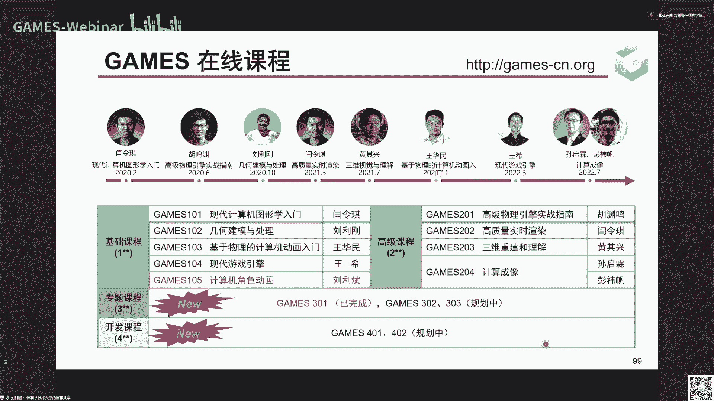

这个屹立于世界之林啊，做一些贡献，好这个301课程到这里就结束了，好再次感谢各位games小伙伴哦，还有业界同仁对我们的支持，还有在群里面讨论非常多的问题啊，我们也会尽量的即使这个课结束啊。

我们在群里面仍然会回答同学们的一些问题啊，希望和大家建立起长期的交流和啊那个讨论啊，甚至能够找到一些非常好的东西，可以一起合作去做好行。

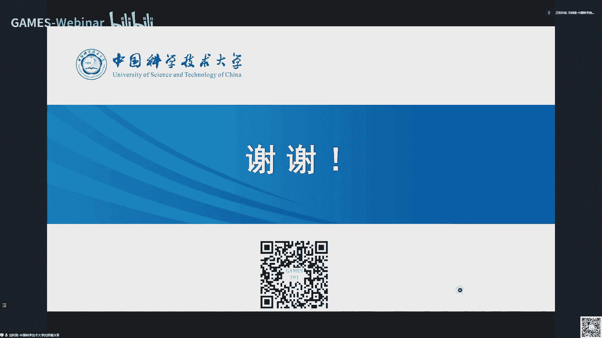