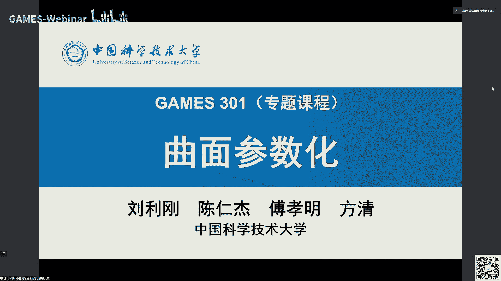
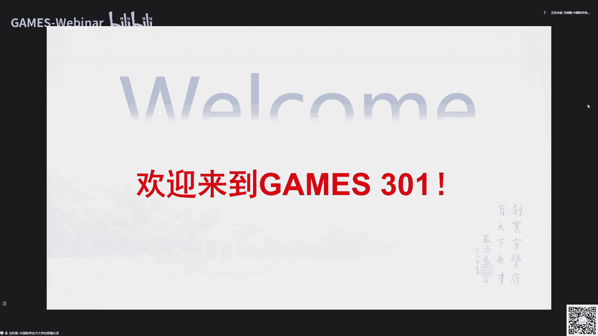
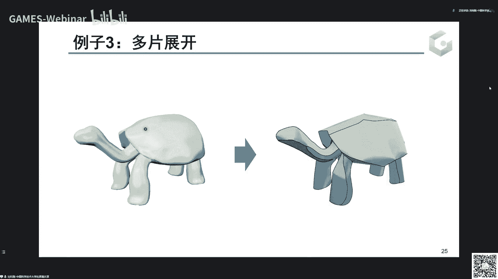
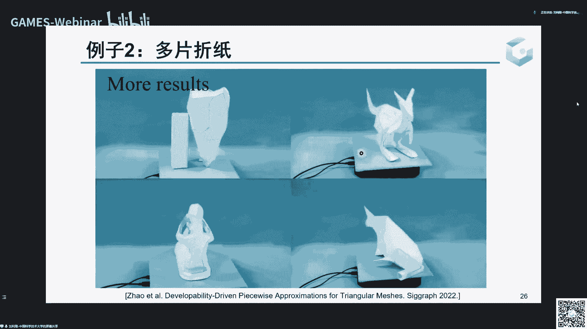
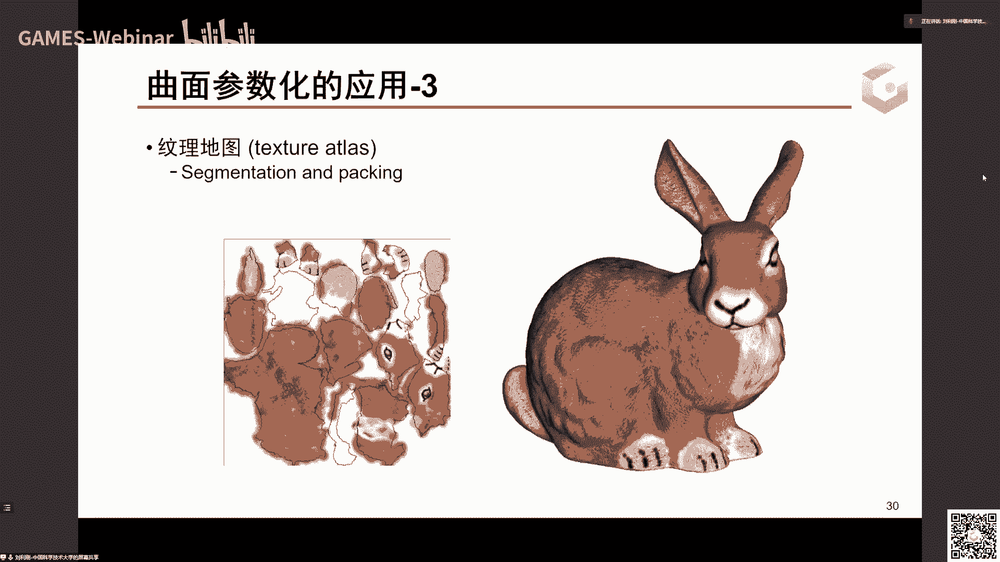
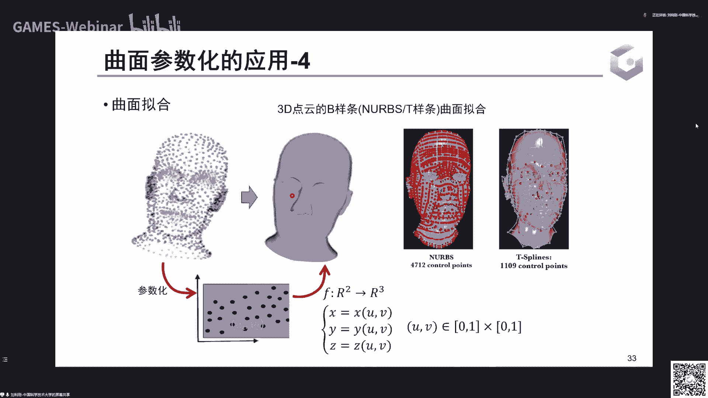
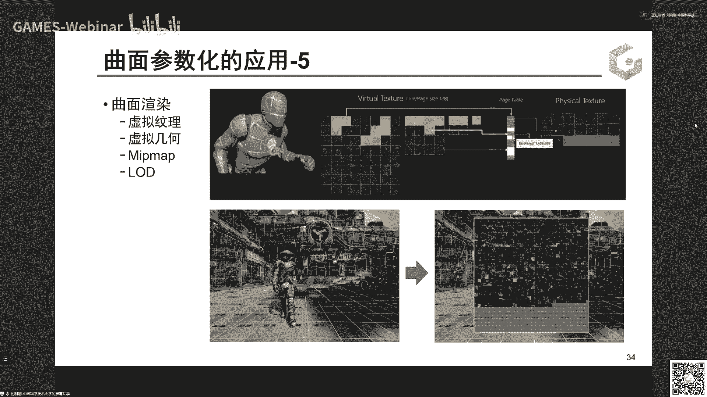

# GAMES301-曲面参数化 - P1：Lecture 01 曲面参数化介绍 - GAMES-Webinar - BV18T411P7hT

好那个各位亲爱的games小伙伴啊，早上好啊，我是中国科学技术大学刘利刚啊，这个很高兴又和大家见面啊，今天是games 301专题课程啊，曲面参数化的迪斯科啊，这个在2年前gm 102啊。

我上了那个几何处理与建模的基础课程，之后呢，受到了广大啊，game小伙伴的一些热情的反馈啊，因为那个内容很多，然后课时有限，所以其中很多内容啊并没有讲的非常深刻，本来也想考开一门二开头的高级课程。

但是内容忍了很多，所以呢从今年开始，我们决定啊开设三字头的专题课程，把里面的一些比较重要的一些专题啊，通过一门专题课程的形式啊，啊给大家分享啊，并且这个让更多小伙伴们啊能够入门，并且从事相关的科研开发。

和那个软件一方面的一些研究工作好，那么呃今年这个课呢，呃我们看可以看到我们这个科技大学啊，中国科技大学组成一个比较大的一个啊，讲师团队啊，除了我本人以外，我还邀请了我们啊数学学院的陈振基老师。

胡晓明老师和方向老师一起啊，啊，对这个专题课程，进行非常更深入的全面的一些介绍啊。

当然首先欢迎这个大家来到301啊，这是我们呃这个呃对我本人来讲，也是第二次开始这个在线课程。

一起成长，那么今天是这个专题课程的第一讲啊，我开个头啊，简单全面介绍一下啊，曲面参数化的一些基本概念内容，然后后面其他三位老师呢，会从各个方面来详细的讲解，各个啊技术细节。

以及更多的这种实现细节啊，这是我今天第一次课的这个提纲啊，可能嗯我在开始会全面介绍一下games，的一些情况啊，跟到现在发展了5年啊，这个除了在线报告，还有很多课程也开得起来啊，形成了非常有特色的啊。

我相信也能帮到帮助到了广大的啊，那个年轻学生啊，学者啊等等，从中受益，我们也希望做更多的创新，所以会尽量介绍一下，后面呢就介绍一下曲面，3d化的一些这个概念，还有啊应用，还有一些主要方法啊等等啊。

所以今天呃内容还是比较丰富的啊，这个看看一个半小时能不能讲完，好看这个具体的进展，我们看看这个超频时间节点时间，那么games在线课程呢啊，首先games众所周知啊，它并不是游戏的靠。

所以games是啊graphics and mixture，environment sympm这个缩写啊，这刚好形成games，这样容易记住的这样一个名字，所以呢它是呃。

我们面向经学及相关领域的一些这个，在线平台，他开设了是2016年创建，但是17年啊才有线上平台，可以看到这5年发展线上平台发展啊，除了啊，我们坚持每周有高质量的这种，在线学报告之外啊。

你可以看到需要报告分为其他方向啊，就是这这个原本图就其他方向，那个几何绘制啊，模拟视觉可视化，cdc和现实之外啊，还有好多其他的一些学术沙龙啊，明星大咖面对面活动，特别是在2020年2年前。

开设这个在线课程啊，后面我会详细介绍，取得了非常啊多的一些进展啊，这个通过这个在线课程，是不是邀请国内外的工作，在一线的这样一些优秀的年轻学者来讲解，分享他们的这个啊课程。

得到了广大这个games小伙伴们的支持，那么这个5年下来啊，这个人群也从当时的一两千人，发展到1万多人，并且啊，我们坚持把这个每一期的报告课程，都制作成高质量的这个视频共享，在我电子网站上。

现在上面资料非常丰富，那个适合你的这样一些内容啊，其实总播放量达到300万人多了啊，那么当然这个组织架构啊，games也是属于我们中国金融学会下，计算机图形学与啊啊这么会下面的。

所以这个可以看到17年6月，我呃我负责创建以来经历过这大啊，做小贝老师，还有现在是深圳大学胡瑞珍老师啊，在运营这个现场平台，所以最后有非常多的老师，在背后付出了辛勤的劳动啊，课程形式等等。

都参与很多的这样一些讨论指导，执委会就是怎么安排每个星期的这个报告，所以啊小伙伴们表面上看到的，每一那个常年有不同的报告，还有课程是否有大量的老师，这些都是我们国内国外，在背后默默的付出了很多的劳动。

好我这里在一并表示感谢，好咱们今天重点介绍一下这个在线课程，这个课程呢，事实上，这个在2019年运行2年的时候呢，呃报告已经运行比较嗯成功啊，也比较规范化啊，那么那时候我们是一个想法。

能不能开设一些基础课程，让更多小伙伴从能够更快的入门，因为学术报告，对于一些还没有入门的小伙伴来讲，还是有点困难，因为缺乏了很多背景知识，所以19年啊，我就在物质以及在思考怎么来啊，开设一些这个课程。

帮助到这个我们这个领域啊，这个中心学及相关领域的一些同学啊，能够很快了解到中心学的，这样一些基本知识和技能，因为这个呃，大家知道这个人工智能这10年发展非常快，因为他们的这个入门门槛比较低。

所以很多同学很容易上手，所以我也想通过这个在线课程呢，也帮助到小伙伴们更快的入门，所以在19年在澳大利亚开sars的时候啊，就碰到一些年轻学者在探讨这个想法啊，在其中啊，跟闫力齐老师那个聊了很长时间啊。

这个不开耦合啊，这个他也希望能够开设一门这个，基础课程啊，那么我们我跟他非常啊深入探讨了一下，这个可能性，依据这个方法，还有这个内容，决定就从2020年春节之，后啊他那个后面刚好碰到疫情啊。

这个就从电子101开始，由杨立新老师来抽奖，101之后呢，我们就又又在物质和邀请了更多的老师，还有呃从11010系列，从啊几何动画仿真，还有马上即将10号啊，马上下周一开始的105啊，记得去决策动画。

就建构建出一系列的这种基础课程，让你能够啊非常轻松，非常直接的了解到这个各个途径，学各个行呃领域的这样一些基础知识啊，之前结束的104啊，王，晰老师这个讲解的非常好啊，这个整个怎么把各种技术串起来。

形成一个庞大的游戏引擎，当然还不仅是中心医学技术，还有更多的网络呀，哎呀呀，还有这软件工程之类的哈，所以大家有一个直观的了解，二开头的课程呢主要是一些比较高深的啊，更高级一点的。

可能会讲讲解的更加深入一点啊，就是现在正在啊开设是204计算成像啊，嗯正在这个假设，那么呃我们今年去年啊再去规划，今年规划就是想规范更多的一些，这次的课程就是三开头的课程，三开头的课程呢就是专题，就是。

啊不是呃很很棒的一个大领域的一些主题，因为每个每个大的方向，都有好多小的课题方向，所以呢我们把这课题方向变成一个专题啊，所以啊301我们现在开始，301，就是关于几何建模与处理中的，一个非常基本的问题。

叫曲面插画啊，所以呃通过啊14节课这个课程呢，给大家全面深入详实的来介绍一下啊，注意可以看到我们对课程也啊，组成一个比较大的这个讲师团队啊，也之前做了非常啊好几次的这个同步啊，思路对齐等等。

那么另外明年大家应该值得期待，还有302，303关于其他这个啊专题的啊，这个明年你们会有啊其他方向的，所以啊无论你是在图形学或者三维视觉，哪个方向都会找到你们这个专题啊，我们希望在经过下一个5年啊。

能够把这个各个专题的课程给它构建起来，啊，这个呃这个303赞扬非常之期待，好这个我就不剧透，可以看101202303啊，是是什么规律好，那么后面还有四个四开头的课程呢，也在架设之中呃，四开头呢就更加是。

因为从104课程中反馈，大家对软件系统这个特别是门槛，就是入门门槛啊，啊这个，提出了好多这样一些建设性意见，所以我们想我们通过一些图形学相关的，开源系统啊，或者是渲染的还是仿真的。

还是动画或者是几何的好，我们我们呃通过自己啊，这个无论是专委会的努力的评奖啊，还是什么方式，找到了一些非常好的开源系统，也是我们华人来做的，所以啊希望通过来对这些图形，相关的开源框架进行详细的讲解。

以及在上面做相关的应用，这时候呢啊，同学们更加容易很快的进入到这些框架中，进行一些开发研究啊，甚至在呃这个未来的这个企业中，你就可以找，到应用，升级之后马上就会开设啊，一些这个关于物理。

仿真几何的一些阵容框架，但但框架可能不会很大，因为很大的话就像那个104的游戏引擎，那是一个非常庞大的一个系统工程，所以我们会从一些小的框架开始，怎么去搭配一个图形框架，怎么去使用它们。

去做你们自己的工作，当然国外也有很多优秀框架，所以呢你们只要掌握这些东西以后呢，可以很快去上手啊，这也是我们开设四开头的这个课程，的一个驱动目的，也，就希望这样一批啊。

这个图形开发的这样一些这个优秀的啊，这个啊软件工程师，或者是一些研究工作者啊，这个无论在科研还是在软件开发，都有很多的这样一些啊机会好，那么301课程，这个呃刚才简单介绍四这四位老师啊。

这个都是我们科学，中国科学技术大学数学学院的啊，那么呃这个呃在这个我们宣传的时候，已经把我们主页也给到，大家好，大家呃，或者是微信群里面的宣传文件里面，可以找到这样主页链接啊，这这个首页组织安排是。

个教师啊等等啊，那我下面就简单介绍一下，那么首先这个so co讲师团队，还是我们发动了四个老师啊，都是我们团队的啊，计算实验室是依托于数学学院的，所以啊，因为我们都是呃认为数学是非常重要的。

所以这个做图形学方面的话，需要很强的数学背景和知识，所以啊，我邀请了几位数学学院的老师来进行讲解，啊，啊这这是我本人啊，那么陈仁杰老师呢是啊，博士毕业于浙大数学系的啊，是我以前的博士生啊。

啊后面在m p i做这个主连结员啊，三，年前回到学校啊，国内啊青年千人啊啊，引进到我们中国科学技术大学数学学院，那么付晓明老师很多啊，小伙伴应该也很熟，他前几年开设了一门数字就要处理，放在b站。

也是深受广大那个呃，那个软件啊功能那个功能啊关注啊，他那个在几何方面方面特别在常态化啊，建模方面学到非常多的成成绩啊，这个他会给大家带来非常多的，令人期待的一些呃内容，那么黄金呢是今年这个博士毕业。

也是我学生博士生啊，今年啊留下来在各大主播之后，房间呢在那，这个做的非常深入啊，他会在课程的后期给大家介绍啊，共给你视相关的一些参数化的内容，这是我们的课程安排，我们课程初步计划是十节课。

那么连续七周啊，每周的周六周日上午好开始啊，那么因为因为明天8号我们呃要上课，刚好有人冲突，所以我的时间有点冲突了，所以提提前到啊，节假日的最后一天，7号今天来讲解啊，就是这里就调了一下。

后面如果没有特别的这个原因，就基本上按指的时间来来讲讲授好，首先由我这个开始做介绍，后面，的傅晓敏老师呢会讲讲一下，那个面向离散的方式，这个参数化技术，然后呢，整理金老师会讲一些连续性的，这个强化基础。

那么方谦老师呢会讲一下共情，常态化的基础啊，这样的话就整个把那个啊，我们山东化相关的所有基础都还关在单位，形成一个非常完整，系统和深入的这样一个知识体系啊，呃不仅是能帮助到啊这个没有做过图形啊。

参曲面战争化的同学，能够很快的了解到这个啊合理方向啊，也可以帮助到，即使在参全面分化领域做过工作的同学，可以更深入地了解到这个一，些动向，还有一些问题，以及未来的一些科研科研方向啊。

这是我们希望在七周啊，过程中给大家一起啊，这个我们来通过分享，通过讨论，通过交流啊，记起来收获和成长，那么这课这个课程呢呃这个是个专题，所以我们呃会讲的稍微深入一点。

所以需要大家就是可能啊有一些基础知识，特别是101这个或者是102础知识，那么呃还是需要自己去补一补，这相关的一些这个图形学啊，几何的一些基本知识啊，当然这个呃我们给课程。

每次直播之后呢也会录屏把它保存，可以啊，课后再去看回放好，可以不断的那个啊，去去去去去看这个呃讲解，另外的话呢我们会群里面啊，也有我们的助教啊，所以如果有任何的问题就可以啊，自然我们还有啊。

这个bbs bbs gm是这个网站提供的好，所以大家有任何问题还是可以的，非常及时的跟我们交流和沟通，另外的话呢让让能够让同学们学到啊，真正的那个一些东西啊，我，们也布置了四个壁纸作业啊。

考虑到这个呃ges网友的啊啊分布广泛性，所以我们有两个框架会给大家，一个是c加加，一个是matlab的啊，就适合于不同的这样一些啊对象啊，就是如果你更擅长c加加，可以用c加来写。

那个我在在科大的这个同学，学这个课程里面，我是要求同学们全是用c解加啊，来写完成作业的好吧，然后我们的助教也会啊，非常认真的来批改大家的作业，只要大家能够去提交好吧，他们会给到你们一些啊。

这个非常好的建议啊，好那么，这次我也感谢两位我们的助助教同学啊，刘世博和梁宗轩同学啊，他们在背后已经提前就做好了，非常多的工作，还有直播相关的一些内容啊等等，后面工作量也会非常大啊，我能看情况。

如果作业量很多的话，我们也会增加一些主教来帮助到大家，然后刚才提到一些知识知识，我就不展开啊，数学当然先行，微积分大一的东西哈，数字方法啊，自由化，上次大家如果听过102的话，就听清楚这些都是基本的啊。

需要掌握的知识，当然还有微分，几何等等啊，这个人有些知识啊，在在这里我谈一下体会，就是数学中心呃，在实际用的过程中边用啊，呃不懂就去学啊，是学得最快的啊，也没必要，所以我一定要学个几年数学才能可以去做。

有些有些有些知识完全可以在做中学啊，学的过程中不断体会，然后又来又来是实践，这样的话呢知识掌握起来也会很快啊，因为它这个这个具体到某个问题来讲，它的知识点不是不会cover到数据，所有东西。

它只要那个点你掌握出来，你就可以去用了，那么重新学知识呢，大家我我我们是三开头嘛，所以，我相信大家一和二啊，11101啊，101和102大家都听过好，至少有些基本概念啊，如果没概念再来听的。

可能就会还是比较困难的好吧，然后还有一些其他的，前沿数学课程，每年都会邀请非常多的学者来讲讲，一些前沿技术，这个当然是更更更多是开开脑洞啊，这个开开天窗的一些这个课程，可能啊你如果你不搞。

不搞相关的这个方面的研究，可能很多内容对你们也是比较高深的好，但多听听啊，这个知道这个领域啊，这些学者在做些什么，也是，很有好处的好，还有付了付老师的那个数字求和处理啊，b站上挂了也有将近2年啊。

这个也也也好几万的流量好，就是大家，当然这个课程稍微呃不不仅是商业化啊，大家啊如果感兴趣也可以去看一下，好，前面20分钟，我把这个啊这个game以及301的这个内容，大概简单介绍一下啊。

后面我们进入到主题啊，首先介绍一下曲面参数化啊，这个参数化这个词估计大家都已经听过啊，这个特别是在102这个2年前我讲座的，那个几何建模与处理的，课程中啊，第11讲水平上的话就讲了一节课是吧。

这个那时候因为只有一节呃，两个课时一个半小时，所以只是非常宏观的啊，介绍一下曲面上画，当然第12讲去几何应试相关啊，大概有半节课啊，这个相关我也我也提了一下内容，因为12项的后半段是讲那个优化的。

所以啊我就把11 12讲两讲呢，给大家回顾一下啊，就是大家如果那个有印象的话，这两这两次课就是关于，但是现在可以看到301，我们把这个曲面碳化这个专题，变成14个杰克，像他的28课时来讲，所以应。

该是比啊那时候的内容更深入更广泛，更全面，好好，那么嗯他的话相信很多人都懂啊，但是我还是更想这个，让一些可能第一次接触，或者是对这个不熟的同学有个概念啊，比如说我们一个地球啊。

我们地球是三维中的一个球体球体表面，但是我们人类更多的是看二维的东西是吧，所以我们要把它变成一个二维的这个啊，这个图形的显示，那么这就是地图是吧，我们我们看到地图就能从我们脑袋去空间。

想象它的三维的这样一个对应，所以怎么把一个三维的一个球面把它展，开成一个二维的一个地图啊，这个就是我们人类啊非常早的时候，就就就在啊这个做的事情，好像这个就是一个参量化的，一个非常直观的例子啊。

怎么把一个空间的球面，把它剪开展开起来啊，当然怎么剪，你可以啊，沿着经线剪是吧，然后就长成，我们通常看到这个叫横向地图啊，当然你也可以纵向减沿着纬线啊，这个啊20多度的这样一个地方剪就可以。

就可以是一个竖版地图啊，这数量居中呢在军事上用的更多一点啊，因为啊等下你们就清楚，这个每天两个系统的这个对这个扭曲，就形变量是不一样的，所以他对距离这个度量好测，测量是不一样的，举个例子。

比如说我们测啊，从中国北京到美国纽约这个这个距离，如果你是直接这样连线去测，肯定是不准的是吧，因为球面距离是沿着大圆的距离才是，然后这个呢是不保持大圆的，而出版巨头呢因为是沿着这个纵向去展开。

所以说这个距离就更更精准，从北京到纽约就更更精准啊，比横版要精准啊，相差啊会有40%的误差，所以可以看到这个不同的这个展开，也就是说，不同的技术对这个应用这个要求是不。

一样的啊，好那么另外一个句子呢，就是我们快到冬天啊，这个剥橘子是吧，也是把一个封闭的橘子皮儿啊，把它剥开，当然我们平时不会用技术去思考，这个剥橘子对吧啊，所以这也是一个三维的曲面。

把它展开成平面，只不过这个橘子皮你把它摊平，就是这个平面好呃，这里这个视频估计很多网友都看过是吧，就是也是我们啊sara 2019年工作，当时可以看到，就是如果艺术家用小刀把一个橘子皮啊。

通过某些割缝啊，就能把一个橘子皮啊展开成，一个非常可爱的啊，这个这个一个动物形象啊，这样的话，那就啊这个激发了我们对这个工作的去去，这个研究，就怎么样去寻找曲面上的割缝，能够让它展开成一个。

人们期望的一个图案啊，所以这个呃也是一种碳化的一个应用。

可以看到啊，你这个对餐的话，这个问题如果有深入的研究，你就清楚我们应该怎么去啊做这个事啊，能够呃得到不同的歌缝，把一个曲面展开成一个平面图案啊，这个是怎么做到的啊，这个后面付晓敏老师会有一节课。

专门讲到啊，会来讲解其中背后的这个技术。

好，那么另外一个才能化应用，在生活中应用的一个实例啊，生活中应用的实例可以看到一个复杂的，如果你你只是展开成一片是比较困难的，像这个乌龟这样一个复杂的啊，你可以看它有这个细小腿，还有还有可是。

所以展开成一张曲面呢是比较困难，所以我们会把它展开成多多片啊。

就是把它分割进行多片，那么如果你这个进行多片以后的话，你对这个多片进行一个这样的这个裁剪，然后呢按照这个拼接的顺序，把它们用纸啊，用胶水把它粘起来啊，就可以形成一个三维的这样一个。

表面啊去看看通过这样一个呃拼接，就可能把用纸拼接成一个，这个可爱的兔子啊，就是这个背后的技术，也是差生化的一个应用啊，就是我们不是一片，而是多片啊，刚才那个布局是平时一片，这时候是是这个多片啊。

这是今年srah我们的一篇文章啊，背后怎么样让让这个这个啊建数尽量少，而且参杂化这个展开的这个扭曲，或者叫形变尽量小，就是我们这篇文章的一个背后的技术，后面啊。

傅老师也会在后面的课程中进行讲解好，所以从前面那个两个生活中的例子，可以看到啊，三个生活，中例子一个地图，一个播剧的题，一个是这个直指这个啊，展开可以看到水面上的话啊，实是如果直观来看的话。

就是给定一个左边的这样一个三维的，一个蚂蚁这样一个曲面啊，这个曲面啊怎么样啊，这个能够把它展开成一个平面的图啊，就是啊就是说的直观一点，就是怎么把它把它摊平啊，混淆啊啊这个这个这拍屏是吧，就拍成平面的。

那么数学本质呢，如果你把这个蚂蚁曲面看成是一个xyz，三维空间的一个曲面，好像这个曲面呢，加上这个曲面跟它所对应的这样的，二维的区域进行一，个叫做一一对应啊，那么从啊在数学某些学科啊。

像拓扑学里面这个就叫嵌入，我把一个某个空间的一个，这个数据表达形式嵌入到另外一个空间啊，这个只不过这是三维空间，那么呃，这个曲面为什么能够把它嵌入到一个这个，低维空间啊，比如说这是r3 的。

我们看起来这个上面是个r3 中，就是三维空间中的一个曲面，能够把它嵌入到另外空间，这是这是因为从透过来看，他们是拓扑同胚的，什么叫拓扑同胚，就是他们的为数，就每个点领域它都是等价于一个圆盘。

所以呢他们两个实，际上啊是什么错，不同配错不同，非表示这个这个曲面，虽然在这个观察空间是三维的，但它本质上是二维啊，我们数学上有个名字叫二维流行，就是每个点无论取多少小的这个领域啊。

它都是跟一个小圆盘是一样的啊，它没有其他的这个这个这个top结构啊，不像一个体体的话，一个点取他的一个球状领域啊，它就充满了这个球状领域，但一个表面，你这个点取一个周围的一个球状领域，它里面只有一小片。

是是在这个小球面里面，这小片呢是一个圆盘，所以它是个曲面所，以它是个二维的啊，所以如果如果用严格的这个数学语言，需要定义一大堆这个符号才能把它讲清楚，但对我们来说没有没关系，我们就是一个三维空间中。

我们肉眼是这个叫啊这个啊，嗯叫叫这个可视空间，就在空间上看起来是个三维形状，但它本质上它是个二维，所以它能够把它嵌入到一个二维区域，所以这个就是给这个方面曲面，如何把它迁到一个二维区域。

并且构成点对点边对边面对面的一对应，理解和定义，好好就是这个这个定义是非，常容易理解好，那么呃应用刚才我讲了很很多是吧，就可以看到这个我我在看到，为什么要做这事儿，为什么要要把一个三维的这个曲面。

把它把它剥开展开，摊平到一个平面上啊，形成这样一个对应关系啊，除了这个地图是吧，从地图上看到，刚才我啊仅仅解释了横版地图跟竖版地图，是可以看到地图制作中，还有好多别的形式的地图。

因为保持的东西是不一样的，刚才啊横版地图跟中版地图啊，保持这个距离是不一样的，像像这种地图啊，中间这个是保持角度啊，就是在地球上的经纬线，一定是垂直的啊，一定一定是啊，这个正交叫90度。

那么在这种地图呢就能保持每个点，它的这个方向跟正方向是保持一个，这个垂直是吧，有的时候我要我要去计算角度的时候呢，就这种地图是比较精准的啊，这个就叫共性影射，这个在方兴老师后面会详细展开好，那么参的话。

实际上在同一学里面最大的应用是啥，就是贴图啊，就是我要在一个曲面上，把一个图片给贴上去，那么这个曲面是空间的，我很难想象好，那么如果我把它work扒开，打开成这样一个形状好，你就把你要的纹理好，我。

们再看一遍哈，你发开以后，你只要把你要的这个图像这里，只不过我们这个图像是一个棋盘格而已，如果你你你这个图像换成是一个啊，这个其他的图图案是不是也可以，就是里面就每个点啊，我这个光标这里哈，每个点。

因为这个每个点跟曲面上，每个点有对应关系，所以这个图像在这里的颜色，就自动的去附着在了这里了，这个应该很好理解是吧，所以呢这就是纹理映射啊，我怎么把一个纹理图案，把它映射到一个曲面上啊。

那么在这个游戏引擎或者在啊这个工业界，这个就叫uv图因，为什么刚才这里有有个坐标，我这里是用二维的，二维上是空间中坐标，我们喜欢喜欢用x y z，但是在二维中呢我们喜欢用uv u v意。

为什么一个一个u方向，一个v方向，为了区别于x y好x y z，当然你因为你把它解释成x y也可以，但是我们更常常常用uv啊，也是一种参数表达的符号，所以啊有的时候工业界叫u v土啊。

所以是一样的概念好，所以你uv展开以后呢，我就可以啊，去在这个上面呢就定义曲面的性质，最简单就是纹理啊，颜色啊，这个颜色是啥对吧好，可以看到后后面假，设你把它展开以后，我我上面这个这个点对应这里眼睛。

那么这颜色是黑的啊，那么这个是对应这个兔子的背部啊，颜颜色是棕色的啊，这时候呢你就可以修改这张图，就修改了全面上的这个啊纹理了是吧，好这就是那个啊纹理叫uv图，当然呃你刚才是一片，现在我是分成多片。

这个多片把它拼起来，这个就叫纹理地图叫texture atlas啊，所以你们在如果做过游戏的同学，或者是呃美工啊，就这些概念都在很多工具中都有概念啊，都都有提到的是吧，好优惠图。

游戏图这个这个叫uv展开，所以怎么把，一个复杂的模型展开，正在uv图是一个非常这个啊，这个不平凡的过程，那么这里因为什么，一你要这个uv图尽量的小，因为这个uv图啊，这个是要占这个显存。

就是这个空内存空间的，这gpu的显啊，空内存就是显存啊，所以你不能太大啊，所以尽量怎么怎么怎么小是吧，第二个还要保持这些特征和特征，后面我们就会去讲这些概念，好好这就是这个好，大家再想一想。

有人那张图是不是，我们构建了一个平面的区域，跟空间复杂曲面的一个表面上点的对应，这时候你竟然可以存颜色，是不是我，也可以存别的东西啊，曲面上有啥，我就把它存在这里，这张图来就很好理解，也很好控制也好。

很好生存和修改啊，比如说我们曲面上还有一个属性叫法相，是不是我可以把法向存在这个点的颜色，对吧好，所以这张图uv图就是曲面的一个，虽然差距较差的话会叫uv图，实际上它就曲面的表面的属性的一个代理。

它可以存储曲面上别的性质好，你可以在上面绘图啊，你你你就可以站在上面存存别的东西啊，材质你刚才想象到了，好的，这个法向是不是还可以变东西啊是吧。

可以大家就可以，看到我先先把这个放放过来好，你是不是还可以去存储啊，它的那个材质好像颜色就是啊比斗是吧啊，还有材质可以存储它的b r d f，比亚迪f只不过有不同表达啊。

那么你可以从这个金属度粗糙度啊等等啊，你你实上在在那个啊这个这个渲染过程中，你还可以存储它的一些中间状态啊。

比如它的反啊，反侧度等等，所以这张图就什么就度量了，就记录了曲面表面上的啊这些所有性质，曲面上有这个点有啥性质，你完全可以用这张图来存储，这时候呢它的这个存储就变成二维了，二。

维的二维的图一旦变成图像以后，你就可以用图像的一些技术去压缩传输，绘制处理，这时候呢你去处理这张图，等价于处理浙江这个曲面的啊，一些性质当然更极端，你可以把这个顶点也把它编码成图像，形成一张图。

这就是几何图像啊，geimage的思想，所以你甚至连这个网络都不要，向材质，光照等等，你就可以去存啊，这时候你就可以做很多事情了啊，这个如果用过maya max霍霍迪尼啊，blender这个软件啊。

这个图是非常重要的，好你可以绘画啊，这些这些我就讲到这，那，么还有一点呢，在几何建模里面的那个这个参数化，也很重要，很重要是啥呢，这个叫拟和，这个在102我讲了也讲了不少对吧，就是啊我一个点序列。

你要一个样子，这个曲面屏你和它因为它是单单参数的，它有啊，所以说上面哪个点都要有个t i，所以呢你这个曲线p跟这个pi，这个某个点对应，你要做个误差的话，你一定要知道这个pi的参数是几啊。

因为它它是单参数的，所以这个啊就必须要有个参数啊，那个对于这个点云的拟合，你如果我扫描出去就点云啊，这个你需要拟合出一张，曲面来，你们因为这个因为这个曲面是二维的，所以要把这个点名。

把它参数挖到一个平面ui v i，那么呃你这个通过这个双参数的，这个这个基函数曲面产生拟合它啊，所以这是曲面拟合啊，所以这是非常有用的。

那么这个刚刚才我已经讲了啊，这个曲面渲染里面呃，这个虚拟纹理，虚拟几何等等，b map啊，还有i o d都是基于这个图片跟，就是你可以理解成这个参数化的这个uv图，就是曲面的一个代理，这个代理呢。

或者记录它好多好多一些这个信息啊，那么你把这个曲面的一个处理啊，或者一些信息变成一个图像的处理啊，这样的话你的i d也可以做啊，你的这个其他的那个mmap这些都可以做好。

当然啊这里啊这个应用很多很多啊，表示比较有研究的同学，就这样做，无所不在啊，因为因为三维呃，这个曲面可以很复杂，但是一一把它拍平到二维结构就很简单，我们可以很很多方法，很多思路就可以在二维上去去去做了。

好好，那么他的话这个概念刚才呃介绍一下，那我们下面看一下他的话这个怎么做好吧，这个我今天只是开开个头给大家，一些直观印象，后面我们还有13节课，老师都会详细的展开和解释好，那么参数化表达呢。

就是说本质上就是求一个三维，二维三维曲面啊，变到一个二倍区域这样一个映射，这个映射是从一个x y z r3 空间中，一个点把它映射到一个r2 uv，在一个过程对吧，但是这个过程不是啊。

这个可以任意设计是吧，所以它可能有它的要求啊，比如说我我要保持距离啊，保持角度的关系啊等等啊，所以对f的求解，就是曲面参数化这个专题里面啊，我们需要去重点关注的好，那么怎么去表达这个。

f就从如果从逻辑上来看，它就是一个r3 空间到r2 空弦，一个映射啊，这个映射就是函数嘛对吧，所以函数呢在从函数论的角度上，我们函数是没法定义的，所以说我们就会把它把它进行一些约减。

所以基本方法叫化繁为简好，我们这个函数呢不用太快广泛，我就建议一些g函数，一些某些基本的函数，然后通过他的性质和章程，一个线性空间啊，这时候我们就从这个线性空间，线性函数空间中去找一个函数来满足。

我的应用就够了，这时候呢你就把这个函数的求求解啊，变成了这个，基函数的线性组合系数的求解啊，就就把无限问题变成有限问题啊，这是函数空间简化，当然还有一种呢，就是说哎，我这函数。

这个找这个函数空间也也挺挺麻烦，那么我就把这个曲面啊，把它剖分成很多小单元，比如是三角形啊，这个是反正提供一些采样啊，就把一个曲面呢把它啊简化成了一个分片，三角形啊，分配三角形是线性的。

所以叫也叫分片呃，线性逼近，这时候呢我只要去搞清楚每个三角形，这对应关系啊，函数我就我就用这个分段，线性函数去逼近了这个f啊，所以呢你可以看，到从两个维度思路，从一个函数的简化可以去有函数空间。

那从地域简化就是用这个游戏有限单元，单元三角形为为主啊，所以后面啊，我们的课，就会围绕着这两个思路来给大家啊，一起来这个探讨好，那么第一种呢就是连续啊，连续上呢就是呃如果经过102前面的。

你和那那那几节，几节课的同学就清楚了是吧，我们可以构造各种各样的函数啊，像这个是一个波茨坦基函数，通过它的组合，就是组成出这个红色的，非常复杂的这个曲线啊。

这时候你就去就去找这些a i b i a b i，就，变变成了有限个点是吧，就是把一个寻找函数的问题，变成一个这个若干个系数的问题好，那么分配线性的方法呢也很好理解，就是把一个曲面像这个这个人脸啊。

把它变成一个呃很多三角形，三角形倒三角形影射是非常简单，是个线性映射，是个反射的对吧，所以呢这个f呢就就很容易设计，那么如果你里面这个三角形，到三角形之间呢是一些简单的线性啊，这个函数可以它导出不连续。

可以看到这里就发生了一些，这个三角形之间的扭曲，但是三角形内部还是非常光滑的啊，但是内，部还是非常棒方法的啊，但是边界的啊，这个就导数才能不连续好，那么如果你用了这个三角形，内部还用了一些高阶圆。

比如说是二次曲面，三次甚至更高阶，这时候就保保证拼接的过程中是连续啊，所以这个在这个本课程的后面，我们也会提到这些技术好，给大家稍微有个印象好好，那么这是参数化的，这个表达就是你可以是连续函数的表达。

也可以是离散的，这个分片线性表达就是都是在做一些简化，那么简化是为了做更好的计算啊，但是有个问题就是诶，我什么样的参数化是好的，参数化啊，所谓的最优啊啊这个最优我打个引号啊，大家知道我们做做计算。

或者做那个实际工程啊，永远没有最优啊，只只只有更优是吧，就是最优一定是在某个度量下最优，你度量不一样，你如果度量的位数一高就没法比较了是吧，所以你还是要度有个度量，你才能自由。

所以你可以看到我即使是我们地图展开啊，这是一张图啊，这个图呢这些呃城市的小球呢或者椭圆呢，都是球面上的，等大小的球的一个对应关系啊，也就是说啊像知道在这里啊，这个这个球基本上不怎么变形，保持原。

来球面上啊，这个以嗯想象一下，在知道上踩一个点，然后以它方圆多少啊，这个画个圈啊，这个印过来以后，在平面呢它不大会扭曲，不大会形变，但是你可以看到越到北极和南极，它形变就被拉扯了。

就被一个球被拉扯到一个椭球啊，这这是因为你这个映射啊没有保持很好的，没有在每个点保持很好的这样的度量，比如说没有保持很好的这个面积，没有保持很好的距离啊，所以你一个球面要把它展开成一个平面。

肯定是会破坏一些几何度量啊，面积距离等等是吧，所以这里面就有啊，要问，我们要做一个好的参数化，你到底要你需要什么性质，你才能做好好，那么从数据上来讲一个映射，假设我一个区域啊。

左边的一个欧米伽运到这样一个区域对吧，这个f假设是算出来存存在的，那么我们对某个点x这个点啊，x我取它一个小领域，这个小领域叫欧米伽哈，这个欧米伽是这个点的小领域，那么这个小领域通过f就印到了这个红点。

所对应着这样一个小领域啊，你们在大一微积分的时候，学那个一个词叫雅科比啊，就叫叫后边啊，雅科比亚克笔是什么呢，这个点的亚克笔是，这样定义的就是这个这个映射的啊，对两个方向的一个偏导组成一个矩阵。

这个叫雅克比，就它是一个啊，比如说二维就是2x2的啊，它的还有个行列式，行列式是度量啥呢啊，我不知道大家有没有学过他的球，就你们在学数学的时候，一定要知道它背后的求意好。

我这个几何体稍微呃定性的描述一下啊，你把这个点的这个小领域，因为这个假设取一个这个，无穷无穷小邻域啊，这个半径为r，他运过来以后就印成这样一个这个呃，一个一个任意形状或者不规则形状，这样一个黄色区域。

你把这个黄色区域的面积，比上这个蓝色区的面积，当你这个r趋向于无穷小的时候，这个面积比值是一个定值，这个定值就是这个亚科比的行列式啊，也就是说这个雅克比行列式度量呢，这个小区域的一个伸缩量。

如果这个比例是一，表示这个点附近附近没有被拉扯是吧，两个比等于一表示什么都没，这个点没有贝拉词保持什么，保持了面积保持的长度，保持距离对吧，因为它它是保持这个几何特性的好，如果这个这个是大于一。

表示局部有拉伸啊，如果是小于一就有收缩，就很容易很，很容易理解对吧，就是这个雅克比行列式的值，行列式的值，度量了它的这个啊，局部这个点的一个伸缩的状态，当然我们这里这个面积，我刚才只是讲的面积。

实际上这个面积还是还有个叫有效面积，比如说这个圆它是顺时针朝向啊，是这个这个方向朝向，但通过f呢，也可能是顺时针朝向一个小区域，当然也可能f心态不好，变成逆时针一个区域，这时候这个行列式就变成小于零了。

所以如果这个这个一个顺时针的一个区域，通过f变成一个逆时针的区域，表示iphone什么行列式小于零表，示什么表示他这里局部发生了一个翻转啊，翻转就就就是这个函数呢，发展一个镜像的一个啊这个这个变化啊。

学表示局部是有重叠，有翻转，你就可以判断出这个函数在这个点，这个点啊，这是它的一个局部性质，如果f这个呃这个雅克比行列式小于零，表示它翻身了，翻转如果是大于零，没有反转，但是如果它的行列式小于值小于一。

发生了收缩，等于一，没有收缩大于一，所以通过一个这样的一个简单的，这样一个亚科比这样一个，行列式啊，这数学就可以度量这个映射函数，在局部点的一个非常直观的几何造型，如果你理解这个东西以后。

你很多东西就后面就很容易看懂好，这就是雅克比啊，我记得花了一点时间来讲一讲好，当然还有很多映射的过程中，我还希望保持别人，比如说我我想我想变形过程，映射过后我想保持夹角啊，这里垂直我始终要保持垂直啊。

这个叫这个保角映射啊，实际上是在数学上有有个词叫共形映射啊，共情conformal啊，这个映射，然后呢还有些这个要保保持面积，可以看到这个右边这个这个这，个这个映射啊，它虽然那个不是这个特别啊这个规则。

但是呢它每一个小块面积啊，是被保持住了啊，可以可以看到它是这个叫做保面积好，那么还有最好的一种特性叫等距映射啊，i do magic，或者叫做那个名词叫i shi啊，就等于运势等于什么。

我既保持面积又保持角度，所以它是等于等于什么，等于输出，等于如果每个点都输出是等于变换，它就是可展的，因为因为它没有任何的这个形变啊，就一张纸把它卷一下，卷成圆柱啊，圆柱上呢跟纸对应就是一个等级。

意思好，所以这些是一些基本概，念好coupon mac呢，因为在空间上，这个在平面上很好理解，就是这个点的两条直线的夹角，但空间上的话两条曲线夹角是杂度量的，就是他们的切线夹角啊。

只要有这个概念就行了啊，我这里提一下好，那么可以看到，如果你你这个保持这个特性不一样，你地球展开有不一样的展开啊，像刚才我提了一下，如果你想保持角度，那这个叫共形映射，这个就是比较好的一个方式啊。

如果你是想保持面积啊，数学上我也可以给你算出来一个地图，是这个地图啊，你可以看到它卷曲跟跟跟刚才那个图不一，样这个椭圆是斜的，因为它保证命题啊，虽然我不保持那个那个距离啊，所以说这这个是叫啊等级啊。

这个地图这个叫保角地图啊，所以你可以在看到在呃实际这个工工程中，你希望我保值的车型不一样，我都可以给你算出一个这个地图来啊，这个这张这种地图在民用的比较少少见啊，那么我们来看看这个共性啊。

conformal mappp的这个呃呃几个概念啊，这个概念我不会详细解释，后面后面的课程会详细展开啊，呃放心，老师会讲的更细一点，那么共性运算呢，实际上是刚才我讲了这个这个映射过，来以后跌f v。

你可以把它表表示这个一个几何量啊，它跟那个dv啊中间是有个关系的关系啊，如果如果取它的一个对数啊，就叫做共性因子，所以共性因子呢也是度量了一个，在保小因子下面，它的一个局部的伸缩量啊。

这个质量在后面会经常用到，实际上跟这个跟我刚才描述的牙科比啊，这个概念是一样的，它就是一个啊这个深度，因此只不过是在共情影射下，它就比较好算，比较特殊啊，那么共性映射啊，这个还有一个非常重要的方程叫。

亚麻比方程啊，就是表示了一个啊一个一个一，个一个曲面啊，它的高速区域的一个变化啊，这个我提一下，那为什么放这呢，跟大家有个大概有个印象啊，这个印象呢后面会解释的非常，后面会解释。

虽然他的数学背后背景很深刻，但是截肢啊后面会讲的会比较直观一点，好拐角有两个概念，那个稍微提一下，还有一个等距变换，等于变向，就我刚才提了，每个点都是保角和保面积，所以就叫等距，如果处处等距啊。

这时候可以可以可以证明啊，这个曲面就叫可展曲面啊，可可转曲面有个等价的一个定义，或者一个性质叫就是高速曲率，处处，为零高度曲率就是两个主曲率的乘积啊，你看到，那么在从在微分几何里面可以证明。

高度曲率是等距变换的啊，不变量，所以你如果能展开成一张纸啊，如果等距它高曲率处处一定一定是零啊，因为这个不不变量啊，有好多不变量好，低级本性也不变量哈，进行变换相好，所以呢呃这个高可转曲面呢。

上次可以证明它只有三种曲面，一个一个叫柱面，切一刀展开来，这个很容易理解是吧，拿张纸卷一下，或者卷卷成锥面，还有一个就随便弯，把这张纸随便折一下，这个稍微稍微稍微稍微扭一下。

啊这个这个这种面呢啊叫做切线面，因为它存在于一条曲线，然后呢这个这个呃这个点这个点的切线啊，啊就是就在这个曲面上，所以这个曲面是这条曲线，在于所有的切线的集合，所造成的一个曲面啊，这个叫切线面好。

然后在这个前面讲讲的那个呃，前面一些基本概念那么好，还有还有一个就是我们要关心啊，形变是刚才形变只是讲面积跟角度，当然更一般是怎么来度量呢，啊我们有这样一个度量，就是三角形，倒三角形，可以看到三角形。

倒三角形有一个这个叫仿真变换啊，反正变换，前面这个系数就是雅雅克比行列式，可以可以看到这个变化呢，可以把一个球，把把这样一个圆变成一个圆，就是啊就没有变形，如果被分成一个椭圆，那么它有两个这个阶梯啊。

阶梯是个阿三的矩阵，是矩阵，可以做一个s u v分解，suu分解的话，中间这个u和v呢都是正交正啊，那那么中间有一个矩阵这个角，它的奇异值矩阵两个两个对角线啊，啊这个是个最低要，矩阵是西卡梅因和西格玛。

我们现在约定七个嘛，那么就这个两个词差的其值其实是几何，意义是啥呢，就是一个一，个圆无穷小圆变成一个椭圆，这两个轴啊，所以可以看到诶，你如果如果理解，理解这样一个几何意义以后呢，啊我清楚了新冠疫情干嘛。

就是度量了这个点的，局部的这个或者三角形，这个变形的量好，大家去看，如果西格玛一等于西格玛，但不等于一，假设这个等于哈这个单单位圆，如果在这两个只是相等，不等于是不是表示一个小圆变成一个啊。

表表表示三位唯一的缘分，是一个大圆或小圆，所以这个就叫保角，如果等一刚好是圆，是一个全等的啊，就是等距好，如果不满足这两个一大一小，但是它们的乘积相相同啊，不就是椭圆面积等于这个圆的面积吗。

因为椭圆面积就是派a b嘛是吧，派西格玛一西格玛，所以这个叫等级，判断他们在局部是等级还是等角啊，保角还是等等距也可以，就是说这两个其实是非常重要啊，这这张图大家一定一定要理解啊。

就是后面的那个减少几何形变的，很多基于三角形033角形来来度量的，都是用这两个西格玛一切慢来来度量啊，这个是以及数学上啊，这个挖掘到这样一个好的这个，几何量来啊，这个度量这个扭曲好，有了刚才那个概念。

大家在看啊，如果我要把一个曲面拍平到一个平面，或者是呃就排名到一个平面，那么问什么样一个参数化或者uv图是好的，uv图或者叫好的参数化啊，这里就啊我先提两点啊，一点这个叫by jective。

还有一个叫logiortion，这个叫单色啊，叫小伙叫双色啊，就by by jectivity，是双色啊，这个叫单色好，那么我这张图用个二维来来解释一下，这张图呢是把这个点往往往这里转。

这个点往这里转就可能得到三种结果啊，那那么看中间的这个中间这个没有任何的，这个扭曲啊，没没有任何的那个啊这个重叠是吧，像这里已经这个重叠起来了，所以这个是啊，已经发生了这个香蕉或者叫叫叫翻转。

就我刚才说的翻转啊，那么但是呢这个呢就扭曲很大啊，啊我说这个扭曲啊小一点是吧，所以可以看到即使是同样一个任务，我我可能有三种结果，哪个结果好呢，哎我可能希望啊扭矩小一点的，就是保持双色的好。

那我们来看一下这个图啊，所以这个双色如果是局部双摄，等价于单色啊，单单色就是一啊，就是我有一个x只有一个一个y哈，就是啊或者两两，个y不可能对应同一个x好，那我们看一下，如果我这个点往下拽。

它可能慢慢变变好，到这时候你可以看到就这部分的这个群，这个点啊已经跨越了这个边界，跑到这边来了，就这里重重叠区，看到没有，就是这一块的点一抛到这里来，这是不是表示啊，这个附近的点就发生了翻翻转。

发生了部分的重叠，当然这个是重叠的更更厉害是吧，所以这时候呢这个就不是不是叫injective，你这可比较单色，因为它是双色了啊，就是非单色，因为什么这里有个x，x和y可以对应两个x。

一个是这个点的x1 ，个是这个点的x啊，所以这个这个算状态有表征什么啊，如果如果做做贴图时候，就发现这里是有个鬼影，因为两个几何的两个部分出现了同样的纹，理出发生的鬼影啊啊这个叫ghost现象好。

也就是说如果你要保持局部双侧，你或者叫单色，是不是我刚才那个刚才解释了，就是什么雅克比大于零引擎了，雅克比刚才那个行列式，这是行行列式的符号啊，这是雅克比行列式是不是大于零，那叫行列式。

大于零就不会发发生反转，这个结论马上就推出来了，当然这推不是数学，严格的推，是我们刚，才用纸几几何直观来解释了啊，这这个这个大家能理解对吧，好就是说你如果不想发生局部的翻转。

那么雅克比行列式一定要大于零，这个条件要满足，不满足可能就会发生翻转，就会出现鬼影啊，这个或者说这个结果就不能接受，好好，那么还有另外一个叫global的这个百jive啊。

就是因为global百家q能出推出logo，就是每每个点local的百家就in jia，就是说是行列式大于零啊，就雅克比行列式大于零，但是呢可以看到这里，我每个点局部都没有发生翻转靠。

但是呢我弯的很厉害，我这个部分跟很远的，这部分这个地方开始发生了碰撞，叫相交，所以你你单个看这个这个每每个点来看，都没问题，雅克比都大于零，但是全局呢发生了重点，这就是全局是双色。

虽然它每个点局部是单色啊，就注意，这时候呢就有点像那个物理模拟中的，这个碰撞，就是我这个物体的这一部分，跟另外一部分发生碰撞了，虽然局部看都是好的，但是全局看是有碰撞了，这时候呢我们也要避免。

因为如果出现这种长的话，同样会出现鬼影，因为我一张贴图放放了，这就是这个图这个两个几何，一个是这部分的几何啊，就是这部分几何跟这部分就这么结合，这时候来也发现这两个节目，什么像素是重叠的啊。

也会出现鬼影现象啊，所以也是不也是不允许的，那这个呢这个付老师后面也会讲，怎么去做这种全局的这个双色好，那么刚才是是指这个局部性质哈，双色单色性质，那么还有一个怎么数量，这个扭曲好有趣，刚才这张图啊。

这个大家清楚了，两个西格玛一西格玛的一个几何意是吧，那么那么如果不是每个点都能都能都满足，这么特殊的性质，那怎么办啊，那么什，么叫做这个扭曲或者叫形变的大到呃，什么叫做形变的小呢。

大家如果不去看这个公式啊，能不能想出一些策略好，我我一个这样的一个单位圆，变成一个这样的两个长轴，半轴的这个啊两个的这样一个椭圆啊，你们觉得气脉一颗星吗，形成什么关系才能保持这个椭圆，尽量向这个圆。

当然最好的就是让他们俩尽量相等于一，是吧，当然啊这个往往这个啊这个不好去度量啊，或者是呃也可以这样度量，但是但是呢他有些镜子保证不了，那么可以看到人们发在这个实际过程中，发明了很多。

很多这样占占占一些度量啊，你可以看到我们先看这个，它用信马一除以信号加信号除以线管一，可以看到这从用结合不等式大于等于二，当前简单它们俩相等，就等等于二的结果才成立是吧，所以哎这个果然符合刚才那个是吧。

就只要这两个尽量相近，并等一，这个值是最小，这个也一样啊，当然还有用，还有用一种这种对称的迪克雷能量，所以你可以看到啊这些不同的度量啊，当然还有西格玛1-1平方，加上西格玛2-1平方，这种度量也有啊。

对我们a i p就是正数量，好像上次这，种度量人最近几年发展很快，是因为后面有一个啊没有翻转的这个约束，为什么呢，如果西格玛一接近于零，接近零表示是不是发生啊，这个圆圆椭圆退化成一个很扁的圆。

甚至退化成一个啊零面积的圆的时候，有一个轴等于零了，这时候就马上就发生翻转的这个，这个趋势了啊，那么我就避免这个一个短轴趋向于零，怎么呢，我就在度量中我就特意设一个解码一，你们新款米小嘛是吧。

所以啊倒数的这样一个度量，也就是说我当这个信马一变成零的时候呢，这个值非常大，就让你这个能，量不往不会往那个方向发展，而而是保持住这个新玩意大于零，这样一个状态啊，这就是为什么大家啊。

这个最近几年为了保持翻转啊，就为了避免翻转采用这样一个能量形式啊，好所以呃从刚才的这个解释来看的话，那个啊那个一个好的唱的话啊，我们希望一那个扭曲尽量小啊，不要不要被拉扯的很很厉害啊。

第二就是不要出现鬼影啊，去鬼影可以看到这个这两部分这个纹理啊，发发发生了重叠啊，就是所以这是一个比较好的uv图，叫参数化的一个啊，这个非常直观的一个要求啊，可，以看到在这个领域。

我们做一个什么样好的参数化，就是围绕着这么两个要求啊，一个我不能形变，形变的话，我贴个格子，我在这个地方很小，但内容很大，就就你这纹理不好控制是吧，一个这个动画师美美工，你就没法再再在那在那很好的控制。

还有管院可不要出现鬼影，你不要出现翻转，也不要出现这个这个全体之交，这时候你的三化uv图就是好的一个位图好，我这个在讲后面的过程中，我看看啊，b站b站有一些问题我先回答一下。

看看那个学这个solar works能用吗，当然能用，就是在what sol works，它是个工具，所以它里面背后都是用这些技术做的，所以如果你掌握这些技术呢，就知道那些软件到底是怎么操作。

背后是什么原理啊，可能能让你掌握得更好好吧，嗯要判断match的三角面反转了，可以用这个吗，哎对呀，就是判断这个三角面的那个啊防止变化，它那个亚科比啊是不是大于零啊，是不是小于零小于零。

就是啊发生翻转了，嗯终于可以理解二维纹理贴图了，对的这就是呃我后面讲的那个uv图，就是啊动画啊，游戏背后贴图的技术，所以这这些这个课本质上就在，就在告诉大家怎么去生成uv图，好吧啊，然而正是这个技能啊。

让我那些学生啊在一些大厂的游戏啊，这一些制作软件里面发挥着非常重要的作，用，能够把现有软件的一些uv图的技术啊，这个改改良啊，并且创造了非常多的价值啊，好这这就是啊为什么掌握这些东西啊。

能够发挥很大的这个作用，也会贡献啊，这个给工业界的一些技术进行一些改进啊，这个课会讲非流行的参数化吗，哦非流行，它的话是一个比较比较比较难的问题，因为非流行它结构就没有，就没有很好的数学性质啊。

所以我们在业界也没有很好的，那个我们课计划暂时没有这方面内容啊，呃我们看有需求，后面啊交流一下，看看是不是我们会做一些研讨，课程中会介绍前沿进展吗，会的，我们后面的13节课，基本上都是介绍这几年的。

非常前沿的一些工作啊，srah啦，top一些文章啊，都是代表着最新啊，这个5年吧啊，其实至少最近5年的一些工作不会漏掉啊，绝对放心啊，所以这也代表了这个业界的这个领先的啊，这个水平啊。

因为参数化的这个中枢文章啊，业界已经有好多，有些是10年前的，有些很多年前的，基本上还是一些老的一些知识点啊，我们这个课就是啊，请问会有具体离散数学点计算吗，哦离散数据点这个啊。

你和这个很重要的就是离散点，云的参数化也是个很重要的课题啊，这个我们后面不会重点讲啊，因为离散点跟网格的参数化，或者跟网格的区别就在于离散点没有领域，所以呢，你只要有办法构建离散点的一些相邻关系。

比如说你就用最新零啊，然后保证最近零的这个一些结构啊，这个同样的这个网格参数化基础，可以用过来啊，但我们没有专门去去讲解啊，如果需要的话，我我会在最后一节课，来给大家介绍一下思路，嗯。

好其他的其他的暂时没有问题的话，如果有大有问题，给到我们，我们助教会收集，我在课的最后再给大家讲解好，我们继续啊，时间过得非常快，那个诶好可能今天时间我稍微拖一拖啊，因为今天内容还是想给到大家更多信息。

好曲面参数化的有哪些这个方法啊，那么呃后面啊，我是那把我这个主要方法，进行一个归类和总总结啊，你刚才同学问问是不是最新的啊，咱们这个方法呢主要有这么啊三大类吧，我们啊后面这个郭老师啊，呃这个呃。

其他几位老师都会围绕着这三个方法进行，详细的展开好吧，我这里就是给大家一个宏观的一个overview啊，就是一个宏观展开啊，一个呢叫线性方法，就是以x的方法为主的啊，还有呃优化方法。

还有一个是保证没有翻转的方法啊，这个是最近几年的一个热门，好我们每个方法我稍微提一下啊，tt方法呢是早年的一个非常早的，你可以看到它是来源于163年，上火的时候，是在中医学，就是上个世纪末97年左右。

floor方法为主，他的方法呢，就是说我把一个这个一个曲面啊，它的边界把它映射到一个二维中的一个突，然后里面的每个点呢跟周围的一领域，这个这个满足一个啊线性关系啊，拉普拉斯关系，或者是一个这个保行什么。

什么笔可以自己去调，这时候呢tx这个这个定理呢，它实际上是来源于图论的一个定理，是说，我只要每个点跟作为一领域，保持关系不变啊，边界的如果是个凸的，这个一定有一个解，这个简单是不会发生翻转。

所以说这这个定理是非常非常强的，所以它但是它的要求这个边界是突啊，圆呐啊四边形啊，所以这个呢他只要解一个方程组就可以啊，写方程组也可以，所以这个实现非常简单，你只要学会怎么去调用吸收。

线性方程组的求解器啊，就可以很快实现啊，在很多课程里面啊，那可能付老师后面也会布置这个作业，让大家先练练手好，但但这种方法呢就什么会有很大的扭曲，因为什么我我把边界如果边界很小。

它就会把这个相当于是怎么把这个边界拉，扯一一个一个一个圆形的这一区域，里面的点呢，就把它变到这个这个里面，所以它里面可能有些地方很密很挤对吧，如果你想象边界很小的话，很多点会挤在一块。

所以它有非常高的扭曲，就是虽然它能保证是一个没有翻转的，但是很有效，很大，后面啊这个他为了这个更多复杂的形状，也有些发展，我讲好，第二个方法呢，就是这个几何的方法有很多方法啊，有些是啊这个保缴啊啊。

就是早年的a b f后面都会展开啊，还有啊，我早年年轻时候做的一个方法叫a r a p，08年啊，十几年前了，然后呢，这个方法呢，呃这个当时这个取得很大的成功啊，这所以方法啊出来12年左右。

就被很多软件集成了啊，也是开源软件的一个比较主要方法之一，那么这个方法呢这个后面也会简介绍啊，也它是保持啊，这个呃三角形映射的这个这个旋转分量，就叫刚性变刚性啊，所以呢它的这个变形扭曲非常小。

当然它同样也没有办法保证没有翻转，因为它是优化方法，它没有去对这个顶点的这个，这个flip进行约束，所以它仍然会发生翻转啊，还有一些这个呃用这个那他以前是三角形，它现在用边来做。

作为这个基本单元的一些方法啊，后面都会介绍好好，那么这是解决方法呢，虽然说结果呢都保行保缴啊，还还是保其他的一些反射变换的，一些这个这个这个特性，但是都有都可能会发生翻转。

所以这种方式方法呢就后面是什么呢，都会什么都会做一个后处理来消除翻转，就是说结果中已经出现方向翻转了，比如它的方法，如果边界是非凸，它翻转是有可能发生的啊，这些红红色三角形就是表示嗯。

跑在这个是十字形以外的地方了，就翻翻转，所以呢后面呢就产生了好多来怎么消除，发展的方法，就是我有翻转咋咋办，我就一步步让翻转不断消失掉啊，那么有有有有很多策略啊，加什么函数啊，还有加这个这个这个。

这个变形的一个上界啊，啊，就让让他让他不要跨过这个翻转的界限啊，还有一些这个投影方法，我翻转有个空啊，不翻转的这个解有个空间，我把不翻转的这个翻转的解呢，把投影到这个空间上去。

尽量希望尽量的去减缓解这个翻转，像这个例子啊，这个右边两张图啊，这个啊我们dino就是右边这个呃，这个三角形发生翻转了，那通过一些后处理修复，可以把它消除翻转，所以这个消除翻转呢啊。

不仅仅是在参照画里面啊，是使用的，在做很多网格生成的时候也会使用的啊，因为翻转经常出现的三角形啊，一个顺时针a呃，p1 p2 p3 的战经变成了逆时针了啊，就是这个这个这个这个朝向反了。

从一个右手系变成一个左手系的，这个翻转就出现，这时候怎么消除，所以这类方法呢会是一个很大类的一个，代表方法啊，那个啊应该付老师在在在在，在那个第二节还是第三节课，就会讲到这个方法好吧。

大家可以可以可以详细去了解好，那么第三类呢，就是因为上面一个方法避免不了翻转，但是我们通过后面的处理方法去去避免，但是避免是过程中呢，也是没法理论上消消除，我只能说尽可能消除啊，所以没法理论保证。

那么那么这种方法呢就是什么理论，严格保证没有翻转的方法，这是最近啊五到10年啊，非常非常让大家关注的一个，因为大家对于这个参数化的结果，要求越来越高了嘛，是吧好，那么这个方法你不可能跟前面一样的哈。

你去求一个再去消除很难的，他是他的什么什么思路呢，我呢就从一个没有翻转的结果出发，我不断去向治疗啊，我不断去优化它的这个顶点的位置，但是我一定保持没有反转，然后呢，极小化它的那个每个三角形。

或者所有三角形的一个这个几何形变，就变到最佳位置，我就认为这个是因为过程中，我没有发生任何三角形的翻转现象，你就可以了是吧，好，如果掌握这条基本的方法论或者主要思想，大家看没有翻转的结果。

是不是开始讲了，他的方法就能保证中间过程，只要不保保证那个三角形不发生翻转，这个是什么条件，是不是对应三角形的仿射变换的压缩比，行列式要大于零就行了，好那么什么什么叫低的形变，我刚才讲了形变的数量。

所以这套思路方法论很快就出来了，好我们来讲讲解一下好，首先能不能有一个初始值是valid的，就是没有翻转，很容易touch float就就保证了，所以这个初值很容易啊，这个得到。

第二我要要求结果形变尽量小，那是不是啊，这个这个有一个形变量的数量，还有一个呢要保证它不不不会发生翻转，是不是要有一个不见不方便的一个条件，或者约束，把这两个想清楚以后，你就出来了，好。

那么防止反弹转策略啊，有什么，就是通过一个障碍函数，这函数的意思就是说当年出现零的时候，它变成无穷大啊，还有还有一个呢就是刚才我解释了，让让这个新网页放在分母里面，如果快接近退化时候，先把一趋向一啊。

这个呃就这个值趋向于正无穷，因为新冠一直趋向于零，这时候呢它也不可能去靠近这样一个解啊，这就是一个非常典型的这个这个啊啊，这个数学的处理手段，好最后就出来了好，我希望扭曲属于三角形，是三角形。

小区是三角形，这是三角形集合，每个每个三角形的这个值要尽量小尽量小，是不是尽量的形变小，还有一个呢这个值要大于零，这个实际上，这个值就是那个亚克比行列式的值，这两个值不能不能发生小于零或等于零，情况。

所以从这样一个刚才我分析，所有的保证无翻转的这个方法，都是从一个无反转的结果出发，不断去优化优化这样一个能量，然后保证这样一个条件，就可以得到你的解啊，所以只不过怎么去求解它后面不同的文章，不同的技术。

产生不同的这样一些这个方法和论文，而已啊，当然这个是一个高度的非线性飞出的问题，所以这个求解是呃比较困难啊，然后呢，这里面涉及到很多最优化的一些技巧，那大家如果啊这个陌生的话。

可以再回顾一下102课程的第12讲啊，当然我这边讲的也是比较啊泛的一方法，更多的是你们通过每个方法的这个，这个理解啊，然后我们去理解不同的优化，所以在学这个过程课的过程中，你只要愿意花时间去学。

每个用每篇文章记住背或者优化，你同样可以把优化学得很好啊，只要你们愿意花时间啊，就跟着老师一起啊，有什么问题可以跟老师交流好，所以最后就是怎么去求解啊，因为刚才通过分析这个和人品就出来了啊。

那么后面的呃，呃其他几位老师都是围绕这个啊，特别是傅老师的课，会围绕这个讲讲好的技术，那么那么对于优化来看，这是个非线性非图优化，有个目标函数，有个约束对吧，那我们我们把它抽象好，我去约束他啊。

那么事实上是重庆话讲，理财就是给一个初值，我怎么去求它的局部极小值，所以给个数值好，那么我要去找他的下降方向，还要去找他的这个下降的啊，去找他的那个叫不长阿尔法不长，整个优化来讲，抽象出来讲很简单。

给从初中开始不断去找题主下降方向，不断去啊去去去，像那些叫啊爬爬坡法啊，往往往下走，没走过程中严格保持这个约束不变，所以这个制度方向呢就跟这个啊，这个矩阵呢叫海城镇的一个h相关。

所以这些方法都在去怎么去啊，找一个很好计算的h啊，如果你在h是找的是这个这个，简单的这个啊单位证啊，就是梯度下降方法啊，如果你h是找的是hs证，是两间那个矩阵，那么就是一个牛顿法啊。

所以这个呃基础法跟你就想想，跟牛顿法大家都学过对吧，但是对于高位来讲，就是变成了一个梯度，跟到跟那个啊，这个海森症的这样一个区别好，那么你怎么去快速计算这个海城镇呢，因为海神针啊是两间方法，他说两块。

但是它不容易计算，所以它再加油又又很很高，你不能在这里花很多时间，这时候整个性能就下降了，所以这里就有个平衡，所以说诶我又啊，这个可以用到海神针的性质，但是呢又不是完全，海神针又可以计算很快。

所以中间就产生了好多叫quin new newton，叫拟牛顿法的一些策略彻底出来了，你像l o b m g s啊，这种这种方法可以看到，你一旦把这个问题啊，这个后面的出来以后。

后面就把这个问题变成这个问题以后，后面呢就变成一个纯优化的问题去解了，只不过优化过程中可以是啊，这个利用到一些几何先验知识，让你这个优化更加针对性的啊，去解我们刚才formulate的这样一优化问题好。

那我就不具体介绍好，那个那个可以看到有一些方法啊，你可以看到一阶就是就下架啊，这个这个是两节啊，就是牛顿方法啊，就2222节，但是他说两块，但是他很不容易计算。

中间产生那些中间的叫coin newton啊，就是拟牛顿法啊，我就不想介绍那个呃，把这个介绍留给啊傅老师后面去展开啊，像这个是16年的啊，a q p，他，他就他就对这个海神圣，做了一个简单的近视啊。

就是用拉普拉斯来禁止他啊，然后这个这个是呃，用用用用这个这个向量场的这个算子啊，来记住它好，那么这是刚才讲刚才几个工作是现行方法，就是说有点慢啊，但是这个呃呃呃比较好算，那么还有你啊，你就算法啊。

就是像15年这个文章，用l b l js的方法去搞啊，还有我我我就跳了啊，啊还有这个这也是你牛顿法啊，还有就是呃这个用啊，牛顿法用两节方法就收敛很快啊，像像在这篇就是用这个啊这样一个形式，cm的方法。

还有一个就是我们啊18年西瓜妇啊，就也有4年了啊，你晃时间过得很快，就是啊就叫progressive，这个protation，那时候是邮政法做得最快的一个啊，啊这个当时主要思想我就不展开啊。

主要是呃这个发现辅助方法里面，这个扭曲极大，那么大的那个扭曲呢，会导致这个优化很难搞，那么我们就啊，就把那个呃做这个参考的三角形，让它的这个扭曲啊有一个上限，这时候借一旦是有个有限值的优化。

就一下子降得很快啊，这是我们这篇文章的思想，所以呢啊这边是这文章思想，我个人觉得还是非常不错的，就是啊以前的呃去解优化呢，老是想好好的一些优化这个一些方法，我们呢是突破的这样一个常规思路。

什么我去改那个目标函数，那目标函数能够啊变成更好减，然后目标函数不断在，毕竟原来的目标函数，这时候呢我的求解速度，效率和同样会很快好好，那么当然还有一些其他的，像这个追三的话。

home prom节选就是怎么去啊，这个用更好的追点啊，这几年非常火的一个方法，还有呢对这种歌颂，我这个如果他的话，不考虑割缝两个边界的这个拼接，就会产生这样一个啊，我我一看诶。

这个这个是me这个呃西很不协调是吧，因为你你现在割缝啊，这个这条歌缝产生啊这个两个区域，一个区域，一个这个区的边界，所以你在做参考的过程中，还有带有约束，这两这两个要光滑的，要连续拼接的啊。

像这两个就是啊非常困难的两个问题啊，像一个封闭曲面，如果你不去做这个事情的话，你会发现这边和这边两个纹理啊，非常不会很不和谐啊，那么怎么样做到这个完整无缝的，这个叫semini啊。

这个插画啊也是很难问题啊，这个在应该课程在比较后面啊，方清老师他们啊，这个欢欣老师为了重重点讲这部分内容好，剩下还有点时间，那个我看看我我也停一下啊，看看，啊啊没有成为主流啊。

因为它毕竟是一个非常强约束的，几何背景的一个问题，但是是有潜力的啊，我后面会会谈一谈，然后呃当然这个学期也是优化啊，本质上是优化，就整个函函数空间，这个比较比较比较大一点哈。

基于参数化是否有较好的方法计算确立线，有啊，答案是有，这个也有人用参数化去做测力线，因为你你参数化呃，这个有一个度量就是保持距离嘛，保持距离上就是就是一种一种啊，这个这个车离线的度量。

只不过他可能不如精准计算车力线，这些方法好吧，因为它毕竟是全局考虑好，其他的暂时没问题，我就继续好继续，可能top终点时间，因为想第六部分啊，也是我的一个理解，所以也希望跟大家分享一下好。

那么除除了球面，刚才讲的平常的话呢是把它展开成平面，事实上我们还有好多应用啊，啊参的话呃，这个定义啊可以可以可以其他地域，比如说是个球面，比如说我这个曲面，左边这个曲面是一个封闭的啊，呃亏格为零。

把他吹膨胀成一个气球嘛，我们没必要把它割构成一条缝对吧，然后再把它的话还有考虑嗯，像像这么这么复杂的这个歌风问题啊，你这并并且并且有很多别的问题诶，我我就无缝地把它传统放到球面。

而球面是个很规则的区域啊，求面大家如果做过纹理贴图啊，用用个八面体一逼近，不就印象那几个，这个这个这个贴图出来了嘛是吧，所以哎还有人专门考虑怎么把一个曲面啊，亏格为零的封闭曲面参数化到球面啊。

这也这也是一个啊这个小众方向啊，我们这个课不会不会重点讲啊，我会讲一部分好，然后呢，这个局面上方就是怎么去度量这些扭曲，也有一样的这个新变量度量啊，不展开，那么还有一句，还有另外一个穿的话呢是什么。

我把这个这个网格呀，把它穿到另外一个网格上啊，当然这个你说的是穿的话，也可以把它变成呃，叫做构建两个曲面之间一一映射，他的话只不过这个是三维，这个是一个平面，1111对应对吧，这个呢是两个曲面接近对应。

也就是说我给你一个两个人，这两两个人是完全不一样的人对吧，你开始扫描时候，这个点密度啊，分布啊完全不一样啊，那我怎么样把它变成叫相容性网格，compatible mesh，就是点要一对应，边要一一对应。

上与线要一对应，因为这个这个在做动画的领域，是非常非常非常重要的，就是我可能少了100个人，这100个人都要有什么共同拓扑啊，就是点点对点边对边面对面，因为这样的话呢我才能定义啊。

同样的一些这个比如说friendship啊，这个这个混合机啊，普文形状啊，畸形状，这时候你才能去做那些动动画关系，就是这个这个这个手动了以后能够驱动，另外一个是呃人的手驱动啊。

并且保持语义性质要一样的啊，所以这个相对性网格啊，也是非常非常重要的啊，也是常态化这个领域啊，一个重要的重要的一个研究内容好，那么这是大概，大概我们2年前的一个csrah啊。

把这个问题做的做的做的很好好，当然当然还有体香的话，就说如果再做一些特殊应用，像工业c e e啊，像像实体这个仿真啊，那么如果你要把这个因为蚂蚁，蚂蚁抛除了表面以外，它里面空间还有实体。

这实体我也把它拆了，挖到另外一个空球球面，然后呢你里面的点也要有一对应，因为可能两个形状就是这是表面对应啊，这是体里面，是因为我们我们可视化一部分啊，就就可算到这儿是吧，那么这个呃从技术难点来。

从技术上来看，跟面瘫的话没什么本区别，只不过把三角形的度量变成了四面体，因为我这个啊这个蚂蚁这个实体啊，我可以用四面体对它进行剖分，所以呢里面的这个四面体到生命体，就变成了一个空间中的反变换。

所以看到三角形之间的反应变化啊，完全可以啊，平移过来变成四面体之间的反射变换，只不过是一个一个在二维，一个在三维而已，所以刚才的那个什么呃呃三呃，称称称称称这个叫什么奇异值，西格玛一。

西格玛二变成三维中，有有三个，就把一个实体的球变成了实体的椭球，那么这三个轴方向应该怎么变啊，质量是比较好，所以啊其他的话完全那这个平行于啊，面瘫的话的一些技术，你只要只要那个懂了。

看这些东西或做的东西就就不难了，只不过它的这个数据结构啊，编程量啊，优化空间啊，变量更多更难更复杂而已，当然还有一些性质啊，这个从数学上是什么突破不了的啊，这个后面陈振杰老师会出来，会讲这个事情对吧。

比如说在阿伟上成立一些性质定理，在三维空间中就不成立了，这时候你就挺难用了是吧，好，所以餐的话呢它那个可以，刚才我把这个餐的话，那这个啊形态变得更广泛以后，可以发现只要是构建影射。

只不过右上角这个参的话，是大家我们这个课主要介绍的，三维到二维的一个映射，事实上是以二维到二维，好像这个是到前面看到也介绍了，还有这个两个曲面之间，还有体之间都是属于一个映射构建。

而映射的是一个很广泛的概念啊，就是它可以是啊任何维修时间是吧，只不过这里从我们几何上来看，我们人类生活在三维空间，很容易想象出二维，三维的一些几何的这个曲面的一些性态，所以呢呃他有实际去利用背景。

所以这些研究型来说比较比较比较多一点，好，如果一旦你跨越到更高位，这时候呢，你看我们人类是想象不到四维空间的啊，因为我们是生活在三维，三维这个det坐标啊，这个这个面啊体啊很容易啊，很直观。

但1~4维思维的这个球迷是啥思维的，这个这个超平面超群名是什么啊，这很难想象好，所以我下面给大家引导一下啊，好那个是什么叫参数啊，我们可以回一下为什么这个叫参数，参数是因为我在三维空间。

这个点呢是有三个坐标xyz，但是这些点啊分布在一个曲面上面，它本质上是一个二维的一个结构，也叫二维流形，所以说你三维数据虽然在你观察空间，就observation space是高维数据。

但是它本质上可能是位于一个低位的一个，流行结合上面，这时候如果你这个低位流行结构，能够在它所在的维度上去做一个映射，一下子，就把这个数据点变成一个低微的一个表达，也就是说这个点看起来是xyz 3个分量。

但它本质上是个二维的，只不过是通过xyg 3函数，映射到了xyz这样一个点，但它的参数是只有uv uv在这好，我讲慢一点哈，就是你虽然在观察空间，举例这个点可能是一个呃人脸，这个点是个人脸。

这个点是个人脸，看起来好像是几万几百万的一个空间，但呢他具有一个低维结构，这db结构呢它如果你能找到它的地位，结构是为数，以及它的一个映射参参观映射，你完全记这些这些人脸啊，看起来是100万位。

它本质上只有什么，只有100位，只要用100个参数就可以把它表达出来，这就是什么一个高维数据，如果您能找到它的几何结构，并且计算出它的测量化，你就能找到它的一个低位表达，你如果在电表达方面。

你就做了很多事情，处理就非常本质了，而不是被这些高维坐标给他们迷惑了，好那么什么叫参数，参数就是本真维度，好，我这个这三个例子，都是在三维空间中看不同的不同的数据，像这些线，每个线上面是个点。

这些点呢是位于这样一个螺旋线上面，那么这里呢这些线呢啊，这些点呢是位于占这个曲面上面，那么在这里的话呢，这些呃这个这个采样点呢，在位于这样一个实体里面，看第一个图，虽然这些点是位于三维空间中。

x y z对于坐标，但是它的结构是一个线性结构，所以它本身维度是不是一维，因为一条线把它一拉直就变成一个t啊，所以看起来是x y z，但是它只有一个一个参数，所以它它一下就降维到了一维。

所以数据看起来是三维，就啊就假设不把你这个线给画出来，只搞只给你啊，这里1万 1万个点坐标给你，你看起来是1万个三维的点，但是它只有一维的结构，只有意味着这个位数，这个叫本真维度啊。

同样我这些点分布在这，给人给了你1万个采样点啊，我是我这个图不给你看，也不给你画出来，你只看到1万个点，坐标是x y z x i y j i i从1~1万，但是如果你能分析出来。

它本质上就是一个二维流行，你把它算成化以后呢，就变成ui vi就变成一个二维的，那么这里是三维，就变成一个规整体，我就可以在在这规整的这个体系里面，三维到三维来做引子啊。

如果大家不知道能不能get到这个点哈，就是说本真维度才是你研究你数据对象的，一个本质上的一个啊，这个处理手段好，同样我刚才讲了这个三维，那么同样你可你可现一维结构，你签到一维还签到二维，还签到三维。

你无论你怎么去劝你在三维三分钟看它，还在二维上看它还是在100位看这个线，你仍然是一维，因为什么它就是条线变来变去的，只不过它嵌入到不同空间，只不过不同在不同应用中去，在不同空间去看他而已。

但它还是一条线，还是一尾，同样二维一个曲面，无论他女人女人呃，弯来弯去，扭人扭曲，是你在二维上周看，还是在四维中，还是五位中，还是100位中看，它仍然是个二维啊，那么这个很好理解。

那么但是呢反问题就比较难啊，就是给定你一个高位数据，你怎么去发现它的本真维度，这个呢就叫做啊，这个马上就讲好，就说好，第一天录这个问题大家都清楚了，但是怎么去寻找数据的本真维度，人是人人是个难题啊。

你如果你学到的文本维度啊，这个不对啊，过高了你数据冗余啊，过低了你这个数据丢失啊，所以这个本身就啊整个领域，我这个点采样是在三维中啊，你能不能过去这些这这点分布，当然我现在画出来了，你看哦。

原来是个这个swiss roll，就是叫瑞士卷形状，但是如果我给你的这是只是一些典典籍，不让你画出来，你能不能通过啊手段分析手段，计算方法去分析它的维度啊，当然我们这里知道这个维度是二是吧。

因为什么这两个点的处理距离，不不应该是欧式距离，如果有欧式距离度量，这些点你怎么去分析不出它是个二维结构，你必须要通过一个彻底距离，就是这个点从这里走走走走走，走到这儿啊，那么保持这个距离。

这个才知道哦，原来它是二维结构，它并不是三维结构啊，因为虽然它是三维坐标啊，好，那么，那么那么这个这个，这个也怎么去寻找这个东西呢，就当然很难了是吧，很难的话，那就是啊你如果不考虑做那个几何特性。

你拿一个通用的网络函数，实际网络函数f就是我给一个n维中的点，输出一个mv的空间点，这就是一个啊，就这就输入x的输入y我们找这个映射，那通过一个网络函数也能去做一些拟合，只要你有一些这个ross定义啊。

有目有目标啊，那你就可以定义是吧，但是怎么去找m啊，就中间m这个这个位数是很难的问题，好那我m啊，这个如果这个小这个大，这就就是一个低位到高位的一次嵌入，如果是小的话，就降维降维的话。

往往这个m吃的不好的话，你这个就是就会很细啊，有很多举例，如果你一定要把把一个体数据，把它降到一维，那肯定就回不来了嘛对吧，因为你这个三位数本身是他们3月三，三维结构，你把你把你把把它压压压。

压到一个单变量线性结构，那么很多就回不去了是吧，所以你降维不能，还是要考虑它的本质维度的啊，这个这个领域叫这个，叫高维数据的传统化。

manifold learning或者叫dimension reduction啊，相位啊，同样一批减云你不采用不同的计算方法啊，这是历史上的一些方法啊，这就降维的这个嵌入都有不同的形式啊。

只不过有些好一点，有有有些不够好而已啊，但高配三三的话呢，这个如果从从这网络这个观点里来看的话，啊，我再我再拓展几分钟吧，好好那么呃这个在进群里面有个叫ae啊，auto encoder啊，叫自编码器。

事实上你看到他输入什么，输出什么就x到x是吧，事实上是这个这个中间的，那个像漏斗一样的，中间这个这个就是它的参数，这个参数一定不能低于这些点分布的，本真维度，如果低的话，你就表达就就是很多信息啊。

所以你在做实验的过程中，这个位数是你需要去调的对吧，那么这个过程就叫参数化，这个这个过程就是用参数去表达原来的点，这个就是拟合啊，如果你这里换换成变样条，这是点云，点云到这里变成二维。

这就是拟合拟合意思什么，我拟合出的曲面啊，我这些点要同样这个点逼近这个曲面，逼近这个点是吧，所以可以看到整个整个方法论上面，是数组同归啊，只不过是用不同的语言，不同的函数集合啊，不同的这个这个。

这个方法去去做类似的问题，好好，那么以前呢做餐的话呃，这个孤立地把它分成参数化和拟合，应该把参数化跟后面的任务，这个叫这个叫下游任务，你参的话的目标是为了干嘛，是为了任务任务有可能是拟合，有可能是贴图。

有可能是这个其他的一些这个应用啊，那么要把它端端端端端的串起来，一起点和优化才是合理的对吧，所以从这里又可以产生出很多想法出来啊，就是以前我们可能过多的关注了，前面这一部分，看长的话没考虑它的下游任务。

因为你这个做这个参数化的任务，或者叫映射的过程中，你也是为下游去做服务的，所以应该端端端串起来好行，那个时间那个很快就过了哈，这个啊，所以呃我作为301开头的第一节课，给大家宏观的介绍一下开通话啊。

概念啊，方法论，还有一些应用啊，以及这个它的本质啊，数据处理很多啊，又出了好多好多一些这种猫都不一样，所以前面我就不讲哈，就主要总结一下，这，是吧啊，从早年的这个深入一般的深入网络。

到后面各种各样的变种，到现在像是formal，还有这个叫diffusion model啊等等，模型不一样，那模型中带来一些参数，那么模型状态某某一层，那个啊叫latent code啊，就是你的参数化。

你中间拿这一层来，也可以是它的一个参数化，只要是它是比它低，为数较低，只不过呢就是呃，我们中间是作为一个函函数的表达，去表达这个参参数而已是吧，所以中间比如说那个危机g网络啊，有些方法啊。

就是拿什么q4 层来表达一个什么信息啊，倒数第二层来表达信息啊，注意中间的任何参数都可以是，作为它的一个三三的化啊，那么张南山镇化的目标是为下游任务，你任务不一样，可能穿的话有它的不好啊。

这个不一样的这个啊形式不一样的，这样的一些这个要求啊，也不像结果好好。

这就是我这节课作为301啊，这个专题课程的第一课啊。

给大家讲的一个宏观，那么后面呢啊在后面的过程中，就三位老师从离散的，从连续的，还有从那个conformal啊，三到角度去做更多更深入的一些讲解啊，这个后面的呃这个知识点就会深入一点啊。

嗯然后呢这个会有四个作业好吧，付老师会有两个成年人，杰老师会有一个啊，放心老师会有一个四个四个作业，希望大家如果有兴趣就可以去做啊，我们助教会帮助大家啊，我们这节课的内容就到我到这里哈。

我看助教已经返回了一些问题，我回答一下啊，按利用几何去理解流行嗯，对的嗯，我刚才最后一部分几分钟，就是在讲这个事儿啊，这个我没有，我没展开好没展开，实际上是呃啊，从我们呃重新学角度。

或者做几何的角度上去理解这个呃，这个数据的流行啊，至于还是有很多呃不同的洞察啊，这其中就是缺生铜啊，顾显风青铜龙啊，这个呃数学家大家都很清楚啊，那他的顾建峰博士教授啊，就是从这方面去解释了。

当然它是从自由传输理论去理解，这个高位数据的分布，我这里简称它就是一种啊在寻找定位，嵌入参数化的过程啊，啊能不能让神经网络自己去看的话啊，从这张图可以看到啊，可以，但是呢呃如果这样去做的话呢。

就可能属于第二大类方法优化方法，那你就没法保证啊，这个参数化结果的这个没有翻转啊，这种这种预约数啊，因为嗯刚才讲的三类方法，三大类方法现行啊，几何优化加上无反转嗯，就是可能无法转。

还是现在人们要求比较高的啊，啊课件在哪获得啊，课件我们都会呃，你们关注一下啊，我们的课程主页啊，如果快的话，今天晚上啊慢的话就等个一两天，可能我们啊视频要做一些编辑，课件都会分享出来啊。

所以这也是我们game是所有课的一个宗旨，无无无偿分享啊，帮助到所有人啊，那个只要不用于商业目的就可以好吧，这是我们的呃整个games的一个啊终止啊，请问参数化和物理模拟有什么联系。

呃参的话它是一种地位表达，所以物理模拟呢，如果你这个观察现象是高维，实际上同样可以在在低维空间中去做物理，模拟还是有关联的，你像比如说一些高维数据，你想去啊做模拟，像它上面有好多好多信息啊。

可能比如你做流体，它不仅有温度啊，这个立场压强等等，但它也可以在低位空间上去做一个表达，然后在上面去做仿真，当然这个物理e可能会失去一些，这个要看你这个应用需求，需要专门去学计算共形几何吗。

呃我个人认为暂时不需要共几何呢，是一个几何里面也是个专题中的专题啊，那个那个如果你以后专门去做宫颈几何啊，这个还是可以去学一学，学的稍微深入一点，我建议大家听完啊，最后啊呃第11~13吧啊方谦老师啊。

这课以后你再决定要不要去专门学啊，那那个嗯你也可以问问方老师，他是不是专门去学过，还是说边做研究过程中，就边掌握了一些这个呃供给结构的知识啊，当然那个顾晓光老师也出了好几本，计算空间几何的书啊。

也是非常值得去去去去去读的啊，为什么能使神经网络更好的过拟合啊，这个当然跟这个课没关系哈，那那你问到了，我就简单的回一下，就是神经网络，实际上是它中间那些像像这张图一样的，中间那些参数。

就是它的那个模型参数，从从拟合角度上来讲，如果你拟合的参数多于，就是就是未知数多于多余那个输入的时候，就就容易产生过拟合啊，特别是容易用一些不好的机形式，比如说多项式。

像我们大一学的那个呃拉格朗日呃拟合啊，你用的是多项式拟合就非常容易过拟合，这个跟g函数性态也有关系啊，跟数据分布有关系，但是神经网络它有个比较好的点呢，就是它的那个都是用呢啊。

同样的sigma的这种函数，就是它的固定现象现象是有啊，但是呃没法从数学上去分析，它到底过你和方生在哪里是吧，所以嗯比较痛苦的是，在于我们数学工具还没法很好的描述，深度神经网络在你和现象中的一些现象啊。

也就一些些些些原因啊，就大家都是在背后诸葛亮去分析啊，所以还缺乏很多工具，所以这个我也没法回答，有个同学做低位到高位的这个拟合，要用到位置编码，嗯，这个对的啊，这个onal encoding啊。

这个如果大家对近近几年的乐福比较熟，嗯，你要去用一个函数去拟合一个信号好，你直接去你和这个信号本质啊，那个那个定义啊，这个时候会产生可能啊，这个母猴我我叫平均方法的现象，所以那个为什么啊。

就是如果你要保持这个信号的一个高频呢，你要把那个position啊，通过一个编码，编到一个高位的一个啊空间啊，这个比较常用的，这个叫未未整编码，这样的话呢你再去做拟合的时候呢，才会抓到他们的这个细节啊。

这就是啊最近在在乐府这个领域里面，就是大家经常用的啊，其实不是在乐佛在问乐府之前，大家就发现这样一些啊现象啊，所以你们在做，比如说你要去用一个函数，去拟合一个图像啊。

你千万不能在图像这个uv空间上去拟合，你要把uv把它映射到一个高位的啊，这个位置编码啊，再去做拟合，那么那么保持这个啊特征会更好，三策划在计算力学上有没有前景的应用啊，计算力学我不是专业哈。

这个嗯我没法回答，可能有用，因为力学上面也是很多一些有限元啊，这些这个几何表达跟那个分析是吧，所以它上面应该还是有啊，很多很多啊应用是吧，这就是呃，可能你有如果有这个很好的背景啊，计算力学。

然后这个课也好好的这个这个听一下呃，可能会对你会有很好的启发，好吧，我也非常希望啊，这个不同学科的同学能够听这个课之后呢，能产生一些啊西呃相应的交叉是吧，或者说诶这个我因为贪婪之石可以攻玉。

因为不同领域它的思维模式啊，角度会不一样啊，会给另外一个领域带来一个，全新的一个角度，就像啊我我用神经网络的观点来看他的话，来，我就产生了好多不同的，不同的这样一些思路和想法。

所以现在我们做的几个项目啊，这张图里面都都蕴含着好吧，你说的是你们在做别的领域，那个那个觉得他的话可以用上，也可以找我们来讨论和交流啊，我们可以给你们很多一些建议，商业软件中使用最新参数化方法吗。

啊哈这个呃我相信可能还没有啊，但某些大厂已经在做啊，因为从一篇学术论文到一个翻译软件啊，都要经历一个很长时间啊，因为研究论文呢，它的方法可能啊从某些性能上可能会很好，但是他一旦到了商业上。

他要追求啊这个极致的性能，比如说呃呃算力啊啊内存啊，还有显存的开销，人们并行等等一些约束，所以还要经过几代的迭代，才能成为商业上的一些有用的东西，但是呢不妨它成为那个为三个软件赋能的，一些工具啊。

比如我刚才提到的，我几个学生在一个大厂啊，这个这为游戏这个啊这个uv主展开啊，做了做了好多这样一些工具，一下子就提高了他们美工生产这些啊，这个uv贴图的效能，听说有百分之二三十一下子就就可以想。

可以这样打比方，反正以前十个人的活变成七个人了是吧，所以啊也是很大的，增强了工业界的一些应用，所以这里面还是有很多很多，很多东西可以去做的，做曲面加精，可以把曲面印成平面去做吗，嗯加金我没理解哈。

应该可以吧，好这个这个好像没没没有一get到你的问题，还有飞飞兔的参数化能做吗，啊，刚才是刚才讲，他的方法是说能保证有解的话，就这边减伤凹陷的是飞出，我们同样也要说，因为在工程中，在实际问题中呃。

大部分曲面都是非洲的边界，所以我们要去做作的过程中，就有各种各样的一些方法啊，把它分成快呀，或者是啊通过优化方法去去去解决，那些翻转现象啊等等啊，从同样后面啊，都会碰到这些具体的问题啊，如果有不清楚。

可以跟其他的老师再进行交流，好吧啊，助教也没什么问题了。

好那群里面没有问题，然后抱歉拖得太长啊，就因为我就会希望带给大家更多的信息啊，也希望我们这个三聊专题课程啊，从曲面上的化开始，能够开创啊，三字头专题课程的一个好的开端啊，因为明年啊会有更多的专题课程。

面向不同的子领域，不同的课题，把它讲深讲透啊，能够帮助到大家，同样也欢迎大家，那个如果对某些专题感兴趣啊，可以反馈到给到我们games技术秘书啊，这个啊我们会按照规划啊。

那个然后规划校门几年的一些这个课程，好吧好，那么我作为第一讲这个曲面测量化介绍啊，就到这里好，那么期待啊，后面的这个课程会更精彩啊，也希望大家能够从后面的课程中啊，能学到更多的呃啊这个知识和技术啊。

对你们未来啊，好好那么这节课到这里为止哈。

