# GAMES301-曲面参数化 - P6：Lecture 06 参数化应用1 – Atlas生成、艺术设计 - GAMES-Webinar - BV18T411P7hT

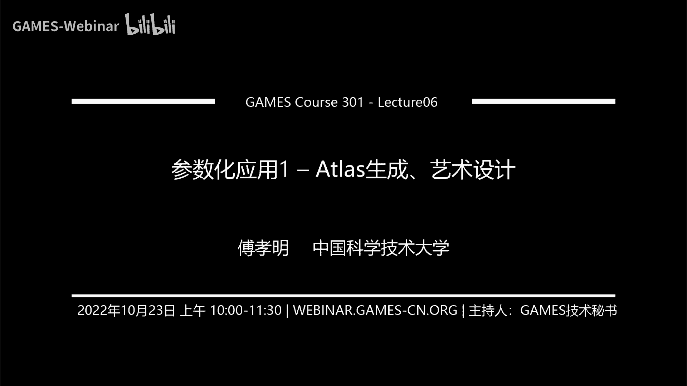

好那个我们现在的这个时间到了啊，我们今天就开始今天的课程，今天呢我们就开始要介绍一下这个呃参数化的应用啊，前面介绍了一些这个基本的方法，然后计算无翻转的参数化。

然后上周上昨天讲的是那个计算一个全局单数的一个参数化，那么今天我们就要去来介绍一下这个基于参数化的一些应用，这个基于参数化的应用的课程内容会比较多，呃我们今天会介绍的是两个，一个是这个atx的生成。

还有一个是呃艺术设计，然后下周六我们会讲一下这个网格生存，然后再到后面，我们还会介绍一些其他的应用啊，那么首先我们今天进入我们今天的课程是这个ex的生成。

啊我们主要今天讲的这个at last generation呢是for这个scanned mesh，就是说你比如说你通过这个三维扫描得到一个数据对吧，那你可能想对他去做一个纹理的贴图，这样的。

而不是希望它是自动的去生成一个纹理贴图，而不是说去通过这个artist去首条对吧，因为在这个啊游戏或者说电影这种场景里面，或者更多的还是这个artist去手聊这些atlas。

然后它其实需要的是一些基本的工具，那么对于自动化的要求啊，只要说那些工具里面是自动化的，但是它其实整个流程的自动化，反而有时候不能体现出它的这种自我创造了这个东西。

所以我们在我们之前今天介绍的这个艾克生存，在我看来主要更多的是面向这个三维扫描，比如你通过这种激光扫描仪得到了这样的数据以后呃，重建出来网格以后，我怎么去生成这样的自动的去生成这个ax对吧。

你不可能这个扫描的时候，你还要去通过artist去调这个纹理，这个是不大现实的，那么对于这样的一个text map的话，呃，首先txt main的一个定义是什么呢，它其实是一种方法用来定义高频的。

这样的deta曲面的texture color information，有一些颜色信息在一个计算机生成的图片上，或者一个3d的模型上对吧，那么比如说我们现在左边这是一个呃呃这是一个三角形网格。

它上面什么颜色都没有，然后再加上这样一个纹理贴图，其实就是相当于把三三角形每片跟这边的纹理颜色对一一对应上，然后呢最后通过这个渲染的时候，我就可以得到这样很逼真的这样的效果。

这个过程就是通过这样的一个纹理texture map的这样的一个过程去呃，去构造的，那么真正去做这样taxi这个地方展示了一个这样的一个简单的例子，这是一个房屋。

然后呢你可以看到他真正做text map的时候，涨到2d平面上的时候，其实就是这样一堆一堆的这样的房子，然后他最后把它这样一堆的图片参数化结果对吧，然后参数化结果每个上面有一个颜色。

然后再回到这个三维上，它就会变成一个可以三维渲染的这样的一个房子，那么所以说这个itx呢你可以认为它其实是从这个model space，从这个model space到这个text space。

它其实是有一个嗯mark，那这个这个model space，它其实是是从这个这个三维模型的空间，到这个2d的平面的那纹理的空间，它实际需要对这个模型上的每一个点，它需要映射到这个2d的平面上。

这样的话它才能够去把2d的这个颜色再返回到这个三维的模型上，所以这个ex它需要的是一个market，或者说他需要的其实是一个参数化，这个参数化是从这个啊模型的这个表面，映射到这样的一个呃纹理的空间。

因为纹理的空间，这些颜色其实都是有这种呃真实真实生活中存在的颜色，或者说只有orchestra去调的这种颜色，那么你一旦把这个映射建立起来，那你在做渲染的时候。

你就可以在这个三维模型上把他的这种细节特征给渲染出来，就是它的这些颜色特征给渲染出来啊，所以这itx你可以从这个本质上认为，其实它本质上还是一个参数化。

只不过它这个参数化呢它需要是在这样的一个texas space，text space，一般是这样一张图片，所以它基本上是希望最后你的参数化是落在这样的一个长方形，或者是一个正方形里面。

那么这样的话才能够去做真正的这样的一个test map啊，这才能去做真正的这样的有这样的颜色空间的存储，然后到这个三维曲面上去渲染，那么对于这样的一个过程对吧。

现在我们的目的其实是现在给了一个左边的这样的一个三维的模型，我需要去啊，比如说你对于扫描的扫描的网格的话，扫描的这种三维模型的话，它其实扫描出来其实是点云，然后每个点上它可能会有一个颜色。

那么这样的话你其实最后得到的这个网格，它其实是一个重建出来的这个网，格其实每个顶点上又有颜色，又有这样三维坐标，那这个时候呢其实你需要把这个网格参数化到这样的2d平面上。

然后把这个颜色坐标颜色值付给他的顶点，只能构成这样一张图片，然后再去逆向的渲染就可以了，那么所以说现在我们的现在我们想要解决的问题，就是怎么去建立这样的一个map，就是怎么把这个网格切开，切开完以后。

每一块参数化到这样的2d的平面上，那么所以说整个的过程其实可以分为如下的三步，首先是这样的一个网格切割，切割完以后呢，然后再做参数，化啊，这参数化就是我们之前讲的，最后呢才是把这个做出来的这个块。

然后在这个二在这样的一个正方形里面，或者说在这样的一个矩形里面去重新的pack pack呃，这个切割呢当然你可以认为就是在这个表面是个黑色的线啊，就是在这个三角形的这个网格上。

其实是引入了一些这样的啊黑色的线，或者说你是其实引入了一些这样的歌缝，把这个网格给切开了啊，就是其实就是一些边的，你可以看简单的看的话就是一些边的集合，然后把这边的把把这个边呢然后拆开以后把这个网格。

切开以后，然后呢你就可以去给它做一个参数化，那么参数化的时候，比如现在这个地方展示的这个例子，它其实是连在一起的啊，就是说每一块它还会有一些啊，他还而且没有做到这个global injective。

他还是有重叠的，然后呢你对这一块参数化，你可以去做进一步的切开，再比如在这个内部我再去引入一刀，再去引入一些刀，就是再去把它分开，然后分开完以后呢，我再在这个矩形里面再去做一个重新的参数化。

或者说重新的这样的一个packing，重新的排布，那么得到一个这个是一个overlap free，flip free的参数，化，并且是这样的一个在这个矩形框内比较紧致的排布在一起，就这个空白的这个面积。

白色的这个面积跟这个整个三角，整个正方形的这个面积的比例是比较低的，那么这种是比较高的packing的效率，那么所以说呢对于这个整个的问题的话。

就所以说整个的这个atlas对于这种can mesh aclas tension的话，一般情况下是首先是对这个三角形网格去做一个切割，切割完以后去做参数化，参数化以后再去做一个重新的切割。

重新的packing啊，得到最终的这样的一个结果啊，那么所以大家可以想一下整个的过程，就是分为这个三步，那么也就是说我们首先要怎么去在这个原始的网格上去做一个，这样的切割，切割完以后怎么去做参数化。

那么这个参数化的话其实之前已经有已经讲过很多了对吧，那么这个参数化你可以复用之前的一些啊，结论他们做完这个参数化以后呢，我要去重新对这个，因为我其实目的是要让这个白色的区域这里面留下来。

这些白色的区域占整个正正方形这个比例是比较低的，那么所以说呢我希望这个台不是怎么紧致的，那么这个地方其实是另外一个要处理的问，题，嗯做了做完这些以后呢，我们就介绍完这些以后呢。

我们分别来看一下每一个每一个具体的技术是什么样的，首先是这个cutting，那么cutting的话我们当然是希望最后呃因为在这个过程中，我其实希望这边的这个扭曲是比较低的对吧。

那这样的话我的这个txt map的时候，那个颜色的失真就会比较小，那么所以这个地方呢，我们希望这个切割出来的这个网格的这个扭曲是比较低的，那么并且呢这个边界切出来的这个边界的缝啊是比较的短的啊。

为什么要短呢，其实因为是就是说如果你这个边界的缝长了以后呃，首先在这个边界缝的左右两侧，它其实它的纹理的映射，最后你做这个testing map，做这个纹理的映射回来以后，你去做渲染的时候。

他那个地方可能会在缝的两侧出现一些artifacts，那么你这样的cut如果越短的话，它这个artifex产生的这个就几率也就会比较低，那么所以说这个地方呢我希望它的这个扭曲是比较低的。

并且它这个cut的长度是尽量比较短的啊，这是凉一点呃，所以这个地方就要就会遇到一个问题，是你在做cut的时候，你其实就要预先，的知道你做出来这个cut的时候会呃低扭曲的。

那么这个地方其实是就会有一个寄生蛋蛋生鸡的关系对吧，其实你有了cut，你才能会去做参数化，你有的参数化才能啊才会知道它的扭曲高不高低不低，然后你这个情况其实是会不要急升段，就是会存在一个迭代的过程。

这个过程其实是比较的对，但是刚刚有一些技术可以去不做显示的参数化，就能去把这个丁有区给啊，就影视的表示出来吧，这个是另外一回事了，这个后面可能呃方钦老师会去介绍一下这方面的内容。

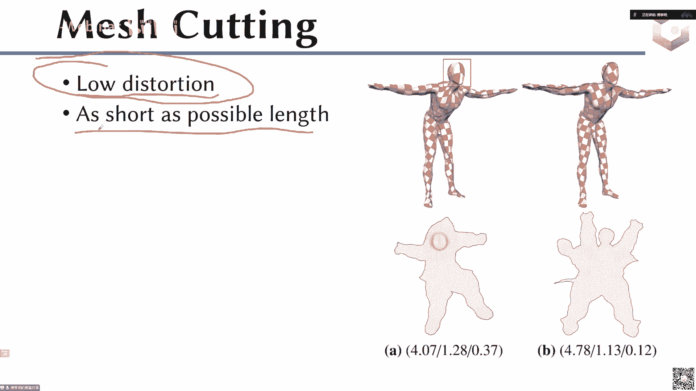

那么就是说我们，希望它这个地方的这个缝啊是尽量短的，因为什么，因为这个这个网格切割出来的这个缝，如果真正在做文，在做那个渲染的时候，它可能会产生这样一些artifacts啊。

所以我们希望这个cut尽量短短的话，最后才拿的f是不明显啊，当然这是一个比较极端的例子，而大部分情况下还不会不会可能就不会这么明显啊。

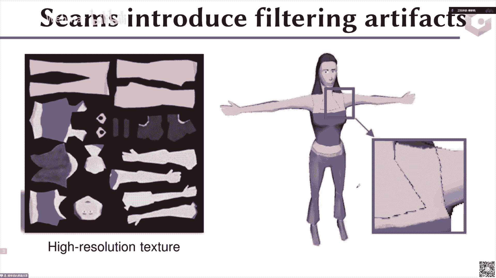

那么当然第二步就是做参数化，那么参数化的话，既然当然我们希望它还是这个呃扭曲比较低，并且它是一个globally jective对吧，这个上节课已经讲过了，我们就跳过去了啊，那么对于这个packing。

的话就最后我需要把这个参数化重新再把它拆开，拆开完以后再去贴到这个2d的平面上去啊，拆开完以后我重新把它pk到一个呃矩形里面，或者重新pk到一个正方形里面，这个呢也非常的定义的。

其实就是你可以看成是这些紫色的，紫色，不就这些彩色的这些三角，这些参数化这些这个参数化这些所在的这个块，它占整个它在整个这个外面这个bonny box就是这个呃黑色的框所占的，它的那个比例是多少啊。

那比如说这个地，方的66%，就是指这些彩色的块的面积除上整个这个长方形的面积，它就是等于0。66，那么如果在右边的话，你可以看到这个彩色的块的面积除上整个这个长方形的面积的话，是把呃把那0。858。

那么也就是说你这个对于同样的这样，比如这个彩色的面积，其实它都是跟这个原始网格相关的对吧，这些彩色的面积基本上是约等于这个原始网格的，那么也就是说既然它是约等于这个原始网格的。

那么也就是说它这个彩色的彩色的块，它其实它是呃约等于这个约等，于这个所以他们产出的块的面积是一样的，但是呢他的这个右边这个结果它的这个效率会比较高，就它的面积比会比较高，那么也就是说我在真正在计算机里。

比如说我要去存储一张纹理图片的时候，我右边这个存储来的图片的大小就会比这个左边这个图片要小对吧，呃什么意思，就是说你原来比如说你这个这个彩色的面积都是面积，假设我就是一的话。

那么我最后这个右边传出来的这个这个正方形的，这个这个长方形的这个面呃，这个面积的话就是衣橱上85点呃，除上零，点858对吧，那对右边这个图就是1÷0。66，那么显然是右边这个呃框的那个面积要小。

那么面积要小的话，也就是说它对应的这个像素的数量会显著的比这个左边这个p对吧，那么这样的话我们就可以通过这样的一个方式去呃，减少这个存储的量啊，因为它在特别是在一些游戏，或者说在一些呃影视动画里面。

它最后特别是游戏嘛，它其实存储的这个texture其实是会非常非常大的那张图片，因为它很有可能是把很多模型的这个text，是混在一张这个纹理图片里面的，那么它的，这个纹理图片的那个规模或巨大无比。

那么巨大无比的话，如果你能节省这样1%或者节省10%，这样的一个packing效率的话，可想而知，给你这个游戏或者说给你这个呃带来的这个成本会比较呃，这个这个这个就是呃存储成本会显著的降降低。

那比如对你这样的一个扫描的一个模型的话，你如果这样的存存储除图片小的话，也就是说比如说你最后给人家交付的这个模型的大小对吧，也会降下来，因为你的图片本身也要嗯。

比如你这个test的图片其实也要占这个存储的这个大，小那么呃比如说像右边这个图，它还有可能这种，因为我们之前按照这个参数化计算。

那它这个参数化可能还不一定是这个globally globally indictive对吧，它可能还会存在一些这样的自交，那么他这种图片的话更加没法直接去交互。

那么所以说呢左边这个图你就是说我还是需要去把它给解耦对吧，把这个packing的这个把这个把这个给结尾看了，结果开了以后重新去切割，切割完以后重新去做这样的一个pack啊。

那么这左边这个东西你还可以看成是一个无效的，这样的一个纹理贴图对吧，因为它会有一些，自交啊，成为这些更多的问题，那么右边的话我可以把它重新给切开以后对吧，重新去做pk。

然后这样的话最后得到的这个扭曲也是比较低的，然后并且他的这个packing效率也是比较高的啊，这个at last呢就是说传传统来讲对吧，它主要是用于这样的一个texture mapping对吧。

就是我们之前讲的这个可以呃用来做，比如一个三维扫描出来这个模型对吧，你把这个at t做好以后，那你可以当然可以直接去做渲染啊对吧，只要有一个三维模型，再加一张图片啊，这个都都直接可以去做渲染。

这是最直接的应用啊，除了这样的应用以外，它其实还有一些就是他其实这个一个是这个信号的存储嘛，就刚才的那个test map，其实你可以认为是比如说对于这样的smos模式，mesh mesh的话。

就这些扫描这个网格，的话，其实你可以认为这个纹理贴图，它其实存储的是这样的一些颜色的信息对吧，那么对于这样的artist的话，在，前几年他们还做了一篇这样的一个文章。

是他可以把这样的艾特是用在一些几何处理的问题里面，比如说他们在这个几何问题，他们在这个问题里面，比如去计算这样的测试线对吧，那怎么当然这里面的呃就是说只是想表达一下这个ex是比较有用的。

它其实不光是可以用来做这样的text map这样的事情，它还可以用来做更多的这样的一个jma processing task，比如说这个地方讲的这个呃叫didistance的计算对吧等等等等。

还有一些呃其他的一些应用，所以说呢这个ats它本身这个也是一个比较fundamental的一个structure吧，就是你你如果对他的计算的比如packing的效率更高啊，你这个方块的这个数量更少啊。

你当然是这样，是我们是比较好的，那么所以说呢从这个从最后还是回到这个最后，这个其实最终你要去评判这样的一个access的好坏，其实我们用的比较多的这样的准则。

首先是一个是这样的一个呃packing的效率，这个效率就是指这个彩色的面积，除上这个bonny box的面积，第二个是这个boundary lance的长度。

就边界的长度就是其实就是指这些边界的这个长度啊，这个边界的这个长度，然后这个cn指的是这个块的数量，总共是13块块的数量，然后还有一个是这个distortion本身对吧，有趣的distortion。

所以说一般情况下我们会用这样一个四个指标去，首先是这个packing的效率，第二个是一个边界的长度，因为我们刚才讲了这个边界的长度，它其实会迎来这个渲染的时候的一些artifacts。

编辑的长度也是比较重要的，最后还是这个chat number对吧，这里面总共有多少块，这个快如果多了，那其实最后的这个扭曲也会比较钝，要不这块比较多了，其实也是比较不好的。

因为这个快一块之间的这个不连续性其实也是我们不是很喜欢的，最后还有一个这个distortion对吧，这个discortion不能太高，那么对于这样的，我们接下来来那个分别来看一下这个技术啊。

那么接下来我们要讨论的是这个嗯，接下来我们要讨论的是这个match cut的一些呃，首先我们还是分为这三个方向啊，应该是这个网格的切割，一个是这个参数化，还有一个是最后的这个packing。

那么对于这个网格的切割而言的话，一般情况下会有两类，一类方法呢是这个叫做pointer to pass，这个这个point two two pass的意思是什么呢，就是他会通过去寻找一些这样的点。

这些点呢其实会引起这样的一个高扭曲，就说其实网格上你真正引起这个扭曲的其实就是这样的一些离散的点，然后呢你只要把这些离散的点给它连起来，那么最后的整个的这个参数化的这个扭曲度不会很高啊。

那么这一类方法叫做point to point，point to pass这样的一类方法，那么这类方法的话就是它一般分为就是两个步骤，一个步骤是这个啊这个point的这个计算是吧。

然后第二类是这个怎么去把这个point给连起来，因为你如果给定point的情况下，你去连这个point的话，其实就是一个呃，相当于要经过这些所有point的一个最小生成树是吧。

那其实就是一个斯坦纳树的问题，在一个图上去做一个斯坦纳数的问题，那其实本身也是一个你要去如果要去做它的长度最短的话，其实本身也是一个np hard的问n p hard的问题，那么呃对。

所以说这个pass的生成，你在给定点的情况下，它其实也是个2/2的问题，那么对于这个点的生存的话，其实你要在这样的前面，在生存的过程中，你要知道这个点会引起高扭曲对吧。

那这个时候你其实是会需要去做一些这样的预测之类的，那么第二类方法是同意通过这样的一个分割的方法去做这样的，做这样的参数，做这样的这个match cut对吧，那么参数化的意思就是说呃就是分割的意思。

就是说你去把这个网格分成每分割成一块一块，而每一块呢我去通过它，我知道它是最后参数化到2d上，它的扭曲都比较低啊，相当于他直接是通过分割，那么这种方法的话呃也是也是比较常见的啊，后面我们会介绍一下好。

这个是eternative method，那么首先我们来介绍一下这个第一位啊，就这个point to这个pass，那么我们今天要介绍的，今天我们在这个这个题目上我们不深入去介绍啊。

我们就只是简单的给大家呃介绍一两种方法啊，这个是首先是这个是一个啊，我忘了加标下面这个呃paper了啊，这个是那个小米跟image那个文章里面的啊，小米小米g e o m e t r的话。

叫我们去image里面那个文章里面的那个方法，他为了去做这样的一个所谓的引起高扭曲的，这个distortion point的这样的一个检测的话，它其实是用了一个非常启发式的一个交替迭代的方法啊。

首先呢他在这个曲面网格上随便的这样的割一刀，然后呢去做一个这样的two test beding，做完two diy bedding以后呢，他在这个参数化里面，他去把那个最最高扭曲的那个点找到。

这个点是最扭曲最高的点，然后你去最高的点找到以后，然后他把这个线连起来，然后生成一个新的一个啊一个cut，然后再去做一个参数化，做完这个参数化以后呢，他再去把这个最高扭曲的那个点找到。

然后再去做这样一个参数化，然后这样交替迭代，直到最后的这个最高的扭曲的点是落在这个边界上的位置啊，很简单，就是每次就是相当于做一次参数化，选一个扭曲最高的点，然后做30话，选一个扭曲最高的点，做一次。

30话选一个扭曲最高的点，做一次30化，选一个扭曲最高的点，就这样一个很交替交替迭代的这个方法，那这种方法一般情况下会漏掉一些重要的点，然后最后他的那个嗯结果一般是不是特别好的啊。

然后接下来这个要去连这样的哎，这个p p t里面没有讲啊，如果要去连这样的一些呃，现在比如假设这些点我已经找到了，那么接下来你就要去把这些点给连起来对吧，那么连起来的话，我就要去给他去啊。

构造一个市场的，要是需要去做一个最小生成树，把它连起来，那么为了去做这个数的话，最常见的方法就是把这个点与点之间的这个最小路径，最短路径给构造出来，就是先把这些点我先去单独去构造一个完全图。

在这个完全图上去找一个最短路径啊啊这，这类方法呢是一个比较启发式的方法，他最后跟最终的这个菜单速度还是会有一定的差距，这个我们这个课就不具体多，我不进步进一步介绍了啊，我们就大概就是说一下。

它其实是个连接呃，你要在这个网格上，你要去把这些点全部连起来，这个路径是最短的，这其实本身是一个嗯斯坦纳数的一个问题啊，斯坦来数的话，它的这个求解的问题是比较的困难，就是它本身是一个nb号的问题。

你要去求解它是一个比较难的问题，那么接下来是一个呃这样的，我基于网格式方法，那么基于网，格生成方法其实是我希望去把这个网格分成一块一块，然后每一块在参数化到2d平面上的时候，它的扭曲都是呃比较低的啊。

那么为了去做这样的一个分割的话啊，今天我们要介绍的这个文章是一个就是叫低差值啊。

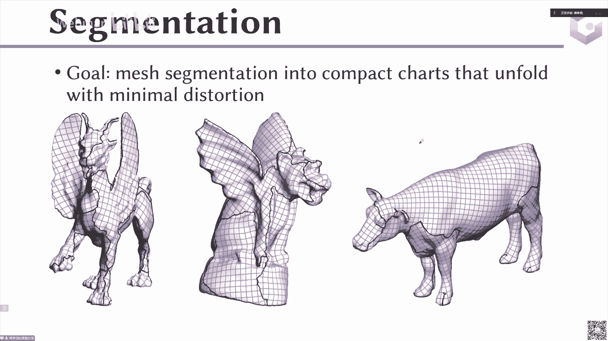

哎呦今天没有加那个下面的引用啊，那加这个低下的，他其实用的是一个类似于这个那个vs的那个paper的那个思路啊，叫vational，他其实用的是这样一个思路，或者说大家如果比较熟悉这个cvt的话。

它其实就是一个logo的迭代，如果大家是熟悉k miss的话，它其实就是一个k mix里面，那个聚类中心跟这个这个属于哪一类这样的一个迭代啊，那么对于他这样的方法，那么他的这样的一个出发点是来自这样的。

因为我要知道我要把这一块三角形网格上分出来的每一块，我要定扭曲的参数化到这个2d上去，那么也就是说意味着我需要去嗯，我需要去这个什么呢，就是我需要让这一块我要找到找到一个只找到一个度量的方式。

说这一块我在参数我不要去做显示的参数化，我他在不做参数化的时候，我也知道是扭曲比较低的，那么这个如果是这样的一个出发点的话，我们我们其实可以根据什么呢，可以根据这个可展曲面的这样的一个思想去做这个事情。

因为我们知道如果是一个这一块曲面，它如果是一个可展曲面的话，那它其实是参数化到这个2d上去的话，它其实它的这个对应的distortion是等于零，对不对。

就如果这些衡量曲面它可以是等距的参数化到2d上去，那么所以说呢他的出发点就是基于这样的一个客单，曲面的这样的一个想法，他们如果是一个曲面，如果是一个曲面的话。

核弹曲面它然后呢呃但是你要去表示一般的核弹曲面，它其实是又有这个呃直纹面啊，也有这个锥啊，又等等一些很多的这样的不同的类型呢，其实所以这个文章里面他就是用了直接就是用了这样的一个呃。

追的这样的一个思思反思想，那么所以说呢他这个地方做的这样的一个呃constant angle between，这个surface normal，就是说他这个地方用的是什么呢，用的是一个追。

那么追的话我们知道对于一个圆锥而言，对于一个这样的一个圆锥而言，你其实可以只用它的这样的一个这样的一个中中心线的这样的一个线，对吧，就是他的那个法线，它的母线，它的母线跟这个他的这个轴。

这个圆锥的这个轴跟他的这个表面上每一个点的这个朝向，它的这个夹角其实都是一样的，那比如这是圆柱，圆柱退化成这样的一个圆柱，其实可以看成是一个很极端，或者原台，它其实也可以看成是这样的一个轴。

跟这样的一个夹角之间的这样一个它的夹角是一个嗯固定的值，那么所以说呢对于这样的一个就是一个圆锥曲面的话，它其实可以用一个轴和一个角度来表示，对不对，那么只要是你的这个轴。

你的表面上所有的点跟这个轴之间的夹角都接近于这样的一个呃，常数圆角的话，那我就可以去表示它是一个圆锥曲面的，圆锥曲面的话，它的这个它是可展的，它参数化到2d上，它的扭曲是比较低的对吧。

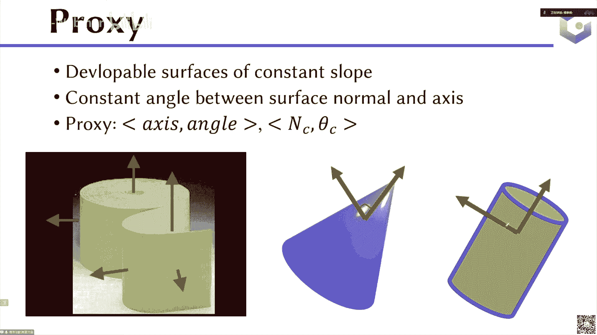

那么所以说呢他这个地方他就可以去做一个什么事情呢，呃matches就是，所以我就可以用一个很简单的度量去做一个事情，比如说我给定一个三角形，我给定是一个三角形，这个三角形呢它的那个法向是这个nt。

把它的法向这个三角形的法向是nt，那么这个nc是什么呢，nc是比如说我这个地方这这一块区域，这是一块我分割出来的这个区域，这个区域里面我给它定义一个轴，这个轴是n s c。

它的这个朝向是刚才说的那个角是c他c这是一块分割出来的角色，然后这个里面有一个三角形，这个三角形的法向是i n t，那么我们怎么看这个三角形跟这个，给定的这个a c和c大c这个圆圆锥曲面它的逼近程度呢。

那其实我们刚才讲了，这个如果是圆锥上的一个三角形的话，它的法向跟这个轴之间的夹角应该是等于这个c到c的，那么所以说我直接可以用这两个之间这两个法向之间的点乘，跟这个cos in c的c去做了一个差对吧。

那如果这两个相等的话，就意味着它们的差应该是等于，如果这个三角形是完美的落在这个圆柱上的话，那么它的这个轴应该这个角度应该是等于零的，但是呢这个地方肯定是肯定还是会有一点这个呃，差别的。

那么所以说这个地方呢，我们其实是希望它这所以说在这个地方会有一点差别啊，所以我们可以用它们之间的这个差的平方，作为这个去确定这个三角形是不是属于这个圆锥，或者说它离它在这个圆锥里面，它的这个误差是多大。

那么所以说呢当然了，他还会定义一些其他的这样的能量啊，反正我们主要是以这个能量为主吧，那么这样的话我接下来我要去做这样的一个迭代对吧，那么跟这个loyd的迭代，或者跟这个kris迭代一样的。

那么随机选择它的整个流程都是一样的，随机，选择一些三角形作为这个种子点，然后呢把这个种子点，你比如说你看这个这个种子点以后，你可以对每个三角形啊。

你可以用它的这个三角形的这个呃法向作为它的这个process，然后，然后呢你再去增长这个chat，从每个seed往外往外去涨，涨完以后呢。

你其实可以让这个呃让这个三角形跟这个当前也就是k miss一样的，就是或者跟logo给的样离谁最近，我就属于他对吧，然后呢在呃做完这一步以后，其实已经做了一个分割，做了一个分割以后呢。

你再去重新的去更新这个每一个分割里面的这个process对吧，所以做完这个process以后呢，然后你再去做这样的呃，再去算完这个新的process以后呢，然后你再去算新的seed。

算了这个新的seed以后呢，然后再去做这样的呃重复的这样的去呃做一个，聚类对吧，这样的一个交替迭代，我就可以把最终的结果给分割出来了，那么整个的这个方法是跟k mic dt都是相似的。

好接下来我们要介绍的是这样的，因为参数化整个就是一个是match cut，参数参数化，那么参数化其实在我们之前的课程里面已经讲了很多了。

那么所以说呢我们今天接下来直接讲的是这个啊packing your visions啊，就是这个packing这个效率，那么对于这样的一个packing的效率的话，它其实描述的是这些彩色的区域。

跟这个呃彩色的去所占这个整个长方形的这样的一个比例啊，比如这一块就是80%，但是呢对于这样的，比如右边这一块，它的packing的效率就只有46。45%点六。

那么对于这一块他最后的这个pixel的这个使用的效率就比较低，那么对于左边这个的话，它的pixl使用效率就比较高，那么这样的话你会发现它这个地方的这个矩形的框，长方矩形的框会比这边矩形的框显著小很多。

那么也就是说我最后这个去存储这张图片所需要的这个呃，图片的分辨率也会小很多，那么这样的话我的内存和存储都会下降，内存指的是就是说你这图片读到这个计算机里的时候，它这个会下降，所以我刚才讲的。

如果是一张单独的图片，比如说这一张小图片，那你可能这个在现在这个计算机里，你可能感受不出来，但是呢如果你就像在一些游戏场景里，你整个的这个比如说你100个模型的开始都放在一张图片上。

那你这张图片是巨大无比的，那这个时候他的这个如果他是个巨大无比的，那你如果再去呃，就你能省一点这样的pk，你能提高一点这样的pk自己，或者提高一下这个pixel的呃使用的呃使用率的话。

那么它其实最终它所有的这呃节省出来的内存，和节省出来的这个硬盘的空间存储都是比较可观的啊，那么但是你你现在比如说给定这样的分割的这样的效率下，你要去这个提高这个at least packing效率。

它本身也是一个np hard的问题啊，因为本身这个tapk的这个问题本身也是个np号的问题，那么当然了，这个地方我派出了还希望是它是低扭曲的对吧。

那么还希望它是有保证这个其他的这个知识我们之前都讲过对吧，那这个是overlap free，他还是个global类的jective，那这个是一个边界的长度要比较短。

那但是呢这些方法就是这个每一个方法之前，其实都有一些相关的工作啊，但是他没有去考虑这些p啊，那么对于这样的一个ex refinement的问题的话，就是说我原来的这个p啊。

就是刚才比如说经过我们之前的这个就是啊match cutting，mash cutting以后，做完一个参数化，那么做完一个参数化以后，你会发现它这个结果其实是长这样的，但是这样结果的话。

他的packing的效率是比较低的，就是说什么意思呢，就是这个packing它是一个比较简单的ping，但这个packing效率就比较低，那么所以说呢我们希望去做一个重新的react。

或者说重新去做一个at test refinement，让他的这个packing的效率变得比较高，当然我可能会引入一些额外的歌颂啊，所以我们现在的问题是什么啊，注意啊。

现在的问题是你现在已经有了一个itx，或者说你现在已经有了一个参数化，然后呢我需要把这个参数化去做一个ping，或者说对这个参数化重新去引入一些歌分，重新去react一下。

使得它最后的这个pk的效率比较高啊，就是大概要做这样一个事情，就是要从这个左边到右边这样一个事情啊，这个参数化也可以是存在非存在交存在，这种就是相互的of overlap的这种参数化啊。

那么这个是之前的有一个文章是18年的一篇新冠piper，他其实做的是一个叫做呃box cutter的一个方法，他这个方法的思想其实是比较简单的，就是我刚才输入是这样的一块，这样的一个输入是这样。

你看你看啊，他可以看到它的过程啊，它是输入是这样的一个长矩形，那么现在你要去做这个所谓的packing，效率的提高，其实就是要把这里面的一些空白的区域给填掉对吧。

所以说他就是做了这样的一个叫做box cutter，它其实做的是这样的一个cut，然后cut完以后呢，他把这个切下来的这一块给它重新填到这个原来的这里面去，那么也就是说他其实是它其。

实是什么这个安全视频能更多了，它其实是把这一块的面积给省掉了对吧，这块空白的面积给省掉了，并且把这一块他又填到了这里面，那么也就是把原来的一块空白的地方又给填上了。

那么这样的话这一块的这个pk的效率提高了这一块的空白的区域，删除人民整体的这个pc的效率也是提高，当然可想而知，这个算法它的出发点虽然是比较简单的，但它的实现起来其实是相对比较困难的，原因在什么地方呢。

就是你需要每次去检查这一条，这一条cut它是怎么去生成的，然后使得这，一块能够提高，然后并且接切下来，你你切下来的这一块怎么能够填到原有的这个参数化里面去，使得这个pon的效率提高对吧。

那这里面其实是一个非常复杂或者非常试错的一个方法，对然后呢并且他这样做，他其实是没有去保证最后的这个pk的效率一定是能多高的啊，那么所以说呢接下来就来介绍一下，花这个十分钟的时间来介绍一下啊。

或者会花个两分钟的时间来介绍一下，我们之前在19年的一篇c挂b本，那么我们发现确实是你比如说现在左边我给你的这个参数化，如果都是这样的一个irregulate ships，或者这样的一个多边形的话。

你要去做high packing的问题，你要提高它的packing效率的话是比较困难的，但是呢你如果你是一些长方形，就是你整个的这个参数化已经分成了一些，已经是就是你你可以就是一些长方形的款。

那么你其实是很容易去做到这样的一个pc的一个效率，高效率的话，那么所以说呢我们就是也是用了这样的一个思想，我们可以把这个原始网格去给它去分成这样的一些呃，高高的一些这样的一个packing项。

就是我去我可以去把原始网格去切成这样的一些呃呃矩形，然后去给他去做一个这样的，所以说接下来这个问题就是你现在既然知道这样的长方形，它其实是可以获得这样的一个很容易获得一个高的一个packing的效率。

那么接下来就是说但是我现在给你的这个三角形给你这个参数化，它其实不是这样的一个矩形对吧，这就意味着你需要把这个输入的，但是你需要去把这个输入的这个网格变成这样的一个呃，轴对齐的这样的结构。

那么我们再来看一下啊，这是一个access line的结构，这是一个轴对齐的结构啊，你不用管这个是什么东西，这是一个就是一个平面的2d的多边形，这个2d的多边形的边界它都是跟这个x轴和y轴是平行的啊。

那么这样的话这种结构叫做axis aligned的结构，那么对于这样的结构的话，其实我可以很容易去做这样的一个长方形的这样的分割啊，这个方法这个分割是基于这样的一个motorcycle的这样一个分割。

分割完以后呢，其实我可以把它切成一系列的这样的一个矩形，然后呢我其实可以去做一个很高很高效的这样的一个packing的效率，但是对于我们一般的这样的输入参数化，其实它的整个形状不，是长这样的对吧。

不是长这样轴对齐的结构，那么所以说我们现在就要去把这个输入的形状，变成这样的一个轴对齐的结构，那么所以说呢对于一个一般情况下的case的话，其实我们的输入的形状是这样的，就是乱七八糟的。

还有这样的一个交替，这样的一个重叠的情况，然后并且这个边界它也是这样刺刺刺的，那么这个时候呢我就需要去做对他去做一个at ax is aligned information。

然后就给大家做一个galax information，然后把它变成轴对齐的结构，然后变成折叠式的结构，我就可以给他去做一个矩形的这样的，一个分割，然后再去做一个高效率的高效率的pk对吧。

那么但是呢它会引入一些扭曲比较高的，因为你相当于对这个输入的形状去做一个很很明显的变形，对不对，那么但是呢你说但是你可以去比如说得到这个结构以后。

我其实可以用从上节课我们讲过的这个sky ful的这个best method的对吧，它其实是可以又可以保证没有翻转，又可以保证没有边界自交，并且可以去降扭曲，那么这样的话我可以去把这个扭曲给降下来啊。

那么所以说呢整个那么整个的这个papi大家来看一下啊，首先是输入，是这样一个参数化，那么首先我给他去做一个ex ninformation，把它变成一个这样的一个轴对齐的一个轴对齐的这样一个结构。

那么有了这个轴对齐的结构以后呢，我去给大家去做一个啊矩形的这样的一个分割分，from the composition，然后并且把这个矩形给pack在这样的一个长方形里面。

或者说pc到这样的一个长方形里面，然后最后呢我再去做一个distortion的这个reduction，就是用其实就是把之前的那个啊careful那个best method重新跑一下。

那么这样的话我最后的这个扭曲月轮降下来，然后呢并且这个整体这个有需要能站起，来并且整整体的这个呃pc的效率又比较高，然后并且这个，这个所以说整个的拍出来也比较简单啊，就是基于这样一个思想。

就是说这个长方形的这个快，它其实是很容易去做一个pc啊，就是长方形的快，它的pc效率会比较高，那他会呢就是它会多多加两步，就是你需要把这个输入的这个参数化变成这样的一个轴对齐的结构。

然后并且去给他去做一个切割，然后再并且去做一个distortional reduction，因为你千个万你在这个变形过程中，在这个变形过程中，你会把扭曲给提高。

所以你在最后一步你需要去做一个扭曲的降低啊，嗯关于这个aas的这个部分内容，我们就讲到这里啊，at as首先它是嗯就讲到这里，我们后面就不介绍了，我们接下来呃休息五分钟。

然后进入这个第二个参数化的应用是啊艺术设计啊。

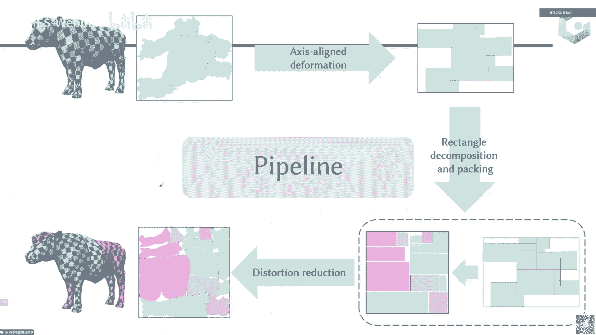

好我们接下来回来啊，我们继续开始我们的这个下下半场的内容，那么接下来我们那介绍的这个应用是这个艺术设计啊，那因为这个艺术设计的话，它会针对某一类的这样的艺术设计去做一些工作。

那么所以接下来介绍的工作就没有一些普遍性啊，主要是一些很呃具体的一些案例啊，主要是我们组自己的一些工作啊，就是这个参数化应用艺术设计。

那么接下来我们首先要介绍的第一个艺术是这个，我们中文把它叫做这个橘皮成型艺术啊，大家我们先来看一下具体是个什么样的一个形式，那么这是一个视频，它播放的是其实是一个呃artist啊。

他在这样的一个橘子皮上去画一些这样用小刀去画一些这样的歌缝，那么画完这个割缝以后呢，它可以把这个橘子皮啊完整的展开，它用的是整个橘子皮完整的展开啊，这个橘子皮没有被浪费掉。

它就会变成一批这样的很很很惟惟妙惟肖的这样的一匹小马啊，啊就是大概就是这样的一个呃艺术形式啊，那么这个艺术形式呢它其实是一个非常的一个popular的艺术形式，它其实是受受到了很多的这个小朋友。

还有一些这样的的喜欢啊，其实我们还有人专门对他这种艺术形式出了一本书啊，出了一些书啊，其实是非常非常popular的啊，当然这个是在日本非常抱怨，在国内好像没有那么危险，那么这里是一些更多的一些例子啊。

其实可以看到它可以变成各种的动物啊，那么但是这个过程呢其实你要在这个区，在这个橘子皮上，你要去画这样的一些歌缝的话，它其实是呃你需要去做试试错法，就说你割出来的这个东西。

其实最后展出来展暂停到这个2d上的话，他不一定是一个合理的，或者说不一定是一个呃有意义的这样动画，它需要去不停的试错啊，那么这样的过程是非常复杂，非常的耗时，并且非常的说实话挺浪费东西的啊。

这个橘子皮其实挺浪费的，这么多橘子你都没吃，就没办法在中国这个环境上来讲，这个属于这个典型的浪费粮食股，那么我们再来从这个计算的角度，或者我们从这个算法的角度来看一下这个真正的这个橘皮艺术。

或者说这个橘皮成型的艺术，它到底在做什么，它其实是你给你了一个，比如说这样一个形状对吧，那我想把这个橘子皮变成左边这样的一个形状，就是我希望这个橘子皮，最后哥哥给他在上面去添加这样一些灰黑色的线。

然后最后呢把它切分成右边这样的一个形状，其实本质上相当于是你在这个，你其实相当于是你在这个橘子皮上去寻找这样的一些黑色的歌缝，那么其实这黑色的歌赋不一样的话。

你会发现最后这边得到的这些图案其实是不一样的，那你不同的黑色勾缝得到的这些图案其实是不一样的，那这个形状其实也不是你想要的，所以你需要在这个上面去做一些更多的这样一些图案。

使他最后这个形状跟这个形状是非常接近的，所以本质上其实是相当于是在这个橘子上去找这样的一些黑色的，这样的一些歌颂，学生会又回到了跟我们上节课讲这个atx的时候。

那个mesh cutting就联系起来对吧，那么match cutting的话，其实本其实就是在网格上去找一些歌颂，值得到最后的这个参数化的扭曲比较低，那么对于现在这个问题的话，其实相当于是什么。

就是你在这个直接p上去找一些歌颂，然后把它展平到这个2d平面上的时候，得到了这个参数化的扭曲是比较低的对吧，呃呃得到这个参数化的扭曲是比较低的，那么呃不是得到这个形状跟这个输入形状是接近的话。

所以说我们这个地方它其实是要去寻找的，是在这个橘子皮上去寻找这样的黑色割缝，然后把它切开以后去做一个参数化，得到一个2d的p2 d的形状，这个2d形状跟这个输入形状之间是比较接近的啊。

那么接下来的工作他是你就相当于是需要去做做一个cut的generation对吧，就是其实就是我们上节课讲的这个mesh cutting的这样的一个工作，那么match cut这样的一个工作的话。

就是呃你需要去做呃，就让我们上节课讲了对吧，他会问，首先看图形学里主要考虑的是两个问题，一个世界的扭曲要低，第二个是这个cut的长度要比较短，那么但是这两个东西其实都是没有考虑什么。

没有考虑这个你对参数化的形状要跟输入形状比较接近，这样的一个问题，那么所以说呢我们接下来就要去啊，相信我们这个问题其实是一个新的问题对吧，就相当于是你要学在橘子这个形状上去找一些歌缝。

把它参数化到2d平面上以后，这个跟2d这个形状跟输入那个形状要比较接近，这个问题其实本身是一个新的问题，那你要去真正去求解这个问题的话，也是比较困难的，困难在什么地方呢。

首先你你的这样的一个生成了这个你比如说你随便给一个cut，那么你去参数化出来一个2d的形状，那这个2d形状可能是跟你输入形状，就这个difference啊，你要去。

因为你本身是要去minimus他们之间的difference，但是你要去minimize两个形状和difference，这个事情其实是相对的比较困难的，而且这个歌颂他在这个三大，在这个橘子皮上。

它其实你可以认为是一个呃类似带一点重组和优化的感觉嘛对吧，所以这个过程是比较其实比较复杂的，那么所以说呢呃这个问题又比较困难，第二是你这个输入的这个形状对吧，你其实是你希望这个绝对比找它这个形状。

是找是找这个是接近你输入那个形状，但是很有可能是你输入那个形状，用这种橘子皮其实是没法去展成，所以你这个输入的形状可能是不适合于这个当前使用这个橘子皮展开。

这个时候你其实是需要去对这个输入行动去做一些修改，那么所以说呢这个其实本身这个你要去做这样的一个问题啊，就是你要去做这样的，你要去做这样一个问题，你要在这个cut上对吧，去生成一个问题。

然后去跟他去做一个比较，这个问题是比较困难的，那么所以说呢我们就希望去做一个简单的方法，就是说这个往这个过程你要去生成一个cut，使得它这个猜中画出来的形状跟这个形状逐步的接近。

他这个方这个方向其实是很难的，因为你升2d参数化出来的形状要跟他去对比，然后再要去回来，那这个过程其实是非常复杂的一个过程，然后接下来，但是呢从算法层面上讲。

其实你可以把这个橘子皮映射为这个映射回这个橘子上，就是你可以把你输入的这个形状映射回到你的这个c2 d的新社会，到这个橘子上，如果这个映射回去能够把整个橘子，全部给cup住。

那么这样的话它的这个最后的这个边界，这个构成的这个边界其实就是这个橘子比上的割空对吧，那这样的话整个这个这个问题就变得简单了，你可以直接去把这个形状尝试的映射到这个橘子皮上，那它就是你最后要的那个对吧。

所以说这个方向这个方法是比较这个方法，这个方向是比较简单的，那么直接下来的问题，我们其实就是要在这个就是要把这个输入的形状，映射到这样的一个呃橘子上，那么我们这个地方是首先是你这个映射对吧。

你要把这个橘子这个把这个输入的形状映射为这个2d的虚设，回这个橘子皮上，那你当然希望这个地方的扭曲是比较低的对吧，不可能让它的扭曲比较高，那第二呢是你希望这一块。

那这个时候也就是说你其实希望这些露露出来的这一块这个橘色的，皮它的这样的面积是趋向于零的对吧，所以我们现在有两个目的，一个是要让这个映射就是这个马，比如这匹马映射回这个原始的这个啊橘子皮上的时候。

它的扭曲是非常低的，那第二呢是这一块留下来的这些呃橘色的区域就这一块，剩下的区域是啊面积要趋向于零，就这一块的面积要趋向于零对吧，那这一块是这个有其表的地，那不为了去求解这样的问题的话。

那其实我们把这个问题就可以变成这样的一个mini marz的问题，第一个问题是这个输入形状和这个映射后的这个形状，它们之间的扭曲要比较低，第二是这一块的面积要趋向于零对吧，那么对于这样的话。

我们这个扭曲要比较低，我们这地方就直接使用了之前介绍的这个a r a p的这个dio啊，这就是假货币跟一个旋转矩阵的这样啊，对于这样的我需要去把这块橘色的面积慢慢慢慢的优化变成零。

我们这地方做了一个叫做呃啊one rank rank一的这样的一个能量啊，其实就是一个角和b矩阵减去这样的一个啊，b b是一个rank唯一的这样的一个矩阵，那么这样的话呃。

这个假货币矩阵指的是这个黄色三角形里面的，黄色区域里面的一个三角形啊，这是我们要让这个黄色三角形里面，这个黄色三黄色区域里面的一个三角形的小号比矩阵。

它是从一个比如从一个正三角形映射到一个这个黄色的三角形里面，这样一个映，射我要让这个假货币矩阵是一个变成一个制一的矩阵，那么大家知道如果是一个质疑的矩阵的话，它的这个面它这个面积就变成零了对吧。

那么所以说呢我们就让它变成z一的面，当然你其实你要让这个面积变成零，你还有其他的选择，比如第一是你要让这个甲和b矩阵的f范数等于零，那么等于零的话，其实我们知道还要算数。

其实就是两个其一乘的平方之和对吧，如果要等于零的话，就是两个其一直都等于零，那么这样的话它其实会让这个形状收缩的比较严重，那么接下来你，可以当然你也可以去让它的面积等于零，这是你最显然的方式。

那面积等于零的话，其实就是西格玛a一乘上sigma等于，那么这样的话，其实但在这个优化过程中会产生一些症状震震荡，是不是我们很像，为什么呢，因为你sigma乘西格玛等于。

其实你可以让他的西格玛等于西格玛等于，这样会产生一些症状，震荡又发了什么，那么这样的话我们就是我们就设计了这样的一个，rank one的这样的一个能量啊，然后最后呢大家可以看一下整个优化的过程中。

你会发现这个随着这个优化的进行，它其实，这些区域就慢慢慢慢的给合上了啊，最后呢就是基本上就是完全的这个和尚，大家可以看一下，就在这再看一下这个视频，他这个随着这样的一个优化的过程。

它其实是让他的这样的一个呃，这个啊这个橘色这个区域慢慢慢慢的收缩到零，那这样的话你可以翻到这个形状，但是呢其实你啊刚才那个情况是比较好的一个情况，那么但是你其实在整个的这个给我们的这个例子里面。

其实有可能这个形状是没有完全把呃，我们就需要去做一些这样的用户交互，那么所以说我们整个的这个这个橘皮成型的技术呢，一部分是这个应试的过程，还有一部分是这个交互的过程，交互的过程我等会儿再讲。

那么交互的过程完以后，直到能够把这个截止p全基本上全部覆盖，全部覆盖完以后呢，我再去生成最终的这个cut，那只要其实只要把这些线给搞一搞，就生成最终的cut，有了最终的cut就把它解开。

就会跟我们的形状比较接近啊，那这个地方呢给ta design，就是说我这个mapping过来对吧，我就把它映射过来，那这个地方发现不能覆盖，不能覆盖的话。

就是这一块区域我需要在这个原始的形状上再去做一些交互，使它变得一个比较有意义的形状，并且能把这块区域给覆盖住了，那么这个是怎么做呢，就是通过一个交互式的作用，那么为了去做这样一个交互式。

首先是我们要去确定是交互的这个地方对吧，交互的地方的话，其实我们就是把这块区域这些在彩色的区域呢，我去把参数化到这个2d上，看看他是跟谁相连的，其实我可以在这个地方，我在可以去画一些形状。

然后跟他去做一个交互，那这地方交互呢我们做了几个方式，首先是做一个，比如这一块区域，它整个都没有做，那么我其实其实可以去做一个形状的加强，我这地方画一个码头是吧，那么还可以去做一些这个删除对吧。

这些地方我们不稀一样的，然后还可以做一些角度，因为什么呢，因为他在2d屏幕上，它的这个角度都是接近于这个呃，你可以想象我们那个橘子皮剪开它那个地方的高速距离。

其实就是接近于22半减去那个半径分之半径的平方分之一，那么其实它的这个高曲率都是一个比较接近于二派，但是你这个原2d的这个形状它离二派比较远，但这个地方所以你需要做一个角度的增强。

然后你还需要做一个曲率的增强，因为你这个橘子皮它本身是个球，本身球的话你随便签约到的话，它其实参数化到2d上，它可能不一定能够得到一个低扭曲，那么这样的话你橘子皮在参数化高的情况下。

他的橘子皮可能会拱起来啊，当然了，还会有一些这样的预处理，比如说我觉得这个机关头的重要性比较高，那么我先把它圈住，那么这一块在这个后面的过程中变形比较会变形量比较大，那还有这一块区域。

我希望他最后是能够在皮上是同一块地方展开的，那么首先需要在一开始的时候先把它给合起来了，那最后呢我就可以去把这个边界去做一个简化，然后最后得到最后歌颂了，但实际的制造过程中呢。

我们会把这个图纸生成的歌缝，从这个上面上，那个从两个两个，你可以从这个给我们在这个橘子皮上画上这样的经纬线啊，这个线这个线呃，这个线是纬线，这个线是经线二上经纬线。

然后呢这个是这个你可以看看成是从北极上看的，这个是从这个南极上看的，然后是把这个把这个经纬线给展开以后的这个割缝，那最后呢你只要在这个橘子皮上，按照这个经纬线的这个按照这个经纬线的这个做参考坐标系参考。

然后你去把这些把红色的线去画到这个橘子皮上，那你这样的话你就可以最后得到我想要的，最终的这个把这个歌缝去画到这个平面上去，这样的话你可以这个红色的线就是我们这地方的经纬线。

然后这个黑色的线就是这个里面这些线，你可以把它画上去，最后一句话就可以长成这样一个兔小兔子啊，这里面具体展示了一个这样的过程，首先是我们在这个上面，我所以把这些经纬线给画出来，纤维性画出来以后呢。

我就可以根据这个图纸，我就可以在上面去画这样的一个这个黑色的线cut啊，把它画上去以后呢，我就可以把这些cut给剪开就行了，这样的话就会得到我们想要的这样一个小马的形状啊。

啊真的是这些由这个artist，这是一个日本人artist做的这样的一个形状，那么我们其实可以在这个实验室里就把它给复现出来啊，这次也是就是他们他之前做的，还有就是我们自己做的对吧。

那么这个是一个就是我们后来让一些，就是我们实验室的一些这个同学们来去做这个事情，然后最后得到的这个形状也是啊，基本上是能把它做出来的，这个后面我们在这个我们后面。

在这个就是我们学校的这个科技活动周的时候，当时还没有疫情，当时还没有疫情的时候呢，我们这个就是怎么说呢，就是把在这给您磕碰的时候，它其实是可以把它画出来。

所以当时那个活动我们这个我们当时是在一个小教室里面，这个非常受欢迎啊，就是小朋友都喜欢来割一割，因为他是是一个体验性的，他知道这个背后我们跟他会去介绍一下这个背后的这个数学，然后去跟他讲一下这些事情。

然后很多小朋友还是很乐意来这个玩一玩，因为它会涉及到什么，他会呃就是比较的这个怎么说呢，就是说就会有一些体验性嘛，那么在做科普的时候也比较的就能触动他们啊。

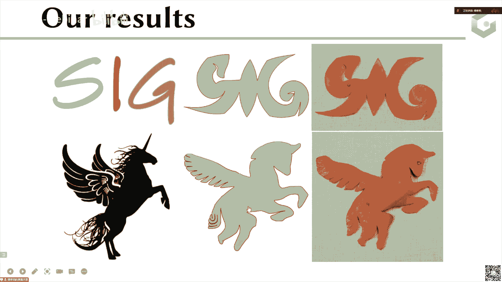

这是我们当时做的一些更多的一些例子啊。

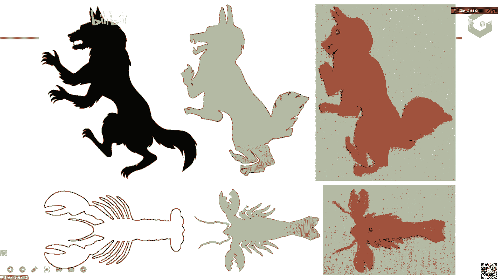

啊这我们就简单过去了，这个是一个gallery，大家可以看一看，就是不同的这样的一个结果啊，大概做了有五六十个形状吧，就我们这地方基本上啊动物啊什么的都都有了，答案是比较丰富的，这个形状。

嗯好这个我们就介绍完了，接下来我们要介绍一个呃新呃，另外一个这样的一个艺术形式啊，这个叫做那个paper raft，或者说叫做一个纸模的艺术。

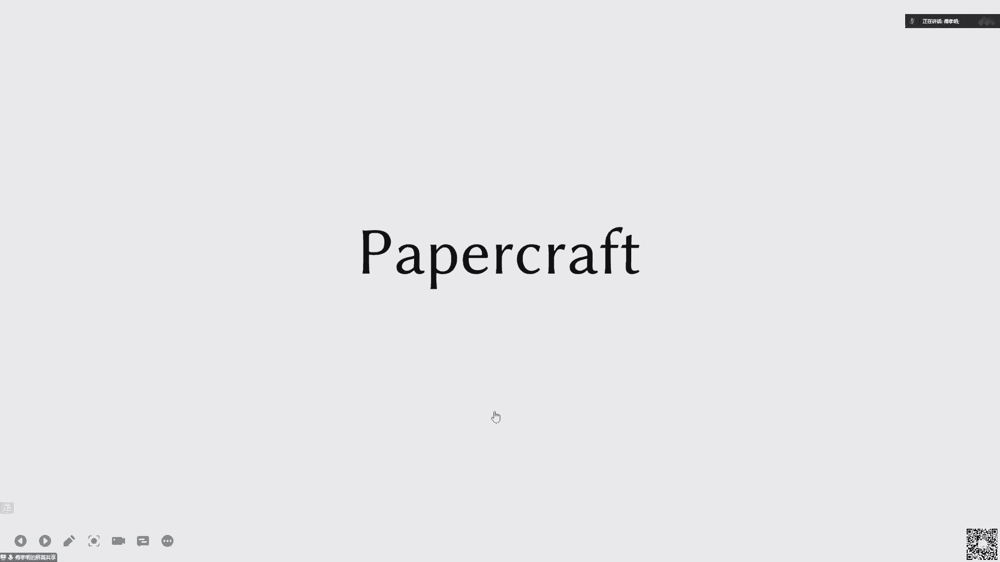

那么先来看一个example，呃，这样的example啊，首先来看一下这个左边这个example，就这个这个例子，呃左边这样的一个例子啊，首先我们来看一下，这个是他最后成型的一个纸模。

然后但是呢他在这个2d平面上，你可以看到它其实就是这样的一些这样的2d平面上的一个指，这是指，然后这把他是把这些纸给剪开以后，把它合起来之后，就会变成这样的一个正正方方的这样一个狮子头啊，就把它剪开。

把它折起来之后就会就会贴上来，就这样，这是一条这个小鱼啊，这是一个小于的话，你可以看到它在2d平面上也是这样的一些值，然后最后把它给剪，把把这些值给剪下来，把它粘上，去就会得到这样一个题啊。

这是一个企鹅啊，但大家可以看到这些形状都是比较简单的这种啊，方块型的就是这种叫做盒子型的box形状，就像这个企鹅就更像一个box，这个鱼也是的，这个鱼的话其实大家可以看它这个轮廓还是比较简单的。

那么现在呢就是我们想做一下更加一般的，或者说做一些更加复杂的这样的一个几何系数啊，就叫做paper bo，那么对于这样的一个艺术的话。

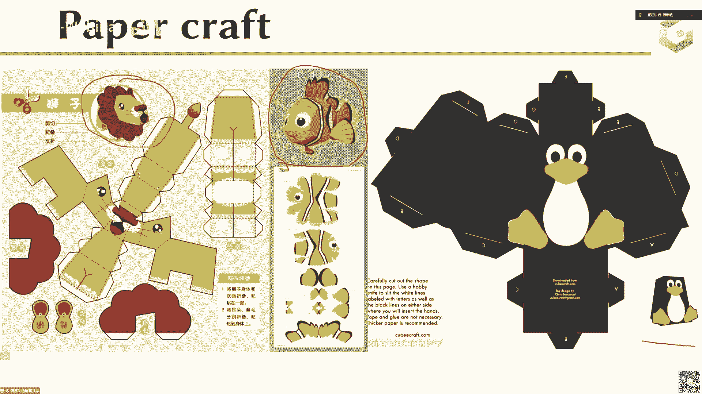

它其实本身因为你要用纸去折的话，它其实就是一个可展曲面对吧，那么对于一个可展曲面而言的话，它其实，是一个高斯曲率输出为零的这样一个c2 连续的这样的一个光滑曲面，那么对于这样的一个光滑曲面的话。

它有上二阶可微的，就是高斯曲率处处为零，所以说其实我们的问题呃，就是要去把这样的一个网曲面，变成这样的一系列的这样的一个可展曲面片对吧，那么每个可转曲面片我就可以用这个纸张来构造，那当然了。

可单曲面除了我们刚才讲的这一类，就是这个paper应用里面，它可单曲面本身也是一个非常具有非常广泛的应用，他在艺术设计衣服这个折纸什么等等里面都会有。

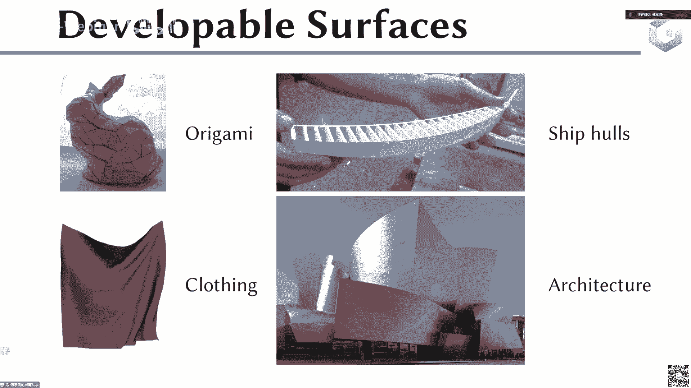

一些很多的应用，那么我们今天的主要的目的就是说一开始给你三维的形状对吧，这个形状不是那种很简单的box，这种形状可能是一般的这样的一个网格，那么我希望去给他去做一个这样的一个分片可展的局面。

因为分配可单曲面的话，因为可载本身没就是参数化的时候，就是可以参数化到2d上，它最后的这个扭曲是接近于零的啊，所以它其实跟参数化也是比较相关的啊，它是一个一开始是一个啊。

不是全局的这个global developer，那么我需要去给他做一个分片的可展的bg，相当于这个每，个颜色的每一块它其实是一个呃，你可以认为是一个可展曲面，那么可展曲面的话。

我就可以用一个纸张来去构造它啊，那么当然我希望这个做出来这个快的数目是比较少，那这样的话我最后的拼接的难度也会比较短，那么第二是这个这个这个比如这只乌龟，我要跟这只乌龟是比较接近的对吧。

所以我希望他需要这样有一个比较高的相似性，这个乌龟总不能长的都不大一样吧对吧，所以这个希望就我们这地方设置这样两个标准，一个是希望它快的数目比较少，第二是希望他的这，个相似性比较高。

那么但是呢你其实想一下，如果我要去确定这样的一些歌缝，然后使得它这个网格切成一块块的接近可展的，那这个过程本身是一个啊就是一个类似是一个组合的优化对吧，那么你其实是要去确定它的这个块的数量啊。

这个cut的这个摆放，然后还有最后你的这个整个的这个，最后这个每一块可展的这个片的形状，然后呢并且你最后还希望它是一个可展的，并且是一个这个相似的，这个过程其实是一个比较复杂的过程啊。

这其实就是你相当于要在这个曲面上做一，个分割分割出来以后啊，还是一个比较接近的这样的，跟这个原来这个形状比较接近，那么可能同学就会问了对吧，我们上节课讲的这个呃，让每一样一个每一个圆锥去逼近他。

是不是可以呢，虽然你可以用这个圆锥，但是你的圆锥里面刚才的那个度量，就是用的是那个法向跟这个圆锥轴的轴的那个朝向，然后再减去这个cosine，它其实本身它其实是一个很隐私的度量。

它其实跟最终的这个呃相似性啊等等，它其实会存在一些这样的呃，一些这样的啊不是很明确的这样的关联啊，并且他自，己怎么怎么去去优化它的这个快速啊等等，它其实都不是很明确。

那么比如说基于这样的这个分割的方法啊，这个是之前的分割的方法，那么这一类的分割方法的话，它的好处是它可以得到这样一个显示的快，但是呢他的一般情况下，他的这个误差是比较高的。

那么还有现在最近这几年发展出来的这种变形，基于变形的这个方法，那么基于这类变形方法，它会形成这样比较明显的这样的一个c curves，就是这些客服会比较明显。

但是呢对于这样的一个ition best method，它的它其实没有分块的，没有显示的这样的一个方块的结构，它只是只会生成一些这样的一些线啊，他没有去做这样的分块。

所以这个这个defaulation best method，它其实没有这样的一些结果，但是对于右边这样的分割结果，它其实会有，但是这个分割的结果你会发现这些线其实没有右边这样的一些呃。

更加的所以说呢这个两个方法，其实这个之前的这些方法，他其实其实还是没有去解决的很好，没有去把这个问题解决的很好，那么所以说呢接下来我们的问题就是要去做这样的一个事情，我们我们的想法也比较简单。

既然这两个方法没有去做的都很好，那么我们能不能去把它给这样做一个can die呢，那么我们对这样的一个key observation是这样的，如果你的这个形状是已经是变形的，是接近于是一个可展曲面了。

如果这个中间这个形状，你把从这个输入形状变形到这个形状以后，这个形状已经是一个接近的一个可下局面了，那这个形状已经是一个接近可量局面了，那它其实如果我再去给他去做一个分割，那得到了这个每一个块。

它其实都是都是接近于可展曲面的对吧，那么接近于可视频，那么也就是说其实问题就变成了什么呢，就如果是一个这样的一个快，这中间这样的一个变形后的结果，它如果是接近于核弹曲面的。

那它其实整个后面的这个呃分割就会变得比较的简单，那么所以说核心的问题是核心的，所以整个的这个拍拍呢就是变成了一个变，首先去把一个输入形状去变形到一个接近可展的局面，然后呢再去给他去做一个分割。

这个分割就会变得稍微简单一点，然后最后呢我们还需要做一个，这样的requirement实它最后的每一块是真正的真正的是接近可展的啊，这个地方只是说我你要the development。

那么我希望它是最终的可展，比如说每一个每一个点的高斯曲率就接近于零这样的一个形式啊，那么接下来按照这样的一个pp呢，我们来介绍一下每一步啊，首先是这样的一个变形的这一步，那么变形的这一步的话。

我需要去给他去做一个变形，使得它最后的生成出来的这样的快是接近于高斯，接近于这样的一个呃呃接近于可载的啊，那可以大家可以再来看一下这个视频，你可以看一下这个，比如这个是这些代表的是这个高斯曲率。

你可以看到这个随着这个变形以后，它这个高斯曲率是慢慢慢的变小的，相当于它在大概在每个地方都变成接近可展了，那么接下来我们就是要我们要介绍一下这个方这个变形是怎么做的啊，它其实是来自于这样的一个朋友。

来自于这样的一个驱动啊，首先这个可展曲面它其实是在这样的一个高斯map下，就是说你把这个可转曲面的每一个三角形，这上的法向映射到一个球上以后的话，它其实在球上它会形成一系列的线啊。

那么就意味着你需要把这样的一个高级曲面，就是你要把这个曲面映射到一个曲面上去，然后映射到一个球面上去，然后他这个把那个法向映射到球面上去，那么他的这个好像在这个球面上构成，它其实是一个现状的结构啊。

就是这个啊合成曲面的这样的一个性质，那么现在接下来的问题其实是，你就是要把这个性质用在哪个法向上对吧，那么最常见的用法其实你就是用在这个三角形的这个面上，但是你这个三角形的面上其实不一定是好的啊。

就是你其实比较简单，就是之前有并非不就直接做了，那么到时我们就想了，你现在用用到这个三角形面上不行，那么其实我们去给它定义了一个叫做age normal的形式。

我我就是只要让这个age normal它是在这个映射到这个呃，映射映射到用gosmap映射到球上以后，把法线映射到球上以后，他在这个球上它是形成一条线的结构。

那么所以说这个地方呢我们就希望比如说对于这样的一个边，它可以走到它的四个邻边，那我希望他这个四五个法向它是在一条线上的，那这个时候他其实对应的这个约束就是要让要让这个要上，比如说i j就是这个。

就是这个五个法向里面，其实你可以找这个找出来它的三个不同的对吧，那应该是c，比如这个这个这个这个这个这个这个，然后这个这个这个这个这个你可以把这个四个塔下，你让这四个靶向就是一个是这个对吧。

你要说这个接近于零，然后接下来是这个的法向的，他在这个平面上，它在那个上面要形成一条线，要形成一条线，其实就是那样在那个地方产生退换，那产生退换其实就是要让他的这个行列式等于零的啊。

所以说其实我就是要让这个行列式等于零就行了，那么所以说这个退化，如果是上面这些行列式的条件都满足的情况下，那这个高斯map就退化成了一条线啊，那么所以说接下来我们的目的就要去优化这个线的这个扭曲啊。

那么当然了，这样的条件，就我刚才讲的这个这个方法，就是直接是定义在这个三角形的这个法向上，三角形的这个面的法向上的，然后我会发现我们的这个条件呢是比他们这个条件更弱的。

然后并且在有一些很特殊的case下，我们这个呃这个定义它的这个可转性就是直接就是完美的啊，比如说像这个例子啊，这个这两个例子这个地方用我们的定义，它定义出来的这个可弹性的能量就是等于零啊。

那么真正要去做这个变形的话，我们会有三项能量，第一项能量是这个可感性，就其实就是要让上面那四个行列是慢慢变成零，第二项是我们变形后的这个形状一样，跟这个输入形状之间的这个距离是比较低的。

那最后还是希望我们这个变形以后产生的这个distortion是比较小的，这三项一项是可转性，一向是近似性，还有一项是变形的这个形状啊，当然这个优化是比较复杂的，然后最后呢我们会听说过引入一些辅助变量啊。

那么比如说这个地方对于这个可选性能量，其实我们就是要让这些行列式行列式接近于零对吧，那么行列式接近于零，其实就是用我们之前那个橘子皮那个gp成型，那个里面的那个rank one的能量啊。

所以这个地方我们用的其实就是一个rank one的能量，所以说我们这个地方其实是rank to，因为它是个3x3的啊，这个地方是一个rank to。

其实就是要把这个投影投影到一个rank two的magic space，然后投影的话就是这个比较简单，就是你这个是优化后的点，然后这个是在原始网格上的地方，我们只要把这两个点之间的距离给连起来。

然后对最后这个地方是我们希望它的distortion是比较低的啊，这distortion比较低的话，我们这边用的一些呃，就因为我们本身的优化都是在反向上的。

所以我们这地方把这个distortion的度量引引入到了这个反向上来，这个世界我们就不这样了，然后最后呢其实这个迭代因为它的变量里面加入了很多的辅助变量，这个迭代是非常非常复杂的。

所以我们用了一个交替迭代，就类似于之前的那个local global这样迭代啊，就是每个变量每个变量在固定其他变量的情况下优化一部分变量啊，这样的高级阶段其实就是一个block的脑力链的高级三角迭代啊。

接下来去做分割，他们有了这样的一个变形的结果以后，我们要去给他去做一个分割，那么这个分割的话我们会做一个非常呃分割，就是给他做一个over sentation啊，他的快速会比较多。

那么再去呢我们再去把它去做一个papatch的合并啊，最后那所以整个过程就是一个close to find的过程，大家可以看一下啊，这是一个出风格，啊出风歌的话就随着这个，比如现在我在这个地方找一条。

就是用这个下面这个方法找一条这个歌缝，把它切成两块，然后再去做呢，就这样每次去做，然后最后做出了非常非常粗的分割，在这个分割大概有这样一个100几块的分割啊，做完这么多分割以后呢。

然后我们再去给他做一个合并，合并的话会基于一些准则啊，然后再去把这个合并合并完，最后只剩下这个26块，然后做完这个合并以后呢，我们接下来就要去做一个refinement对吧。

因为我们这个地方的高速曲率还不完全等于零，所以我们要去给他去做一个优化，他这个优化的话，它会有这样的几个条件啊，这个条件是这个可感性，光滑性和这个。

所以我们就把对每一个片他的那个高速曲率优化到基本上都是等于零，这条边界线比较光滑，这个内部也比较光滑，最后的话就会得到我们最终的这样的一个结果了啊，这是我们的当时做出来的一些结果啊。

啊这是跟这个18年的文章和21年的文章比较，他们其实没有，这个是上面他们的变形的结果啊，这是我们变，形的结果，然后呢基于都是同时基于我们的分割方法去做的这个分割，那么他们这是他们的分割出来的结果。

就是我们分割出来的这个结果啊，这个是跟20年的文章，它是直接生成分割的，那最后发现我们的快速更少，我们的这个呃我们的快速更少，我们的这个bh我们的hosh距离更小了。

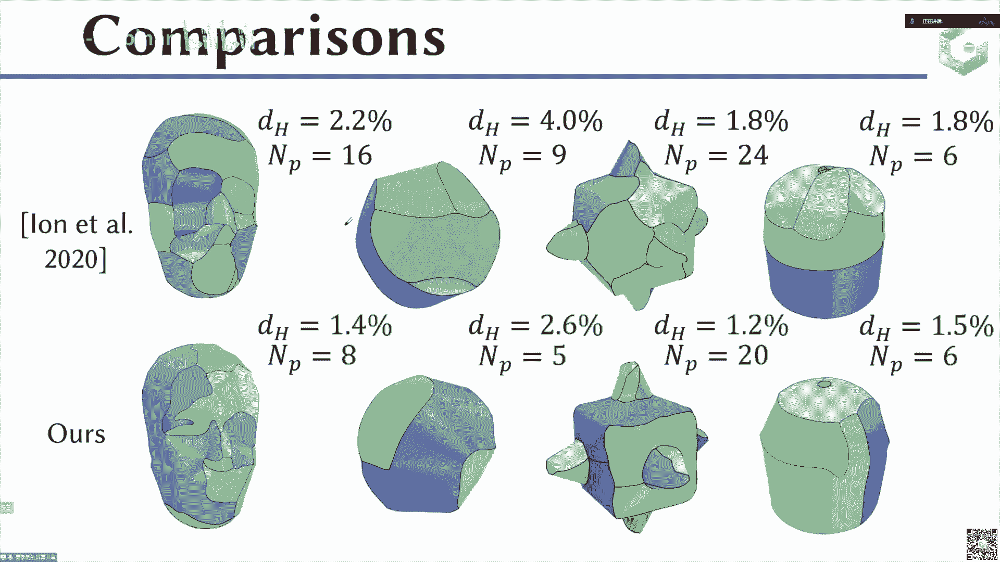

啊这个是我们给大家展示了一下这个纸模的制造过程，这个指标这个首先是我们把这些参数化全部打印到一个图纸上，然后呢去把每一块给呃呃拆出来，然后呢把每一块根据这个连接关系把它给这样的拼起来，那么拼起来以后呢。

就是把这个相邻的，因为我知道它是哪两块相邻的，把这个最后把这个拼起来，就会得到一个比这是一个bug这样的一个形状，后面还有一些更多的这样的例子展示啊。

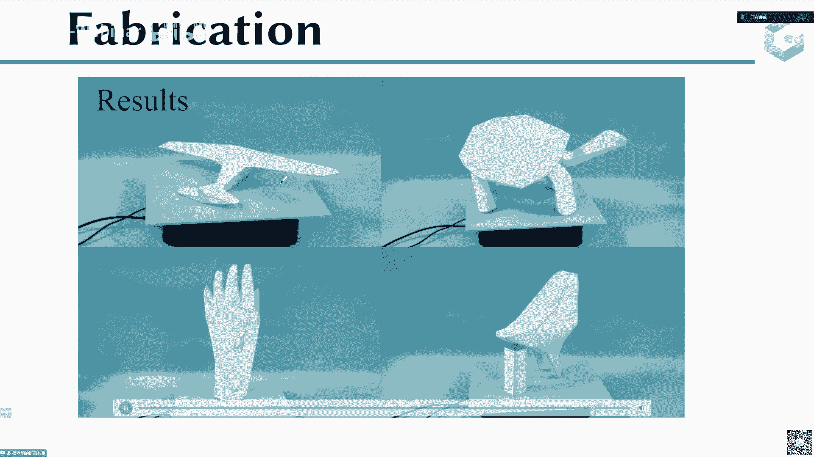

就是一些更多的例子的一些展示。

