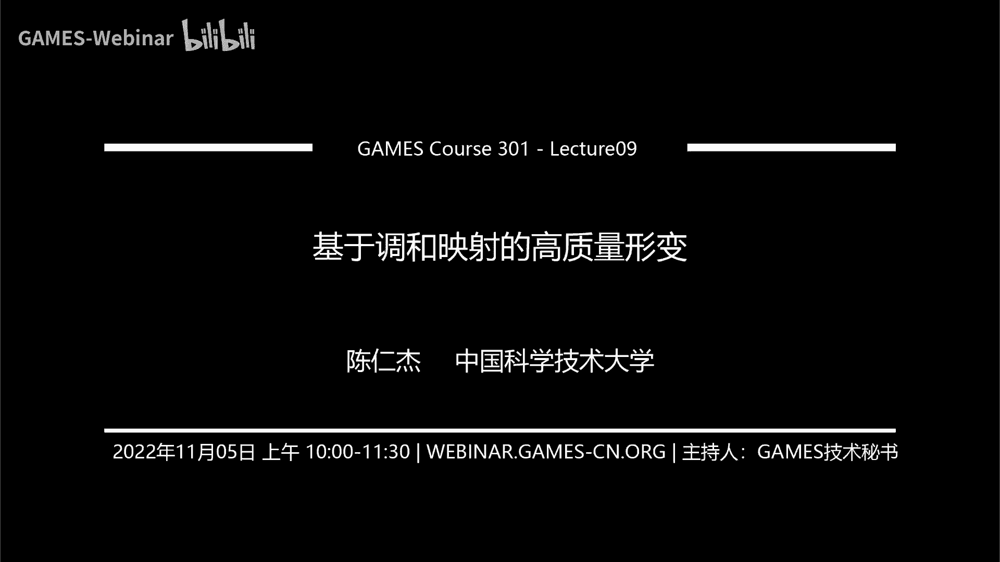
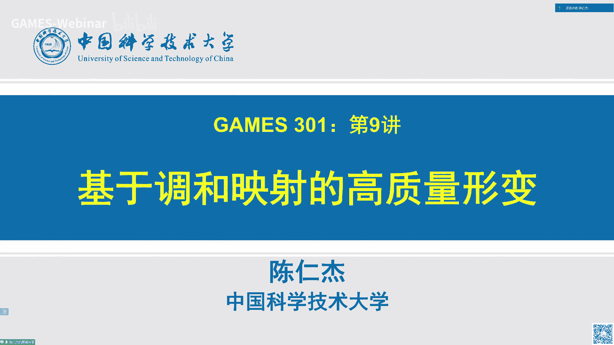
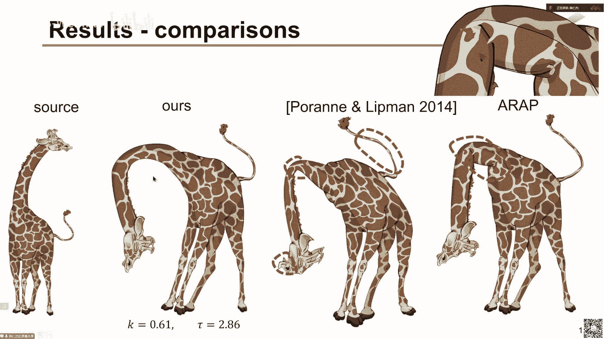
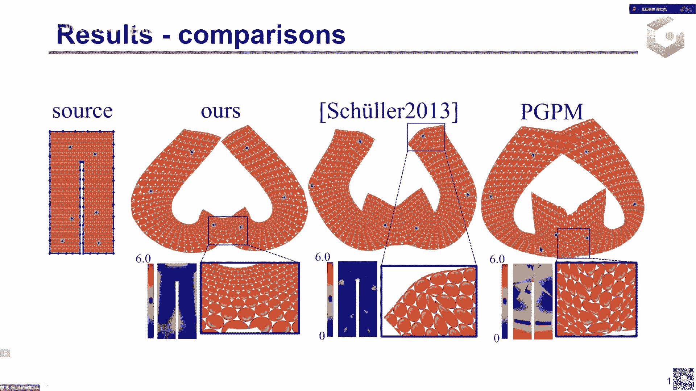
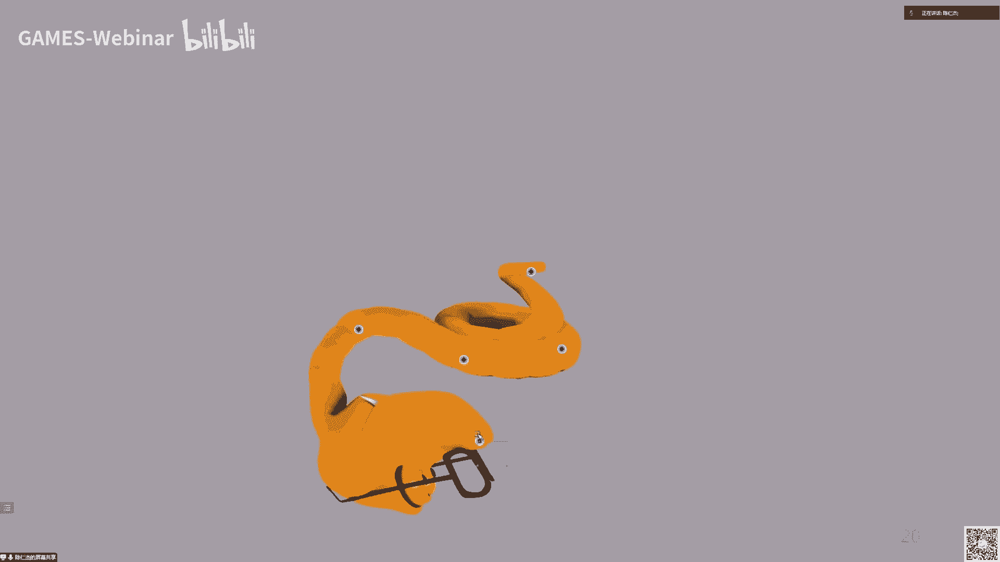
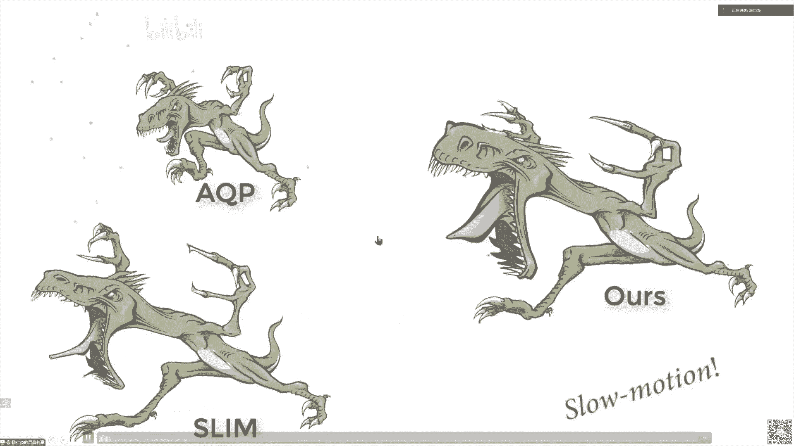
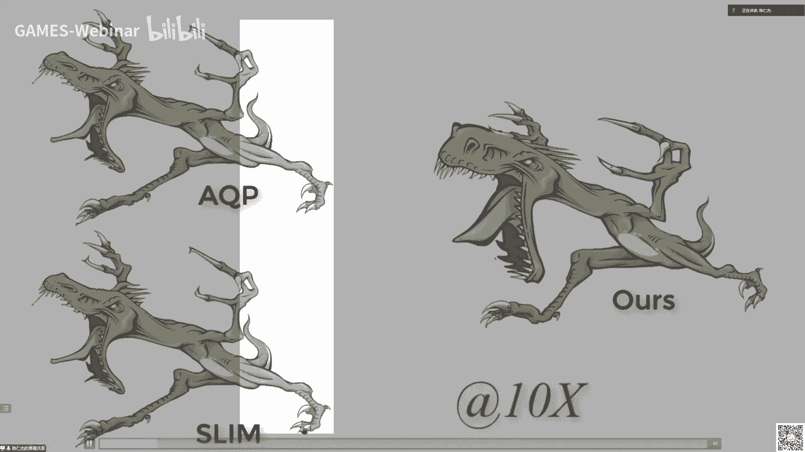
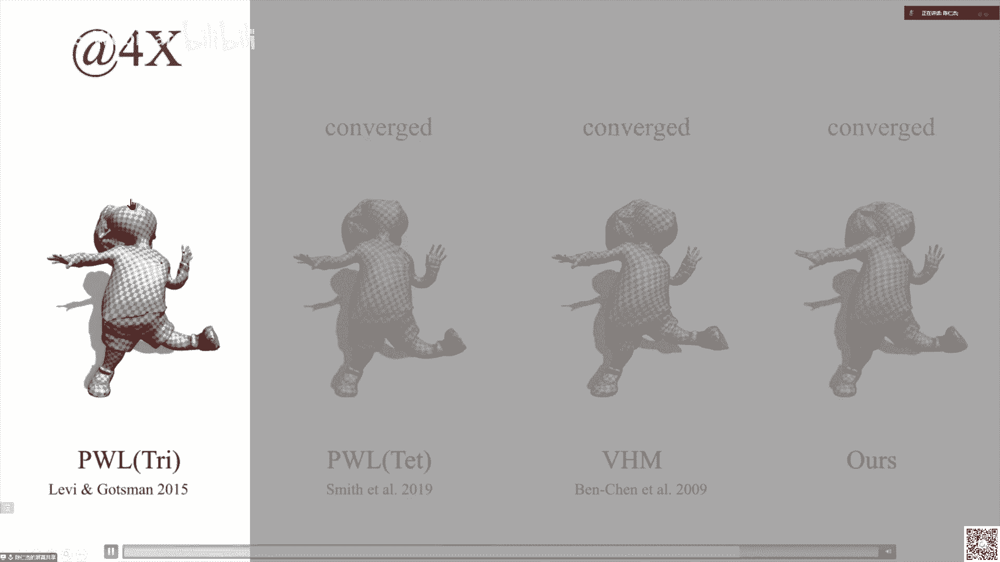
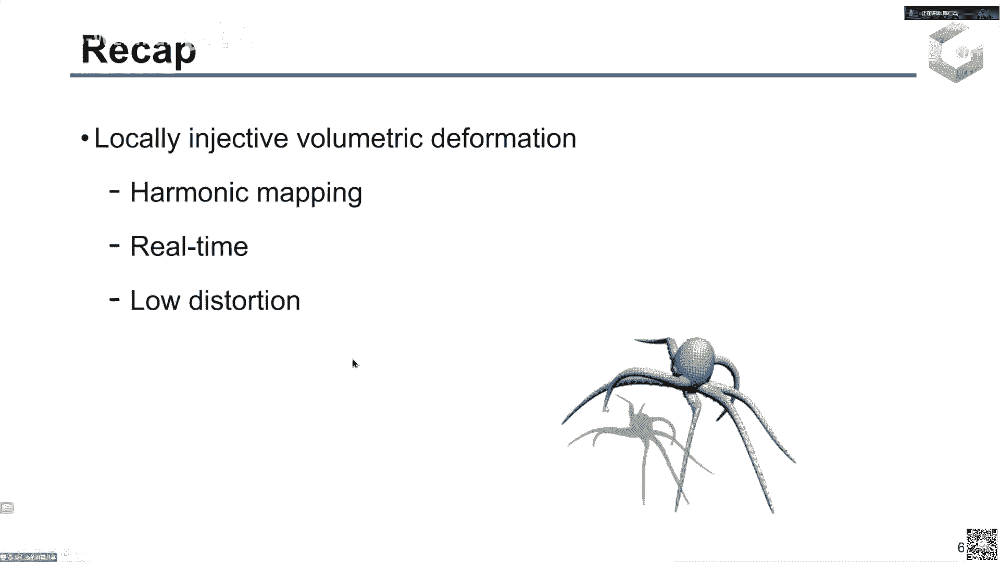
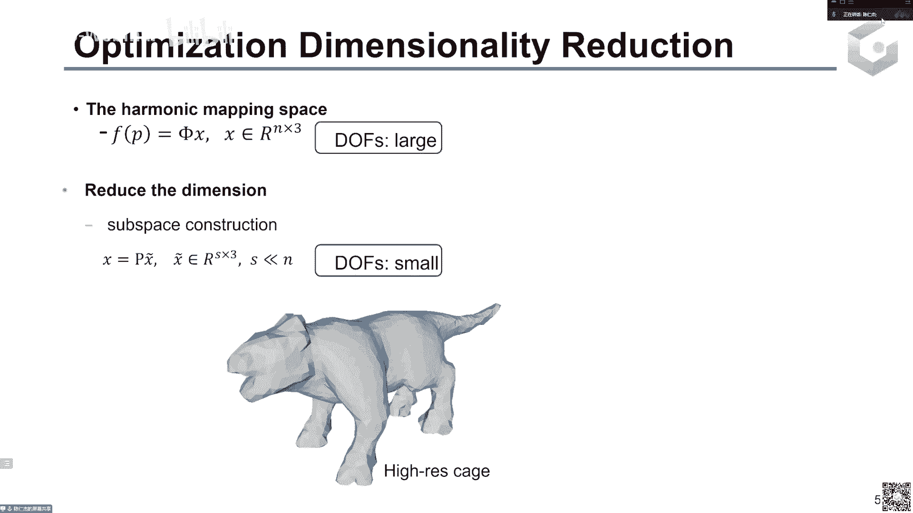

# GAMES301-曲面参数化 - P9：Lecture 09 基于调和映射的高质量形变 - GAMES-Webinar - BV18T411P7hT

早上好，各位老师同学以及啊各位同仁对啊，欢迎来到我们呃那个games 301的第九讲啊，我们今天的题目是基于调和映射的高质量省电。

啊，首先我们看一下那个呃，上一次我们讲的那个关于光滑行进的一些基础知识，主要是啊，首先是主要介绍了那个基于光滑g函数的那个光盘映射构造啊，主要有四类方法，分别是基于rdf的，基于广义重心坐标啊。

然后还有一类特别的那个调和映射啊，最后还有那个叫基于样条的那个啊光滑用射构造对啊，然后后面我们呃简单提了一下，就是对光滑映射我们要做无反转的话啊，主要是现在啊有两类方法，是不是啊，任一点无翻转。

然后第二类方法是基于那个就是光滑映射本身它有一个lifx连续性啊，更确切的说是我们无反转条件那个无反转那个函数的lifx连续性对呃，然后呃我们后面第13讲啊，那个付付老师应该会介绍参数化的第三个应用啊。

是做高阶网格生成以及全面对应啊，这里我特别的针对这个高阶网格生成里边啊，这个高级网格的那个映射其实就是一个呃光滑映射，然后对于呃这类啊问题啊，就是比较常用的方法就是利用量条机的突破性质。

因为这个啊在高级网格方法里边啊，这个用样条机，去构造这个光滑映射是比较自然的事情，啊然后今天我们讨论用调和音色来做高质量雄电，然后这里我们主要就利用了这个调和映射的它的lip值连续性。

因为调和映射它是嗯根据上一次我们讲的，调和映射是一类最在数学上它是最光滑的映射，那它的那个我们可以期期望它的那个啊lify是常数会最好吧，最会会最小，至少在数学上是这样，然后我们看一下呃。

今天的题目是说做啊变形是吧，变形可能跟我们整个课程啊做参数化看起来有啊还是有点差别对啊，但是我们回到这个图来看的话，其实呃参数化和变形都是在做应做映射的优化啊，唯一的差别就是那个他呃在在参数化里边。

这个啊输入输出的为数不一样是吧，就是啊我们前面讨论的最多的是从三维到二维，也就是从那个二维流形嵌入三维空间的一个啊三维网格，把它变到变形的那个啊二维平面上的一个映射。

然后那个我们变形的话一般是啊输入和输出的那个域都是一样的，就是我们今天主要讨论两个问题是分别是在平面上的变形，那它的输入和输出都是啊在二维平面上啊，然后第二个问题是在空间的一个参数。

也就是在三维啊r3 空间的一个变形，那它的输入和输出都是r3 对啊，但是其实我们呃参数化也有在同一位参呃空间下面的三化啊，这就是明确我们称它为参化的啊，这这这那一位这这么一类问题吧。

就是呃主要是现在是做三维的那个参数化，比如说任意的一个三维区域到啊，比如说呃就是单位立方体之间的一个插画，这里其实就是找把那个把一般的一个三维的那个联通的区域，把它映射到啊。

就是单位立方体或者其他的一个更规则的一个立方体区域啊，就是三维区域啊，所以归根结底就是呃参数化和变形，它其实都是在少一个映射去，或者说去优化一个映射对啊。

然后后面我们可以看到就是其实啊两位啊英雄或者说两类问题啊，就是看起来很呃那个就是构造很类似是吧，然后解决方法也是非常类似的，啊所以我们今天啊是就是这个做变形，对啊，为什么做呃讨论讨论变形呢。

因为变形在图形学里边啊是一个非常经典的问题，也有一个非常重要的一个应用啊，这里最主要的这这里一个重要的应用就是做关键帧动画，就是传统上我们啊设计师或者说呃动画师做动画一般分两步。

首先是呃比较资深的或者说高级的动画师，他会呃绘制这个呃比较重要的，这个叫关键帧或者说关键的pose啊，这里我们讨论这个角色，就是这个比如说这个呃小象他啊就是高级设计师，他会啊，比如说画这种三啊。

三针关键的那个啊姿势，然后一般的设计师会将啊关键字数之间的中间帧啊把它填充进来，然后当我们中间帧足够多的时候，我们把所有这些变形啊，以及那个中间的那些pose连续播放的时候。

我们就得到呃这个动画这里可以是二维，也可以是三维的，然后呃就现在在那个计算机动画啊生存里边啊，就是我们同样的要解决这样的两个问题，然后一般低的问题我们就用啊，这个叫我们今天讨论的那个形状变形技术来解决。

然后呃第二类啊，就第二个问题是用这个角形状差值就是有了啊，我们通过啊，比如说就是一般的用户能通过那个交互式的方法生成关键帧之后啊，对于两个关键帧之间的那个形状，我们可以通过形状差值技术来得到啊。

这些那个中间帧，啊所以我们今天主要讨论的那个问题就是做形状变形，怎么得到比较看起来比较自然，比较好的这些呃对然后满足我们用户意图的啊，这些关键帧，呃呃这里说我们看一下这个呃叫形状变形。

一般啊要满足就是作为一个形状变形啊，应用或者说软件或者说一个系统，它要满足什么样的性质，呃，或者说满足什么样的要求啊，首先啊就是在这里我们啊是用于动画画师来设计，快速的做那个先放造型。

就是快速的生成这些啊，我们前面提到的那些关键帧啊，所以啊第一这个用户界面也比较简单，要自觉啊直观并且简单，这里我们右边啊就是一个交互的一个用户，通过鼠标来拖拉编辑一个形状的一个系统，对啊。

这这是呃大家总可能啊鼠标啊这个作为交互方式啊，比较自然是吧，所以啊这是比较一个比较自然的一个用户界面，然后第二个问题是啊，这个变形卵啊，就是它的算法。

就是我们要生成这个啊满足用户需求的这个变形结果的这个算法，它要足够快速啊，因为在这个应用里边，我们是希望在用户来编辑这个啊，就是这些啊用户意图就是这里我们右边是用红色的点来表示啊，就是用户拖动的一些点。

其实就作为这个点约束的形式放到我们的优化问题里面去求解的，那用户在拖拉这呃，这在编辑这个啊约束的时候，我们希望能啊及时啊，最好是能实时的得到这个对应的一个变形结果。

这样用户才能根据这个结果来调整这个新的这个约束，所以我们的优化一定要足够快啊，能得到实实的用户，能得到一个呃在线啊，或者说实施的一个反馈来呃，允许他做进一步的调整，啊然后第三个问题是呃。

我们要求这个结果变形的结果叫高质量，因为我们希望啊在啊快速给他给给用户啊反馈的时候，这个结果应该是离最终这个啊，我们拿比如说啊物理仿真或者其他软件来啊，渲染最终结果的时候，那个结果应该是很接近的。

所以我们希望这个变形的结果它要高质量，这里高质量主要体现在这个映射，它必须是光滑啊，所以我们要用光滑映射去构造这个映射空间去优化，然后第二个我们要求是啊，这个音色它是局部啊满射啊。

局部单色也就是没有局部的那个翻转，就如果有翻转的话，这个形状它原来啊就一部分会啊，那个覆盖到另外一部分上，对就是啊不是自然的一个结果对，然后还有一个要求是进一步我们要求这个映射，它是啊扭曲有界的。

就是说它每一点它的变形扭曲都是有啊，用户可以控制它一个上进啊，这其实也是在防啊，在在我们模拟这个呃，就是应该说物体它是有一些基本的那个材质构成是吧，然后这些材质在真实世界里边它是啊，你变形的话。

他不可能就他的那个内部啊，这个映射就变啊，反过来了，这是不可能发生的，所以我们要求这个映射它是啊不翻转，然后进一步它不能超过用户呃，那个实际它呃材质的一个就是可以变形的最大范围，对啊。

这个之前我们已经讨论了很多是吧，那个扭曲有界或者说保姆区的一个要求在在，特别是在一般啊二维参数化里边是非常就是我们啊现在是着重处理，就是我们课这个课程其实着重处理的就是这个问题。

对对在啊这个应用里边我们同样的可以把这个纹理啊，就是现在我们是其实是通过贴图，形式把这个啊长颈鹿把它贴到一个三啊一个平面区域上，其实是一个平面多边形上对，然后我们把这个纹理把它换成这个啊圆形图案的话啊。

就是中间这个图其实就是呃原始的一个啊圆形图案来构成的，一个基本的纹理，就跟那个把契丹格一样，这里的啊每一个元素它都是正圆对，然后我们把啊最终优化得到的这个映射呃，作用一个纹理贴图。

我们就可以看到在变形结果里边这些啊原来是圆是吧，现在就变成那个啊不是圆的，而是啊其实局部都是椭圆对，然后啊有大有小，我们局部放大看，这就更明显了是吧，就是这个原来是单位，也现在这些人啊，就是有啊。

还是还是比较接近远的，就因为这是一个比较高质量的结果，所以这些圆还是或多或呃跟跟郑源这些椭圆嘛还是比较接近啊，那个正脸的对对，这是一个视觉上，我们希望这个把握你啊替换成那个这个就是原型图案之后变形。

结果就是我们判断这个变形它应是他是不是高质量，我们就可以通过观察每一个圆，它是不是还是接近啊，每一个椭圆还是接近正圆对，然后它的大小是不是也是接近原来的那个圆的大小，对啊。

然后其实这里我们啊说映射高质量啊，也就是说我们判断认为这个应用如果映射是高质量的，我们就可以认为这个音色是好的映射，就是做变形里边呃，做做变形应用，它是一个好的音色，这个这个啊是啊那个破烂根啊。

杨在那个2014年啊，最早提出来用这个其实是用那个rbf以及那个样条机，来去构造光滑映射啊，然后他们是给出了一个叫可以证明的那个好的映射，对啊，那我们看一下就是呃在变形这个问题上。

其实相关工作非常非常多，因为这个是非常啊非常经典，或者说非常啊重要的一个问题啊，那这些相关工作就可以分成那个两类，一类是基于网格的方法啊，然后另外一个就是无网格的方法，就是基于方法用射。

所以是无网格的方呃方法，然后呃基于网格这类方法呢，它自然它是分片线性的颜色，所以这个映射它是不连续，而不是光滑的啊，就一般它有啊，它分配线性嘛，所以它的价格比是啊分片常数。

那相邻片之间甲壳比就不是连续的，然后呃无网格方法一般它是用那个光滑映射啊，机来构造的一个映射，所以它天生是光滑的啊啊但是就现有的这些方法都有各自的缺陷，比如说那个机遇啊，广义中心坐标呃。

它可以保证就是我们利用那个tt ttt参数化，我们可以把任意的一个多边形，把它嵌入到那个啊突区域内，to的一个多边形区域内，那x 10正常坐标我们就可以得到一个啊局部蓝色的。

或者说甚至是双色的一个呃映射结果啊，但是这里我们扭曲是呃，它的就是扭曲的那个界，它是不可控的，就这个界可以无穷大啊，可以是非常大的一个数值啊，就是说啊回到我们前面那个用啊圆形图案来说明的话。

就是这个圆可以变得非常非常扁，啊然后圆的大小啊也可以是啊非常大或者非常小对，然后第二类方法是叫可控的这个啊保角映射啊，在这个应该是啊这一类方法里边，它不能直接指定啊那个位置约束，它的啊自由度是啊。

应该是顶点的个数，而不是啊那个边界的顶点的个数啊，边界边界的那个顶点的那个自由度啊，相当于我们如果我们能控制所有顶点边界顶点的话，那它的自由度是2a对吧，然后在conform map里边。

我们只能指定一位一，比如说只能指定啊x或者y或者呃角度，或者反正只只有一半的制度，所以在这个方法里边不能直接去指定那个位置约束啊，但是这个位置约束在这个变形里面是非常重要的。

所以啊这个啊这些的方法啊也不是特别适合做啊，变形对，然后第三类方法就是刚刚提到是普拉跟lip man在14年提出来的，这个啊可以证明的比较好的平面用手，这个他他们主要是针对一类啊镜像积函数。

以及那个呃样条机构造的一个映射空间啊，他们给这类记函数吧，呃是呃推导出了一类那个lip是常数，但这个lip是常数是非常啊，就不不够紧，所以啊他可以证明就优化完它它们推导出了这个最终这个音色。

它是如果它他们的算法收敛，那它的结果就是一个啊就是扭曲有界的一个映射，但是这个界跟实际啊又画出来，就实际映射的那个上界它可能会差别比较差别差别会比较大对啊，然后嗯这个rdf以及那个两条机。

其实跟我们实际要变形的那个形状是不是太敏感，所以这类既然不是特别适合做变形啊，好的，就是对于平面映射的一些基本的一个啊定义以及概念嘛，对啊对，就平面映射是从啊一个二维区域到另外一个二维区域。

就是我们改移到我们一个二的一个啊点点对应，然后它可以写成一个向量函数的形式，就是它把我ωa e d边的那个sy点，应该说到那个欧米伽r里面的uv点，然后uv分别是关于xy的函数，然后对于这么一个映射。

我们可以啊有它的一些呃就是计算它的偏导，一阶偏导，甲和丙就是甲克比，其实就是uv分别关于xy的那个一阶导，然后我们可以将这个假货币做一个sb d分解，结果是啊两边u跟v分别是啊一个正交正，就是在几何。

上它是代表旋转操作，然后中间是一个呃对角正啊，这个对角线就告诉我们这个映射它是在某个方向上是做了啊，坐标对齐的一个缩放，对我们可以把这个效果把它可视化出来，其实这个啊根据这个价格比。

f总是将这个啊任意1。5啊区域的任一点附近的一个无穷小圆，就左边这个单位圆把它映射到目标区域里的一个啊椭圆，然后椭圆的那个长短半轴啊，分别就是我们这个价格比的两个，其实这个门分成420。

然后呃就是在这里的假设s b d分解，我们一般假设它是呃应该，是无符号的一个，第三节它是无法的一个极值吧，就西格玛一和西格玛二都是大于零啊，这个时候啊就是当当当甲克比它是翻转。

就是说甲克比的行列式小于零的时候啊，那我们可以呃就根据这啊前面课程的讨论，我们已经知道就u跟v它可以是啊，有一个肯定有一个就是也是呃，非是师生矫正是吧，但是他可能是旋转加上一个啊镜面的一个翻转。

关于x轴的一个翻转啊，所以它的行列式要小于零对啊，然后一般呢我们在平面映射优化，里面我们采用的这个sb的分解是啊，叫戴夫德s0 分解是吧，这个我们啊这是正在做的作业吧，就是做那个啊。

这个我们应该对这个带符号的s p d分类应该很清楚了啊，好的，那我们就稍微提一下这个啊，然后对于平面映射啊，这个我们映射是一个向量函数的一个形式是吧，然后其实我们呃应该大家都学过那个叫复分析。

所以很自然对平面英雄们可以想到用这个负数来表示我们的一个映射，那个现在xy就变成不平面上的一个点啊，一个数，吧一个负数c然后呃目标uv也可以写成一个负数，对这样我们的映射函数f就变成一个呃复数函数。

然后它是在呃从从复平面到啊副平面的一个映射函数，这样做到一个好处是现在我们啊对复数我们有两个偏导啊，这个f它其实是关于c以及关于c共轭的函数，所以我们可以分别对c跟c份额求导。

然后这两个导数啊跟我们的前面提到这个甲科比之间，就有一个非常简单的一个，其实是一个线性的一个啊联系，就跟上面我们用实实数来表示的时候，这个sigma跟西格玛二啊，其实，是要做sb分解是吧。

就一般我们要做那个数值的s s e d分解啊，然后那个19年啊，那篇文章告诉我们，他可以有啊啊有一个啊啊基于那个积分界的一个形式，对啊，所以呃在用负数表示之后，我们这个甲可比类似，就是甲壳比。

我们可以得到一个解析的，比答说我们只需要对f关于c e g c共和求导，就是两个f关于c跟c共轭的那个导数的模长之和，然后sm 2是他们的模长时差嗯，然后在这里的cpu是5号的。

就是因为外面取了绝对值是吧，所以它肯定是大于等于零，然后如果我们要呃，就是我们更多的时候是需要这个西格玛二是带符号的，就是有符号的sbd，那这个时候我们只需要把这个绝对值去掉就可以了。

西格玛二的非常简单的一个解析表达式，这个解析表达式允许我们后面做啊，做针对这个调网映射的一个优化，啊然后我们再稍微看一下这个关于这个几何扭曲的一个啊，简单的一个解释吧，这个大家应该都很熟了是吧。

就是我们根据前面的描述啊，然后用sigma和sigmmm，我们就可以去度量或者说刻画这个f在这个点附近的一个扭曲啊，因为在呃一般在应收油画里边，我们希望这个目标椭圆还是跟原来的圆镜可能接近，对啊。

这个sa跟cm 2根据前面的介绍名，已经有他们的解析表达式了，所以啊这是解析表达式，然后那个啊一般我们常见的那个扭曲度量有保角扭曲啊，就是希望我们椭圆还是圆，这个圆的大小可以变。

所以就可以用西格玛一和西格玛二的差来刻画，然后第二类扭曲，现在更常用的扭曲叫这个等级扭曲啊，就是希望我们这个目标椭圆它的大小也不变，它在保价的基础上，它的大小也不变。

那其实就是希望西格玛一和西格玛都是接近一啊，这里我们可能对这个下面这个扭曲，这个叫对称狄里克按钮就可能更熟悉一点是吧，因为我们目前正在实现，或者说有些同学已经实现好了，对对啊，这个等级扭曲其实非常多啊。

就是呃在在近10年近25年啊，就是研究者已经提出了很多不同的扭曲，特别是这个本性扭曲了对啊，但是现在更常见更常用的就是这个叫对称机的克莱因，然后在映射优化里面，我们希望啊这些扭曲都尽可能小。

然后像宝藏女士的话，我们希望它接近零是吧，当零的时候他就是啊一个正圆，然后那个对等去年的学员们希望它尽可能接呃接近一，这个就是当西格兰一跟西格玛同时等于一的时候啊，是达到最小11。

然后啊同样这个sd扭矩就是对称地理课，是找到极小，嗯ok那前面就是一些基本的那个关于平面设一个基础知识，然后下面我们看一下怎么来做啊，平面的调和变形，根据上次我们已经提到是吧，就是对于调好音色。

它其实就是说这个音色函数f它要满足这个拉普拉斯方程，就是有关于v啊，u和v分别是满足这个拉普拉斯方程就是有关于x的二阶导，加上啊v关于有关于y的二阶导是等于零，然后v也是同样的啊。

这个映射是在数学上是它是最光滑的映射，就是它有无穷阶的呃那个导数啊，然后他作为u和v作为那个啊调和函数，它有极大值以及极小值原则，就是说u跟v的机制都是在边界上。

就在整个定义的那个啊机制我们只需要在边界上找就可以对，然后还有一个重要的形式是天花映射，它其实它的那个位数比较低，就是虽然他这个映射是在把整个定义域上啊，将任意点并射到另外一个另外一个点嘛。

但是他给定一个任意一个边界条件啊，它内部的能映射就唯一确定了是吧，就根据这个拉普拉斯方程可以来唯一的解出来对，啊好的，然后下面我们看一下这个啊，回忆一下这个八啊，叫啊扭曲有接映射啊。

就是作为跟一般的那个无反转音色的一个概念吧，就是根据定义啊，我们要求啊一个映射是扭曲耳机的话，我们就是需要它在内部所有点就是c啊，欧米伽是我们的定义是吧，我们要求对欧米伽的任意一个点c它要满足扭曲有界。

以及那个啊等讯扭曲，啊然后针对调和音色，我们前面提到调和音色它是呃由边界条件唯一确定的，所以很自然我们希望啊就很自然我们会问，如果对一个操作映射，如果它在边界上是有扭曲，是有界的是吧。

就是对于这些绿色点，它的扭曲是有界的，那内部点是不是也是有界是吧，这这是一个很自然我们会问的一个问题，啊这是我们呃就之前给出了一个啊针对平面映射的一个理论结果，就是这个结果是说呃。

我们主要是给出了针对就是前面的那个讨论的问题，针对一个条纹映射，它是不是啊那个扭曲有界在整个定义呢扭曲有界一个等价条件是说，首先在边界上它必须是扭曲有界的是吧。

就是对边界上那一点它的啊各种扭曲都是有满足用户指定的一个上界，然后在这个基础上，这个调音色的要满足一个啊条件，这个条件是这么写的，是说fc关于就是f关于c的一个偏导。

他的呃一个积分在这个边界上的一个积分，它必须等于零，这个积分其实啊看起来就是我们可能在复分区里边有一个，看到类似的一个东西吧，它其实是说fc在我们区域内啊，整个区域内它不等于零。

就是在这个等价红红框里面，这是对于所有点在欧米伽上的任一点都要满足的一个条件，但这个条件我们可以针对呃，因为fc一它是一个全程音色，也就是一个解析应用，是解析函数他的那个不等于零的一个条件啊。

其实可以用俯角原理得到，就是左边这个啊方程是说fc它的呃，那个导数除以f c然后它的积分，这个积分其实可以看成是那个fc的blog，就log f一做一个积分。

啊应该是对这个积分出来其实就是log f c的一个应该是求和吧对啊，所以这个条件就是我们对啊，就是我们区域内任意一点fc不消失的一个条件，把它给转化成在边界上的一个机关，于这个积分的一个条件。

就说这个积分不消失，对就不等于零对啊，这个是我们啊是15年是给了一个这个定理，在啊单联通区域下的一个结果啊，就是在这这这个然后17年所给出的这个定义，在多年上区域下的一个结果啊，这个结果其实一样。

这个证明我就不介不介绍了，应该啊，如果大家感兴趣，可以看这两篇相关的文章，对啊，其实这里比较重要的就是说我们对于fc呃，当它满足这个边界这个积分的时候，他就有这个叫啊嗯就是因射函数吧啊这个扭曲函数啊。

k跟套他就有极大值原则，就是说他们的极极大值是在边界上达到，所以当呃k跟套在边界上当中，这个扭曲上线的时候，它在内部也满足这两点去创建对，这里稍微提一下这个虽然这个我们前面说这个映射f还是调试。

是调和是吧，所以它有积极原则，就是f本身它在边界上肯定是达到极值的啊，但是k跟套它就就这个即使原则它不是很自然的一个事情，因为k跟套本身它不是调和啊，甚至都不是光滑的，就是套他可k跟套可能在某些点上。

他可能是呃就是奇异，或者说啊不可挡的对，所以这个结论它不是那么频繁，就是我们啊是利用了阿福的一个调和性质，但是这个我们的硬啊，这个对比，根据f的映射，f这个映射它是调和。

我们可以啊证明这个映射这个扭曲函数就特别的，这这两个扭曲函数可以跟t它是有啊，这个叫啊sb harmonicc，就是指调和吧，对所以他们的机制极大值是在边境上达到，嗯ok那有了这个定理之后。

我们设计算法其实还是挺简单啊，然后在介绍算法之前，我们再提一下这个我们要做映射，要做优化的话，我们需要有一个啊就是叫叫优化空间对，然后这里我们再次利用了这个调和映射，有另外一个形式。

它有这么一就平面的调和映射，它有一个分解是说任意一个调调音色法，它可以啊分解成两个映射的和，就是两个映射的叠加，然后呃第一个映射是那个全纯映射啊，也就是负解啊，负载基于复数的一个解析函数。

然后呃另外一个映射是叫呃那个hi hello hello hc，就是说反全程对啊，这个版权的音色其实跟全程音色非常接近，只是说全程映射做了一个那个翻转镜面的翻转对，对，然后这个全程跟啊。

全程音色其实就是一个跟跟保角映射是非常接近的一个映射，只是说全等映射，它允许啊某些点上这个映射是较奇异的，就是它可以有啊，将一个点的附近它从呃比如说附近的一个圆嘛，把它允许这个圆做多次的一个旋转，对。

啊然后对于全身颜色，我们可以用这个啊科西广义的那个记忆复数的中心坐标，就是柯西坐标来做啊，来来表示呃，具体的表示是这样，就是我们啊柯西中心坐标是我们可以用科技中心中心坐标，作为权重是吧。

可以写成那个中心坐标乘以啊作为系数啊，然后我们将开局编辑之后，就是开局变成比如说右边这个开局，我们可以将原来的这个重心坐标还是作为系数，将开局的点重新做一个线性组合，我们得到这个c4 啊。

cc乘以m其实就可以将内部的那一点c啊，就是通过正坐标我们就定义了这么一个映射，这个音色就是前面提的这个负解析的一个全程的一个映射，然后呃我们对于任意一个条纹映射。

我们可以写成两个因式的和那两个因式分别是呃，用河系中心坐标来表示，然后右啊右边这个hc它其实跟hg，其实非常类似，只是它的开局不一样是吧，就有一个新的开局，然后h r做一个功能。

这个功能其实就是做一个镜面的那个翻转，就在这个图里边，右边的做界面的翻转，就是这个做凤凰，其实就是做这个镜面翻转，对这样我们对任意一个音就调音是f我们都可以啊，把它分解成这样，分解成一个g跟h。

然后g跟h分别我们可以用这个啊，m跟m是作为我们的自由度去来控制，对我们对任一个映射啊，tao音色我们可以跟两个啊，复数向量mn其实就是那个啊这个开局变形之后的一个结果，所以啊我们这样就建立了。

建立了这个调音是跟两个啊复数向量之间的一个一对应关系，也就是这个我们将这个挑音色空间把它参数化了，我们可以用啊，任意给定任意一个m n，我们就可以得到一个调用手是吧，所以我们只优化的时候啊。

就可以将mn作为我们的自由度去优化啊，否则的话这个调音是他是要解前面说的这个拉普拉斯方程啊，这个拉普拉斯方程它其实只能数值求解是吧，我们不能没有一个解析的一个形式，所以是没有办法去直接优化的对。

然后基于这个科技动力坐标，我们可还可以得到啊f5 关于啊c跟c共轭的那个偏导啊，这个前面我们需要求这个f的就映射的啊两个奇异值是吧，现在针对啊复数映射，函数的那个相关的一个模长之和以及模长时差对。

然后现在基于这个表达吧，我们f关c的功能其实就是啊g关于啊c的功能，然后对其实就是g的那个导数，然后因为因为g是负解析的，所以它的导数就是那一般的那个负导数啊，然后可以把它写成一个同样的。

它最终可以写成那个其实就是对这个g函数就是c 11做导呃，做做求导啊，这个d也是有解析表达式的，对这样我们对啊g跟h的那个导数也就有解析表达式，然后允许我们可以去啊构造它的那个路。

就是我们的那个扭曲度量去做优化，啊这样我们就可以做一做做定义，我们的优化问题就是现在我们做变形的话啊，输入是就是对于这个问题里边，我们首先要由用户指定的一个扭曲的商界。

然后再由用户指定一些背景的约束是吧，就是作为变形，我们希望用户指定那个某些点对应到新的位置的一个约束，然后作为输出啊，我们是要得到一个局部的一个满射的一个条纹音色。

啊然后这个优化问题其实是非常值得时间对这个这个方法提的比较早，就是应该是1年那个时候啊，sd能量还没出来，所以我们就用了啊更经典的这个ai p能量来做优化。

然后我们的位置约束是作为软约束形式放在目标能量里边对，然后作为约束，我们要求f就是我们是在挑音色空间里面做优化是吧，我们所以我们约束f是啊调和，然后根据前面的定理，我们要求它在边界上的积分要等于零。

这样他就两个扭曲，还是它是有极大主原则对，然后最后的条件就是说kd套在边界上，就是party欧米伽就是说在边界上它要满足那个我们啊扭曲有界的约束，就是说k啊k在w点不超过我们指定用户指定的上限可以。

然后套在w点也是不超过用户指定的一个上千套，就是右边这两个值它是常数，然后左边其实是k跟tf跟tf是跟f相关的是吧，所以啊左边是分别是两个比较复杂的函数，啊就是我们这个优化问题就是根据我们定理。

我们设计的这个优化问题其实还是比较简单直接对，然后啊就是啊刚刚说了，就是这个k跟套其实是比较复杂的函数是吧啊，然后我们要直接就是这里的约束其实是一个飞to的一个约束，啊所以我们不能直接去优化。

就是其他就是我们在这个优化问题里边啊，其他项其实还比较直接的，就是a i p能量我们之前有定义，就是那个啊西格玛一啊平啊，所以啊可以写成f的一个比较啊，简单的一个呃函数吧，对就作为我们目标能量的话。

它是确实非非突非线性嗯，但是它比较容易优化，比如说用local global方法就可以做交替的优化，然后呃第二个约啊，约束f 10调和就是根据我们前面这个解析的一个分解。

就是f我们可以把它啊参数化成那个m跟n这两个k值的一个自由度，所以我们优化的时候其实就是将mn作为我们的自由度去啊，做做连续化，然后这个积分其实最后也是比较简单。

就是我们这个积分啊我们可以看成是log一是吧，就是这个被积函数可以看成是log fc的那个导数，那这个其实在呃开局上其实就可以，我们将开局如果它采样出过密的话啊。

这个积分就可以看成是那个啊应该是log f c在啊两所有边上啊，求个叉，其实就是说fc他的那个旋转角度对啊，就是fc的那个旋，转角度做个积分啊，所以我们只需要将边界啊就是分成足够小的啊。

足够小的小的小线段，然后呃计算每个线段上那个fc它的那个角度的变化，然后最后求个和就可以了，对啊这个条件我们不是直接去优化，而是啊在啊优化过程中，每一次我们去通过二分查找去去去保证它是啊满足的对。

啊然后这样就最后的问题就是k跟t它是非负函数，我们要啊强制这个非非to就是不等式约束要成立是吧啊，这里我们用了这个rep man在12年提出的这个图画技术，就是将啊虽然就这两个函数它是飞出的。

但是我们可以局部的把它禁用，用凸函数取啊，近似这个凸函数就简单提一下，就是可以认为将k跟套用一个二次的一个啊to的一个二次型去表达，对啊，那我可以将这个图画可以迭代的去做，就是我啊就是交替的。

我们当前这一步我们可以在当前点附近把它变成一个二次的一个近似，然后在下一次迭代之后之后啊，我们又用啊下下一次迭代的时候，在那个点的那个二次的一个近视区啊，表示这样我们就可以将整个优化问题用啊图优化方法。

这里的具体的图优化就是一个叫啊，因为这个k跟tt已经用二次函数去与精四了，所以这里的优化就是一个啊honic opening，就是一个最优化问题啊，或者ibm也有一套叫啊c lex。

对当然还有很多商业软件都可以去做啊，这个to优化问题对，对就是前面我们嗯就是在优化的时候，我们是说在啊根据我们的定位，我们只需要在边界上去优化我们的那个目标能量是吧啊。

但实际上这个边界点它还是有无限的是吧，就我们考虑这里边界点啊要做积分，那其实是要上无穷多个点的那个能量，然后把求和这个积分就是求和嘛，对但这个在地上还是不可行的，就是啊我们上次已经提到。

就是我们对无穷点的那个优化是没有办法做的，在计算机上是没有办法做，所以在实际上我们做的时候是将啊这个边界这个积分用一个啊，应该是最简单那个积分取近似的啊，p就是我们的采样点对。

然后我们的优化只是在就是对一个有限的采样点集上做优化，就前面的优化这个整个优化问题，我们是在啊这这里的w以及这个目标能量，别人这个这个能量的积分是吧，都是在有线点上的。

一个就在这些蓝色点上的那个能量的求和以及那个约束，那对于调映射，我们要验证整个映射，或者说要求整个映射是无反转啊，那我们就需要从这个有限的点把它推到整个边界，是整条边界上啊。

他要满足这个扭曲有界的一个约束，对啊，这里我们采用的方法其实就是hoan跟lipman啊，14年提出来的叫基于那个collocation point，其实就是基于采样对。

然后我们将在有线点上的一个优化结果，把它想办法利用啊，这个liberty连续性把它推广到无穷多个点，对啊，这个基于collocation point的那个啊连续映射的一个呃，就是扭曲上线的一个验证码啊。

这个刘老师后面也会介绍，就是针对应该是啊啊等，应该是等级分析里面也嗯设涉及那个啊预参数化，也是用了这类同样的一个方法，对这里我们简单看一下这个他具体是怎么做的，就是呃前面我们提到现在我们是现在在p点。

就是在有限的点上，我们关于k跟套有满足那个扭曲有界的啊，约束是吧，就是说k根号啊，就我们现在把k根号前面提到k n套其实非常复杂的那个飞突函数，那我们可以把配套具体写出来啊，这里的k我们是那个共情扭曲。

是那个fc跟fc的共额除以那个fc的那个模长啊，那这就是关于我们的自由度，就f一是那个我们回到前面啊，f 11是对fc跟fc共轭，分别是那个d关于m以及啊d跟m的成绩，以及d关于n的乘积，就是这里我们。

现在的自由度是n m跟n，然后我们呃那个k是f c的模长除以f c8 的模长是吧，那我们要把啊就是右边分别取向某场，然后再啊球商啊，求他们的伤比例对。

所以我们可以看到这个k系数是关于m和m的一个比较复杂的一个啊，非图函数，然后呃套也是一样的，套其实更复杂是吧，就是我们套是那个西格玛一的，西格玛一跟一除以西格玛二的那个啊大值对。

然后写出来是f 11加上f一的模长是吧，我们可以将f啊f用d乘以n，然后f c8 是d乘以n分别带进去，那也是关于，m跟n的一个啊非常比较复杂的一个表达式吧，对，对是就是k跟耗时非常复杂。

但是他们我们可以利用f5 ，所以这这里就是两个函数，分别都涉及f 11跟f c一把是吧，现在我们可以利用fc一跟f18 的那个啊，lip 7是连续性，因为f本身是那个调用，所以它是啊不是连续的。

对我们可以推导出那个fc跟fc 8的那个lifc是常数，然后啊这样我们可以将啊那个在p点的那个啊无反转条件，把它推广到整个边界上，对啊，具体是这样，就是我们啊fc跟fc 8它的lip连续性。

就是说现在我们假设在两个点，就是在c跟c一跟c22 个点上，fc就是分别映射到了这两个点是吧，那在这两个点之间，就整个线段它肯定是在约束在这个带状区域内的，这个具体这个带状区域的那个宽度啊。

就是由f 11的那个呃叫lip是常数来决定了，然后这个l其实可以用啊，fc的那个以及fc的那个啊导数啊，在这个区域内的一个呃极大值吧，对来来控制，然后具体这个a的表达式可以由啊，其实可以由前面那个啊。

可惜中心坐标里面那个表达其实就是需要算啊，前面f c就是d乘以我们的m是吧，所以l其实就是d的一个大d在这个区域内的一个机制，对这样我们啊通过就是在优化的时候，我们要求的啊，我们呃那个映射在两个端点。

就是每条线段的端点上，它是扭曲右键是吧，然后通过啊阿福跟阿福的那个fc跟fc 8的那个ip延续，我们可以保证啊f在边就是线线段内任意一点它都是变化不会太大，对那只要这个21跟21 八不会太不要太接近零。

那我们就可以保证嗯在内部任意点负fc它都是啊足够大，对然后对应的那个f c8 它啊不会太小，应该啊对fc 8应该足够小，对，这样我们就可以通过间接的去利用fc跟fc 8的那个live lify。

连续来验证我们的映射，两个映射函数k跟他的那个呃就是扭矩，上届，对啊，就是在这个现状上那一点，我们可以去推导它在整个区域上的一个极小值以及极大值，这样我们就可以利用这两个机子去推导这个k跟套的啊。

在这个区域内的那个极大值，啊然后后面就是结果了，对就是我们有了优化，有优有啊，优化是优化问题还是比较简单的，只是一把稍微复杂一点，是用了这个叫突发技术啊，使得这个非凸优化可以啊求解。

然后啊优化是在有线点上做，做完之后我们要将这个结果去啊，就是说我们优化是在是说在边界上有限的点上，它是啊扭曲有键，然后我们要从有限个点的能够有趣有界推广到啊。

那个推就推广了它在无穷多个点就在整个边界上都是有界的，对这样我们就得到整体上啊，就进一步根据那个我们的保暖区的一个定理是说它在内部点都是啊，你要去邮件对。

啊下面就是这些结果就是我们做应该上面这一行是我们的输入，就是用户指定的啊，给给用户的输入，然后下面一行是我们的变形结果啊，这个没有把点约束啊画出来啊，但是大家可以猜对，大概大概估计一下啊。

比如说这个蛇的话，其实就是将这个蛇的，比如说眼睛吧拖到线的位置，然后大象就是将这个橡皮投到从从下面拉到上面，然后最后这个怪物嘛就是这样两只手拉开，然后呃这里我们得到这个k跟套优化完之后。

我们可以啊计算它在整个边界上的机制，就是分别算出来的两个机制对我们希望k一是尽可能小，尽可能接近零，然后靠是尽可能接近一啊，这两个这这个数值可能看起来可能没有啊，什么概念是吧，我们下面有一些对比对。

这是左边是我们的输入，然后首先我们用这个基于网格的那个app上法来变形，那我们可以看到啊，这个在点约束点附近，这个比较小的这个啊点啊，就是我们用户之间的约束点，然后局部放大我们就可以看到啊。

这个点啊就是在在这个区域上吧，这个音色它其实不是局部单色，就是我们可以看到这个纹理它有啊覆盖是吧，就是原来是比如说看左边这个正常的这个啊长颈鹿的这个纹理吧，然后在右边这个纹理它有啊。

有一部分是被遮挡掉了是吧，就是因为这个映射局不是局部单设，嗯然后第二个方法是这个就是投篮glifman 14年的这种方法对，然后这个结果他确实是局部干涉是吧，但是我们啊仔细观察就可以发现。

这个它在很多地方这个扭曲其实还是比较大的，比如说这个很奇怪啊，就是在这个这个长颈鹿的嘴巴这个位置这里其实没有约束，但是他这个嘴巴变得很奇怪，对啊，这个这个这个结果原因就是他用的这个基函数是镜像g函数啊。

这里应该是用了那个高斯机，所以它的高斯可能对，所以啊这个变形它不是就这个映射空间嘛，它跟我们的形状是无关的，所以会得到一些比较奇怪的结果对啊，然后还有一个是因为他们这个扭曲啊。

这个对于扭曲的估计也不是太精确，所以他不能得到一个紧致的关于这个扭曲有上界的一个估计，所以这个上界是没有的，然后我们是给出了一个啊确切的是给出了一个商界的一个估计对啊，然后跟前面一样。

我们对于这个结果的话，可以跟套啊，都还是比较小是吧，我们希望开始接近零，然后它是接近一对，然后我们对比啊，我们的结果跟这个lip的结果就可以发现这个我们就视觉上吧。

比如说这个把尾巴还是跟原来的还是很接近吧，它这样弯过来之后啊，这个颈部它应该是体积上应该会缩小是吧，但是我们完全没有缩小，就相当于这个体积会如果做一个积分的话，体积肯定是变大了。

但但是这个lifman他们的结果也不是太子对吧，呃可能相对来讲。

我感觉我们的结果控制还有一点点对，啊这里是另外一个就是比较人工的一个例子的一个比较吧对啊，同样的就是我们跟一个网格的方法就是出了一三，是就是基于网格的那个局部无翻转的一个映射优化对。

然后我们可以看到这个网格的优化结果就是在点约束附近，这个映射是非常呃不光滑的，就是这个其实在约束点附近，这个映射其实是啊可以认为是奇异的对，因为在这个网格里边，不过网购页密这个奇异奇异的现象就会越明显。

如果我们观察这个扭曲图的话，可以看到这个在七点附近，他的扭曲是非常大是吧，相对于其他点扭曲是特别大，对然后这个基于这个rbf的这个呃lip，他们的方法啊比较光滑，但是啊扭曲整体上还是要比我们的大对。

啊然后这里是我们一个交互的一个啊变形啊，一个session就是一个变形的一个过程嘛，对就是在这个算法里边，就是用户啊先指定一些约束点是吧，然后我们啊就是通过鼠标拖拉去交互的去将这些点啊拖到新的位置。

然后我们的算法是在后台，就是每次用户啊点约束变了，这个用呃我们的算法就会重新跑一遍，对啊，在这个算法里面，我们其实优化不是特别快，就所以在优化过程中，这个啊就迭代可能次数还是比较少。

这里可能就是每一次啊拖到新的位置，我们啊这个优化可能只啊迭代可能一次或者两次吧，对，呃但是因为这个能量还是比较自然是吧，然后优化还是呃看起来结果还是比较自然的对。

啊然后我们提一下这个现在这个方法它的缺陷，首先是啊这个扭曲上届是要由用户来指定的，就作为输入，我们要用户来指定这个扭曲，具体我希望它的上界是多少，然后还有一个这个我们的位置约束是作为约束的形式。

然后有个可行性问题，可行性问题吧，就是说如果用户扭曲上戒指的太小，要求这个扭曲就是非常非常小是吧，但是我们又有这个解决负载，那可能就导致这个整个解它就是空解的解，解救了空集啊。

然后实际上就是我因为我们采用的这个约束是软约束啊，最后可能就导致这个软约束啊，是因为因为我们这个扭曲商界是作为硬约束形式在放在优化问题里面，所以导致可能最后结果啊就是这个点约束用户指定的点约束。

它是不满足，然后这个上来就是没有办法继续使得这个点要数据满足了，对因为在在啊理论上这个解就是不存在，然后啊我们通过将这个点元素把它变成软约束，这个在我们的优化问题里边啊，这个解释肯定是存在的是吧。

最最最频繁的解释就是就是那个我们的恒等映射对，就是映射它的扭曲肯定是最小的，然后那个扭曲上届的约束也是满足的，唯一的问题就是我们用户资金，用户指令的点约束是完全不满足，是吧对啊。

所以在我们的优化问题里边啊，他肯定是有解，但是最终它不是啊，用户需要的解释就是关键了，这个用用户指定的位置约束不一定能满足对，还有一个问题是刚刚提到，就是我们啊我们的优化它是非凸优化。

然后我们利用呃lifman的方法将这个呃非凸优化变成一个凸优化，但是这个图优化它其实是局部的一个近似，所以要交互的，要要要交替的做，要要迭代的做，然后每一次优化它的构造也比较复杂，因为是用了这叫最优化。

然后最优化现在商业库都比较快，但是也不能啊搞得太复杂，就是我们的系统啊，不能就电量应该是约束的个数不能特别多，对，啊但但对于我们这个优化就是在电信这个应用里面还是比较适合的，因为我们用了这个调音色之后。

我们将现在是本来是呃无反转的要求在内部所有点是吧，现在我们帮它把它降了一维，我们只需要在边界上它满足这个无反转条件，对对，但整体对变形应用来说啊，它还是稍微有点慢，这是我能跟上用户的一个交互。

但是可能有时候会有点卡顿吧对啊，所以后面我们17年提出一个新的优化方法，就是左边就是刚刚说的那个我们前面利用lip man的一个突破技术啊，就是这个交替优化它是用了一个最优化。

但是啊不能每一次我们都能给出一个最优的一个结果对，所以啊后面我们就提出用牛顿油画啊，牛顿方法来做这个优化，就是这里我们将这个前面左边的这个带约束的一个优化问题，把它转化成无约束的一个优化问题。

然后用牛顿方法来求解对，然后进一步针对这个条文有手我们的啊映射空间是啊，调位映射是吧，然后呃我们的优化问题它其实是呃就每一次的那个牛顿迭代，其实是要解一，个啊稠密的一个线性方程组。

然后为了实现这个流动法，就是无约束的英雄优化，我们主要是采用了这个就呃其实就是对称体体克莱能量，所以这个能量它本身啊能啊是是光滑的，然后可以求导，可以做优化，然后呃他又带了一个叫障碍函数功能。

就是啊当映射退化的时候啊，这种能量会变成无穷大，会爆掉，所以我们通过牛顿法，它其实是一个内敛法，就每一次我们是连续的一个优化，我们可以保证能量是连续的下降过程，这样我们就避免了这个音色变，成一个啊其一。

所以我们可以通过维护这个映射它的方向，来保证最终结果它是无反转的，在这里我们argue就是说我们认为这个基于这个腾讯能量，它是更自然，因为这个扭曲的商界它是自动出来的是吧，就用户如果点了约束比较夸张。

那扭曲的上界它应该是比较大一点，否则啊扭矩上就可以自动啊，不可以变小一点，所以这个扭矩上届不应该由用户来指定的，是应该有根据具体的情况，有用算法来自动的来控制，对啊。

然后再次对比一下这个票额映射跟分片线性映射之间的差别，就分片线性映射它是在三角网格上，这是最常见是吧，但是它是分片的一个线性，所以它不是光滑的一个映射，然后调到映射啊，是就是它本身就是一个光滑的映射。

是就是在那一点是无穷阶可导，然后针对啊分片线性映射，它其实这个离散化其实是用了有限元是吧，就是在三角网格上的有限元，然后天花映射其实是叫边界元，就是我们的元素是在边界上。

然后利用前面的那个保暖区的一个定理吧，啊对三角网格我们约束时要加到内部所有三角形，就是它在三角形内部任意点，它的那个扭曲是一样的，所以只需要每个三角形一个约束，然后对于调映射，我们只需要将这个映射啊。

就扭曲的约束放到边界上，边界点呃，所有的边界点上，所以我们是将约束放到边界上去，作为边界的约束，对然后第三点是对于三角网格，我们做优化的时候，做牛顿迭代的时候，这个是啊解了一个方程组。

它是稀疏的一个大型的一个稀疏线性方程组是吧，如果网格烟灭这个方程组它的规模就越大，然后针对调节性是我们的啊，这个呃就是优化问题里边就是牛顿迭代里面，这个方程组它是一个稠密的一个方程。

然后呃这个在我们的这个构造里边，我们就现在我们的自由度其实是那个开局上啊，就开局上的顶点是吧，那k值上的顶点的个数对于一般的那个形状，这个顶点的个数比啊。

就是整个开局整整个形状所有点的个数大小很多很多是吧，所以我们的那个啊优化问题就变成一个非常小规模的，那个稠密的一个线性代数，这样他就，非常适合用gpu gpu来做优化，就gpu做啊。

大规模的那个小矩阵的一个做呃乘法呀，那个除法做做做求解啊，都是非常非常快，非常适合的对啊，然后最后一点差别是那个三角网格上，其实是我们要求每个三角形甲和比大于零是吧，所以是说呃那个叫优化。

就是最终的应用射，它是保方向，保定向就有可能在某一个点附近，这个呃三角形它的角度啊同比大了一倍，就变成原来是这个点，它的那个啊应该是高斯曲率为零，就是所有的角度加起来是二法，然后对于强调映射的话。

我们可以用呃，我们，保暖区的定理来保证内部所有点它是确切的是局部单色，就是在这个点内部所有点他的fc都是等于啊，应该是大于零是吧，就是我们在优化的时候就啊保证fc是大于零。

我们如果算同样的算左边这个有就是变形之后的这个三角形，这样的内角的话加起来它永远都是二派，而是不可能变成四派，六派或者其他对对，就是这个局部单色比保定向的一个要求更高，就是只是保定向它可以是音色。

可是叫奇异对吧，在某个点啊，映射到，这个点旋转几圈都是，其实都是保定向的，牛顿法吧，这个我们这次作业第二次作业大家都在做什么，或者已经做完了，所以这个方法可能啊已经比较熟悉了，对就在这个方法里面。

我们是将一个任意的一个连续的一个能量，就是我们要被优化的一个目标函数，意义啊，然后具体是只用了前面三项嘛，这里常数项没写出来，然后第一项是一个二次项对，然后第二项是那个线性响。

然后针对这样的一个二次的一个函数，我们可以用啊直接写出它的极致呃，它它的绩效点，然后可以用就对一个二次函数，我们绩效点可以解这么一个下面这个啊线性方程组，这个h就是han矩阵，然后车是梯度啊。

然后因为这个我们目标函数它一般是不是一个二次是吧，它是只是用了一个泰勒展开，所以我们要迭代的去去近视，然后每一次迭呃，进四之后去优化，所以这个牛顿法就是这么一个迭代的优化过程。

然后啊牛顿法呃非就是用的还是比较常用的，因为它啊他的心智是有一个二次收敛，就是假设目标函数是二次函数的话，它是一下子就能直接一步就能找到极值点，然后呃如果对于一般的那个飞图映射的呃，飞two函数的话。

它的收敛速度是呃比比线性的要快啊，一个数量级吧，对，然后呃这个说呃二次收敛性是针对啊那个to的映射啊，to的函数，如果e是to的函数，那这个二次映射二二次收敛性是没有问题。

但是对于啊一般的一个黑图优化里边所to优化问题里边，这个e它不一定是凸函数是吧，这个时候这个二收敛它不一定成立对啊，甚至他都不一定收敛，我们直接用的话，这个不一定收敛，它能量可能是一可能是上升的。

就是可能在某一些步骤里面是上升的，所以在实际应用里边，我们是要求将这个啊hh就是这个han矩阵，把它变成一个正定的一个矩阵，这样我们可以保证啊找到的一个方向吧，p这个它指向的方向它是下降的对。

然后具体将h正定话，其实就是将h做一个特征值分解，就一颗h是一个对称阵是吧，所以可以写成那个三两个矩阵的啊，成绩应该是三个乘二矩阵，然后一根1t就是那个特征特征向量，然后lambda是特征值对。

然后具体做呃，将它送进化，其实就是将特征值啊有某些那个负的特征值，把它变成正值就可以了对但是在一般啊网格里边，这个h它是非常大的，如果直接做这个每一个分解代价是比较啊比较高的。

所以一般我们是通过逐个严肃的修改去做整体化，就具体是啊，因为一可以写成所有片上的能量的活，所以我们对对应的将h也可以写成啊，对应的每一个片上的那个小h的啊，分别求出来，然后把它们加到一个大的一个h里边。

然后每一个小h的那个啊正题话那就比较简单了，这这这这个优化我们就可以用，比如说19年啊那篇文章去做解析的一个二次呃，那个投影，啊然后这个等郡扭曲这个前面已经讲了很多是吧，就是在针对平面的话。

新版一更新冠20分别可以写成f5 ，关于c跟c公额的那个模长之和以及无偿之差啊，然后在现在我们要做连续优化的话，我们对这个能量有有一些要求，首先是啊它能不能能捕捉这个叫刚性嘛。

我们因为我们希望这个最终这个变形结果进行的刚性进行等距，然后还有一个是我们要把这个无反转音色，把它变成一个就本来是带约束的一个优化，相当于要变成一个无约束优化。

所以我们要将啊能量变成一个具有一个带障碍函数的功能，这样我们可以保证啊在连续优化过程中，这个映射都是大成翻转，具体而言就是我们希望这个能量啊，这个e s e s m这个能量当西格玛2=0的时候。

也就是这个映射退化的时候，就是右边这个啊椭圆变成一条直线的时候，这个能量应该是无穷对啊，这个就是障碍函数的功能，这样我们可以保证映射在连续的一个变化过程中，它不会变成无穷大。

也就是说不会变成啊那个翻退化，这样可以因为从无翻转到翻转的过程中，肯定要经过一个退化的一个过程，对这样我们可以通过连续优化，保证这个整个音色都是无反转啊，然后最后一条就是我们希望用牛顿法去优化。

所以希望啊要求这个目标函数它是点数和a对，嗯对这个这个呃可能付老师之前也提到过是吧，就是针对这个啊等距啊能量其实啊有有很多能量啊，然后满足这些要求的，这里有啊，这里列了三个。

但是大家最常用常用的还是这个第三个能量啊，因为它在啊更多的那个问题里边表现最好对啊，ok那我们现在优化问题就变成呃针对这个等距啊，特别的针对这个叫呃对称t d克拉能量，我们要求它在整个区域上啊。

作为一个积分，我们要求整个能量啊，那我们就在所有点上的能量做一个积分，当呃这个能量在连续的一个优化过程中达到极小，我们就得到最终的一个比较好的一个映射结果，然后呃就是在优化过程中。

我们还是要求这个甲壳比是大于，对然后利用前面的一个保暖区的一个定理，我们可以将啊针对调整映射，我们可以将这个约束从啊内部换成那个边界点，这样我们可以将问题的规模啊原来是二维，现在降到一维对对。

然后呃现在的优化问题还是比较简单是吧，就是针对一个eso能量去做一个啊牛顿迭代，啊然后跟前面一样，对于变性问题，我们要加点约束，然后一样的我们点约束是作为啊。

那个软约束就是我们希望这个点约束就是映射之后的坐标，要满足用户指定的那个要二点的位置，对y就是x点要变道y点啊，然后具体牛顿法还是比较时间，现在我们对目标能量。

这个一就是我们的目标能量就是一so加上拉姆达1p to p啊，然后两个都分别可以去求导，是一阶导和二阶导分别可以求解啊，然后啊求导完之后，我们啊要攒牛的话，里边要对这个海森做一个投影。

要把它从一个不一定非啊，不一定是正定的一个矩阵变成一个正定的矩阵啊，然后第二步就是做一个啊解一个线性方程组，就是在牛顿法里边这个关键的一步是啊，从h根据得到下一次的一个优化的一个补偿啊。

这这个这个表达式有点复杂是吧啊，不用管，其实就是前面的那个m跟n就是我们的优化的一个自由度呃，然后第三步就是做更新，就是我们从当前点更新到新的位置。

然后呃这里唯一的啊小小注意的地方就是我们这里需要加一个步长t，就是啊在原始的牛顿算法里面，这个t就是一就是算出来就第二步算出那个更新入场之后，我们直接更新上去就完了对，然后在现在在啊无反转音色优化里边。

我们要求啊找一个题能满足它啊，那一点都不发生反转是吧，这这这就是我们啊这次作业里边也是一个要注意的地方对吧，就是着重要解决的一个问题，对于三角网格的话，这个t可以解一个啊，应该是一个大致的一个方程去啊。

得到解析的一个表达式，对于三角网格是一个二次的一个方程，然后针对这个嗯平面条纹应试的话，t其实也，是一个二次的一个方程，所以它是有解析表达式的啊，然后针对现在我们优化前面说的是在整个边界上做基本是吧。

但是在呃计算机实现的时候，我们不可能对无穷多个点啊去做积分啊，然后就实现的时候，我们还是把它变成一个在采样，然后在采样点上做清楚，对啊，然后简单提一下我们的那个对啊，这个hen呢做镇定投影的一个过程啊。

现在我们呃那个能量其实可以写成关于啊那个fc跟fc 18的一个能量，因为西格玛一跟cm 2分别可以写成f 11跟fc达摩长的一个函数对，就我们推导出吧，这个它的表达式其实可以是三个矩阵的乘积。

然后呃这个第一个矩阵t跟m其实是同一个矩阵，然后mt就是做了一个转置，然后呃这个他进步他从乘n的转置，它是一个单位阵乘一个啊，做做一个缩放21个乘数了，对r2 是一个标量，然后i就是恒等矩阵啊。

这这这是h很大的一个矩阵是吧，然后我们要对h做镇定投影啊，如果直接做的话，要做4n层n就是我们的那个配置的顶点的个数，然后如果直接做那个s一那个特征值分解的话，那代价会也非常非常高。

然后利用啊in的特殊的新手，我们可以等价地将这个投影问题转化成对k做s呃，那个特征值分解，那中间这里我们的k是一个非常非常小的，矩阵是一个4x4的矩阵，那现在就可以啊将这个复杂度啊很极大的减少下来。

对然后进一步我们啊给出了对这个k这个4x4矩阵的一个解，析的一个投影的一个表达式，对不对，这样我们将这个投影过程就可以用啊，避免了一个数值的一个特征值分解啊，然后再提一下，就是我们在呃这个牛顿优化方法。

在牛顿优化里边啊，涉及就是每一步优化理论文要都要计算这个hason矩阵跟啊，那个梯度矩阵啊，梯度向量嘛对然后我们可以直接看这个啊这两个量的那个大小吧，啊车是一个向，量是吧。

所以它的尾数其实就是我们自由度的个数，然后h是一个矩阵，然后在我们这个上海里面，h它是一个重名的一个矩阵，然后他的那个自由度的个数，其实或者说它的变量那个元素的个数吧，啊就是居的居居的个数，如果是n。

那h的个数其实就是n平方，因为它是一个矩阵，所以这个计算h的复杂度要远远的大于距，对然后呃前面已经提到我们对能量的积分其实已经近视了是吧，我们是在啊边界点上采样一个p点击，然后在这个p这个点击上面做啊。

求和来近视这个容量的一个积分，然后呃这样我们对应的那个梯度跟h根据这个就前面这个近似，同样的可以把它啊那个推就推到这个梯度跟h的一个近似，分别是在p这个点击上，把分别计算机跟h然后求和啊。

对然后根据刚才要分析这个a h的复杂度还是比g的复杂度要高很多，对然后这里我们提出来对h可以进一步解释，我们在p里边再取一个比较小的点击，p一撇撇一撇，就是啊这里左边这个图里边这个蓝色的点击。

那这个蓝色的点击要比红色这个点击进一步更小，这样我们可以将把进一步将h的那个复杂度就计算h的复杂度降下来，然后这里是一个对比啊，就是这里有个问题啊，就是如果我们呃h如果就p这个点击特别小。

那会影响这个牛顿的一个牛顿法的一个收敛速度对啊，所以h这个p这个点集p1 p这个点击也不能太小对，然后我们在这个应用里边，我们一般是采用了10%吧，对就在p这个点击里面取10%作为p1 p。

然后可以看到现在这个呃迭代次数没有太大影响，但是这个运行时间啊比原来快了很多是吧，就是左边这个图就啊比较不同采样啊那个密度啊，这是紫色点，是500个采样点，然后进一步如果采样点更进一步减少。

比如说100个采样点的话，那迭代次数就啊直线的上升吧，就是非常变变的，原来是比如说可能是这里可能九次还是849收敛是吧啊，如果只取100个点，那这个h的近视就太太粗糙了，所以可能要上千次才能收敛。

所以h不能太稀疏，啊然后啊我们找到的平台是对啊，那个5万个点应该是原来啊那个就整个就是p这个点击吧，就对能量这个近似的那个程度，我们是取了那个5万个点，对这里取了，那就是1%。

用了1%的那个采样点去近似h它的迭代的次数基本上不变，但是运行时间啊少了那个可能是倍或者更多对啊，然后简单提一下，现在我们这个牛顿法在啊，怎么在gpu上做实验啊，其实这个很很直接啊对啊。

牛德法根据前面已经介绍过，其实在这个算法里面就分三步，第一步是做嗯那个梯度以及hen的计算，然后再做那个呃hen的一个投影，然后第二步是做那个求解这个新方程组，然后最后是做更新。

然后梯度跟ta我们都可以写成那个矩阵乘积，就是这里的x y就是我们的自由度，然后第一根啊啊都是可以提前算好，是一个常数矩阵，所以我们在就是具体在优化过程中，其实就是做计算机跟h就是做矩阵乘法是吧。

所以可以用这个库拉库来完成，然后第二步做这个啊，这个是应该是稠密的一个线性方程组的求解，我们可以用这个cos吧啊也是非常高效的一个实现对，然后第三步就更新这个啊，非常频繁，可以用啊。

自己写个简单的科目就可以完成了，对，然后这里是展示我们在gpu上的一个实现，它在我们算法不同阶段的一个平衡性啊，因为这里我们前面提到就是hen，我们用了近视，所以通过这个策略之后。

我们发现啊还是比较有效的，现在就是我们整个优化过程的事故还是比较平衡的，对，啊然后最后还是一样的，我们要验证这个啊，最终映射它在整个边界上都是红方的啊，对然后这个这个跟前面基本上没差别是吧。

就是我们利用在啊采样点v1 v2 上，它是无反转，经过它是大于某个值的，我们可以验计算f c在端点上的极小值以及极大值，这样我们可以估计在整条线段上fc跟fc 8的那个极大值啊。

这样我们只需要呃我们现在在两个在在端点处，每条线段两个端点数那个sigma一和sigma 2啊，不要太小，应该是西格玛二是小的那个特征值啊，不要啊大于某个啊比较小的数值之后。

我们就可以认证这个映射在整个线段上都是没有翻转对，然后这里我们进一步做了一个改进，是啊在啊15年那篇文章里边，我们是直接去用f一的导数去估计啊那个一个lip的常数。

然后现在我们进一步用可以用那个fc一的导数的导数去估计啊，就是这样的估计会更精确一点，啊这样我们可以啊，现在我们只需要在啊端点线段的端点数，我们已经算了他的那个计算的那个fc一的一阶导是吧。

然后我们只需要它的fc的fc的导数，它的lip c常数尽可能呃就是足够小，那就可以啊，认证这个fc它在整个线段上它的极小值以及极大值，然后在这里就有个图，就是展示两个啊，lip是常数的一个呃。

差别就是我们可以看到基本上我们的现在的这个常数比原来的小了，可能啊九倍啊，七倍吧，七倍多吧，对这个还是挺重要的，因为在变形过程中，我们希望这个估计尽可能紧缺，尽可尽可能减，这样啊我们去认证的时候。

他啊就本身它没有翻转，我们就应该认为它就没有反转，如果l比较大，那就会导致你判断的结果是不正确的，然后就会导致提前结束，对这也是那个啊那个门，他们14年那篇文章主要的问题就是它在理论上是给了一个商界。

但是这个商界会比较啊比较松，所以很多时候它本身就画出来的算法啊，就是结果映射它是无翻转它，但是它论证的结果啊，就不能说是他是啊没那个没有反转，不能认证它是无反转对啊。

然后这里就是结果我们跟前面那个方法做一个对比，就达到这么类似的一个结果，我们现在啊用牛顿法迭代之后，被牛牛顿法优化化之后，这个就是迭代次数由原来28次降到八次，然后进一步啊要花时间，原来是要四秒吧。

就是这个这这这个是用户指定了一个最终的一个点约束，然后从初始状态优化到这个状态，我们需要20 80点半，然后需要3。7秒，然后对右边现在这个新的记忆的优化，我们这个优化过来，其实就是顺势的是吧。

就是00：00：03就能达到这样的一个结果，这样我们简单对比一下，啊然后这里是跟这个基于网格方法的一个对比，就是我们可以看到基于网格方法的结果，它明显是不光滑，就是我们看到点啊，就是在这个结果里面啊。

就是点约束附近，这个映射是极度的不光滑，就是把这些点就变成奇异点一样的存在是吧，就本身它是原来是那个啊这个指甲了，应该还是直的，然后变成右边变形，结果之后这个点约束就变成奇异点。

其实就是将这个点附近拉到比较，就是用户要指定这个点约束嘛，所以啊但但是那个等级能量又要求这个啊就是形状还是尽量保持，所以就导致了得到这样一个结果，然后相比而言，我们的结果是它还是光滑。

就因为根据构造这个映射空间是光滑的，然后同样的我们有一个思路上的一个对比，就是现在我们啊跟我们的方法应该是叫cpu吧，对我们有在cpu上实现，也有在gpu上的实现，对。

最左边就是我们在gp上的时间就基本上是少于0。1秒啊，就能达到就就能得到这么收敛的一个结果，对这这是一个动态的一个过程，就是其实就是刚刚那个例子对啊，这里因为跑的太快了。

所以我们做一个慢动作，可以看一下两个方法之间的差别，对啊，我们的方法已经收敛了，然后那个这个基于网格的方法，这个slim应该我们之前已经付老师应该有介绍过，我们看看到这个cm这个方法收敛就非常非常慢。

这里看起来没动是吧。

但其实还在还在收敛，慢慢对慢慢的收敛对，这是另外一个例子，一样的，就是我们呃右边是基于我们的方法，它收敛非常非常快，就是瞬时就移动过去了是吧，然后基于网格的方法，它实在就后面他收敛实在太慢了。

这是一个交互的一个变形，左边是还是基于slim的网格的方法，因为它优化时代速度太慢了，所以跟不上我们的用户交互，所以后面就没有办法对比，对啊，这是右边这这这就是一个实时的一个截屏的结果。

就是我们可以看到我们的优化还是很快的，就可以跟可以跟上啊，用户非常快速的一个实时的一个交互动作，然后每一在每一个中间步骤里面，这个映射都是局部翻转，并且是那个啊等级能量它都是最优的。

也就是说这个结果在数据啊，在我们的这个能量定义下面，它是最优的，对，对这是一个比较人工的例子，后面应该还有一个对，这是长颈鹿，对一样的我们啊可以看到啊，在用户交互的指定点约束的时候。

这个映射它能实时的去更新，能跟上用户的一个交互，这样就能满足我们用户的一个实时的一个编辑的一个要求，然后他每一次都能跑的很快嘛，所以用户能直接看到，最终我如果跑那个物理仿真查出来的结果也不会差太多，对。

对我们的方法跟物理仿真之间唯一的差别，其实就是我们现在用的这个能量是比较啊特殊的能量吧，然后在仿真里边这个能量可能会根据这个物理材质会不一样，就是每一个点他的那个具体的那个商界会不一样啊。

换句话说其实我们的能量是非常简化的，能量就是数学上就是啊这个叫sd能量是吧，就非常非常简单，就是在真实的物理世界里面，这个每一点啊，还是有就是材质上面，就是我们同一个物体，它每一个点。

比如说从皮肤到那个内部那个骨头，他每一点它的材质是不一样的，所以它的那个啊扭曲的商界就能允许变形的扭曲商界是不一样的，对啊对，相当于我们是做了一个简简版的那个物理仿真，对。

嗯对然后呃现在因为这个我们扭曲的上界是不需要用户来指定是吧，所以我们可以这个扭矩上限可以无穷啊，这个非常非常大，就是用户需要能变多宽松等等，需要多夸张的变形，我们就能做多夸张的变形。

但是我们总能保证这个用户的意图是满足的，就是点约束它是满足的，并且还是无反转，然后还是在我们的呃那个连续光滑的映射空间里面，然后因为它每一步都是无反转是吧，所以我们最终将所有点元素去掉之后。

它就能恢复初始状态，就是恒等映射，效果对就将所有点都去掉之后，这个映射还是回到初始的状态对，对这个前面已经看过了对，就是就就前面那个例子，我们把具体对比一下那个收敛次数跟时间对，就是上面是呃。

最上面是我们的方法，我们需要15次解版，然后下面基于网格的方法都是上百次，然后具体时间另行时间，我们需要0。1秒，然后那个两个网络方法都是超过四秒对，然后我们可以看到这个能量图。

我们的能量收敛是非常非常快对，啊这个前面已经放过了对，然后这里我们具体的运行时间，我们有不同粒子的不同运行时间，我们啊这个时间是在应该是泰坦1080吧。

然后呃在cpu上是用了六个线程来跑的对嗯然后对比一下啊，右边啊我们这个时间应该是毫秒，这个时间单位没有画出来，就我们这这这里是单次接待的时间，就我们的算法是8ms。

然后右边steam跟那个a q p都是呃，这里都是毫秒，但是是单次迭代的时间，但是因为啊steam跟那个hp它都是要收呃300字的那个迭代才能收敛，所以整体上他们的时间就会啊更加更加慢。

对这个例子我们前面已经看得过对啊，稍微对二维的那个变形，我们稍微小结一下，就是我们啊提出用调和音色来做变形，因为它是呃让我们可以认为这个映射是比较好的，因为是他是c无穷连续。

然后呃有有一个平面上面有一个保暖区的一个定理，然后具体构造的话，我们就是做优化的话，我们需要一个可以参数化的空间是吧，然后我们正好有这个科西重心坐标来构造对应的那个映射。

然后呃为了达到更好的一个啊实时的一个优化效果，我们提出用牛顿法，然后啊这里关键是用了结合了这个啊比较好的这个sd能量对称，集体放量能量，然后进一步我们给出了这个做投影的一个解析的表达式，对。

然后呃在对对应开放映射吧，以及海森矩阵构造，以及啊那个性能方程组求解都是有现成的那个who可以去完成的，对嗯好的，就前面啊我已经一个半小时了，已经主要是介绍二维的，然后后面我们很快的介绍一下三维的变形。

就是这个呃基本的构造还是一样的，就是我们同样就前面三二维，是我们希望这个界面是就用户界面比较自由啊，那个自然是吧，就是通过简单的拖拉来做交互，然后呃变形算法要快三维一样，我们要求快。

然后同样我们要求的结果高质量就是音色要连续，要局部翻转，要定扭曲嗯，就是这个跟前面二维一模一样，就是我们现在用t2 音色对比分片线性映射的话。

就三维这个分片线性因素呢就变成一个在啊四面体网格上的一个映射，然后跳完映射是光滑的，就三维的一样，还是光滑的，然后那个现在我们点元素同样的可以放在啊一个稀疏的典籍上，然后利用连续性。

就是它调和音色的连续性，去保证它在所有点都是啊那个满足就地扭曲的一个要求，然后一样的就是三维调换音色也有一个比较啊解析的一个表达式，所以我们可以将优化问题转化成一个稠密的一个线性方程组求解对。

所以啊同样的对gpu比较友好啊，这这个是关于三维就是体映射的一个定义吧，就是跟其实跟平面是完全平行的，就是平面我们是将单位圆映射到椭圆是吧，然后现在三，维的映射就是这样，单位球应射成椭球。

然后椭球的那个三个啊轴三三，三个轴的长度就对应我们啊映射的甲壳比的三个奇异值，然后我们要求现在对同样的，我们用这个载荷比的那个带符号的那个奇异值分解，来表示这个映射过程，就就对应这个甲克比是不是翻转。

也就是说甲克比它的行列式是不是大于零，可以用cm 3是否带您来等价的来判断，然后呃对于那个跳跃音社，我们三维的跳跃设，我们后面还设计对啊，映射的一个二阶导啊，也就是f的这里写错了，应该是平方。

应该是放在a啊，下三角这个上面对，就是后面优化的时候设计啊映射的一个二阶导，就是海森矩阵，这是映射的han矩阵，要区分一下前面我们对于能量的一个hs举动，对嗯嗯对，就这个应该不是。

这这已经不是一个举证了，就是我们现在映射是一个三维到三维的一个向量函数是吧，所以hen它其实是一个张量，就是对每一个成分有一个就u v w3 个成分分别有一个二阶的，二阶的一个导数。

所以每一个成分是一个矩阵，所以还算是一个张量啊，然后我们对比一下，同样的我们要做嗯从嗯就是将网格上的分片也无反转音色，把它推广到啊，就是连续调和音色的一个啊无法转网格上，我们是对每一个元素是吧。

就是这是我们用平面来展示，但是上面也是一样的，我们将一个四面体映射到另外一个四面体，这个甲科比也是一个分配，也是一个常数，所以我们将网格上的一个无翻转的一个条件是将这个是对应的要求，每一个元素不翻转。

然后对于呃我无网格问题就是现在我们用调和映射，它就是是一个无网格的方法，我们要求它无反转，就是说要求在每一个点这里p就是在定义域内每一个点对，然后这这是在计算上它是不可行的是吧，这是这个点的个数无穷大。

我们更能不可能直接去要求无穷多个点，它是吗，就我们的这个无反转的一个要求，啊所以在实际实现的时候，我们还是将这个约束放到有限的点，对这个有些特点就是我们啊在plan gmp mvp啊。

这个方法里面提出的叫啊collocation point，就是这些啊就是采样点，就是在采样点上我们去要求这个啊，cnm 3要大于某个比较小的正的数值对，然后我们利用cma 3的一个live是连续性。

可以推导出啊，他在啊所有点具体的话就是说我们在每一个点啊，它是大于零是吧，那我们可以保证在这个点附近，利用这个cm 3的一个lip的剧情，可以保证它进入三，在这个球内它变化不会太大。

就不会从l2 变到零对，然后因为在每一个采样点附近他都不翻转是吧，然后所有这些啊采用你父亲的这个呃球吧，能在整个整个定义我们就能认证这个整个营收，它所当转对，然后现在推广的三维主要的挑战是啊，两个问题。

就是一个是我们在平面上，我们sigma一和sigma都有解析表达式，所以那个呃优化还是比较没有那么困难，然后对于三维的话，现在我们simm 3其实没有解析表达式了，就是它依赖于那个s b d分解。

然后s b d分解3x3矩阵的24b d分解是没有解析表达式，然后还有一个问题是在平面上我们啊利用这个呃扭矩有界定理，就可以把把整个定义上的扭矩，有些板块转化到边界上。

然后对体啊我们需要类似的一个定理是吧对啊，然后第二个问题就是呃没有解，就是我们其实有有返利，就是这个反应就是说对于一个调二影射，它在内部达到这个映射就得达到这个性能三的一个极小值。

对这样我们如果只是简单的要求在边界上c3 它啊不啊不小于某个值，那不能保证在内部所有点都不小于某个值对，所以啊这是在三维不成立，那没有办法，所以我们只能还是通过就是在整个定义域内做采样。

就是啊这些绿色点就是我们采样点，然后呃这这这样推广过来，我们只要采样点足够密，我们同样可以做这个三维的变形是吧，就是说呃这这里左边就是我们的一个例子，采了那个19万个顶点，得到这么一个翻转的一个结果啊。

这样这个速度就比较慢了，就是我们现在得到这么一个结果，需要12秒时间，这个可以解决是吧，只是代价时速度慢一点，然后嗯还再再回到第第一个问题，我们现在需要sl 3的一个了不起的常数啊。

这里是关于defi是连续性的一个定义，对这个定义就是说我们在给定啊，如果大家在两个点，就是前面对应我们两个采样点，如果两个采样点啊，他满足那个五页数，然后我们在采样点利用它的lip连续性。

就是说啊另一个函数在两个采样点附近，它的那个变化率吧，还有其实就是它的变化率不超过某个数值啊，就是这个计算可以用这个啊，这个目标函数据可以是cm 3它的导数的那个上界来计算啊。

但但是对于cm 3我们没有他的解析表达式是吧，那求导就不可能对，然后还要取上限，那就是没有办法直接去算，然后在这里我们主要是给了一个这么一个定理，是说那个sm 3我们没有办法来算它的流体常数是吧。

但是我们可以用啊，h就是我们应收的那个二阶导来啊，做一个啊，估计这个二阶导前面已经给出了他的表示，就是因为呃那个他有解析的表示，所以这个是有办法算了，对，对啊，然后我们看一下怎么得到一个比较好的估计。

就是现在我们的音色空间其实是三维的一个跳跃映射是吧，同样跟二维一样，我们是每一个跳跃映射可以由一组奇函数来章程，然后这里发其实就是奇函数，就是那个调和奇函数，然后啊同样的那个发有几析表达式。

然后那个f的一阶导和二阶导都有解析表达式，然后呃这样我们可以直接利用i7 的解析表达式来估计一个上界，但是问题是这个上界会比较糟糕，然后他估计不够紧，就是对全局的反射映射，这个h应该是零是吧。

但是这样估计它不是零对啊，所以我们这里给了一个呃比较好的一个，上届是说我们可以将这个调音色可以看成是对他是对这个映射，简单说就是对甲壳比吧，就每个四面体我们有个应设的那个仿射矩阵啊。

这个挑用射相当于对这个调和这个仿射矩阵做了一个加权组合，但是甲壳比是对啊，反射呃，这个a级这个矩阵做一个反射啊，线性组合，然后对于h的话，就是每一个相邻面片之间的那个反射矩阵的差做一个线性组合。

这样我们可以得到一个现在我们计算h的那个模长，就可以转化成这里每一项是a的那个啊差的模长，这样这里的好处就是我们这个啊对于那个全职的仿射变换，就非常紧的一个估计。

然后还有一个是我们当假设有一个现在有个f有一个h估计是吧，然后我们将2f复合一个啊，另外一个钢定电话的话，这个估计它是不变的，然后再进一步我们可以得到更高阶的估计，这也是为了得到更紧的估计。

就是前面我们是直接用啊h就是那个我们映射的二阶导去估计上键，然后进一步我们可以用a h的导数，也就是我们映射的三阶导来估计一个上限，就是现在啊就是阶数越高，我们的估计就越精确。

就是右边我们就是一个对比啊，这个红色点就是我们通过非常非常密的采样，对非常密的采样，就是这个精确的一个啊下界是吧，就是然后呃我们现在有二阶跟三阶，估计我们可以看到三阶估计就是蓝色点啊。

它明显比绿色点要低很多对，所以这样我们就是我们希望这个估计跟，应该是跟红色这些这条线越接近，那就保证我们的估计是跟精确的那个啊，是不是翻转是混合的对，就越越越接近我们这个结果就啊优化就可能越自由对。

就是否则的话，我们如果估计完全跟跟真实的那个结果之间啊，完全不对的话，那可能就导致我们的优化没有办法继续，就是它本身是没有翻转的，但是啊我们的论证认为它十分发生了翻转，所以后面就会提前结束这个优化过程。

啊然后再进一步我们可以啊去啊，强制要求这个真正的啊libert常数也尽可能小，这里的方法是，因为我们现在呃认为这个h就是那个啊一个这个雷克斯的估计是吧，所以我们可以加上一个能量的一个方法下。

其实就是a h的一个呃模长这样强制这个映射进一步光法对，就是虽然数学上这个调音色是最光滑的映射，但是啊在实际上我们如果用一个能量的一个就是这个映射的一个h啊，应该是二阶导的农场来度量的话。

在所有的调音音色里边，还有呃一些就是它就是就不同的调音色之间，它的光滑程度还是不一样的，对就右边我们展示啊，就是如果我们不加这个方法，像这个啊优化是需要19就19万个采样点，然后需要12秒。

然后现在我们通过加上人工的，加上这个光画像之后，我们采样点可以极大的减少是吧，从19万个点减少到1000个点，现在500个点，然后呃优化时间就降到12：00：12，降到00：00：17。

这样就允许我们做实时交互的一个变形对啊，然后后面的优化其实跟前面没有差，别就是我们把能量唯一差别就是跟前面比，就加了一个打光滑像，然后牛顿法还是频繁的一个应用对，然后这里做投影对啊。

那个海森矩阵做投影啊，这里跟是跟三维的那个解析投影是一样的，就是大家正在实现的那个方法是一样的对，然后最后更新这一步还是要做一个先搜索啊，跟前面一样都没差别，嗯然后最后再提一下。

就是我们现在三维跟二维还是有的差别，就是现在我们的自信对要更多一点，就是现在其实我们三维的话就是呃是一个多边形状，所以啊要得到一个比较好的结果，我们这个三维的那个配置它要足够的精密啊。

能得到一个比较好的一个计量数，最后那个变形它会比较好，但是这个带来的问题就是我们现在自由度就更多了是吧，就是现在我们映射的自由度其实就是我们的网格，就是开局的顶点的个数。

那一般这个科学平面的个数都会比较大啊，所以我们这里采用了一个比较直接的方法，就是降维，就我们去构造一个子空间，线性的一个子空间，将x从原来的那个n乘三为自由度降到那个s位，对现在我们自由度降下来之后。

算法就可以进步更快，这是对比，右边是对比啊，就原来是6800个自由度可以降到，比如说900个由主，现在就可以达到啊，在0。1秒左右技能啊，就是对于这这么一个约束吧，就能得，到一个收敛的结果，如果不做。

这么需要接近两秒的时间啊，最后就这结果的比较，我们跟啊b h m它没有做任何优化，只是在中轴点上希望能a i p能量的技能效，所以它会翻转，扭矩会比较大，然后下面另外两个方法是基于那个网格的。

就是分配线性的映射对，那我们可以看到从中能量图就是扭曲图啊，我们可以看到这个我们的有区分布跟啊光滑是吧，因为映射是光滑的，然后网格的话它就没有那么光滑，就是在它在一般在约束点附近。

能量会或者说扭曲会比较大，这是一个同样的，一个就是视频的一个对比，就是啊跟前面一样，就是我们的方法最大的优点是快对，然后呃前面这个基于网格的方法，它收敛比较慢。

然后最后是这么一个加固的一个变形的一个啊session对对这门码的例子，就是我们的方法就是跟网格的，就是这个最终可视化的这个网格的密度是没有关系的，就是你需要画啊那个多面的网格都可以。

只需要把那个应用社在这个网络上击穿就可以了，对然后这里展示的其实就是主要还是我们的算法快，就能支持用户的一个实时交互，对啊，最后在小节上对t体网格的变形。

我们提出了啊这局部翻转的那个一个基于调完音色的一个应试啊，变形方法就是主要用用了用了那个调高音色，它有那个光滑，然后对应的音色空间空间比较小，所以适合啊那个实时优化，适合实时的一个变形的一个应用对。

然后能达到就是我们低扭区可以通过他的lifx连续性来验证对。

ok那我们啊今天稍微拖了一点，可能一二十来分钟对啊，好像有几个问题是吧。

我们看一下什么问题呃，第一个问题是说那个变形算法只能在有界的。

有边界的网络上用，对，是这样的，这个没错，就是我们啊今天讨论的算法都是在呃，无边界的那个变形呢一般不是我们做这个就是角色变形里边啊，这个应用讨论的问题吧，对啊无边界变形啊。

就是对角色变形来说可能不是太不是太相关啊，啊但是啊就现在我们这个策略还是可行对，就是我们有有一个呃优化还是一样的，就是对于呃我们今天讨论的是基于光盘映射是吧，如果我同样的对无边界啊的一个区域吧。

无边界的一个区域，那个我们可以同样构造一组啊那个光滑映射空间，然后那个每一个映射我们可以去呃计算它，在它它进行采样，然后再进一步利用它的lip连续性，从有限个点啊，还是可以推广到啊，无无穷多个点对。

啊然后第二个问题是能不能对不是网格的文件来用，我不是太清楚这个问题是什么啊，就我们的算法输入是一个其实只需要一个，就比如说二维的话，其实只需要一个二维的一个区域，就是大家看到的结果只是贴上了纹理啊。

就把那个图片贴上去了是吧，其实它的输入就是一个多边形区域，然后有网格和网格都是没有差别，算只是网格的话是把这个区域把它三角剖分了，对，只是最后我们最终做渲染是在这个网格上做一个纹理贴图对啊。

所以对不是网格的文件也可以用的，只要你有边界的一个描述，我就可以去构造那个光滑的一个呃那个天花映射就可以对，然后三维也是一样的，是只要有一个形状的一个描述，我就可以啊。

然后用那个调音色来来构造光滑的映射空间，然后再做后面的优化，啊第三个问题是做怎么做降温啊。

这里我没有展开是吧，就是呃后面时间关系吧对啊，这个降落其实比较直接啊，就是我们前面已经提到呃，我们要做那个光滑的一个呃优化，就是为了我们将这个进一步将这个l这个liberty的常数降下来。

我们加了一个光滑能量啊，然后就可以大家可以想啊，就是我们希望这个结果是尽很光滑是吧，那现在我们有这么一个能量问，那我可以直接对这个能量做一个呃，根据这个能量吧，将这个映射空间做一个啊。

类似做一个pc a对，就是我们对呃那个基于这个光滑能量去做一个主成分分析，就整整个映射空间做一个主成分分析，那个正交的一个映射向量嘛，对这里姜维其实就是用了pca分析。

就是我们对啊h矩阵就是我们的那个h矩阵做一个啊那个s b d分解，然后去里边最重要的那些特征向量，就是表示那个最光滑，应该是最光滑的那些特征向量啊，最后我们的应试就是由那些最光滑的因素来章程的对。

因为我们目标是希望啊，不是目标，就是我们希，望在优化过程中，这个映射进很光滑，所以我们就对这个h这个矩阵就是啊能量的那个光滑，应该说映射的光滑性，希望它是尽可能尽可能好吧。

所以是直接对h矩阵做一个特征值分解，然后取最光滑的，就是说能量最小的特征向量啊，这是见过呀，对不知道有没有不知道有没有说清楚，然后下面一个问题是哭的稀疏矩阵的油耗多少啊，这是个很好的问题，对就是一样的。

就是呃很自然就是我们对现在对稠密矩阵做啊，那很自然因为现在gpu的处理能力越来越强大，其实啊比现在比cpu并行处理能力要强很多很多吧，就很自然我们希望对于网格问题也能将这个啊就是核心吧。

就我们非线性优化里边是解线性方组是吧，这是我们呃这个非线性优化里面最慢的那一步，我们希望能用gpu来做那个做做求解啊，但是很遗憾就是现在啊用gpu特别是扩大来解线性方主。

吸收的线性方主还是啊效率还是比较成问题的，就他会比cpu会快一点，就目前的实现啊，目前可能就只有那个啊team dais那个sweet spars啊，那个啊方方那个库吧。

就具体也只是那个class的分解，就是超贸的有做啊gpu来实现，就对一般呃我不知道现在是怎么怎么个情况啊，就是几年前我关注的可能2323年前那个bus那个变形化刚做完。

那个时候我看的结果可能也就两三倍吧，就当跟跟当时最好的cpu跟gpu比呃，并行效率就那个求解效率也就大了，可能好像就两倍吧，不会太不会太大对，现在估计也差不多，因为其实cpu也在定型化嘛。

其实cpu的核也越来越多，所以在cpu上解方程组其实也是在跟跟gpu一样做那个呃那个一样的，在在进进步更换对啊，呃唯一是在gp在在cpu上做并行，可能啊因为那个cpu是大头，所以它的并行更简单一点对。

但是在gpu上啊，特别是忽大来怎么做，这这这这还是一个开放的问题，对目前没有，就是，目前的性能还是不是太好吧，对当然你可以直接直接用，其实还是有比较大差别是吧，但是跟啊现在我们比如说我们稠密方程组的话。

这个差别可能有十倍啊，100倍对，就是呃这个啊没有明显的跟上，这个gpu跟cpu之间的那个速度的一个对比吧，对，然后这个问题是说t网格直接用仿真方法有啥区别啊，其实我们做的其实就是仿真对。

就是我们只是我们这个仿真只是比较简化了对，就是我们用的就是仿真里面，在物理仿真里面，他们会用更一般的那个材质模型，就是那个材质模型其实也是关于甲科比的一个能量。

但是那个能量比如比如说那个叫你hoping啊，或者其他的材质吧，就是最终它都是可以写的，那个关于西格玛一和西格玛二的一个三维的话，还有4k3 的一个表达式，只能只是那些表达式可以更复杂一点。

对就是我们可以直接呃也可以进行对那些一般材质的优化啊，问题是那个房子里边啊，可能更啊解解决会更一般的一个那个材质，甚至会解决不会做复合材质的一个优化啊，然后我们看一下还有吗，这个对人脸这种曲面做构造。

曲面条和场效果好啊，这个我们有实验过啊，效果还还好吧，就如果不提管理的话，其实看不出太大差别啊，那个如果贴上纹理的话，不知道这个可能还是要跟具体的跟这这类特别做人脸的方法，要做一个对比对啊。

这我们的经验是还好，还过得去对啊，主要还是，回到前面的问题，就是仿制就对人脸我们要做效果要好的话，我们要做复合材质是吧，就是从呃人脸的表皮到那个其他部分，比如说啊眼睛啊，以及那个啊牙齿要分别建模那个。

然后不同部分的那个材质是不一样的，就是它的那个能量要不一样，对，啊至少就我们如果只是对那个皮肤去做变形的话，还过得去对，这个大围区域不拓扑同胚圆盘啊，就做一般的二维啊，也可以做呀，对啊。

这个时候只是那个映射的那个调音色的那个分解啊，稍微有点差别，它是每一个其实每一个洞吧，每一个洞会有多一个额外的一个极小数，这是唯一的差别吧，对啊，那个定理还是同同样平板的那个推广。

就是我们将原来啊那个如果圆盘做不圆盘的话，只是外面一个边界，然后对于那个多联通的话，内部所有灯的边呃，也是作为呃边界做到加加到我们的那个那个，就是条件里边是那个做边界积分从啊圆盘是外部边界。

加上内部所有动作，一个积分求和对其他是没有差别，唯一的问题是就是他刚刚提到第一个问题是吧，如果他是没有电解，它是呃或者说它是无穷区域啊，这这个这个可能跟我们这个应用不是太直接相关。

对啊k好像没有更多问题了啊，这个sweet spa很快的对啊，那sweet spark是做那个cpu上的优化，不能啊，那个啊就是刚提到创造的啊，有有gpu上的优化，但是嗯就是还是刚刚说的。

他对网格问题效率啊，但是啊对于就是大特别是大公路网格，我们要做参数化做变形的话啊，这个求解还是非常很大的很大的一个瓶颈，对呃cpu gpu通信挺好的，嗯确实没错呀。

所以那个我们呃就今天我们讲的算法都是完全在gpu上实现的啊，就是假设我那个数据已经在gpu上了，那我们整个算法就完全是在gpu上跑的，所以那个最终渲染你也可以直接拿gpu秀啊。

那个啊那个优化好的结果直接拿来渲染就可以了，对所以啊整个流程吧都是在gpu上的，对，啊这这个好处还是我们这个优化算法比较简单了，对就是所有的那个步骤都是有上线程的那个啊cpu库啊。

或者那个它实现起来非常简单，写个简单的kl就可以完成对啊，所以啊还是我们的整个算法都是在gpu上，所以那个就完全避免了这个通信问题，ok那好像没有更大问题了，跟没没有更多问题了啊，对如果还有更多问题。

大家欢迎大家那个呃线下跟我交流费，嗯，好的嗯。

