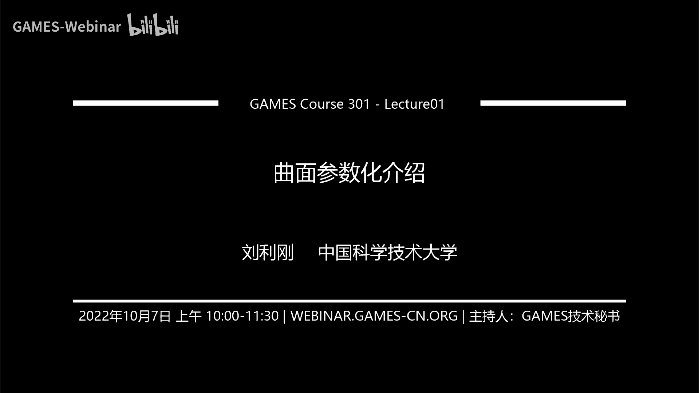

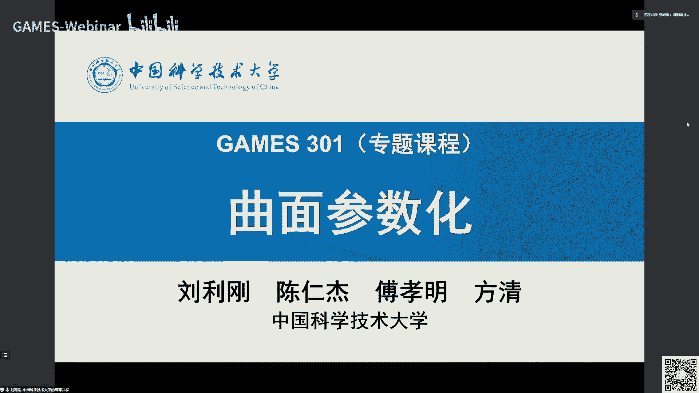

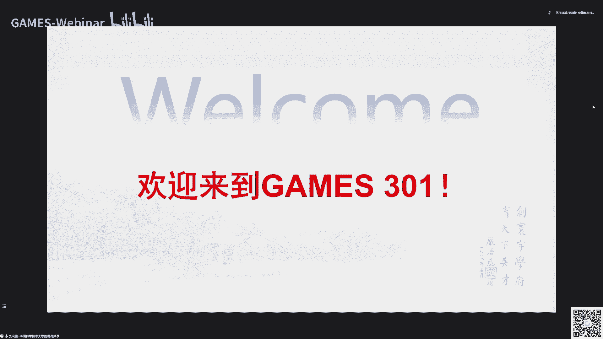

# GAMES301-曲面参数化 - P1：Lecture 01 曲面参数化介绍 📖

在本节课中，我们将要学习曲面参数化的基本概念、核心应用以及主要方法。课程将从宏观角度介绍这一几何处理与建模领域的重要专题，为后续深入学习奠定基础。

## GAMES在线课程与301专题介绍 🎓

GAMES是Graphics And Mixed Environment Symposium的缩写。这是一个面向图形学及相关领域的在线平台，创建于2016年。平台坚持每周举办高质量的在线学术报告，并开设了一系列在线课程。

在线课程分为不同系列。100系列是基础课程，帮助初学者快速入门。200系列是高级课程，讲解更加深入。从今年开始，我们开设300系列的专题课程，针对图形学中的特定重要课题进行深入、全面的讲解。

GAMES301是专题课程的第一门，主题是曲面参数化。本课程由中国科学技术大学数学学院的四位老师共同讲授，计划通过十节课全面介绍曲面参数化的技术细节。

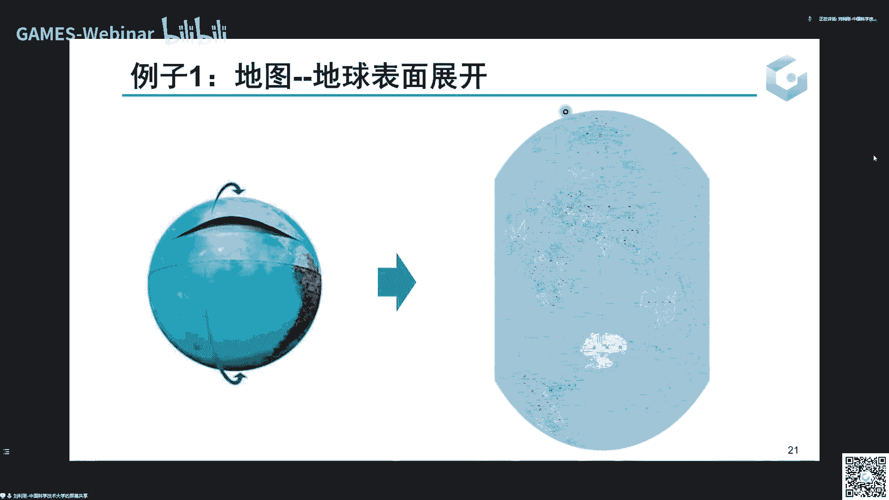

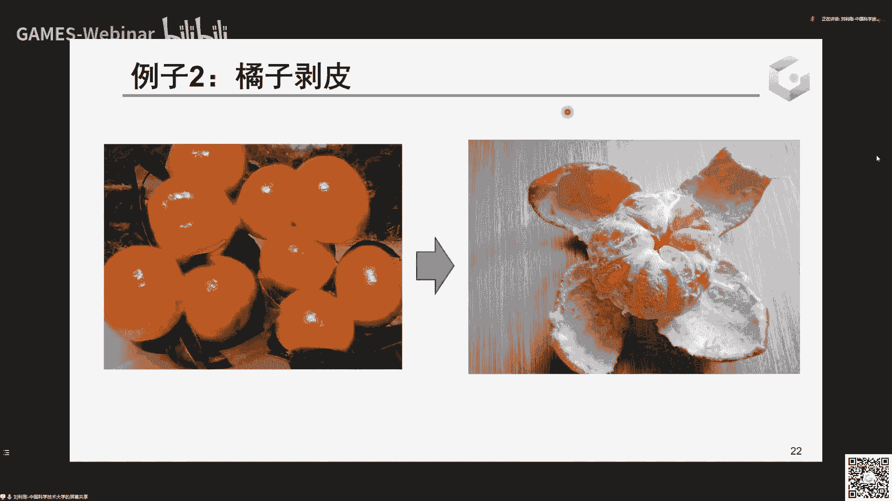

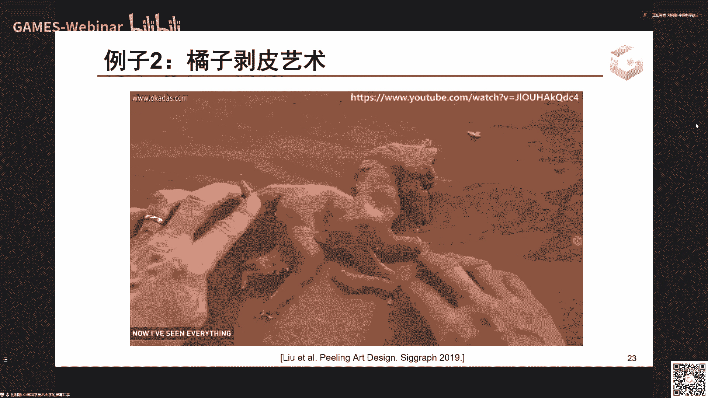

课程安排如下：首先由我进行介绍，后续由傅晓明老师讲解面向离散的参数化技术，陈仁杰老师讲解连续性的参数化基础，方谦老师讲解共形参数化的基础。课程包含四次作业，助教会认真批改并提供建议。

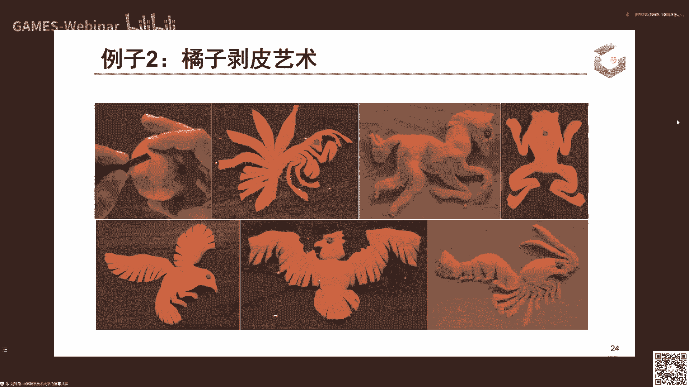

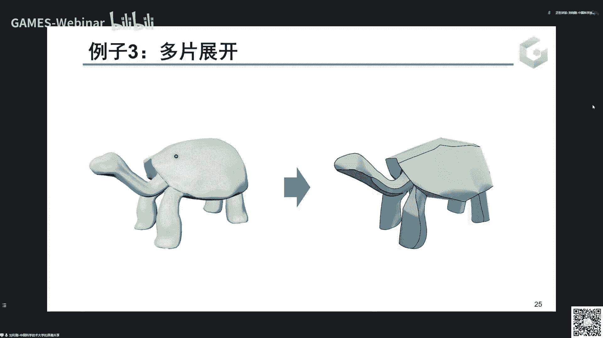

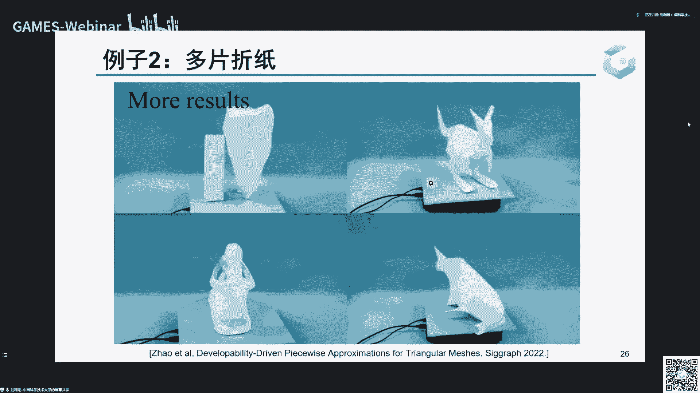

学习本课程需要一些基础知识，例如微积分、数值方法、优化以及微分几何的基本概念。如果对某些知识不熟悉，可以在学习过程中边用边学。

## 什么是曲面参数化？ 🗺️

曲面参数化，直观来说，就是将一个三维空间中的曲面“摊平”到一个二维平面上，并建立点对点的一一对应关系。

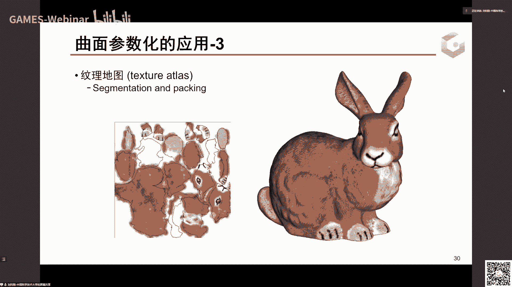

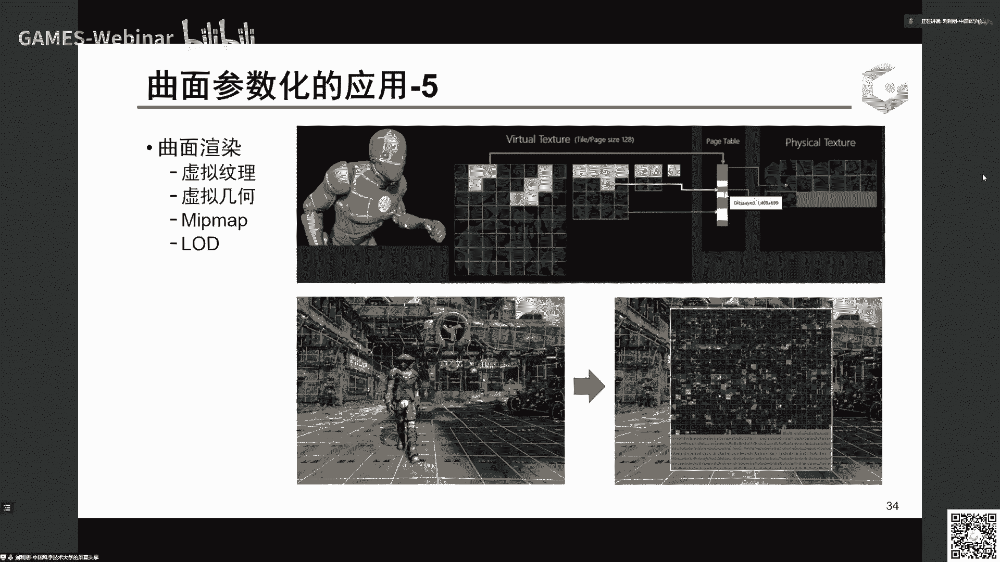

一个经典的例子是世界地图。地球表面是一个三维球面，而地图是二维平面。如何将球面展开成平面地图，就是参数化问题。不同的展开方式（如横版地图或竖版地图）会保持不同的几何性质（如角度或距离），适用于不同的应用场景。

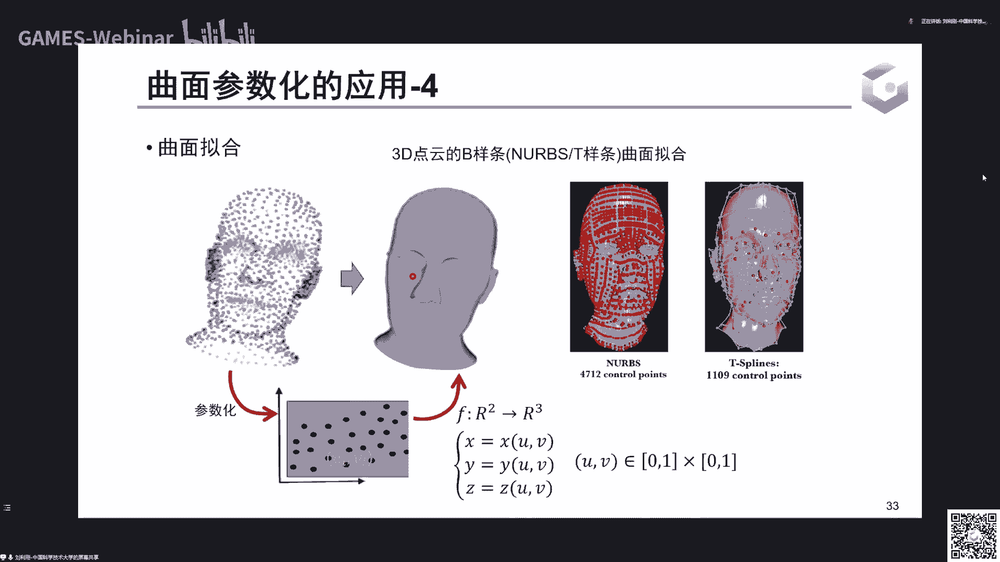

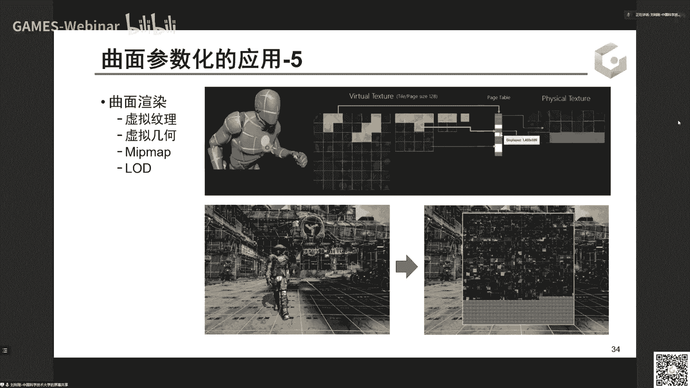

另一个生活例子是剥橘子。将一个封闭的橘子皮展开成平面，如果沿着特定的割缝切割，甚至可以展开成预期的图案（如小动物）。这展示了参数化在控制展开形状方面的应用。

在数学上，曲面参数化的本质是构建一个从三维曲面（本质上是二维流形）到二维平面区域的映射 **f: R³ → R²**。这个映射需要是连续且一一对应的（双射）。

## 曲面参数化的核心应用 💡

参数化在计算机图形学和几何处理中有着广泛的应用。

**纹理映射（UV映射）**：这是参数化最直接的应用。通过将三维曲面展开到二维平面（称为UV空间），我们可以将二维图像（纹理）上的颜色精确地附着到曲面的对应点上。这张UV图就像是曲面属性的一个代理，不仅可以存储颜色（纹理），还可以存储法向、材质属性（如金属度、粗糙度）等其他表面信息，极大地方便了编辑和处理。

**几何拟合**：在曲线曲面拟合中，需要将三维点云赋予二维参数坐标，才能用参数曲面（如NURBS）去逼近它们。参数化是拟合的基础步骤。

**虚拟几何与层次细节**：通过参数化，可以将复杂的几何信息编码到二维图像中，利用图像处理技术进行压缩、传输和多分辨率绘制。

## 如何度量参数化的好坏？ 📐

一个好的参数化需要满足两个基本要求：**形变尽量小** 和 **无翻转/无重叠**。

**形变度量**：映射在局部会产生形变。我们可以用映射的雅可比矩阵 **J** 来分析。雅可比矩阵的行列式 **det(J)** 度量了局部面积的伸缩比例。**det(J) = 1** 表示保面积，**det(J) > 0** 表示未发生翻转。

更精细的形变可以通过仿射变换的奇异值 **σ₁** 和 **σ₂** 来度量。它们代表将一个无穷小圆变换为椭圆后的长短轴长度。
*   如果 **σ₁ = σ₂**，映射是保角的（共形）。
*   如果 **σ₁ * σ₂ = 1**，映射是保面积的。
*   如果同时满足 **σ₁ = σ₂ = 1**，映射是等距的（可展曲面）。

**无翻转与无重叠**：翻转是指三角形在映射后改变了朝向（**det(J) < 0**），这会导致纹理出现“鬼影”。重叠是指曲面上不相邻的区域在UV平面上被映射到了同一位置。好的参数化必须避免这两种情况，即保证映射是局部单射且全局双射。

## 曲面参数化的主要方法 🛠️

参数化的求解方法主要可以分为三大类。

**线性方法（Tutte映射）**：这类方法要求将曲面边界固定到一个凸多边形（如圆、正方形）上，然后根据拉普拉斯方程求解内部顶点的位置。该方法实现简单，且能保证无翻转解的存在，但往往会产生较大的形变。

**基于优化的几何方法**：这类方法通过最小化一个定义在网格上的形变能量来求解参数化。例如：
*   **保角参数化**：最小化角度畸变。
*   **保面积参数化**：最小化面积畸变。
*   **尽可能刚性参数化（ARAP）**：最小化每个三角形的刚性形变。

这些方法能得到低形变的结果，但优化过程本身不能保证避免翻转，通常需要后处理来修复翻转的三角形。

**保证无翻转的优化方法**：这是近年来的研究热点。该方法从一个无翻转的初始解（如Tutte映射结果）出发，在优化形变能量的同时，严格约束每个三角形的雅可比行列式大于零。这通常通过将 **1/σ₁** 这类项放入能量项（障碍函数）来实现，当三角形趋向退化时能量会趋于无穷大，从而阻止翻转发生。这类方法能产生高质量且无翻转的参数化结果，但求解是一个带约束的非线性优化问题，计算复杂度较高。

## 参数化的扩展与思考 🧠

参数化的思想可以扩展到更广泛的领域。

**映射到其他域**：不仅可以映射到平面，也可以映射到球面等其他曲面，或者构建两个复杂曲面之间的一一映射（用于兼容网格生成）。

**高维数据与流形学习**：参数化的本质是发现高维数据的内在低维结构（本真维度）。例如，一个三维空间中的螺旋线，本质上是一维的；一个三维的曲面，本质上是二维的。从高维观测数据中寻找其低维参数表示，就是流形学习或降维的核心问题。现代深度学习方法中的自编码器，其瓶颈层学习到的潜变量，就可以看作是一种数据驱动的参数化。

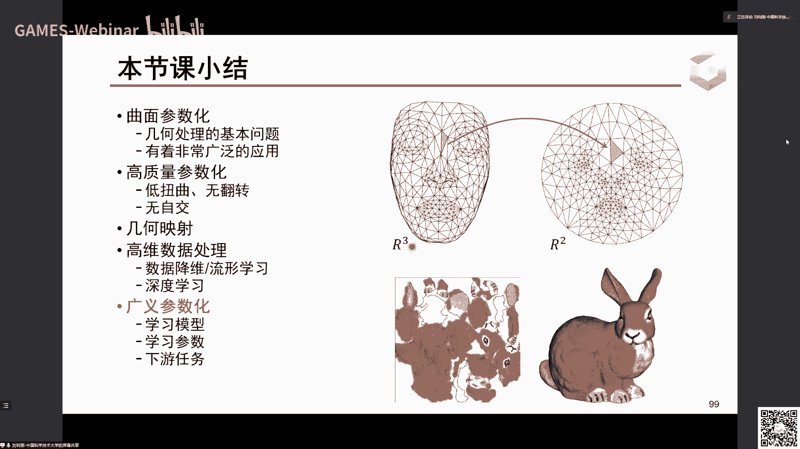

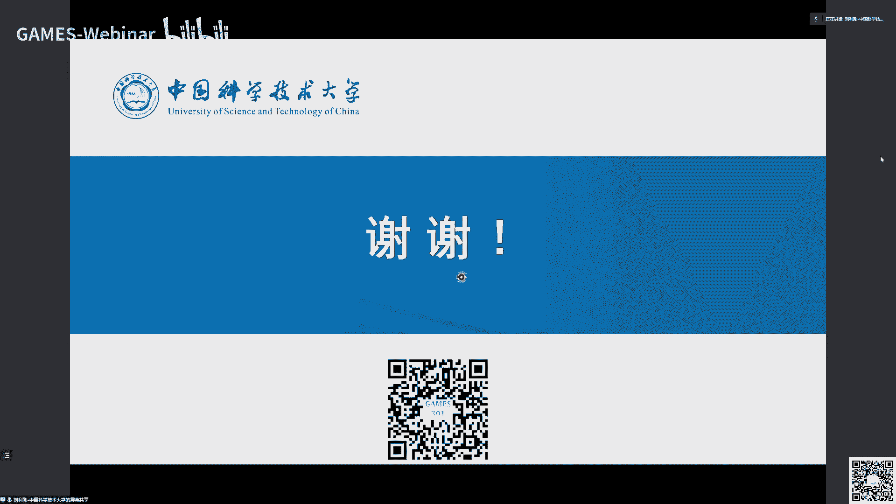

**端到端的参数化学习**：传统的参数化与下游任务（如纹理映射、拟合）是分离的。未来的趋势是将参数化作为整个处理流程的一部分，与下游任务联合起来进行端到端的优化，以获得针对特定任务最优的映射。

## 总结 📝

本节课我们一起学习了曲面参数化的基本概念。我们了解到，参数化是连接三维曲面与二维表示的桥梁，在纹理映射、几何拟合等领域有根本性的应用。一个好的参数化需要权衡形变大小并避免翻转重叠。主要求解方法包括简单的线性方法、能产生低形变的优化方法，以及能严格保证无翻转的最新优化方法。最后，我们从更广义的角度理解了参数化作为数据本质维度发现工具的意义。

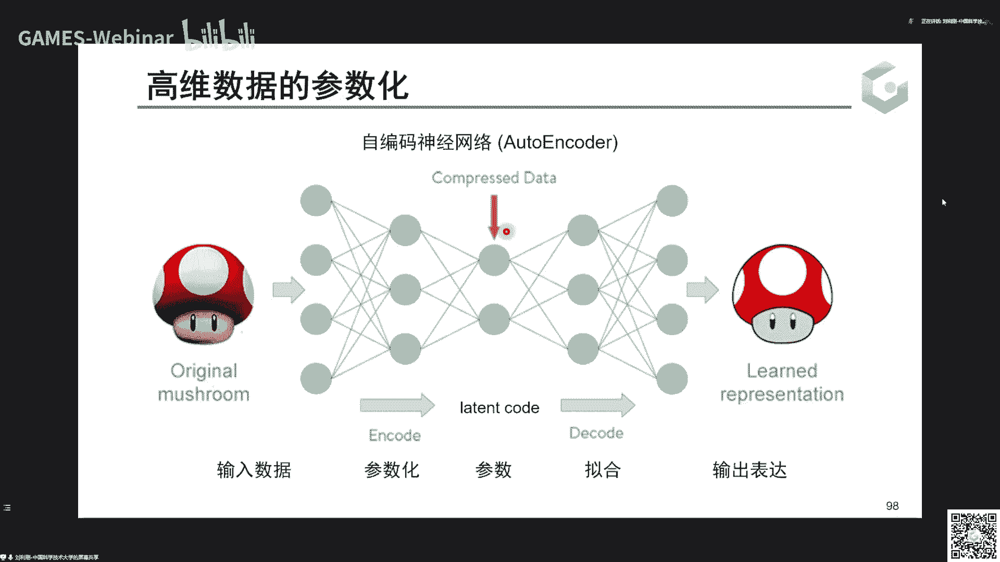

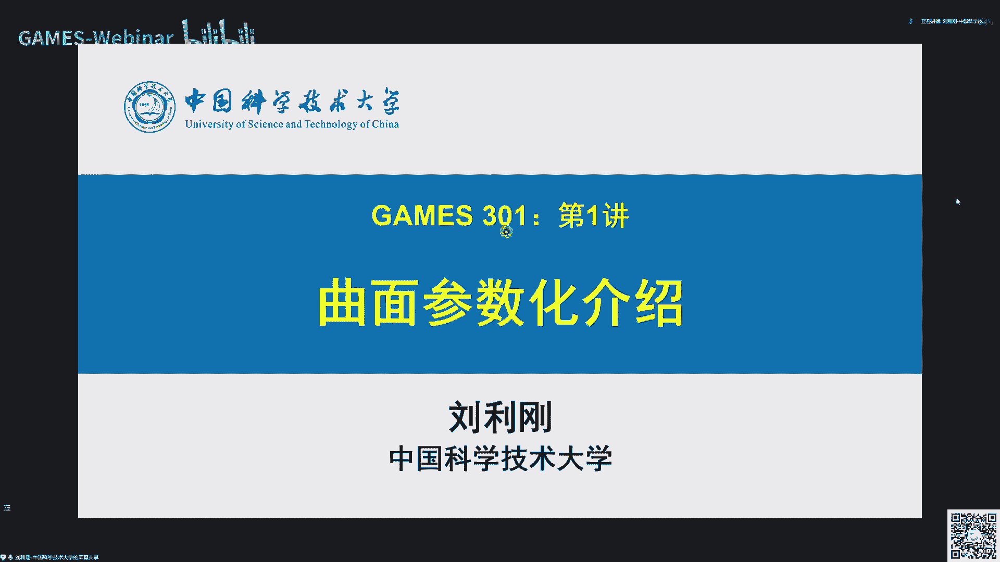

在接下来的课程中，其他老师将从离散、连续、共形等不同角度，深入讲解曲面参数化的各项技术与前沿进展。希望大家能通过本课程，掌握这一强大工具的核心原理与应用方法。