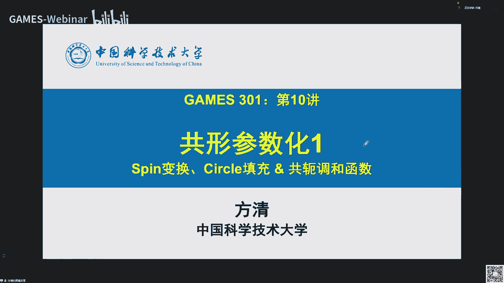
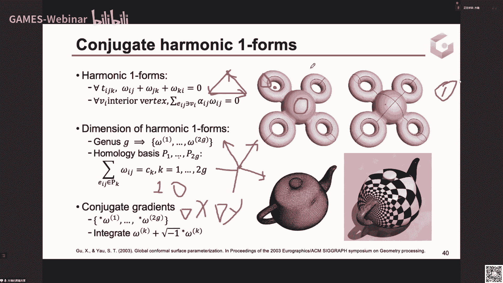

# GAMES301-曲面参数化 - P10：Lecture 10 共形参数化1-Spin变换、Circle填充&共轭调和函数 - GAMES-Webinar - BV18T411P7hT

那欢迎大家来到今天games 301曲面参数化专题的第十讲啊，大家上午好，从今天开始，就是我们要开始这个曲面参数化专题中，共性参数化相关的这个内容的一个集中的一个三讲内容，今天是第十讲，后面还有两讲。

11讲和12讲，然后今天这一讲主要给大家介绍共形映射的这个微分性质，以及跟它有关的一些参数化的离散算法，像sp变化呀，sl填充以及共和调和函数等等，然后下周的第11讲。

我们会讲共性映射在曲面内运方面的度量，表示相关的这种性质和参数化算法，然后最后一讲我们会讲一个具体的应用，就是在共性参数化中，用来减少这个参共同参数化的面积，扭曲的这个追齐一点生成问题的这个系列。

这个相关的一些研究一个系列，然后我们知道这个共性映射是有非常丰富的理论知识，以及广泛的应用的，就是说我这里还是只是回顾一下图形学，以及跟我们现在这个曲面参数化专题这个密切相关的，这个十几年的研究工作。

然后有关共形映射，其他的这个应用啊，我会在介绍什么时候，什么是共形映射的时候，简单的提一下，大家有个粗略。

的印象就行了，啊那我们开始今天这一讲的内容，然后首先我会介绍什么是共性形式，然后过形映射的这个最关键的性质就是保角性，它的意思就是保持映射前后的这个角度不变，就是说我们要用数学的语言科幻。

它在第二节中就是我们需要在连续的情况下是需要用到映射的微分的，然后通过微分我们可以推出曲面共形映射的这个克星里面方程，然后它最关键的这个今天的这个内容的一个核心的一句话。

就是共形映射在每一点处它都是一个相似变换，就是旋转变换，和伸缩变换的这个负荷，然后后面这三角形就是利用这个今天讲的这几句核心的话，共享映射的这个微分效率，然后去设计的这个共性形变啊。

以及参数化的这个相关的一个离散的算法，那我们来看一下什么是空气意识，我们首先回顾一下第一讲里面付老师讲过的，优化角度扭曲的两个参数化算法啊，第一个是a b c算法，就是它的出发点是三角形的角度。

决定了这个uv参数坐标，就是如果我们知道参数化网格，这个uv网格的所有三角形的内角角度是多少，那我们的这个参数化网格再相差一个整体的平移和伸缩，下面它就是一样的，那所以这个算法就是分成两步。

就是我们先确定平面三角形的所有角度，然后再通过角度去重建这个uv坐标，然后这个ibf的这个最关键的核心，前面的算法就是我们如何去确定这个三角形参数化到平面上面的，这个角度。

由于平面三角形就是平面三角网格，它的内部顶点这个一圈的这个三角形的角度和就是这个白塔i j k，然后这个顶点一圈求和，它必须是阿派，因为它在平面上，所以我们在最小化这个角度扭曲。

我们需要最小化这个角度扭曲，angle preservation，然后我们需要对输入的这个网格，它输入网格i顶点的这个r放i j k，它都和它不一定等于二派，因为它是在空间中的，它可以是大于二派。

也可以小于派，然后我们就是要保持这个我们的目标，贝塔i j k跟阿尔法i j k要尽可能的一样，然后要他求合适阿派，然后一个最简单的想法就是我们对阿发i j k进行一个同等比例的，这个放松。

就是让阿尔法a j k乘上一个缩放因子，使得它后面乘完之后，这个求和是等于派对于内部定义，然后对于边界顶点的话，就直接让这个，那么我们想要的这个贝塔i j k等于二fi j k就行。

但是这种简单的这个让设计这个表态i j k，他不一定能够在平面上组成，三角网格这个付老师也说过，就是说你这个这样设计的这个贝塔i j k，它只满足这个内部的这个顶点。

求和是一级圈的这个角度和求和是ipad形式，它要构成一个三角形，它首先它得是一个三角形，任意一个三角形，它的内角和首先就必须是求和，是180度，就是派对吧，这是第二个条件。

另一个条件就是第一讲里面讲的这个重建约束，就是说顶点i周围一圈的这个三角形，相邻边长的相邻边长这个长度之比，然后绕一圈乘起来等于一，比方说我们这里看这个绿色的这个点，如果看。

这个i k跟这个右边的这个三角形，这个我现在的这个笔指的这个地方，右边的这个三角形，它绿色的边比上红色的边，然后再乘上下一个绕逆时针走一圈，这个的三角形的绿色的边比上红色的边，反正如果这样一沉的话。

这两个绿色的边和红色的边就会消掉，你这样绕一圈过来，它正好所有的都抵消了，那这个乘积就是一那用正弦定理，我们就可以把这一个边长之比表示成这个绿色的这个角，比上红色的这个角的角度之比。

就表示成他们三in c它的这个角度比值之比，然后就是重，建约束就是说我要求这个角度之比，这个在每一个顶点，这个求和sin的这个sin值之比，sin值之比，这个球机它必须是等于一的，如果它不等于一。

就是说我们会存在一个三角形和它相邻的三角形上面，在这个边长不相等，比方说i j k它在左边的这一个这边画了个例子，就是它左边的这个黄色的三角形和它相邻的这个三角形。

i j k他们在i j上面的边长不一样，这就是违背了重建语数的一个情况，然后这次就是我们ibf的算法，就是计算跟这个贝塔最接近的这个c塔，然后c它要满，足这三个成这三个月数啊。

它是一个解一个非线性的一个最小二乘问题，然后另一个最小化角度扭曲的这个参数化算法就是mr quare conformal map，就是l s cm，他这个角度保持角的话。

它是通过一个平面的相似变换来达到控制角度里去的，就是说我们对输入网格，它在空间网格的这个任意一个三角形t i j k，我们可以把它固定到xy平面上，然后让这个jk的这条边跟x轴是重合的。

反正这个时候如果我们用相似的变换，把这个xy坐标转换成这个纹理坐标，那么它的这个每一个三角形的这个角就是严格保持的，此时这个因为平面上的这个相似变换，就可以写成一个旋转正cos c的-3 c的。

三in 7的cos c的这个二阶旋转阵乘上一个呃，伸缩变换s4 是大于零的，然后这个的形式，所以它的这个x就是uuv坐标，关于x y，它的梯度雅科比，因为这个线性变换，它就是它的梯度。

雅科比要等于这一个相似矩阵，所以我们就得到了这个偏u偏x等于偏v偏y，偏u偏y等于负的偏v偏x这一个的两个等式，然后我们这边也是只能用最小二乘以上面的优化，就是它是因为它是在空间到平面上。

它肯定是有角度变化，所以就用这个最小二乘乘上一个面积，加权这个面积选择ai j k就是三角形的权重，它相当于在三角形上进行一个积分，然后由于这个上面的这个能量对它进行最小而成的话。

它是可以出现退化的情况，就比方说u和v都是一个常函数，那这些梯度都是你那这个能量就直接退换，u和v a就是一个顶点，就是所有的网格所有顶点都映射到一个uv坐标，所以它为了解决这个退化。

就是还需要在网格上随意去选取两个点，把它固定到这个平面上不同的两点上面去啊，这样的问题就是说我们去选取这个点和它固定点的这个选择点，顶点不一样，以及固定点的这个位置不一样。

也会导致你最后参数化的这个形状他不一样，然后它也会就是扭曲，它也会不一样，然后从上面两个跟共形映射相关的这个参数化算法，我们可以看到，共形映射最关键的性质，就是保持映射前后的这个三角形的这个角度不变。

在离散的时候，就是如果是连续的情况，我们要求每一个地方它的角度都是普遍的话，那其实它会把这个映射先把一个质变网格变成一个曲面网格，有这个后面再讲连续映射的时候也会看。

就是说所以离散网格上面去定义共行参数化算法，一般都没办法做到完全的这个角度，严格不对，它都是通过优化最小二乘以下的角度扭曲来达到的，然后供给映射的保角性使它有着非常广泛的意义，右边这张图啊。

简单的介绍了几个共形映射在图形学和几何处理里面的一些场景音，然后以及几何处理中网格变形过程是可以保证这个网格带纹理的，网格上面的纹理的，它的轮廓是被保持住的，就是走向是保持。

然后共性映射也可以用来做重新网格化，重新网格化，我们知道在它的主要的出发点就是在有限元分析里面，如果你用的网格它质量很差，它有一些很小的锐角和很大的钝角的话，把有限元求解这个矩阵。

通常解的这个矩阵它的条件数就会很大，然后就影响数值求解的精度，然后这时候我们就需要对这个网格进行一个重新网格化，使得它的角度都比较，就是正常就不能有太小的锐角和太大的钝角。

然后这个问题就是可以用共形映射来做，因为共形映射是报警的，我们可以先通过共形映射把这个网格映射到平面参数与，因为在平面的参数域上面，我们有很好的这个比罗伊三角化工具，就是能够提升三角形网格的智能。

然后再通过逆映射把平面再运回到去，这样的话在曲面上生成的这个网格，它也是一个质量很好的网格，另外一个就是在形状分析里面也可以用到共性形式，比方说判断形状之间的相似信仰，然后描述形状的特征啊。

形状匹配和注册，都是有相关的研究，然后我们接下来就是因为要讲介绍一下共性映射它的应用嘛，还是他要发散一下，它有很多其他的音，就是说比方之后再设计制造你，然后在平面制图中，我们就是在地图绘制里面构建一。

这是可以保证方向的，就是可以提供很好的方向之一，然后过去映射它会有加一个无穷小的圆，映射到无穷远远的性质，然后比方说在建筑领域自由曲面上面去用圆在曲面上做这种装饰设计。

那就是可以用共形映射来使做这个算法的设计，然后共形映射也可以用来做曲面场，就是曲曲面上的这个向量场，而向量场在艺术设计里面可以用来模仿这个素描的这种笔触啊，还有在卡通设计。

卡通角色设计里面可以去模仿这个毛发的走向，对过去一直在这上面也适用于新应用啊，另外的工程预设还可以在这种3d制造方面，它可以在曲面上构造一些相互垂直的光滑的条纹叶状结构，然后这个叶状结构它是以编织。

就是编织的那种工艺是正好吻合的，所以你可以用过去映射来制造跟输入曲面的这个编织品，共性映射，它还可以在计算仿真领域有一些音，比方说在流体方面，关联性是可以模拟粘性液体在不稳定表面的这个流动。

比如水流在沙滩这种表面上面，就是一些水流在沙滩表面上面的流动线路，可以用过去一次，还有就是柔性材料的这种制作，就是我们可以对金属薄板进行一定的图案切割，它就类似于一种柔性材。

然后这种材料跟每一点处都可以，这种空隙处都可以进行各项统计的申诉，因此可以用共性映射模拟这一类材料的物理形变类，用我们常用的这个top优化是在平面或者空间中的规范的这种网络，平面就是四边形。

这个grade就空间就是立方体的这个贵了，如果你对一般的曲面想去做这个拓扑优化，那一个比较好的方法就是我们把曲面共性映射到这个体面，遇上那个正方形或者长方形遇上，然后我们对这个长方形域进行拓扑优化。

然后再把这个拓扑优化的这个结果反应是回这个曲面，就可以设计出在曲面上拓扑优化的这个图案，然后共享就是就是介绍了什么是共形映射，它的最关键的性质是保角性，然后和它的一些广泛应用后。

我们下面就要需要用映射的这种微分的这个数学语言来描述，这个严密的就是描述在数学上面来定义这个过程，因为你了解了这个映射的这个微分和已知相关的这个科学理念方程，能够加深我们对共性映射的理解。

然后最关键就是那个共形映射在每一点处都是一个相似变换，然后抓住这样的话，抓住这一点就是后面三个算法就是各种各样的离散的构形形式的，你算算法它背，后的原理其实都是从这一点来出发的。

然后之前提到的公离散的共形映射，是通过三角形的这个内角角度的最小二乘来计算的，然后三角网格结构，它是要求你把一个输入的三角形映射到文理参数域的这个uv坐标，对应的这个你看三角形上。

它本质还是用三角形上面的这个分片线性函数来计算这个意式，来逼近这个公式，是这就导致你的映射就是具有一定的刚性，就不可能做到完全的保持角度一致，用输入的角度一致。

就比方说这里如果我们给了这个所有三角形的这个类角，我们在确定三角形的一条边上画，我们就可以通过这个两个三角形的这个正弦定理，然后把其他那边确定出来，再依次的去编辑所有的三角形。

最后把整个网格的边长都确定，那这样的话这个网格其实它的形状也就确定了，所以你在离散的话情况下，他的这个共性映射就会显得有一定的钢琴reading，就是它会就是你不能严格做到保障。

如果你要求形形状有一定的变化的话，但是当对于连续的共性影视，它其实是可以做到这个光滑的每一点处都严格报价的，我们来看一下光滑的这个连续的这个共性映射，它的这个保角的角度是怎么来计算。

就是在你站的三角形上面，就是三角形的内角，那在连续的话，它其实就是以p点为起点，比方说在平面上就是以p点为起点的两个方向向量，然后他在映射前后，它只是个向量之间的夹角。

任意两个方向向量之间的这个夹角它都是保持不变的，它左边是垂直，右边也是垂直，而在流行上面就是p点这个切平面上面的两个切向量，然后这个切向量在映射前后。

映射到新的这个曲面上面的一个p点的支出的切平面的新的切片，那这个切向量之间的夹角在映射前后也是保持不变，因为连续映射它不再有网格的这个限制，它是可以做到严格点处都是这个向量之间的价格都是一样的。

然后我们来看一下怎么去定义这个向量之间的映射，现以平面为平面应力，如果有一个f它把这个r中的r方就是r空间平面印到r2 空间，然后他把p点印到fp点，那他把这个向量p点以p为起点的这个方向。

向量的这个v它需要映射到gf gf v的这个嗯，向量的计算就是通过这个方向导数来给出理，就是t加上t为减去f p，然后在t趋向于零的时候除以t在t趋向于零的这个方法等，那就是df v的这个音质。

然后这个方向导数由于f 12的话，这个方向导数它也是2r等，于相它可以用ta展开对f在p点进行它的展开，我们就可以看到这个df v它其实就是f的甲和比，乘上这个v的这个项目。

所以这个df v它是关于v是一个线性算，然后此时保角性其实就是任意两个向量在微分映射前后夹角不变，就是c tv w是等于c3 映射df v，然后映射df w这两个向量之间的这个价值。

然后这里面的theta一般是这个有向角，需要说一下，就是它表示从v逆式跟这个旋转到w上面这个角度，如果是这样顺势的话，w在这边你得绕到这一圈过来，如果你是五下角，那你就可以把这个w沿着v做一个对称。

那这样的话这边的这个w跟v的夹角跟他是一模一样的，但这种就是一般是会导致一个定向反转的问题，我们用三角形来类比，就是如果你保证一个三角形，它的这个三个内角，它的角度不变，你把它翻个转。

它的三个内角也是严格也是不变的，所以它就会有一个三角形定向会反转的问题，所以在这里面一般就是保持的是一个有相机或是无相角，那我们怎么样去构造，就是去表示这个平面中这个向量的旋转。

一个简洁的方法就是用复数去表示，然后我们知道复数有一个附加模长和附加表示，然后给了你一个复数v，然后对它乘上一个新的复数v，其实就是对这个v进行一个z这个俯角。

的一个旋转就是z v的辅加c塔加上一个z的这个附加，有新的思想，新的方啊，得到c大加y啊，在对v的这个长度进行一个按v的模长进行缩放，缩放z的模长被就达到了零。

所以用负数来表示这个旋转是一个非常方便的一个工艺，然后那这样的话角度保持向量在微分映射前后的这个角度保持，就可以写成v的逆，就是v的负数的幂，然后乘上w的这个负角等于gf等于gf v等于零。

然后乘上dnf w的这个负角，对于任意的v和w就是以p点的任意的v和w组织对，就是这一点不，对，然后由于这个背后w的任意性，其实这个我们可以推出，不光这个俯角线，它们的模型其实也是严。

最后就是这个他们两个v的逆乘w，这个负数要等于df v的这个力乘上df w就等于这个，然后这个的话画一下，就是下面的这个负向性，就是说我们df不仅对于向量v的线索。

你对它进行一个旋转和伸缩的这个复数作用，它也是线性的，可以给它提出来，这个就是普遍意义上面的这个复平面上的特性来方程，我们来说明一下，就如果我们对f把它拆开写成fx加ify的形式，那df关于i的。

方向导数就可以写成这个关于y的偏导数的形式，加上复数，然后tf一也是这个形式，这里面的bgi是实数，然后那颗星里面完成，我们可以用刚刚的这个负向性，就直接就表示成d f i等于i d f一负线性。

就是把这个虚数单位提出来带进去算一下，它其实就是这个科技的方程，就是我们在离散的时候用到的那个相似变换的那个大师，就是gf，它是一个相似表，另一种看法就是我们对这个gf v直接把它的这个v提出来。

就是df v就等于df一乘v，那对所有以p为起点的这个切向量v，都是给它共同作用一个df一的负数，所以就是df一的负数，就是对应的这个旋转和伸缩变换，所以对每一个点p处，它这个都是一个相似变换。

然后我们需要注意的是，这个它相似变换的一个出发点，就是每个点处局部它都是一个旋转和伸缩，所以它会把无穷小的这个圆映射到无穷项目，我们这里面用宏观的这个原因来表示，他就是sol parting算法。

就是从这一点来出发的，他的就是用离散的这个一个个小圆去把这个正方形去填充满，然后如果我们要求一个你和一个逼近一个共性，就是那这个映射一定会把这个就是在这个小圆的半径越来越小，越来越小的情况下。

这个是逼近于这个年续的风气的一个同时映射过来，这个保持这个每个圆它还是一个圆的那个映射，一定是一键连续的不行，那么在后面会提，然后但是这种就是它对于宏观的原因，它不仅保持，那我们肯定是一个简单例子。

就是我们存在一个共性，因是连续供给进这他把一个圆边界映射到椭圆边界啊，对这个例子它这个宏观的这个研究会应得到错误，但是有一类特殊的这个共性映射是可以做到对任意宏观的这个语言，它都成立的。

而不是指无穷小量，那就是复平面上的莫比乌斯变换，这类变换它的具体形式，我们会在下周的第11讲会讲到，然后这里就不清楚，那定义的这个平面上的这个规范映射，以及它对应的这个推出对应的这个可行量方程。

就每一点都是相似变换，那我们就需要去定义流行上面的这个映射，就是这个微分映射又如何去映射流行上面的切平面，切切向量，切平面中的切向量到一个新的那个f，就是映射到n上面的这个区域里面的切向量怎么定义。

这个问题就是说我们不能直接向平面上直接用p加tv的这个形式，因为你p加tv跟任意的t它是沿着这个切平面去移动，它就离开了这个流行的这个表面，你缺f的作用，它就就就你看到这个f调作用。

所以一个类比的方法就是我们在，就是这个曲面流形m上面去找一条曲线过p点的这个曲线参数曲线，使得这个参数曲线它的伽马零是等于p的，然后伽马一匹零它的切向量就是这个参数曲线的这个切向量。

它正好是等于这个v就是七里面中的一个的情况啊，那这样的话我们就可以把df vt成这个gmt，随着这个t去逼近，趋向于零，负达拉c减券负达运营的这个导数，它是一个1f复合成伽马之后的这个曲线的这个期限。

但这个这里面需要注意的一个点，就是我们需要说明的一个点，就是这个映射的定义，它与gm的这个选取是没有关系的，因为你过这个点，然后以这个切向量，以这个向量为切线的这个曲线，它可能有很多条。

然后我们要说明这个d uv跟它无关系，这里面就需要用到这个流行在这个性质就是流行的话在每个p点处，每个p就是每一点的p的小鱼类，它是存在一个一一对应的这个参数域的。

就是存在一个参数域到这个p的1p的小领域的这个同胚映射，一射fine是可逆的，然后利用这个去说明，可以说明这个键会飞，它是一个跟感冒的选取是有无关的，那如果说说明了这，一点之后我们就通过这样的定义。

我们就可以有一个那曲面曲面就是流行上面这个映射的微分，他把p点处的切平面中的切向量映射到sp点处，这个切平面的这个切向量，那我们也可以说明这个点分为它是一个关于这个切向量，它是一个线性。

跟刚刚平面上面是类似的，然后那平面上面的克星里面方程回顾一下，刚刚说的就是它主要用的就是d f i等于i d f1 ，就是我们对它的一个一的这个一一是这个实轴方向的这个向量。

乘上一个i其实就是它对它进行一个沿着x y方向这个平面，在x y平面上进行一个逆时针的旋转取出，然后呢，我们需要在空间中这个呃，你们可心里面发现它其实可以表示成这个类似的形式，就是说我们在p点处。

这个m上面的流行p点处的这个切屏当中的一个向量v，我们把它逆时针旋转90度，就是在切平面上，逆时针线就可以就是绕着这个p点，以那个右手定则，然后去逆时针旋转90度，它的微观的映射是等于它的这个映射过后。

去照着这个n点的这个法向去逆时针旋转，就处理这个就是复平面上面的这个个性装，我不是在流行，这个是流行上面的这个科技言方面，可以看出来在这个流行上面的这个表示，它没有复平面上面的剪辑。

因为父母面上它是有一个一致的，这个表示旋转的方向的，就，是一个虚数单位i，但在流行上它是跟这个f p跟p这个位置的这个法向是相关的，这个法向就是由f这个映射拒绝他就是一个耦合的这个关系啊。

那你这样去利用这个去计算，它虽然也是一个局部，每一点局部它都是一个相似变换，但是你很难去计算，那有没有一个更简单的方法去表示这个流行间的微分映射的，这个广角关系。

有就是我们后面要说的这个in response，就是我们知道这个为什么我们在这要特殊提一下4k大屏模式，这个主要讲的时间变化，它主要讲的是r3 中的嵌入，的曲面到r3 中的曲面的共性。

它主要描述的是共性形象，而我们这个课题它主要说的是参数化嘛，参数化是指二三中的这个曲面流行，我们把它参数到二维中，然而它是一个打3~53的，他还是一个利用到这个，还是还是嵌入在空间中的。

不是那个参数化的那种利润表示，因为他这种表示它是一个唯一的区分，就是研究工作中里面一个外运的去表示共性映射的一个方法，就是就是所以在这里面我们还是要单独去提一下，所有有必要去单独去讲一下。

然后在平面上面去表示旋转和缩放，我们使用的是这个复数结构，就是对于向量进行旋转和绳索，我们用的是复数解，那在空间中有没有很好的去表示这个空间向量的旋转和伸缩，有就是用一个四元数的。

类似于负数的那个四元数解，就我们会说一下什么叫什么是四元元素结构，先说一下什么是四元，四元素结构与复数结构是类似的，然后相比于负数结构，它只有一个虚数单位，二四点数结构有三个虚数单位。

应该是i j k这三个虚部单位之间的满足的运算关系，是下面紫色框给出的运算关系，然后这个运算关系跟负数就是有一个本质上区别，就是你把一个四元数做乘上一个四元数和它们两个之间右乘电脑顺序。

他们的只是不一样的一个看法，就是你对这个i j k你去看它的虚部单位i j k等于-1的话，你如果同时对它同时又成一个，你就，会得到i j等于k但是你如果先同时对它做成一个i。

然后再同时对这两边再同时组成一根线，就是你对它同时组成一个g2 g，在左边，然后这样的话你就会得到gi是等于负k的i j等于k加，i等于负x所以他们两个只是增加，所以四数你是不满足这个交换的。

你两个交换它的指示不能，而四元素跟空间中的旋转的关系就可以通过下面这个式子来解除，就比方说给出空间中的一个实数向量，就是给的空间中的三个空间中的一个向量x，然后它对应的四元数我们可以把它写成它的实部。

四元数的实部等于虚部，就是它的x的各个分量乘上了它的虚部单位加起来，然后如果他要绕空间中一个u的这个轴向量，你这个单位向量u因为u是一个单位向量为轴去逆时针去旋转c大角，那我们可以设计一个这样的四元数。

q是等于cos c塔，然后减去三in c大乘上u对应的这个向量，然后它对应的生产数的虚部单位，最后是新的q的四元素，那这个四元数它的模长是等于一的，可以单点直接就cos cos cos plc大。

加上38c加加v的，没法modem上之一，所以他的控就是它的力就是等于他的空了，那y就是我们要算出来的x关于u旋转其他角的这个旋转后，的这个向量y它就可以表示成这个四元数的这个对x这个四元素。

又乘上一个q的四元素，在左边上是有功二就算出来的这个四元数，它对应的这个虚构就是这个y相等，就可以用这个线路的方法来好好地表示这个空间中的这个旋转，可能你就可以把它直接传过来，交换一下的话，q。

q的根号就是一了，它就变成四五，那如果我们要把这个旋转在复合上一个伸缩的话，我们就可以对q乘上，一个伸缩因子，这样的话你这个新产生的这个万一品，它就是原先的c品装备，就是对表现的y伸缩的c p方面。

通过刚刚的那个四元数定义的空间中的旋转变换，我们就可以去定义这个sm formation in class formulation的概念就很简单，就是说我们在空间中有两个相互对应的这个曲面。

嵌入对应的曲面，它在f是它的输入的曲面，df u y是f u y是他另一个曲面，然后这两个曲面之间的这个切向量要满足一个，在m上面会有一个四元素分布。

正好对应于它气向量是乘上这个四元数六乘以一个四元数组成，它的工作就是对应的这个空间中的这个旋转和申诉，就每一点处的切向量，因为你拉姆达是在每一点处，它是唯一取一个值的一个四秒处的。

所以你对一个对任意的这个切向量，这个其实平面中的x绕一圈，它对应的都是同一个伸缩和旋转变换，所以这就导致这个df一个这个spin transformation，它一定是红的。

就是保持它的且向量之间的这个夹角也，但是现在问题就变成，我们如果要求这个空间中的spin transformation，就是去设计这个拉姆达分布，四元素在流行上面，曲面上面去给一个拉姆达分布。

但并不是所有的兰姆达它都可以在就是变换之后，这个d f e y都可以重新在r3 中之间存在一个曲面，给它画出来，这个就有点像我们对一个t就是一个梯度上进行一个变换，抵达变化成一个新的厂。

这个厂它不一定再是梯度场，就是他不一定还会有一个嗯，就是空间的这个函数分布，使得它的t6 等于变换后的这个程度都是不一定的，所以我们需要对这个就是内部。

就是我们需要对这个拉姆达就是平面上的这个四元数分布加一个限制，就是叫可靠性限制，它是狄拉克方程，它其实就是一个关于拉姆达的一个微分线性微分，然后他进作用减去一个食指函数乘上单m的都是等于。

这就是你如果一个单位的满足一个这个方程，那它就是在l3 空间中是有一个嵌入它的，它的微分是等于这个拉姆达表示在这个空间中的旋转作用和，表现在的性取向力，那满足这个方程去怎么去求解，这是一个问题。

因为如何拉姆达是相互关联的，这个问题就可以把它就是转化成一个特征特征值和特征向量的元素，就比方说我给了你一个肉，如果肉是严格满足这个迪拉克方程的，你去求他的一个特征向量，最小特征值的特征向量。

你就会得到这个伽马一定是零，然后nova就是对你roll的这个特征就是对应于递减轴的这个特征值，为你们通常讲的正好就满足这个方程，那如果你输入的这个肉是不满足这个第二个方程。

你这个gm就不是你它是一个最接近的，因为我们求的是一个最小特征值的特征向量，对这就是最小的这个特征值，这个感冒拉姆达是最小的碳酸值对应的特征向量，那我们就可以对书进行一个校正，加上一个答。

那这个新内容它就是满足这个跟这个我们求出来的特征向量，它就满足d减nm呢是等于的，你把它打码，就是你把这个小的打码给它移过来就行，那我们现在的这个去控制这个曲面在空间中的这个spin。

transport的变形的这个问题，就变成我们去只要去设计这个曲面上的这个热的这个实质分布就行，我们来给他一个肉，就去求他的这个d减肉，这个线性理想化的就是一个矩阵，一个矩阵的最小的特征值和特征向量。

然后对肉进行的矫正，他说不一定能叫正完之后就是一个对应的是空间中的一个啊，共形变形就是in x方面，那这个肉有没有几何意是有的，就是如果你可以把它理解为这个曲面上的这个平均曲率的变化，印度的变化。

它就是你对如果肉是满足这个迪拉克方程，然后你这个拉姆达对他作用，df对他的这个切屏切屏，空切平面中的这个切向量去做一个空间中的这个旋转，拉布达对应的旋转的话。

就会它是在变化后的这个流行上面的这个平均区域，跟原先的这个平均值乘上这个df的模长，这个这边的这个模式，其实d f的模长你就可以理解为这个嗯，一下网的上面的这个mac就是编程，它其实就是magic。

然后就是肉表示的就是这个平均体积的变化，黑板这个图也变，就是紫色，绿色的这个区域，它对应的就是我们输入的这个肉是大于零的点，紫色的区域就对应的都是小于零的地方，那我们作用过去之后。

求一个词transformation，我们可以发现这个紫色的区域就是它的平均区域变小，就是内凹凹下去，绿色的区域就是它的平均曲率增大，所以它会你要会往外凸，刚我们也提到这个嗯。

in transformation，它一定是考formal的，因为它是把这个切交量之间是在空间中进行了一个同一个区，里面的切向量在空间中进行了同样的旋转和伸缩，但是combo它不一定是tration。

就是对于一般的top，就是球面这样的同拓扑同归，于球面的这个必要的，它是这两个是等价的，但是对于gta的话，比方说对于tory这种他有combo，有combo映射，它是没办法用这种死变换来决定的。

曲面这个结构的，这几年就不细说了，大家知道一下就行，然后刚刚我们说的那个spring transformation spin变换，它是用来表示那个共性映射在空间中的那个形变。

那后面的两部分我们就专注于讲共性参数化的一些算法，首先我们就介绍sql party或者sl pan，我们说过这个共性映射在每一点处都是相似变换，它把每一点局部的这个无穷小的圆周映射到无穷小的圆周。

然后斯科肝病算法就是基于此难以上化工具，人生就是我们在区域的这个区域上去放置，比一个彼此相切切的这个很小的这个圆，然后如果有一个映射，它是把这些圆都映射到新的圆的话，然后把，边界映射到一个新的边界。

当我们这个圆就是不断去细分，就是说当我们对这个圆不停不停的去细分的时候，基本上它就是不停加密，就是圆的半径不停缩小，而且还是保持的话，那这个就去就会逼近到光滑的这个工信意识，这个是由你能保证的。

那这样我们就现在我们就看一下，怎么样去定义一个三角网格上面的这个sql p，结构就是给定一个三角网格k它的cpting是这样构造的，就我们在k的每个顶点去放一个圆。

圆的这个圆的圆心就是3500的这个顶点，然后以对于任意三角网格的这个边，如果这个边是连接两个顶点的话，那这两个顶点，以这两个点为中心的这个圆一定彼此相亲，然后对于三角网格的任意的面，如果有一个面。

它三个顶点，它是有三条边构成，那这三个边对应的这三个景点对应的这个圆，它一定是按照这边的这个方向是所彼此相切的，而且定向也是一致的，比如说是一直跟走向，那这么相切的框架也是一直能走向。

这下面就点了上面的这个确实这个sql看见一个，这个右图这个例子，然后那我们就可以看一下这个sql banking，它是呃存在的充分必要条件，它是可以保证的，就是说你给了一个三角网格k。

然后它是拓扑同胚与阳台的，如果我们去固定它的dg上面的每个点的这个圆心的这个半径，就是边界上面的这个景点，它都是圆形的半径，那我们是一定存在一个独特的sl方面，使得它是满足这个边界上的半径约束。

然后它的内部的这个角度求和是阿派，也就是说但内部一定是彼此按照这个三角网格的这个关系，是彼此严格相信这个角度计算，就是我们假设它202a1 r2 这个三角形我们放三个圆，就是分别是三个月。

他们彼此相切的话，如果你这个按照这个他们彼此相切的形式去算这个吉他t去绕一圈，那这个c端案例它求和，最后如果是二派，那就说明这些语言一定彼此并相切，那就彼此的真的，如果它不等于要把小圆盘的话。

那就是说他一定会有这个就是两个圆之间是没有贴上这种，那通过这样的话，我们就可以去设计这个算法，就是说我给了这个固定的这个边界顶点的原来是固定的，然后我们只要去需要去优化。

去迭代内部的这个里面的这两个半径，我们先去计算这个班长，我们先说一下怎么去计算这个班子，就是说我们每次就做一个循环，对每一个内部点，我们去算它的这个现有的这个邻居。

根据这个k根据他们现在我们初始给了一个半径，去算它的c他t的求和，就这些角度求和，它这边就是这样绕了一个角，是这样的一个c盘，如果这个c塔它是不等于ipad。

就是说我们就去算它的这个所有的这个就是去计算一个新的啊，就是使得它所有周围的这一领域相切的圆，在这个新的饵下，就它半径都一致，这个角度还是等于c的，然后我们去调整这个中间的这个圆的半径。

使得他这个角度最后变成了派，他这个做法就是说我们把这个去依次去迭代，对每个顶点都去去迭代，这个每次去更新它的半径，最后得到的这个就是能够生成边边界边界的这个圆的半径是固定的，内部的这个圆的半径。

按照这三个方法三个步骤去迭代，然后就能够得到这种满足他一一对应的这个sl产品，那如果我们把边界的这个，所以我们把所有的这个cil pen定的这个半径确定，其实圆的位置也确定，因为边界我们是知道的。

我们从边界的两个相切的圆，然后这边往内部去拍一次的去加个圆就行，只要要跟他们两个相切，然后半径也是一致的，但这个原来的固定，然后就依次往内部加进去就行，最后一把所有的这个内部点的分布也可以去算出来。

然后但是sl分析算法它有一个很明显的缺陷，就是说他没有考虑输入网格的几何，他只考虑了输入网格的连接关系，因为我们在这里面只针对连接关系，要求它的3号半径和向前，如果我们的算法是在一个各项异性的网络。

就是它有个网格，它会有一个很狭长的，有很多很狭长的三角形，然后去上面去算一个sql pg，然后把这个文理列车回去，我们就发一发现，当然还是会有相当大的角度的区别，原因就是我们这个四方判定这个算法。

他没有考虑到这个网格的这个编程，然后那针对这个问题，就是06年的话，slipa的提出，就是说我们就把这个用圆周逼近共行映射的，这个跟网格的这个几何结合在一起，然后不同于03年的sql观点的做法。

sl观点是在每一个顶点出去放一定的，我们的每个顶点的出去，当原型sl pits，它是在每个三角形，每个三角面片上，但是它的外接圆就当成那个我们去保持的运行，那每个三角面片的外接圆。

它们两个之间的这个交点处的这个切线之间的夹角，就是我们在共情面上下就要保持这个夹角，后面我们说明这个夹角啊，发了这个另一个意义，就是为什么我们要共进行设去保持这个夹角，就是说我们去优化cpa。

就保持这个假表进行的消息，就可以得到一个共性意识，我们来先看一下平面上面的这个zoe的三角化，就这个夹角它其实可以就是对于两个三角形，它的外接圆，他们交点的这个切线的这个夹角。

其实是可以表示成它跟它的圆心跟这个交点的连线的这个夹角，它们两个夹角是相当于我们这边只考虑眼高于三角化，就是可以很好的看出就是这个角落，因为你的这个这个角它是圆心角的，它是等于这个角。

然后这个角也是等于这个角度，然后这两个角色对应相等的，所以你在这r8 e把翻译的这个角，你去算它的这个这个垂线之间的这个连线的夹角，它就是等于这个角，然后这个角又等于派减去两个这个角。

所以你的r81 的计算就是派减去c a i n i n g和c塔和i g，然后这是对于内部的边，它是有相邻的两个三角形去三个，如果你对边这边的话，就是你没有右边的这个三角形，那你直接就让pi减去这个角。

就是让我们分配的表达，关于就是上面设置就行，内部的话它其实就是那个我们两个外接圆圆心跟这，个交点的这个交线的那种，然后呃我们去在需要满足一个什么样的性质呢，就是说对于delay 3角化的话。

我们如果这个啊，外接圆的圆心，它们之间的这个在这看这个黑色的线是这个外接圆的圆心，然后他们彼此的交线交出来的共同的点是这个公共的这个顶点，那我们算了一个它的夹角就正好发育对吧。

它在这个deley 3角化的话，它肯定是大于零和小于派的，因为他这个dele的这个空元性，那空间性就是说空转性就是指顶多对于顶多e3 角化而言，它的这一个啊。

它的这个这个三角形的这个外接圆内没有其他的顶点，没有其他三角形的这个顶点，就比方说这个顶点因为它在外接圆的外部，所以这个角加，上这个角一定是小于派的，所以派减去它们两个和一定是大于零的。

因为这两个角一定是大于零的，所以你算出来这个翻译是属于not pad之间的，然后用你这个内部的点，你就把发音绕一圈组合，如果在平面上，它求和起来一定也是等压怕，然后对于边界的顶点的话，你就把8g加起来。

其实是等于二派减去它的这个边界上面的取这个线的区域，那就可以通过计算算出来，但是就是delay 3角化的话，它有一个问题，就是它只能表示成突变，就就是它是一堆三角往三角形顶点的这个技能a3 角化。

它里面是边界是凸的，但是我们想过去限制的话，我们需要是允许这种o的原子，你如果是充电器的话，是虚线的，就没办法允许别，那我们去就需要去放缩这个条件，就是说我们去掉这个约束。

就是如果他的这个是顶到一三角化，那它的边界是凸的，那它的恋爱的这个区域里面是大于一的，那这样就会导致这个边界上面的求和啊，把里面是小明派，但如果我们把这个条件去去掉。

我们只要求这个r8 e和秋和阿尔法一等于f1 ，大于小于派秋和阿法一等于派二π这种的这个我们就是局局部的技能，就是每个边它是不能，但是它在边界上没有那个要求，然而对于这样的这种外接圆的圆心。

交出来的这个图案，我们就称为cpd，那我们用这个sl pace去做这个参数化的这个过程，其实就是说我们去保养，就是保这个发，因为你对空间中的这个给任给你一个输入局面，因为我们这里面讨论的是仅能用三角化。

所以我们对这个算法，它对任意的一个输入群呢，它需要先对它进行一个这样的三角化，提升一下它的网格盾，然后它在空间中的这个发e这个顶点的这个交流，它是不一定在哪看的，你可以把它沿着这个虚线剪开。

它这个球和绕一圈是大于二派，那你把它的圆心的顶点放在一块，那你按照这个如果是这个角，的话你求和加一起也是大家快，但是如果我们把它映射到优惠max的话，我们这个阿尔法一也是需要它求和一圈是等于二派。

然后r81 又是大于小于派，后面有个小鱼派啊，小于派比较，然后那一个方法就是跟之前想的一样，就是我们对这个啊发一对那个a b f跟a b f方法一样，我们对啊翻译进行一个同步的一个缩放。

使得它求和等量款，但就跟ibf那个在平面上无法构成三角形一样，就我们这样直接缩放，它也不一定是一个cil pendence，就是不一定存在一个外接圆类似的那种三角图案。

的这个三角形构成的这个外接圆的圆形，使得它们交起来的那个交线的夹角是等于发力，还要有一个这样的存在，相应条件就相当于右边的这个存在形成就是说我们得对，就存在每个三角形就是一个三角化。

它的每一个三角形的内角，它的求和是等于派的，就在每个三角形上面，这个c大的求和是等于180度，然后每个角度都是大于零的，然后把发e它是正好是等于我们刚刚之前那样推出来的这个式。

比如说只要我们存在这样的一个c塔，那我们一定存在这个这样的分的话，就是这三种证明的，那所以问题就变成了，我们就去优化这个啊发液去保角，就保持这个发力，但是我们发现一定要满足一个这样的一个约束约束条件。

那我们这个文章就变成了算法，就是直接去优化这个潜在的这个c它a键就行，我们优化潜在的c他a键，使得它满足这个右边的这个首先是一个三角网格的这个条件，其次就是它对应的发力求和要等于二派。

以及它在零到派之间啊，去优化这个c的i键，然后这样的话优化版的这个c它那一个我们之前说的，它保养保的是阿发一，的奖品，因为这里面r发e它就是派减去其他g02 g，然后减去c3 n。

那我们就不用直接就是它算法就直接对这个c tk i d去进行优化，优化完这个心态之后，我们就可以确定最后一个8g是多少，然后这就是这个算法的核心。

它保持的夹角是这个server pages这个每一个三角形外接哪里的，这个切线的这个讲解，那这就是我们要讲的这个socpting和socpence的这个算法的，主要的这个思想，然后后面再对讲的就是。

最后我们要看一下这个基于科技理论方程，直接推出的这个工作条条函数的这个表示，以及它相应的一些算法，我们来看一下克星里面方程在复平面上面，科学理念方程它是等于这个uv坐标u关于梯度和弯。

它其实就是vv的这个坐标的梯度是等于u的坐标的梯度，对它旋转90度，这就是共轭梯度的这个意思，就是说我们对这个u这个我们把一个max把它映射到uv网格，然后它的u的坐标的在mac上面的梯度。

然后是旋逆时针旋转90度，就是在v上面的梯度，由于有这个梯子的这个要求存在，我们可以直接求这个u的这个拉普拉斯，就是对这个t6 g散是等于他的v的这个逆时针去旋转90度，再去作用一个散度。

就是如果一个梯度长，你把它旋转90度，再去求他的伞，它一定是等于零的，这个你可以直接把这个v的这个函数带进去去验证一下就行，就是你学生有六之后，你再去求散兵。

他求和就是他的那个二阶导正好偏x偏y向正好抵消了，他就给你那v也是一样的，v的这个拉普拉斯它也是等于这个算出来也是等于，也就是说它这个共形映射的它的对应的这个uv坐标，底面上的uv坐标它是调和函数，就。

是拉普拉斯，一个等于拉普拉斯v等，那我们就可以利用这个共形映射的这个纹理坐标，它是一个共轭，互为共轭，梯度，互为肱二，然后他们又是调和函数的这个系列，可以在离散的三角网格上面去设计算法。

然后根据算法的这个理想形式的不同，主要有两种，第一种是用这种形式调和异性，通过调和异形式来去在边上面去做例子，另一种就是我直接在这个uv坐标上面去算一个公梯度，会为公共的这个强化函数就行。

然后首先我们来看一下这个条文形式，然后这个调和一显示应该是调和一显示应该是你们第三次的这个作业，嗯，第三次的作业，然后嗯我在这里面简单的说一下吧，就是说它调和一形式其实是在那个边上面去分配一个值。

然后这个值如果是跟有向边，是跟有线方案有关的，就是它这边的一个半边，从如果这个世界，如果是i，因为你们第三次作业应该是昨天才布置的，所以在这里面还是需要讲一下这个，然后如果这个是借这个是i。

那你从借到i的这个三角形的半径和，就是它的值应该是相反，你就可以理解为一个向量在这个半边上面的方向上面的积分，你沿着这个走向去积分和沿着这个方向去累积，然后再去积分，我们的符号正好是相反。

就是调和一显示，要就是一形式要满足一个这样的信息，就是在半边上面分配的指标，相反而调和性形式它是需要满足额外的两个性，第一个性质就是说我对任意的三角形而言，它绕这个三角形去走一圈，任意的一个三角形。

它这样逆时针的这个半边去走一圈，然后这一圈的这个对应的这个隐形式的求和它是等于零的，对所有的内部的所有的三角形，按这个u型的求稳定，然后另一个条件就是对所有的顶点。

所有的顶点它这一领域的这个比方说我对这个景点哦，哦我重新画一下，对顶点，它会有从这个点出色的这个半边，啊这些半边这些半边的他的一弦是求和内部的点啊，内部的点从这个一形式照着这一圈去求和。

它也是等于加强这个里面啊，把一般用的是口单位全都，那这个如果满足这两个条件一显示，我们就称之为调和的形式，在03年这个格德国combo消费pm上面有提到，这个在亏格为c的这个b曲面上面。

它这个调和一形式它是有一个它是组成一个线性的空间的，这个空间的，在规格为g的这个一曲面上面呢，它的这个限定空间的纬度是2g为，这个二级为就是我们如如何去求这个空间的这个g函数呢。

一个方法就是去我们给这个条纹显示，再去加一个额外的这个约束条件，就是我们在这r结尾的线性空间上面，我们就是对这个一形式在某些路径上面的积分就是求和p是先路径，我们选了一些2g条路径，这里没有啊。

过一会儿去讲究这条路径怎么去选，然后在2d条路径上面的积分求和是等于c k我们指定c k c k的话，一般是一或者零，这样就会确定，就比方说我们第一个我们选了二级条路径。

然后在第一条路径上面的这个求和的值是等于，在剩余的路径上面的求和是等于，那把这一个约束跟这上面的约束加在一起，我们就可以唯一的求出一个调和，一个形式，他就是这个空间中的一个g就是一个向量。

然后如果我们把第一个函数上面在这个上面积分是零，在第二个函数在第二个上面积分之一，在其他的ipad上面基本也是零，那我们把这个约束再给它上点求和，就要把上面因素加在一起去求一个调和就形式。

这也是可以求出一个唯一的调和运行，那这样我们就可以求出这个空间中的2g2 g的这个g函数，然后这个2g的基函数它都是调和的运行，那我们怎么样去选这个路径，路径的话就是对于高规格的这个曲面。

这个路径它其实是这种嗯要管理权和隧道权，就是说这个路径的选取是在这些高科格曲线上不可收缩的曲线组成的，它的维度组成怎么样可收缩，你可以想象在这个曲面上，它有一个啊橡皮筋。

明白这个橡皮筋他会无限的收缩下去，你如果在这种光滑的这种封闭的这个，曲线上去放一个小米群，然后可以收缩到一个点上去，但如果你在这个高配的上面，你在这种环境上面绑一个相机进，在这上面去绑一个橡皮筋。

他就没办法去收缩，在曲面上收缩到一个，他如果要收缩到一个点，必须都收到这个曲面的内部，就如果收到曲面的内部的这种群，我们就叫它环境去，如果收到这个曲面的外部，比方说对于这个全我们绑一个橡皮筋。

他如果收到一个点，这个点一定是在曲面的这个外部，就是在空间中，那这种圈我就承担了隧道隧道圈啊，对高科的那种模型，它一，定是有这个环境权，这个隧道，然后我们可以去用一些算法去求助这个管理权衡系统出来啊。

我们可以就是如果我们把这个环境墙和隧道全沿着线去连起来，然后沿着这些线去把这个网格给你剪开，减排之后的这个网格就是拓扑同胚于圆盘，就可以直接给他参数外道曲面的啊，对于一般的话它跟平参数外道平面啊。

对于一般的网格，它因为它的连接关系跟平面跟扣除不一样的，你没办法就可以算卦了，那就是这个环境其和隧道前的这个怎么去解释，就是说我们怎么去找这个路径，其实去找靠谱的那个环境中的新造型哦，在这解释一下。

然后那这样的话我们就找到了这个二七个调和一显示的这个奇奇函数，那我们知道这个共性应该是它其实是一组互相垂直的调和一个形式，比如说我们的这个x和y，它的这个对应的这个记录，而是互相垂直的。

对于这边它的梯度就是每个梯度在上面的积分就是一个调和异性，然后那这样的话我们就需要去对这个r这个g函数，去找它的功耗的这个调合一形式，这个通过一定算法可以转化，然后我们去把这个空位的调为一形式。

乘上一大概就是表示它在y分量上面的那个积分的分量就是极度增加，x就是它在反对的增加上面，然后我们去在这个曲面上固定一个点，然后我们刚刚沿着这个管理架和隧道圈，把它剪开成一个透露圆盘的形式。

我们在内部固定随意固定的，点，然后把它这个e显示的这个积分沿着这个点去积分，然后就可以得到所有的这种uv坐标，然后这个就是调和，就是用调和一形式来计算这个共性名字，就像一个高配版上面的构型。

这样一个这样的男的主要想法，当然还有就是我们不通过的微信，就是直接对uv坐标来做，就如果我们要去解一个，就是说固定就是解，因为uv坐标它是每一个它都是一个调和函数。

就是事实上就是几个拉普拉斯function，对于它的内部点是这，但这个矩阵是签订的，我们肯定要对边界加上一定的约束，才能保证这个矩阵是有为止，那加上什么样的约束呢，我们可以对它加常见的约束。

就是节约克与中介条件和这个纽曼间接条件，盈利克雷单列条件，就是指我们在这个把它的这个边界上面的顶点固定在一个曲线上，这个曲线它是嗯在华尔空间中的曲线，然后让他的u是在等这个曲线的对面的u。

然后它的v是两个，然后你外边界条件的话，就是它在我们去固定它边界方面的这个偏导数，就沿着边界方向的方向的这个方向的偏导数，它就等于我们点击一下这个季度的这个区域如何去为。

那如果我们固定了这个加上边界条件，再去求解这个拉普拉斯方程，就一定能获得一个唯一的条文环境，但是这个调和函，数不一定是confirm的，因为考官们我们需要这个共轭，就是他们的uv是坐标是互为共轭的。

因为坐标是互为公论，如果你我们把一个这个笔画中，我们把这个正方形的这个区域给它运化到这个梯形区，我们可以求出它的这个调和函数，但明显他的这个做这个优惠的这个梯度，它不是互相垂直的，就不慌了。

他就没办法做到保证，那这个问题的难点就是说我们怎么样去设计这样的边界条件，设计这样的边界条件，使得我们在这个边界条件下优化出来的uv的这个调和函数，它的驱动是互相公。

认的如果我们找到一个合理的这个边界条件，它满足这个功能的性质，那它就是恐同吗，这个就是17年这个bba first blin的主要想法，就是它的核心想法，就是我们去找一个满足这个工业区域的这个编辑条件。

这个会是我们第四次的作业，然后因为这里面的话啊，现在这个啊我们需要用到就是怎么样去寻找这个边界条件，需要用到这个共性映射的这个在度量方面的一个性质，就是它的具体内容，我们会在第11讲讲。

然后所以现在这一部分就没办法复制，作用等到第11讲解吗，等到下一周的时候，我们会详细讲一下这个算法，其实边界是怎么设置的，设置完之后我们就可以解这个方程，解这个方程之后去获得一个共性预设。

那在下一讲一讲完之后，我们会详细介绍这个下载。

那现在这部分就是我们的这个第十第十讲的这个关于控制检验，设微分性质的这一部分内容，然后这一部分内容基本上跟微分性质有关的，就讲到这儿，然后下一节课会讲那个度娘有关的。

就是通过对面的形式去表示那个曲面间的关系名字，然后下次课的时间也差不多是这么多时间，因为它的内容是分开的吗，所以啊我就大概就讲到这里。

那大家有没有什么问题哦，b曲面要沿着什么简单，这个是跟那个看要看曲面的这个拓扑，就是如果是一个曲面，你直接在上面剪掉下一条线，就行点开一条线，你就可以把它跟统配与透明圆盘，你就可以把它放到平面。

但是如果你是这种带柄的这种闭曲面，就是空格高的这种b曲面，你必须在这个地方给它剪开一下，然后在这个地方给它剪开一条啊，我举个例t是吧。

就比方说你画一个轮胎tori，然后你如果单纯的把这个地方剪开之后的话，你会得到一个圆柱，对不对，你沿着这个环境圈，你去检查呢，你会得到一个圆柱，然后你得到一个圆柱，你还是没办法把它摊平到平面。

你必须再去沿着这个圆柱的这条线去给大家展开一下，你就会给他逮到一张它，这就是一个长方形，沿着圆柱形，那这边就对应于你沿着环保圈以及这个隧道圈，剪开一下，你就能得到这个拓扑同胚与这个平面的这个图形。

你需要先这样走一下，先比方说这个是交点吧，你沿着这个交点先这样走到这，然后再以啊再沿着这个隧道群的量去走一圈，然后再沿着这一圈再走回来，然后再这样走一圈，就形成了这个边界。

那你这样走的这个边界和这样走的边界，这样走的路线，再剪开之后走路线其实是这个环境圈的这个周围的，左边的这条路线和右边的这条路线，你隧道圈的这个走的这样走的一圈。

和他另一边剪开之后的一圈是分别对应于上面的这个和上面，那这是对于配合为一的这个闭曲面。

对于高规格的闭曲面，就是比方说这个地方它就没有四个钟，后面需要把这四个找到这四个的环境权和隧道去啊，还要把这个四个的曲线连一下，因为你只剪开它的话，它这个中间的还是一个b你需要点一下。

然后沿着这个去走一下，去剪开的话，它就是一个差不多从那里安排一个群，也有可能需要一定的空间想象力，就是可以大家可以先去想一下。

对于亏格为一的这个曲面的意思，就，是对于这个最简单的读，这个例子是比较容易想象的，然后再去想这个高配合的，比方说一个八字形状啊，其实是两个圈，然后在两个圈中间会有一条明线，这样的话简单之后你确可以做到。

那还有什么其他问题，然后这样解释，你听明白没有，是这样的，就是顾顾晓峰老师那边的计算共形几何，他的课程就是更理论一些，它是一个更系统的从数学方面去讲的这个东西。

然后我们这边就我比方说他在这个环境权和隧道权，它前面就会讲到很多的这个，很多的那个数学方面的知识会讲一两节课左右，让你去，就是需要你去理解这个错误方面的这个一些学术名词啊什么的。

然后我们这边就因为没有那么多时间去去讲这些系统的理论，所以我们就更浅显直观安全去跟大家解释一下这个剧怎么做的，如果大家想要去了解这背后的原理，大家可以去看一下那个课程。

就是去理解一下它更深的这个就是在拓扑学上面，用代数的语言去描述这个问题，不过那个就比较比较难懂一点，因为数学它要盈利化嘛，就是说比较难懂懂，对这两种全是叫同人曲线，它是通过同人曲线来定义的。

好我看了一下，那没有问题的话，那今天的直播就到这里结束，那么大家下一次我会讲一下。

