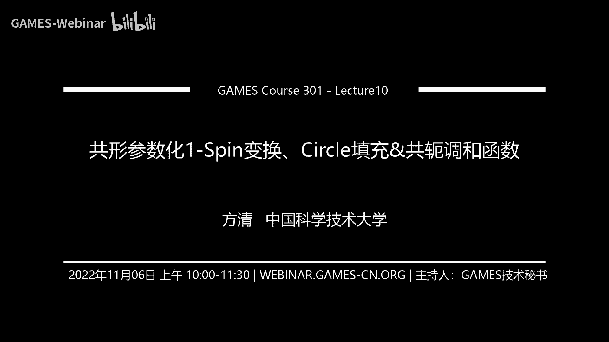
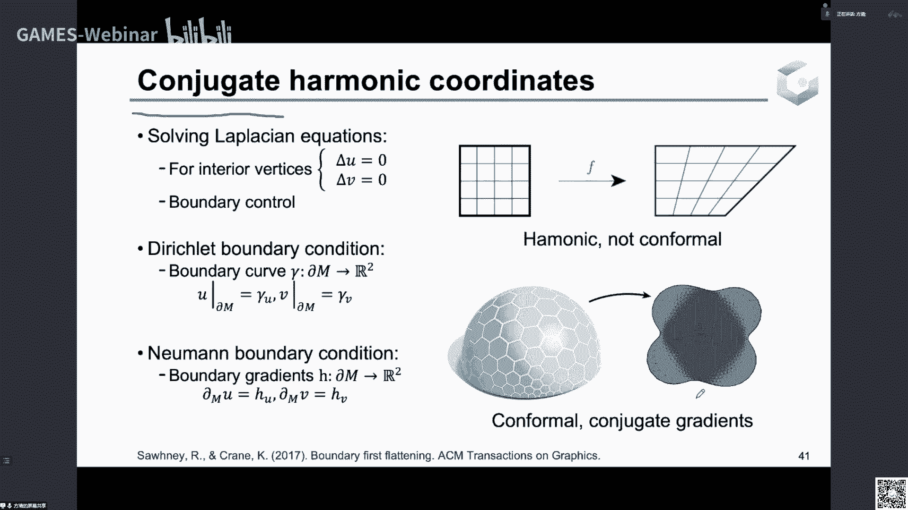
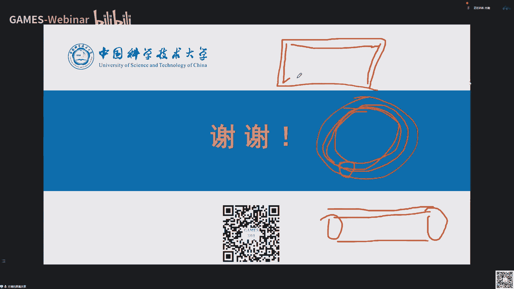
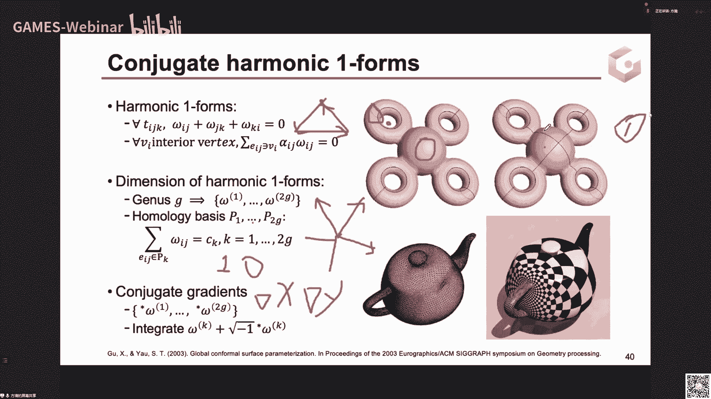
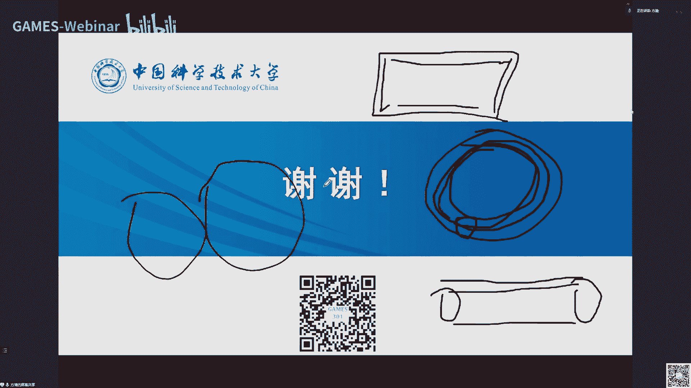

# GAMES301-曲面参数化 - P10：共形参数化1 - 微分性质与离散算法 🌀

在本节课中，我们将学习共形映射的核心微分性质，以及基于这些性质设计的几种离散参数化算法。我们将从共形映射的保角性出发，探讨其在连续和离散情况下的数学表达，并介绍Spin变换、Circle Packing和共轭调和函数等关键概念。

---

## 1. 什么是共形映射？ 📐

共形映射最关键的性质是**保角性**，即映射前后任意两条曲线在交点处的夹角保持不变。在离散的三角网格参数化中，这意味着我们希望映射到纹理域后，每个三角形的内角尽可能与原始空间中的内角一致。

上一节我们回顾了两种优化角度扭曲的算法：ABF和LSCM。它们都试图最小化角度变化，但都无法在离散网格上实现严格的保角。这引出了我们对连续光滑共形映射的探讨。

---

## 2. 连续共形映射的微分性质 📈

为了用严密的数学语言描述共形映射，我们需要借助微分几何。核心结论是：**共形映射在每一点处都是一个相似变换（旋转与伸缩的复合）**。

### 2.1 平面上的共形映射与柯西-黎曼方程

在复平面上，一个映射 \( f(z) = u(x, y) + i v(x, y) \) 是共形的，当且仅当其满足**柯西-黎曼方程**：

\[
\frac{\partial u}{\partial x} = \frac{\partial v}{\partial y}, \quad \frac{\partial u}{\partial y} = -\frac{\partial v}{\partial x}
\]

这等价于说，映射的微分（雅可比矩阵）在每一点都是一个相似变换矩阵：

\[
J_f = s \begin{bmatrix}
\cos \theta & -\sin \theta \\
\sin \theta & \cos \theta
\end{bmatrix}
\]

其中 \( s > 0 \) 是伸缩因子，\( \theta \) 是旋转角。这意味着该映射将无穷小的圆映射为无穷小的圆。

### 2.2 曲面间的共形映射

对于两个曲面间的映射，保角性要求切平面中的任意两个切向量在映射前后夹角不变。其局部微分性质同样可以表述为“每一点处是一个相似变换”，但方向由该点的法向决定，计算更为复杂。

---

## 3. Spin 变换 🔄

上一节我们介绍了共形映射的局部相似性。Spin变换提供了一种在三维空间中构造共形形变的强大工具。

### 3.1 核心思想

Spin变换利用**四元数**来表示三维空间中的旋转与伸缩。对于一个曲面变形，如果存在一个定义在曲面上的四元数场 \( \lambda \)，使得变形后曲面某点的切向量等于原曲面相应切向量左乘 \( \lambda \)，那么这个变形就是共形的。

### 3.2 实现与约束

然而，并非任意四元数场 \( \lambda \) 都能对应一个实际存在于三维空间中的曲面。它必须满足一个称为**狄拉克方程**的约束条件：

\[
(D - \rho) \lambda = 0
\]

其中 \( D \) 是一个微分算子，\( \rho \) 是一个与曲面平均曲率变化相关的实值函数。求解满足该方程的 \( \lambda \) 和 \( \rho \)，即可得到共形变形。算法上，这可以转化为一个特征值问题。

**Spin变换的几何意义**：通过设计函数 \( \rho \)（可理解为期望的平均曲率变化），我们可以控制曲面局部是凸起（\( \rho > 0 \)）还是凹陷（\( \rho < 0 \)），同时保证变形是共形的。

---

## 4. Circle Packing 算法 ⭕

Circle Packing算法直接来源于共形映射“将无穷小圆映射为无穷小圆”的性质。其离散版本试图用有限大小的圆来逼近这一性质。

### 4.1 算法原理

给定一个三角网格，Circle Packing在其上构造一个**圆填充**结构：
*   每个顶点关联一个圆。
*   每条边对应的两个顶点圆彼此相切。
*   每个面对应的三个顶点圆彼此相切，且定向一致。

如果存在这样的圆填充，并且将圆的中心作为参数化后的顶点坐标，那么在圆半径无限缩小的极限下，该映射将逼近一个共形映射。

### 4.2 算法步骤

以下是构造Circle Packing的核心迭代步骤：
1.  **初始化**：固定边界顶点圆的半径。
2.  **角度计算**：对于每个内部顶点，根据其当前半径和邻居半径，计算其周围所有“相交角” \( \theta_i \) 的总和。
3.  **半径更新**：如果角度总和 \( \sum \theta_i \neq 2\pi \)，则调整该顶点圆的半径，使其趋向于满足 \( \sum \theta_i = 2\pi \)。
4.  **迭代**：对所有内部顶点重复步骤2-3，直至收敛。
5.  **坐标重建**：根据最终确定的圆半径及相切关系，计算出所有圆心（即顶点）在平面上的位置。

**局限性**：经典Circle Packing算法只考虑网格的连接关系，而忽略了其几何（如边长），因此在各向异性强烈的网格上效果不佳。

---

## 5. Circle Patterns 算法 🔺

为了克服Circle Packing的局限性，Circle Patterns算法将圆的放置与网格几何相结合。

### 5.1 与Circle Packing的区别

Circle Patterns不是在顶点放置圆，而是在**每个三角形的外接圆**上做文章。对于一条边，考虑其两侧三角形外接圆在交点处的切线夹角 \( \phi_e \)。共形映射的理想情况是保持这些夹角 \( \phi_e \) 不变。

### 5.2 算法核心

问题转化为：寻找一组新的三角形内角 \( \theta_{ij} \)，使得：
1.  每个三角形的内角和为 \( \pi \)：\( \theta_{ij} + \theta_{jk} + \theta_{ki} = \pi \)。
2.  由这些新内角计算出的外接圆夹角 \( \phi_e \)（\( \phi_e = \pi - \theta_{jk} - \theta_{ki} \) 对于边 \( e \) 对应顶点 \( i \)）在内部顶点处满足“绕一圈和为 \( 2\pi \)”。
3.  \( \theta_{ij} \) 尽可能接近原始网格的内角 \( \alpha_{ij} \)。

通过优化求解满足上述条件的 \( \theta_{ij} \)，再利用正弦定理等重建边长和顶点坐标，即可得到参数化结果。此方法更好地保持了原始网格的几何特征。

---

## 6. 共轭调和函数方法 ⚖️

从柯西-黎曼方程出发，我们可以得到共形映射另一个深刻性质：其坐标函数是**调和函数**，并且互为**共轭调和函数**。

### 6.1 数学基础

对于共形映射 \( f = (u, v) \)，柯西-黎曼方程 \( u_x = v_y, u_y = -v_x \) 意味着：
\[
\Delta u = 0, \quad \Delta v = 0
\]
即 \( u \) 和 \( v \) 都是调和函数。同时，\( \nabla u \) 和 \( \nabla v \) 处处垂直且模长相等。

### 6.2 离散算法思路

基于此性质，发展出两类主要算法：

1.  **调和1-形式法**：
    *   在亏格为 \( g \) 的闭曲面上，存在 \( 2g \) 维的调和1-形式空间。
    *   算法通过计算一组基（与“手柄”和“隧道”相关的闭合路径积分有关），并组合出两组互为对偶的调和1-形式。
    *   对这些1-形式进行路径积分，即可得到共形映射的 \( u \) 和 \( v \) 坐标。

2.  **边界条件法**：
    *   直接求解拉普拉斯方程 \( \Delta u = 0, \Delta v = 0 \) 来获得调和函数。
    *   **关键难点**：需要设置特殊的边界条件，使得解出的 \( u \) 和 \( v \) 恰好满足柯西-黎曼方程（即梯度互为旋转90度）。
    *   如何寻找这样的边界条件，涉及到共形映射的度量表示，这将是下一讲（第11讲）的核心内容。

---

## 总结 📝

本节课我们一起学习了共形参数化的微分基础与几种经典离散算法：
1.  我们明确了共形映射的核心是**保角性**，在连续情况下表现为每一点处的**局部相似变换**。
2.  基于局部相似性，我们介绍了在三维空间中构造共形形变的 **Spin变换** 方法。
3.  我们探讨了两种用圆逼近共形映射的算法：**Circle Packing**（基于顶点圆）和 **Circle Patterns**（基于外接圆），后者能更好地融入网格几何。
4.  最后，我们从柯西-黎曼方程出发，引出了共形映射的**调和函数**性质，并概述了基于**共轭调和函数**和**调和1-形式**的参数化算法思路。

这些算法从不同角度离散化和实现了共形映射的理想性质。下一讲（第11讲），我们将深入探讨共形映射的**度量表示**，并学习如何利用它来设计更高效的参数化边界条件。