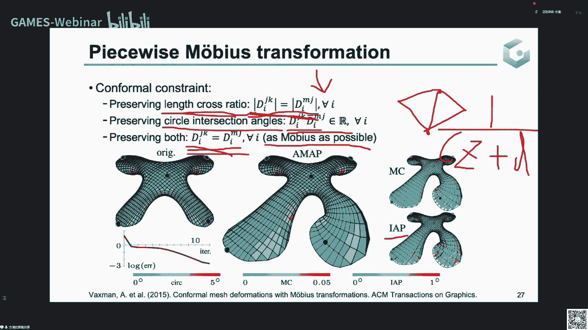

# GAMES301-曲面参数化 - P11：Lecture 11 共形参数化2-离散共形等价类、Möbius变换与曲率流 📐

在本节课中，我们将学习共形映射在曲面黎曼度量上的性质，并介绍相关的离散算法。主要内容包括：光滑曲面上的共形变换与黎曼度量、离散共形等价类的定义、分片Möbius变换，以及利用曲率流求解参数化的方法。

---

## 第一部分：光滑曲面上的共形变换与黎曼度量 🔄

上一讲我们介绍了共形映射在映射微分方面的性质。本节中，我们将从曲面的内蕴性质——黎曼度量出发，来理解共形变换。

黎曼度量是定义在曲面切空间上的一个对称、正定的双线性函数。它可以理解为切向量的内积，用于衡量长度和角度。对于一个光滑映射，如果它是共形映射，那么它诱导的新黎曼度量 `g'` 与原始度量 `g` 之间满足以下关系：

**公式：** `g' = e^{2λ} * g`

其中，`λ` 称为**对数共形因子**。这个关系表明，共形变换在局部相当于对度量进行一个统一的伸缩。黎曼度量和由此定义的高斯曲率都是曲面的内蕴量，与曲面在空间中的具体嵌入形状无关。

曲面单值化定理指出，任何曲面都可以通过一个共形变换，变为具有常数高斯曲率的曲面（如球面、平面或双曲面）。这为曲面参数化提供了理论基础：要将曲面共形地映射到平面区域，我们需要找到一个新的度量，使其高斯曲率在目标域上（例如平面内部曲率为0，边界测地曲率为常数）。

高斯曲率 `K` 与对数共形因子 `λ` 的关系由以下**Yamabe方程**描述：

**公式：** `K' = e^{-2λ} (K - Δλ)`

其中，`K'` 是目标曲率，`Δ` 是当前度量下的拉普拉斯算子。这个非线性偏微分方程是许多共形参数化算法的核心。

---

## 第二部分：黎曼度量的离散化与离散共形等价类 🔺

上一节我们介绍了光滑理论。现在，我们来看如何在三角网格上离散化这些概念。

在三角网格上，黎曼度量可以离散化为边长。假设我们在每个顶点 `i` 上定义了一个对数共形因子 `λ_i`。那么，在共形变换下，一条边 `(i, j)` 的新长度 `l'_{ij}` 与原始长度 `l_{ij}` 的关系可以定义为：

**公式：** `l'_{ij} = e^{(λ_i + λ_j)/2} * l_{ij}`

另一种定义离散共形等价类的方式是通过**边长交叉比**。对于一个四边形，其交叉比定义为两组对边边长乘积之比。在共形变换下，这个交叉比保持不变。

以下是两种主要的离散共形等价类定义方法：

1.  **顶点对数因子法**：为每个顶点分配一个对数共形因子 `λ_i`，新的边长由上述公式计算。
2.  **边长交叉比法**：约束网格每条边的交叉比在变换前后保持不变。

这两种定义在数学上是等价的。基于这些定义，我们可以将参数化问题转化为优化问题：寻找一组 `λ_i` 或新的边长，使得网格内部顶点角度和为 `2π`，边界顶点角度和符合目标形状要求，从而将网格参数化到平面。

---

## 第三部分：分片Möbius变换 🌀

前面我们讨论了基于度量的方法。现在，我们介绍另一种视角：分片Möbius变换。

Möbius变换是复平面上的一种分式线性变换，形式为：

**公式：** `f(z) = (a*z + b) / (c*z + d)`，其中 `a, b, c, d` 为复数且 `ad - bc ≠ 0`

它可以分解为平移、旋转伸缩和反演的组合。Möbius变换具有保圆性（将圆或直线映射为圆或直线）。

在三角网格参数化中，我们可以在**每个三角面片**上独立定义一个Möbius变换，将当前三角形映射到目标三角形。但为了整个映射是连续的，相邻面片上的Möbius变换必须在公共边上满足一致性条件。

通过为这些分片Möbius变换添加不同的约束，可以恢复前两讲提到的共形映射定义：

*   约束**交叉比**的模长不变，等价于保持边长的交叉比（第二部分的度量观点）。
*   约束**外接圆交角**不变，等价于保持三角形的外接圆交角（第十讲的“保角”观点）。
*   如果同时满足以上两个强约束，则整个变换退化为一个**全局统一的**Möbius变换，刚性很强。

因此，分片Möbius变换框架提供了一个更广阔的空间来定义和优化具有特定性质的映射。

---

## 第四部分：基于曲率流的参数化算法 ⏳

回顾第一部分，求解共形参数化需要解Yamabe方程。本节介绍一种实用的数值方法：**曲率流**。

其核心思想是设计一个关于度量（或对数共形因子 `λ`）的能量函数，使其最小值点恰好满足目标曲率条件。然后，我们通过梯度下降法（即曲率流）来最小化这个能量。

**Ricci流**和**Calabi流**是两种重要的曲率流。在离散网格上，算法流程如下：

1.  初始化每个顶点的对数共形因子 `λ_i`（例如全为零）。
2.  根据当前 `λ_i` 计算新边长，进而计算每个顶点的当前离散高斯曲率 `K_i`。
3.  计算当前曲率 `K_i` 与目标曲率 `K'_i` 的差值。
4.  根据曲率流的梯度下降方向（例如 `dλ_i/dt = (K'_i - K_i)`）更新 `λ_i`。
5.  在更新过程中，如果新边长导致三角形退化（不满足三角不等式），则需要进行**边翻转**操作来改善网格质量，然后继续迭代。
6.  重复步骤2-5，直到曲率差值足够小。

当迭代收敛后，我们就得到了目标曲率分布下的新边长（即新度量）。最后，通过一个简单的**广度优先遍历**过程，就可以根据这些边长将三角网格“摊平”到目标域（如圆盘或平面矩形）上，得到最终的参数化坐标。

---

本节课中，我们一起学习了共形参数化的度量观点。我们从光滑曲面的黎曼度量和Yamabe方程出发，理解了共形变换如何改变曲率。接着，我们探讨了如何在三角网格上离散化这些概念，定义了顶点对数因子和边长交叉比两种等价类。然后，我们介绍了分片Möbius变换这一更通用的框架。最后，我们详细讲解了利用曲率流求解Yamabe方程、从而得到共形参数化的完整算法流程。这些内容为理解和实现复杂的曲面参数化方法奠定了坚实的基础。