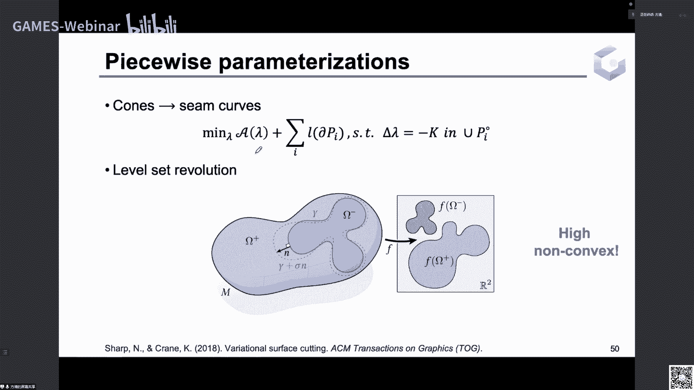

# GAMES301-曲面参数化 - P12：Lecture 12 锥奇异点参数化应用 📐

在本节课中，我们将要学习共形参数化中的一个重要应用：锥奇异点参数化。我们将探讨为何需要引入锥奇异点，回顾相关的研究工作，并介绍启发式与优化算法，最后了解其相关应用。

## 什么是锥奇异点参数化？ 🤔

上一节我们介绍了共形映射的基本概念，本节中我们来看看如何通过引入特殊点来改善参数化质量。

考虑将流形 `M` 映射到平面 `R²` 的一个共形映射 `g`，其对数共形因子 `λ` 描述了度量在变化前后的缩放程度。`λ` 可以用来衡量共形映射的面积扭曲。如果 `λ` 的值（负值很小或正值很大）导致平面上纹理贴到模型上产生严重的面积扭曲，就会给纹理绘制增加工作量。

为了解决这个问题，产生了锥奇异点参数化方法。该方法通过在模型表面合理的位置放置锥奇异点，能够显著降低共形映射的面积扭曲。

一个简单的例子是圆锥面。除了锥点处高斯曲率不为零，曲面其他地方的高斯曲率都是零。如果直接将圆锥摊平到平面上，需要将锥点处的高斯曲率也变为零，这会导致该点附近的度量严重收缩（即 `λ` 为很负的值），从而产生较大的面积扭曲。但如果我们沿着连接边界和锥点的母线将圆锥剪开，剪开后得到一个扇形，就可以完全无扭曲地摊平到平面上。

曲面上的锥奇异点，指的就是这样的孤立点。我们不再要求所有内部点的高斯曲率都为零，而是允许高斯曲率聚集在一些孤立的锥点上。除了边界和这些奇点，其他地方的高斯曲率都为零。选择合适的锥点位置，就能有效降低面积扭曲。

从一种极端情况来看面积扭曲和锥奇异点的关系：如果把曲面上所有曲率不为零的点都当作锥奇异点，那么共形映射就是恒等映射。我们需要将所有顶点连成的曲线剪开，使其变成一个拓扑同胚于圆盘的面片，这样就可以无扭曲地放在平面上。总体上，锥奇异点的数目和共形映射的面积扭曲之间是一个互相制约的平衡关系。使用越少的锥奇异点，共形映射就不可避免地产生较大的面积扭曲；而希望面积扭曲低，就需要在模型上放置更多的锥奇异点。

在实际应用中，我们需要在低扭曲和锥奇异点数量之间做出取舍。纹理绘制和编辑希望低扭曲，但锥奇异点多会导致两个问题：
1.  需要沿着锥奇异点的连线剪开曲面才能摊平，这会导致剪开处左右两边的纹理不一致，在纹理编辑时需要注意这些接缝，因此希望接缝越少越好。
2.  锥奇异点越多，展开的接缝线就越长，可能导致参数化区域狭长、边界绕来绕去，增加纹理绘制和编辑的难度。

锥奇异点除了应用在纹理贴图上，也可用来建立曲面间映射的对应特征点。如果一组锥奇异点使得曲面能以很小的面积扭曲映射到平面上，那么可以视作该锥奇异点所对应的共形变换产生的离散度量，与原始曲面的度量近似一致。变换后离散度量上的锥奇异点（即曲面上高斯曲率不为零的点）可以作为曲面的特征点，用于建立形状之间的映射。锥奇异点越少，人工选择对应的工作量就越少。

第三个应用是，当锥奇异点的曲率限制为 `π/2` 的整数倍时，参数化对应于一种特殊的参数化，称为旋转无缝参数化。如果锥奇异点的曲率不是 `π/2` 的整数倍，会导致接缝处的纹理走向不一致。限制为 `π/2` 的整数倍时，棋盘格纹理在接缝处的走向正好对齐。这类曲率为 `π/2` 整数倍的锥奇异点，还可以用于曲面上的向量场、交叉场设计以及四边形网格生成。此时，锥奇异点的数量决定了场和四边形网格的奇异点数量。对于带 `π/2` 整数倍约束的锥奇异点，我们也希望其数量更少。

## 锥奇异点问题的建模 🧮

上一节我们了解了锥奇异点的作用，本节中我们来看看如何用数学语言描述这个问题。

在上一讲中，我们介绍了共形映射下描述高斯曲率和对数共形因子的 Yamabe 方程，以及运用梯度流的方法来做点采样上的参数化。事实上，Yamabe 方程可以用来建模锥奇异点分布问题。锥奇异点就是高斯曲率不为零的点。

我们用狄拉克函数 `δ` 表示流形在某个点 `v_i` 处的奇异性（在该点不为零，在其他地方为零），且在整个曲面上的积分为 `1`。可以将 `δ` 视为一个半径为 `ε` 的圆盘区域在 `ε` 趋于零时的极限。高斯曲率在这种锥奇异点下的分布，可以写成这些狄拉克函数的线性组合。

在2008年的一篇论文中证明了，当目标高斯曲率为这种锥奇异点的分布情形时，Yamabe 方程中的 `e^(2λ)` 项可以省略，等式依然成立。此时方程变成一个线性微分方程。2008年 Ben-Chen 等人利用这个结论，并利用三角网格上的分片线性有限元对这个线性微分方程进行离散，使其变成一个稀疏线性方程组。

其中，`λ` 是顶点上的离散对数共形因子，`K'` 和 `K` 分别是三角网格上顶点变化后和变化前的高斯曲率，`L` 是拉普拉斯矩阵（常用余切权重拉普拉斯矩阵）。用有限元离散后就变成线性方程组的形式，这是一种逼近。

因此，锥奇异点参数化的主要问题就变成：在满足上述线性方程的条件下，尽可能达到锥奇异点分布的数量和面积扭曲之间的平衡。我们将分为普通锥奇异点参数化，以及要求目标锥奇异点曲率为 `π/2` 整数倍约束两个方面来介绍。因为整数约束是一个难求解的整数规划问题，所以求解时会有一些技巧。

## 启发式算法 🛠️

上一节我们建立了问题的数学模型，本节中我们来看看一些启发式的求解算法。

启发式算法的出发点基于一个经验：在参数化中，原始曲面内部高斯曲率的极值点，在参数化后往往具有很高的扭曲。因此，一个启发式策略是直接在原始曲面高斯曲率的极大值和极小值区域放置锥奇异点。图中 colormap 显示的是网格原始的高斯曲率，黑色的点就是放置锥奇异点的位置。这是一种根据曲面几何放置锥奇异点位置的方法。

启发式的第二种策略是：先假设曲面没有奇点（即锥奇异点数量为零）。此时目标曲率 `K'` 除了边界上的曲率不为零，内部的曲率都为零。然后求解这个线性方程，得到一个对数共形因子 `λ` 的分布。接着，我们会发现 `λ` 有一些极值点，这些点往往对应面积扭曲较大的区域。因此，我们可以在 `λ` 的这些极值点或其他特定位置放置锥奇异点。这是另一种策略。

当我们确定了锥奇异点的放置位置后，还需要确定锥奇异点的曲率值。我们知道位置，但还不知道 `K'` 的值是多少。由于除了锥奇异点，曲面其他地方的曲率都变成了零，剩下的曲率都集中到了这些奇点上，而且这些曲面的高斯曲率总和必须满足高斯-博内定理（求和等于 `2π` 乘以曲面的欧拉示性数）。因此，可以看成曲率为零的点的曲率都转移到了奇点上面。

我们可以把这种曲率的转移模拟成在三角网格边上进行随机行走。如果一个点 `i` 不是锥奇异点，那么它的曲率会以概率 `p_ij` 随机游走到邻居点 `j`。权重 `w_ij` 是行走的概率，可以直接使用3D网格的余切权重。从这个点往周围行走的概率之和为 `1`。如果区域是奇点，那么曲率只会走进来，不会走出去，所以我们让从 `i` 到其他点的概率都是零，它自身走向自身的概率为 `1`。利用这种随机行走，随着时间变化，所有的曲率会逐渐从其他地方聚集到这些奇点处。最后求解平衡状态，获得奇点处的最终曲率值 `K'`。

另一篇文章选择的启发式策略是另一个角度：初始时给定一个小的阈值 `ε`，计算 `|K'| < ε` 的顶点集合（如图中白色区域）。我们让这些白色区域的曲率直接变成零，然后把剩下的曲率都集中到黄色和蓝色的区域上。随着 `ε` 逐渐增加，变成零的区域会逐渐增大，最后非零的曲面区域会逐渐收缩到一些孤立点。当所有非零曲率的点都变成孤立点时，算法停止。这些孤立的曲率分离点就被当作锥奇异点的分布。

这个算法中需要确定的是：当曲率绝对值小于 `ε` 的区域其曲率变成零时，剩下的那些点上面的曲率应该怎么更新？因为满足曲率在集合 `{i: |K'_i| < ε}` 上等于零的向量有很多，对应的目标曲率分布取值不唯一。因此，我们需要选取某种意义下的最优共形映射对应的目标曲率 `K'`。这种最优性可以用映射的面积扭曲来衡量，即对数共形因子 `λ` 的加权 `L²` 模。如果加权 `L²` 模等于零，说明 `λ` 都是零，网格本身共形映射没有面积扭曲；如果这个值很大，说明 `λ_i` 有很大的正值或很小的负值，面积扭曲会很大。

此时更新 `K'`，就是求解一个关于 `λ` 的、带线性约束的最小二乘问题，最小化其加权 `L²` 模，并满足在那些曲率被设为零的顶点上，其拉普拉斯等于原始的曲率（因为目标曲率为零）。解这个带线性约束的最小二乘问题，就可以求出最优的 `λ`，把这个 `λ` 带入 Yamabe 方程就可以求出新的目标曲率 `K'`。然后按照算法迭代：更新 `K'` 后，检查是否还有连通的非零点，如果所有点都是孤立点则终止；否则增加 `ε`，再计算新的曲率小于 `ε` 的顶点集合，直至收敛到只剩下一些孤立的锥奇异点。

对于需要约束锥奇异点曲率为 `π/2` 整数倍的情况，该文章也提供了一个后续策略。此时我们算出来的一些固定的锥奇异点，其曲率值不一定是 `π/2` 的整数倍。我们需要对它进行取整，即每次让最靠近 `π/2` 整数倍的点，将其曲率变成 `π/2` 的整数倍。例如，曲率是 `0.48π`，就把它变成 `0.5π`（即 `π/2`）。不能一次性把所有点都取整，因为高斯曲率值要满足求和等于 `2π` 乘以欧拉示性数，每个都就近取整后，其和可能不等于这个值。

因此，每次只对最靠近整数倍的一个点进行取整。设 `R` 表示锥奇异点曲率已是 `π/2` 整数倍的顶点集合，`T` 表示对应的取整后的曲率值。对于剩下的锥奇异点，我们更新它们的新曲率，使得对应的对数共形因子加权 `L²` 模最小，并满足约束：在非锥奇异点位置曲率为零；在我们选定的取整位置，曲率为 `π/2` 的整数倍 `T`。求解这个最小化问题，更新 `λ` 和其他锥奇异点的曲率值。然后，在剩下的锥奇异点中，再选取最靠近 `π/2` 整数倍的点进行取整，重复此迭代，直到所有顶点曲率都取整到 `π/2` 的整数倍，最后形成一个旋转无缝的参数化。

## 基于优化的算法 ⚙️

上一节介绍的启发式策略有一个明显问题：它根据经验（原始曲面内部高斯曲率的极值点往往在参数化后有较高的面积扭曲）生成锥奇异点分布，但不能保证一定是最优的。例如，对于某个模型，选取高斯曲率最大的点放置一个锥奇异点来优化面积扭曲，会产生较大的扭曲；直接解线性 Yamabe 方程，在得到的 `λ` 的极值点放一个锥奇异点，最后算出的面积扭曲也比较大。但是，如果在平坦的位置上放一个点，产生的面积扭曲反而会更小。因此，问题在于我们能否直接从优化的角度，计算出一个更好的锥奇异点分布。

考虑到 Yamabe 方程的线性化提供了对数共形因子 `λ` 和高斯曲率 `K` 的约束关系，锥奇异点参数化中的问题就可以表示成优化对数共形因子 `λ` 的加权面积模（表示扭曲），同时为更少的锥奇异点设计一个目标能量。这样我们可以直接优化锥奇异点能量和面积扭曲能量，使它们在约束下达到更好的平衡。

由于我们希望产生更少的锥奇异点，这对应于对曲率的稀疏性惩罚。但直接用曲率的 `L¹` 模优化，并不一定能产生稀疏的点。例如，对于一个球面，其高斯曲率每一点都大于零，对它取 `L¹` 模，其和始终是常数（等于 `2πχ`），优化 `L¹` 模并不能将曲率聚集到固定的锥奇异点，最终结果可能是所有顶点都是奇点。因此，基于优化的方法需要采用能产生更强稀疏性的能量形式。

2018年的一篇文章将稀疏的锥奇异点高斯曲率分布函数，看成一些狄拉克测度的线性组合。其思想是利用对偶空间，将函数空间的能量范数变成测度的测度模，进而建模成优化共形映射的面积扭曲和测度模的加权和，并满足线性化的 Yamabe 方程。通过一种对偶形式转化，最终变成一个凸优化问题，在三角面片上用分片线性有限元逼近，可以用梯度下降法、ADMM 等方法求解。实验测试发现，这种测度模比 `L¹` 模能带来更强的稀疏性。

相比于2018年的建模，我们实验室在2021年的工作中做了两个改变：
1.  直接用 `L⁰` 范数（非零元素个数）作为锥奇异点能量，这比测度模的稀疏惩罚性更强，因为 `L⁰` 范数直接等价于高斯曲率不为零的点的个数。
2.  将锥奇异点和面积扭曲的加权能量，转变为在给定面积扭曲上界下，优化锥奇异点的总数量（即其 `L⁰` 范数）。这么做的原因有两个：第一，扭曲在参数化应用中是更强调控制的量，通过这种有界形式更容易调节参数来控制想要的扭曲结果；第二，可以方便地更换面积扭曲的表达形式。例如，要控制共形映射在曲面上的最大面积扭曲，相当于控制对数共形因子的 `L^∞` 范数。但在锥奇异点情况下，连续的对数共形因子分布在锥点处趋于无穷，直接取 `L^∞` 范数能量无穷，无法优化。我们用 `L^p` 范数（`p` 较大）来逼近 `L^∞` 范数。如果使用加权形式优化 `L^p` 范数不太好优化，但将其表示为有界约束，就可以用近似投影的方法迭代求解，简化优化难度。

针对建立的 `L⁰` 范数优化模型，我们测试了现有的对 `L⁰` 范数逼近的常见方法。`L¹` 范数不能产生孤立的锥奇异点，会产生较大区域的分布。用光滑的模拟函数（如 `L^p` 范数，`p<1`）是一种平滑逼近，通过调节参数可以接近示性函数，能产生比较稀疏的锥奇异点，但还有改进空间。我们可以用重新加权的 `L¹` 范数来进行求解。

重新加权的 `L¹` 范数迭代框架是：用一系列加权的 `L¹` 范数子问题来逼近 `L⁰` 范数。每个子问题是加权 `L¹` 范数优化，权重 `w_i^(m+1)` 由上一步迭代求出的最优曲率 `K^(m)` 决定，具体为 `w_i^(m+1) = 1 / (|K_i^(m)| + ε)`，其中 `ε` 是一个小的正数。这样设计的权重意图是：增大对高斯曲率靠近零的分量的惩罚，使得这些分量最终不断趋于零；而曲率不为零的分量，其权重会变小，从而慢慢形成孤立的点，即锥奇异点。初始权重全部设为 `1`（即初始为普通的 `L¹` 优化），随着迭代，逐渐惩罚更多靠近零的顶点，使其曲率变为零，最终收敛到一些孤立点。收敛条件是相邻两次迭代最优解的误差小于阈值。

每个加权 `L¹` 子问题也是一个凸优化，可以用交替方向乘子法等求解。实验中，我们的算法可以很好地控制面积扭曲的上界。对于同一模型设置不同的扭曲上界，锥奇异点数目会随着上界的减小而增加，但最后产生的锥奇异点也很稀疏。虽然 `L⁰` 范数优化是 NP 难问题，目前无法有效找到全局最优，但我们的结果仍产生了很好的稀疏性，锥奇异点数目也较少。

我们也可以用 `L^p` 范数（`p` 增加）来替代 `L^∞` 范数，以优化最大面积扭曲。实验表明，对于相同的扭曲上界，当 `p` 从 `2` 增加到 `5` 时，最大的面积扭曲会被逐渐减小。`p` 较大时，面积扭曲很大的区域会消失，更倾向于一致的扭曲。`L^p` 范数能有效惩罚面积扭曲的极值点。

由于 `L⁰` 优化是非凸问题，我们的算法只能用一系列凸子问题去逼近，不能保证获得全局最优的锥奇异点分布。因此，我们将我们的优化算法与2018年那篇测度模优化的文章在大型数据集上进行了测试对比。结果表明，在约69%的模型上，我们的算法在相同扭曲下能产生更稀疏的锥奇异点；在约30%的模型上，结果与他们相当；在不到1%的模型上，我们的锥奇异点数会比他们多1-2个。原因可能是 `L⁰` 优化是近似求解，可能会比全局最优解多一两个点。

如果我们考虑带整数约束（曲率为 `π/2` 整数倍）的锥奇异点生成问题，我们实验室在2022年的文章中，在2021年建模的基础上增加了一个整数约束：优化目标曲率的 `L⁰` 范数，使得面积扭曲小于给定上界