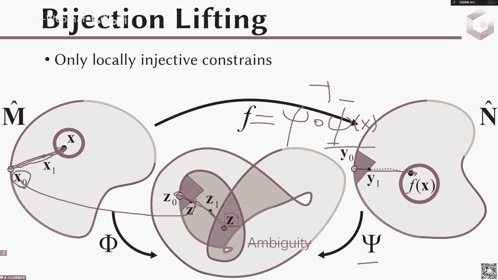

# GAMES301-曲面参数化 - P13：Lecture 13 参数化应用3-曲面对应与高阶多项式映射 🎯

在本节课中，我们将学习曲面参数化的两个重要应用：如何建立两个不同曲面网格之间的一一对应关系（曲面对应），以及如何定义和验证高阶多项式映射（如Bézier映射）的有效性。我们将从基本概念入手，逐步讲解核心算法和关键技巧。

---

## 概述：曲面对应

上一讲我们介绍了参数化在纹理映射和重新网格化中的应用。本节中，我们来看看如何利用参数化技术，在两个不同的曲面之间建立精确的对应关系。

曲面对应的核心目标是，在两个曲面网格（例如一匹马和一头长颈鹿）之间建立一个**双射**（一对一映射）。这意味着不仅顶点要对应，每个三角形面片及其内部的点也要精确对应。这种映射在形状插值、变形动画和属性传递等应用中至关重要。

以下是曲面对应的基本定义和两种常见表述：

*   **曲面映射**：指两个分片线性曲面之间数学上的一一映射。
*   **相容网格**：指两个网格具有完全相同的连接关系（相同的三角形面片连接方式）。如果有了相容网格，顶点和面的对应就自然建立了。

有了这种对应关系，我们就可以实现复杂的应用，例如在两个形状之间进行平滑的变形过渡（形变），或者将颜色、纹理、法线甚至物理属性从一个模型传递到另一个模型。

---

## 基于参数化的曲面对应生成方法

我们的目标是：给定两个连接关系不同的输入网格（M1 和 M2），以及用户指定的一些对应特征点，生成一个低扭曲的、一一对应的曲面映射，或者直接生成一对相容网格。

基于参数化的方法通常分为以下三步：

1.  **构造公共参数域**：找到一个共同的、简单的二维区域作为“中介”。
2.  **计算低扭曲参数化**：分别将两个曲面网格映射到这个公共参数域上。
3.  **组合映射或生成相容网格**：通过复合两个映射得到曲面间的直接对应，或者利用参数化信息对原始网格进行重网格化，使其连接关系一致。

整个流程的核心思想是：`M1 -> 公共域 <- M2`。通过公共域这个“桥梁”，间接建立 M1 和 M2 的联系。M1 到 M2 的映射可以表示为：`f = f2^{-1} ∘ f1`，其中 f1 和 f2 分别是 M1 和 M2 到公共域的映射。

---

### 方法一：基于三角形域的映射

一种直观的思路是为每个曲面选择一组对应的三角形区域，分别将它们参数化到平面上的**三角形域**。因为三角形域是凸的，我们可以使用之前学过的保双射参数化方法。

具体步骤如下：
1.  在两个曲面上手动或自动分割出**拓扑相容**的三角形区域对（即连接关系相同的区域）。
2.  将每对区域分别参数化到同一个平面三角形上。
3.  由于三角形到三角形的映射很容易建立（例如通过仿射变换），从而得到曲面区域间的映射。

然而，这种方法的第一步——为两个差异很大的模型手工构造出相容的三角形区域分割——是非常困难且不平凡的。

---

### 方法二：基于公共平面参数域的映射

为了简化公共域的构造，我们可以将两个曲面都映射到同一个**平面区域**。一个经典算法（2014年）流程如下：

首先，我们需要为输入的两个网格建立对应的切割路径。

1.  **构造对应的切割路径**：
    *   输入是两组对应的特征点。
    *   在各自网格上，用最短路径连接这些特征点，形成一个封闭或开放的路径图。
    *   确保两个网格上的路径图拓扑一致。路径上点的对应可以通过弧长参数化简单建立。

接下来，利用参数化技术生成公共域。




2.  **共同边界参数化**：
    *   将两个带有对应切割路径的曲面，分别参数化到平面。
    *   **关键约束**：在参数化过程中，强制要求两个曲面在对应切割路径上的点，在参数域中落在完全相同的位置。
    *   这样，得到的两个参数化将共享完全相同的二维参数域边界和内部区域。这个共享的二维区域就是我们的**公共参数域**。


这个优化问题的数学描述如下：
```
最小化： Distortion(φ) + Distortion(ψ)   # φ和ψ分别是两个曲面的参数化
约束条件：
    1. 所有三角形无翻转 (det(J) > 0)。
    2. 对应切割路径上的点满足：φ(path_M1) = ψ(path_M2)。
```

最后，通过映射复合得到最终结果。

3.  **组合映射**：
    *   得到映射 φ: M1 -> D 和 ψ: M2 -> D (D是公共域)。
    *   则从 M1 到 M2 的映射为：`f = ψ^{-1} ∘ φ`。
    *   由于参数域 D 可能存在自交（如果映射不是全局单射），在计算 ψ^{-1} 时需要从边界开始追踪路径，以避免歧义。

**方法优缺点**：
*   **优点**：概念清晰，将复杂的曲面匹配问题分解为参数化问题。
*   **缺点**：最终结果的质量严重依赖于第一步切割路径的构造。切割路径的选择会极大地影响参数化的扭曲程度。

> **注意**：曲面对应是一个研究广泛且深入的领域，方法众多（如基于函数映射、最优传输等）。本课程仅介绍了基于参数化的经典思路。在实际研究中，需要全面评估不同方法的稳定性、鲁棒性和效率。

---

## 概述：高阶多项式映射

前面我们介绍的都是**分片线性映射**，即每个三角形映射到参数域后仍是线性三角形。现在，我们探讨更一般的**分片多项式映射**，例如将曲面三角形映射到参数域中的一个**曲边三角形**（由多项式定义）。

高阶多项式映射在有限元分析和高精度几何处理中非常重要，主要原因如下：
1.  **更好地逼近曲面**：CAD模型通常具有曲边，高阶单元能更精确地贴合原始几何。
2.  **更高的数值精度**：在有限元计算中，高阶基函数通常能提供更好的数值收敛性。
3.  **计算效率**：达到相同精度时，高阶网格可能更稀疏，从而降低计算量。

常见的多项式基函数有：
*   **Bézier基**：具有非负性、归一性和递归定义，非常适合几何设计。
*   **拉格朗日基**：在插值节点上值为1，其他节点为0，形式简单。
*   **幂基**：`{1, x, x^2, ...}`，最直接的表示。
*   **正交多项式基**：如勒让德多项式，在数值积分中优势明显。

这些基函数张成相同的多项式空间，可以通过线性变换相互转换。

---

## 高阶映射的有效性判断

对于一个线性映射，判断其是否翻转（保持定向）很简单：只需计算其雅可比矩阵的行列式，在单个三角形内它是一个**常数**，检查该常数是否大于0即可。

对于高阶多项式映射（例如Bézier映射），情况变得复杂。它的雅可比矩阵行列式不再是一个常数，而是一个关于参数坐标的**多项式函数**。我们需要判断这个多项式函数在整个参数域（如一个参考三角形）内是否**恒大于0**。

以将曲面三角形 T 映射到平面曲边三角形 `T̃` 为例，我们常引入一个中间映射：`T -> τ -> T̃`，其中 τ 是一个标准的等腰直角三角形。复合映射的雅可比行列式为：
`det(J) = det(J_{τ->T̃}) * det(J_{T->τ})`
由于 `det(J_{T->τ})` 是常数，问题转化为判断 `det(J_{τ->T̃})` 在 τ 上是否恒正。

---

### 在不同基下判断多项式正性

设 `D(ξ, η) = det(J_{τ->T̃})` 是一个关于参数 (ξ, η) 的多项式。我们在不同的基下展开它，以寻找判断其正性的方法。

以下是几种基函数的分析：

*   **在拉格朗日基下**：
    *   多项式表示为 `D(ξ, η) = Σ_i d_i * L_i(ξ, η)`。
    *   拉格朗日基函数 `L_i(ξ, η)` 在定义域内**不保持非负**，因此即使所有系数 `d_i > 0`，也不能保证多项式恒正；反之亦然。需要通过求极值点等复杂计算来判断，对于高次多项式效率很低。

*   **在幂基下**：
    *   多项式表示为 `D(ξ, η) = Σ_{i,j} c_{ij} * ξ^i η^j`。
    *   在参数域 (ξ>=0, η>=0) 内，基函数 `ξ^i η^j` **非负**。
    *   **充分条件**：如果所有系数 `c_{ij} > 0`，则 `D(ξ, η) > 0`。但这条件太强，且缺乏几何不变性（旋转后系数全变），不实用。

*   **在Bézier基下（推荐）**：
    *   多项式表示为 `D(ξ, η) = Σ_{i+j+k=n} b_{ijk} * B_{ijk}^n(ξ, η)`。
    *   **关键性质**：Bézier基函数 `B_{ijk}^n(ξ, η)` 在三角形参数域内**非负**，且具有**凸包性质**。
    *   由此可得两个实用的**界**：
        *   **下界**：`min(D) >= min({b_{ijk}})`。所有Bézier系数的最小值。
        *   **上界**：`max(D) <= max({b_{ijk}})`。所有Bézier系数的最大值。
    *   **判断准则**：
        1.  若 `min({b_{ijk}}) > 0`，则 `D(ξ, η)` 在整个域上恒正，映射有效（无翻转）。
        2.  若 `max({b_{ijk}}) < 0`，则 `D(ξ, η)` 恒负，映射无效（存在翻转）。
        3.  若 `min({b_{ijk}}) < 0 < max({b_{ijk}})`，则无法直接判断。

---

### 细分算法处理不确定情况

当Bézier系数的最小值小于0而最大值大于0时，我们无法立即做出判断。此时，可以利用Bézier表示的**细分特性**。

算法流程如下：
1.  计算映射 `D(ξ, η)` 的Bézier系数 `{b_{ijk}}`。
2.  若 `min({b_{ijk}}) > 0`，判定为**有效**；若 `max({b_{ijk}}) < 0`，判定为**无效**。
3.  若无法判定，则对参考三角形 τ 进行**细分**，得到更小的子三角形。
4.  在每个子三角形上，重新计算 `D(ξ, η)` 的Bézier系数（细分过程可快速递归计算），并回到步骤2进行判断。
5.  重复细分过程，直到所有子区域都能判定，或达到预设的细分深度。如果达到深度后仍存在无法判定的区域，则认为该区域接近退化，映射无效。

这种方法将全局多项式正性判断，转化为一系列局部、更简单的判断，并且利用Bézier格式的优良性质，使得细分和系数更新非常高效。该方法可以推广到四面体等其他单元类型。

---

## 总结

本节课中我们一起学习了曲面参数化的两个高级应用。

首先，我们探讨了**曲面对应**问题，学习了如何通过构造**公共参数域**并计算**共同边界参数化**，来建立两个不同曲面之间低扭曲的一一映射。这种方法将复杂的曲面匹配问题转化为熟悉的参数化优化问题。


其次，我们深入研究了**高阶多项式映射**的有效性判断。核心挑战在于判断其雅可比行列式（一个多项式）在参数域上是否恒正。我们分析了在拉格朗日基、幂基下的局限性，并重点介绍了在**Bézier基下**的解决方案：利用Bézier系数的凸包性质得到行列式的上下界，并结合**细分算法**，高效、可靠地判断映射是否无翻转。这套方法为使用高阶单元进行精确几何建模和仿真奠定了基础。