# GAMES301-曲面参数化 - P14：参数化在产业中的应用(1) 🎮

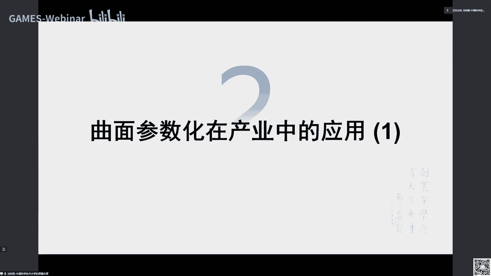

在本节课中，我们将学习曲面参数化技术在游戏工业中的具体应用。课程将首先概述游戏产业中三维建模的基本流程，然后深入探讨参数化作为核心技术，在材质映射、光照烘焙等关键环节所扮演的角色及其实现细节。

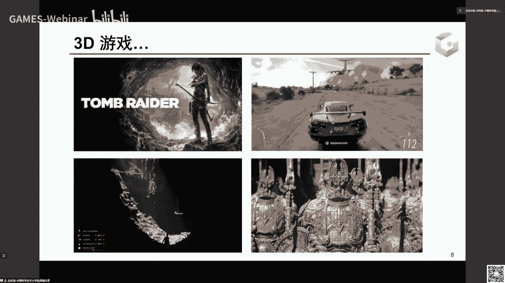

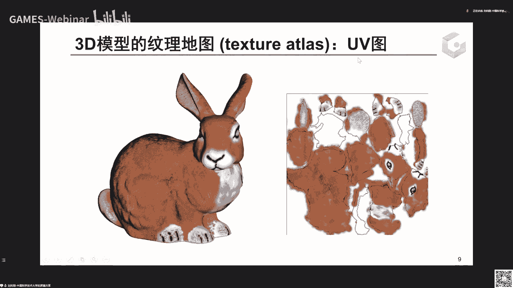

---

## 课程概述

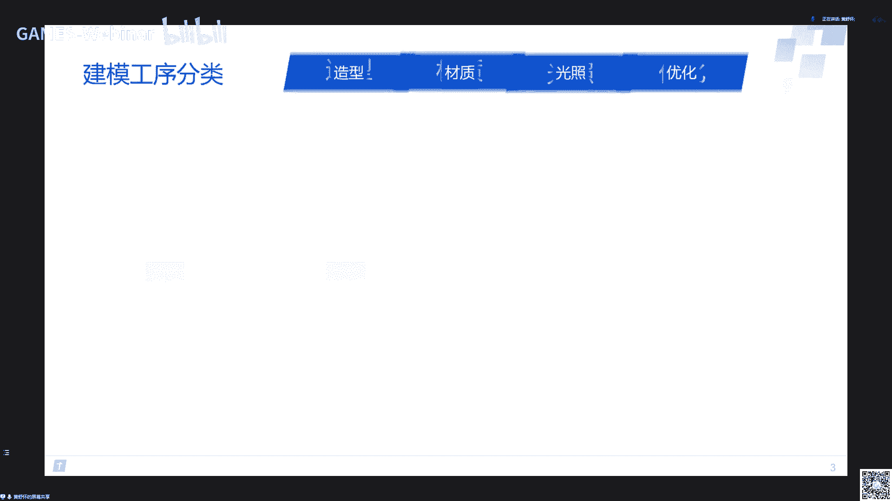

课程已接近尾声。在前面的课程中，三位老师从不同方面介绍了曲面参数化在几何处理中的应用。我们重温一下参数化问题：如何将一个位于三维空间中的曲面（本质上是二维流形）找到其与平面拓扑同胚的映射函数。直观来讲，将一个离散成三角网格的曲面参数化，等价于寻找网格顶点和三角形之间的一一对应关系。我们希望这个映射能保持曲面的一些几何特性，如角度、边长、面积等度量，同时极小化形变扭曲，并避免翻转和自交。本课程始终围绕如何建立一一对应、极小化扭曲以及保持特性展开。相信同学们通过课程，能够了解曲面参数化的基本方法、理论和求解技术。

在第一节课中提到，参数化的核心思想是降维。对于高维曲面，同样有类似的思想在背后支撑。曲面参数化是一个基本问题，在许多几何处理应用的背后，都有参数化技术作为基础支撑。课程录屏已在B站发布，如需进一步理解，可以观看回放。

今天开始，我们将探讨参数化在产业中的大量应用。在今天下午和明天上午的课程中，将介绍几个在产业中非常典型的应用，其中第一个就是游戏产业。

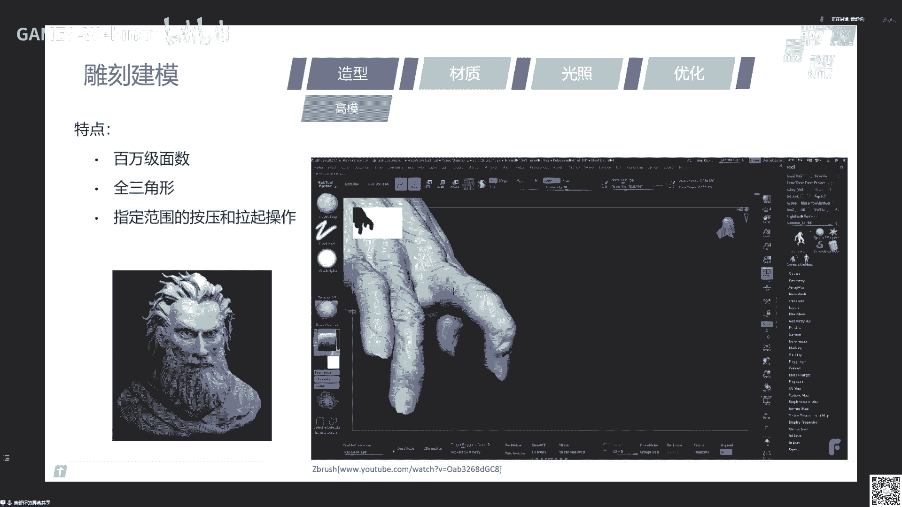

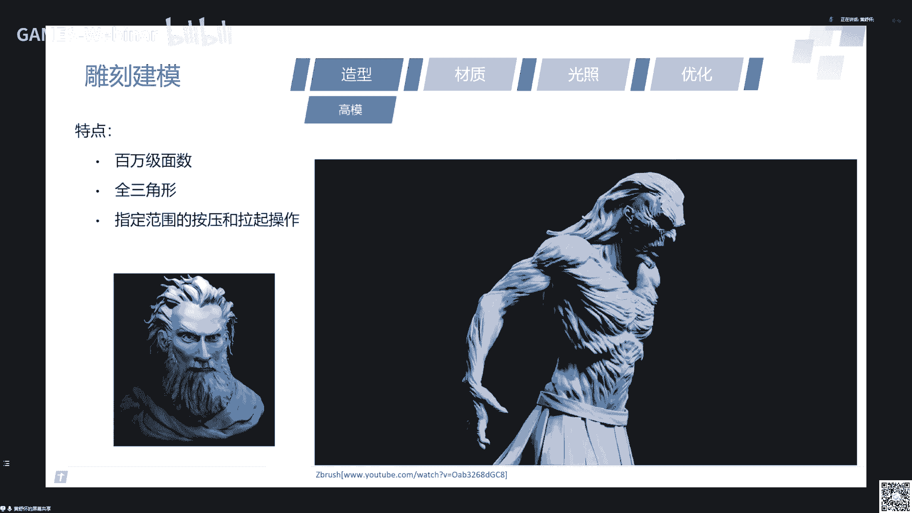

---

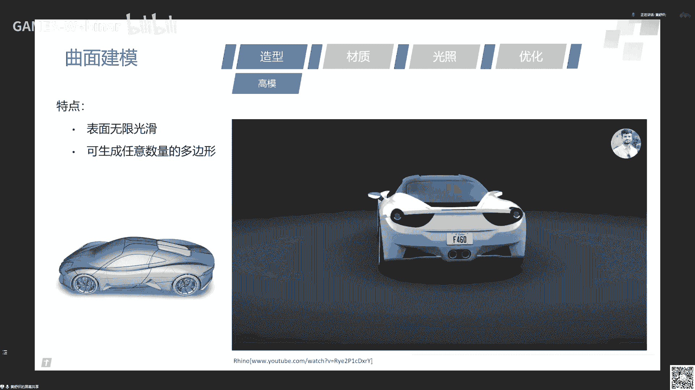

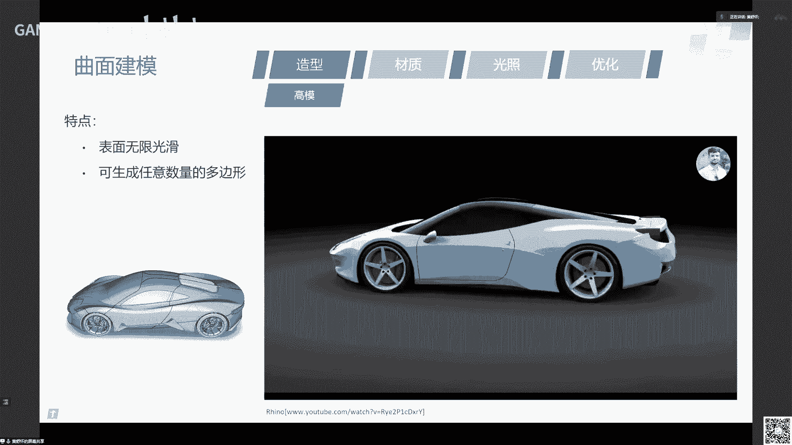

## 游戏产业中的三维模型与参数化

很多同学都喜欢玩游戏，特别是3A级游戏，例如左上角的《古墓丽影》最新版。三维游戏中存在大量的几何模型。

模型上方的贴图就是参数化技术的核心——如何用一张图来近似表达曲面上的各种属性，例如纹理。实际上，曲面上不仅存储纹理，任何信息如材质、法向等都可以这种方式存储。因为曲面上的一个点可以在二维参数化平面（UV空间）中找到对应点。所以，要在曲面上存储信息，完全可以在二维参数平面上进行。纵坐标称为V，因此在工业界也称为UV图，学术界更多称为纹理贴图，这两个概念类似或几乎等价。

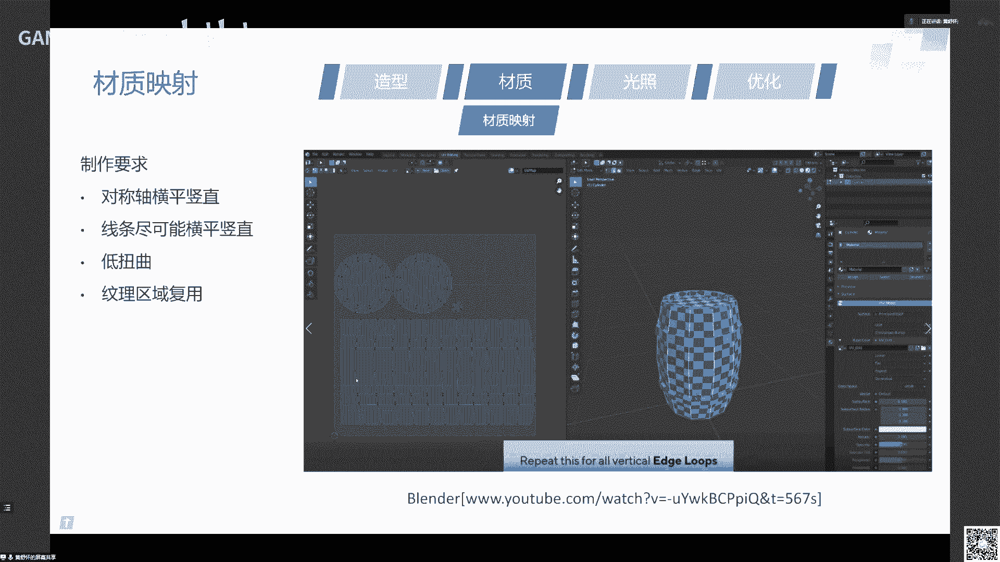

对于复杂模型，最终可能会有很多分片。可以看到这个建筑有很多不同的部件。同样，我们把部件分别参数化，然后平摊到UV空间中。这样，对模型的任何处理，如渲染、光照等，都可以在参数空间上进行对应。因此，UV图的展开是游戏工业界（以及任何与三维模型相关的工业界）非常基础的一项技术。

今天，我们很高兴邀请到腾讯互娱CROS计算机图形技术团队的负责人黄旭华先生，来详细介绍在游戏工业中3D建模参数化背后的故事、应用以及未来发展。

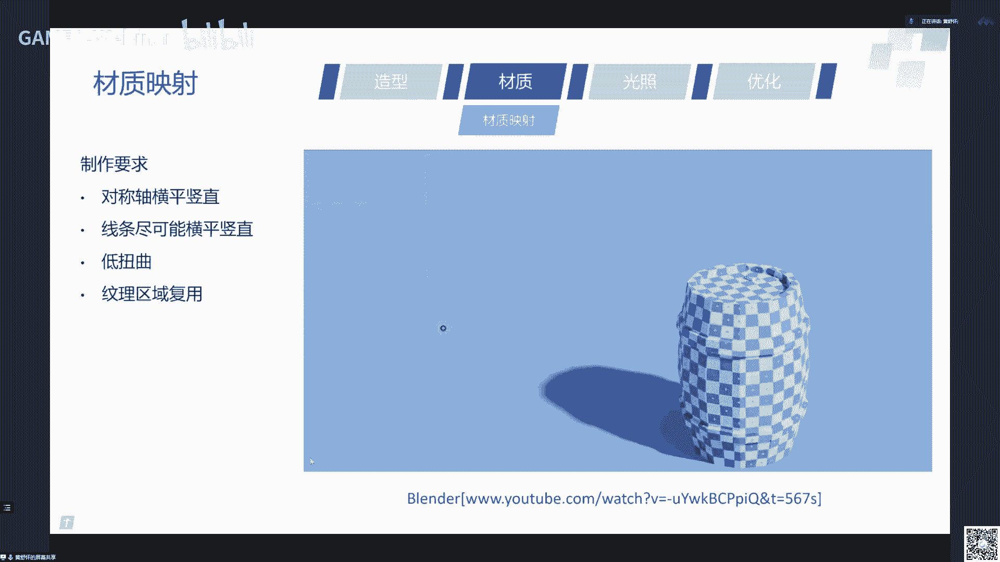

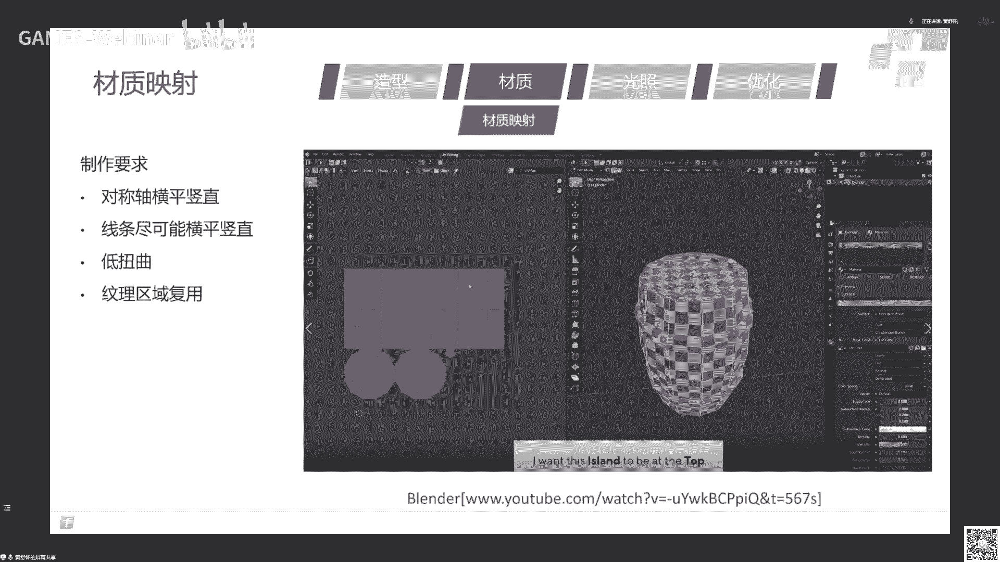

---

## 游戏工业中的三维建模工具链

大家好，很荣幸能在GAMES 301给大家讲解曲面参数化技术在游戏工业中的应用。我来自腾讯IEG（腾讯互娱）的CROS团队，负责计算机图形技术。CROS体系主要进行游戏公共技术的研发，例如游戏底层用到的引擎技术、服务器技术或美术生产技术等。我们对游戏工业的底层技术非常了解。今天我将借此机会，谈谈参数化算法在游戏工业中的工业级应用以及我们的创新。

我的内容大致分为三部分：
1.  首先介绍游戏工业的三维建模工具链，让大家对游戏商业建模有大致了解。
2.  第二部分重点介绍一个核心案例，深入探讨参数化的一个非常深入的应用。
3.  再介绍几个辅助案例，让大家理解参数化应用的广泛性，它不仅仅用于特定地方。

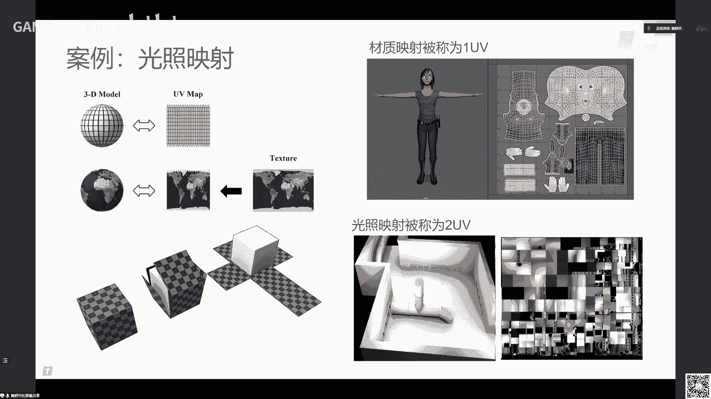

游戏建模中，任何一个三维模型首先需要有造型部分，即勾勒出模型的三维结构。接下来是材质，指造型表面的一些属性。因为我们建模时只需要渲染给用户看，游戏里只有表面重要，内部有什么不重要，所以其表面信息以二维流形的方式存储。这是第二部分。另外，有了表面之后还需要打光，最后需要对模型进行多种优化。

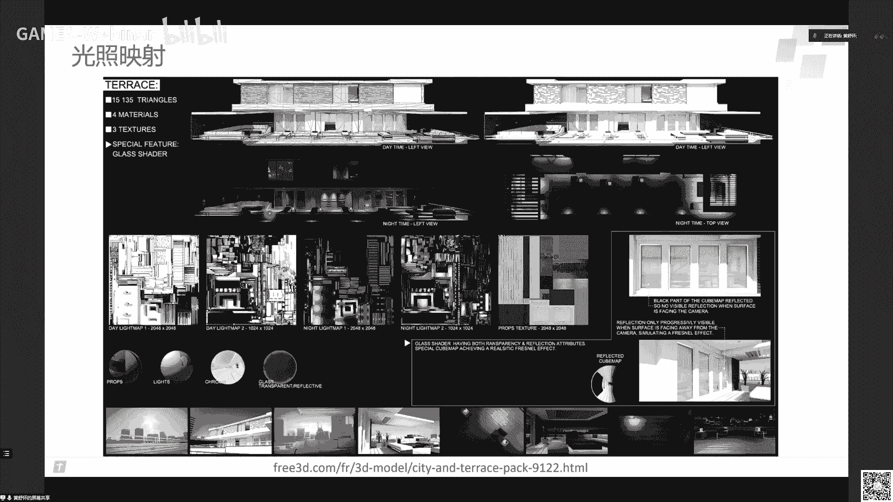

造型部分的制作工序分得比较细致。这里根据造型制作工序分为粗模、高模和低模三类。大家看到的游戏模型，实际上在美术的电脑上是经过很多步骤一步步制作出来的。我会简要介绍这个过程。

### 粗模制作

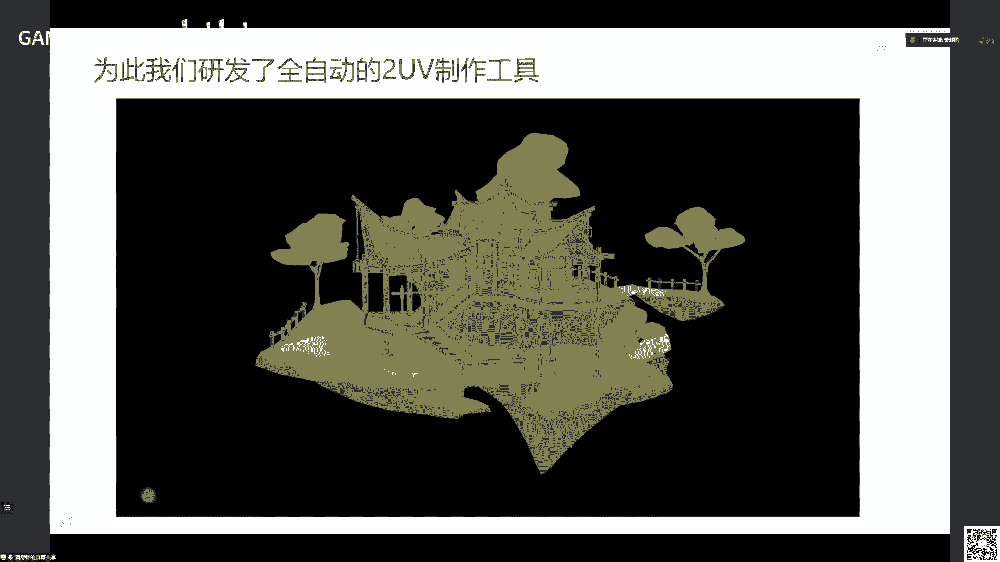

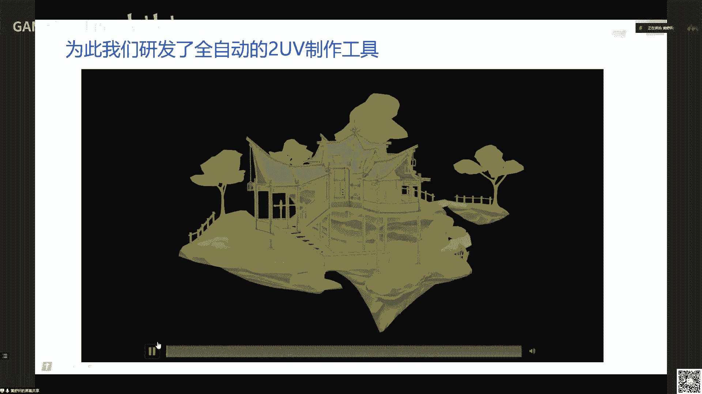

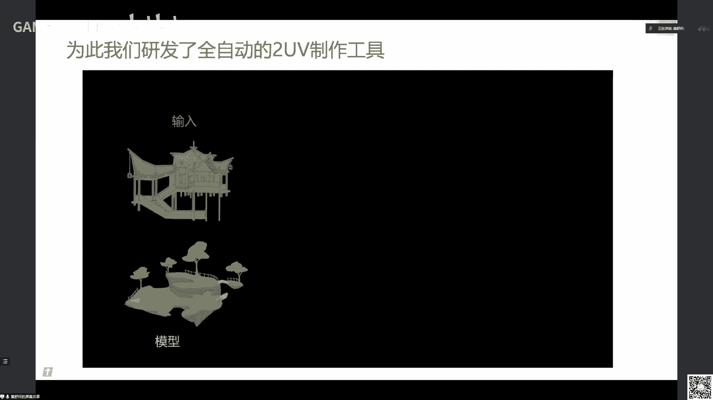

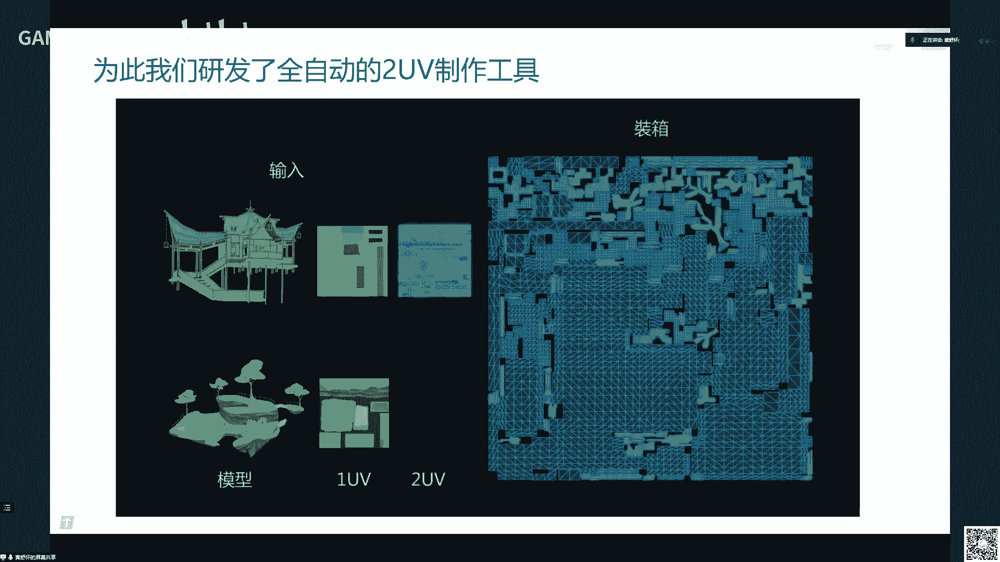

第一步是制作粗模。粗模指在进行精细化建模之前，美术需要先找到一个快速原型，然后可以快速从这个原型上进行细节雕刻或制作，这能极大提升建模速度。其中非常重要的粗模来源是模型库。游戏公司的美术团队基本都有非常庞大的模型库，例如左边的物件模型和右边的一些基本角色模型。这些角色模型的造型很好，布线也非常经典。美术在制作某个角色或物件时，直接基于这种标准、规范、严格的布线进行设计，这称为粗模，是我们建模的第一步。

粗模的制作还有其他方式。例如，仿真建模使用一些物理仿真软件，对模型的衣物进行大体的造型勾勒。这种造型的特点是其面数大约在10万级别，全是三角形。制作时基本使用模拟布料的缝合、拉动等。所以，用右边一个简单的面片就可以缝到左边的裸体上，形成裤子这样的样式。但这种模型不能直接在游戏里使用，因为其质量相对不够高。

还有一种粗模建模方式是三维重建，使用左侧这种专门的三维扫描设备（手持三维扫描或激光/相机阵列设备），或在户外用这种设备进行拍摄。这种三维重建模型的特点是其真实度非常高。但它的限制在于，如果你的游戏项目不是写实类型，就无法使用这种方法。并且，用这种方法得到的模型需要进行较多的后处理。因为在现实中拍照时，拍到的物件光影效果与拍摄当天的光照、天气等环境有很大关系。例如，太阳从某个方向照下来，可能这个方向亮度较高，背光面则较暗。这种光照信息已经附着在模型表面。当放到游戏里时，游戏内的光照实际上并不是你现实采样时的光照，因此在处理时就需要美术抹掉这种光照信息。

### 高精度模型构建

当我们有了粗模以后，接下来就会进行高精度模型的构建过程。这里高清模型的一种制作方法是雕刻建模。雕刻建模往往用在角色模型上，因为游戏里给玩家带来最出彩效果的就是角色模型。这种模型在生产过程中，其三角形网格数非常多，达到百万级三角网格。从视频上可以看到，其三角形稠密程度已经让人感觉不到三角形的存在，感觉像曲面。现在的3A级产品或对质量追求较高的团队会使用这种工序。

它的操作是使用手写笔，直接在模型表面进行按压或提拉动作，就像橡皮泥一样，不断弄出想要的细节。

除了交互建模，在其他一些模型上，比如载具（飞机、汽车等），行业中会利用另一种方式进行高模建模，即曲面（样条）方式建模。在这种建模软件中，编辑的基本操作对象是曲面和曲线。它的特点在于建模过程中不需要太多三角形，而是利用像NURBS曲线这种工业标准的光滑曲线进行建模，其精度可以说是无限高的，并且也可以转换为三角形模型。因为放到游戏里渲染时，无法渲染曲线这种表达形式的模型，所以最终也要变成三角形模型供游戏使用。在一些3A级赛车游戏或飞行游戏中，这种建模方式比较常见。这种方式在国内用得不是很多，因为国内网络游戏较多，做赛车类的比较少，虽然赛车类可能更多也用多边形方式建模。

### 低模制作

接下来是低模。低模是大家在游戏里实际看到的模型，其面数在几百到几万面左右的范围。低模的建模方法也有几种。我现在展示的这种叫拓扑建模。可以看到拓扑建模是如何操作的：直接对模型进行点、线、面的操作，用鼠标选择点、线，然后对点进行剖分、增加、挪位、合并等，逐渐把一个模型从一个简单的几何体变成想要的人形样子。这种建模方式在过去（5年或10年前）是比较常见的方式，现在相对用得少一些，也有不少项目仍会使用，这取决于游戏对模型表现力的要求，是需要高度真实还原，还是大体效果即可。不同的项目会用不同的方式建模，这就是拓扑建模。

另一种拓扑建模是进行高模重拓扑。它与前者的差别在于，这是接着前面制作高模的流程。高模用雕刻方式制作出上百万面的模型，但这个上百万面的模型无法放到游戏引擎里渲染，因为一个模型本身可能有上百兆数据，一个模型体积可能就有游戏体积的十分之一，所以不能用在游戏里。这时，美术就需要把前面工序做出来的非常精细的高模进行拓扑降维（或称降采样），在高模表面生成一些四边形网格三角形来逼近这个模型。这个过程是在表面进行重拓扑，行业内称为高模重拓扑。其面数也是几万到十几万面的规模，同样采用点、线、面的合并操作方式。

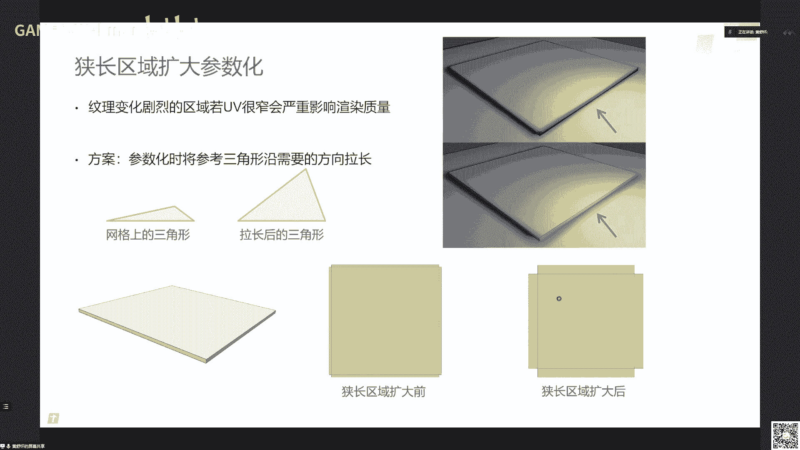

前面的两种方法建模效率较低，一个模型可能要做上一两天，高模甚至可能要做上一到两周。所以，我们也不是总用这种很基础的方法一笔一画地建模。对于一些特定的造型，如果其本身能用数学模型表达，就会采用程序化建模。例如右上角的SpeedTree插件专门用来生成树木。树木的造型可以根据一些生物学原理来模仿，调整参数就可以快速生成树木。这种建模方式可以用在树木、植被、怪物，还有一些特定建筑（左下角）等造型比较固定、系列化的东西上。特别是像一些特别大的世界（如开放世界游戏），里面有大量重复的树木、建筑、怪物等，用这种方式建模能极大提升工作效率。但它的限制在于只能制作特定类型的模型，因为我们很难把所有东西的建模数学模型都归纳出来，所以这不是一个很普适的方法。

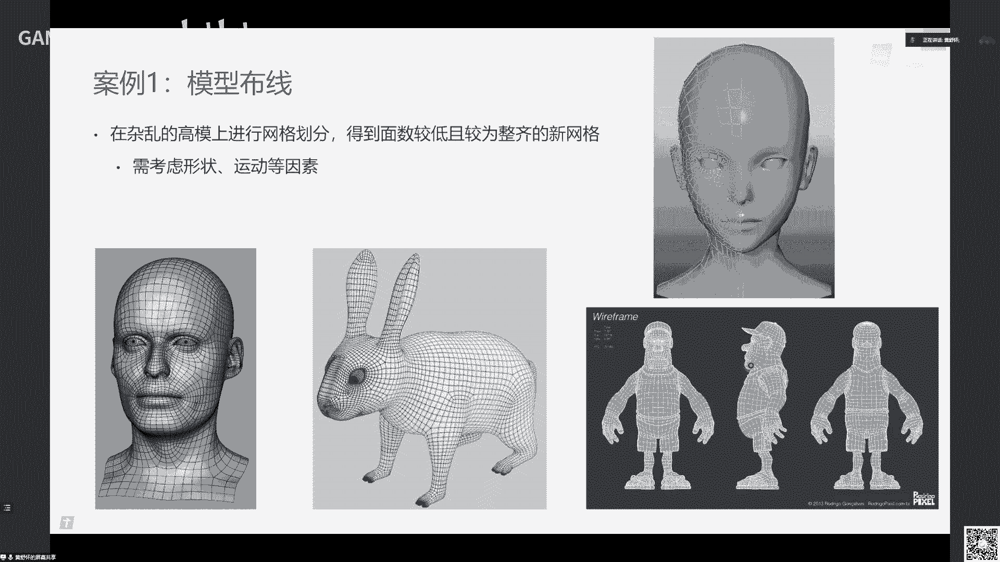

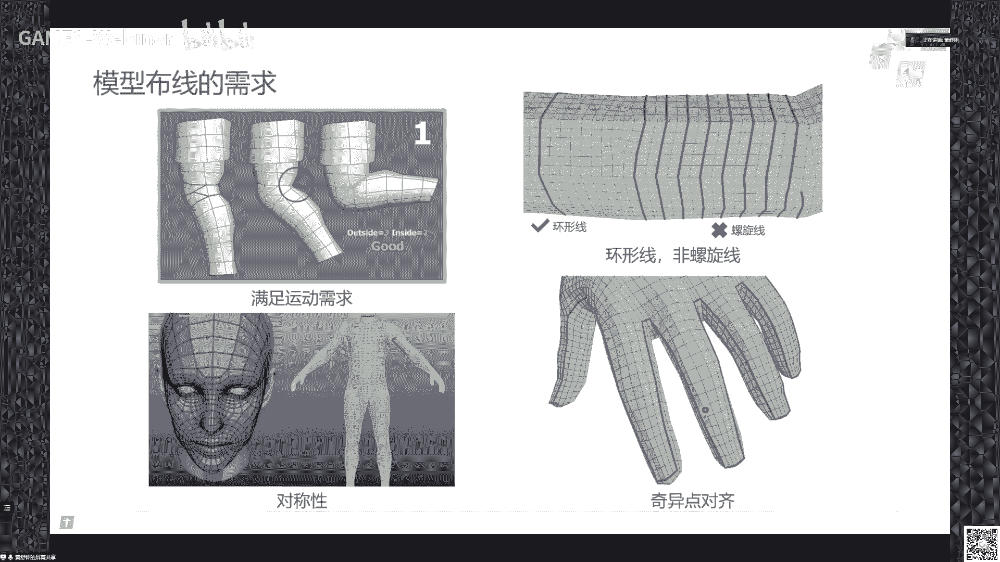

---

## 参数化的核心应用：材质与光照映射

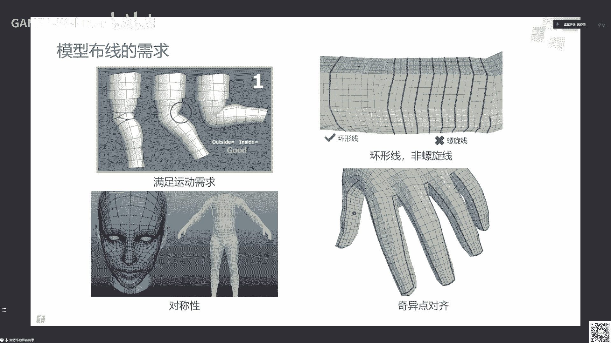

讲完建模，就要讲到我们今天的主角——参数化。所有的模型都需要进行材质表面的映射，即需要把模型的表面信息存储起来。那么，如何为任意造型的表面存储信息？如何定位哪个地方存什么信息？

这里首先需要进行空间转换。我们需要把一个任意造型的模型表面映射到一个长方形、矩形或正方形区域。模型表面的每一个点对应到这张截图上的每个像素，我们就可以把信息存储在这个正方形上。这个方法就是参数化技术。

材质映射是专门给材质贴图使用的。可以看一下右下角的房子，我们把这个模型拆成很多块，映射到右边这个正方形之后，就可以利用表面绘画软件直接在模型表面进行涂抹绘画，这些信息就会同步传到右边的纹理上。这个映射过程用到的就是参数化技术。并且，这种参数化映射有很多要求，如果不满足这些要求，模型质量会比较差。

我们看看有哪些要求。首先，造型在矩形空间里不能斜着放。因为引擎在进行渲染时会进行光栅化，在纹理上进行采样时，其实是在UV空间进行采样的，即横向和竖向采样、插值。如果你的造型是斜着的，就会导致采样时很容易跨像素进行插值。你在同一排像素之间进行插值，是在相邻两个像素间插值。但如果斜着走，很容易在一些三四个像素交界的地方，在很短的距离内跨越好几个像素，这时的采样效果就会变差，很容易造成纹理在模型表面产生锯齿状。因此，游戏里进行参数化会要求一定要做得非常横平竖直。基本要求是图案的对称轴要与U轴或V轴平行或垂直。另外，在保持横平竖直的情况下，要尽量降低扭曲，形变不能太大。

材质映射还有一个特点是会共用纹理。共用纹理指一些相同的图案会映射到模型的同一个区域。例如一些木头的位置，不同的地方可能映射到同一个木头纹理区域；左下角的头发，实际上总共只有五六根、七八根，但满头可能有四五十根头发，它们被重叠映射到了纹理上。材质贴图本身又是另一类问题，它涉及引擎的渲染方法，即材质纹理保存什么信息。它使用辐射度度量学、光路学或几何光学等方法进行材质信息编码，与渲染管线强相关。例如固有色和漫反射的存储法，或高光度、金属度和粗糙度这种PBR光照模型，或经典的镜面反射模型，还有透明度、发光度等。这些不同的辐射度量学和光度学等信息都会用在材质贴图上，共用材质映射。

另一种贴图是凹凸贴图，它也是共用材质映射的一种贴图。它主要表达的不是物体表面的材质信息，而是物体表面的微观起伏。凹凸贴图有很多种做法，如Bump Mapping, Normal Map, Displacement Map等，这些做法是行业比较标准的用法。我们可以看到，这个模型在没有使用法线贴图的情况下，表面比较光滑圆润；使用法线贴图后，物体表面的细节会立刻变得丰富。

宁可牺牲模型表面的一些造型细节（即扭曲比较大一点），也一定要保证UV映射的线条非常横平竖直。原因在于，光照映射不是美术创作的内容，它实际上是模型放到引擎里以后，通过引擎的光照算法（灯光、太阳光等）打到物体表面的辐射度，存储到光照映射对应的纹理上。这样使得物件看起来有很真实的光照效果。这是由引擎产生的。也就是说，每个物件的表面、整个场景（假设是一个非常大的世界），所有地方都会有对应的光照信息存储，所以会消耗大量的存储量。因此，光照映射一般在游戏中会使用非常低的分辨率。如果你的材质映射用的是512x512的分辨率，那光照映射可能对应只有128x128甚至64x64的分辨率。所以光照映射对横平竖直的要求非常高，否则在这么低分辨率的情况下，采样的插值锯齿会非常严重。

映射讲完后，最后谈到优化。前面有了模型、材质、纹理之后，这些模型最终还要进行简化。我们在游戏里看到的模型，有些在画面很远的位置出现，有些在很近的位置出现。这时引擎实际上是用不同精度的模型去渲染它们。近景时，你看到的模型是渲染非常高密度的模型；但当角色走到很远的位置，引擎渲染的其实是另一个简化模型。这个机制就叫做LOD（Level of Detail）。在进行LOD时，也需要进行对应的UV、纹理混合、蒙皮等的同步简化，这里面也要用到参数化技术。

---

## 参数化在游戏建模中的主应用案例

好，到现在我就把游戏建模的方法和里面用到的一些技术大体讲了一遍。后面我接下来开始谈里面的参数化部分内容。

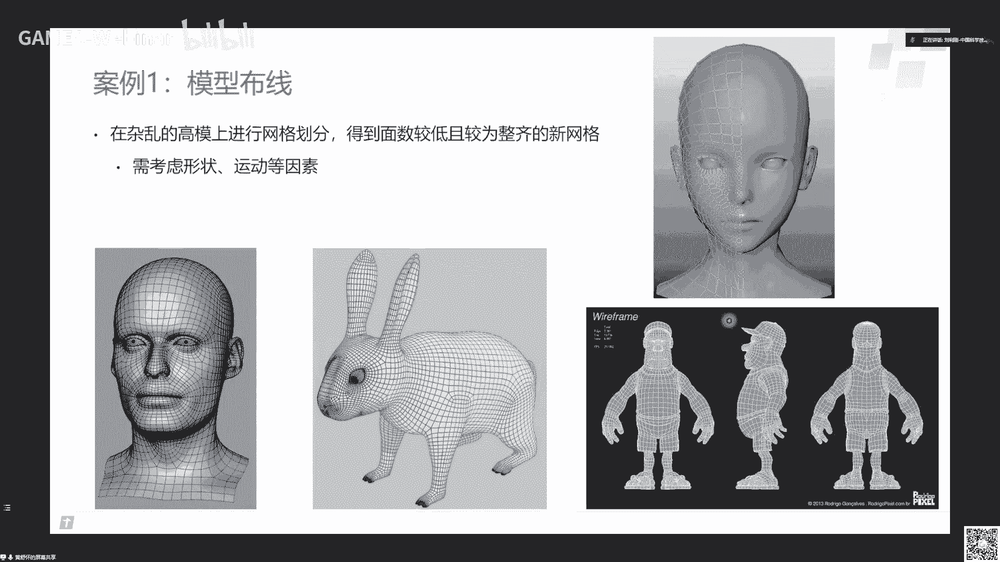

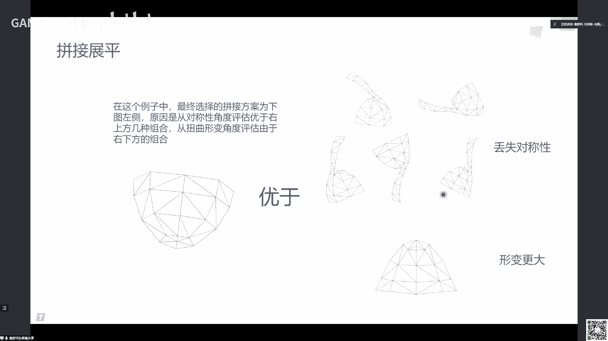

参数化在建模里，首先很容易理解的是它的主要应用，就是把模型的表面映射到刚才讲的正方形区域。这很好理解，材质映射、造型映射、光照映射等，我刚才举了好几种例子。这些就是主应用。但实际上，它使用的地方远不止主应用看起来那么多，还有很多嵌入式应用。嵌入式应用包括模型之间信息迁移、配准的手段；纹理装配中，图案的原画设计稿与模型表面内容的映射；进行纹理的几何压缩；进行一些造型识别、贴合度评判等。后面我都会举个例子讲明白。

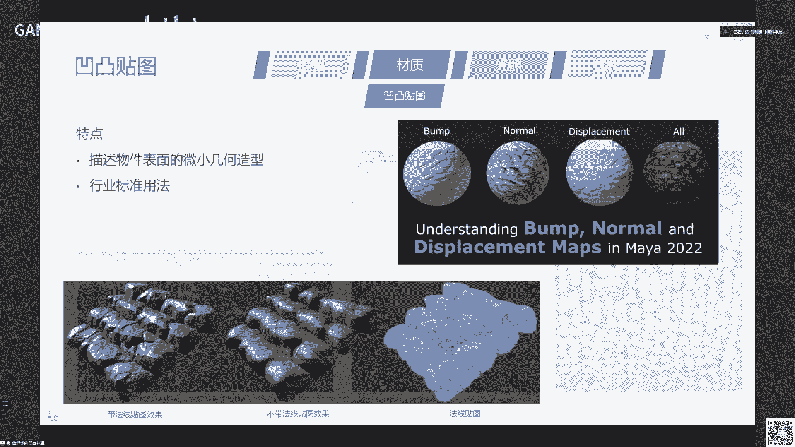

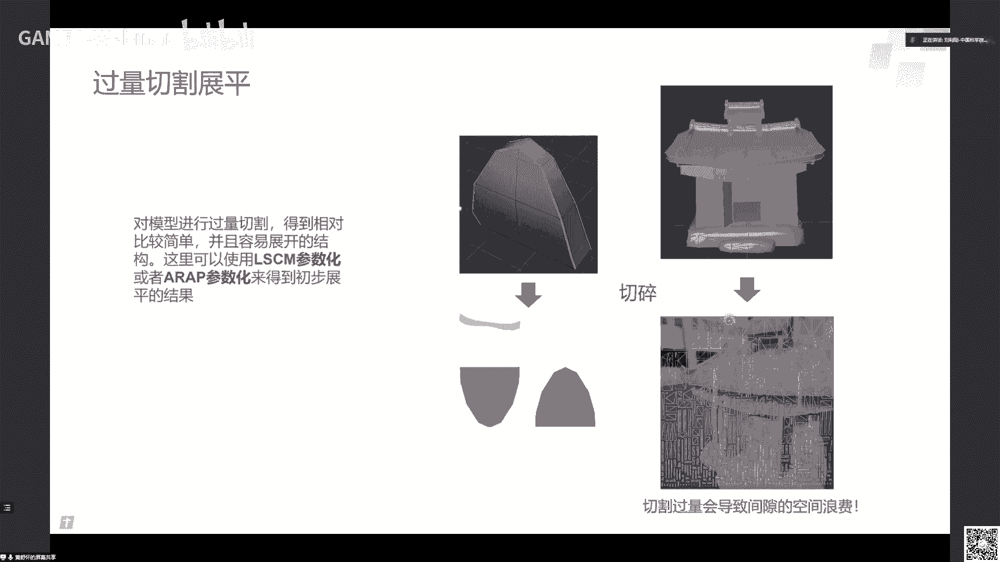

先来谈一个主应用案例，还是讲到光照映射。光照映射在行业里会叫第二套UV（2nd UV），就是把光照信息映射到纹理上；材质映射是第一套UV（1st UV），把材质信息映射到纹理上。

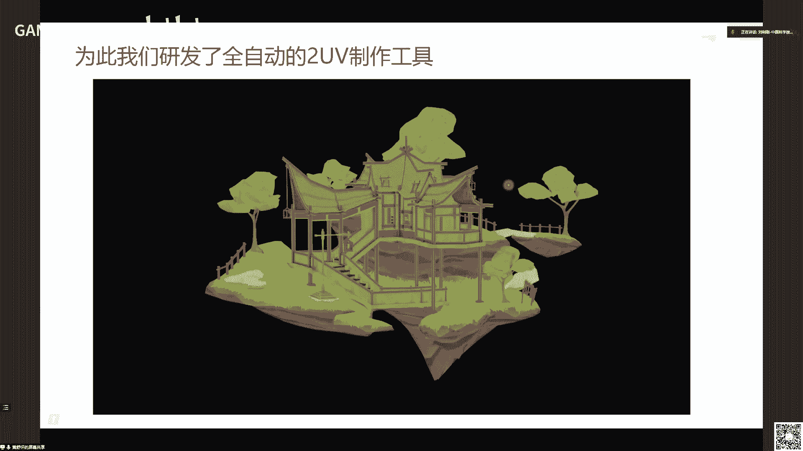

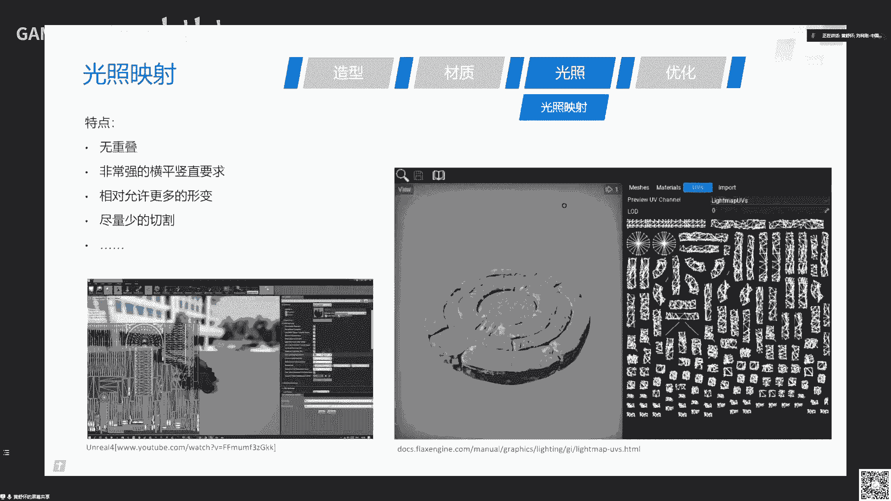

这是基本的UV原理。这是一个实际会用到的光照图（这不是我们游戏中的光照图）。我们来看一下这个建筑，它的材质映射是这张图，里面的材质种类比较稀少，比如木板、墙壁、柜子、屋顶等，内容很少。它大量的区域可能共用的是同一个墙壁，就会映射到同一个地方。这叫材质映射。但是光照映射，你没办法这样共用，因为在物件的任何一个位置，它的光照信息都不一样，每个地方都不一样，你不能确保这个地方光照完全一样，这是完全不可能的。所以光照映射就得完全毫无重叠地平铺，把物片表面的每一寸都平铺到空间里。这里看到有四张光照映射图，分别是白天高精度（2048x2048）、白天低精度（1024x1024）以及两张晚上的，对应出来的渲染效果就是白天的两个效果、晚上的两个效果。

这就是光照映射的原理。光照映射（2nd UV）制作要求有这些：第一，UV展开后拉伸不能太严重，否则会导致光照密度过度不够光滑；第二，不能用斜边，斜边会导致光照产生锯齿，但如果把UV岛变成平直的，这里就不会有锯齿出现；第三，不允许任何重叠（这与材质映射不同，材质映射UV可以重叠）；第四，对称性要可以保留，因为如果对称性与UV空间的轴向不水平或垂直，也容易出现斜边，采样效果不好；第五，切割位置，在一些光在模型表面是光滑的区域，如果切成两个UV岛，在引擎渲染中很容易产生漏光、过渡不自然，因为光泽纹理分辨率很低；第六，又不能切太碎，因为切太碎（每个三角形一个UV岛）会导致纹理中间间隙留很多，造成空间浪费；最后，装箱时，切好的UV岛要很紧密地排布在空间里，避免纹理空间浪费导致游戏体积变大。

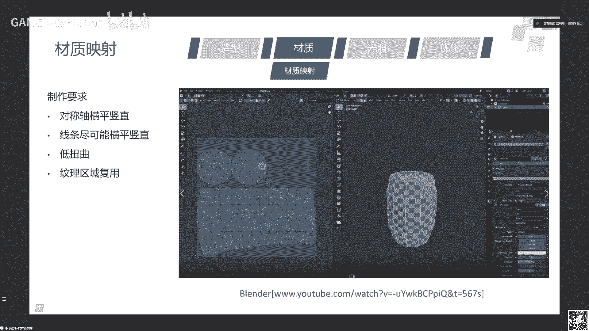

这些就是2nd UV的制作要求。有这种要求的情况下，实际上行业里进行这种光照映射的制作，没有很好的自动化软件可以做得到，因为这个要求太复杂了。像这么一个模型，目前在行业里大部分是人工制作，大概需要花30~40分钟时间把模型变成这样的映射。右边这些是一些自动软件产生的效果（Unreal和Unity的效果），我们会看到Unreal和Unity对比人工，质量差很多。首先空间利用率就差很多，有很多空隙；另外，Unreal这个切得太碎，导致渲染时会产生很多黑边。所以实际上行业里进行2nd UV展开，是用人工进行的。

为此，我今天讲的这个案例提到的是，我们做了一个全自动的工具。看一下效果，我们可以做到替代人工。这是一个输入模型，它有人工做好的材质UV（1st UV）。现在这部分是一个自动化的2nd UV生成过程：拉直确保线条与UV轴垂直；缩放确保密度合适；然后进行装箱来保证空间被完全利用。这是2nd UV做好的一个效果。底下是另一个模型的2nd UV制作：拉直、缩放、装箱，然后进行烘焙。有了这个2nd UV并进行烘焙后，大家看到左边的模型有了光照纹理，立体感一下就强了很多。

我们的2nd UV制作流程大致分为几个步骤：切割展平、形变拉直、尺寸调整（确保UV密度合理）、最后紧致装箱（确保空间不浪费）。在前面切割展平以及形变拉直这两个步骤，大量使用了参数化算法，而且是我们专门为这个工具定制开发的参数化算法。

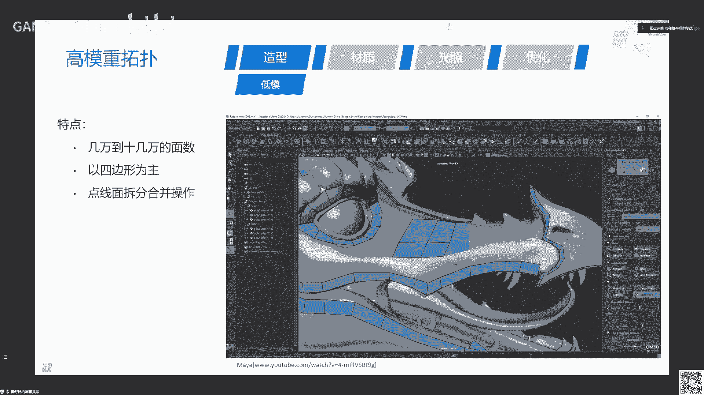

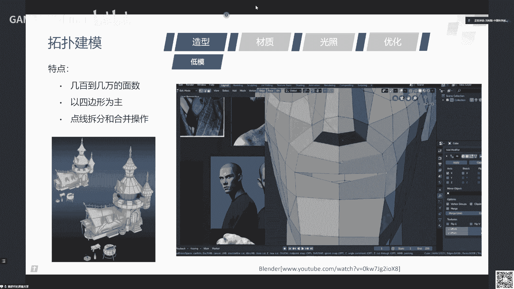

首先，第一步在进行参数展开时，为了确保扭曲不要太大，要先进行切割。我们看一下怎么切割的。切割我们采用一种过量切割加拼接的方法：先把东西切得特别碎，比如把这个模型切得这么碎，或者把这个小零部件切成三个部分；然后对它进行拼接。这个切割肯定是过量的，肯定不满足要求，我们就把它拼接一下，拼接之后对它进行参数化展开；展开以后我们来看这个拼接完的效果是不是我们能接受的。所以实际上把切割过程变成了一个过量切割再拼接的过程。在切割模块就可以判断出，这种拼接方式比另外几种拼接方式要优。为什么更优？因为拼接完后，这个造型其实已经丢失了对称性。对称性就是，你看这个模型原模型是这样子的造型，但你展开后变成这样，对称性就丢失了。对称性丢失，放在UV空间里也很容易出现斜线采样。这两个造型的对称性没有丢失，但相比之下，这种切割就比这种切割形变要小一些，那我们就认为OK，选用这种拼接方式。这就是我们切割算法的基本原理。这个切割整个过程中要进行非常多次参数化。