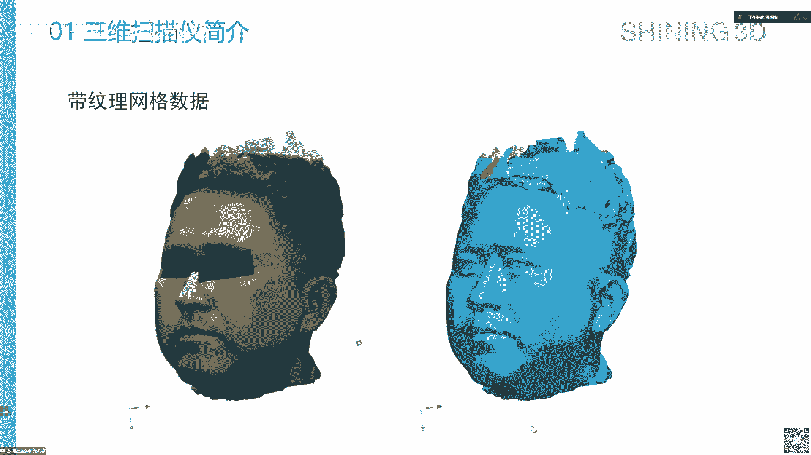
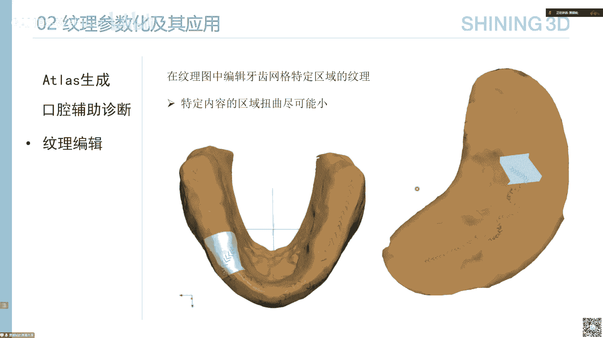

# GAMES301-曲面参数化 - P15：Lecture 15 参数化在产业中的应用(2) 🏭

在本节课中，我们将继续探讨曲面参数化在产业中的具体应用。上一节我们介绍了参数化在游戏建模中的应用，本节中我们将重点关注另外两个重要领域：三维扫描与工业软件中的等几何分析。我们将了解参数化技术如何在这些领域中解决实际问题，并推动产业发展。

## 三维扫描工业中的参数化应用 📡

首先，我们来了解三维扫描仪的基本工作原理。三维扫描仪的功能是通过不同视角扫描物体，获取完整且高精度的物体表面信息。其基本逻辑分为两步：首先，通过二维图像和深度信息重建三维点云；其次，将不同视角的点云对齐到同一坐标系，从而重建完整的物体表面。

### 三维扫描的基本原理

以下是三维扫描仪实现上述功能的核心技术：

*   **深度信息获取**：通过多相机加结构光技术实现。人眼依靠双目视差感知深度，计算机则通过多个相机从不同视角拍摄，并主动投射带编码信息的结构光来创造特征点，辅助在不同图像中找到对应点，进而通过几何计算恢复深度信息。
*   **位置信息获取**：通过特征匹配与辅助信息实现。扫描时相邻视角的数据有重叠区域，通过识别重叠区域的几何特征，可以计算点云间的相对位置关系。对于特征不明显的场景（如一面白墙），可以手动粘贴编码点作为辅助跟踪信息。

基于不同的结构光类型和相机数量，衍生出了适用于不同场景的三维扫描仪，例如同时获取深度和纹理的彩色扫描仪、适用于工业检测的高精度激光扫描仪以及牙科诊所使用的口内扫描仪。

### 三维扫描的算法流程

上一节我们介绍了扫描的基本原理，本节中我们来看看其背后的完整算法流程。扫描完成后，软件需要处理数据以生成带纹理的三维模型。

整个算法流程可以概括为以下几个核心步骤：

1.  **标定**：确定扫描设备中多个相机与投影仪之间的相对位置关系，这是后续深度重建的基础。
2.  **结构光重建**：利用标定结果和结构光图案，计算每一帧扫描所对应的三维点云。
3.  **位置跟踪**：根据前后帧点云重叠区域的几何特征，计算每一帧点云在全局坐标系中的相对位置。
4.  **点云全局注册**：解决位置跟踪中产生的累积误差。通过建立全局优化方程，一次性优化所有帧的位置，获得更准确的整体点云位置。
5.  **网格化**：将位于同一坐标系下的所有点云连接，生成表示物体表面的三角网格。
6.  **网格后处理**：对生成的网格进行光顺、拓扑优化、简化等操作，使其几何信息更适合后续处理。
7.  **纹理融合**：为网格表面贴上正确的纹理信息。利用负责纹理的相机与深度相机的标定关系，以及点云的位置信息，可以计算出每个纹理图像对应的空间位置。然后为网格上的每个面片选择最佳的纹理图块，并将这些图块排布到最终的纹理图中，生成“分块纹理图”。

### 参数化在纹理处理中的应用

在纹理融合步骤中，我们得到了网格模型和一张分块纹理图。虽然这种分块纹理图生成速度快，便于实时显示，但也存在一些缺点：纹理碎片化不利于语义分割等算法处理；存在信息冗余；网格分片交界处的纹理坐标不唯一，增加了纹理编辑等操作的复杂度。

因此，我们需要对已经恢复纹理信息的网格进行参数化展开，建立网格表面与二维纹理图之间的一一对应关系。这就是参数化在三维扫描产业中的一个核心应用。

#### 应用一：UV Atlas生成

UV Atlas（纹理坐标图集）的生成是为了获取从模型空间到纹理空间的映射。这个过程通常包括网格切割、分片参数化以及最终的图块排布。

在三维扫描产业中，对UV生成的需求与游戏产业侧重点不同：

*   **对排布效率要求相对较低**：因为扫描得到的几何数据（动辄数百万面片）的存储量远大于纹理信息。
*   **对计算效率要求极高**：数据量大，必须追求处理速度。
*   **对质量有基本要求**：在追求速度的同时，仍需保证参数化结果的扭曲度较小。

为了满足工业界对效率的严苛要求，工程实现上会进行一系列优化：

*   **网格简化**：先使用**QEM简化算法**等将原始密集网格简化到较少面片，减少后续处理的输入数据量。简化过程需记录粗网格到细网格的映射关系。
*   **网格分割**：在简化后的网格上进行分割，作为参数化的输入。分割过程通过迭代实现，目标包括：分片内可展性高、分片形状规整（减小割线长度）、边界平缓。公式化描述如下：
    *   可展性约束：新面片法向与分片拟合圆锥轴线的夹角需小于阈值。
    *   规整性约束：`新面片到种子面片的距离 / 当前分片面积` 作为约束量。
    *   边界平缓：通过边界边长度与内部边长的比值来约束。
*   **分片参数化**：对分割后的每个块进行快速的参数化计算。工业界会选择速度快的参数化方法。
*   **并行化考虑**：为了使计算任务能高效地分配到不同CPU核心，分割时需尽量保证各分块的大小接近，以避免负载不均。

#### 应用二：口腔辅助诊断

参数化在口腔医疗领域有独特的应用价值。传统牙医依靠口腔镜观察，存在死角且难以记录治疗过程的变化。数字化方法通过口内扫描仪获取三维牙颌模型，使观察无死角且全程可记录。

在辅助诊断中，传统方式是医生在三维场景中多角度观察和截图，耗时较长。参数化可以提供一种加速思路：将牙齿或牙龈的网格表面展开到二维平面，在二维纹理图上利用图像识别技术提供初始病变判断，辅助医生快速定位问题。

在此应用中，参数化方案有特殊需求：

*   **整体性**：希望映射结果是联通的整体区域，而非分块，以避免破坏语义信息。
*   **区域面积控制**：能够控制网格上不同区域（如牙齿、牙龈）在参数空间中的面积比例，使需要重点检测的目标区域在纹理图上占据更大面积，便于算法识别。
*   **计算速度快**：面向海量用户，效率至关重要。
*   **纹理编辑友好**：希望医生在三维模型上做的标记，在参数化展开后扭曲尽可能小。

实现这些需求可能涉及引入控制点约束来调整参数化结果，或研究在复杂牙颌模型上保持标记区域低扭曲的参数化方法。

**总结**：在本节中，我们首先了解了三维扫描仪的基本逻辑和算法流程，然后深入探讨了参数化技术在三维扫描产业中的关键应用，包括高效的UV Atlas生成和为口腔辅助诊断提供的特殊参数化方案。参数化作为连接几何与纹理的桥梁，在提升三维扫描数据后续处理效率和拓展应用场景方面发挥着重要作用。

---

## 参数化在工业软件与等几何分析中的应用 ⚙️

上一节我们探讨了参数化在三维扫描中的应用，本节中我们来看看它在工业产品设计制造软件，特别是等几何分析中的关键作用。

工业产品制造流程复杂，涉及计算机辅助设计、工程分析、制造等多个环节。其中，CAD负责产品外形设计，CAE负责性能仿真分析。传统上，CAD模型（通常用样条等连续函数表达）需要被离散成网格，才能进行有限元分析。设计不满足要求时，需要返回修改CAD模型，再重新生成网格进行分析，迭代成本高。

等几何分析旨在解决这个问题。其核心思想是：**直接使用CAD模型所用的样条函数作为分析场函数的基函数，实现CAD与CAE的模型统一，避免离散化网格的生成与迭代**。

### 等几何分析中的参数化问题

在IGA中，我们直接在CAD模型（参数域）上定义物理场。但CAD模型通常形状复杂，而样条基函数定义在规整的参数域（如二维矩形、三维长方体）上。这就引出了IGA中的关键问题：**如何将复杂的物理计算域参数化到一个规整的参数域上？**

例如，给定一个二维的蝴蝶形状区域或三维的鸭子体，如何将其分别参数化到单位矩形和单位立方体上？同时，我们希望这个映射是双射，并尽可能保持角度、面积或体积等度量属性，以保障后续分析的数值稳定性和精度。

### IGA参数化的主要方法

该领域的参数化方法与我们课程中介绍的方法一脉相承，主要分为以下几类：

1.  **基于简单构造的方法**：如**Coons曲面法**，仅用四条边界曲线构造曲面，方法简单但质量不高。
2.  **基于调和映射的方法**：求解拉普拉斯方程得到映射。公式为：`Δφ = 0`，其中φ是映射函数。该方法光滑但无法严格保证无翻转。
3.  **基于非线性优化的方法**：将参数化问题转化为优化问题。目标函数通常是减少扭曲能量，约束条件为保证映射的局部单射性。这与离散参数化思路一致，只是优化变量是样条基函数的系数。
    *   常用能量包括：伸缩能量、狄利克雷能量等。
    *   为保证单射性，除了要求雅可比行列式大于零（`det(J) > 0`），也可使用**拟共形映射**或更特殊的**Tutte映射**条件。例如，Tutte映射要求映射是凸组合，天然保证局部单射。

此外，对于复杂形体，单一块参数化效果不佳，需要采用**多块参数化**策略，即将复杂域分割成多个与规整参数域同胚的子块，分别参数化后再拼接。分割方法包括基于骨架、基于PolyCube等启发式方法。

近年来，**基于三角形/四面体的样条**（如TPMS， Tris）成为一种新趋势。它可以直接定义在三角形网格上，避免了将复杂域分解为四边形/六面体块的难题，为IGA参数化提供了新的灵活性。

**总结**：在工业软件领域，参数化是连接CAD设计与CAE分析的桥梁。等几何分析通过使用统一的样条表示，试图消除两者间的鸿沟，而其核心挑战之一就是复杂计算域的参数化。解决这一问题的方法论与我们课程所学的曲面参数化技术深度相通，都是寻求从复杂域到规整域的良好映射。

---

## 其他参数化类型与课程总结 🎓

除了平面参数化，根据输入模型的拓扑类型，还有其他参数化形式：

*   **球面参数化**：针对亏格为0的封闭曲面，将其映射到球面上。方法也分为直接法、优化法（如将ABF、ARAP等能量推广到球面约束下）以及基于层次化简化的方法。
*   **点云参数化**：直接对点云数据建立参数化，通常先建立点间的邻接关系（如构建网格或定义邻域），再借鉴网格参数化的方法。
*   **高维数据参数化**：从流形学习的视角看，曲面参数化本质上是将高维观测数据降维到其本征的低维流形上。高维数据降维的思想与参数化一脉相承。

### GAMES301 课程总结

回顾整个GAMES301课程，我们系统性地学习了曲面参数化这一几何处理的基础与核心技术：

*   **基础与离散方法**：我们首先建立了参数化的基本概念，然后深入学习了基于离散网格的各种参数化方法，包括保角、保面积、最小扭曲等不同目标下的优化技术。
*   **连续方法**：我们探讨了基于光滑函数（如调和映射、凸组合映射）的参数化方法，这与工业软件中的需求紧密相关。
*   **产业应用**：通过腾讯游戏建模、先临三维扫描以及等几何分析等案例，我们看到了参数化技术在驱动产业创新中的实际价值。

参数化作为连接几何表示与后续应用的桥梁，其重要性不言而喻。随着可微计算、自动微分等新技术的发展，参数化技术的实现和优化将变得更加高效和智能。

**本节课中我们一起学习了**参数化在三维扫描和工业软件/等几何分析两大产业领域中的深入应用。结合上一讲的内容，我们完整地看到了参数化技术从理论到实践，从娱乐产业到高端制造的全景图。希望本课程能为大家在几何处理领域的研究与应用打下坚实的基础。

**课程资料**：所有课件、课程录屏和作业资料将整理并备份在GAMES课程官网及B站，供大家复习查阅。完成作业的同学将获得课程结业证书。

感谢各位的参与，期待在未来的GAMES系列课程中再次相见！