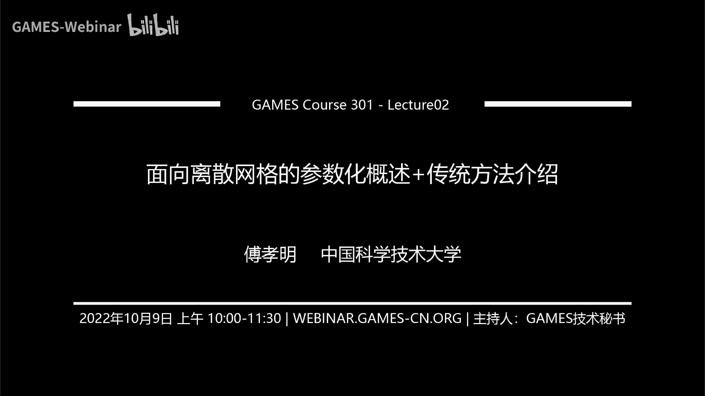

# GAMES301-曲面参数化 - P2：Lecture 02 面向离散网格的参数化概述 - GAMES-Webinar - BV18T411P7hT

诶那个欢迎大家来到那个gp 301的第二讲啊，就曲面三句话的第二讲，我们今天是主要介绍一下这个面向离散网格的这个参数化，然后等一些基本的情况就是，然后并且介绍一些呃传统的这样的参数化的方法啊。

在后续的课程中，这个关于离散网格的这个参数化方法，或者说意识，或者说这个映射计算的方法，我们后面会介绍一些比较新的一些方法。

首先是这个介绍啊，那么这个离散网格，离散网格的话呃，它就是有这个顶点和这个呃有这个几何和拓扑决定啊，零呃几何的话一般对于这种水密的网格，或者说对于这种窝，对于这种就是流行的网格的话。

他首先主要是用这些顶点的位置来描述这个几何，然后顶点与顶点之间的连接关系，如果是其他的网格的话，还会存在这个四面体啊等等这样的一些你可以认为是这种graph，就是这种图的这种概念去把这些顶点给连接起来。

这些东西呢是描述了这个网格的这个connectivity，它的连接性，所以说一般的离散网格都是有这样的一个表示，那么离散网格的话，最常见的离散网格有这样的四大类，那么一类是这样的三角形网格。

四边形网格呃，四面体网格，还有六面体网格啊，对于这样的三角形网格，或者说，对于这样的三角形网格和这样的四边形网格的话，它主要是这个表面网格内部是没有填充的，那么对于这样的网格而言的话。

我只只只靠只有他这样的一个表面的信息，那么对于这个右边这两个网格的话，就是所有的这个元素都是这个四面体，右边这个的话所有的元素都是六面体，六面体的话就是它是跟这个立方体是拓扑上是一样的。

那么这边是四边形，这边是三角形，就是最常见的呃四类网格啊，当然这种网格现在这个里面展示的网格只是一种网格，里只有一种类型，比如这里只有三角形，这里只有四边形，这里只有四面体，这里只有六面体。

但是在这个现实生活中，或者说在这个实际的使用过程中，其实会存在混合网格，就比如说表面网格的话，又有三角形，又有四边形，可能还有五边形等等啊，当然题的话也会有一些什么棱柱啊之类的。

那么现在我们要去我们要去研究的是这个啊，我们我们主要是要去研究的是这样的一个映射，那么这个应该刘老师在上节课的时候也提到过呃这样的一个映射，那么这样的映射的话。

其实是从这个左边这样的omega这样的一个定义，映射到右边这样的一个变形后的这样的一个呃形状，那么这样我们我们这个课呢主要是讲类似这样的一个映射的一个东西，那么其实你如果从网格的角度来讲的话。

这个映射其实就是把输入的一个网格映射或者变形成另外一个网格，那么在这个在这个变形过程中，或者在这个映射的过程中呢，呃其实这个拓扑和这个几何应该都可以是成为这个变量，如果从描述这个定义域的角度来讲的话。

其实描述定义域的话，我其实只需要啊，我我其实跟这个连接关系没有一些本质的本质的这样的一些呃关系，所以说在这个映映射，如果你真要去求一个广义的这个映射的话，其实这个地方的这个拓扑和这个几何。

其实都可以成为是这个映射的这个变量，但是如果从这个呃从从这个呃映射的角度来讲的话，我们其实无非就是想把这个左边这样的一个域，变成右边这样的一个变化或者一个域啊，那么这个域的变化其实是在呃某种程度上讲。

就是你要去描述这个变化的话，其实拓扑和几何几何都可以成为这样的一个变量，那么对于这个一般情况下呢，我们其实呃不会去假设它的拓扑是变化的啊，当然这只是一般情况下。

那么我们假设拓扑是在这个映射前后是不改变的，所以呢求解的变量只有网格的几何部分，那么对于这个具体而言的话，其实我们就是要确定每一个顶点的一个新的位置，比如说像这样的一个左这样的一个例子。

左边是这样的一个输入的网格，右边是这样一个输出的网格，那么对于这样的一个映射的这个前后的话，其实我改变了只有这个这个网格的这个顶点的位置，然后通过呃顶点位置的改变。

达到我们这个要去求解的这个映射的这个目标，比如说像这个，这个图里面展示的例子其实是一个六面体网格质量提升的例子，左边是一个输入的六面体网格，右边是一个通过质量提升以后的这个六面体网格。

大家可以从这个局部的放大图里看出来，右边得到的这个六面体网格，更加像一个更加趋向于这个立方体这样的一个形式，那么说我们在这个课程，或者我们在这个接下来要讲的大部分内容里面。

我们都是假设这个网格的连接关系是点与点之间是如何连接的，这个事情我们一我们是假设它是不改变的啊，但是我们也会在后面的，有一些很特殊的应用里面我们会讲到这个啊，这个拓扑其实在有些应用里面。

其实是或者说在有一些方法里面，它其实是会改变的啊，但是我们现在假设这个几何主要是这个变量，这个映射的变量，或者说这个参数化的变量主要是这个呃顶点的位置，或者说这个几何。

那么刚上面讲的是一些比较这个一般情况下这样的定义啊，映射的定义啊，那么我们接下来要讲一下，对于这样的一个线性网格，线性网格的话主要就是这个三角形网格或者呃，三角形网格和这个四面体网格啊，注意啊。

我们这里考虑的是这个线性网格呃，比如说对于这个四边形网格和这个六面体网格，它其实不是这个线性网格呃，比如说最简单的一个例子，空间中的一个四边形，它其实不一定是平面的啊。

那有可能是一个它其实是可以是一个曲面，或者说它是一个其他的形形状啊，这是一个高阶的曲面，那么所以说呢在考虑这个线性网格的条件下，就是三角形网格或者四面体网格的情况下呢，映射前后的两个网格都是直边网格。

于是在每个三角形上或者四面体上的映射就是一个线性的映射，那么这个映射每个四面体上或者每个三角形上是一个线性映射，那么整个映射因为你映射后的这个网格还是一个整体。

所以说映射后的这个网格是一个还是是一个整体的话，那也就是说是一个分片线性网，分片线性页，分片线性映射，并且这个映射是一个c0 连续的啊，因为如果没有不满足这个c0 连续的话。

那么这个网格可能会如果每个三角形上的三，每个每个三角形上的这个映射，它与相邻的三角形之间不满足这个c0 的条件的话，那么它就会这个三角形就会呃打散掉，那这样的话这个映射其实不是我们想要的啊。

那么这个也不是我们一个合理的映射，所以我们在这样的情况下，那么每个三角形上或者每个四面体上的映射是一个线性的，那么整体而言的话，这个整体的这个映射就是一个分片线性的分片线性映射。

并且这个映射是一个c0 的映射啊，对于一个三角形而言啊，那么如果是这个四边形网格或者六面体网格的话，每个单元上的映射就不是一个线性的，那么比如说这个当然可能用的最多的，比如说对于这个四边形网格。

大家用的最多的可能是一个双线性差值，那对于六面体网格用的最多的可能是一个三线性差值啊，它其实用的是一个三次多项式去表示，或者说三次的映射去表示这样一个六面体网格，它其实不是一个呃线性网格的映射前后。

那么在这在我们这个课程里面呢，这个六面体和四边形的部分会讲的比较少一点，我们大部分呃基于网格的映射的话，我们主要讲的是这个三角形网格和这个四面体网格，那么在这个映射前后。

在每个三角形上我建立一个局部坐标系啊，这个局部坐标就比如说这个里面的这样一个蓝色的局部坐标系，和这个地方的紫色坐标系，这个小t呢是映射前的三角形，这个大t是映射后的三角形。

通过建立这样一个局部坐标系以后呢，我这样的一个线性映射呃，是因为这是一个线性映射，所以我就可以把这个线性映射写成这样的一个呃线，这是一个假货币，就是它这是一个线性的矩阵，就是那个变量就是一个平移量。

我可以变成一个这样的一个简单的形式，那么对于这样一个简单的形式的话，在建立这个局部坐标系的情况下，这个简单的这个线性部分的这个局，这个a这个t这个假货币矩阵的这个t呢，其实我可以把它描述成啊。

这个t呢我可以把它描述成一个整个映射的这个假货币矩阵对吧，或者说你这个线性矩阵，因为你直接对这个你是映射后的这个比如说你是uv，你输入前是这个x和w变量。

那么你对这个uv就是这个f t x它其实是一个呃向量，所以这是一个整体，是一个向量值函数，那么输入是两维的变量，输出是两维的变量，那么你可以对着这个呃向量值函数去求它的甲壳币矩阵。

其实就是得到了这个前面的线性部分，线性甲壳比t这个部分，那么它其实是抛绣，又乘上ptix party，那么你会得到，因为你是个线性部分嘛，所以你就要求导的话，其实这个假货币矩阵就是这样一个形式。

所以说呢你这个这个你可以认为这个线性部分，就是整个这个映射的这个假货币矩阵啊，因为这个因为它是一个线性，所以说你对它求导就是这样一个形式，那么对于这样的一个假货币矩阵的话。

y j x k y k的形式下，其实你可以得到这样的一个式子，那么这个推导的话其实也比较简单啊，怎么怎么推导呢，就是你现在不是有这样一个等式吗，yi带进来吧，ui v2 带进来。

那你其实可以连列得到三个呃，六个三个等式，三个等式的情况下呢，你现在的目的是要去求这个甲壳b t，那你其实可以呃，应该是有六个等式啊，其实是有这个xx l y i和vi应该是有六个等式，六个等式呢。

然后你可以把这个呃都减去这个，因为你要把这个平移量给消除掉，所以你可以把这个用这个x j y j减去x2 y2 ，那么你这样的话就会得到的是，这个甲扣b t乘上小号b d乘上这条边的向量。

就等于这条边的向量，帮我看一下能不能写啊，啊就你可以把它去直接去给它计算出来，就会得到这样的一个举证啊，这样的一个推导啊，这个推导比较简单，刚才讲的就是把这条边印到这条边，这条边印到这条边。

然后你就会得到这样的一个方程啊，那么这样的话我就可以把这个角和b矩阵给写出来，这号比角号b曲线写出来以后呢，你在对于这个x i x j x k y k这个东西呢，其实对于我们的这个一般的研究的问题而言。

它其实是这个左边这个输入的网格，所以这个东西呢其实是已知的，那么已知的话这就是一个2x2的矩阵对吧，就已知的2x2矩阵，左边这些变量呢其实是未知的，我其实就是要去求这个uv对吧，那么由于这个是未知的。

那么所以说整体这个而言，这个假货被t呢，你可以描述成我未知的这个变量，未知的这个顶点的这样的一个线性组合啊，呃因为线性组合就是指后面这个是已知的线性函数，那么左边这个是未知的。

所以这是一个整体的这个线性线性组合，那么对于这个四面体网格而言也是一样的，对于每一个四面体而言，现在比如说你有这样的一个四面体呃。

每个四面体的顶点是这个x j y j x z z和x i y i z i，然后这是第二个顶点，就是第三个顶点，就是第四个顶点，然后我把它映射到另外的第一个顶点，第二个顶点，第三个顶点。

第四个顶点上的时候呢，我可以构造出来它的假货币矩阵是这样的，一个3x3的矩阵，那么对于这个问题而言，他们输入这些x i y i x z i这些变量是已知的，那么也就是后面这个矩阵是已知的。

那么所以说整个的甲亢比矩阵是关于这些未知量的一个线性组合啊，啊这个推导跟上面那个推导其实是一样的，在这个地方再多说一句啊，这个部分，你如果对这个假货币矩阵，我再回到上一页啊，如果你对这些。

现在我们是写出来这个假货币矩阵是等于这两个矩阵的乘积，那么我对这个假货币矩阵如果给它取一个行列式，那么这个甲方比矩阵因为是两个矩阵的成绩，那么行列式的话也应该是这个矩阵的行列式。

乘上这个矩阵的行列式对吧，那这个矩阵的行列式呢，其实正好是等于这个黄色右边映射过去的这个三角形的面积，那这个矩阵它的逆，你给它取行列式，其实就是里面这个矩阵的行列式的逆对吧。

那么里面这个矩阵呢其实正好是左边这个矩阵的这个行列式啊，这这左边这个三角形的面积，所以说呢这个甲亢病t的行列式，其实正好是这个映射后的这个三角形的面积，除以映射前的这个三角形的面积啊。

就是从这个式子来推导来讲，那如果你要问我，为什么这个左边这部分描述的是这个三角形的面积的话，大家可以想一下这个三角形的这个面积的话，其实就是可以把它写成这个就是。

就是那个呃那个那个就是那个叉乘的形式对吧，插乘的形式的话，这一部分你可以认为就是那个往z方向那个插成留下来那部分啊，所以说最后的这个假货币矩阵描述的是映射后的这个三角形的面积。

除以映射前的三角形的面积啊，对于这个四面体网格而言也是一样的，这个假货币矩阵的行列式就是描述的是映射后的四面体的，定时后的四面体的体积除上映射前的四面体的体积啊，就是甲高比智的行列式啊。

那么对于这样的一个三角形呃，对于这样的一个映射而言的话，我们其实还是比较关心这个映射，它是啊，就是它是有没有对这个输入的三角形产生一些扭曲对吧，这个应该刘老师在之前的课程里也讲过了，那么对于这样的一个。

首先我们会引入这样的三种这个映射，首先是等距映射，或者说叫做大家如果呃等距映射就是iso iso magic map，那么主要在这个地方，我们是讨论我们考虑的是它是一个旋转加平移的过程啊。

我们这里不考虑这个镜像映射啊，我们不考虑镜像映射，对于这个conformer的话，你可以认为它是产生了一个相似变换，相似变换，也就是说这个这个三角形就是做了一个放缩对吧，所以说它是一个scale。

再加上一个translation，a scale，加rotation加translation啊，或者说similarity就是相似性和这个呃平移啊，那么如果是一个很丰富vip的话，你可以认为对。

就是如果从矩阵的角度来讲，它就是一个scale，就是一个放缩，再乘上一个相似变换，乘上一个旋转，然后再乘上一个，再加上一个translate，就是一个translation，就是一个平移啊。

那么如果是保面积的话，那么也就是说是这个前后两个三角形的那个面积要一样啊，那么从刚才我们已经讲过了这个行列式，它这个甲克比矩，阵的行列式其实就是映射后的这个三角形的面积，除以映射前面的三角形面积。

那么所以说呢我们就可以如果是一个preserving的话，等于就是我们其实要求这个映射前的，要求这个映射的这个假货币矩阵的行列式是等于一的啊，那么对于这个一个意识而言，他如果是一个呃等距离映射的话。

当且仅当它是薄角，并且保面积啊，这个应该是一个比较初等的一个数学里面应该也讲过啊，全等变换，当且仅当它是一个相似变换加表面积啊，那么为了去具体的描述这个我这个映射发生的这个形。

变的话我们就需要引入一个叫做s，就是一个带符号的sn的那个svd分解，那么这个带符号的符s b d分解呢，是跟这个普通的s b d分解稍微有一点点的变化，又有一点点的不一样啊。

这地方的这个s b d分解的话，我们就会把它呃转成这个s b d分解，首先如果它的呃我们s b d正常的s v d分解的话，我们这个u和u和v的话，我们最后应该是呃两个正交矩阵。

然后s t的话它是一个对角阵，对角阵所有的元素都应该是大于零的，那么在我们这个带符号的这个s b d分解里，面呢我们会把这个u和t呢转成这类的两个旋转矩阵啊。

那么也就是说如果它的甲合比矩阵的行列式是大于零的，那么这个s s v d分解就是s v d，那么如果是这个如果是它的行列式是小于等于零的情况下，我们会把这个u t和v t呢变成旋转矩阵。

然后呢把这个s t那个奇异值最小，那个奇异值变成这样的一个负数啊，那么这是我们的这个呃带符号的sb分解这样的一个特殊性啊，就如果就是我们会让这个ut和v t呢是一个旋转矩阵，而不是说只是一个正交。

正因为正交，正的话它的行列式有可能是-1对吧，那么我们会把这个ut和v t转成旋转矩阵，并且把那个s b s b d分解那个奇异值的最小奇异值变成负数，那么这个s b d分解的话。

其实可以用下面这个图来描述啊，就是我们比如说上面这是一个圆，通过一个甲壳密矩阵，我可以把它变成硬设成这样的一个椭圆，那么其实从这个下面的整个两个过程来看，其实我可以先可以看成是用这个vt的转置。

先去对它做一个旋转，然后再用这个，再用这个scale去给他去做一个放缩，做完这个放缩以后呢，我再去给它做一个旋转，然后变成一个这样一个矩阵啊。

所以你可以把这个呃sp t分解的过程可以看成是这样的一个过程，可以看成是一个旋转加转转加这个不同轴的放缩，再加旋转的这样一个变化过程啊，那么对于这个呃呃保角啊。

不是那个as so magic map的话，就是说如果他是一个等距变换的话，那么其实我们希望它的假货币矩阵是一个旋转矩阵啊，我们这地方注意啊，我没有考虑这个镜像的啊，就是这个。

所以说我们希望这个假号比矩阵是一个旋转矩阵，那么如果是一个旋转矩阵的话，我们其实要求的是它的两个sn s v d分解，就是那个s s v d分解的话，就是他要求要求两个西格玛一等于西格玛2=1啊。

就是要求它是一个啊全等的那个，那么如果对于这个是一个confirm的变换的话，就是大家可以回到上一页，就是说如果我要求这个阶梯是一个旋转变换的话，那个t和v t是一个旋转矩阵。

那么s t我就希望它是一个单位正对吧，所以它是个新号，一等于x2 等于这个啊s t s，t呢是这个s西格玛一西格玛是那个st的那个对角矩阵对角，那么呃是那个对角元素，那么sigma sigma等于一啊。

如果是一个confer变换的话，我们就需要这个jk币矩阵是一个相似变换，相似变化我已经刚才讲了，它是一个scale，就是一个放缩量，再乘上一个旋转，那么所以说它其实是一个对角矩阵。

并且对角的元素呢都是就是求出来那个奇异值，那个对角元素应该是相等的，其实我们如果是一个是一个角的conformal map的话，我们就希望这个sigma是等于sigma的对吧，因为如果两个相等的话。

那么前中间这个对，角矩阵中间中间这个s这个奇异值矩阵我就可以写成一个s就乘上，可以写成一个数乘上一个单位正，那么也就是说我就可以前后的u乘上v t的话，就是一个旋转矩阵，再乘上一个变量s的话。

这样就会变成一个相似变换，或者变成一个scale，一个伸伸缩因子乘上一个就是呃旋转矩阵，那么所以说这个ctrl一设的话，我们希望这个西格玛一是等于西格玛二的啊。

那么这个air preserving就是说如果它是一个保密级的意思，我刚才讲过了这个行这个角和背矩阵的行列式，它其实是呃jab矩阵的行，列式它其实是这个描述了这个映射后的面积，除上映射前的面积。

那么它的行列式是等于一的情况下，那么也就是说呃它的映射后的面积是等于映射前的面积的啊，所以我们要求是西格玛一乘上新k82 等于一的呃，注意这个地方的行列式，因为如果是现在的行列式是小于零的情况下。

那么其实我们会把这个最小的其余值西格玛二变成负的，所以说呢如果是一个air preserving的，那么我们让这个sigma等于乘上sigma等于一的话，那么也就意味着这个西格玛一和西格玛a都是正的啊。

都是正的，话那么也就是说他这个三角形的朝向其实是一样的啊，就是映射前后的这个面积，因为面积的话其实可以看成是插成嘛，但差成的话，如果你这个应收前后是一样的，就是说他最后的这个啊这个朝向就变成一样了啊。

那么对于这样的引入了这样的一些定义呃，distortion的定义以后呢，我们接下来就要讲引入这个conformal distortion对吧，我们conformal distortion。

我们的目的是要让con如果是confirm意识，也就是说西格玛一和西格玛a要足够接近，所以说呢最常用的，那么也就是说无非就是我们要去呃测量这个映射它的conformal的，扭曲的话。

那么也就是我们要度量哎，我的目的是要让西格玛也等于这个方法，那么我们现在呃要去度量这个扭曲的话，其实我们就可以去衡量这个西格玛一和西格玛a之间的这个difference，对不对。

那么所以说我们衡量两个两个数之间的difference，那最常见的就是sigma一减去这个sigma对吧，两个之间的这个difference，然后再开个平方啊，这是一种，那么这种就是l s m等会会讲。

那么第二种的话就是这个诶我要去衡量两个之间的sigma和sigma，jin difference，那我还可以另外一种方式，我们就用它的比值，对不对，如果sigma等于。

西格玛a那么也就是说它的比值应该是等于一的，那所以说另外一种方式就是这样的一个k ma除上sigma，加上西格玛除上西格玛一，在用了这样的一个对称的形式以后呢，我们其实就可以让这个函数变成一个是一个呃。

它是都是大于等于一，大于等于二的一个函数，并且它是一个凸的函数啊，就是关于这个新msmart的啊，关于最后的顶点，它其实不一定出的，那么这是一个最经典的这个mix函数。

那么这是两种度量这converal distortion的，那么接下来是对要去度量这个iso magic distortion，那么as so magic distortion的话，我们之前。

讲as a magic还是卖出map的话，是要求这个星ma一等于西格玛2=1的对吧，那么也就是说我们要去度量的是这个西格玛a1 ，而这个cm 201的这个距离的远近。

那么所以说呢第一种方法就是这个第一种能量，就是这个传统的这个r a p的能量对吧，那其实也就是说我让这个c m一减一的平方，加上c k m2 减一的平方对吧，那就是度量这个西格玛a101 的距离。

西格玛2011的距离，那么还有一个是这个呃，这个叫做对称狄里克雷能量，就是最近这段时间比较常用的对吧，那就是西格玛一的平方加上西格玛一平方分之一，那么如果这个能量取到最小值的话。

也就是说是西格玛一的平方等于一，对不对，那么西格玛一平方等于一的话，那么对于如果是一个已经是已经是，就是他的sigma是大于零的情况下的话，那么它的最优值也是到了这个西格玛等于西格玛2=1的情况啊。

那么这个a max能量的话，它实际上是描述的是这个它其实你可以看成左边这一项能量呃，描述的是一个conformer能量，右边这项能量描述的是这个面积能量啊，等会我们讲完，下面再来讲。

呃这个air preserving disty，其实就是我们现在的目的是要让这个它的行列式等于一对吧，那么我们要让行列式等于一的话，我们最常见的就是这个c m一等于乘以。

我们目的是要让c m一乘上西格玛2=1，其实我们可以用的方式也比较多，比如说西格玛a一乘上sigma减去一括号平方，还有这个是这个这个ppt里写的。

西格玛a一乘上西格玛a加上西格玛一乘上sigma分之一对吧，那这个最优值渠道的时候，其实也是sigma一乘上西格玛2=1的情况，那么也就是说对应的是这个行列式，大家应该。

知道这个行列式其实就等于这个假货币矩阵的行列式，如果回到这个，如果我对他做完这个sp b n分解，我对他取行列式其实就是后面这三个矩阵的行列式乘积，那么ut和v t的话，它的它是一个旋转矩阵。

所以它的行列式就等于1s t的行列，是因为它是一个对角矩阵，所以应该就是对角元素乘起来，所以说为什么是这个行列式值等于这个西格玛a一乘上西格玛二的啊，那么有了这个conformer能量。

有了这个air preciv能量，那么我们刚才讲过一个映射，但如果是一个等距映射，当且仅当它是一个倒角，并且它是一个保面积的，那么所以说呢我就可以把这两项能量放在一起，直接去做一个简单的直接累加。

然后变成一个新的能量啊，那么接下来我们刚才讨论完了这个distortion的这个type，那么接下来我们要讨论一些约束啊，那么首先是我们要考虑是没有翻转，那么没有翻转是什么意思呢，就是映射后。

比如映射前的体积是映射前的面积是大于零的，那么映射后的面积我不能够小于零，面积小于零指的是什么呢，是找指的是它的有效面积啊，有效面积就是你可以认为是那个呃插成，插成完以后再点成那个z z轴啊。

那么为什么呢，因为是这个在现实生活中没有一种实际的材料，它的体积是可以负的，那么翻转元素对应的是其实是在物理上是一些physical的impossible，就是在物理上是不可能的一些变形啊。

那么所以说呢我们呃当然了，这些in如果是产生一些翻转或者产生一些映射的话，对于后面的有些应用而言，它其实不是一个好的东西啊，所以呢我们需要这个所谓的叫flip free。

那么flip free的意思就是说我映射前后的这两个三角形，它是需要有相同的符号呃，比如说什么意思呢，你这个输入是一个三角形，然后我通过这个变形变成另外一个三角形对吧，然后这个映射前意识后。

这个三角形的有效面积要是它的符号要是一样的，那比如说你的朝向都是同时朝z轴或者同时朝负z轴都是可以的，但是你就是不能够就是说产生这个跳变，因为跳变的话，比如说你现实中你要去做一个物理仿真。

你的你人民体积，如果一开始体积是正的，然后你物理仿真出来一个体积是负的东西，那这个东西在这个道理上来讲，它其实是不存在的对吧，那么所以说呢我们就希望这个映射前后的这个面积，或者映射前后的体积。

它是有相同的符号的，那么相同的符号我们刚才讲过了，这个行列式就等于这个映射后的小号p矩阵的行列式，就代表了这个映射后的这个呃面积和另射后的体积，除上映射前的面积，那么这样的话我要让两个保持相同的符号。

也就是说这个没有翻转这个条件，其实就，代表了就是就是可以等价的换为这个它的呃，映射的这个假货币矩阵的行列式是要是大于零的话，所以说这个flip free的最后的条件就对应的是，这个行列式大于等于零啊。

那么这个是比如说拿这样的一个纹理映射的，一个就是拿一个参数化的例子来讲的话，就是左边这是一个这个黄色的三角形，大家可以认为就是存在一些翻转，左边的话虽然这个红色的代表扭曲比较高，扭曲比较高的话。

但他也还是没有翻转的，那大家可以看一下，如果存在翻转的话，这个地方的这个纹理其实是没，有这样的一种棋盘格的这种啊这种这种图案了，他就被被被那个打乱掉，那么就说这个地方的纹理其实是不好的。

那么讲完这个flip free以后，我们接下来要引入一个locally injective啊，啊大家注意啊，这个locally injective和这个flip free才从道理上来讲。

其实是不是等价的，就可能有一些讲者或者说有一些文献里面，他们其实会把这个locally injective和这个flip free这两个概念混淆，就是早年的时候我的我的文章也是会把这个内容呃混淆。

但是从这个数学上来讲，这两个东西其实是呃不是一个东西啊，呃首先我们来讲一下这，个locally injection locally，首先首先这个词是locally。

那么locally的话也就是说比如说对于这样的一个三角形网格的话，我们其实考虑的是一个点，比如说这个点它的这个一领域里面的这样的一个三角形的情况，那么对于这样的一个local injective。

就是说比如说这是一个边界点，这个点是一个边界点，它的locally就是它的一领域，一个三角形，两个三角形，三个三角形的嘛，这两条黄色的边是一个边界边，那么如果是一个local的引擎体局部时。

如果是一个单色，那么根据这个单色的概念的话，如果你这两个三角形映射后的三角，形这个三角形和这个三角形发生了这个碰撞的话，虽然这两个三角形都没有去产生翻转啊，这两个三角形都没有产生翻转。

但是这个三角形插上去了，就跟这个三角形去发生了碰撞，那么对于这个这个两个三角形的交集，就是这个中间的这个公共部分而言的话，这个局部它其实不是一个满，其实不是一个单色啊，其实在这个局部来看。

它不是一个单色，那么所以说呢呃从这个映射的角度来讲，这个这个这个里面这个地方肯定不是单色，对不对，那么所以说呢所以说呢对于这样的一个，local injective的条件。

我们会在这个flip free的条件的条件的基础上，我们还要求这个对于这个边界点，他的映射后的这个三角形的一圈的这个内角和是要小于二派的，如果大于二派的话，就这个内这一圈的内角和要小于二派。

如果大于二拍的话，就会产生这样的碰撞，产生这样的碰撞的话，这个中间的这个公共部分就是会产生这些，它其实不是一个弹射啊，从数学数学上来讲，它就不是一个弹射。

那么所以说呢真正的这个locally jective，其实会在这个原来的这个flip free的这个条件上，再加上它的边界点的内，角和要小于2/2派啊，如果是一个四面体网格的话。

也就是说它的这个它的那个圆锥那个角它那个要小于四派啊，那么讲完这个locally jective以后，我们接下来我要讲一个叫做global injective。

那么刚才的这个locally jective，它其实是从从一个局部的角度来讲的，那么locate jective的角度呢，就是我要去考虑这个global inventive，那也就是说我在全局意义上。

每主点都要是这个主点多，都是满都是那个印，都是这个局部的单色啊，那么从这个角度来讲，大家可以看一下，就是说如果像这个左边这个例子啊，对我虽然虽然是一个locally injective。

或者虽然是一个flip fate，但是呢我这个远端这个蚂蚁的两个触角还是发生了这个碰撞啊，两端，比如这个这个触角，这个地方这个红色块和这个地方的这个这个地方的这个红色的块。

它们两个之间还是产生了这个碰撞，那么于是呢在这个地方它的纹理就会变成这样的一个形式啊，就这两个地方都会涂上红色，那么也就是说这个这个点，这个平面上的这个点被映射到了曲面上的这两个点上去。

那么也就是说这个它其实不是一个单色了啊，那么所以说我们要维持这个单色的话，比如说这一个红色的点只映射到这个红色的点，红色的部分去的话，我们就要要求这个整体的。

这个三角形在平面上的这个三角形它是没有发生这个intersected，intersection，就是不不能发生这个自交啊，所以说呢如果我们要去做一个全局的这个jective的话。

我们需要在这个flip free的条件下，我们还要求在平面在三角形这个参数化的过程中，或者说在整个变形过程中，我不能够产生自相交啊，那么回到这个这个这一页，这页的话其实大家可以看一下。

如果这两个地方大于二派的话，这个地方其实也是这两个三角形产生了自相交，那么所以说呢在这个讲这个global injective的时候，我们只要求这个整体的这个网，格不产生自交，并且它没有无翻转就行了。

不要求有刚才那个小于二派那个那个条件了啊，就是讲了这个flip free，locally injective和global injective这三个约束啊，那么所以说呢对于这样的一个映射的求解。

或者说对于这样的一个参数化求解的这样的一个问题的话，我们通常可以把它描述成一个大约束的这样的一个优化问题，那么对于这个带约束优化问题的话，首先它的目标函数就是比如说我们会有一些这个扭曲量对吧。

我们希望它的扭曲足够小，它的那个那么当然还会有一些特殊的指定的一些应用，里面的一些呃一些度量对吧，那比如说我希望这个映射后，他要需要跟某一个reference比较接近啊等等，anyway。

那么约束里面的话就会刚才讲到的这个basic的约束，那比如说这个呃fp free啊，local injective，global injective，那么这些约束。

那么对于这样的一个还会有一些特定的约束，比如说有一些位置的约束啊，你指定的说我这个点一定要移动到某个点啊，还有边界要对齐啊，还有一些无缝啊等等这样的额外的约束，所以整体而言呢。

这样对于一个参数化或者对一个映射的求解的话，我们一般可以把它描述成这样的一，个呃带约束的一个优化问题，那么呃这样的一个优化问题的求解是比较的困难的，那么为什么呢。

因为这个整个的优化的问题就是一个非凸非线性的一个优化问题，那么为什么呢，比如说我们来看一下这个约束，这个约束，比如说我们考虑这个无反转约束，无反转约束我们已经讲了。

它就是一个让它的行列式大于零的约束对吧，因为无翻转其实就是要让它前后的映射的这个面积的槽啊，有相同的符号吧，那么就是说它是行列式大于零，那么行业是大于零的话，我们假设这个行列式就。

是a b c d这样一个简单的2x2的矩阵，那么这个a b c d呢是关于这个顶点位置的一个线性函数，那么线性函数的话，如果我要把这个行列式大于零的约束转成。

那么也就是说它的行列式应该是a d减去bc对吧，那么也就是说这是一个二次的多项式，这也是个二次多项式，这个东西剪出来，它其实是一个非凸的约束，当然它本身是二次，要是他还没法把二次线给消掉嘛。

他没法把二次项消掉，那么所以说这个整体是一个二次多项式，那么这个二次的多项式呢，它其实还不是凸的，啊这后面我们会具体分析，为什么不是说在下一周或者下下周的课里面，我们会具体讲这个事情，它是一个非凸的。

那么说整个这个约束它是因为是一个非凸的约束啊，它就是一个高次的多项式非线性的，那么比如说我们来看一下这个目标函数，比如说我们这个地方的西格玛一比上西格玛二加上西格玛二。

比上西格玛一这样的一个mix的能量，那max能量我把它简单的转化一下，就变成西格玛一乘上西格玛分母上就是西格玛一加上西格玛，那么这个sigma一乘上sigma，我们已经讲了，他就是。

这个行这个假号比矩阵的行列式对吧，那么行列式刚才讲了这个地方，它其实就是一个二次多项式，那对于这个分母的话，sigma平方加c m平方，那么其实就是这个甲亢比矩阵的f范数，因为负数的话。

其实f数代表的是什么呢，负数代表f数的平方，f数的平方代表的是这个甲cb的转置乘上甲cb的对角线的g，那么呃就是甲亢b的转置乘上甲cob的g这个矩阵的g。

那么他的g的话就等于所有的这个奇异值加其他的特征值加起来，那么甲亢比矩阵乘上甲亢，甲亢比矩阵的逆乘上这个，甲亢比矩阵自己的话又等于呃他的那个特征值的话，就是西格玛一平方和西格玛二平方。

那么所以说呢这个三位西格玛a一平方加上西格玛平方，就等于甲壳币矩阵的f范数的平方啊，那么所以说这个平方的话，他甲方面甲和b矩阵它是a b c d，那么就是他的f放数的平方应该是a的平方加b的平方。

加c的平方加b的平方，所以这个整体呢分子部分它其实也是一个二次函数，分母部分也是个二次函数，所以整体而言呢它其实就是一个一个有理的形式啊，有理的形式，分子呢，还是一个分子分子分子还是一个to的形式。

分母是一个非凸的，那整体而言它就是一个非线性非to的啊，所以说呢这个所以我刚才也讲了，这个整个是一个二次二次的多项式，那整体就是一个有理的多项式，那整体就是一个非线性非凸的，如果你要去陪他去做求解的话。

这个呃问题还是存在一定的困难啊，啊接下来刚才讲的是一般的映射，那么我们接下来把这个问题变成了一个参数化的问题啊，那么对于这个参数化的问题而言呢，其实我们可以，啊这个参数化的问题呢。

你可以认为是其实是去把这个3d的这个曲面，映射到这样的一个2d的一个平面上，那么这个映射的过程呢，其实你可以认为是比较一个比较准确的一个定义是。

functions that push input mesh in one two one correspondence，within a two d domain，其实这句话也就是说。

你去把一个3d的这样一个网格映射到了一个2d的这样的一个定域，2d的一个产区域上，那么他这个地方是这个映射，它是希望是一个one two one correspondence，所以他希望是一个一一映射。

但是这句话呢其实是会存在一些在实际问题中会存在一些问题啊，比如说在我们的这个实际的这个大家通过这个扫描，或者说通过一些其他方式获得的这个三维的网格，它其实有时候会存在一些这种瑕疵。

比如说存在一些自交啊等等这样的一些问题，或者说一些局部的一些三角形质量很差，出现了一些相互的穿插，那么这个时候呢其实你要真要去做他的one two one是不可能的，因为为什么。

因为你的输入本身已经不是one two one了，那么这个时候呢你只能是做一个global injective参数化，所以说呢对于这个参数化而言呢，我们其实是希望找到一个映射。

使得最后出来的这个映射它是一个满全局满射，全局单色是一个全局单色，那么所以说呢我们是呃希望去把一个映射到一个2d的平面上，2d的这个参数域它是无翻转，并且全局全局没有自交啊。

所以说最后的条件是没有翻转加全局自交，当然我想了一下，为什么很简单，如果大家在做那个text map的时候，在做纹理映射的时候，如果你这个局部有一些相互的自交了，那其实你在这个画纹理的时候。

其实是没法定义的对吧，你就赢颜色映射到a a还是映射到b的两个点，其实你是没法定义的，所以我们希望这个纹理的映射它是，但是这个地方的参数化是希望它是一个globally injective的。

这样的一个约束啊，这就也是为什么我们前面在讲这个呃，引入了这个global injective这样的一个约束啊，那么对于这个参数化的过程的话，其实你还可以认为就是我把这个参数化的三维空间中的每个点上。

我给他付一个uv值对吧，就像大家写这个o b j文件一样，其实就是说最终的这个呃，最后的这个u u v就是每一个顶点最后传出来ob，这也是每个顶点我会从一个uv这样的一个形式。

所以说你也可以认为是其实就是在计算这个uv的这样的一个过程啊，当然了，参数化的这个过程，其实我们在整个的呃应用里面，我们不单单是这个texp，我们还可以用来做很大很多的其他的事情啊。

比如说去计算这个曲面与曲面之间的对应，也可以用来做remash，也可以用来做这个性质的app to transfer，也可以做这个material design呃。

也可以做这个computational art design，就是说这个art design，就是说一些艺术形式的设计，后面在我们的课程里会介绍的，我这个地方多提一句这个material design。

这个material design呢其实是不是我们这个图形学这个学科的，因为这个上次有有有对吧，就这个呃我们这个课是game 301，我们实际是在这个图形学这个方向去开设的，但是这个参数化这个东西。

其实不光是可以用在这个呃图形学的这个圈子里，其实这个参数化这个东西的应用的广泛是极其广泛的，比如说在这个工程领域，比如说在这个材料设计领域，其实现在比如说比较火的一些呃，前一段时间呃。

在那个nature communication上，我们之前还看到有一篇文章，他是要去打印，他是要去制造一些三维的这样的一个形状，但是呢三维形状的制造，比如三维形状的一些曲面的制造本身是困。

比如打从这个3d打印的角度来讲也是比较困难的，那么所以说他就做了一个什么事情呢，他就是在相当于是把一个把这个曲面参数化到2d上对吧，就跟我们这个之前做参数化一样啊，把它参数化到2d上。

然后在这个平面上呢，他去把这个材料设计好，然后呢通过这样的一些材料本身的属性属性，然后再去deform回原来的这个曲面啊，当然它里面会有一些其他的技巧，那就是共性映射。

这个后面方老师在讲课的时候会引入这些东西，所以我讲我讲这句话的意思就是说什么呢，这个参数化这个事情，其实会比大家想象的更加的这样的广泛应用会更多一点，他其实不光是在这个图一学这个圈子。

或者说有一些这种更更广阔的这个应用空间吧，啊就这边差稍微说的有点多啊，那么对于这样的一个呃，我们对对于这样的一个参数化的话，我们希望它是一个低扭曲的，并且是一个全局全局单色啊，他在这个地方放了一个视频。

那么对于这个呃，接下来我们就引入，我们接下来就介绍一些具体的这样的一些参数化的方法，嗯那么对于这样的，我们首先引入一个这样的一个啊to diebing这样的一个概念。

就是我们去呃介绍一个最最最常见的这个方法啊，这个也是我们第一次作业啊，呃首先是这个我们来我把这个定理的给大家念一下啊，就是给定一个三角形网格，它的拓扑是跟这个圆盘同配的，那么如果这个uv坐标。

他的那个边界点的这个uv边界，顶点的这个uv坐标被你放在一个凸的多边形，圆三角形，五边形，正五边形，正方形等等啊，就是把它按照顺序放在一个凸的多边形的边界上，那么如果内部的顶点是一个它的内。

如果对于所有的内部的顶点而言，它是一个周围的它的one润的顶点的一个凸组合的话，那么最后的这个uv坐标就会形成一个呃vid的那个parameterization啊，就是他是一个没有自交的。

并且是一个globally injective，是个全局全局单色啊，就是这是一个定理啊，这是个定理啊，就是说你只要满足这两个条件，他最后肯定会得到这样一个呃这样一个全局全局。

没有那个呃全局单色的这样的一个参数化啊，嗯但是它其实会产生一，些等会再看啊，比如说我们现在就是说给一个例子啊，比如说左边这个是一个输入的一个网格啊，就是这个地方这是一个输入的这样一个网格。

这是我通过这个算出来的这个参数化啊，首先这个网格呢是跟这个圆盘是同配的，然后呢比如说我把它放到了这样一个圆，把它的边界点放按照顺序放到了这样的一个圆盘上啊。

这是一个cycle或者cos放到这样一个凸的多边形上，然后对所有的内部顶点而言，这个v0 它其实就是它的周围的这些顶点的一个凸组合，凸组合的意思就是说这个，全它是大于等于零的。

并且所有的全加起来是等于一啊，这是一个凸组合，比如最简单，就比如说这个点它周边有六个点的话，我这个拿不到i就可以直接取成1/6对吧，那么1/6的话，所有的全都是大于零的，并且1/6加起来。

并且也是等于零的，等于一的，那么这样的话它是这个呃v0 ，这个内部点就可以写成这个周边这些点的一个凸组合啊，那么这样的形式的话我去那么现在我可以对于这个这个边界点，可以在这个构造过程中，我。

已经放在了这个圆盘上，那么也就是说这个边界点其实也就是都都是已知的，那么接下来你根据这样的一个图组合的话，我相当于可以连列出来很多的线性方程组，可以得到一个线性方程组对吧，一个顶点我有一个线性方程组。

那么最后的话你就可以通过求解这样的一个线性方程组，可以把这个所有的内部点全部给求解出来啊，呃所以你需要去解一个线性方程组，那这是我们的第一次作业啊，就是你们第一次作业也很简单，就是拿一个网格。

然后去算一个这样的一个参数化出来，然后你最后把这个参数化可能出来，或者贴个纹理出来给大家看一看啊，这是第一次作业，那么对于这样的一个特殊化行业，大家可以看一下这个地方。

其实对于比如这样的一个这是一个骨头还是一个什么什么模型，如果你通过这样的一个参数的话，你会发现中间这个特别是这个骨头的上部，你就会发现它压缩的非常非常小，那么压缩的非常小以后呢。

就会导致这个地方的这个三角形啊，就是如果在极端情况下，可能会虽然我前面那个定理说的是，最后一定是一个没有翻转的，并且是一个全局自交的，全局没有自交的，那么对于这种很极限的情况下，比如这些点全部堆在。

一起的话就会出现什么呢，就会出现三个点，就会出现三个点，在这个比如说在这个float的意义上，就是在这个浮点数意义上，它最后其实就是一个在这个浮点数意义上，它其实就是一个点，那么这样的话它虽然不是它。

它其实是一个行业是等于零的情况，那其实就是一个退化的情况，这种情况也是很常见的啊，特别是在这种比如说这种很极端的例子下，如果你把这个三角形全部压缩在一个地方的话。

那么这种txt bin就是说在这个数值上可能会呃会可能会失败啊，所以说这个之前也有一，些文章去讨论这个事情，就是说如果数值上失败了，那我怎么去处理啊，呃讲到这个地方呢，我们就介绍了这样一种最经典的方法。

我们接下来按照我们的这个呃呃内容安排，我们接下来会介绍三种三种具体的这个参数化方法，三种经典的参数化方法啊，那么这些参数化方法呢只考虑了这个低扭区，而没有去考虑这个全局，没有单全局单设这样的一个性质啊。

那么首先我们要介绍的第一种方法呢是这个a b f啊，就这个angle best flag，就是一个基于一个角度的这个flash啊，这个地方稍微注意，稍微这个把这个英文的词给大家解释一下。

这个地方有flaking啊，什么这个i folder，i'm folding啊，什么parameter zation啊，这些词都是一个意思啊，就是相当于是什么呢，也很也很形象。

就是把三维空间中的这样的一个三角形网格摊平，或者说把它一个展开成一个2d的一个形状啊，所以说这个叫做flash或者and folding，或者叫做panterization。

那么接下来我们要介绍的这个是一个基于角度的这样一个，fighting的一个算法，那么这个方法也是一个非常非常经典的算法，主要参考了下面三篇文章啊，首先呢这个这个angle best这个flying的话。

他的这个key observation的话是这样的，就是说这个参数化的这个三角形，它是可以，如果如果你这个三角形所有的三角形的内角全部给定的情况下，就是比如说对于下面这个三角形，如果你的阿尔法一。

阿尔法二，阿尔法三，如果全部给定的情况下，其实你可以去把这个三角形给恢复出来对吧，那么这个三角形恢复的过程中其实只差一个scale，对不对，那么其实如果你只差一个scale的话，就意味着什么。

就是我如果只要定下来一条边的scale，那就是你其实可以整个网格就可以恢复出来，对不对对吧，你比如说你这条边边的长度我定好了，那么也就是说你这个三个角也给定的情况下，其实这条边和这条边其实也就能定出来。

这个角也是能定出来的，对不对，这样这样很简单，对不对，因为讲嘛你就直接可以把它算出来，那么算出来以后呢，那也就是说你这个其实也就是说你真正比如说这个参数化的过程中，你如果把这些角给算出来了以后。

你再去恢复这个uv的话，其实这个事情是比较简单的，或者说这个事情是一个可以做的事情，所以说呢这个angle beast这个flatten它的key observation的话，就是说这个参数化的三角形。

它可以通过这些角，并且加一条边，这样的话唯一确定出来一条边的长度，唯一把这些顶点给确定出来，那么所以说呢整个的算法就变成了去寻找这些角，所以这个算法就变成了两步，第一步是去寻找所有三角形的内角。

第二个是去用这些内角去恢复出来这些所有的这个uv，就是所有的这个顶点的位置啊，所以说呢呃这个算法就变成两步啊，就是寻找角计算角，第二个是用脚去重建这个uv坐标啊，那么所以说这个问题就很容易了。

就你可以直接把这个问题就直接写出来，这个它的目标函数呢，就是说我，要让这个优化后的这个阿尔法讲，阿尔法这个角跟这个输入的这个角尽量的接近，那这样的话我才能够使得这个最终的这个三角形看上去是一个就是。

看上去就是一个conformer变化对吧，就是如果你的内角和原来的角色比较接近的话，那么原来三角形其实好像相当于是一个呃，类似于去做了一个ctrl变化也一样啊。

当然这个地方他还做了一些这个scale什么的，我们这个地方呃呃这个这个也无关紧要啊，但是呢你你这样的目标函数就虽然很容易射，但是你的约束其实是比较麻烦的，首先啊对于所有的三角形的内角和对吧。

我希望它是大于零的对吧，这样的话你是比较正常的啊，这是这是应该的，所以你要让所有的三角形的每一个内角，这个，t呢你是认为是这个t是某一个三角形，这个是i是这个三角形里面的123，哎呦这地方是一啊。

写错了，这p t上应该是阿尔法1t阿尔法2t，阿尔法3t就是这个三角形里面有三个角a等于123，那么就是阿尔法1t阿尔法2t阿尔法3t都要大于零，那么当然了，这个三角形的内角和要加起来等于派对吧。

是要等于180度，那就是阿尔法1t加上阿尔法2t就是这t这个三角形，它的内部角阿尔法一，阿尔法二，阿尔法三加起来要是派对吧，加起来180度，那么，对于任何一个点，比如说这个点v而言。

它的这一这一圈的角在，因为它是一个参数化到平面上去的，那么也就是说他的这一圈角塞起来应该是个二派，对不对，所以说呢如果对于一个内角的话，说对于一个平面的角的话，它其实它的这一圈角，一个角，两个角。

三个角，四个角，五个角，这个角五个角加起来应该等于二派对吧，那就是这个是一个三个约束，那么对于这样的一个重建的还会有一个约束啊，刚才说的是这个角这个角这个角这个角这个角加起来要二派。

那么还会有另外一个约束，就是是一个叫做重建的约束，这个重建的约束呢这个解释起来也比较的简单啊，啊就是解解释起来也比较的简单，就是这些对于这样的一个弯润的情况，这些绿色的角但可以认为是左边的乘积。

就是这个左边这个角阿尔法k什么加一什么t，这这这个符号它代表的就是这个绿色的角，大家可以看一下，就是按照这个三角形，按照这个顺时针走的话，它那个逆时针走的话，就是它这个绿色的角，然后这个是绿色的角。

这个是绿色的角，就会发现它其实是这个都是指指向这个角，然后这个，是紫色的角，指针的讲就代表的是这个角，那么也就是说这个紫色的角跟这个绿紫色的角的sin值的乘积，应该等于这个绿色角的sin值的乘积啊。

为什么会有这个性质呢，其实这个推导来也比较简单啊，比如说我们来看一下，对于这条边而言啊，对对于这个三角形而言啊，对于这个三角形而言，对于这个三角形而言，这个绿色的角比上这个绿色角的这个sin值。

比上这比上这个紫色角的sin值应该是等于它的对边，比上他的呃，比上这条边对吧，就是正弦定理，对不对，就是说这个紫色角的sin值，比上不绿色角的sin值，比上这个紫色角的sin值，应该是这条边的长度。

比上这条边的长度，那么你考虑到下一个角，那么同理，那么这个角的sin值比上这个角的这个绿色角的sin值，比上这个紫色角的sin值，应该是这条边比上这条边，那么你把这个东西走一圈，所有的三角形走一圈。

你就会发现，因为它是这条边，比这条边，这条边比这条边，这条边比这条边，这条边比这条边，这条边比这条边，那么你把这条边所有的这个就构成了一个循环，对不对，你把它乘积乘出来就应该是等于一了，那么这个。

时候呢也就是说你的这个就会构造出来这个sin值，就是这个绿色的角的sin值乘积，是等于这个紫色角的sin值的乘积的啊，那么这就是最后一条这个重建的这样的一个啊约束啊，那么有了这个约束以后呢。

我们的目的当然要去求解了，但是大家可以看一下，这个求解其实是比较困难的，理解起来比较简单，但这个求解比较困难，大家很显然嘛这个约束它其实是一个超一个超级非线性非凸的约束，对不对。

这是一堆sin sin本身还是个周期函数，然后你又是一个五六个sin值乘积乘出来的，那，这个值本身就是一个非常复杂的函数，如果你这样的，你直接选a的是个等式约束，他肯定是个匪图边缘性的。

如果你带进去求解的话，肯定很麻烦，那么所以说呢这个地方就发展出来的一个方法叫做a linear a a b f，就是一个线性的a b f，那么现在的f h呢。

它的观察还是说诶这个重建的约束就那个sin值乘积了，乘除了乘起了那个约束呢，它是一个非除非线性的，并且是很难求解的，那么所以说呢他就说哎这个很难求解，那我能不能把它转成一个比较简单的方式呢。

它就在这里面做，了两步，一个是给它两边左右两边取了个对数，那么现在这个地方是这个乘积的对数对吧，乘积的一个对数，那么所以说就变成了一个对数的和，对不对，就乘积是啊，再取对数，其实就是这个每个元素取对数。

然后再把它求和求下来对吧，那么所以说最后的这个左右两边就给它变成了两个呃，加和的这样一个形式，然后第二呢他又做了一个操作，是把里面的这个对角log取了一个tag展开。

它的展开呢就是把它转成这样的一个呃对数的，它的展开首先是在这个，比如说你看这个这个式子啊，sin阿尔法k加一，那么比如说这个k阿伽玛k t就是这这是一个什么呢。

这是阿尔法k阿尔法呢就是这个运算后就是优化后的那个角度，伽马呢就是阿尔法呢是伽阿尔法呢是这个最后参数化出来的这个角度，伽马呢是这个输入网格上面那个角度。

那么你可以在这个把这个对数呢在这个伽马it这个地方做一个ta展开，那最后就会长出来什么呢，这是这是它的展开，所以这个是函数值，再加上它的一阶导数，那么这个sin的这个一阶导数的话。

它应该是对数学对数求导，就应该是这个，x分之一对吧，然后再对里面的这个sin求导变成cosine，所以cosin除以sin，cos in除了sn就是一个余弦，余余余弦余弦值就是cotta。

那么然后再乘上这个x这个小量，就两个之间的这个difference对吧，再乘上这个小量，然后后面再加上一些二阶小量，那么他把这些高阶量给抛弃掉，那么最后的话你会发现这个log的这个取完。

最后就可以转成这样的一个关于e t，关于这个两个阿尔法，这个阿尔法是优化后的角度，伽马是这个输入的角度，那么这个e t呢是这两个角度之间的difference，那你就会发现最后的这个他。

的这个reconstruction，就这个这个约束的话就会转成关于这个difference这个角度，或者是这个误差这个角度的这个线性和线性表达啊，那么也就是说指我就把这样的一个非to非线性的一个约束。

转成了一个通过一定的高阶量的近似，把它转成了一个线性的约束啊，通过这个检测这个线性量的线性的约束以后呢，整个问题就变成了目标函数，我希望这个呃输入和输出之间的这个difference要足够小对吧。

那么所以说我的目标函数就是一个二次的目标函数，那么约束的话我会加一些线性约束的啊，这是一个，线性约束，这是一个线性约束，这个约束也转成了线性约束，那么这个约束呢我们暂时先不考虑啊。

那么所以说呢最后就变成了一个二次的目标函数，加上一个线性的约束，线性的一堆一堆的线性线性约束啊，所以我们变成了求解这样的一个目标函数，那这个目标函数它其实是会存在下面这样一个解析式的啊。

首先要去求解这样的一个优化问题的话，首先我要把他的这个用这个拉格朗日乘子法，我要把这个东西a e e a e等于b写到这个上面去啊，就拉格朗日乘子法，然后最后对。

这个e求导对这个拉格朗日前面的那个兰姆达那个拉格朗日因子求导，最后我们就会得到这样的一个呃线性的呃，就会得到这样的一个目标函数，就得到一个这样的一个方程，给大家一个线性方程组求解。

这个线性方程组呢我就可以把这个最优的e求出来，那么其实这个最优的e呢还会有下面这样的一个解析的表达式啊，这个推导如果有b b d的话，我可以给大家写一写啊，但是现在没有bb的话。

大家可以回去自己再上去思考一下，就是为什么从上面到下面我可以直接写出来，这样的一个形式啊啊我就不给大家去推导了，那么对于这样的条对于为什么要去做这样一个转化呢对吧。

那感觉可能有很多很可能有的同学觉得哎这个多此一举对吧，首先我们来看一下这个矩阵的规模，这个矩阵的规模，这个d这个d呢它其实应该是等于这个e的变量，那么应该是跟所有的内角的变量相数量一样。

那么内角的数量应该是这个三乘上f对吧，就是这个三角形的数量，所以应该是三三倍的三角形数量的这个为数，再加上，南姆达南姆达维数是这个线性线性约束，这个线性约束，首先一个三角形有一个内角和约束。

一个顶点有一个内部，内部顶点有一个边界和约束，然后内部顶点还有一个重建约束，所以这个约束的量也是很大的，也就是说这个拿不到本身的维数也比较高，所以说整体而言，这个方程的维数是相对的比较高的。

但是如果我把它写成这样的一个形式的话，首先这个d是一个对角阵，第二对角阵，也就是说d的e其实我就直接可以写出来了，那么这里面这里面其实只涉及到矩阵的乘法，然后，呢并且对对他去求求逆，求逆的话。

其实我要去求逆乘上b其实也是要去解线性方程组的，但是这个建立方程组的维数其实只跟这个a的维数相同，它没有跟这个他他其实不会很大，就是这个为数不会很高，就它的维数会比这个方程的位数低啊。

那这样的话它这个解起来会稍微快一点，那么讲完这个上面这个过程中，我们讲过a b f它只是两部分，对一部分是求解这个角，第二部分是去恢复这个参数化，那么接下来我们要去恢复参数化了，那么恢复三句话的话。

有两种方法，一种是这，种叫做贪婪的方法，他那个方法就是我一个三角形，一个三角形的去恢复对吧，我就是比如说我等会儿等会儿再讲嘛，一个三角形，一个三角形恢复，那么也就是说对于一个三角形而言。

如果给定它的两个顶点的位置和这个三角形的三个内角，那其实它的第三个顶点其实也是可以被唯一确定的，那这句话什么意思呢，就是说我首先选一个初始的种子，那我可以把它的两个顶点固定住，那么第三个顶点求出来。

那么再从这个点，我在可以从这个三角形开始，我去可以去广度便利深度遍历，它所有的其他的三角形，那么在便利到三角形而言，它其实都是两个顶点，已知一个顶点位置，并且三个角已知。

那其实我可以把所有的三角形通过这种就是贪婪的方式给恢复出来，那么还有一种方式呢，是通过解这样一个线性方程组的一个最小二乘的方式啊，我们分别来讲啊，这个刚才已经讲了，就是说我首先是这种贪婪的方法。

就是我先选一个三角形，称为种子三角形，然后呢把这个三角形呢啊这两个顶点定下来，第三个顶点就是通过这个内部的，通过那个内部的三个角，我就可以，把这个点给恢复出来。

然后对于这个三角形旁边的三个三角形而言的话，它也是两个顶点，已知三个角已知，那我可以把那个三角形也恢复出来，那么通过这样的恢复的话，我就可以把所有的三角形全部恢复出来。

但是呢因为这个地方会存在这个数值误差，最后出来的三角形的质量一般都比较差啊，通过这种呃他的方法做的话，那么所以说呢我们这个地方会引入这个最小二乘的方法，这个最小二乘的方法的思路呢。

其实跟我们的这个刚才讲推导这个推导这个同建约束的时候是一，样的它其实用的是这样的一个正弦定理，首先我们来看一下这个三角形p1 p2 p3 这个三角形p1 p2 ，三角形的话，p一这条边p1 p3 。

这条边的长度比上p1 p3 ，这条边的长度比上这个p1 p2 这条边的长度，其实就等于这个sin阿尔法二除上sin阿尔法三对吧，就是正弦定理，那么我们把它写成这个向量的形式，我们把它写成向量的形式。

我们知道这个p一和p3 ，p1 p3 这两个向量不是在一个方向上的，那么我需要把这个p3 这个p一到p3 这个向量要把它转成到，p一到p2 这个向量。

或者说p一到p2 这个向量要转成到p一到p3 这个向量上来，那么这个时候我就要逆时针旋转这个阿尔法这个角度，那我要把这个向量旋转阿尔法一这个角度的话，其实就是用这个旋转矩阵乘上这个向量。

那么这样的话我会这个旋转矩阵乘上这个向量以后呢，这个p一到p p1 p2 ，这个向量就跟p一和p3 这个向量就变成一个方向了，那么这个时候呢，因为这两个向量之间的长度还存在这样的一个比例关系。

我再把这个比例关系写在这，那么这样的，话我就会得到一个线性的等式，就p1 p3 ，这个向量跟p1 p2 这个向量它会要满足这样一个等式对吧，那么对于所以说对于一个三角形的话，我就需要满足这样一个等式。

所以对于一个三角形而言，它就需要满足这样一个等式，那么也就是说对于每个三角形而言，我都可以满足这个等式，但是刚才我讲过这个如果你这个等式它其实是不一定满足的，所以我需要通过这个最小二乘的方式。

那么相当于我们把这个等式两边取一个平方，那么这个等式它首先是一个线性的等式，那么，取个平方以后，他最后其实我就可以去把所有的这个顶点位置给求出来了对吧，那么但对于这个再去求这个参数化的时候。

它其实呃如果你只是还需要去固定两个点啊，因为它这个整个的这个三角，如果你只用三角形去定义一个参数化的话，它其实会存在一个旋转加一个全局的放缩对吧，我们之前也讲过，那么旋转的话是一个维度的一个角度。

那么一个变量，然后skills另外一个变量，所以说它是一个你看你需要把这些的这个呃旋转和这个平移的，这个旋转和这个scale，还有平移的这个，自由度去掉，旋转加平移加自由，旋转加平移加skill。

这个四个四个自由度去掉，那你要把这四个自由度去掉，就是你就需要固定两个顶点，就所以说你在这个你在这个参数真正的去恢复这个参数化的时候，你需要去选择一个三角形。

把这个三角形的两个顶点固定在你想要固定的位置，然后通过去解上面这个把上面这个线性等式的给它取一个平方，取一个二范数，然后去解一个最小二乘，那么这样的话你就可以把这个所有的顶点位置也恢复出来了。

通过最小二乘好，那就是我们讲到的，第一个方法就是解下面这样的一个线性最小二乘，然后你要去固定它两个顶点啊，啊这是一些这个l a b f的一些结果，结果还是挺好的。

那么接下来我们要介绍的第二个方法是这个l s p m这个方法，那么这方法参考的是一个22002年的这一篇，非常经典的西瓜文章啊，那么我们知道他这个文章呢也是跟这个a b f一样。

他只考虑了这个conformal的这个角度，conformal的这个distortion，因为a b f的话，他其实是希望这个意识后的角度跟输入的角度尽量接近，所以它是一种conformer的角度。

那么对于这个lsm的话，它的目的也是这样的，他希望这个映射前后他的这个是一个相似变换，那么我们刚才讲过，如果是一个相似变换的话，它其实是一个skill乘上一个旋转矩阵对吧，这是一个二维的旋转矩阵。

cosine乘上负的sin，sin乘上cos in，所以说他是如果你要去做一个2d的这样的一个conformer的话，它其实是一个scale assimilar，一个相似变换，或者说它是一个相似矩阵。

那么消除矩阵的话是一个skill乘上一个旋转矩阵，那么所有最后表现出来的应该是这边是一个a这边是一个a，这边是一个负b这边是一个b对吧，你看看你看一下cos乘上s。

cos乘上s就是这边的a这边的sin乘上s的话就是，这边的b所以最后这个甲和比矩阵它是如果是一个相似变换，它应该最后出来的形式是a负b a f b的这样一个形式，那么既然你要去让他。

你的目的是要让他变成这样，我们之前讲过这个假号b矩阵，它其实是是ph u比上partix parshu，比上partiy，partial v partix，partiv partix。

那么你要让它变成这个形式，那么也就是说你要让这个这个对角啊，这个对角你要让它相等，就party右比上partix等于partivp上partial eboy，那么这两个对角应该加起来等于零。

所以说是pushu比上party y等于负的psv除上partial x对吧，所以你你你应该让他满足这，个形式，那么你要让他满足这个形式的话，那么他最后出来的这个变换就是一个相似变换。

那么这两个方程的话，如果在这个复变函数里面去看的话，它其实就是柯西迪拜方程啊，这个在后面这个方清老师会在深入的介绍一些，这个数学上的一些东西啊，我这边就不去介绍了啊，所以我们的目的是要让他这个整个的。

所以参数化的过程，我要让他这个partial you partix等于这个partial v partial y partial，you pury加上papv px等于零对吧。

那么既然是我们的目的是要让它等于零，但是你真正做参数化的时候，你其实不，可能让它等于零对吧，那么所以说呢这个地方用一个能量惩罚它对吧，我既然要让它这两个相等，那我就让它两个减起来的平方。

那我既然要要让他加起来相等，那我就让他的那这样加起来要等于零，那我就去惩罚他这个离零的这个离零的这个距离对吧，那么所以我这个地方用了一个最简单的这样的一个二次的一个形式。

那最后呢就是会得到这个lcm就会变成这样的一个能量形式，就pass you除上partix减pu px减去psv psy括号的平方，那么这个地方其实度量的其实是其实度量的是这个第，一项对吧。

这两个接近的程度，那这两个地方呢就是ph右臂上爬hy加上pcie发生x，那么这个地方其实度量的是这一项，那么这样的话我就可以去度这个能量，就度量了这样的一个呃，这真实的面积啊。

这是已知的面积是一个conformal的这样的一个距离，那么这样的话你当你要去求解这样的一个问题的话，那么所以说整个这个整个这个能量函数就是个二次能量函数。

也是它其实也是一个呃类似school就是一个最小二乘的一个形式，那，么最小二乘的话，你要去求解，就是就是把它写成这个违逆的形式是吧，a的转置乘上aa那就法方程的形式。

a的转置乘上a乘上x等于a的转置乘上b对吧，这样的话你就可以把这个方程给求解出来，那么这样的话你就可以把这个uv给求解出来，但是呢你在这个求解过程中，我们其实已经讲过了。

它其实是会跟这个它其实会有四个自由度，需要一个是全局的旋转，全局的平移，还有全局的这个scale，其实会有这样的一个四个自由度，所以说呢你在真正在做的时候，你需要去固定两个顶，点啊。

就跟刚才的a b f一样，你需要固定两个顶点，那么固定两个顶点的时候呢，它其实会产生这个非常大的这个影响，比如说这是一个牛的例子，你给它固定两个顶点，固定不同的顶点会出来完全不一样的结果啊。

所以你这个两个顶点怎么选，使得它这个有这个参数化的结果，质量更高或者什么等等，这其实是一个相对还是没有去探讨的一个问题啊，怎么去选择两个点固定啊，大家也可以看到这种方法，它其实也是会产生这种自交啊等等。

都其实都是没有，其实没有办法去避免的啊，就他只是去在某种平均意义上，他去把这个扭曲给压下来了，但是他其实是没有考虑直接约束的啊，好接下来我们要介绍的第三个方法是这种a i p的方法。

或者叫或者是主要是参考，是刘玉刚老师在08年发的一篇经典的文章啊，那么刚才前面的a b f也好，后面的l s c m也好，我们其实当时的目我们的目标都是要让它是尽量是一个conformal对吧。

那么这个时候呢我们希望它是要变成，我们还是希望能考虑说它是一个尽量是一个刚性的，或者尽量是一个呃iso magic就是个等距变换，那，么等距变换。

我们之前讲过它其实我们希望它的假货币矩阵是一个旋转矩阵对吧，那么所以说呢我就可以很简单，我可以直接去把这个目标函数构造出来，那目标函数呢就是这个甲壳b矩阵减去l t l t是一个旋转矩阵。

或者l d是一个其他的，如果你要是一个combo映射的话，它就是相似矩阵，那我们现在就以这个旋转矩阵为例啊，那么也就是说这个甲亢币矩阵减去这个旋转矩阵，给他开a算数，那么这个f函数的范数。

其实就是度量的这两个东西之间的这个距离对吧，那么所以说，呢这个函数就定义了这个假货比矩阵跟这个以某一个旋转矩阵之间的，这个度量，那么你要去真正去求解这个问题的话，其实首先是这个假货币矩阵。

它本身是它其实代表着它背后其实是那个二维的这个参数化的坐标，对吧，那这个l t呢它其实是一个旋转矩阵，但这个旋转矩阵本身你自己也是不知道的，那么也就是说这里面的变量就变成了这个假货币矩阵里面的。

这个二维的参数化坐标和这个lt里面这个旋转旋转的变化，所以说呢对于这样，的一个这样的一个优化的目标函数，一部分是这个2d的参数化坐标，还有是这个lt就是这个目标的这个旋转矩阵啊。

那么你要去对他去求解的话，那么最经典的方法就是这样一个交替迭代的方法啊，交替迭代的方法呢，也就是说我要去对这个x2 d的参数化坐标与这个呃旋转矩阵之间，2d的参数化坐标。

2d的参数化坐标与这个旋转曲线旋转矩阵时间，去做一个交替迭代对吧，那么首先说一说固定2d的参数化坐标，那么我要去对每一个三角形，而言我要去优化它的目标的这样的transformation。

就是那个旋转矩阵，那么给定这个目标每个三角形上的旋转矩阵的话，我就要去求解这个二维的参数化坐标，这样的一个交替迭代的过程，那么对于如果我这个l o t这个矩阵给定的情况下，那么接替我们刚才讲了。

j t其实是关于这个2d的参数化坐标，它是一个线性表示，那么所以说呢整个这个能量它就是一个最小二乘的形式，那么最小二乘的形式的话，我其实就可以通过一个求解线性方程组的方式。

去把这个啊就把这个方程给解除了，所以说对于这样的一个问题的话，这个global这一步它其实是比较简单的，我就通过求解一次线性方程组，我就可以把它直接给求解出来。

对那么接下来我们要目的是要去考虑这个global的去local这一步对吧，那么local这一幕的话其实是什么呢，我们回到这个目标函数里来，这个l t呢它其实是定义在每一个三角形上的。

所以每个三角形我都可以单独做，就是其实什么其实你就可以认为在这个参数化迭代的过程中啊，这个当前已经有了一个，参数化三角形，那么你要去给这个三角三角形估一个最好的一个投影的一个旋转矩阵。

所以说呢你的目的是a prossimation one，一个你这个jt这个假货币矩阵，其实你已经知道了，就是看你在你在这个local这一步，其实你已已是已知的。

那么这个时候呢你需要去给他去用另外一个旋转矩阵，去给他去做一个最优的一个近似，那么也就是说相当于是因为这个神的矩阵，或者说这个矩阵它是在每个三角形上是单独定义的，所以你可以从只看一个三角形来看。

那么对于一个三角形而言，他们的这样这，样两个之间的距离是甲方比矩阵减去这个旋转矩阵，他们之间的f范数，那么f范数的话我可以写成这个甲亢币矩阵，按减去这个矩阵的转置乘上甲亢币矩阵。

减去这个旋转矩阵的这样的一个矩阵的g啊，绝f3 数的平方可以看成这样的一个旋转的一个曲线的g啊，这是一个因为g的话就是对角线元素加起来嘛，那么这个这两个转一个转一个矩阵的转置乘上他自己的话。

其实它的对角线其实就是所有前面这个元素的，那个的所有元素的平方和啊，他们说可以选择这个g那么，现在我们的目的是要去找一个最优的这个lt，那么也就是我们要去尝试去minimize。

就是这个a d就是minimize上面这两个矩阵的这个difference对吧，然后怎么去做这个事情，那这个地方已经把这个答案给告诉大家了啊，就是说通过是一个所谓的sp t分解，然后呢去这个去求解。

然后呢把这个lt给给给写出来啊，这个推导的过程其实是其实是需要自己去思考一下的啊，就是说他这个地方也给了，其实这个东西呢也可以不要看，就是你要去minimize的是这两个这，个g对吧。

那么其实你要去mini这个东西，你其实是需要去把这个矩阵给展开，把这两个东西整乘积给展开，其实你要最后你要去mini马还是这两个之间的记，其实你最最后对应的。

其实你要去是maxim这个甲克比矩阵的逆减去甲壳币矩阵的呃，就是l的转置乘上甲高比矩阵的迹呃这个地方直接给结论了啊，我这个推导我也不讲了，这个推导其实在很多地方都会出现这这一套东西。

比如说这个呃logo logo去求解这个这个这个deformation啊，比如说后面讲这个logo logo去求解这个，比如说i c p里面去求那。

个最近最最近点就那个最优的那个best的那个rotation啊，还有translation啊，这里面用到的都都是这个东西啊，啊这里面其实是要简单推导一下的，里面会用到一些定理啊，用到一些事。

那最后我不管了，我直接把结论告诉大家啊，如果你要去优化这样的一个这个东西的话，其实你最后的其实做法就是把这个阶梯变成优西格玛vt，就给他做一个带符号的s v的分解啊。

那么它的最优的这个旋转矩阵就是u乘上b的转置啊，然后如果你是如果你要是一个相似变换的话，你要乘上一个对角矩阵，那么这，个对角矩阵取的是sigma加上sm 2分之一啊，为什么是u乘上v的转置。

大家可以回去推导一下啊，就是为什么是这个，如果有兴趣的同学啊，这我觉得也可以当做一个书面作业吧，如果有兴趣的同学可以去推导一下，但如果如果只想用一下结论的话，大家知道这个结论就行了。

那么这样的一个整个的一个参数化的过程呢，其实大家可以认为是什么呢，就是你要去给他去做一个参数化，其实就是分为这个local和global不对吧，那么local部的话。

其实你可以认为是它其实是把这个三角形给他去求一，个每个三角形求一个最优的这样的一个仿射旋转矩阵，那么其实你相当于是把这个三角形就是都打碎了，因为它合不上了，其实你是把这个三角形又合上了。

然后这里面去交替迭代，就是最后会得到这样的一个收敛啊，那么这个local global呢，这个迭代其实在后面也有人去做一些，更更因为他的local global这个东西说的多一点啊。

logo logo这些东西在后面有很多有影响的工作，比如说这个sheep up，比如说这个project dynamics，就是说这个动态做那个仿真里面的，其实本质上都是。

这个东西啊就没有什么本质上的一些改变啊，都是这些东西都是多口古老文，就局部给他找一个最优的全局，再给他搞搞起来啊，那么如果我们把这个logo logo这个东西就是我不不不是logo logo。

如果我们把这个前面的目标函数就是这个假货币转甲后币矩阵减去lt，如果把它转成这个呃，如果从这个奇异值的角度去看的话，那么其实他最后conformal的这个地方它其实就是等价于。

如果你这个lt如果它就是一个相似变换的话，它其实最后对应的就是一个西格玛a t西格玛a一减去西格玛二的，这样的一个平方的一个形式啊，就是这个l o s t m也是这个形式。

其实如果你这个l o t看成是一个相似变换的话，这个形式啊得到了这个形式啊，这个能量其实是跟l s cm是一样的啊，如果这个l o t如果是一个旋转矩阵的话，你最后会得到的他的这个度量。

其值的度量是西格玛1-1的平方，加上西格玛2-1的平方，这两个数的推导其实也比较容易，你只是指你这个lt其实就是比如说你这个对于这个的话，就是u乘上西格玛对吧，你把啊u乘上v的转置，那么你把u。

提起来v提下来中间就是sigma减一，然后就给它取个算数，那么u的话，因为这是两个相似，就是右乘上对角，对角是西格玛，西格玛减去单位正在乘上v的转置。

那么这两个矩阵它实际是在这个左右两侧呈上的两个正交矩阵，或者说两个乘上了两个相似矩阵，承受了两个正交，承受了两个旋转矩阵，那么这样的话它这个呈旋转矩阵乘，或者呈这个正交矩阵成和不成。

他的这个奇异值其实是不改变的，而特征值其实特征值其实是不改变的，所以说呢这个你乘上这个u和乘上b的转置以后，它的这个特征值其实是跟这个中间这个西格玛减去单位阵的特征值，是一样的，再给它取分数。

其实就是这个西格玛1-1括号平方，加上西格玛2-1号平方啊，这样的话其实你可以把这个跟我们其实前面的奇异值这个联系起来，所以说这个对于这个a r a p这个方法的话。

它其实优化就是这个西格玛a一减一括号平方，加上西格玛2-1括号平方啊。

时间差不多，正好现在一八十五分钟啊，我们现在这个课程内容就基本上结束了啊，我看看有没有什么问题啊，第一个问题，就是作业已经刚才已经讲过了呃，作业除再重复一下，我们就是第一次作业。

就是我们会在那个主页上挂一个框架出来，然后当然在我们的框架里面的框架，大家可以在我们这个框架里去实现一下那个toy bin啊，就是把边界印到一个to的区域上，内部的点是周围顶点的这个突组合啊。

然后去求解一个线性方程组，得到这个参数化结果，大家可以把纹理画上贴一下纹理，看一下这个贴出来纹理的效果啊，有个同学问这个lsd里面的目标函数里面，为什么，会要乘以面积啊，因为大家可以想一下吧。

就是说他他这个如果从这个连续到离散的角度来讲，它其实应该是一个积分的过程对吧，那么积分的过程，因为你这个每个三角形上的这个现在角靠背矩阵都是一样的，那么你要去把这个积分转成这个就是离散的这个求和的过程。

其实就是要乘上一个面积，乘上一个量，为什么要乘这个面积，因为就是如果从这个连续的角度来讲，如果你把这个网格看成是个连续，就不是一个c0 的，你就是说白了就是，你这个能量应该在这个网格上求个积分。

那你只不过现在每个三角形上，你的这个l s u c m的每一项都是一样的，所以你这个积分呢就转成了这个求和，就是面积乘上这个再向目标函数啊，觉得还是这个积分的这个离散化啊。

就是它这部分函数你可以认为是定义在整个的这个网格上，所以你需要去给他去求一个积分啊，积分的话呃，因为每个三角形上的是一个面积分，面积分的话，其实你会把它最后乘出来，就是一个面积乘上它。

这个因为他每一每一个面都是一样的，如果没有，我。

