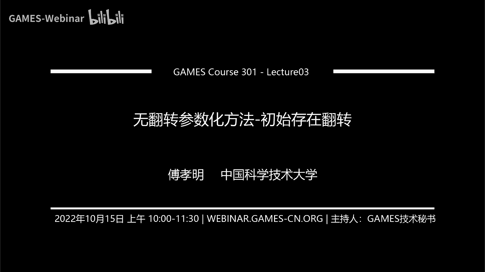
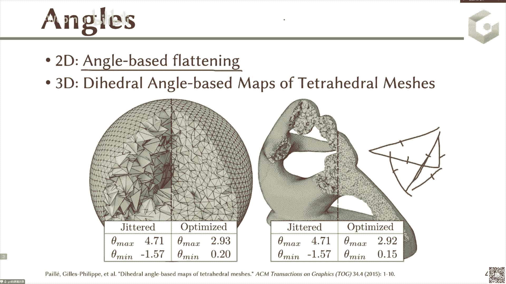

# GAMES301-曲面参数化 - P3：Lecture 03 无翻转参数化方法-初始存在翻转 - GAMES-Webinar - BV18T411P7hT

啊那个欢迎大家来到那个呃盖茨301那个第三讲啊，就是前面我们已经呃完成了两讲，今天我们进入第三讲，那么今天第三讲的题目是无翻转参数化方法，然后针对的初始是存在翻转的这样的一个初始啊。

那么首先我们来看一下我们这个问题的定义啊，就是前面我们之前介绍了四个方法，一个是这个to this bed，它其实是通过一个凸组合的方式把这个曲面映射到2d上，那么它是可以有理论保证的。

其实是最后能够保证最后的解一定是没有翻转，并且是那个扭曲比较呃，这你明显是global injective，但是呢它的扭曲会比较高，所以我们后面又介绍了三类方法。

这类三类方法都是在通过一定的优化算法去减小扭曲，比如说这个a b f就是要让这个呃参数化得到的那个三角形的角，和这个输入库的网格上的角是尽量的接近，那么这样的话它就体现出来了是一个相似变换。

那么呃这个lsm它是从这个相似矩阵的这个角度出发对吧，可以从可以从这个相似角度，相似矩阵这个角度去理解这个lsm，它其实描述的是这样的一个矩阵，离这个相似矩阵远近的这样的一个程度啊。

接下来最后介绍的是这个a p对吧，l a p描述的其实是这个映射的，假货币矩阵与这个旋转矩阵的之间的距离，优化的是这样的一个呃目标函数，但是呢呃优化这样的目标函数呢。

呃这个a b f l c m a r a p这三类方法虽然通过一定的优化，它可以去降低的扭曲，但是呢针对一些比较极端的case，它其实会产生一些翻转的三角形，那么我们来看一下这个左边这个例子。

左边这个例子呢它其实是一个它的原始的这个三维的模型，其实是一个8年的那个头部，那么巴里的头部呢，它的两个耳朵是这样伸出来的，如果你强行用这样的a r a p去做这样的参数化的话，你可以发。

你可以看到这个地方它其实是产生了比较严重的这样的一个两个，耳朵的部分，其实是产生了一个比较严重的这样的一个翻转，就是你就会最后发现这个黄色的三角形，其实代表的就是这个翻转翻转意识。

也就是说它这个地方的三角形的朝向，跟其他大部分地方的三角形的朝向是相反的，那比如说像现在这些这些其他的这些地方，那些白色和红色的这个三角形，它的朝向可能朝正z方向的，那这个黄色的三角形就是朝负z方向的。

那么在这样的一个情况下，如果你再去做一个纹理的贴图的话，你就会发现这里面的纹理贴图他其实已经没有了，这样的棋盘格的这种现状的结构，它已经完全乱掉了啊，它它这个现状的结构都没有了。

这里面已经完全是混混乱掉了，那么这个是一个翻转的这样的一个一个翻转的这样一个映射，那么我们希望呢去得到的是这个右边这样的一个呃，右边这样的一个参数化，那么它虽然这里面的这个棋盘格其扭曲还是比较大的。

但是大家可以看到这里面的棋盘格的这个线，还维持着这个棋盘格的这个结构，对吧，那么这样的三角这样的参数化呢，其实就是一个没有翻转的，右边的来看，就是一个没有翻转的这样一个三角形啊。

那么现在我们的目的呢就是要去呃从这个呃，使得我最后的参数化是没有翻转的，那么我们今天介绍的这个介绍的这个方法呢，就是从这个怎么从这个左边这样的一个case去恢复出来，右边这样的一个case呃。

这个什么意思呢，就是说我们现在的初始化其实可以来自于这个a b f l s，c m l a p这样的一些方法，一些传统的方法，但是这些方法呢可能会产生诸如这个左边这个图所示的，这样的一些翻转的三角形。

那么我们就要去设计一些设计算法，使得这些反转的三角形去除掉，变成右边这样的一个结果，使得它所有的三角形的朝向都是一样的，所有三角形的朝向都是朝这个正z方向或者负z方向啊。

就是所有的三角形朝向都是要一样的，那么现在的核心问题就是说我们怎么去设计呃这样的一个算法啊，使得它的左边可以变成右边啊，这是我们现在这个这一讲内容要呃去介绍的介绍的方法。

那么那我们上节课还讲到那个to this ebedding对吧，就是也是给故事给大家的作业，它其实是可以从理论上保证初始是没有翻转的，或者说初始是没有啊，true是没有翻转的。

并且是globally jective的，那么呃但是它的扭曲会比较高，那么其实我们也会呃最近这几年的这个学术研究，也是在重点研究怎么去减少这样的一个扭曲，那么减少这样一个扭曲的话。

这个方法我们是明天讲的，那么我们今天继续啊，就是说现在我们的问题啊，大家再回顾一下，我们的问题是输入是有翻转，然后现在我们希望设计方法把这些翻转的三角形给去除掉，得到右边这样的一个没有翻转的三角形好。

那么我们今天介绍的第一类方法是基于这样的一个投影的方法呃，这类方法的核心思想其实很很简单，因为你既然左边这个三角形，它其实不是你那个你是那个初始的三角形，存在一些翻转的三角形。

那么也就是说这类方法的核心思想是我能不能把这些呃翻转的三角形，把这些翻转的三角形投影到这样的一个没有翻转的，这样的一个映射空间里面去，就是说我能不能通过这样的一个投影的方式去把它给嗯。

你去把它给那个完成这样的没有翻转的这样映射的这个计算对吧，那么这个地方如果大家可以想一下，如果我把这个整体这个三角形网格，比如说我把整体这个参数化网格都当做这个投影的对象。

那可能这个投影起来会就所有的三角形，比如你考虑1000个三角形，你都要同时投影到这个flip free mapping space，其实是很困难的事情，对不对。

那么也就是说其实这个地方的这个真正在去做这个投影的时候，它其实是投影的是这个每个元素，就我们其实知道，比如说每一个三角形，比如当前一个三角形，我要把它投影到这个没有翻转的case，其实是相对容易的。

对不对，但是你投影一个三角形的话，其实你的这个呃，你把比如说你把一个三角形呃投影到这样的一个没有翻转的情况，其实是很容易的，对不对，你你比如说现在有一个三角形翻转，它的朝向是朝父类方向的。

你要把它呃弄成正z方向，但其实很容易，比如说你现在这个三角形就是一二，那么这样的话它的朝向是朝负z方向的，你要把它改成正对方向，你只要把这个点移到这边来，能变成123，就变成正对方向了。

所以说你要把一个三角形重复从一个呃改变它的朝向，其实通过这样的投影其实是改变他的头像的朝向，其实是很容易的，其实三角形与三角形之间可能就是没有连在一起了，就是说三角形和三角形之间，那么做完以后。

三角形和三角形之间其实没有一些呃，就相邻三角形之间的那个连接性被你破坏掉了，那么所以说呢我们就需要有一部叫做全局部。

就global step去minimize这个使得它那个优化出来的这个distance啊，是其实是优化的，是什么，优化的是你这个呃优化一个三角形，使得这个三角形尽量的去接近你这个投影的三角形对吧。

那这个思想其实是跟这个呃a r a p的思想其实是一样的，a r a p的话，其实只不过是把每个三角形都投影到它的那个最优的那个，旋转矩阵上啊，是最优的旋转的那个三角形上呃。

呃然后呢再去minimize这个三角形，使得它离这个旋转最近的这个三角形对吧，那么所以说这个这个基于这个投影的这一类方法，其实跟a r a p的这个思想其实是一致的。

就是我把每一个三角形我可以投影到一个没有发展空间，然后呢是再去优化这个三角形到这个投影空间的这个最近距离，比如说这个画面下面画的这个灰色的区域，就是这样的一个呃。

flip free这样的mapping space，然后呢这个蓝色的点就是这个翻转的三角形，那你其实每次可以给他找一个比如投影，投影到这个地方，指引到这个空间的边界上，就是一个没有翻转的三角形。

然后呢你去minimize，接下来你这个global这一步，你其实是minimize这个点到呃这个新的点到这个点的最近点距离对吧，那么这样的话你可以产生一个新的点，那这个点有可能还在外面。

然后你接下来还要继续迭代，那么对于这样的一个全局部的话，它有两种方式，一种方式呢我就直接非常了，当我就直接minimize这个绿色的点，就是这个新产生的这个三角形与这个我最近点的这个投影。

他们之间的这样的一个欧式距离，作为我的这样的，或者说他们的一个某种范畴下的距离，作为我的这样的一个优化的目标，那么还有一种比较常见的呢，呃投影方在全局这一步的投影方式呢是这样的，就我优化出来这个点。

我把它限制在这样的限制在这个最近点投影的这样的一个切空间里面，就我可以把这个点看成是一个高，比如说我把三角形上的假货币矩阵可以看成是一个高维的空间中的点，那么我新产生的这个点。

我可以把它约束在这个这个点的这样的一个切空间里面啊，这是另外一种比较在global这一步比较常见的另外一种投影方式啊，这两种方式都是在学术圈都是有有相应的工作好，那么反正anyway。

这个投影的思想其实就是跟这个你可以认为就是跟这个local和global，就是之前之前讲的那个a r a p是差不多的啊，那么首先我们简单的来回顾一下这个事情，具体把这个东西变成一些公式化的事情啊。

首先是我们可以做一个s s d d对吧，就是上节课上节课我们就讲过了，那么就把这个讲话比矩阵放啊，把它分解成呃旋转正乘上旋转正，而旋转正乘上一个对角阵，乘上一个呃旋转证呃转制，那么中间这个矩阵s的话。

它其实是一个对角阵，这个对角阵呢它的最后这个元素可能是负的，那么如果它的这个甲壳币矩阵的行列式是小于零的情况下，那么这个其一值是负的，那么并且满足这样一个不等式，那么也就是说这个这个最小的这个特征。

最小的这个奇异值，它的正负号其实就代表了这个三角形有没有翻转，那么也就是说如果没有，如果是一个没有翻转的条件，那么其实应该是他的假货币矩阵是大于零的，那么甲亢b矩阵大于零的话。

其实等价于就是这个最后的这个奇异值要大于零，就相当于我们是s s b b分界里面的定义，那么我们同理，我们可以去定义这个conformal distortion，convey stortion。

其实是用的是这个最大的这个奇异值和最小的奇异值之比，对吧啊，这个地方为什么是三维哦，对不好意思，其实我们用的是这个3x3的3x3的这个呃假号比矩阵做例子啊，不是我们平时参数化。

如果参数化的这个地方应该是这个三，应该是二啊，不好意思，这个地方可能对，那么如果我们要去这个bd这个distortion，就是如果我们希望这个confirm distortion是有界的。

那么我们其实可以把它放在这个一和这个k之间，那么什么意思呢，首先我们来看一下这个西格玛i是西格玛i，一是会比这个西格玛i3 大的，对不对，那么也就是说如果西格玛i3 是大于零的情况下。

那么也就是说这两个比值一除应该是显然是大于一的，对不对，那么我们同理不希望这个conformal distortion太大，所以我们要给它加一个上键，那么所以说这个情况下，所以我们简单来看一下啊。

就如果现在我要让它没有翻转，那么其实也就是代表的是我要让他的假货币就sigmi 3是大于零的，那么sigma 3大于零，那么如果在这个sigma 3大于零的情况下，我我根据这样的一个扭曲的定义。

我总能找到它的最大值对吧，因为现在如果sigma 3大于零，那么也就是说它所有的confirmation stortion都是大于零的，那么大于零的情况下，我总能找到它一个最大值。

比如这个k这个k就是他所有的cfm的收益最大值，那么也是也就是说我只要是我一个没有翻转的一个映射，它其实就是一个bd的distortion的这样的一个呃confirm distortion对吧。

就肯定他的confirm disco肯定是有界的，我总能找到一个上界k啊，那么同理，如果是现在这个confirmation stortion邮件，那么也就是说他的所有的行列式。

把所有的那个可能性都是大于等于一，那么就是它是一个没有翻转的啊，所以说这个问这两个约束呢就其实就可以是一个等价的约束，于是呢我们就可以把原来的我们的优化问题就去计算没有翻转。

利用投影的方法去计算那个问题，我们就可以把它变成这样一个优化问题啊，这是那个假货币矩阵，就是一个呃2x2的，比如说这是一个参数化问题的话，那么或者说这是一个三维映射的问题的话。

那么这个地方是一个2x2矩阵或者是一个3x3的矩阵啊，那么这是一个假货币矩阵，那么这是一个它的，比如说我们在a r a p里面，这个地方其实就是一个旋转矩阵对吧，那么在我们这个地方的问题里面。

这个h i呢它是一个是属于这样的一个空间的，那么这个空间是什么呢，这个空间是一个有界conformal，就是一个保行保保角映射的倒角扭曲的这样一个空间。

那么也就是说它的confirm distortion，是在这样的一个满足这样的一个条件的啊，那么这是一个空间，那么我只要让我们的hr是属于这个空间内部的，那么这样的话我就能做到。

我其实就是要让这个兼爱通过投影慢慢的趋向于这个空间啊，那么当然最后这个条件是一些先行约束，比如说我要让某一些点啊，移动到一些指定位置啊等等这些额外的一些线性约束啊。

所以我们整个的优化问题就变成了这样的一个呃优化问题，那目标函数是要让这个假货币矩阵跟这个i尽量的接近，h i呢是属于这样一个bounded confirmation sociate space。

因为刚才已经讲过了，如果你的诶你的假货币矩阵都能趋向于这样的一个bounding the social space的话，那么他的所有的也就上小学之后，就算出来的这个映射也是一个无翻转的映射对吧。

那么当然注意啊，这个地方的变量有两部分，一部分是这个顶点的位置，还有一部分是这个hr大h2 ，这个大h2 其实是未知的啊，就跟我们这个a a p里面的那个旋转矩阵未知的是一样的啊，一部分是这个顶点位置。

一部分是这个hr这个矩阵啊，那么为了去求解这个问题的话，那么最常见的还是用这样的一个local global的一个思想，那么local一步就是说我固定这个顶点的位置和这个甲固定顶点的位置。

其实也就是说固定了这个假货币矩阵，然后呢再去求解这样的hr啊，就是求解这样的一个问题啊，这个问题是有解析解的，就这个问题去这个问题求解的时候，因为这个hi作为变量的情况下。

那么也就是说它跟其他的变量是没有关系的，那么这个时候你其实只要去不用把这个累加号就不用去考虑了，你只要考虑这个甲扣b i跟这个h2 之间的关系，那这个九点是有一个解析解的啊。

大家可以看一下之前的paper啊，嗯然后呢解固定这个h2 的时候呢，我接下来要去求解这个顶点位置，那么也就是说这个hr是固定的，那么我这个假货币矩阵的话，之前也讲过是关于这个u是一个线性的。

那么也就是说整体这是一个二次的能量，再加上一个线性约束，那么这个时候可以用拉格朗日乘子法，就直接把这个u给直接解出来了，对吧，呃但是呢这种local global的迭代。

在这个整个的这个整个的这个优化的过程中啊，它是一个一阶的方法，它的收敛其实是非常的缓慢的，就是very low的一个convince的一个有一个表现啊，所以说呢我们在这个具体的这个过程中。

那么从这个这个local global的方法来看呢，它其实可以描述成一个固定点迭代的固定点迭代的一个问题，固定迭代是什么意思呢，就是哎就是下面这个形式啊。

就是xk加一等于g乘上x k那么这个这个固定点迭代对吧，就是你把这个xk然后映射到了这样的一个x k加一，然后呢x k加一再带进去会映射到一个x k加二这样一个固定的迭代，那么收敛的情况下呢。

就是x星迭代成g x星，这是一个固定迭代的这个定义对吧，如果你最后收敛了，那么最后这个x型呢就是达到了最优值，或者说达到了这个呃是非线性方程的这个根对吧，因为固定迭代一般呃比较用的比较粗。

多的是那个非线性方程的求根啊，那么其实也可以用来这样解优化问题，那么可以现在的优化问题呢，就是也也是可以来描述这样的优化问题啊，那么对于这样的优化问题啊，对于我们上面这个问题而言。

这个地方的g呢其实就是一个投影，再加上一个求解线性方程组的过程，那么这两个都是有解析解的，所以说这个g呢也是一个显示的表达式啊，所以g乘上x k。

那么所以说我可以把这个原来的这个一步的local global这样迭代，描述成一个固定点迭代的一个过程啊，那么固定迭代的话，在这个以往的这个早年的这个研究中，它其实就是说你每次这个迭代的时候。

如果logo logo，那我就是用这样的一个算子对吧，用一个投影嗯，就是这个local部的投影，再加上globe的解方程去得到这个，去得到这样的一个新的这个呃顶点呃，新的这个变量对吧。

他这个dk加一部的这个变量不是直接由这个迭代数据产生的，它还是有这一步，这一步就是这个xk加一，有这个不跟前面的这个这个其实你可以认为是前面的这些变量，xk减一啊，这个地方xk减二啊，xk啊等等。

有前面这些变量的一个线性组合去产生一个新的这样的xk，其实它的这个目的，这个线性线性组合的目的，其实就是要让这个迭代的这两个之间的这个长差变小啊，那么所以说他需要去找一个这样的一个参数。

那么这个参数是由下面这个优化问题去得到的啊，那整个这一套呢就是由这个很早的这个呃，大概很早之前就有，已经是一个很成熟的一个理论啊，它的这个曲线是呃，这个蓝色的曲线大概是长这样的，它的这个能量。

这个能量就是指这个这个能量啊，就整个目标函数，它的目标函数你可以看到它的这个下降基本上是非常非常缓慢的，你会发现这个条曲线在这个地方就陡然下降了，就是从这个十的负，这个是取log就是十的负几次方了。

下调是非常非常明显的，其实给整个算法的收敛性带来了很大的这样的一个帮助啊，那么但是呢这个地方我们还在这个整个的应用，整个的这个优化问题里面，我们其实是有了一个再回到前面来啊，我们这个地方的这个hi呃。

这个地方的这个hr嗯，这个地方的这个h r它其实是一个bd confirm distortion space对吧，其实这个地方的k呢其实也是一个变量，这个k其实也是一个变量。

但是这个k呢其实我在这个优化过程中，没法去把它串到这个logo logo里面去，所以这个k本身也是一个变量，这个k如果设置的不好，其实我整个的这个space比如说大家可以想象，如果这个k是一个比较小的。

只能美，就说这个space会比较小，如果这个k比较大的话，那这个space会比较大，那么也就是说其实你不是这个space越大越好的投影的时候，那么所以说呢我们在整个优化过程中的是。

其实是如果你固定一个k的时候，其实你的整个的这个优化，你看它这个地方最后这个黄色的有一个这样的一个映射，它的这个四面体其实没有被优化掉，所以最后它还会有一些呃，有七个翻转对吧。

也就是说你固定一个k它其实这个整个投影过程，它其实没法保证去完全达到那个space呃，confirsting space，因为你的能量没有完全道理，对不对，没有完全到零的话。

你其实这个地方其实是没法优化到呃，没法优化到所有的把三角形都给去掉，所以说呢我们这个地方就是要去去做一个distortion的这个更新，那么这个地方我们采取的策略是这个distortion从小到大。

那么就是一开始的distortion的那个这个space一开始是四，然后呢我们会把它变成八，那么pro再变成16，再变成32，这个的到底是什么呢，就是说我一开始给它收缩到一个比较紧的space里面。

就我尽量往那些好的space里去投影，然后呢你这样的话就会导致你后面的这个解的话，进就是一开始的解大部分都是往好的地方去投影，然后你再再往后，如果你当前不行的时候，我再放松这个space。

然后再往他的大的地方让他投一投，而不是说一开始我就给它很松，给它很松的话，你一开始可能所有的所有的这些投影都不是一些比较好的位置，那么这样的话，你就导致你这个整体最后就没法收敛到一个比较好的截去。

所以我们后来发现呢，我们是需要去西安，一开始给他一些比较强的惩罚，就让它投影到一些比较那个好的地方去，然后呢把这个k再慢慢的变大，大概是这样一个策略，最后这样的话我们就可以比较顺利的把反转去掉啊。

当然了，如果从这个算法设计的角度来讲，我们还是希望就这个k也能成为这个迭代的过程中的一部分对吧，我们能选择一个最优的这样的一个k那么对于这样的一个global，这一步的话。

刚才讲过它其实是一个固定这个h然后去求解这个u的过程对吧，那么我们之前是求解的，就是这样的一个呃优化问题对吧，给定这个hi，然后去求这个，那么这是一个整个就是一个呃二次优化问题，然后再加上一个线性约束。

那么直接用拉格朗日乘子法就直接可以把它求求解出来，我求把它重点求出来，那么对于这样的这样的00515年这样一篇paper，他就当时说我觉得他说觉得这样的投影其实收敛会很慢，其实也是收敛确实很慢。

就是这个这条蓝色的剑气可以看出来这个收敛确实很慢，这个收益确实很慢，所以说呢他们说我不要让我除了这个最近点投影以外，我还希望再加上一个约束，这个约束是什么意思呢，这个蓝色的点你可以是。

那么这个这个蓝色的点就是违反这个违反这个space space，外面的这样的一个点，那么你每次在去做最近的投影的时候，得到了这个h h i呢，其实就是这个地方的h i，那么这是它的最近点投影。

就是它的那个外面的这个当前的这个u，然后你这个绿色的点呢，就是你下算出来的这个dk加一部的，这个dk加一部的这个甲毫米矩阵，这个绿色的点，然后呢他这个叫做切上的投影的话，什么意思呢。

他就是让这个新生出来的新生村，新生成出来的这个绿色的点，它要跟这个原来它是在这个点的这个切空间上的，就是要吊在这个点的切空间上，那切空间上的意思是什么呢，那么原来这个点是它的最近点头点。

那么最近点投影的话，一般都是一个正交投影，那么正交投影的话也就是说这个点他的那个切平面，它其实它的那个切平面其实是就是跟这条线是垂直的，那就是跟它的垂直的线，所以说呢我希望这个这是一个向量。

这个向量你可以认为是这样一个向量对吧，那么我希望这个优化出来，这个像这个点跟这个这个向量呢跟这个向量是垂直的，那么也就是说什么意思呢，也就是说我新生生出来的点是落在了这个h i k的。

这个当前这个地方的这个超切平面中，那么也就是说让他们两个之间是垂直，那么垂直的话，其实也就是说是这个矩阵跟这个就是也就是说这两个矩阵之间，它的那个内积要等于零啊，当然你是要把它写成一个向量的形式。

那么这样的话当年那个方法就证明了说我通过这样的一个天宫的投影，那么最后它的收敛性就会变得比较好啊，这是他当年的这个结果啊，那么但是呢我们呃后面我们其实这个啊，那么确实他这个投影，但是呢它这个能量啊。

它这个能量其实因为加上了这样一项切切像的这个投影以后，他其实没法保证这个能量是一个单调下降的，你会发现它其实会出现这样的很明显的震荡，那么很明显的震荡的话，就会影响他最后整个的这个这个能量的这个收敛啊。

就他其实最后可能不一定呃，就是或者说这个三角形它这个一会儿有翻转，一会儿没翻转，它这个翻转它其实也是发生在也是有这样的一个跳变的啊，所以说这个也不是一个比较好的事情啊。

所以说他最后呢这个方法呢有时候就是他也是会去不掉这样的翻转，它会在某些地方还是会存在那么几个翻转啊，因为他这一部的能量他加上了这样的，他多加了这样的一个线性约束以后，这个线性约束是多加出来的。

那么这个线性约束多加出来以后呢，导致他整个的这个能量是没法单调下降的啊，能量为什么单调下降，这个事情大家可以去看一下这个l a p的这个整个的迭代的过程啊，因为每一步都保证下降。

所以能量应该是单调下降的，他其实没法保证这个目标函数是一个单调下这样的啊，好这是第一类方法，就是基于这样的一个投影，然后通过这样一个交替优化的方式去完成了这样的一个呃，把这个翻转的三角形。

尽量的往这个就是没有翻转的那个空间里去投影啊，然后这个地方的采用了这样的一个扭曲有界的这样一个空间啊，这个事情也是比较也是一个比较简单的事情，就是一个logo格洛宝吧。

那么接下来我们要介绍的是另外一类方法，是这样的啊，founded distortion space的方法，这类方法的核心思想是什么呢，就是说我我原来之前我们之前讲过。

就是说这个distortion space，或者说这个没，有翻转的这个space，它其实是一个非线性的space，对不对，因为它比如说我们来看这个假科普矩阵小笔记，我我可以写成这样啊。

啊为什么可以写成这样呢，因为这个甲和比矩阵的写法，跟前面的这个几甲合比指针的写法是有一点区别的啊，给大家简单的借解释一下啊，本来的假货币矩阵应该是写成呃，比如说就这样对吧。

这个地方比如说借一一借12j21 j啊，啊对吧，本来应该是写成这样一个形式，那为什么可以写成这样的形式呢，其实也比较的简单，我就是把这个地方的，比如说我们，以这个为例啊，其实你可以看成是什么呢。

看成这个地方的a t呢，其实就等于你把两个加一下，两个加一下a t就等于什么呢，就等于1/2的g1 j11 加上j22 ，然后呢c t呢就是1/2的g11 减去g22 ，那么什么意思呢。

那么也就是说你原来如果是长这个样子的话，我其实可以把它写成1/2的g11 加上j22 ，加上1/2减一一减去g22 对吧，同理那么这一部分我把它另一把它设成a t，把这部分设成c t。

那么这样的话同理我就可以把这个a t c，t d t b a t同样的写出来，那么所以说呢如果我一开始写成是这样的一个假货币矩阵的形式，我可以通过简单的一个变量替换。

我把1/2的g11 加上gr 2设成at，把1/2的g11 减去j2 ，设成c t，那这样的话我就可以把这个角号比矩阵写成这样的一个形式啊，那么如果从这个假货币矩阵的形式来看，我们要让它的行列式大于零。

那么行列式大于零的话，行列式是等于这个呃，ab就这个减这个呃，两个对角线相乘减去这边对吧，那么就是这个乘这个，那么也就是说是，a的平方减c的平方，这一项减去括号是d的平方，减b的平方。

b的平方减b的平方，那么所以说最后就等于a方加b方减去c方减去d方，你要让这个约束是大于零的，那么也就是说你要让这个a方加b方大于西方加上b方对吧，那这个这个约束其实是一个非凸的非线性的约束对吧。

那么所以说呢其实你没法直接去套一些to优化的算法，那么所以说呢接下来这个方法的思想就是说呃，我能不能去把这样的一个约束直接把它转成一个呃，比如把它把它直接转成一个就是to空，间，那么如果我能去找他。

因为这个这个空间本身是一个非凸的空间，那我能不能在这个飞to的空间里面去找到一个最大的最大的子空间，这个子空间是一个凸的，然后呢我在这个子空间里面去做一个凸优化对吧，那这样的话其实也是一个比较好的事情。

所以这一类的核心的思想就是说我在一个大的空间里面，一个非凸的空间里面，我去给他找一个局部的这样的一个呃，或者我去给他找一个子空间，这个子空间是凸的，然后呢我是我在这个空间里面去做这样的一个优化啊啊这是。

一个这类方法的这个核心思想，那么这一类方法它首先啊首先啊还是按照这个式子，就甲壳币矩阵把它写成了这个啊，现在甲后面女生就写成了这样的一个形式，那么其实我可以直接把他的两个奇异值给写出来啊。

一个是就是这个a这个怎么写的，你们就直接推一下，因为这2x2的矩阵这玩意都直接是现成的公式啊，a方加b方加c方加上地方啊，很很好看啊，a方加b方减去c方加b方，如果你用ssd分解的话。

这个绝对值是没有的，那么通过这样的假货币矩阵，这样的那个s b d分解啊，这样的那个两个奇异值，那么现在我要让他的这个confirm diotion，confirm distortion。

就是定义成这个西格玛max比上西格玛mean啊，我现在要让这个ctrl搜索小于k，那么也就是说是sigma max小于k乘上西格玛命啊，要让它的行列式大于零，行列式大于零，其实就是要让这个我们刚才讲过。

其实就是要让最小的其值大于零对吧，这个绝对值没有，那么其实也就是要让这一项减去这一项大于零，就是a方加b方减啊，刚才已经讲过了，a方加b方大于c方加b方所，以说行列式大于零。

其实就是要让这个绝这个a f c方加b方小于a方加b方，那么要让这个convert disession小于k，veral dise小于k呢，是这个上面这个除上。

下面这个要小于这个k那么也就是说要让a方加b方开根号，加上西方加b方除以a方加，哎呀妈呀，写不下了啊，a方加b方减去根根号下x方加地方小于k然后你把它整理一下。

你就会得到这个c方加b方要小于等于k减一呃，除以k加一乘上a c方加a方加b方，然后我们来看一下这两个式子啊，我们首先来看一下这个数，因为这个，这边这两个和这两个是一样的，这两个是一样的对吧。

我们来看一下这个数，那么对于这个confirm destroy distortion而言，它是由这个最大的奇异值比上这个最小的奇异值，那么也就是说这个k这个k应该是大于等于一的。

那么要大于等于一的情况下，那么也就这个式子k减一肯定是要小于k加一，并且这个地方大于零，大于等于零，那么所以说k减一除上k加一的话，显然是要小于一的，小小于一的情况下呢，那也就是说这个数要小于一。

那么也就是说如果下面这个约束满足了，那么上面这个约束是，显然是满足了对吧，因为这个数是小于一的，那么你现在是小于一乘上这个后面这个就你就说底下这个约束满足了，上面这个约束以后，自然也就满足了。

所以说呢我们现在只需要只需要考虑这个约束，上面这个约束我们就不用考虑了，因为下面这个约束满足上面这些约束也就满足了，那么现在我来考虑一下下面这个约束，那么这个约束显然是一个非突非线性的对吧。

我们那么所以说呢现在我把它引入一个辅助变量，辅助变量是什么呢，辅助变量是这个地方的rt rt就代表了这一，项rt就代表这一项啊，那么就是我把它改成了c方加b方，小于这个k减一乘k加一乘上rt。

然后rt呢并且要小于这个a方加b方，那么如果你把这两个不等式连接起来，那其实你还可以得到小于等于你把这一项带进来对吧，那么小于等于k减1k加一乘上根号下a方加b方。

那么也就是说你这两个式子如果放在一起看，它其实最后跟这一项式子是等价的啊，就是还是c方加b方，小于小于等于k到1k加1a方加b方，那么只不过我现在引入了一个这样的一个变量，当然这个。

变量还应该是大于零的啊，那么这个约束大于零，这个约束是凸的，那么这个约束是一个二次追的约束对吧，a方加b方小于等于一个，这是一个线性项线性函数，这是一个平方，那么其实就等于什么呢，等于就是一个。

所以这是一个to的约束啊，这是一个追的约束，我就不解解释了，这个约束是一个非凸的约束，因为它是一个a方加b方，它是一个要在一个外面的约束，这个约束是一个to的约束，非to的约束。

那我们来看一下下面这个图啊，呃这个地方的c我把它改成k啊，那么也就是说我，现在的要让这个约束对吧，这个约束现在是一个非凸的约束，就是a方加b方要大于等于一个rt，那么其实可以从这个从这个图来看。

其实是什么呢，rt你可以看成是这样的一个轴的一个半径，那么你其实你要让这个a方加b方大于这个a方加b方，要这个这个是呃黄色的圈是它的这个rt，那么他要rt再乘上这个k减一，这个的话其实就是前面的那个啊。

那么你现在你的目的是要让这个a方加b方是大于这个呃，大于这个rt的，那么也就是说其实是这个圆的外部，那么如果从这个，从耳机就是这个锥的外部，那么如果从这个锥的外部来看的话。

它其啊它其实是一个非to的对吧，因为你你你只有他们追的内部是凸的，它的外部是非凸的，那么这个时候呢其实你整个外面的飞to的这个空间，那么你要让这个空间里面，你要去找一个最大的突凸空间。

那么其实最大的突破空间也很简单，我要让这个式子大于零，那么其实我只要取它的这个a大于rt就行了，或者b大于rt或者什么，只要只要给他去做一个切平面，只要沿着这个锥，你去这个追的这个边界，你给他去找做。

一个切平面，然后这个外面这个切平面，整个就是它的整个锥的这个最整个这个最外面的这个最大的，这个图空间啊，那么这个地方它直接取的是a t，当然这个a t你可以变，你不一定是a t，你也可以bt。

你也可以可以是其他的一些组合，你只要是这个曲，只要是这个切平面外面的，那么从道理上来讲其实也很简单，我不我不我不不画这个锥啊，我直接画一个平面的示意图，比如说我现在这是一个圆，这个圆呢就是a方加b方。

这个坐标是a，这个坐标是b，那这个rt呢，假如说我是一个，固定的数，比如我这个数就是一个一对吧，那么a方加b方的话，它其实就是一个外面的这个空间，对不对，那这个空间是一个非to的空间。

那么这个时候你要取他的最大的一个突空间，其实就是在这个地方给他去拿一刀，给他竖一刀下来，那么整个这个外面这个空间就是它一个最大的飞出空间对吧，那么你这外面的空间其实就代表了。

就是这个这个地方的这个a要大于rt啊，所以说最后就变成了这样一个形式，那么你凭什么就是这个地方就直接选a呢，所以这个地方你就需要引入，一个叫做局部坐标系，那么就在这个局部坐标下。

你是这个a是你是你要选的，其实你也可以选对吧，比如这个例子，其实你也可以选选这个对吧，你也可以选这边这个局啊，你当然也可以选这个下面这个局，那也就是说其实会跟你这个你选这个区域的方向。

其实你可以用一个局部坐标系来描述对吧，就是你可以最后你都可以取这个一取这个样子，你都可以取它的，取它的这个a t大于rt，但是a t本身的值是跟这个一个局部坐标系有关的，那么其实这两个问题就是等价的。

就是什么，意思就是你你选的这个平面其实是跟你的这个，你这个当前这个地方的这个你这如果这个你如果这个坐标系的朝向，现在是现在是这样一个横屏的，竖直的对吧，你的坐标带你的坐标系也可以是长这样的。

然后你再去选这个点对吧，那也就是说你最后选出来的区域就是这边这一块区域了，好，那么现在这样这样的问题就得到了，就是anyway，就是说我现在这样的话就可以得到一个凸空间，那么有了这个图空间以后呢。

我就可以将来去求解了，现在就是我把上面这个约束转成了一个凸空间，那么凸空间以后，那么接下来整个约束可以求解了，那么接下来我们要调一下目标函数，那么要去设一下目标函数，那么目标函数的话。

我现在是一个这样的一个角货币矩阵对吧，那么如果是一个l o s t m的话，它应该是一个相似变换，那么相似变换的话应该是这个这两个要相等，这两个加起来要等于零对吧，那么相等的话，这两个数要相等的话。

其实就等于这个c t要趋向于零，那么这两个数要加起来等于零，那么也就是说我这个d要等于零，所以说lsc m优化的目标函数你就可以直接写成这样一个形式啊，因为你要让它把它变成相似变换。

那么如果你是一个a r a p的形式的话，你其实你要让这个整个三角形变成一个整个对，整个变成一个呃，整个变成一个local local global，整个变成一个旋转矩阵。

那么如果在你前面的那个你前面的这个local frame里面，你这个local frame里面，如果这个local frame就是选择你这个里面那个旋转旋转的那个矩阵的话。

那么你最后的能量其实就是要让这个东西等于一个单位证啊，当然你要选那个旋转矩阵，就是那个local frame啊，好那么也就是说你最后会变成这一项，要这和这一项减去一要等于零之后会得到这样一个目标函数啊。

那么这个地方的呃目标好像就整个的优化过程就变成什么了，你要给一个local frame，其实就是那个a r a p里面那个旋转的旋，类似于这个旋转三角形啊，旋转旋转矩阵。

所以你要给一个local frame，然后呢用一个二次追的优化去二次追的programming去优化，然后呢接下来你要去local fram，使得这个bt等于零啊，就是去更新那个举旋转矩阵交替迭代啊。

那最后呢这样的交集点是比较费事的，费时间的啊，当然这里面还有一个核心的问题是这个k怎么取啊，这个k就像我们之前讲的这个k其实影响的是你的这个space的大小啊，这个k取得不好的话。

最后的约束其实是要么就是会没有减，要么就是呃就是得到的减很差啊，就是k的选择，现在没有一个很核心的想法，那么我们再来简单的回顾一下整个的刚才的那个过程啊，就是说假如说我这是一个s b d分解。

那么这两个是一个旋转矩阵，s是一个对角阵啊，那么他们并且满足这样一个条件，那么当然这个第三个元素可能是负的，假如说嗯但是我可以把这个矩阵把它简单的写一下，把这个ut因为它是一个旋转矩阵。

所以我可以在这个地方写一个，就把这个地方乘乘一个ut的转制，那么再乘一个ut，那么然后在这个地方乘一个v，那最后其实这个si就可以写成这样一个形式对吧，假如说这个ui和这个vi是已知的情况下呃。

这个地方是已知的，那么其实这个si假如说这个假如说啊这个地方是假设啊，if if ui和vi是已知的情况下，那么本身这个甲和b i它是关于这个顶点位置是一个线性的函数对吧。

那么如果v ui和vi是已知的，那么si也是一个关于顶点位置的一个线性函数，对不对，那么于是你这个bd的distortion的，就是你本来的bd distortion应该是西格玛i一比上i3 啊。

这个地方也有呃，如果是二的话，就是也可以是二啊，就是如果是单数化，应该是二，就这个地方这个是没有的啊，如果是参数化的话，那么也就是说西格玛i一比上西格玛i si小于k，那么因为这个东西。

它的对角线现在都是关于顶点位置的一个线性函数了，那么所以这个约束就变成了sigma i一小于k乘上西格玛a i s，这是线性函数，就是线性函数，那么也就是说这是一个线性不等式约束。

线性不等式约束显然是一个to的，那么如果是变成这样一个to的，就说整个整个帮这个distortion的这个约束就变成一个to的，对不对，而变成一个凸的，那整个问题就可以求解了，是不是啊。

那么现在的核心问题是，我现在假设了if ui和vi是已知，那么随着问题是你怎么让它变成已知对吧，你怎么让它是已知，那么如果你要让它变成已知，最最最简单的做法就是我在dk加一次迭代的时候。

我取dk次的ui和vi，那这样的话我不就相当于是它是已知的吗，那么所以说接下来就是有人就在13年的时候，就这下面这篇文章啊，13年的时候有人就做了这样的一个pipeline啊。

那么这个tp line呢就是首先这个地方它做了一个s b d分解，这个是你可以认为是第n步的，就是这个地方有个n啊，第n步的第n次迭代，这写的不大好啊，第n次迭代。

然后呢你把它会得到这个地方的一个u和这个地方的v，然后呢你把这个u和v呢存在这个当前的，这是第n加一次优化里面，你可以得到这样的一个线性约束，就这个对角矩阵就关于。

就你可以认为是就是上面这个地方ppt里面的这个对吧，si所以你最后就会得到它的一个线性约束，然后你这些约束的话就全部变成了一个线性约束，那么也就是说你整个的问题就变成了一个凸优化的问题。

就相当于你这个地方的ui和vi，用的是上一次迭代里面的那个假货币矩阵，分解出来的这个ui和ui和右键和v键啊，对方那么这样的话，你整个的这个迭代就变成了一系列的这个to u2 的这样的一个迭代啊。

那么这样的迭代它其实是一般情况下是收敛是比较快的，一般只要小于十次，有时候就只有五六次迭代就可以收敛了，但是它的每一次迭代都是一个二次二次优化，二次二次的那个凸优化，二次的凸优化。

它一般的国家这个q p的优化的话还是有点慢的啊，那当然这个核心问题还是没有解决，这个k的选取问题，它其实没有解决啊。

那么这一类的这个space这一类的这个bounding distortion space，这类方法呢就是通过一些技巧啊，迭代算法其实很好理解啊，就是假设这个ui和v v界，然后已知的情况下。

他可以把这个原来的这个foundation这个space转成一个to的线性不等式约束，然后这样的话他也可以通过一系列的优化去求解啊，那么所以说呢这一类的boring space的方法简单的回顾一下。

它其实就是说我原来的space是非凸的对吧，我就我就想一些方法使得这个space变成一个to的space，变成一个to space以后呢，接下来我的所有的传统的这些凸优化的方法，s q s c p啊。

q p啊等等这样的呃，传统的这些已经已经设计好的一些很成熟的算优化算法，我都可以直接拿过来用了，而我不需要去自己去设计一些算法对吧，就转成一些成熟的稳定的一些优化算法。

那么anyway就是说这是这个bondiot这个space，那他这个4g思想还是跟这个之前的这个呃投影的那个算法，还是会有一些呃difference好，这，是呃两类介绍的两类方法。

那么接下来我们进入第三类方法，第三类方法是基于叫惩罚的方法，那这个想法就非常非常简单了，我既然现在有一堆翻转的三角形对吧，那很简单啊，我直接就给他加一个惩罚，惩罚能量啊，就是在这些翻转的三角形上。

我给他设计个能量，这个能量函数值是非常大的，对不对，那么然后呢没有翻转三角形，我给我不给他惩罚，那这样的话我再去优化的时候，我就把这些翻转的三角形，因为它上面的目标函数很大嘛，我说如果能去下降的话。

那么我最后的这个能，量不也就是下降啊，那那个翻转不也就去掉了吗，所以这一类方法是这个呃，比较就是非常的这个直截了当的，就是我直接去惩罚那些坏的东西，对不对，那我这样的话，我这个整个能量就可以去下降。

或者说整个能量下降的情况下，我就能够把那些翻转给去掉对吧，那就这个思路是非常非常非常非常简单，所以说是px的flip elements by planet function。

就是说通过一些惩罚函数去把那些翻转的三角形给惩罚掉，那么它的主要的特点就是说他会去这个能量函数是非常大的，用来去惩罚这些翻转的是假币，矩阵如果这个呃如果这个到后面矩阵它是一个没有翻转的。

那么我就是通过一些它的能量目标函数值就非常小，我就接受它对吧，那么接下来这个问题，你很显然如果你需要设置这样的一个惩罚函数的话，这个惩罚函数很可能是或者说基本上是一个非图非线性对吧。

那你求那么这时候你的求解器就变得比较关键了啊，那么这是两个比较常见的两个比较常见的这个惩罚函数啊，说实话这个东西在这个很多很多领域里面都被用到了啊，就是说呃当然在这个参数化领域，或者说在。

这个映射计计算领域其实也是个很常见的事情啊，这一类这个惩罚函数的方法，其实在这个网格生成，或者说在有一些领域里面，比如六媒体网格生成啊，高阶网格生成里面也是一个被用的烂大街的一个方法。

就是说他其实会通过这样一个惩罚函数的方式，去对这个翻转的三角形去，或者说对翻转的四面体或者对翻转的六面体，或者对翻转的高阶网格，都是去可以给它加一个惩罚站，然后将它的能量函数去下降。

这个是一个很常见很常见的算法，这是一个非常非常通用的一个算法，啊那么首先我们来看一下左边这个能量函数，左边这个的话好说呢，大家可以看一下这一项呃，这一项如果是如果是小于零的情况下。

那么也就是如果这个行列式是小于零的情况，那么也就是说这一项它的平方加上这一项，那么然后这个是小于零的，那么也就是说这项开完根号，它其实是比是呃，比什么呢，比它的这个行列式大那么一丢丢对吧。

就这个开根号其实是比这个行列式，比这个行列式的绝对值大那么一丢丢，那么这个行列式你再去加上它的绝对值，那么原来就是一个负的，你加上它的绝对值应该等于零，那么本身它加了一个e技能。

就e p系统是一个很小的数，所以说呢他最后是应该是绝对值加上一个很小的数，那么所以说你把本身你这个行列式加上它的绝对值应该等于零，那么你再加一个很小的数，那么就是这个分母上就是一个很小的数。

那么分母上是一个很小的数，那么你现在也就是说这个行列式行列，式如果想如果它的角和比矩阵的好，但是如果是小于零的，那么就是分母上会出现一个很小的数，分母上出现一个很小的数。

那么接下来那你整个目标函数就会变得很大对吧，那我们给函数变得很大很大的情况下，那你这样你就会对这个翻转的三角形就去给他一个惩罚啊，就是这个函数，那么这个函数呢这个地方有一个eino啊，注意啊。

这个地方的这个bino呢取成是这个最小的，这个可以取消，比如说比这个最小的行列式，minimal的行列式还要再小一点点呃，minimal的行列式再小那么一丢丢就一，丢丢几张阿尔法吧，这是最小的行列。

是最小行列式可能是负的对吧，比如-1，然后你再减去一个正数，比如减去0。11-1减一点，比如1。1，那么这个就是你的ef系统，那么这样的话你可以看一下这个目标函数啊，这个这个第一项我们先不看。

我们来看一下这第二项，第二项是这个行列式减去这个bino map系统是1。1，cp系统现在是负的1。1啊，负的1。1，那么减去负的1。1的话，那么也就是说整个这个目标函数解出来就是加上1。1。

那么如果你原来这个最小值是-1，的话你带进去，那上面也就是说变成了正的0。1，然后这个一减去这个的话就是2。1对吧，就是1÷2。1，那么给他取一个log，那么因为这个数是小于一的。

那所以说呃log大家知道其实在这个一的地方是等于零的，那么也就是说这个是一个小于一的数，那么也就是说这个log其实应该是一个在这个地方，在这个0~1这个地方是一个很大的数，那么很大的数的话。

你再给它取平方，那么这个数会更大，那么特别是当你这个行列式趋向于这个ab系统的时候，它的这个值越大，其实，在这个ab性能的地方，它会有一个最大值取到一个无穷大的值，那么这个时候呢。

所以说你相当可以去给他去给一个月，越靠近一步系统的地方越去惩罚他啊，相当于给他这样一个惩罚函数，那么这个第一项的话，它其实是让这个行列式尽量的趋向于一啊，趋向于一的话就是保面积嘛。

就两个前后两个三角形的，或者前后两个呃，四面体之间的面积要等于相同啊，然后这个地方如果你的这个行列式等于一的情况下，那么这个上下两个分母分子分母就是一，那么所以这个能量就等于零。

啊所以说呢最后它是在这个行列式等于一的情况下，整个这个目标函数就起到最大，然后呢越靠近你的ebsl，bsl刚才说了，取它的最小的这个行列式，比如是负的，那么它的目标函数值就会越大，起到一个惩罚的作用啊。

所以这是两个最比较常非常常见的这样的一个呃惩罚函数啊，那么什么函数里面有几个关键的参数啊，比如说这两个ab系统，它其实会比较的复杂，取起来，那么这个文章这个这个文章是一个去年前年去年的一篇新冠幅文章。

他就是在这里面去探讨了这个左边这个啊左，边这个目标函数的这个app型号的取法，他给了一个非常非常复杂的式子，然后面又挣了一堆的定理啊，说一下这个ip的取法是比较好的啊，啊我这地方我就不细讲了。

这地方太复杂了，我今天就过去了，大家有兴趣的可以去看一下这个文章啊，那么接下来就是说你有了这样一个惩罚函数，你怎么去求解对吧，那么这是我见过的四类五类成，这是我见过的五类方法啊，每周方法大概介绍一下啊。

呃具体细节我就不讲了，大概我就给大家讲一下思想啊，第一类方法，第一类方法叫做坐标轮换，法，或者你也可以把它叫做非线性高斯特点迭代啊，坐标轮换下降法，这是中文的名字啊，或者叫做非线性高斯赛德尔迭代啊。

这两种叫法都是可以的，其实无就是说每次更新一个，每次更新变量的时候，我每次都是更新几个或者更新一批啊，那么这样的就是我相信每次只优化一个顶点，或者每次只优化两个顶点，或者每次只优化一个领域等等。

就是一个block的一个思想，然后呢你去优化这样的一个blog cn design，一个方法的话，这个在早年的那个第一个左边那个目标函数的能量比较早，是用的，这个方法而且效果非常好。

呃大概是03年的一篇c m e这边啊，呃03年一篇cm e对那篇文章就是他就是用了一个叫做block，考虑这些方法，他每次只更新了一个顶点，或者每次只更新了一个呃，对每次只更新一个顶点。

然后但是这一类方法它有一个缺点，如果你的翻转数目非常非常夸张的情况下，比如说你有几万个，几千个，几万个，几10万个的那个翻转的话，这类方法可能是比较稍微差一点，但是你最后的翻转比如说只有几个。

比如说比如说只有十个，20个或者最后一五十个，但他，这个方法其实是很强大的啊，但是它里面的核心也是怎么去调整那个app，如果那a b c统调整的好，他的那个收敛会更快或者更加的那个就是会去掉很快啊。

第二个方法是这个共轭梯度法，那么通过记录法他就加了个预条件啊，那最常见的预条件就是这个我们上节课啊，什么还没讲，下节课要讲，最常见的这一条件其实就是这个网格的这个拉普拉斯矩阵啊。

那么当然它也可以做一个单调的这个下降给简单处理一下啊，啊这就是这就是普通的这个公共梯图法，那当然公共梯图法里，面的那个共轭的那个因子，其实呃共有的那个参数贝塔其实也有很多的算法。

其实有一些你需要去做一些简单的尝试，看哪个算法的哪一个参数会比较好啊，那么第二第三类方法就是最常见的这个拟牛顿法对吧，a m b f g s，因为你现在反正就是一个非线性优化了嘛。

反正反正就是一个无约束优化了嘛对吧，整个你就是个无约束优化，因为你把它给用一个目标函数去惩罚这些翻转的三角形，所以你整体上就是一个无约束优化，那么无约束优化的话，你就可以用这些牛顿呃，就是。

一些呃比如最常见的话，因为你本身是一个非度非线性的，那你就当然可以用这些一阶方法，或者说这个线超线性方法啊，就是西西或者说这个他们就说lbj这种也是比较常见的方法。

那么还我还在另外一篇文章里见过用这个随机梯度法啊，或者说用这个啊不一定是随机进入法，比如说那些加那些动量的算法啊，什么item max item什么的那些东西啊，我我在有一篇文章。

有一篇做这个也是在这个优化这个左边第一个能量的，时候我见过这个啊，就他直接带带了，直接掉了，直接调用了这个pytorch里面的这些呃，神经网络，这些优化3s要与神经网络这个优化算法去优化这个左边这个呃。

优化这个左边这优化左边这个能量啊，但这里面的核心还是个p呢，就因为其实这个整个这个优化算法其实在这里面其实问题都没有，那么其实这里面的核心还是这个a b c口的调节，这b c口其实有时候很关键啊。

abc就是最关键的，那么最后一类方法当然是这个二阶方法，二阶方法的话，比如说呃我们下节课会具体讲一下，二阶方法啊，所以就明天我们可能会介绍更多的二阶方法，二级方法的这个最大的问题就是这个行列式。

因为这个行列式本身它是一个，你可以在某种程度上就是认为认为它是一个面积，那么这个面积的话，它其实是一个非凸的，或者说是一个非线性很强的一个东西，如果你直接去给他去做二阶的呃，筛选矩阵的话。

它其实一般情况下都是非真正非正定的啊，所以你需要去给他去做镇定化，但是做正定话的时候，其实你会呃会引入一些额外的，就你那个镇定出来那个方向可能不是一，个很好的方向，所以最后得到那个下降下降的东西。

可能下降的那个目标函数可能不是那么好啊，你下载的性能可能不是那么好好，那我们接下来进入这个，所以这个整个的这个基于惩罚的方法呢，这个其实很多东西还是比较工整的。

或者说你需要去做一些更多的这样的参数的调节或者设计，或者说一些理论上的一些分析啊，但是他的思想其实非常简单，我就是把那个呃大的就是翻转的，我给他加一个大一点的惩罚啊，就是这个思想是非常非常简单的。

而且说实话也挺实用的啊，比，如我们讲过的这个三类方法，比如说第一类这个logo global这类方法，这类方法其实有一个很大的优点，就是说他在这个初期，如果你有几万个几10万个翻转。

他的那个logo logo的前期下降会非常快，它可以一下子就把你的很多翻转干掉，但是他他在最后比如说只剩下十个20个翻转的时候，他有时候会显得这样的一个很无能为力的这种感觉吧。

那么但是呢比如说像这种惩罚的方法，你如果一开始他直接就是上几10万个几万个翻转的时候，他其实也有点干不动，那么这个时候呢你也就是说，这个呃所以从另外一个角度来讲。

其实你可以把这些方法去那个做一个组合对吧，你比如说前期你可以用这个logo和logo的方法，或者投影的方法去把大部分发展去掉，只剩下一二十个翻转，因为他那个翻转去的很快。

因为他所有的计算都是呃整个那个优化算法都很快，因为他是那个调解方程的时候，那个矩阵是可以预分解的，预分解的话，你每次只要去做一个呃by就是一个回答就行了。

你不需要去做前面的这些在矩阵分解啊等等这些地方东西，那么所以说呢你可以先用这样的logo lo，方法去把大部分的都去掉，那最后呢你其实可以用这样的一个继续惩罚的方法，因为你现在只剩下十个了吗。

你把他惩罚一下，可能就把这个这个问题就做完了啊，其实我我我的观点一直是说这些方法其实大家都是可以互补的，就是有一些它有一些优势，它有一些那个他有一些好处，这个方法有一些因为求优优点，那个方法有一些优点。

其实你真正在实际问题中，特别是在实际问题中，其实我觉得不应该是一个方法就能把所有的问题解决掉，而是很多的问题方法的这样的一个组合，但是如果你从这个写篇文角度来讲，可能这个不是很合适啊，这样的形式呃。

所以说这个呃好，接下来我们进入下一个方法啊，下一个方法是这个基于面积的这个方法啊，那么首先我们有一个引入这样的一个概念啊，就是说这个是一个无符号的概念和一个无符号的面积，和一个有符号的这样面积的概念啊。

那么呃有无符号的有符号的面积的话，就是说这些我需要去考虑它的这个朝向啊，比如说一个三角形，一个平面上的三角形，它的有符号的面积，你可以让它的这个呃在那个插层里，面去定义啊。

就是跟它的z轴的这个z轴的那个正方向，你要去做一个点击啊，最后那么如果是一个呃无符号的面积，你就要去给它取取一个绝对值，或者你要去给它取一个平方，然后再开根号这样一个形式啊。

那么对于一个有符号的面积而言，你把比如说很简单，如果你把平面区域上的一个，你把一个平面的区域，如果你把这个平面区域的平面区域，然后呢每个平面区域已经三讲话了啊，平面区域假设已经三讲话了。

那么那么你给这个平面区域，你把他的所有的三角形给面有符号的，面积加起来，最后应该会得到的是这个平面这个区域，或者平面这个呃多边形的这个面积啊，就是你把你不管你的这个三角画里面存不存在翻转，存不存在负的。

全部存在正的，你只要是一个平面的一个区域多边形，然后里面已经三角化好了，然后你不管这个三角画的有多烂，你把每一个三角形的有符号面积算出来，你把它加起来就是等于这个多边形的面积啊，这个是啊。

这是一个一个很简单的结论啊，那么呃但是呢有符号的面积来讲的话，因为无符号的面积的话，有些负，有些正，那么，如果都是一些无符号的面积，比如这个地方的无符号是totally total。

total and send a啊，就是这个t u a啊，totally ascend就是totally，就是total，就是整个的没有翻转的面积的话，它应该是大于等于这个ut的，把它加起来。

因为这个很显然这个东西是大于等于这个所有的s t的对吧，因为这地方都是正的，这个地方是有正有负的，所以说这个应该是sigma的，ut是大于等于sigma s t的，那么大于等于整个这个多边形的面积。

那么如果一个三角化它要没有翻转，当且仅当当且仅当这个无符号的面积t u a等于这个面积等于，整个三角，整个整个多边形的面积，那这个东西从另外一个层面上来讲是什么意思呢，就是说如果你这个多边形的面积。

这个东西其实是一个固定的值，对不对，其实它是相对固定的值，那么也就是说你当你的这个t u a t u a达到最小值的时候，达到最小值的时候，那这个三角化就是一个没有翻转的三角化啊。

那么所以说所以说这样的话，基于这样的一个观察，或者说基于这样的一个事实的话，那么也就是说我其实可以去优化这个t ua对吧，totally and send air，我直接可以优化这个c啊，然后。

还获得一个没有翻转的映射对吧，那这个时候只需要什么呢，只需要你这个最优值达到这个达到这个所有的都大家可以想一下嘛，如果这个西格玛a u t等于这个西格玛a s t。

那么也就是说我的这个s t和这个ut相等的情况下，那么这不就没有翻转了嘛对吧，但是呢这个t u a在这个文章里，在这个文章里，这个作者说这个t u v其实不是很好。

第一个是这个t u v它是不是很光滑啊，那么第二呢是这个带大家来看一下，刚才这个结论是这个t u a等于这个面积的时候，任何，一个没有翻转的映射，他如果获得这个全局最小的这个ta。

如果这个t u a已经优化到全局最小了，但是这句话不一定是对的，不是他的他的他的这上面这句话的结论的逆逆结论不一定是对的，什么意思，if这个映射是一个没有翻转的映射，那么它的t u v就是全局最小的。

但是反过来，如果他的t u v达到全局最小，这个映射不一定是一个没有翻转的映射，为什么呢，大家可以看一下，比如说这个三角形在这个空间中是长这样的，那么这个三角形比如说对于这个呃这个画的不好啊。

那比如说这样，这是三角形一二，四，那么我现在还有一个三角形是234，这个三角形呢我把它搞成一条线上去了，那么搞到一条线上去的话，他们t u a它的那个ua他们那个没有符号的面积其实是等于零，对不对。

那么最后加起来这个东西还是等于全局最小的，那么也就是说如果他的这个无符号的面积t u a达到全局最小，就如果无符号的面积达到全局最小的时候，其实这个三角画里面可能会存在这个退化的三角形。

就这个退化的三角形是什么意思呢，就是它的面积等于零啊，那么这样的话其实它也不是一个没有翻转的，或者说它也不是一个合理的这样的一个映射啊，那么并且第二个问题是，这是第一条啊，就是这一条是比较比较关键的。

还有第二条这个无符号的面积，它其实是在比如说我现在是这样的一个三角化啊，这样的一个one ring的三角化这个点啊，我们要考虑这个点啊，现在这是一个全部都是没有翻转的啊，全部都是ok的啊。

全部都是打勾的，没有翻转三角形，那这个点它移动到这里，比如说它这个点移动到这里，它整个这这一个领域里面加起来的面积，加起加起来的无符号的面积，是不是没有变对吧，这个点只要在这个领域内怎么转。

他的这个东西都是不变的，对不对，是不是，那么也就是说它的这个地方会存在一个，他的那个梯度是等于零的情况下，就是它的面积是不变的，它的目标函数都不变的，那它的梯度就等于零对吧，那么梯度等于零的话。

其实在优化里面，就像这个大，那可能这个就会遇到这个梯度消失的问题，那梯度消失问题就意味着你最后的这个下降，但对方的优化可能会出问题对吧。

那么所以说呢这个地方这个文章就是当时这个文章这个叫做lifting，这个simplest，这个地方他这个文章做了一个什么事呢，他就是把这个地方做了一个推广这个东西呢，你可以认为是这个原始的三角形的面积。

就是原始三角形的无符号面积啊，ua的话其实可以写成根号下行列式x t乘上x啊，x是什么呢，就是这个它是由一个它的这个每一条边的这个列向量构成的啊，是什么意思呢，就是我们之前写的那个假货币矩阵的。

假货币矩阵的那个不是有两个向量，两个矩阵乘上一个矩阵的逆码，那这个东西你看之前的甲亢比值是不是写成这样的，那么这个东西的就是你可以认为就是这个地方的x啊，那么x的转置乘上x的话。

其实就是这个无符号面积的平方啊，所以说这个无符号的面积就可以写成这个样子，那么他在这个文章，在这个文章里优化了这个目标函数呢，它把这个地方又给他做了一个辅助变量，就相当于把它又提升了一位，就是提升了。

以为什么意思，就是他不是说原来的这个直接就是在直接去构造一个无符号的面积，它给相当于给加了一个东西，那么这样的话它整个的这个目标函数就是说这个这个lift呢，它会变成t u v当阿尔法等于零的情况对吧。

阿尔法等于零，显然就是这个这个就等于他自己嘛，那么所以说呢这个地方它相当于在原来的这个t u a的这个情况下，他上面给它做了一个这样的lift，就是给他做了一个这样的提升，这个提升的话。

你可以认为它其实是在这个，其实是你把这个向量可以看成是x根号阿尔法x的1y，那么也就是说原来你是一个x，那么x的话原来他是一个呃，比如就是一个三维的吧，那么你现在你就给它加了一维。

那其实你就相当于是把这个三角形，这个三角形的面积，然后他们就发现这样的一个三角形，它会有下面两个性质啊，第一是这个这个三角形，首先这个三角形它是整个这个lift起来的这个能量函数，它是一个光滑的。

第二是这个三角形它其实会有一个局部全局最优值啊，他在如果他获得一个全局最优的话，他他的那个就是一个没有翻转的一个结果啊，这都是理论上的证明啊，啊这是他的一些结果啊，这个是这个是初始值。

就是他可能我比如说这个最后一个，他把所有的内部点都放到了一个点上啊，然后去优化，然后最后他可以把这个优化出来，就是一个没有翻转的一个结果啊，好这个方法是前2年做出来的。

但这个方法呃说实话当然他的文章里写的比较的好啊，但是这个说实话实际上刨出来的效果呃，呃一般啊，就是一般好，我们过去了啊，这地方我们就不多细讲了啊，好接下来我们引入最后一类方法。

最后一类方法呢是基于这个不同的表达的啊，这首先我们来看一下这个什么意思啊，我们来回顾点击呢，我们来回顾一下这个就是在a b f里面，其实我们当时用的是这样的一个角度来作为我们的变量对吧。

然后我们通过这个优化这个角度，然后得到一个角度以后，我们再去恢复出这个顶点位置，所以说你可以看到它其实没有直接去把顶点位置作为变量，而是把这个角度作为一个中间量去过渡一下。

也就是说他把这个算法分成了先去求角角度，再去求这个零点位置，那么所以说从这个道理，所以说从这个这个算法的角度给我们的启示来讲，就是说我们在真正去做这个无翻转映射的时候，或者说这个参数化的时候。

其实我们不一定要去直接把顶点作为变量，对不对，比如说我们在这个angle beats这个flooting里面，其实如果我们的角所有的角度都是大于零的情况下。

那么其实也就是我最后的这个三角形也是没有翻转的，那么也就是说这个如果我的有一些表达，比如说这个角度啊，长度啊，曲率啊什么一些其他的一些额外的这样的一个几何表达，如果他的它来描述。

用它来描述单转会比较的简单的情况，那么其实它可以用来呃，就是可以用来作为我们的这样的一个就是辅助变量，你可以认为比如说我不是直接把顶点位置作为我们的变量，而是把我们这个另外一种表达作为我们这个变量。

那我们只要在这个表达上去求出来一个没有翻转的结果，那最后其实我们再去恢复出顶点位置的话，那顶点位置其实也是没有这个翻转的啊，来了，所以说在这个地方我们要介绍的这个一类方法。

是这个之前角度那个angle beats那个已经讲完了对吧，但是它它里面那个重建那个约束实在是太复杂了，其实是不好处理的，那么另外一个另外一个想想，大家可以想一下，我们的目的本本身是什么。

我们的目的本身是要让这个三角形是没有翻转，那么我一直是在用这个假货币矩阵来去度量对吧，我们其实我们的目的就是要让这个假货币矩阵在整个的优化过程中，它的行列式都是大于零的，对不对。

那么也就是说我这个地方我要让他的这个行列式大于零，那我比如说我在做这个flip free的这个翻转的时候，我一开始是有翻转的，然后我通过一些方法，刚才讲的这个迭代也好，或者说这个构造图优化也好。

构造这个惩罚函数也好，其实都是把这个有的有翻转的情况下变成没有翻转的情况了吧，那么这个大家可以想一下，我们的目的，既然是要让所有的小号比矩阵的行列式大于零。

那其实我为什么不直接把这个角会被矩阵作为我的变量，那么我们假货币矩阵作为变量的话，我在做初始化的时候，其实我就可以让它的这个假货币矩阵的行列式就是大于零的。

是不是就是我我现在比如假设我就把这个假货币矩阵，就这边我写的这个发transformation，就是我的假货比主线，那么其实我就把这个角号b曲线当做我的变量，对不对，那么假号比矩阵当做我的变量。

那么我我我我我给他初始化的时候，我其实我不一定受那个原来的那个初始化，就是那个翻转的初始化，作为我的这个这个初始化了对吧，我完全可以重新给它去定义一个这个甲亢肥矩阵的这个初始化。

那么我完全可以让这个甲亢肥矩阵的初始化是行列式是大于零的，对不对，那么假货币矩阵，的行列式是大于零的，那么我接下来在优化的过程中，我其实可以让这个假货币行列式一直不小于零，那么这样的话。

我最终的结果其实也就能保证它最后的三角形是没有翻转了，对不对，那么所以说呢这个地方给出来的这样的一个方向，key的想法就是说如果我把所有的三角形上的这个假货被举证，如果把它给恢复出来了。

那其实最后我的这个三角形其实也是可以去恢复出来的，那么这个地方我为了额外的需要加一个约束是什么呢，就是这个角号被举证，比如说对于这个上面这，个三角形这个ti。

那你会把这这这这两个三角形是原来的这个输入网格上的三角形啊，是输入网格上，那么你现在是把这个假货币矩阵，你去把这个做完映射以后，那么这个其实代表的是这条边印在上面这个三角形映射后。

产生的这个新的新的位置对吧，那么下面这个三角形其实你是通过这个把这个下面这条边，把上面这条边通过下面这个三角形映射后产生新的向量对吧，那这两个向量其实本质上这两个向量应该最后是呃相等的。

这样的话你才能够保证最后的这个最后的三角形，是能够去合起来的对吧，否则你比如大家可以想想吧，景一致，那也就意味着每个三角形上的这个啊，这是不是每个三角形上的这个映射。

那么这样的话你其实所有的三角形最后都是一个散开的状态，那么你只有满足了这样的一个约束以后，其实你最后才会使得这两个三角形能够被合起来啊，大家注意啊，这个地方其实一个只有一个平行相等的约束。

但最后其实可以通过一些平移就可以让整个三角形都合起来啊，那么所以说你真正如果你去把这个每个三角形上的这个，甲亢币矩阵作为变量，这是我们的新的变量，啊作为这个变量的话。

那么也就是说你其实还需要额外加一个这样的约束，那么你这样的话，你最后只要优化出来的这个假货币矩阵的行列式是大于零的，并且满足这个约束，那最后这个三角最后这个参数化就是一个没有翻转的。

并且是一个好的好的映射啊，那么所以说我们可以看一下这个地方给大家播一个视频啊，这个播的这个视频就是这个整个的这个，哎我也不知道为什么播不了啊，就是在这样一个过程啊，这个过程大家可以看一下啊。

就是说这个过程一开始的话，你看每个三角形一开始其实都是好的，然后呢在优化过程中，其实我是慢慢慢慢的把它给合起来啊，那么所以说呢整个的这个既然有了这个把每个三角形上的这个，仿射变换。

或者每个三角形的角和币矩阵作为变量的话，那么我就其实就可以把它变成什么呢，我可以初始化，大家可以看这个图片，我可以给每个三角形初始化成一个，每个三角形都是一个都是一个没有翻转的。

或者扭曲都比较低的一个情况，每个三角形上的那个假货币矩阵作为一个变量以后呢，你可以看到所有的三角形就分散开了啊，就跟那个之前讲那个logo logo一样对吧，你上网logo进一步以后。

所有的三角形都其实都是打散的，那么你就需要一个优化去把这些三角形给合并起来，那其实就是刚才这个视频里播的这个过程啊对吧，一开始是分散的，但是慢慢慢慢的把它合起来，那这个和的过程呢。

合的这个过程其实就是在不停的加强这个约束，就相当于你一开始你一开始的这个初始化的这个行列式，其实是都是扭曲比较低，扭曲比较低，没有翻转，但是呢它会让这个三角形分散，也就是你会让上面这个约束给不满足。

那么上面这个约束不满足的条件下，你在整个优化过程中，你就需要让这个约束慢慢的满满足，那么所以说你就会引入这样的一个优化过程，那么这个优化过程呢，我就可以把它写成一个这样的一个无约束的优化过程啊。

那么无约束的优化过程呢，这一项能量呢，这项能量其实就是去把刚才的那个就是刚才的夹扣b i乘上v a，减vb等于其实就是减去甲亢并进乘上va减vb的二分数，然后再把所有的边给西格玛a起来啊。

其实这一项能量就是这个能量真的什么意思呢，就是你要把慢慢慢慢的把所有的这样的边这样的慢慢的给合起来，那么合起来的话，前面给他加一个这个全这个全待会儿会讲它会有一个更新的公式，这个ec是什么呢。

这个nec就是一个bufunction on disting，什么意思，就是说我原来的这个假货币矩阵，我的第一步初始化就让这个甲壳币矩阵是行列式是大于零的对吧。

那么同时呢我也不希望这个假货币矩阵的扭曲太大，我所以我希望这个扭曲是小的，我希望控制这个扭曲是不大的，那么也就是说这一项，这一项能量其实是相当于是我们之前讲过的那些distortion。

比如说a mips，啊这你可能是这样的一个能量，那么使得上这个能量呢就是它不要太大啊，那么这个第三项你可能是一些用户想加了，他自己想想用户想加的能量，这就是我们可以可以有可以没有啊。

所以最后的整合能量呢就是这个e能达i乘上e sample，加上这个ec，那么你在整个的更新过程中呢，它会你这个那么大对吧，我们的目的其实是在这个优化过程中。

首先是首先啊甲壳比这个条件行列式大于零的这个条件一直是满足的，那么所以说我们一个是要让这个条件一直满足，第二个条件是我们要让这个最后要让所有的三角形都合起来，那么也就是要让这个能量这个能量是趋向于零的。

对不对，你只有当这个e simple这个这个上面这个能量趋向于零的时候，你所有的三角形才能够组装在一起嘛，所以你要让这个能量等于零，那么等于零的话，所以我们现在有两个两个目的，一个是要让这个能量等于零。

第二个目的是要让这个行业是不大，一直是大于零的，那么所以说我们这个地方调整这个那么大的时候呢，我们就会让它占整个能量的主导，那这个地方的能量就把它写成了这样的能量。

大家可以看这个括号里面其实是这个e assemble呃，就是除了这个e sample能量，就上一步迭代里面上一步dk不迭代里面dk不叠段里面的这个能。

后面这两项能量除上这个前面这项能量一三mple的能量，再乘上一个e拿命，这个命一般是取30的三次方，就相当于是什么呢，相当于是前面这项能量大概是后面这项能量的100倍1000倍。

那么这样的话你在这个优化过程中，你就能让前面这项能量慢慢慢慢的趋向于零啊，那么这样的话就是相当于这个e apple是占了整个能量的主导，然后它可以慢慢趋向于零。

然后但是呢这个为了让这个数值上有一些比较好，这个地方我还有一个有一个一呃南达max啊，那咱们max一般取10 16 16次方啊，那么下的话我就可以通过这样的一个优化的方式。

不同的不停的这个调整这个兰姆达，使得这个这个e assample慢慢慢慢的趋向于零，然后呢并且这个e diot呢为了让这个行列式值大于零呢，我们需要去做一个线搜索，先搜索。

的先搜索的这个保证就是这个整个先搜索过程中，我不产生这个翻转啊，如果产生翻转了，我就把这个部长给缩小，就翻转是肯定不能产生的啊，那么这样的话如果最后这个能量收敛了啊，如果这个收敛了。

那么也就是说这个e assemble就等于零了，这个呢同时也没有发生翻转，那么也就是说我最后所有的三角形全部拼拼在一起了，并且每个三角形上的行列式都是，每个三角形上假货币矩阵的行列式都是大于零的。

那么这样的话我就产生了一个无翻转的参数化结果对吧，那么整个的优化，的过程，你就可以用这个啊这方法去优化，因为这个一sample呢e s f这项能量它其实是一个二次能量。

这一项是一个传统的distortion能量，那么传统distortion能量我们在下节课讲的时候呃，会讲到它其实会有很多的这样的二阶方法去优化啊，那么所以说这个地方呢你就可以通过一个二阶方法去优化啊。

那么再给大家看一个视频啊，等一下的时候，首先把它全部打散，全部打散了，然后通过这样一个优化过程，你会慢慢的把所有的东西，所有的三角形全部拼在一起啊，拼在一起拼完最后得到的这个结。

果就是一个无翻转的这样的一个参数化结果啊，那么接下来之前我们讲过这个在2d上有一个这个angle beats的，这样的一个flain对吧，就是把每个三角形的内角看成是一个变量，然后通过这个变量的优化。

然后去最后达到我们想要的这个结果，那么在真正在这个呃这个方法呢，后来被有人这个被友人推广到了这个3d里面啊，3d里面就是说我把每个四面体，每个四面体的这个每个条边上的这个二面角。

作为我们的这个优化的变量啊，就是相当于四面体的话，你可以看到就是有一条边，两条边，三条边，四条边，有五条边，六条边对吧，六条边对应的都是有一个二面角，每个这个里面的这个四面体里面的二面角。

最后呢也可以跟这个2d的里面有一个三角形里面的三个角一样，我也可以把它变成一个优化的变量啊，这个是15年的，有一篇西瓜文章啊，是二面基于二面角的这个四面体网格的映射啊。

然后最后呢他也可以去做这个角度的优化，大家可以看一下，大家可以让这个角度还是会有一些这样的提升啊，呃这个具体的算法我就不讲了，因为它的本质本质上其实跟a b f是类似的，但是里面加的约束会更加的复杂。

因为它相当于每个四面体，它需要通过这些二面角去给它会定义出来，这个算这个过程其实是计算是非常非常复杂的啊。

今天我们的内容就到这里就结束了啊。

简单的回顾一下啊。

我们首先解我们讲的问题是这个输入上会存在一些翻转，我们希望通过一些方法去把这个翻转去掉，我们介绍了这个基于投影的方法，介绍了基于这个构造图空间的方法，介绍了这个惩罚的方法，介绍了基于这个面积的方法。

最后介绍了这样的一个通过改变这样的不同的这样的呃，表达的这样一个方法啊，呃从我这个长期做这个问题的这个感受来讲，里面最靠谱的就是我刚才提到的两个方法，一个是这个。

基于local glogo迭代的这种交替迭代法，然后他能够把大部分翻转去掉，但是会留下来那么几个翻转，那么这个时候你再用那个惩罚的方法再去做，基本上成功率会非常非常高。

如果一开始就直接用惩罚的方法做的话，就怕这个初始非常非常糟糕，那么你的惩罚可能会下不去啊，就大概是这样的一个整个的这个行情就大概是这样啊，呃我看一下助教好像没有给我反馈问题。

那我们今天的课就到此结束下课。

