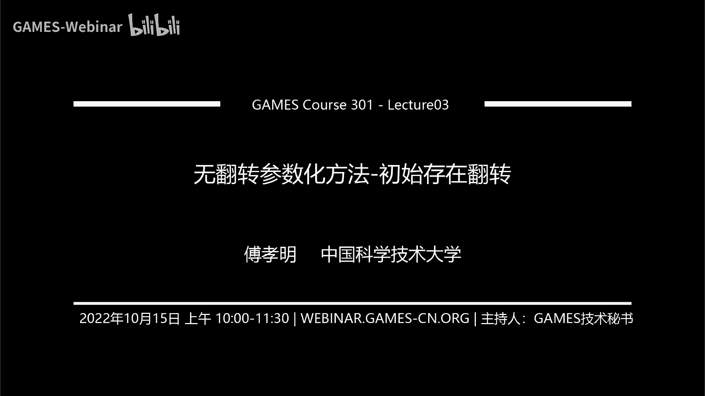
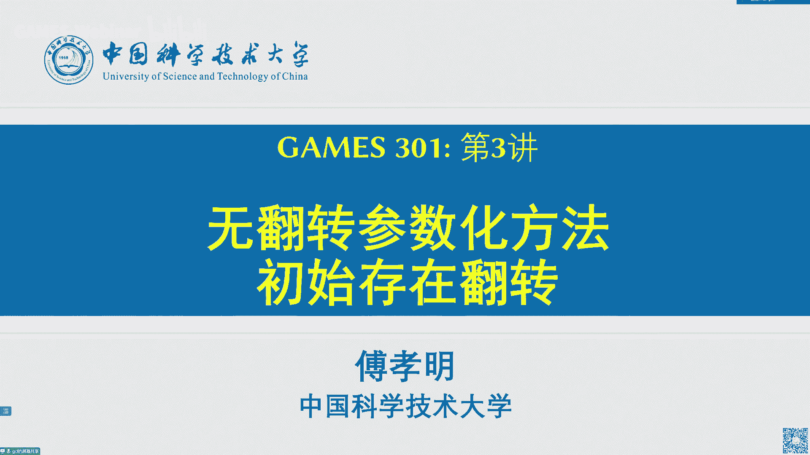
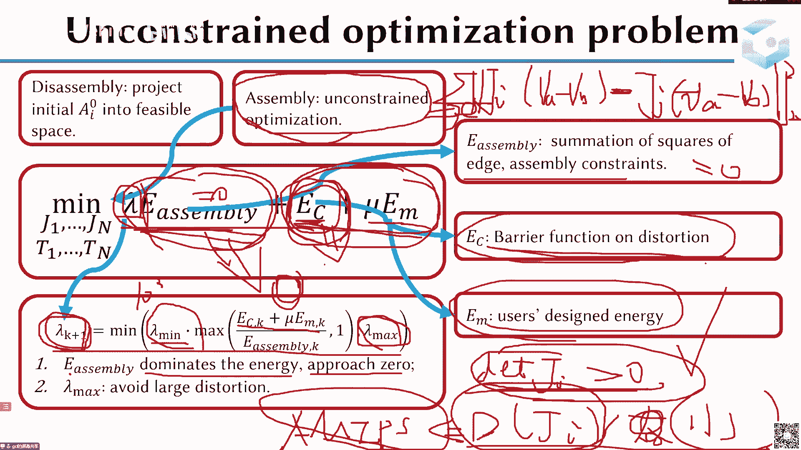
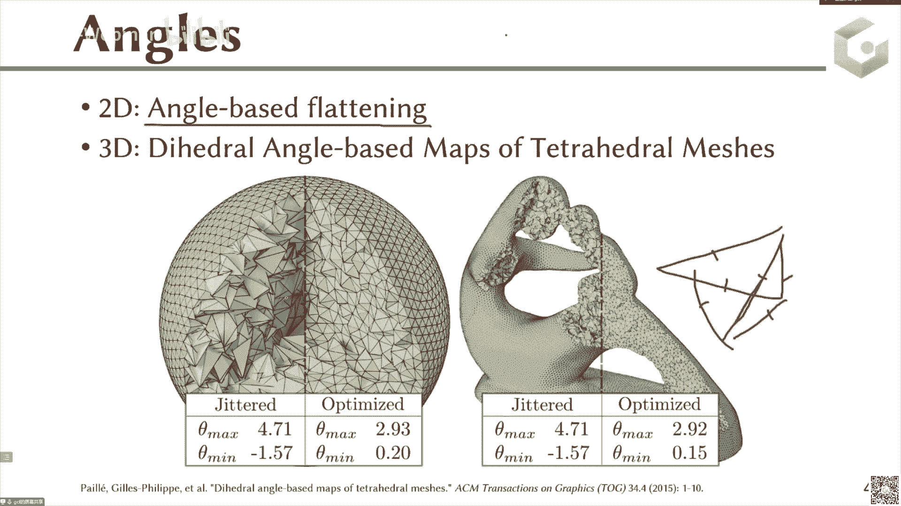
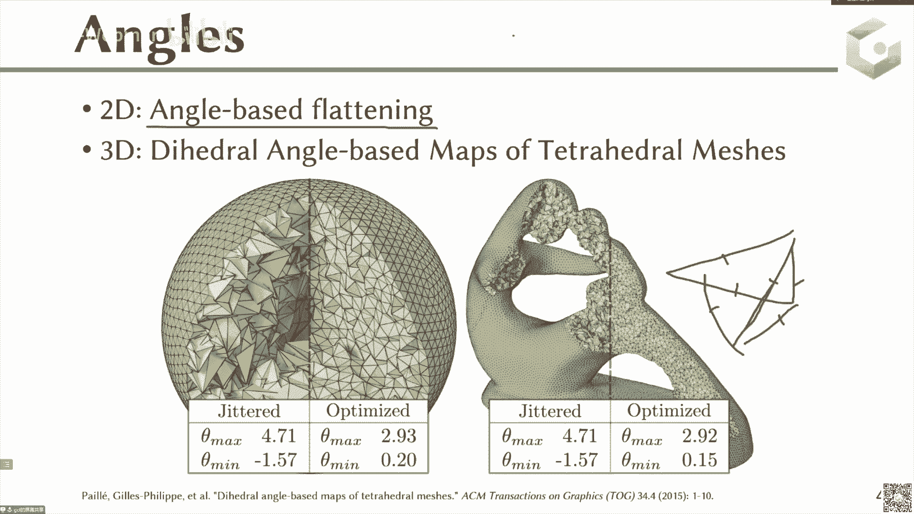

# GAMES301-曲面参数化 - P3：Lecture 03 无翻转参数化方法-初始存在翻转 🧩

在本节课中，我们将要学习如何处理在曲面参数化过程中出现的三角形翻转问题。具体来说，我们将探讨当初始参数化结果已经存在翻转三角形时，如何通过一系列算法将其修正为无翻转的有效参数化。

---

## 问题定义与背景

上一节我们介绍了四种参数化方法，包括 Tutte Embedding、ABF、LSCM 和 ARAP。其中 Tutte Embedding 有理论保证能得到无翻转且全局单射的结果，但扭曲较高。后三类方法（ABF、LSCM、ARAP）通过优化算法来降低扭曲，但在处理极端情况时，可能会产生翻转的三角形。

例如，对于一个头部模型，如果强行使用 ARAP 进行参数化，耳朵部分可能会产生严重的三角形翻转。翻转的三角形（通常用黄色表示）其法向与其他大部分三角形（白色或红色）相反，这会导致后续的纹理贴图完全混乱，失去棋盘格结构。我们的目标是从左侧这种存在翻转的初始结果，恢复成右侧这种虽然扭曲较大但结构完整、无翻转的参数化结果。

核心问题是：如何设计算法，去除这些翻转的三角形，使得所有三角形的朝向一致（例如都朝向正Z方向）。

---

## 方法一：基于投影的方法 🔄

这类方法的核心思想很简单：既然初始三角形存在翻转，那么能否通过“投影”的方式，将这些翻转的三角形映射到一个“无翻转的映射空间”中去？

直接对整个网格的所有三角形同时进行投影非常困难。但将一个单独的三角形投影到无翻转状态则相对容易。例如，一个翻转的三角形（顶点顺序为1-2-3，朝向负Z方向），只需将其中一个顶点（如顶点3）移动到另一侧（顺序变为1-3-2），即可使其朝向正Z方向。

然而，单独处理每个三角形会破坏相邻三角形之间的连接性。因此，我们需要一个**全局步骤**来最小化投影后三角形与原始三角形之间的距离，同时保持网格的整体一致性。这种 **局部-全局交替优化** 的思想与 ARAP 方法非常相似。

**局部步骤**：固定顶点位置（即固定了每个三角形的雅可比矩阵），将每个三角形投影到无翻转空间，求解最优的投影矩阵 `H_i`。这一步有解析解。
**全局步骤**：固定投影矩阵 `H_i`，求解顶点位置 `u`。此时能量函数是关于 `u` 的二次函数，加上线性约束，可通过拉格朗日乘子法直接求解。

这种交替迭代可以描述为一个**定点迭代**过程：`x_{k+1} = g(x_k)`。为了提高收敛速度，可以采用加速技术（如Anderson加速），利用前几步迭代值的线性组合来生成新的迭代点，从而减小残差。

此外，**扭曲上界 `K` 的选择**至关重要。`K` 定义了无翻转空间的“大小”。策略是：从较小的 `K` 开始（施加较强的约束，让三角形投影到“较好”的区域），如果优化无法完全去除翻转，再逐步增大 `K`（放松约束）。这种由紧到松的策略比一开始就设置很大 `K` 的效果更好。

另一种全局步骤的变体是**切空间投影**，即要求新生成的顶点位置落在最近投影点的切空间内。这可以加快收敛，但可能导致能量非单调下降，产生震荡，有时无法完全去除翻转。

---

## 方法二：基于有界扭曲空间的方法 📐

这类方法的核心思想是：无翻转空间本身是非凸的，难以直接优化。那么，能否在这个非凸空间内，找到一个最大的凸子空间，然后在其中进行凸优化？

首先，将三角形的雅可比矩阵 `J` 用参数 `(a, b, c, d)` 表示。无翻转条件（行列式>0）等价于 `a^2 + b^2 > c^2 + d^2`，这是一个非线性非凸约束。保角扭曲有界条件（`σ_max / σ_min < K`）可以转化为 `c^2 + d^2 ≤ (K-1)/(K+1) * (a^2 + b^2)`。

通过引入辅助变量 `r_t = a^2 + b^2`，可以将约束改写为：
1.  `c^2 + d^2 ≤ (K-1)/(K+1) * r_t` （凸约束，一个二阶锥约束）。
2.  `r_t ≤ a^2 + b^2` （非凸约束）。

约束2的非凸性在于它要求点 `(a, b)` 位于一个圆的外部。为了得到一个凸的子空间，可以在该圆的边界上做一个切平面，例如要求 `a ≥ r_t`。这个切平面外的区域就是一个凸集。这里 `a` 的方向依赖于一个局部坐标系。

通过这样的转换，我们将非凸约束近似为凸约束。接下来，目标函数可以根据具体方法设定：
*   对于 **LSCM**（追求相似变换），目标是让 `c → 0` 且 `d → 0`。
*   对于 **ARAP**，目标是让雅可比矩阵接近一个旋转矩阵，这需要给定一个局部参考架（类似于 ARAP 中的旋转矩阵）。

整个算法流程变为：给定局部参考架，在凸约束下用二次规划求解顶点位置；然后更新局部参考架；交替迭代。这个方法将问题转化为一系列凸优化问题，可以利用成熟的优化算法求解，但每次迭代求解凸优化仍较耗时，且 `K` 的选择同样关键。

另一种思路是假设雅可比矩阵的 SVD 分解中的旋转矩阵 `U_i`, `V_i` 已知（取自上一次迭代），那么其奇异值 `σ_i` 就成为关于顶点位置的线性函数。此时，扭曲有界条件 `σ_max < K * σ_min` 就变成了线性不等式约束，整个问题完全转化为凸优化问题。这种方法的迭代收敛很快（通常少于10次），但每次迭代仍需求解一个二次规划问题。

---

## 方法三：基于惩罚函数的方法 ⚖️

这类方法的思想非常直接：既然有翻转的三角形是“坏”的，我就在它们上面加一个很大的惩罚能量，在优化过程中，算法为了降低总能量，就会倾向于消除这些翻转。

惩罚函数需要设计成：当三角形翻转（雅可比矩阵行列式小于0）时，函数值非常大；当三角形无翻转时，函数值很小（甚至为零）。常见的惩罚函数形式有：

1.  **基于行列式的惩罚**：例如 `E_penalty = log( (|det(J)| + ε) / (det(J) + |det(J)| + ε) )^2`，其中 `ε` 是一个略小于最小行列式绝对值的小正数。当 `det(J)` 为负且接近 `-ε` 时，分母趋近于0，惩罚项趋向无穷大。
2.  **其他形式**：例如 `E_penalty = (|det(J)| - det(J) + ε)^p / ε` 等，核心思想都是让翻转三角形的能量急剧增大。

定义了惩罚函数后，整个问题变成一个无约束非线性优化问题。可以采用多种优化算法求解：
*   **坐标下降/分块优化**：每次只优化一个或一小部分变量。
*   **共轭梯度法**：通常需要预条件子（如拉普拉斯矩阵）来加速。
*   **拟牛顿法**：如 L-BFGS 算法。
*   **一阶动量法**：如 Adam 等源自深度学习的优化器。
*   **二阶方法**：如牛顿法，但需要处理 Hessian 矩阵非正定的问题（可能需要正则化）。

**惩罚函数法的关键**在于惩罚权重 `ε` 的调节。设置得当，收敛很快；设置不当，可能无法去除翻转或收敛缓慢。它的优点是思想简单通用，在网格生成等领域广泛应用。缺点是当初始翻转非常多时，可能难以优化。实践中，常与**方法一**结合使用：先用投影法快速去除大部分翻转，再用惩罚函数法精细去除剩余的少量翻转。

---

## 方法四：基于面积的方法 📏

这类方法基于一个几何观察：对于一个平面三角化区域，其所有三角形的**有符号面积**之和等于该多边形的面积。而所有三角形的**无符号面积**之和总是大于等于有符号面积之和。当且仅当三角化中**没有翻转**时，无符号面积之和达到其最小值，即等于多边形面积。

因此，一个直观的想法是：直接优化三角化的总无符号面积 `TUA`，使其最小化，理论上就能得到一个无翻转的参数化。然而，这存在两个问题：
1.  `TUA` 达到全局最小不一定对应无翻转映射，也可能包含退化的三角形（面积为零）。
2.  `TUA` 不是光滑函数，且在有效区域可能存在平坦区（梯度为零），导致优化困难。

为此，研究者提出了“提升”的无符号面积概念，例如定义能量 `E = Σ_i ( det(X_i^T X_i + α I) )^{1/2}`，其中 `X_i` 是三角形边的矩阵。当 `α=0` 时，它退化为 `TUA`。通过引入 `α>0`，该能量变得光滑，并且理论证明其局部极小值对应无翻转映射。这个方法较新，但实际效果一般。

---

## 方法五：基于不同表达的方法 🎭

之前的方法都直接以顶点坐标为变量。这类方法的核心思想是：**换一种更容易控制翻转的几何量作为优化变量**。

**1. 以雅可比矩阵为变量**
既然我们的终极目标是所有三角形的雅可比矩阵行列式大于零，为什么不直接把每个三角形的雅可比矩阵 `J_i` 作为优化变量？初始化时，我们可以直接让每个 `J_i` 都满足行列式大于零且扭曲较小。这样，翻转问题从一开始就被解决了。

但新的问题是：每个三角形独立优化后，网格会“散开”。我们需要一个约束让它们重新“拼合”起来。这个约束就是：对于共享一条边的两个三角形，它们各自变换后的该边向量必须相等。即 `J_i * (v_a - v_b) = J_j * (v_a - v_b)`。

因此，总能量函数设计为：
`E_total = λ * E_assemble + E_distortion + E_user`
*   `E_assemble`：拼合能量，衡量上述边约束的满足程度。
*   `E_distortion`：扭曲能量，控制每个 `J_i` 的质量。
*   `λ`：一个巨大的权重，在优化初期主导优化过程，迫使三角形拼合。
*   优化过程中，通过线搜索保证每一步迭代都不引入翻转（行列式保持为正）。

**算法流程**：初始化一组无翻转、低扭曲的 `J_i` -> 在保持 `J_i` 无翻转的前提下，优化 `E_total`（逐渐增大 `λ`，使 `E_assemble → 0`）-> 从最终收敛的 `J_i` 恢复出顶点坐标。这个过程可视化起来就像一堆散开的三角形逐渐聚合为一个完整网格。

**2. 以二面角为变量（3D推广）**
这是对 2D 中 ABF（以角度为变量）方法的 3D 推广。在四面体网格参数化中，将每个四面体的六个二面角作为优化变量。通过优化这些二面角，并满足复杂的几何约束（类似于 2D 中的三角形内角和、边长约束），最终可以得到一个无翻转的 3D 映射。计算非常复杂，但原理相似。

---

## 总结与回顾 🎯

本节课我们一起学习了五种处理初始存在翻转的参数化方法：
1.  **基于投影的方法**：采用局部-全局交替优化，将三角形投影到无翻转空间，思想类似 ARAP。
2.  **基于有界扭曲空间的方法**：将非凸的无翻转空间近似或转化为凸空间，利用凸优化算法求解。
3.  **基于惩罚函数的方法**：为翻转三角形设计巨大的惩罚能量，通过无约束优化迫使翻转消失。
4.  **基于面积的方法**：通过优化提升后的无符号面积来间接保证无翻转。
5.  **基于不同表达的方法**：改变优化变量（如雅可比矩阵、二面角），从源头上避免翻转。

从实践角度看，**方法一（投影）** 和 **方法三（惩罚）** 的组合往往非常有效：先用投影法快速去除大量翻转，再用惩罚函数法处理剩余的少数翻转。理解这些方法的原理，有助于我们在面对不同挑战时，选择或组合合适的工具来获得鲁棒的无翻转参数化结果。