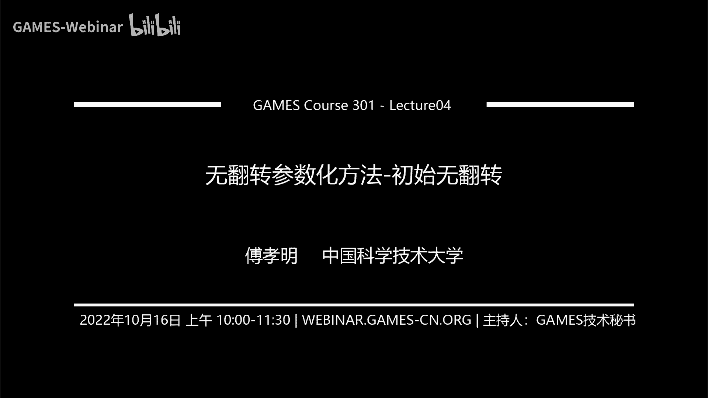
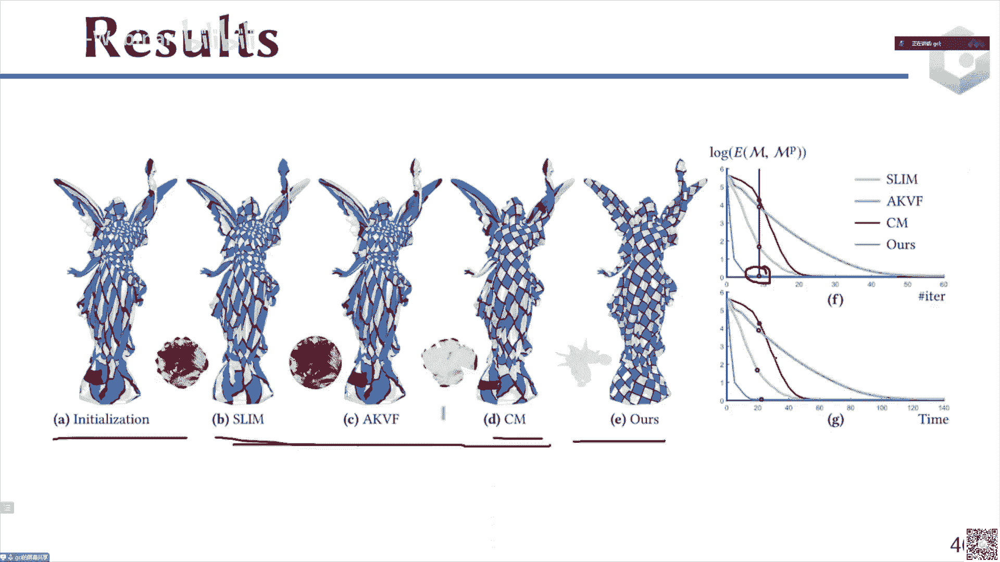

# GAMES301-曲面参数化 - P4：Lecture 04 无翻转参数化方法-初始无翻转 - GAMES-Webinar - BV18T411P7hT

我们今天的内容是这个还是跟昨天一样，是这个计算一个无翻转的参数化或者一个无反转的映射啊，但是我们今天的这个初始是没有翻转的。

那么所以说呢问题大概是这样，就说左边是我们现在这个今天要讲的这个内容的输入啊，就是说这个这个初始化一般情况下，比如针对这个参数化的话，就是看他的第一次作业啊，就是用这个two diebing可以来生成。

所以我比如说我可以把这个边界放在一个圆上啊，就图图边界，然后内部的点是周边的点的那个线性组合，一个凸组合啊，那这样的话我可以求解一个线性方程组得到第一个减呃，但这个方案但是这样得到的这个解的话呃。

很显然他他的这个distortion，它的这个形变，或者说它的这个扭曲是比较大的，所以大家可以看到这个棋盘格的纹理贴上去以后，它的棋盘格已经没有了这样的一个呃图案啊，那么所以说呢。

接下来就是我们希望去对这个high distortion的这样的一个呃初始化，去进行这样的optimization啊，使得他最后的这个展现出来是一个low distortion的啊。

比如说大家可以看一下，并且并且是low distortion的时候，并且是一个嗯还是一个flip free啊，就现在这个初始的话，大家可以看一下它是没有翻转的，因为我们之前说的是那个totti。

其实有个理论的保证对吧，它可以保证他这个结果是一个双手，并且是一个没有翻转，那么最后的话我们希望去优化出来一个同样是一个flip free，并且是一个low distortion。

大家可以看到这边的棋盘格纹理就比较正了啊，所以这是我们今天要讲的这个问题，这个算法怎么去设计啊，啊这个问题应该讲的比较简单，那么这样就为了去解决这样一个问题的话。

其实会有一个通用的这样的一个framework啊，通用的一个solution，那么这个solution的kd呢，就是说它是从一个呃没有翻转的初始开始呢。

比如说刚才我们看到的那个tt in bedding对吧，从这个twitter in bedding开始，然后呢我在这个优化的过程中，它的但是它的扭曲会比较高，所以说我在这个优化的过程中呢。

我其实是优化的是optimized的，是它的the distortion，但是呢我其实还要满足一个约束，是always stay in the fleeper，flee space。

就是说我要让这个映射，或者说我要让这个参数化，它一直是在这个space里面的，而不是一直出去那么大，因为因为他是从头到尾都一直在这个space里面，所以说呢它最终的结果也就在这个space里面。

那么这样的话它就是还是一个无翻转的这样的一个映射啊，那么整个pipeline呢就大概是这样，啊首先是有一个初始化的，没有翻转的一个参数化，x0 是代表一个参数化，然后在这个x0 的基础上。

我去计算一个下降方向，就是去去去这个下降方向，是通过这个optimize，这个distortion这样的一个目标去生成了一个下降方向，他这个就是优化里面的给一个目标函数啊，一个无约束优化问题。

或者是一个呃就是一个优化问题，然后我去生成它的这样的是优化问题里面，去生成这样的一个生成这样的一个direction，就一个下降方向，然后呢沿着这个向量方向呢，我去做这个线搜索啊，这就是标准的这个。

优化里面的流程，大家呃如果学过优化的话，应该知道这个过程，然后呢接下来再往前去迭代对吧，然后去重新去生成计算方向，重新去做线搜索，那么呃最后呢直接到满足了这个收敛条件以后，接下来去输出。

那么稍微注意一下，再注意一下两点啊，第一点是这个在计算这个线搜索的时候，其实我们是要去计算一个步长，那么这个部长就是我们要让它这个always stay in the flip free这个space呃。

这个这个这个约束呢是一直是满足了，所以说我们这个阿尔法的选择是要满足两个事情，一个事情是要让，这个翻转的这个无翻转的这个约束是一直是满足的，第二个呢我们还是希望他的这个满足这个传统的，比如说沃尔夫条件。

或者说一些这种就是优化里面的一些这个线索索的一些条件啊，所以一般情况下是要保证两点一点是这个没有翻转，而翻转不会出现，第二是还是要满足这个优化传统的优化里面的一些呃，线搜索的一些条件。

比如说刚才讲的这个wolf条件等等啊，当然其他的一些稍微弱一点条件也是可以接受的，那么第二个是这个地方的这个下降方向，这个地方的下降方向，呢其实是接下来要介绍的这些所有的这些方法里面的最大的不同。

就是在这个下载方式的计算里面啊，就是说这个接下来看后面这个整个学术圈在这个发展过程中，或者说整个在这个计算这个d的这个方面是会有一些不一样的。

主要是make difference between the method，就是这个d啊，那么我们为了让它这个线搜索的时候具有，我们为了让他这个先搜索的时候。

能够保证这个flap free的这个约束一直是满足呢，其实我们会呃，其实会要求是最后的这个目标函数里面，其实会有一个barrier，的function的这样的一个特性啊。

这barry function是什么意思呢，就是他会在当一个里面的一个三角形或者一个四面体，它趋向于这个退化，或者说呃出现呃翻转的时候呢，这个能量函数是会趋向于无穷的啊。

那么也就是说嗯就是这个buy function，就是说它相当于就是说你在，如果你在这个你的目标函数里面会存在这样一个bufunction，就是说他在这个如果存在一个三角形或者一个数学体系。

趋向于退化或者是翻转的时候，它会趋向于无穷，这样的话它就会避免你可以去翻转，或者你可以去退化对吧，那么为了去，设置这样的bufunction的话，一般有两种。

第一种是直接就是加一个辅助的bufunction，比如说最常见的就是这个嗯行列式的负log对吧，就是他的那个就for log这样的一个最常见的bufunction。

那么对还可以用直接用这个distortion metric，比如说我们来看一下这个max能量，这个mix能量大家可以看一下，它是西格玛二分之西格玛一，加上西格玛a一分之西格玛。

那最后把它转成应该是西格玛一的，乘上西格玛二，西格玛一平方加西格玛二对吧，加起来，那么这个地方会有一个行列式，那么这个地方如果如果它是一个退化的三角，形或者说它是一个翻转的c它是一个退化的三角形的话。

那么也就是说它这个地方的行列式等于零的，对不对，因为但这个假发比矩阵的行列，是描述的是这个映射后的这个三角形的面积，除上这个映射前的这个三角形的面积，那么如果映射或者三角形的面积趋向于零了。

那么也就是说这个它的行列式就趋向于零了，那么行列式就趋向于零的话，那么也就是说这个分母就趋向于零了，分母趋向于零，那么整个式子就趋向于正无穷了啊，这是趋向于无穷了啊，那么所以说呢这个本身。

这种类似于这种mix能量，它其实本身也是具有这样的一个bl function的这样的一个特写啊，所以他最后比如说比如说这个横轴是这个行列式的话，那么这个目标函数你它会在这个趋向于零的这个地方。

它是一个爆炸式的一个bug，发一个爆炸式的一个长这个样子啊，那么这样的话他其实可以去在某种程度上去呃，它其实就是具有这样一个barrier的这样一个性质，那么也就是说你在做这个呃，现在搜索的时候。

你不要去超过他，就这个bl他可以障碍一下，就是把它给往后挪一挪啊，所以说这是需，要所以我们在这个设计或者说在优化的过程中，我们需要这个目标函数具有这样的一个barrier的这样的一个性质啊。

那么接下来我们为了去算这个赛道方它的这个总体的思路啊，因为我们刚才讲了，他这个目标函数设计的时候要有这个burier的这个特性，那么接下来去计算这个向量方向的时候呢。

而大部分的方法其实都是用一个局部的二次逼近，去对这个目标函数去做一个啊局部的二次to的，二次的二次的proclamation啊，所以对这个目标函数在这个局部去建立一个二次的这个to的二次的逼。

近二次的逼近而不是凸的，然后你这个地方你其实可以认为是类似于是一个泰勒展开啊，乘上它的这个向量，然后再乘上这个地方的二次项，乘上它的这个两个向量的平方，那这个地方你可以认为是他的那个黑森矩阵。

那这个是他的那个梯度，那么这个是那个它的那个你可以认为这是一个局部的一个泰勒展开，那么我为了我们，去让最后的这个方向是具有下降的形式的，我们其实希望这个能量一般情况下是一个二次的to 2。

突然二次的近似啊，那么这样的话我其实可以去保证最后的能量是一个下降的，那么呃去做这个泰勒展开以后呢，其实我们会让我们其实其实去只要去minimize这个minimus，这个优化这个目标函数。

我们就能去决定这个下降方向啊，大家注意啊，这个地方的这个你可以可以看一下，这个地方我写的是这个e的这样的一个它的梯度，但是这个地方的hr其实我没有写成，没有写成直接写成e的这样，的一个海森矩阵的形式啊。

其实我写了这样的一个h那说明什么呢，说明这两个东西可能是不相等的啊，可能可能是不相等的，那么反正就是这个地方是一个，所以说这个地方的呃，所以说这个大部分的方法就是说不同的方法的区别。

不同方法的区别主要就是在这个h i的这个构造上面，这个hr如果不一样，那么整个这样的一个能量函数也就不一样，这个局部的这样的一个近似也就不一样，那么局部局部近似这个能量函数不一样。

那么也就是导致了最后的这个下降方向不一样，所，以说呢所有的方大部分的方法的区别就是在这个h i的构造上面，那么比如说我们最常见的这个有三大类方法啊，第一类方法是这个一阶方法，第二类是你游的方法。

第三类是这个二阶方法，那你牛顿方法的话，就意味着这个地方的h i就直接没有了啊，就是h i就是不考虑了，那么所以说他只用了这样的一阶方法，他就不考虑了这个hr，所以他只用了一阶的导数信息。

直接没有使用这个二阶的导数，所以h2 就不考虑了，那么这个h2 就等于零啊，是，那么对象的一个拟牛顿方法的话，它是erotive actih r two。

approximate to the second，嗯对就是c2 阶的信息啊，所以说相当于在对于这样的理由的方法，就比如说最常见的呃b f g s的话，b f g s的话。

它其实会有自己的一套这个算法的算法去估计这样的hi啊，所以说hi就是这样的，比如他是他是用这个梯度和这个变量之间的这个difference，就是他们之间的差距，估计这样的一个梯度啊。

估计这样的h a h i啊，那么对于这样的一个牛顿法的话，他就会直接使用这样的啊，二阶的这样的黑森矩阵的信息去构造这个hi啊，那么也就是说这样的三类方法呃，它会呃他会用不同的方式去对这个hr去建模啊。

那比如说这个第一类就直接不用了，那第二类相当于他会用这个梯度之间的这个difference，和这个变量之间的difference，然后去构造这个h i，那么这个等会我们可以具体讲一些细节。

那么接下来这个牛顿方法的话，他会直接使用这个啊，原来这个能量的，就是原来这个e的这个能量的这个黑森矩阵去构造这个hr啊，那么所以说呢最后对于这样的一个下调方向的技巧，大家一定要注意，首先我们是呃的。

我去给它构造一个to的二次的逼近啊，注意啊是to的二次的逼近，然后呢，然后呢我们去这个地方的呃，就是相当于是构造一个这样的一个二次函数，那么这里面不一样的就是这个h r的构造。

然后呢去有了这样的一个二次的to的逼近以后，我再去计算它的这样的一个向量方向，计算完向量方向以后呢，我就可以去做先搜索了啊，那么这样所有的方法都不同，都是在这个hr的构造上面啊。

好那么接下来是这是一个hr的三类的方法，那么待会我们再继续讲一些细节啊，我们大概笼统的介绍一下，那么接下来是信搜索，那么先搜索的话，我们还是希望这个信搜索过程中保证两点。

第一点是呃刚才讲了这个还是flip free啊，就是两点，第一点是还是flip free，那么第二点我们是希望比如说wolf wolf的condition是满足的，condition。

coo n d i t are in condition，就是wolf condition和这个flip free啊，就是呃蓝色一般要满足这两个条件啊，那么为了这个满足这个第一个条件。

我们主要来讲一下第一个条件啊，要让他保证还是free free的，那么也就是说我们希望最后的是这个线索索过程中，能够保证它这个没有产生翻转，那么这个时候呢我需要就每个三角形它的面积都是正的啊。

就是它的那个有符号的面积是正的，那么我们可以来看一下，如果一个三角形就是u1 u2 u3 ，他经过这个是它的v1 v2 v3 ，是它的那个下降方向，就向量，方向阿尔法是他的那个步长。

那么这样的话它的这个新的三角形就是这个u2 ，u2 加u2 加上v2 阿尔法，那么u3 加上v3 阿尔法是这个点，v u一加上v一阿尔法就是这个点，那么我们可以去在这个线搜索的线索的过程中。

我们其实可以确定一个步长，使得它这个面积等于零对吧，那么只要我不超过这个步长，那么是要来所有的三角形都是正的，那么所以说呢我们可以考虑这个三角形的面积退化的情况下是对的，阿尔法是多少。

那么也就是说我只需要它的这个行列式，新的，这个三角形构成的这个面积等于零，你们就它的行列式等于零对吧，那么好的是等于零，那么大家可以看一下，这个是一个2x2的矩阵，2x2的矩阵。

那么求他的这个行列式的话，最后其实是关于这个阿尔法，是一个一元二次，一元二次的方程对吧，你把它交叉乘一下平方，所以你最后得到一元二次的方程，所以说它是关于阿尔法是一个二次函数啊，二次的多项式。

那么你接下来你要去解这个二次的多项式的话，其实你它一般情况下22你可以求根公式，直接把两个根给求到对吧，那么所以说呢这个最大的牧场其实对应的是那个最小的正根对吧。

那最小的正根的话相当于你这个地方你只能移动的，是，因为你一开始的这个二次函数一开始是正的，就阿尔法等于零的时候是真的，然后往前走，走到一个点是变成等于零了，那么也就是说是零优化参数。

比如说你这个地方是正的，这个地方是等于零，那么这一段就是你就是都能够保证面积是正的对吧，那所以说它是一个对应的是一个最小的正根的情况等等，所以说你对这个三角形而言。

它的最大的步长就是对应是这个一元二次方程的这个最小的正根，那么对于这样的一个最最小的正根的话，呃你只要去解这个一元二次方程，你只要用那个求根公式带进去求证就行了啊。

那么这样的话你对于每个三角形你都可以求得一个最大的步长啊，你你你只要不超过这个步骤，我的面积一定是正的，那么所以说对于整个的对于所有的三角形而言，你就是对这个所有的这个最大的部分再取一个最小值对吧。

你只要这样的话，你就能保证所有的三角形都做在这个这个牧场里面，都是能够去呃没有翻转的啊，那么这是一个线索的过程中，要去算一个最大步长这样一个想法。

就是这样的话它就能保证啊所有的三角形呃都是能够没有翻转的，然后在这个最大步长的这个对在这个最大步长的基础上，我们再去呃，让他再去做线搜索，就往后退，就再去缩小这个最大步长，使得满足这个wave肯定行啊。

第一部分是去计算一个这样的一个最大的补偿，使得它满足第一条这个没有翻转的约束，然后第二条在这个最大步长的基础上，然后再去做进一步的线搜索啊，保证这个步长是在缩小的。

然后呢它是满足这个waf肯定就是个能量能够充分的下降啊，所以他这个这个限速的过程你可以认为是有两部啊，那么最后的话这个常用的这个收敛条件的话，这个地方也会有三种，第一类是这个梯度小于一个给定的阈值。

或者说这个能量的相对变换给小于一的阈值，或者说是最后呃达到了这样一个固定的迭代数目啊，这个是跟这个传统的这种优化里面其实是差不多的啊，这个就不累赘了，不不不讲了啊。

那么所以说呢我们在在讲这个具体方法之前，我们再简单的回顾一下这个papi啊，首先是我们要生成这样的一个初始化，这个初始化比如说这个是这个two days in bin就可以生成。

然后呢接下来我们要在这个初始化的基础上去算一个计算方式，算一个向量方向，那算了下算上方下算下降方向的时候，我们主要是对这个函数在x处的，这样去给他去找一个啊to的这样的一个进啊。

就给他去找一个这样的进四啊，比如一阶方法，二阶方法，或者说这个拟牛顿法，那么主要都是在算这个进进四，刷完这个近视以后，你会得到一个向量方向，所以向下降方向以后，你也要去做先搜索，接收所知的时候呢。

你要保证两点一点是这个它是没有翻转的，那就需要又要去算，就要去算一个最大步长，然后在这个最大步长的基础上，你要去做这个进一步的线搜索，比如说你要让他最后的解释满足这个waf dition。

那么wolf condition的话呃，就是能够保证这个能量是充分下降的啊，然后你接下来再回过头来再去做这个计算一个向量方向，再去做一个线搜索，下降方向计算，所然后直到最后满足这样的一个终止条件。

然后最后就输出啊，那么所以说接下来所有的内容都是在这个地方啊，就下载方向的计算里面啊，那我们开始讲具体的方法，首先我们要讲的这个第一类方法是这样的，叫做一阶的方法，那么一阶的方法的话。

我们要介绍的第一个一阶方法是叫做呃block cootic descent，叫做坐标轮换下降法，或者呢它还有个名字叫做非线性高斯赛道迭代，nina高斯赛德ation啊。

就是说或者说两种方法都是代表着同样一个意思，什么意思呢，就是我们现在有一个这样的目标函数啊，这个目标函数呢它的变量是x一到x n。

那么我可以把这个变量呢分成这个omega 1 omega omega m m个block啊，传下去，我可以把这个变量我可以把这个我的这个变量变成一个m和block，知道吗。

就是说他每次呢每次呢就是它相当于这个m个block，然后你每次只更新一个block里面的变量啊，那么相当于就是我们之前讲，我们之前比如说大家应该学过这个高斯的迭代对吧。

然后高斯的迭代就是说每次我只更新一个一个变量去解方程的时候，然后呢接下来更新完一个，然后把这个最新的用进去，然后再去更新第二个对吧，这样一个思路，就是说我每次我把这个变量分成m个block。

然后每次只更新一个block，所以说呢整个的pipeline就是这样的，首先我有一个初始，有个初始呢，然后呢我接下来去解这样的这个地方不一定是凸的啊，然后我去解一个子问题，territory。

这个子问题是什么呢，就是这个这个是我的这个当前的这个变量，bl是当前的变量，然后呢这个是这个相当于是从b一到bl减一的，是已经是已经是update过的，就是跟我们高三的迭代一样。

你从这个x x一到x n，你这样一个迭代过程，其实你是先会更新x1 ，再q更新x2 ，再会更新x3 对吧，那其实你这个地方其实会也会像前面就说你在更新这个xl的时候。

其实你的前面的x一到xl减一其实已经更新过了，所以这个商标是dk次的，但是后面这些呢其实你还没有更新，所以说是上一部的k减一部的，那么所以说在每一步的话，它对于只更新这样的一个block啊。

所以说这个为什么叫做block called descent，所以你他在每一次都是去解一个子问题，这个子问题就是只有bl是一个变量，然后呢他把这个l从一到m全部的遍历一遍啊，相当于先解。

把先把b一当做变量去求解一下，再把这个b2 当做一个变量求解一下，然后最后把bm去当做一个变量求解一下，那么比如说对于这个我们的这个参数化问题而言，比如说我们现在有一个呃参数化这样一个一堆的三角形对吧。

2d上会有一堆的三角形，其实我这个天然的这个blog其实就可以把一个顶点的两个位置，一个顶点的，比如说这个点他的那个变量其实应该是ui a v i对吧。

我们可以把它的这两个两个位置的变量作为一个block，就是b是吧，那么也就是说我每次呢相对于我们这个问题的话，他每次去比如说更新这个b一的话，你可以认为是更新这个u1 u u1 v1 。

就是比如说这个第一个顶点的这个两个位置，然后去更新这个b2 的时候，其实是更新是第二个顶点的位置，然后b3 是更新第三个顶点的位置，更新这个bl的话。

其实相当于是那个ul v l就是dl的那个顶点的位置对吧，所以对于这样的我们的这个参数化问题而言，你可以相当于是一开始有了一个to listing bing。

然后呢你其实是主点的去更新我们的这样的一个目标函数对吧，所以说大概对于我们这样的一个参数化问题而言，就是我刚才已经掌握了，最简单就是把这个block变成这个u1 v一啊。

就是每个顶点的位置当做一个block，当然如果你你的这个呃，你也可以去把它更多的变量当成当成你想要去做的，比如说你这个地呃更多的啊这个地方这个地方另外再说啊。

啊这个地方就不是我们我们主要讲的就是一个顶点当做一个blog啊，那么所以说呢这个呃就可以利用这种思想啊，就刚才刚才介绍的思想，把所有的三角形呢的每一个顶点当做一个block，然后每次只更新一个顶点。

那么这个地方有两个不同的方法，这个是不精确的b c d，一个是精确的b c d是什么意思呢，就是你每次去求解这样的一个子问题的时候，每次你去求解这样的一个子问题的时候，你会把它求解到直到收敛。

其实你只会去做一个简单的，比如说梯度下降就在这个地方，你是不收敛的，就你相当于是直接去给他做一个呃，你可以认为就是相当于就是只在这个地方稍微显示稍微走一步，就是你只要保证它不翻转就行了。

或者说保证它能量稍微下降一点，但是他你不会去保证这个地方一定是啊，这个局局部的这个子问题是收敛的啊，那么最后呢我们在这个参数化的问题上，其实会展现出来更好的一个收敛性，或者说最后的能量会更低啊。

而这个能量不好，相当于是什么呢，你在整个的局部虽然是很贪婪的，找到了最优，但是你导致整个因为你太贪婪了，然后导致你最终的这个收敛性会变差一点，就是你相信哪一步，你虽然走的不是最优的。

但是你都在往那个好的方向去走，然后呢给大家留的空间都比彼此都比较大，这个b c d最后的效果会比这个呃每一步都求到他收敛了，那么所以说呢最后这个我们会发现这个in excb cd呢。

它的这个速度会更加的快一点，然后它的这个目标函数会更加的小一点啊，那么所以说呢这个对于这个问题的话，就是初始化还是与来自于这个呃to this invading啊，那么然后block的时候呢。

就是我们其实每次都是呃，当然这个地方如果你用引入了这样的一个graph color以后，其实你的刚才我们介绍了这个block，其实不一定是每个顶点的位置是一个block。

其实你可以对这个你可以把这个网格顶点当做一个图，然后你给他去上色，然后相邻的两个顶点之间，它不要是呃相邻的啊，相邻的魈相邻的两个顶点之间它的颜色是不一样的，那么这样的话你最后用在这个图上。

你可以去给它做一个色，然后呢然后就是说所有的这样同一种颜色的点呢，其实我可以是当做一个block，然后去同时去做这个呃下架啊，这个是呃这个是就是另外一种另外一种block的这个方式啊，就是。

可以作为并行的方式，然后对于每一次在求解的时候呢，每个顶点它只是只做了一部的梯度下降，他没有去做这个还有收敛，没有去迭代，当他收敛啊啊那这个是这个第一个一阶方法啊。

那么接下来我们要讲这个第二个第二个一阶方法，那么对于我们的现在这个目标函数而言，这个fx等于h x等于gx，就相当于说我可以把我们的目标函数拆成这样的一个啊，h x加上gx的这样的一个形式啊。

那么比如说我们来举个简单的举个例子啊，比如说它的这个对于一个三角形而言，它的对称，狄利克雷能量啊，对称狄里克雷能量是应该是西格玛a一的平方，西格玛一的平方加上西格玛一平方分之一，加上西格玛二平方。

加上西格玛二平方分之一，那么其实你这个h x呢就可以变成西格玛一的平方，加上西格玛二的平方，加上呃西格玛a一平方，西格玛a2 平方，西格玛a一平方加上西格玛a2 平方。

那么你的这个tx呢是这个你的h x呢其实是这个，那么所以说呢你的h x其实是可以是一个简单的形式，因为西格玛一加西格玛一加这个西格玛的平方，就是这个甲亢b矩阵的这个f算数的平方对吧。

那你这个f数的平方的话，其实就是一个二次项能量，所以说呢你就可以把这个hx呢，把这个你的目标函数fx等于h x加gx，你就可以把它转成一个二次项能量，再加上一个gx gx是一个比较复杂的。

然后呢接下来你在这个y这个点，就y n这个点你要去做这样的一个，它应该等于这个hyn加p，然后等于g y n加p对吧，就是你这个式子带下来，然后p呢你可以试它的，这是一个计算的向量方向。

然后呢你在这你在yn加p这个地方，你去给他去后面这一项啊，就前面这一项你就这个二次函数你就直接写下来，但是呢你在这个后面这一项的时候，你去做给他去哇，你对y你对g这个函数去做一次泰勒展开啊。

是在这个yn这个地方去做一次它的展开，那么所以说他只取了它的这个一次项，这是它的这个目标函数，就是它的这个梯度，然后存到一个三角方向p对吧，所以说相当于这个是它的一个taylor，啊泰勒展开。

taylor expanding就是一个泰勒的一个展开，那么相当于为什么是可以这样呢，相当于就是说因为这个后面这个目标函数比较简单，也就是说后面这个目标函数它其实只用了一个一阶方法，就是梯度下降吧。

一阶方法，啊一见方法就是一个泰勒下降啊，就是一个梯度下降啊，就给他做这样一个泰勒展开，如果你只做这个不把二次项要加进来，那这个地方其实就是一个开发者，就是一个梯度下降啊，但是呢因为前面这一项呢。

我们在做这个分解的时候，我们已经假设它是一个二次函数了，所以我这个二次函数就直接写下来了啊，所以这个因为你不存在任何的近似，所以这是一个二次函数，这是一个对这个上面的一个一阶的近似。

所以你最后就会得到这个fy加y n加p，就是你可以认为就是这个整个就是这样的一个近似方式啊，啊为什么要取成这样一个定制方式呢，就是因为这个文章里面这样，因为这一项的话，它其实就是二次就取下来了。

这一项他就比较呃觉得不太好，然后呢接下来你就去给他去做这个向量方向的计算，那其实就是给他去求一个梯度，让它记录等于零对吧，那你求这个梯度的话，这个地方因为前面这个第一项是二次的。

所以你求完梯度就是h5 n加p，然后接下来后面这一项，那么这一项这个是目标函数值是在y n处的，那么它其实不是个变量呃，关于p不是个变量，因为p是一个呃向量方向p现在现在的变量是p。

那么你对后面这个求导呢，其实就是它本身，那么这样其实就是它这个这就是它的梯度，那么所以说你最后你会就会得到这个y n加p，就等于h的转置乘上这个，所以这个会得到的是hp等于负的h乘上y n减去。

这个等于就是负的在yn出的这个梯度啊，就这样的话你的下降方向p的话，其实就是h的逆乘上负的这样的一个梯度啊，从这个式子我们可以看出什么呢，就是我如果这个目。

标函数可以把它分解成这样的h加上g的这样的一个形式，那我只取这个g前面这一部分的这个二次项的这个梯度，作为我这个地方的这个目标函数这个东西啊，那么其实这个地方最常用的这个h是什么呢。

就是一个网格的拉普拉斯矩阵啊，就是说如果你的函数是可以分解成这样的一个to一个二次的形式，再加上一个这样的形式，它就可以用这样的一个啊cross的一个简单的。

你可以认为这个是一个简单的一个二次的一个呃一个process啊，就是它的一个二字在这个局部的一个近似，它只是只不过这个地方的近似呢，把这个后面这一项就用的是一个一阶的近似，前面这一项因为他是这样的。

可以做二次展开，所以他就直接用了2g的近似，那这个地方它这个最常就是最常见的这个h呢，是那个网格的拉普拉斯矩阵啊，那么有了这样的方法以后呢，他这个还是不够的啊。

就如果直接去用这样的一个拉拉斯矩阵去做的话，还是不够的，其实是有一些呃相似的地方啊，当然这个地方不是完全一样啊，大家可以看一下这一步，这一步其实就是我们上面讲的这个计算这个向量方向的过程啊。

这个前面这个h它是一个二次函数对吧，后面这是一个呃g这个函数的这个一阶的一阶近似，那么然后通过求解这个东西呢，我就可以去求解一个向量方向，在这个地方有向量方向以后呢，我就可以去做一个线索索，大家注意啊。

这个地方有一个yn和这样对x n这两个东西是有点不一样的啊，它是通过这样的一个线索索，然后线索所得到的这个变量呢就是y n加上tp呢，就付给这个x z n啊，这是他的这个线搜索的这个得到的x n呃。

大家可以我可以换一下啊，这个地方是比如说这个地方是y n，然后呢它沿着这个方向p n，然后呢得到了这个点，这个点是x n对吧，那么正常情况下应该是我直接把这个x n放到这个目标函数里面，然后去求解对吧。

就是去求解得到下一个赛道方向了对吧，我应该是把这个x n n付给y n加一，然后放到这个目标函数里面，再去求解它的向量方向对吧，但是呢他其，实没有，他其实不是直接把x n负给。

这个是没有直接去付给这个yn加一，它这个yn加一是等于什么呢，y n加一是等于一减西塔乘上，然后y n加一，那么这个地方应该是这个x n对吧，x n加上啊，减去减去西塔乘上x n减一，那么什么意思呢。

就是它它是在这个的点和前面，比如说前面我这个地方还有一个点是x n减一，它是由这两个点的一个线性组合，会得到一个yn加一，这个应该是一个y差的一个形式啊，这个c它比如说大于零的情况下。

其实就是沿着这个方向，沿着这两个点，连起来的这个方向去做一个外差，那么得到这样的一个y n加一，然后在这个问n2 n加一的前提下，我再去做这个下一步的这个信息搜索啊，再去去去求解相关方向。

然后再去做现搜索，其实大家可以看成是什么呢，它这个y n加一其实是由这个xn和xn减一去做一个线索，是做一个y差，y差去得到这样的一个yn加一，然后在y n一加一的基础上再去计算一个向量方向。

再去呃计算向量方向以后再去做线差啊，再去做这个线搜索，那么这样的话这样的一个这样的一个外插的形式呢，它其实会带对这个优化问题，相当于是可以往前进的更多一点啊。

那么这个地方其实大家可以看一下这个地方其实用的是什么呢，用的是x n减一和x x n，或者说用的是xn和xn减一去，这个计算的这个y n加一啊，其实也是比如说你当前算出来一个x以后。

其实这个地方的x不是我现在的这个呃，这个这个这个这个这个最终的这个目标函数的这个点，其实我们还是会去把它的前面几次的目标，好像前面几次的这个点的位置，跟这个当前这个点的位置去做一个线搜索对吧。

这个地方其实用的是一个普通的这样一个外插的形式，那么其实还有上节课讲的类似这种类似这种思想还有很多啊，还有这个之前这个同学学里面也有人用的这个切皮肤，切比雪夫的这个差值啊等等，呃。

所以说这个地方会有一些不同的策略，那么最后的话这个地方最后他的这个方法a q p的话，会比这种lb f g是收敛的会更加的快一点啊，但是说实话这个a q币还是很慢，还是不能还是不怎么行啊。

就是他虽然在这个地方，他只是写篇文的时候展示了几个例子，好像很好，但真正如果去跑他的程序的话，最后这个结果其实收敛的还是不是不够快的啊，那么接下来我们要讲的这个呃。

第三个一阶方法的话是这个l呃s s l i m啊，这个方法最近好像呃这个方法比较的啊好啊，比较的就是受嗯，可能大家知道的人比较多吧，我也不知道为什么啊。

啊这个方法的这个目标函数就是要优化这样的一个能量对吧，就是我们之前的定义的这个能量，那么这是一个distortion项，这里比如说最常见的就是一个对称迪利克雷的能量啊。

就是我们现在要优化的是这样一个能量，这个能量来说，这个d呢你可以去提现不同的形式，那么只不过在这个地方呢，我们用这个对阵迪利克雷能量作为这样的一个呃例子啊。

所以说最后的整个目标函数是要优化一个面积乘上一个呃diortion，然后呢我们之前不是讲了吗，其实最重要的一点是，我要在这个目标函数的目标函数的这个局部去构造一个近似对吧。

我去构造一个approximation，就是我要在这个当前的这个迭代，比如dk次迭代，比如说在这个dk次迭代的时候，我其实要我要去对对他去做一个process，就是要去做一个to的近似，就是一。

个to的二to的近似对吧，那么所以说核心的问题是怎么去构造，对于这样的一个目标函数，它的一个突破近似，他从另外一个角度，他没有从这个之前那些我们讲的那些什么泰勒展开啊，等等那些地方去呃，做这个事情。

他好像是从另外一个角度来去思考这个事情，那么我们这个地方的这个目标函数的目的是什么呢，这个地方这两个这两个函数的目的是什么，其实我们的目的是要让最后是一个iso magic mac对吧。

就是我们其实要让他的优化，比如优化这个对阵delegant，能量其实我们最后其实希望他最后的能量表现出来是一个等距的变化，咱们对于这样等距变换的话。

我其实可以用这个我们之前讲过的这样的一个a r a p这样的形式，对不对，就是前后b矩阵减去这个它的旋转矩阵，那这个当时的目的也是要让它是满足，是变成一个等距变换，对不对。

那么但是如果你直接用这个的去做这个process function的话，其实是会不会太简单了对吧，其实也没有什么自由度，所以说他在这个地方给他加了一个全啊，加了一个权，那么对于这样的一个加了权以后呢。

它，的整个的呃这个plus function就可以写成什么呢，就是一个全乘上一个呃甲合并矩阵减去一个旋转矩阵，就是一个这一个这样的一个形式，然后再去打f数，那么我要让这两个韩剧。

我要让这个process function去近似这个原来的这个process function，那就这次去近似原来的这样的一个目标函数，那么我们来看再回到前面来看一下啊。

我们来看一下前面这个地方的approximation，大家可以看一下，我们其实也是用一个我们的目的，是要用一个局部的二次凸的这样的一个近似，去对原原来的目标函数去做一个近似，那么对吧，那。

么最起码最最起码你这个构造出来的这个近似，也就是说这个，对吧你要最起码要保证这一点吧，否则的话你没法保证，你看你对这个目标函数去做，你对这个你对这个目标函数去做优，对这个左边这个目标函数去做优化的时候。

那你其实最后取得这个下降方向也是要跟这个下降方向，这个p其实也要点乘上它的这个梯度，点乘上这个梯度，他也是要小于零的，那这样的情况下才能够保证它是一个向量方向对吧，那否则的话你不能保证向量方向。

那么你既然去优化它的时候，你要保证它这个是一个向量方向，那么你其实你要跟他，你要你要如果这两个相等的话，也就能保证这个p它其实也是一个向量方向。

那么所以说呢我们希望这个构造出来这个process function，它的梯度是跟这个后面这个梯度是一样的，就跟原函数的梯度是一样的，所以说呢对于这样的一个呃这个地方呢。

用ai p的这样的形式去构造对原函数的一个process方形，或者它是一个近似的一个局部的to的近似的话，其实我也要让下面这个函数的这个梯度跟上面这个函数的梯度，而跟原函原来的目标函数的梯度要要要一样。

所以呢我希望这个这个新的这个目标函数的梯度跟，就是这个process function的这个梯度，跟原来这个目标函数的这个梯梯度是一样一样的，那么这样的话我可以推导出来我们的w取什么什么式子啊。

啊这个距离推导这个下面这个推导我就不讲了，所以说这个地方的核心的思想就变成了什么呢，我需要去构造一个process function，rest function的梯度跟原来的目标函数的梯度要是一样的。

但是大家注意，因为这两个目标函数它其实都有一个趋向于各项，就是要让它变成一个等距变换的这样的一个趋势，那么，所以说呢这两个取这样一个profunction也是比较合理的啊。

那么所以说整个的papon就变成了什么，首先我要因为我要用a r a p对吧，那我就要用上一步的这个就load hop，相当于我要用这个甲壳币矩阵来算这个旋转矩阵，说完举权证举证以后。

我要去计算这个全对吧，我要去根据这个形式去计算它的这个全函数，就根据这两个梯度一样，根据梯度一样，我要去算这个全函数呃，全算这个全函数，算上调函数以后呢，我就可以去解这个方程，这是一个二次的目标函数。

那我其实可以去解析，我可以去得，到它的最优的一个顶点，那么我最后的下降方向，就是用这个pk去跟上一步的这个位置去做一个差，那么这样的话我会得到一个向量方向，那现在方向以后呢，我在这个下方向再去做。

先搜索，先搜索完以后呢，我就会得到一个新的顶点位置，那么我有一些新的甲和假货币矩阵，其中甲壳币就是以后呢再去算这个新的r，算完r以后呢，根据这个梯度相同啊。

根据这个process function的梯度跟这个原函数的梯度要一样，我现在去算这个w，然后再去解这个线性方程组，然后得到一个p啊，这样这样一，个迭代的过程啊，这个迭代呢通过这样的迭代机可以看一下。

对于这样的一个很复杂的一个目标，还有一个例子呢还一开始是一个这样的一个扭曲比较高的形式，它通过一个大概20次的迭代，整个整个最后的这个目标函数就变得比较小了。

好那么这个地方是我们介绍了这样的一个一阶方法，主要是有这个block colonent design对吧，就是这个坐标轮换下降法，或者说我们叫做非线性高速赛道迭代，然后接下来又讲了这个a q p。

然后接下来是这个介绍了这个呃l s l a s s l i m这样一个方法，它是用一个a r a p形式的这样一个plus function，是对原来的目标函数去做一个近似啊。

那么接下来我们要介绍的是这个牛顿法，那么你牛顿法的话，首先是这个最常见的这个b f j s的方法啊，b f g s的话，首先为它会引入一个割线方程啊。

这个这一页ppt就是传统的这个l b f g s的这个优化的这个呃，整个的这个流程啊，那么它其实是首先是对这个fx在这个x n处去做一个它的展开，它的展开的话，它这个地方就会有这个x f x n。

加上它的梯度乘上x减去这个呃位置的这个difference，再加上这个位置difference乘上一个ha矩阵的difference，那么我对这个这个f x求完这个开了展开以后，我对他去求一个一阶导数。

让一阶导数等于零啊，那么随之后就会得到这样一个式子，这个然后呃不是让他的一阶导数等于零啊，是求f x的一阶导数，然后呢l x等于x n啊，那么所以说我对它求完一阶导，求完一阶导以后。

令x等于x n那么这样的话左边就等右边就等于，而一阶梯度成梯度在x n的地方的取值，那么右边求导求导的话，第一项这个地方就没有了，那这个时候后面这一项只有这个二次项乘上这个x减去x n加一。

那么并且这个地方x取x n的时候和这个地方是x n减去xn加一啊，所以说第一个是球这个梯度，然后令这个x等于x，那么这样的话我会得到这样一个方程啊，这个方程就叫做或者这个方程。

或者下面这个方程叫做这个呃割线方程啊，那么这里大家可以看一下，相当于是把这个梯度这一项，把梯度这一项移到一边，把这个呃这个位置这一项移到另外一边。

所以我们就会发现是h n加一乘上x n加一减x n等于呃，在xn处的梯度减去在x在x n加一处的梯度，减去在x n处的梯度啊，所以后面这个地方呢其实就是这个地方的呃梯度的这个difference啊。

这个前面这个地方呢其实就是这个position的difference，所以说最，后呢这个sn那我们就继承这个position的difference，y n呢只有继承这个梯度的gifts啊。

所以我们就会有这样的一个方程，这sn是position的difference，yn是这个梯度的difference，然后最后呢我引入一个辅一个变量叫d n加一，d n加一。

你可以认为是这个h这个hen直接能逆啊，那么这个在呃bf js里面，最常见的是这样的一个叫做rank to的一个modification啊，就是我在这个过程中呢，我其实是根据这样的一个割线方程。

就我根据这样的一个割线方程，我去求解这个dn加一啊，然后我引入了一个是只要用有上一步的dn加一，我只要去，然后最后呢我就可以得到最后的d n加一了，他们是什么意思呢，也就是说我给你一个d0 。

那么我就可以通过这样的一个形式，我可以去构造第一，构造第一以后呢，我这些都有了，我就可以去构造第二，然后等等等等等等，这样的下次，那么你有了这个dn以后呢，其实就意味着你把这个dn其实是你看啊dn的。

你看在这里面代表的意思是什么，代表的其实是这个黑森矩阵的逆对吧，那么也就是说你有了这个黑森矩阵能力，那么黑森矩阵力乘上这个，不提土方向，其实这个地方就可以作为我们的向量方向了对吧。

那么所以说呢整个的这个b f g s方法呢，主要就是在这个地方去构造这样的一系列的黑森主角能力，但这个力呢它整个构造过程它是一个递归的构造过程啊，或者说是一个递进的构造过程，它其实用的是上一步的。

然后带进去算出来下一步的，然后并且他在计算的过程中只用到了这个呃，只用到这个position的difference和这个梯度的difference，那么整个构造是比较简单的啊。

这个就是课本上的标准的b f g的方法，注意啊，他这个地方，用的是一个梯度的difference和这个position的difference，那么在后面有一篇文章，18年有一篇文章里面。

就是他对这个b f l b f g s做了一个简单的改进呃，是什么意思呢，我们来看一下啊，就是如果如果在一些三扭矩比较大的三角形的地方，你去考虑这个梯度的difference，大家可以看想一下。

如果有一些三角形或者有一些四面体，它这个局部它这个地方的变形比较大，那么也就是说这个地方的这个目标函数值其实是比较大的，这个目标函数值是比较大，然后呢如果你在这个地方给他去求一个梯度，那这。

个梯度其实是会非常非常大的，那么这样比较大的梯度，然后你构造出来的这个y n呢就会表现出来一个非常复杂，或者说他这个值会非常的变，非常的不好，所以你可以认为它相当于这个值很大。

因为它这个地方的这个扭曲比较大嘛，然后你给他求完梯度以后，这个地方的梯度也会变得非常的夸张，然后你再给他去求一个difference，求一个difference。

就是前后两个点一段时间的这个difference的话，这个梯度的difference的话，那其实它整个这个表现出来这个数呢就会比较奇怪，或者说它这个树的形态会比较的，差。

那么所以说呢你最后得到了这个yn的，其实是在整个的优化过程中会变得不是很可靠，那么也就是说你在这个地方你得到了这个yn就是这个y n，你去再去用这个y n s n再去构造这个dn的时候。

你整个这个值这个构造出来的这个黑色矩阵的逼近就不是很好啊，那么所以说呢他在这个后面这个地方他就用了一个什么呢，用了一个这样的一个形式去代替这个y n对吧，那么我们看一下上一步。

这地方的y n应该等于h乘上sn等于y n对吧，那么应该是h n加一乘上sn等于，y n对吧，应该是长这个样子的，所以说y n呢应该是等于这个黑森矩阵乘上这个sn，对不对。

但是呢你因为你的这个地方的这个心态不好，所以我希望这个我不用这样的形式去构造这个呃，呃我不用这个形式去构造这个hn乘上sn，那么大家回想一下，我们之前在讲这个a q p的时候，其实我们也讲到了。

他会用一个二次process放在那里，那二次process其实用的就是一个拉胯矩阵，那么也就是说它的这个海森矩阵我其实可以取成一个固定的，那么比如说这个地方我就取它的这个拉普拉斯矩。

阵就是网格的这个拉普拉斯矩阵l作为这个地方的hn加一，然后我就很简单的直接让这个我的y n呢就等于l乘上sn加sn，什么意思，就是说我原来这个地方要用一个很复杂的h n加一，去计算这个yn对吧。

但是我现在用了一个很简单的l n直接去上y y n，那么这样的话我相当于就有了就是relic y n with这个lsn，那么也就是说我在这个前面这个呃l b f g s里面，本身应该是这样去迭代的。

对不对，就是y n乘上s n，s n乘上y n啊，这个地方还有转置，那我把这个地方的外轮呢，全部转成l乘上sn，然后我把这个这个地方带到这个式子里面，再去计算我这样的一个呃dn。

dn就是这个海森矩阵的逆啊，我就计算这个黑森矩阵力，所以这个这个paper他当时的想法也很简单，就是我直接把这个地方的y n用这个这个向量去代替，重新再去计算啊。

那么这样的话他最后能够表现表现出来的这个能量，表现出来这个形式会呃修理性会更加的好一点啊，就是在这样的问题里，主要他的发现还是说这个yn在这样的构造形式下，它其实它的形态比较差啊，那么最后但是呢他。

的最终的目的还是希望能够拥有这个l b f g s的这个收敛性，那么也就是说这个地方我们刚才讲了，就是说这个y n呢只是在这个开始的时候扭矩比较大的时候，他的心态比较差。

但是呢如果我最后的三角形的质量比较好，就是我的这个扭曲下去以后，就这个discortion已经下去以后，它其实这个外轮就可以恢复成正常了啊，那就是说他最后用的是这样的一个线线性加权的形式。

那么这个地方的这个贝塔呢，一开始的时候就贝塔在开始的时候呢是比较的呃，在开始的时候贝塔应该是，一个e的形式，然后呢它最后慢慢慢慢下降到零啊，就是你如果一开始的贝一贝塔，一开始贝塔一开始是等于一的。

那么也就是说前面这一项是等于零对吧，那他也就是说主要用的是这个l s n去代表这个y n对吧，所以一开始因为一开始的时候心态比较差嘛，一开始的时候有很多很多这个扭矩比较大的三角形。

或者扭矩比较大的那个四面体嘛，所以说他一开始就取了一个一，那么这样的话我主要用的是l s g，l s n去作为我的这个去估计这个bf js里面的这个呃黑森矩阵的，逆对吧。

然后呢接下来慢慢慢慢到最后就变成零，那么什么意思呢，最后就是说我不用了，这个后面这一项我只用这个y n了，那么就是说我最后的能量已经下降到一定程度了，那么就这个时候我在用这个yn去做的话。

我最后的这个形式也会就是相当于我会回回归到最终的这个lb回，最终会回归到这个bf js里面，那么这样的话我最后的bf js里面，因为它还会有这个超线性的收敛，那这样的话我最后整个最最后的收敛阶段。

我还会有这样一个超线性的收敛啊，大概是这样的一个形式，贝塔是从这个一慢一慢慢变到零啊，那么最后大家可以看一下，这个是这个是他们自己的这个方法啊，就这个绿色的线是他们自己的方法，他就会呃会比他们。

比如说会比这个传统的这个l b f g s是这个呃这个线，这个线不会比他会好很多啊，啊接下来这个前面讲完了一阶方法和这个这个说明，这个叫做你牛顿方法，你游的方法以后，我们接下来进入这个二阶方法啊。

那么二级方法的话，首先我们来简单的把这个二阶方法从头到尾给建大，家自己按照这个我们先给大家介绍一下整体的这个情况啊，首先是这个二阶方法的话，他最后的这个收敛速度一般是比较快的啊。

但是呢这个二阶方法他需要去非常就是花费非常花费很多的时间啊，花费在哪里呢，第一次去组装这个python矩阵啊，就是你要去计算这个python矩阵，计算黑森矩阵的过程本身是比较费劲的。

第二是你要去求解线性方程组，因为你有了黑森矩阵以后，你就要去求解线性方程组，那么接下来你还要去呃，最后还要去这个，有分封这个比如说你用这个直接法去求解线性方程组的话。

你要对这个举措进行啊分解分解完以后你要去这个回带啊，所以你还要去回答这个新的线性方程组，但这个回答这一步的话啊，如果你说啊，当然你这个所以你每次都要去对这个三的过程重复去做啊。

啊唯一的好处是它可能如果你的这个矩阵的这个pattern，如果它的矩阵的非零元素，吸收矩阵的非零元素，如果是固定的情况下，那它的其实它的这个呃他的这个分解的那个符号分解，就是它的内存分解啊什么的。

其实可以复用，啊这样的话反而也也还可以接受吧，那么二阶方法的话，它其实是用直接用的是这个能量的这个黑森矩阵啊，这个python矩阵就长这样子，然后来近似得到一个proceed matrix h。

所以我们之前讲了他所有的这些方法的不同，都是在这个计算h的时候不一样啊，那这个地方它就是用了一个直接用了黑森矩阵，那么这个呃当然是啊，如果是个凸能量的话，这个直接可以直接拿过来用。

但是如果是一个非凸的能量的话，你构造得到了这个黑森矩阵，它其实是一个不是对称，正不是正定的呃，不是正定的情，况下那他其实最后得到了这个下降方向，那其实不一定他得到了那个下降方向，不一定是真正的下降方向。

能量可能不一定下降，得到这个h a啊，使得它最后的h是一个呃半正定的病，然后这样的话才能够最后得到的这个方向是一个向量方向啊，这是在这个呃也是优化里面一个最基础的基础的一个结论啊。

那么接下来所以说我们的目的是，要去，所以整个的这个二阶方法的目的都是在去用这个黑森矩阵去构造，这个呃，去去用黑森矩阵去构造，最简单的方法就是说我既然这个矩阵不是正定的对吧。

那我其实只要在这个对角线上去给他加一个number i，这个拿不到是一个正数，这个i是一个单位正，那么这个我把这个负给这个h对吧，那我这样的这样的一个构造方法，我这个兰姆达足够大的时候，这个h总是。

一个半正定的，对不对，因为我只要这个拿不到比这个前面这个黑森矩阵的最小的那个特征值，比如最富的那个特征值，我只要让他这个拿不到的，绝对拿不到的，绝对值比那个那么大的。

比这个前面那个最小的特征值的绝对值大对吧，我总能够保证它这个黑色矩阵是一个镇定的，他一般情况下会收敛的很慢，因为什么呢，因为你其实是对原来这个矩阵修改的这个量非常大。

如果这个拿姆达趋向于非常非常大的情况下，那其实这个矩阵就是占占主导了，那这个这，只是占主导的情况下，那最后这个优化方法就退化成了梯度下降啊，所以说这个呃直接在这个原来这个黑色矩阵上。

整体上加一个对角阵的话，使得会最后会使得这个呃优化的这个效率会变低，收敛性会变差啊，那么所以说呢我们一般情况下，我们我们来考虑一下我们的这个问题啊，我们现在的问题一般情况下是一个呃这样的一个目标函数。

是一个西格玛t的一个目标函数形式，那么其实它是在大家可以看到它是一个sigma t的形式，也就是说它在每一个三角形式上，或者每一个四。

那么其实如果我对每一个所以说呢他这个整体的这个global的黑森矩阵，就整个这个西格玛求和的这个海森矩阵的，它其实是可以来自于这个每一个黑色矩阵的家啊。

就是说我现在其实可以比如说我原来目标函数的这个黑森矩阵，其实是还是可以写成这样的一个形式对吧，那么现在我们其实我的还是整个整体的海森矩阵，其实还是可以写成这样的一个局部的一些黑森矩阵的这样的一个局部。

还算矩阵的这样的一个和，那么写就是我只要让这个里面，的这个每一项，我只要让这个的每一拆分矩阵，它是一个ht的一个证，它是一个镇定的，那么我再把这个镇定的再加起来，西格玛t正加起来。

这个以后得到这个最终的这个h的话，那其实这个这个矩阵也是一个半正定的，对不对，那很简单的验证起来也很简单，那么这样的话，所以说也就是说我所有的这个大部分的这个二阶方法。

现对于我们这样的一个很特殊的这种局部加的形式的目标函数的话，它其实只要去局部的去修改这个目标函数dt，然后使得它每一个局部的海森矩阵都是，镇定的，那么最后整体的海森矩阵。

我就实际上这些局部的海森矩阵加起来就是我想要的整体的海森矩阵，那么这样的话整个正拍成矩阵，只要是这个ht正，它是一个半正定的，那么加起来以后它还是一个半正定的，那么吃药的话。

这个呃这样的话我的问题就会变得比较简单，为什么呢，因为这个ht正他其实只考虑了这个h d t对吧，那么dt的话，比如说对于一个三角形而言，他这个dt其实是关于这个三个顶点的这个位置的这个函数对吧。

那么dt其实是关于就是这个三个顶点对吧，三，个顶点，三个顶点的话应该是六个变量对吧，一个变量如果参数化的时候，六个变量，一个顶点的话有两个位置，所以它是一个六个变量。

那么所以说一个dt它实际上是六个变量，那么也就是说它的黑森矩阵其实是一个6x6的一个矩阵，如果我要去对这个整体这个矩阵，他的目标它的顶点位置应该是两倍的nv乘上两倍的nv的顶点位置，对。

吧那这个矩阵它nv是那个顶点为顶点的数量，那么这个矩阵会远远大于这个6x6的矩阵，那么这样的话，我只要去修补一个，并且这个所有的矩阵都是呃都是并行的，所以我其实可以做一个并行的算法对吧。

我以还是以这个3x3的矩阵为例啊，现在不是以2x3的矩阵为例啊，就是一个3d的一个映射，比如这个四面体上的映射为例，那么其实我可以对他这个黑色矩阵，首先他是一个对称矩阵，对称。

矩阵的话他其实可以做一个特征值分，可以对称矩阵，那我直接给他去做一个特征值分解，那么特征值分解的话，左边会有两个特征，这是正交正，正交正其实对应的就是它的特征向量和特征向量对这个那么大，一那么大啊。

这地方应该是拿不到，那不等于拿不到，二三的话就是这个这个矩阵的这个黑森矩阵啊，不是他的那个特征特征值，那么特征值的话，我只要把所有的最小的特征值，把最小的把所有的负的特征值把它搞到零去。

那么最后这个矩阵就是一个半正定的矩阵对吧，那么所，以说呢我只要把所有的负的特征值搞到零，就到零的话，那么现在的问题是，我现在如果在这样的一个假设，这样的一个特征值分解已经给定的情况下。

那么我只要去做这一步就行了对吧，那问题是你计算这个六乘，哪怕是一个6x6的一个矩阵的特征值分解，其实你的规模上来上来以后，它的这个呃他的这个分解的时间也是开销比较大的。

因为你比如说你要去做一个66的矩阵的分解，其实你要做的是相当于是一个，nf对吧，就是总共是跟面数相当的这样的一个66的矩阵的分解，比如说你有1万个面，你需要去做1万个6x6矩阵的分解。

那这个提成矩阵分解特征值分解其实也是比较费时间的，那么所以说呢因为比如说像这样的对称矩阵的话，一般比如用这个假货币迭代对吧，那个假货币迭代假货币方法，假货币方法的话。

它可以用来去求这样的一个对称矩阵的所有特征值，对不对，那最强甲和币方法，假货币方法它是一个迭代方法，他需要让这些零慢慢慢慢变成零对吧，那这个方法比如，说比如说你用这个你用这个qr方法去求低下。

所有他这都是比较慢的啊，那么所以说呢这个呃如果你要去做这样60多分点，它其实是比较慢的，那么所以说呢有没有一些方法，我对于这样对于我们这样的一个特殊的问题，我直接可以去解析的获得这样的ht。

这呢啊所以说有人去做了这样的一个事情啊，就是这个是这篇c画幅文章，他就是说他的观察是这样的，就是说大部分我们现在考虑的这个能量，在几何处理里面，考虑到大部分的能量，它其实都可以描述成下面几个不变量之。

间的这样的呃形式啊，首先第一是第一个不变量，第一个不变量i一是什么呢，ie是所有的这个特征值的加r2 呢是这个假货币矩阵的这个f范数，其实是所有这个特征值的所有取值的平方，所以是所有其值的和。

那么第三个呢是这个呃行列式，就是木这个面体积，那么就是在它其实是所有西格玛的沉积，那么所以说呢比如说我举一个简单的例子，比如说对于ai p的能量应该是西格玛i减去一的平方。

那其实应该最后可以化成把你把它展开一下，就是西格玛a i的平方，西格玛一，的平方加西格玛的平方减去两倍的西格玛一，加上西格玛二减去加上二对吧，那么也就是说是r2 r2 。

就是所有的sigma的平方减去两倍的这个西格玛加起来，再加上d其实你可以用这些r一和r2 去表示，那么所以说呢最后他这个文章啊，他这个文章就推倒了这些不变量，就i1 i2 i3 的不变量。

关于那个位置的这个位置的所有的解析的表达式，它全部推出来了，就这个特征特征的这个特征值，特征向量它全部推显示推导出来了啊，这个具体推导会非常非常复杂，这个数学上非，非啊只是极其复杂。

但是它这个结论很简单啊，所以说我们的第二次作业就是去实现这样的一个实现这样一个形式啊，嗯这个到时候助教会在群里把这个具体的这个第二次作业的要求，给列出来啊，好我们说说第二次作业就是做这个。

但是这个地方的数学推导实在是过于复杂了，所以我们就这地方就直接过去了，那么接下来我们重点介绍一下另外一个方法，这个方法是叫做completed the composite majora啊。

就是一个cm的方法，大概是呃17年的这样一篇西瓜可本啊，我们主要接下来重点介绍一下这，个这个方法啊，这个方法介绍起来也比较费劲啊，因为全是柿子啊，首先首先呢我们的这个能量形式。

它其实可以写成这样一个组合函数的形式啊，就是一个复合函数的形式，我们大部分的能量都可以写成这样一个复合函数形式，这个gx呢是我们真正的顶点位置啊，是我们的变量，然后呢它可以复合出来一个向量函数。

这个这个g呢是一个向量函数，这个向量函数呢你可以认为是一个向量值函数，就是比如说啊，比如说下面啊等等，会我们来举这个具体例子，它是一个向量值函数，然后，再组合出来我们最终的目标函数。

那比如说这个x是我们的顶点位置对吧，g比如说就是gg i就是什么呢，gi就是西格玛一，西格玛二就是两个奇异值，就我们在说话的时候不是有两个奇异值吗，那它就是一个这样的一个组合。

然后呢h i呢你可以认为就是比如说就是对称狄雷克雷能量，西格玛一平方加上西格玛二平方，加上一除以xy一平方加上1÷72平方对吧，那这样的话你的g是这个，然后你的x是你这个最初最最最原始的变量。

你有x其实可以去构造这两个sigma，sigma，有了，sigma西格玛，然后呢你就可以去构造这个h啊，所以说它是一个这样的一个复合函数的形式啊，它是一个复合函数的形式，那么这个复合函数的形式呢嗯对。

然后接下来我们要引入的第二个概念叫做凹凸分解，就是任何一个函数它可以做这样的一个凹凸分解啊，那么所以说对于这样的一个h函数的话，我可以把它分解成一个凸的部分和一个凹的部分，对于这样的一个向量值函数。

我也可以把它区分成一个向量值的一个凸的函数和一个向量值，对于它的每一个坐标它都是一个to的啊，每一个坐标都是一个凸的，每个坐标都是一个负的啊，呃ege of vs它是针对一个变量，它是凸的。

这个另外一个变量也是凸的啊，就是这个意思，那么对于一个甲亢比矩阵而言，比如我们来举证，根据这两个我们来看一下这个具体的性质啊，就是任何的一个函数都可以这么搞啊，我们来看一下啊。

就是不是就是一般的函数可以这么搞啊，我们来看一下这个g2 啊，g2 甲亢b矩阵，甲和b矩阵我可以写成a b c d的形式对吧，我直接我设了两个新的变量，就是这个阿尔法一是ai加d i c2 减b2 。

贝塔是a2 减d i c2 加b2 啊，这个其实跟我们上节课讲的，就是把一个角和b矩阵写成这个a加b a减c那个东西是一样的啊，那么所以说这样的话我就可以直接求出来这个西格玛矩阵。

这个西格玛a就是这不是sigma矩阵，这个奇异值就是西格玛a一就是等于二分数加上贝塔的二份数，西格玛二就是阿尔法二份数减去贝塔的二份数啊，其实就是我们上节课讲的那两个根号，就是一个奇异值。

是两个根号的加，另外一个奇异值是两个根号的减啊，其实跟上节课讲的那个内容是一样的，就是这个地方只是换了个形式，那么这样的话我的这个g呢就可以写成这个地方的sigma一和sigma，那么即正的话。

那么这个是我们的这个西格玛一，西格玛一是关于这个阿尔法的函数，那么阿尔法的函数其实就是这地方的a b c d，那么a b c d我讲和b矩阵其实是我们一直讲过，它实际是关于这个顶点位置，是一个先点函数。

那么所以说这个地方是关于顶点的一个线性函数，就是假货币是关于顶的线性函数，那么a西格玛一其实是关于这个顶点位置的啊，就是这样一个函数形式，那么所以既然就写成这个形式，那么对于这个凹凸分解。

我们来看一下g可以做一做一个简单的凹凸分解，那么前面这个西格玛一是这两个二范数的和，那么二范数本身是一个凸的对吧，那么所以说这个它的第一项西格玛a一本身就是凸的。

所以它的这个凸的部分呢就直接就是它它的o的部分就是零，对不对，那么对于后面这个的话，它是两个二分数的减，那么这个是一个凸的对吧，这是一个后面是个减，是一个凹的。

那么所以说呢这个后面这个西格玛我就可以分解成它的out of two的部分，就是这个前面的这个阿尔法i的平方，凹的部分就可以写成这个负的贝塔的平方对吧，这个是一个凹的。

那么这样的话我就可以对这个去做一个凹凸分解，那么对于这样的一个对阵狄雷克雷能量，它的形式是西格玛一的平方，就是用这个g啊，这既是sigma sigma来表示，就sigma的平方加上sigma平方。

加上sigma的-12次方，加上西格玛的-2次方，那它可以写成这个形式，那这个形式也是个to的，他这个其实本身就是一个凸函数啊，呃这个这个函数大家可以想象一下，如果是x加上x分之一的话。

它的整个曲线是长这样的啊，这是这是一个to的函数啊，所以说它这个本身是关于这个sigma sigmt to的，所以说这个h i呢就等于这个h正啊，就是它的凸函数。

它这个凹凸分解就是等于他自己他的to的部分，凸的部分就直接就是等于零啊，好啊，这样的话我就给了举个举个简单例子啊，就是说我们的这个传统常见的这个优化函数里面。

我们可以把通过这样的一个组合去得到这个我们想要的目标函数，然后目标函数呢我们可以给它做一个这样的一个凹凸分解啊，那么接下来我们要引入一种方法，这种方法叫做mm优化啊。

就是majorm minimization优化这种这种优化的这个核心思想是这样的，就是我们现在我们要去做对一个优化问题去做一个啊去一个优化对吧，但是本身这个优化问题的求解是比较困难的。

然后呢他就把这个优化问题的求解变得比较困难，他就把它改成什么了，改成他在这个每一次迭代的时候，在每一个迭代的时候，他在这个原来这个函数，比如说原来这个函数是长这样的，他在这个点。

他在这个点他去拟合出来一个凸的上界啊，就比如给他去搞一个这样的一个凸函数出来，然后呢他去优化这个凸函数，这个这个这个构造的这个这个凸函数呢叫做majora，然后对这个凸函数呢它去做优化。

然后再去使得这个下面这个目标函数去下降啊，就相当于什么呢，就是这个地方分为两步，第一步在这个点迭代的时候啊，比如说在这个x n这个地方迭代的时候，首先要去构造一个to的上界，就这是一个majora。

首先你要去构造一个to的上界，这个地方你要去构造一个majorana，呃你要是构造他的这样的一个majora，或者对，然后呢接下来对这个majora去做优化，然后去对下面这个目标函数去呃下降啊。

所以说它整个的这个优化问题变成了呃，在迭代的时候给一个初始初始完以后，你去构建他的majora，然后去优化得到一个新的点一，然后再x一点再去构造一个majora，再去再去优化这个majora。

去求得一个向量方向，再去做，先搜索得到一个x2 ，在x2 这个地方你再去做一个majority，or再去对majority的优化再下降，下降完以后再去做线搜索，宣传完以后得到一个新的点等等。

这样的一个过，程啊，所以整个过程就变成了要多一步去构造这个majority，这个majority其实但它是因为它是要取一个to的一个上界，它是要比这个原来这个目标函数要大的。

但是呢这个思想其实跟我们之前讲的这个局部进局部的突进，是那个思想其实是一样的，就是我要对他去做一个，我要在那个地方其实要去对他去做一个就是什么做一个呃，呃限速就是要去正常局部做一个近似二次的近似。

然后对这个二次的近似去做优化，然后再去得到这个最终的向量方向，再去做，先搜索新手玩家得到，新的点啊，其实这个整个思想是一样的，那么所以说呢他可以把这个一个复杂的一个优化问题呢。

就变成一系列简单的优化问题啊，那么对于给定的一个呃skelefunction就是一个一个一个值函数的话，这个它是majority的，用这个上上划线啊，这个my road这个是一个下划线。

它就可以写成这个形式啊，那么上划线这个majora的话就是什么呢，它是等于这个这个r这个函数，它的这个x0 是什么意思，就是我们刚才讲的，它其实是要在这一个点上它去构造一个majority，的。

所以它是有一个参考点的，那这x0 呢就是这个点的参考这个参考点啊，就假如他构造的是x0 处的，或者是我这个地方写的x n处的这样一个majora啊，这个x0 是写在这里的。

然后他去构造这样的一个majority，它是等于什么呢，等于这样的本身的这个r的一个凸函数啊，它的那个凹凸分解里面的凹函凸函数，再加上它在x0 处的凹函数啊，这是一个值，这其实是一个值啊。

不是一个函数了啊，因为x0 是已知的值的时候带进去就是已知的值，然后再加上这样一个线性下是凹函数的，它的，凹凸分解里面凹函数的梯度再乘上一个线性下，然后下面这对于这个minora的话。

它其实它的凹函数再加上凸函数的，这这也是个值，然后再加上凹函数的，这也是个值，这是一个线性函数，所以说后面这两个部分呢都是一个线性函数啊，它是一个线性函数，那么这个地方可以很容易去证明它是一个满足。

我刚才讲的这个majora majoris，它需要有3。3个条件，第一个呢它是比如说这个上划线，它是一个majority，它就是个凸函数，如果是个mn road，它需要一个凹函数啊，其实很容易去验证。

这两个就是满足这个条件的，然后呢，并且它跟r在这个地方，它是要跟它的一阶信息一样，也就是说它的函数值和它的一阶导数都一样，这个很容易带进去啊，比如说我要去看一下这个是不是这个。

那你只要我会让这个x等于x0 ，我把它带进去，那么也，就是说r乘加上x0 加上r的x0 ，然后这个地方x0 减x0 ，这个地方就没有了，那么所以说呢这个对于这个呃这个majora而言的话。

它的目标函数值这个地方就等于这个凹凸分解的函数值，所以它的函数值是一样的，那你这个带给他去求一个梯度，那求一个梯度以后应该是这个函数的梯度，再加上这个就是这个凸函数的梯度，再加上这个凹函数的梯度。

那么这两个梯度加起来最后也是一样的啊，所以说这个地方很显然这个majority在这个地方，它的构造出来就这么jorge，它不光是这个函数，值要一样，它的这个梯度值也是一样的啊。

所以说呢呃当然它是一个全局的majority，它是一个有界的啊，这个就很容易胜，那么所以说对于我们的这个现在这样一个符合的优化问题而言的话，我们其实是希望去构造这样的一个majora。

使得它最后的呃求解，然后用这个majority majority的去求解，求解这个向量方向，所以我们现在核心的想法就是用这个to的这个majority heaven，作为我们最终的这个近似的hen啊。

就是那个proceed hen，那么现在我们的我们直接可以去构造出来这个majora，对我们这个复合函数而言啊，符合函数而，言我们可以去直接去构造出来我们这个地方的这个major。

这个复合复合函数构造出来是什么呢，这个地方的majora是写成什么呢，h的majora，hi的majora在符合上这样的一个，首先h2 是这个h的majora啊，是在这个点，你把它看成是一个呃一个函数。

把hi看着这个函数，它其实是在这个地方的一个majora，然后这个括号里面呢是一个向量值函数，它的每一个分量呢是是它的这个原来这个每一个分量，因为它是一个向量值函数对吧，向量值函数的话就是我刚才讲的。

比如说这个semi sa ma，比如说是sigma sigma对吧，那，就sigma一它是一个majority或者是一个man nora，那么它是它这个条件是什么呢。

比如说这个地这个这个下标这个i是第i个元素，这个j是这个向量值函数的d j的元素，比如sigma sigma j等于零的时候，就是这个西格玛一，j等于一的时候，就是这个西格玛二。

那么对于这样的一个第i个分量的话，它的是不是majora，它是取majora还是取maoa呢，是根据这个原来是根据这个h他的这个my mamajora在这个gi这个地方。

g i j这个地方di的这个地方的分量上的那个梯度的，它的梯度如果是大于零，我就取它的呃majora，如果，它的梯度小于零，你去他的mad nora啊，原因很简单啊，这个证明非常容易。

你直接对这个mm oa直接去求个导，你会发现它的二阶导数就会长成这个样子，那么这个第一项很显然是一个凸的对吧，你要证明它是凸的，很简单，就是你直接带一个二字形进去，这个二字形它是永远是大于零的。

所以说这个呢还是觉得是个正定的，那么对于这样的后面这个部分这一项，这一项如果是大于零的，就如果他的这个梯度是大于零的，那么我取他的majora，那这很显然嘛，如果你取他的majora。

那么当然是正的乘上正，的，那么当然这个地方就是一个镇定的，那如果他的这个值是负的，然后你再乘上一个负定的，那当然也变成正定的，所以你可以后面这一项呢你可以看成是一堆正定矩阵的，正定矩阵的和啊。

所以说呢最后整个的这个海森矩阵就是构造，通过这种方式构造出来，就是很焦虑的，它就是一个正确的焦虑，然后呢你就可以比如说用这个方法，你就可以把这个前面的这个这个比如说这个高斯这个个人地雷对称。

迪雷克雷能量你就可以带进去了啊，对阵dj等下，我首先这个h i呢就是它的这，个凸函数，然后通过它的凸函数呢，它的凹函数是等于零，所以你直接可以把它的这个major的构造出来。

那么所以你可以很容易把这个h的majority的构造出来，哎兄弟们，jo的构造出来以后呢，你就要对这个继续构造出来，那么我们的g的话计算g负已经有了对吧，就是对这个对称地位能量啊，我的计算机就有了。

计算机会有了以后呢，我接下来只要去取这个它的梯度，然后是不是大于零小于零，然后去决定这个地方的majora取什么，或者是取消的麦克诺斯啊啊这个东西就比较简单了啊嗯啊讲完。

这个你会发现它最后的这个这个绿色的线，是他们这个cm这个方法的这个结果啊，呃它的表现上会比这个比如说这个这个是l s cm的，这个是a q p的，这条线是这个project newton的啊。

他会发现这个蓝色的线是收敛最快的啊，啊但是其实呢这个我不知道他们这个实验做的事，当时为什么会出现这个结果，后来我们重新去做这个实验的时候，其实我们后来发现这个lcm在前面的迭代会比他这个快的。

我我不知道他们这个是不是做错了还是什么，就这个这个这个这个线是有点问题的啊，呃接下来那个前面讲的主要是这样的一个优化的方法，那么接下来我们去从从另外一个角度来介绍一下这个另外一种方法。

这种方法叫做鉴定参数化，就是我们在18年发的一篇新化的亏本啊，我们给大家介绍一下啊，前面的所有的方法，前面介绍的所有的方法，一阶方法也好，这个啊你游的方法也好，都是在强调这个求解器的不一样。

但是呢我们看不看，我们这个地方是从另外一个角度来思考的这个参数化的这个问题啊，所以说这个existence存在的这个方法，他都是在去都是直接去，比如说考虑考虑这个扭曲的时候。

它直接是把这个输入三角形和这个当前这个参数化三角形之间的，这个扭曲呢，作为这个呃这作为这起来计算这个扭曲，但是这个扭曲呢就像我们刚才讲的，就是刚才讲那个呃那个你牛顿发的时候，我们简直讲过。

在开始刚开始迭代的时候，他那个呃distortion是比较高的，所以它这个整个心态就比较差对吧，所以他一开始的时候他需要很多的迭代才能够去收敛，就是你会发现因为他一开始的扭曲实在太差了。

你的那个哪怕你做了这些所谓的二阶的逼近啊，什么逼近啊，都是很都是还是很差的，他们说他们一开始的那个迭代收会收敛的很慢，所以他需要一些非常多的这个收敛，才能去让那个能量下降啊，这是我们的观察。

但是呢如果我们假设就是这个心态变好了，假设这个心态变好了，假设这个输入的扭曲，这个reference这个参考的三角形和这个当前参数化的三角形，就如果这个三角在现在这个扭曲啊不是很高的情况下。

比如说之前我刚刚讲的，就是初始的时候，如果这个扭曲比较高，那么它的，优化就比较差对吧，但是如果扭曲比较低了，比如说这个扭曲它是被有一个借给棒得住了，那么这个时候呢我们发现只需要一两次迭代。

就能让这个参数化的三角形逼近这个参考三角形，那比如说我们来看一下这个例子，就是说对于这样的一个有界的扭曲的话，其实我只要做两次迭代，基本上就能够做到收敛了啊，这这这这是什么意思呢。

就是说如果从推特in bin开始，如果我考我的这个度量，就是用这个参考三角形，就是输入的三角形跟我现在参数和三角形的话，这个扭曲很高对吧，这个直接去做优化的时候其实是不好。

但是呢如果我这个当前如果我发现我们发现诶，如果两个三角形之间的扭曲比较小的时候，我用这个新的方法去做就比较简单了，那么这个时候就让我们想起来了，哎我这个切口三角形既然用的是这个输入网格三角三角形。

那我能不能用其他的三角形呢，那这个时候呢其实我们可以去重新计算一个新的参考三角形，使得这个新的参考新的这个参考形，新的这个参考三角形跟当前参数化的三角形的扭曲是有界的，那么我只要让我这个计算。

的这个中间的这个参考三角形慢慢的逼近这个输入参考形，输入的参考三角形，那这样的话我就能够去呃求解这样的一个原来的问题啊，那么所以说呢这个整个的这个算法就是变成这样了啊。

就是说我现在有一个就是原始网格上的这个三角形，那么这个现在一开始的这个就是这个参数化的三角形，那么这两个一开始的这个扭曲是比较高的，那么这个地方你去求解的时候困难比较大。

那么我在这个中间去构造一个有界的一个这样的一个三角形，作为临时三角形，那么我去这样，的话我就每一个三角形我都可以构造一个临时的这个参考三角形，那么我接下来的优化呢，我只需要去让这个参数化三角形。

尽量的逼近我这个临时构造出来的这个三角形，那么因为大家可以看一下这个临时的三角形，其实是在这两个输入的三角形和这个当前参数化三角形的这个过程中，如果我这个通过优化这个三角形变到了这个地方。

那其实已经是离这个原始的这个三角形慢慢的变再逼近对吧，那么所以说呢整个的过程就变成了我去呃给一个这样的三角形，我对它去构，造一个临时的这个参考三角形，我使得这个参数化三角形呢去逼近这个临时的三角形啊。

就是边边界连接的三角形，然后再去构造一个参考三角形，然后使得这个逼近零的三角形，然后得到这个，然后到直到最后呢我这个三角形的参考三角形就是这个输入三角形，最后呢我就会得到一个比较低扭曲的结果啊。

那接下来的过程其实大家可以认为就是说，我其实是在这个输入的参考三角形，跟这个我最后的这个参数化三角形之间，我使得这个参数化三角形慢慢慢慢的逼近我这个输，入三角形啊。

但是呢每次我求解的时候都是一个低扭曲的一个参数化方法，低扭曲的一个优化，那么这样的话我的优化的速度会比较快啊，啊当然了，这个地方我们还发现了一些其他的地方，我们用了一个混合的求解析啊，呃大家来看一下。

这是我们当时这个啊，大家可以看一下，这是我们当时最终的结果，比如说这是大家都用了这样一个同样的一个初始化，这是大家一样的数字化，这是lcm，这是这是cm的方法，那比如说同样都是在这个地死十次点亮的时候。

大家看一下这个这个都是第，十次迭代的结果啊，这都是第十次的迭代结果，你可以看到我们这个用这个呃这个鉴定参数化这个思想的话，你会发现在第十次迭代的时候，其实我们的这个值已经是接近最优值了。

但他们还比较远嘛，所以说但是呢呃所以说我们最后这个迭代速度基本上是可以是这样的，二阶方法的两倍左右，按量就是所以这个很呃还是比较好的一个方法啊。

嗯所以我刚才说为什么是这个lsm跟这个c m稍微有点区别的，是这样的，我们在后面做实验中，我们发现其实l s cm的这个前期下降会比，这个cm快啊，然后到但是到最后的收敛的话，这个lcm巨慢无比。

所以说cm的收敛会快一点啊。

后面这个我们就不讲了啊，我们今天的内容就到这里结束，哎那个助教有没有问题。

没有问题。