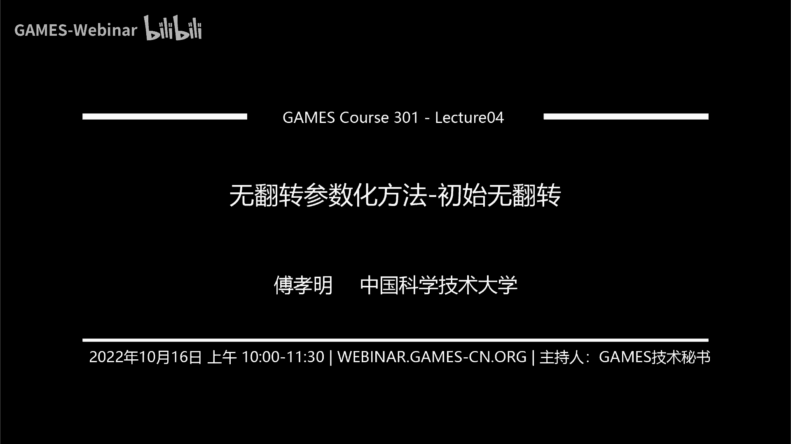
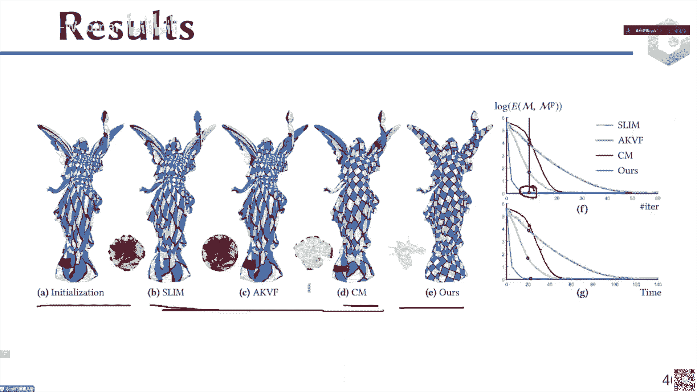

# GAMES301-曲面参数化 - P4：Lecture 04 无翻转参数化方法-初始无翻转 🧭

在本节课中，我们将要学习如何计算一个无翻转（无反转）的参数化映射。我们将从一个初始无翻转的参数化开始，通过优化来降低其扭曲度，同时在整个过程中保持无翻转的特性。

---

## 概述 📋

参数化的目标是将三维曲面映射到二维平面。一个常见的初始方法是 Tutte 嵌入，它能保证结果无翻转，但通常会产生较大的扭曲。本节课的核心内容是介绍如何从这个初始解出发，通过优化算法得到一个既无翻转又低扭曲的参数化结果。

---

## 通用优化框架 🔧

上一节我们介绍了参数化的基本概念。本节中，我们来看看解决上述问题的通用框架。

该框架的核心思想是：从一个无翻转的初始参数化（如 Tutte 嵌入）开始，在优化扭曲度的过程中，始终约束参数化保持在无翻转的空间内。这样，最终结果自然也是无翻转的。

整个流程如下：
1.  初始化一个无翻转的参数化 `X0`。
2.  基于当前参数化，计算一个能使扭曲度下降的方向 `d`。
3.  沿着方向 `d` 进行线搜索，找到一个合适的步长 `α`，得到新的参数化。
4.  重复步骤 2 和 3，直到满足收敛条件。

在这个框架中，有两点需要特别注意：
*   **线搜索**：步长 `α` 的选择需要满足两个条件：一是保证新参数化依然无翻转；二是满足优化理论中的线搜索条件（如 Wolfe 条件）。
*   **下降方向**：不同优化方法的主要区别在于如何计算这个下降方向 `d`。

为了在线搜索中能自然地避免翻转，我们要求优化的目标函数具有 **障碍函数** 的特性。即当任何一个三角形趋向于退化或翻转时，目标函数值趋向于无穷大，从而阻止优化过程越过边界。

例如，对称 Dirichlet 能量 `E = σ₁ + σ₂ + 1/σ₁ + 1/σ₂` 就具有这种特性，因为当三角形面积（与雅可比矩阵行列式相关）趋近于零时，`1/σ` 项会趋向无穷。

---

## 下降方向的计算 🧮

计算下降方向 `d` 的总体思路是：在当前位置 `x`，对目标函数 `E(x)` 建立一个局部的二次凸近似 `Q(p)`。

`Q(p) = E(x) + ∇E(x)^T p + 1/2 p^T H p`

其中，`p` 是待求的下降方向，`H` 是一个构造出来的矩阵，用于近似原函数的海森矩阵。不同的优化方法主要体现在 `H` 的构造方式上。

以下是三类主要方法：
*   **一阶方法**：忽略二阶信息，令 `H = 0`。此时 `Q(p)` 退化为线性函数，下降方向即为负梯度方向。
*   **拟牛顿法**：迭代地构造 `H` 来近似二阶信息，例如经典的 BFGS 方法。
*   **二阶方法（牛顿法）**：直接使用或修正原目标函数的海森矩阵作为 `H`。

得到局部近似 `Q(p)` 后，通过最小化它（或求解相关方程）即可计算出下降方向 `d`。

---

## 保证无翻转的线搜索 📐

在得到下降方向 `d` 后，我们需要进行线搜索来确定步长 `α`。为了保证参数化始终无翻转，我们需要为 `α` 设置一个上限。

对于网格中的每个三角形，其三个顶点的新位置为 `u_i + α * v_i`。我们希望新三角形的有向面积保持为正。
新三角形的面积是关于步长 `α` 的一元二次函数。通过求解该二次方程等于零的根，我们可以得到使该三角形恰好退化（面积为零）的临界步长。

对于每个三角形，我们计算其临界步长（取最小的正根）。为了保证所有三角形都不翻转，全局允许的最大步长 `α_max` 就是所有三角形临界步长中的最小值。

在线搜索中，我们首先将步长限制在 `(0, α_max)` 区间内，然后在此区间内进一步搜索，找到一个同时满足 Wolfe 条件（保证充分下降）的步长 `α`。

---

## 具体优化方法详解

前面我们介绍了通用的框架和概念。本节中，我们将深入探讨几种具体的优化方法。

### 一阶方法

一阶方法直接使用梯度信息，计算简单，但收敛速度可能较慢。

#### 1. 块坐标下降法 (Block Coordinate Descent, BCD)
也称为非线性高斯-赛德尔迭代。

**核心思想**：将优化变量（如所有顶点的坐标）分成若干块（例如，每个顶点的 `(u, v)` 坐标作为一个块）。每次迭代只优化其中一个块中的变量，而固定其他块。

对于参数化问题，一个自然的块划分是将每个顶点的两个坐标作为一个块。算法流程如下：
1.  从 Tutte 嵌入初始化开始。
2.  依次遍历每个顶点（块）：
    *   固定其他所有顶点的位置。
    *   仅优化当前顶点的 `(u, v)` 坐标，以最小化目标函数。
3.  循环步骤2直至收敛。

实践中，**非精确BCD**（每个块只进行一步梯度下降，而非优化到收敛）通常比精确BCD表现更好，收敛更快，最终能量也更低。

#### 2. 交替二次规划 (Alternating Quadratic Programming, AQP)
该方法将目标函数 `f(x)` 分解为两部分：`f(x) = h(x) + g(x)`。
*   `h(x)` 是一个简单的二次项（例如，基于拉普拉斯矩阵的能量）。
*   `g(x)` 是剩余部分。

在每次迭代点 `y_n`，构造如下近似函数进行优化：
`Q(p) = h(y_n + p) + [g(y_n) + ∇g(y_n)^T p]`

这里对二次项 `h` 是精确的，而对 `g` 只进行了一阶泰勒展开。求解 `min Q(p)` 可以得到下降方向 `p`。AQP 方法还引入了一个外插步骤来加速收敛。

#### 3. 局部可扩展映射迭代法 (Locally Scalable Map Iteration Method)
该方法旨在为复杂的扭曲能量（如对称 Dirichlet 能量）构造一个局部的凸近似。

**核心思想**：设计一个近似函数 `M(x)`，使其在当前位置的梯度与原目标函数 `E(x)` 的梯度相等。同时，`M(x)` 本身具有简单的形式（例如，类似 ARAP 的能量：`Σ w_i || J_i - R_i ||_F^2`）。

通过令 `∇M(x) = ∇E(x)`，可以反解出权重 `w_i`。然后，最小化这个二次函数 `M(x)` 就能得到一个有效的下降方向。该方法在实践中表现良好。

---

### 拟牛顿法：L-BFGS 及其改进

拟牛顿法（如 L-BFGS）通过迭代构造海森矩阵的逆 `H^{-1}` 来利用二阶信息，具有超线性收敛速度。

标准 L-BFGS 利用割线方程 `H_{n+1} s_n = y_n` 来更新 `H^{-1}`，其中 `s_n = x_{n+1} - x_n`，`y_n = ∇f_{n+1} - ∇f_n`。

在参数化问题中，初始扭曲很大时，梯度差 `y_n` 可能数值不稳定。有研究提出用 `L s_n` 来替代 `y_n`，其中 `L` 是固定的网格拉普拉斯矩阵。在优化初期主要使用这种替代，后期逐渐过渡回标准的 `y_n`，从而兼顾了稳定性和收敛速度。

---

### 二阶方法（牛顿法）

牛顿法直接使用目标函数的二阶导数（海森矩阵）信息，收敛速度快，但计算开销大。

主要挑战在于，对于非凸的能量函数，其海森矩阵可能不是正定的，导致求出的方向不是下降方向。解决方案是修改海森矩阵，使其正定。

#### 1. 复合代理方法 (Composite Majorization, CM)
这是一个基于 MM（Majorization-Minimization）优化框架的方法。

**核心思想**：在每次迭代点 `x_n`，构造一个**凸的**代理函数 `M(x; x_n)`，作为原函数的上界，且满足 `M(x_n; x_n) = f(x_n)`, `∇M(x_n; x_n) = ∇f(x_n)`。然后通过最小化 `M(x; x_n)` 来得到下一个迭代点。

对于参数化中常见的、可表示为复合函数 `f(x) = h(g(x))` 的能量，可以利用函数 `h` 和 `g` 的凸凹分解，系统地构造出这样的凸代理函数 `M`。该方法得到的海森矩阵近似 `H` 是正定的，保证了下降方向的有效性。

#### 2. 有界扭曲参数化
这是一种不同的思路。它观察到，如果参考三角形与当前参数化三角形之间的扭曲有界，那么优化会非常迅速。

因此，算法不直接优化原始高扭曲的初始解，而是动态地生成一系列**中间参考网格**。每一步，都让当前参数化去逼近一个与它扭曲有界的中间参考网格。同时，让中间参考网格逐步逼近原始输入网格。通过这种方式，将原始的高扭曲优化问题，分解为一系列低扭曲的子问题，从而显著提高了优化速度。

---

## 总结 🎯

本节课我们一起学习了无翻转参数化方法的完整框架和多种具体实现：
1.  **框架**：从无翻转初始解（Tutte嵌入）开始，在优化扭曲度时，通过具有障碍函数性质的目标函数和谨慎的线搜索来保证整个过程无翻转。
2.  **关键步骤**：计算下降方向 `d` 和进行保证无翻转的线搜索。
3.  **各类方法**：
    *   **一阶方法**（如BCD， AQP， LSM）：简单直接，依赖梯度。
    *   **拟牛顿法**（如L-BFGS）：平衡了收敛速度和计算成本。
    *   **二阶方法**（如牛顿法、CM）：收敛快，但计算复杂。有界扭曲参数化通过问题转化，巧妙地提升了优化效率。

这些方法为在保证映射质量（无翻转、低扭曲）的前提下，高效计算曲面参数化提供了丰富的工具。