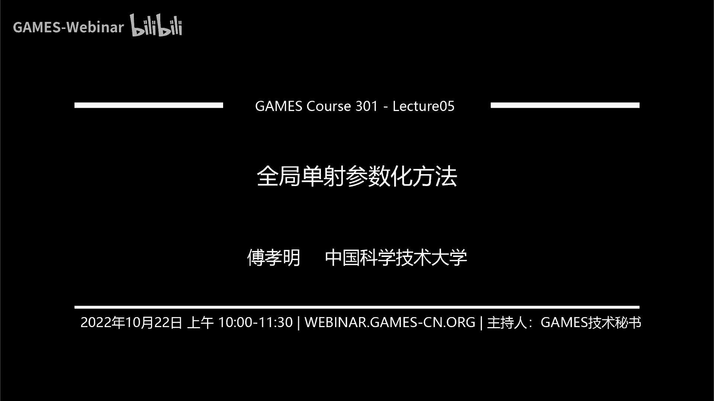
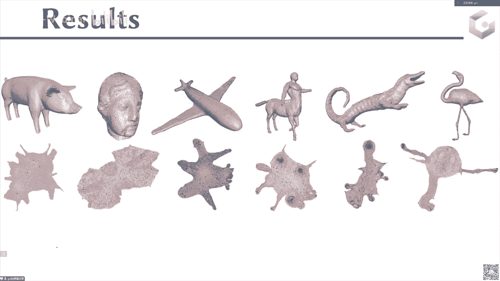

# GAMES301-曲面参数化 - P5：Lecture 05 全局单射参数化方法 - GAMES-Webinar - BV18T411P7hT

那我们就今天开始我们今天的课程啊。

呃之前我们的内容这个讲到了，那个就是讲到了这个无翻转的这个映射啊，或者初始是没有翻转的，然后后面呢呃介绍了很多的这样的优化的方法啊，然后也介绍了一些基本的这个策略，那么今天呢我们要进入一个新的这个呃。

我们要讲一些更多的这样的一个约束啊，那么之前我们在讲到这个参数化的时候呢，啊我们说它的约束一般会存在几种，一种是没有翻转，一种是局部带色，还有一种是全局全局单色。

那么今天我们就要介绍是全局单色的这个映射的呃，或者说这个参数化的计算计算的这个方法，那么首先我们来看一下这个全局单色的这样的一个定义啊，啊不是一个这样的一个简单的例子。

那么我们可以看一下左边这个图是左边这个图其实是呃，左边这个图其实是一个呃参数化结果，那么右边这个也是一个参数化的结果，那么我们可以看到左边这个参数化结果，他在2d的一些区域是相互重叠在一起的。

那么所以说它是一个overlap，右边这个结果大家可以看到这个地方是没有相互之间的自交，或者没有相互之间的覆盖，所以说它是一个overlap freed，那么在这样的一个参数化结果的前提下。

我们来看一下，如果把那如果把纹理贴上以后，会发生什么情况，这是一个棋盘格的纹理贴贴在这里，然后把它映射回这个输入的这个曲面，那么我们可以看到针对这个左边的这个参数化结果。

可以看到这个红色的点在这个原始网格上就会有一个点，两个点，三个点，那么对于右边的这个参数化结果，它其实这个地方只有这一边块红色的区域，那也就是说你在左对于左边这个参数化。

如果你在2d上给它铺上一个纹理的话，它其实这个点的颜色会被映射到这个呃，会被映射到这个三个地方，那么这样的话它其实这个参数化的结果，其实这个地方的话，这个呃就是你的纹理的映射，它其实就没有一致性。

也就是说你比如说呃用artist在这样的编辑这个2d的这个区，2d的这个纹理的时候，它画上这个颜色可能会被映射到不同地方，他没有这样的一个一一对应的关系，那么这个其实是在这个texture map里面。

其实可能是有一个不好的事情，那么所以说呢我们需要就是保证我们需要去做一个参数化方法，它最后是在2d这个平面上是一个没有自交的，或者说没有这样重叠的这样的一个呃一个参数化啊。

那么对于这样的一个去计算这样的一个重叠的参数化呃，最最常见的这样呃，最最常见的一个pipeline是如下的这样的一个pipeline啊，那么首先呢它的初始化就跟我们上节课讲初始没有翻转的。

初始没有翻转的这个呃无反转参数化计算一样，首先呢它的初始化也是来自一个没有翻转的，或者是来自一个啊overlap raid这样的一个初始，那么这个初始就是用这个juliebeating来计算的。

并且三角形是没有翻转的，这样的一个初始的这样的一个to listing bing，那这样的一个初始化参数化结果，然后呢通过接下来通过，但我们这上节课也讲到了这个地这样的一个参数化结果。

它的一个问题就是扭曲很高，那么扭曲高，那么所以说呢我们需要去给他去做一个distortion的optimization，那么在这个扭曲的这个优化的过程中呢。

因为我们现在的目的还是希望保证它是没有啊重叠的，或者说还是希望保证它是没有自交的，那么所以说我们现在在这个优化的过程中，不光是要保证它的三角形是没有翻转的，我们还需要保证这个边界是没有自交的。

或者说这个呃这个三角这个参数化区是没有这种字重叠的啊，那么所以说呢在这个过程中，相当于类似于这个内点法一样，整个的这个python后面的这个过程中，他需，要去保证两点一点是呃flip free。

就是你需要去设计一个能量，它是保证没有出现翻转的，第二个你要去设计一个能量，它后面是overlap free，就是它是一个没有这样的重叠的，或者说没有这样的边界自交的一个能量，因为如果边界发生自交的话。

它其实就内部加生了重叠，所以说它其实这个地方就是要让它的边界没有自交，或者说它这个区域没有重叠啊，这两个是一个概念，所以说你在这个优化的过程中上类似上节课那样的pipeline。

你在整个的优化过程中去放下降方向，去做线搜索，去做这个过程，中呢你一定要保证这个flip free和这个overlap free都是要被满足的，你不能够去通过嗯，你不能够去违反这样的一个规则啊。

这样的话啊，我就能够保证最终的结果也是一个flip free和global，overlap free的这样的一个结果，那么如果最终的这个参数化结果。

它是满足这个flip free和这个of overlap free这两个条件的话，那么这样的一个参数化结果我们就叫做globally injective，参数化结果，就全局单数的一个参数化结果。

那么对于这的一个对于这样的一个计算的过程呢，上节课我们主要讲的是这个如何去保证它最终的结果是啊，flip，raid，那么今天我们就要主要介绍的是怎么去通过一些能量的设计。

或者通过一些算法去保证它的这个边界是不是产生自交，或者区域没有去发生重叠啊，主要是我们今天要讲的内容是这部分，但是整个pipeline是跟我们上节课一样的啊，首先是有了有了这样一个初始化结果。

初始化结果以后你要去优化扭曲，你要去做一个，你要去做一个线搜索，做完先搜索以后，你要接下来去做一个呃，就是在线搜索过程中，你要保证这两条啊，然后再回来去做这个，下载方向的计算啊。

然后直到最后的收两个输出，好那大概是现在是这么一个情况啊，我怎么去设计一个能量，使得这两个东西能够被满足啊，那么首先第一类方法也是最自然的方法，就是这样的一个啊by function的形式。

就是通过这样的一个障碍函数对吧，你只要是发，因为一开始初始是没有自交的嘛，那么我们也讲过，如果你接接近他这个发生碰撞的时候，你就把这个bufunction给呃，能量值变得比较大。

所以说呢我们现在的这个需要去设计这样的by function，使得，它在这个接近发生自交或者接近发生这样的覆盖的时候呢，我去把这个呃能够去阻止他去产生这样的碰撞对吧。

那么所以说我们接下来所以说最常见的这样的一个bufunction，因为我们现在的目的，其实在上节课的时候，我们已经花了很多时间说其实已经可以很好的去做了。

那么所以说我们接下来主要是关心的是这个边界如果发生这样的碰撞，它的呃目标函数应该怎么去设计，那么对于2d的情况，2d的情况，因为它的边界，你可以认为是一个多边形。

所以说它产生自家都是这样的一个都是这样的一个情况，都是两条这个两条这个边界的边产生这样的一个自交，那么也就是说呃对于这样的一个case，u一和u2 是一条给定的边。

那这个v i u i是另外一条边的一个端点，如果它要产生自交，那么也就是说这个三角如果一开始一开始的状态是一开始的状态，这个是u一个是u2 ，这个是u2 ，那如果要产生自交。

那么也就是说这个ui要穿过这条边对吧，那么这样的话才会变成上面这种case，那么也就是说对，于这样的一个，但是我不希望去，我不希望他去产生这样的自交，所以说我要去阻止这个ui穿过这一条边。

穿过这个u1 u u1 u2 这条边，那么所以说呢我就可以设计这样的一个很简单的一个buyer function，这个bfunction呢就是这个里面里面这个d不良的。

是这个点到这个到这个ui ui的这个距离，那么当这个距离接近于零的时候，那么我应该这个地方的目标函数变成无穷大，对不对，那么也就是说我所以说我把这个distance是放在这个分母上的。

那么实际只有当这个距离接近于零的时候，那么这个能，量就会变得无穷大，那这个app是什么意思呢，就是说如果我的这个距离地如果这个距离d大于1b系统的时候，那么这个1p c o除以d减去一其实是小于零的。

对不对，那么小于零的话，我在这两个取max的话，那么其实也就是我这个地方的目标函数是等于零，他们就说是if d大于零，那么这个地方的这个能量其实是等于零的，那么yes d小于一cm的时候。

那d如果是小于一cm的时候，那其实这个地方的能力能量，这个e其实就是一步行能减去d除上d括号的平方，那么当这个地区趋，向于零的时候，那么这个地方的这个能量就变成无穷大。

那这样的话我就能够去阻止这一条边的这个顶点穿过它，那么这样的话我就不会产生上面这样的case，那么也就是说我能够保证这个边界没有产生这样的自交啊，那么所以说这样的一个目标函数呢。

它就会具有这样的一个形态，它在大于1p的时候，它的这个有它的这个呃，他的这个函数值是等于零，那么当这个你装这个点，比如说非常靠近这个靠近这条边的时候，它的这个目标函数就会变得非常的大啊。

那么所以说这样的过，程的话它就通过使用这样的一个呃buyer function的话，它就可以它可以可以阻止这个呃点穿过它，那么可以一旦阻止这个点穿过它的话，那就是我就不会产生这样的两条边发生碰撞啊。

这样的一个约束啊，那么所以说对于这样的优化问题就变得很简单了，首先这一项是这个防止翻转的扭曲向，然后这一项就是我们刚才的那个boundary，boundary，boundary breed。

像就是上上上一页的那个function的一项，那么这样的话我现在的两项，一项是这项distortion项是用来防止产生翻转并且降低扭曲，这一项就是用来去防止边界产生自交啊。

就是上上面的上一页ppt里面那个能量，那么所以说这一项就是使用的，比如说最常见的这个对称dm的能量，那这一项就是上节课，那么接下来我要只要去优化，这是一个无约束的优化问题。

那我只要去对这个无约束的优化问题进行求解就可以了，那么求解的方法其实之前的那些方法都是直接可以跳用啊，直接可以呃，呃比如说l b f g s啊等等，都是可以直接啊来调用的。

但是呢其实我们这个地方的还是希望使用一个这样的，就是二阶方法去做，但是我们后面会分析，在这样的问题上，如果用二阶方法去做，它会存在一些问题，在我们在后面会分析。

那在这个地方呢只是说如果用l b f g s去优化这个能量的话，它的收敛性其实是相对比较差的，那么这个时候呢它的这个呃最终表现出来的这个呃，花费的时间就会比较的长啊。

所以我们接下来会呃重点讲一下怎么去改善这样的一个呃怎么去设，计对针对这个问题的一个优化方法啊，那后面再讲呃，如果使用了这样的优化目标函数以后，大家会发现最后的这个地方原来是。

比如说你不加内向bl方边界的bl方形那一项，那这个地方会产生这种自交，这种自交，这种自交，那么如果你加上以后，你就会发现这个地方其实是被分隔开了啊，最后就没有碰上了，那么呃再多说一句啊。

它其实里面也是会涉及到怎么去防止发生碰撞的这个事情里面，其实用的这个最核，心的东西也是这样的一个barrier，其实当然它的barrel的设计可能会有一些不一样，然后但是呢对于这个3d的情况下。

会有两种case要处理，一种case是这个边与边产生的自交，还有一种case是三角形和这个顶点穿过的，这个如果一个顶点穿过一个三角形的话，也会产生自交，还有一条边穿过一条边也会产生自交啊。

就是在23d里面需要去考虑这两种，配好这个地方就过去了，反正内容的核心思想都是一样的，就是简单的bufunction，就无非就是你的bufunction怎么设计，那么接下，来我们讲另外一个方法。

那么这一类方法的话就是呃思想也非常的简单呃，首先我们的目的啊，就假设这个我们现在这一块这一块区域是一个参数化的区域啊，这一块是蓝色呃，就是就是假设这一块绿色的区域。

就是由我们的这个to test ebing得到了这样的一块区域，我们现在要对这个tobi这一块区域去做这样的优化，那么我们希望它这个边界不产生自交对吧，那么所以说这一类方法叫做scaffold呃。

中文中文翻译过来叫什么脚手站啊，anyway，就反正你可以认为它是一个辅助的网格啊，它是一个辅，助的网格，它是一个辅助性质的网格，那么你现在的目的是要对这块绿色的区域去做扭曲的下降。

然后使得它呃在这个优化过程中，我不希望它产生这个边界的碰撞，也不希望它产生这个，呃内部产生无三角形的翻转，那么这个时候呢我可以给它在这个绿色的外面加上这样的一层，这个黑色的这样的呃。

或者说这个灰色的这样的一层三角形啊，那么这样的话我把整体这个灰色的这一层三角形，这一层三角形叫做s里面这个网格叫做m，那我把这个s跟这个m看成是一个整体的网格啊，比如说我这个整体网格叫做g。

那么现在我要让这个边界不产生自标对吧，我要让这个三角形的这个绿色的这个三角形网格的边界不产生自交，那么这个时候呢我可以怎么去做呢，我可以固定，我可以固定整个这个整体网格。

就是这个绿色的跟这个外面这个灰色的这个网格的整体网格的边界，我把它固定住，那么只要我这个内部不产生翻转，不产生flip，那么如果我只要这个整体这个灰色的和这个绿色的，只要不产生flip。

那其实这个三角形的边界就不会产生自交对吧，这其实应该是可以很容易去严格证明这个事情的，就之前之前有一个很严呃，这就有一个病例吧，就是或者说这个事情也是一个很嗯，从这个就是也是比较容易去看的。

就是说如果这个边界它是一个没有自交的边界，那么它的内部只要所有的元素，比如三角形，四边形，四面体，它的所有的元素都没有产生这个呃所有的元素都是没有flip的话，那么整体的话这个内部这一块区域就是一个呃。

就是没有产生边界自交的情况啊，这是很容易的，那么所以说呢它相当于在外面通过加上这样一层辅助的网格s以后呢，他把原来这个对这个m这个网格去做扭曲优化，边界不产生自交，内部不产生翻转这样的一个问题呢。

它就可以转成只有没有翻转的约束啊，就是相当于原来是这样，又要考虑边界不产生自交，又要考虑这个三角形不产生翻转对吧，那么现在的话我我加上这个外面给他套上这样的一个caffe，这样的一个网格以后。

这个整体这个网格我只要保证这个整体这个网格不产生翻转，那么这样的话我就能保证内部这一块区域，它是overlap free和这个flip free就可以了对吧。

那么所以说呢这样的话这个问题就变得非常简单了，因为原来的话我们在做这个参数化过程中，我如果又要去考虑它没有翻转，又要去考虑它没有边界产生自交，那么这个问题其实是呃相对比较困难。

因为上面我们讲过那个buy function，那barrefunction其实在做真正在做的时候，那个八方形算起来其实还挺费劲的，因为你要算这个点到直线的距离，然后你还要去对这个东西求导。

然后你还要嗯你如果是考虑所有的点，边界点到另外一个边界点的这样的距离的话，那个元素的数量会非常多，所以你一般情况下会需要会需要去做一个类似制作网，类似这种就是数据解，一种就是，一些数据结构去捋一下。

播对吧，就去滤一下，不是去滤一下一些case，只是留下一些可能发生翻转的地方，所以这个编程上也会稍微复杂一点，所以说呢现在我们在这种情况下的话，我们就不用管在这种cao的这种整个的这个架构下的话。

我们不用再去考虑那些很复杂的情况，我只需要在外面套上这样一层三角形，然后整个三角形的这个处理就变成了一个非常简单的一个配合，变成了一个非常简单的这样的一个呃没有翻转的这样的一个求解啊。

那这样整个过程的优化就会变得非常简单，那就意味着我们上上周日讲的那个所有的初始没有翻转，等那些二阶方法，一阶方法都可以直接无缝地套在这里面呢，整个的这个优化效率也是非常的高的啊。

但是呢呃对于这样的一个优化问题，比如说我现在的这个这是我们最终的这样的一个优化的目标形状，这是我们的初始tobin的这个形状，那么大家可以看到，如果从这个形状慢慢变到这个形状来的时候呢。

因为这个它要保证这个绿色的三角形和这个灰色的三角形，都没有产生翻转，那么因为这个绿色的三角形要往这么极端的形状去旋转，那么就意味着这个灰色的三角形它在这个变形的过程中。

他需要也需要去非常强烈的去产生一些扭扭啊，扭曲对吧，形变，那么这个时候呢它其实在一些极端的情况下，你可以看到出现这个三角，这个三角形的质量其实是非常非常差了，那么这样的话它会导致它后面的这个呃。

后面的这个再去进一步优化的时候，它相当于会被lock住，就会被锁住啊，大家注意啊，在整个的这个优化过程中，是这个绿色的这一块，这一块区域和这个外面这块灰色的区域是同时一起去呃变形的。

因为它要让这两块区域同时不产生翻转，所以这两块区域都是同时动的，那么同时动的话，这块绿色的它要趋向于这个最终的这个形状，那么这个灰色就只能跟着动，那么跟着动的时候。

它就会产生一些非常极端的这样的一些三角形，那么产生这些非常极端的三角形的时候呢，那么这个时候它这个产生到一定一定形状的时候，它就没法没法往下动了，为什么呢，因为你再往下动。

这个灰色的三角形就要产生翻转了对吧，那这样的话你整个后面就没法动了，那么所以说呢在这个整个的这个优化的过程中，他就需要去做一个叫做connectivity updating，什么意思呢。

上面这上面整个过程是没有上，那么下面这个是有的，什么意思，就是说相当于它做一步优化，就要对这个外面这个灰色的三角形，它去做一次重新网格化，所以大家我们应该熟悉这个数据集的数据资料。

就是给他重新去remax一下，或者我直接用这个dlna抢creation，重新给它去生成一个dny抢ation，那么这样的话我就能保证这个灰色的三角形的质量是一直是比较好的，就不会出现像这种退化的情况。

那么这个地方的三角形质量一直是保证比较好，那么才能够使得这个后面的优化能够顺利的进行下去啊，所以说如果没有做这个connetivity的updating，他最后的这个三角形的质量很差，如果做了。

那他最后的那个结果就能够达到它的最优最优质啊，那么所以说呢在整个这个过程中，他需要去做这个connectivity updating，那么即便做了connection updating以后呢。

他的所有的呃它会带来一个不好的不好的东西是什么呢，你如果如果这个灰色的三角形和这个跟这个绿色的三角形，它的连接关系在整个过程中都是不改变的，那么也就是说它的整个黑森矩阵的这个非零元的结构是不改变。

但是如果你在这个过程中做了这样的呃，connectivity updating以后呢，它就会导致这个呃整个参数化过程中的这个飞行员是在发生改变的，那么飞行员发生改变的时候呢。

就会导致这个导致你的海森矩阵的每次的这个非礼员的改变，那么黑森矩阵去求解这个线性方程组，去求得这个下降方向的时候呢，它的这个呃矩阵的这个分解啊，迭代啊，就举证的这个就是方程的求解的时间大家会比较大啊。

这个后面我们会去具体再分析一下，嗯这个caford呢当然他除了这样做一个单个的三角形的，三角形的这个text map以后，大家可以用了，大家可以用来做真正的text map。

大家可以把这个所有的这个比如说这个这样的一个结构，它可以把所有的这个分块结果的每一个都放在这里面，然后一起去做这样的two toba，就是做这样的一个呃呃texp啊，并且快一块之间不发生不发生这个翻转。

而不发生碰撞呃，就是他它它不光可以适用于一块这个参数化，它也可以适用多块啊，当然他这地方还需要做一个简单的编辑，才能让这个摆放的更加好，因为摆放本身是一个np hard的问题，那么接下来我们希望做的是。

那么接下来我们当然说刚才说了，这地方其实两个方法都会存在一些困难，那么所以说我们接下来需要想想啊，这两个方法的困难是什么呢，就是说它的那个优化的效率都不高，因为第一个方法的话，它的这个优化过程中。

它的他用如果用一个l b n v g去优化的话，它的这个优化效率其实不高的，那么第二个方法，如果他是在整个的这个过程中，它的三角形的这个连接关系一直是在变的话，那它导致它那个呃所以说导。

致他的这个呃三呃三角形的质量，而不是三角形质量，是那个海森矩阵的这个飞行员结构一直在改变，飞行员结构一直在改变，导致它的这个求解的速度就会降低啊，那么我们来看一下具体是为什么。

比如说对于这样的一个二阶求解，二阶二阶求解器的话，他的二阶求解器，我们在这个我们在这个相当于求得这个赛道方向的时候，我们其实是需要去解一个线性方程组，那么对于解这样的一个线性方程组呢。

一般情况下会有两种求解方法，一种是这个迭代法，还有一种是直接法，那么迭，代法的话主要是类似于这个假货币迭代，高斯赛德尔迭代对吧，那么这一类方法的话，对于这个参数化这个问题，我们之前也尝试过。

然后他的这个最后得到了这个解的精度不够，导致最后求出来的这个下降方向不够的准确，使得他最后的能量下降没有的那么显著啊，不是说在局部很容易陷入局部最小，所以说呢我们一般情况下，在这个参数化的这个问题里面。

我们使用的是这样的一个呃直接法去求解，那么直接法求解的话，一般最长就是要去做这个矩阵分解，咱们要去做矩阵分解，的话一般情况下分为是这个在真正的这个代码里面会说，这个从这个算法角度来讲。

一般会分为这三大步，一部是这个符号分解的，符号分解呢主要是去给这个矩阵去，因为你要去做分解的话，你肯定要去根据这个矩阵的这个非零元的结构，你要去分配内存啊。

你要去这个重新去对这个结构做一些适当的这个微调啊，就是rewarding一下啊，什么等等这些操作，那么这样的话整个这个符号分解这个过程中，它其实是在就是只只依赖于这个矩阵的非零元的结构。

而不依赖于这个矩阵的这个就，是说这个地方它其实依赖于的是这个矩阵的非零元结构，那么如果这个矩阵的非能源结构在改变的话，那么这个符号分解这一步每次都要重新做，那么有了符号分解以后呢。

才是真正的这个数值分解，那么数值分解的话，最常见的比如像l u r l d l l d l l的转制啊等等这样的一些分解，那么这就是承认这些数值计算，那么接下来就是最后是求解，求解是一个回答对吧。

这是最费最不费时间的，那么对于这样的，比如说我们这样的一个问题，就是在这样的一个参数化问题里面，我，们要去最大去求解一次这样的求解一次，这样的一次下降方向的话，他能花时间花费是这样的呃。

如果对于这样的一个符号分解而言，它的花费的时间是大概在0。083，如果是一个数值分解的话，它大概在0。006，然后这个回带回带大概是在最后这个时间花的最少的，那么所以说呢在这个过程中。

其实我们希望这个矩阵的这个飞行员结构，它是，但因为大家可以看到这个，其实这个符号分解进一步是占据的时间是最长的，那么所以说我们希望这个时候它的这个因为符号分，解花费时间长，所以我们希望加这一步。

他最后的所有站的它能够固定住对吧，如果这个飞行员的结构能够固定住，那么也就是说这一步我就不需要重新做了，我只要做一次就行了，就如果这个飞行原子结构是固定的，那么这一次只要做一次。

但是如果这个飞轮的结构是变化的，那么这个地方他需要做的这个次数是每次都要做，那么这个时间开销是比较大的，但是呢刚才我们讲过，在那个skyford的那个里面。

他需要去对这个外面那个灰色的网格去做rematch，那么也就是说它的这个结构是变它，的这个三角形的连接关系是变的，那么导致它的整个黑森矩阵的这个飞行员结构是在改变的，那么导致它的飞行员结构在改变。

就导致他最终的这个呃非两个结构再改变，就导致它的这个每次的这个符号分解都需要做，那么这个地方的这个时间开销就比较长啊，那么所以说呢这个我们是希望这个海森矩阵，它是具有这样的一个固定的飞行员结构。

好开森矩阵它是希望它有固定的飞行员结构，那么这样的话我这个符号分解就只需要做一次，那么后面的这两个时间它其实是开销，是比较小的，那么对于这样的一个对于这样的一个优化问题对吧。

我们现在这个是假如说我们还是考，所以我们不会去考虑这个cao这个方法，因为caffold那个方法，它的这个飞行员结构一直是变的，所以我们考虑是这个带ber function的这种方法。

那么考虑带bufunction的这种方法，那么首先这是一个扭曲向，这是一个边界的碰撞项，那么这一项的这个飞行员结构其实是固定的，所以说我们对应的是这个，那么这个这个是那个边界和这个内部的交叉上。

这个是主要是这个边界的barry function啊，beryl beryl那个function function内向，那么如果当这个点在这个当这个点在这在这个迭代的过程中。

如果这个点的距离比这比这个给定的这个阈值这一系统大的话，那么这个地方取值是零，那么当这个点呃取值是零，那么也就是说这个这个这个距离变成零了，那么整个的这个这一项你对它求导求黑色的话。

那它对应的这个里面的这个矩阵也都是零，那么也就是说你其实是可以把它就不考虑对吧，不考虑的话，这个dk就会比较的低啊，就是因为它是大部分都被你去除，了，因为等于零嘛，你就可以不考虑嘛，就是它是个稀疏项嘛。

但是呢如果这个距离它比如移动进去以后比他小了，那么比他小了以后呢，也就是说它的它的这个距离就会取成这一项，那么距离取成这一项以后呢，它是有值的，有值的话就是原来这个地方是空的地方。

你又会给他加入这个新的，给它变成这个地方，原来是没有值得，你现在又填进去了，那么也就是说这个地方又产生了这个非零元结构的变化对吧，那么产生了这个飞行员结构的变化以后呢，它其实你如果你还是用这样的方。

法去做，你最后还是会去啊产生这个变化的这个黑森矩阵，导致它的这个符号分解每次都要做，那么时间开销也是比较大的，那么所以说如果你这个比如说这个点又从这个区域里面又出来了，那这个地方又变成空的了。

那么这样的话你这个飞行员结构就一直在变，那么飞行员结构一直在变的话，导致你的符号分解每次都要做，符号分解，每次都要做，那么所以说如果是你是动态的去考虑这个值大于零，小于零。

然后去动态的决定这个地方要不要去变，这，个地方要不要是是一个空的，还是还是一个非空的啊，那这样的话你也会引起这个数，那么所以说呢一种一种办法是，考虑所有的这个为了去固定这样的一个黑森矩阵的非电源结构。

我们可以去考虑什么呢，考虑这个边界边，任何一对边界边就是你把两条边界边变成一对，你可以考虑任何一对的边界边去做优化，那么这样的话你把所有的这边这边都当成一一组去，都是去相互作用的话。

那么也就是说你不会去管这个地方的这个，值是零还是这个后面这个值你反正都把它填进去，就是零，我也填进去是零，那么这样的话他在这个呃这个优化的过程中，虽然这个地方直是零，但它也是占一个飞行员的结构啊。

那么这样的话就是也就是说你这个距离，比如这个距离现在我大于这个大于这个值了对吧，那它其实这个地方的这个值应该是零，但是呢原来我可以把这个地方空出来，但现在呢我我我空出来，我就强行给他填上零。

那么前上强行强行给它填上零以后呢，这样的话我最后其实也是一个飞行员，结构也是固定，住了，但是这个飞行员固定飞行员这个结构固定住以后呢，但是这个矩阵h b b的这个矩阵的density也是比较高的。

为什么呢，因为我需要去考虑的是任何两个，任何两个两条边界边之间的这样的一个发生碰撞的case，那么它这个地方产生的这个边界边的数量，这个边界边界比例的对，是跟这个边界边的这个数目是呈一个二次的关系。

那么这样的话它的这个h b b这个海森矩阵里面的dc比较高，dcd比较高，就是指的是什么意思，指的是这个就是海森矩阵里面的这个助演的海森矩阵里面，的这个非零来的结构分类。

其实穿an矩阵里面的这个非零的元素的比例比较高，那么就是它的稀疏性比较差，那么我们知道如果针对一个一个稀疏矩阵，如果你要去求解它的，它求解它的那个线性方式的话，如果他的这个呃吸收性比较低的话。

吸收性是比较就是它的这个稀疏性比较低，也就是说它的这个吸飞令员比较多的情况下，那么他的这个求解速度也是比较慢啊，所以我们现在虽然我这个考虑了所有的这个pencil的这个两个都考虑了。

那么它的这个飞利亚结构是固定的，但是这，个菲利亚结构，它的数量是非常多的，它会产生一个非常高的dsc啊，我们来看一个具体的例子，这个是左边，这个是我们把所有的这个边界边都全部考虑进来了对吧。

那么它的这个飞行员结构就是固定了，但是他的这个density比较高，那么也就是说它的这个因为它的飞行员是固定的，所以说它的这个符号这个是符号分解，符号分解只要做一次。

但是他每次要去做一个数值分解和一个回答，大家可以看出来它的这个数值分解是非常耗时间的，是0。9秒，但是呢如果我还是去考虑刚才说的，这个大于零小于零对吧，如果大于零，我还是去考虑大于零的时候。

如果这个距离是大于这个app的时候，我还是给他设置，我还是给它设置成零，那么呃给他设成零，给他设成零以后呢，这样的话我就可以去保证它的呃tensity比较低，但是呢它的这个飞行员结构在变。

那么最后他的这个最后花的时间大概是在00：00：09，虽然这一步每次都要做这一步，虽然每次都要做，但是它的这个整体的时间，大概只有前面这个固定飞行员时间的这个一半啊，十倍1/10。

就因为它的这个density是比较低的，啊那么所以说这个地方呢我们就在想一个事情对吧，那既然他的这个dancity是就说我能不能去，他现在是因为现在的问题是在这个dc比较高对吧。

那我就用办法去把这个dd给降下来了对吧，那就是density降下来，那么其实我要降density其实就是什么呢，因为我那么我们就来看一下我们density是哪来的。

这个dc其实是这个边界的任意的两对边之间产生的这个这个关系，对不对，就是如果我考虑所有的所有的边界边，就比如说任意的两对边界边之间它的碰撞我都考虑，那么这个时候他就是把dc的提，高了对吧。

就是因为它是跟你的边界边的数量，那么边界边缘原来是1000条的话，你就是要大概是1000的平方，那么也就是说1000的十的六次方，那么这个时候所以说你要去做这个事情。

让你无非就是说想我能不能把这个边界边给边界边的数量给降下来，那么数量也降下来，这个时候你的density其实也就下来了对吧，那么你要去降这个density呢，所以说所以说做做了一个简单的方案。

你其实可以在这个这个dk，你看这个边界边，如果你考虑这个现在的这个边界边是非常非常稠密的，对不对，所，以他是有这个你的这个这个外面的这个边界边，如果你一开始有b条边界顶点的话。

它最后有这么多一个b平方的一个飞行员，那么这个dc是比较高的，那么这个时候呢你想要去做一个d的dcc，那无非你就是要把这个b给降下来，那么这个时候呢，你可以在这个现有的这个边界边外面去做一个非常稀疏的。

一个非常稀疏的一层壳，那么这个边界边的数量是显著低的，比如说你里面是1000，我可以这个地方可以做成100，那这样的话我只有100的平方，就只有十个十的四次方对吧，那。

这样的话我的这个飞行员的数量可以显著的下降，所以说这个地方呢我给他去做一个造一个这样的coser，那么这个地方的coser里面的这个紫色的点，比这个里面的橘色的点的数量是远远小。

那么这个地方的黑色矩阵就会比较圆圆的小，那么这样的话我的dc就能下降，那么所以说我最后就能从把b变成一个s s的平方，那么这个地方是low density啊，这样的话我就能够显著的降低时间。

那么可以看一下，这个是固定的考虑这个刚才的那个原始网格的这个边界的所有的情况，它是固定的，这个，飞行员结构，但是它的dsity比较高，所以他每次花的时间会最长，因为这个虽然只要做一次。

那么这个这个地方呢它是这个整个的结构是在变的，所以他每次花费的时间是这个也要做，这个也要做这个要做，所以它整体的时间是这个，那么对于这样的我在外面加一个cos的这样的一个网格以后。

加上这个cost的网格以后，那么我的这个边界的，我的这个飞行员结构就是固定住了，那么我的这个density呢也是比较低的，那么所以说呢这个只要做只要做一次，这个只要做一次，那么这个是要重复做的。

那么每次花费的时间只有这两个加起来，将来在这个0。10。01，大概是这个前面这个方前面这一部分内容的大概1/10左右啊，那么这样的话我就相当于可以把这个desk降下来，把最后的这个时间效率给提上去啊。

那么接下来还有一个问题是这个bfunction这个问题，refunction的话，原来的bfunction它其实考虑的刚才也写了，他其实是考虑的是点到这个平面的距离，点到线的距离对吧。

那么他考虑的是点这个是一个点点到线的距离，那么点到线的距离是如果他在这个点到线的这个内部的话，它，这个距离其实就是这个垂直的距离，但是如果他在这个外面的话，它其实是这个点到这个端点的这个连线的距离。

所以说它最后构造出来的这个等级面，它其实是一个这样的一个等级面，他在这个地方是一个半圆对吧，这个地方也是一个半圆，所以它这个等值面是这样一个半圆，那么对于这样的一个距离的话。

他所以说如果这个如果他在这个这个这个里面，这个区域它其实是一个垂直的这样的一个关系，那么如果他在这个外面的话，它的整个区域就是一个点到这个线的距距离，那，么这样的呃，这样的话它就导致了什么呢。

导致了这个最后的这个呃这个距离在这个地方，在这个地方，在这四个地方，它其实不是一个c无穷的距离，它其实只是一个c一的这样的一个距离，那么你直接去套这个二阶方法的话，在这个地方可能稍微有一点点啊问题啊。

所以这个距离它不是c2 的，它在这个地方其实只有一个c，那这个具体的分析这个数学上的这些东西，可以去看一下文章吧，那么于是呢我们就提出了一个c无穷的这样的一个distance。

这个distance呢也比较简单，这个distance就是什，么呢就是基于这样的一个三角不等式呃，我们知道其实在三角不等式里面，这一条边加上这条边应该是大于等于这条边对吧，那如果发生这个碰撞的话。

其实这个比如说这个呃绿色的点要穿过这条边的话，那其实也就是说这个点到这个这条边的距离是要等于零的，是不是就是那么这样的话，其实所以说我们最后的基于这样的一个三角不等式，我们就可以提出来一个新的距离。

是这条边加上这条边减去这一条边，那么那么这样的话只有当这个距离是等于零的时候，那么这样的话，他最后这个地方才会发生这样的穿穿透的这样的一个情况，而且是只能在这个中间穿透，你在这个旁边的话。

你会发现他这条距离是等于这条加上这条距离，还有这个你你如果你这个点从这边过的话，也是没有问题的，因为这个距离在这个距离，这个距离是还是比较大的，v等于零对吧，它只有在这个真正在这个中间产生穿透的时候。

这个距离才会等于零，那么所以说我们最后构造了这样的一个very function呃，构造了这样的一个distance，然后你把这个distance呢重新去代替原来这个distance。

那这个distance它其，实就是一个c无穷的distance啊，啊这个distance也比较容易，这个distance其实最后你可以看成是一个退化的椭圆啊，这个地方数学上我们就不说了。

其实你可以把这两个点看成是一个椭圆的这个焦点，那么椭圆的交点的话，如果现在只是说我把退化到椭圆的两个轴的，我们知道在椭圆上有一个定理是有一个定理是统一上，任何一个点到两个焦点的距离之和是等于一个常数的。

对吧啊，就其实就等于这个长轴会比他，那我们就长成整两倍的长轴啊，啊反正就是这个这个距离你可以看成是这个，所以，最后他这个表现出来的这个等级面其实是类似于是一个椭圆吧。

好那么接下来我们把这个距离放到这个分母上以后呢，我们接下来还是希望对这个方法去，好像我们这对这个方法我们之前就要去做一个二阶对吧，我们只要希望去用二阶方法去做嘛。

那么所以说我就要去对它求一个python，求一个那个镇定，那求一个黑森矩阵，或者说我要具体给他去求一个这样的呃黑森矩阵的正定话，对不对，那么这个时候呢我们就用了这上节课我们讲的这个呃major那个概念。

那么首先对于这样的一个函数对吧，这是一个我们的目标函数，我们把这个目标函数写成这样的一个复合函数的形式是，fg等于e技能除以g减去一加上g呃，g是等于这样的一个distance。

这个distance是等于这样的一个形式，那么我们可以把这个矩阵给它去做一个凹凸分解，那么这个这个上面这个本身是一个凸函数，那么对于这个g的话，我可以分成这是一个凸函数，这是一个凹函数的形式。

那么有了这样的一个凹凸分解以后呢，我就可以直接去对这个海森矩阵的正定话，直接去做这样一个做法，这就是我们上节课的那个cm啊啊，这个具体的形式我就不推导了，大家有兴趣可以再去回去看一下之前的那个方法啊。

其实跟那个东西是一样的，就是相，当于是把这个呃把这个过程给重新的，就是，呃把这个过程给重新的去做了一下，这个呃重新给套到这个地方来了，这个推导过程其实也是比较容易的啊，呃但是我要说一下。

是这样的这个推导啊，就上节课其实我们呃如果是去深挖一下的话，其实我们我可以这么跟大家讲，其实上节课讲的这个cm，它这个方法也不是完美的。

因为它里面去构造那个呃那个can convex那个majora的时候，他其实用的是这个它的导数大于零，小于零的这个情况，但是这种方式呢其实就是它这个地方其实是比较的，就怎么说呢，他这个不一定是最优的啊。

后来我们在另外一篇文章里去呃，做了另外一种这个majoring的构造，所以我们会发现它其实我们最后的方法，这个majorion构造出来的优化效率，会比他原来的这个文章里的那个教练能构出来的。

构造出来的优化效率会更好，而且就好好的还还挺多的，所以这个地方其实也是挺有意思的，因为这个majordan的构造其实真的不是唯一的，他们当时那个文章也只是给了一种方法。

好接下来这样的话我们就有了这样的比较快的这样的二级求解器对吧，我们这个整个的这个结构也就固定住了，然后呢呃整个的飞行员的结构也就固定住了，飞行员的结构是固定住了，然后呢这个dk也比较低。

然后呢最后的这个对于这样的barry function，我也可以解析的获得它是一个呃to的分解近似对吧，就是我的黑森矩阵的直接可以把它写成写出来，就是那个buy function。

而且那个buy function本身也是c无穷的，那么这样的话我整个的优化的效率就会非常高啊，这刚才是展示了一个具体的例子，那么这个地方是一个具体的比较，大家可以看一下啊。

这个是这个就是我们刚才讲的这个第一篇文章，就是那个bufunction那个结果，这个是那个caffold的那个结果，就是外面加了一层这个网格的结果，这个是什么。

这个是这个pp就是我们上节课讲的这个就是这种没有可以阐释，这个是最终的，这个是我们现在刚才讲的那个文章，就是又带这个cost function，又带那个的，最后会发现其实那个呃看一下啊。

就可以发现最后这个的结果你可以看到这个的花的时间啊，就这个这个是产生了一些很多的自交对吧，这个是没有产生自交之后，你可以看下线这个地方他用的是04：00：23，这个只有05：00：04。

那这个扭曲也是相当的啊，他不会说明什么呢，说明这个呃这个方法基本上是接近于乐，接近了这个没有翻转的这个效率了啊，你可以看到这个cover它大概时间是在这么多，那个这个另外那个这个就更别说了。

那这个你可以看一下这个例子也是这样的啊，比如这个他只用了0。190。26，这两个方法其实是就这个地方已经接近了，这个最快的这个算法了，那这些方法呢就是其他的这些，因为它这个地方这个飞行员的结构的变化。

它的这个效率还是比较低的啊，就基本上你可以认为什么呢，就现在这个说呃无缝的这样的，不就是这样的全局的参数化的结果已经是逼近了，原来这个，已经是跟原来这个没有考虑这个边界自交的，这样没有考虑这个边界啊。

就不考虑边界产生自交的这个情况的这个最优质的啊，或者说接近这个最优值，那么这是一个更加复杂的例子，哪怕是这样一个高规格的网格，最后切开以后去做这个参数化，最后这个情况下。

就是我只要这个边界其实给一些比较糙的一些cos mage的，最后这个优化出来的结果也是扭曲还是比较低的啊，啊这是一个更简单的例子，这是一个希尔伯特的这个希尔伯特曲线构成的一个客单曲面，最后优化出来的话。

应该是一个完整的一个平面啊，在这个随着这个优化的过程中，最后呃这样给它构造一个这样的层的话，也是慢慢能够把这个曲面给合上的啊，这基本上是达到了这个最优值啊，只不过花的时间会比较长，不管怎么样啊。

就是今天介绍的这个三类的这样的一个考虑，这个全局无缝参数化的这样的一个呃呃呃globin不是全局，不是全球服的话，是这个global这个injective参数化的这样的一个呃方法。

那首先第一类方法是这个就是基于障碍函数的方法，第二类是基于这个，第三类是把这两个方法给做了一个结合啊，就是又考虑了这个bufunction，又考虑了这个scaffold。

就你可以认为这个后面这个方法里面的这个cos share match，其实就类似于就是这个scaffold mesh，那么接下来还要考虑一下最后一类方法，这一类方这这还要考虑最后一类问题啊。

这类问题呢是这样的，就是说他原来的这个原来这个问题啊，就是说在做这个全局无缝参数化的时候，或者在做参数化的时候，其实我们没有考虑一些额外的约束对吧，那么但是呢真正在做这个纹，理编辑。

或者说在做这个纹理的这个贴图的时候，其实比如说这个图片叹息已经已经给你弄好了，那这个时候你要去支持一个参数化，那其实我是希望这个参数化的某一些顶点是移动到我指定的顶点的。

比如说我要给这个人去贴一个参数化结果，那么它比如说我的这个纹理图片里面有一个眼睛，那么我我当然是希望这个网格上的这个眼睛，这个顶点是移动到这个纹理的这个眼睛上，这个点上来对吧，那么这样的话。

那么也就是说你需要把这个网格上那个顶点和那个参数化结果，是放在这个图片的这个眼睛上，那么也就是说你需要这些呃，参数化的顶点是移动到这个指定的给定的顶点，那么把这些指定的顶点移动过去呢。

这个过程其实也是比较的呃，相当于你会额外的加入一些约束，那么加入这样加入一些约束以后呢，其实整个这个优化的过程就会产生一些问题，就之前讲的一些方法可能会产生一些问题。

比如说你现在要把这个眼睛这个点放到这个图片上，眼睛那个点上去，那么这个时候to this embedding显然是就是不能用了对吧。

因为啊不to this embedding和这个呃two bedding，和这个顶点预约束，它其实是在这个初入式里面是没法去同时满足的，你比如说你使用这个titing bing。

那其实他这个两个眼睛的顶点，其实是没法直接去落到这个图片的那两个顶点上的，也就是说你的这个初始化它其实是不一定会满足这个约束，那么第二呃，当然可能很多同学就说哎我能不能先做一个tobin。

然后去把直接把两个点通过这个deformation叫handle this deformation对吧，我把这个两个顶点当做handle移动到那个顶点，移动到那个眼睛上去。

那么这种方法你直接去移动的这种方法呢，它其实可能会在有时，候会产生一些呃叫做self locking的issue，就是他两个东西，比如说你这个左眼睛，右眼睛。

你正好在这个或者说你这个这个顶点的这个轨迹啊，在这个移动过程中可能会产生这样的自锁情况，就是说你把你先生成一个to this bedding。

或者你先生成一个呃global global injective参数化，然后呢你把这个呃顶点移动到它的这个指定的位置上去，那么你在这个移动的这个过程中呢，你不不反不穿，不发生这个翻转。

不发生这个边界的自交，但是呢你在这个移动的过程中，可能会这两个路径产生一定的啊，这个路径可能会产，生一些的自锁情况，就是他要往这边，他要往左边去，另外的话要往右边去，两个人正好在中间卡住了。

那么这种情况是会产生的，所以说呢我们一般情况下呃，当然可能有些case下其实这样做可能就能解决问题了，但是有些case下这样做是不能解决问题的，那所以说为了去想一个万全的方法的话。

我们一般情况下是不是在学术上我们不会去这么做，当然可能工业学会这么做吧，我们不会去这么做，所以说我们这个所以我们要去想一个另外一个方法，去解决这样的一个自锁的一个情况啊，那么还是这样的一个问题。

其实我们还是可以把这个原来的这个问题啊，就是还是用这个caffold的，我其实可以把这个问题转成一个什么呢，转成一个无翻转的问题，就是我现在这个那这个图他现在这个这个蓝色的点。

它其实是给定了这样的一个约束的，蓝色的点是给定的这个约束的点啊，就是我希望它是移动到这个指定的点的位置上去的，那么这个红色的点是这个边界产生这个自交的点，那么边界产生自交的点的话，其实。

呃我只要去给他呃，如果现在这个边界也产生自交了对吧，那么这个时候你其实外面如果有一层这个scaffold的话，那其实现在就会产生一些反转的三角形，那我只要把这个翻转三角形去掉。

那最后呢他其实就会得到的是这样的一个没有翻转的结果，这是什么意思呢，我们来看这个图可能画的不是很清楚，我们可以来看一下下一页ppt啊，这是一个输入的一个呃初始网格，这是一个初始的这个参数化。

但是呢这些蓝色的点呢是希望只希望指定到一些给定的位置上去的，那么这个时候呢我可以把这个呃先不管怎么样，我先可以在这个过程中，我先可以生成一个就按照前面的方法。

比如刚才讲的barrefunctions cafort，还有后面的这个一个需要mesh这种方式，我可以先称生成一个先生成一个呃初始的没有翻转的。

并且边界没有自交的这样的一个globe jective的结果，但是呢这些蓝蓝色的点不是在这个目标的形状上，那么我可以给它去构造一个外面一个caffold mesh，然后里面这些蓝色的点。

但这些蓝色点注意啊，这些蓝色的点还不在指定的位置上，那这个时候呢，我可以强行的把这些蓝色的点移动到这个指定的位置上去，指定到移动到这个指定的位置上去，大家可以看一下。

那这样的话就会产生很多的这样的翻转的三角形对吧，那么接下来我只要把这些翻转的三角形给去除掉，就我只要在接下来的优化过程中，把这些翻转的三角形去除到边界，整个staff的外面的整个大边界不改变的话。

所以说如果外面的scaf的整个大边界是固定的，并且内部的这个没有翻转，那么整个的这个结果就是一个global结合体的对吧，那么说但是现在呢我把这些lmark。

或者我把这些handle移动到指定位置上的时候呢，那么这样的话我最后的这个产生了一些翻转，那么接下来我其实只要把这些翻转的三角形给去除掉，那么去除掉的过程中，我就能够比如说我去除变成这样。

把把这个三角形的这个边界全部去除掉，那么这样的话我就可以其实就可以得到我们想要的这个，最终的这个结果了是吧，那么所以说最后的这个问题呢就变成了一个带有翻转的初始化的，无翻转映射的求解问题啊。

那么这样的话就可以引用我们，上周六讲的那些方法去应用到这个问题里来，那么所以说我们只要去想办法把这些翻转的三角形去掉，那么去掉完以后呢，最后我们就可以得到我们想要这样的结果了啊。

那所以相当于我们把一个原来一个在呃带global injective，加上position约束这两个问，这个问题呢就转成转化成了一个求解无翻转，无翻转移，无翻转参数化的这样的一个问题。

这个无法等参数化的这个问题呢，它是带有这个输入，是带有这个当然转转的啊，那么这样的话我们就可以我们之前的方法，比如投影的ba function啊，比如说这，个其他的一些方法来求解这个问题，那当然了。

在这个问题因为用了这个staff的这个网格，我们还是也需要对这个scal的这个网格去做一个remax对吧，那么之前的那个网，之前那个pv里面那个cf的地方的rematch，因为它是个外边界永远是好的。

所以他直接可以用一个c d去做，他对战我们的问题呢，你可以看到这个地方的这个三角形其实有一些翻转，所以说呢真正在去做这个remax的时候，其实我们会用这样的呃，叫做age的split aged。

lapse，age的flip aged voice relocation，这样的方式去做这个remash，那么最后呢我们就可以因为，这个地方还是会有这些三角形变得很差的情况。

所以我们也是需要去做这个remax的啊，做完这个remax以后再去优化的时候，最后的这个就会很顺利的优化完成啊，最后这是我们最终得到的这个结果啊，整个方法也是比较简单的。

那比如这是更多的这样的一个例子啊。

嗯简单的总结一下今天讲的内容啊。

今天讲的内容，那么在这个参数化的求解过程中呢，我们其实是呃优化了它的，我们去强嗯，强调的是这个边界不要产生自交，然后顶点，那么并为了让这个边界不产生自交呢。

我们一般情况下都是从一个two dibly这样的结果开始去优化扭曲，在整个过程中不会去产生这样的一个边界自交啊，那么在整个这个过程中呢，我们主要介绍的方法，一类是这个障碍函数法。

还有一类是通过加上一个scaf的这样的一个mesh，然后去做那个求解吧，那么嗯后面我们会讲的把两个方法给combine在一起，然后接下来去讲一下带顶点位置的约束的这，样的一个呃方法啊。

好我们就今天的课就到这里。

