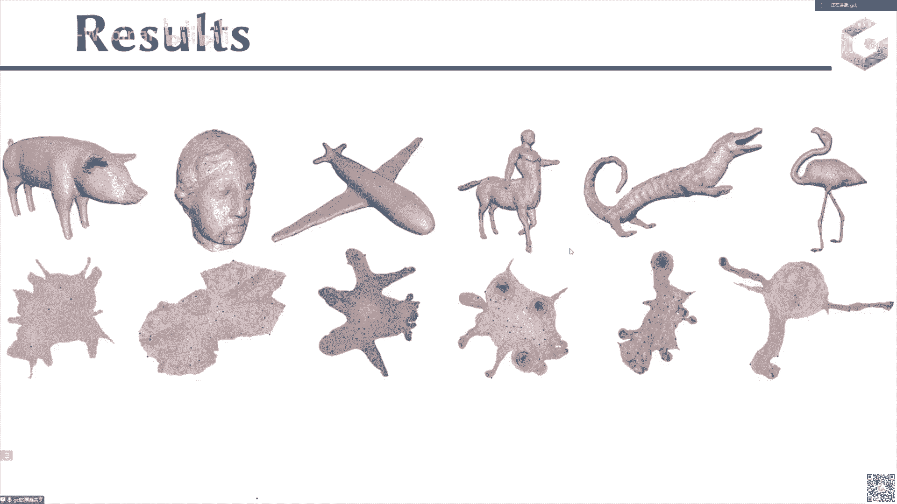

# GAMES301-曲面参数化 - P5：Lecture 05 全局单射参数化方法 🧩

在本节课中，我们将要学习如何计算**全局单射**的参数化结果。全局单射意味着参数化映射在二维平面上是**无重叠、无自交**的，这对于纹理映射等应用至关重要。我们将介绍几种核心方法，并深入探讨其背后的优化策略与挑战。

---

## 概述：什么是全局单射参数化？

之前的内容讲到了无翻转的映射或初始无翻转的参数化，并介绍了许多优化方法。今天我们将进入一个新的主题，讨论更多的约束条件。

在参数化中，约束通常分为几种：无翻转、局部单射和**全局单射**。本节课将介绍计算全局单射映射的方法。

首先，我们来看一个简单的例子。下图展示了两种参数化结果：
*   左边的结果在二维区域存在重叠。
*   右边的结果没有自交或覆盖。


如果为这两种结果贴上棋盘格纹理并映射回原始曲面，会发现：
*   对于左边的参数化，二维平面上的一个红色点会映射到原始网格上的三个不同位置。
*   对于右边的参数化，红色区域只映射到一个位置。

这意味着左边的参数化缺乏一致性，在纹理编辑时，艺术家在二维平面上绘制的颜色会被映射到多个地方，这不是理想的情况。因此，我们需要保证参数化在二维平面上是**无自交、无重叠**的。

---

## 全局单射参数化的计算流程 🔄

计算无重叠参数化最常见的流程如下：

1.  **初始化**：从一个**无翻转**或**无重叠**的初始参数化开始。通常使用 Tutte Embedding 计算，并保证三角形无翻转。
2.  **优化扭曲**：初始参数化的扭曲通常很高。我们需要进行扭曲优化。
3.  **保持约束**：在优化过程中，不仅要保证三角形无翻转 (`flip-free`)，还要保证边界无自交、区域无重叠 (`overlap-free`)。
4.  **迭代求解**：整个过程类似于内点法，在下降方向进行线搜索，并始终满足 `flip-free` 和 `overlap-free` 约束，直到收敛。

如果最终参数化结果同时满足 `flip-free` 和 `overlap-free`，则称之为 **全局单射** 参数化结果。

上节课我们主要讲解了如何保证结果无翻转。本节课将重点介绍如何通过能量设计或算法来保证边界不产生自交或区域不发生重叠。

---

## 方法一：障碍函数法 🚧

最自然的方法是使用**障碍函数**。由于初始状态无自交，我们可以在优化过程中，当接近发生碰撞时，通过障碍函数使能量值变得极大，从而阻止碰撞发生。

我们的目标是设计障碍函数，阻止边界发生自交。在二维情况下，边界是一个多边形，自交总是由两条边界边相交引起。

考虑一个情况：边 `(u1, u2)` 和顶点 `ui`。如果发生自交，意味着 `ui` 穿过了边 `(u1, u2)`。我们不希望发生这种情况，因此需要阻止 `ui` 穿过这条边。

可以设计一个简单的障碍函数：
```math
E_{barrier} = \max(0, \frac{\epsilon}{d} - 1)^2
```
其中 `d` 是点 `ui` 到边 `(u1, u2)` 的距离。
*   当距离 `d > ε` 时，函数值为 `0`。
*   当距离 `d < ε` 时，函数值变为 `(ε/d - 1)^2`。当 `d` 趋近于 `0` 时，能量趋近于无穷大。

这样就能阻止顶点穿过边，从而保证边界无自交。

### 优化问题构建

结合扭曲优化项，完整的优化问题如下：
```math
\min E_{total} = E_{distortion} + \lambda E_{barrier}
```
*   `E_distortion`：防止翻转并降低扭曲的能量项（如对称 Dirichlet 能量）。
*   `E_barrier`：防止边界自交的障碍函数项。

这是一个无约束优化问题，可以使用 L-BFGS 等优化器求解。但使用二阶方法（如牛顿法）在此问题上会遇到一些困难，我们稍后会分析。如果仅使用 L-BFGS，收敛速度可能较慢。

使用障碍函数法后，原本可能自交的边界会被分隔开，从而得到无重叠的结果。

**补充说明**：在三维参数化中，情况更复杂，需要处理边-边相交和点-面穿透两种情况，但核心思想仍是设计合适的障碍函数。

---

## 方法二：脚手架网格法 🏗️

这类方法的思想也非常简单。假设绿色区域是我们的参数化区域，我们希望优化其扭曲，同时保证边界不产生自交且内部无翻转。


我们可以在目标区域（绿色网格 `M`）外部添加一层辅助的三角形网格（灰色网格 `S`，称为 `scaffold` 或脚手架）。将内部网格 `M` 和外部脚手架网格 `S` 视为一个整体网格 `G`。

**关键操作**：固定整体网格 `G` 的外部边界。

只要保证整体网格 `G` 内部的所有元素（三角形）不发生翻转 (`flip-free`)，那么内部网格 `M` 的边界就一定不会自交，区域也不会重叠。这是一个容易证明的性质。

因此，我们将原本需要同时保证 `flip-free` 和 `overlap-free` 的复杂问题，转化为了**只需保证整体网格无翻转**的相对简单的问题。上节课介绍的所有用于无翻转参数化的优化方法都可以直接应用，效率很高。

### 挑战与改进：连接关系更新

然而，在优化过程中，内部网格 `M` 向目标形状变形时，外部的脚手架网格 `S` 会被剧烈拉扯，可能导致其三角形质量严重退化。当三角形退化到一定程度时，进一步优化就会被“锁住”，因为再变形就会导致翻转。


解决方案是进行 **连接关系更新**。即，在每一步优化后，对外部脚手架网格 `S` 进行重新网格化，保证其三角形质量始终良好，从而使优化能够顺利进行。

但这也带来了新问题：网格连接关系的改变意味着优化问题中 Hessian 矩阵的稀疏结构发生变化。在求解下降方向时，每次稀疏结构变化都需要重新进行矩阵的符号分解，这会增加计算开销。

脚手架网格法也可用于多块参数化的拼接，确保各块之间不发生碰撞。

---

## 方法融合与效率优化 ⚡

上述两种方法都存在效率问题：
1.  **障碍函数法**：若使用 L-BFGS，收敛慢；若想用二阶方法，障碍函数导致 Hessian 矩阵处理复杂。
2.  **脚手架网格法**：连接关系更新导致 Hessian 矩阵稀疏结构频繁变化，符号分解开销大。

我们希望 Hessian 矩阵具有**固定的稀疏结构**，这样符号分解只需进行一次，能极大提升求解效率。

### 固定稀疏结构的尝试

对于障碍函数法，其 Hessian 矩阵 `H` 由两部分组成：
```math
H = H_{distortion} + H_{barrier}
```
*   `H_distortion` 的稀疏结构是固定的。
*   `H_barrier` 的稀疏性取决于点-边距离是否小于阈值 `ε`。若考虑所有可能的边界边对，则 `H_barrier` 的稀疏结构是固定的，但密度会非常高（与边界边数量的平方成正比），导致求解依然很慢。

一种思路是：**降低 Hessian 矩阵的密度**。既然密度高源于边界边数量 `B` 多，我们可以构建一个更稀疏的**外层壳**来替代原始密集边界。


在外层添加一个顶点数远少于原始边界的粗糙网格（紫色）。这样，需要处理的边界元素数量从 `B` 降为 `S`（`S << B`），对应的 `H_barrier` 矩阵密度显著降低，同时保持了稀疏结构的固定。实验表明，这种方法能将计算时间降至原来的十分之一左右。

### 构造 C∞ 障碍函数

原始的点-边距离函数在端点处仅是 C¹ 连续的，这不利于二阶优化。我们基于三角不等式提出一个新的 C∞ 距离函数：
```math
d_{new} = ||u_i - u_1|| + ||u_i - u_2|| - ||u_1 - u_2||
```
当且仅当点 `ui` 位于线段 `u1u2` 上时，该距离为零。其等值面是一个椭圆。将此距离函数用于障碍函数，能获得更好的数学性质。

### 应用凸凹分解进行二阶优化

对于新的障碍函数 `E(g) = (ε/g - 1)²`，其中 `g = d_new`，我们可以对其进行凸凹分解。然后，利用上节课介绍的 **Majorization** 方法，可以构造出该函数 Hessian 矩阵的一个凸代理，从而高效、稳定地应用二阶优化器。

通过结合**稀疏外壳**和**C∞障碍函数**，我们得到了一个高效的二阶求解器：稀疏结构固定、矩阵密度低、障碍函数光滑。优化效率得以大幅提升。

---

## 处理顶点位置约束 🎯

在实际应用中（如纹理映射），我们通常希望网格的某些顶点（如眼睛、嘴角）能映射到纹理图片的指定位置。这引入了**顶点位置约束**。

简单地先做一个全局单射参数化，再把约束顶点拖拽到目标位置，可能会在路径上产生“自锁”问题，即顶点无法在不引起翻转或自交的情况下到达目标位置。

### 基于脚手架网格的解决方案

我们可以将带顶点约束的全局单射问题，转化为一个**带翻转的初始化**的无翻转参数化问题。

1.  首先生成一个初始的全局单射参数化（不满足顶点约束）。
2.  为其添加脚手架网格，并固定整体边界。
3.  **强行**将约束顶点移动到目标位置。这必然会导致内部（包括脚手架）出现翻转三角形。
4.  现在，问题变成了：在固定整体边界、且内部存在翻转三角形的条件下，求解一个无翻转的参数化。这正是我们之前学过的问题。
5.  使用上节课的方法（如投影障碍函数法）进行优化，并在优化过程中对质量退化的脚手架网格进行重新网格化（使用边分裂、边塌缩、点重定位等操作），逐步消除翻转。

最终，我们就能得到一个满足顶点位置约束的全局单射参数化结果。

---

## 总结 📚

本节课我们一起学习了**全局单射参数化**的计算方法。

在参数化求解过程中，我们强调边界不应产生自交。为了让边界无自交，通常从一个 Tutte Embedding 结果开始优化扭曲，并在整个过程中保持无自交约束。

我们主要介绍了三类方法：
1.  **障碍函数法**：通过能量函数惩罚边界碰撞。
2.  **脚手架网格法**：通过添加外部辅助网格将问题转化为单纯的无翻转问题。
3.  **融合方法**：结合稀疏外壳和光滑障碍函数，实现了高效稳定的二阶优化。

此外，我们还探讨了如何将**顶点位置约束**融入全局单射参数化的框架中，通过将其转化为带翻转初始化的无翻转问题来求解。


这些方法使得计算高质量、无重叠的参数化结果变得更为高效和实用。



---
*课程内容源自 GAMES-Webinar 讲座《GAMES301-曲面参数化 - P5：Lecture 05 全局单射参数化方法》。*