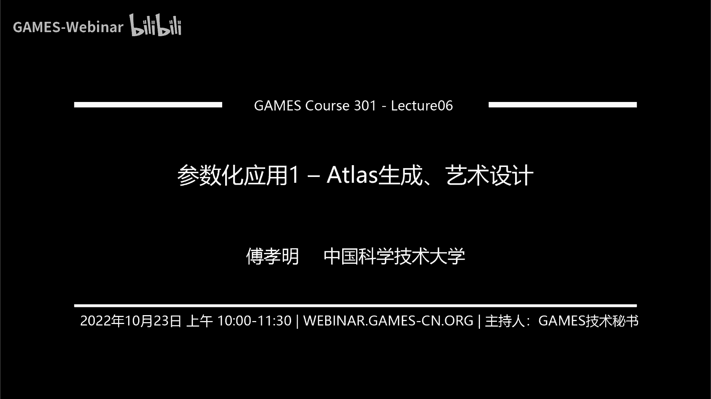
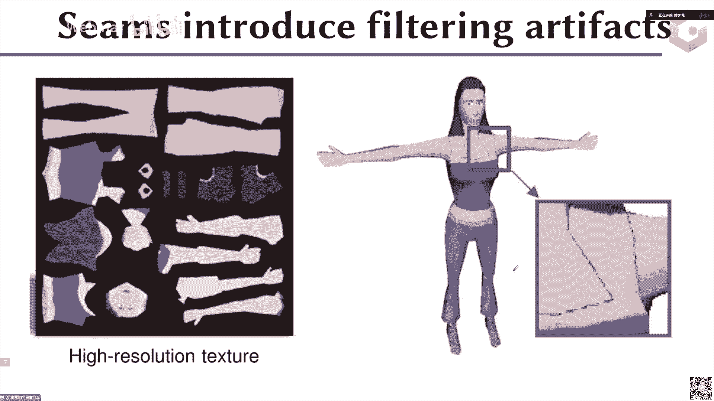
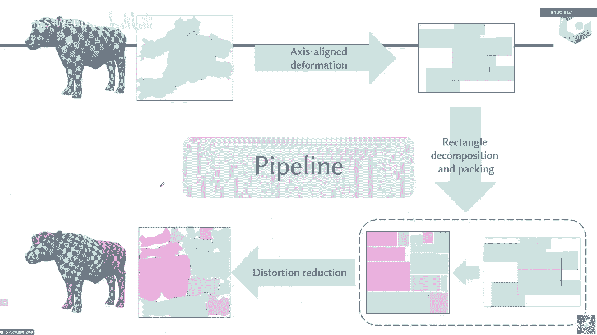
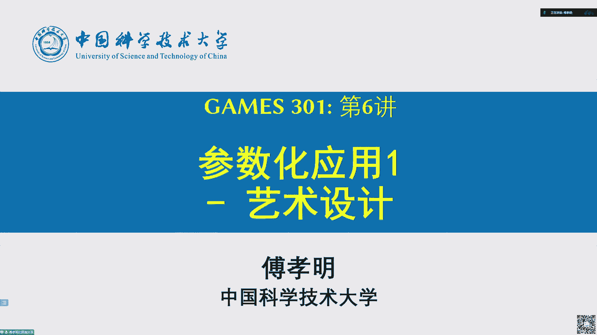
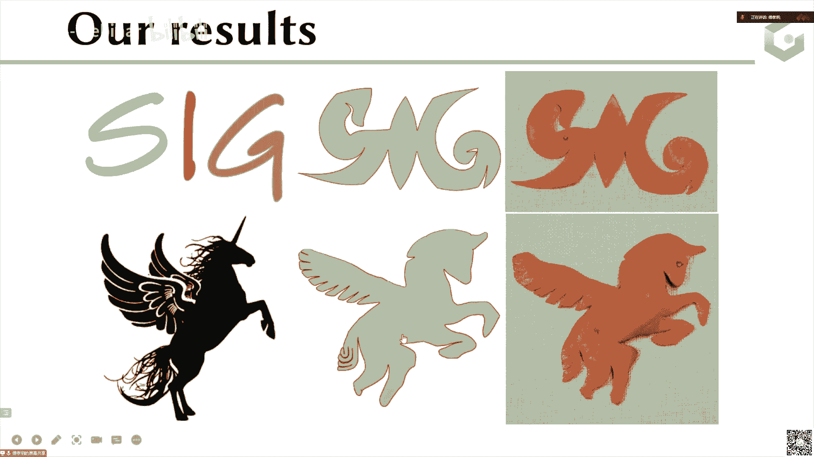
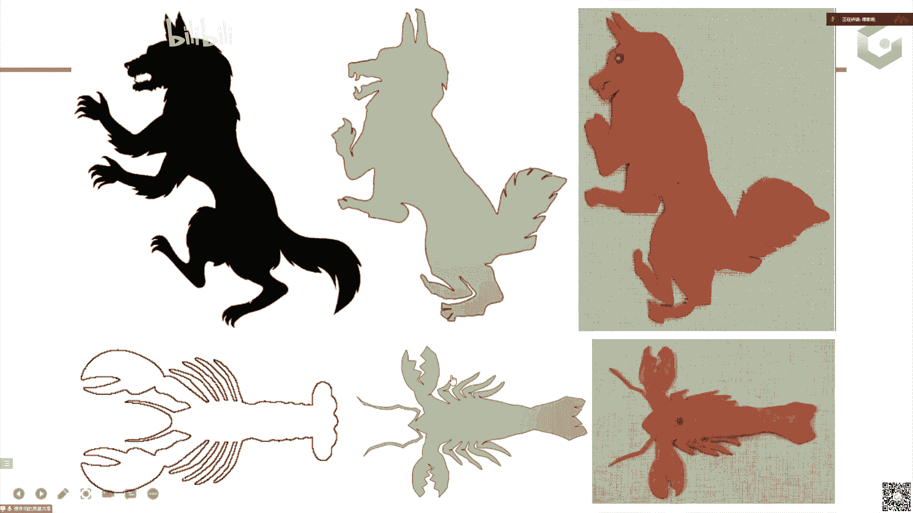
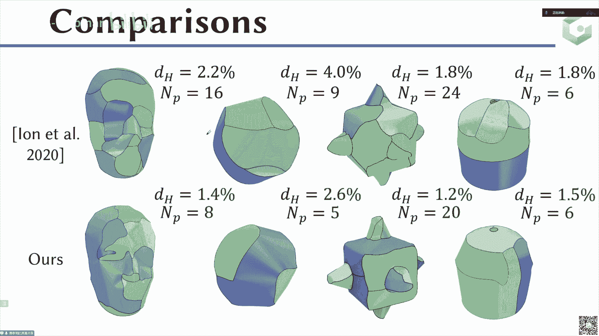

# GAMES301-曲面参数化 - P6：Lecture 06 参数化应用1 – Atlas生成、艺术设计 🗺️🎨

在本节课中，我们将学习曲面参数化的两个重要应用领域：Atlas（纹理图集）的自动生成和艺术设计中的参数化技术。我们将了解如何将三维网格切割、参数化并高效地打包到二维平面上，以及如何利用参数化原理辅助创作橘皮艺术和纸模设计。

---

## Atlas生成：从扫描网格到纹理贴图 🖼️

上一节我们介绍了计算无翻转和全局单射的参数化方法。本节中，我们来看看如何将这些方法应用于实际问题，特别是为三维扫描得到的网格自动生成纹理贴图（Atlas）。

对于通过激光扫描仪等设备获得的三维网格，我们通常希望自动为其生成纹理贴图，而不是完全依赖艺术家手动绘制。纹理贴图是一种将高频细节（如颜色信息）从二维图像映射到三维模型表面的方法。本质上，这是一个从三维模型表面（Model Space）到二维纹理空间（Texture Space）的参数化映射过程。

为了实现纹理映射，我们需要将三维网格“展开”到二维平面上。整个过程通常分为三步：
1.  **网格切割**：在网格表面引入切割线（缝隙），将其分割成多个可展的曲面片。
2.  **参数化**：将每个曲面片映射到二维平面。
3.  **打包**：将所有映射后的二维片紧凑地排列在一个矩形（如正方形）区域内，形成最终的纹理图片。

以下是评估一个Atlas好坏的主要指标：
*   **打包效率**：有效区域面积与整个矩形边界框面积的比值。比值越高，存储图片所需的分辨率越低，节省内存和存储空间。
*   **边界长度**：切割线（缝隙）的总长度。较短的边界可以减少渲染时在接缝处产生瑕疵的可能性。
*   **块数量**：分割后的曲面片总数。通常希望数量较少，以减少片间不连续性和处理复杂度。
*   **扭曲度**：参数化映射过程中产生的几何失真程度。需要尽可能低以保证纹理映射质量。

---

## 网格切割技术 🔪

首先，我们需要将输入的三维网格切割成多个易于参数化的块。切割的目标是使得后续参数化的扭曲度低，并且切割线的总长度尽可能短。

网格切割方法主要分为两类：

### 基于点的切割方法

这类方法首先识别网格上可能导致高扭曲的“关键点”，然后将这些点连接起来形成切割路径。一个典型的启发式方法是交替迭代：
1.  在网格上随机切割一刀。
2.  对切割后的网格进行参数化。
3.  找到参数化结果中扭曲度最高的顶点。
4.  将该点连接到现有切割路径上，形成新的切割。
5.  重复步骤2-4，直到最高扭曲点落在边界上。

找到关键点后，需要将它们连接成最短的切割路径，这可以抽象为在网格图上求解**斯坦纳树问题**，这是一个NP难问题，通常采用近似算法求解。

### 基于分割的切割方法

这类方法直接对网格进行分割，目标是使每一块分割区域都能以低扭曲度参数化到二维平面。一种思路是利用**可展曲面**的特性。例如，圆锥面是可展曲面，可以无扭曲地展开到平面。

一个具体的方法是借鉴**Lloyd迭代**或**K-means聚类**的思想：
1.  随机选择一些三角形作为种子。
2.  为每个聚类定义一个“轴”和一个“角度”（模拟圆锥）。
3.  对于每个三角形，计算其法向与所属聚类轴的夹角，并与目标角度比较，根据误差决定其归属。
4.  根据新的聚类结果，更新每个聚类的轴和角度。
5.  重复迭代，直到收敛，最终每个聚类区域对应一个可展曲面片。

公式上，对于一个三角形*t*，其法向为 **n_t**，所属聚类的轴为 **n_c**，目标角度为 **θ_c**。我们希望最小化误差：
`E = (n_t · n_c - cosθ_c)^2`

---

## 参数化与高效打包 📦

参数化技术我们在之前的课程中已经详细讨论过，核心是获得一个低扭曲、无翻转、无重叠的映射。本节我们重点关注最后的**打包**步骤。

打包效率直接影响最终纹理图片的尺寸。给定一系列形状不规则的二维多边形块，如何将它们无重叠地、紧凑地排列在一个矩形内，本身也是一个NP难问题。

一种改进思路是：**将输入的不规则形状转换为轴对齐的多边形，然后将其分割为矩形，再进行打包**。因为矩形是最容易高效打包的形状。

整个流程如下：
1.  **轴对齐化**：对输入的参数化结果进行变形，使其边界与坐标轴平行。
2.  **矩形分割**：将轴对齐的多边形进一步分割成多个矩形。
3.  **矩形打包**：将这些矩形紧凑地排列到目标矩形框内。
4.  **扭曲优化**：由于第一步的变形可能引入高扭曲，最后使用如**Slit Map**等方法对参数化结果进行优化，降低扭曲度。

通过这种方式，可以在保证低扭曲的同时，显著提高纹理图集的打包效率。

---

## 参数化在艺术设计中的应用：橘皮成型 🍊

接下来，我们探索参数化在一个有趣的艺术形式——橘皮成型中的应用。艺术家在橘子皮上雕刻切割线，展开后能得到各种动物或物体的形状。

从计算角度看，这相当于一个**逆向设计问题**：给定一个目标二维形状，需要在球面（橘子）上寻找一组切割线，使得橘子皮沿这些线切割并展开后，形状与目标尽可能接近。

直接求解此问题（生成切割->展开->比较形状）非常困难。一个更简单的方法是**正向映射**：尝试将目标二维形状映射回球面。如果这个映射能几乎完全覆盖球面，那么映射后目标形状在球面上的边界，就是我们要找的切割线。

我们将其构建为一个优化问题，包含两个目标：
1.  **低扭曲映射**：使用ARAP等能量保证映射质量。
    `E_arap = Σ_t || J_t - R_t ||_F^2`，其中 **J_t** 是雅可比矩阵，**R_t** 是旋转矩阵。
2.  **覆盖球面**：希望映射后，球面上未被覆盖的“空隙”区域面积趋于零。我们设计了一个**秩一能量**来促使这些区域的三角形收缩。
    `E_rank1 = Σ_{t in gap} || J_t - B_t ||_F^2`，其中 **B_t** 是一个秩为1的矩阵（面积为零）。

通过优化，橘皮上的空隙区域逐渐收缩闭合。对于无法完全覆盖的情况，我们提供了交互工具，允许用户对目标形状进行编辑（如拉伸、旋转局部区域），直到其能完美映射覆盖球面。最后，根据映射边界生成切割线图纸，指导实物创作。

---

## 参数化在艺术设计中的应用：纸模设计 📄

另一个应用是辅助**纸模设计**。纸模由多个可展曲面片（纸张）拼接而成，每个曲面片的高斯曲率为零。

我们的目标是：给定一个复杂的三维模型，将其近似为一系列可展曲面片的集合，使得曲面片数量少，且整体形状与原模型相似。

我们的方法分为三步：
1.  **变形**：将输入模型变形为一个“接近可展”的中间模型。我们定义了一种基于**边法向**的可展性约束。对于一条边及其邻域，我们希望其相关法向在高斯映射下共线，这等价于一个矩阵行列式为零的条件。通过优化可展性、形状相似性和低扭曲度，得到中间模型。
2.  **分割**：对接近可展的中间模型进行分割。先进行过分割，然后基于准则合并相邻块，最终得到数量较少的曲面片。
3.  **优化**：对每个曲面片进行优化，使其严格满足可展性（高斯曲率接近零），同时保证边界光滑和形状相似。

通过此流程，我们可以为复杂的三维模型生成易于制造的纸模图纸，用户只需按图裁剪、折叠和粘贴即可。

---

## 总结 📝

本节课我们一起学习了曲面参数化的两个核心应用。
*   在**Atlas生成**中，我们了解了如何为扫描网格自动创建纹理贴图，涉及网格切割、参数化和高效打包三个步骤，并探讨了相关的算法与评估指标。
*   在**艺术设计**中，我们看到了参数化如何赋能传统工艺。通过将橘皮成型抽象为球面参数化问题，以及将纸模设计转化为可展曲面分割问题，参数化技术为这些创意活动提供了强大的计算辅助工具。

这些应用展示了参数化不仅是理论工具，更是连接数字计算与物理世界、艺术创作的重要桥梁。